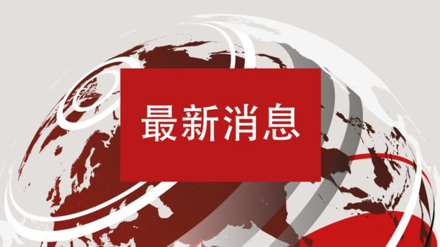

[10月18日 16:30]    纽约时报中文网   @nytchinese    中国经济放缓在很大程度上源于国内。中国一直不愿以放贷的形式向经济注入更多资金，这已经让其金融体系背上了沉重的债务负担。随着消费者信心的减弱，其他领域也出现了疲软，汽车行业就是其中之一。 https://nyti.ms/2VRzLOG   :speech_balloon:评:1 :+1:赞:3 :globe_with_meridians:转:0  

[10月18日 16:01]    BBC News 中文   @bbcchinese    这是北极。 https://bbc.in/35DWnqF   :speech_balloon:评:4 :+1:赞:17 :globe_with_meridians:转:12  

[10月18日 16:00]    纽约时报中文网   @nytchinese    #每日一词 “Princeling”（太子党）在中共政坛有着举足轻重的作用：现今的最高统治者习近平本人即是一位“太子党”；第十八届中央委员会七人常委中至少有两名“太子党”人士；曾经权重一时、而后倒台的薄熙来也是“太子党”的一员。 https://nyti.ms/32qmA9Z   :speech_balloon:评:9 :+1:赞:20 :globe_with_meridians:转:5  

[10月18日 15:42]    新闻大吐槽   @TuCaoFakeNews    富人跑路，中产游街，底层抗命，放在民主国家，政府早就滚蛋了。林婊现在也就支共撑腰、黑警护卫、港奸跟随、黑社会蓝丝打前锋了  :speech_balloon:评:1 :+1:赞:2 :globe_with_meridians:转:1  

[10月18日 15:35]    新闻大吐槽   @TuCaoFakeNews    中环的上班族是香港各领域真正的精英，平时工作压力大家庭责任重，非常的务实和超脱，是不太关心政治的。
        这些人已经自发出来抗义多次了，除了实在看不下去港共的作恶外，对香港前途的深切忧虑是更重要的因素。
        这些人的呐喊是个强烈的信号:
         香港已到临界点。  :speech_balloon:评:1 :+1:赞:16 :globe_with_meridians:转:1  

[10月18日 15:30]    新闻大吐槽   @TuCaoFakeNews    大家一起散步去  :speech_balloon:评:0 :+1:赞:3 :globe_with_meridians:转:1  

[10月18日 15:30]    纽约时报中文网   @nytchinese    中国对两名美国公民的拘留发生在中美两国在贸易及其他问题上的紧张关系加剧之际，不过，中国外交部发言人耿爽周四说，他没有看到两者之间“有什么联系”。
尽管如此，这些拘留可能会加剧在中国旅行和工作的美国人日益增长的不安情绪。 https://nyti.ms/31qRUUW   :speech_balloon:评:5 :+1:赞:12 :globe_with_meridians:转:2  

[10月18日 15:19]    新闻大吐槽   @TuCaoFakeNews    香港人太棒，太給力了  :speech_balloon:评:0 :+1:赞:3 :globe_with_meridians:转:1  

[10月18日 15:18]    新闻大吐槽   @TuCaoFakeNews    @zhanyoutongmeng
@hNeBHUlLJhBbwFH
@Today__China
@RXDSv1EwYcmq0cU
@chenmezhisheng
@TG6UlUmEtXFNRNH
@TuCaoFakeNews
@VOAChinese
@Mrdoorvpn
@goldenp11462989
@CCP_is_devil

紅磡副指揮官鍾雅倫係有美國國籍，幫幫佢留喺大灣區報效祖國
 https://petitions.whitehouse.gov/petition/seize-assets-and-revoke-us-citizenship-vc-hk-hung-hom-police-division-mr-chung-nga-lun …  :speech_balloon:评:3 :+1:赞:3 :globe_with_meridians:转:6  

[10月18日 15:17]    新闻大吐槽   @TuCaoFakeNews    黑警不批准10.20的活动  :speech_balloon:评:1 :+1:赞:3 :globe_with_meridians:转:1  

[10月18日 15:16]    新闻大吐槽   @TuCaoFakeNews    市中心的上班族午休时间再次出动！快闪快退，不耽误下午上班！相信老板们也很支持！

快闪的目地是号召更多人参加10月20日的活动  :speech_balloon:评:6 :+1:赞:155 :globe_with_meridians:转:73  

[10月18日 15:07]    新闻大吐槽   @TuCaoFakeNews    这也太给中国人丢脸了吧...  :speech_balloon:评:0 :+1:赞:1 :globe_with_meridians:转:1  

[10月18日 15:00]    纽约时报中文网   @nytchinese    杜导正：作为赵紫阳的老下级、老朋友，在现在的情况下，不说话纪念他，从良心上是说不过去的。他和我岁数相差不大。我们这辈人，经历得太多了，教训也太多了。最大的教训是，什么时候也不能丢掉独立思考，要坚持实事求是。纪念他，也是纪念我们经历过的那段历史。 https://nyti.ms/35AGSzL   :speech_balloon:评:9 :+1:赞:29 :globe_with_meridians:转:9  

[10月18日 14:37]    财经真相   @caijingxiang    在当前中国经济困境下，当局不会大规模人造牛市拉升股市，原因很简单，股市涨上去容易，跌下来难！大规模剧烈性的股市下跌稍有不慎就会引发连锁反应，危机整个脆弱的金融系统，所以在贸易战彻底未尘埃落定之前，维持股市震荡格局是金融维稳的必然要求！  :speech_balloon:评:6 :+1:赞:54 :globe_with_meridians:转:12  

[10月18日 14:30]    BBC News 中文   @bbcchinese    独家：10月18日下午一时，前中共中央总书记赵紫阳与夫人的骨灰合葬于北京昌平区民间公墓天寿园。 https://bbc.in/2VO8jBE   :speech_balloon:评:21 :+1:赞:165 :globe_with_meridians:转:76  

[10月18日 14:30]    纽约时报中文网   @nytchinese    朝中社周三发布了金正恩的白头山骑马照。由于金正恩曾在做出重大决定前拜访白头山，外界猜测这可能预示着朝鲜对美政策的转变。 https://nyti.ms/2nWNCHc   :speech_balloon:评:14 :+1:赞:15 :globe_with_meridians:转:2  

[10月18日 14:23]    财经真相   @caijingxiang    今天GDP数据公布后市场对未来经济下滑担忧情绪加重，A股午后大幅下跌，前一段时间涨势凌厉的50权重股跌的最猛，我的空仓浮亏已经回血很多，现在股市已经计价完了中美贸易利好消息，任何轻度利空消息都会被用来当成股市回调的原因，根本原因依旧没有改变，3000点附近反复拉锯割韭菜！  :speech_balloon:评:8 :+1:赞:76 :globe_with_meridians:转:22  

[10月18日 14:05]    新闻大吐槽   @TuCaoFakeNews    安排演员，疯狂洗地，但就是不查明真相？  :speech_balloon:评:0 :+1:赞:4 :globe_with_meridians:转:1  

[10月18日 14:04]    老司机   @h5lpykl7tp6jjop    在中国，哪怕有一点点权力的人身边都会有上百个人去帮它当打手，上千个人巴结它，上万个人都不吭气。趋炎附势是它们的生存之道，没有正义，没有真相，只有人情，只有派头，只有威风，
完全是丛林法则猴群社会，几千年如此，历史悠久，根深蒂固！对于人它们只分能惹和不能惹，其余的就是能吃和不能吃！  :speech_balloon:评:2 :+1:赞:55 :globe_with_meridians:转:20  

[10月18日 14:00]    纽约时报中文网   @nytchinese    调查显示，在与中国政治精英的众多联系中，德意志银行在温家宝任中国总理期间与其家族建立了深厚的关系。温家宝本人从德意志银行收到了价值超过15000美元的礼物。但这更关乎温氏家族，涉及他的儿子、女儿和他们的配偶，以及与之亲密的商业伙伴。 https://nyti.ms/2ITnynr   :speech_balloon:评:41 :+1:赞:52 :globe_with_meridians:转:30  

[10月18日 13:30]    纽约时报中文网   @nytchinese    中国公布第三季度GDP数据，数据显示，中国的经济放缓情况进一步恶化，增长速度继续处于近30年来的最低水平。尽管中国的经济增速仍高于其他主要经济体，但周五公布的数据表明，这一增速将处于北京官方目标的低端，这可能加剧人们对全球经济增长前景的担忧。 https://nyti.ms/2VRzLOG   :speech_balloon:评:28 :+1:赞:34 :globe_with_meridians:转:11  

[10月18日 13:00]    BBC News 中文   @bbcchinese    【Solomon Yue：香港示威浪潮中的意外网红】一个共和党人成为了香港示威者间的网红，他自己怎么想呢？（结尾有彩蛋） https://bbc.in/33BD0fO   :speech_balloon:评:6 :+1:赞:39 :globe_with_meridians:转:14  

[10月18日 13:00]    纽约时报中文网   @nytchinese    今日食谱：柠檬蒜香虾，鲜美清爽不油腻。
更多简报内容： https://nyti.ms/35Hvkut   :speech_balloon:评:7 :+1:赞:10 :globe_with_meridians:转:3  

[10月18日 12:58]    新闻大吐槽   @TuCaoFakeNews    当年广场大上访，体制内公开支持的占比也很大  :speech_balloon:评:0 :+1:赞:6 :globe_with_meridians:转:2  

[10月18日 12:45]    新闻大吐槽   @TuCaoFakeNews    这才是真正让中共睡不着的力量，也是新反蒙面法的主体针对对象。  :speech_balloon:评:1 :+1:赞:7 :globe_with_meridians:转:1  

[10月18日 12:43]    新闻大吐槽   @TuCaoFakeNews    Yes, keeping alive it the most important to fight this long term battle.  Keep it up, all HKers!  Be water, be safe! https://twitter.com/TuCaoFakeNews/status/1185051458409943040 …  :speech_balloon:评:0 :+1:赞:23 :globe_with_meridians:转:10  

[10月18日 12:34]    新闻大吐槽   @TuCaoFakeNews    体制内工作的消防员，在下班后变身抗争支持者！即便上司恐吓威胁，还是不改信念！

“我只不过在下班后，去作一些我认为正确，认为应该要做的事！如果我害怕，我怎么对得起前线的小朋友呢？”  :speech_balloon:评:4 :+1:赞:331 :globe_with_meridians:转:173  

[10月18日 12:34]    新闻大吐槽   @TuCaoFakeNews    体制内工作的消防员，在下班后变身抗争支持者！即便上司恐吓威胁，还是不改信念！

“我只不过在下班后，去作一些我认为正确，认为应该要做的事！如果我害怕，我怎么对得起前线的小朋友呢？”  :speech_balloon:评:4 :+1:赞:331 :globe_with_meridians:转:173  

[10月18日 12:30]    纽约时报中文网   @nytchinese    #每日一词 Princeling
时报最近针对德意志银行在华业务的调查报道显示，为了赢取在中国的业务，该银行雇佣了多名高官亲属。
这些“princeling”（太子党）中，包括时任中宣部部长刘云山的儿子、目前在政治局常委中排名靠前的栗战书的小女儿、另一名常委汪洋的女儿汪溪沙等。 https://nyti.ms/32qmA9Z   :speech_balloon:评:38 :+1:赞:204 :globe_with_meridians:转:114  

[10月18日 12:00]    BBC News 中文   @bbcchinese    有中国导演说：“完全主旋律的也不一定可以，你赞美的『姿势』必须非常合适。” https://bbc.in/2oHBFFP   :speech_balloon:评:18 :+1:赞:88 :globe_with_meridians:转:38  

[10月18日 12:00]    纽约时报中文网   @nytchinese    俄罗斯阻止美国官员访问核事故发生地：据报道，三名美国外交官计划前往8月发生核事故的俄罗斯村庄，但在火车上被俄罗斯当局带走。两个月前发生的神秘爆炸事件造成七人死亡，并导致几英里外的辐射水平飙升。
更多简报内容： https://nyti.ms/35Hvkut   :speech_balloon:评:1 :+1:赞:9 :globe_with_meridians:转:8  

[10月18日 11:30]    纽约时报中文网   @nytchinese    中国外交部发言人周四证实，一家英语教学公司的两名美国员工于上月底在江苏被刑拘，他们被指控涉嫌组织他人非法跨越边境。多年来，人们知道一些英语教育公司在签证方面涉足法律灰色地带，当局往往对那些做法视而不见。如今，这种情况发生了改变。 https://nyti.ms/31qRUUW   :speech_balloon:评:82 :+1:赞:150 :globe_with_meridians:转:77  

[10月18日 11:00]    BBC News 中文   @bbcchinese    她在社交媒体发布自己的无上装照片，配上那些来自黑客的威胁信息，并说：“我将这些放出来，现在你没有办法再从我身上得到任何东西。” https://bbc.in/2MO6sZm   :speech_balloon:评:9 :+1:赞:82 :globe_with_meridians:转:17  

[10月18日 11:00]    BBC News 中文   @bbcchinese    激进组织所谓的“伊斯兰国”在伊拉克摩苏尔炸毁奈比尤努斯清真寺，竟意外发现了距今3000年的亚述王朝宫殿。故事从这里开始⋯⋯  :speech_balloon:评:14 :+1:赞:27 :globe_with_meridians:转:12  

[10月18日 11:00]    纽约时报中文网   @nytchinese    • 叙利亚战争按下暂停键：在与土耳其总统会谈后，美国副总统彭斯宣布，土耳其已同意在叙利亚北部停火五天；作为回报，美国将不会对该国实施进一步制裁。
• 加拿大将于周一举行大选，该国现任总理特鲁多获得美国前总统奥巴马背书。这令他在选情中获得助力。
更多简报内容： https://nyti.ms/35Hvkut   :speech_balloon:评:4 :+1:赞:4 :globe_with_meridians:转:3  

[10月18日 10:52]    新闻大吐槽   @TuCaoFakeNews    中共决定对香港禁卖黑色的衣服...

仔细思考其中的逻辑... 难道中共认为人的思想是由其衣服颜色决定的？没有黑衣服穿，香港人的思想就会从反共变成拥共？！

看来香港人真的把中共折磨疯掉了。 https://www.scmp.com/lifestyle/fashion-beauty/article/3033312/china-bans-exports-black-clothing-hong-kong-amid-protests …  :speech_balloon:评:54 :+1:赞:492 :globe_with_meridians:转:159  

[10月18日 10:30]    纽约时报中文网   @nytchinese    #观点 @audreyt：“太阳花运动”以来，数字技术正在推动台湾的公民对话，提高政府透明度和政治开放性。通过让人人都有发言权，台湾正在巩固自己的民主。 https://nyti.ms/2BnzucW   :speech_balloon:评:25 :+1:赞:56 :globe_with_meridians:转:9  

[10月18日 10:28]    新闻大吐槽   @TuCaoFakeNews    打的头破血流，也无法激怒他，他反而更清醒的看到了制度层面的问题，加上呼吁对疑似凶手的南亚人要宽容，岑子杰真是让人刮目相看！  :speech_balloon:评:15 :+1:赞:218 :globe_with_meridians:转:93  

[10月18日 10:22]    新闻大吐槽   @TuCaoFakeNews    NBA总裁肖华：中共曾要求我炒掉莫雷

中共官媒一直在骂肖华双标，因为NBA对种族歧视和性别歧视等言论处罚非常严厉，而中共认为这次莫雷挺港，也是犯了如同种族歧视一般的严重错误，所以肖华应当惩罚莫雷~

NBA保护的是弱者！独裁者装可怜，谁买账？先扔掉你手里的胡罗卜加大棒 https://www.nytimes.com/2019/10/17/sports/basketball/nba-china-adam-silver.html?smtyp=cur&smid=tw-nytimes …  :speech_balloon:评:10 :+1:赞:86 :globe_with_meridians:转:33  

[10月18日 10:04]    财经真相   @caijingxiang    国家统计局：第三季度中国GDP增长6%，低于市场预期的6.1%。这个数据可以说很讲党性！  :speech_balloon:评:31 :+1:赞:181 :globe_with_meridians:转:40  

[10月18日 10:00]    BBC News 中文   @bbcchinese    “其实香港在大陆人眼中，早已没有优势。”她说，“如果不是子女和家人在香港，我不会留在这边。” https://bbc.in/2Mn168p   :speech_balloon:评:109 :+1:赞:87 :globe_with_meridians:转:24  

[10月18日 10:00]    纽约时报中文网   @nytchinese    • 英国和欧盟就脱欧协议草案达成一致，为脱欧扫清一大障碍。英国议会将于周六就该草案进行投票。
• 美国弹劾调查最新进展：特朗普代理幕僚长承认，对乌克兰停止援助部分出于政治原因，特朗普希望以此敦促该国对民主党人展开调查。
更多简报内容： https://nyti.ms/35Hvkut   :speech_balloon:评:2 :+1:赞:9 :globe_with_meridians:转:2  

[10月18日 09:34]    纽约时报中文网   @nytchinese    Why the Protests in Hong Kong May Have No End in Sight. China Detains 2 Americans Amid Growing Scrutiny of Foreigners. Under New Rule, Chinese Diplomats Must Notify State Dept. of Meetings in U.S. A Healthy Fear of China. More translations @nytchinese https://cn.nytimes.com/morning-brief/20191018/hong-kong-beijing-china-detains-us/ …  :speech_balloon:评:3 :+1:赞:11 :globe_with_meridians:转:5  

[10月18日 09:32]    老司机   @h5lpykl7tp6jjop    中国任何一个底层人物的发迹都包含着对权力的献媚 ! 凭借对知识、技能的运用和对规则的尊重是不可能成功的 ! 媒体总会找些底层发迹的暴发户，将他们勤奋刻苦的发迹史放大，隐瞒其与官场的关系，证明当下社会也有“机会" ; 然后再把大部分底层人士归结为他们自己”不努力”，跟社会不公和权力垄断没关系。  :speech_balloon:评:8 :+1:赞:86 :globe_with_meridians:转:52  

[10月18日 09:24]    BBC News 中文   @bbcchinese    “这表明我们人类正在干扰这个系统。改变全球气候对生态系统是非常大的冲击。”火灾生态学家伊格拉说。 https://bbc.in/32pWgNl   :speech_balloon:评:2 :+1:赞:27 :globe_with_meridians:转:10  

[10月18日 09:01]    纽约时报中文网   @nytchinese    早安！今日重点新闻包括：
香港亲中派陷入分歧；中国刑拘两名美国人；美国出台新规限制中国外交官行动；英国和欧盟就脱欧协议草案达成一致；白宫代理幕僚长承认对乌克兰停止援助部分出于政治原因……NYT简报带你速览今日要闻。 https://nyti.ms/35Hvkut   :speech_balloon:评:7 :+1:赞:53 :globe_with_meridians:转:21  

[10月18日 08:39]    BBC News 中文   @bbcchinese    当美国总统特朗普被指“抛弃”库尔德人之时，俄国总统普京却在中东开始了纵横捭阖的外交。中国则继续其“一带一路”。 https://bbc.in/32qrLa7   :speech_balloon:评:25 :+1:赞:78 :globe_with_meridians:转:23  

[10月18日 08:08]    BBC News 中文   @bbcchinese    设计师希望这个人造子宫能给这些早产婴儿更多存活的机会。 https://bbc.in/2MP7ggv   :speech_balloon:评:1 :+1:赞:11 :globe_with_meridians:转:4  

[10月18日 07:55]    新闻大吐槽   @TuCaoFakeNews    这些小粉红，没有思辨能力也就算了，至少有点是非观，没有是非观也就算了，至少有点教养，没有教养也就算了，至少有点羞耻感！
竟然可以在公开场合喊出自己400元嫖娼的丑事~
英语又如此差，“hongkang是china的一部分”，笑死我了，这不是留学生，这是躲藏到美国的二代蛀虫  :speech_balloon:评:153 :+1:赞:884 :globe_with_meridians:转:353  

[10月18日 07:45]    BBC News 中文   @bbcchinese    约翰逊还说，他对议会本周通过这一协议感到“很有信心”。 https://bbc.in/2MOCcxE   :speech_balloon:评:5 :+1:赞:29 :globe_with_meridians:转:9  

[10月18日 07:31]    财经真相   @caijingxiang    在这种背景中共讨论发行深圳特区币，准备让深圳地区只许“深圳币”流通，但是该方案遭到中资于香港的企业银行代强烈表反对，最终作罢！1985年11月，深圳成立了中国第一家外汇调剂中心，开始尝试放开外汇官方管制，随着外汇调剂在全国铺展开来，港币在中国扩张步伐才得到遏制，港元的流通比率也逐年下降。  :speech_balloon:评:3 :+1:赞:52 :globe_with_meridians:转:8  

[10月18日 07:24]    财经真相   @caijingxiang    由于使用港元可在深圳买到很多用人民币买不到的商品，又可以到香港沙头角边界购买各种名贵货物，因此港元在深圳备受青睐，人民币和外汇券则受到排挤。当时的黑市兑汇市场，最高可以100港元兑换55元人民币，较外汇牌价高出19.6元。港币对人民币形成“优币驱逐劣币”现象，中共害怕港币流行危机货币发行权  :speech_balloon:评:3 :+1:赞:69 :globe_with_meridians:转:13  

[10月18日 07:22]    财经真相   @caijingxiang    深圳币是深圳特区刚成立时官方拟发行的一种货币，由于当时香港商品不断流入深圳，香港人到深圳消费以至购买房产等皆多用港元，到深圳投资的港商亦多以港元发工资，深圳流通的港元随之不断增加，形成深圳同时有人民币、外汇券、港元三种货币流通的情况。  :speech_balloon:评:6 :+1:赞:116 :globe_with_meridians:转:38  

[10月18日 06:33]    BBC News 中文   @bbcchinese    太神奇了…… https://bbc.in/2qnsydK   :speech_balloon:评:4 :+1:赞:19 :globe_with_meridians:转:3  

[10月18日 05:38]    老司机   @h5lpykl7tp6jjop    难怪香港警察这次出奇地配合共畜
原来共畜特别为他们以及即将退休的香港警察打造了
「雅居樂肇慶香港城」
第一期将于2020年落成
在如此高房价的香港，确实是一笔大钱

#反共 #反习 #中国变天 #口罩革命 #临时反共联合政府  :speech_balloon:评:5 :+1:赞:39 :globe_with_meridians:转:30  

[10月18日 02:32]    墙国铁拳现世报😷   @Socialistfist    “乐天滚粗中..........哎..警察同志您轻点”

#社会主义铁拳  :speech_balloon:评:33 :+1:赞:296 :globe_with_meridians:转:104  

[10月18日 02:32]    新闻大吐槽   @TuCaoFakeNews    “乐天滚粗中..........哎..警察同志您轻点”

#社会主义铁拳  :speech_balloon:评:33 :+1:赞:296 :globe_with_meridians:转:104  

[10月17日 23:42]    老司机   @h5lpykl7tp6jjop    Wts the purpose of kept on attacking the protester’s head instead of  arm/feet since he was caught already?
Can’t agree police are still following guideline during operation. I tell u, carrie lam, that’s why 6th demand rises up #disbandHKPolice #hkpolicebrutality #hkprotest  :speech_balloon:评:150 :+1:赞:1670 :globe_with_meridians:转:1790  

[10月17日 22:35]    财经真相   @caijingxiang    中国海关通知，最新香港（头盔、雨伞、迷彩服、消毒水）四类敏感产品，如要报关退税，暂时不接！  :speech_balloon:评:15 :+1:赞:206 :globe_with_meridians:转:110  

[10月17日 21:00]    凡賽堤/FORSETI   @FecharCCP    極權殺人恐怖組織已經開始展開對海外的自媒體誘捕計劃！！！
以合作發展，收購，投資為誘餌，實則釣魚，騙取你的個人資料，實行威逼利誘！為他們傳播假信息，假圖片和視頻！ 接下來將會有巨量的假信息，假圖片和視頻出現在網絡！

目的！故意製造黑警被打死，打傷等來掩蓋真相！污衊文明正義的港人！ https://twitter.com/FecharCCP/status/1184815328418783234 …  :speech_balloon:评:0 :+1:赞:6 :globe_with_meridians:转:4  

[10月17日 21:00]    纽约时报中文网   @nytchinese    杜导正：赵紫阳和我的交往：痛定思痛，改弦更张 https://nyti.ms/35AGSzL   :speech_balloon:评:3 :+1:赞:41 :globe_with_meridians:转:16  

[10月17日 20:56]    凡賽堤/FORSETI   @FecharCCP    香港街面的黑警90%都是大陸來的黑警，真正的香港警察的警服，警徽，裝備已經都被上繳！！！

現職警長梁兆祥編號33678，曾獲長期服務奬章，種種跡象，有理由相信日前被年輕人弄傷頸部的「中國籍男子」X並非梁兆祥本人 。  :speech_balloon:评:1 :+1:赞:35 :globe_with_meridians:转:33  

[10月17日 20:46]    凡賽堤/FORSETI   @FecharCCP    極權殺人恐怖組織已經開始展開對海外的自媒體誘捕計劃！！！

以合作發展，收購，投資為誘餌，實則釣魚，騙取你的個人資料，實行威逼利誘！

和極權殺人恐怖組織合作最終的下場就是死無葬身之地！！！ 他們永遠與良知，正義為敵！ https://twitter.com/FecharCCP/status/1184799556246085632 …  :speech_balloon:评:1 :+1:赞:1 :globe_with_meridians:转:2  

[10月17日 20:30]    纽约时报中文网   @nytchinese    尽管特朗普提出了11月中旬在全球领导人峰会上与习近平签署协议的想法，但协议尚未敲定，分析人士称，仍有很多情况可以让这份脆弱的协议崩溃，就像5月所发生的那样。 https://nyti.ms/35JVWuL   :speech_balloon:评:6 :+1:赞:19 :globe_with_meridians:转:4  

[10月17日 20:15]    凡賽堤/FORSETI   @FecharCCP    畫面內容
记者：为何不抗争，就失去一切？
黎智英：失去自由就失去一切。
记者：还有美妙的城市和繁荣。
黎智英：那适合某些“国人”，有躯壳无灵魂，只想赚钱和“好”的生活，不管政治、自由、人权、法治，只要吃，“享受”人生。
记者：为何这些不足够？
黎智英：我们是人，不是狗。  :speech_balloon:评:3 :+1:赞:57 :globe_with_meridians:转:19  

[10月17日 20:14]    财经真相   @caijingxiang    商务部：在回答中美经贸磋商相关问题时，新闻发言人高峰介绍，目前，中美双方正在加紧磋商，争取就协议文本进行落实。高峰强调，中方始终认为，合作是两国最好选择，也是解决问题的唯一正确选择，双方取得阶段性成果，有利于消除不确定性，恢复市场信心，对于稳定全球经济形势具有非常重要的意义。  :speech_balloon:评:8 :+1:赞:66 :globe_with_meridians:转:13  

[10月17日 20:03]    凡賽堤/FORSETI   @FecharCCP    極權殺人恐怖組織正在用各種兇殘手段殺害我們的同胞....................................................................................................

注！ 極權殺人恐怖組織用邪惡手段試圖殺害岑子傑！  :speech_balloon:评:0 :+1:赞:5 :globe_with_meridians:转:2  

[10月17日 20:00]    BBC News 中文   @bbcchinese    【Solomon Yue：香港示威浪潮中的意外网红】一个共和党人成为了香港示威者间的网红，他自己怎么想呢？（结尾有彩蛋） https://bbc.in/2OUhYFp   :speech_balloon:评:13 :+1:赞:53 :globe_with_meridians:转:13  

[10月17日 20:00]    纽约时报中文网   @nytchinese    金正恩从不缺明显摆拍的宣传照，但如今，他加入了“马背上的世界领导人”的行列。
周三，朝鲜官方新闻机构发布了金正恩骑在马上的照片。照片中，骑着白色骏马穿过白雪覆盖的田野，在尘土飞扬的树林间疾驰，朝鲜官方媒体称，金正恩的眼里“充满高贵的光辉”。 https://nyti.ms/2nWNCHc   :speech_balloon:评:59 :+1:赞:64 :globe_with_meridians:转:13  

[10月17日 19:53]    凡賽堤/FORSETI   @FecharCCP    出現的CCTV裡，在電梯，和各個場面的假陳彥霖演員。
扮陳彥霖故意錄製網絡傳播！

目的！串改時間點，混謠試聽，毀滅殺人證據！
 
極權殺人恐怖組織的恐怖只有你想不到，沒有它們做不到的！

要消除我們內心恐懼就要消滅極權！
 
消滅極權，人人有責！！！  :speech_balloon:评:2 :+1:赞:35 :globe_with_meridians:转:27  

[10月17日 19:30]    BBC News 中文   @bbcchinese    “请问这张地图上为什么没有出现中国台湾？”这个问题，涉事迪奥员工的回答“越描越黑”。 https://bbc.in/32nR38L   :speech_balloon:评:48 :+1:赞:67 :globe_with_meridians:转:23  

[10月17日 19:30]    纽约时报中文网   @nytchinese    美国国务院官员表示，此次限制中国外交官的一个目的，是让中国放宽对美国外交官行动的限制。据表示，美国外交官通常需要获得北京中方官员的许可，才能前往各省参加官方会议或访问机构。该官员表示，称美国曾就这些规定向中国政府申诉过，但毫无效果。 https://nyti.ms/2qj4Oax   :speech_balloon:评:19 :+1:赞:136 :globe_with_meridians:转:40  

[10月17日 19:23]    凡賽堤/FORSETI   @FecharCCP    極權殺人恐怖組織把大陸的武警，公安偽裝成香港警察在香港濫殺，濫爆，濫捕！未來將會出現千千萬萬的岑子傑！
香港是不屈之城，正義之城！  :speech_balloon:评:16 :+1:赞:75 :globe_with_meridians:转:37  

[10月17日 19:07]    BBC News 中文   @bbcchinese    中国数以万计的记者将参加一场全国性的在线考试，以测试他们对党的政策及主席习近平的忠诚度。 https://bbc.in/2VNWZp7   :speech_balloon:评:214 :+1:赞:833 :globe_with_meridians:转:465  

[10月17日 19:04]    凡賽堤/FORSETI   @FecharCCP    一個極權流氓政府花納稅人的錢來圈養300萬殭屍死士在網路世界張牙舞爪恐嚇納稅人，威脅全人類！
他們都是活死人，他們的任務就是到處瘋咬！所以建議看到這場面，不必理會，因為他們只是魔鬼圈養的殭屍死士，說白了，就是活死人！！！！！5M  消滅極權，人人有責！  :speech_balloon:评:0 :+1:赞:8 :globe_with_meridians:转:3  

[10月17日 18:11]    BBC News 中文   @bbcchinese    这张在中国祁连山上拍到的照片看起来可能类似“搞笑对白”，但实际是一只狐狸向土拨鼠发动攻击的生死瞬间。中国摄影师鲍永清为了拍摄这张照片，在青藏高原上躲藏盯梢好几个小时，凭此在2019年度野生动物摄影师大赛获胜。 https://bbc.in/2nWhN1a   :speech_balloon:评:13 :+1:赞:200 :globe_with_meridians:转:65  

[10月17日 18:08]    墙国铁拳现世报😷   @Socialistfist     http://t.me/VoiceofPooh   :speech_balloon:评:0 :+1:赞:32 :globe_with_meridians:转:4  

[10月17日 18:06]    墙国铁拳现世报😷   @Socialistfist    本推由好友 维尼之声编辑部投稿
@VoiceofPooh
欢迎关注每日优质键政咨询  :speech_balloon:评:1 :+1:赞:47 :globe_with_meridians:转:0  

[10月17日 18:00]    墙国铁拳现世报😷   @Socialistfist    好玩的铁拳02 申请加你为好友！

#社会主义铁拳  :speech_balloon:评:33 :+1:赞:300 :globe_with_meridians:转:69  

[10月17日 18:00]    新闻大吐槽   @TuCaoFakeNews    好玩的铁拳02 申请加你为好友！

#社会主义铁拳  :speech_balloon:评:33 :+1:赞:300 :globe_with_meridians:转:69  

[10月17日 17:53]    BBC News 中文   @bbcchinese    欧盟峰会在即，英国首相约翰逊表示，英国与欧盟就脱欧协议达成一致。
 https://bbc.in/2VOq8At   :speech_balloon:评:16 :+1:赞:46 :globe_with_meridians:转:18  

[10月17日 17:23]    墙国铁拳现世报😷   @Socialistfist    后续 和 总结
1.大仙女在国内算是中产，满足现状
2  关心社会问题（云南，邻居强拆,李心草）
3. 强拆的是菜市场摊位且是邻居。 评论群里洗地说是违章建筑可以看看截图  :speech_balloon:评:23 :+1:赞:37 :globe_with_meridians:转:5  

[10月17日 17:01]    老司机   @h5lpykl7tp6jjop    你想了解早期的中共，就去参加传销组织，人人被灌入远大理想的目标，艰苦朴素被囚禁的生活，神秘单线联系的上级领导。中期的中共就象朝鲜，半饥半饱却斗志昂扬要解放全人类！最近的中共就象大清末年，一边搞洋务运动一边坚持中国特色一边抓乱党！  :speech_balloon:评:10 :+1:赞:306 :globe_with_meridians:转:104  

[10月17日 17:01]    BBC News 中文   @bbcchinese    美国国务院高级官员表示，中国外交官参加会议不需获得批准，只需要提前通知美国国务院。而在美国的中国外交官需要获得中方批准，并且经常被拒绝。 https://bbc.in/2MmayZF   :speech_balloon:评:40 :+1:赞:164 :globe_with_meridians:转:43  

[10月17日 16:11]    老司机   @h5lpykl7tp6jjop    香港民主派议员陈志全大骂建制派议员，要求建制派主席下岗，骂的好！  :speech_balloon:评:35 :+1:赞:692 :globe_with_meridians:转:276  

[10月17日 16:00]    BBC News 中文   @bbcchinese    鲍彤曾对BBC中文记者说，民间自发纪念赵紫阳的活动，不应被视为非法行为。 https://bbc.in/2BkNDYx   :speech_balloon:评:23 :+1:赞:50 :globe_with_meridians:转:12  

[10月17日 15:00]    BBC News 中文   @bbcchinese    今日是中共前总书记赵紫阳100岁冥寿。他曾承诺“民主治港”，然而他无法目睹香港今天的局面。 https://bbc.in/31nGwcq   :speech_balloon:评:46 :+1:赞:152 :globe_with_meridians:转:41  

[10月17日 13:33]    财经真相   @caijingxiang    针对10月16日DIOR迪奥人事部员工在校园宣讲会的PPT中播放错误地图事件，DIOR今天（17日）凌晨2时许在官方微博发布声明称，公司深表歉意，这是一个不代表公司立场的员工个人失当行为，已着手认真调查，并承诺予以严肃处理。声明还称，DIOR始终尊重并维护一个中国的原则，严格维护中国的主权及领土完整  :speech_balloon:评:12 :+1:赞:85 :globe_with_meridians:转:39  

[10月17日 11:27]    财经真相   @caijingxiang    学习小组就是放风的，下周是大概率！ https://twitter.com/caolei1/status/1184670260869267458 …  :speech_balloon:评:18 :+1:赞:82 :globe_with_meridians:转:15  

[10月17日 11:23]    财经真相   @caijingxiang    我想赚RMB！
很好，跪下！ https://twitter.com/cusonlo/status/1184468378724925441 …  :speech_balloon:评:18 :+1:赞:745 :globe_with_meridians:转:259  

[10月17日 11:09]    凡賽堤/FORSETI   @FecharCCP    同意回复！一個政府花納稅人的錢來圈養300萬殭屍死士在網路世界張牙舞爪恐嚇納稅人，威脅全人類！確實了不起！
他們都是活死人，他們的任務就是到處瘋咬！所以建議看到這場面，不必理會，因為他們只是魔鬼圈養的殭屍死士，說白了，就是活死人！！！！！5M  :speech_balloon:评:1 :+1:赞:6 :globe_with_meridians:转:1  

[10月17日 10:48]    老司机   @h5lpykl7tp6jjop      :speech_balloon:评:0 :+1:赞:2 :globe_with_meridians:转:0  

[10月17日 09:05]    老司机   @h5lpykl7tp6jjop    来，晒晒工资吧！
到底人家把自己的工资晒出来了，
你们呢？敢拿出来晒的是什么？  :speech_balloon:评:8 :+1:赞:22 :globe_with_meridians:转:16  

[10月17日 05:09]    老司机   @h5lpykl7tp6jjop    丧失主权不一定是恶果，清朝海关自从聘请洋人赫德管理后成为唯一清廉的政府部门，而获得主权南非从非洲钻石变成石头！  :speech_balloon:评:3 :+1:赞:44 :globe_with_meridians:转:14  

[10月17日 04:55]    老司机   @h5lpykl7tp6jjop    香港建制派，從屬中聯辦而不是香港人，無民意，一半人零票當選立法會議員，卻能把持香港立法會，整天黑白顛倒，完全服從中聯辦，在香港天怨人怒。這種虛假民主、一國兩制的獨裁造就今天的光復香港時代革命運動。泛民議員陳淑莊在立法會揭穿建制派的醜惡面目，建制派逃出議會廳  :speech_balloon:评:21 :+1:赞:751 :globe_with_meridians:转:347  

[10月17日 00:19]    老司机   @h5lpykl7tp6jjop    把饮水倒掉看着是小事，但说明这些黑警是仇恨抗议，仇恨抗议者，甚至仇恨市民和记者的。他们与警察维持秩序的职能毫不相干，他们是时刻想着破坏与抗议者相关的人和事的。 https://twitter.com/GtW4e/status/1184369269070393344 …  :speech_balloon:评:4 :+1:赞:123 :globe_with_meridians:转:72  

[10月17日 00:03]    墙国铁拳现世报😷   @Socialistfist    推友提供的与当事人私信  :speech_balloon:评:22 :+1:赞:144 :globe_with_meridians:转:21  

[10月16日 23:14]    老司机   @h5lpykl7tp6jjop    不知哪里冒出来的一群衣冠不整其貌不扬的土匪兵：共匪占领军里的杂牌军，土鳖警长。大家看看，他们象不象穿上港警服的城管。  :speech_balloon:评:24 :+1:赞:187 :globe_with_meridians:转:132  

[10月16日 22:05]    财经真相   @caijingxiang    香港的秘密，中共两股力量在香港！  :speech_balloon:评:55 :+1:赞:621 :globe_with_meridians:转:328  

[10月16日 21:26]    老司机   @h5lpykl7tp6jjop    中國共產黨  :speech_balloon:评:295 :+1:赞:967 :globe_with_meridians:转:870  

[10月16日 21:19]    老司机   @h5lpykl7tp6jjop    警察竟踩到犯罪现场的血迹！太不专业，看来警察把精力都用在研究如何犯罪上了，业务能力肯定就荒废了！

血迹是民间人权阵线召集人岑子杰留下的，在晚七点左右，他在这里被一群人殴打！

殴打岑子杰的人必然是亲共者，或直接受中共指使的人，警察肯定不敢查  :speech_balloon:评:31 :+1:赞:489 :globe_with_meridians:转:241  

[10月16日 20:37]    老司机   @h5lpykl7tp6jjop    You FUCKING moron. 
Are you fucking kidding us @hkpoliceforce ??? Is that your professionally trained officers ???  :speech_balloon:评:288 :+1:赞:2858 :globe_with_meridians:转:2392  

[10月16日 20:20]    老司机   @h5lpykl7tp6jjop    民间人权阵线召集人岑子杰10月16日晚在九龙旺角遇袭，伤势严重被送医。行凶者是4名蒙面人。此前，岑子杰曾与友人在旺角吃午饭遇袭，友人为保护他受伤。  :speech_balloon:评:177 :+1:赞:1077 :globe_with_meridians:转:598  

[10月16日 18:30]    凡賽堤/FORSETI   @FecharCCP    極權殺人恐怖組織正在用各種兇殘手段殺害我們的同胞..........

拯救港人，拯救華族，勢在必行！！！！！！！！

極權不滅全人類人人遭殃！！！ https://twitter.com/FecharCCP/status/1183188604132188161 …  :speech_balloon:评:0 :+1:赞:18 :globe_with_meridians:转:13  

[10月16日 18:25]    凡賽堤/FORSETI   @FecharCCP    何韻詩！黎智英！香港人的英雄，華人的驕傲！華人良知與正義的代表！幾個月來永不放棄，傳播香港事實真相，全世界遊說！有力促進美國國會全面通過（香港人權與民主法案）貢獻人物名單之一！
支持香港蘋果日報，壹新聞，大紀元！  :speech_balloon:评:48 :+1:赞:491 :globe_with_meridians:转:171  

[10月16日 18:16]    墙国铁拳现世报😷   @Socialistfist    你们这些护旗手动机不纯，小编很愤慨  :speech_balloon:评:36 :+1:赞:586 :globe_with_meridians:转:85  

[10月16日 17:56]    老司机   @h5lpykl7tp6jjop    女子穿霖霖件衫褲，扮她在校內赤腳走，因為穿不了對鞋！霖霖在校內10樓遇害!  :speech_balloon:评:28 :+1:赞:442 :globe_with_meridians:转:298  

[10月16日 17:44]    墙国铁拳现世报😷   @Socialistfist    你们以为 #社会主义铁拳  只是一个比喻？  :speech_balloon:评:206 :+1:赞:1000 :globe_with_meridians:转:353  

[10月16日 16:59]    老司机   @h5lpykl7tp6jjop    有人说，你把中国从古至今说得一团漆黑，中国没有一个好的年代一个好的地区吗？我说有啊，民国时期的租界！经济繁荣，交通便利，秩序良好，有能力都往那里去，又不要签证，连共产党开会都去那里。
可是那里不是中国人在管理！
和中国人讨论问题麻烦就在这儿，一个问题总会变成另外一个问题！  :speech_balloon:评:11 :+1:赞:298 :globe_with_meridians:转:69  

[10月16日 16:26]    老司机   @h5lpykl7tp6jjop    【陳彥霖】
可能這個白箱裝的就是彥霖妹妹

以下是推測：
「16最後一面」
「16/17被抓」
「17將軍澳狗屋女子慘叫」
「17/18白箱棄屍」
「19偽造陳彥霖在世證據」（內附影片）

疑雲重重！
個人認為：只陳彥霖一案，就足以需要成立獨立調查委員會。  :speech_balloon:评:23 :+1:赞:494 :globe_with_meridians:转:395  

[10月16日 13:31]    新闻大吐槽   @TuCaoFakeNews    一位餐厅老板支持抗争者，给抗争学生提供免费餐饮，可一个支持北京的大妈也带着女儿来蹭饭，吃饭时口中还出言不逊，老板怒了，把她们请了出去！

但大妈和女儿还是蹭饭成功，只因老板希望她赶紧离开，饭钱都不要了。

亲共者的见利忘义在轻财重义的老板面前，显得如此龌龊  :speech_balloon:评:144 :+1:赞:1869 :globe_with_meridians:转:722  

[10月16日 10:09]    财经真相   @caijingxiang    根据克尔瑞的报告，9月份95家典型房企的融资总额为1124.48亿，环比上升45.3%，同比上升17.2%。融资成本也再上台阶，今年前三季度，房企债券类融资成本6.88%，较2018年全年上升了0.67个百分点。截至10月8日，年内房企美元融资533.6亿美元，同比上涨50%。虽然各种政策收紧，但房企美元融资仍刷新历史纪录  :speech_balloon:评:11 :+1:赞:111 :globe_with_meridians:转:29  

[10月16日 09:55]    财经真相   @caijingxiang    受到放开外资保险和银行条例消息的刺激，今天中国保险和银行板块大涨，这是一个很有意思的现象，正常情况下放开外资进来，这会对国内的这些企业构成竞争压力，但是今天他们的股票却大涨，这里面的逻辑是什么？  :speech_balloon:评:120 :+1:赞:279 :globe_with_meridians:转:84  

[10月16日 09:47]    财经真相   @caijingxiang    中国外交部：我们对美国国会众议院执意通过所谓“香港人权与民主法案”表示强烈愤慨和坚决反对。香港是中国的香港，香港事务纯属中国内政，不容任何外部势力干预。我们奉劝美方认清形势，悬崖勒马，立即停止推动审议有关涉港法案，立即停止插手香港事务、干涉中国内政。  :speech_balloon:评:96 :+1:赞:295 :globe_with_meridians:转:124  

[10月16日 09:38]    财经真相   @caijingxiang    受中国扬言报复美国通过的《香港人权法案》消息刺激，a股开盘后，离岸人民币扩大跌幅，跌破7.1关口！  :speech_balloon:评:21 :+1:赞:382 :globe_with_meridians:转:85  

[10月16日 00:18]    墙国铁拳现世报😷   @Socialistfist    万fo新头像  :speech_balloon:评:29 :+1:赞:272 :globe_with_meridians:转:12  

[10月15日 23:03]    墙国铁拳现世报😷   @Socialistfist    新浪微博先关了评论区，后删除了该条微博。
本报不赞成任何形式网络暴力，也希望不要用你们的热情去唤醒楚门的世界。请大家让他做一个普通中国人  :speech_balloon:评:34 :+1:赞:245 :globe_with_meridians:转:41  

[10月15日 22:31]    凡賽堤/FORSETI   @FecharCCP    我們都是陳彥琳。一個15歲的小妹妹。極權卻對她如此殘忍。
願妳早日沉冤得雪
We are all Chan Yin Lam, a aged 15 kid in HK, who was slaughtered by the tyranny.  :speech_balloon:评:5 :+1:赞:162 :globe_with_meridians:转:114  

[10月15日 19:34]    墙国铁拳现世报😷   @Socialistfist    补充  :speech_balloon:评:11 :+1:赞:155 :globe_with_meridians:转:28  

[10月15日 19:32]    墙国铁拳现世报😷   @Socialistfist    大仙女：请出动我们的部队
当地拆迁办： 好的

#社会主义铁拳  :speech_balloon:评:131 :+1:赞:1141 :globe_with_meridians:转:332  

[10月15日 19:17]    财经真相   @caijingxiang    也就是即使川普连任，也等不到中国邮费上涨的时刻？对吗？ https://twitter.com/voacantonese/status/1184064898478665730 …  :speech_balloon:评:9 :+1:赞:89 :globe_with_meridians:转:20  

[10月15日 19:14]    财经真相   @caijingxiang    美国的人权法案为啥这么慢？ https://twitter.com/hongkon84458416/status/1183900371602825218 …  :speech_balloon:评:21 :+1:赞:110 :globe_with_meridians:转:27  

[10月15日 16:53]    墙国铁拳现世报😷   @Socialistfist    我去，微博上有多少潜伏的推友  :speech_balloon:评:18 :+1:赞:160 :globe_with_meridians:转:17  

[10月15日 15:15]    财经真相   @caijingxiang    加入WTO时的承诺今天在贸易战和华尔街敲诈下，今天终于开始有点放松了，但是中国老百姓想把钱存进外资银行依然存在门槛，每笔最低不少于50万人民币的定期存钱，至于外汇要继续控制！  :speech_balloon:评:36 :+1:赞:301 :globe_with_meridians:转:71  

[10月15日 15:08]    财经真相   @caijingxiang    重磅！国务院关于修改〈中华人民共和国外资保险公司管理条例〉和〈中华人民共和国外资银行管理条例〉的决定，外国银行可以在中华人民共和国境内同时设立外商独资银行和外国银行分行，或者同时设立中外合资银行和外国银行分行。外国银行分行可以吸收中国境内公民每笔不少于50万元人民币的定期存款。  :speech_balloon:评:93 :+1:赞:441 :globe_with_meridians:转:224  

[10月15日 13:43]    老司机   @h5lpykl7tp6jjop    二百万人上街反抗被说成暴徒，他们暴在哪里？打死警察啦？打残警察啦？而警方做了什么呢！一天发射催泪弹1400发，使用布袋弹、橡皮子弹、空爆催泪弹，共匪占领军铁膝疯狂滥捕示威者，重手暴打不死即伤，派大量黑警假扮示威者，纵火打人，专门捕抓少女，他们才是暴徒。

香港人民有自己认同，绝不屈服。  :speech_balloon:评:64 :+1:赞:1090 :globe_with_meridians:转:529  

[10月15日 08:49]    凡賽堤/FORSETI   @FecharCCP    希望陳彥霖家屬決不能放棄，任何金錢都無法和一個活生生的生命兌換！拿起法律武器！極權殺人恐怖組織殺害太多香港人，他們正在製造任何被害的正常死亡假象和消滅所有證據！極權殺人恐怖組織的恐怖只有人想不到的，沒有他們做不到！！！！！！！！  :speech_balloon:评:0 :+1:赞:1 :globe_with_meridians:转:0  

[10月15日 08:44]    凡賽堤/FORSETI   @FecharCCP    這是15歲游泳健將陳彥霖小女孩被殺害前出來逛街的自拍視頻！她還在自我解嘲穿成這樣不可能被定為暴徒！
拍攝時間未能確定，這是被抓捕前還是抓捕後？
她被抓捕過，抓捕時間？如果被釋放一定有本人和家長簽名的依據，所以這視頻的時間很重要，如果是抓捕前的，那是極權殺人恐怖組織故意放出來掩蓋罪行  :speech_balloon:评:1 :+1:赞:19 :globe_with_meridians:转:12  

[10月15日 02:46]    凡賽堤/FORSETI   @FecharCCP    正義小螞蟻！傳播英文，西文，法文，德文，日文，著重描述，殘暴行為和手段，來自大陸的黑警，被施暴對象為學生，小孩，女孩 ，老人   傳播真相目的，激發西方人的憤怒！  :speech_balloon:评:1 :+1:赞:5 :globe_with_meridians:转:8  

[10月15日 02:14]    凡賽堤/FORSETI   @FecharCCP    6.9以來我就呼籲香港人要把每一個在香港街上的任何穿著警服的人臉全部清除的影片下來，不知道有沒有傳到在香港的正義人士，如果有，那些照片將是舉證黑警違法入境香港執法的鐵證，他們不知道殺害了多少香港同胞！  :speech_balloon:评:0 :+1:赞:8 :globe_with_meridians:转:6  

[10月15日 02:01]    凡賽堤/FORSETI   @FecharCCP    緊急提醒！

未來將有極權恐怖組織偽裝成各種各樣的所謂正義人士要求高價購買自6.9以來香港黑警殺人等犯罪證據，呼籲要提高一千萬的警惕和小心，別把自己的命給賣力！極權殺人恐怖組織從來不會讓有證據的人活在這個世界上！！！ https://twitter.com/FecharCCP/status/1183188604132188161 …  :speech_balloon:评:3 :+1:赞:46 :globe_with_meridians:转:43  

[10月15日 01:48]    凡賽堤/FORSETI   @FecharCCP    良知與正義沒有國界，沒有人種之分！！！

讓我們把極權殺人恐怖組織所犯下的種種反人類罪行的真相傳播給全人類知道！
用最殘暴最血腥最沒人性的那些畫面和視頻真相來喚醒人類的良知與公義和同情吧！ https://twitter.com/FecharCCP/status/1183193159087640576 …  :speech_balloon:评:2 :+1:赞:14 :globe_with_meridians:转:6  

[10月15日 01:43]    凡賽堤/FORSETI   @FecharCCP    極權恐怖組織正在屠殺我們的同胞....

拯救港人，拯救華族，勢在必行！！！

擁有良知與正義小螞蟻們！良知與正義沒有國界，沒有人種之分！！！讓我們把極權殺人恐怖組織所犯下的種種反人類罪行的真相傳播給全人類知道！用最殘暴最血腥最沒人性的那些畫面和視頻真相來喚醒人類的良知與公義和同情吧！  :speech_balloon:评:4 :+1:赞:133 :globe_with_meridians:转:119  

[10月15日 01:24]    凡賽堤/FORSETI   @FecharCCP    美國西方國家用70年為大陸人開啟民智，結果反被吞噬！某些海外華人聲稱是為大陸人開啟民智！ 把自己封為比上帝還高的聖人，卻把眼睛盯著榮耀！但是卻不明白，千千萬萬正義的小螞蟻才是真正為大陸人開啟民智先鋒！
因為他們把極權殺人恐怖組織在香港犯下的種種罪行的真相向全世界和大陸傳播！良知無國界  :speech_balloon:评:3 :+1:赞:14 :globe_with_meridians:转:5  

[10月15日 00:01]    墙国铁拳现世报😷   @Socialistfist    通知 经推友集思广益，现已删除 “种花家的爱国红小将” 的转推。  :speech_balloon:评:2 :+1:赞:61 :globe_with_meridians:转:2  

[10月14日 20:44]    墙国铁拳现世报😷   @Socialistfist    图片源通过谷歌识图可以知道这个微博内容是伪造的。其中有“保安”的图片事件至少发生在2018年6月以前。虽然是另外一个铁拳现世报的故事，但是没有必要为了黑而抹黑。正确的姿势至少应该是摆事实才能讲道理。另外个人非常厌恶抵制这个伪造微博的人的做法。新闻源 https://www.bannedbook.org/bnews/zh-tw/weiquan/qunti/20180610/955337.html …  :speech_balloon:评:0 :+1:赞:73 :globe_with_meridians:转:8  

[10月14日 19:55]    墙国铁拳现世报😷   @Socialistfist    欢迎举证  :speech_balloon:评:5 :+1:赞:30 :globe_with_meridians:转:1  

[10月14日 19:28]    墙国铁拳现世报😷   @Socialistfist    推上流传的这张截图，很多推油都给我发了，微博上查不到这个号。
鉴于之前流传的反串P图号也查不到微博，大家智者见智

#社会主义铁拳？  :speech_balloon:评:31 :+1:赞:208 :globe_with_meridians:转:44  

[10月14日 18:47]    墙国铁拳现世报😷   @Socialistfist    不好这个护旗手要反

#社会主义铁拳  :speech_balloon:评:248 :+1:赞:1968 :globe_with_meridians:转:663  

[10月13日 20:16]    墙国铁拳现世报😷   @Socialistfist    附加  :speech_balloon:评:12 :+1:赞:110 :globe_with_meridians:转:23  

[10月13日 20:14]    墙国铁拳现世报😷   @Socialistfist    让战螂被铁拳后冷静一会儿，
他还是战螂

#社会主义铁拳  :speech_balloon:评:49 :+1:赞:343 :globe_with_meridians:转:90  

[10月05日 09:33]    凡賽堤/FORSETI   @FecharCCP    呼籲請求共同挖掘所有有關香港發生的事，越全面越好，不同角度，越多越好，包括被暗地抓捕的人員，特別是CCP 派出的各種偽裝身份，包括變身變裝行兇的一點一滴都要挖掘出來，把CCP 的邪惡下三濫手段的真相毫無保留的曝光在全世界面前！世界公知公義才能真正挽救和保護香港人！希望懂視頻編輯配上中英文 https://twitter.com/hjjohnson17/status/1178969916499746816 …  :speech_balloon:评:11 :+1:赞:16 :globe_with_meridians:转:9  

[09月06日 19:03]    财经真相   @caijingxiang    本次降准总计是释放增量资金9000亿，但是提前下发的2020年地方债最高为1.85万亿，降准释放的资金只够新一轮刺激的一半，剩下的资金将会从现有社会存量来补充，这在一定程度收紧了金融系统的流动性；不过和以往一样，央行的降准刺激措施依然是打着“中小企业”的名义下调的!连接 https://www.youtube.com/watch?v=Usp9LIngNl0&feature=youtu.be …  :speech_balloon:评:22 :+1:赞:243 :globe_with_meridians:转:80  

[03月13日 08:10]    老司机   @h5lpykl7tp6jjop    批评是批评家天生的使命！他们只感知对错，信奉真理，指出真相不吐不快，不在意权势和群众的喜好，从批评里不可能获得任何好处，但批评家愚直不改。在中国几乎所有人都讨厌批评家，喜欢阴谋家，因为他们只说好听的！可是就因为中国的批评家太少，中国几乎看不到未来和希望！  :speech_balloon:评:81 :+1:赞:175 :globe_with_meridians:转:40  

[01月10日 13:30]    纽约时报中文网   @nytchinese    每年一月，《纽约时报》​​会选出52个年度旅游目的地。将举办冬奥会的中国崇礼、炫目奢华的香港、日本濑户内各岛皆入选。
新的一年，你计划好要去哪里旅行了吗？ http://nyti.ms/2Tz9N06   :speech_balloon:评:286 :+1:赞:375 :globe_with_meridians:转:194  

