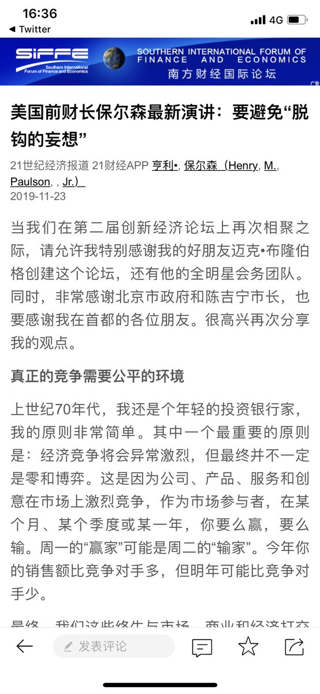
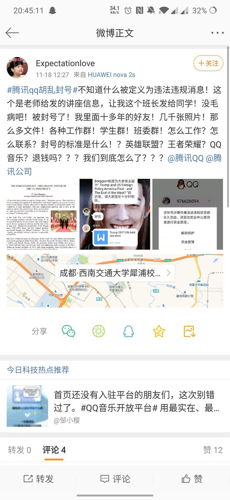

[11月25日 03:42]    BBC News 中文   @bbcchinese    【香港区议会选举2019】开票议席已过三分之一，非建制派大幅抛离亲政府阵营。  https://bbc.in/2OFbmsv   :speech_balloon:评:13 :+1:赞:76 :globe_with_meridians:转:19  

[11月25日 01:43]    BBC News 中文   @bbcchinese    【香港区议会选举2019】卷入元朗7.21袭击事件中的立法会议员何君尧承认在屯门连任区议员失败。 // @BBCChinese 继续图文直播香港选举点票情况！  https://bbc.in/2OeymzC   :speech_balloon:评:59 :+1:赞:223 :globe_with_meridians:转:59  

[11月25日 01:10]    BBC News 中文   @bbcchinese    【香港区议会选举2019】选举管理委员会主席冯骅法官公布，全日官方投票率为71.2%，创下香港普及选举以来最高纪录。 // @bbcchinese 继续图文直播香港选举点票情况！  https://bbc.in/37wF6R3   :speech_balloon:评:7 :+1:赞:142 :globe_with_meridians:转:86  

[11月25日 00:27]    BBC News 中文   @bbcchinese    香港区议会选举即将开票。绝大多数投票站于投票结束后当场点票，群众可依法入内监察点票过程。BBC News 中文正在多媒体直播： https://www.bbc.com/zhongwen/simp/live/chinese-news-50499342 …  :speech_balloon:评:13 :+1:赞:99 :globe_with_meridians:转:43  

[11月25日 00:04]    BBC News 中文   @bbcchinese    北京字节跳动科技有限公司是中国发展最快的初创企业。抖音在美国有2650万月活跃用户，其中60%的用户为16-24岁的青少年。 https://bbc.in/2OfgEvR   :speech_balloon:评:21 :+1:赞:84 :globe_with_meridians:转:34  

[11月24日 21:05]    纽约时报中文网   @nytchinese    持续关注香港区议会选举：到下午三时左右，离投票结束还有七个小时，完成投票的人数已达到四年前区议会选举同时段的两倍，投票率也达到了47.26%，已超过四年前选举的整体投票率。 https://nyti.ms/34dC4iw   :speech_balloon:评:57 :+1:赞:31 :globe_with_meridians:转:6  

[11月24日 21:00]    纽约时报中文网   @nytchinese    #一周热门 盘点奥斯卡热门角逐者，谁能成为最大赢家？ http://nyti.ms/2XvqZHg   :speech_balloon:评:12 :+1:赞:12 :globe_with_meridians:转:0  

[11月24日 20:53]    BBC News 中文   @bbcchinese    香港区议会选举的投票率破尽香港议会选举的纪录，民主派和建制派到底谁占优？  :speech_balloon:评:35 :+1:赞:145 :globe_with_meridians:转:54  

[11月24日 19:00]    纽约时报中文网   @nytchinese    #一周热门 触及审查红线，华裔美国艺术家北京展览被取消 http://nyti.ms/2OwaLt5   :speech_balloon:评:17 :+1:赞:60 :globe_with_meridians:转:17  

[11月24日 18:25]    纽约时报中文网   @nytchinese    周日上午，香港各地选民踊跃投票，在投票开启的第一个小时内，参与投票的人数是上一次2015年区议会选举的四倍。
由于一则有关投票可能提前结束的谣言迅速传播，使投票站大排长龙。对此，政制及内地事务局局长聂德权表示，投票时间非常充裕，大家不必集中在同一时间投票。 https://nyti.ms/34dC4iw   :speech_balloon:评:6 :+1:赞:33 :globe_with_meridians:转:7  

[11月24日 18:05]    纽约时报中文网   @nytchinese    购买媒体报道、渗透大学校园、向其支持的候选人提供捐款、创建成千上万的社交媒体账户来攻击台湾执政党......
一名自称是中国情报人员的男子告诉澳大利亚当局，中国情报机构直接干涉了香港和台湾政局。他提供的一些细节无法得到核实，但官员们正在严肃对待他的陈述。 https://nyti.ms/35vlmeW   :speech_balloon:评:115 :+1:赞:334 :globe_with_meridians:转:109  

[11月24日 18:03]    老司机   @h5lpykl7tp6jjop      :speech_balloon:评:1 :+1:赞:13 :globe_with_meridians:转:5  

[11月24日 17:59]    老司机   @h5lpykl7tp6jjop    港警被告上国际法庭 逾50万人控告三大重罪  :speech_balloon:评:6 :+1:赞:111 :globe_with_meridians:转:35  

[11月24日 17:24]    BBC News 中文   @bbcchinese    香港区议会选举的各区票站外，罕有地出现长长的人龙排队，选民们怎么说呢？  :speech_balloon:评:48 :+1:赞:231 :globe_with_meridians:转:74  

[11月24日 17:00]    BBC News 中文   @bbcchinese    “若香港暴力一发不可收拾，中国会成为最终输家。”曾担任英国外交部香港事务部主任的皮特·里基茨勋爵（Lord Peter Ricketts）说。 https://bbc.in/2OKVfKi   :speech_balloon:评:113 :+1:赞:195 :globe_with_meridians:转:51  

[11月24日 17:00]    纽约时报中文网   @nytchinese    #一周热门 美国前财长：即使达成贸易协议，中美关系可能只会更糟 http://nyti.ms/2QFrUn1   :speech_balloon:评:12 :+1:赞:32 :globe_with_meridians:转:10  

[11月24日 16:56]    BBC News 中文   @bbcchinese    香港区议会选举正在进行。投票开始六小时，投票人数突破150万。香港最大建制派政党民建联在中午开始便宣布“全线告急”，而民主党主席胡志伟表示，现阶段社会撕裂，各自阵营支持者数目都会上升，单从投票率未必能分析胜算。 https://www.bbc.com/zhongwen/simp/live/chinese-news-50499342 …  :speech_balloon:评:31 :+1:赞:186 :globe_with_meridians:转:51  

[11月24日 16:00]    BBC News 中文   @bbcchinese    你认为哪一则新闻最重要？ https://bbc.in/2QLsi3q   :speech_balloon:评:97 :+1:赞:107 :globe_with_meridians:转:29  

[11月24日 15:01]    BBC News 中文   @bbcchinese    【一周热点回顾】BBC中文的调查发现，撑警联署数字的增长存在诸多疑点，有分析质疑组织者可能使用电脑程式自我复制联署。 https://bbc.in/37lTQ58   :speech_balloon:评:63 :+1:赞:141 :globe_with_meridians:转:37  

[11月24日 15:00]    纽约时报中文网   @nytchinese    #一周热门 泄露文件揭示中国如何组织对穆斯林大规模拘禁 http://nyti.ms/2KIKAi3   :speech_balloon:评:30 :+1:赞:32 :globe_with_meridians:转:8  

[11月24日 13:57]    BBC News 中文   @bbcchinese    今天是香港四年一度的区议会选举，在示威活动未有平息迹象下，这场选举被视为对林郑月娥政府的一大考验。BBC News 中文正在多媒体直播： https://www.bbc.com/zhongwen/simp/live/chinese-news-50499342 …  :speech_balloon:评:17 :+1:赞:88 :globe_with_meridians:转:30  

[11月24日 13:41]    BBC News 中文   @bbcchinese    被送回墨西哥边界地区等待发落的移民，听听他们的心声。  :speech_balloon:评:24 :+1:赞:33 :globe_with_meridians:转:12  

[11月24日 13:01]    BBC News 中文   @bbcchinese    【一周热点回顾】英国的一份报告，一份合同，尽显欧盟国家面对中国崛起的尴尬。 https://bbc.in/2qA0DYt   :speech_balloon:评:13 :+1:赞:54 :globe_with_meridians:转:14  

[11月24日 13:00]    纽约时报中文网   @nytchinese    #一周热门 牛津词典2019年度词汇：“气候紧急状态” http://nyti.ms/2O8MCtA   :speech_balloon:评:1 :+1:赞:8 :globe_with_meridians:转:4  

[11月24日 12:46]    GFHG SDKM   @zyx_yny    Very good to take some time@our from election observation to tell #JuniusHo in person that I was responsible for the revocation of his honorary doctorate from @AngliaRuskin #Sorrynotsorry  :speech_balloon:评:6295 :+1:赞:38564 :globe_with_meridians:转:23564  

[11月24日 11:01]    BBC News 中文   @bbcchinese    【一周热点回顾】在香港中环上班的金融才俊，也许不会想到，有一天他们会迎着催泪弹出门买午餐。 https://bbc.in/345YKBj   :speech_balloon:评:138 :+1:赞:254 :globe_with_meridians:转:79  

[11月24日 11:00]    纽约时报中文网   @nytchinese    #一周热门 用做中式烤鸭的方法做一只感恩节火鸡 http://nyti.ms/346roCb   :speech_balloon:评:11 :+1:赞:35 :globe_with_meridians:转:4  

[11月24日 10:01]    纽约时报中文网   @nytchinese    随着暴力抗议令香港陷入分裂，通常波澜不惊、仅关注社区问题的区议会选举有了超乎寻常的意义。本次选举为何至关重要？主要议题有哪些？有关将于今日举行的香港区议会选举，这里是你需要知道的一些要点。 https://nyti.ms/34dC4iw   :speech_balloon:评:42 :+1:赞:133 :globe_with_meridians:转:46  

[11月24日 09:01]    BBC News 中文   @bbcchinese    【一周热点回顾】香港抗议运动持续，特区政府任命邓炳强为警队“一哥”，本地媒体称他是“鹰派”领军人物。
新任“一哥”有何背景？他在这次抗议运动中起到了什么作用？ https://bbc.in/2KKyhBx   :speech_balloon:评:27 :+1:赞:66 :globe_with_meridians:转:25  

[11月24日 09:00]    纽约时报中文网   @nytchinese    #一周热门 感觉世界不会好了？看看汤姆·汉克斯的故事吧 http://nyti.ms/32ZDqfh   :speech_balloon:评:2 :+1:赞:38 :globe_with_meridians:转:14  

[11月24日 08:10]    凡賽堤/FORSETI   @FecharCCP    呼籲請求共同挖掘所有有關香港發生的事，越全面越好，不同角度，越多越好，包括被暗地抓捕的人員，特別是CCP 派出的各種偽裝身份，包括變身變裝行兇的一點一滴都要挖掘出來，把CCP 的邪惡下三濫手段的真相毫無保留的曝光在全世界面前！世界公知公義才能真正挽救和保護香港人！希望懂視頻編輯配上中英文  :speech_balloon:评:1 :+1:赞:17 :globe_with_meridians:转:18  

[11月24日 08:07]    凡賽堤/FORSETI   @FecharCCP    人類史上最殘暴的CCP極權殺人恐怖組織正在用各種兇殘手段屠殺我們的同胞...................

CCP極權殺人恐怖組織超級納粹！超級殘暴！超級流氓！

人類到了全面消滅CCP極權殺人恐怖組織的時代！  :speech_balloon:评:4 :+1:赞:40 :globe_with_meridians:转:43  

[11月24日 08:04]    凡賽堤/FORSETI   @FecharCCP    人類史上最殘暴的CCP極權殺人恐怖組織正在用各種兇殘手段屠殺我們的同胞...................

CCP極權殺人恐怖組織超級納粹！  :speech_balloon:评:1 :+1:赞:40 :globe_with_meridians:转:35  

[11月24日 07:57]    凡賽堤/FORSETI   @FecharCCP    人類史上最殘暴的CCP極權殺人恐怖組織正在用各種兇殘手段屠殺我們的同胞...................

CCP極權殺人恐怖組織超級納粹！  :speech_balloon:评:6 :+1:赞:176 :globe_with_meridians:转:157  

[11月24日 07:37]    凡賽堤/FORSETI   @FecharCCP    人類史上最殘暴的CCP極權殺人恐怖組織正在用各種兇殘手段屠殺我們的同胞...................  :speech_balloon:评:1 :+1:赞:14 :globe_with_meridians:转:14  

[11月24日 07:28]    凡賽堤/FORSETI   @FecharCCP    CCP極權殺人恐怖組織正在用各種兇殘手段屠殺我們的同胞...................

視頻是CCP極權殺人恐怖組織在人流密集區投放巨量的不合格（不具國際標準）的化學毒氣催淚瓦斯彈 毒害我們的同胞！  :speech_balloon:评:0 :+1:赞:8 :globe_with_meridians:转:4  

[11月24日 00:09]    BBC News 中文   @bbcchinese    世卫组织说，由于活动量不够，这些孩子的身心都会受到影响，包括大脑发育以及社会技能。 https://bbc.in/37vBdvz   :speech_balloon:评:11 :+1:赞:50 :globe_with_meridians:转:21  

[11月23日 22:09]    老司机   @h5lpykl7tp6jjop    当你为正‌义申辩时，往往不‌仅需‌要面对国家的暴力机器，还‌要面‌对无知愚‌民的狂欢和嘲‌讽！
          —— 伏尔泰  :speech_balloon:评:23 :+1:赞:938 :globe_with_meridians:转:572  

[11月23日 22:01]    BBC News 中文   @bbcchinese    他自称是“中国间谍”，向媒体爆料说中国情报组织试图干预香港抗议运动和台湾选举。 https://www.bbc.com/zhongwen/simp/chinese-news-50528735 …  :speech_balloon:评:257 :+1:赞:583 :globe_with_meridians:转:235  

[11月23日 21:27]    墙国铁拳现世报😷   @Socialistfist    #社会主义铁拳 https://twitter.com/big_ear_cat/status/1197861132364603401 …  :speech_balloon:评:8 :+1:赞:202 :globe_with_meridians:转:45  

[11月23日 21:00]    纽约时报中文网   @nytchinese    #一周热门 从崇礼到香港：“鬼城”滑雪胜地和催泪瓦斯的城市 http://nyti.ms/2XuYsS1   :speech_balloon:评:4 :+1:赞:20 :globe_with_meridians:转:7  

[11月23日 19:00]    纽约时报中文网   @nytchinese    #一周热门 理工大遭封锁，香港学生抗议者父母走上“前线” http://nyti.ms/336C56p   :speech_balloon:评:54 :+1:赞:106 :globe_with_meridians:转:41  

[11月23日 18:40]    BBC News 中文   @bbcchinese    为中国搜集情报的前美国中情局特工李振成周五被判19年监禁。他被控与外国政府合谋、向其提供涉及国防的资料，他早前已承认控罪。 https://www.bbc.com/zhongwen/simp/world-50525644 …  :speech_balloon:评:41 :+1:赞:389 :globe_with_meridians:转:171  

[11月23日 18:37]    老司机   @h5lpykl7tp6jjop    当官专干缺德事！  :speech_balloon:评:6 :+1:赞:110 :globe_with_meridians:转:57  

[11月23日 18:23]    老司机   @h5lpykl7tp6jjop    2019年富豪们悄悄地走了，不带走云彩，只带走钱
 https://mp.weixin.qq.com/s/iO9IstE9xq4H4Zu7bR-_1w …  :speech_balloon:评:0 :+1:赞:10 :globe_with_meridians:转:2  

[11月23日 17:54]    老司机   @h5lpykl7tp6jjop    明天週日，由三家澳大利亞主流媒體聯合推出的九頻道《60分鐘》節目將爆料中共諜報人員王立強：綁架香港書商，干預台灣選舉，滲透香港大學，網絡攻擊自由世界，堪比諜報大片！ 
問：「為什麼你會選擇與澳大利亞政府合作？」
答：「因為決不能相信中共！」  :speech_balloon:评:110 :+1:赞:2447 :globe_with_meridians:转:1408  

[11月23日 17:46]    老司机   @h5lpykl7tp6jjop    香港某大厦外墙上的布告栏，民主派参选人的海报竟然被人撕掉，而亲共派候选人的海报却都原封不动，如果任由流氓破坏规则，选民连民主派的参选人是谁都不知道，民主派如何能胜选？

某些政党成立时是流氓起家，现在都建党近百年了，还是流氓行径，本性难改~  :speech_balloon:评:14 :+1:赞:87 :globe_with_meridians:转:44  

[11月23日 17:00]    纽约时报中文网   @nytchinese    #一周热门 字节跳动高管：TikTok不是一个威胁 http://nyti.ms/33ZeNAN   :speech_balloon:评:25 :+1:赞:11 :globe_with_meridians:转:1  

[11月23日 16:37]    财经真相   @caijingxiang    第二届彭博财经论坛在北京召开，美国前财政部长保尔森：要避免“脱钩的妄想”  :speech_balloon:评:26 :+1:赞:89 :globe_with_meridians:转:19  

[11月23日 16:20]    老司机   @h5lpykl7tp6jjop    这位推友“新闻大吐槽(找回推友)
 @tucaonews ”，自上推以来，尽力为香港抗争者宣传，为大陆抗争者呼吁，频繁与推友互动，绝非水号！他三万多粉丝的号突然被封，而且连申诉渠道都被关闭。
请推友重新关注！  :speech_balloon:评:15 :+1:赞:115 :globe_with_meridians:转:51  

[11月23日 15:01]    BBC News 中文   @bbcchinese    【一周热点回顾】中国留学生说，如果你不了解中国或者香港就没有资格在这个问题上发言。但有的韩国学生不这么认为。 https://bbc.in/348Rg0k   :speech_balloon:评:171 :+1:赞:311 :globe_with_meridians:转:121  

[11月23日 15:00]    纽约时报中文网   @nytchinese    #一周热门 #观点 “新疆文件”说明了什么？ http://nyti.ms/37t0O8r   :speech_balloon:评:26 :+1:赞:25 :globe_with_meridians:转:10  

[11月23日 14:45]    老司机   @h5lpykl7tp6jjop    中国间谍澳洲投诚 自陈中国间谍海外活动频繁  :speech_balloon:评:1 :+1:赞:9 :globe_with_meridians:转:4  

[11月23日 14:42]    老司机   @h5lpykl7tp6jjop    德国艺术大师数百件作品在中国“失踪”
来自德国的数百件艺术品据称在中国失踪，其中包括著名艺术家吕佩尔兹和基弗的作品，引起德国文化界震惊。
据媒体报道，马库斯·吕佩尔兹（Markus Lüpertz）、安瑟尔姆·基弗（Anselm Kiefer）等德国著名艺术家的近250幅作品在中国下落不明，艺术家们对此感到愤怒。  :speech_balloon:评:3 :+1:赞:40 :globe_with_meridians:转:8  

[11月23日 14:36]    老司机   @h5lpykl7tp6jjop    1万颗催泪弹多毒？鸟尸、氯痤疮、皮肤病变…
最毒的还是中国共产党以及在香港的走狗黑警！  :speech_balloon:评:2 :+1:赞:9 :globe_with_meridians:转:3  

[11月23日 14:27]    老司机   @h5lpykl7tp6jjop    国家是个什么东西？可以要你性命？可以夺你自由？可以要你人权？可以拥有无限权力？国旗在文明国家可以当衣服，当短裤，当文胸，图案可以做拖鞋，认不认可是人权一部份，把它当圣物的只有邪教国家！官员为非作歹才是侮辱国家！滥权欺民才是侮辱国家！严刑恶法才是侮辱国家！目无人权算什么国家？狗屁！  :speech_balloon:评:1 :+1:赞:46 :globe_with_meridians:转:14  

[11月23日 13:00]    纽约时报中文网   @nytchinese    #一周热门 北京警告可能干预香港司法裁决 http://nyti.ms/2D1mKcL   :speech_balloon:评:19 :+1:赞:35 :globe_with_meridians:转:11  

[11月23日 12:26]    墙国铁拳现世报😷   @Socialistfist    辛辛苦苦咬文嚼字将近一年，揭露邪恶，为正义发声，可推特连解释都不解释，直接就给我封号了！而且close了我的申诉，只是冷冷一句，“你多次违反推特rules”，我觉得自己像是在面对另一个中宣部，连自我审查都不过关，不过我也看清一点：推特并不是按照良知/非良知，来实行奖惩的

我现在注册了新号，  :speech_balloon:评:162 :+1:赞:587 :globe_with_meridians:转:262  

[11月23日 11:51]    财经真相   @caijingxiang    必须要特别说明的，得年轻人者，得天下！粤币要想长远发展，必须动手挖沪币的墙角，千万别搞什么，广东是广东的天下，其他人统统滚蛋，甚至设置各种歧视排外政策，如果广东人未来正的选一帮这样的政客，等于是直接宣判粤币死亡！  :speech_balloon:评:19 :+1:赞:122 :globe_with_meridians:转:15  

[11月23日 11:32]    财经真相   @caijingxiang    甚至很多权贵主动“退赃”以换取政治和财产安全，这样可以在不引起全体富人恐慌的情况下，让富人成为最后债务承担者，这是沪币、粤币具有的无可比拟的优势，如果处理得当，未来两币超越日元、欧元完全不成问题，甚至有可能把美元霸主地位都给拉下马，当然这将是很久以后的事情了！  :speech_balloon:评:9 :+1:赞:45 :globe_with_meridians:转:8  

[11月23日 11:27]    财经真相   @caijingxiang    中共垮台给中国带来严重动荡，但是任何事情都是都两面性的，除了动荡这样的坏处，它也有有力的一面，那就是—通过对中共权贵有限度的“追脏”来出清一下中国的债务，追脏尽管会迎来权贵集团的抵制，但是却不会像“打土豪分田地”那样带来全体资本的恐慌，外资已经国内非权贵资本甚至可以借机“低价抄底”。  :speech_balloon:评:5 :+1:赞:76 :globe_with_meridians:转:11  

[11月23日 11:20]    财经真相   @caijingxiang    因此成为现在欧美国家的常态化，除了宽松货币还有一种就是共产主义式的“打土豪分田地”，用暴力革命强行让富人来买单，这种结果相比各位已经知道了，这也是特朗普不断强调美国坚决不搞社会主义的原因，但是这也导致美元债务长期无法出清，贫富差距进一步扩大，直到美元无力承受为止！  :speech_balloon:评:3 :+1:赞:21 :globe_with_meridians:转:2  

[11月23日 11:15]    财经真相   @caijingxiang    沪、粤两币谁能称霸中国，关键是看谁能最快、最彻底的出清债务。当今即使日元、欧元、美元也深陷债务泥潭不能自拔，不断宽松甚至负利率就是债务不断恶化的表现。债务是不能消灭的，只能进行转移，说白就是谁来最后买单的问题，宽松货币政策本质是一种全民买单政策，这种政策得罪人少，稀释财富于无形！  :speech_balloon:评:4 :+1:赞:20 :globe_with_meridians:转:4  

[11月23日 11:14]    凡賽堤/FORSETI   @FecharCCP    CCP極權殺人恐怖組織是全人類的公敵！
呼籲全世界正道主義合力消滅CCP！
呼籲全世界人民看清楚CCP反人類的慘無人道的殘暴罪行！！！

消滅CCP是全世界全人類的當前最緊急任務！！！

視頻是CCP瘋狂屠殺香港學生畫面之一  :speech_balloon:评:3 :+1:赞:10 :globe_with_meridians:转:15  

[11月23日 11:08]    凡賽堤/FORSETI   @FecharCCP    凡是罔顧香港事實在推特和youtube上支持CCP和香港黑警的五毛必死全家，有朝一日必死於CCP的殺人恐怖組織之下，起底五毛祖宗十八代世代不得為人！  :speech_balloon:评:3 :+1:赞:6 :globe_with_meridians:转:2  

[11月23日 11:06]    财经真相   @caijingxiang    沪币地域广、人口多，这既是它的优势也是它的劣势，俗话说得好，人多嘴杂，利益牵扯也多，其之间后果就是沪币政治体制在很长一段时间里都处于动荡之中；尤其是区域内，东北、关中、黄淮地区财政严重赤字，这是一个极大的政治遗留包袱，但是随着时间的推移，沪币克服困难后，发展后劲十足！  :speech_balloon:评:3 :+1:赞:16 :globe_with_meridians:转:1  

[11月23日 11:02]    凡賽堤/FORSETI   @FecharCCP    CCP極權殺人恐怖組織是全人類的公敵！
呼籲全世界正道主義合力消滅CCP！
呼籲全世界人民看清楚CCP反人類的慘無人道的殘暴罪行！！！

消滅CCP是全世界全人類的當前最緊急任務！！！

視頻是深夜被CCP黑警暗殺的少女！  :speech_balloon:评:1 :+1:赞:6 :globe_with_meridians:转:12  

[11月23日 11:01]    财经真相   @caijingxiang    两币谁强谁弱现在很难判断，粤币虽然地域小，但是对应的中共遗留债务也较少，区域经济发展差异也比沪币范围小，而且粤币还可以辐射整个东南亚，这些地方的人民币承兑者必然是粤币，如果粤币尽快出清中共遗留债务，政客之间少些利益之争，粤币有可能成为与日元一样的东亚强势货币，甚至可以超过日元！  :speech_balloon:评:2 :+1:赞:23 :globe_with_meridians:转:5  

[11月23日 11:00]    纽约时报中文网   @nytchinese    #一周热门 #观点 “新疆文件”说明了什么？ http://nyti.ms/37t0O8r   :speech_balloon:评:64 :+1:赞:42 :globe_with_meridians:转:27  

[11月23日 10:59]    凡賽堤/FORSETI   @FecharCCP    CCP極權殺人恐怖組織是全人類的公敵！
呼籲全世界正道主義合力消滅CCP！
呼籲全世界人民看清楚CCP反人類的慘無人道的殘暴罪行！！！

消滅CCP是全世界全人類的當前最緊急任務！！！

視頻是被CCP瘋狂屠殺射中頭部身亡的香港學生  :speech_balloon:评:2 :+1:赞:5 :globe_with_meridians:转:9  

[11月23日 10:55]    凡賽堤/FORSETI   @FecharCCP    CCP極權殺人恐怖組織是全人類的公敵！
呼籲全世界正道主義合力消滅CCP！
呼籲全世界人民看清楚CCP反人類的慘無人道的殘暴罪行！！！

消滅CCP是全世界全人類的當前最緊急任務！！！

視頻是CCP瘋狂屠殺香港學生畫面之一  :speech_balloon:评:2 :+1:赞:15 :globe_with_meridians:转:13  

[11月23日 10:53]    财经真相   @caijingxiang    华北、东北、黄淮以及关中地区因地理位置纳入沪币范围是大概率事件，在这里实行联邦制是相对较好的方式；华南、云贵直接采用“粤币”为宜，包括港澳，这样便于当地经济长远发展；而四川、重庆、两湖则是粤币与沪币争夺之地。同时也是两币影响力强弱的标志！  :speech_balloon:评:6 :+1:赞:23 :globe_with_meridians:转:4  

[11月23日 10:52]    凡賽堤/FORSETI   @FecharCCP    CCP極權殺人恐怖組織是全人類的公敵！
呼籲全世界正道主義合力消滅CCP！
呼籲全世界人民看清楚CCP反人類的慘無人道的殘暴罪行！！！

消滅CCP是全世界全人類的當前最緊急任務！！！

據報導已被發現2537宗屍體，失踪近萬人！  :speech_balloon:评:0 :+1:赞:4 :globe_with_meridians:转:0  

[11月23日 10:46]    凡賽堤/FORSETI   @FecharCCP    CCP極權殺人恐怖組織正在用各種兇殘手段屠殺我們的同胞...................
CCP極權殺人恐怖組織是全人類的公敵！
呼籲全世界正道主義合力消滅CCP！
呼籲全世界人民看清楚CCP反人類的慘無人道的殘暴罪行！！！

消滅CCP是全世界全人類的當前最緊急任務！！！

視頻是被非法抓捕的學生李俊希"(同音)！  :speech_balloon:评:0 :+1:赞:9 :globe_with_meridians:转:4  

[11月23日 10:44]    财经真相   @caijingxiang    新疆实行的“疆币”，以及西藏的“藏币”直接可以划归为“垃圾货币”，因此为了当地百姓幸福而言，不建议两地独立搞自主货币，最好是选用沪币与粤币双币流通，当然这会削弱两地政客大权利，大概率会遭到他们的抵触！  :speech_balloon:评:2 :+1:赞:29 :globe_with_meridians:转:3  

[11月23日 10:43]    凡賽堤/FORSETI   @FecharCCP    CCP極權殺人恐怖組織正在用各種兇殘手段屠殺我們的同胞...................
CCP極權殺人恐怖組織是全人類的公敵！
呼籲全世界正道主義合力消滅CCP！
呼籲全世界人民看清楚CCP反人類的慘無人道的殘暴罪行！！！

消滅CCP是全世界全人類的當前最緊急任務！！！

視頻是近距離射殺香港理工大學學生的罪行  :speech_balloon:评:7 :+1:赞:47 :globe_with_meridians:转:20  

[11月23日 10:38]    财经真相   @caijingxiang    香港法案签署后，港币的消失是必然的，但是中共在大湾区的“深币”，极有可能随着政权的变更而“夭折”，而后随着去大一统的思想兴起，各地或独立自制或组建松散联邦，在这一过程中，以广东为核心的“粤币”，以及以上海为中心的“沪币”，将成为人民币崩盘后的两个强势货币！ https://twitter.com/rfa_chinese/status/1198005738225967105 …  :speech_balloon:评:52 :+1:赞:386 :globe_with_meridians:转:86  

[11月23日 10:36]    凡賽堤/FORSETI   @FecharCCP    CCP極權殺人恐怖組織正在用各種兇殘手段屠殺我們的同胞...................
CCP極權殺人恐怖組織是全人類的公敵！
呼籲全世界正道主義合力消滅CCP！
呼籲全世界人民看清楚CCP反人類的慘無人道的殘暴罪行！！！

消滅CCP是全世界全人類的當前最緊急任務！！！

視頻是CCP屠殺深夜香港理工大學的罪行之一  :speech_balloon:评:0 :+1:赞:4 :globe_with_meridians:转:1  

[11月23日 10:34]    凡賽堤/FORSETI   @FecharCCP    CCP極權殺人恐怖組織正在用各種兇殘手段屠殺我們的同胞...................
CCP極權殺人恐怖組織是全人類的公敵！
呼籲全世界正道主義合力消滅CCP！
呼籲全世界人民看清楚CCP反人類的慘無人道的殘暴罪行！！！

消滅CCP是全世界全人類的當前最緊急任務！！！

視頻是CCP屠殺深夜香港理工大學的罪行之一  :speech_balloon:评:20 :+1:赞:56 :globe_with_meridians:转:51  

[11月23日 10:29]    凡賽堤/FORSETI   @FecharCCP    CCP極權殺人恐怖組織正在用各種兇殘手段屠殺我們的同胞.............
CCP極權殺人恐怖組織是全人類的公敵！
呼籲全世界正道主義合力消滅CCP！
呼籲全世界人民看清楚CCP反人類的慘無人道的殘暴罪行！！！

消滅CCP是全世界全人類的當前最緊急任務！！！

視頻是被非法濫捕的數千名香港理工大學無辜學生  :speech_balloon:评:0 :+1:赞:5 :globe_with_meridians:转:5  

[11月23日 10:27]    凡賽堤/FORSETI   @FecharCCP    CCP極權殺人恐怖組織正在用各種兇殘手段屠殺我們的同胞...................
CCP極權殺人恐怖組織是全人類的公敵！
呼籲全世界正道主義合力消滅CCP！
呼籲全世界人民看清楚CCP反人類的慘無人道的殘暴罪行！！！

消滅CCP是全世界全人類的當前最緊急任務！！！

視頻是CCP下令屠殺香港理工大學的殘暴罪行  :speech_balloon:评:6 :+1:赞:49 :globe_with_meridians:转:38  

[11月23日 10:23]    凡賽堤/FORSETI   @FecharCCP    CCP極權殺人恐怖組織正在用各種兇殘手段屠殺我們的同胞...................
CCP極權殺人恐怖組織是全人類的公敵！
呼籲全世界正道主義合力消滅CCP！
呼籲全世界人民看清楚CCP反人類的慘無人道的殘暴罪行！！！

消滅CCP是全世界全人類的當前最緊急任務！！！  :speech_balloon:评:0 :+1:赞:12 :globe_with_meridians:转:4  

[11月23日 10:15]    凡賽堤/FORSETI   @FecharCCP    CCP極權殺人恐怖組織正在用各種兇殘手段屠殺我們的同胞...................
CCP極權殺人恐怖組織是全人類的公敵！呼籲全世界正道主義合力消滅CCP！

圖為被殺害的年輕少女！  :speech_balloon:评:0 :+1:赞:5 :globe_with_meridians:转:4  

[11月23日 09:00]    纽约时报中文网   @nytchinese    #一周热门 校园燃烧之后，香港内地生的疏离、绝望与分歧 http://nyti.ms/2NTBhh5   :speech_balloon:评:26 :+1:赞:44 :globe_with_meridians:转:19  

[11月23日 07:53]    老司机   @h5lpykl7tp6jjop    国务院2009年文件在2020年把上海建成国际金融中心，还有不到两个月，人民币国际化影子都没有，如何建国际金融中心？ https://twitter.com/goodrick8964/status/1197997508430979072 …  :speech_balloon:评:48 :+1:赞:431 :globe_with_meridians:转:116  

[11月23日 07:00]    纽约时报中文网   @nytchinese    #一周热门 中国回应时报新疆报道，为镇压穆斯林辩护 http://nyti.ms/2Qw4QXO   :speech_balloon:评:59 :+1:赞:51 :globe_with_meridians:转:19  

[11月23日 00:30]    墙国铁拳现世报😷   @Socialistfist    另外一个造假的人造铁拳是这则，同样张冠李戴。

 https://boxun.com/news/gb/china/2018/06/201806100004.shtml …  :speech_balloon:评:3 :+1:赞:63 :globe_with_meridians:转:4  

[11月23日 00:27]    墙国铁拳现世报😷   @Socialistfist    有推友询问是否能证明假图
有趣的是这张假图的配图恰好是微博用户“被威胁强拆的鹤岗小市民” 一个本推曾经在10月19日发布过的铁拳现世报内容。如果你搜索“小市民”，你会看见他每日在微博刷屏式维权也未曾导致他的微博被和谐。然而这些人造铁拳却是无迹可循。  :speech_balloon:评:2 :+1:赞:66 :globe_with_meridians:转:6  

[11月23日 00:21]    财经真相   @caijingxiang    有人说是假消息，嗯，很有可能，我也从没有否认！但是它突然爆出来的时间点很重要，更重要的是中共官媒还公开辟谣，这就已经达到了它的目的，现在是假，继续紧逼，下次你确定我不敢真干吗？ https://twitter.com/caijingxiang/status/1197908949061619716 …  :speech_balloon:评:20 :+1:赞:97 :globe_with_meridians:转:13  

[11月23日 00:05]    财经真相   @caijingxiang    接下来美国人会怎么做呢？今天美国最顶层的人会很忙，核爆炸未必能够吓住他们，但有一点是很明确的，北京的这位实权人已经成了当今世界亘古未有的最危险人物！现在川普政府唯一能做的是稳住他，全面开战？斩首行动？内部分裂？各种方法都会摆出来，内部寻找替代人是最可行性的策略，下面是一场时间赛跑  :speech_balloon:评:26 :+1:赞:125 :globe_with_meridians:转:32  

[11月22日 23:55]    财经真相   @caijingxiang    南海核爆事件是大事来临前的征兆，这是一次警告，也是一次试探，更是一次威胁！这件事的制造者自然是中共军方，而且命令很有可能来自北京最高层。它警告的人自然是即将签署《香港人权与民主法案》的特朗普，以及正在北京进行最后斡旋的基辛格，它的爆炸声是在说“把我逼急了，大不了鱼死网破！”  https://twitter.com/greattankman/status/1197773109803139072 …  :speech_balloon:评:82 :+1:赞:155 :globe_with_meridians:转:56  

[11月22日 22:57]    财经真相   @caijingxiang    美国最近一系列经济数据都开始触底走强，这给了美联储12月暂停降息的理由，如果数据继续强劲，美联储不排除重新引导市场加息预期，甚至暂停启动的不是QE4的宽松！  :speech_balloon:评:5 :+1:赞:70 :globe_with_meridians:转:12  

[11月22日 22:00]    纽约时报中文网   @nytchinese    #时报专栏 @nytdavidbrooks：全球化的民主资本主义将引发反作用力。它导致受过教育、繁荣发展的城市人和落在后面的农村民众之间的经济和文化冲突日益加剧。
它在精神上太单薄，太世界主义，决绝于传统。人们感到自己的民族文化正在被剥夺。 http://nyti.ms/2XJOSuM   :speech_balloon:评:66 :+1:赞:25 :globe_with_meridians:转:11  

[11月22日 19:14]    老司机   @h5lpykl7tp6jjop    60年前，有人要民主，他们变成了救星； 

50年前，有人要民主，他们变成了右派； 

40年前，有人要民主，他们变成反革命； 

30年前，有人要民主，他们变成了冤鬼； 

20年前，有人要民主，他们压成了肉饼； 

10年前，有人要民主，他们变成了囚犯； 

在今天，有人要民主，他们变成了汉奸……  :speech_balloon:评:5 :+1:赞:194 :globe_with_meridians:转:109  

[11月22日 19:06]    墙国铁拳现世报😷   @Socialistfist    这些人造铁拳固然有很高“观赏性”，但小编不赞同用这些截图去混淆视听。  :speech_balloon:评:14 :+1:赞:344 :globe_with_meridians:转:24  

[11月22日 18:59]    墙国铁拳现世报😷   @Socialistfist    近几日收到了大量推友投稿私信，都是关于图二图三内容，特发此推说明，就不一一私信回复解释了，请见谅。
图一是几个月前就发推讨论过的造假铁拳图。这些疑似假图的截图 
主要特征是“隔日”铁拳的戏剧效果和无迹可查的微博搜索信息。
投稿中有众多港台两地推友对微博不甚了解, 容易上当，请大家转发告知  :speech_balloon:评:33 :+1:赞:314 :globe_with_meridians:转:86  

[11月22日 17:31]    墙国铁拳现世报😷   @Socialistfist    #社会主义铁拳 https://twitter.com/RogerHPNg/status/1197778808503328768 …  :speech_balloon:评:5 :+1:赞:128 :globe_with_meridians:转:13  

[11月22日 14:53]    财经真相   @caijingxiang    今天a股暴跌，损失最大的竟然是淘股吧，直接给封了！  :speech_balloon:评:27 :+1:赞:255 :globe_with_meridians:转:46  

[11月22日 13:53]    老司机   @h5lpykl7tp6jjop    深圳沙井走了40万人，整个深圳关外一片萧条！
来源：深圳房地产
现在整个深圳关外一片萧条啊，很多工厂都关门，很多菜场都关门，还有很多饭馆都关门了。今年深圳祖房市场怪现象，高档小区，房租过万的房，供不应求，城中村农民房大量空置，租不去出。深圳如果没有制造业那到时就会上演空城计。  :speech_balloon:评:5 :+1:赞:87 :globe_with_meridians:转:33  

[11月22日 13:38]    财经真相   @caijingxiang    百度就业相关搜索指数！  :speech_balloon:评:11 :+1:赞:149 :globe_with_meridians:转:55  

[11月22日 13:27]    老司机   @h5lpykl7tp6jjop    余华：中国荒诞的阶级斗争史（摘录）  :speech_balloon:评:1 :+1:赞:13 :globe_with_meridians:转:2  

[11月22日 13:02]    财经真相   @caijingxiang    不想爆粗口，但是这次真的是忍不了，你大爷的！白领加班是坐着，工厂的工人可是站着的，而且是站了一天的那种，很多人站的腿都软了，别说20分钟，就是五分钟都没有人愿意！拿白领加班比，脑残吧！ https://twitter.com/calabiet9/status/1197739487343697921 …  :speech_balloon:评:24 :+1:赞:248 :globe_with_meridians:转:32  

[11月22日 12:41]    财经真相   @caijingxiang    还有一员工跟我讲过他以前工作的一家工厂，上班打卡机时间故意调快10分钟，而下班打卡机时间却慢了十分钟，如此以来就比正常工作时间长了20分钟，员工们对此一肚子气却不敢吭声，只求合同时间一到赶紧拿奖金走人！  :speech_balloon:评:7 :+1:赞:130 :globe_with_meridians:转:19  

[11月22日 12:33]    财经真相   @caijingxiang    中国的年轻工人没有任何话语权，劳务诈骗在中国遍地开花，但是你却根本看不到任何新闻报道，每次看新闻说“用工荒”各种专家学者乱分析；从不提劳务外派这一最核心根源，对于绝大多数普通工人来说，脏、累、苦都还可以忍受，但是绝对无法忍受承诺的奖金被中介和工厂诈骗利用劳务外派诈骗！  :speech_balloon:评:14 :+1:赞:339 :globe_with_meridians:转:77  

[11月22日 10:24]    老司机   @h5lpykl7tp6jjop    为中共做事没有申报，被判刑。祝贺 https://twitter.com/ttingxiao/status/1197693786366726144 …  :speech_balloon:评:14 :+1:赞:247 :globe_with_meridians:转:96  

[11月22日 07:08]    老司机   @h5lpykl7tp6jjop    克警用擴音器同理大同學講「你就食冰冰冷冷嘅生命麵包，我收工就上深圳食海底撈......」
原來喱班克警 #邏輯思維 #超低端「海底撈係好嘢」～ 恐怖過催淚彈
#無學識無常識
#無品德無品味
#StandWithPolyU
#StandWithHongKong
#FreeHongKong  :speech_balloon:评:140 :+1:赞:956 :globe_with_meridians:转:766  

[11月21日 17:05]    老司机   @h5lpykl7tp6jjop    #香港 【 #懷疑警察殺人 】
警方抓到一個小朋友後，因發洩不滿把小妹妹丟進路軌，小妹妹大聲呼叫一聲之後就完全沒有動靜，極有可能因此而死亡
#請廣傳
#香港年青人正在被軍警大規模屠殺
#SOSHongKong
#HongKongPoliceState  :speech_balloon:评:147 :+1:赞:1082 :globe_with_meridians:转:1295  

[11月21日 13:58]    GFHG SDKM   @zyx_yny    On #PolyU being the end game, this OL says it is 100% not the end game.  She says what we saw happened to the students at Poly, the way they were brutally treated by #HKPolice, there's no way HKers will forget.  We will keep on fighting!

#StandWithHongKong #HongKongProtests  :speech_balloon:评:104 :+1:赞:2422 :globe_with_meridians:转:1562  

[11月21日 11:50]    GFHG SDKM   @zyx_yny    We were in front of the Diet Members’ Office Building.

We will keep fighting with you, HKers
We will keep spreading what's happening in HK

You are not alone  :speech_balloon:评:370 :+1:赞:3594 :globe_with_meridians:转:2124  

[11月21日 00:57]    GFHG SDKM   @zyx_yny    Yesterday’s passage of the #HongKong Human Rights & Democracy Act was a good day in the struggle to resist totalitarian #China & its bid for domination. But it was not the last day. We have a long road ahead to protect our jobs, our workers & our security.  :speech_balloon:评:1638 :+1:赞:16331 :globe_with_meridians:转:10693  

[11月21日 00:12]    墙国铁拳现世报😷   @Socialistfist      :speech_balloon:评:5 :+1:赞:200 :globe_with_meridians:转:28  

[11月21日 00:07]    墙国铁拳现世报😷   @Socialistfist    评论区的孙笑川们开始了一贯的颠倒黑白，全过程视频在此 https://twitter.com/hkwuliff/status/1193726052184387584?s=09 …  :speech_balloon:评:10 :+1:赞:153 :globe_with_meridians:转:29  

[11月20日 23:56]    墙国铁拳现世报😷   @Socialistfist    双十一当天，因为目睹正在跟拍的香港警察往女儿所在楼发射催泪弹，哭的撕心裂肺的hk01记者（亲中媒体）之事，被传到墙内变成了“ 反华媒体记者女儿被催泪弹”，微博评论区中粉红战螂瞬间高潮。
不知该记者和其同事看到了该有如何反应
#社会主义铁拳
#社会主义特别行政区铁拳  :speech_balloon:评:93 :+1:赞:928 :globe_with_meridians:转:374  

[11月20日 21:56]    GFHG SDKM   @zyx_yny    The first day that schools resumed, #hkpolice deliberately targeted high school students to stop and search for no reason. As many #hongkongers suggest, being young becomes a crime as #China and #HKGov are totally out of reach of the whole city.  :speech_balloon:评:258 :+1:赞:5623 :globe_with_meridians:转:6148  

[11月20日 14:09]    老司机   @h5lpykl7tp6jjop    与内地真的不一样！他们太勇敢了！国内8964以后还敢这样吗？  :speech_balloon:评:106 :+1:赞:2192 :globe_with_meridians:转:799  

[11月19日 19:20]    墙国铁拳现世报😷   @Socialistfist    腾讯铁拳，重锤出击  :speech_balloon:评:34 :+1:赞:297 :globe_with_meridians:转:71  

[11月19日 15:33]    GFHG SDKM   @zyx_yny    The tyranny forced us live as middle age warrior  :speech_balloon:评:1 :+1:赞:50 :globe_with_meridians:转:19  

[11月19日 14:41]    GFHG SDKM   @zyx_yny    This scene is no longer only appearing in movies. It’s happening in our reality.

Escaping from death. 

She’s not a #stuntman, she’s just a normal citizen, normal student.

#StandWithHongKong
#Dramaislife
#Lifeisdrama
#PolyUHongKong  :speech_balloon:评:87 :+1:赞:1543 :globe_with_meridians:转:1481  

[11月18日 23:48]    墙国铁拳现世报😷   @Socialistfist    腾讯也是扔了一个战术式社会主义核弹吗  :speech_balloon:评:83 :+1:赞:629 :globe_with_meridians:转:132  

[11月18日 21:23]    墙国铁拳现世报😷   @Socialistfist    曾经推特中文圈最后一片净土还是被污染了
如果您想要批量屏蔽某些账号，建议大家参考转推内容。
如果您只是追求“眼不见心不烦”， 可以参考下图，选择设置-高级过滤-隐藏通知
推特世界归于宁静  https://twitter.com/keepcnsecurity/status/1195607211940040705 …  :speech_balloon:评:65 :+1:赞:116 :globe_with_meridians:转:40  

[11月18日 20:34]    墙国铁拳现世报😷   @Socialistfist    这小伙还是个文案人才，手动滑稽  :speech_balloon:评:23 :+1:赞:367 :globe_with_meridians:转:42  

[11月18日 20:13]    墙国铁拳现世报😷   @Socialistfist    推特做不到的事情，腾讯却做到了

#战螂在推特
#社会主义铁拳  :speech_balloon:评:253 :+1:赞:1855 :globe_with_meridians:转:540  

[11月18日 14:12]    墙国铁拳现世报😷   @Socialistfist    三十年後又黃昏，再見刀兵校外陳。惜乎有民十三億，盡是為虎作倀人  :speech_balloon:评:6 :+1:赞:241 :globe_with_meridians:转:84  

[11月18日 10:41]    GFHG SDKM   @zyx_yny    With students in Hong-Kong who are blocking the streets to bring economic pressure on China to ensure democratic freedoms in HK! #StandWithHongKong @Andychanhotin @FreedomHKG @Stand_with_HK @hk_watch @HKWORLDCITY #HongKongProtests @joshuawongcf #Freedom  :speech_balloon:评:28 :+1:赞:708 :globe_with_meridians:转:557  

[11月18日 09:32]    GFHG SDKM   @zyx_yny    Stop using #PolyU Wifi for god’s sake.
#HongKongProtests https://twitter.com/hengyanlo/status/1196156883679055872 …  :speech_balloon:评:4 :+1:赞:110 :globe_with_meridians:转:121  

[11月18日 08:54]    GFHG SDKM   @zyx_yny    08:30 students tried to leave #PolyU but #HongKong #Police continued to tear gas them, forcing them to return inside. This is in contradiction to what Poly U President JC Teng said, that cops have agreed to let students leave peacefully. 
@cityusucbc
#PoliceBrutality  :speech_balloon:评:55 :+1:赞:844 :globe_with_meridians:转:1065  

[11月18日 08:50]    GFHG SDKM   @zyx_yny    #PolyU protesters eventually retreat after driving the police back in the face of whizzing rubber bullets and gas pellets. They’re mostly inside the campus again. Police showing no mercy #HK #HongKongProtests #StandWithHongKong  :speech_balloon:评:266 :+1:赞:4937 :globe_with_meridians:转:5404  

[11月18日 08:45]    GFHG SDKM   @zyx_yny    The #HKPolice threatening to shoot press, first-aid as they were attempting to cross the road. This is on the perimeter of #PolyU and some civilians who came here to support the protesters still inside have been injured and/or arrested at the TST east fountain across this road.  :speech_balloon:评:25 :+1:赞:618 :globe_with_meridians:转:832  

[11月18日 08:38]    GFHG SDKM   @zyx_yny    Protestors are trying to escape from Hong Kong Polytechnic University, but HK Police fire tear gas to force them back IN. HK Police have given up any pretense that they try to de-escalate and disperse. Instead, it is evident that their intention is to attack, arrest, and punish. https://twitter.com/JessiePang0125/status/1196224442491396097 …  :speech_balloon:评:34 :+1:赞:1000 :globe_with_meridians:转:1151  

[11月18日 08:06]    GFHG SDKM   @zyx_yny    this is the same shameful #PolyU head who refused to shake hands with students wearing a mask during graduation ceremony. Still the same shameful head who escaped the clashes and shrinked his duty for the whole of the clash that lasts for days. https://twitter.com/nytmay/status/1196202338102341633 …  :speech_balloon:评:58 :+1:赞:791 :globe_with_meridians:转:653  

[11月18日 06:02]    GFHG SDKM   @zyx_yny    Around 30 minutes ago at 05:30AM, #HKPolice have entered #PolyU campus. At least 3 protestors subdued, 1 seen with blood all over face during arrest

#PolyU #PolyUMassacre #PolyUSOS
#SOSHK #HongKong #StandwithHK
Vid via Telegram  :speech_balloon:评:47 :+1:赞:1622 :globe_with_meridians:转:2279  

[11月18日 05:16]    GFHG SDKM   @zyx_yny    

They are still fighting! 

#SOSPolyU
#HKPoliceState  :speech_balloon:评:181 :+1:赞:3599 :globe_with_meridians:转:3279  

[11月18日 02:48]    GFHG SDKM   @zyx_yny    [PolyU frontliner's last words?]

"If very unfortunately I die in Kowloon today, even though history may just remember me as a number, I hope HKers will remember all of our deeds, stay angry & rational & turn our revenge chants into reality."

#SOSHK

OP: https://lihkg.com/thread/1731186/page/1 …  :speech_balloon:评:110 :+1:赞:2140 :globe_with_meridians:转:2015  

[11月18日 01:32]    GFHG SDKM   @zyx_yny    “It is fxxking mad!” People with their cars in Tsim Sha Tsui hoping to support #PolyU students (but were stuck due to roadblocks) received tear gas treatment from #HongKong police. Lots of swearing. Video circulated online. #HongKongProtests  :speech_balloon:评:81 :+1:赞:1420 :globe_with_meridians:转:1593  

[11月18日 01:12]    GFHG SDKM   @zyx_yny    Old friend, world renowned photographer, Stephen Boitano, sharing his concerns on escalated police violence in Hk. Please  pray it is a very dangerous situation. #StandWithHongKong #HongKongProtests @FreedomHKG @Stand_with_HK @HKWORLDCITY @hk_watch @Andychanhotin @Andychanhotin  :speech_balloon:评:701 :+1:赞:9633 :globe_with_meridians:转:9790  

[11月18日 00:41]    墙国铁拳现世报😷   @Socialistfist    推荐一些启发小编开办《墙国铁拳现世报》的parody或自媒体推号：
中国民调@PollChina 
新蛤社@XinHaNewsAgency
推特小红旗@Xhnsoc__Redflag
共青团中央 (学习小组）@CPCYouthLeague
乳透社@Ruters0615 
胡锡进（流亡）@HuXijin_huaiqiu
LIFETIME 視界@LifetimeUSCN
不分先后，欢迎推荐后续补充  :speech_balloon:评:13 :+1:赞:162 :globe_with_meridians:转:28  

[11月17日 23:42]    GFHG SDKM   @zyx_yny    Members of Guarding Our Kids, formed by mothers and fathers, decided to stay with #PolyU students who were trapped in the campus: We won't leave our 'kids' behind. We will safeguard this place. We want everyone here can go home. #HongKongProtesters  :speech_balloon:评:633 :+1:赞:10634 :globe_with_meridians:转:9952  

[11月16日 18:05]    墙国铁拳现世报😷   @Socialistfist    小编要郑重警告刘女士，国家是有寻衅滋事和煽动颠覆这些国民待遇的。

#社会主义铁拳  :speech_balloon:评:96 :+1:赞:734 :globe_with_meridians:转:211  

[11月15日 08:24]    墙国铁拳现世报😷   @Socialistfist    小编认为本月最佳铁拳，滋磁不滋磁啊？  :speech_balloon:评:37 :+1:赞:776 :globe_with_meridians:转:45  

[11月15日 08:21]    墙国铁拳现世报😷   @Socialistfist    面对大陆的善意，台大教授自信的进去了---亲中学者 施正屏
#社会主义铁拳  :speech_balloon:评:186 :+1:赞:1898 :globe_with_meridians:转:825  

[11月14日 18:36]    财经真相   @caijingxiang    中共基建没有钱，很多网友简单的认为开动印钞机就行，这其实是大错特错，中共央行印的每一分钱，都必须有对应的相应的价值才行，否则就是无锚印钞，汇率崩盘！过去20年央行印钞都是以债务为基础的。比如，房奴的房贷，当房奴申请贷款时，本质是向央行抵押了自己未来30年的劳动力。 https://twitter.com/aspeltuo8/status/1194923278646816768 …  :speech_balloon:评:66 :+1:赞:790 :globe_with_meridians:转:280  

[10月09日 00:47]    GFHG SDKM   @zyx_yny    "Son, when you grow up
You will be the savior of the broken
The beaten, and the damned?"
Please watch this powerful mv #HongKongProtester #hkprotests 
香港反送中護法戰爭(Hong Kong Defensive War 2019)：Welcome To The Black Parade  https://youtu.be/0yXTHODE24Q  via @YouTube  :speech_balloon:评:4 :+1:赞:20 :globe_with_meridians:转:8  

[03月13日 08:10]    老司机   @h5lpykl7tp6jjop    批评是批评家天生的使命！他们只感知对错，信奉真理，指出真相不吐不快，不在意权势和群众的喜好，从批评里不可能获得任何好处，但批评家愚直不改。在中国几乎所有人都讨厌批评家，喜欢阴谋家，因为他们只说好听的！可是就因为中国的批评家太少，中国几乎看不到未来和希望！  :speech_balloon:评:98 :+1:赞:221 :globe_with_meridians:转:44  

