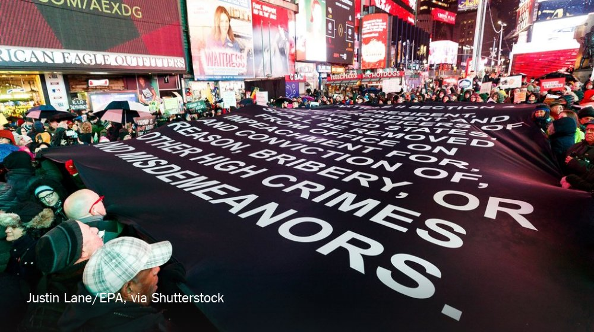
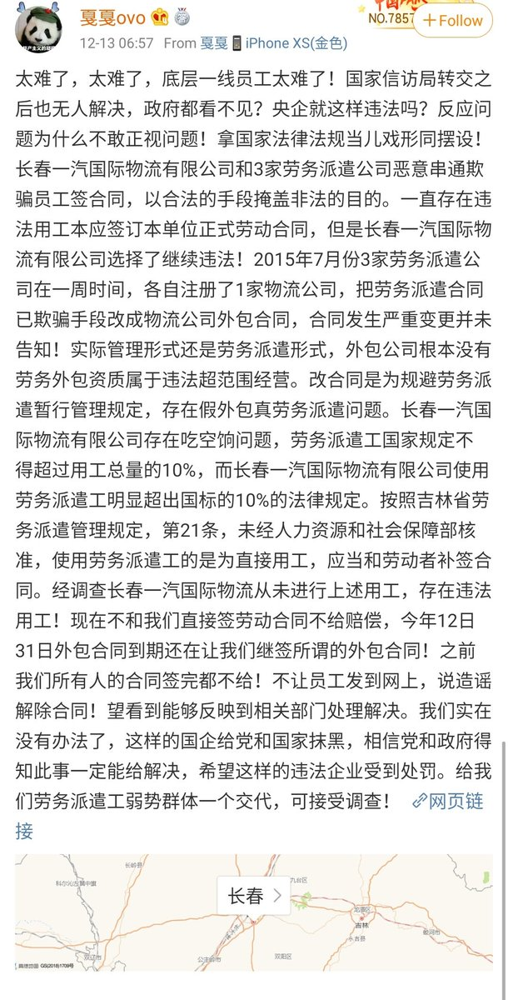
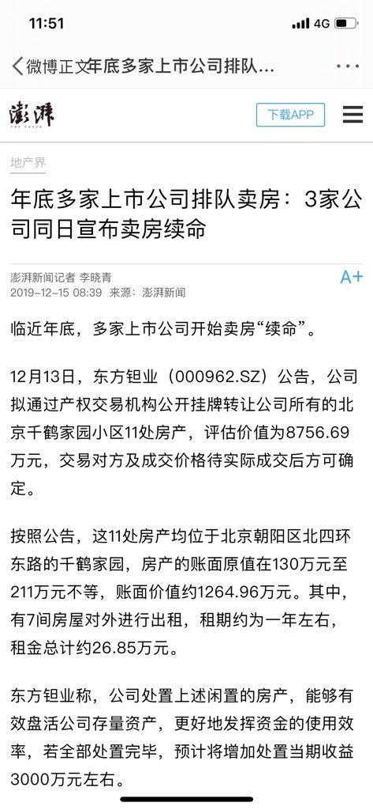
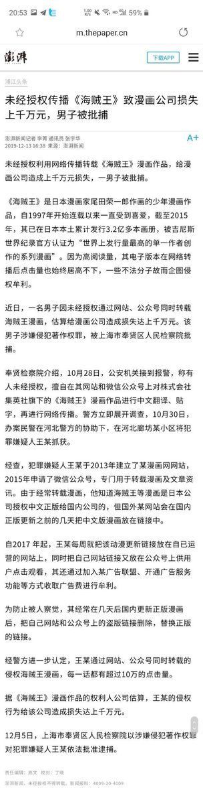

[12月18日 22:20]    BBC News 中文   @bbcchinese    以文科见长的复旦大学章程修改引发更多网络关注，新公布的章程相当将此前所有推进学术自由的努力付诸东流。 https://bbc.in/2PBfuf4   :speech_balloon:评:0 :+1:赞:9 :globe_with_meridians:转:4  

[12月18日 22:01]    BBC News 中文   @bbcchinese    一年一度的欧洲议会萨哈罗夫奖颁奖典礼在法国斯特拉斯堡举行，今年获奖者是在中国被监禁的维吾尔族学者伊利哈木·土赫提。 https://bbc.in/34CmBrz   :speech_balloon:评:4 :+1:赞:20 :globe_with_meridians:转:10  

[12月18日 21:42]    BBC News 中文   @bbcchinese    回顾睡在衣柜里的三个月，马蒂亚斯说那是“疯狂的时刻，但超酷”。他补充说：“我每天都在工作，所以老实说我不在乎睡觉的地方。” https://bbc.in/34vOWQr   :speech_balloon:评:1 :+1:赞:8 :globe_with_meridians:转:1  

[12月18日 21:01]    BBC News 中文   @bbcchinese    男性已知的避孕方式主要有两种：安全套或是做输精管结扎术。为何没有男性避孕药上市呢？ https://bbc.in/35yaOMr   :speech_balloon:评:6 :+1:赞:19 :globe_with_meridians:转:3  

[12月18日 20:34]    新闻大吐槽   @TuCaoFakeNews    2019年，香港人给党送终没完没了；而本以为平息的广东茂名火葬场事件又波澜再起；
共党在文楼镇没能得逞，旋即选中距离文楼镇27公里的播扬镇，不料又遭强烈抵制，本周一有近万村民上街示威，并且用燃烧弹与警方死磕~

香港负责给党送终，茂名负责火化，一条龙服务！  :speech_balloon:评:4 :+1:赞:91 :globe_with_meridians:转:41  

[12月18日 20:31]    BBC News 中文   @bbcchinese    BBC中文的台湾大选报道专页上线啦！快把它加到“我的最爱”，天天收看大选消息！ https://bbc.in/2PwRDNf   :speech_balloon:评:12 :+1:赞:16 :globe_with_meridians:转:4  

[12月18日 20:12]    新闻大吐槽   @TuCaoFakeNews    复旦师生不满共党将「独立之精神，自由之思想」等字眼从大学章程中删除，齐聚食堂，唱校歌抗议。歌词：復旦復旦復旦，日月光华同灿烂！

复旦原指：不忘“震旦”之旧，更含复兴中华之意~
新解：要想中华复兴，共党必须滚旦~  :speech_balloon:评:11 :+1:赞:158 :globe_with_meridians:转:65  

[12月18日 20:01]    BBC News 中文   @bbcchinese    【台湾外交部长吴钊燮：台湾人看到香港发生的事情，我们不想接受“一国两制”模式】台湾外交部长吴钊燮接受BBC记者傅东飞访问，谈香港示威形势如何影响台湾人对“一国两制”模式的看法。 https://bbc.in/2rWWFK0   :speech_balloon:评:40 :+1:赞:33 :globe_with_meridians:转:14  

[12月18日 20:00]    纽约时报中文网   @nytchinese    “我希望这里能有更多孩子，那样会更热闹，”绫野说。“所以我制作了这些孩子。”
“年轻人在这里没有机会，”在绫野的回忆里，村里曾经有一家医疗诊所，一个老虎机游戏厅和一个餐馆。如今名顷甚至没有一家商店。“他们无法谋生。” http://nyti.ms/34zkJjm   :speech_balloon:评:1 :+1:赞:6 :globe_with_meridians:转:4  

[12月18日 19:55]    财经真相   @caijingxiang    澳门向内地汇款额度提高到8万，那么从内地到澳门的额度没有提高吗？怎么感觉是在撸澳门人的羊毛节奏啊！难道就是因为澳门人老实，往死里忽悠？  :speech_balloon:评:20 :+1:赞:104 :globe_with_meridians:转:27  

[12月18日 19:54]    墙国铁拳现世报😷   @Socialistfist    根据网上来源显示抚顺生猪肉价在每公斤30元左右。由此得出花千芳母亲一个月可以购买猪肉6.7公斤左右  :speech_balloon:评:9 :+1:赞:22 :globe_with_meridians:转:5  

[12月18日 19:35]    新闻大吐槽   @TuCaoFakeNews    一鳞半爪尚且精美优雅，何况真龙乎？
亚里士多德说”人类社会是洞外世界的投影“，美有其更高的来处，当从上到下连上了，艺术的感召力无可匹敌，比如每年在世界上巡回的神韵演出，广受西方世界欢迎，因为他不仅仅是服饰美，舞蹈美，还在阐释中华文化之精神内涵，是在接已被共党斩断的中华文化根脉~  :speech_balloon:评:1 :+1:赞:10 :globe_with_meridians:转:3  

[12月18日 19:35]    新闻大吐槽   @TuCaoFakeNews    鬼子盯上花姑娘，花姑娘何罪之有？
李子柒，滇西小哥，将被共党破坏后的传统文化残片拿到世界级平台上展示，都美丽的无可挑剔~让老外服气~

不用批评他们假，艺术本来就是高于生活，其实冷血、反人性的共党文化永远也开不出半朵温情的文化之花~

希望有生命力的东西免于邪党魔爪~  :speech_balloon:评:2 :+1:赞:26 :globe_with_meridians:转:7  

[12月18日 19:19]    墙国铁拳现世报😷   @Socialistfist    目前花千芳已经意识到评论翻车已经删除该条微博
小编建议花千芳可以从此把简介改成： 我们的征途是星辰大海和妈妈的养老证  :speech_balloon:评:7 :+1:赞:101 :globe_with_meridians:转:17  

[12月18日 19:19]    财经真相   @caijingxiang    这就是说美国人给的时间点就是下个月的第一周，算时间就是两周内中共内斗出结果！ https://twitter.com/globalhimalaya/status/1207104656129658881 …  :speech_balloon:评:5 :+1:赞:106 :globe_with_meridians:转:40  

[12月18日 19:01]    BBC News 中文   @bbcchinese    在刚过去的周日，香港有一群爱国者集会，反对暴力，支持警察。  :speech_balloon:评:135 :+1:赞:159 :globe_with_meridians:转:20  

[12月18日 19:00]    纽约时报中文网   @nytchinese    2010年1月12日，谷歌退出中国；2014年4月2日，TikTok奏出了它的第一个音符；2014年9月19日，阿里巴巴上市；2018年12月1日，孟晚舟被拘留……
这十年来改变世界的技术，哪里出了错？ http://nyti.ms/2S7frZV   :speech_balloon:评:5 :+1:赞:14 :globe_with_meridians:转:7  

[12月18日 18:42]    墙国铁拳现世报😷   @Socialistfist    #社会主义铁拳 https://twitter.com/zhanglucy88/status/1207234309737697280 …  :speech_balloon:评:22 :+1:赞:183 :globe_with_meridians:转:52  

[12月18日 18:30]    纽约时报中文网   @nytchinese    #观点 面对特朗普的罪行、腐败和侵蚀本质，爱国主义和国家存亡是超越了普通政治的重大使命。作为美国人，我们须阻止他和其追随者对法治、宪法和美国精神的伤害。
这是我们发起“林肯计划”的原因，此举志在强调我们国家的事迹和价值和国民的牺牲与责任。这项工作超越了党派之争。 http://nyti.ms/2S4GyEQ   :speech_balloon:评:100 :+1:赞:101 :globe_with_meridians:转:36  

[12月18日 18:01]    BBC News 中文   @bbcchinese    香港特区成立源于主权移交，那为何不说“香港回归”？澳门又为什么不是“主权移交”？ https://bbc.in/2Ev3iWE   :speech_balloon:评:23 :+1:赞:35 :globe_with_meridians:转:6  

[12月18日 18:00]    纽约时报中文网   @nytchinese    一名农民说，三个月前，他养的一头猪突然死于猪瘟，他在他养的另外40多头猪生病之前，很快将它们宰杀。但他把死猪埋掉了，而不是向政府报告死亡数字寻求赔偿，为此他承担了巨大的损失。
“过去三年白干了，”他说。 http://nyti.ms/2M7NLAt   :speech_balloon:评:5 :+1:赞:22 :globe_with_meridians:转:3  

[12月18日 17:14]    纽约时报中文网   @nytchinese    美国严厉地指责中国新疆政策及缅甸屠杀罗辛亚人，对印度歧视穆斯林的公民身份法案却只提出了微弱批评。
面对在印度-太平洋地区与中国和俄罗斯的对抗，美国看起来是不想疏远一个盟友，哪怕这个盟友的举动多么不可预测。 http://nyti.ms/2S12Vex   :speech_balloon:评:79 :+1:赞:91 :globe_with_meridians:转:39  

[12月18日 17:05]    BBC News 中文   @bbcchinese    中国国家主席习近平访问澳门，出席庆祝澳门治权移交20周年的活动。他说澳门回归祖国20年，取得的成就和进步令人自豪，并指澳门认真地贯彻“一国两制”方针，取得的经验值得总结。 https://bbc.in/2M5nEKv   :speech_balloon:评:4 :+1:赞:9 :globe_with_meridians:转:1  

[12月18日 16:36]    财经真相   @caijingxiang    中国国家发改委新闻发言人孟玮17日透露，今后一段时间，特别是中国“两节”期间，将根据市场形势变化，择机增加中央冻猪肉储备投放。  :speech_balloon:评:15 :+1:赞:80 :globe_with_meridians:转:13  

[12月18日 16:32]    BBC News 中文   @bbcchinese    中国国家主席习近平抵达澳门，参加澳门主权移交中国20周年的庆祝活动。习近平说，他对澳门并不陌生，并说澳门在过去20年取得的成就令人自豪，且贯彻了“一国两制”的方针。
习近平发表简短讲话后，全场高喊“欢迎欢迎，热烈欢迎”长达数分钟。(AFP/Getty Images)  :speech_balloon:评:28 :+1:赞:47 :globe_with_meridians:转:6  

[12月18日 16:30]    纽约时报中文网   @nytchinese    当这个十年开始时，技术意味着希望——可以自动驾驶的汽车，可以把独裁者拉下马的社交网络。技术以超乎想像的方式把我们联系在一起。但在这个过程中的某个环节上，技术的缺陷变得十分清楚。究竟发生了什么呢？
扎克伯格、斯诺登……看看给我们带来这个十年的人是怎么说的。 http://nyti.ms/2S7frZV   :speech_balloon:评:8 :+1:赞:34 :globe_with_meridians:转:18  

[12月18日 16:03]    纽约时报中文网   @nytchinese    #图集【美国抗议者走上街头，呼吁弹劾特朗普】从纽约到波士顿，再到亚利桑那州，周二，在众议院就弹劾条款投票前夕，全美掀起了一系列抗议活动，呼吁对特朗普总统进行弹劾。
点击查看图集： http://nyti.ms/2EvN2oi   :speech_balloon:评:19 :+1:赞:11 :globe_with_meridians:转:4  

[12月18日 16:01]    BBC News 中文   @bbcchinese    对于部分香港人来说，这个圣诞节没有快乐的理由。  :speech_balloon:评:89 :+1:赞:274 :globe_with_meridians:转:77  

[12月18日 15:39]    纽约时报中文网   @nytchinese    日本正在经历人口萎缩和老龄化，这种趋势在乡村地区尤为明显。偏远小村名顷只有20多个成年居民，但350个人偶散布在村子各处，模拟曾居住在这里的真实的人。
“这里已经看不到小朋友了，”出生在名顷的绫野说，在过去的七年间，她每年都会举办人偶节。 http://nyti.ms/34zkJjm   :speech_balloon:评:15 :+1:赞:76 :globe_with_meridians:转:25  

[12月18日 15:00]    纽约时报中文网   @nytchinese    五种方法，让你们的友情更亲密：
1. 创建安全关系的基础
2. 密切关注
3. 让自己被了解
4. 给你的朋友一个小测试
5. 记住：亲密关系因人而异 http://nyti.ms/2YXjWrz   :speech_balloon:评:5 :+1:赞:17 :globe_with_meridians:转:2  

[12月18日 14:30]    纽约时报中文网   @nytchinese    中国已开始建造第三艘航母。报道称第四艘航母也在规划中，这将使其航母数量仅次于美国，后者目前有10艘航母服役中。
"山东舰"以中国的第一艘航母辽宁舰为原型，后者是在苏联解体后以2000万美元从乌克兰手中购得并加以暗中翻新。 http://nyti.ms/2S2WeIR   :speech_balloon:评:59 :+1:赞:53 :globe_with_meridians:转:22  

[12月18日 14:02]    BBC News 中文   @bbcchinese    美国经济学家罗思（Alvin Roth）找到了一种改进换肾病人等待配型机率的方法，改革了全球肾捐赠方式，使更多患者配型成功。他的方法是什么？ https://bbc.in/2rVIaWQ   :speech_balloon:评:8 :+1:赞:52 :globe_with_meridians:转:28  

[12月18日 14:00]    纽约时报中文网   @nytchinese    #图集【2019年纽约十佳新餐厅】时报美食评论家@pete_wells走访了纽约今年新开幕的一些餐厅，并评选出了其中的十佳。集餐厅、酒吧、小摊等多种形式于一体的小西班牙市场以及中国餐馆“胡同”等位列其中。
点击查看图集： http://nyti.ms/2YX97We   :speech_balloon:评:1 :+1:赞:9 :globe_with_meridians:转:4  

[12月18日 13:30]    纽约时报中文网   @nytchinese    为了停止这种被称为非洲猪瘟的疾病的传播，当局必须说服农民杀死受感染的猪，并妥善处理。
但中国官员的节俭已经到了吝啬的地步，让农民向往往现金匮乏的地方政府寻求补偿的过程充满了磨难。 http://nyti.ms/2M7NLAt   :speech_balloon:评:9 :+1:赞:30 :globe_with_meridians:转:15  

[12月18日 13:15]    老司机   @h5lpykl7tp6jjop    老眼昏花又把必须打成心须了.报歉！  :speech_balloon:评:1 :+1:赞:6 :globe_with_meridians:转:0  

[12月18日 13:09]    老司机   @h5lpykl7tp6jjop    权力傲慢的结果！  :speech_balloon:评:2 :+1:赞:67 :globe_with_meridians:转:18  

[12月18日 13:01]    BBC News 中文   @bbcchinese    回顾睡在衣柜里的三个月，创业家马蒂亚斯说那是“疯狂的时刻，但超酷⋯⋯我每天都在工作，所以老实说我不在乎睡觉的地方。”你身边有这样的一位朋友吗？ https://bbc.in/2EzdX2t   :speech_balloon:评:5 :+1:赞:30 :globe_with_meridians:转:7  

[12月18日 13:00]    纽约时报中文网   @nytchinese    #每日一词 mamasphere，妈妈世界。妈妈们公开谈论母乳喂养、产后性生活等话题一度被视为禁忌。不过近十年来，这样的对话在mamasphere中变得活跃。
Mamasphere是由建议、友谊、信息和娱乐组成的网络，妈妈们在这里分享和讨论关于育儿的话题和身为人母的经历。更多简报内容： http://nyti.ms/2S4pyyO   :speech_balloon:评:1 :+1:赞:4 :globe_with_meridians:转:1  

[12月18日 12:36]    老司机   @h5lpykl7tp6jjop    从小老一辈就叱责，没有规矩不成方圆，中国人生存第一课就是得懂什么是规矩，共产党的规矩就是下级服从上级，全党服从中央！一切行动听指挥！心须服从共产党领导！然后还有若干小规矩， 总之一句话就是要听话！不要乱说话！然后就没有然后了，你觉得还有剩下什么吗？自由民主平等…你在说什么？不听话  :speech_balloon:评:6 :+1:赞:66 :globe_with_meridians:转:15  

[12月18日 12:30]    纽约时报中文网   @nytchinese    周二，中国首艘国产航空母舰“山东舰”投入服役，标志着该国打造能够挑战美国海洋主导地位的现代化海军的雄心达到了一个新的里程碑。
视频显示，习近平在海南岛三亚的中国海军基地主持了交接入列仪式。从那里，新航母将能够在南海争议岛屿和台湾海峡部署力量。 http://nyti.ms/2S2WeIR   :speech_balloon:评:52 :+1:赞:60 :globe_with_meridians:转:18  

[12月18日 12:00]    纽约时报中文网   @nytchinese    印度再次断网以镇压反新公民法抗议。数据显示，印度今年已断网93次，去年更达134次，比其他国家都要多。与此同时，印美官员将就达成国防方面的协议在华盛顿会晤。
值得注意的是，比起对中国新疆政策的批评，美国在印度针对穆斯林的行动上基本保持了沉默。更多简报内容： http://nyti.ms/2S4pyyO   :speech_balloon:评:24 :+1:赞:21 :globe_with_meridians:转:8  

[12月18日 11:45]    纽约时报中文网   @nytchinese    从中国蔓延开来的猪瘟导致了全球约四分之一的猪死亡，改变了农业结构和全球消费者的饮食和钱包。
中国未能成功遏制这种疾病，可能加速了其蔓延，由此引发的问题或在未来几年里困扰中国政府和全球农业。中国粮食安全面临严峻考验，疫情也暴露出政府自上而下解决问题方式的局限。 http://nyti.ms/2M7NLAt   :speech_balloon:评:101 :+1:赞:280 :globe_with_meridians:转:137  

[12月18日 11:02]    BBC News 中文   @bbcchinese    英国首相约翰逊（又译：庄汉生）将在脱欧法案中增加一项条款，规定脱欧之后的英欧贸易谈判必须在明年年底前完成。 https://bbc.in/2M5nqD2   :speech_balloon:评:14 :+1:赞:47 :globe_with_meridians:转:13  

[12月18日 11:00]    纽约时报中文网   @nytchinese    特朗普致信佩洛西，愤怒谴责弹劾调查。在这封长达六页的信中，特朗普坚称他没有做错任何事情，并表示民主党人将在2020年付出政治代价。
美国众议院预计将在周三投票弹劾特朗普，使其成为美国历史上第三位被弹劾的总统。
更多简报内容： http://nyti.ms/2S4pyyO   :speech_balloon:评:0 :+1:赞:6 :globe_with_meridians:转:1  

[12月18日 10:55]    BBC News 中文   @bbcchinese    斯里兰卡爆炸案里失去亲人的他们如何重新振作？ https://www.youtube.com/watch?v=lti8wUITIdk …  :speech_balloon:评:0 :+1:赞:5 :globe_with_meridians:转:1  

[12月18日 10:30]    纽约时报中文网   @nytchinese    #时报专栏 特朗普是如何输掉这场贸易战的 http://nyti.ms/38Ogpjy   :speech_balloon:评:3 :+1:赞:3 :globe_with_meridians:转:1  

[12月18日 10:11]    纽约时报中文网   @nytchinese    在一群成年人中，你经常听到这样的抱怨：成年人很难交到朋友。如果你没能和童年或大学时的朋友保持联系，你可能在30多岁（或40多、50多岁）时认识很多人，但能亲近的却很少。
研究表明：亲密友谊对理想的健康和幸福是必要的。本文介绍了五种让你和朋友的友情更亲密的方法。 http://nyti.ms/2YXjWrz   :speech_balloon:评:2 :+1:赞:104 :globe_with_meridians:转:50  

[12月18日 09:43]    纽约时报中文网   @nytchinese    早安！今日重点新闻包括：
中国首艘国产航母服役；猪瘟疫情影响波及全球；特朗普致信佩洛西谴责弹劾调查； 北京抗议美国驱逐中国外交官员；印度再次断网以镇压反新公民法抗议；巴基斯坦前总统穆沙拉夫因叛国罪被判死刑……NYT简报带你速览今日要闻。 http://nyti.ms/2S4pyyO   :speech_balloon:评:9 :+1:赞:27 :globe_with_meridians:转:9  

[12月18日 09:33]    BBC News 中文   @bbcchinese    你了解三位候选人吗？来玩玩这个小程序吧！ https://bbc.in/2sFWO4Q   :speech_balloon:评:44 :+1:赞:97 :globe_with_meridians:转:44  

[12月18日 09:00]    BBC News 中文   @bbcchinese    我们居住的地球上到处都是沙子，全世界的沙漠和海滩都见得到，但你可能想不到，我们的世界正在面临沙子短缺的危机。 https://bbc.in/2EfyKbw   :speech_balloon:评:12 :+1:赞:78 :globe_with_meridians:转:37  

[12月18日 06:26]    BBC News 中文   @bbcchinese    在苏格兰法斯兰的皇家海军基地是4艘前卫级核潜艇的母港。前卫级核潜艇每艘装备有16枚三叉戟2多弹头型洲际弹道导弹，加上核弹头就构成英国具有第二次打击能力的核威慑。 https://bbc.in/2S04itW   :speech_balloon:评:8 :+1:赞:18 :globe_with_meridians:转:3  

[12月18日 04:40]    老司机   @h5lpykl7tp6jjop    古有商纣王烽火戏诸侯，裂帛博妃笑，毛大帝也不含忽，当年灭四害歼灭麻雀战爭的影片重现，能让人笑中带泪，泪中带笑！

哭笑不得：《围剿麻雀》1958年全民围剿麻雀运动的真实记录 https://mp.weixin.qq.com/s/LhhiDSahbqjVdaWPUQVrVw …  :speech_balloon:评:0 :+1:赞:8 :globe_with_meridians:转:1  

[12月18日 04:26]    老司机   @h5lpykl7tp6jjop    好文转发  :speech_balloon:评:6 :+1:赞:60 :globe_with_meridians:转:26  

[12月18日 03:46]    老司机   @h5lpykl7tp6jjop    “出轨”血案全国热议 女子遭当街暴打毁容涂大便
究竟是主权高于人权，还是人权第一？  :speech_balloon:评:9 :+1:赞:19 :globe_with_meridians:转:6  

[12月18日 03:44]    BBC News 中文   @bbcchinese    中国媒体报道说，中国有70多艘核动力潜艇和柴油电力的攻击潜艇，其中至少有6艘是装备了洲际弹道导弹的潜艇。 https://bbc.in/38NZuh9   :speech_balloon:评:49 :+1:赞:69 :globe_with_meridians:转:36  

[12月18日 03:40]    老司机   @h5lpykl7tp6jjop      :speech_balloon:评:0 :+1:赞:8 :globe_with_meridians:转:3  

[12月18日 03:40]    老司机   @h5lpykl7tp6jjop    复旦大学修改章程世人侧目 这就是中国未来的方向？
先把独立去掉，再把自由抹杀，这就是习特勒的依法制国？  :speech_balloon:评:2 :+1:赞:36 :globe_with_meridians:转:15  

[12月18日 03:24]    老司机   @h5lpykl7tp6jjop    联合国沦陷，人权高专办竟向北京提供异见者名单  :speech_balloon:评:0 :+1:赞:7 :globe_with_meridians:转:4  

[12月18日 00:01]    老司机   @h5lpykl7tp6jjop    全世界不可能發生的事，在共匪國都發生了。 https://twitter.com/bj0ven4ue2atlsb/status/1206944794653708288 …  :speech_balloon:评:15 :+1:赞:139 :globe_with_meridians:转:85  

[12月17日 23:59]    BBC News 中文   @bbcchinese    吃得多，自然卡路里总量就多，继而长胖。但什么使我们进食过多呢？除了贪吃之外是否还有其它原因？
 https://bbc.in/2tthzRx   :speech_balloon:评:2 :+1:赞:22 :globe_with_meridians:转:6  

[12月17日 23:20]    老司机   @h5lpykl7tp6jjop    肇事逃逸，老人被撞，没有人打120急救！遭受三车接连碾压,不幸身亡！
扩散！寻找肇事者！12月17日，北流市公安局交警管理大队宣传中队一位工作人员称，监控视频属实。视频老人惨遭连撞身亡，3车逃逸。  :speech_balloon:评:61 :+1:赞:302 :globe_with_meridians:转:264  

[12月17日 23:13]    墙国铁拳现世报😷   @Socialistfist      :speech_balloon:评:7 :+1:赞:44 :globe_with_meridians:转:5  

[12月17日 23:13]    墙国铁拳现世报😷   @Socialistfist    注意到他使用日文，这个老哥真是猜不透他  :speech_balloon:评:10 :+1:赞:78 :globe_with_meridians:转:3  

[12月17日 21:53]    墙国铁拳现世报😷   @Socialistfist    补充  :speech_balloon:评:11 :+1:赞:88 :globe_with_meridians:转:7  

[12月17日 21:36]    墙国铁拳现世报😷   @Socialistfist    习近平主席想要知道你的坐标

#战螂在推特 https://twitter.com/minzhutiequan/status/1206795300255387648 …  :speech_balloon:评:27 :+1:赞:274 :globe_with_meridians:转:23  

[12月17日 21:29]    墙国铁拳现世报😷   @Socialistfist    声明：小编在推友提醒后把推文删除了，原因请见配图。与之前其他人不同，他的措辞实属现行网络舆论管制下的无奈。  :speech_balloon:评:25 :+1:赞:301 :globe_with_meridians:转:74  

[12月17日 19:41]    财经真相   @caijingxiang    2018年专项债余额（7.39万亿）就已经超过了政府性基金收入（7.14万亿）的规模！专项债以前高益完全可以靠土地财政收入填补，现在土地财政收入也不行了，必须要找别的办法解决！  :speech_balloon:评:12 :+1:赞:126 :globe_with_meridians:转:30  

[12月17日 19:34]    财经真相   @caijingxiang    政府债券流动性不足，翻译成人话就是说，政府债券没人买，而且购买人多数为银行机构，市场机构太聪明，不要！所以必须换个名字“特别国债”，继续忽悠！  :speech_balloon:评:28 :+1:赞:507 :globe_with_meridians:转:190  

[12月17日 19:33]    新闻大吐槽   @TuCaoFakeNews    貌似是在做睫毛，其实在位新疆鸣不平；
貌似是在做蛋糕，其实蛋糕上写的是光复香港
这样下去TikTok在美国是玩不下去了!  :speech_balloon:评:40 :+1:赞:1752 :globe_with_meridians:转:659  

[12月17日 19:25]    墙国铁拳现世报😷   @Socialistfist    律师函警告  :speech_balloon:评:10 :+1:赞:101 :globe_with_meridians:转:6  

[12月17日 18:19]    老司机   @h5lpykl7tp6jjop    猪价催生河南新首富：身家1174亿，反超王健林！
牧原股份股价大涨，秦英林家族在 2019 年福布斯内地富豪榜上，反超众多来自互联网、地产和零售行业的明星企业家。这些被反超的 " 大佬 " 包括融创孙宏斌、京东刘强东、苏宁张近东、龙湖吴亚军、小米雷军、万达王健林、百度李彦宏和字节跳动张一鸣等人。  :speech_balloon:评:11 :+1:赞:68 :globe_with_meridians:转:15  

[12月17日 18:05]    老司机   @h5lpykl7tp6jjop    海关与人民网打起来了！
因为所处的立场不同，人民网是宣传机构只能报好消息，海关总署必须如实反应情况，甚至把困难说大一点，造成这种明显的不一致，海关数据来自海关总署官方海关发布。搜航网引用数据没有错，而且图也没有PS，只不过很巧妙地只引用了一半数据，非常巧妙。  :speech_balloon:评:1 :+1:赞:41 :globe_with_meridians:转:19  

[12月17日 14:57]    新闻大吐槽   @TuCaoFakeNews    据说是一两年以前就用的包装，能坚持不换也可以点个赞  :speech_balloon:评:1 :+1:赞:39 :globe_with_meridians:转:0  

[12月17日 14:38]    老司机   @h5lpykl7tp6jjop    澳洲珠宝店被抢，员工：我精神受创，请赔我27万！
法官：批准！
事发忽然，一个顾客忽然伸手抢夺Nicole手中的项链！她紧紧抓住项链，男子双手更加用力拉断项链并成功逃离！她的手受伤，鲜血直流，更糟糕的是她精神从此变得紧张焦虑，会恐慌发作再也没法从事销售工作。
这事在中国她怕要赔钱丢工作吧！  :speech_balloon:评:4 :+1:赞:71 :globe_with_meridians:转:26  

[12月17日 14:24]    新闻大吐槽   @TuCaoFakeNews    李嘉诚旗下的屈臣氏矿泉水瓶身上写着“为香港学生打气” https://twitter.com/jim97147570/status/1206746541446164480 …  :speech_balloon:评:29 :+1:赞:937 :globe_with_meridians:转:281  

[12月17日 14:24]    新闻大吐槽   @TuCaoFakeNews    李嘉诚旗下的屈臣氏矿泉水瓶身上写着“为香港学生打气” https://twitter.com/jim97147570/status/1206746541446164480 …  :speech_balloon:评:29 :+1:赞:937 :globe_with_meridians:转:281  

[12月17日 14:18]    老司机   @h5lpykl7tp6jjop    刚刚悉尼Townhall车站突发惨烈事故！中国老大爷踩空，被火车碾断双腿！本应该站在一米黄线之外候车，估计习惯抢位置的习惯害了他，在列车即将进站那一刻，60岁的他脚步不稳掉下铁轨，众人抢救不及，双腿被多次碾压，恐怕只能截肢。现场惊悚吓坏乘客！部分火车大延误！  :speech_balloon:评:11 :+1:赞:50 :globe_with_meridians:转:8  

[12月17日 12:36]    老司机   @h5lpykl7tp6jjop    转发图片  :speech_balloon:评:1 :+1:赞:27 :globe_with_meridians:转:20  

[12月17日 12:33]    老司机   @h5lpykl7tp6jjop    今日金句：在中国什么都有红线，除了道德。  :speech_balloon:评:5 :+1:赞:71 :globe_with_meridians:转:12  

[12月17日 12:09]    新闻大吐槽   @TuCaoFakeNews    先是香港问题引发抵制NBA，然后新疆问题引发抵制英超。

不过这次党媒学乖了，宁愿挨了这一闷棍，不像对待NBA事件那样开动宣传机器狂轰滥炸。

将来，闷棍会越来越多，粉红们却会被党妈冷处理，看来只有继续装睡才是共党苟延残喘的唯一法子 https://www.soundofhope.org/post/322231   :speech_balloon:评:2 :+1:赞:116 :globe_with_meridians:转:37  

[12月17日 12:09]    新闻大吐槽   @TuCaoFakeNews    先是香港问题引发抵制NBA，然后新疆问题引发抵制英超。

不过这次党媒学乖了，宁愿挨了这一闷棍，不像对待NBA事件那样开动宣传机器狂轰滥炸。

将来，闷棍会越来越多，粉红们却会被党妈冷处理，看来只有继续装睡才是共党苟延残喘的唯一法子 https://www.soundofhope.org/post/322231   :speech_balloon:评:2 :+1:赞:116 :globe_with_meridians:转:37  

[12月17日 11:31]    老司机   @h5lpykl7tp6jjop    一方水土养一方土匪！  :speech_balloon:评:1 :+1:赞:19 :globe_with_meridians:转:0  

[12月17日 09:26]    老司机   @h5lpykl7tp6jjop    有人总想以成各种组织来反共，对此持悲观态度。中共靠地下组织起家，深黯组织能发挥的作用，所以它们一直在成立各种特务组织，公开的秘密的功能齐全，层层叠叠，不计其数，再加上中国人见风使舵的遗传性，所向披靡，无所不能，但成功于此失败也于此，它必死于派系斗争，开支巨大，结构拥肿，贪污漏洞！  :speech_balloon:评:1 :+1:赞:16 :globe_with_meridians:转:6  

[12月16日 19:25]    墙国铁拳现世报😷   @Socialistfist    评论区表情包大赏？  :speech_balloon:评:12 :+1:赞:179 :globe_with_meridians:转:10  

[12月16日 19:17]    墙国铁拳现世报😷   @Socialistfist    任职于长春一汽公司的戛戛
每当遇到生活中的烦心事，总会回到家，一个人坐在沙发上，打开音响，调大音量, 循环播放 天赋事变的rap
［hey！democracy...] 
听着听着，戛戛就睡了过去，嘴角划出一道微笑，在中国梦里的她不再被世俗纷扰
晚安中国

#社会主义铁拳  :speech_balloon:评:78 :+1:赞:685 :globe_with_meridians:转:188  

[12月16日 17:03]    财经真相   @caijingxiang    第十九届四中全会精神！ https://twitter.com/landofyelang/status/1206481839906418688 …  :speech_balloon:评:22 :+1:赞:354 :globe_with_meridians:转:164  

[12月15日 19:13]    新闻大吐槽   @TuCaoFakeNews    反送中半年以来，我们看见过：
在香港街头高歌《愿荣光归香港》的意大利歌唱家；
来了解831太子站惨案的韩国影星；
在理工大学守护学生的美国牧师；
还有因给港人免费煮咖啡而备受黑警骚扰的日本小伙~

如果这些人就是中共口中的敌对势力，那么与这些人为敌，就是与一切信奉自由与仁爱的人为敌！  :speech_balloon:评:3 :+1:赞:186 :globe_with_meridians:转:82  

[12月15日 19:13]    新闻大吐槽   @TuCaoFakeNews    反送中半年以来，我们看见过：
在香港街头高歌《愿荣光归香港》的意大利歌唱家；
来了解831太子站惨案的韩国影星；
在理工大学守护学生的美国牧师；
还有因给港人免费煮咖啡而备受黑警骚扰的日本小伙~

如果这些人就是中共口中的敌对势力，那么与这些人为敌，就是与一切信奉自由与仁爱的人为敌！  :speech_balloon:评:3 :+1:赞:186 :globe_with_meridians:转:82  

[12月15日 18:43]    新闻大吐槽   @TuCaoFakeNews    被香港抗争者的不屈精神感动，日本小伙飘洋过海，到香港街头给抗争者提供免费咖啡，可黑警处处阻挠，动不动就要盘查他，搞得他狼狈不堪~

日式咖啡一杯
自由精神百倍
帮煮帮倒免费
妒警心生暗鬼
纯打油  :speech_balloon:评:56 :+1:赞:1233 :globe_with_meridians:转:475  

[12月15日 18:43]    新闻大吐槽   @TuCaoFakeNews    被香港抗争者的不屈精神感动，日本小伙飘洋过海，到香港街头给抗争者提供免费咖啡，可黑警处处阻挠，动不动就要盘查他，搞得他狼狈不堪~

日式咖啡一杯
自由精神百倍
帮煮帮倒免费
妒警心生暗鬼
纯打油  :speech_balloon:评:56 :+1:赞:1233 :globe_with_meridians:转:475  

[12月15日 16:43]    新闻大吐槽   @TuCaoFakeNews    有朋友问，这几天好安静，香港的抗争停下来了吗？
我说不会的，不信你看这个，半小时之前的事情~
抗争者分散成小队，在不同的地点出击！  :speech_balloon:评:16 :+1:赞:503 :globe_with_meridians:转:232  

[12月15日 16:43]    新闻大吐槽   @TuCaoFakeNews    有朋友问，这几天好安静，香港的抗争停下来了吗？
我说不会的，不信你看这个，半小时之前的事情~
抗争者分散成小队，在不同的地点出击！  :speech_balloon:评:16 :+1:赞:503 :globe_with_meridians:转:232  

[12月15日 12:37]    墙国铁拳现世报😷   @Socialistfist    #铁拳砸死小粉红

某新闻传播专业大学生，打算于思政课讨论“西方媒体在报道大型事件中的双标”，为此开设了微信讨论组交换素材与思路，但因为发言触及过多敏感词，惨遭微信封号，目前正在微博伸冤。

一场成功的“谁说我国没有言论自由”行为艺术表演。  :speech_balloon:评:90 :+1:赞:1025 :globe_with_meridians:转:357  

[12月15日 12:20]    财经真相   @caijingxiang    海南要升级为中央特区，谁决定的？该不会是某些一边干着女星，一边卖官的混蛋商量的吧？  :speech_balloon:评:125 :+1:赞:679 :globe_with_meridians:转:196  

[12月15日 11:54]    财经真相   @caijingxiang    在中国如果公司经营不下去的时候，没有什么问题是卖房不能解决的！  :speech_balloon:评:17 :+1:赞:186 :globe_with_meridians:转:30  

[12月15日 11:49]    新闻大吐槽   @TuCaoFakeNews    打个油：
商鞅住店无印信，
周兴入瓮苦自寻；
送中推手被送中，
作法自毙有传人！ https://twitter.com/TuCaoFakeNews/status/1206013502604763136 …  :speech_balloon:评:6 :+1:赞:92 :globe_with_meridians:转:33  

[12月15日 11:48]    财经真相   @caijingxiang    灵隐寺：12月13日，某媒体称：“12月18日—19日，天风证券将在上海召开展望2020年度策略会，而在下周五上午，天风策略会将会'移步'灵隐寺，接待人为灵隐寺主持方丈……”对此，灵隐寺郑重声明：“券商基金年终祈福”活动与本寺无任何关系，本寺从未委托或授权任何单位或个人开展与此相关的活动。  :speech_balloon:评:7 :+1:赞:59 :globe_with_meridians:转:12  

[12月15日 10:54]    新闻大吐槽   @TuCaoFakeNews    党媒记者和华大妈一问一答演双簧~

党媒妓者：美国媒体对中国不公，CGTN新疆反恐纪录片被Youtube下架，而且《纽约时报》记者还把香港暴徒称作“支持民主的活动分子”

华大妈：美国一些媒体没有恪守最基本的新闻报道准则，也失去了最起码的社会公德和责任！

网民：能否开放油管，我们想去谴责美帝媒体！  :speech_balloon:评:69 :+1:赞:397 :globe_with_meridians:转:117  

[12月15日 10:02]    新闻大吐槽   @TuCaoFakeNews    王户猫一边给狗大大作心脏按摩，一边安慰道：这协议不得不签啊，咱们早就定好，以拖待变不是吗？您千万不可动气啊！
（可这猫心里想：丫心脏支架怎么还不脱落？）  :speech_balloon:评:9 :+1:赞:117 :globe_with_meridians:转:47  

[12月15日 08:50]    新闻大吐槽   @TuCaoFakeNews    香港律政司长鄭若驊借口受伤手术康复，赖在英国不回港，被大使刘晓明亲自押解送中！

有传言说，北京担心这个垮脸大妈在手术时被军情六处植入窃听芯片，所以把大妈弄到北京作详细体检~

推行送中的罪魁被第一个送中，还被共党体检羞辱，不知她作何感受~心情不好，垮脸会加速~  :speech_balloon:评:30 :+1:赞:368 :globe_with_meridians:转:169  

[12月15日 02:39]    GFHG SDKM   @zyx_yny    This Muslim man was just released from a concentration in china 

"He could barely walk by himself. He doesn't recognize anyone in his family and gets frightened by every little movement of people around him"

There are nearly 3 Million Muslim in concentration camps in China   :speech_balloon:评:1459 :+1:赞:74246 :globe_with_meridians:转:61102  

[12月14日 23:24]    墙国铁拳现世报😷   @Socialistfist    “生而为国人，边早就选了”
当初NBA风波的爱国表态，提到在国家尊严前不值一提。
鼠绘汉化网因侵犯海贼王版权疑似被哔哩哔哩上海公司举报，现已经跨省批捕
NBA目前在中国照旧正常播出

#社会主义铁拳  :speech_balloon:评:48 :+1:赞:760 :globe_with_meridians:转:189  

[12月14日 22:11]    GFHG SDKM   @zyx_yny    My 2020 New Year resolution is to free both Hong Kong & China by defeating the New Evil Empire. Happy New Year! https://twitter.com/bohsiuming/status/1205845620851785735 …  :speech_balloon:评:421 :+1:赞:4859 :globe_with_meridians:转:2335  

[12月14日 19:00]    财经真相   @caijingxiang    特朗普上台前，中国依旧是资本流入国，这一时期如何逼迫中共放开管制，好让美企也能在中国分一杯羹是中美贸易纠纷的核心；无论是纳瓦罗这样的美国智库，还是特朗普竞选承诺，都是围绕的如何“进中国”来开展的，但是这个思维到今天就完全不合时宜，中国已经成为资本外流国，如何“出中国”必须要摆到桌面上  :speech_balloon:评:12 :+1:赞:194 :globe_with_meridians:转:35  

[12月14日 18:31]    财经真相   @caijingxiang    中共对外资企业实行外汇管制，是最大的贸易不公平，你连以前投资的钱都拿不回来，扯什么其他谈判就是胡扯！这点莱特希泽不知道吗？美国企业难道没有跟他沟通过吗？问题是中共权贵不可能把吃进肚子的美元吐出来，给美企撤退，考虑明白这一层，你就会明白贸易谈判从一开始就破裂了！  :speech_balloon:评:10 :+1:赞:272 :globe_with_meridians:转:66  

[12月14日 18:22]    财经真相   @caijingxiang    中美贸易谈判最核心的议题不是技术盗窃、知识产权、网络攻击、国企补贴等等，而是金融资本的全面开放，尤其是在华投资和利润如何顺利撤出，农产品购买之所以成为谈判焦点，归根结底还是“钱”，这也是为啥区区500亿美元就这么显眼的原因！如果放开美资外汇管制，那将是多少个500亿呢？  :speech_balloon:评:28 :+1:赞:418 :globe_with_meridians:转:97  

[12月14日 16:19]    财经真相   @caijingxiang    据朝中社今日报道，朝鲜国防科学院发言人发表谈话称，当地时间13日晚上10点41分至48分，朝鲜在西海卫星发射场再次进行重大试验。该发言人称，朝鲜近期取得的国防科研成果，将进一步夯实朝鲜的战略核战争遏制力。  :speech_balloon:评:17 :+1:赞:94 :globe_with_meridians:转:12  

[12月14日 13:34]    老司机   @h5lpykl7tp6jjop    No doubt #HongKongPoliceTerrorism apply pepper spray to innocent citizens without any reason!

What do you think of these policeman come to your country?

#StandWithHongKong  :speech_balloon:评:75 :+1:赞:893 :globe_with_meridians:转:980  

[12月14日 10:09]    GFHG SDKM   @zyx_yny    #HKPoliceTerrorists has fired nearly 16,000 #TearGas rounds  during the six months of pro-#democracyforhk #HongKongProtests  :speech_balloon:评:12 :+1:赞:279 :globe_with_meridians:转:261  

[12月14日 03:21]    GFHG SDKM   @zyx_yny    #HongKongers & #HongKong #StandwithUyghurs 

To free #Uyghurs in #EastTurkistan, Chinese Communist Party of #China which violates #HumanRights needs to end. 

#BoycottChina  :speech_balloon:评:2 :+1:赞:111 :globe_with_meridians:转:18  

[12月14日 01:42]    GFHG SDKM   @zyx_yny    Support  :speech_balloon:评:7 :+1:赞:302 :globe_with_meridians:转:34  

[12月14日 01:01]    财经真相   @caijingxiang    第一阶段协议背后的数字博弈：15号即将生效的1600亿美元25%的关税，算下来就是400亿美元税收；将9月份1200亿美元15%的关税降7.5%，就是等于少征收90亿美元关税，两者总计是490亿美元。刚好就是中国采购500亿美元农产品！  :speech_balloon:评:79 :+1:赞:812 :globe_with_meridians:转:251  

[12月14日 00:28]    财经真相   @caijingxiang    1.关税原来说是取消3600亿的一半，现在只是1200亿的一半，没有假消息公布的好；2.利好出尽，获利了结；3.对比双方公告内容存在差异很多，引发市场担忧情绪！ https://twitter.com/QingLucky/status/1205524315807969281 …  :speech_balloon:评:12 :+1:赞:164 :globe_with_meridians:转:51  

[12月14日 00:21]    财经真相   @caijingxiang    中美第一阶段协议公告差异：1.美方公布包含强制执行机制，中方没有！2.中方公告说同意分阶段降低关税，美方公告里没有！3.美方公告中方承诺会购买大量农产品，中方公告中没有，且新闻发布会上故意混淆说，美方也会购买中国农产品！4.下一阶段，中方强调需要进行校对、翻译、商量时间（拖），美方没有！  :speech_balloon:评:108 :+1:赞:1408 :globe_with_meridians:转:774  

[12月13日 23:50]    财经真相   @caijingxiang    人民币浮盈的平仓，浮亏的继续持有，暂时不在新建人民币空仓！  :speech_balloon:评:8 :+1:赞:56 :globe_with_meridians:转:5  

[12月13日 23:47]    财经真相   @caijingxiang    发布会结束了，市场一头雾水，没有方向，除了知道达成了传说中的“deal”外，现在的问题，比发布会前还多，人民币停留在7附近，没有波动！第二阶段协议是立即开始，还是中共的看第一阶段的情况？执行机制是什么？如果中共不执行第一阶段的协议会受到那些处罚？发布会故意让彭博提问在打谁的脸？  :speech_balloon:评:38 :+1:赞:302 :globe_with_meridians:转:71  

[12月13日 22:26]    财经真相   @caijingxiang    昨天很多交易员被假新闻搞得“崩溃”，尤其是信仰中共国运的交易员，不仅是亏钱的割肉痛，更多的是对中共得到喘息的“信仰动摇的痛心”，最难熬的一天渡过了，活着真好，亏钱几万美元，依然很高兴，接下来还会赚回来，最重要的是中共的“国运”已定！华夏幸甚！中国幸甚！  :speech_balloon:评:68 :+1:赞:616 :globe_with_meridians:转:77  

[12月13日 22:17]    GFHG SDKM   @zyx_yny    警察の鎮圧行動の中、原因不明の転落死で亡くなった周梓樂くん。

これは周くんのお父さんからの手紙。

//君がまだ母親のお腹にいたあの頃に、私たちはすでに君に「樂樂」という名前を付けることを決めたんだ。
君が一生楽しく笑顔で過ごせますように、と願って。//

是非、全文もご一読ください。  :speech_balloon:评:19 :+1:赞:972 :globe_with_meridians:转:746  

[12月13日 22:13]    财经真相   @caijingxiang    华尔街日报、彭博这一波大忽悠，把做空交易者给提前割了韭菜，现在到了真正割韭菜的时候了！ https://twitter.com/realDonaldTrump/status/1205489214546235393 …  :speech_balloon:评:37 :+1:赞:322 :globe_with_meridians:转:68  

[12月13日 20:13]    GFHG SDKM   @zyx_yny    日本政府が来年、習近平国家主席を国賓として招くことについて、私は強く反対しています。

これはあくまで一人の香港人としての個人的な意見ですが、日本の皆さんに読んでほしいです。→  :speech_balloon:评:710 :+1:赞:21650 :globe_with_meridians:转:9929  

[12月13日 19:54]    墙国铁拳现世报😷   @Socialistfist    啧啧啧

#战螂在推特 2  :speech_balloon:评:23 :+1:赞:132 :globe_with_meridians:转:24  

[12月13日 18:50]    GFHG SDKM   @zyx_yny    #HayırlıCumalarDoğuTürkistan   :speech_balloon:评:16690 :+1:赞:167567 :globe_with_meridians:转:68774  

[12月13日 13:58]    GFHG SDKM   @zyx_yny    永不遺忘，常在心中，他們的付出，將會留給世世代代，香港多謝有你才會有未来，香港史書會有手足的勇敢，輝煌的事件。  :speech_balloon:评:52 :+1:赞:840 :globe_with_meridians:转:533  

[12月13日 11:46]    新闻大吐槽   @TuCaoFakeNews    港人很喜欢吃日式牛丼饭，但他们就是忍住不去吃吉野家！
因为吉野家解雇了为反送中发声的员工，主动替港共迫害香港人！

直到这家叫做SUKIYA的同类日料店开张，香港人排起长队准备大快朵颐。

不知道吉野家看到这大长队作何感想？
“矮马，没人吃，今天的牛肉又要臭了”  :speech_balloon:评:166 :+1:赞:2399 :globe_with_meridians:转:914  

[12月13日 11:19]    GFHG SDKM   @zyx_yny    Can't believe Commissar Lamb is rewarding @hkpoliceforce human rights abuse & brutality. https://twitter.com/Kaman13032369/status/1205325571070124037 …  :speech_balloon:评:446 :+1:赞:5096 :globe_with_meridians:转:4066  

[12月12日 21:43]    墙国铁拳现世报😷   @Socialistfist    感谢近几日投稿的推友！  :speech_balloon:评:0 :+1:赞:66 :globe_with_meridians:转:1  

[12月12日 21:42]    墙国铁拳现世报😷   @Socialistfist    红色精神流传一次一百万

#社会主义铁拳  :speech_balloon:评:41 :+1:赞:472 :globe_with_meridians:转:128  

[12月12日 20:11]    墙国铁拳现世报😷   @Socialistfist    补充  :speech_balloon:评:0 :+1:赞:55 :globe_with_meridians:转:11  

[12月12日 20:06]    墙国铁拳现世报😷   @Socialistfist    基层腐败，中央英明 -----某战螂

#社会主义铁拳  :speech_balloon:评:27 :+1:赞:340 :globe_with_meridians:转:75  

[12月12日 16:51]    GFHG SDKM   @zyx_yny    Japanese retail brand MUJI was sued by fake "MUJI" copycat in #China (right) for copyright dispute and the fake MUJI won the court case.

The genuine MUJI has to pay the fake one US$85k for their "financial loss" and apologize due to "copyright infringement"

China = Fantasy Land  :speech_balloon:评:148 :+1:赞:1440 :globe_with_meridians:转:1293  

[12月12日 16:35]    GFHG SDKM   @zyx_yny    He comes all the way from Japan, bring coffee with him to give Hong Kong people a free cup. “I come to give some warmth to you guys, I know what happened” he said 

#StandWithHongKong  :speech_balloon:评:162 :+1:赞:4046 :globe_with_meridians:转:2111  

[12月12日 13:43]    GFHG SDKM   @zyx_yny    今日、すき家の香港店がオープンしました。昨日の夜から長い行列ができました（笑）

親中派企業が経営している香港吉野家を多くの香港人がボイコットしている今、すき家は多分大人気になると思いますw

#香港 #すき家  :speech_balloon:评:447 :+1:赞:23658 :globe_with_meridians:转:7704  

[12月10日 22:10]    墙国铁拳现世报😷   @Socialistfist    “警察说要对我用喷雾剂了”

#社会主义铁拳  :speech_balloon:评:47 :+1:赞:768 :globe_with_meridians:转:179  

[12月10日 02:24]    墙国铁拳现世报😷   @Socialistfist    不了解铁拳的老朋友兔兔是谁的请看这里 https://twitter.com/Socialistfist/status/1175057744858161159?s=19 …  :speech_balloon:评:8 :+1:赞:89 :globe_with_meridians:转:17  

[12月04日 20:37]    GFHG SDKM   @zyx_yny    喂喂，香港嘅bb睇落嚟

澳洲設立committee，探討是否有必要頒佈Magnitsky. 可以開始寫信lobby袋鼠囯喔。They accept submissions now

好擔心。區選舉和HKHRDA頒佈后，大家有哋散漫有哋唔focus喎。還有人開始屌來屌去...

bb, come back! 依家有嘢做囖

利申：信還沒寫，不過澳洲list做完一半了 https://twitter.com/NSWHongkongers/status/1202151090399006720 …  :speech_balloon:评:9 :+1:赞:321 :globe_with_meridians:转:201  

[11月26日 01:01]    GFHG SDKM   @zyx_yny    Heading back to London. 

Thank you #HK for letting us share in your unforgettable victory.

香港人, 加油   :speech_balloon:评:2681 :+1:赞:21516 :globe_with_meridians:转:10209  

[11月24日 12:46]    GFHG SDKM   @zyx_yny    Very good to take some time@our from election observation to tell #JuniusHo in person that I was responsible for the revocation of his honorary doctorate from @AngliaRuskin #Sorrynotsorry  :speech_balloon:评:6943 :+1:赞:46249 :globe_with_meridians:转:27870  

[11月24日 08:10]    凡賽堤/FORSETI   @FecharCCP    呼籲請求共同挖掘所有有關香港發生的事，越全面越好，不同角度，越多越好，包括被暗地抓捕的人員，特別是CCP 派出的各種偽裝身份，包括變身變裝行兇的一點一滴都要挖掘出來，把CCP 的邪惡下三濫手段的真相毫無保留的曝光在全世界面前！世界公知公義才能真正挽救和保護香港人！希望懂視頻編輯配上中英文  :speech_balloon:评:3 :+1:赞:22 :globe_with_meridians:转:19  

[11月23日 10:13]    凡賽堤/FORSETI   @FecharCCP    CCP極權殺人恐怖組織正在用各種兇殘手段屠殺我們的同胞...................
CCP極權殺人恐怖組織是全人類的公敵！呼籲全世界正道主義合力消滅CCP！

圖為被殺害的陳彥霖母女！  :speech_balloon:评:0 :+1:赞:9 :globe_with_meridians:转:12  

[11月21日 13:58]    GFHG SDKM   @zyx_yny    On #PolyU being the end game, this OL says it is 100% not the end game.  She says what we saw happened to the students at Poly, the way they were brutally treated by #HKPolice, there's no way HKers will forget.  We will keep on fighting!

#StandWithHongKong #HongKongProtests  :speech_balloon:评:104 :+1:赞:2401 :globe_with_meridians:转:1559  

[11月21日 11:50]    GFHG SDKM   @zyx_yny    We were in front of the Diet Members’ Office Building.

We will keep fighting with you, HKers
We will keep spreading what's happening in HK

You are not alone  :speech_balloon:评:370 :+1:赞:3553 :globe_with_meridians:转:2135  

[11月21日 00:57]    GFHG SDKM   @zyx_yny    Yesterday’s passage of the #HongKong Human Rights & Democracy Act was a good day in the struggle to resist totalitarian #China & its bid for domination. But it was not the last day. We have a long road ahead to protect our jobs, our workers & our security.  :speech_balloon:评:1651 :+1:赞:16306 :globe_with_meridians:转:10808  

[11月20日 21:56]    GFHG SDKM   @zyx_yny    The first day that schools resumed, #hkpolice deliberately targeted high school students to stop and search for no reason. As many #hongkongers suggest, being young becomes a crime as #China and #HKGov are totally out of reach of the whole city.  :speech_balloon:评:262 :+1:赞:5609 :globe_with_meridians:转:6219  

[11月14日 18:36]    财经真相   @caijingxiang    中共基建没有钱，很多网友简单的认为开动印钞机就行，这其实是大错特错，中共央行印的每一分钱，都必须有对应的相应的价值才行，否则就是无锚印钞，汇率崩盘！过去20年央行印钞都是以债务为基础的。比如，房奴的房贷，当房奴申请贷款时，本质是向央行抵押了自己未来30年的劳动力。 https://twitter.com/aspeltuo8/status/1194923278646816768 …  :speech_balloon:评:85 :+1:赞:902 :globe_with_meridians:转:315  

[11月12日 07:22]    凡賽堤/FORSETI   @FecharCCP    11日早在西湾河开枪射伤示威者的港警关家荣身份被起底，其担任家教会主席的德望学校师生、家长及校友发起联署要求解除其在该校的职务。其两个女儿在该校就读。另有消息指，关家荣受过“大陆警察部门”特殊培训。下面这个小视频，足以解释这场血案的真相：这是流氓国家自上而下有计划的谋杀。  :speech_balloon:评:22 :+1:赞:260 :globe_with_meridians:转:177  

[11月05日 04:28]    凡賽堤/FORSETI   @FecharCCP    急救香港  #HKSOS！！！

天滅流氓政權！！！極權殺人恐怖組織正在用各種兇殘手段殺害我們的同胞..................................................

流氓政權的極權殺人恐怖組織蓄意謀殺香港年輕人！（13）

被暴力制服的年輕人已經休克，還殘暴折斷手！

兇殘，殘暴手段令人髮指到已經超越納粹！  :speech_balloon:评:1 :+1:赞:7 :globe_with_meridians:转:18  

[11月05日 04:24]    凡賽堤/FORSETI   @FecharCCP    急救香港  #HKSOS！！！

天滅流氓政權！！！極權殺人恐怖組織正在用各種兇殘手段殺害我們的同胞..................................................

流氓政權的極權殺人恐怖組織蓄意謀殺香港年輕人！（11）
兇殘，殘暴手段令人髮指到已經超越納粹！
天滅流氓政權！！！  :speech_balloon:评:0 :+1:赞:51 :globe_with_meridians:转:49  

[11月05日 04:23]    凡賽堤/FORSETI   @FecharCCP    急救香港  #HKSOS！！！

天滅流氓政權！！！極權殺人恐怖組織正在用各種兇殘手段殺害我們的同胞..................................................

流氓政權的極權殺人恐怖組織蓄意謀殺香港年輕人！（10）
兇殘，殘暴手段令人髮指到已經超越納粹！
天滅流氓政權！！！  :speech_balloon:评:0 :+1:赞:4 :globe_with_meridians:转:8  

[11月05日 04:16]    凡賽堤/FORSETI   @FecharCCP    急救香港  #HKSOS！！！

天滅流氓政權！！！極權殺人恐怖組織正在用各種兇殘手段殺害我們的同胞..................................................

流氓政權的極權殺人恐怖組織蓄意謀殺香港年輕人！（8）
兇殘，殘暴手段令人髮指到已經超越納粹！
天滅流氓政權！！！  :speech_balloon:评:1 :+1:赞:45 :globe_with_meridians:转:56  

[11月05日 04:13]    凡賽堤/FORSETI   @FecharCCP    急救香港SOS！！！

天滅流氓政權！！！極權殺人恐怖組織正在用各種兇殘手段殺害我們的同胞..................................................

流氓政權的極權殺人恐怖組織蓄意謀殺香港年輕人！（7）
兇殘，殘暴手段令人髮指到已經超越納粹！
天滅流氓政權！！！  :speech_balloon:评:4 :+1:赞:13 :globe_with_meridians:转:23  

[11月05日 04:06]    凡賽堤/FORSETI   @FecharCCP    急救香港SOS！！！

天滅流氓政權！！！極權殺人恐怖組織正在用各種兇殘手段殺害我們的同胞..................................................

流氓政權的極權殺人恐怖組織蓄意謀殺香港年輕人！（3）
兇殘，殘暴手段令人髮指到已經超越納粹！
天滅流氓政權！！！  :speech_balloon:评:2 :+1:赞:11 :globe_with_meridians:转:18  

[10月28日 00:20]    凡賽堤/FORSETI   @FecharCCP    人類最恐怖的極權殺人恐怖組織！
警察蒙面公開殺人，毆打，暴打，非法濫捕，暗殺市民！

CCP的極權殺人恐怖組織比本拉登還恐怖一萬倍！  :speech_balloon:评:6 :+1:赞:207 :globe_with_meridians:转:168  

[10月27日 23:59]    凡賽堤/FORSETI   @FecharCCP    人類最恐怖的極權殺人恐怖組織！
警察蒙面公開殺人，毆打，暴打，非法濫捕，暗殺市民！

已經被雙手反綁的學生，極權殺人恐怖組織還要把人往死裡整！全人類唯一一個最恐怖的極權殺人恐怖組織！  :speech_balloon:评:0 :+1:赞:11 :globe_with_meridians:转:13  

[10月19日 10:34]    凡賽堤/FORSETI   @FecharCCP    魔鬼在人間39

極權殺人恐怖組織正在用各種兇殘手段殺害我們的同胞....................................................................................................

魔鬼的罪行！黑警群毆直接致命打頭的兇殘  :speech_balloon:评:3 :+1:赞:65 :globe_with_meridians:转:47  

[10月16日 18:30]    凡賽堤/FORSETI   @FecharCCP    極權殺人恐怖組織正在用各種兇殘手段殺害我們的同胞..........

拯救港人，拯救華族，勢在必行！！！！！！！！

極權不滅全人類人人遭殃！！！ https://twitter.com/FecharCCP/status/1183188604132188161 …  :speech_balloon:评:0 :+1:赞:20 :globe_with_meridians:转:16  

[10月15日 02:01]    凡賽堤/FORSETI   @FecharCCP    緊急提醒！

未來將有極權恐怖組織偽裝成各種各樣的所謂正義人士要求高價購買自6.9以來香港黑警殺人等犯罪證據，呼籲要提高一千萬的警惕和小心，別把自己的命給賣力！極權殺人恐怖組織從來不會讓有證據的人活在這個世界上！！！ https://twitter.com/FecharCCP/status/1183188604132188161 …  :speech_balloon:评:3 :+1:赞:44 :globe_with_meridians:转:41  

[10月15日 01:24]    凡賽堤/FORSETI   @FecharCCP    美國西方國家用70年為大陸人開啟民智，結果反被吞噬！某些海外華人聲稱是為大陸人開啟民智！ 把自己封為比上帝還高的聖人，卻把眼睛盯著榮耀！但是卻不明白，千千萬萬正義的小螞蟻才是真正為大陸人開啟民智先鋒！
因為他們把極權殺人恐怖組織在香港犯下的種種罪行的真相向全世界和大陸傳播！良知無國界  :speech_balloon:评:3 :+1:赞:18 :globe_with_meridians:转:8  

[10月15日 00:36]    凡賽堤/FORSETI   @FecharCCP    總覺得現在的海外華人口口聲聲說反極權CCP，把美國的白宮演變成CCP的信訪局，然後他們也變成了美國政府的白宮，總統的“代言人“或“爆料們“，說難聽的是皮條客，靠這樣就能滅CCP？一點殺傷力都沒有，無非也是譁眾取寵吸引眼球，浪費時間轉移了核心，6.9香港返送中以來，這麼大的事件，香港如此悲慘！（1 https://twitter.com/FecharCCP/status/1183188604132188161 …  :speech_balloon:评:1 :+1:赞:9 :globe_with_meridians:转:4  

[10月14日 11:02]    凡賽堤/FORSETI   @FecharCCP    這些香港每一個慘不忍睹的畫面和視頻，如果有正義自媒體和新聞一直跟踪報導，也許很多都可以活下來！無形中幫助和挽救多少香港人啊！！！ https://twitter.com/FecharCCP/status/1182079900393582592 …  :speech_balloon:评:1 :+1:赞:8 :globe_with_meridians:转:10  

[10月14日 11:00]    凡賽堤/FORSETI   @FecharCCP    這些香港每一個慘不忍睹的畫面和視頻，如果有正義自媒體和新聞一直跟踪報導，也許很多都可以活下來！無形中幫助和挽救多少香港人啊！！！ https://twitter.com/FecharCCP/status/1182079392387911680 …  :speech_balloon:评:0 :+1:赞:3 :globe_with_meridians:转:4  

[10月14日 10:26]    凡賽堤/FORSETI   @FecharCCP    希望所有正義自媒體能跟進香港幾個月被極權殺人組織殘暴的每個事件，香港人被殺那麼多人，一定要傳播真相，致於如何避開版權問題是自媒體應該智者見智的問題！但是我們渴望所有正義自媒體能盡量放大香港人被打死，打傷，大殘，被自殺，被跳樓，被棄屍，黑警暴力的畫面和視頻的傳播！才是真正傳播真相！ https://twitter.com/FecharCCP/status/1183188604132188161 …  :speech_balloon:评:10 :+1:赞:41 :globe_with_meridians:转:43  

[10月13日 09:12]    凡賽堤/FORSETI   @FecharCCP    魔鬼在人間35

極權殺人恐怖組織正在用各種兇殘手段殺害我們的同胞....................................................................................................

注！直接打断左手  :speech_balloon:评:114 :+1:赞:977 :globe_with_meridians:转:963  

[10月10日 07:44]    凡賽堤/FORSETI   @FecharCCP    悲慘的香港5 ，看到這一幕幕屍體，我們是悲痛？是無助？還是哭泣？是憤怒？ 面對強權，我們該如何？

（聲明！圖片來源均來自網絡媒體，如有侵權，立即刪除）  :speech_balloon:评:52 :+1:赞:417 :globe_with_meridians:转:329  

[10月09日 00:47]    GFHG SDKM   @zyx_yny    "Son, when you grow up
You will be the savior of the broken
The beaten, and the damned?"
Please watch this powerful mv #HongKongProtester #hkprotests 
香港反送中護法戰爭(Hong Kong Defensive War 2019)：Welcome To The Black Parade  https://youtu.be/0yXTHODE24Q  via @YouTube  :speech_balloon:评:4 :+1:赞:21 :globe_with_meridians:转:8  

[03月13日 08:10]    老司机   @h5lpykl7tp6jjop    批评是批评家天生的使命！他们只感知对错，信奉真理，指出真相不吐不快，不在意权势和群众的喜好，从批评里不可能获得任何好处，但批评家愚直不改。在中国几乎所有人都讨厌批评家，喜欢阴谋家，因为他们只说好听的！可是就因为中国的批评家太少，中国几乎看不到未来和希望！  :speech_balloon:评:106 :+1:赞:257 :globe_with_meridians:转:53  

