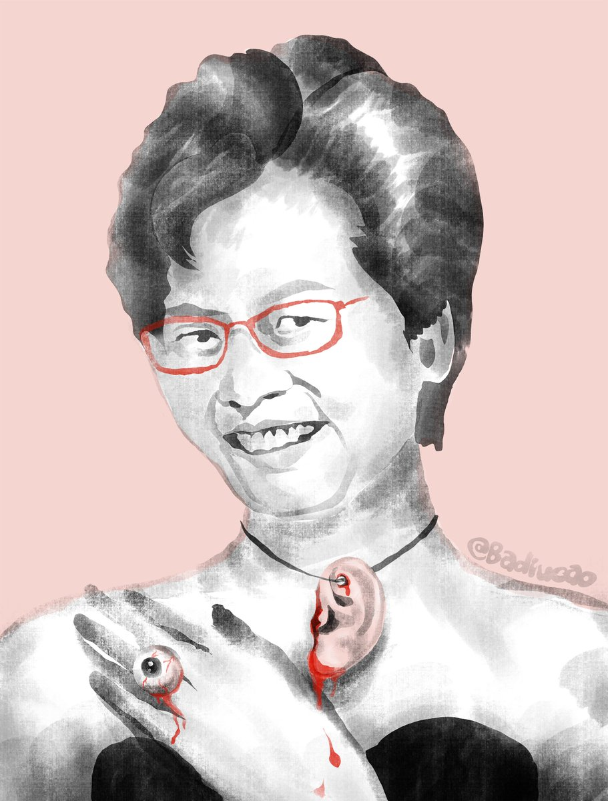
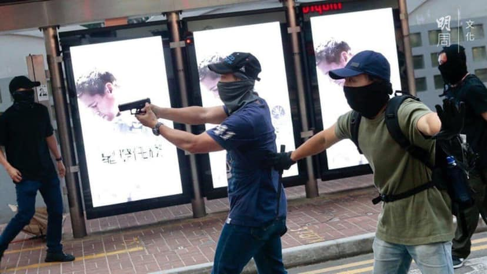

[11月06日 11:53]    新闻大吐槽   @TuCaoFakeNews      :speech_balloon:评:0 :+1:赞:1 :globe_with_meridians:转:1  

[11月06日 11:52]    新闻大吐槽   @TuCaoFakeNews    那麼重直刺心臟的一刀，不見血反而好大力！  :speech_balloon:评:0 :+1:赞:1 :globe_with_meridians:转:1  

[11月06日 11:52]    新闻大吐槽   @TuCaoFakeNews    笑死人了，大陆警察镇压香港人，顺便去香港代购，有一点出息吗？ https://twitter.com/TuCaoFakeNews/status/1191836870390321152 …  :speech_balloon:评:1 :+1:赞:1 :globe_with_meridians:转:2  

[11月06日 11:51]    新闻大吐槽   @TuCaoFakeNews    胡力任：现场实拍，美国最好的猪肋排与牛肉折合人民币16元每斤。

中共国老百姓看看，中共国的通胀是不是很厉害？@dongle_smith
醒来吧，天快亮了！@sihoen3  :speech_balloon:评:0 :+1:赞:3 :globe_with_meridians:转:2  

[11月06日 11:48]    新闻大吐槽   @TuCaoFakeNews    刀上无任何血迹  :speech_balloon:评:0 :+1:赞:3 :globe_with_meridians:转:1  

[11月06日 11:47]    新闻大吐槽   @TuCaoFakeNews    太假了！
1、被刺中左胸后居然还能站着，而且流血也不多，难道是金刚狼？
2、视频里可以听到金属碰击的声音  :speech_balloon:评:0 :+1:赞:3 :globe_with_meridians:转:2  

[11月06日 11:45]    新闻大吐槽   @TuCaoFakeNews    感觉刺到了铁锅上，当的一声，弯了  :speech_balloon:评:0 :+1:赞:1 :globe_with_meridians:转:1  

[11月06日 11:44]    新闻大吐槽   @TuCaoFakeNews    感覺太假了，平常人遇刺最先的反應是跑或者嚇懵了站在當場，沒訓練過的就算有假設性心理準備也不可能反應如此鎮定，而周圍的人反應更是快如特工007，而且刺殺者如果真的要殺他那麼高大的身材最少可以刺兩三刀吧  :speech_balloon:评:0 :+1:赞:1 :globe_with_meridians:转:1  

[11月06日 11:44]    新闻大吐槽   @TuCaoFakeNews    剛好在這個人出現後上前錄像，然後這個人摸著包這麼長時間他們還覺得沒什麼不對嗎？  :speech_balloon:评:0 :+1:赞:2 :globe_with_meridians:转:1  

[11月06日 11:44]    新闻大吐槽   @TuCaoFakeNews    我又仔细听了一遍，确实有钢板声  :speech_balloon:评:1 :+1:赞:2 :globe_with_meridians:转:1  

[11月06日 11:42]    新闻大吐槽   @TuCaoFakeNews    何君尧自己不仅不躲避，还和保安一起制服行凶者，也没见血，确实很像演戏。  :speech_balloon:评:1 :+1:赞:7 :globe_with_meridians:转:1  

[11月06日 11:41]    GFHG SDKM   @zyx_yny    有冇手足有警蛆車阻救護車救周同學嘅片or相。請註明時間。tg谷admin收集緊證據
#HKprotests  :speech_balloon:评:0 :+1:赞:1 :globe_with_meridians:转:1  

[11月06日 11:33]    新闻大吐槽   @TuCaoFakeNews    每次听，都热泪盈眶 https://twitter.com/tucaofakenews/status/1191665290267910145 …  :speech_balloon:评:1 :+1:赞:4 :globe_with_meridians:转:1  

[11月06日 11:32]    新闻大吐槽   @TuCaoFakeNews    每次听这首歌曲就会因悲愤交加而落泪…  :speech_balloon:评:0 :+1:赞:1 :globe_with_meridians:转:1  

[11月06日 11:28]    新闻大吐槽   @TuCaoFakeNews    演戲，苦肉計，只能這麼猜，他當街拜票都沒人理，演戲造影響……  :speech_balloon:评:2 :+1:赞:13 :globe_with_meridians:转:3  

[11月06日 11:27]    新闻大吐槽   @TuCaoFakeNews    太假了，他反应也太快了吧，一看就知道他早知道一会儿要发生什么  :speech_balloon:评:1 :+1:赞:6 :globe_with_meridians:转:1  

[11月06日 11:26]    新闻大吐槽   @TuCaoFakeNews    香港青年好样的！
 https://twitter.com/TuCaoFakeNews/status/1191840070094868480 …  :speech_balloon:评:1 :+1:赞:20 :globe_with_meridians:转:7  

[11月06日 11:24]    新闻大吐槽   @TuCaoFakeNews    演戏的可能性高，正常情况义工的第一反应是恐惧，而不是一下子瞬间反应，去扑倒歹徒身上。  :speech_balloon:评:1 :+1:赞:3 :globe_with_meridians:转:1  

[11月06日 11:23]    老司机   @h5lpykl7tp6jjop    曾经中国人也是这个样子，说世界人民都生活在水深火热之中，说要解放全世界！
后来才知道，在那个斗志昂扬的年代，饿死了几千万中国人。  :speech_balloon:评:2 :+1:赞:15 :globe_with_meridians:转:5  

[11月06日 11:15]    老司机   @h5lpykl7tp6jjop    中共的一带一路没有走出去，黑哥的一带一路一串串的冲进来了！现在是烫手山芋，无法解决，后患无穷！  :speech_balloon:评:2 :+1:赞:3 :globe_with_meridians:转:3  

[11月06日 11:12]    新闻大吐槽   @TuCaoFakeNews    被捅了還那麼有力氣壓住捅他的人？看看上次任達華被捅時的反應可不是這樣的  :speech_balloon:评:0 :+1:赞:14 :globe_with_meridians:转:2  

[11月06日 11:06]    老司机   @h5lpykl7tp6jjop    现在老子又出来缴械投降了！  :speech_balloon:评:1 :+1:赞:1 :globe_with_meridians:转:0  

[11月06日 11:00]    BBC News 中文   @bbcchinese    澳大利亚一个屠宰场内的赛马遭虐杀的视频曝光，显示马匹遭猛踢头部，甚至被电击生殖器官，引起当地人强烈反感。 https://bbc.in/2ChgflL   :speech_balloon:评:8 :+1:赞:15 :globe_with_meridians:转:17  

[11月06日 11:00]    纽约时报中文网   @nytchinese    • 报道称一名香港大学生在周一警方发射催泪瓦斯时坠楼，目前情况危急；林郑表示对抗议活动中不断增加的伤害感到不安。数百名示威者周二再次上街。
 • 美国商务部数据显示，今年前三季度，美国商品和服务贸易逆差增至4813亿美元，较去年同期增长5.4%。更多简报内容： http://nyti.ms/34D2pGL   :speech_balloon:评:2 :+1:赞:2 :globe_with_meridians:转:0  

[11月06日 10:53]    新闻大吐槽   @TuCaoFakeNews    何的日文名我想好了——钢板次川 https://twitter.com/tucaofakenews/status/1191901047955963905 …  :speech_balloon:评:2 :+1:赞:8 :globe_with_meridians:转:1  

[11月06日 10:47]    纽约时报中文网   @nytchinese    #新新世界 TikTok在全球舞台强势崛起，但这也可能毁了它 http://nyti.ms/36ByQXG https://twitter.com/ccni/status/1191908693123780608 …  :speech_balloon:评:2 :+1:赞:5 :globe_with_meridians:转:3  

[11月06日 10:30]    纽约时报中文网   @nytchinese    到目前为止，已有十几名科学家从美国各地的大学和研究中心辞职或被单位解雇。这些人中有的拒绝讨论针对他们的指控，有的则否认有任何不当行为。
在有些案子中，获得了美国国家卫生研究院(NIH)或其他联邦机构经费支持的科学家被指控同时接受了中国政府的资助，违反了NIH的规定。 http://nyti.ms/2pFUQA0   :speech_balloon:评:3 :+1:赞:5 :globe_with_meridians:转:2  

[11月06日 10:01]    老司机   @h5lpykl7tp6jjop    今日网评：什么是正确的价值观？  :speech_balloon:评:1 :+1:赞:5 :globe_with_meridians:转:7  

[11月06日 09:50]    纽约时报中文网   @nytchinese    早安！今日重点新闻包括：
TikTok崛起引发不安；习近平讲话强调自由贸易；香港大学生在抗议活动中坠楼；特朗普弹劾调查关键证人修改证词；美国多州迎来选举日；法国对中国展开“博物馆外交”；墨西哥一摩门教家庭九名成员遇害……新闻简报带你速览今日要闻。 http://nyti.ms/34D2pGL   :speech_balloon:评:4 :+1:赞:11 :globe_with_meridians:转:2  

[11月06日 09:34]    GFHG SDKM   @zyx_yny    何妖被斬，請冷處理。 否則變民鬥民，雙方武力升級，香港人冇著數(普通人帶𠝹刀都拉，藍絲出菜刀都冇事) 
 
佢亦暫時仲係立法會議員，高調慶祝等如認可對政客暴力。
 
開香檳，私下開算喇。  :speech_balloon:评:14 :+1:赞:68 :globe_with_meridians:转:32  

[11月06日 09:30]    纽约时报中文网   @nytchinese    #新新世界 一些业内高管表示，今日头条曾吸引了之前用铁腕统治着中国互联网的前网信办主任鲁炜的注意。
其他互联网公司抱怨头条窃取他们的内容时，鲁炜的一位高级助手告诉他们，他喜欢头条，他们应该停止抱怨，与头条合作。 http://nyti.ms/36ByQXG   :speech_balloon:评:2 :+1:赞:1 :globe_with_meridians:转:0  

[11月06日 08:58]    BBC News 中文   @bbcchinese    英国专业健康人士最近发出警告称，越来越多的瑜伽教练出现严重的髋关节问题。 https://bbc.in/32qfiCA   :speech_balloon:评:4 :+1:赞:42 :globe_with_meridians:转:39  

[11月06日 08:23]    BBC News 中文   @bbcchinese    新德里有能力像北京一样治理雾霾吗？特朗普退群又给其它国家什么示范？ https://bbc.in/2NIgyeJ   :speech_balloon:评:11 :+1:赞:12 :globe_with_meridians:转:11  

[11月06日 07:34]    BBC News 中文   @bbcchinese    美国商务部长罗斯之前对《金融时报》记者说，“暗淡蓝点”的含义是地图上的一个小点，如果商业公司有兴趣进行可持续的基建项目，那里就是他们能够安全经营运行的地方，“其意义在于显示可持续项目的重要性”。 https://bbc.in/33mEydY   :speech_balloon:评:2 :+1:赞:15 :globe_with_meridians:转:15  

[11月06日 06:54]    BBC News 中文   @bbcchinese    报道说，印度作为大国加入中国推动的区域全面经济伙伴关系协定有利于平衡中国的影响力。 https://bbc.in/2rfWKYJ   :speech_balloon:评:15 :+1:赞:19 :globe_with_meridians:转:5  

[11月06日 05:43]    新闻大吐槽   @TuCaoFakeNews    依家黑警結婚大晒呀，洗唔洗半夜放催淚彈殺死 #香港人  :speech_balloon:评:1 :+1:赞:4 :globe_with_meridians:转:3  

[11月06日 00:14]    GFHG SDKM   @zyx_yny    有冇英文文宣手足 https://twitter.com/jim97147570/status/1191499676475785216 …  :speech_balloon:评:0 :+1:赞:2 :globe_with_meridians:转:2  

[11月05日 23:40]    GFHG SDKM   @zyx_yny    We are all V  :speech_balloon:评:0 :+1:赞:1 :globe_with_meridians:转:0  

[11月05日 23:37]    GFHG SDKM   @zyx_yny    Today 5/11 is the day that #AntiMaskLaw has been introduced for one month.
But it can’t stop us. #HKprotesters will not surrender.
#VforVendetta  :speech_balloon:评:1 :+1:赞:6 :globe_with_meridians:转:4  

[11月05日 23:25]    BBC News 中文   @bbcchinese    所有尸体的腹部都有一道细小的剖口，像手术刀切口一样利落精准。心和肝都不见了。这是谁干的？怎么干的？ https://bbc.in/2NGrKsw   :speech_balloon:评:24 :+1:赞:65 :globe_with_meridians:转:21  

[11月05日 22:52]    GFHG SDKM   @zyx_yny    Here is the video  :speech_balloon:评:4 :+1:赞:115 :globe_with_meridians:转:116  

[11月05日 21:30]    纽约时报中文网   @nytchinese    #观点 气候变化的一个主要原因一直被忽视或轻视：服装。一项研究显示，服装和鞋类行业的温室气体排放量占全球的8%，几乎相当于整个欧盟。如果不进行干预，到2030年，该行业对气候的影响将增加近一半。
每个人都能在让服装变得可持续方面发挥作用，你能做些什么？ http://nyti.ms/2CdlbIt   :speech_balloon:评:27 :+1:赞:23 :globe_with_meridians:转:9  

[11月05日 21:07]    BBC News 中文   @bbcchinese    “刷脸”时代来临，你是否担心刷完之后可能面对的风险？ https://bbc.in/2NjKizN   :speech_balloon:评:36 :+1:赞:16 :globe_with_meridians:转:14  

[11月05日 21:00]    纽约时报中文网   @nytchinese    习近平发言的大部分内容都着重于保证中国将维持其长期的经济改革和开放计划。
许多西方经济学家认为，习近平执政七年以来，已逐渐将经济转回对国内产业、尤其是国有企业的依赖。 http://nyti.ms/33huenv   :speech_balloon:评:15 :+1:赞:11 :globe_with_meridians:转:0  

[11月05日 20:30]    纽约时报中文网   @nytchinese    美国国家卫生研究院说，一些接受调查的研究人员用美国政府资助、美国机构拥有的研究成果，已经在中国获取了专利。
政府官员和大学管理人员说，还有些人涉嫌在中国设立实验室，秘密地复制他们在美国的研究。 http://nyti.ms/2pFUQA0   :speech_balloon:评:68 :+1:赞:16 :globe_with_meridians:转:4  

[11月05日 20:30]    纽约时报中文网   @nytchinese    中国起初否认其工厂违反了对CFC-11的禁令，但政府也承诺取缔其发现的任何非法生产。周三，该国向《蒙特利尔议定书》缔约国会议提交报告，介绍了中方的行动。
中国表示专门加强了监控和执法，向检查人员提供设备，以便立即发现CFC-11的存在，并建立了六个地区检测实验室。 http://nyti.ms/32j2Owc   :speech_balloon:评:7 :+1:赞:5 :globe_with_meridians:转:1  

[11月05日 20:17]    GFHG SDKM   @zyx_yny    #LIVE: It's been a month since HK leader, Carrie Lam, invoked the Emergency Regulations Ordinance and enacted the mask ban. Yet, people are not deterred. Hundreds gather in Tsim Sha Tsui. "We are not scared of dying; we use our deaths to threaten you," they chant. #antiELAB  :speech_balloon:评:13 :+1:赞:242 :globe_with_meridians:转:185  

[11月05日 20:02]    纽约时报中文网   @nytchinese    #新新世界 在科技铁幕拉下之际，字节跳动是少有的能在全球互联网取得成功的中国科技公司。
但生活在一个由中国支持的社交媒体影响的世界里，一些美国人为该应用构成的潜在国家安全和隐私威胁感到担忧。by @LiYuan6 http://nyti.ms/36ByQXG   :speech_balloon:评:20 :+1:赞:28 :globe_with_meridians:转:9  

[11月05日 20:01]    BBC News 中文   @bbcchinese    【前苏联领袖戈尔巴乔夫回望历史 告诫全球废除核武】在柏林围墙倒下，共产东德倒台30周年之际，苏联最后一任总统戈尔巴乔夫接受BBC驻莫斯科记者罗森伯格（Steve Rosenberg）专访。他回忆当年为何决定不介入东德局势之余，促请世界各国齐心裁撤核武器。 https://bbc.in/2NfrYrn   :speech_balloon:评:14 :+1:赞:25 :globe_with_meridians:转:13  

[11月05日 19:51]    纽约时报中文网   @nytchinese    习近平周二在上海的中国国际进口博览会开幕式上强调了对自由贸易原则的广泛支持，并承诺将坚持改革开放的基本国策、欢迎外国投资。
他没有提及中美贸易战，但通过谴责单边主义间接批评了特朗普政府。 http://nyti.ms/33huenv   :speech_balloon:评:12 :+1:赞:17 :globe_with_meridians:转:3  

[11月05日 19:25]    墙国铁拳现世报😷   @Socialistfist    丈夫民警妻子教师，生第三胎被单位双双开除。

#社会主义铁拳  :speech_balloon:评:33 :+1:赞:276 :globe_with_meridians:转:101  

[11月05日 19:01]    BBC News 中文   @bbcchinese    台湾总统蔡英文上任后，已有7个邦交国与台湾断交。而洪都拉斯财政部长表示，台湾将提供3亿美元贷款，学者认为这笔贷款目的是巩固邦交。 https://bbc.in/2py5Dwn   :speech_balloon:评:72 :+1:赞:51 :globe_with_meridians:转:13  

[11月05日 18:43]    GFHG SDKM   @zyx_yny    We put the student in our prayers. https://twitter.com/li8jim/status/1191621688909123584 …  :speech_balloon:评:316 :+1:赞:3561 :globe_with_meridians:转:2197  

[11月05日 18:35]    新闻大吐槽   @TuCaoFakeNews    香港年轻人在伦敦圣潘克拉斯国际车站演奏钢琴版「荣光归于香港」！
远在异国的他，悲愤随着他有力的指尖撞击在琴键上，散播在空气中！他在为脑干死亡的手足痛心吗？

匆匆行人啊，能否停下脚步，聆听些许他对自由的向往？他们可是在用血和恶魔搏斗！
国际社会，请救救香港人！  :speech_balloon:评:101 :+1:赞:2242 :globe_with_meridians:转:822  

[11月05日 18:31]    BBC News 中文   @bbcchinese    美国已通知联合国，正式开启退出《巴黎协议》的程序，为期一年。
这将对全球气候产生怎样影响？ https://bbc.in/2JSwEBp   :speech_balloon:评:35 :+1:赞:48 :globe_with_meridians:转:9  

[11月05日 18:12]    GFHG SDKM   @zyx_yny    When this student dies over #extraditionlaw, his blood is on Commiessar Lam's hands!  :speech_balloon:评:378 :+1:赞:2289 :globe_with_meridians:转:1700  

[11月05日 17:51]    BBC News 中文   @bbcchinese    该名科大学生接受多次手术。综合香港传媒报道，他的情况并不乐观。  :speech_balloon:评:114 :+1:赞:231 :globe_with_meridians:转:129  

[11月05日 17:50]    GFHG SDKM   @zyx_yny    Hundreds of #HK secondary students hold masked protests on 1mo anniversary of executive edict banning masks & also object to recent arrests of fellow students. #香港人反抗  https://www.scmp.com/news/hong-kong/politics/article/3036355/hong-kong-pupils-cover-faces-citywide-protests-marking-one …  :speech_balloon:评:4 :+1:赞:255 :globe_with_meridians:转:185  

[11月05日 17:30]    纽约时报中文网   @nytchinese    林郑月娥能否继续担任香港特首，取决于习近平的明确支持，此次表态可能会让她松一口气，此前一直有传言称，习近平可能会在抗议活动平息后要求她下台。
不过，林郑月娥的政治前途可能取决于如何处理中国领导人上周宣布的计划，即在香港执行更严厉的“国家安全”措施。 http://nyti.ms/33lRZuM   :speech_balloon:评:9 :+1:赞:17 :globe_with_meridians:转:3  

[11月05日 17:00]    纽约时报中文网   @nytchinese    周一公布的数据显示，自2012年以来，被禁的破坏臭氧层的气体CFC-11排放量意外上升，但在过去两年中，排放量似乎有所下降。
中国曾被认为是主要排放来源。调查表明，如今中国在打击非法生产方面取得了进展。 http://nyti.ms/32j2Owc   :speech_balloon:评:6 :+1:赞:17 :globe_with_meridians:转:3  

[11月05日 16:00]    纽约时报中文网   @nytchinese    美国正在打击生物医学领域知识产权盗窃，180起涉及潜在知识产权盗窃的案子几乎均涉及华裔科学家。这些调查加剧了对中国利用美国科学体系的相对开放性从事经济间谍活动的担忧。
一些批评人士称，随着中美地缘政治竞争加剧，调查正在不公平地把华裔科学家当作审查对象。 http://nyti.ms/2pFUQA0   :speech_balloon:评:94 :+1:赞:113 :globe_with_meridians:转:44  

[11月05日 15:35]    纽约时报中文网   @nytchinese    据新华社报道，习近平周一晚间在上海会见林郑月娥时对她表示了支持。林郑月娥向习近平介绍了香港的事态发展；习近平表示对林郑“高度信任”、“充分肯定”。
与此同时，习近平还提醒林郑月娥，北京支持对抗议活动采取严厉措施。 http://nyti.ms/33lRZuM   :speech_balloon:评:72 :+1:赞:125 :globe_with_meridians:转:59  

[11月05日 15:01]    BBC News 中文   @bbcchinese    香港《逃犯条例》修订引发的抗议活动持续5个月后，中国国家主席习近平会见香港特首林郑月娥，肯定她的工作。大家对林郑月娥的工作表现有什么看法？ https://bbc.in/2NGSUiL   :speech_balloon:评:123 :+1:赞:107 :globe_with_meridians:转:26  

[11月05日 15:00]    纽约时报中文网   @nytchinese    #观点 现在Facebook上有一则广告，称拜登给了乌克兰总检察长10亿美元，让后者不要调查自己的儿子。这不是捍卫言论自由，马克，而是在攻击真相。
你我都希望保护言论，确保没有人因为说了或写了不受欢迎的东西而遭监禁或杀害，而不是确保谎言能够不受约束地进入美国选民的视线。 http://nyti.ms/32jEgDk   :speech_balloon:评:12 :+1:赞:14 :globe_with_meridians:转:6  

[11月05日 14:30]    纽约时报中文网   @nytchinese    为了改善空气质量，周一，新德里的官员开始对私家车实行单双日车牌限号。
尽管如此，周一大部分城市的空气质量指数仍停留在被认为是“非常差”的400左右。 http://nyti.ms/2WKE7rG   :speech_balloon:评:1 :+1:赞:0 :globe_with_meridians:转:4  

[11月05日 14:01]    BBC News 中文   @bbcchinese    林郑月娥早前表示，香港目前面对的经济下行比当年非典和金融风暴等时期更严峻，但有经济学者不认同。香港当年经历政治风波及金融危机时，情况有多差？目前情况会否步当年后尘？ https://bbc.in/2NgwplJ   :speech_balloon:评:35 :+1:赞:30 :globe_with_meridians:转:11  

[11月05日 14:00]    纽约时报中文网   @nytchinese    #观点 我钦佩你对言论自由的坚定信仰。我从第一修正案中获益良多。最重要的是，它是我们民主的基石，需要坚决贯彻。
但是，但Facebook上的虚假政治广告不是捍卫言论自由，而是在用疯狂的谎言把水搅浑。谎言对我们的选举、我们的生活和我们孩子的生活有着非常真实和危险的影响。 http://nyti.ms/32jEgDk   :speech_balloon:评:20 :+1:赞:159 :globe_with_meridians:转:54  

[11月05日 13:30]    纽约时报中文网   @nytchinese    周末，印度新德里空气污染“破表”，政府宣布进入公共卫生紧急状态。官员们开始限制汽车使用、关闭小学，并暂停建设项目。NASA的卫星图像显示，印度北部大片平原被雾霾笼罩。
在许多地区，致命颗粒物的水平达到了全球安全限值的60倍左右，相当于每天吸烟超过两包。 http://nyti.ms/2WKE7rG   :speech_balloon:评:21 :+1:赞:49 :globe_with_meridians:转:29  

[11月05日 13:00]    BBC News 中文   @bbcchinese    让我们告诉你威士忌的由来！  :speech_balloon:评:11 :+1:赞:71 :globe_with_meridians:转:29  

[11月05日 13:00]    纽约时报中文网   @nytchinese    #每日一词 Oligarch，寡头。欧盟每年花650亿美元补贴农业，但时报调查发现，在整个匈牙利及中欧和东欧的大部分地区，这些钱大多流向寡头(oligarchs)和民粹主义者的口袋。
Oligarch意为寡头政治家、寡头统治集团成员；寡头政治指的是由少数人掌握政权的统治形式。更多简报内容： http://nyti.ms/34sLgzi   :speech_balloon:评:6 :+1:赞:7 :globe_with_meridians:转:3  

[11月05日 12:00]    BBC News 中文   @bbcchinese    70多年前的世界首富、大英帝国印度王公米尔·奥斯曼·阿里·汗至今仍是印度历史上最富有的人。 https://bbc.in/2Cf2vrT   :speech_balloon:评:8 :+1:赞:55 :globe_with_meridians:转:20  

[11月05日 11:26]    GFHG SDKM   @zyx_yny    Did any reporter capture this "FAKE" @hkpoliceforce cop assigned code? Reporters need to ask if there arePeople's Armed Police cops in Hong Kong in #HKPF uniform as riot cops. https://twitter.com/themonma/status/1191509700153495554 …  :speech_balloon:评:311 :+1:赞:4322 :globe_with_meridians:转:3774  

[11月05日 11:00]    BBC News 中文   @bbcchinese    你买咖啡的时候，有没有发觉大中小三种容量，中杯价格几乎和大杯差不多，很多人就是为了贪小便宜而多花了钱，反而还觉得自己赚了。 https://bbc.in/2qhs8pb   :speech_balloon:评:4 :+1:赞:116 :globe_with_meridians:转:45  

[11月05日 10:49]    BBC News 中文   @bbcchinese    习近平在香港“反送中”运动爆发后，首次开腔肯定香港特首林郑月娥的工作。  :speech_balloon:评:157 :+1:赞:435 :globe_with_meridians:转:137  

[11月05日 09:54]    BBC News 中文   @bbcchinese    这个霉菌的用途，真的令人意想不到！  :speech_balloon:评:0 :+1:赞:42 :globe_with_meridians:转:14  

[11月05日 09:47]    墙国铁拳现世报😷   @Socialistfist    发推后，该用户微博改名，头像更换，微博删除至2016年内容  :speech_balloon:评:2 :+1:赞:89 :globe_with_meridians:转:9  

[11月05日 09:42]    BBC News 中文   @bbcchinese    蒙娜丽莎有个妹妹？ https://bbc.in/2Ng5pCT   :speech_balloon:评:3 :+1:赞:18 :globe_with_meridians:转:9  

[11月05日 08:18]    BBC News 中文   @bbcchinese    “来自其他宇宙的”暗能量 https://bbc.in/32ggs3t   :speech_balloon:评:4 :+1:赞:10 :globe_with_meridians:转:2  

[11月05日 04:28]    凡賽堤/FORSETI   @FecharCCP    急救香港  #HKSOS！！！

天滅流氓政權！！！極權殺人恐怖組織正在用各種兇殘手段殺害我們的同胞..................................................

流氓政權的極權殺人恐怖組織蓄意謀殺香港年輕人！（13）

被暴力制服的年輕人已經休克，還殘暴折斷手！

兇殘，殘暴手段令人髮指到已經超越納粹！  :speech_balloon:评:0 :+1:赞:3 :globe_with_meridians:转:10  

[11月05日 03:49]    GFHG SDKM   @zyx_yny    Today's Daily at King Cross.
A Hong Kong youth was playing <Glory to Hong Kong> piano version in St. Pancras Int station.  :speech_balloon:评:117 :+1:赞:2278 :globe_with_meridians:转:1193  

[11月04日 22:43]    墙国铁拳现世报😷   @Socialistfist    #社会主义铁拳 https://twitter.com/Time_HorizonX/status/1191288775348908032 …  :speech_balloon:评:16 :+1:赞:312 :globe_with_meridians:转:84  

[11月04日 11:34]    GFHG SDKM   @zyx_yny    Just in: Local paper @mingpaocom confirms that this first-aid volunteer is a freshman from Hong Kong Shue Yan University. Holding a certificate in first aid, he was amply performing his duties on Nov 2, says the student union. He is in stable condition. Photo from @cityusucbc  :speech_balloon:评:6 :+1:赞:189 :globe_with_meridians:转:139  

[11月04日 10:28]    GFHG SDKM   @zyx_yny    A human Ear Necklace ——  #CarrieLam’s new jewelry delivered from last night‘s pro Beijing attack. 
An ear，several eyes and dozens of young lives of HongKong protesters are all in her bloody collection.
Enough is enough！
#HongKongProtests #StandWithHongKong  :speech_balloon:评:51 :+1:赞:816 :globe_with_meridians:转:607  

[11月04日 10:26]    GFHG SDKM   @zyx_yny    Facebook have blocked the share function of photos that reflects the fact of #HKPoliceTerrorists
#StandWithHongKong  :speech_balloon:评:2 :+1:赞:18 :globe_with_meridians:转:28  

[11月04日 09:40]    GFHG SDKM   @zyx_yny    Facebook is trying to delete the photo, cover the crime of Hk police!  
#HKPoliceTerrorists  :speech_balloon:评:0 :+1:赞:15 :globe_with_meridians:转:25  

[11月04日 02:58]    GFHG SDKM   @zyx_yny    香港天天在死人，世界人民眼睁睁看着却毫无办法？这是人类的奇耻大辱！  :speech_balloon:评:1 :+1:赞:40 :globe_with_meridians:转:16  

[11月03日 20:58]    GFHG SDKM   @zyx_yny     #BREAKING: Graphic Warning!

Dr Andrew Chiu, district councillor’s EAR was brutally BITTEN OFF — can you see the #smirking face of the Pro-#Beijing Attacker!!!?

#crazyHongKong #HongKongProtests #HongKong #antichinazi #chinazi  :speech_balloon:评:2 :+1:赞:53 :globe_with_meridians:转:53  

[11月03日 20:48]    GFHG SDKM   @zyx_yny    #HongKong - a knife-wielding Pro-#Beijing supporter brutally BITES OFF part of a district councillor's EAR after argument over politics.

Brave bystanders caught him before he tried to escape.

— “Is it just me, or is it getting #CRAZIER out there?”
#HongKongProtests #香港デモ  :speech_balloon:评:15 :+1:赞:292 :globe_with_meridians:转:309  

[11月03日 17:49]    GFHG SDKM   @zyx_yny    NCM Yue 教大家點樣遊説議員做香港人權民主法案 co-sponsor
主要係形容
官逼民反（唔俾和平集會）、
黑警濫暴（建議手足俾埋相同影片證據）、
操控選舉（DQ 黃之鋒、拉區議會候選人）

每日都發生太多荒謬、難過既事
如果今個會期過唔到要等下年
我哋冇咁多時間
前線做咗好多, 文宣都要發力 https://twitter.com/solomonyue/status/1190667854162599937 …  :speech_balloon:评:11 :+1:赞:357 :globe_with_meridians:转:284  

[11月02日 22:35]    墙国铁拳现世报😷   @Socialistfist    小编谨代表墙国铁拳现世报读者欢迎您来推特。
看来上次强拆不但把你村邻居房子拆了，还把你的防火墙也给拆了嘛 https://twitter.com/Xiuxianlu/status/1190623728545062912 …  :speech_balloon:评:8 :+1:赞:157 :globe_with_meridians:转:18  

[11月02日 18:26]    墙国铁拳现世报😷   @Socialistfist    如此猖狂, 举报头像来一波？  :speech_balloon:评:3 :+1:赞:92 :globe_with_meridians:转:7  

[11月02日 18:12]    墙国铁拳现世报😷   @Socialistfist    P1 头像煽动颠覆
P2 韭菜谈奴性  :speech_balloon:评:9 :+1:赞:133 :globe_with_meridians:转:18  

[11月02日 18:06]    墙国铁拳现世报😷   @Socialistfist    别人家被强拆，可以接受
别人家被强拆，自己被拔了网线，是万万不能接受的

#社会主义铁拳  :speech_balloon:评:36 :+1:赞:351 :globe_with_meridians:转:97  

[11月01日 19:31]    墙国铁拳现世报😷   @Socialistfist    掐指一算，已经是两周了。希望兔兔可以被善待  :speech_balloon:评:14 :+1:赞:116 :globe_with_meridians:转:15  

[11月01日 17:52]    纽约时报中文网   @nytchinese    中国大学正在部署学生对教师进行监督，越来越多的“学生信息员”密切关注着教授的思想观点。他们既是学生又是间谍，其任务是帮助铲除对习近平和共产党有不忠迹象的教师。
这场大规模行动的目的是消除异议，把大学变成党的根据地。至今已有十几名教授遭举报后被开除或处罚。 http://nyti.ms/2PzncGG   :speech_balloon:评:197 :+1:赞:704 :globe_with_meridians:转:412  

[11月01日 17:39]    墙国铁拳现世报😷   @Socialistfist    可惜北京的青天习老爷不玩微博

#社会主义铁拳  :speech_balloon:评:23 :+1:赞:265 :globe_with_meridians:转:61  

[11月01日 00:15]    财经真相   @caijingxiang    中共发行的数字货币究竟目的是什么？答案是毁灭全世界，摧毁美元世界霸权，进而摧毁世界贸易体系，再摧毁世界经济，最终将世界变成人间炼狱！  :speech_balloon:评:118 :+1:赞:500 :globe_with_meridians:转:232  

[10月31日 17:56]    墙国铁拳现世报😷   @Socialistfist    就当是给祖国母亲的生日礼物了~

#社会主义铁拳  :speech_balloon:评:31 :+1:赞:359 :globe_with_meridians:转:71  

[10月31日 06:13]    墙国铁拳现世报😷   @Socialistfist    香港导演争当护旗手！
结果当他翻拍鹿鼎记时，剧本翻来覆去修改多次，中共还是不予批准！

护旗手就是要给党折磨的
@Socialistfist  :speech_balloon:评:67 :+1:赞:554 :globe_with_meridians:转:137  

[10月30日 20:19]    墙国铁拳现世报😷   @Socialistfist    大家投票踊跃，下周就从点赞数从多到少挑四个选吧
有什么建议 意见可以回复此推  :speech_balloon:评:3 :+1:赞:32 :globe_with_meridians:转:1  

[10月30日 20:17]    墙国铁拳现世报😷   @Socialistfist    后续  :speech_balloon:评:2 :+1:赞:29 :globe_with_meridians:转:2  

[10月30日 20:12]    墙国铁拳现世报😷   @Socialistfist    推友最喜爱“上周最佳铁拳” 评选活动
更多选项看后续  :speech_balloon:评:2 :+1:赞:75 :globe_with_meridians:转:16  

[10月30日 19:24]    墙国铁拳现世报😷   @Socialistfist    全文  :speech_balloon:评:2 :+1:赞:71 :globe_with_meridians:转:13  

[10月30日 19:24]    墙国铁拳现世报😷   @Socialistfist    收了几次精赵智商税就开始闹，成何体统？
原文已删，全文看后续

#社会主义铁拳  :speech_balloon:评:9 :+1:赞:257 :globe_with_meridians:转:73  

[10月29日 19:22]    墙国铁拳现世报😷   @Socialistfist    “哎呦.....太君别开枪.....”

#社会主义铁拳
#社会主义特别行政区铁拳  :speech_balloon:评:35 :+1:赞:445 :globe_with_meridians:转:136  

[10月28日 19:42]    墙国铁拳现世报😷   @Socialistfist    药房老板现时仍未回港，店员胡先生今日戴上口罩回店内用漂白水清洁，四名便衣警员到药房表示「唔好意思」，期望药房体谅，他坦言唯有接受道歉。
胡先生续指，估计损失约 1,000 元。他提到，昨晚蘗房已拉半闸，警方未有举起黑旗便施放催泪弹，形容警方是「乱咁射」，但需老板回港后才决定是否追究。  :speech_balloon:评:3 :+1:赞:63 :globe_with_meridians:转:11  

[10月28日 19:39]    墙国铁拳现世报😷   @Socialistfist    尖沙咀发起集会，演变成多处警民冲突，其中晚上警方施放的一枚催泪弹射入位于弥敦道的「明寅药房」，警方今早约4 名便衣警员到店舖道歉，向员工表示「唔好意思」。警员逗留约 2 分钟后离开，并无解释催泪弹射入药房的原因。  :speech_balloon:评:2 :+1:赞:60 :globe_with_meridians:转:8  

[10月28日 19:39]    墙国铁拳现世报😷   @Socialistfist    陈柏雄, 药房东主，在FB上撑警及赞同六四镇压嘅言论，包括他在10月5日发表「当年出坦克车，原来是最正确决定！」、10月8日称抗争者为「暴徒、垃圾废青、曱甴」，又称听到「兄弟、手足」令佢「作呕」。  :speech_balloon:评:2 :+1:赞:66 :globe_with_meridians:转:8  

[10月09日 00:47]    GFHG SDKM   @zyx_yny    "Son, when you grow up
You will be the savior of the broken
The beaten, and the damned?"
Please watch this powerful mv #HongKongProtester #hkprotests 
香港反送中護法戰爭(Hong Kong Defensive War 2019)：Welcome To The Black Parade  https://youtu.be/0yXTHODE24Q  via @YouTube  :speech_balloon:评:3 :+1:赞:17 :globe_with_meridians:转:4  

[10月05日 09:33]    凡賽堤/FORSETI   @FecharCCP    呼籲請求共同挖掘所有有關香港發生的事，越全面越好，不同角度，越多越好，包括被暗地抓捕的人員，特別是CCP 派出的各種偽裝身份，包括變身變裝行兇的一點一滴都要挖掘出來，把CCP 的邪惡下三濫手段的真相毫無保留的曝光在全世界面前！世界公知公義才能真正挽救和保護香港人！希望懂視頻編輯配上中英文 https://twitter.com/hjjohnson17/status/1178969916499746816 …  :speech_balloon:评:13 :+1:赞:20 :globe_with_meridians:转:11  

[03月13日 08:10]    老司机   @h5lpykl7tp6jjop    批评是批评家天生的使命！他们只感知对错，信奉真理，指出真相不吐不快，不在意权势和群众的喜好，从批评里不可能获得任何好处，但批评家愚直不改。在中国几乎所有人都讨厌批评家，喜欢阴谋家，因为他们只说好听的！可是就因为中国的批评家太少，中国几乎看不到未来和希望！  :speech_balloon:评:86 :+1:赞:198 :globe_with_meridians:转:41  

