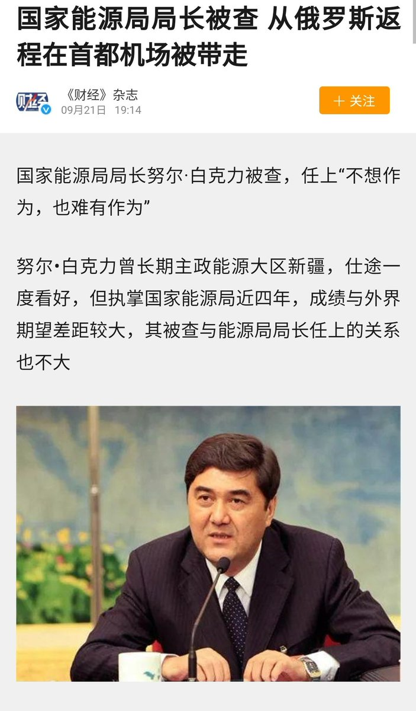

[12月10日 05:08]    老司机   @h5lpykl7tp6jjop    更愚蠢的是还有边吃补药一边抽烟喝酒的，不知道脑子装的是什么！还有发清除尼古丁民间奇方贴的家伙，连呼吸系统和消化系统是两个通道都没弄明白，唉……  :speech_balloon:评:1 :+1:赞:6 :globe_with_meridians:转:1  

[12月10日 04:48]    老司机   @h5lpykl7tp6jjop    中国人特别迷信靠吃补药能强身健体，所以搞各类补品发财的富豪一大群，无论怎样揭发这是骗局，但官商勾结的体制下依然毫发无损，鸿毛药酒如今仍是优秀企业！吃补药的中国人越来越多，身体越来越弱，难道他们从来没想过吃薯条汉堡的洋人是靠运动变强壮的？说到底是懒！想出个靠吃变强的理论骗自己和子孙  :speech_balloon:评:2 :+1:赞:16 :globe_with_meridians:转:2  

[12月10日 04:24]    老司机   @h5lpykl7tp6jjop    这就是所谓保一方平安的公安局长？还指望它们维护社会稳定，不知道要牺牲多少幼女！禽兽治国，淫棍横行！  :speech_balloon:评:1 :+1:赞:17 :globe_with_meridians:转:9  

[12月10日 02:24]    墙国铁拳现世报😷   @Socialistfist    不了解铁拳的老朋友兔兔是谁的请看这里 https://twitter.com/Socialistfist/status/1175057744858161159?s=19 …  :speech_balloon:评:2 :+1:赞:11 :globe_with_meridians:转:5  

[12月10日 02:15]    墙国铁拳现世报😷   @Socialistfist    另外点名批评的还有新加坡人李连杰和我们的老朋友兔兔 @zzyyzoe 最喜爱的  加拿大人吴亦凡  :speech_balloon:评:2 :+1:赞:20 :globe_with_meridians:转:5  

[12月10日 02:13]    墙国铁拳现世报😷   @Socialistfist    美籍刘亦菲一直以来就因为其国籍问题在墙国招致非议。在今年8月14日微博撑港警后让不少粉红对她国籍的质疑消停不少。没过多久，鹤岗网警就在12月5日发短片手撕刘亦菲
为了同时拥有人民币和美国护照，真乃里外不是人
#社会主义铁拳  :speech_balloon:评:10 :+1:赞:48 :globe_with_meridians:转:13  

[12月10日 00:04]    财经真相   @caijingxiang    深圳特区报：8号在华为全球旗舰店·深圳万象天地店，华为消费者业务软件部总裁王成录在“HUAWEI Talk主题分享”会中为现场观众带来了一场关于EMUI10的公开课。他透露，明年华为除了手机、平板和电脑，其他终端产品将全线搭载鸿蒙系统，并在海内外同步推进；鸿蒙系统的全面开源也将在明年8月正式开放。  :speech_balloon:评:29 :+1:赞:65 :globe_with_meridians:转:16  

[12月09日 23:59]    BBC News 中文   @bbcchinese    尽管这位伟大勇士的陵墓里可能有来自古蒙古帝国的宝藏，但蒙古人却希望陵墓的位置永远是个不解之谜。
 https://bbc.in/2Rvl7wC   :speech_balloon:评:4 :+1:赞:9 :globe_with_meridians:转:4  

[12月09日 23:30]    BBC News 中文   @bbcchinese    你要是口渴，就会去喝水，你要是感到孤独，就会去接触他人。如果这种比喻合理，那么孤独还会造成什么问题呢？
 https://bbc.in/38okkDu   :speech_balloon:评:7 :+1:赞:26 :globe_with_meridians:转:14  

[12月09日 23:19]    财经真相   @caijingxiang    金融界今天都在纪念保罗沃克尔，里根与卡特时期的美联储主席，美国杰出的经济学家，更是金融领域教科书级别的大神，其著名的沃克法则就是以他的名字命名的 https://twitter.com/NBCNews/status/1204056999534706690 …  :speech_balloon:评:0 :+1:赞:40 :globe_with_meridians:转:14  

[12月09日 23:13]    BBC News 中文   @bbcchinese    这名女子如何带领一队志愿者，对付印尼海洋生态危机？  :speech_balloon:评:5 :+1:赞:34 :globe_with_meridians:转:7  

[12月09日 23:00]    财经真相   @caijingxiang    现在市场最大的预期就是继续延后12月15号的关税，如果是这样的结果，人民币小幅上涨后继续围绕7震荡，如果谈判失败就会跌破7.2关口！ https://twitter.com/reuterscn/status/1203967838815490048 …  :speech_balloon:评:14 :+1:赞:81 :globe_with_meridians:转:25  

[12月09日 22:59]    BBC News 中文   @bbcchinese    烫乳是将女性的乳房用灼热的物体烫平，以延缓乳房发育，从而减少女性对男性的吸引力。来自西非的齐娜亚，10岁时也经历了烫乳。因为她的母亲说：“如果我不烫你，会有男人开始来找你，跟你做爱”。
 https://bbc.in/2sbfSay   :speech_balloon:评:13 :+1:赞:42 :globe_with_meridians:转:18  

[12月09日 21:59]    BBC News 中文   @bbcchinese    在我们这个星球的历史上，大规模的火山喷发曾经毁灭过生命。那么一次超级火山喷发会导致人类文明消亡吗？
 https://bbc.in/38nY64u   :speech_balloon:评:2 :+1:赞:12 :globe_with_meridians:转:6  

[12月09日 21:30]    BBC News 中文   @bbcchinese    这场由香港政府建议修订《逃犯条例》引起的示威浪潮至今已经持续半年，香港人究竟在争取什么？来听听他们的心声。 https://bbc.in/34173xy   :speech_balloon:评:22 :+1:赞:32 :globe_with_meridians:转:18  

[12月09日 20:59]    BBC News 中文   @bbcchinese    芬兰34岁的桑娜·马林（Sanna Marin）即将在本周宣誓就职，成为世界上最年轻的总理。而且，她领导的芬兰中间偏左联合政府中的五个党派，全部都是女性出任党内领袖。 https://bbc.in/2t0iZCQ   :speech_balloon:评:11 :+1:赞:104 :globe_with_meridians:转:27  

[12月09日 20:37]    纽约时报中文网   @nytchinese    #图集【那些在纽约拍摄的经典老电影】电影评论家常说：“城市像是电影中的另一个角色”，但纽约，确是电影里不折不扣的明星。数十年来，在这座城市拍摄的影片中诞生了无数银幕偶像、无数经典场景。点击查看图集： http://nyti.ms/36f03OY   :speech_balloon:评:0 :+1:赞:10 :globe_with_meridians:转:0  

[12月09日 20:30]    BBC News 中文   @bbcchinese    世界反兴奋剂机构（WADA）执委会宣布禁止俄罗斯在未来四年参加大型国际赛事，包括奥运会和世锦赛。
 https://bbc.in/2P2AuLm   :speech_balloon:评:25 :+1:赞:139 :globe_with_meridians:转:47  

[12月09日 20:24]    新闻大吐槽   @TuCaoFakeNews    实话是华为的天敌
纯正共党基因  :speech_balloon:评:2 :+1:赞:125 :globe_with_meridians:转:13  

[12月09日 20:24]    新闻大吐槽   @TuCaoFakeNews    实话是华为的天敌
纯正共党基因  :speech_balloon:评:2 :+1:赞:125 :globe_with_meridians:转:13  

[12月09日 20:19]    新闻大吐槽   @TuCaoFakeNews    上次说实话被华为威胁，这次说实话，又被华为水军攻击，马来西亚小哥跟华为杠上了！

他在Mate30Pro上用偏门方法安装谷歌套件后，发现Mcdonald与Netflix的app还是不能用，于是他在论坛发帖阐明事实，结果华为水军群起攻之，版主还删他帖~

不过幸好马来西亚没有251，他还可以继续在网上和华为水军战斗  :speech_balloon:评:34 :+1:赞:938 :globe_with_meridians:转:384  

[12月09日 20:19]    新闻大吐槽   @TuCaoFakeNews    上次说实话被华为威胁，这次说实话，又被华为水军攻击，马来西亚小哥跟华为杠上了！

他在Mate30Pro上用偏门方法安装谷歌套件后，发现Mcdonald与Netflix的app还是不能用，于是他在论坛发帖阐明事实，结果华为水军群起攻之，版主还删他帖~

不过幸好马来西亚没有251，他还可以继续在网上和华为水军战斗  :speech_balloon:评:34 :+1:赞:938 :globe_with_meridians:转:384  

[12月09日 20:04]    BBC News 中文   @bbcchinese    【中国全甲格斗：穿上中世纪盔甲格斗的幼儿园老师】今年39岁的陆奇是中国上海的一名幼儿园老师。但平时温柔的他在周末还有着另一个身份——一名“中世纪的武士”。
身着古代重甲，手持刀剑和盾牌在竞技场上格斗，这场景如今是中国逐渐兴起的全甲格斗爱好者们的日常。 https://bbc.in/2LmY8jk   :speech_balloon:评:2 :+1:赞:7 :globe_with_meridians:转:2  

[12月09日 20:02]    纽约时报中文网   @nytchinese    尽管许多人发誓要永远战斗下去，但不断加剧的不信任氛围促使一些示威者离开香港。
“他们知道，扔一块砖头会让他们坐上10年牢，“为被捕抗议者辩护的律师说。“他们对香港的司法制度失去了信心。” http://nyti.ms/2RAhOEu   :speech_balloon:评:37 :+1:赞:58 :globe_with_meridians:转:19  

[12月09日 19:41]    BBC News 中文   @bbcchinese    来自埃塞俄比亚的“真·房车”，你想进去住一晚吗？  :speech_balloon:评:15 :+1:赞:87 :globe_with_meridians:转:27  

[12月09日 19:29]    纽约时报中文网   @nytchinese    今年5月份，市议会终于决定山景城不许开大麻店，只允许送货业务。华人家长的反大麻运动取得了一定的成果，但也引来一些争议。
至于下一步，家长们告诉我，这只是一个开始，他们希望更多亚裔能关心自己的周围，让外界看到亚裔的能见度、听到这个群体的声音。 http://nyti.ms/2RxkZfX   :speech_balloon:评:2 :+1:赞:14 :globe_with_meridians:转:2  

[12月09日 19:00]    BBC News 中文   @bbcchinese    为什么这些国家的污染比世界制造大国——中国的情况还要严重呢？ https://bbc.in/2t1apnp   :speech_balloon:评:68 :+1:赞:68 :globe_with_meridians:转:23  

[12月09日 18:55]    纽约时报中文网   @nytchinese    自香港大规模抗议爆发以来，已有200多名抗议者在律师、牧师和其他支持者的帮助下逃往台湾。
他们担心自己在香港将遭到逮捕、面临指控，在法庭上无法得到公平对待。绝望之下，这群人向秘密组织求救，匆匆踏上偷渡的船只或飞向台北的班机，前往一个不确定的未来。 http://nyti.ms/2RAhOEu   :speech_balloon:评:63 :+1:赞:169 :globe_with_meridians:转:58  

[12月09日 18:25]    纽约时报中文网   @nytchinese    阿卜杜拉赫布表示，自从发布含有部分新疆文件的推文后，她的几个社交媒体账户和一个Hotmail账户遭到黑客入侵。
她还曾收到过一条维语信息说：“再不收手，你会被切成碎块扔在你家门口的黑色垃圾桶里。” http://nyti.ms/2P5tRb7   :speech_balloon:评:16 :+1:赞:71 :globe_with_meridians:转:42  

[12月09日 18:02]    纽约时报中文网   @nytchinese    现居荷兰的维吾尔人阿卜杜拉赫布称，是她帮助公开了中国政府的新疆秘密文件。这份24页的文件揭示了北京如何管理大量关押穆斯林少数民族的拘禁营。
她讲述了自己和前夫收到死亡威胁后生活在恐惧中的情形，并称中国安全官员曾因此骚扰和恐吓她。 http://nyti.ms/2P5tRb7   :speech_balloon:评:106 :+1:赞:468 :globe_with_meridians:转:207  

[12月09日 18:00]    BBC News 中文   @bbcchinese    新西兰旅游胜地白岛的活火山突然喷发，警方称已导致5人死亡，多人下落不明。在火山爆发前不久，人们还看到一些游客在火山口边缘行走。 https://bbc.in/2P1bZOC   :speech_balloon:评:6 :+1:赞:32 :globe_with_meridians:转:13  

[12月09日 17:30]    纽约时报中文网   @nytchinese    尽管周日游行展现了抗议者的力量，但他们不太可能获得北京更多的让步。北京一直在将示威者描绘成暴徒，称他们与外国政府勾结，试图推翻共产党。
就在周六，香港美国商会的两名负责人表示，他们被拒绝进入澳门，这可能是对在香港工作的美国公民加强审查的迹象。 http://nyti.ms/344mLbd   :speech_balloon:评:13 :+1:赞:32 :globe_with_meridians:转:5  

[12月09日 17:02]    BBC News 中文   @bbcchinese    在低薪和高房价的挤压下，香港青年贫困率超过12%。而示威活动和贸易战带来的一场“经济台风”，折射出这一数字背后香港经济更深层的结构问题。 https://bbc.in/354waki   :speech_balloon:评:54 :+1:赞:140 :globe_with_meridians:转:45  

[12月09日 17:01]    BBC News 中文   @bbcchinese    中国政协委员韩方明较早前提出在全国推行繁体字教育，教育部回复说，学校教学应使用“规范汉字”，但在中小学经典阅读和书法教育中，会涉及繁体字教育有关内容。  :speech_balloon:评:66 :+1:赞:77 :globe_with_meridians:转:26  

[12月09日 17:00]    纽约时报中文网   @nytchinese    牵头的家长说，当他们向市议会表示反对开设大麻店时，时任市长并不把他们当一回事。于是在会上他们就说，“我们会把你选下来”。
接着，他们开始行动，甚至一家一家敲门寻找支持者。也许是老天不负有心人，他们成功了。家长们认为，包括我姥姥在内的80位老人的票功不可没。 http://nyti.ms/2RxkZfX   :speech_balloon:评:0 :+1:赞:20 :globe_with_meridians:转:6  

[12月09日 16:44]    老司机   @h5lpykl7tp6jjop    味觉没有辣的感知细胞，辣味实际上就是痛感，比赛吃辣就是比赛忍痛，中共统治大陆七十年，大陆人忍痛的水平无疑是世界第一，伊朗油价涨几分钱就爆发示威，中国油价涨几块情绪也很稳定，突尼斯小贩被打自引发革命，中国人被城管打死无数屁事没有，香港人为个条例示威半年警察开枪也压不住因为他们不忍痛  :speech_balloon:评:6 :+1:赞:67 :globe_with_meridians:转:21  

[12月09日 16:05]    新闻大吐槽   @TuCaoFakeNews    消防员敬市民一尺，市民就敬消防员一仗~有情有义~
可再深入想想：除去掺入的大陆假警不论，难道香港警察天生就比香港的消防员坏吗？
恐怕还是共党没人性的制度把警察变坏了！  :speech_balloon:评:18 :+1:赞:381 :globe_with_meridians:转:134  

[12月09日 16:05]    新闻大吐槽   @TuCaoFakeNews    消防员敬市民一尺，市民就敬消防员一仗~有情有义~
可再深入想想：除去掺入的大陆假警不论，难道香港警察天生就比香港的消防员坏吗？
恐怕还是共党没人性的制度把警察变坏了！  :speech_balloon:评:18 :+1:赞:381 :globe_with_meridians:转:134  

[12月09日 16:05]    纽约时报中文网   @nytchinese    游行的气氛是轻松的，并大体保持了和平。示威者打着鼓，唱着抗议之歌，将人海作为背景自拍，也有儿童穿着黑色衣服和父母一起游行，牵着家长的手大喊“支持香港”。
“我们希望香港还是那个香港，”在维多利亚公园聚集的抗议者说，“我们不想变成中国那样。” http://nyti.ms/344mLbd   :speech_balloon:评:84 :+1:赞:82 :globe_with_meridians:转:18  

[12月09日 15:34]    纽约时报中文网   @nytchinese    周日，沉浸在近期香港泛民阵营胜利中的示威者大举归来，涌向街头，举行了数周以来最大规模的游行之一。
抗议者谴责习近平政府，反对警察暴力，并重申要求更多的公民自由，包括普选权。组织者称，多达80万人参加了游行。其人数之众说明，抗议运动在香港仍得到广泛支持。 http://nyti.ms/344mLbd   :speech_balloon:评:33 :+1:赞:241 :globe_with_meridians:转:54  

[12月09日 15:01]    纽约时报中文网   @nytchinese    亚裔在美国的政治参与度不算高，在地方选举上也并不积极。但这次，他们选择了出头抗争。
反大麻活动牵头的华裔家长王先生解释道，“华人其实是代表中间的观点，平时都是认认真真上班、挣钱，然后不会给社会制造麻烦，但如果城市的法规影响到下一代，他们会站出来反对。” http://nyti.ms/2RxkZfX   :speech_balloon:评:1 :+1:赞:22 :globe_with_meridians:转:6  

[12月09日 15:00]    BBC News 中文   @bbcchinese    新疆政府主席今天表示，新疆教培中心的学员“已全部结业”，下一步将实施“开放式的教育培训”。上周末，中国官方媒体接连推出两部纪录片，历数新疆极端分子制造袭击的历史与反恐成绩。 https://bbc.in/354SU3J   :speech_balloon:评:181 :+1:赞:487 :globe_with_meridians:转:226  

[12月09日 14:14]    财经真相   @caijingxiang    零对冲开始报道中国的加密货币计划是针对美元体系的“珍珠港” https://twitter.com/zerohedge/status/1203917193634877440 …  :speech_balloon:评:13 :+1:赞:214 :globe_with_meridians:转:89  

[12月09日 14:01]    纽约时报中文网   @nytchinese    根据王立强的描述，向心夫妇指派他持假护照前往台湾，是为了帮助“管理他们控制下的台湾媒体和互联网信息“。目前向心夫妇已被台湾当局拘留。
“这些行动的目的是让台湾失去主权，“王立强说。他还表示，如果中国成功统治台湾，“台湾将永远失去民主。” http://nyti.ms/2E57XOJ   :speech_balloon:评:10 :+1:赞:28 :globe_with_meridians:转:6  

[12月09日 13:40]    老司机   @h5lpykl7tp6jjop    当初斗地资本家觉得应该，后来斗右派也觉得该，文革斗学术权威走资派也都欢迎， 后面又是严打大家都认可，于是又有了抓天安门学生，又有了抓法轮功，抓上访户，抓老兵，抓维权人士……最后大家都跪下了！该怪谁？一开始就上当了，唱东方红太阳升的后果就是中国出了个毛魔疯！跟着它一步步走下地狱！  :speech_balloon:评:2 :+1:赞:33 :globe_with_meridians:转:8  

[12月09日 13:30]    纽约时报中文网   @nytchinese    #每日一词 Blue，你知道有多少种蓝吗？除了2020年的年度色彩经典蓝(classic blue)，潘通首次推出年度色彩时就选择了蔚蓝(cerulean)。此后，包括水色天空(aqua sky)、绿松石蓝(blue turquoise)和鸢尾花蓝(blue iris)等在内的蓝色系一直是榜单上的“常客”。
更多简报内容： http://nyti.ms/2Pu2xSG   :speech_balloon:评:3 :+1:赞:15 :globe_with_meridians:转:3  

[12月09日 13:15]    纽约时报中文网   @nytchinese    简报：香港再次大游行；新疆文件“吹哨人”现身  http://nyti.ms/2Pu2xSG https://twitter.com/ccni/status/1203880139119087616 …  :speech_balloon:评:5 :+1:赞:13 :globe_with_meridians:转:7  

[12月09日 13:14]    老司机   @h5lpykl7tp6jjop    中东穆斯林 出了恐怖分子不等于新疆的穆斯林也都是恐怖分子，
发现恐怖分子该抓，但不能预先把人设想成罪犯用集中营来关押和所谓的改造，用简单方式来分别好人坏人是幼儿园小朋友的思维，共产党统治中国一直用这种粗暴简单的思维，所以中国人基本丧失了明辨是非的能力，凡事都听党的号召，当帮手有报应  :speech_balloon:评:3 :+1:赞:17 :globe_with_meridians:转:5  

[12月09日 13:01]    BBC News 中文   @bbcchinese    澳大利亚一个屠宰场内的赛马遭虐杀的视频曝光，显示马匹遭猛踢头部，甚至被电击生殖器官，引起当地人强烈反感。 https://bbc.in/2Ph4FNM   :speech_balloon:评:33 :+1:赞:112 :globe_with_meridians:转:41  

[12月09日 13:01]    纽约时报中文网   @nytchinese    一些分析人士对王立强的情报人员身份提出了质疑；中国则称他是一个被判有罪的骗子。但据台湾的官员和立法者说，他详细描述的一些指控至少是可信的。
王立强的种种说法中，质疑最为激烈的是，向心的公司曾帮助向韩国瑜输送政治捐款。 http://nyti.ms/2E57XOJ   :speech_balloon:评:18 :+1:赞:35 :globe_with_meridians:转:11  

[12月09日 12:45]    纽约时报中文网   @nytchinese    《纽约时报》今日头版 https://twitter.com/photojournalism/status/1203868799985954816 …  :speech_balloon:评:7 :+1:赞:77 :globe_with_meridians:转:35  

[12月09日 12:30]    纽约时报中文网   @nytchinese    美国再次发生枪击案，或为恐怖袭击：佛罗里达州彭萨科拉海军基地周五发生枪击案，造成三人死亡，八人受伤，枪手来自沙特皇家空军。
有关官员周日表示，联邦调查人员正将枪击案假定为恐怖袭击进行调查。
更多简报内容： http://nyti.ms/2Pu2xSG   :speech_balloon:评:10 :+1:赞:13 :globe_with_meridians:转:3  

[12月09日 12:06]    财经真相   @caijingxiang    1979年广东革命委员会下发通知，决定实行外汇留成制度，这是中国老百姓，自1949年之后第一次可以自己合法拥有外汇！  :speech_balloon:评:6 :+1:赞:112 :globe_with_meridians:转:35  

[12月09日 12:04]    老司机   @h5lpykl7tp6jjop    浙江海宁市两名律师竺修远与平易，因在推特上为多条“侮辱党和国家领导人的有害信息”点赞，而自身未发布任何类似内容，被当地司法局通报警告。#言论自由  :speech_balloon:评:7 :+1:赞:75 :globe_with_meridians:转:27  

[12月09日 12:00]    纽约时报中文网   @nytchinese    向澳大利亚申请政治避难的王立强指控香港商人向心夫妇为中国情报机构服务，试图暗中操纵台湾选举结果。
王立强详细阐述了这一多管齐下的努力，包括资助亲北京的候选人、收买选民、在电视频道和互联网上散布虚假信息。这些指控强化了人们长期以来对中国干预台湾的担忧。 http://nyti.ms/2E57XOJ   :speech_balloon:评:52 :+1:赞:192 :globe_with_meridians:转:68  

[12月09日 11:57]    老司机   @h5lpykl7tp6jjop    ttingxiao:【11.10和你shop】11月10日下午在又一城「和你SHOP」的活動中，幾個便衣警察混入，伺機抓捕一名青年；又大揮警棍，引起現場民眾憤怒。 …  :speech_balloon:评:0 :+1:赞:3 :globe_with_meridians:转:4  

[12月09日 11:30]    纽约时报中文网   @nytchinese    朝鲜称在其导弹发动机试验和卫星发射场进行了“非常重要的试验“。分析人士指出，测试可能是针对一种用于远程弹道导弹的新型发动机。
平壤正面临不断增加的压力，希望在年底前迫使美国作出让步。
更多简报内容： http://nyti.ms/2Pu2xSG   :speech_balloon:评:4 :+1:赞:15 :globe_with_meridians:转:5  

[12月09日 11:13]    老司机   @h5lpykl7tp6jjop    人性的深刻故事：道德的罪与悔 
19世纪中期，因粮食歉收，爱尔兰闹起了饥荒，5年内有100万人被活活饿死。为了寻条活路，许多饥肠辘辘的穷人主动找到基尔拉什船长，表示希望船长收容自己做奴隶，唯一的条件便是恳求他把自己运到美洲，在那边寻口饭吃。  :speech_balloon:评:1 :+1:赞:19 :globe_with_meridians:转:11  

[12月09日 11:01]    BBC News 中文   @bbcchinese    我们与伴侣说话的方式可能会泄露我对他/她的真实感情，人工智能已经学会分析伴侣说话的声音来预测你们的爱情能否长久。 https://bbc.in/38cv1ZY   :speech_balloon:评:6 :+1:赞:37 :globe_with_meridians:转:15  

[12月09日 11:01]    纽约时报中文网   @nytchinese    一个90岁的老太太，不会说太多英文，又没有车，也不会用社交网络，怎么突然出现在市政厅举牌示威、反对大麻？
原来，去年秋天的一个晚上，一群30到50岁的中国移民来到了姥姥住的老人公寓。他们挨家敲门，说需要老人出马，帮助保护山景城的孩子们。 http://nyti.ms/2RxkZfX   :speech_balloon:评:2 :+1:赞:28 :globe_with_meridians:转:6  

[12月09日 10:50]    老司机   @h5lpykl7tp6jjop    比所有不要脸的人都还不要脸的是把不要脸说得如此官冕堂皇！  :speech_balloon:评:1 :+1:赞:32 :globe_with_meridians:转:23  

[12月09日 10:42]    老司机   @h5lpykl7tp6jjop    这日本人也太坏了，这硬是把我华大嘴巴的先进经验比下去了吗！  :speech_balloon:评:12 :+1:赞:292 :globe_with_meridians:转:143  

[12月09日 10:36]    老司机   @h5lpykl7tp6jjop    要救国救民的人看看先辈的例子！  :speech_balloon:评:11 :+1:赞:137 :globe_with_meridians:转:64  

[12月09日 10:18]    老司机   @h5lpykl7tp6jjop    2019年8月10日，中国著名翻译家，曾翻译《了不起的盖茨比》的巫宁坤教授，在美国家中逝世，享年99岁。
1993年，他因为出版了回忆录《一滴泪》，惹怒了一些领导，他和夫人的退休金停发，毁门砸锁，全部财物被扫地出门，他再一次无家可归。无奈之下，他只好留在了子女美国的家中，在那里度过了余生。  :speech_balloon:评:5 :+1:赞:67 :globe_with_meridians:转:34  

[12月09日 10:01]    BBC News 中文   @bbcchinese    他在93岁的高龄，仍然继续推出风靡全球的鸿篇巨制。 https://bbc.in/2E2RjPL   :speech_balloon:评:11 :+1:赞:54 :globe_with_meridians:转:12  

[12月09日 09:57]    墙国铁拳现世报😷   @Socialistfist    孙夕庆博士已申请“开庭次数最多的刑事案件”的吉尼斯纪录，并已被受理。
小编为孙博士在遇到如此不公后还能保留如此幽默感点赞  :speech_balloon:评:4 :+1:赞:367 :globe_with_meridians:转:75  

[12月09日 09:52]    老司机   @h5lpykl7tp6jjop    考古遗迹显示秦修长城时嘉裕关一带还是水乡泽国，汉武屯兵养马以后一代不如一代，至唐就一川乱石大如斗了，中国人遭踏土地林木以一朝毁半的速度迭减，于今为烈，成了国在山河破的状态，为什么会这样？因为祖国山河与人民无关！只有民选民治，大家才会珍惜自己的林木河山，三个代表赵家天下谁在乎？！  :speech_balloon:评:0 :+1:赞:21 :globe_with_meridians:转:3  

[12月09日 09:47]    墙国铁拳现世报😷   @Socialistfist    2014年，两位清华留美博士，都选择回国创业报效国家。
一位是在2015年被羁押就已经长达17个月并再无下文的“千人计划”专家 李港
另一位是被羁押1277天并经历114次庭审的孙夕庆。
#社会主义铁拳  :speech_balloon:评:57 :+1:赞:703 :globe_with_meridians:转:299  

[12月09日 09:43]    财经真相   @caijingxiang    由人民银行牵头，四大国有银行，中国移动、中国电信、中国联通三大电信运营商共同参与的央行法定数字货币试点项目有望在深圳、苏州等地落地。接近试点项目组人士表示，本次试点（深圳法定数字货币试点）计划分为两个阶段，今年底是一个阶段，在小范围场景封闭试点，明年为第二个阶段，在深圳大范围推广  :speech_balloon:评:46 :+1:赞:371 :globe_with_meridians:转:141  

[12月09日 09:18]    财经真相   @caijingxiang    美国民主党总统参选人严厉批评特朗普的减税政策主要令富人收益，并誓言将进一步修订税法，并实施一系列措施，从财富税到限制股票回购。也就是说接下来一年时间，不论川普是被弹劾，还是明年大选失败，都意味着美国上市企业不能够再无限制的进行“回购股票”操作，那将意味着美股十年牛市的终结！  :speech_balloon:评:12 :+1:赞:87 :globe_with_meridians:转:20  

[12月09日 09:15]    财经真相   @caijingxiang    经合组织周四发布的报告显示，2018年美国税收收入占GDP比重下降了2.5个百分点，在经合组织国家中降幅最大。而此前特朗普承诺的，减税刺激经济增长尚未兑现。2018年美国经济2.9%的增长中只有一小部分来自减税。企业并未将利润用于资本投资，而是回购了创纪录的8060亿美元股票，进一步推高了股价。  :speech_balloon:评:3 :+1:赞:140 :globe_with_meridians:转:26  

[12月09日 08:42]    老司机   @h5lpykl7tp6jjop    The Hong Kong police are the Nazis.  :speech_balloon:评:3 :+1:赞:38 :globe_with_meridians:转:25  

[12月09日 08:01]    BBC News 中文   @bbcchinese    BBC中文跟您回顾香港周日的“和理非”大型游行。  :speech_balloon:评:66 :+1:赞:316 :globe_with_meridians:转:130  

[12月09日 07:01]    BBC News 中文   @bbcchinese    这场由香港政府建议修订《逃犯条例》引起的示威浪潮至今已经持续半年，一些游行人士相信如果香港政府仍然拒绝回应要求，浪潮将会持续。 https://bbc.in/353AIY2   :speech_balloon:评:45 :+1:赞:249 :globe_with_meridians:转:67  

[12月09日 03:56]    凡賽堤/FORSETI   @FecharCCP    12.08國際人權日！  

百萬人以上的香港人展現出人類文明史上最和平，最文明，最理性，最有創意的方式向全世界發出最強的聲音！

香港人用行動向全世界，全人類證明了香港人是最民主的中華族群！

願榮光歸香港！祝福香港人！天佑香港人！

注，感謝大紀元的最前線視頻！  :speech_balloon:评:22 :+1:赞:654 :globe_with_meridians:转:321  

[12月09日 03:22]    凡賽堤/FORSETI   @FecharCCP    12.08國際人權日！  

人類文明史上最震撼的民主訴求盡在香港！

百萬人以上的香港人用最和平，最文明，最有創意的方式向全世界發出最強的聲音！

五大訴求，缺一不可！ 

願榮光歸香港！  :speech_balloon:评:1 :+1:赞:18 :globe_with_meridians:转:7  

[12月09日 03:16]    凡賽堤/FORSETI   @FecharCCP    12.08國際人權日！  

百萬人以上的香港人用最和平，最文明，最有創意的方式向全世界發出最強的聲音！

五大訴求，缺一不可！ 

願榮光歸香港！  :speech_balloon:评:4 :+1:赞:41 :globe_with_meridians:转:21  

[12月09日 03:13]    凡賽堤/FORSETI   @FecharCCP    12.08國際人權日！  願榮光歸香港！

百萬人以上的香港人用最和平，最文明，最有創意的方式向全世界發出最強的聲音！  :speech_balloon:评:1 :+1:赞:29 :globe_with_meridians:转:15  

[12月09日 03:11]    凡賽堤/FORSETI   @FecharCCP    12.08國際人權日！ 

百萬人以上的香港人向全世界發出最強的聲音！

願榮光歸香港！  :speech_balloon:评:2 :+1:赞:6 :globe_with_meridians:转:4  

[12月09日 02:49]    凡賽堤/FORSETI   @FecharCCP    12.08國際人權日！ 

百萬人以上的香港人向全世界發出最強的聲音！

願榮光歸香港！香港人是全世界華人的最好的歷史鏡子！

願CCP和所有盜國賊以及無知腦殘五毛粉在正義的歌聲中回到馬克思身邊！

願聽到香港人正義歌聲的大陸懦夫們站出來！  :speech_balloon:评:0 :+1:赞:12 :globe_with_meridians:转:4  

[12月09日 02:43]    凡賽堤/FORSETI   @FecharCCP    12.08國際人權日！
 百萬人以上的香港人向全世界發出最強的聲音！

香港人-中華民族的驕傲！  :speech_balloon:评:2 :+1:赞:33 :globe_with_meridians:转:13  

[12月09日 02:38]    凡賽堤/FORSETI   @FecharCCP    12.08國際人權日！ 百萬人以上的香港人向全世界發出最強的聲音！

全人類最文明最民主的香港族群，香港人是中華民族的民主典範！  :speech_balloon:评:0 :+1:赞:12 :globe_with_meridians:转:4  

[12月09日 02:38]    凡賽堤/FORSETI   @FecharCCP    全人類最文明最民主的香港族群，香港人是中華民族的民主典範！  :speech_balloon:评:2 :+1:赞:17 :globe_with_meridians:转:10  

[12月09日 01:21]    墙国铁拳现世报😷   @Socialistfist    高级黑还是低级红？  :speech_balloon:评:11 :+1:赞:52 :globe_with_meridians:转:4  

[12月09日 01:20]    墙国铁拳现世报😷   @Socialistfist    民主铁拳现世报是高级黑还是低级红？
请您参与投票！  :speech_balloon:评:38 :+1:赞:217 :globe_with_meridians:转:22  

[12月09日 00:56]    新闻大吐槽   @TuCaoFakeNews    bbc拍的夜间灯海镜头，很漂亮！  :speech_balloon:评:2 :+1:赞:154 :globe_with_meridians:转:55  

[12月08日 23:40]    新闻大吐槽   @TuCaoFakeNews    89年的时候，大陆人的素质也不差，5月份北京市区几乎没发生交通事故。广场上也是几乎没有垃圾。每个人在横穿救护车行驶的生命线时，都会提前先向纠察队员打招呼，被允许后才过。当民众发自内心的认为是自己的事情时，就会有觉悟，不需要动员！  :speech_balloon:评:4 :+1:赞:63 :globe_with_meridians:转:11  

[12月08日 21:50]    老司机   @h5lpykl7tp6jjop    聊聊華為251事件，完整视频戳這裡 https://youtu.be/EiHAyCrM_qY   :speech_balloon:评:70 :+1:赞:768 :globe_with_meridians:转:203  

[12月08日 20:09]    新闻大吐槽   @TuCaoFakeNews    黑警又来搞笑，一边大喊大叫，一边说：“we’re very peaceful”  :speech_balloon:评:43 :+1:赞:404 :globe_with_meridians:转:194  

[12月08日 19:15]    新闻大吐槽   @TuCaoFakeNews    六月份游行时，街边义工派发的是冰凉贴！
而现在，街边义工已经在派发热敷贴~
体验了暑往寒来，又经历了世间冷暖，抗争者更理性，更坚定！  :speech_balloon:评:8 :+1:赞:730 :globe_with_meridians:转:234  

[12月08日 18:53]    新闻大吐槽   @TuCaoFakeNews    6个月前，他们曾为救护车让路！而今晚，他们为消防车让路！
历经打压，香港人并没有变，他们高素质，有序，又体谅别人，已经融入DNA！
随时准备帮助别人，哪怕他们自己还在困苦中艰难前行！

摩西也没能两次分开红海，而香港人做到了！  :speech_balloon:评:9 :+1:赞:479 :globe_with_meridians:转:188  

[12月08日 18:40]    新闻大吐槽   @TuCaoFakeNews    虽然人数众多，但为了让物资可以迅速的传递，人群中间让出一条物资专用通道！
让人想起6月份200万人游行时，救护车分开人群的一幕！  :speech_balloon:评:5 :+1:赞:327 :globe_with_meridians:转:146  

[12月08日 18:27]    新闻大吐槽   @TuCaoFakeNews    从高处看壮观的灯海！  :speech_balloon:评:10 :+1:赞:733 :globe_with_meridians:转:286  

[12月08日 18:10]    新闻大吐槽   @TuCaoFakeNews    夜越暗，灯海越闪亮！  :speech_balloon:评:6 :+1:赞:383 :globe_with_meridians:转:183  

[12月08日 18:09]    新闻大吐槽   @TuCaoFakeNews    这个方阵特别幸运，他们的歌声有小小提琴手一路伴奏！  :speech_balloon:评:12 :+1:赞:469 :globe_with_meridians:转:158  

[12月08日 17:54]    老司机   @h5lpykl7tp6jjop    昨日疆藏，今日香港，明日台灣！
12月8日的大遊行，再一次向全世界證明，香港的示威民眾是和平理性的！
沒有黑警就沒有暴徒！  :speech_balloon:评:22 :+1:赞:512 :globe_with_meridians:转:199  

[12月08日 17:08]    新闻大吐槽   @TuCaoFakeNews    十分混乱！
人民纷纷抛弃独裁者，而很多圈子内的人，也不顾领袖形象，捡了好处，拔腿开溜！  :speech_balloon:评:36 :+1:赞:329 :globe_with_meridians:转:80  

[12月08日 17:07]    财经真相   @caijingxiang    朝鲜中央通讯社8日报道，朝鲜前一天在西海卫星发射场成功实施“一次非常重大的试验”。
　　报道说，朝鲜国防科学院7日下午实施这次重大试验，随后向朝鲜劳动党中央委员会汇报试验成功结果。朝方没有披露这次试验的具体内容，只是表示试验结果将在不久后“对改变朝鲜战略地位”发挥重大作用。  :speech_balloon:评:25 :+1:赞:162 :globe_with_meridians:转:40  

[12月08日 16:58]    新闻大吐槽   @TuCaoFakeNews    面对无耻的共党极权，香港人的不懈的抗争赢得了世人的尊重，有人权活动家小组特地从韩国飞来，现场支持香港人！
香港人也对他们的支持回报以最多的掌声  :speech_balloon:评:10 :+1:赞:546 :globe_with_meridians:转:189  

[12月08日 16:29]    老司机   @h5lpykl7tp6jjop    ttingxiao:【112求援國際 維園大集會】防暴警從維園一路抓捕抗爭者到希慎廣場前，抗爭者快速四散，一名女抗爭者先被警察用警棍敲打再抓捕 . …  :speech_balloon:评:0 :+1:赞:9 :globe_with_meridians:转:6  

[12月08日 16:25]    新闻大吐槽   @TuCaoFakeNews    今天游行中示威者打出的三面黑旗！

昨日疆藏
近日香港
明日台湾

我看还要加上一面旗，“前日法轮功”！
因为镇压新疆西藏的手段，确确实实是从迫害法轮功中积累起来的！  :speech_balloon:评:28 :+1:赞:261 :globe_with_meridians:转:106  

[12月08日 16:16]    新闻大吐槽   @TuCaoFakeNews    口号声震天，楼宇都在颤抖！
还要展现多少次压倒性的民意，愚蠢的当政者才能醒悟？  :speech_balloon:评:130 :+1:赞:3251 :globe_with_meridians:转:1397  

[12月08日 16:16]    新闻大吐槽   @TuCaoFakeNews    口号声震天，楼宇都在颤抖！
还要展现多少次压倒性的民意，愚蠢的当政者才能醒悟？  :speech_balloon:评:130 :+1:赞:3251 :globe_with_meridians:转:1397  

[12月08日 16:04]    新闻大吐槽   @TuCaoFakeNews    英国旗方阵经过！看看这气势！
然而这只是众多方阵之一  :speech_balloon:评:41 :+1:赞:987 :globe_with_meridians:转:372  

[12月08日 16:03]    老司机   @h5lpykl7tp6jjop    [LIVE] The crowd of protesters seems so large that the procession has barely moved since 3PM in Causeway Bay. 

#FreedomHK #FightForFreedom #StandwithHonKong #HumanRightsDay  :speech_balloon:评:5 :+1:赞:690 :globe_with_meridians:转:512  

[12月08日 01:08]    财经真相   @caijingxiang    贸易战的另一条重磅消息，中国决定自2019年12月15日12时01分起，恢复对美国汽车及零部件加征关税！15号第一阶段协议看样是黄了！  :speech_balloon:评:126 :+1:赞:1150 :globe_with_meridians:转:416  

[12月08日 01:01]    财经真相   @caijingxiang    纽约时报9月份就报道过世界银行调查其贷款被用于新疆集中营的建设，但是该报道在当时并未引起特别关注！中国上次从世界银行申请贷款是2015年，按照世界银行规定，贷款国每五年才可以申请一次，中国此次申请贷款不足五年，明显违反这一规定，但是很有意思的事，媒体对此几乎没有任何报道，甚至还有删除  :speech_balloon:评:17 :+1:赞:328 :globe_with_meridians:转:178  

[12月08日 00:52]    财经真相   @caijingxiang    世界银行过去几十年究竟给中国放过多少贷款？究竟还了多少？又被挪用了多少？随着川普的推文引发的关注，媒体会跟进报道，以及深挖吗？  :speech_balloon:评:4 :+1:赞:142 :globe_with_meridians:转:54  

[12月07日 18:47]    财经真相   @caijingxiang    12月7日上午，杨洁篪同美国国务卿蓬佩奥通电话。杨洁篪这个电话打的很是时候，不提贸易只对香港、新疆法案表示严重抗议，这是什么意思？  :speech_balloon:评:94 :+1:赞:371 :globe_with_meridians:转:102  

[12月07日 15:30]    老司机   @h5lpykl7tp6jjop    今天听说，北京景山公园崇祯皇帝吊死的那棵树，已经被武警保卫了，因为很多人向上面挂包子。 https://twitter.com/gmakilVkTDOEe15/status/1203075288713723904 …  :speech_balloon:评:30 :+1:赞:274 :globe_with_meridians:转:72  

[12月07日 11:53]    财经真相   @caijingxiang    市场希望通过德拉基的首秀，能够了解她执掌下的欧洲央行未来货币政策走向，尤其她是否会继续前任继续扮演“欧元杀手”的角色。另外本周五最后一个交易日结束前，中美能够达成协议，将会对市场走向产生决定性的影响。最后，随着圣诞节、新年的临近，黄金销售旺季的来临，黄金的新年攻势蓄势也将开始计价！  :speech_balloon:评:5 :+1:赞:47 :globe_with_meridians:转:8  

[12月07日 11:42]    财经真相   @caijingxiang    下周金融市场焦点比较多，尤其是（北京时间）周四，美联储、巴西、菲律宾、土耳其以及欧洲央行都将公布12月利率决议。对于美联储本次会议，市场普遍认为将按兵不动，除了利率点阵图外，并没有太多看点。反而真正的主角将是欧洲央行的新任掌门人“拉加德”，这是她就职以来的“首秀”！  :speech_balloon:评:6 :+1:赞:65 :globe_with_meridians:转:18  

[12月07日 02:58]    墙国铁拳现世报😷   @Socialistfist    如果您对本推内容有什么想说的并且希望被匿名看到，可以私信小编！
这两位推友如果互相欣赏彼此观点，小编可以介绍认识  :speech_balloon:评:4 :+1:赞:41 :globe_with_meridians:转:1  

[12月07日 02:55]    墙国铁拳现世报😷   @Socialistfist    推友们大家好，首先必须承认最近铁拳推没有之前的数量和质量，向各位关注本推的推友致歉。
再次感谢大家的投稿，如果您的投稿符合本推的投稿标准，小编会陆续给您安排发布
受之前 #现世报读者来信 启发而创立的新系列，这次刊登两位年纪相仿中港的推友对墙内现象的感言，小编认为这样的交流很有意义。  :speech_balloon:评:27 :+1:赞:268 :globe_with_meridians:转:39  

[12月06日 23:20]    财经真相   @caijingxiang    由于通用罢工结束，员工返回工作岗位，导致11月美国非农数据远超预期，降低了明年美国经济衰退的预期，同时也减少了美联储继续降息的预期，但是该数据由于是临时性的，后期还需要更多数据来佐证经济发展情况！  :speech_balloon:评:8 :+1:赞:139 :globe_with_meridians:转:12  

[12月06日 23:15]    墙国铁拳现世报😷   @Socialistfist    有感而发  :speech_balloon:评:4 :+1:赞:206 :globe_with_meridians:转:11  

[12月06日 21:21]    墙国铁拳现世报😷   @Socialistfist    滋磁！ https://twitter.com/minzhutiequan/status/1202745105754419200 …  :speech_balloon:评:36 :+1:赞:222 :globe_with_meridians:转:21  

[12月06日 17:45]    财经真相   @caijingxiang    环球时报社评：美国军舰敢访台湾？我军舰就直接驶入台湾港口！ 各位都截图保存，到时看看党国是否敢兑现今日的吹风!  :speech_balloon:评:75 :+1:赞:903 :globe_with_meridians:转:343  

[12月06日 16:30]    财经真相   @caijingxiang    最近中共在贸易上的语气明显软了许多，有种求饶的感觉，15号关税时间节点临近，还是希望用买来换时间，但这次川普不会再给机会！ https://twitter.com/caijingxiang/status/1202834120939696128 …  :speech_balloon:评:36 :+1:赞:253 :globe_with_meridians:转:50  

[12月06日 16:23]    财经真相   @caijingxiang    银保监会：现公布修订后的《中华人民共和国外资保险公司管理条例实施细则》，自公布之日起施行。银保监会：外国保险公司分公司成立后，外国保险公司不得以任何形式抽回营运资金。  :speech_balloon:评:48 :+1:赞:399 :globe_with_meridians:转:162  

[12月06日 14:55]    财经真相   @caijingxiang    我都能想象的出该片配上《愿荣光归香港》的背景曲会是多么悲壮！  :speech_balloon:评:6 :+1:赞:64 :globe_with_meridians:转:4  

[12月05日 22:24]    墙国铁拳现世报😷   @Socialistfist    推特魔幻剧场  :speech_balloon:评:14 :+1:赞:131 :globe_with_meridians:转:10  

[12月05日 22:16]    墙国铁拳现世报😷   @Socialistfist    来认识一下党内的“王立” 家族
左起王立强，王立军，王立民，王立新
欢迎补充  :speech_balloon:评:17 :+1:赞:204 :globe_with_meridians:转:41  

[12月05日 10:32]    凡賽堤/FORSETI   @FecharCCP    行动起来！！！ 為川普發聲！！！
FOX直播国会对川普总统的弹劾案youtube，
呼籲全球正義人士都请去点踩
维护川普的尊严发出正義的声音聲援川普！！！ https://www.youtube.com/watch?v=ogmWHENgSTQ …  :speech_balloon:评:0 :+1:赞:9 :globe_with_meridians:转:5  

[12月05日 06:26]    墙国铁拳现世报😷   @Socialistfist    为了实地考察并认真调研总书记任内打击腐败取得的骄人成绩，王立民书记主动要求到狱中体验贪腐分子的日常
什么是学者的钻研精神，小编哭了，你呢？

#社会主义铁拳  :speech_balloon:评:21 :+1:赞:371 :globe_with_meridians:转:87  

[12月04日 20:37]    GFHG SDKM   @zyx_yny    喂喂，香港嘅bb睇落嚟

澳洲設立committee，探討是否有必要頒佈Magnitsky. 可以開始寫信lobby袋鼠囯喔。They accept submissions now

好擔心。區選舉和HKHRDA頒佈后，大家有哋散漫有哋唔focus喎。還有人開始屌來屌去...

bb, come back! 依家有嘢做囖

利申：信還沒寫，不過澳洲list做完一半了 https://twitter.com/NSWHongkongers/status/1202151090399006720 …  :speech_balloon:评:9 :+1:赞:323 :globe_with_meridians:转:204  

[12月03日 18:59]    墙国铁拳现世报😷   @Socialistfist    两位推友匿名私信回应  :speech_balloon:评:16 :+1:赞:167 :globe_with_meridians:转:22  

[12月03日 18:58]    墙国铁拳现世报😷   @Socialistfist    党员推友后续来信  :speech_balloon:评:11 :+1:赞:76 :globe_with_meridians:转:5  

[12月03日 18:22]    墙国铁拳现世报😷   @Socialistfist    曾经中国最年轻的省区首府市市长之一
坚决支持铁腕新疆政策，党内仕途看好
到头来也是落个 “生活奢靡，贪图享乐，道德败坏，搞权色交易”的无期徒刑
刚从俄罗斯和副总理韩正考察回来,就被从首都机场带走。  :speech_balloon:评:35 :+1:赞:456 :globe_with_meridians:转:141  

[12月03日 00:55]    墙国铁拳现世报😷   @Socialistfist    一位推友的来信
欢迎理性讨论  :speech_balloon:评:197 :+1:赞:313 :globe_with_meridians:转:30  

[12月02日 23:05]    墙国铁拳现世报😷   @Socialistfist    补充  :speech_balloon:评:10 :+1:赞:269 :globe_with_meridians:转:58  

[12月02日 22:53]    墙国铁拳现世报😷   @Socialistfist    华为251事件在微博上引起热烈讨论，不少贸易战时脑热购买华为手机的粉红一夜间大有幡然醒悟之感。
爱国爱党情怀还能消费多久？
#社会主义铁拳  :speech_balloon:评:76 :+1:赞:889 :globe_with_meridians:转:295  

[11月30日 08:30]    凡賽堤/FORSETI   @FecharCCP    CCP極權恐怖組織把人民的血汗錢都用在的網絡維穩上了，圈養了人類獨一無二的，人數達千萬的流氓殭屍網絡水軍，谷歌所有集團企業已經淪為CCP極權恐怖組織重要維穩工具了，從2018年google搜索郭文貴的8百萬到現在的360萬，郭媒體從2019年初的18000的全球排名到現在的27669排名，極權不滅，養老永無望！  :speech_balloon:评:1 :+1:赞:10 :globe_with_meridians:转:7  

[11月30日 07:23]    凡賽堤/FORSETI   @FecharCCP    推翻共产党！全民抗议！全民起义！唱响国际歌！起来不愿做奴隶的人们！起来全中国受苦受难的中华儿女！ https://twitter.com/breakup1984/status/1200411445940211714 …  :speech_balloon:评:0 :+1:赞:21 :globe_with_meridians:转:11  

[11月30日 07:19]    凡賽堤/FORSETI   @FecharCCP    人類史上最殘暴的CCP極權殺人恐怖組織正在用各種兇殘手段屠殺我們的同胞...................

CCP極權殺人恐怖組織在香港發射數以萬計的疑似帶有生化武器成份的非標準催淚彈，足以影響三代人的致癌可能！

CCP極權殺人恐怖組織在自己的土地上投放劇毒催淚彈意圖謀殺我們黃色種族同胞！  :speech_balloon:评:2 :+1:赞:29 :globe_with_meridians:转:24  

[11月30日 05:58]    凡賽堤/FORSETI   @FecharCCP    中共催泪弹成分化验结果出炉：山埃毒，也叫氰化钾，爆表！这已经不是镇压抗议者，而是赤裸裸的谋杀，包括对抗议者的生育都会造成影响！  https://twitter.com/SolomonYue/status/1200445644613140480 …  :speech_balloon:评:12 :+1:赞:293 :globe_with_meridians:转:252  

[11月28日 08:19]    凡賽堤/FORSETI   @FecharCCP    幾個月來據不完全統計，CCP極權發動的黑警非法濫捕香港學生孩子以萬人計算，用各種兇殘手段屠殺的幾千人！

讓我們極度關注，傳播香港真相，盡可能的向全世界媒體以各種語言傳播，讓全世界的人看清CCP極權殺人恐怖組織納粹真相，才能真正的減少這些被非法秘密抓捕的香港學生孩子被殺害！天佑香港人！  :speech_balloon:评:44 :+1:赞:198 :globe_with_meridians:转:146  

[11月28日 08:06]    凡賽堤/FORSETI   @FecharCCP    幾個月以來，香港700萬人共同見證了CCP反人類的慘無人道的殘暴罪行！！！

這是千千萬萬的像這麼小的小朋友都親眼見證了CCP反人類的慘無人道的殘暴罪行！！！

天滅CCP！！！天滅極權！！！  :speech_balloon:评:0 :+1:赞:21 :globe_with_meridians:转:8  

[11月28日 07:48]    凡賽堤/FORSETI   @FecharCCP    美國總統川普宣布他已签署
《香港人权与民主法案》

《香港人权与民主法案》已經成功列入美國的法律！
期望美國能執行《香港人权与民主法案》對香港的黑警和淋症夜蛾進行制裁！  :speech_balloon:评:6 :+1:赞:36 :globe_with_meridians:转:18  

[11月26日 01:01]    GFHG SDKM   @zyx_yny    Heading back to London. 

Thank you #HK for letting us share in your unforgettable victory.

香港人, 加油   :speech_balloon:评:2680 :+1:赞:21547 :globe_with_meridians:转:10209  

[11月24日 12:46]    GFHG SDKM   @zyx_yny    Very good to take some time@our from election observation to tell #JuniusHo in person that I was responsible for the revocation of his honorary doctorate from @AngliaRuskin #Sorrynotsorry  :speech_balloon:评:6943 :+1:赞:46337 :globe_with_meridians:转:27890  

[11月24日 08:10]    凡賽堤/FORSETI   @FecharCCP    呼籲請求共同挖掘所有有關香港發生的事，越全面越好，不同角度，越多越好，包括被暗地抓捕的人員，特別是CCP 派出的各種偽裝身份，包括變身變裝行兇的一點一滴都要挖掘出來，把CCP 的邪惡下三濫手段的真相毫無保留的曝光在全世界面前！世界公知公義才能真正挽救和保護香港人！希望懂視頻編輯配上中英文  :speech_balloon:评:3 :+1:赞:21 :globe_with_meridians:转:18  

[11月24日 08:07]    凡賽堤/FORSETI   @FecharCCP    人類史上最殘暴的CCP極權殺人恐怖組織正在用各種兇殘手段屠殺我們的同胞...................

CCP極權殺人恐怖組織超級納粹！超級殘暴！超級流氓！

人類到了全面消滅CCP極權殺人恐怖組織的時代！  :speech_balloon:评:5 :+1:赞:45 :globe_with_meridians:转:51  

[11月24日 08:04]    凡賽堤/FORSETI   @FecharCCP    人類史上最殘暴的CCP極權殺人恐怖組織正在用各種兇殘手段屠殺我們的同胞...................

CCP極權殺人恐怖組織超級納粹！  :speech_balloon:评:1 :+1:赞:41 :globe_with_meridians:转:34  

[11月21日 13:58]    GFHG SDKM   @zyx_yny    On #PolyU being the end game, this OL says it is 100% not the end game.  She says what we saw happened to the students at Poly, the way they were brutally treated by #HKPolice, there's no way HKers will forget.  We will keep on fighting!

#StandWithHongKong #HongKongProtests  :speech_balloon:评:104 :+1:赞:2408 :globe_with_meridians:转:1564  

[11月21日 11:50]    GFHG SDKM   @zyx_yny    We were in front of the Diet Members’ Office Building.

We will keep fighting with you, HKers
We will keep spreading what's happening in HK

You are not alone  :speech_balloon:评:371 :+1:赞:3567 :globe_with_meridians:转:2146  

[11月21日 00:57]    GFHG SDKM   @zyx_yny    Yesterday’s passage of the #HongKong Human Rights & Democracy Act was a good day in the struggle to resist totalitarian #China & its bid for domination. But it was not the last day. We have a long road ahead to protect our jobs, our workers & our security.  :speech_balloon:评:1652 :+1:赞:16338 :globe_with_meridians:转:10817  

[11月20日 21:56]    GFHG SDKM   @zyx_yny    The first day that schools resumed, #hkpolice deliberately targeted high school students to stop and search for no reason. As many #hongkongers suggest, being young becomes a crime as #China and #HKGov are totally out of reach of the whole city.  :speech_balloon:评:262 :+1:赞:5624 :globe_with_meridians:转:6232  

[11月19日 15:33]    GFHG SDKM   @zyx_yny    The tyranny forced us live as middle age warrior  :speech_balloon:评:1 :+1:赞:48 :globe_with_meridians:转:19  

[11月19日 14:41]    GFHG SDKM   @zyx_yny    This scene is no longer only appearing in movies. It’s happening in our reality.

Escaping from death. 

She’s not a #stuntman, she’s just a normal citizen, normal student.

#StandWithHongKong
#Dramaislife
#Lifeisdrama
#PolyUHongKong  :speech_balloon:评:87 :+1:赞:1524 :globe_with_meridians:转:1480  

[11月18日 10:41]    GFHG SDKM   @zyx_yny    With students in Hong-Kong who are blocking the streets to bring economic pressure on China to ensure democratic freedoms in HK! #StandWithHongKong @Andychanhotin @FreedomHKG @Stand_with_HK @hk_watch @HKWORLDCITY #HongKongProtests @joshuawongcf #Freedom  :speech_balloon:评:28 :+1:赞:703 :globe_with_meridians:转:557  

[11月18日 09:32]    GFHG SDKM   @zyx_yny    Stop using #PolyU Wifi for god’s sake.
#HongKongProtests https://twitter.com/hengyanlo/status/1196156883679055872 …  :speech_balloon:评:4 :+1:赞:108 :globe_with_meridians:转:120  

[11月18日 08:54]    GFHG SDKM   @zyx_yny    08:30 students tried to leave #PolyU but #HongKong #Police continued to tear gas them, forcing them to return inside. This is in contradiction to what Poly U President JC Teng said, that cops have agreed to let students leave peacefully. 
@cityusucbc
#PoliceBrutality  :speech_balloon:评:55 :+1:赞:835 :globe_with_meridians:转:1061  

[11月18日 08:50]    GFHG SDKM   @zyx_yny    #PolyU protesters eventually retreat after driving the police back in the face of whizzing rubber bullets and gas pellets. They’re mostly inside the campus again. Police showing no mercy #HK #HongKongProtests #StandWithHongKong  :speech_balloon:评:266 :+1:赞:4919 :globe_with_meridians:转:5433  

[11月18日 08:45]    GFHG SDKM   @zyx_yny    The #HKPolice threatening to shoot press, first-aid as they were attempting to cross the road. This is on the perimeter of #PolyU and some civilians who came here to support the protesters still inside have been injured and/or arrested at the TST east fountain across this road.  :speech_balloon:评:25 :+1:赞:611 :globe_with_meridians:转:830  

[11月18日 08:38]    GFHG SDKM   @zyx_yny    Protestors are trying to escape from Hong Kong Polytechnic University, but HK Police fire tear gas to force them back IN. HK Police have given up any pretense that they try to de-escalate and disperse. Instead, it is evident that their intention is to attack, arrest, and punish. https://twitter.com/JessiePang0125/status/1196224442491396097 …  :speech_balloon:评:34 :+1:赞:988 :globe_with_meridians:转:1152  

[11月18日 08:06]    GFHG SDKM   @zyx_yny    this is the same shameful #PolyU head who refused to shake hands with students wearing a mask during graduation ceremony. Still the same shameful head who escaped the clashes and shrinked his duty for the whole of the clash that lasts for days. https://twitter.com/nytmay/status/1196202338102341633 …  :speech_balloon:评:58 :+1:赞:782 :globe_with_meridians:转:655  

[11月18日 06:02]    GFHG SDKM   @zyx_yny    Around 30 minutes ago at 05:30AM, #HKPolice have entered #PolyU campus. At least 3 protestors subdued, 1 seen with blood all over face during arrest

#PolyU #PolyUMassacre #PolyUSOS
#SOSHK #HongKong #StandwithHK
Vid via Telegram  :speech_balloon:评:47 :+1:赞:1612 :globe_with_meridians:转:2290  

[11月18日 05:16]    GFHG SDKM   @zyx_yny    

They are still fighting! 

#SOSPolyU
#HKPoliceState  :speech_balloon:评:181 :+1:赞:3592 :globe_with_meridians:转:3300  

[11月18日 01:32]    GFHG SDKM   @zyx_yny    “It is fxxking mad!” People with their cars in Tsim Sha Tsui hoping to support #PolyU students (but were stuck due to roadblocks) received tear gas treatment from #HongKong police. Lots of swearing. Video circulated online. #HongKongProtests  :speech_balloon:评:81 :+1:赞:1414 :globe_with_meridians:转:1601  

[11月17日 23:42]    GFHG SDKM   @zyx_yny    Members of Guarding Our Kids, formed by mothers and fathers, decided to stay with #PolyU students who were trapped in the campus: We won't leave our 'kids' behind. We will safeguard this place. We want everyone here can go home. #HongKongProtesters  :speech_balloon:评:632 :+1:赞:10613 :globe_with_meridians:转:10009  

[11月14日 18:36]    财经真相   @caijingxiang    中共基建没有钱，很多网友简单的认为开动印钞机就行，这其实是大错特错，中共央行印的每一分钱，都必须有对应的相应的价值才行，否则就是无锚印钞，汇率崩盘！过去20年央行印钞都是以债务为基础的。比如，房奴的房贷，当房奴申请贷款时，本质是向央行抵押了自己未来30年的劳动力。 https://twitter.com/aspeltuo8/status/1194923278646816768 …  :speech_balloon:评:82 :+1:赞:855 :globe_with_meridians:转:307  

[10月09日 00:47]    GFHG SDKM   @zyx_yny    "Son, when you grow up
You will be the savior of the broken
The beaten, and the damned?"
Please watch this powerful mv #HongKongProtester #hkprotests 
香港反送中護法戰爭(Hong Kong Defensive War 2019)：Welcome To The Black Parade  https://youtu.be/0yXTHODE24Q  via @YouTube  :speech_balloon:评:4 :+1:赞:21 :globe_with_meridians:转:8  

[03月13日 08:10]    老司机   @h5lpykl7tp6jjop    批评是批评家天生的使命！他们只感知对错，信奉真理，指出真相不吐不快，不在意权势和群众的喜好，从批评里不可能获得任何好处，但批评家愚直不改。在中国几乎所有人都讨厌批评家，喜欢阴谋家，因为他们只说好听的！可是就因为中国的批评家太少，中国几乎看不到未来和希望！  :speech_balloon:评:104 :+1:赞:249 :globe_with_meridians:转:50  

