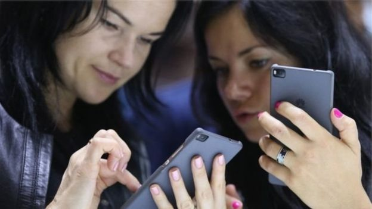

[11月30日 11:25]    新闻大吐槽   @TuCaoFakeNews    刚升一哥，屁股还没坐热，就妄图枪指挥党？
这很犯忌讳哦。。。 https://twitter.com/MaggieHo20/status/1200375264028418048 …  :speech_balloon:评:0 :+1:赞:1 :globe_with_meridians:转:0  

[11月30日 11:01]    BBC News 中文   @bbcchinese    【一周热点回顾】加拿大籍台湾艺人高以翔在浙江宁波录制一档真人秀节目时猝死，在中国大陆和台湾引发震动。 https://bbc.in/2rB31ye   :speech_balloon:评:3 :+1:赞:7 :globe_with_meridians:转:2  

[11月30日 11:00]    纽约时报中文网   @nytchinese    #一周热门 #观点 抗议的面孔 http://nyti.ms/2QQTVIh   :speech_balloon:评:5 :+1:赞:10 :globe_with_meridians:转:1  

[11月30日 09:53]    财经真相   @caijingxiang    不良资产证券化，这次扩围竟然把四大AMC也纳入进来了，真是可笑啊，四大不良资管公司，本来就是化解不良资产，现在竟然打包直接融资为证券，问题是这些证券谁买？还有这些证券究竟是什么产品？  :speech_balloon:评:15 :+1:赞:66 :globe_with_meridians:转:17  

[11月30日 09:42]    财经真相   @caijingxiang    工商银行手机端根据《信息技术安全-个人信息安全规范》（GB/T35273-2017）要求，要收集用户个人地理位置、相册，这是什么根据？  :speech_balloon:评:20 :+1:赞:88 :globe_with_meridians:转:54  

[11月30日 09:30]    BBC News 中文   @bbcchinese    英国警方说，市中心伦敦桥上发生持刀捅人事件，造成两人死亡，3人受伤。警方称这是一起恐怖袭击事件。 https://bbc.in/2R3z9Fy   :speech_balloon:评:51 :+1:赞:34 :globe_with_meridians:转:9  

[11月30日 09:01]    BBC News 中文   @bbcchinese    【一周热点回顾】郑文杰是嫖娼还是“被嫖娼”？网友们有不同看法。 https://bbc.in/37P3o8Y   :speech_balloon:评:69 :+1:赞:41 :globe_with_meridians:转:9  

[11月30日 09:00]    纽约时报中文网   @nytchinese    #一周热门 “变节者”揭露中共干预港台政局细节，自称曾为中国间谍 http://nyti.ms/35vlmeW   :speech_balloon:评:10 :+1:赞:37 :globe_with_meridians:转:10  

[11月30日 08:31]    新闻大吐槽   @TuCaoFakeNews    来自iPhone客户端
，
，
，
，
，
，
，
，
，

就搞笑了 https://twitter.com/4jqka/status/1200130291714576384 …  :speech_balloon:评:2 :+1:赞:13 :globe_with_meridians:转:3  

[11月30日 08:31]    BBC News 中文   @bbcchinese    冷战会“以猛烈的方式重来”？英国国防智库警告，一旦战争爆发英军和盟军会被俄军击溃，引发大量北约和俄罗斯对抗的报道。 https://bbc.in/2Oxot03   :speech_balloon:评:19 :+1:赞:74 :globe_with_meridians:转:18  

[11月30日 08:30]    凡賽堤/FORSETI   @FecharCCP    CCP極權恐怖組織把人民的血汗錢都用在的網絡維穩上了，圈養了人類獨一無二的，人數達千萬的流氓殭屍網絡水軍，谷歌所有集團企業已經淪為CCP極權恐怖組織重要維穩工具了，從2018年google搜索郭文貴的8百萬到現在的360萬，郭媒體從2019年初的18000的全球排名到現在的27669排名，極權不滅，養老永無望！  :speech_balloon:评:0 :+1:赞:2 :globe_with_meridians:转:3  

[11月30日 08:27]    新闻大吐槽   @TuCaoFakeNews    抖音美国版tiktok要被玩死了，年轻人前仆后继挑战中共红线，为新疆发声。
抖音是继续删号，替中共审查美国人，还是向美国输诚，坐视类似视频刷版？

要我是抖音负责人，就立即放弃在美国发展的想法  :speech_balloon:评:20 :+1:赞:667 :globe_with_meridians:转:308  

[11月30日 08:27]    新闻大吐槽   @TuCaoFakeNews    抖音美国版tiktok要被玩死了，年轻人前仆后继挑战中共红线，为新疆发声。
抖音是继续删号，替中共审查美国人，还是向美国输诚，坐视类似视频刷版？

要我是抖音负责人，就立即放弃在美国发展的想法  :speech_balloon:评:20 :+1:赞:667 :globe_with_meridians:转:308  

[11月30日 08:07]    新闻大吐槽   @TuCaoFakeNews    忘记说，广东的抗争者也都带上了口罩 https://twitter.com/TuCaoFakeNews/status/1200410332142825472 …  :speech_balloon:评:7 :+1:赞:69 :globe_with_meridians:转:22  

[11月30日 07:31]    BBC News 中文   @bbcchinese    最新研究发现英国超市塑料垃圾增加之际，北京宣布将于2020年开始实施垃圾分类如何处理废塑料？ https://bbc.in/33wbLD5   :speech_balloon:评:8 :+1:赞:23 :globe_with_meridians:转:8  

[11月30日 07:23]    凡賽堤/FORSETI   @FecharCCP    推翻共产党！全民抗议！全民起义！唱响国际歌！起来不愿做奴隶的人们！起来全中国受苦受难的中华儿女！ https://twitter.com/breakup1984/status/1200411445940211714 …  :speech_balloon:评:0 :+1:赞:14 :globe_with_meridians:转:8  

[11月30日 07:19]    新闻大吐槽   @TuCaoFakeNews    智慧的日本小哥，用善意的拥抱瓦解中共的仇恨教育与谎言！

不分国界，善良的人如果都能给彼此一个温暖的拥抱，如巫婆般的暴政还如何能挑起仇恨？  :speech_balloon:评:22 :+1:赞:192 :globe_with_meridians:转:92  

[11月30日 07:19]    新闻大吐槽   @TuCaoFakeNews    智慧的日本小哥，用善意的拥抱瓦解中共的仇恨教育与谎言！

不分国界，善良的人如果都能给彼此一个温暖的拥抱，如巫婆般的暴政还如何能挑起仇恨？  :speech_balloon:评:22 :+1:赞:192 :globe_with_meridians:转:92  

[11月30日 07:19]    凡賽堤/FORSETI   @FecharCCP    人類史上最殘暴的CCP極權殺人恐怖組織正在用各種兇殘手段屠殺我們的同胞...................

CCP極權殺人恐怖組織在香港發射數以萬計的疑似帶有生化武器成份的非標準催淚彈，足以影響三代人的致癌可能！

CCP極權殺人恐怖組織在自己的土地上投放劇毒催淚彈意圖謀殺我們黃色種族同胞！  :speech_balloon:评:1 :+1:赞:11 :globe_with_meridians:转:10  

[11月30日 07:00]    纽约时报中文网   @nytchinese    #一周热门 擅闯特朗普庄园的中国女子被判八个月监禁 http://nyti.ms/37ClGdE   :speech_balloon:评:7 :+1:赞:29 :globe_with_meridians:转:7  

[11月30日 06:42]    老司机   @h5lpykl7tp6jjop    看看这些杀气腾腾的家伙以及这么多点赞，谁能告诉我们，共产党哪一天会制造出类似卢旺达大屠杀，柬埔寨大屠杀这样的惨案吗？文革时期的道县，大兴，广西大规模杀人吃人事件有多少人知道？这是什么样的疯狂理论制造出来的疯子！？  :speech_balloon:评:7 :+1:赞:23 :globe_with_meridians:转:13  

[11月30日 06:19]    老司机   @h5lpykl7tp6jjop    又来号召中国人民团结起来抵制美帝了！
有网友说：关中国人民什么事？我又没有存款在美国。
我又没有房产在美国。我又没有家属子女在美国。
免费医疗有我们吗？公平退休养老有我们吗？
美国制裁好了，谁怕谁是孙子！  :speech_balloon:评:1 :+1:赞:31 :globe_with_meridians:转:8  

[11月30日 05:58]    凡賽堤/FORSETI   @FecharCCP    中共催泪弹成分化验结果出炉：山埃毒，也叫氰化钾，爆表！这已经不是镇压抗议者，而是赤裸裸的谋杀，包括对抗议者的生育都会造成影响！  https://twitter.com/SolomonYue/status/1200445644613140480 …  :speech_balloon:评:7 :+1:赞:119 :globe_with_meridians:转:107  

[11月30日 05:47]    老司机   @h5lpykl7tp6jjop    世界各国的历史对于国家统治形态有各种不同的尝试，从古希腊雅典的民主，罗马的元老院，英国大宪章，议会一直到现在比较完善的民主制度，只有中国不同的是从古至今几千年醉心于一人君临天下当独裁皇帝！而且是人人心向往之，你方唱罢我登场，络绎不绝，即便打着民主旗号的一上台也都最后变成独裁暴君！  :speech_balloon:评:1 :+1:赞:18 :globe_with_meridians:转:4  

[11月30日 05:43]    新闻大吐槽   @TuCaoFakeNews    “广东省茂名市，化州县火葬场事件”

被愤怒村民掀翻的警车  :speech_balloon:评:68 :+1:赞:756 :globe_with_meridians:转:366  

[11月30日 05:43]    新闻大吐槽   @TuCaoFakeNews    “广东省茂名市，化州县火葬场事件”

被愤怒村民掀翻的警车  :speech_balloon:评:68 :+1:赞:756 :globe_with_meridians:转:366  

[11月30日 05:36]    新闻大吐槽   @TuCaoFakeNews    美国实验室已经对中国产催泪弹完成化验，实验结果表明山埃爆表。 https://twitter.com/solomonyue/status/1200445644613140480 …  :speech_balloon:评:5 :+1:赞:43 :globe_with_meridians:转:32  

[11月30日 05:36]    新闻大吐槽   @TuCaoFakeNews    美国实验室已经对中国产催泪弹完成化验，实验结果表明山埃爆表。 https://twitter.com/solomonyue/status/1200445644613140480 …  :speech_balloon:评:5 :+1:赞:43 :globe_with_meridians:转:32  

[11月30日 04:42]    老司机   @h5lpykl7tp6jjop    老外拍摄一国两制的大学生寝室，是谁在岐视中国人？  :speech_balloon:评:20 :+1:赞:150 :globe_with_meridians:转:93  

[11月30日 04:25]    老司机   @h5lpykl7tp6jjop    中国人能彻底懂得这句话的人很少，但是还是要再发一次 : 不要仇恨别的国家，你本人在当代生活中所受的苦难和压力，其根源的99.99% 都不来自别的国家。  :speech_balloon:评:13 :+1:赞:189 :globe_with_meridians:转:75  

[11月30日 01:48]    墙国铁拳现世报😷   @Socialistfist    好一句“打得好”，但如果所有香港人都和他們一樣幸災樂禍，咁香港就真正被同化了  :speech_balloon:评:2 :+1:赞:26 :globe_with_meridians:转:3  

[11月30日 01:13]    墙国铁拳现世报😷   @Socialistfist    有推友说最近铁拳不够劲
小编一如既往地欢迎大家踊跃投稿
但有时候，无铁拳胜过假铁拳  :speech_balloon:评:6 :+1:赞:85 :globe_with_meridians:转:2  

[11月30日 01:09]    墙国铁拳现世报😷   @Socialistfist    补图  :speech_balloon:评:7 :+1:赞:84 :globe_with_meridians:转:14  

[11月30日 01:08]    墙国铁拳现世报😷   @Socialistfist    “打得好”

#社会主义铁拳  :speech_balloon:评:18 :+1:赞:148 :globe_with_meridians:转:33  

[11月30日 00:40]    墙国铁拳现世报😷   @Socialistfist    吼啊！ 
小编举双手赞同，一定滋磁捧场
不过要严正说明，我们是 社会主义 的生产者，我们只是 社会主义 的搬运工 https://twitter.com/Ray27809561/status/1196838238771531776 …  :speech_balloon:评:18 :+1:赞:182 :globe_with_meridians:转:21  

[11月30日 00:18]    BBC News 中文   @bbcchinese    英国警方说，当地时间周五（29日）下午约14点，市中心伦敦桥上发生持刀捅人事件，造成数人受伤。警方称这是一起涉恐事件。 https://bbc.in/2rCTy9E   :speech_balloon:评:176 :+1:赞:132 :globe_with_meridians:转:60  

[11月29日 23:30]    老司机   @h5lpykl7tp6jjop    香港警察还是挺幸运的  :speech_balloon:评:90 :+1:赞:1256 :globe_with_meridians:转:664  

[11月29日 23:17]    老司机   @h5lpykl7tp6jjop    招行以【系統升級改造】為由，暫時停止“境外匯款”，恢復時間另行通知。

12月2日起不再接受新指令，12月30日起關閉匯款計劃服務，所有未執行的指令都會失效。  :speech_balloon:评:12 :+1:赞:107 :globe_with_meridians:转:53  

[11月29日 21:46]    新闻大吐槽   @TuCaoFakeNews    “广东省茂名市，化州县火葬场事件”

手无寸铁的老人被打的头破血流  :speech_balloon:评:13 :+1:赞:119 :globe_with_meridians:转:89  

[11月29日 21:46]    新闻大吐槽   @TuCaoFakeNews    “广东省茂名市，化州县火葬场事件”
警方集结了大量警力，警车长龙一眼看不到头！  :speech_balloon:评:40 :+1:赞:320 :globe_with_meridians:转:195  

[11月29日 21:46]    新闻大吐槽   @TuCaoFakeNews    “广东省茂名市，化州县火葬场事件”
警方集结了大量警力，警车长龙一眼看不到头！  :speech_balloon:评:40 :+1:赞:320 :globe_with_meridians:转:195  

[11月29日 21:45]    新闻大吐槽   @TuCaoFakeNews    “广东省茂名市，化州县火葬场事件”

横幅显示：事发地是化州县文楼镇，
而且发声时间就是近几天；  :speech_balloon:评:7 :+1:赞:101 :globe_with_meridians:转:60  

[11月29日 21:07]    BBC News 中文   @bbcchinese    该案件是近段时间来震惊韩国流行乐坛的多起性丑闻中的一件。 https://bbc.in/35PcK2D   :speech_balloon:评:5 :+1:赞:25 :globe_with_meridians:转:7  

[11月29日 21:02]    新闻大吐槽   @TuCaoFakeNews    冲突现场5，小巷里的私刑  :speech_balloon:评:2 :+1:赞:49 :globe_with_meridians:转:26  

[11月29日 21:01]    新闻大吐槽   @TuCaoFakeNews    冲突现场4，矮矬黑警手拿催泪弹枪，咋咋呼呼，被村民嘘~  :speech_balloon:评:3 :+1:赞:34 :globe_with_meridians:转:18  

[11月29日 21:01]    新闻大吐槽   @TuCaoFakeNews    “广东省茂名市，化州县火葬场事件”
冲突现场1，年轻人被一堆黑警打的惨叫~  :speech_balloon:评:32 :+1:赞:238 :globe_with_meridians:转:174  

[11月29日 20:46]    新闻大吐槽   @TuCaoFakeNews    “广东省茂名市，化州县火葬场事件”

其他三个被黑警打的人，都是照头打，打的满头血；
最后一个还是孩子，不停的啜泣！  :speech_balloon:评:44 :+1:赞:419 :globe_with_meridians:转:304  

[11月29日 20:36]    老司机   @h5lpykl7tp6jjop    广东省茂名市，化州县火葬场事件，据说警察打死2人，下面是其中一位：

中共囿于香港国际金融中心地位，以及洗钱必经之地等原因，不敢在香港明目张胆的杀人，可到了大陆，真是砍瓜切菜一般，毫无顾忌！  :speech_balloon:评:94 :+1:赞:1076 :globe_with_meridians:转:812  

[11月29日 20:36]    新闻大吐槽   @TuCaoFakeNews    广东省茂名市，化州县火葬场事件，据说警察打死2人，下面是其中一位：

中共囿于香港国际金融中心地位，以及洗钱必经之地等原因，不敢在香港明目张胆的杀人，可到了大陆，真是砍瓜切菜一般，毫无顾忌！  :speech_balloon:评:94 :+1:赞:1077 :globe_with_meridians:转:814  

[11月29日 20:33]    BBC News 中文   @bbcchinese    有些物种在一个地区一度绝迹，被认为绝种，但在其他地区不为人知地存活着，后来被发现。 https://bbc.in/2Du6CAY   :speech_balloon:评:1 :+1:赞:29 :globe_with_meridians:转:12  

[11月29日 20:05]    BBC News 中文   @bbcchinese    【特朗普签香港人权法案，感恩节集会上有香港市民说“很惊讶”】美国总统特朗普签署《香港人权与民主法案》。 香港有市民在感恩节当天举行集会，一些支持此法案的市民认为，这会令香港政府处理示威浪潮时更加克制，避免美国政府改变给予香港特殊地位的政策。 https://bbc.in/33sUgU3   :speech_balloon:评:30 :+1:赞:44 :globe_with_meridians:转:11  

[11月29日 18:30]    纽约时报中文网   @nytchinese    佐藤郁夫站在东京一个法庭上，向世界宣布自己是同性恋。他描述了自己作为一个年轻男性的焦虑，在充满约束的日本社会中苦于难以表达自己的性态。
他说，如果修改法律允许同性婚姻，或许“我们的社会可以让下一代不必有再有这种感受”。 http://nyti.ms/2q1KhHT   :speech_balloon:评:5 :+1:赞:17 :globe_with_meridians:转:4  

[11月29日 18:12]    墙国铁拳现世报😷   @Socialistfist    评论区一览  :speech_balloon:评:18 :+1:赞:240 :globe_with_meridians:转:42  

[11月29日 18:08]    墙国铁拳现世报😷   @Socialistfist    一个中国人没有被逼到绝路，谁想和石头撞。

#社会主义铁拳  :speech_balloon:评:113 :+1:赞:745 :globe_with_meridians:转:284  

[11月29日 18:01]    BBC News 中文   @bbcchinese    巴基斯坦有一个小镇，镇上将近900名儿童感染艾滋病病毒。让人奇怪的是，大部分感染的儿童年龄都低于12岁，家族并无病史。 https://bbc.in/2qV4vDy   :speech_balloon:评:33 :+1:赞:109 :globe_with_meridians:转:65  

[11月29日 17:07]    纽约时报中文网   @nytchinese    #图集【在美国，35万美元能买到什么房？】手握35万美元，你能买到位于路易斯维尔一座建于1941年的科德角式建筑，或杰克逊维尔的一幢艺术与工艺风格住宅，也可以选择底特律附近的1840年代早期房屋。
点击查看图集： http://nyti.ms/2R3YJds   :speech_balloon:评:13 :+1:赞:40 :globe_with_meridians:转:9  

[11月29日 17:01]    BBC News 中文   @bbcchinese    抖音早前因为封锁一名美国少女的帐号，引起外界批评，指抖音是因为视频里提到北京政府在新疆设立的“再教育营”。抖音之后把少女的帐号解锁，同时向对方道歉，但坚持封锁帐号与政治审查无关。 https://bbc.in/2q09Okz   :speech_balloon:评:181 :+1:赞:651 :globe_with_meridians:转:227  

[11月29日 16:28]    纽约时报中文网   @nytchinese    周五，警方将对香港理工大学校园的控制权交还给校方，抗议活动中尤为激烈的一段时期宣告结束。
警方称，在周五上午的最后搜查中未发现抗议者。警方表示，在过去的两天里，搜查人员在校园里发现了近4000枚燃烧弹和其他爆炸性物品和数瓶腐蚀性液体。 http://nyti.ms/2rG9s2X   :speech_balloon:评:26 :+1:赞:121 :globe_with_meridians:转:46  

[11月29日 16:01]    BBC News 中文   @bbcchinese    “我可以随时随地进行冥想”，泰国僧人波姆（Pom）说。
他在派对上度过了青春时光，但这已经没有意义了。他决定加入泰国一间要求最严格的寺院。  :speech_balloon:评:15 :+1:赞:110 :globe_with_meridians:转:31  

[11月29日 15:39]    纽约时报中文网   @nytchinese    近年来日本舆论对同性婚姻支持激增，地方政府越来越多地承认同性伴侣关系，就连以刻板著称的日本企业也开始站出来支持他们。
但在其它方面，这些成果仍然不切实际。同性恋者面临着巨大的压力，要他们遵循沉默、压抑的社会规范。同性婚姻法案在保守的政界也缺乏支持。 http://nyti.ms/2q1KhHT   :speech_balloon:评:11 :+1:赞:75 :globe_with_meridians:转:16  

[11月29日 15:02]    纽约时报中文网   @nytchinese    《复仇者联盟》、《冰雪奇缘》、《月光男孩》、《美国狙击手》、《饥饿游戏2：星火燎原》、《星球大战：原力觉醒》……时报影评人选出了十年来在娱乐界乃至更广范围产生巨大影响的影片。
它们反映了我们所处的时代，改变甚至塑造了电影行业。 http://nyti.ms/2DtnpUC   :speech_balloon:评:10 :+1:赞:74 :globe_with_meridians:转:31  

[11月29日 15:01]    BBC News 中文   @bbcchinese    香港的移民中介称，六月示威爆发前，前来谘询的客户仍对移民举棋未定。但在六月之后，不仅谘询数量翻倍，而且客户似乎都已经下定决心离开。 https://bbc.in/2R7Adbz   :speech_balloon:评:100 :+1:赞:344 :globe_with_meridians:转:125  

[11月29日 14:30]    纽约时报中文网   @nytchinese    #时报专栏 这场美中“战争”究竟要走向何方？ http://nyti.ms/2rr5rzA https://twitter.com/ccni/status/1199875515613614080 …  :speech_balloon:评:6 :+1:赞:7 :globe_with_meridians:转:0  

[11月29日 14:10]    财经真相   @caijingxiang    外资也不是傻子！ https://twitter.com/renfanzi/status/1199949375360786433 …  :speech_balloon:评:15 :+1:赞:161 :globe_with_meridians:转:36  

[11月29日 14:10]    纽约时报中文网   @nytchinese    据纪录片《喜梅》，在90年代的一次地方疫情中，河南省估计有30万人感染了HIV。当时，官员们鼓励农民卖血为生。病毒通过受污染的设备和输血传播。
多年后，河南的艾滋病患者仍然遭到冷落——家人嘲笑他们，一些医院拒绝对他们进行治疗，要求他们填写复杂的报销表格。 http://nyti.ms/37O2cmv   :speech_balloon:评:7 :+1:赞:42 :globe_with_meridians:转:30  

[11月29日 14:01]    BBC News 中文   @bbcchinese    郑文杰“嫖娼”事件一波未平，一波又起。中共喉舌中央电视台的国际分支也陷危机？ https://bbc.in/2qUoNwZ   :speech_balloon:评:274 :+1:赞:821 :globe_with_meridians:转:302  

[11月29日 13:30]    纽约时报中文网   @nytchinese    “‘色情作品’听起来没那么有趣，”音频色情平台Quinn的创始人斯皮格尔说。她和同事的目标是让Quinn成为非视觉色情作品的首选目的地。
“视觉色情对我不起作用，”她说。“太多偷窥的感觉了。”她发现音频色情给主观性和想象力留下了更多的空间。而且你可以在任何地方听。 http://nyti.ms/2DsYrF6   :speech_balloon:评:2 :+1:赞:17 :globe_with_meridians:转:4  

[11月29日 13:08]    财经真相   @caijingxiang    还有两个小时a股收盘，中共怼香港法案的反击不会停留在嘴炮上，周末应该会很热闹，a股散户割肉吧！即使没有政治关系，临近年底a股也是到了收割时时候！ https://twitter.com/caijingxiang/status/1200265864064335872 …  :speech_balloon:评:10 :+1:赞:165 :globe_with_meridians:转:26  

[11月29日 13:00]    纽约时报中文网   @nytchinese    #每日一词 Reality show，真人秀。艺人高以翔拍真人秀(reality show)时猝死引发外界对娱乐业的审视。
在英文中，除了reality show，可以show来表达的电视节目类型还包括variety show（综艺）、talent show（选秀）和talk show（脱口秀）等。
更多简报内容： http://nyti.ms/2XWkld1   :speech_balloon:评:0 :+1:赞:5 :globe_with_meridians:转:3  

[11月29日 12:30]    纽约时报中文网   @nytchinese    纪录片《喜梅》讲述了一名农村女性在公共医疗危机中的挣扎和反抗。活动人士刘喜梅小时候感染了艾滋，现在30多岁的她为其他病人开了一家中途之家。她是政府官员的眼中钉，他们宁愿这场危机消失。
这部影片以官员所不曾有过的态度对待艾滋病患者，把他们当作全面立体的人。 http://nyti.ms/37O2cmv   :speech_balloon:评:20 :+1:赞:231 :globe_with_meridians:转:110  

[11月29日 12:10]    财经真相   @caijingxiang    今天a股跌各种股侠、大校、股神、V们没有脾气！茅台这次也是真喝醉了！  :speech_balloon:评:24 :+1:赞:285 :globe_with_meridians:转:33  

[11月29日 12:07]    BBC News 中文   @bbcchinese    BBC中文通过一组图文带您全程回顾香港理工大学“围城”12天。 https://bbc.in/2XTFtkm   :speech_balloon:评:25 :+1:赞:88 :globe_with_meridians:转:55  

[11月29日 12:00]    纽约时报中文网   @nytchinese    随着金正恩提出的最后期限将近，专家指出，留给特朗普的对朝外交谈判时间已经不多。此前朝鲜警告称，美国必须在12月31日前就无核化给出新提议，否则将受到“令人震惊的惩罚”。
周四，朝鲜再次发射两枚短程导弹，这是该国自5月以来的第13次试射。
更多简报内容： http://nyti.ms/2XWkld1   :speech_balloon:评:4 :+1:赞:9 :globe_with_meridians:转:3  

[11月29日 11:33]    纽约时报中文网   @nytchinese    特朗普签署香港人权法案对北京构成了直接挑战。中国对此大为光火，谴责新法律是对其国内事务的非法干涉，在一周内第二次召见了美国驻华大使，并誓言要进行报复。
这些威胁听起来很严重，但也颇为空洞。在严辞背后，北京仍希望达成贸易协议，也缺乏有实际意义的选项回击美国。 http://nyti.ms/2R174OV   :speech_balloon:评:109 :+1:赞:376 :globe_with_meridians:转:117  

[11月29日 11:23]    老司机   @h5lpykl7tp6jjop      :speech_balloon:评:1 :+1:赞:12 :globe_with_meridians:转:10  

[11月29日 11:22]    老司机   @h5lpykl7tp6jjop    最悲催的事

                            王朔

一、好不容易建立新中国，结果新中国饿死的人比抗日战争牺牲的还多。
三、发现当初的国民党四大家族，其实还不如我党的乡镇干部有钱。
四、党国官员们带领我们反美反西方，却发现他们把自己的老婆后代全都移民去美国了。  :speech_balloon:评:6 :+1:赞:423 :globe_with_meridians:转:209  

[11月29日 11:17]    老司机   @h5lpykl7tp6jjop    #维权运动 

场面和香港熟悉吗？
重点看 #15秒地上拖人的动作

广东省茂名化州市文楼镇数千人与警察发生激烈冲突

当地政府以建生态公园为名骗老人签字
后改为建火葬场  :speech_balloon:评:25 :+1:赞:406 :globe_with_meridians:转:260  

[11月29日 11:01]    BBC News 中文   @bbcchinese    作为世界上老龄化程度严重的社会之一，日本正努力解决老年司机越来越多的问题，这一敏感问题必须同时兼顾安全和包容。 https://bbc.in/2XTPjCG   :speech_balloon:评:6 :+1:赞:23 :globe_with_meridians:转:8  

[11月29日 11:00]    纽约时报中文网   @nytchinese    迫于俄罗斯压力，苹果在地图中将克里米亚标为该国领土。在俄罗斯运行苹果地图可以发现，克里米亚已是该国的一部分；但从境外设备上看，克里米亚仍属乌克兰。
俄罗斯并非唯一在地图制图方面引发争议的国家，中国在台湾问题上也掀起了类似的“战争”。
更多简报内容： http://nyti.ms/2XWkld1   :speech_balloon:评:1 :+1:赞:9 :globe_with_meridians:转:3  

[11月29日 10:41]    纽约时报中文网   @nytchinese    没有画面、没有公共场合的尴尬、没有难以企及的身材来和自己比较.....
如今，由女性经营的企业希望用音频色情这种更富想象力、更女性主义的方式来满足更多消费者。 http://nyti.ms/2DsYrF6   :speech_balloon:评:9 :+1:赞:31 :globe_with_meridians:转:10  

[11月29日 10:25]    纽约时报中文网   @nytchinese    简报：中国回应香港人权法案；TikTok恢复争议账号 http://nyti.ms/2XWkld1 https://twitter.com/ccni/status/1200236006953365504 …  :speech_balloon:评:3 :+1:赞:10 :globe_with_meridians:转:3  

[11月29日 09:54]    纽约时报中文网   @nytchinese    早安！今日重点新闻包括：
中国回应香港人权法案；TikTok恢复争议账号；特朗普感恩节突访阿富汗；朝鲜发射两枚短程导弹；苹果在俄罗斯版地图中将克里米亚标为该国领土；中右翼候选人赢得乌拉圭总统大选……NYT简报带你速览今日要闻。 http://nyti.ms/2XWkld1   :speech_balloon:评:8 :+1:赞:34 :globe_with_meridians:转:13  

[11月29日 09:49]    老司机   @h5lpykl7tp6jjop    【比旧社会的地主恶霸还凶残百倍】霸占了农民的土地，现在又强夺农民的房子，最终让他们一无所有，除了满身的病痛和疲惫的身躯……这就是不关心政治的结果，你再怎么努力都是徒劳无益，为人作嫁，最终都竹篮打水一场空！  :speech_balloon:评:39 :+1:赞:381 :globe_with_meridians:转:200  

[11月29日 09:30]    BBC News 中文   @bbcchinese    在俄罗斯的西伯利亚的永冻层，这只幼崽的皮毛，鼻子和牙齿都保存得完好无损。科学家说，这一发现可能代表着狼与现代犬之间的进化联系。 https://bbc.in/2OrPiCX   :speech_balloon:评:8 :+1:赞:105 :globe_with_meridians:转:32  

[11月29日 09:30]    纽约时报中文网   @nytchinese    马克斯说，日本人对牛仔的喜爱始于二战。战后美军占领日本期间，二手牛仔裤通过与美国士兵的以物易物进入了商店。
那时，美国人把牛仔裤贬得一文不值，会把它们当成纸巾一样撕成碎布塞进包裹里。但日本消费者却非常看重它们，以至于商店会将这些残片重新缝在一起出售。 http://nyti.ms/2L3quz7   :speech_balloon:评:0 :+1:赞:16 :globe_with_meridians:转:2  

[11月29日 08:30]    BBC News 中文   @bbcchinese    从习近平与安倍晋三2014年尴尬握手，到两国紧锣密鼓策划习近平国事访问。是什么让中日两国走出了政治冷淡？
 https://bbc.in/33xL1lv   :speech_balloon:评:99 :+1:赞:89 :globe_with_meridians:转:23  

[11月29日 07:30]    BBC News 中文   @bbcchinese    人跳出了火坑，背上刺青依旧：她的是对皮条客表忠心，她的是两个魔鬼在性交......被迫卖淫的创伤怎样抚平？人生如何揭开新篇章？ https://bbc.in/35M3aOm   :speech_balloon:评:12 :+1:赞:39 :globe_with_meridians:转:17  

[11月29日 06:16]    BBC News 中文   @bbcchinese    德国政府担心禁止华为会招致中国政府对利润丰厚的德国汽车行业采取报复措施。 https://bbc.in/37NwVzN   :speech_balloon:评:74 :+1:赞:72 :globe_with_meridians:转:22  

[11月29日 04:21]    老司机   @h5lpykl7tp6jjop    你它妈的是谁总能代表人民喜迎涨价？  :speech_balloon:评:13 :+1:赞:105 :globe_with_meridians:转:40  

[11月29日 04:17]    老司机   @h5lpykl7tp6jjop    转发：这个奴才还挺会算计！
翻译成奴隶们能听懂的话，就是：维持奴隶主及其后代们的奢侈生活，需要奴隶们生出更多的小奴隶。如果你没有勇气改变这个国家，那你就别生孩子或者少生孩子。因为未来你的孩子有90%的可能性和你一样在金字塔的底层，每天为了生存而挣扎。  :speech_balloon:评:7 :+1:赞:26 :globe_with_meridians:转:13  

[11月29日 04:12]    老司机   @h5lpykl7tp6jjop    都别动！这些都是国家的。
我就想知道，国家又是谁的呢？  :speech_balloon:评:0 :+1:赞:10 :globe_with_meridians:转:6  

[11月29日 04:09]    老司机   @h5lpykl7tp6jjop    好文转发【急死我了】美国到底是好人还是坏人？

原创： 54321  番茄D理想  

从读书的时候起，就知道“美帝和西方列强亡我中华之心不死”，那个时候，美国是坏人！
后来长大了，知道的事情多了，对“美国到底是好人还是坏人”反而开始困惑了，下面是我作为一个普通中国人，对中美关系的一个回顾——  :speech_balloon:评:1 :+1:赞:17 :globe_with_meridians:转:9  

[11月29日 03:44]    老司机   @h5lpykl7tp6jjop    多么美好的＂一小部分＂香港人啊！ https://twitter.com/hongkon84458416/status/1200063936244006912 …  :speech_balloon:评:0 :+1:赞:20 :globe_with_meridians:转:3  

[11月28日 20:44]    老司机   @h5lpykl7tp6jjop    Singer-activist @hoccgoomusic led thousands of Hongkongers in signing the protest anthem "Glory to Hong Kong," after she helped successfully lobby the US to pass legislation supporting the movement. #HongKongProtests #hongkong #antiELAB  :speech_balloon:评:99 :+1:赞:3977 :globe_with_meridians:转:2406  

[11月28日 18:02]    财经真相   @caijingxiang    人民日报这篇文章玄机很深，直接不点名骂川普是“地产商的吹牛”，这对一国元首直接开骂是极不寻常的事件，似乎是故意在激怒白宫，如果白宫曝光川习电话录音，习近平将彻底成为世界公认的“屠夫“，这与曝光新疆四百页文件一脉相承，好一个借刀杀人之计！  :speech_balloon:评:14 :+1:赞:349 :globe_with_meridians:转:59  

[11月28日 17:45]    财经真相   @caijingxiang    这次人民日报开始直接不点名骂川普了，不知道川普同志如何看待？各位都@川普  :speech_balloon:评:70 :+1:赞:493 :globe_with_meridians:转:158  

[11月28日 16:51]    财经真相   @caijingxiang    太极拳已经没必要继续打了，彻底撕破脸的时刻，香港法案的影响，绝对不会只是，停留在嘴炮上！交易员们避险情绪随时会突然涌上来，做好准备！  :speech_balloon:评:7 :+1:赞:196 :globe_with_meridians:转:22  

[11月28日 16:31]    财经真相   @caijingxiang    如果消息属实，金融市场很快即将迎来天翻复地的巨变，人民币、黄金、股市做好冲浪准备！ https://twitter.com/IntyPython/status/1199952867953561600 …  :speech_balloon:评:50 :+1:赞:556 :globe_with_meridians:转:154  

[11月28日 15:21]    财经真相   @caijingxiang    胡锡进：美国“香港人权与民主法案”有两大内容：一是威胁取消美国对香港的特殊关税待遇，二是威胁制裁香港官员和建制派人士。  :speech_balloon:评:75 :+1:赞:240 :globe_with_meridians:转:51  

[11月28日 14:35]    老司机   @h5lpykl7tp6jjop    去浙江横店玩，突然听到后面有一群人高喊：“结束一党专政，反对腐败，实行人民普选！把人民的权利交给人民！”
我心里一惊，心想谁吃了豹子胆？回头定睛一瞧：卧槽，原来是拍电影，演的是在中共地下党领导下，学生们举着标语争民主争自由的一场戏。
把老子吓了一跳！  :speech_balloon:评:76 :+1:赞:3090 :globe_with_meridians:转:788  

[11月28日 10:39]    财经真相   @caijingxiang    法案签署后，目前中国股市、人民币汇率处于“西线无战时”，黄金市场没有波动，川普签署法案的事市场早有预期，因此几乎没有波动，但是对中美贸易谈判产生何种影响，市场还没做好准备，接下来就看中共如何实质性反击！  :speech_balloon:评:33 :+1:赞:318 :globe_with_meridians:转:57  

[11月28日 09:21]    财经真相   @caijingxiang    一位神秘买家在黄金期货市场以175万美元购买了一笔看涨合约，押注黄金在2021年6月涨到4000美元，这样的疯狂赌注，按照目前正常市场情况下，除非美联储实行负利率，但是这对美联储而言显然不太可能；除非世界出现重大“风险事件”，引发黄金超级避险情绪，如果该合约真的押注正确其收益将是爆炸性的！  :speech_balloon:评:109 :+1:赞:703 :globe_with_meridians:转:180  

[11月28日 08:56]    财经真相   @caijingxiang    第一张多米诺骨牌终于倒下来了，接下来它产生的效应会不断扩大，直到红色帝国大厦里轰然倒塌！未来几十年的世界格局就此打破！ https://twitter.com/voachinese/status/1199826749246312448 …  :speech_balloon:评:51 :+1:赞:756 :globe_with_meridians:转:170  

[11月28日 08:19]    凡賽堤/FORSETI   @FecharCCP    幾個月來據不完全統計，CCP極權發動的黑警非法濫捕香港學生孩子以萬人計算，用各種兇殘手段屠殺的幾千人！

讓我們極度關注，傳播香港真相，盡可能的向全世界媒體以各種語言傳播，讓全世界的人看清CCP極權殺人恐怖組織納粹真相，才能真正的減少這些被非法秘密抓捕的香港學生孩子被殺害！天佑香港人！  :speech_balloon:评:43 :+1:赞:199 :globe_with_meridians:转:146  

[11月28日 08:06]    凡賽堤/FORSETI   @FecharCCP    幾個月以來，香港700萬人共同見證了CCP反人類的慘無人道的殘暴罪行！！！

這是千千萬萬的像這麼小的小朋友都親眼見證了CCP反人類的慘無人道的殘暴罪行！！！

天滅CCP！！！天滅極權！！！  :speech_balloon:评:0 :+1:赞:20 :globe_with_meridians:转:8  

[11月28日 07:48]    凡賽堤/FORSETI   @FecharCCP    美國總統川普宣布他已签署
《香港人权与民主法案》

《香港人权与民主法案》已經成功列入美國的法律！
期望美國能執行《香港人权与民主法案》對香港的黑警和淋症夜蛾進行制裁！  :speech_balloon:评:5 :+1:赞:37 :globe_with_meridians:转:19  

[11月28日 01:20]    财经真相   @caijingxiang    三季度美国GDP增速二读为2.1%，高于预期和初值1.9%，二季度为2%。但商业投资仍是经济薄弱环节，企业盈利核心指标持续弱化。与年初相比，美国经济增速明显放缓，包括美联储在内的经济学家认为四季度增长率“大幅减弱”，美联储12月或保持“按兵不动”的利率政策。  :speech_balloon:评:8 :+1:赞:92 :globe_with_meridians:转:13  

[11月28日 00:29]    墙国铁拳现世报😷   @Socialistfist    那两个字不会写
阿钟哥请你jiayou学中文
#战螂在推特  :speech_balloon:评:42 :+1:赞:263 :globe_with_meridians:转:38  

[11月27日 23:41]    墙国铁拳现世报😷   @Socialistfist    一个美国人向俄国人解释为什么说美国是一个真正言论自由的国家。
美国人说：“我可以走到白宫前，高喊让里根下地狱！”
俄国人很不以为然：“你这算什么，我也可以走到红场上高喊，让里根下地狱”！ https://twitter.com/jiayoubiss/status/1199703307943600128 …  :speech_balloon:评:23 :+1:赞:680 :globe_with_meridians:转:116  

[11月27日 22:46]    墙国铁拳现世报😷   @Socialistfist    哪里不自由？

#社会主义铁拳  :speech_balloon:评:43 :+1:赞:676 :globe_with_meridians:转:137  

[11月27日 16:32]    财经真相   @caijingxiang    胡锡进：用抹黑中共来打击中国，此术休想得逞！蓬佩奥把中共与中国区分开来的战术开始奏效！  :speech_balloon:评:77 :+1:赞:564 :globe_with_meridians:转:161  

[11月27日 13:13]    财经真相   @caijingxiang    下联：吸血拌雪花，既雪拌血又或血拌雪！求横批： https://twitter.com/qiubaibot/status/1199394907196030977 …  :speech_balloon:评:45 :+1:赞:102 :globe_with_meridians:转:21  

[11月27日 11:15]    财经真相   @caijingxiang    广东省第十二届委员会第八次全体会议于11月25日至26日在广州召开。本次会议审议通过《关于支持深圳建设中国特色社会主义先行示范区的若干重大措施》 深圳要成为“样板”了！  :speech_balloon:评:75 :+1:赞:242 :globe_with_meridians:转:87  

[11月27日 00:38]    财经真相   @caijingxiang    人民币疯涨，貌似没有任何消息面，就是纯粹在拉，而且黄金也涨，根本不是以往的贸易利好消息！  :speech_balloon:评:43 :+1:赞:368 :globe_with_meridians:转:53  

[11月26日 23:10]    墙国铁拳现世报😷   @Socialistfist    发#社会主义铁拳 太难了，业余还要打假  :speech_balloon:评:13 :+1:赞:122 :globe_with_meridians:转:6  

[11月26日 18:15]    财经真相   @caijingxiang    央视新闻：习近平主持召开中央全面深化改革委员会第十一次会议强调：落实党的十九届四中全会重要举措，继续全面深化改革实现有机衔接融会贯通。看到落实四中全会，及知道这个所谓的全面深化改革究竟是如何“改革”  :speech_balloon:评:35 :+1:赞:151 :globe_with_meridians:转:28  

[11月26日 17:36]    财经真相   @caijingxiang    美国政府当前正在启动，在美国上市的中国企业，财务独立调查，该法案正在推进中，阿里巴巴回归港股，在某种意义上也是一种预防措施，尤其是港交所目前还在自家人控制的情况下。而港交所收购伦敦交易所似乎也有某种千丝万缕的连续！  :speech_balloon:评:2 :+1:赞:75 :globe_with_meridians:转:19  

[11月26日 02:49]    墙国铁拳现世报😷   @Socialistfist    潘福仁退休前在2007年与网友 网论司法公正
 http://law.eastday.com/dongfangfz/node7/u1a5371.html …  :speech_balloon:评:0 :+1:赞:45 :globe_with_meridians:转:6  

[11月26日 02:47]    墙国铁拳现世报😷   @Socialistfist    江西中级人民法院法官 
判被告 前
上海中级人民法院法官
9年半有期徒刑

#社会主义铁拳  :speech_balloon:评:16 :+1:赞:264 :globe_with_meridians:转:67  

[11月26日 01:01]    GFHG SDKM   @zyx_yny    Heading back to London. 

Thank you #HK for letting us share in your unforgettable victory.

香港人, 加油   :speech_balloon:评:2655 :+1:赞:21309 :globe_with_meridians:转:10022  

[11月25日 14:20]    墙国铁拳现世报😷   @Socialistfist    搬运一个来自微博的欢乐源泉，给墙内开票开了通宵，按时间倒序，他分别表演了：

1. 目瞪口呆
2. 伤心欲绝
3. 自欺欺人
4. 微博全部被删  :speech_balloon:评:264 :+1:赞:3958 :globe_with_meridians:转:1419  

[11月25日 00:13]    老司机   @h5lpykl7tp6jjop    太可怕了，中共早已切斷美國和澳大利亞新西蘭的海上交通咽喉，也就是說如果第三次世界大戰爆發，中國對澳新軍事打擊時，美國海上補給的路給堵死了。為什麼中共在香港問題上那麼驕橫跋扈，為何新西蘭政府從來不表態撐香港，因為金錢外交已深入南太平洋每個島國。最後一片淨土也將毀在中共的魔爪之下  :speech_balloon:评:38 :+1:赞:502 :globe_with_meridians:转:370  

[11月24日 12:46]    GFHG SDKM   @zyx_yny    Very good to take some time@our from election observation to tell #JuniusHo in person that I was responsible for the revocation of his honorary doctorate from @AngliaRuskin #Sorrynotsorry  :speech_balloon:评:6934 :+1:赞:46164 :globe_with_meridians:转:27716  

[11月24日 08:10]    凡賽堤/FORSETI   @FecharCCP    呼籲請求共同挖掘所有有關香港發生的事，越全面越好，不同角度，越多越好，包括被暗地抓捕的人員，特別是CCP 派出的各種偽裝身份，包括變身變裝行兇的一點一滴都要挖掘出來，把CCP 的邪惡下三濫手段的真相毫無保留的曝光在全世界面前！世界公知公義才能真正挽救和保護香港人！希望懂視頻編輯配上中英文  :speech_balloon:评:2 :+1:赞:18 :globe_with_meridians:转:18  

[11月24日 08:07]    凡賽堤/FORSETI   @FecharCCP    人類史上最殘暴的CCP極權殺人恐怖組織正在用各種兇殘手段屠殺我們的同胞...................

CCP極權殺人恐怖組織超級納粹！超級殘暴！超級流氓！

人類到了全面消滅CCP極權殺人恐怖組織的時代！  :speech_balloon:评:5 :+1:赞:45 :globe_with_meridians:转:51  

[11月24日 08:04]    凡賽堤/FORSETI   @FecharCCP    人類史上最殘暴的CCP極權殺人恐怖組織正在用各種兇殘手段屠殺我們的同胞...................

CCP極權殺人恐怖組織超級納粹！  :speech_balloon:评:1 :+1:赞:41 :globe_with_meridians:转:34  

[11月24日 07:57]    凡賽堤/FORSETI   @FecharCCP    人類史上最殘暴的CCP極權殺人恐怖組織正在用各種兇殘手段屠殺我們的同胞...................

CCP極權殺人恐怖組織超級納粹！  :speech_balloon:评:6 :+1:赞:184 :globe_with_meridians:转:161  

[11月24日 07:37]    凡賽堤/FORSETI   @FecharCCP    人類史上最殘暴的CCP極權殺人恐怖組織正在用各種兇殘手段屠殺我們的同胞...................  :speech_balloon:评:1 :+1:赞:13 :globe_with_meridians:转:15  

[11月24日 07:28]    凡賽堤/FORSETI   @FecharCCP    CCP極權殺人恐怖組織正在用各種兇殘手段屠殺我們的同胞...................

視頻是CCP極權殺人恐怖組織在人流密集區投放巨量的不合格（不具國際標準）的化學毒氣催淚瓦斯彈 毒害我們的同胞！  :speech_balloon:评:0 :+1:赞:8 :globe_with_meridians:转:4  

[11月23日 21:27]    墙国铁拳现世报😷   @Socialistfist    #社会主义铁拳 https://twitter.com/big_ear_cat/status/1197861132364603401 …  :speech_balloon:评:9 :+1:赞:225 :globe_with_meridians:转:49  

[11月23日 12:26]    墙国铁拳现世报😷   @Socialistfist    辛辛苦苦咬文嚼字将近一年，揭露邪恶，为正义发声，可推特连解释都不解释，直接就给我封号了！而且close了我的申诉，只是冷冷一句，“你多次违反推特rules”，我觉得自己像是在面对另一个中宣部，连自我审查都不过关，不过我也看清一点：推特并不是按照良知/非良知，来实行奖惩的

我现在注册了新号，  :speech_balloon:评:168 :+1:赞:613 :globe_with_meridians:转:272  

[11月23日 11:14]    凡賽堤/FORSETI   @FecharCCP    CCP極權殺人恐怖組織是全人類的公敵！
呼籲全世界正道主義合力消滅CCP！
呼籲全世界人民看清楚CCP反人類的慘無人道的殘暴罪行！！！

消滅CCP是全世界全人類的當前最緊急任務！！！

視頻是CCP瘋狂屠殺香港學生畫面之一  :speech_balloon:评:3 :+1:赞:10 :globe_with_meridians:转:15  

[11月23日 11:08]    凡賽堤/FORSETI   @FecharCCP    凡是罔顧香港事實在推特和youtube上支持CCP和香港黑警的五毛必死全家，有朝一日必死於CCP的殺人恐怖組織之下，起底五毛祖宗十八代世代不得為人！  :speech_balloon:评:3 :+1:赞:6 :globe_with_meridians:转:2  

[11月23日 11:02]    凡賽堤/FORSETI   @FecharCCP    CCP極權殺人恐怖組織是全人類的公敵！
呼籲全世界正道主義合力消滅CCP！
呼籲全世界人民看清楚CCP反人類的慘無人道的殘暴罪行！！！

消滅CCP是全世界全人類的當前最緊急任務！！！

視頻是深夜被CCP黑警暗殺的少女！  :speech_balloon:评:1 :+1:赞:6 :globe_with_meridians:转:12  

[11月23日 10:59]    凡賽堤/FORSETI   @FecharCCP    CCP極權殺人恐怖組織是全人類的公敵！
呼籲全世界正道主義合力消滅CCP！
呼籲全世界人民看清楚CCP反人類的慘無人道的殘暴罪行！！！

消滅CCP是全世界全人類的當前最緊急任務！！！

視頻是被CCP瘋狂屠殺射中頭部身亡的香港學生  :speech_balloon:评:2 :+1:赞:4 :globe_with_meridians:转:9  

[11月23日 10:55]    凡賽堤/FORSETI   @FecharCCP    CCP極權殺人恐怖組織是全人類的公敵！
呼籲全世界正道主義合力消滅CCP！
呼籲全世界人民看清楚CCP反人類的慘無人道的殘暴罪行！！！

消滅CCP是全世界全人類的當前最緊急任務！！！

視頻是CCP瘋狂屠殺香港學生畫面之一  :speech_balloon:评:2 :+1:赞:15 :globe_with_meridians:转:13  

[11月23日 10:52]    凡賽堤/FORSETI   @FecharCCP    CCP極權殺人恐怖組織是全人類的公敵！
呼籲全世界正道主義合力消滅CCP！
呼籲全世界人民看清楚CCP反人類的慘無人道的殘暴罪行！！！

消滅CCP是全世界全人類的當前最緊急任務！！！

據報導已被發現2537宗屍體，失踪近萬人！  :speech_balloon:评:0 :+1:赞:4 :globe_with_meridians:转:0  

[11月23日 10:46]    凡賽堤/FORSETI   @FecharCCP    CCP極權殺人恐怖組織正在用各種兇殘手段屠殺我們的同胞...................
CCP極權殺人恐怖組織是全人類的公敵！
呼籲全世界正道主義合力消滅CCP！
呼籲全世界人民看清楚CCP反人類的慘無人道的殘暴罪行！！！

消滅CCP是全世界全人類的當前最緊急任務！！！

視頻是被非法抓捕的學生李俊希"(同音)！  :speech_balloon:评:0 :+1:赞:9 :globe_with_meridians:转:4  

[11月23日 00:30]    墙国铁拳现世报😷   @Socialistfist    另外一个造假的人造铁拳是这则，同样张冠李戴。

 https://boxun.com/news/gb/china/2018/06/201806100004.shtml …  :speech_balloon:评:6 :+1:赞:97 :globe_with_meridians:转:6  

[11月23日 00:27]    墙国铁拳现世报😷   @Socialistfist    有推友询问是否能证明假图
有趣的是这张假图的配图恰好是微博用户“被威胁强拆的鹤岗小市民” 一个本推曾经在10月19日发布过的铁拳现世报内容。如果你搜索“小市民”，你会看见他每日在微博刷屏式维权也未曾导致他的微博被和谐。然而这些人造铁拳却是无迹可循。  :speech_balloon:评:3 :+1:赞:71 :globe_with_meridians:转:6  

[11月22日 19:06]    墙国铁拳现世报😷   @Socialistfist    这些人造铁拳固然有很高“观赏性”，但小编不赞同用这些截图去混淆视听。  :speech_balloon:评:15 :+1:赞:378 :globe_with_meridians:转:26  

[11月22日 18:59]    墙国铁拳现世报😷   @Socialistfist    近几日收到了大量推友投稿私信，都是关于图二图三内容，特发此推说明，就不一一私信回复解释了，请见谅。
图一是几个月前就发推讨论过的造假铁拳图。这些疑似假图的截图 
主要特征是“隔日”铁拳的戏剧效果和无迹可查的微博搜索信息。
投稿中有众多港台两地推友对微博不甚了解, 容易上当，请大家转发告知  :speech_balloon:评:33 :+1:赞:353 :globe_with_meridians:转:98  

[11月21日 13:58]    GFHG SDKM   @zyx_yny    On #PolyU being the end game, this OL says it is 100% not the end game.  She says what we saw happened to the students at Poly, the way they were brutally treated by #HKPolice, there's no way HKers will forget.  We will keep on fighting!

#StandWithHongKong #HongKongProtests  :speech_balloon:评:104 :+1:赞:2414 :globe_with_meridians:转:1559  

[11月21日 11:50]    GFHG SDKM   @zyx_yny    We were in front of the Diet Members’ Office Building.

We will keep fighting with you, HKers
We will keep spreading what's happening in HK

You are not alone  :speech_balloon:评:371 :+1:赞:3600 :globe_with_meridians:转:2142  

[11月21日 00:57]    GFHG SDKM   @zyx_yny    Yesterday’s passage of the #HongKong Human Rights & Democracy Act was a good day in the struggle to resist totalitarian #China & its bid for domination. But it was not the last day. We have a long road ahead to protect our jobs, our workers & our security.  :speech_balloon:评:1651 :+1:赞:16341 :globe_with_meridians:转:10767  

[11月20日 21:56]    GFHG SDKM   @zyx_yny    The first day that schools resumed, #hkpolice deliberately targeted high school students to stop and search for no reason. As many #hongkongers suggest, being young becomes a crime as #China and #HKGov are totally out of reach of the whole city.  :speech_balloon:评:262 :+1:赞:5624 :globe_with_meridians:转:6190  

[11月19日 15:33]    GFHG SDKM   @zyx_yny    The tyranny forced us live as middle age warrior  :speech_balloon:评:1 :+1:赞:50 :globe_with_meridians:转:19  

[11月19日 14:41]    GFHG SDKM   @zyx_yny    This scene is no longer only appearing in movies. It’s happening in our reality.

Escaping from death. 

She’s not a #stuntman, she’s just a normal citizen, normal student.

#StandWithHongKong
#Dramaislife
#Lifeisdrama
#PolyUHongKong  :speech_balloon:评:87 :+1:赞:1530 :globe_with_meridians:转:1475  

[11月18日 10:41]    GFHG SDKM   @zyx_yny    With students in Hong-Kong who are blocking the streets to bring economic pressure on China to ensure democratic freedoms in HK! #StandWithHongKong @Andychanhotin @FreedomHKG @Stand_with_HK @hk_watch @HKWORLDCITY #HongKongProtests @joshuawongcf #Freedom  :speech_balloon:评:28 :+1:赞:706 :globe_with_meridians:转:554  

[11月18日 09:32]    GFHG SDKM   @zyx_yny    Stop using #PolyU Wifi for god’s sake.
#HongKongProtests https://twitter.com/hengyanlo/status/1196156883679055872 …  :speech_balloon:评:4 :+1:赞:107 :globe_with_meridians:转:119  

[11月18日 08:54]    GFHG SDKM   @zyx_yny    08:30 students tried to leave #PolyU but #HongKong #Police continued to tear gas them, forcing them to return inside. This is in contradiction to what Poly U President JC Teng said, that cops have agreed to let students leave peacefully. 
@cityusucbc
#PoliceBrutality  :speech_balloon:评:55 :+1:赞:840 :globe_with_meridians:转:1063  

[11月18日 08:50]    GFHG SDKM   @zyx_yny    #PolyU protesters eventually retreat after driving the police back in the face of whizzing rubber bullets and gas pellets. They’re mostly inside the campus again. Police showing no mercy #HK #HongKongProtests #StandWithHongKong  :speech_balloon:评:266 :+1:赞:4918 :globe_with_meridians:转:5412  

[11月18日 08:45]    GFHG SDKM   @zyx_yny    The #HKPolice threatening to shoot press, first-aid as they were attempting to cross the road. This is on the perimeter of #PolyU and some civilians who came here to support the protesters still inside have been injured and/or arrested at the TST east fountain across this road.  :speech_balloon:评:25 :+1:赞:613 :globe_with_meridians:转:829  

[11月18日 08:38]    GFHG SDKM   @zyx_yny    Protestors are trying to escape from Hong Kong Polytechnic University, but HK Police fire tear gas to force them back IN. HK Police have given up any pretense that they try to de-escalate and disperse. Instead, it is evident that their intention is to attack, arrest, and punish. https://twitter.com/JessiePang0125/status/1196224442491396097 …  :speech_balloon:评:34 :+1:赞:992 :globe_with_meridians:转:1150  

[11月18日 08:06]    GFHG SDKM   @zyx_yny    this is the same shameful #PolyU head who refused to shake hands with students wearing a mask during graduation ceremony. Still the same shameful head who escaped the clashes and shrinked his duty for the whole of the clash that lasts for days. https://twitter.com/nytmay/status/1196202338102341633 …  :speech_balloon:评:58 :+1:赞:784 :globe_with_meridians:转:653  

[11月18日 06:02]    GFHG SDKM   @zyx_yny    Around 30 minutes ago at 05:30AM, #HKPolice have entered #PolyU campus. At least 3 protestors subdued, 1 seen with blood all over face during arrest

#PolyU #PolyUMassacre #PolyUSOS
#SOSHK #HongKong #StandwithHK
Vid via Telegram  :speech_balloon:评:47 :+1:赞:1623 :globe_with_meridians:转:2283  

[11月18日 05:16]    GFHG SDKM   @zyx_yny    

They are still fighting! 

#SOSPolyU
#HKPoliceState  :speech_balloon:评:181 :+1:赞:3602 :globe_with_meridians:转:3286  

[11月18日 02:48]    GFHG SDKM   @zyx_yny    [PolyU frontliner's last words?]

"If very unfortunately I die in Kowloon today, even though history may just remember me as a number, I hope HKers will remember all of our deeds, stay angry & rational & turn our revenge chants into reality."

#SOSHK

OP: https://lihkg.com/thread/1731186/page/1 …  :speech_balloon:评:110 :+1:赞:2135 :globe_with_meridians:转:2019  

[11月18日 01:32]    GFHG SDKM   @zyx_yny    “It is fxxking mad!” People with their cars in Tsim Sha Tsui hoping to support #PolyU students (but were stuck due to roadblocks) received tear gas treatment from #HongKong police. Lots of swearing. Video circulated online. #HongKongProtests  :speech_balloon:评:81 :+1:赞:1421 :globe_with_meridians:转:1596  

[11月17日 23:42]    GFHG SDKM   @zyx_yny    Members of Guarding Our Kids, formed by mothers and fathers, decided to stay with #PolyU students who were trapped in the campus: We won't leave our 'kids' behind. We will safeguard this place. We want everyone here can go home. #HongKongProtesters  :speech_balloon:评:632 :+1:赞:10619 :globe_with_meridians:转:9972  

[11月14日 18:36]    财经真相   @caijingxiang    中共基建没有钱，很多网友简单的认为开动印钞机就行，这其实是大错特错，中共央行印的每一分钱，都必须有对应的相应的价值才行，否则就是无锚印钞，汇率崩盘！过去20年央行印钞都是以债务为基础的。比如，房奴的房贷，当房奴申请贷款时，本质是向央行抵押了自己未来30年的劳动力。 https://twitter.com/aspeltuo8/status/1194923278646816768 …  :speech_balloon:评:72 :+1:赞:808 :globe_with_meridians:转:283  

[10月09日 00:47]    GFHG SDKM   @zyx_yny    "Son, when you grow up
You will be the savior of the broken
The beaten, and the damned?"
Please watch this powerful mv #HongKongProtester #hkprotests 
香港反送中護法戰爭(Hong Kong Defensive War 2019)：Welcome To The Black Parade  https://youtu.be/0yXTHODE24Q  via @YouTube  :speech_balloon:评:4 :+1:赞:20 :globe_with_meridians:转:8  

[03月13日 08:10]    老司机   @h5lpykl7tp6jjop    批评是批评家天生的使命！他们只感知对错，信奉真理，指出真相不吐不快，不在意权势和群众的喜好，从批评里不可能获得任何好处，但批评家愚直不改。在中国几乎所有人都讨厌批评家，喜欢阴谋家，因为他们只说好听的！可是就因为中国的批评家太少，中国几乎看不到未来和希望！  :speech_balloon:评:98 :+1:赞:227 :globe_with_meridians:转:45  

