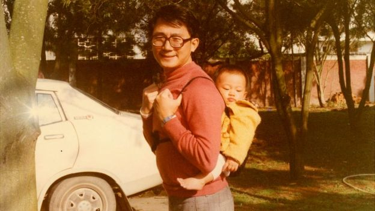
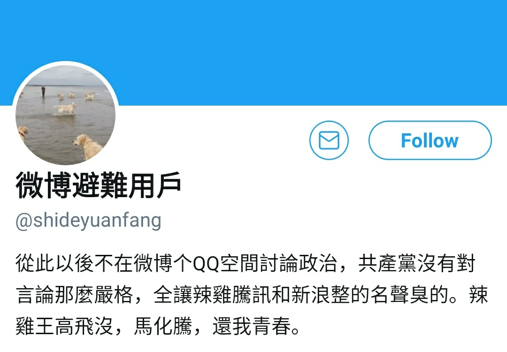

[12月25日 12:00]    新闻大吐槽   @TuCaoFakeNews    整理了近期有关“北大教授”的新闻，发现其实有两种北大教授：

一种是良知尚存的教授，他们的声音在墙内几乎听不到，即便有机会说话，也只能旁敲侧击，否则就会被和谐；

另一种就是良知无存的叫兽~他们名利双收，大行其道！  :speech_balloon:评:4 :+1:赞:27 :globe_with_meridians:转:13  

[12月25日 10:44]    新闻大吐槽   @TuCaoFakeNews    习如果讲话了，也是些“听党话、跟党走”之类的陈词滥调！
绝不会说为国家如何如何的话  :speech_balloon:评:0 :+1:赞:10 :globe_with_meridians:转:2  

[12月25日 10:30]    BBC News 中文   @bbcchinese    你可能知道异性恋、同性恋以及双性恋。但你听说过无性恋吗？他们是怎样一群人，又过着什么样的生活呢？
 https://bbc.in/2EVnKA5   :speech_balloon:评:13 :+1:赞:37 :globe_with_meridians:转:13  

[12月25日 10:13]    GFHG SDKM   @zyx_yny    #HongKongPolice Fire #TearGas Cannisters From Rooftop of the Police Station
~12:30am, 25 Dec 2019
Tsim Sha Tsui (TST) police station, #HKProtesters 
Source: RTHK  :speech_balloon:评:7 :+1:赞:143 :globe_with_meridians:转:179  

[12月25日 09:42]    财经真相   @caijingxiang    为啥党国不过圣诞节？因为苏联在这一天灰飞烟灭！  :speech_balloon:评:34 :+1:赞:574 :globe_with_meridians:转:182  

[12月25日 09:30]    BBC News 中文   @bbcchinese    他拍下了数万张照片，部分照片从未见过报或者在其他场合公开。为保存这些高风险的照片，他在文革期间在住所的木地板上锯了一个洞，将底片藏于洞内。被抄家时，这些照片躲过了一劫。
 https://bbc.in/34Pml8R   :speech_balloon:评:50 :+1:赞:304 :globe_with_meridians:转:134  

[12月25日 08:34]    老司机   @h5lpykl7tp6jjop    大陆的观众能分清谁是暴徒吗？ https://twitter.com/snowyy51621511/status/1209477386879651840 …  :speech_balloon:评:1 :+1:赞:3 :globe_with_meridians:转:2  

[12月25日 08:30]    新闻大吐槽   @TuCaoFakeNews    艺术家在正义的事业中找到了更大的舞台！  :speech_balloon:评:0 :+1:赞:19 :globe_with_meridians:转:1  

[12月25日 08:30]    新闻大吐槽   @TuCaoFakeNews    艺术家在正义的事业中找到了更大的舞台！  :speech_balloon:评:0 :+1:赞:19 :globe_with_meridians:转:1  

[12月25日 08:30]    BBC News 中文   @bbcchinese    惊闻爱女正遭3个男人强奸，她立刻赶了过去......从慈母、杀人犯、传奇英雄、再到慈母，铮铮铁骨，寸寸柔肠，在她身上合而为一。她向BBC敞开心扉，讲述那段有血有泪的故事。
 https://bbc.in/2MmK5uE   :speech_balloon:评:3 :+1:赞:56 :globe_with_meridians:转:29  

[12月25日 08:27]    新闻大吐槽   @TuCaoFakeNews    意大利男高音的歌声越来越美！技艺随着无私的付出而提升！商场的天井成了巨大扩音器，自由之声从最底层直冲顶层，在整个商场中共鸣！  :speech_balloon:评:11 :+1:赞:368 :globe_with_meridians:转:161  

[12月25日 08:27]    新闻大吐槽   @TuCaoFakeNews    意大利男高音的歌声越来越美！技艺随着无私的付出而提升！商场的天井成了巨大扩音器，自由之声从最底层直冲顶层，在整个商场中共鸣！  :speech_balloon:评:11 :+1:赞:368 :globe_with_meridians:转:161  

[12月25日 08:01]    老司机   @h5lpykl7tp6jjop    当年说自己是穷人队伍帮穷人翻身的人，后来都住京城皇宫里和大城市里面，老婆二奶子女干脆都住国外豪宅里，老革命根据地的人七十年过去了，还需要扶贫，2020年许诺进入小康的时间只剩几天，结果扶贫又变成了封锅灶！强拆仍然还在强拆！
历史在缓慢流淌，三千多年过去了，花岗石般的脑袋还不开窍！  :speech_balloon:评:9 :+1:赞:131 :globe_with_meridians:转:39  

[12月25日 08:00]    纽约时报中文网   @nytchinese    #旧文回顾 #观点 在圣诞节，中餐馆几乎从不关门，因此它也成为犹太家庭的首选地。
如今中餐馆在圣诞节受欢迎程度有增无减，甚至成为美国主流的一部分。 http://nyti.ms/2RfrUec   :speech_balloon:评:79 :+1:赞:73 :globe_with_meridians:转:25  

[12月25日 07:40]    老司机   @h5lpykl7tp6jjop      :speech_balloon:评:4 :+1:赞:49 :globe_with_meridians:转:28  

[12月25日 07:30]    BBC News 中文   @bbcchinese    一名女人将张宪义写的信转交身在东京的洪美凤。就在这时刻，洪美凤才知道丈夫是中情局间谍并且叛离台湾。“当我知道我不能再回台湾时，我只是哭。”
 https://bbc.in/2SyaQQX   :speech_balloon:评:13 :+1:赞:37 :globe_with_meridians:转:13  

[12月25日 07:26]    新闻大吐槽   @TuCaoFakeNews    同样是授勋，小英喊的是“中华民国加油”
而前两天习近平也授勋，却不见任何讲话流出，纯粹私相授受！
一个为国家授勋，一个为自己的权力授勋，恐怕这就是国家军队与党卫军的区别

小英还勉励国军团结一致，坚守民主自由。强调守护中华民国从来不是靠妥协，而是靠坚实国防！  :speech_balloon:评:6 :+1:赞:230 :globe_with_meridians:转:62  

[12月25日 07:26]    新闻大吐槽   @TuCaoFakeNews    同样是授勋，小英喊的是“中华民国加油”
而前两天习近平也授勋，却不见任何讲话流出，纯粹私相授受！
一个为国家授勋，一个为自己的权力授勋，恐怕这就是国家军队与党卫军的区别

小英还勉励国军团结一致，坚守民主自由。强调守护中华民国从来不是靠妥协，而是靠坚实国防！  :speech_balloon:评:6 :+1:赞:230 :globe_with_meridians:转:62  

[12月25日 06:46]    新闻大吐槽   @TuCaoFakeNews    进了中共监狱，要么被利用当水军，要么被用作奴工，要么被当作器官供体。总之，在监狱里，要榨干你的价值！
彭博还没当上总统，就跟中共学，美国人选他，太危险了  :speech_balloon:评:0 :+1:赞:11 :globe_with_meridians:转:2  

[12月25日 06:46]    新闻大吐槽   @TuCaoFakeNews    进了中共监狱，要么被利用当水军，要么被用作奴工，要么被当作器官供体。总之，在监狱里，要榨干你的价值！
彭博还没当上总统，就跟中共学，美国人选他，太危险了  :speech_balloon:评:0 :+1:赞:11 :globe_with_meridians:转:2  

[12月25日 06:22]    新闻大吐槽   @TuCaoFakeNews    彭博团队用囚犯当水军，是不是跟中国学的？
中国有很多囚犯在监狱里当五毛，可以换减刑~

监狱诱惑囚犯作恶，等于是对囚犯的良心二次剥皮；
监狱本身和利用监狱的人是真正的罪恶，黑不见底！ https://twitter.com/IntyPython/status/1209592031426813958 …  :speech_balloon:评:2 :+1:赞:45 :globe_with_meridians:转:21  

[12月25日 06:22]    新闻大吐槽   @TuCaoFakeNews    彭博团队用囚犯当水军，是不是跟中国学的？
中国有很多囚犯在监狱里当五毛，可以换减刑~

监狱诱惑囚犯作恶，等于是对囚犯的良心二次剥皮；
监狱本身和利用监狱的人是真正的罪恶，黑不见底！ https://twitter.com/IntyPython/status/1209592031426813958 …  :speech_balloon:评:2 :+1:赞:45 :globe_with_meridians:转:21  

[12月25日 04:44]    老司机   @h5lpykl7tp6jjop    圣诞快乐！  :speech_balloon:评:1 :+1:赞:49 :globe_with_meridians:转:9  

[12月25日 04:41]    老司机   @h5lpykl7tp6jjop    流氓逻辑：只准我建孔子学院！不准老百姓过圣诞！
转发好文：写在平安夜  :speech_balloon:评:6 :+1:赞:142 :globe_with_meridians:转:53  

[12月25日 04:27]    老司机   @h5lpykl7tp6jjop      :speech_balloon:评:0 :+1:赞:13 :globe_with_meridians:转:6  

[12月25日 04:27]    老司机   @h5lpykl7tp6jjop    好文转发：为了某些人活得好一点，就可以让别人活不下去！？  :speech_balloon:评:3 :+1:赞:73 :globe_with_meridians:转:34  

[12月25日 04:12]    GFHG SDKM   @zyx_yny    #ChristmasEve2019HongKong  :speech_balloon:评:6 :+1:赞:77 :globe_with_meridians:转:110  

[12月25日 04:08]    BBC News 中文   @bbcchinese    中国高科技企业受美国制裁和限制后加强了对国内供应的需求，为中国芯片业发展带来了3千亿美元的投资机会。 https://bbc.in/395xx4x   :speech_balloon:评:9 :+1:赞:16 :globe_with_meridians:转:10  

[12月25日 03:30]    老司机   @h5lpykl7tp6jjop    If this is not #PoliceBrutality I seriously don’t know what is. 

This is what #HongKongers have to put up with on Christmas Eve, at Mong Kok #HongKong. 

Video from Hong Kong Citizen Media FB  :speech_balloon:评:30 :+1:赞:487 :globe_with_meridians:转:602  

[12月25日 02:17]    GFHG SDKM   @zyx_yny    Corrupt regime ..Hong Kong is dying Hong Kong people will not forget these hatreds.  :speech_balloon:评:0 :+1:赞:32 :globe_with_meridians:转:45  

[12月25日 00:37]    财经真相   @caijingxiang    伦敦12月23日libor美元隔夜拆借利率报1.5345%，港币比美元拆解利率高：2.90393%-1.5345%=1.36943%，说明港币比美元更紧俏，但是这种利率倒挂不会持续很久，一月内港币拆解利率将会重新跌破1%！  :speech_balloon:评:1 :+1:赞:26 :globe_with_meridians:转:2  

[12月25日 00:30]    财经真相   @caijingxiang    港币今天隔夜拆借利率达到2.90393%，创新几个月的新高，港币拆解利率高于美元，再过几天就元旦了，新年一过，港币资金流动趋紧的情况就会得到改善，港币拆解利率很快就会回落，届时港币重新跌回弱势上方，现在港币真的是个不错的做空位置。  :speech_balloon:评:1 :+1:赞:66 :globe_with_meridians:转:10  

[12月25日 00:27]    GFHG SDKM   @zyx_yny    This boy was just walking past at the Harbour City with a mask on, but was severely beaten by the mad dog @hkpoliceforce aiming at his head.

#HongKongPoliceTerrorists #hongkongpolicebrutality #HongKongProstests #HongKongPoliceState #China_is_terroris #SOSHK https://twitter.com/nanalai/status/1209448858406637569 …  :speech_balloon:评:3 :+1:赞:58 :globe_with_meridians:转:70  

[12月25日 00:26]    老司机   @h5lpykl7tp6jjop    竹外桃花三两枝，春江水暖鸭先知。
蒌蒿满地芦芽短，正是河豚欲上时。
谁知道苏轼写了这首诗，竟引得一位妇人大为光火，胡说八道！她骂道：春江水暖凭什么肯定是鸭先知？难道鹅不能先知道吗？鱼也不能先知道吗？做人要讲事实…………
苏轼：@#¥%/～！  :speech_balloon:评:0 :+1:赞:9 :globe_with_meridians:转:0  

[12月25日 00:19]    财经真相   @caijingxiang    各位圣诞快乐！  :speech_balloon:评:27 :+1:赞:223 :globe_with_meridians:转:1  

[12月25日 00:18]    GFHG SDKM   @zyx_yny    Can’t help but think, looking at these pictures of Christmas Eve in #HongKong, that the birth Christians celebrate tomorrow is a rebuke and a challenge to tyrants everywhere #StandWithHongKong https://twitter.com/jeffreychngo/status/1209452932095258625 …  :speech_balloon:评:1091 :+1:赞:10747 :globe_with_meridians:转:8209  

[12月24日 23:59]    BBC News 中文   @bbcchinese    千百年以来，全球各地都在寻找“长生不老药”。冲绳人长寿的秘诀是什么？ https://bbc.in/2PVLLxD   :speech_balloon:评:9 :+1:赞:52 :globe_with_meridians:转:19  

[12月24日 23:55]    GFHG SDKM   @zyx_yny    #HKPoliceTerrorists opened fire at protestors from atop buildings, breaking guidelines and endangering civilians’ lives. People may get headshot and killed. 

#PoliceBrutality  :speech_balloon:评:146 :+1:赞:2063 :globe_with_meridians:转:2402  

[12月24日 22:59]    BBC News 中文   @bbcchinese    阿姆斯特丹市政府计划要求妓女申请牌照和向她们收税，有人批评政府这样做变相成为拉皮条者。 https://bbc.in/35TP260   :speech_balloon:评:15 :+1:赞:51 :globe_with_meridians:转:13  

[12月24日 21:59]    BBC News 中文   @bbcchinese    瓢泼大雨圣诞夜，驾驶摩托车的埃文斯被抛到高速公路的隔离带。究竟发生了什么？
 https://bbc.in/34UxtBg   :speech_balloon:评:3 :+1:赞:11 :globe_with_meridians:转:2  

[12月24日 21:53]    BBC News 中文   @bbcchinese    中国城市大数据一旦被滥用后果严重 中国数据安全存在疑问。 https://bbc.in/2ZspkTO   :speech_balloon:评:47 :+1:赞:111 :globe_with_meridians:转:44  

[12月24日 21:30]    BBC News 中文   @bbcchinese    你一定知道，烤火鸡是英国人圣诞节必吃的正餐。犹如华人的年夜饭，一年一度。你也许知道，英国人把火鸡叫“土耳其”（Turkey）。那土耳其人呢？总不会愿意自己的国家和一只身形庞大的“鸡”同名吧。
 https://bbc.in/39bamFV   :speech_balloon:评:13 :+1:赞:39 :globe_with_meridians:转:18  

[12月24日 21:00]    BBC News 中文   @bbcchinese    大家的圣诞愿望清单都准备好了吗？圣诞老人从芬兰罗瓦涅米出发到全球派礼物啦！BBC祝大家圣诞快乐愿望成真！  :speech_balloon:评:8 :+1:赞:81 :globe_with_meridians:转:35  

[12月24日 21:00]    纽约时报中文网   @nytchinese    林荣基：“他们（香港抗议者）跑过来台湾，其中有一个，跟这边的一些有背景的人，跟他继续交往，就是说他要为他做一些事情，然后换取他的居留权。这个非常危险，你不知道他要你做什么，对吧？是不是为台湾这块做事，我不知道；是不是为大陆做事的，我不知道。” http://nyti.ms/2sjfyXV   :speech_balloon:评:65 :+1:赞:13 :globe_with_meridians:转:4  

[12月24日 20:59]    BBC News 中文   @bbcchinese    水下世界和陆地不同，但鱼类中同样有无耻恶棍，也有持之以恒为爱筑巢的“暖男”。
 https://bbc.in/35WFwPm   :speech_balloon:评:3 :+1:赞:9 :globe_with_meridians:转:3  

[12月24日 20:31]    BBC News 中文   @bbcchinese    一名台湾男子涉嫌打劫香港一家钟表店后潜逃台湾，台湾寻求港府提供司法互助被拒绝，两地政府连日隔空表达不满。 https://bbc.in/2rns4VL   :speech_balloon:评:25 :+1:赞:43 :globe_with_meridians:转:13  

[12月24日 20:16]    BBC News 中文   @bbcchinese    由于此次三国领导人会议召开地点成都是《三国演义》中蜀国都城所在，因此一些媒体以此典故类比这次会议。安倍晋三特别在会议上表示，希望建立“新三国时代”，“（日、中、韩）三国并非魏蜀吴，不是相争关系，”他说。“希望三国可以与国际社会一同合作发展。” https://bbc.in/379JjJh   :speech_balloon:评:41 :+1:赞:98 :globe_with_meridians:转:34  

[12月24日 20:05]    BBC News 中文   @bbcchinese    平安夜是一个以家庭为核心的传统节日。摆圣诞树、常青藤如同帖年画挂春联，图的是喜兴；烤火鸡如同年夜饭，凖则是剩下一大堆…… https://bbc.in/2ZitQnE   :speech_balloon:评:2 :+1:赞:21 :globe_with_meridians:转:10  

[12月24日 20:01]    墙国铁拳现世报😷   @Socialistfist    感谢广大推友的对上一推的热烈反响和支持。
收到疑似有推友上微博围观评论而遭到喝茶的报告
小编请大家注意网络键政的安全，也不鼓励大家反串留言。  :speech_balloon:评:12 :+1:赞:137 :globe_with_meridians:转:13  

[12月24日 19:30]    纽约时报中文网   @nytchinese    “作家的生活和工作不是人类的礼物，而是必需品。”——托妮·莫里森
“建筑是生活的一面镜子。你只需要把目光投向建筑物，感受过去的存在、一个地方的精神，它们是社会的反映。”
——贝聿铭 http://nyti.ms/2MqUpSi   :speech_balloon:评:4 :+1:赞:21 :globe_with_meridians:转:5  

[12月24日 19:01]    BBC News 中文   @bbcchinese    根据社交媒体微博上的讨论，双方最终进行了一次“史诗般的”战斗。中国大陆玩家因为人数更多赢得胜利。连登网友则称“被虐杀”。 https://bbc.in/2PRNYdd   :speech_balloon:评:90 :+1:赞:198 :globe_with_meridians:转:45  

[12月24日 18:00]    BBC News 中文   @bbcchinese    BBC中文祝大家圣诞节快乐  :speech_balloon:评:35 :+1:赞:293 :globe_with_meridians:转:49  

[12月24日 17:30]    纽约时报中文网   @nytchinese    今年去世的艺术家，在他们最好的作品中，让我们得以用全新的方式看待这个世界——在让我们欢笑与哭泣的同时。
我们在此向他们中的一些人致敬，用他们自己的语言。 http://nyti.ms/2MqUpSi   :speech_balloon:评:5 :+1:赞:35 :globe_with_meridians:转:13  

[12月24日 17:07]    纽约时报中文网   @nytchinese    连锁超市Tesco表示将在调查期间停止出售这些贺卡，并称“没发现证据表明他们违反了我们禁止使用监狱劳工的规定。”
“我们对使用监狱劳工深恶痛绝，绝不会允许出现在我们的供应链中，”该公司称。“我们对这些指控表示震惊，并立即暂停了与生产这些贺卡的工厂的合作，并展开调查。” http://nyti.ms/2PVk1cp   :speech_balloon:评:11 :+1:赞:29 :globe_with_meridians:转:9  

[12月24日 17:01]    老司机   @h5lpykl7tp6jjop    事实与推理
因为廉价出卖劳动力，所以全世界都发生过排华事件！
所有的排华事件都是由别国劳工发起的，与政府老板无关！
现今的贸易战也是你们廉价出卖劳动力给本国老板，美国为了制裁廉价倾销造成的，所以你不要求涨工资造成最后没活干也活该！中共再坏，你不反对就活该！  :speech_balloon:评:1 :+1:赞:41 :globe_with_meridians:转:12  

[12月24日 17:01]    BBC News 中文   @bbcchinese    印度各地最近爆发了一系列大规模示威游行，反对莫迪政府制定的被指“排斥穆斯林”的新公民法（或国籍法）。到底新公民法为什么会引来争议？ https://bbc.in/2tKhrNz   :speech_balloon:评:16 :+1:赞:33 :globe_with_meridians:转:15  

[12月24日 16:30]    纽约时报中文网   @nytchinese    林荣基：“我算是一个比较惨痛的经验。做过噩梦啦，做梦叫出来啦，叫得很大声。就是香港比较紧张，我有一些情况被压抑起来，过来台湾就很放松，很放松之后，（那段经历）通过梦再重现。我有一次叫得很大声，自己都醒过来。很可怕啦，那个梦。” http://nyti.ms/2sjfyXV   :speech_balloon:评:18 :+1:赞:19 :globe_with_meridians:转:6  

[12月24日 16:19]    纽约时报中文网   @nytchinese    班农在离开白宫后很快与郭文贵建立了丰富的财务关系，郭先为他提供了15万美元借款，随后升级为一年期的百万美元合同。中国政府目前正寻求从美国引渡郭文贵。
郭文贵否认了对他违法行为的指控，称北京的引渡要求是报复他对中国腐败的公开批评。 http://nyti.ms/34TcfUD   :speech_balloon:评:206 :+1:赞:358 :globe_with_meridians:转:141  

[12月24日 15:55]    纽约时报中文网   @nytchinese    中国首例未婚冻卵案：单身女性有生育权吗？ https://cn.nytimes.com/china/20191224/china-egg-freezing-lawsuit/ …  :speech_balloon:评:14 :+1:赞:50 :globe_with_meridians:转:17  

[12月24日 15:30]    纽约时报中文网   @nytchinese    徐枣枣希望有一天能有个孩子。她希望在工作为未来家庭存钱的同时冷冻卵子。麻烦的是：中国禁止单身女性做这个手术。
她决定发起中国首起法律诉讼，挑战仅限已婚夫妇接受生育治疗的法律。尽管中国人口形势严峻，但官方仍不鼓励单身女性生育，认为放开这项禁令可能导致更多问题。 http://nyti.ms/2ro885f   :speech_balloon:评:21 :+1:赞:39 :globe_with_meridians:转:5  

[12月24日 15:01]    BBC News 中文   @bbcchinese    刚上任的澳门行政长官贺一诚，除了面对公众日益强烈政改诉求， 他还将面临多项挑战，包括赌权再分配问题。 https://bbc.in/35RYd75   :speech_balloon:评:12 :+1:赞:22 :globe_with_meridians:转:11  

[12月24日 15:00]    纽约时报中文网   @nytchinese    “我们是中国上海青浦监狱的外国囚犯。”“被迫强制劳动。请帮助我们，并通知人权组织。”
英国一名6岁女孩在购于乐购超市的贺卡上发现留言，留言者自称上海青浦监狱的外国囚犯，被迫强制劳动，向人权组织求救。中国外交部否认该监狱存在外籍罪犯强制劳动。 http://nyti.ms/2PVk1cp   :speech_balloon:评:72 :+1:赞:135 :globe_with_meridians:转:44  

[12月24日 14:30]    纽约时报中文网   @nytchinese    林荣基：“香港将来怎么样，我其实不去再想，我等于是有个结论。我比较关注现在留在香港的年轻人出来抗争的时候，最重要是先保卫自己。如果你发现有危险的话，你不能留在香港，你就先离开香港，先把自己保卫起来。”
“我的观念是“人权高于主权”。要看他们（香港人）自己想办法。” http://nyti.ms/2sjfyXV   :speech_balloon:评:13 :+1:赞:33 :globe_with_meridians:转:11  

[12月24日 14:14]    纽约时报中文网   @nytchinese    通过七星海项目，中国获得了对柬埔寨20%的海岸线99年的使用权。美国认为该项目的建设规模远超出商业需求，担忧北京打算把柬埔寨变成事实上的军事前哨。
“为什么中国人要在丛林里建跑道？”一名政治学者说。“这将使中国能够在该地区投射空中力量，也将改变整个游戏规则。” http://nyti.ms/2rnmGSx   :speech_balloon:评:155 :+1:赞:215 :globe_with_meridians:转:118  

[12月24日 14:14]    新闻大吐槽   @TuCaoFakeNews    这就好比你在王府井碰到栗战书，他正好没带警卫，你满脸堆笑，假意恭维，然后突然袭击，不客气的对他说：你丫独裁帮凶，离蹲班房不远了！

栗战书嘎笑一秒钟，扭头走开了，你忐忑不安与家人道别，甚至写好了遗书，可意想不到的是，一夜之后竟然什么也没发生  :speech_balloon:评:16 :+1:赞:287 :globe_with_meridians:转:79  

[12月24日 14:14]    新闻大吐槽   @TuCaoFakeNews    这就好比你在王府井碰到栗战书，他正好没带警卫，你满脸堆笑，假意恭维，然后突然袭击，不客气的对他说：你丫独裁帮凶，离蹲班房不远了！

栗战书嘎笑一秒钟，扭头走开了，你忐忑不安与家人道别，甚至写好了遗书，可意想不到的是，一夜之后竟然什么也没发生  :speech_balloon:评:16 :+1:赞:287 :globe_with_meridians:转:79  

[12月24日 14:03]    新闻大吐槽   @TuCaoFakeNews    海归女生遭中共紅3代（谢觉哉外孙）持槍強奸，警方包庇不查，劝她报警的朋友也被人斩断一根手指，女生只好回到美国，找海外媒体爆料！

王立强是通过看中国投诚，这个女孩是通过大纪元向红三代讨说法！

信任已经建立，示范效应将使家丑外扬的趋势越来越强  :speech_balloon:评:53 :+1:赞:880 :globe_with_meridians:转:539  

[12月24日 14:03]    新闻大吐槽   @TuCaoFakeNews    海归女生遭中共紅3代（谢觉哉外孙）持槍強奸，警方包庇不查，劝她报警的朋友也被人斩断一根手指，女生只好回到美国，找海外媒体爆料！

王立强是通过看中国投诚，这个女孩是通过大纪元向红三代讨说法！

信任已经建立，示范效应将使家丑外扬的趋势越来越强  :speech_balloon:评:53 :+1:赞:880 :globe_with_meridians:转:539  

[12月24日 14:01]    BBC News 中文   @bbcchinese    “没有比外卖中餐更加美国的食物。”作家与摄影师朱洁琳（Katie Salisbury）探索深受美国人喜爱的美式中餐背后，中餐馆移民员工不足为外人道、甜酸苦辣的人生故事。 https://bbc.in/2ZhTgBK   :speech_balloon:评:9 :+1:赞:73 :globe_with_meridians:转:27  

[12月24日 13:27]    新闻大吐槽   @TuCaoFakeNews    重复：
当我落单的时候
才知不该做恶  :speech_balloon:评:0 :+1:赞:26 :globe_with_meridians:转:2  

[12月24日 13:26]    老司机   @h5lpykl7tp6jjop    【行政大队拖行妇女玻璃被打破】
有网民发布视频，片段的时间和地点不详；片段中有穿着行政执法大队的人以及多名防暴警察拖着一名妇女到院子里殴打。妇女在痛苦的呼喊，屋里的孩子也吓得大哭，视频最后突然传出打碎玻璃声，拍片人吓得退后好几步。  :speech_balloon:评:62 :+1:赞:585 :globe_with_meridians:转:457  

[12月24日 13:06]    老司机   @h5lpykl7tp6jjop    它们就是这样吃垮了整个国家！  :speech_balloon:评:3 :+1:赞:43 :globe_with_meridians:转:26  

[12月24日 13:00]    纽约时报中文网   @nytchinese    #每日一词 Vigilante justice，义务法官，非执法人员私自执法。在印度，针对男性强奸嫌疑人的自发性执法行为正在得到支持。近期发生的一起枪击事件更使这波自发的暴力浪潮达到顶峰。
Vigilante justice表示未得到法律授权的人员私自执法，以寻求正义。 
更多简报内容： http://nyti.ms/2MmqfQ4   :speech_balloon:评:3 :+1:赞:6 :globe_with_meridians:转:2  

[12月24日 12:30]    纽约时报中文网   @nytchinese    十年来最好看的30部国际剧集 http://nyti.ms/2PQCMgZ   :speech_balloon:评:5 :+1:赞:22 :globe_with_meridians:转:7  

[12月24日 12:00]    纽约时报中文网   @nytchinese    卡舒吉被杀案宣判：五人死刑，三人监禁。这些判决符合沙特长期以来的论调，即杀戮并非预谋，而是特工们在最后一刻做出的决定。
但这种说法与大量证据相矛盾，《纽约时报》的一段调查视频整理出了谋杀发生的时间线。
更多简报内容： http://nyti.ms/2MmqfQ4   :speech_balloon:评:18 :+1:赞:11 :globe_with_meridians:转:3  

[12月24日 11:30]    纽约时报中文网   @nytchinese    林荣基带着“被失踪”的阴影流亡台湾，并着手在台北重开被迫关闭的铜锣湾书店。他在采访中表示，新的铜锣湾书店预计一个月内开张。
他近日接受纽约时报中文网专访，讲述了他与赴台寻求庇护的香港抗议者之间的互动、重开书店的计划，以及他对当前香港抗议局势的观察。 http://nyti.ms/2sjfyXV   :speech_balloon:评:6 :+1:赞:27 :globe_with_meridians:转:8  

[12月24日 11:14]    老司机   @h5lpykl7tp6jjop    这种机器人如果进入中国市场，女机器人肯定会比男机器人畅销！
因为中国男人把女机器人买回去，只要能陪他睡觉和啪啪啪即可，这个功能好解决！
如果想要中国女人买男机器人，机器人最重要的功能可不是陪她睡觉，而是要能挣钱给她花，这个功能可不好解决。
[捂脸] [捂脸] [捂脸] [捂脸]  :speech_balloon:评:10 :+1:赞:139 :globe_with_meridians:转:31  

[12月24日 11:10]    老司机   @h5lpykl7tp6jjop    又见笨贼！澳华人店午夜遭爆窃，结局却让人哭笑不得
澳洲常出笨贼，让人惊吓之余又能让你笑出鼻涕泡！  :speech_balloon:评:3 :+1:赞:17 :globe_with_meridians:转:4  

[12月24日 11:00]    纽约时报中文网   @nytchinese    香港民众自发监督警察行为。在对警察极度不信任的驱使下，旁观者和抗议者开始在网络空间聚集，发布视频和照片，对逮捕事件进行报道和跟踪。
此外，周一晚间，超过1000名抗议者再次上街抗议，要求对警察不当行为进行调查。 
更多简报内容： http://nyti.ms/2MmqfQ4   :speech_balloon:评:7 :+1:赞:13 :globe_with_meridians:转:4  

[12月24日 10:41]    老司机   @h5lpykl7tp6jjop    百亿富豪的2019生死劫:丑闻、逮捕、自杀...真是国进民退大潮！  :speech_balloon:评:2 :+1:赞:25 :globe_with_meridians:转:24  

[12月24日 10:37]    财经真相   @caijingxiang    黄金“春节攻势”持续中，重回1500美元，然后再哪里震荡一段时间是大概率事件。本轮黄金明显受到了，美股不断创新高的压制，中美第一阶段协议，也大大削弱了黄金的涨势，接下来中国央行降准消息公布后，黄金会冲向本轮最高峰，我们拭目以待吧！  :speech_balloon:评:6 :+1:赞:82 :globe_with_meridians:转:12  

[12月24日 10:23]    墙国铁拳现世报😷   @Socialistfist    附行政复议书  :speech_balloon:评:4 :+1:赞:72 :globe_with_meridians:转:7  

[12月24日 10:22]    纽约时报中文网   @nytchinese    今年4月从香港跑到台湾后，铜锣湾书店店主林荣基感到安心许多，但在不经意间，在香港与大陆经历的“被失踪“事件还是会闯入他的梦境。“有一次叫得很大声，自己都醒过来。“他回忆，“很可怕啦，那个梦。”
他的噩梦是“反送中“运动的不安前奏，也反映出香港抗议者对中国政府的恐惧。 http://nyti.ms/2sjfyXV   :speech_balloon:评:56 :+1:赞:352 :globe_with_meridians:转:153  

[12月24日 10:18]    墙国铁拳现世报😷   @Socialistfist    ”海口市琼山区龙塘政府自2019年2月开始在没有任何法定证据的前提下，连续三次对香世界庄园下达强制拆除和限期拆除，其中行政复议三次，两次被法院撤销拆除令，第三次复议还在等待结果期间直接无批文强拆……要知道，没有法院批准的拆除令的强拆属于严重违法行为！”

摘自：  http://blog.sina.cn/dpool/blog/s/blog_725524e60102zq6u.html?ref=weibocard&from=109C195010&wm=9847_0002&weiboauthoruid=1918182630 …https://twitter.com/minzhutiequan/status/1209266528006234113 …  :speech_balloon:评:26 :+1:赞:172 :globe_with_meridians:转:25  

[12月24日 10:10]    老司机   @h5lpykl7tp6jjop    每年增收一万亿！你它妈抽干多少老年人的血和命？  :speech_balloon:评:0 :+1:赞:5 :globe_with_meridians:转:2  

[12月24日 10:06]    老司机   @h5lpykl7tp6jjop      :speech_balloon:评:0 :+1:赞:0 :globe_with_meridians:转:0  

[12月24日 09:50]    纽约时报中文网   @nytchinese    早安！今日重点新闻包括：
中国宣布降低859种商品关税；香港书商的流亡人生；香港民众自发监督警察行为；伦敦女孩买圣诞卡发现来自中国监狱的求助；波音首席执行官被解雇；卡舒吉被杀案宣判； 阿尔及利亚实际统治者死亡……NYT简报带你速览今日要闻。 http://nyti.ms/2MmqfQ4   :speech_balloon:评:12 :+1:赞:49 :globe_with_meridians:转:9  

[12月24日 09:40]    老司机   @h5lpykl7tp6jjop    美国中情局还有一个统计，中国排名84。日本第二，  :speech_balloon:评:1 :+1:赞:2 :globe_with_meridians:转:0  

[12月24日 09:24]    财经真相   @caijingxiang    李克强：进一步研究降准和定向降准、再贷款和再贴现！ 降准100点已经在路上，2.8万亿的资金缺口只能这么补了，具体时间点，要么本周五27号，要么下周五（1月3号）！a50估计会涨一波！  :speech_balloon:评:19 :+1:赞:208 :globe_with_meridians:转:56  

[12月24日 08:02]    新闻大吐槽   @TuCaoFakeNews    《当我落单的时候》
演唱者：黑警

当我落单的时候
我的腿在颤抖
当我落单的时候
小便也差点就失禁
当我落单的时候
才知道恐惧是什么
当我落单的时候
没人听我诉说  :speech_balloon:评:35 :+1:赞:512 :globe_with_meridians:转:227  

[12月24日 08:02]    新闻大吐槽   @TuCaoFakeNews    《当我落单的时候》
演唱者：黑警

当我落单的时候
我的腿在颤抖
当我落单的时候
小便也差点就失禁
当我落单的时候
才知道恐惧是什么
当我落单的时候
没人听我诉说  :speech_balloon:评:35 :+1:赞:512 :globe_with_meridians:转:227  

[12月24日 00:00]    财经真相   @caijingxiang    社会主义铁拳，不知道会不会砸醒？祖国强大了，就没人救你了！  :speech_balloon:评:70 :+1:赞:722 :globe_with_meridians:转:209  

[12月23日 21:30]    纽约时报中文网   @nytchinese    尽管许多居民表示法罗群岛更偏向于美国而不是中国，但一些人对美国官员要求禁止华为的行为表示了愤怒。他们说，该公司帮助建立的现有的4G网络，令他们可以打电话或从岛上一些更加偏远的地区分享照片。一位居民说：“这唤醒了我内心那种’滚一边去吧’的感觉，我们自己做决定。” https://nyti.ms/2tEZeks   :speech_balloon:评:5 :+1:赞:15 :globe_with_meridians:转:7  

[12月23日 19:50]    财经真相   @caijingxiang    明天就是平安夜了，三胖传说中的“圣诞礼物”是不是也该送到了！我要不要轻仓做点黄金准备一下呢？  :speech_balloon:评:23 :+1:赞:140 :globe_with_meridians:转:18  

[12月23日 19:23]    财经真相   @caijingxiang    人大常委会：居住期限满或者居住权人死亡，居住权消失，应及时办理注销登记！  :speech_balloon:评:78 :+1:赞:321 :globe_with_meridians:转:155  

[12月23日 18:08]    墙国铁拳现世报😷   @Socialistfist    补充香世界庄园负责人朋友圈  :speech_balloon:评:10 :+1:赞:230 :globe_with_meridians:转:64  

[12月23日 18:05]    墙国铁拳现世报😷   @Socialistfist    媒体报道  :speech_balloon:评:10 :+1:赞:143 :globe_with_meridians:转:24  

[12月23日 18:04]    墙国铁拳现世报😷   @Socialistfist    补充强拆视频  :speech_balloon:评:10 :+1:赞:194 :globe_with_meridians:转:40  

[12月23日 18:03]    墙国铁拳现世报😷   @Socialistfist    美国驻广州总领事说：香世界庄园是一个很酷的地方！
海口政府官员说：并没有。

海口市十多年企业，百号员工，一天化为乌有
#社会主义铁拳  :speech_balloon:评:147 :+1:赞:1226 :globe_with_meridians:转:532  

[12月23日 16:07]    GFHG SDKM   @zyx_yny    Crime of Violence Hong Kong Police Links
香港警察16項國際罪行已經翻譯20種語言
阿拉伯語 –  https://youtu.be/3ATOcsLBuFY 
中文語言 - https://youtu.be/o-mRxwDgWWs 
荷蘭語 - https://youtu.be/fJAZXpwLvjA 
英語 - https://youtu.be/GioMow5iemo 
法語 - https://youtu.be/ANYh58MtjIc 
德語 -https://youtu.be/Im6sTcDJWhE   :speech_balloon:评:27 :+1:赞:837 :globe_with_meridians:转:859  

[12月23日 10:11]    财经真相   @caijingxiang    截至12月13日，国债累计发行约4.03万亿元人民币，地方债券累计发行4.34万亿元，其中，新增债券、再融资债券、置换债券分别发行3.03万亿元、1.15万亿元、0.16万亿元。新增债券中，一般债券、专项债券分别发行0.9万亿元、2.13万亿元。两者相加超过8万亿，还不计算三大政策性银行！  :speech_balloon:评:10 :+1:赞:164 :globe_with_meridians:转:64  

[12月23日 05:47]    新闻大吐槽   @TuCaoFakeNews    中南海里的包子早已不是真包子，他只是个被国师操控的傀儡，一切政令都出自国师，包括傀儡念的稿！

而真包子被国师抹去了记忆，扔在包子铺，每天以卖包子为生。  :speech_balloon:评:98 :+1:赞:1238 :globe_with_meridians:转:344  

[12月23日 05:38]    老司机   @h5lpykl7tp6jjop    CCP Secret
中共習近平：二次回歸必須殺2/3香港人

2015年内部會議，習近平指出“…#香港二次回歸，必須注意兩件事：#三年自然災害，無數反特黑五類逃往香港…中國人民 #文化大革命，無數反動知識分子逃往香港…反革命分子，仇視人民仇視中國…我們要糾正歷史，鎮壓漏網之魚…我們必須殺2/3香港人…”  :speech_balloon:评:29 :+1:赞:126 :globe_with_meridians:转:102  

[12月23日 02:27]    老司机   @h5lpykl7tp6jjop    I am always ready to speculate on the worst of CCP, but the actual despicable crimes far exceed my speculations!  :speech_balloon:评:2 :+1:赞:15 :globe_with_meridians:转:13  

[12月23日 00:03]    财经真相   @caijingxiang    本轮通胀是由猪肉上涨引发的，其他商品并未同步大涨，这是典型的“机构性通胀”，目前来看对中国金融系统冲击有限，央行不会为此进行加息，甚至会继续降息。比起吃不起猪肉，明年经济继续下滑带来的失业，更让中共金融系统决策者感到棘手！ https://www.youtube.com/watch?v=Ru5vTNydrSg&lc=z22rsvu4wk31cff3cacdp430qwmpwwda5apw1lcqf0tw03c010c …  :speech_balloon:评:13 :+1:赞:170 :globe_with_meridians:转:42  

[12月22日 23:22]    财经真相   @caijingxiang    12月21日，南方日报记者从广东省地方金融监督管理局获悉，在粤港澳大湾区建设的大背景下，广东将在支持澳门打造中国—葡语国家金融服务平台、推进跨境融资租赁业务开展、不断拓宽跨境合作通道、支持澳门机构参与发起设立粤港澳大湾区国际商业银行、支持两地保险机构合作开发保险产品等多方面进行合作。  :speech_balloon:评:23 :+1:赞:123 :globe_with_meridians:转:20  

[12月22日 15:50]    财经真相   @caijingxiang    黄奇帆：每项供给侧改革都有万亿级红利，延长女性退休年龄这一供给侧改革，也是黄奇帆认为可带来万亿级红利的重大举措。他认为，如果妇女退休年龄从现在的50岁变革为60岁，甚至是和男性一样延长到65岁，每年相当于增加1万亿元养老金，必将缓和许多省份养老保险资金链紧张的情况！  :speech_balloon:评:115 :+1:赞:481 :globe_with_meridians:转:186  

[12月22日 09:45]    凡賽堤/FORSETI   @FecharCCP    護臺！！！ 救港！！！救疆！！！

台灣人正在醒過來！！！全球華人正在醒過來..........
我們不是旁觀者，我們不是評論員，
我們都是當事人，我們都是見證著！
因為我們都是華族的一員！！！

讓我們一起消滅極權吧！

時代革命，光復華族！

------------原視頻來自台灣自由時報！  :speech_balloon:评:2 :+1:赞:48 :globe_with_meridians:转:22  

[12月22日 09:17]    凡賽堤/FORSETI   @FecharCCP    海外的華族台灣同胞！
台灣正在經歷歷史的變革，此時此刻的台灣正處於生死攸關時刻，台灣未來的命運取決你們手中神聖的全票！
呼籲海外的所有台灣同胞回家投票！
只有國民黨滅亡台灣的未來才有希望！！！

----感謝此視頻的原創作者！  :speech_balloon:评:0 :+1:赞:16 :globe_with_meridians:转:9  

[12月22日 08:55]    凡賽堤/FORSETI   @FecharCCP    極權恐怖組織的殺人犯警試圖用身體和盾擋住拍攝者的視頻！但是它們擋不住700萬正義香港人所有的見證著！
擋不住全球華人和全人類正義的良知！！！
時代革命，消滅極權，光復華族，人人有責！

----感謝此視頻的正義原創作者！  :speech_balloon:评:8 :+1:赞:117 :globe_with_meridians:转:115  

[12月22日 08:46]    凡賽堤/FORSETI   @FecharCCP    浮屍，墜樓，被輪姦，被自殺........一直沒有停止過！

CCP極權殺人恐怖組織正在用各種兇殘手段屠殺我們的同胞...................
CCP極權殺人恐怖組織是全人類的公敵！
呼籲全世界正道主義合力消滅CCP！
呼籲全世界人民看清楚CCP反人類的慘無人道的殘暴罪行！！！  :speech_balloon:评:4 :+1:赞:10 :globe_with_meridians:转:14  

[12月22日 08:35]    凡賽堤/FORSETI   @FecharCCP    正在美國白宮網站請願取消2022北京冬奧會，想法是不錯，不過美國政府可以干預奧運會，但是奧運會不是美國說的算！支持一下也無妨！

Ask the International Olympics Commission & Corporate Sponsors to relocate or cancel the Beijing 2022 Winter Olympics  https://petitions.whitehouse.gov/petition/ask-international-olympics-commission-corporate-sponsors-relocate-or-cancel-beijing-2022-winter-olympics …  :speech_balloon:评:0 :+1:赞:2 :globe_with_meridians:转:1  

[12月22日 08:26]    凡賽堤/FORSETI   @FecharCCP    台灣人正在醒過來！！！全球華人正在醒過來..........
我們不是旁觀者，我們不是評論員，
我們都是當事人，我們都是見證著！
因為我們都是華族的一員！！！

讓我們一起消滅極權吧！

時代革命，光復華族！

------------原視頻來自台灣自由時報！  :speech_balloon:评:0 :+1:赞:13 :globe_with_meridians:转:7  

[12月22日 07:42]    凡賽堤/FORSETI   @FecharCCP    台灣人正在醒過來！！！全球華人正在醒過來..........
讓我們一起消滅極權吧！時代革命，光復華族！

2020將是告別華人歷史的極權統治的新的一年！！！

本人非此視頻的原創！非常感謝此視頻的原創作者！！！  :speech_balloon:评:2 :+1:赞:123 :globe_with_meridians:转:47  

[12月22日 07:34]    凡賽堤/FORSETI   @FecharCCP    感謝此視頻的原始上傳作者！  :speech_balloon:评:0 :+1:赞:4 :globe_with_meridians:转:0  

[12月22日 07:28]    凡賽堤/FORSETI   @FecharCCP    台灣人正在醒過來！！！全球華人正在醒過來..........
讓我們一起消滅極權吧！時代革命，光復華族！  :speech_balloon:评:1 :+1:赞:107 :globe_with_meridians:转:45  

[12月21日 22:56]    财经真相   @caijingxiang    ETC是否具有定位功能，查了一下网络，今年夏季就有人在网上讨论，丽水辟谣网还专门辟谣，一些技术帖子说，ETC不能定位，因为没有定位芯片，但是继续查询发现，没有GPS定位模组，物联网设备LBS也可以定位，有没有懂技术的大神说一下？  :speech_balloon:评:84 :+1:赞:135 :globe_with_meridians:转:30  

[12月21日 22:41]    财经真相   @caijingxiang    ETC真的是太阳能供电，有没有专门的人做检测，如果真的有GPS定位，那真的是细思极恐！中共彻底的随时、随地实时掌控，全国的人、物！彻彻底底的现代化高科技奴隶制度！ https://twitter.com/seanchen_new/status/1208389425987670018 …  :speech_balloon:评:121 :+1:赞:373 :globe_with_meridians:转:111  

[12月21日 22:08]    财经真相   @caijingxiang    哦哦！这么说以后节假日也不免费了？春节高速还堵路吗？ https://twitter.com/StevenSir2020/status/1208387676606324738 …  :speech_balloon:评:21 :+1:赞:92 :globe_with_meridians:转:17  

[12月21日 20:36]    墙国铁拳现世报😷   @Socialistfist    爱党鄙视链

#战螂在推特  :speech_balloon:评:46 :+1:赞:465 :globe_with_meridians:转:93  

[12月21日 15:42]    财经真相   @caijingxiang    中共政府推广ETC的初衷是为了节约同行时间，但是实际上反而还没以往人工快，尤其是政府自己搭建的收费系统，流量一大就直接卡死，其结果就是车辆直接停在收费站，直到网络显示收费成功后，才可以放行，于是后面等待的车辆一股脑的全变车道，去了人工收费站，整个收费站瞬间变成停车场！  :speech_balloon:评:21 :+1:赞:129 :globe_with_meridians:转:22  

[12月21日 15:38]    财经真相   @caijingxiang    距离国务院下达的时间点就剩10天了，目前ETC普遍存在问题是：①为了强制推广，减少人工收费口，导致人工出口超级堵车②部分小出口过于狭窄，人工口一堵，整个收费站都瘫痪③部分车辆ETC无法识别，被迫变车道，引发各种交通事故④还有的ETC和人工车道并存，结果更堵⑤收费软件卡，结果又是等待堵车  :speech_balloon:评:32 :+1:赞:170 :globe_with_meridians:转:54  

[12月21日 12:37]    财经真相   @caijingxiang    新的银行结售汇数据出来了，2019.1-11的数据很有意思。北京实物购买逆差较多，说明政府才是外汇最大的消耗者。上海服务贸易逆差最大，说明上海人最愿意出国旅游，以及购买国外的服务；赚了外汇汇到国内最多是浙江人，而不是福建人。福建不是传说中的偷渡大省吗？难道他们只是人出去，钱不汇回国吗？  :speech_balloon:评:29 :+1:赞:297 :globe_with_meridians:转:142  

[12月21日 12:31]    凡賽堤/FORSETI   @FecharCCP    国内男子当街殴打儿童，行为令人发指！周围经过的路人选择无视！这就是自夸治安最好的第二大经济体！  :speech_balloon:评:264 :+1:赞:727 :globe_with_meridians:转:670  

[12月21日 09:58]    财经真相   @caijingxiang    但新华社报导，习近平强调，对近一段时间来美方在涉台、涉港、涉疆、涉藏等问题上的消极言行表示严重关切。“这些做法干涉了中国内政、损害了中方利益，不利于双方互信合作。”要坚持政治解决的大方向，各方要相向而行，保持对话缓和势头，这符合各方共同利益。 https://twitter.com/USA_China_Talk/status/1208202887014354944 …  :speech_balloon:评:16 :+1:赞:125 :globe_with_meridians:转:28  

[12月20日 22:48]    墙国铁拳现世报😷   @Socialistfist    “每当回到现实生活中，梦立刻被击得粉碎”
网络文学作家 罗霸道发帖称父母辛苦养鱼和邻居的鸭子被人河中投毒毒死，血本无归。警察和当地畜牧水产踢皮球。经历这些种种，罗霸道发文感慨，自己在现实生活中霸道不起来。

#社会主义铁拳  :speech_balloon:评:52 :+1:赞:487 :globe_with_meridians:转:142  

[12月20日 22:03]    墙国铁拳现世报😷   @Socialistfist    经验教训告诉我们，孙笑川们翻墙爱党的后果就是腾讯推特一起封号
因投稿人要求厚码
#社会主义铁拳  :speech_balloon:评:32 :+1:赞:462 :globe_with_meridians:转:99  

[12月20日 09:10]    凡賽堤/FORSETI   @FecharCCP    浮屍，墜樓，被輪姦，被自殺........一直沒有停止過！
都是我們族人，同胞，親人，朋友......我們還是束手無助！！！ CCP極權在70年間已經有不完全統計的上億華人被以各種手段，莫須有罪名殺害，今天每天都還在發生！
我們怎麼辦？隨時隨刻將在你的親人，朋友身邊發生！！！怎麼辦？  :speech_balloon:评:19 :+1:赞:100 :globe_with_meridians:转:101  

[12月20日 08:08]    凡賽堤/FORSETI   @FecharCCP    時代革命，消滅極權，光復中華，人人有責！！！  :speech_balloon:评:0 :+1:赞:3 :globe_with_meridians:转:0  

[12月20日 07:59]    凡賽堤/FORSETI   @FecharCCP    在科技與文明的新時代，每個華人全部行駛歷史賦予華人的新的神聖使命----時代革命，消滅極權，光復中華！！！  :speech_balloon:评:3 :+1:赞:25 :globe_with_meridians:转:16  

[12月20日 07:48]    凡賽堤/FORSETI   @FecharCCP    CCP極權挾14億華人以令世界70年，聲討與消滅CCP極權的時代已經來了，讓我們一起學習香港人永不屈服的正義精神！！！ 全面傳播香港的危機真相來喚醒14億人的良知！
讓我們一起向全世界發出震撼人類歷史的全民聲討消滅CCP極權組織的聲音！！！永不屈服！！！永不停止！！  :speech_balloon:评:5 :+1:赞:123 :globe_with_meridians:转:80  

[12月20日 07:35]    凡賽堤/FORSETI   @FecharCCP    期望全世界正義之人每個人全面收集整理香港6.9以來的所有視頻，畫面加以時間，事件說明，中英文製作宣傳片，紀錄片，保存並向全世界社交媒體傳播！永不停止！！！ https://twitter.com/FecharCCP/status/1198065532991410177 …  :speech_balloon:评:1 :+1:赞:29 :globe_with_meridians:转:21  

[12月20日 07:25]    凡賽堤/FORSETI   @FecharCCP    我們不可停止，我們將無限循環傳播香港的全方位被CCP極權組織殘暴殺害的種種真相視頻和畫面，永不停止！！！！！！！！！！！！！！！！！！！！！！！！！！！！！！！！！！！！！！！！！！！！！！！！！！！！！！！！！！！！！！！！！！！！！！！！！！！！！！！！！！！  :speech_balloon:评:32 :+1:赞:621 :globe_with_meridians:转:663  

[12月20日 07:21]    凡賽堤/FORSETI   @FecharCCP    我們不可停止，我們將無限循環傳播香港的全方位被CCP極權組織殘暴殺害的種種真相視頻和畫面，永不停止！！！！！！！！！！！！！！！！！！！！！！！！！！！！！！！！！！！！！！！！！！！！！！！！！！！！！！！！！！！！！！！！！！！！！！！！！！！！！！！！！！！  :speech_balloon:评:0 :+1:赞:6 :globe_with_meridians:转:3  

[12月20日 07:18]    凡賽堤/FORSETI   @FecharCCP    我們不可停止，我們將無限循環傳播香港的全方位被CCP極權組織殘暴殺害的種種真相視頻和畫面，永不停止！！！！！！！！！！！！！！！！！！！！！！！！！！！！！！！！！！！！！！！！！！！！！！！！！！！！！！！！！！！！！！！！！！！！！！！！！！！！！！！！！！！ https://twitter.com/FecharCCP/status/1198392652863021056 …  :speech_balloon:评:0 :+1:赞:14 :globe_with_meridians:转:12  

[12月19日 01:55]    墙国铁拳现世报😷   @Socialistfist    后续申明  :speech_balloon:评:17 :+1:赞:126 :globe_with_meridians:转:20  

[12月18日 19:54]    墙国铁拳现世报😷   @Socialistfist    根据网上来源显示抚顺生猪肉价在每公斤30元左右。由此得出花千芳母亲一个月可以购买猪肉6.7公斤左右  :speech_balloon:评:11 :+1:赞:64 :globe_with_meridians:转:8  

[12月18日 19:19]    墙国铁拳现世报😷   @Socialistfist    目前花千芳已经意识到评论翻车已经删除该条微博
小编建议花千芳可以从此把简介改成： 我们的征途是星辰大海和妈妈的养老证  :speech_balloon:评:9 :+1:赞:272 :globe_with_meridians:转:32  

[12月18日 18:42]    墙国铁拳现世报😷   @Socialistfist    #社会主义铁拳 https://twitter.com/zhanglucy88/status/1207234309737697280 …  :speech_balloon:评:32 :+1:赞:368 :globe_with_meridians:转:98  

[12月17日 23:13]    墙国铁拳现世报😷   @Socialistfist      :speech_balloon:评:9 :+1:赞:58 :globe_with_meridians:转:6  

[12月17日 23:13]    墙国铁拳现世报😷   @Socialistfist    注意到他使用日文，这个老哥真是猜不透他  :speech_balloon:评:11 :+1:赞:99 :globe_with_meridians:转:3  

[12月17日 21:53]    墙国铁拳现世报😷   @Socialistfist    补充  :speech_balloon:评:11 :+1:赞:95 :globe_with_meridians:转:7  

[12月17日 21:36]    墙国铁拳现世报😷   @Socialistfist    习近平主席想要知道你的坐标

#战螂在推特 https://twitter.com/minzhutiequan/status/1206795300255387648 …  :speech_balloon:评:26 :+1:赞:300 :globe_with_meridians:转:26  

[12月17日 21:29]    墙国铁拳现世报😷   @Socialistfist    声明：小编在推友提醒后把推文删除了，原因请见配图。与之前其他人不同，他的措辞实属现行网络舆论管制下的无奈。  :speech_balloon:评:26 :+1:赞:320 :globe_with_meridians:转:74  

[12月15日 02:39]    GFHG SDKM   @zyx_yny    This Muslim man was just released from a concentration in china 

"He could barely walk by himself. He doesn't recognize anyone in his family and gets frightened by every little movement of people around him"

There are nearly 3 Million Muslim in concentration camps in China   :speech_balloon:评:1491 :+1:赞:75218 :globe_with_meridians:转:62073  

[12月14日 22:11]    GFHG SDKM   @zyx_yny    My 2020 New Year resolution is to free both Hong Kong & China by defeating the New Evil Empire. Happy New Year! https://twitter.com/bohsiuming/status/1205845620851785735 …  :speech_balloon:评:423 :+1:赞:4900 :globe_with_meridians:转:2365  

[12月14日 10:09]    GFHG SDKM   @zyx_yny    #HKPoliceTerrorists has fired nearly 16,000 #TearGas rounds  during the six months of pro-#democracyforhk #HongKongProtests  :speech_balloon:评:12 :+1:赞:279 :globe_with_meridians:转:263  

[12月14日 03:21]    GFHG SDKM   @zyx_yny    #HongKongers & #HongKong #StandwithUyghurs 

To free #Uyghurs in #EastTurkistan, Chinese Communist Party of #China which violates #HumanRights needs to end. 

#BoycottChina  :speech_balloon:评:2 :+1:赞:129 :globe_with_meridians:转:22  

[12月14日 01:42]    GFHG SDKM   @zyx_yny    Support  :speech_balloon:评:7 :+1:赞:404 :globe_with_meridians:转:54  

[12月13日 22:17]    GFHG SDKM   @zyx_yny    警察の鎮圧行動の中、原因不明の転落死で亡くなった周梓樂くん。

これは周くんのお父さんからの手紙。

//君がまだ母親のお腹にいたあの頃に、私たちはすでに君に「樂樂」という名前を付けることを決めたんだ。
君が一生楽しく笑顔で過ごせますように、と願って。//

是非、全文もご一読ください。  :speech_balloon:评:18 :+1:赞:1009 :globe_with_meridians:转:774  

[12月13日 20:13]    GFHG SDKM   @zyx_yny    日本政府が来年、習近平国家主席を国賓として招くことについて、私は強く反対しています。

これはあくまで一人の香港人としての個人的な意見ですが、日本の皆さんに読んでほしいです。→  :speech_balloon:评:743 :+1:赞:22397 :globe_with_meridians:转:10405  

[12月13日 18:50]    GFHG SDKM   @zyx_yny    #HayırlıCumalarDoğuTürkistan   :speech_balloon:评:19882 :+1:赞:220944 :globe_with_meridians:转:103974  

[12月13日 13:58]    GFHG SDKM   @zyx_yny    永不遺忘，常在心中，他們的付出，將會留給世世代代，香港多謝有你才會有未来，香港史書會有手足的勇敢，輝煌的事件。  :speech_balloon:评:52 :+1:赞:843 :globe_with_meridians:转:535  

[12月13日 11:19]    GFHG SDKM   @zyx_yny    Can't believe Commissar Lamb is rewarding @hkpoliceforce human rights abuse & brutality. https://twitter.com/Kaman13032369/status/1205325571070124037 …  :speech_balloon:评:449 :+1:赞:5156 :globe_with_meridians:转:4123  

[12月12日 16:51]    GFHG SDKM   @zyx_yny    Japanese retail brand MUJI was sued by fake "MUJI" copycat in #China (right) for copyright dispute and the fake MUJI won the court case.

The genuine MUJI has to pay the fake one US$85k for their "financial loss" and apologize due to "copyright infringement"

China = Fantasy Land  :speech_balloon:评:151 :+1:赞:1464 :globe_with_meridians:转:1313  

[12月12日 16:35]    GFHG SDKM   @zyx_yny    He comes all the way from Japan, bring coffee with him to give Hong Kong people a free cup. “I come to give some warmth to you guys, I know what happened” he said 

#StandWithHongKong  :speech_balloon:评:162 :+1:赞:4048 :globe_with_meridians:转:2112  

[12月12日 13:43]    GFHG SDKM   @zyx_yny    今日、すき家の香港店がオープンしました。昨日の夜から長い行列ができました（笑）

親中派企業が経営している香港吉野家を多くの香港人がボイコットしている今、すき家は多分大人気になると思いますw

#香港 #すき家  :speech_balloon:评:451 :+1:赞:23893 :globe_with_meridians:转:7799  

[11月24日 08:10]    凡賽堤/FORSETI   @FecharCCP    呼籲請求共同挖掘所有有關香港發生的事，越全面越好，不同角度，越多越好，包括被暗地抓捕的人員，特別是CCP 派出的各種偽裝身份，包括變身變裝行兇的一點一滴都要挖掘出來，把CCP 的邪惡下三濫手段的真相毫無保留的曝光在全世界面前！世界公知公義才能真正挽救和保護香港人！希望懂視頻編輯配上中英文  :speech_balloon:评:4 :+1:赞:25 :globe_with_meridians:转:22  

[11月23日 10:46]    凡賽堤/FORSETI   @FecharCCP    CCP極權殺人恐怖組織正在用各種兇殘手段屠殺我們的同胞...................
CCP極權殺人恐怖組織是全人類的公敵！
呼籲全世界正道主義合力消滅CCP！
呼籲全世界人民看清楚CCP反人類的慘無人道的殘暴罪行！！！

消滅CCP是全世界全人類的當前最緊急任務！！！

視頻是被非法抓捕的學生李俊希"(同音)！  :speech_balloon:评:0 :+1:赞:12 :globe_with_meridians:转:8  

[10月09日 00:47]    GFHG SDKM   @zyx_yny    "Son, when you grow up
You will be the savior of the broken
The beaten, and the damned?"
Please watch this powerful mv #HongKongProtester #hkprotests 
香港反送中護法戰爭(Hong Kong Defensive War 2019)：Welcome To The Black Parade  https://youtu.be/0yXTHODE24Q  via @YouTube  :speech_balloon:评:4 :+1:赞:21 :globe_with_meridians:转:8  

[10月07日 02:44]    凡賽堤/FORSETI   @FecharCCP    這是繼毛之後第一個出現統治最歹毒，最凶狠，最狡詐，最血腥，最無情，最恐怖的社會！ https://twitter.com/ylokware/status/1180804846468788224 …  :speech_balloon:评:1 :+1:赞:7 :globe_with_meridians:转:4  

[03月13日 08:10]    老司机   @h5lpykl7tp6jjop    批评是批评家天生的使命！他们只感知对错，信奉真理，指出真相不吐不快，不在意权势和群众的喜好，从批评里不可能获得任何好处，但批评家愚直不改。在中国几乎所有人都讨厌批评家，喜欢阴谋家，因为他们只说好听的！可是就因为中国的批评家太少，中国几乎看不到未来和希望！  :speech_balloon:评:106 :+1:赞:272 :globe_with_meridians:转:55  

