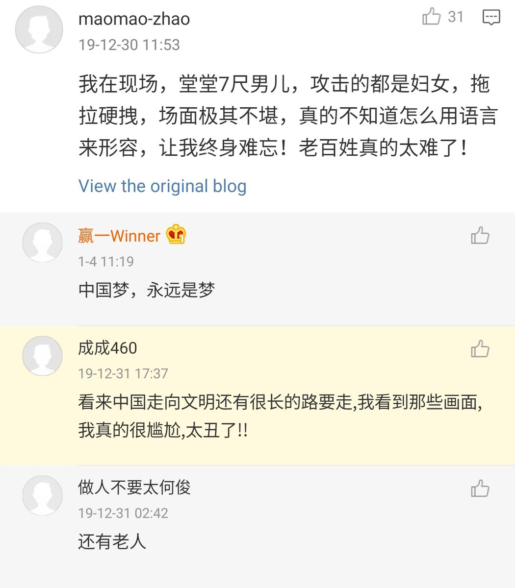
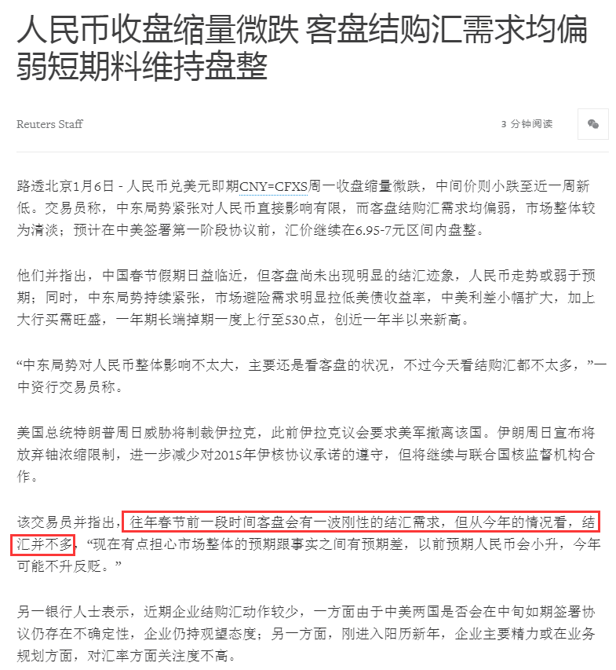

[01月08日 17:10]    财经真相   @caijingxiang    凤凰在人间栏目是内地为数不多讲述中国底层故事的新闻。这篇《徘徊在港深跨境学童》的文章，揭示香港返送中以来另一个群体的人生故事，跨境学童为逃避内地户籍奴隶制束缚，被迫到香港上学，小小年纪每天就必须跨城上课，这里面的辛酸是很少有人知道，现在他们又要在红旗下继续洗脑教育！  :speech_balloon:评:3 :+1:赞:23 :globe_with_meridians:转:7  

[01月08日 17:01]    BBC News 中文   @bbcchinese    随着科技发展和工作形态的演变，在职场上成功所需要的技能也在不断变化。AQ，适应能力很可能决定你职业生涯的成功。 https://bbc.in/2FshAYE   :speech_balloon:评:2 :+1:赞:9 :globe_with_meridians:转:2  

[01月08日 16:48]    新闻大吐槽   @TuCaoFakeNews    淘宝一年放出1000个宝贝进入政府部门，大学……马云这是想篡党夺权！  :speech_balloon:评:0 :+1:赞:3 :globe_with_meridians:转:3  

[01月08日 16:47]    新闻大吐槽   @TuCaoFakeNews    当年印尼向当地华人举起屠刀的时候，支共连屁都不敢放  :speech_balloon:评:1 :+1:赞:14 :globe_with_meridians:转:2  

[01月08日 16:38]    新闻大吐槽   @TuCaoFakeNews    东南亚小国家应该看看中国历史，秦国是如何灭六国的。各自为政必死无疑，只有联众抗衡才有神算，当东南亚诸国联合起来后，中共必将退缩。不要一点点蝇头小利，以致最后被灭亡。  :speech_balloon:评:0 :+1:赞:3 :globe_with_meridians:转:3  

[01月08日 16:37]    新闻大吐槽   @TuCaoFakeNews    印尼军队居然开军舰！中国人民解放军是在面对手无寸铁的对手时才能发挥出所向披靡的强大实力，印尼分明是利用解放军的弱点仗势欺人！  :speech_balloon:评:1 :+1:赞:11 :globe_with_meridians:转:2  

[01月08日 16:36]    新闻大吐槽   @TuCaoFakeNews    銳見 https://twitter.com/tucaofakenews/status/1214691516800585728 …  :speech_balloon:评:0 :+1:赞:7 :globe_with_meridians:转:2  

[01月08日 16:29]    新闻大吐槽   @TuCaoFakeNews    跟粉红在海外异曲同工 https://twitter.com/tucaofakenews/status/1214703406369124352 …  :speech_balloon:评:0 :+1:赞:7 :globe_with_meridians:转:3  

[01月08日 16:00]    新闻大吐槽   @TuCaoFakeNews    欺善怕惡？

#antichinazi https://twitter.com/TuCaoFakeNews/status/1214687617440088065 …  :speech_balloon:评:0 :+1:赞:13 :globe_with_meridians:转:5  

[01月08日 16:00]    新闻大吐槽   @TuCaoFakeNews    恩将仇报  :speech_balloon:评:0 :+1:赞:2 :globe_with_meridians:转:1  

[01月08日 15:58]    新闻大吐槽   @TuCaoFakeNews    啊哈哈哈。除了撒币，不然就给丫来硬的。 https://twitter.com/TuCaoFakeNews/status/1214687617440088065 …  :speech_balloon:评:1 :+1:赞:5 :globe_with_meridians:转:3  

[01月08日 15:53]    新闻大吐槽   @TuCaoFakeNews    估计适逢中国经济寒冬，而在印尼的一带一路和商贸利益过大；
素有反华传统的印尼人一旦被激怒，估计又是一通排华  :speech_balloon:评:2 :+1:赞:25 :globe_with_meridians:转:0  

[01月08日 15:40]    新闻大吐槽   @TuCaoFakeNews    小粉紅戰狼精知道強國這麼歷害嗎？ https://twitter.com/tucaofakenews/status/1214687617440088065 …  :speech_balloon:评:0 :+1:赞:10 :globe_with_meridians:转:4  

[01月08日 15:40]    纽约时报中文网   @nytchinese    澳大利亚的野火已经造成至少24人丧生，1400多所房屋被毁，6万平方公里的土地遭到破坏，而且对该国著名的野生动植物造成了惨重的损失。
据估计，可能有数以亿计的动物已经死亡，其中许多是其他大陆上没有的，这破坏了该国独特的生态系统。 http://nyti.ms/37MHN0d   :speech_balloon:评:8 :+1:赞:23 :globe_with_meridians:转:10  

[01月08日 15:26]    新闻大吐槽   @TuCaoFakeNews    UK,look at this,they are not your people! https://twitter.com/tucaofakenews/status/1214703406369124352 …  :speech_balloon:评:1 :+1:赞:9 :globe_with_meridians:转:1  

[01月08日 15:18]    新闻大吐槽   @TuCaoFakeNews     https://twitter.com/tucaofakenews/status/1214719803232907265 …  :speech_balloon:评:0 :+1:赞:4 :globe_with_meridians:转:2  

[01月08日 15:12]    新闻大吐槽   @TuCaoFakeNews    内战内行，外战外行 https://twitter.com/tucaofakenews/status/1214687617440088065 …  :speech_balloon:评:1 :+1:赞:9 :globe_with_meridians:转:2  

[01月08日 15:11]    纽约时报中文网   @nytchinese    五角大楼周二称，伊朗向两个美军驻伊拉克基地发射了十余枚弹道导弹。
“很明显这些导弹是从伊朗发射的，目标是至少两处驻有美军和联军成员的伊拉克军事基地，包括阿萨德和埃尔比尔。”五角大楼首席发言人乔纳森·霍夫曼在一份声明中说。 http://nyti.ms/35BfpfY   :speech_balloon:评:3 :+1:赞:21 :globe_with_meridians:转:8  

[01月08日 15:09]    新闻大吐槽   @TuCaoFakeNews    战列舰? 这个梦也太旧了吧  :speech_balloon:评:0 :+1:赞:1 :globe_with_meridians:转:1  

[01月08日 15:01]    BBC News 中文   @bbcchinese    世界潮流瞬息万变，但在现代史上，1989年占据独特地位。那一年发生的巨变真可谓翻天覆地，彻底改变了世界格局。 https://bbc.in/39NADKX   :speech_balloon:评:14 :+1:赞:77 :globe_with_meridians:转:24  

[01月08日 14:01]    BBC News 中文   @bbcchinese    2020年1月11日台湾将举行总统大选及立法委员选举，因民粹主义兴起、中美贸易战、香港示威及中国强硬表态“一国两制台湾方案”等，台湾大选扑朔迷离。BBC 中文精选2020台湾总统大选必看关键词。 https://bbc.in/2QYSJRF   :speech_balloon:评:25 :+1:赞:46 :globe_with_meridians:转:10  

[01月08日 14:00]    纽约时报中文网   @nytchinese    这起坠机事故发生在伊朗一个紧张的时期，与美国之间的政治局势升级导致该国事态紧张。
周二，美国联邦航空总署以商用飞机存在被误认为军用飞机的风险为由，禁止美国客机飞越伊朗上空。 http://nyti.ms/35zCXlr   :speech_balloon:评:5 :+1:赞:20 :globe_with_meridians:转:7  

[01月08日 13:47]    财经真相   @caijingxiang    据海关总署消息，2019年11月进口猪肉23万吨、同比增长151.2%。春节将至，国内猪肉市场需求旺盛，盒马提前数月锁定了进口猪肉货源，包括来自西班牙的黑猪肉、丹麦的猪肋排、德国的猪蹄等。此外，鲜活的俄罗斯帝王蟹、巴基斯坦花螺、意大利奇异果、澳洲车厘子等也都马不停蹄地运往中国。  :speech_balloon:评:19 :+1:赞:138 :globe_with_meridians:转:47  

[01月08日 13:30]    纽约时报中文网   @nytchinese    #每日一词 Rig，操纵、舞弊。当韦恩·哈威斯坦的案件重回公共视野，时报专栏作家Laura Kipnis写道，我们将这名被控性侵和强奸的好莱坞大亨看作是恶魔，但不止是他一个人的问题，整个好莱坞体系都被这种性交易所操纵了(the whole system is rigged)。
更多简报内容： http://nyti.ms/2sMYDNP   :speech_balloon:评:2 :+1:赞:8 :globe_with_meridians:转:3  

[01月08日 13:08]    新闻大吐槽   @TuCaoFakeNews    即便美国与伊朗开战，也不会陷入泥沼，因为现在的战术与以往不同，不派地面部队，只精确打击罪魁，打一个不服，那就再打一个，不超过三个，伊朗就会彻底服软，因为独裁者都是胆小鬼！

所以想要隔岸观火，坐收渔人之利的中共，基本上不用想太多了，没戏的~  :speech_balloon:评:14 :+1:赞:224 :globe_with_meridians:转:47  

[01月08日 12:30]    BBC News 中文   @bbcchinese    【最新消息】伊朗国营媒体报道，一架乌克兰的波音737客机从德黑兰机场起飞时坠毁，机上载有180人。 https://bbc.in/37GBpHC   :speech_balloon:评:60 :+1:赞:103 :globe_with_meridians:转:63  

[01月08日 12:16]    BBC News 中文   @bbcchinese    美国与伊朗的紧张关系升级。美国国防部表示，最少两个美国驻伊拉克的军营被总共超过10枚导弹击中，未知有没有造成伤亡。

特朗普在导弹袭击后发推特称目前“一切安好”，并透露他稍后将发表声明。  :speech_balloon:评:19 :+1:赞:60 :globe_with_meridians:转:24  

[01月08日 12:15]    纽约时报中文网   @nytchinese    据伊朗官方媒体报道，飞机在从德黑兰起飞后不久即因技术故障失事。报道称机上载有180人，乘客及机组人员的情况尚不清楚，该航班计划飞往乌克兰。 http://nyti.ms/35zCXlr   :speech_balloon:评:19 :+1:赞:34 :globe_with_meridians:转:16  

[01月08日 12:01]    纽约时报中文网   @nytchinese    伊朗外交部长周三在推特上表示，伊朗已经“结束”对美国军队的攻击，并不“寻求升级规模或发起战争”。
随后，特朗普总统发表推文称，他将在周三上午就这场冲突发表声明，并表示，对袭击的初步评估显示，美国军队遭受的损失和伤亡微乎其微。 http://nyti.ms/35BfpfY   :speech_balloon:评:53 :+1:赞:160 :globe_with_meridians:转:74  

[01月08日 12:00]    纽约时报中文网   @nytchinese    抢救动物大作战：据估计，澳大利亚连月以来的火灾可能已令数以亿计的野生动物遭受灭顶之灾。当地人正在团结起来，帮助幸存者。
此外，联合国世界气象组织表示，大火产生的烟雾已飘过太平洋，影响到南美洲城市，并可能已抵达南极。
更多简报内容： http://nyti.ms/2sMYDNP   :speech_balloon:评:1 :+1:赞:10 :globe_with_meridians:转:3  

[01月08日 11:34]    纽约时报中文网   @nytchinese    过去两年里，两家植物基人造肉公司Impossible Foods和Beyond Meat已在美国获得成功，如今他们渴望进军世界上最大的肉类消费国：中国。
但复杂的监管系统和差异巨大的饮食文化给他们带来了挑战。 http://nyti.ms/37MgKCd   :speech_balloon:评:124 :+1:赞:53 :globe_with_meridians:转:17  

[01月08日 11:17]    新闻大吐槽   @TuCaoFakeNews    伊朗总统鲁哈尼在推特上一阵blablablabla：我们会复仇的！

川大爷跟帖：恭喜你们的洞里还有WiFi~

经查川普跟帖是P的，可这个风格很川普，我喜欢！
那些独裁者不躲到洞里，还有别的地方可躲吗？打地鼠游戏马上开始~  :speech_balloon:评:4 :+1:赞:70 :globe_with_meridians:转:23  

[01月08日 11:00]    财经真相   @caijingxiang    【伊朗外长：自卫行动已经结束 不寻求战争】伊朗外长表示，自卫行动已经结束，不寻求战争。并发推称，我们不寻求(局势)升级或战争，但将保卫自己不受任何侵略。(澎湃新闻)  :speech_balloon:评:48 :+1:赞:233 :globe_with_meridians:转:60  

[01月08日 11:00]    BBC News 中文   @bbcchinese    2020年，注定是对中美台关系带来未知与冲击的一年。 https://bbc.in/35B4PWi   :speech_balloon:评:23 :+1:赞:24 :globe_with_meridians:转:6  

[01月08日 11:00]    纽约时报中文网   @nytchinese    伊朗周三向两个美军驻伊拉克基地发射多枚导弹。伊朗伊斯兰革命卫队发表声明称，“革命卫队猛烈的报复行动已经开始“。
周二，苏莱曼尼一支送葬队伍发生踩踏事故，造成至少56死213伤。据伊朗国家电视台报道，苏莱曼尼的葬礼因此被推迟。
更多简报内容： http://nyti.ms/2sMYDNP   :speech_balloon:评:5 :+1:赞:19 :globe_with_meridians:转:7  

[01月08日 10:45]    BBC News 中文   @bbcchinese    按照美军条例，确认击落至少五架敌机的飞行员才能被称为"王牌"飞行员。但目前任职的美军飞行员还没有这样的"王牌"。
 https://bbc.in/36ygyX2   :speech_balloon:评:13 :+1:赞:39 :globe_with_meridians:转:4  

[01月08日 10:30]    BBC News 中文   @bbcchinese    美国国防部确认，最少两个美国驻伊拉克的军营被超过10枚导弹击中，未知有没有造成伤亡。 https://bbc.in/2T1wMUH   :speech_balloon:评:48 :+1:赞:137 :globe_with_meridians:转:53  

[01月08日 10:22]    纽约时报中文网   @nytchinese    近年来，水被赋予一种灵丹妙药般的魔力，它能护肤、治病，更是一种美德的化身。
但喝水真的有这么多益处吗？补充水分能让2020年更好吗？我们对水的执念是怎么形成的？ http://nyti.ms/2N1z5Di   :speech_balloon:评:7 :+1:赞:29 :globe_with_meridians:转:20  

[01月08日 10:10]    新闻大吐槽   @TuCaoFakeNews    【浸大編委訊】
近凌晨1時，梨木樹附近連儂牆遭數十名蒙面人士使用泥剷、刀仔等工具破壞

期間有街坊上前拍攝，但遭蒙面人士恐嚇和拍打鏡頭。據在場人士報稱，部份參與剷牆的人士操中國口音及備有伸縮警棍。

現場有警員手持圓盾，組成封鎖線保護持有武器的蒙面人士，並幫助他們截的士離開。

攝：亮  :speech_balloon:评:20 :+1:赞:351 :globe_with_meridians:转:386  

[01月08日 10:00]    BBC News 中文   @bbcchinese    家里的长子更有责任心，最小的女儿很骄横自私…‥这些说法有什么依据？
 https://bbc.in/2R16yz8   :speech_balloon:评:0 :+1:赞:9 :globe_with_meridians:转:4  

[01月08日 09:46]    纽约时报中文网   @nytchinese    早安！今日重点新闻包括：
伊朗攻击美军基地；澳大利亚抢救动物大作战；人造肉制造商瞄准中国市场；Facebook称将禁“深伪”视频；日本检方对戈恩妻子发出逮捕令；麦康奈尔计划推进特朗普弹劾审判……NYT简报带你速览今日要闻。 http://nyti.ms/2sMYDNP   :speech_balloon:评:31 :+1:赞:39 :globe_with_meridians:转:8  

[01月08日 09:35]    财经真相   @caijingxiang    市场消息：美国总统特朗普将不会对公众发表讲话。  :speech_balloon:评:14 :+1:赞:95 :globe_with_meridians:转:5  

[01月08日 09:30]    BBC News 中文   @bbcchinese    日本年轻人正在远离性爱，你可以想像吗？ https://bbc.in/39MCDTM   :speech_balloon:评:64 :+1:赞:158 :globe_with_meridians:转:48  

[01月08日 09:00]    BBC News 中文   @bbcchinese    到底是谁投下了那一张反对票？ https://bbc.in/36rX5am   :speech_balloon:评:77 :+1:赞:105 :globe_with_meridians:转:12  

[01月08日 08:59]    BBC News 中文   @bbcchinese    美国大选之年，刺杀伊朗二号人物这样重大的事件会否引发“聚旗效应”？能在特朗普身上应验吗？
 https://bbc.in/2QB57IF   :speech_balloon:评:6 :+1:赞:13 :globe_with_meridians:转:1  

[01月08日 08:30]    BBC News 中文   @bbcchinese    周围不少朋友都会调侃，明明在国内生活了将近20多年，仅仅去英国待了两三年，回来却不适应国内的节奏？ https://bbc.in/2sYmZE2   :speech_balloon:评:66 :+1:赞:98 :globe_with_meridians:转:14  

[01月08日 08:18]    新闻大吐槽   @TuCaoFakeNews    中国人讨薪都升入太空了！真正实现了上九天去讨薪，下五洋捉上访！
遇事了就叫人转发，扔一根骨头就又埋头吃喝睡，歌舞升平，岁月静好，这种贱逼就不应帮他们转发！  :speech_balloon:评:34 :+1:赞:310 :globe_with_meridians:转:122  

[01月08日 07:59]    BBC News 中文   @bbcchinese    瑞典籍独立记者金·沃尔为何会踏上“死亡采访之旅”？ https://bbc.in/2sTxGI0   :speech_balloon:评:3 :+1:赞:34 :globe_with_meridians:转:12  

[01月08日 07:30]    BBC News 中文   @bbcchinese    被拐拉丁妇女的英伦地狱，分娩还遭强奸.....
 https://bbc.in/2T7LGZH   :speech_balloon:评:4 :+1:赞:16 :globe_with_meridians:转:5  

[01月08日 04:19]    老司机   @h5lpykl7tp6jjop    究竟是医院骗钱害人，还是温度计质量问题？
3岁孩子高烧20天不退 家长一查 愤怒至极，去年12月，江先生3岁的儿子高烧20天不退，花了五万多块钱也治不好，最后意外发现竟是医院的体温计有问题，江先生非常愤怒，这20天时间里，花的五万元医疗费还在其次，儿子一遍一遍的吃药打针，遭的这些罪该怎么算？  :speech_balloon:评:37 :+1:赞:215 :globe_with_meridians:转:65  

[01月08日 03:39]    老司机   @h5lpykl7tp6jjop    美国航母逼近波斯湾 伊朗怂了?称将重新遵守核协议

而在美伊关系紧张加剧之际，美国军方公布了其在阿拉伯海海域展开行动的最新影像。最新消息称，巴格达机场美军空袭杀死苏莱曼尼事件发生后，“杜鲁门”号航母已经抵达阿曼湾。  :speech_balloon:评:0 :+1:赞:19 :globe_with_meridians:转:3  

[01月08日 03:29]    老司机   @h5lpykl7tp6jjop    说不怕是假的，所以采取预防措施了，管不管用另说。  :speech_balloon:评:2 :+1:赞:4 :globe_with_meridians:转:3  

[01月08日 03:26]    老司机   @h5lpykl7tp6jjop    爱国骗子：你们要是真恨美国就给他伍元钱！  :speech_balloon:评:2 :+1:赞:12 :globe_with_meridians:转:4  

[01月08日 03:21]    老司机   @h5lpykl7tp6jjop    听到伊朗军头被点杀，专家们赶紧给各位腿肚子发抖的领导们说：安了，不用怕！  :speech_balloon:评:1 :+1:赞:14 :globe_with_meridians:转:6  

[01月08日 03:15]    老司机   @h5lpykl7tp6jjop    为什么恐怖分子不去惹以色列？因为每惹一次的后果就是死一个头目！  :speech_balloon:评:0 :+1:赞:59 :globe_with_meridians:转:32  

[01月08日 03:06]    老司机   @h5lpykl7tp6jjop    吓尿了？究竟谁是无能的表现？  :speech_balloon:评:2 :+1:赞:8 :globe_with_meridians:转:1  

[01月08日 02:52]    老司机   @h5lpykl7tp6jjop    英国攻击核潜艇进入中东，美英撕裂伊朗大战一触即发！  :speech_balloon:评:2 :+1:赞:36 :globe_with_meridians:转:15  

[01月08日 01:10]    财经真相   @caijingxiang    如果夜里走路碰到这玩意儿，一定会让我相信世界上有鬼了！ https://twitter.com/zonephysics/status/1214273386760884225 …  :speech_balloon:评:31 :+1:赞:204 :globe_with_meridians:转:75  

[01月07日 23:52]    BBC News 中文   @bbcchinese    美国妇产科医生Dr Jen Gunter的《阴道圣经》一出版就在数个国家成为畅销书，书中有许多实用建议...... https://bbc.in/2N5R8s1   :speech_balloon:评:8 :+1:赞:88 :globe_with_meridians:转:38  

[01月07日 23:20]    BBC News 中文   @bbcchinese    人跳出了火坑，背上刺青依旧：她的是对皮条客表忠心，她的是两个魔鬼在性交......被迫卖淫的创伤怎样抚平？人生如何揭开新篇章？ https://bbc.in/35zlrO6   :speech_balloon:评:14 :+1:赞:41 :globe_with_meridians:转:11  

[01月07日 22:50]    新闻大吐槽   @TuCaoFakeNews    紐約地產商：人生因修煉法輪功而不同 https://kksnews.wordpress.com/2020/01/07/%e7%b4%90%e7%b4%84%e5%9c%b0%e7%94%a2%e5%95%86%ef%bc%9a%e4%ba%ba%e7%94%9f%e5%9b%a0%e4%bf%ae%e7%85%89%e6%b3%95%e8%bc%aa%e5%8a%9f%e8%80%8c%e4%b8%8d%e5%90%8c/ …  :speech_balloon:评:1 :+1:赞:8 :globe_with_meridians:转:5  

[01月07日 22:50]    BBC News 中文   @bbcchinese    它让你欢喜让你忧，只因为，它是你海枯石烂心不变的永远…… https://bbc.in/2N2Tiss   :speech_balloon:评:1 :+1:赞:44 :globe_with_meridians:转:15  

[01月07日 22:22]    BBC News 中文   @bbcchinese    （精选回顾）美国伊朗紧张升级，石油再成关注重点。不过，美国早就“深挖洞、广积粮”了。 https://bbc.in/35tN4IA   :speech_balloon:评:21 :+1:赞:55 :globe_with_meridians:转:19  

[01月07日 22:05]    财经真相   @caijingxiang    环球时报说中国不急于达成协议，股市小幅小跌，人民币缩小涨幅，现在市场除了计价彭博、路透社、CNBC、南华早报，现在还要再加一个环球时报！ https://twitter.com/zerohedge/status/1214547886916149259 …  :speech_balloon:评:13 :+1:赞:105 :globe_with_meridians:转:24  

[01月07日 21:39]    财经真相   @caijingxiang    美国11月贸易逆差431亿美元，比市场预期的438亿美元要低，创下了三年新低，这也是特朗普当选以来最低！ https://twitter.com/zerohedge/status/1214541317235236864 …  :speech_balloon:评:6 :+1:赞:165 :globe_with_meridians:转:24  

[01月07日 21:18]    财经真相   @caijingxiang    下周三（15号）是川普给的签字时间，南华早报说刘鹤将于下周一（13号）动身前往美国，如果中共真的要签字，最迟12号就会官媒发布消息（周日晚上之前），也就是说中美是否真签字，只需再等待四天半的时间就会得到答案！  :speech_balloon:评:14 :+1:赞:102 :globe_with_meridians:转:15  

[01月07日 21:05]    财经真相   @caijingxiang    去年12月13日，双方在新关税生效前公告达成文本，随后莱特希泽在媒体上说，具体细节会在接下来几周内公布出来，然后三周过去了，具体细节依然没有公布出来，市场似乎已经忘了找莱特希泽询问具体的细节了，下周三如果正式签字，那么具体细节会公布出来吗？  :speech_balloon:评:5 :+1:赞:86 :globe_with_meridians:转:14  

[01月07日 20:58]    财经真相   @caijingxiang    于是中美从10月口头达成一致，到拟定具体文本出来（12月15日）就花了两个月，如果不是关税生效日期临近估计会继续拖；接下来仅仅一个翻译又是一个月，so，川习两人写完十几个字母以及三个汉字估计又要花上一周时间！  :speech_balloon:评:5 :+1:赞:52 :globe_with_meridians:转:12  

[01月07日 20:52]    财经真相   @caijingxiang    去年十月中美双方说已经达成第一阶段的协议，媒体报道说要在11月16日的智利峰会签字，峰会取消后，媒体又引用知情人说会在12月初英国峰会签字，直到12月15日关税生效前，双方公告说已经原则问题达成一致，就剩下翻译，莱特希泽在媒体上说会在1月第一周签字，后来特朗普又说1月15号举行签字仪式！  :speech_balloon:评:14 :+1:赞:147 :globe_with_meridians:转:35  

[01月07日 20:47]    墙国铁拳现世报😷   @Socialistfist    编辑部用CIA发的工资给推特充了红钻会员，嘛事没有。
希望友人mingze殿下早日解锁 https://twitter.com/BiliBili_BackUp/status/1214334827454877696 …  :speech_balloon:评:2 :+1:赞:45 :globe_with_meridians:转:2  

[01月07日 20:35]    墙国铁拳现世报😷   @Socialistfist    央视指导微博访民，依法起诉  :speech_balloon:评:4 :+1:赞:76 :globe_with_meridians:转:5  

[01月07日 20:34]    墙国铁拳现世报😷   @Socialistfist    补充  :speech_balloon:评:3 :+1:赞:45 :globe_with_meridians:转:4  

[01月07日 20:32]    墙国铁拳现世报😷   @Socialistfist    杭州当地其他事件的受害者抱团取暖  :speech_balloon:评:12 :+1:赞:87 :globe_with_meridians:转:14  

[01月07日 20:31]    BBC News 中文   @bbcchinese    美国硅谷一直被认为是世界的创新基地。但如今，一批诞生于中国的科技产品开始领跑全球。中国究竟在哪些科技领域取得了进展和突破？ BBC《Click》节目组最近走访中国，寻访这个国家与众不同的科技创新，看看它们为何让矽谷都感到紧张？ https://bbc.in/37JGQ90   :speech_balloon:评:21 :+1:赞:52 :globe_with_meridians:转:22  

[01月07日 20:25]    墙国铁拳现世报😷   @Socialistfist    如何发微博维权？请看标准范文。
1.祝福领导，支持党国。
2. 表达作为墙国人的墙裂自豪感。
3. 长篇诉苦，疯狂@官媒。
4. 表示理解领导维稳的用心良苦。
5. 搬出毛主席语录，为人民服务。

#社会主义铁拳  :speech_balloon:评:49 :+1:赞:467 :globe_with_meridians:转:131  

[01月07日 19:30]    纽约时报中文网   @nytchinese    松本与7-11的斗争使他在日本名声大噪，长期以来，这个国家一直饱受一种繁重的、有时甚至致命的工作文化的困扰。
政府数据显示，2018年有246起与住院或死亡有关的索赔被归咎于过度工作。官方表示，零售业是最大的来源之一。另有568名员工因与工作相关的劳累而自杀。 http://nyti.ms/2QTUKhL   :speech_balloon:评:72 :+1:赞:53 :globe_with_meridians:转:12  

[01月07日 19:24]    老司机   @h5lpykl7tp6jjop      :speech_balloon:评:2 :+1:赞:13 :globe_with_meridians:转:4  

[01月07日 19:24]    老司机   @h5lpykl7tp6jjop    转发好文：
为恐怖分子喊冤，还有人性吗？

博士学者云集的  海外博士学者圈  今天
因为一篇没被推送出来的小文，又被禁言半个月，想哭....
太多好文被删，防失联或看更多私享好文，建议关注以下公众号“大师好嗨哟”  :speech_balloon:评:5 :+1:赞:64 :globe_with_meridians:转:33  

[01月07日 19:15]    老司机   @h5lpykl7tp6jjop    同样是富人差异咋这么大呢？
一个让人无法想象的富人是川普。这个百亿身家的家伙，不喝酒，不吸烟，只喜欢吃汉堡，喝可乐。他的钱都干什么用呢？
看看我们为人民服务的官员，百亿算什么，拥有千亿万亿多的是，老婆上百住一个小区，小孩都叫爸爸，多牛呵！  :speech_balloon:评:2 :+1:赞:39 :globe_with_meridians:转:19  

[01月07日 19:00]    纽约时报中文网   @nytchinese    台湾社交媒体上流传的谣言和谎言实在太多，以至于很难分辨它们是来自台湾还是中国，是来自私人煽动者还是政府机构。
今年5月，台湾国家安全局就大陆推动的台湾不实信息发布了一份悲观的评估，敦促“全政府”和“全社会”做出回应。 http://nyti.ms/2T29b6e   :speech_balloon:评:16 :+1:赞:20 :globe_with_meridians:转:3  

[01月07日 18:30]    纽约时报中文网   @nytchinese    比克特表示，这项政策不会延伸至搞笑模仿或讽刺作品，也不适用为省略或改变语序而编辑的视频。
比克特称，所有上传的视频仍将受到Facebook事实核查系统的制约。与事实不符的内容将出现在动态消息中不那么显眼的位置，并被标记为虚假信息。 http://nyti.ms/2tzEpqM   :speech_balloon:评:3 :+1:赞:6 :globe_with_meridians:转:0  

[01月07日 18:00]    纽约时报中文网   @nytchinese    日本便利店行业要求必须每周7天、每天24小时、全年365天无休营业。店主松本在元旦关店一天后，7-11连锁店的母公司终止了他的专营权。他决定与这种工作文化斗争到底。
“我要把店开下去，为了我和全国其他的店主，”57岁的松本说。 http://nyti.ms/2QTUKhL   :speech_balloon:评:49 :+1:赞:376 :globe_with_meridians:转:74  

[01月07日 17:33]    纽约时报中文网   @nytchinese    在台湾准备迎来本周的重大选举之际，官员和研究人员担心，中国正在尝试利用社交媒体影响选民。
他们担心，在岛上喧闹的民主体制之下，这是很容易做到的，因为这里的新闻周期很快，选民们已被大量虚假或充满党派偏见的信息淹没。 http://nyti.ms/2T29b6e   :speech_balloon:评:69 :+1:赞:104 :globe_with_meridians:转:34  

[01月07日 17:29]    财经真相   @caijingxiang    人民币今天涨了400点，涨破6.93，年前结汇在今天终于爆发了出来，技术上已经对6.9爆仓线构成威胁，我准备追加保证金，继续持有空仓！  :speech_balloon:评:79 :+1:赞:471 :globe_with_meridians:转:62  

[01月07日 17:09]    老司机   @h5lpykl7tp6jjop    一名美军就可以轻松押送大群伊拉克俘虏  :speech_balloon:评:3 :+1:赞:47 :globe_with_meridians:转:10  

[01月07日 17:05]    老司机   @h5lpykl7tp6jjop    独裁者一直以拥有多少炮灰而猖狂，其实一旦开战，情况比预想的就差太远了！当年美军攻打伊拉克，开创了五个士兵俘虏了一个团两千多的伊拉克军队！真的，这不是笑话！  :speech_balloon:评:21 :+1:赞:360 :globe_with_meridians:转:132  

[01月07日 15:40]    纽约时报中文网   @nytchinese    Facebook周一表示，将禁止在其平台上播放被“深伪”技术重度篡改的视频。
周一晚上，该公司全球政策管理副总裁比克特在一篇博客文章中表示，Facebook将删除被这项人工智能技术改动过的视频，如果其“有可能误导他人认为视频中的人说了他们实际上没有说的话”。 http://nyti.ms/2tzEpqM   :speech_balloon:评:7 :+1:赞:45 :globe_with_meridians:转:21  

[01月07日 15:05]    纽约时报中文网   @nytchinese    周围地区的卫生部门已迅速作出反应。据香港卫生部门称，在香港，有21名最近几周去过武汉的人在12月31日至周一中午期间留院。
有关官员表示，他们将在国际机场安装更多的热成像系统，对来自武汉的乘客进行监测。他们还在高铁站增加人手，检查体温。 http://nyti.ms/2T9Wsi7   :speech_balloon:评:1 :+1:赞:12 :globe_with_meridians:转:5  

[01月07日 14:42]    老司机   @h5lpykl7tp6jjop    高科技和宗教信徒之间无法交流，当精准打击点杀伊朗将军之后
伊朗外长仍然还是在秀众多的信徒，他告诉川普：你的一生中，你见过这样的人山人海吗？

川普只好用52架F35同时起飞来回答。

中世纪政教合一和信息爆炸时代真的上千年的差距！  :speech_balloon:评:2 :+1:赞:47 :globe_with_meridians:转:14  

[01月07日 14:30]    纽约时报中文网   @nytchinese    #观点 为了评估杀害苏莱曼尼将军的后果，我们必须了解，如果伊朗在这次挑衅面前退却，伊朗政权将无法承受内部的分歧或维持在该地区的强大地位。
对于伊朗最高领导人哈梅内伊来说，做出强有力的回应至关重要。 http://nyti.ms/2Fp4IT8   :speech_balloon:评:8 :+1:赞:9 :globe_with_meridians:转:4  

[01月07日 14:30]    纽约时报中文网   @nytchinese    对于由女性导演或有关女性的电影来说，今年的金球奖是个小年。《别告诉她》的导演王子逸和所有其他女性导演都没有得到导演类提名。
“是你给了我这个机会，这个一生难得的机会，你教给我很多东西，”奥卡菲娜对王子逸说。“仅仅是和你一起拍摄这部电影，就已经非常美妙了。” http://nyti.ms/37ILpjW   :speech_balloon:评:1 :+1:赞:5 :globe_with_meridians:转:1  

[01月07日 14:23]    老司机   @h5lpykl7tp6jjop    52架F35大象漫步，何等壮观！  :speech_balloon:评:0 :+1:赞:8 :globe_with_meridians:转:1  

[01月07日 14:09]    老司机   @h5lpykl7tp6jjop    加国点名中国孕妇:生完孩子不给钱！医疗不堪重负  :speech_balloon:评:3 :+1:赞:21 :globe_with_meridians:转:7  

[01月07日 12:35]    老司机   @h5lpykl7tp6jjop    美军秀肌肉,52架F-35同时升空演习，谁更心惊？

1月6日，美国防部宣布，美国空军当天进行了一场“F-35A作战能量演习”，犹他州希尔空军基地的空军388联队和419预备役联队的52架F-35战斗机同时升空实施演练。在美国轰炸伊朗导致中东局势紧张的情况下，这次演习显然具有某种展示军事实力的意味。  :speech_balloon:评:7 :+1:赞:80 :globe_with_meridians:转:25  

[01月07日 10:33]    老司机   @h5lpykl7tp6jjop    【天下邪恶如出一辙】苏莱曼尼是个裸官，女儿是美国籍！
财产家眷都在美国，却号召伊朗人民反美！  :speech_balloon:评:37 :+1:赞:170 :globe_with_meridians:转:84  

[01月07日 09:17]    财经真相   @caijingxiang    中方在中美第一阶段经贸协议中承诺大幅度增加农产品进口。官方并披露，协议实施后，中国会从美国进口一部分小麦、玉米、大米。外界非常关注具体数字，此前并有猜测玉米进口配额会提高甚至放开。1月4日，中美经贸谈判成员、中农办副主任韩俊向财新记者确认，三大主粮进口配额不会调整。（财新）  :speech_balloon:评:21 :+1:赞:157 :globe_with_meridians:转:42  

[01月07日 06:50]    老司机   @h5lpykl7tp6jjop    突发新闻： 中国驻伊拉克大使张涛，刚刚在伊拉克总理马哈迪见面时说：” 中国愿意为伊拉克提供军事援助”。  :speech_balloon:评:15 :+1:赞:137 :globe_with_meridians:转:49  

[01月07日 02:39]    老司机   @h5lpykl7tp6jjop    阻止人民發聲，不給人民申冤，一個被恐怖分子統治啲國家。推翻邪惡政權！  :speech_balloon:评:64 :+1:赞:955 :globe_with_meridians:转:569  

[01月06日 23:23]    财经真相   @caijingxiang    1月6日，财政部公告称，放开外商独资、中外合资、外国银行分行加入地方政府债券承销团的资格限制。
截至目前，已有富邦华一银行（台资）加入宁波市、重庆市政府债券承销团，东亚银行（中国）（港资）加入天津市、广东省政府债券承销团，德意志银行（中国）（德资）加入青岛市政府债券承销团。  :speech_balloon:评:39 :+1:赞:255 :globe_with_meridians:转:76  

[01月06日 21:23]    墙国铁拳现世报😷   @Socialistfist    #社会主义铁拳  https://twitter.com/MingZe_suki/status/1213666088044490753 …  :speech_balloon:评:12 :+1:赞:192 :globe_with_meridians:转:42  

[01月06日 21:00]    财经真相   @caijingxiang    往年春节前一段时间客盘会有一波刚性的结汇需求，但从今年的情况看，结汇并不多，“现在有点担心市场整体的预期跟事实之间有预期差，以前预期人民币会小升，今年可能不升反贬。” 市场都不傻，尤其是中美这次协议！  :speech_balloon:评:6 :+1:赞:92 :globe_with_meridians:转:17  

[01月06日 11:55]    财经真相   @caijingxiang    市场消息：美国众议院将对战争权力法决议进行投票，目的是限制美国总统特朗普在伊朗问题上的权力。PS：美国战争权力法规定美国总统在派出军队前的48小时内必须通知美国国会，未经过国会授权或者宣战的军事行动不得在当地停留超过60天，到期后于30天内撤离。  :speech_balloon:评:36 :+1:赞:322 :globe_with_meridians:转:83  

[01月06日 10:18]    GFHG SDKM   @zyx_yny    #HongKongPolice baton & pepper spray
5 Jan 2020
Footbridge near Sheung Shui Centre, #HongKongProtests 
Cr. USP United Social Press 社媒  https://www.facebook.com/UnitedSocialPress/videos/608855149868858 …  :speech_balloon:评:7 :+1:赞:99 :globe_with_meridians:转:113  

[01月06日 09:29]    财经真相   @caijingxiang    周一亚洲盘现货黄金暴涨至1588美元，创下了2013.4月以来最高点，那一年黄金暴跌，引来了“中国大妈”疯狂抢购黄金热。随后被套了整整7年！  :speech_balloon:评:26 :+1:赞:168 :globe_with_meridians:转:32  

[01月06日 06:51]    新闻大吐槽   @TuCaoFakeNews    勇武派充满活力的热舞后，是一段以爆演女孩为主题的悲情的舞蹈。刚柔相济，感动人心！

原来，香港遗失已久的真正文艺范，散落在民间，潜藏在抗争者的血液里，，艺术之花一经自由之心的浇灌，就立刻盛开绽放！  :speech_balloon:评:84 :+1:赞:1678 :globe_with_meridians:转:813  

[01月06日 06:51]    GFHG SDKM   @zyx_yny    勇武派充满活力的热舞后，是一段以爆演女孩为主题的悲情的舞蹈。刚柔相济，感动人心！

原来，香港遗失已久的真正文艺范，散落在民间，潜藏在抗争者的血液里，，艺术之花一经自由之心的浇灌，就立刻盛开绽放！  :speech_balloon:评:84 :+1:赞:1678 :globe_with_meridians:转:813  

[01月06日 00:28]    财经真相   @caijingxiang    从6号开始到8号，河南、山东两地将经历今年以来最大范围的一场降雪，根据欧洲EC模式，这两地将出现及其罕见的积雪，部分地区将达到40-50厘米，寿光地区也将出现15厘米厚的积雪，这对当地蔬菜大棚构成严重威胁。不过美国GFS模式由于气温稍微较高，降雨概率大于降雪，积雪会较小，我们拭目以待吧！  :speech_balloon:评:9 :+1:赞:152 :globe_with_meridians:转:24  

[01月05日 21:05]    财经真相   @caijingxiang    据伊朗迈赫尔通讯社报道，当地时间1月5日，伊朗外交部发言人阿巴斯·穆萨维向外界表示，5日晚伊朗政府将举行一次重要会议，讨论并最终决定减少履行伊核协议第五阶段的具体措施。（央视新闻）  :speech_balloon:评:14 :+1:赞:105 :globe_with_meridians:转:28  

[01月05日 16:40]    GFHG SDKM   @zyx_yny    [1606 Sheung Shui] Friendly #HongKongPolice escorted alleged Chinese smugglers to leave the protest area.

Arrest? Batons blows to the head? Pepper spray? Tear gas?

None of the above.

To #HongKongPolice, #HongKong locals are just second-class citizens.

#HongKongProtests  https://twitter.com/Mugisalty/status/1213735706553540612 …  :speech_balloon:评:48 :+1:赞:742 :globe_with_meridians:转:904  

[01月05日 15:55]    GFHG SDKM   @zyx_yny    Someone says to #HKPolice this is a pedestrian walkway.  Check out his reply
#StandWithHongKong #HongKongProtests  :speech_balloon:评:151 :+1:赞:2101 :globe_with_meridians:转:2286  

[01月05日 11:41]    财经真相   @caijingxiang    预测一下，上半年LPR利率会追随MLF降低几次，8月31日所谓协商日期一结束，LPR利率立刻停止下降，未来全面性通胀一上来，立刻定向加息（LPR），跟中共玩P民永远都是韭菜，墙内吹捧浮动利率时，你就该反着来准没错！ https://twitter.com/caijingxiang/status/1213664873395056642 …  :speech_balloon:评:13 :+1:赞:119 :globe_with_meridians:转:23  

[01月05日 11:06]    财经真相   @caijingxiang    商行通过MLF从央行借贷资金3.69万亿，最高峰时也就5.38万亿，这部分资金是锚定MLF利率，MLF降息仅能够降低这部分资金成本；但是高达一百万亿的社会存款商行依旧按照基准存款利率支付利息，如果LPR利率追随MLF降息，但是基准存款利率不降，则整个商业银行全面亏损倒闭。 https://www.youtube.com/watch?v=UA4x0oxVBCE …  :speech_balloon:评:7 :+1:赞:135 :globe_with_meridians:转:51  

[01月05日 09:56]    GFHG SDKM   @zyx_yny    我最期待的畫面出現了！
支爆冚家剷！ https://www.ntdtv.com/b5/2020/01/02/a102743724.html …  :speech_balloon:评:69 :+1:赞:1250 :globe_with_meridians:转:543  

[01月05日 08:13]    GFHG SDKM   @zyx_yny    一个澳洲记者结束在中国的工作，搬家回国，可她带不走儿子心爱的地球仪夜灯，因为搬家公司对地球仪进行了审查，搬家公司的主管说：台湾是中国的一部分，而你这个地球仪上，台北字体大小竟然和北京一样！

显然，两个首都是他不能接受的！

搬家公司都管的这么宽 https://www.smh.com.au/world/asia/the-long-arm-of-authoritarian-china-reached-into-my-seven-year-old-s-bedroom-20191228-p53nbz.html …  :speech_balloon:评:87 :+1:赞:1167 :globe_with_meridians:转:551  

[01月04日 15:20]    凡賽堤/FORSETI   @FecharCCP    他們穿著人民生產的制服，叫著人民的名義，卻只殺害同胞和出賣國土的極權殺人組織！
2020！消滅極權！！！  :speech_balloon:评:2 :+1:赞:4 :globe_with_meridians:转:8  

[01月04日 15:16]    凡賽堤/FORSETI   @FecharCCP    他們穿著人民生產的制服，叫著人民的名義，卻只殺害同胞和出賣國土的極權殺人組織！
2020！消滅極權！！！  :speech_balloon:评:4 :+1:赞:279 :globe_with_meridians:转:186  

[01月04日 15:01]    凡賽堤/FORSETI   @FecharCCP    我們看到了真相，見證了CCP的假，醜，惡的納粹嘴臉！  :speech_balloon:评:0 :+1:赞:20 :globe_with_meridians:转:22  

[01月04日 14:57]    凡賽堤/FORSETI   @FecharCCP    2020！消滅殺人政權，為70年來以各種手段名義冤死的近億華人同胞昭雪！！！

2020！時代革命，光復華族，消滅極權，人人有責！！！  :speech_balloon:评:0 :+1:赞:15 :globe_with_meridians:转:6  

[01月04日 14:47]    凡賽堤/FORSETI   @FecharCCP    極權恐怖組織騙取70年政權，殺死千萬地主富豪，近億人同胞，他們公開殺人，防火，強姦，現在更是公開搶劫！

我們看到了真相，見證了CCP的假，醜，惡的納粹嘴臉！

2020！時代革命，光復華族，消滅極權，人人有責！！！  :speech_balloon:评:1 :+1:赞:67 :globe_with_meridians:转:39  

[01月03日 23:56]    墙国铁拳现世报😷   @Socialistfist    特别感谢投稿和为小编解答粤语白话文词汇的香港推友！  :speech_balloon:评:0 :+1:赞:90 :globe_with_meridians:转:3  

[01月03日 23:54]    墙国铁拳现世报😷   @Socialistfist    元旦当天铜锣湾被捕的近300人中，包括了一位［深蓝丝，小粉红］的54岁的汽修店伙计，其老板从事发时的直播画面中看到其在一旁［吃花生］看戏时因未带身份证警察逮捕。
老板希望探监送药，称自己伙计身体不佳需要心脏，肝脏药物，但被拒绝。

#社会主义铁拳
#社会主义特别行政区铁拳  :speech_balloon:评:27 :+1:赞:453 :globe_with_meridians:转:129  

[01月02日 23:06]    墙国铁拳现世报😷   @Socialistfist    最新更新  :speech_balloon:评:33 :+1:赞:333 :globe_with_meridians:转:94  

[01月02日 22:18]    GFHG SDKM   @zyx_yny    求下大家帶口罩  :speech_balloon:评:1 :+1:赞:92 :globe_with_meridians:转:13  

[01月02日 22:01]    GFHG SDKM   @zyx_yny    昨日言い忘れましたが、あけましておめでとうございます

2020年は、目標や夢がたくさん叶う年になりますように。

この数年間で日本のファッションやコスメが大好きになりました。憧れの日本のファッション誌の取材を受けたい！という夢も、いつか叶うといいな。

2020年もよろしくお願いします。  :speech_balloon:评:662 :+1:赞:26469 :globe_with_meridians:转:4284  

[01月02日 21:04]    GFHG SDKM   @zyx_yny    "Hong Kong is a great world city, a major international financial and trading centre, and an important gateway to China and the rest of Asia. It would be a tragedy if it loses this role and gains a reputation for repression." https://www.christiantoday.com/article/religious-leaders-dignitaries-call-on-hong-kong-chief-executive-carrie-lam-to-stop-police-brutality/133948.htm …  :speech_balloon:评:118 :+1:赞:2007 :globe_with_meridians:转:1854  

[01月02日 19:53]    GFHG SDKM   @zyx_yny    您国！抱拳了！  :speech_balloon:评:28 :+1:赞:367 :globe_with_meridians:转:85  

[01月02日 12:30]    GFHG SDKM   @zyx_yny    WATCH: Police in Hong Kong rip the goggles off of lawmaker Ted Hui Chi-fung in an attempt to pepper spray him during a #NewYear's Day rally #HongKongProtests #香港  :speech_balloon:评:201 :+1:赞:2458 :globe_with_meridians:转:2328  

[01月02日 09:57]    GFHG SDKM   @zyx_yny    洗腦的人没有興趣看完video，不要用太長的片，有些照片震撼力也很強  :speech_balloon:评:1 :+1:赞:16 :globe_with_meridians:转:6  

[01月02日 03:19]    GFHG SDKM   @zyx_yny    Honoured to be among 40 signatories of this important and timely Open Letter to Carrie Lam: end police brutality against peaceful Hongkongers NOW!
#StandWithHongKong https://twitter.com/hk_watch/status/1212040663757443073 …  :speech_balloon:评:373 :+1:赞:2549 :globe_with_meridians:转:2167  

[01月01日 21:22]    GFHG SDKM   @zyx_yny    #HongKongPolice #PepperSpray 
1 Jan 2020
Near Sogo, Causeway Bay, #HongKongProtesters 
Source: ynhk  :speech_balloon:评:96 :+1:赞:1029 :globe_with_meridians:转:1181  

[01月01日 18:23]    GFHG SDKM   @zyx_yny    #HKPoliceTerrorists in action again. Nowadays with a mask and weapon you can play both terrorists and #HKPolice , in fact there is no boundary already.  :speech_balloon:评:173 :+1:赞:2147 :globe_with_meridians:转:2417  

[01月01日 03:27]    墙国铁拳现世报😷   @Socialistfist    对这一届推友，小编是很满意的
再次感谢2019年大力支持和帮助的推友们  :speech_balloon:评:6 :+1:赞:254 :globe_with_meridians:转:32  

[12月31日 22:58]    墙国铁拳现世报😷   @Socialistfist    墙国铁拳现世报 恭祝各位推友
新年平安喜乐，铁拳不锤！  :speech_balloon:评:27 :+1:赞:773 :globe_with_meridians:转:121  

[12月31日 10:53]    GFHG SDKM   @zyx_yny    藍店認證: 葵涌工業街2-8號力豐工業大廈 Rhe Kitchen 

要容納咁多人仲要得2間餐廳(網民報料)，唯一選擇得呢間私房菜，同樣有大圓枱，同樣有第三張既屏風

仲捉你唔到2020年睇你捱到幾耐
歡迎轉發 #藍店  :speech_balloon:评:20 :+1:赞:205 :globe_with_meridians:转:202  

[12月31日 10:34]    凡賽堤/FORSETI   @FecharCCP    细思极恐的面具之后1：
细思真名(中国护照名字)叫做 LinZheng Pan, 应该是中文同音的拼音，比如：潘林正，潘临郑。
潘林正，有两个孩子。
潘林正，前天的所谓直播，完全就是砸郭热线。  :speech_balloon:评:147 :+1:赞:909 :globe_with_meridians:转:416  

[12月31日 08:41]    GFHG SDKM   @zyx_yny    This was how Joycelyn Chau, an unarmed young woman, was brutally arrested by a gang of riot police this summer. She'd gone on to win a District Council seat & is due to formally commence duty on 1Jan

She's just been told she is to be charged with assaulting these police officers https://twitter.com/UncleRay_NDJ/status/1211621739978866689 …  :speech_balloon:评:91 :+1:赞:1013 :globe_with_meridians:转:1295  

[12月31日 01:06]    GFHG SDKM   @zyx_yny    猶豫要不要加上這兩個 hashtags: #老竇教仔 #老母教仔

好吧，就當我沒寫哦。別駡

那個，courtesy matters. 跟外國政要致謝，盡量不要用thanks 或 thxx. 這也不算 rude，但過度 casual，少了一份誠意，甚至給人一種 over familiar 的感覺。好似你與對方多年深交，一起泡吧，一起泡妞，一起泡澡的那種  :speech_balloon:评:5 :+1:赞:103 :globe_with_meridians:转:48  

[12月31日 00:28]    GFHG SDKM   @zyx_yny    Just one day or two before the new year, #PoliceBrutality never stops. A pregnant lady was badly treated by #hkpolice in Tin Shui Wai and forced to kneel on the ground. She terribly threw up, but #police kept scolding at her. #policestatehk  :speech_balloon:评:1009 :+1:赞:9368 :globe_with_meridians:转:11664  

[12月29日 01:29]    凡賽堤/FORSETI   @FecharCCP    ----你見過幾十個穿制服的圍毆性侵一個小女生嗎？------

極權恐怖組織的殺人犯警2019年12月份的納粹暴行（19）

我們都是歷史的見證者！

時代革命，消滅極權，CCP 不能代表中國，CCP 不能代表中國人！

----感謝此視頻的原創作者！  :speech_balloon:评:2 :+1:赞:70 :globe_with_meridians:转:66  

[12月29日 01:09]    凡賽堤/FORSETI   @FecharCCP    極權恐怖組織的殺人犯警的納粹暴行（圖1）

---黑警犯警強姦警暴警殺人警非法執法濫捕香港小青年，學生，兒童！

我們都是歷史的見證者！

時代革命，消滅極權，CCP 不能代表中國，CCP 不能代表中國人！

----感謝此視頻的原創作者！  :speech_balloon:评:0 :+1:赞:16 :globe_with_meridians:转:17  

[12月29日 00:48]    凡賽堤/FORSETI   @FecharCCP    你認同一個政府稱呼人類為蟑螂？
你認同一個政府稱呼手無寸鐵的在校學生為暴徒？
你認同一個政府僱傭黑社會團伙肆意毆打市民？
你認同一個政府動用部隊武警毆打，殘殺市民？
你認同警察部隊武警殺人後高樓拋屍？
你認同警察部隊武警輪姦少女後殺人大海拋屍？
你認同....幾個月就陸續殺死近萬名學生？  :speech_balloon:评:23 :+1:赞:364 :globe_with_meridians:转:276  

[12月29日 00:25]    凡賽堤/FORSETI   @FecharCCP    ----你見過幾十個穿制服的圍毆暴打一個正常市民嗎？------

極權恐怖組織的殺人犯警2019年12月份的納粹暴行（17）-

我們都是歷史的見證者！

時代革命，消滅極權，CCP 不能代表中國，CCP 不能代表中國人！

----感謝此視頻的原創作者！  :speech_balloon:评:1 :+1:赞:58 :globe_with_meridians:转:48  

[12月29日 00:20]    凡賽堤/FORSETI   @FecharCCP    ----你見過穿制服的這種殘暴手段？------

極權恐怖組織的殺人犯警2019年12月份的納粹暴行（18）-

我們都是歷史的見證者！

時代革命，消滅極權，CCP 不能代表中國，CCP 不能代表中國人！

----感謝此視頻的原創作者！  :speech_balloon:评:1 :+1:赞:80 :globe_with_meridians:转:90  

[12月28日 23:56]    凡賽堤/FORSETI   @FecharCCP    極權恐怖組織的殺人犯警2019年12月份的納粹暴行（17）-

----殘暴打頭------

我們都是歷史的見證者！

時代革命，消滅極權，CCP 不能代表中國，CCP 不能代表中國人！

----感謝此視頻的原創作者！  :speech_balloon:评:14 :+1:赞:171 :globe_with_meridians:转:165  

[12月28日 07:54]    凡賽堤/FORSETI   @FecharCCP    我們不可停止，我們將無限循環傳播香港的全方位被CCP極權組織殘暴殺害的種種真相視頻和畫面，永不停止！！！！！！！！！！！！！！！！！！！！！！！！！！！！！！！！！！！！！！！！！！！！！！！！！！！！！！！！！！！！！！！！！！！！！！！！！！！！！！！！！！！ https://twitter.com/FecharCCP/status/1207809972341559296 …  :speech_balloon:评:1 :+1:赞:40 :globe_with_meridians:转:29  

[12月28日 07:52]    凡賽堤/FORSETI   @FecharCCP    極權恐怖組織的殺人犯警2019年12月份的納粹暴行（16）

我們都是歷史的見證者！

時代革命，消滅極權，CCP 不能代表中國，CCP 不能代表中國人！

----感謝此視頻的原創作者！  :speech_balloon:评:1 :+1:赞:89 :globe_with_meridians:转:98  

[12月28日 07:44]    凡賽堤/FORSETI   @FecharCCP    極權恐怖組織的殺人犯警2019年12月份的納粹暴行（15）

---黑警犯警強姦警暴警殺人警非法執法濫捕香港小青年，學生，兒童！

我們都是歷史的見證者！

時代革命，消滅極權，CCP 不能代表中國，CCP 不能代表中國人！

----感謝此視頻的原創作者！  :speech_balloon:评:2 :+1:赞:31 :globe_with_meridians:转:42  

[12月28日 07:37]    凡賽堤/FORSETI   @FecharCCP    極權恐怖組織的殺人犯警2019年12月份的納粹暴行（14）

---黑警犯警強姦警暴警殺人警非法執法濫捕香港小青年，學生，兒童！

我們都是歷史的見證者！

時代革命，消滅極權，CCP 不能代表中國，CCP 不能代表中國人！

----感謝此視頻的原創作者！  :speech_balloon:评:8 :+1:赞:134 :globe_with_meridians:转:165  

[12月28日 07:09]    墙国铁拳现世报😷   @Socialistfist    最新人造铁拳
未知原因，微博用户“青游记” 已经在此类P图内“被代言” 了好几回了，小编在这里表示慰问。  :speech_balloon:评:9 :+1:赞:49 :globe_with_meridians:转:4  

[12月28日 07:08]    凡賽堤/FORSETI   @FecharCCP    極權恐怖組織的殺人犯警2019年12月份的納粹暴行（13）

---黑警犯警強姦警暴警殺人警非法執法濫捕香港小青年，學生，兒童！

我們都是歷史的見證者！

時代革命，消滅極權，光復華族，人人有責！

----感謝此視頻的原創作者！  :speech_balloon:评:0 :+1:赞:9 :globe_with_meridians:转:14  

[12月28日 06:55]    凡賽堤/FORSETI   @FecharCCP    極權恐怖組織的殺人犯警2019年12月份的納粹暴行（12）

---黑警犯警強姦警暴警殺人警非法執法濫捕香港小青年，學生，兒童！

我們都是歷史的見證者！

時代革命，消滅極權，光復華族，人人有責！

----感謝此視頻的原創作者！  :speech_balloon:评:2 :+1:赞:48 :globe_with_meridians:转:44  

[12月28日 06:50]    凡賽堤/FORSETI   @FecharCCP    極權恐怖組織的殺人犯警2019年12月份的納粹暴行（11）
---她們都是正常走在街上的學生而已！

我們都是歷史的見證者！

時代革命，消滅極權，光復華族，人人有責！

----感謝此視頻的正義原創作者！  :speech_balloon:评:3 :+1:赞:80 :globe_with_meridians:转:60  

[12月27日 17:52]    墙国铁拳现世报😷   @Socialistfist    据推友提供的截图显示，@minzhutiequan 不幸被举报生效推特铁拳，虽然小编一直没有觉得此人在推上言行违反过相关条例。  :speech_balloon:评:29 :+1:赞:220 :globe_with_meridians:转:19  

[12月27日 02:04]    墙国铁拳现世报😷   @Socialistfist    高光时刻  :speech_balloon:评:22 :+1:赞:163 :globe_with_meridians:转:17  

[12月26日 23:22]    墙国铁拳现世报😷   @Socialistfist    @minzhutiequan  :speech_balloon:评:9 :+1:赞:70 :globe_with_meridians:转:2  

[12月26日 23:18]    墙国铁拳现世报😷   @Socialistfist    寻人启事  :speech_balloon:评:87 :+1:赞:472 :globe_with_meridians:转:82  

[12月25日 19:01]    墙国铁拳现世报😷   @Socialistfist    今天是12月25日，墙国铁拳现世报编辑部全体祝各位推友圣诞快乐，心想事成，也要祝各位粉蚷战螂剩蛋快乐！  :speech_balloon:评:13 :+1:赞:265 :globe_with_meridians:转:11  

[12月25日 02:17]    GFHG SDKM   @zyx_yny    Corrupt regime ..Hong Kong is dying Hong Kong people will not forget these hatreds.  :speech_balloon:评:6 :+1:赞:91 :globe_with_meridians:转:118  

[12月24日 20:01]    墙国铁拳现世报😷   @Socialistfist    感谢广大推友的对上一推的热烈反响和支持。
收到疑似有推友上微博围观评论而遭到喝茶的报告
小编请大家注意网络键政的安全，也不鼓励大家反串留言。  :speech_balloon:评:14 :+1:赞:169 :globe_with_meridians:转:18  

[12月24日 10:23]    墙国铁拳现世报😷   @Socialistfist    附行政复议书  :speech_balloon:评:2 :+1:赞:83 :globe_with_meridians:转:9  

[12月24日 10:18]    墙国铁拳现世报😷   @Socialistfist    ”海口市琼山区龙塘政府自2019年2月开始在没有任何法定证据的前提下，连续三次对香世界庄园下达强制拆除和限期拆除，其中行政复议三次，两次被法院撤销拆除令，第三次复议还在等待结果期间直接无批文强拆……要知道，没有法院批准的拆除令的强拆属于严重违法行为！”

摘自：  http://blog.sina.cn/dpool/blog/s/blog_725524e60102zq6u.html?ref=weibocard&from=109C195010&wm=9847_0002&weiboauthoruid=1918182630 … https://twitter.com/minzhutiequan/status/1209266528006234113 …  :speech_balloon:评:28 :+1:赞:184 :globe_with_meridians:转:29  

[12月20日 07:25]    凡賽堤/FORSETI   @FecharCCP    我們不可停止，我們將無限循環傳播香港的全方位被CCP極權組織殘暴殺害的種種真相視頻和畫面，永不停止！！！！！！！！！！！！！！！！！！！！！！！！！！！！！！！！！！！！！！！！！！！！！！！！！！！！！！！！！！！！！！！！！！！！！！！！！！！！！！！！！！！  :speech_balloon:评:33 :+1:赞:624 :globe_with_meridians:转:677  

[11月24日 08:10]    凡賽堤/FORSETI   @FecharCCP    呼籲請求共同挖掘所有有關香港發生的事，越全面越好，不同角度，越多越好，包括被暗地抓捕的人員，特別是CCP 派出的各種偽裝身份，包括變身變裝行兇的一點一滴都要挖掘出來，把CCP 的邪惡下三濫手段的真相毫無保留的曝光在全世界面前！世界公知公義才能真正挽救和保護香港人！希望懂視頻編輯配上中英文  :speech_balloon:评:6 :+1:赞:31 :globe_with_meridians:转:24  

[10月09日 00:47]    GFHG SDKM   @zyx_yny    "Son, when you grow up
You will be the savior of the broken
The beaten, and the damned?"
Please watch this powerful mv #HongKongProtester #hkprotests 
香港反送中護法戰爭(Hong Kong Defensive War 2019)：Welcome To The Black Parade  https://youtu.be/0yXTHODE24Q  via @YouTube  :speech_balloon:评:4 :+1:赞:20 :globe_with_meridians:转:8  

[03月13日 08:10]    老司机   @h5lpykl7tp6jjop    批评是批评家天生的使命！他们只感知对错，信奉真理，指出真相不吐不快，不在意权势和群众的喜好，从批评里不可能获得任何好处，但批评家愚直不改。在中国几乎所有人都讨厌批评家，喜欢阴谋家，因为他们只说好听的！可是就因为中国的批评家太少，中国几乎看不到未来和希望！  :speech_balloon:评:115 :+1:赞:285 :globe_with_meridians:转:59  

