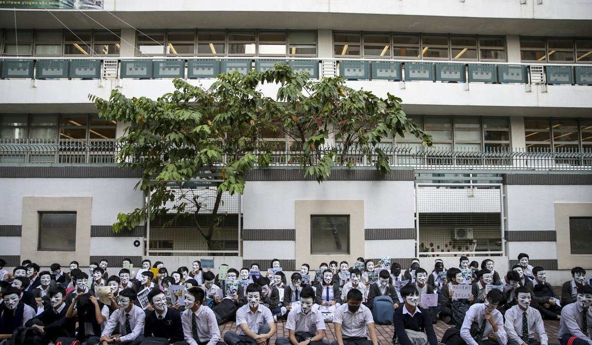

[11月06日 20:30]    纽约时报中文网   @nytchinese    公主被取消竞选总理资格、贵妃被册封后不足三月就被褫夺王室头衔、“卧室男仆“因”极其邪恶“的行为被解职……泰国新王登基后，王室常常传出情节劲爆、宛若小报头条的奇闻。 http://nyti.ms/2PYfjLr   :speech_balloon:评:4 :+1:赞:25 :globe_with_meridians:转:10  

[11月06日 20:00]    BBC News 中文   @bbcchinese    【与母亲吵架后，15岁男孩作出令他后悔不已的举动】他利用随处可买的农药，做了一个影响他一生的决定。 https://bbc.in/32l2jSn   :speech_balloon:评:4 :+1:赞:5 :globe_with_meridians:转:1  

[11月06日 20:00]    纽约时报中文网   @nytchinese    #观点 我所知道的定义电影的许多元素漫威系列里都有，但它缺少了艺术上的冒险。
它们在精神上是重复的：市场调查、观众测试、审查、修改、翻新和再加工，直至可供消费。 http://nyti.ms/33lJAYp   :speech_balloon:评:2 :+1:赞:17 :globe_with_meridians:转:5  

[11月06日 19:46]    BBC News 中文   @bbcchinese    何君尧被刺伤，政府和建制派强烈谴责事件，香港网民议论纷纷。  :speech_balloon:评:24 :+1:赞:28 :globe_with_meridians:转:4  

[11月06日 19:30]    纽约时报中文网   @nytchinese    #图集【“我忘了我在变老”：走进韩国社区老年舞蹈队】在纽约皇后区的韩国社区服务中心，一群60、70、80多岁的老年人正用舞蹈装点自己的生命。时报摄影师走进这支社区舞蹈队，拍下了她们日常排练、休息的时光。
点击查看图集： http://nyti.ms/32mPp6z   :speech_balloon:评:1 :+1:赞:9 :globe_with_meridians:转:1  

[11月06日 19:01]    BBC News 中文   @bbcchinese    这张在中国祁连山上拍到的照片看起来可能类似“搞笑对白”，但实际是一只狐狸向土拨鼠发动攻击的生死瞬间。中国摄影师鲍永清为了拍摄这张照片，在青藏高原上躲藏盯梢好几个小时，凭此在2019年度野生动物摄影师大赛获胜。 https://bbc.in/2PZc4U3   :speech_balloon:评:3 :+1:赞:84 :globe_with_meridians:转:26  

[11月06日 19:00]    纽约时报中文网   @nytchinese    周二，巴黎蓬皮杜中心在中国设立分馆。蓬皮杜将为上海分馆策划展览、提供馆藏、提供培训等。
法国希望通过博物馆项目提升海外形象，但上海分馆的开幕恰逢西方与中国关系的不确定时期，而且艺术界也不会免受政治的影响。 http://nyti.ms/2NkK6jv   :speech_balloon:评:3 :+1:赞:15 :globe_with_meridians:转:3  

[11月06日 18:48]    墙国铁拳现世报😷   @Socialistfist    经热心推友补充，男主角是当地国保
坐实铁拳了  :speech_balloon:评:18 :+1:赞:89 :globe_with_meridians:转:26  

[11月06日 18:30]    纽约时报中文网   @nytchinese    摄影师 @LamYikFei 用镜头记录香港的城市战场
 http://nyti.ms/36DKyRK   :speech_balloon:评:3 :+1:赞:3 :globe_with_meridians:转:1  

[11月06日 18:13]    新闻大吐槽   @TuCaoFakeNews    正常人在突发的时候不会眼睛通过屏幕看到底发生了什么，而是会下意识的把手机拿下，或者拍摄点自然偏移，然后用肉眼看。白天，最大的问题还是白天。  :speech_balloon:评:0 :+1:赞:6 :globe_with_meridians:转:3  

[11月06日 18:10]    BBC News 中文   @bbcchinese    “男孩子跟我在一起也只是想玩一玩……我不配活在这个世界上”。救援队迅速判断女生可能遇到了情感问题，从而阻止一场自杀发生。 https://www.bbc.com/zhongwen/simp/science-50313320 …  :speech_balloon:评:11 :+1:赞:37 :globe_with_meridians:转:6  

[11月06日 18:06]    新闻大吐槽   @TuCaoFakeNews    原来是自编自导自演的苦情戏，编、导、演可推荐金扫帚奖。  :speech_balloon:评:0 :+1:赞:9 :globe_with_meridians:转:1  

[11月06日 18:01]    新闻大吐槽   @TuCaoFakeNews     https://twitter.com/TuCaoFakeNews/status/1191930848515436544?s=09 …

I am sure they will hot soon!
#chinazi
#Huawei
#StandWithHongKong
#HongKongHumanRightsAndDemocracyAct  :speech_balloon:评:0 :+1:赞:5 :globe_with_meridians:转:2  

[11月06日 18:00]    纽约时报中文网   @nytchinese    最近几周，香港有数位政治人物遭到袭击，包括三名即将举行的区议会选举中的亲民主候选人。
周日，民主派区议会议员赵家贤在试图制服一名显然是抗议反对者的男子时，被咬掉部分左耳，该男子还在购物中心外刺伤了两个人。 http://nyti.ms/2NIeYtm   :speech_balloon:评:7 :+1:赞:10 :globe_with_meridians:转:2  

[11月06日 17:50]    新闻大吐槽   @TuCaoFakeNews     大家慢动作看，这个剧本的内容一目了然。群众演员的动作提前剧透了。  :speech_balloon:评:0 :+1:赞:6 :globe_with_meridians:转:2  

[11月06日 17:50]    新闻大吐槽   @TuCaoFakeNews    我更感兴趣拍摄者是谁？他想拍谁，为何选这个机位？事情突发时他为何如此淡定？一切都像安排好的一样 https://twitter.com/TuCaoFakeNews/status/1191901047955963905 …  :speech_balloon:评:1 :+1:赞:21 :globe_with_meridians:转:4  

[11月06日 17:34]    新闻大吐槽   @TuCaoFakeNews    我用过中兴（移动送的）我妈用过华为（电信送的），就我们2个的使用体验来说，手机经常会莫名其妙地自己下载应用，比如浏览器什么的。删除也没用，过阵子又会自动下载了。其它国产手机，比如OPPO、VIVO就没这个问题。所以我们家不排斥国货品牌但是抵制一切华为、中兴的产品  :speech_balloon:评:0 :+1:赞:9 :globe_with_meridians:转:1  

[11月06日 17:30]    新闻大吐槽   @TuCaoFakeNews    摄像角度不能再好了 四下人的反应不能再快了！最重要的摄影师在身旁突发事件面前没有一丝慌张手抖！像是导演一样镇定自若！  :speech_balloon:评:2 :+1:赞:16 :globe_with_meridians:转:5  

[11月06日 17:30]    纽约时报中文网   @nytchinese    #观点 随着监控技术发展到反乌托邦的规模，使用恰当、具体的语言，以及更贴切的隐喻，能让生活在监控之下的人对它有更好的了解。甚至可能会激发人们对其加强管理。 http://nyti.ms/2NjJw5Q   :speech_balloon:评:2 :+1:赞:8 :globe_with_meridians:转:4  

[11月06日 17:26]    新闻大吐槽   @TuCaoFakeNews    太假了，你看边上人反应那个快。都是神级保镖嚒？  :speech_balloon:评:0 :+1:赞:10 :globe_with_meridians:转:4  

[11月06日 17:24]    新闻大吐槽   @TuCaoFakeNews    还没出刀呢 擦血纸巾都尼玛翻出来准备好了？！ 这他吗什么剧务啊  :speech_balloon:评:0 :+1:赞:4 :globe_with_meridians:转:2  

[11月06日 17:11]    新闻大吐槽   @TuCaoFakeNews    1.視頻拍得太清楚,角度太好完全沒被人阻擋,鏡頭完全不晃
2.河的反應很奇怪, 遇襲後不但不後退反而協助制服刀手
3.施襲者只輕輕捅了一刀就放棄後退
4.旁邊的人像不怕死一樣立即制服他

拿上次任達華的真實遇襲作對比, 任達華被插傷後不斷後退,施襲者不斷前進揮刀, 旁邊的人看清楚情況才敢靠近幫忙  :speech_balloon:评:2 :+1:赞:35 :globe_with_meridians:转:17  

[11月06日 17:08]    新闻大吐槽   @TuCaoFakeNews    ！！ https://twitter.com/tucaofakenews/status/1191951797939769345 …  :speech_balloon:评:1 :+1:赞:8 :globe_with_meridians:转:3  

[11月06日 17:05]    新闻大吐槽   @TuCaoFakeNews    能在这个时间点出演，那肯定是有安排的了，四中全会刚结束，妖蛾与习刚见面结束，陈百祥都那么卖命，他是要更上一层楼的  :speech_balloon:评:0 :+1:赞:7 :globe_with_meridians:转:1  

[11月06日 17:01]    BBC News 中文   @bbcchinese    心理学上的“结果认知偏差”，有可能影响你的每一个决定。你有犯上这种毛病吗？ https://bbc.in/33k7SSu   :speech_balloon:评:5 :+1:赞:43 :globe_with_meridians:转:30  

[11月06日 16:30]    纽约时报中文网   @nytchinese    #观点 一些服装公司已经意识到气候危机。越来越多的品牌正在向普通民众的压力低头，消费者调查也显示，可持续性和道德是年轻购物者最关心的问题。
但时尚业无法凭自身的力量走向环保。没有国际合作和主流的关注，它甚至不会给这个问题带来轻微的改变。 http://nyti.ms/2CdlbIt   :speech_balloon:评:0 :+1:赞:8 :globe_with_meridians:转:5  

[11月06日 16:03]    新闻大吐槽   @TuCaoFakeNews    视频显示被捅后仍参与抓捕，看不到受伤的迹象。  :speech_balloon:评:0 :+1:赞:3 :globe_with_meridians:转:2  

[11月06日 16:01]    BBC News 中文   @bbcchinese    何君尧的声明称：“今早是香港区议会选举上黑色的一天”。 https://bbc.in/34s4nto   :speech_balloon:评:118 :+1:赞:64 :globe_with_meridians:转:19  

[11月06日 15:38]    新闻大吐槽   @TuCaoFakeNews    太假了太假了，最好旁邊兩人反應這麼迅速。。。這個演戲成分太重了。。。任達華被捅也是被追了一些時間，其他人才反應過來。。。還有什麼招？刷存在感？？  :speech_balloon:评:0 :+1:赞:13 :globe_with_meridians:转:3  

[11月06日 15:30]    纽约时报中文网   @nytchinese    桑德兰更完整的新证词可能会使共和党捍卫特朗普免遭弹劾的任务变得更加复杂，除非他们支持特朗普的辩述，即要求外国领导人进行政治交换并不是“可弹劾的事件”。
周五，众议院委员会还计划安排代理白宫幕僚长麦克·马尔瓦尼作证。 http://nyti.ms/2WQTCyi   :speech_balloon:评:1 :+1:赞:8 :globe_with_meridians:转:3  

[11月06日 15:00]    纽约时报中文网   @nytchinese    香港亲北京议员何君尧周三在进行拉票活动时被刺伤，这是香港近几个月来反政府抗议活动造成的最新政治暴力事件。
何君尧曾被许多抗议者指控支持暴徒袭击示威者的行为，他在刺伤事件中似乎并未严重受伤。袭击也引发了一些猜测，有人认为事件是被策划的。 http://nyti.ms/2NIeYtm   :speech_balloon:评:187 :+1:赞:159 :globe_with_meridians:转:47  

[11月06日 14:30]    纽约时报中文网   @nytchinese    美国官员称，他们不是因华裔研究人员的族裔而把他们作为调查对象的。但FBI对如此多的调查是怎么开始的保持沉默，加剧了人们的担忧。
“我们不能判断谁有罪、谁无罪，但我们能看到对华裔的实际影响，”一名学者说。“人们生活在恐惧之中。这是一个影响的问题，而不是意向的问题。” http://nyti.ms/2pFUQA0   :speech_balloon:评:6 :+1:赞:5 :globe_with_meridians:转:3  

[11月06日 14:03]    BBC News 中文   @bbcchinese    【印度德里雾霾指数冲破900极大值 安全指数为40】印度的雾霾指数超标22倍！ https://bbc.in/33lP59r   :speech_balloon:评:10 :+1:赞:18 :globe_with_meridians:转:10  

[11月06日 14:00]    纽约时报中文网   @nytchinese    #观点《1984》出版70年后，“老大哥”仍是大大小小监控的代名词。随着监控技术变得越来越复杂，这个隐喻已不能准确表述我们今天面临的监控威胁。
监控的未来看起来要比“老大哥”能够表达的范围更广、更具侵入性。是时候了解一下比“老大哥”更惊悚的词了。 http://nyti.ms/2NjJw5Q   :speech_balloon:评:30 :+1:赞:136 :globe_with_meridians:转:51  

[11月06日 13:47]    纽约时报中文网   @nytchinese    美国调查生物医学知识产权盗窃，涉多名华裔科学家  http://nyti.ms/2pFUQA0 https://twitter.com/ccni/status/1191907927659044866 …  :speech_balloon:评:2 :+1:赞:7 :globe_with_meridians:转:2  

[11月06日 13:30]    纽约时报中文网   @nytchinese    【用镜头记录香港的城市战场】摄影师林亦非在香港长大，他记录了过去五个月香港几乎每一场抗议活动。
让我们跟随林亦非的镜头，深入一场弥漫着催泪瓦斯、不断有示威者被逮捕的抗议活动。点击查看交互式报道： http://nyti.ms/36DKyRK   :speech_balloon:评:8 :+1:赞:24 :globe_with_meridians:转:13  

[11月06日 13:00]    纽约时报中文网   @nytchinese    今日图片：日本艺术家草间弥生设计的气球“爱意升空“(Love Flies Up to the Sky)。它将在梅西百货于纽约举办的年度感恩节游行中首次亮相，图为试飞场景。
更多简报内容： http://nyti.ms/34D2pGL   :speech_balloon:评:3 :+1:赞:1 :globe_with_meridians:转:0  

[11月06日 12:39]    新闻大吐槽   @TuCaoFakeNews    演戏的概率灰常高。  :speech_balloon:评:0 :+1:赞:6 :globe_with_meridians:转:1  

[11月06日 12:30]    纽约时报中文网   @nytchinese    特朗普弹劾调查的一位关键证人本周提供了重要的新证据。在新证词中，美国驻欧盟大使桑德兰证实，他曾告诉一名乌克兰高级官员，除非该国公开承诺进行特朗普想要的调查，否则可能不会获得美国的军事援助。
新证词证实了他曾参与向乌克兰提出交换条件一事，他此前没有承认这一点。 http://nyti.ms/2WQTCyi   :speech_balloon:评:10 :+1:赞:42 :globe_with_meridians:转:19  

[11月06日 12:18]    新闻大吐槽   @TuCaoFakeNews    【美國思想領袖】活摘器官的確存在

美國人口研究機構的主席毛思迪（Steven Mosher）日前做客大紀元資深記者揚‧耶凱利克（Jan Jekielek）的节目。

Steven Mosher曾著書《亞洲霸權:中國夢爲何是世界秩序的新威脅》,並同時是應對中國當前危機委員會的創始成員之一  :speech_balloon:评:2 :+1:赞:60 :globe_with_meridians:转:25  

[11月06日 12:02]    BBC News 中文   @bbcchinese    癌症最初什么模样，要是知道，就有可能将它消灭在初始阶段。但有谁见过刚露头的癌？ https://bbc.in/2NLuDIB   :speech_balloon:评:6 :+1:赞:66 :globe_with_meridians:转:33  

[11月06日 12:00]    纽约时报中文网   @nytchinese    #每日一词 美国经济正呈现出失衡的图景：消费者以“YOLO”为信条，为该国贡献了70%的经济活动；与此同时，美国企业却在缩减开支。YOLO是“You Only Live Once”的缩写，意思是“你只活一次”，这句俗语被饶舌歌手发扬光大，成为了大众口语、尤其是青少年文化的一部分。更多简报内容： http://nyti.ms/34D2pGL   :speech_balloon:评:1 :+1:赞:9 :globe_with_meridians:转:6  

[11月06日 11:58]    GFHG SDKM   @zyx_yny    We've got a Telegram group collecting and analyzing OSINT material. We've got a decent timeline now. DM for invite. https://twitter.com/zyx_yny/status/1191923574912831489 …  :speech_balloon:评:0 :+1:赞:4 :globe_with_meridians:转:4  

[11月06日 11:47]    GFHG SDKM   @zyx_yny    Calling for more video footage or images of police vehicles impeding ambulance trying to save student Chow. Please clearly state the time the photo/video was taken. Tg admin wants more evidence.

#HKprotests https://twitter.com/zyx_yny/status/1191923574912831489 …  :speech_balloon:评:0 :+1:赞:5 :globe_with_meridians:转:9  

[11月06日 11:41]    GFHG SDKM   @zyx_yny    有冇手足有警蛆車阻救護車救周同學嘅片or相。請註明時間。tg谷admin收集緊證據
#HKprotests  :speech_balloon:评:1 :+1:赞:2 :globe_with_meridians:转:4  

[11月06日 11:38]    新闻大吐槽   @TuCaoFakeNews    霍利:一个被中国共产党渗透的公司知道你的孩子在哪里

11月5日星期二， 美国国会参议院犯罪和恐怖主义小组委员会举行听证会。
该委员会主席、共和党籍联邦参议员乔什·霍利说，一个被中国共产党渗透的公司知道你的孩子在哪里，知道他们的长相和声音，知道他们在看什么，知道他们互相分享什么  :speech_balloon:评:3 :+1:赞:56 :globe_with_meridians:转:30  

[11月06日 11:30]    老司机   @h5lpykl7tp6jjop    就是你在银行存了很多钱，现在想一次取10万，或者你的企业一次想取50万，对不起，他们要背着你商量一下，取不取给你，要看你怎么证明你必需要取这笔钱急用 ! 哪怕是取来救命，那也得要医院给你出证明 ! 这跟取大额现金提前申报是两码事 ! 为啥要这样做 ? 他们说预防犯罪 ! 其实就是缸里没米了......  :speech_balloon:评:17 :+1:赞:137 :globe_with_meridians:转:63  

[11月06日 11:23]    老司机   @h5lpykl7tp6jjop    曾经中国人也是这个样子，说世界人民都生活在水深火热之中，说要解放全世界！
后来才知道，在那个斗志昂扬的年代，饿死了几千万中国人。  :speech_balloon:评:16 :+1:赞:205 :globe_with_meridians:转:76  

[11月06日 11:15]    老司机   @h5lpykl7tp6jjop    中共的一带一路没有走出去，黑哥的一带一路一串串的冲进来了！现在是烫手山芋，无法解决，后患无穷！  :speech_balloon:评:4 :+1:赞:17 :globe_with_meridians:转:12  

[11月06日 11:06]    老司机   @h5lpykl7tp6jjop    现在老子又出来缴械投降了！  :speech_balloon:评:2 :+1:赞:5 :globe_with_meridians:转:2  

[11月06日 11:00]    BBC News 中文   @bbcchinese    澳大利亚一个屠宰场内的赛马遭虐杀的视频曝光，显示马匹遭猛踢头部，甚至被电击生殖器官，引起当地人强烈反感。 https://bbc.in/2ChgflL   :speech_balloon:评:14 :+1:赞:59 :globe_with_meridians:转:35  

[11月06日 11:00]    纽约时报中文网   @nytchinese    • 报道称一名香港大学生在周一警方发射催泪瓦斯时坠楼，目前情况危急；林郑表示对抗议活动中不断增加的伤害感到不安。数百名示威者周二再次上街。
 • 美国商务部数据显示，今年前三季度，美国商品和服务贸易逆差增至4813亿美元，较去年同期增长5.4%。更多简报内容： http://nyti.ms/34D2pGL   :speech_balloon:评:4 :+1:赞:2 :globe_with_meridians:转:1  

[11月06日 10:47]    纽约时报中文网   @nytchinese    #新新世界 TikTok在全球舞台强势崛起，但这也可能毁了它 http://nyti.ms/36ByQXG https://twitter.com/ccni/status/1191908693123780608 …  :speech_balloon:评:4 :+1:赞:6 :globe_with_meridians:转:3  

[11月06日 10:30]    纽约时报中文网   @nytchinese    到目前为止，已有十几名科学家从美国各地的大学和研究中心辞职或被单位解雇。这些人中有的拒绝讨论针对他们的指控，有的则否认有任何不当行为。
在有些案子中，获得了美国国家卫生研究院(NIH)或其他联邦机构经费支持的科学家被指控同时接受了中国政府的资助，违反了NIH的规定。 http://nyti.ms/2pFUQA0   :speech_balloon:评:6 :+1:赞:7 :globe_with_meridians:转:3  

[11月06日 10:01]    老司机   @h5lpykl7tp6jjop    今日网评：什么是正确的价值观？  :speech_balloon:评:1 :+1:赞:7 :globe_with_meridians:转:11  

[11月06日 09:41]    新闻大吐槽   @TuCaoFakeNews    【11.5V煞面具聚會】11.5的晚上在尖沙咀有一場Ｖ煞面的面具聚會，民眾共唱「願榮光歸香港』及高呼口號，末尾聽說有警察要來，民眾很快散去  .  :speech_balloon:评:2 :+1:赞:20 :globe_with_meridians:转:12  

[11月06日 09:37]    财经真相   @caijingxiang    截止到今天各省市财政一般收入媒体已经报道过了，但是支出各省数据还未全部公布出来，我过几天整理出来，相信很有冲击力！  :speech_balloon:评:6 :+1:赞:102 :globe_with_meridians:转:19  

[11月06日 09:34]    GFHG SDKM   @zyx_yny    何妖被斬，請冷處理。 否則變民鬥民，雙方武力升級，香港人冇著數(普通人帶𠝹刀都拉，藍絲出菜刀都冇事) 
 
佢亦暫時仲係立法會議員，高調慶祝等如認可對政客暴力。
 
開香檳，私下開算喇。  :speech_balloon:评:27 :+1:赞:202 :globe_with_meridians:转:75  

[11月06日 09:00]    新闻大吐槽   @TuCaoFakeNews    香港民运漫画展北美开展 尊子谈时政

著名香港政治漫画家尊子，近日在加拿大多伦多举办“#香港民主运动漫画展”，希望海外民众能更深入了解中港时政，及反送中运动的由来和发展。  :speech_balloon:评:0 :+1:赞:22 :globe_with_meridians:转:13  

[11月06日 08:58]    BBC News 中文   @bbcchinese    英国专业健康人士最近发出警告称，越来越多的瑜伽教练出现严重的髋关节问题。 https://bbc.in/32qfiCA   :speech_balloon:评:6 :+1:赞:66 :globe_with_meridians:转:54  

[11月06日 08:30]    GFHG SDKM   @zyx_yny    The people of Hong Kong are under assault by Communist China. They deserve our full support in their pursuit of freedom.

#HongKongHumanRightsAndDemocracyAct  :speech_balloon:评:1323 :+1:赞:7065 :globe_with_meridians:转:4779  

[11月06日 08:23]    BBC News 中文   @bbcchinese    新德里有能力像北京一样治理雾霾吗？特朗普退群又给其它国家什么示范？ https://bbc.in/2NIgyeJ   :speech_balloon:评:15 :+1:赞:18 :globe_with_meridians:转:13  

[11月06日 07:34]    BBC News 中文   @bbcchinese    美国商务部长罗斯之前对《金融时报》记者说，“暗淡蓝点”的含义是地图上的一个小点，如果商业公司有兴趣进行可持续的基建项目，那里就是他们能够安全经营运行的地方，“其意义在于显示可持续项目的重要性”。 https://bbc.in/33mEydY   :speech_balloon:评:2 :+1:赞:17 :globe_with_meridians:转:15  

[11月06日 06:54]    BBC News 中文   @bbcchinese    报道说，印度作为大国加入中国推动的区域全面经济伙伴关系协定有利于平衡中国的影响力。 https://bbc.in/2rfWKYJ   :speech_balloon:评:17 :+1:赞:21 :globe_with_meridians:转:5  

[11月06日 06:48]    老司机   @h5lpykl7tp6jjop    近几日，一则“走私僵尸肉上餐桌，最高肉龄超40年”的帖子上了热搜，一时间关于“僵尸肉”、“冷冻肉”的议论铺天盖地；什么是僵尸肉？肉龄超过40年还能吃吗？
改革开放当年走私手表，收录机，电视机，出口猪肉粮食蔬菜水果，几十年以后反过来，走私的改成出口的，出口的改成走私的，这是发展了还是倒退了？  :speech_balloon:评:3 :+1:赞:8 :globe_with_meridians:转:3  

[11月06日 06:35]    老司机   @h5lpykl7tp6jjop    北京马拉松女跑者偷能量胶发图炫耀
偷拿东西不以为耻反以为荣，中国人道德没底线到了没有最低只有更低的地步！  :speech_balloon:评:4 :+1:赞:22 :globe_with_meridians:转:12  

[11月06日 00:14]    GFHG SDKM   @zyx_yny    有冇英文文宣手足 https://twitter.com/jim97147570/status/1191499676475785216 …  :speech_balloon:评:0 :+1:赞:2 :globe_with_meridians:转:2  

[11月05日 23:40]    GFHG SDKM   @zyx_yny    We are all V  :speech_balloon:评:0 :+1:赞:1 :globe_with_meridians:转:0  

[11月05日 23:37]    GFHG SDKM   @zyx_yny    Today 5/11 is the day that #AntiMaskLaw has been introduced for one month.
But it can’t stop us. #HKprotesters will not surrender.
#VforVendetta  :speech_balloon:评:1 :+1:赞:6 :globe_with_meridians:转:4  

[11月05日 23:25]    BBC News 中文   @bbcchinese    所有尸体的腹部都有一道细小的剖口，像手术刀切口一样利落精准。心和肝都不见了。这是谁干的？怎么干的？ https://bbc.in/2NGrKsw   :speech_balloon:评:26 :+1:赞:77 :globe_with_meridians:转:24  

[11月05日 22:52]    GFHG SDKM   @zyx_yny    Here is the video  :speech_balloon:评:5 :+1:赞:121 :globe_with_meridians:转:122  

[11月05日 22:27]    财经真相   @caijingxiang    前一段时间纳瓦罗说12月的关税是为了第二阶段谈判准备的筹码，美国官方至今没有明确表示完全取消这笔关税，只是回应说双方谈的很好，很快签第一阶段的协议，但是市场吊诡的是不但计价了正式签协议，还把12月份取消关税纳入其中，乐观情绪甚至把中方单边提出的取消9月份关税也计价了！  :speech_balloon:评:7 :+1:赞:53 :globe_with_meridians:转:9  

[11月05日 22:14]    财经真相   @caijingxiang    Politico和英国金融时报都报道称中国希望取消9月加征的关税，甚至争取取消所有关税，对此美国方面还未对此作出回应，但是市场竟然提前计价了，股市更是创下新高。现在特朗普的麻烦是，如果否认那么股市就会大跌，如果公开证实传言，则会对引发特朗普退让的指责，股市绑架下，干脆只能装聋作哑！ https://twitter.com/reuterscn/status/1191567937011961859 …  :speech_balloon:评:24 :+1:赞:126 :globe_with_meridians:转:33  

[11月05日 22:02]    财经真相   @caijingxiang    随着贸易战深入，美国贸易逆差缩小值创下三年最高，特朗普真的成功了吗？ https://twitter.com/zerohedge/status/1191712574989066240 …  :speech_balloon:评:9 :+1:赞:44 :globe_with_meridians:转:7  

[11月05日 22:01]    新闻大吐槽   @TuCaoFakeNews    11月3日，太古城又一驚險事件，為避免衝突，女孩隻身擋扮「發癲」男子挑釁，並質疑男子收錢，男子突然「變正常」解釋無收錢。  :speech_balloon:评:2 :+1:赞:89 :globe_with_meridians:转:50  

[11月05日 21:07]    BBC News 中文   @bbcchinese    “刷脸”时代来临，你是否担心刷完之后可能面对的风险？ https://bbc.in/2NjKizN   :speech_balloon:评:38 :+1:赞:23 :globe_with_meridians:转:17  

[11月05日 20:17]    GFHG SDKM   @zyx_yny    #LIVE: It's been a month since HK leader, Carrie Lam, invoked the Emergency Regulations Ordinance and enacted the mask ban. Yet, people are not deterred. Hundreds gather in Tsim Sha Tsui. "We are not scared of dying; we use our deaths to threaten you," they chant. #antiELAB  :speech_balloon:评:14 :+1:赞:269 :globe_with_meridians:转:204  

[11月05日 20:01]    BBC News 中文   @bbcchinese    【前苏联领袖戈尔巴乔夫回望历史 告诫全球废除核武】在柏林围墙倒下，共产东德倒台30周年之际，苏联最后一任总统戈尔巴乔夫接受BBC驻莫斯科记者罗森伯格（Steve Rosenberg）专访。他回忆当年为何决定不介入东德局势之余，促请世界各国齐心裁撤核武器。 https://bbc.in/2NfrYrn   :speech_balloon:评:14 :+1:赞:26 :globe_with_meridians:转:13  

[11月05日 19:54]    老司机   @h5lpykl7tp6jjop    中共患有强迫性精神病！它什么都想控制，上管天下管地，中间管空气，管思想管情绪还管生殖器！大街小巷楼房商场任何角落都有无数监视器，买菜刀剪刀实名制登记，上网登记，乘车乘船乘机登记，什么人脸视别，动态识别，挖空心思来监控人民，可它仍然不放心！莎翁说过：无限的权力只会毁掉它的占有者！  :speech_balloon:评:2 :+1:赞:67 :globe_with_meridians:转:13  

[11月05日 19:25]    墙国铁拳现世报😷   @Socialistfist    丈夫民警妻子教师，生第三胎被单位双双开除。

#社会主义铁拳  :speech_balloon:评:41 :+1:赞:357 :globe_with_meridians:转:120  

[11月05日 19:01]    BBC News 中文   @bbcchinese    台湾总统蔡英文上任后，已有7个邦交国与台湾断交。而洪都拉斯财政部长表示，台湾将提供3亿美元贷款，学者认为这笔贷款目的是巩固邦交。 https://bbc.in/2py5Dwn   :speech_balloon:评:82 :+1:赞:60 :globe_with_meridians:转:17  

[11月05日 18:43]    GFHG SDKM   @zyx_yny    We put the student in our prayers. https://twitter.com/li8jim/status/1191621688909123584 …  :speech_balloon:评:339 :+1:赞:4069 :globe_with_meridians:转:2563  

[11月05日 18:35]    新闻大吐槽   @TuCaoFakeNews    香港年轻人在伦敦圣潘克拉斯国际车站演奏钢琴版「荣光归于香港」！
远在异国的他，悲愤随着他有力的指尖撞击在琴键上，散播在空气中！他在为脑干死亡的手足痛心吗？

匆匆行人啊，能否停下脚步，聆听些许他对自由的向往？他们可是在用血和恶魔搏斗！
国际社会，请救救香港人！  :speech_balloon:评:121 :+1:赞:2630 :globe_with_meridians:转:964  

[11月05日 18:31]    BBC News 中文   @bbcchinese    美国已通知联合国，正式开启退出《巴黎协议》的程序，为期一年。
这将对全球气候产生怎样影响？ https://bbc.in/2JSwEBp   :speech_balloon:评:37 :+1:赞:54 :globe_with_meridians:转:9  

[11月05日 18:23]    财经真相   @caijingxiang    提前计价取消9月份的关税，这个明显是忽悠！  :speech_balloon:评:8 :+1:赞:28 :globe_with_meridians:转:4  

[11月05日 18:22]    财经真相   @caijingxiang    一外资行交易员表示，近日中美谈判利好不断，市场普遍处于乐观氛围中，加上此前并未过多期望已加征的关税能够取消，今天媒体相关报导远超预期，推动人民币强势走升。
“市场现在很敏感，今天这波走升比前两天要坚决一些，“不过对自营盘而言现在去追并不是好的策略，更多是在区间的边界上进行操作。 https://twitter.com/ReutersCN/status/1191654970690588672 …  :speech_balloon:评:6 :+1:赞:48 :globe_with_meridians:转:13  

[11月05日 18:12]    GFHG SDKM   @zyx_yny    When this student dies over #extraditionlaw, his blood is on Commiessar Lam's hands!  :speech_balloon:评:397 :+1:赞:2492 :globe_with_meridians:转:1861  

[11月05日 17:51]    BBC News 中文   @bbcchinese    该名科大学生接受多次手术。综合香港传媒报道，他的情况并不乐观。  :speech_balloon:评:127 :+1:赞:254 :globe_with_meridians:转:138  

[11月05日 17:50]    GFHG SDKM   @zyx_yny    Hundreds of #HK secondary students hold masked protests on 1mo anniversary of executive edict banning masks & also object to recent arrests of fellow students. #香港人反抗  https://www.scmp.com/news/hong-kong/politics/article/3036355/hong-kong-pupils-cover-faces-citywide-protests-marking-one …  :speech_balloon:评:5 :+1:赞:272 :globe_with_meridians:转:195  

[11月05日 16:32]    财经真相   @caijingxiang    破7前是顶，破7后是底！这个基本面还未改变，接下来要看央行中间价会不会大举破7！  :speech_balloon:评:7 :+1:赞:79 :globe_with_meridians:转:6  

[11月05日 16:21]    财经真相   @caijingxiang    人民币涨破7了，而且是在央行MLF降息的情况下进行的，宽松货币汇率升值，这操作就问你服不服！第一阶段协议的利好消化的差不多了，情绪乐观有点过度了，甚至开始计价减掉部分产品的关税，我的策略是继续做空，随便拉！  :speech_balloon:评:41 :+1:赞:296 :globe_with_meridians:转:53  

[11月05日 15:01]    BBC News 中文   @bbcchinese    香港《逃犯条例》修订引发的抗议活动持续5个月后，中国国家主席习近平会见香港特首林郑月娥，肯定她的工作。大家对林郑月娥的工作表现有什么看法？ https://bbc.in/2NGSUiL   :speech_balloon:评:130 :+1:赞:114 :globe_with_meridians:转:27  

[11月05日 11:29]    财经真相   @caijingxiang    MLF降息5基点，股市涨疯了！  :speech_balloon:评:23 :+1:赞:148 :globe_with_meridians:转:21  

[11月05日 11:26]    GFHG SDKM   @zyx_yny    Did any reporter capture this "FAKE" @hkpoliceforce cop assigned code? Reporters need to ask if there arePeople's Armed Police cops in Hong Kong in #HKPF uniform as riot cops. https://twitter.com/themonma/status/1191509700153495554 …  :speech_balloon:评:318 :+1:赞:4563 :globe_with_meridians:转:3984  

[11月05日 11:11]    老司机   @h5lpykl7tp6jjop    好文转发：我是怎样变成一个孤家寡人的
文/豆腐
2019/11/03  :speech_balloon:评:0 :+1:赞:24 :globe_with_meridians:转:9  

[11月05日 10:43]    老司机   @h5lpykl7tp6jjop    无法统计有多少人在问候这位专家全家！  :speech_balloon:评:9 :+1:赞:60 :globe_with_meridians:转:27  

[11月05日 09:51]    老司机   @h5lpykl7tp6jjop    香港街頭，共軍指揮官普通話訓斥下屬軍人：

這是大陸軍人參與鎮壓香港市民的鐵證！

保存好，看西方國家裝聾作啞到幾時？！  :speech_balloon:评:45 :+1:赞:347 :globe_with_meridians:转:254  

[11月05日 09:47]    墙国铁拳现世报😷   @Socialistfist    发推后，该用户微博改名，头像更换，微博删除至2016年内容  :speech_balloon:评:2 :+1:赞:92 :globe_with_meridians:转:10  

[11月05日 09:26]    老司机   @h5lpykl7tp6jjop    中共引进马列的邪恶理论制造了共产主义神话，它们砸烂了中国几千年沉重的传统，得到了政权，可是这个叫共产主义的神话在饿死了几千万人之后在人们心中轰然崩塌，但政权却在它们黑暗的组织系统掌控下牢牢掌握，它们不停的编造各种理论，但始终不能涉及文明进步，因为阴暗邪恶的魔鬼要吸干人血进入地狱！  :speech_balloon:评:2 :+1:赞:12 :globe_with_meridians:转:4  

[11月05日 09:18]    财经真相   @caijingxiang    中国央行：为推动大额现金管理工作，探索大额现金管理实现路径，中国人民银行起草了《中国人民银行关于在河北省、浙江省、深圳市试点开展大额现金管理的通知（公开征求意见稿）》。  :speech_balloon:评:27 :+1:赞:176 :globe_with_meridians:转:67  

[11月05日 08:53]    老司机   @h5lpykl7tp6jjop    突发！王思聪宣布破产， 股份被冻结......
破巢之下，岂有完卵？2019是中共大崩溃总爆发的开始，各种消息不断出现，大家留心看，天天都有新鲜不断出现！

 https://mp.weixin.qq.com/s/TfGVob-BNFq2kk0WpovqDA …  :speech_balloon:评:34 :+1:赞:247 :globe_with_meridians:转:79  

[11月05日 04:45]    老司机   @h5lpykl7tp6jjop    猪肉上涨，粮食上涨，天然气上涨，全面上涨已经开始，群众情绪保持稳定！  :speech_balloon:评:31 :+1:赞:203 :globe_with_meridians:转:95  

[11月05日 04:28]    凡賽堤/FORSETI   @FecharCCP    急救香港  #HKSOS！！！

天滅流氓政權！！！極權殺人恐怖組織正在用各種兇殘手段殺害我們的同胞..................................................

流氓政權的極權殺人恐怖組織蓄意謀殺香港年輕人！（13）

被暴力制服的年輕人已經休克，還殘暴折斷手！

兇殘，殘暴手段令人髮指到已經超越納粹！  :speech_balloon:评:0 :+1:赞:3 :globe_with_meridians:转:10  

[11月05日 04:25]    凡賽堤/FORSETI   @FecharCCP    急救香港  #HKSOS！！！

天滅流氓政權！！！極權殺人恐怖組織正在用各種兇殘手段殺害我們的同胞..................................................

流氓政權的極權殺人恐怖組織蓄意謀殺香港年輕人！（12）
兇殘，殘暴手段令人髮指到已經超越納粹！
天滅流氓政權！！！  :speech_balloon:评:1 :+1:赞:8 :globe_with_meridians:转:9  

[11月05日 04:24]    凡賽堤/FORSETI   @FecharCCP    急救香港  #HKSOS！！！

天滅流氓政權！！！極權殺人恐怖組織正在用各種兇殘手段殺害我們的同胞..................................................

流氓政權的極權殺人恐怖組織蓄意謀殺香港年輕人！（11）
兇殘，殘暴手段令人髮指到已經超越納粹！
天滅流氓政權！！！  :speech_balloon:评:0 :+1:赞:50 :globe_with_meridians:转:47  

[11月05日 04:23]    凡賽堤/FORSETI   @FecharCCP    急救香港  #HKSOS！！！

天滅流氓政權！！！極權殺人恐怖組織正在用各種兇殘手段殺害我們的同胞..................................................

流氓政權的極權殺人恐怖組織蓄意謀殺香港年輕人！（10）
兇殘，殘暴手段令人髮指到已經超越納粹！
天滅流氓政權！！！  :speech_balloon:评:0 :+1:赞:4 :globe_with_meridians:转:5  

[11月05日 04:19]    凡賽堤/FORSETI   @FecharCCP    急救香港  #HKSOS！！！

天滅流氓政權！！！極權殺人恐怖組織正在用各種兇殘手段殺害我們的同胞..................................................

流氓政權的極權殺人恐怖組織蓄意謀殺香港年輕人！（9）
兇殘，殘暴手段令人髮指到已經超越納粹！
天滅流氓政權！！！  :speech_balloon:评:1 :+1:赞:6 :globe_with_meridians:转:7  

[11月05日 04:16]    凡賽堤/FORSETI   @FecharCCP    急救香港  #HKSOS！！！

天滅流氓政權！！！極權殺人恐怖組織正在用各種兇殘手段殺害我們的同胞..................................................

流氓政權的極權殺人恐怖組織蓄意謀殺香港年輕人！（8）
兇殘，殘暴手段令人髮指到已經超越納粹！
天滅流氓政權！！！  :speech_balloon:评:1 :+1:赞:44 :globe_with_meridians:转:59  

[11月05日 04:13]    凡賽堤/FORSETI   @FecharCCP    急救香港SOS！！！

天滅流氓政權！！！極權殺人恐怖組織正在用各種兇殘手段殺害我們的同胞..................................................

流氓政權的極權殺人恐怖組織蓄意謀殺香港年輕人！（7）
兇殘，殘暴手段令人髮指到已經超越納粹！
天滅流氓政權！！！  :speech_balloon:评:2 :+1:赞:14 :globe_with_meridians:转:20  

[11月05日 04:10]    凡賽堤/FORSETI   @FecharCCP    急救香港SOS！！！

天滅流氓政權！！！極權殺人恐怖組織正在用各種兇殘手段殺害我們的同胞..................................................

流氓政權的極權殺人恐怖組織蓄意謀殺香港年輕人！（6）
兇殘，殘暴手段令人髮指到已經超越納粹！
天滅流氓政權！！！  :speech_balloon:评:1 :+1:赞:40 :globe_with_meridians:转:40  

[11月05日 04:07]    凡賽堤/FORSETI   @FecharCCP    急救香港SOS！！！

天滅流氓政權！！！極權殺人恐怖組織正在用各種兇殘手段殺害我們的同胞..................................................

流氓政權的極權殺人恐怖組織蓄意謀殺香港年輕人！（5）
兇殘，殘暴手段令人髮指到已經超越納粹！
天滅流氓政權！！！  :speech_balloon:评:0 :+1:赞:2 :globe_with_meridians:转:0  

[11月05日 04:06]    凡賽堤/FORSETI   @FecharCCP    急救香港SOS！！！

天滅流氓政權！！！極權殺人恐怖組織正在用各種兇殘手段殺害我們的同胞..................................................

流氓政權的極權殺人恐怖組織蓄意謀殺香港年輕人！（3）
兇殘，殘暴手段令人髮指到已經超越納粹！
天滅流氓政權！！！  :speech_balloon:评:1 :+1:赞:10 :globe_with_meridians:转:15  

[11月05日 04:05]    凡賽堤/FORSETI   @FecharCCP    急救香港SOS！！！

天滅流氓政權！！！極權殺人恐怖組織正在用各種兇殘手段殺害我們的同胞..................................................

流氓政權的極權殺人恐怖組織蓄意謀殺香港不同意見的議員！（2）

兇殘，殘暴手段令人髮指到已經超越納粹！
天滅流氓政權！！！  :speech_balloon:评:0 :+1:赞:3 :globe_with_meridians:转:3  

[11月05日 04:04]    凡賽堤/FORSETI   @FecharCCP    急救香港SOS！！！

天滅流氓政權！！！極權殺人恐怖組織正在用各種兇殘手段殺害我們的同胞..................................................

流氓政權的極權殺人恐怖組織蓄意謀殺香港年輕人！（1）
兇殘，殘暴手段令人髮指到已經超越納粹！
天滅流氓政權！！！  :speech_balloon:评:1 :+1:赞:8 :globe_with_meridians:转:7  

[11月05日 03:49]    GFHG SDKM   @zyx_yny    Today's Daily at King Cross.
A Hong Kong youth was playing <Glory to Hong Kong> piano version in St. Pancras Int station.  :speech_balloon:评:120 :+1:赞:2412 :globe_with_meridians:转:1265  

[11月04日 22:43]    墙国铁拳现世报😷   @Socialistfist    #社会主义铁拳 https://twitter.com/Time_HorizonX/status/1191288775348908032 …  :speech_balloon:评:16 :+1:赞:317 :globe_with_meridians:转:86  

[11月04日 22:04]    老司机   @h5lpykl7tp6jjop    希望国内多出现这样的作品。  :speech_balloon:评:27 :+1:赞:488 :globe_with_meridians:转:267  

[11月04日 17:54]    老司机   @h5lpykl7tp6jjop    今年过年不吃肉啊，不吃肉啊不吃肉！吃肉滚到美国去啊，美国去啊美国去……
好文转发，有删减，文/豆府  :speech_balloon:评:2 :+1:赞:46 :globe_with_meridians:转:25  

[11月04日 13:33]    财经真相   @caijingxiang    猪肉涨了，鸡肉也要涨了！  :speech_balloon:评:51 :+1:赞:191 :globe_with_meridians:转:60  

[11月04日 11:34]    GFHG SDKM   @zyx_yny    Just in: Local paper @mingpaocom confirms that this first-aid volunteer is a freshman from Hong Kong Shue Yan University. Holding a certificate in first aid, he was amply performing his duties on Nov 2, says the student union. He is in stable condition. Photo from @cityusucbc  :speech_balloon:评:6 :+1:赞:190 :globe_with_meridians:转:140  

[11月04日 10:26]    GFHG SDKM   @zyx_yny    Facebook have blocked the share function of photos that reflects the fact of #HKPoliceTerrorists
#StandWithHongKong  :speech_balloon:评:2 :+1:赞:18 :globe_with_meridians:转:28  

[11月04日 09:40]    GFHG SDKM   @zyx_yny    Facebook is trying to delete the photo, cover the crime of Hk police!  
#HKPoliceTerrorists  :speech_balloon:评:0 :+1:赞:16 :globe_with_meridians:转:26  

[11月04日 06:57]    财经真相   @caijingxiang    据香港特区政府网站消息，11月5日，特首林郑月娥将出席第二届上海进博会，晚上则转往北京，次日上午将与国务院副总理韩正举行会见，下午出席粤港澳大湾区建设领导小组第三次全体会议。  :speech_balloon:评:7 :+1:赞:105 :globe_with_meridians:转:23  

[11月04日 06:39]    财经真相   @caijingxiang    陶然笔记：即使第一阶段协议也应该体现中国核心要求！  :speech_balloon:评:10 :+1:赞:26 :globe_with_meridians:转:0  

[11月04日 00:12]    老司机   @h5lpykl7tp6jjop    雖然畫面會令你不適，但我們要認清事件真相必須認清太古大陸口音兇徒短刀刺傷四人的殘忍事實，刀刀致命，該男子頸部被刺如刺中大動脈會失血致死，到發文前一小時，兩人危殆兩人嚴重。但是，無線新聞只字沒有報道兇徒斬人及咬斷趙家賢議員耳朵的事件，而斷章取義片面報道兇徒被群眾制服毆打的画面  :speech_balloon:评:16 :+1:赞:305 :globe_with_meridians:转:330  

[11月03日 23:31]    财经真相   @caijingxiang    根据最新美国气象预计，从10号开始，北美大陆将会迎来下半年来最强冷空，这股寒潮国境后，五大湖地区气温将会骤降，芝加哥地区在14号将会降至零下20度；目前美国天然气期货还未完全计价！  :speech_balloon:评:9 :+1:赞:92 :globe_with_meridians:转:32  

[11月03日 22:02]    财经真相   @caijingxiang    新华微评：我们走的是一条中国特色社会主义政治发展道路，人民民主是一种全过程的民主”。“全过程”民主的真谛就在于有事好商量，众人的事情由众人商量，通过充分商量找到全社会意愿和要求的最大公约数，从而有效解决问题，实现人民当家作主、管理国家社会各项事务的民主权利。  :speech_balloon:评:65 :+1:赞:96 :globe_with_meridians:转:34  

[11月03日 20:58]    GFHG SDKM   @zyx_yny     #BREAKING: Graphic Warning!

Dr Andrew Chiu, district councillor’s EAR was brutally BITTEN OFF — can you see the #smirking face of the Pro-#Beijing Attacker!!!?

#crazyHongKong #HongKongProtests #HongKong #antichinazi #chinazi  :speech_balloon:评:2 :+1:赞:53 :globe_with_meridians:转:53  

[11月03日 20:48]    GFHG SDKM   @zyx_yny    #HongKong - a knife-wielding Pro-#Beijing supporter brutally BITES OFF part of a district councillor's EAR after argument over politics.

Brave bystanders caught him before he tried to escape.

— “Is it just me, or is it getting #CRAZIER out there?”
#HongKongProtests #香港デモ  :speech_balloon:评:15 :+1:赞:292 :globe_with_meridians:转:310  

[11月03日 14:54]    老司机   @h5lpykl7tp6jjop    如果中共及其红后代在海外肆意猖狂下去，排华事件 未必不会再次发生！
发生在1965年的印尼排华事件，就是由中共输出革命失败所引起，造成印尼华人大量被杀，前后死亡300万，这个话题至今为止一直是印尼的禁忌话题，即使到今天仍然极度敏感。  :speech_balloon:评:5 :+1:赞:150 :globe_with_meridians:转:84  

[11月03日 10:45]    老司机   @h5lpykl7tp6jjop    它們指鹿為馬、它們顛倒黑白、它們混淆視聽、它們底線盡毀、它們厚顏無恥、它們愚人洗腦.......
美國物價低廉穩定利國利民，卻在它們的嘴裡說成「如坐針氈」的慘狀，難道象牆國家一斤豬肉賣幾十元才好？！  :speech_balloon:评:30 :+1:赞:184 :globe_with_meridians:转:82  

[11月03日 10:36]    老司机   @h5lpykl7tp6jjop    这孩子，怎么不能领会贸易战的重要意义呢？这家大人把视频发到网上要考虑影响呀，如果转发上了500，可以直接拘留的啊！要以国家大局为重，不要只考虑个人小家，再过几天就进入全面小康社会了！继续坚持！没有肉是暂时的，前途是光明的，共产主义就在明天！  :speech_balloon:评:6 :+1:赞:100 :globe_with_meridians:转:39  

[11月03日 08:23]    凡賽堤/FORSETI   @FecharCCP    他們不配稱警察，他們是納粹的狗！魔鬼般的瘋狗！

極權殺人恐怖組織正在用各種兇殘手段殺害我們的同胞..................................................

滅絕人性對待老人  :speech_balloon:评:4 :+1:赞:45 :globe_with_meridians:转:44  

[11月03日 08:16]    凡賽堤/FORSETI   @FecharCCP    他們不配稱警察，他們是納粹的狗！魔鬼般的瘋狗！

極權殺人恐怖組織正在用各種兇殘手段殺害我們的同胞..................................................

無辜港民被納粹的狗打破頭！  :speech_balloon:评:1 :+1:赞:4 :globe_with_meridians:转:3  

[11月03日 08:12]    凡賽堤/FORSETI   @FecharCCP    他們不配稱警察，他們是納粹的狗！魔鬼般的瘋狗！

極權殺人恐怖組織正在用各種兇殘手段殺害我們的同胞..................................................

我們唯一能救她們的就是瘋狂轉發，讓全世界都知道！才有可能不會極權殺人恐怖組織暗殺，被墜樓，被自殺，被棄屍！  :speech_balloon:评:0 :+1:赞:6 :globe_with_meridians:转:6  

[11月03日 08:05]    凡賽堤/FORSETI   @FecharCCP    他們不配稱警察，他們是納粹的狗！魔鬼般的瘋狗！

極權殺人恐怖組織正在用各種兇殘手段殺害我們的同胞..................................................

我們唯一能救她們的就是瘋狂轉發，讓全世界都知道！才有可能不會極權殺人恐怖組織暗殺，被墜樓，被自殺，被棄屍！  :speech_balloon:评:4 :+1:赞:29 :globe_with_meridians:转:29  

[11月03日 07:58]    凡賽堤/FORSETI   @FecharCCP    極權殺人恐怖組織正在用各種兇殘手段殺害我們的同胞..................................................

我們唯一能救她們的就是瘋狂轉發，讓全世界都知道！才有可能不會極權殺人恐怖組織暗殺，被墜樓，被自殺，被棄屍！  :speech_balloon:评:0 :+1:赞:2 :globe_with_meridians:转:5  

[11月03日 07:45]    凡賽堤/FORSETI   @FecharCCP    極權殺人恐怖組織正在用各種兇殘手段殺害我們的同胞..................................................

我們唯一能救她們的就是瘋狂轉發，讓全世界都知道！才有可能不會極權殺人恐怖組織暗殺，被墜樓，被自殺，被棄屍！  :speech_balloon:评:16 :+1:赞:577 :globe_with_meridians:转:627  

[11月03日 07:44]    凡賽堤/FORSETI   @FecharCCP    極權殺人恐怖組織正在用各種兇殘手段殺害我們的同胞..................................................

我們唯一能救她們的就是瘋狂轉發，讓全世界都知道！才有可能不會極權殺人恐怖組織暗殺，被墜樓，被自殺，被棄屍！  :speech_balloon:评:30 :+1:赞:637 :globe_with_meridians:转:775  

[11月03日 07:36]    凡賽堤/FORSETI   @FecharCCP    極權殺人恐怖組織正在用各種兇殘手段殺害我們的同胞..................................................

大陸軍警蒙面扮港民  :speech_balloon:评:2 :+1:赞:145 :globe_with_meridians:转:151  

[11月02日 22:35]    墙国铁拳现世报😷   @Socialistfist    小编谨代表墙国铁拳现世报读者欢迎您来推特。
看来上次强拆不但把你村邻居房子拆了，还把你的防火墙也给拆了嘛 https://twitter.com/Xiuxianlu/status/1190623728545062912 …  :speech_balloon:评:8 :+1:赞:159 :globe_with_meridians:转:18  

[11月02日 19:09]    财经真相   @caijingxiang    盛世明星赛富商，乱世戏子逃饥荒！一心只盼有戏拍，不闻香港成战场！  :speech_balloon:评:6 :+1:赞:293 :globe_with_meridians:转:29  

[11月02日 19:03]    财经真相   @caijingxiang    国内很多明星都在抱怨没戏拍可拍，这个其实也可以理解，很多演员都是吃青春饭的，天天在家闲着很容易“过气”，尤其那些还未捞够的新人最焦虑。以前很多烂戏卖出天价，其背后是资本有“洗钱”需求，现在政治从严，经济处于实质性衰退的背景下，地主家日子也不好过，自然也就没人在戏子身上再挥金如土了！  :speech_balloon:评:24 :+1:赞:458 :globe_with_meridians:转:91  

[11月02日 18:26]    墙国铁拳现世报😷   @Socialistfist    如此猖狂, 举报头像来一波？  :speech_balloon:评:3 :+1:赞:94 :globe_with_meridians:转:8  

[11月02日 16:35]    财经真相   @caijingxiang    福耀玻璃董事长曹德旺在经济参考报《其实我想说》栏目中表示，年轻精英们一路风险不断，钱应该更多用在自己身上。而他的钱就像赘肉，要给它一块一块地切掉，他有能力也不怕痛。 老曹这觉悟很高啊，党国会就此放过他吗？  :speech_balloon:评:18 :+1:赞:184 :globe_with_meridians:转:33  

[11月02日 15:52]    财经真相   @caijingxiang    疯狂的讽刺，今日就成了现实！ https://twitter.com/MrdoorVPN/status/1190506974418325505 …  :speech_balloon:评:17 :+1:赞:442 :globe_with_meridians:转:178  

[11月01日 19:16]    财经真相   @caijingxiang    美国驻华大使微信公众号，今天发布的蓬佩奥国务卿在哈德逊研究所的讲话，改文链接被微信以网页包含违法或违规内容，被多人投诉为由封杀，彭斯在弗雷德里克·马勒克纪念讲座发表讲话也无法打开，其他文章链接正常，均可打开阅读！  :speech_balloon:评:35 :+1:赞:386 :globe_with_meridians:转:190  

[11月01日 17:52]    纽约时报中文网   @nytchinese    中国大学正在部署学生对教师进行监督，越来越多的“学生信息员”密切关注着教授的思想观点。他们既是学生又是间谍，其任务是帮助铲除对习近平和共产党有不忠迹象的教师。
这场大规模行动的目的是消除异议，把大学变成党的根据地。至今已有十几名教授遭举报后被开除或处罚。 http://nyti.ms/2PzncGG   :speech_balloon:评:200 :+1:赞:708 :globe_with_meridians:转:414  

[11月01日 00:15]    财经真相   @caijingxiang    中共发行的数字货币究竟目的是什么？答案是毁灭全世界，摧毁美元世界霸权，进而摧毁世界贸易体系，再摧毁世界经济，最终将世界变成人间炼狱！  :speech_balloon:评:117 :+1:赞:505 :globe_with_meridians:转:232  

[10月09日 00:47]    GFHG SDKM   @zyx_yny    "Son, when you grow up
You will be the savior of the broken
The beaten, and the damned?"
Please watch this powerful mv #HongKongProtester #hkprotests 
香港反送中護法戰爭(Hong Kong Defensive War 2019)：Welcome To The Black Parade  https://youtu.be/0yXTHODE24Q  via @YouTube  :speech_balloon:评:3 :+1:赞:17 :globe_with_meridians:转:4  

[10月05日 09:33]    凡賽堤/FORSETI   @FecharCCP    呼籲請求共同挖掘所有有關香港發生的事，越全面越好，不同角度，越多越好，包括被暗地抓捕的人員，特別是CCP 派出的各種偽裝身份，包括變身變裝行兇的一點一滴都要挖掘出來，把CCP 的邪惡下三濫手段的真相毫無保留的曝光在全世界面前！世界公知公義才能真正挽救和保護香港人！希望懂視頻編輯配上中英文 https://twitter.com/hjjohnson17/status/1178969916499746816 …  :speech_balloon:评:13 :+1:赞:20 :globe_with_meridians:转:11  

[03月13日 08:10]    老司机   @h5lpykl7tp6jjop    批评是批评家天生的使命！他们只感知对错，信奉真理，指出真相不吐不快，不在意权势和群众的喜好，从批评里不可能获得任何好处，但批评家愚直不改。在中国几乎所有人都讨厌批评家，喜欢阴谋家，因为他们只说好听的！可是就因为中国的批评家太少，中国几乎看不到未来和希望！  :speech_balloon:评:86 :+1:赞:198 :globe_with_meridians:转:41  

