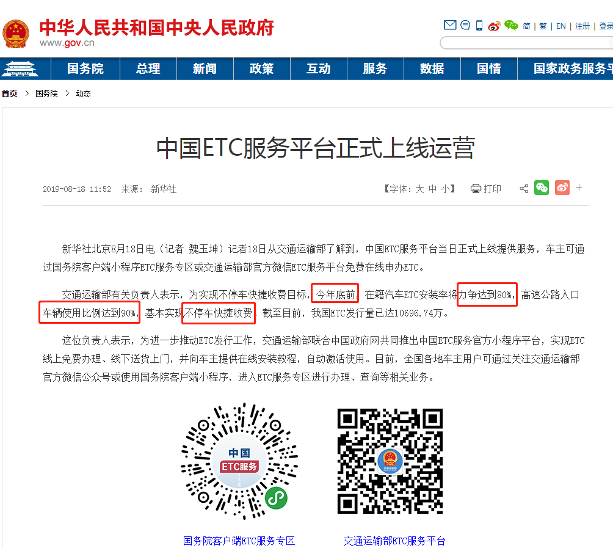
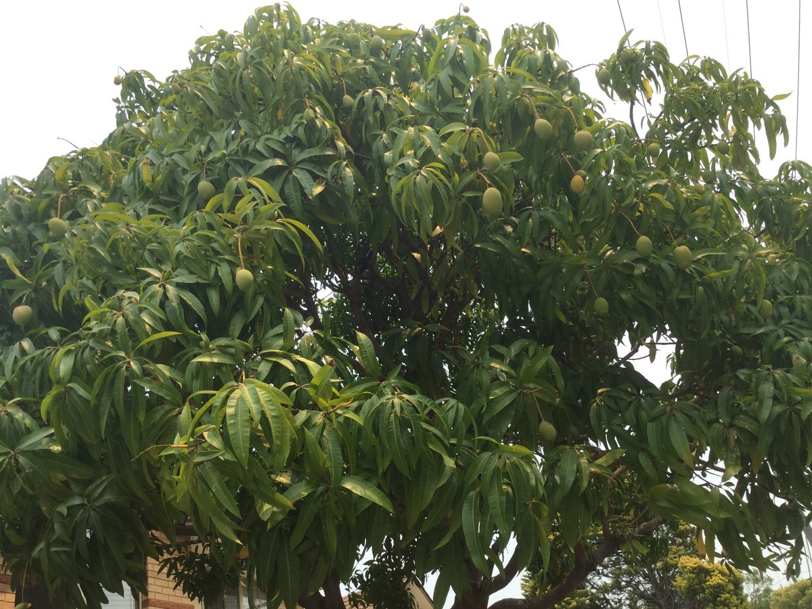
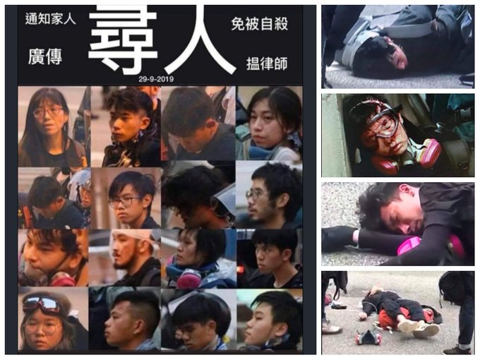

[12月22日 17:00]    纽约时报中文网   @nytchinese    #一周热门 在北京眼中，顺从的澳门是香港的榜样 http://nyti.ms/2PDTsrX   :speech_balloon:评:42 :+1:赞:17 :globe_with_meridians:转:5  

[12月22日 15:50]    财经真相   @caijingxiang    黄奇帆：每项供给侧改革都有万亿级红利，延长女性退休年龄这一供给侧改革，也是黄奇帆认为可带来万亿级红利的重大举措。他认为，如果妇女退休年龄从现在的50岁变革为60岁，甚至是和男性一样延长到65岁，每年相当于增加1万亿元养老金，必将缓和许多省份养老保险资金链紧张的情况！  :speech_balloon:评:34 :+1:赞:113 :globe_with_meridians:转:44  

[12月22日 15:01]    BBC News 中文   @bbcchinese    【一周热点回顾】一天，20岁的奈特把车开到缅因州乡下的森林中。随后，他弃车徒步走进森林，身上只带一些最基本的生存用品。从此就再也没有出来，直到被人发现。 https://bbc.in/2Mbxomq   :speech_balloon:评:8 :+1:赞:79 :globe_with_meridians:转:23  

[12月22日 13:41]    老司机   @h5lpykl7tp6jjop    这样的惨无人道即便在极度荒蛮的国度也是罕见而令人震惊的，可是这在中国却是习以为常的事。  :speech_balloon:评:29 :+1:赞:62 :globe_with_meridians:转:44  

[12月22日 13:22]    老司机   @h5lpykl7tp6jjop    女：你凭什么说要分手？
男：不是你让我滚，要分手吗？
女：我可以说分手，你说不行！
男：好吧，你说分手吧！
女：不行，我想什么时候说才说！
男：那天你不是说过了吗？
女：今天没有说！
男：那你究竟分不分手？
女：我想分就分，你无权决定我分不分！
男：@#¥&*%!  :speech_balloon:评:0 :+1:赞:10 :globe_with_meridians:转:3  

[12月22日 13:01]    BBC News 中文   @bbcchinese    【一周热点回顾】她是模特，邂逅这位富有的军火商，加入他的后宫团，成为“寻欢作乐小老婆”之一。是爱情？是友情？听她自己说…… https://bbc.in/38U7zkm   :speech_balloon:评:4 :+1:赞:17 :globe_with_meridians:转:8  

[12月22日 12:34]    新闻大吐槽   @TuCaoFakeNews    哪怕是大五毛花千芳，当家人遭到不公对待时，在墙内也基本没有发声空间，所有媒体全都不报道；

党对五毛的用法是取其精华、去其糟粕：
花千芳在墙内剩下的声音只有类似：“网文应该传递积极健康的价值观”、“我们为这个国家做了什么”这样的五毛文！

花应该感谢外媒，他们还为你的不公说了公道话！  :speech_balloon:评:7 :+1:赞:120 :globe_with_meridians:转:50  

[12月22日 12:34]    新闻大吐槽   @TuCaoFakeNews    哪怕是大五毛花千芳，当家人遭到不公对待时，在墙内也基本没有发声空间，所有媒体全都不报道；

党对五毛的用法是取其精华、去其糟粕：
花千芳在墙内剩下的声音只有类似：“网文应该传递积极健康的价值观”、“我们为这个国家做了什么”这样的五毛文！

花应该感谢外媒，他们还为你的不公说了公道话！  :speech_balloon:评:7 :+1:赞:120 :globe_with_meridians:转:50  

[12月22日 12:32]    老司机   @h5lpykl7tp6jjop    一方面中国要求仍被世界贸易组织（WTO）归类为发展中国家，同时又将自己定位为全球经济强国，这是不是一个笑话，这是中国这个硬币的两面，需要那一面翻开那一面，你们不习惯，没关系，慢慢会习惯的，这就是中国特色！  :speech_balloon:评:1 :+1:赞:35 :globe_with_meridians:转:8  

[12月22日 12:15]    老司机   @h5lpykl7tp6jjop    年底打总结，马云说：
2019年很不容易，以往可能是部分人不容易，2019年可能是大部分企业不容易。“到了年底了，昨天一天，我收到很多朋友借钱的电话，一天内5个电话。过去一个礼拜，要卖楼的朋友大概有10个，确实不容易。”  :speech_balloon:评:3 :+1:赞:25 :globe_with_meridians:转:5  

[12月22日 11:01]    BBC News 中文   @bbcchinese    【一周热点回顾】中国留学生已经成为英国海外留学生中的最大群体。但西方对这一留学群体的特点却了解的极其有限。英美教育专家为你解读... https://bbc.in/35CKLDZ   :speech_balloon:评:29 :+1:赞:54 :globe_with_meridians:转:20  

[12月22日 11:00]    纽约时报中文网   @nytchinese    #一周热门 在这个日本村庄，人偶比活人多 http://nyti.ms/34zkJjm   :speech_balloon:评:9 :+1:赞:16 :globe_with_meridians:转:4  

[12月22日 10:00]    BBC News 中文   @bbcchinese    【硅谷创新“停滞”？曾经的中国仿制者现在领跑了】美国硅谷一直被认为是世界的创新引擎，但最近，一批诞生于中国的科技公司开始领跑全球。中国究竟在哪些科技领域取得了进展和突破？BBC最近走访中国，寻访这个国家与众不同的科技创新。在这一集，先来看看中国的社交媒体吧。 https://bbc.in/2PLoluA   :speech_balloon:评:38 :+1:赞:57 :globe_with_meridians:转:23  

[12月22日 09:45]    凡賽堤/FORSETI   @FecharCCP    護臺！！！ 救港！！！救疆！！！

台灣人正在醒過來！！！全球華人正在醒過來..........
我們不是旁觀者，我們不是評論員，
我們都是當事人，我們都是見證著！
因為我們都是華族的一員！！！

讓我們一起消滅極權吧！

時代革命，光復華族！

------------原視頻來自台灣自由時報！  :speech_balloon:评:1 :+1:赞:26 :globe_with_meridians:转:13  

[12月22日 09:17]    凡賽堤/FORSETI   @FecharCCP    海外的華族台灣同胞！
台灣正在經歷歷史的變革，此時此刻的台灣正處於生死攸關時刻，台灣未來的命運取決你們手中神聖的全票！
呼籲海外的所有台灣同胞回家投票！
只有國民黨滅亡台灣的未來才有希望！！！

----感謝此視頻的原創作者！  :speech_balloon:评:0 :+1:赞:14 :globe_with_meridians:转:8  

[12月22日 09:01]    BBC News 中文   @bbcchinese    【一周热点回顾】梅森夫妇一手建造了地下色情王国，但他们试图向自己的孩子掩盖真相。 https://bbc.in/2PCdNOj   :speech_balloon:评:3 :+1:赞:20 :globe_with_meridians:转:1  

[12月22日 09:00]    纽约时报中文网   @nytchinese    #一周热门 新闻分析：特朗普被弹劾对今日美国意味着什么？ http://nyti.ms/36UZFFx   :speech_balloon:评:10 :+1:赞:9 :globe_with_meridians:转:3  

[12月22日 08:55]    凡賽堤/FORSETI   @FecharCCP    極權恐怖組織的殺人犯警試圖用身體和盾擋住拍攝者的視頻！但是它們擋不住700萬正義香港人所有的見證著！
擋不住全球華人和全人類正義的良知！！！
時代革命，消滅極權，光復華族，人人有責！

----感謝此視頻的正義原創作者！  :speech_balloon:评:5 :+1:赞:60 :globe_with_meridians:转:58  

[12月22日 08:46]    凡賽堤/FORSETI   @FecharCCP    浮屍，墜樓，被輪姦，被自殺........一直沒有停止過！

CCP極權殺人恐怖組織正在用各種兇殘手段屠殺我們的同胞...................
CCP極權殺人恐怖組織是全人類的公敵！
呼籲全世界正道主義合力消滅CCP！
呼籲全世界人民看清楚CCP反人類的慘無人道的殘暴罪行！！！  :speech_balloon:评:2 :+1:赞:7 :globe_with_meridians:转:8  

[12月22日 08:35]    凡賽堤/FORSETI   @FecharCCP    正在美國白宮網站請願取消2022北京冬奧會，想法是不錯，不過美國政府可以干預奧運會，但是奧運會不是美國說的算！支持一下也無妨！

Ask the International Olympics Commission & Corporate Sponsors to relocate or cancel the Beijing 2022 Winter Olympics  https://petitions.whitehouse.gov/petition/ask-international-olympics-commission-corporate-sponsors-relocate-or-cancel-beijing-2022-winter-olympics …  :speech_balloon:评:0 :+1:赞:2 :globe_with_meridians:转:1  

[12月22日 08:26]    凡賽堤/FORSETI   @FecharCCP    台灣人正在醒過來！！！全球華人正在醒過來..........
我們不是旁觀者，我們不是評論員，
我們都是當事人，我們都是見證著！
因為我們都是華族的一員！！！

讓我們一起消滅極權吧！

時代革命，光復華族！

------------原視頻來自台灣自由時報！  :speech_balloon:评:0 :+1:赞:12 :globe_with_meridians:转:7  

[12月22日 07:42]    凡賽堤/FORSETI   @FecharCCP    台灣人正在醒過來！！！全球華人正在醒過來..........
讓我們一起消滅極權吧！時代革命，光復華族！

2020將是告別華人歷史的極權統治的新的一年！！！

本人非此視頻的原創！非常感謝此視頻的原創作者！！！  :speech_balloon:评:2 :+1:赞:90 :globe_with_meridians:转:39  

[12月22日 07:34]    凡賽堤/FORSETI   @FecharCCP    感謝此視頻的原始上傳作者！  :speech_balloon:评:0 :+1:赞:4 :globe_with_meridians:转:0  

[12月22日 07:28]    凡賽堤/FORSETI   @FecharCCP    台灣人正在醒過來！！！全球華人正在醒過來..........
讓我們一起消滅極權吧！時代革命，光復華族！  :speech_balloon:评:1 :+1:赞:84 :globe_with_meridians:转:30  

[12月22日 05:50]    老司机   @h5lpykl7tp6jjop      :speech_balloon:评:0 :+1:赞:30 :globe_with_meridians:转:9  

[12月22日 05:49]    老司机   @h5lpykl7tp6jjop    记者终于找到李子柒的家 却遭遇一场“战斗”
原来是一个贫困村！却成了全世界向往的仙境，神奇吧！？
 https://www.6parknews.com/newspark/view.php?app=news&act=view&nid=392237 …  :speech_balloon:评:9 :+1:赞:106 :globe_with_meridians:转:33  

[12月22日 04:03]    新闻大吐槽   @TuCaoFakeNews    小鲜肉老公莫不是党安排在伊能静身边的钉子？
往日颇有正义感的她被现实的苟且打败，可惜 https://twitter.com/lifetimeuscn/status/1208218501858648064 …  :speech_balloon:评:3 :+1:赞:17 :globe_with_meridians:转:4  

[12月22日 03:46]    新闻大吐槽   @TuCaoFakeNews    有才，把海绵宝宝改成了国瑜草包
只是东森这个大红媒为何显得有点首鼠两端？拿了共党的钱，却不与党消灾？
东森：洗地成本太高，速打款  :speech_balloon:评:7 :+1:赞:143 :globe_with_meridians:转:52  

[12月22日 03:46]    新闻大吐槽   @TuCaoFakeNews    有才，把海绵宝宝改成了国瑜草包
只是东森这个大红媒为何显得有点首鼠两端？拿了共党的钱，却不与党消灾？
东森：洗地成本太高，速打款  :speech_balloon:评:7 :+1:赞:143 :globe_with_meridians:转:52  

[12月22日 01:05]    新闻大吐槽   @TuCaoFakeNews    50万人上街要求罢免韩国瑜的同时，另有号称35万人在挺韩游行～

蔡总统呼吁两方面都要保持理性，并认为表达诉求是人民的权利。

面对台湾社会的撕裂，她认为《反渗透法》是非常必要的。
这说明蔡英文把上街挺韩35万人的病因看得很清——红媒渗透  :speech_balloon:评:9 :+1:赞:309 :globe_with_meridians:转:118  

[12月22日 01:05]    新闻大吐槽   @TuCaoFakeNews    50万人上街要求罢免韩国瑜的同时，另有号称35万人在挺韩游行～

蔡总统呼吁两方面都要保持理性，并认为表达诉求是人民的权利。

面对台湾社会的撕裂，她认为《反渗透法》是非常必要的。
这说明蔡英文把上街挺韩35万人的病因看得很清——红媒渗透  :speech_balloon:评:9 :+1:赞:309 :globe_with_meridians:转:118  

[12月22日 00:53]    BBC News 中文   @bbcchinese    中国的通讯企业华为、中兴遭受美国制裁后，半导体、芯片成了受到中国全民关注的热词。许多人把芯片发展看作能够使中国产业和技术升级的主要核心技术。 https://www.bbc.com/zhongwen/simp/chinese-news-50878679 …  :speech_balloon:评:28 :+1:赞:56 :globe_with_meridians:转:16  

[12月21日 23:20]    新闻大吐槽   @TuCaoFakeNews    这并不是香港，而是高雄，今天50万人上街要求罢免韩狗鱼！
高雄人口300万，能把六分之一的人口逼上街，韩书记好威武  :speech_balloon:评:91 :+1:赞:2322 :globe_with_meridians:转:839  

[12月21日 23:20]    新闻大吐槽   @TuCaoFakeNews    这并不是香港，而是高雄，今天50万人上街要求罢免韩狗鱼！
高雄人口300万，能把六分之一的人口逼上街，韩书记好威武  :speech_balloon:评:91 :+1:赞:2322 :globe_with_meridians:转:839  

[12月21日 23:17]    老司机   @h5lpykl7tp6jjop    Hong Kong riot police ran into a passerby, and then start swearing at passerby.

原文 - 20:39-43港台live影住一警察o係yoho特登撞途人入防煙門
 https://lih.kg/1792224 

●來源：魚翅航空無女、RTHK
#HongKong #sosHK #HongKongPolice #riot #LIHKG  :speech_balloon:评:334 :+1:赞:4164 :globe_with_meridians:转:4813  

[12月21日 23:02]    新闻大吐槽   @TuCaoFakeNews    一句话概括——哎！我这被地下党员欺骗的半生 https://twitter.com/TuCaoFakeNews/status/1208174324156264449 …  :speech_balloon:评:9 :+1:赞:40 :globe_with_meridians:转:5  

[12月21日 22:56]    财经真相   @caijingxiang    ETC是否具有定位功能，查了一下网络，今年夏季就有人在网上讨论，丽水辟谣网还专门辟谣，一些技术帖子说，ETC不能定位，因为没有定位芯片，但是继续查询发现，没有GPS定位模组，物联网设备LBS也可以定位，有没有懂技术的大神说一下？  :speech_balloon:评:80 :+1:赞:113 :globe_with_meridians:转:27  

[12月21日 22:41]    财经真相   @caijingxiang    ETC真的是太阳能供电，有没有专门的人做检测，如果真的有GPS定位，那真的是细思极恐！中共彻底的随时、随地实时掌控，全国的人、物！彻彻底底的现代化高科技奴隶制度！ https://twitter.com/seanchen_new/status/1208389425987670018 …  :speech_balloon:评:106 :+1:赞:314 :globe_with_meridians:转:96  

[12月21日 22:40]    新闻大吐槽   @TuCaoFakeNews    “光复高雄，时代革命”
“草包，滚！”
今天，50万台湾人上街表达对韩狗鱼的不满  :speech_balloon:评:21 :+1:赞:363 :globe_with_meridians:转:117  

[12月21日 22:40]    新闻大吐槽   @TuCaoFakeNews    “光复高雄，时代革命”
“草包，滚！”
今天，50万台湾人上街表达对韩狗鱼的不满  :speech_balloon:评:21 :+1:赞:363 :globe_with_meridians:转:117  

[12月21日 22:08]    财经真相   @caijingxiang    哦哦！这么说以后节假日也不免费了？春节高速还堵路吗？ https://twitter.com/StevenSir2020/status/1208387676606324738 …  :speech_balloon:评:17 :+1:赞:76 :globe_with_meridians:转:17  

[12月21日 21:39]    BBC News 中文   @bbcchinese    美国总统特朗普宣布正式成立太空军（the US Space Force）。美国这一新的军种，隶属美国空军，也是美军自70多年来第一次设立新军种。特朗普在华盛顿附近的军事基地宣布了这一重大消息。他说：“太空是世界上最新的战斗领域”。 https://bbc.in/2Q1z56Q   :speech_balloon:评:66 :+1:赞:381 :globe_with_meridians:转:108  

[12月21日 21:12]    老司机   @h5lpykl7tp6jjop      :speech_balloon:评:3 :+1:赞:66 :globe_with_meridians:转:30  

[12月21日 21:00]    纽约时报中文网   @nytchinese    #一周热门 中国建设系统性监控网络，警察权力扩张 http://nyti.ms/34CXyEQ   :speech_balloon:评:99 :+1:赞:96 :globe_with_meridians:转:46  

[12月21日 20:36]    墙国铁拳现世报😷   @Socialistfist    爱党鄙视链

#战螂在推特  :speech_balloon:评:42 :+1:赞:403 :globe_with_meridians:转:75  

[12月21日 18:36]    老司机   @h5lpykl7tp6jjop    老婆被撞时间为9时43分，老公被撞时间为9时52分，同一个地点，同一个路线，夫妻二人，同样的乱穿马路双双被撞倒，只短短相隔了9分多钟。

这种“缘分”！  https://web.popo8.com/201912/20/5/0cd76eb75e.jpg …  :speech_balloon:评:3 :+1:赞:3 :globe_with_meridians:转:1  

[12月21日 18:22]    老司机   @h5lpykl7tp6jjop    金三想耍横惹祸了！美国高层撂狠话威胁朝鲜:服不服?今晚就开战!
半岛局势骤然紧张的当下，美国对朝威胁再升级。美国新任防长埃斯珀近日威胁：如果有必要，美国今晚就可以打仗！
据新华社报道，中俄两国几天前刚刚在联合国安理会共同提出政治解决半岛问题决议草案，敦促美朝继续对话，呼吁恢复六方会谈  :speech_balloon:评:9 :+1:赞:65 :globe_with_meridians:转:14  

[12月21日 18:07]    BBC News 中文   @bbcchinese    在贸易协议尚未最终签署的时候，中国在贸易议题之外对美国关于香港新疆的行为提出了警告。 https://bbc.in/34KrOh2   :speech_balloon:评:29 :+1:赞:85 :globe_with_meridians:转:25  

[12月21日 17:00]    纽约时报中文网   @nytchinese    #一周热门 复旦大学修改章程删除“思想自由”，引发学生抗议 http://nyti.ms/2txXXvD   :speech_balloon:评:88 :+1:赞:195 :globe_with_meridians:转:47  

[12月21日 16:39]    老司机   @h5lpykl7tp6jjop    如果因为天灾美澳加三大产粮国都减产，国际粮价高涨，中共的日子就芨芨可危了。  :speech_balloon:评:2 :+1:赞:45 :globe_with_meridians:转:3  

[12月21日 16:16]    老司机   @h5lpykl7tp6jjop    中国对待囚犯令人发指的酷刑！！！  :speech_balloon:评:155 :+1:赞:806 :globe_with_meridians:转:777  

[12月21日 16:11]    BBC News 中文   @bbcchinese    随着台湾总统选举日期接近，寻求连任的蔡英文为争取青年选票与网红合作，鍾明轩就是其一。 https://bbc.in/392ISSP   :speech_balloon:评:8 :+1:赞:18 :globe_with_meridians:转:4  

[12月21日 15:49]    BBC News 中文   @bbcchinese    矽谷创新“停滞”？曾经的中国仿制者现在领跑了 https://bbc.in/2ZajKVX   :speech_balloon:评:10 :+1:赞:19 :globe_with_meridians:转:2  

[12月21日 15:42]    财经真相   @caijingxiang    中共政府推广ETC的初衷是为了节约同行时间，但是实际上反而还没以往人工快，尤其是政府自己搭建的收费系统，流量一大就直接卡死，其结果就是车辆直接停在收费站，直到网络显示收费成功后，才可以放行，于是后面等待的车辆一股脑的全变车道，去了人工收费站，整个收费站瞬间变成停车场！  :speech_balloon:评:20 :+1:赞:121 :globe_with_meridians:转:22  

[12月21日 15:38]    财经真相   @caijingxiang    距离国务院下达的时间点就剩10天了，目前ETC普遍存在问题是：①为了强制推广，减少人工收费口，导致人工出口超级堵车②部分小出口过于狭窄，人工口一堵，整个收费站都瘫痪③部分车辆ETC无法识别，被迫变车道，引发各种交通事故④还有的ETC和人工车道并存，结果更堵⑤收费软件卡，结果又是等待堵车  :speech_balloon:评:29 :+1:赞:161 :globe_with_meridians:转:52  

[12月21日 15:28]    BBC News 中文   @bbcchinese    刚刚过去的一周，BBC中文以下新闻内容受到读者的关注。如果你错过了它们，BBC中文带你一一回顾。 https://bbc.in/38ZrFtI   :speech_balloon:评:7 :+1:赞:15 :globe_with_meridians:转:5  

[12月21日 15:01]    BBC News 中文   @bbcchinese    【一周热点回顾】英超阿森纳球队的德国球星厄齐尔（Mesut Özil）在社交平台有关新疆的言论，会成为继NBA之后又一起震动海内外的体坛政治事件吗？ https://bbc.in/36PYiYK   :speech_balloon:评:23 :+1:赞:64 :globe_with_meridians:转:19  

[12月21日 14:57]    老司机   @h5lpykl7tp6jjop      :speech_balloon:评:0 :+1:赞:60 :globe_with_meridians:转:19  

[12月21日 14:57]    老司机   @h5lpykl7tp6jjop    转发一篇深刻剖析农村及粮食问题的长文，可以肯定的是农业基础完了！  :speech_balloon:评:34 :+1:赞:403 :globe_with_meridians:转:206  

[12月21日 14:19]    老司机   @h5lpykl7tp6jjop    从厉害了我的国，大国崛起到纽约打电视频广告起，大外宣白花花的银子费了不知多少，除了引起各国警惕抵制外没带来半点好处，于是大外宣另一派救火队出动，李子柒这张美好农村生活牌发挥作用了，又是一波鼓吹，仿佛中国农村美的很，現实却是封锅毁灶强拆………假的就是假的，墨写谎言遮不住血写的事实！  :speech_balloon:评:1 :+1:赞:37 :globe_with_meridians:转:11  

[12月21日 13:00]    纽约时报中文网   @nytchinese    #一周热门 杨安泽背后，亚裔美国人距离政治舞台还有多远？ http://nyti.ms/2Z71vk4   :speech_balloon:评:18 :+1:赞:15 :globe_with_meridians:转:3  

[12月21日 12:37]    财经真相   @caijingxiang    新的银行结售汇数据出来了，2019.1-11的数据很有意思。北京实物购买逆差较多，说明政府才是外汇最大的消耗者。上海服务贸易逆差最大，说明上海人最愿意出国旅游，以及购买国外的服务；赚了外汇汇到国内最多是浙江人，而不是福建人。福建不是传说中的偷渡大省吗？难道他们只是人出去，钱不汇回国吗？  :speech_balloon:评:28 :+1:赞:283 :globe_with_meridians:转:135  

[12月21日 12:31]    凡賽堤/FORSETI   @FecharCCP    国内男子当街殴打儿童，行为令人发指！周围经过的路人选择无视！这就是自夸治安最好的第二大经济体！  :speech_balloon:评:192 :+1:赞:504 :globe_with_meridians:转:466  

[12月21日 11:48]    老司机   @h5lpykl7tp6jjop    钱都哪去了？  :speech_balloon:评:4 :+1:赞:18 :globe_with_meridians:转:7  

[12月21日 11:10]    老司机   @h5lpykl7tp6jjop    门口的芒果树挂满了果实，再过个把月，就可以吃了，自然熟的果实比超市买的甜多了！  :speech_balloon:评:8 :+1:赞:22 :globe_with_meridians:转:1  

[12月21日 11:03]    BBC News 中文   @bbcchinese    【一周热点回顾】台湾总统大选：“外省第三代”的选择与认同意味着台湾社会的什么变化呢？ https://bbc.in/36PXK5a   :speech_balloon:评:13 :+1:赞:72 :globe_with_meridians:转:29  

[12月21日 11:02]    老司机   @h5lpykl7tp6jjop    我用打草边机改成的动力橡皮船。  :speech_balloon:评:2 :+1:赞:28 :globe_with_meridians:转:2  

[12月21日 10:01]    新闻大吐槽   @TuCaoFakeNews    澳门的一国两制成功吗？澳门本地议员最清楚，他把澳门所有的弊端都痛陈了一遍！
而此时习近平却沉浸在20年典礼的幻象中，以为澳门是一国两制的成功案例，这个议员的话，估计习是听不到的！  :speech_balloon:评:63 :+1:赞:1134 :globe_with_meridians:转:542  

[12月21日 10:01]    新闻大吐槽   @TuCaoFakeNews    澳门的一国两制成功吗？澳门本地议员最清楚，他把澳门所有的弊端都痛陈了一遍！
而此时习近平却沉浸在20年典礼的幻象中，以为澳门是一国两制的成功案例，这个议员的话，估计习是听不到的！  :speech_balloon:评:63 :+1:赞:1134 :globe_with_meridians:转:542  

[12月21日 09:58]    财经真相   @caijingxiang    但新华社报导，习近平强调，对近一段时间来美方在涉台、涉港、涉疆、涉藏等问题上的消极言行表示严重关切。“这些做法干涉了中国内政、损害了中方利益，不利于双方互信合作。”要坚持政治解决的大方向，各方要相向而行，保持对话缓和势头，这符合各方共同利益。 https://twitter.com/USA_China_Talk/status/1208202887014354944 …  :speech_balloon:评:16 :+1:赞:118 :globe_with_meridians:转:25  

[12月21日 09:02]    BBC News 中文   @bbcchinese    【一周热点回顾】网红钟明轩、“波特王”先后发布与蔡英文的合作影片，却因内容涉及政治议题，“波特王”遭中国合作厂商解约，引起轩然大波。 https://bbc.in/2EvBEJb   :speech_balloon:评:43 :+1:赞:106 :globe_with_meridians:转:24  

[12月21日 09:00]    纽约时报中文网   @nytchinese    #观点 我们是共和党人，我们决心击败特朗普 http://nyti.ms/2S4GyEQ   :speech_balloon:评:79 :+1:赞:86 :globe_with_meridians:转:30  

[12月21日 07:56]    新闻大吐槽   @TuCaoFakeNews    不愧是牛津毕业的数学家，林政老公故意在公开场合给林政出难题，不鼓掌明显是当众在给林政难堪，也明示了家庭内部的不和。

另一个重点就是，站在前排的估计只有他不是党员！  :speech_balloon:评:86 :+1:赞:990 :globe_with_meridians:转:295  

[12月21日 07:56]    新闻大吐槽   @TuCaoFakeNews    不愧是牛津毕业的数学家，林政老公故意在公开场合给林政出难题，不鼓掌明显是当众在给林政难堪，也明示了家庭内部的不和。

另一个重点就是，站在前排的估计只有他不是党员！  :speech_balloon:评:86 :+1:赞:990 :globe_with_meridians:转:295  

[12月21日 04:21]    BBC News 中文   @bbcchinese    习近平盛赞澳门的“一国两制”，澳门民主派议员又怎么看？ // 习近平出巡澳门：民主派议员区锦新眼中的“好事办成坏事” https://bbc.in/2PHO5YH   :speech_balloon:评:10 :+1:赞:20 :globe_with_meridians:转:9  

[12月21日 03:49]    老司机   @h5lpykl7tp6jjop    中国权贵们不但在政治地位上世袭，经济地位上也同样世袭。权贵子女直接进入国企，迅速窜升为国企负责人，然后用各种手段将国企变成个人的提款机。官员贪腐的财富与权贵的掠夺相比是小巫见大巫。贪腐是犯罪，但权贵将国有资产占为己有却是用的貌似合法的方式。资本向权贵大规模转移，形成权贵资本主义。  :speech_balloon:评:18 :+1:赞:492 :globe_with_meridians:转:269  

[12月20日 22:59]    BBC News 中文   @bbcchinese    一提到性病，人们马上会联想到淋病、梅毒和衣原体等。但公共卫生当局说正有一些新的性病悄然袭来。 https://bbc.in/34HtKXQ   :speech_balloon:评:1 :+1:赞:45 :globe_with_meridians:转:29  

[12月20日 22:48]    墙国铁拳现世报😷   @Socialistfist    “每当回到现实生活中，梦立刻被击得粉碎”
网络文学作家 罗霸道发帖称父母辛苦养鱼和邻居的鸭子被人河中投毒毒死，血本无归。警察和当地畜牧水产踢皮球。经历这些种种，罗霸道发文感慨，自己在现实生活中霸道不起来。

#社会主义铁拳  :speech_balloon:评:51 :+1:赞:459 :globe_with_meridians:转:133  

[12月20日 22:43]    BBC News 中文   @bbcchinese    英国议会以358票支持，234票反对，通过首相鲍里斯·约翰逊达成的脱欧协议，以确保英国在明年1月31日脱离欧盟。
 https://bbc.in/2EJKcMt   :speech_balloon:评:38 :+1:赞:319 :globe_with_meridians:转:116  

[12月20日 22:30]    BBC News 中文   @bbcchinese    这样的恐怖情人还要继续下去吗？英国一名年轻男子，惨遭女友虐待施暴，时间长达6年，一度在鬼门关前徘徊。 https://bbc.in/2repUI7   :speech_balloon:评:25 :+1:赞:51 :globe_with_meridians:转:18  

[12月20日 22:17]    墙国铁拳现世报😷   @Socialistfist    他截图里的似乎是我？看来是前天被我怼成复读机的那位  :speech_balloon:评:3 :+1:赞:105 :globe_with_meridians:转:1  

[12月20日 22:03]    墙国铁拳现世报😷   @Socialistfist    经验教训告诉我们，孙笑川们翻墙爱党的后果就是腾讯推特一起封号
因投稿人要求厚码
#社会主义铁拳  :speech_balloon:评:31 :+1:赞:439 :globe_with_meridians:转:93  

[12月20日 21:59]    BBC News 中文   @bbcchinese    日本老年犯罪现象越来越严重。这些人年龄在65岁以上，年龄最大超过80岁。深层原因令人无奈。
 https://bbc.in/2rdsvC5   :speech_balloon:评:7 :+1:赞:17 :globe_with_meridians:转:12  

[12月20日 21:31]    BBC News 中文   @bbcchinese    在中国古代，数学是重要的计算工具，协助兴建了长达数千英里的长城，而特别的是，连中国皇帝的行房次数，也与数学息息相关。
 https://bbc.in/35LGcHm   :speech_balloon:评:16 :+1:赞:24 :globe_with_meridians:转:9  

[12月20日 21:01]    新闻大吐槽   @TuCaoFakeNews    澳门特首崔世安这几天很忙，伺候一尊，生怕有些许差池；
特首有个亲哥，也在澳门从政，叫崔世昌，是立法会议员，曾经用普通话在全国会议上发言；
听完视频，你就知道澳共官员对自己有多盲目自信了；希望不是家族遗传性的自我认知障碍  :speech_balloon:评:12 :+1:赞:135 :globe_with_meridians:转:61  

[12月20日 21:01]    新闻大吐槽   @TuCaoFakeNews    澳门特首崔世安这几天很忙，伺候一尊，生怕有些许差池；
特首有个亲哥，也在澳门从政，叫崔世昌，是立法会议员，曾经用普通话在全国会议上发言；
听完视频，你就知道澳共官员对自己有多盲目自信了；希望不是家族遗传性的自我认知障碍  :speech_balloon:评:12 :+1:赞:135 :globe_with_meridians:转:61  

[12月20日 21:00]    纽约时报中文网   @nytchinese    习近平还隐晦地指责了香港的动乱。
澳门特区政府和“社会各界人士深明‘家和万事兴’，”他在谈到澳门的官方地位时使用了一句中国常用格言。“和气致祥，讲团结、重协商，不争拗、不内耗。” http://nyti.ms/2PHe02M   :speech_balloon:评:4 :+1:赞:9 :globe_with_meridians:转:1  

[12月20日 20:37]    纽约时报中文网   @nytchinese    【图片中的2010年代：动荡不安的十年】推翻既有精英阶层的冲动蔓延到每一个大陆，有时是暴力起义，有时是民粹主义的叛乱，令主要民主国家的种种制度遭到动摇。许多最令人难忘的照片记录了这个动荡的十年。 http://nyti.ms/36Tb1tS   :speech_balloon:评:66 :+1:赞:38 :globe_with_meridians:转:15  

[12月20日 20:33]    新闻大吐槽   @TuCaoFakeNews    你觉得：
是日本在严冬里烤火吃地瓜的猴子活得舒坦？
还是被香港、美国、党内三把火一齐烤的包子过的舒服？
同样是烤火，为什么一个舒服，一个就不舒服呢？

投胎小贴士：宁做一只自由世界的猴，也别做极权帝国的末世君王~  :speech_balloon:评:14 :+1:赞:214 :globe_with_meridians:转:52  

[12月20日 20:33]    新闻大吐槽   @TuCaoFakeNews    你觉得：
是日本在严冬里烤火吃地瓜的猴子活得舒坦？
还是被香港、美国、党内三把火一齐烤的包子过的舒服？
同样是烤火，为什么一个舒服，一个就不舒服呢？

投胎小贴士：宁做一只自由世界的猴，也别做极权帝国的末世君王~  :speech_balloon:评:14 :+1:赞:214 :globe_with_meridians:转:52  

[12月20日 19:46]    纽约时报中文网   @nytchinese    澳门回归中国统治20周年之际，习近平对澳门的爱国主义表示赞赏，并对附近的香港进行了旁敲侧击的谴责，称北京不会容忍对其主权的挑战或“外部势力”的干预。
他说，澳门通过向北京的中央政权表示忠诚，为一国两制的历史提供了“华彩篇章”。 http://nyti.ms/2PHe02M   :speech_balloon:评:22 :+1:赞:35 :globe_with_meridians:转:8  

[12月20日 18:30]    纽约时报中文网   @nytchinese    #时报专栏 没人想读的专栏 by @NickKristof  http://nyti.ms/35HcXWc https://twitter.com/NickKristof/status/1207758737265565696 …  :speech_balloon:评:1 :+1:赞:3 :globe_with_meridians:转:2  

[12月20日 17:00]    纽约时报中文网   @nytchinese    #时报专栏 当我在大学演讲时，总有人会哀叹如今越来越多的记者不去报道人道主义新闻了。这其中的挑战是：若有更多记者报道这些问题，那就有更多新闻机构将会破产。
我们的新闻界仍在为此类故事摸索商业模式，ProPublica和普利策中心这样的慈善非营利组织，可能提供了部分答案。 http://nyti.ms/35HcXWc   :speech_balloon:评:8 :+1:赞:16 :globe_with_meridians:转:7  

[12月20日 16:36]    纽约时报中文网   @nytchinese    #图集【在美国，60万美元能买到什么房？】手握60万美元，你能买到辛辛那提一座建于1908年的希腊文艺复兴风格豪宅，或佛蒙特州兰德罗夫的一处梁柱结构房屋，也可以选择弗吉尼亚州里士满的1907年砖房。
点击查看图集： http://nyti.ms/2PGODhr   :speech_balloon:评:7 :+1:赞:29 :globe_with_meridians:转:14  

[12月20日 16:00]    纽约时报中文网   @nytchinese    审判预计何时进行？需要多长时间？尽管总统和他的盟友急切希望迅速宣布无罪释放，佩洛西的评论提出了这样一种可能性，即众议院可能会在问题未解决的情况下休圣诞假——让弹劾的子弹再飞一会儿。
1999年对克林顿两项弹劾条款（伪证罪和妨碍司法公正）的审判持续了大约5个星期。 http://nyti.ms/35CvQcK   :speech_balloon:评:2 :+1:赞:7 :globe_with_meridians:转:2  

[12月20日 15:40]    纽约时报中文网   @nytchinese    #时报专栏 @NickKristof：今年我的专栏中读的最差的一篇是关于香港，关于新疆问题的也没人读。我倒是想说这些文章是写砸了，但砸字还显得留下了点影响似的。权且称它们为废物。失策。水货。鲁蛇。
我感到自己很幸运，仍有完全的自由去报道没有市场的人道主义新闻。 http://nyti.ms/35HcXWc   :speech_balloon:评:58 :+1:赞:135 :globe_with_meridians:转:19  

[12月20日 15:00]    纽约时报中文网   @nytchinese    杨安泽的竞选口号——“与唐纳德·特朗普正相反，是一个喜欢数学的亚裔男子”——以及他在今年早些时候的一场辩论中声明“我是亚裔，所以我认识很多医生”的说法，招致了严厉的批评，因为这些话延续了人们对亚裔美国人的刻板印象。 http://nyti.ms/2Z71vk4   :speech_balloon:评:15 :+1:赞:8 :globe_with_meridians:转:1  

[12月20日 14:39]    纽约时报中文网   @nytchinese    美国众议院已通过弹劾特朗普的投票，通常下一步将移交参议院审理——这是第三位进入弹劾审判的美国总统。
因担心审判公正性问题，众议院议长南希·佩洛西考虑推迟向参议院提交弹劾指控。审判预计何时进行？谁负责做什么？都有什么样的规则？将会如何结束？这里是一份解答。 http://nyti.ms/35CvQcK   :speech_balloon:评:16 :+1:赞:45 :globe_with_meridians:转:16  

[12月20日 13:56]    财经真相   @caijingxiang    12月20日，中共央行在香港发行100亿元人民币央票。这是继今年2月、5月、6月、8月、9月、11月之后，第7次在香港发行央票。自此，中共央行在香港总共发行了19期、累计1700亿元的央票，如此频繁的行动是较为罕见的。在美国汇率操纵指责以及资本外流背景下，发行央票成了维护汇率的主要手段！  :speech_balloon:评:13 :+1:赞:350 :globe_with_meridians:转:127  

[12月20日 13:30]    纽约时报中文网   @nytchinese    在北京眼中，顺从的澳门是香港的榜样  http://nyti.ms/2PDTsrX https://twitter.com/stevenleemyers/status/1207205009487732737 …  :speech_balloon:评:35 :+1:赞:27 :globe_with_meridians:转:12  

[12月20日 13:00]    纽约时报中文网   @nytchinese    #每日一词 Workhorse，驮马，做重活的人。烤箱被选为时报科技工坊专栏的年度小工具，@bxchen写道，像智能手机一样，优秀的烤箱可成为日常生活中的“老黄牛”(everyday workhorse)。
Workhorse意为专门用来驮东西的马，其也有经久耐用的机器、埋头苦干的人的意思。更多简报内容： http://nyti.ms/2PF08Gf   :speech_balloon:评:1 :+1:赞:2 :globe_with_meridians:转:1  

[12月20日 12:30]    纽约时报中文网   @nytchinese    杨安泽是目前仍在参选的民主党候选人中唯一的非白人，对许多政治老手来说，这本身就是非凡的。但在他引人注目的政治上升过程中，他基本上一直试图避免过多地讨论自己的背景。
长期被排除在有关少数族裔讨论之外的亚裔，仍在寻找多元化中适合自己的位置。 http://nyti.ms/2Z71vk4   :speech_balloon:评:27 :+1:赞:84 :globe_with_meridians:转:21  

[12月20日 10:30]    老司机   @h5lpykl7tp6jjop    多一些这样的勇士，公民，共匪邪教就难有生存空间了！  :speech_balloon:评:70 :+1:赞:952 :globe_with_meridians:转:430  

[12月20日 09:10]    凡賽堤/FORSETI   @FecharCCP    浮屍，墜樓，被輪姦，被自殺........一直沒有停止過！
都是我們族人，同胞，親人，朋友......我們還是束手無助！！！ CCP極權在70年間已經有不完全統計的上億華人被以各種手段，莫須有罪名殺害，今天每天都還在發生！
我們怎麼辦？隨時隨刻將在你的親人，朋友身邊發生！！！怎麼辦？  :speech_balloon:评:19 :+1:赞:94 :globe_with_meridians:转:97  

[12月20日 08:08]    凡賽堤/FORSETI   @FecharCCP    時代革命，消滅極權，光復中華，人人有責！！！  :speech_balloon:评:0 :+1:赞:3 :globe_with_meridians:转:0  

[12月20日 07:59]    凡賽堤/FORSETI   @FecharCCP    在科技與文明的新時代，每個華人全部行駛歷史賦予華人的新的神聖使命----時代革命，消滅極權，光復中華！！！  :speech_balloon:评:3 :+1:赞:25 :globe_with_meridians:转:16  

[12月20日 07:48]    凡賽堤/FORSETI   @FecharCCP    CCP極權挾14億華人以令世界70年，聲討與消滅CCP極權的時代已經來了，讓我們一起學習香港人永不屈服的正義精神！！！ 全面傳播香港的危機真相來喚醒14億人的良知！
讓我們一起向全世界發出震撼人類歷史的全民聲討消滅CCP極權組織的聲音！！！永不屈服！！！永不停止！！  :speech_balloon:评:4 :+1:赞:65 :globe_with_meridians:转:60  

[12月20日 07:35]    凡賽堤/FORSETI   @FecharCCP    期望全世界正義之人每個人全面收集整理香港6.9以來的所有視頻，畫面加以時間，事件說明，中英文製作宣傳片，紀錄片，保存並向全世界社交媒體傳播！永不停止！！！ https://twitter.com/FecharCCP/status/1198065532991410177 …  :speech_balloon:评:1 :+1:赞:29 :globe_with_meridians:转:21  

[12月20日 07:25]    凡賽堤/FORSETI   @FecharCCP    我們不可停止，我們將無限循環傳播香港的全方位被CCP極權組織殘暴殺害的種種真相視頻和畫面，永不停止！！！！！！！！！！！！！！！！！！！！！！！！！！！！！！！！！！！！！！！！！！！！！！！！！！！！！！！！！！！！！！！！！！！！！！！！！！！！！！！！！！！  :speech_balloon:评:31 :+1:赞:592 :globe_with_meridians:转:632  

[12月20日 07:21]    凡賽堤/FORSETI   @FecharCCP    我們不可停止，我們將無限循環傳播香港的全方位被CCP極權組織殘暴殺害的種種真相視頻和畫面，永不停止！！！！！！！！！！！！！！！！！！！！！！！！！！！！！！！！！！！！！！！！！！！！！！！！！！！！！！！！！！！！！！！！！！！！！！！！！！！！！！！！！！！  :speech_balloon:评:0 :+1:赞:6 :globe_with_meridians:转:3  

[12月20日 07:18]    凡賽堤/FORSETI   @FecharCCP    我們不可停止，我們將無限循環傳播香港的全方位被CCP極權組織殘暴殺害的種種真相視頻和畫面，永不停止！！！！！！！！！！！！！！！！！！！！！！！！！！！！！！！！！！！！！！！！！！！！！！！！！！！！！！！！！！！！！！！！！！！！！！！！！！！！！！！！！！！ https://twitter.com/FecharCCP/status/1198392652863021056 …  :speech_balloon:评:0 :+1:赞:14 :globe_with_meridians:转:12  

[12月19日 14:39]    财经真相   @caijingxiang    美国历史上四位遭到“弹劾”的总统，以及弹劾条款和原因！  :speech_balloon:评:23 :+1:赞:159 :globe_with_meridians:转:59  

[12月19日 14:26]    财经真相   @caijingxiang    为了庆祝澳门被中共统治20周年，澳门特别行政区政府与珠海市人民政府将于12月22日晚上9时，在澳门旅游塔及珠海横琴金融岛对出海面首次举行联合烟花汇演。本次汇演将有16万枚烟花、4艘大泊船、16个特效燃放平台、56艘无人船及600只无人机参与。 周末没事，可以去看看纳税人的钱如何“天女散花”！  :speech_balloon:评:34 :+1:赞:281 :globe_with_meridians:转:82  

[12月19日 11:59]    财经真相   @caijingxiang    本次降准幅度应该会超过100个基点，去年央行新年大规模降准公布日期是1月4号（新年的第一周的周五），实施日期是1月15日，今年如果央行沿用去年时间点，最迟会在1月3号（周五）公布，或者本周五（明天）宣布！预计本次降准对人民币汇率影响有限，人民币会短线走低后，将会继续重回7附近震荡！  :speech_balloon:评:3 :+1:赞:103 :globe_with_meridians:转:13  

[12月19日 11:48]    财经真相   @caijingxiang    【重要】昨天央行开展2500亿逆回购操作，其中包含1500亿14天操作，14天后到期日刚好是元旦，这说明央行已经开始安排跨年流动性。由于春节提现高峰，以及提前下发2020年一万亿专项债开始筹资，再加上到期4075亿MLF，交税费高峰，初步估算整个1月份资金缺口达到2.8万亿，为此央行大概率全面性再次降准！  :speech_balloon:评:14 :+1:赞:299 :globe_with_meridians:转:87  

[12月19日 01:55]    墙国铁拳现世报😷   @Socialistfist    后续申明  :speech_balloon:评:17 :+1:赞:121 :globe_with_meridians:转:19  

[12月18日 19:55]    财经真相   @caijingxiang    澳门向内地汇款额度提高到8万，那么从内地到澳门的额度没有提高吗？怎么感觉是在撸澳门人的羊毛节奏啊！难道就是因为澳门人老实，往死里忽悠？  :speech_balloon:评:36 :+1:赞:303 :globe_with_meridians:转:88  

[12月18日 19:54]    墙国铁拳现世报😷   @Socialistfist    根据网上来源显示抚顺生猪肉价在每公斤30元左右。由此得出花千芳母亲一个月可以购买猪肉6.7公斤左右  :speech_balloon:评:11 :+1:赞:57 :globe_with_meridians:转:8  

[12月18日 19:19]    墙国铁拳现世报😷   @Socialistfist    目前花千芳已经意识到评论翻车已经删除该条微博
小编建议花千芳可以从此把简介改成： 我们的征途是星辰大海和妈妈的养老证  :speech_balloon:评:9 :+1:赞:262 :globe_with_meridians:转:30  

[12月18日 19:19]    财经真相   @caijingxiang    这就是说美国人给的时间点就是下个月的第一周，算时间就是两周内中共内斗出结果！ https://twitter.com/globalhimalaya/status/1207104656129658881 …  :speech_balloon:评:14 :+1:赞:258 :globe_with_meridians:转:98  

[12月18日 18:42]    墙国铁拳现世报😷   @Socialistfist    #社会主义铁拳 https://twitter.com/zhanglucy88/status/1207234309737697280 …  :speech_balloon:评:32 :+1:赞:363 :globe_with_meridians:转:97  

[12月18日 16:36]    财经真相   @caijingxiang    中国国家发改委新闻发言人孟玮17日透露，今后一段时间，特别是中国“两节”期间，将根据市场形势变化，择机增加中央冻猪肉储备投放。  :speech_balloon:评:19 :+1:赞:135 :globe_with_meridians:转:19  

[12月17日 23:13]    墙国铁拳现世报😷   @Socialistfist      :speech_balloon:评:8 :+1:赞:53 :globe_with_meridians:转:6  

[12月17日 23:13]    墙国铁拳现世报😷   @Socialistfist    注意到他使用日文，这个老哥真是猜不透他  :speech_balloon:评:11 :+1:赞:95 :globe_with_meridians:转:3  

[12月17日 21:53]    墙国铁拳现世报😷   @Socialistfist    补充  :speech_balloon:评:11 :+1:赞:93 :globe_with_meridians:转:7  

[12月17日 21:36]    墙国铁拳现世报😷   @Socialistfist    习近平主席想要知道你的坐标

#战螂在推特 https://twitter.com/minzhutiequan/status/1206795300255387648 …  :speech_balloon:评:27 :+1:赞:294 :globe_with_meridians:转:24  

[12月17日 21:29]    墙国铁拳现世报😷   @Socialistfist    声明：小编在推友提醒后把推文删除了，原因请见配图。与之前其他人不同，他的措辞实属现行网络舆论管制下的无奈。  :speech_balloon:评:26 :+1:赞:319 :globe_with_meridians:转:74  

[12月17日 19:41]    财经真相   @caijingxiang    2018年专项债余额（7.39万亿）就已经超过了政府性基金收入（7.14万亿）的规模！专项债以前高益完全可以靠土地财政收入填补，现在土地财政收入也不行了，必须要找别的办法解决！  :speech_balloon:评:12 :+1:赞:129 :globe_with_meridians:转:30  

[12月17日 19:34]    财经真相   @caijingxiang    政府债券流动性不足，翻译成人话就是说，政府债券没人买，而且购买人多数为银行机构，市场机构太聪明，不要！所以必须换个名字“特别国债”，继续忽悠！  :speech_balloon:评:32 :+1:赞:526 :globe_with_meridians:转:200  

[12月17日 19:25]    墙国铁拳现世报😷   @Socialistfist    律师函警告  :speech_balloon:评:10 :+1:赞:107 :globe_with_meridians:转:5  

[12月16日 19:25]    墙国铁拳现世报😷   @Socialistfist    评论区表情包大赏？  :speech_balloon:评:13 :+1:赞:184 :globe_with_meridians:转:10  

[12月16日 19:17]    墙国铁拳现世报😷   @Socialistfist    任职于长春一汽公司的戛戛
每当遇到生活中的烦心事，总会回到家，一个人坐在沙发上，打开音响，调大音量, 循环播放 天赋事变的rap
［hey！democracy...] 
听着听着，戛戛就睡了过去，嘴角划出一道微笑，在中国梦里的她不再被世俗纷扰
晚安中国

#社会主义铁拳  :speech_balloon:评:78 :+1:赞:697 :globe_with_meridians:转:190  

[12月16日 17:03]    财经真相   @caijingxiang    第十九届四中全会精神！ https://twitter.com/landofyelang/status/1206481839906418688 …  :speech_balloon:评:22 :+1:赞:356 :globe_with_meridians:转:166  

[12月15日 12:37]    墙国铁拳现世报😷   @Socialistfist    #铁拳砸死小粉红

某新闻传播专业大学生，打算于思政课讨论“西方媒体在报道大型事件中的双标”，为此开设了微信讨论组交换素材与思路，但因为发言触及过多敏感词，惨遭微信封号，目前正在微博伸冤。

一场成功的“谁说我国没有言论自由”行为艺术表演。  :speech_balloon:评:92 :+1:赞:1044 :globe_with_meridians:转:367  

[12月15日 12:20]    财经真相   @caijingxiang    海南要升级为中央特区，谁决定的？该不会是某些一边干着女星，一边卖官的混蛋商量的吧？  :speech_balloon:评:123 :+1:赞:689 :globe_with_meridians:转:198  

[12月15日 02:39]    GFHG SDKM   @zyx_yny    This Muslim man was just released from a concentration in china 

"He could barely walk by himself. He doesn't recognize anyone in his family and gets frightened by every little movement of people around him"

There are nearly 3 Million Muslim in concentration camps in China   :speech_balloon:评:1486 :+1:赞:75044 :globe_with_meridians:转:61899  

[12月14日 23:24]    墙国铁拳现世报😷   @Socialistfist    “生而为国人，边早就选了”
当初NBA风波的爱国表态，提到在国家尊严前不值一提。
鼠绘汉化网因侵犯海贼王版权疑似被哔哩哔哩上海公司举报，现已经跨省批捕
NBA目前在中国照旧正常播出

#社会主义铁拳  :speech_balloon:评:49 :+1:赞:763 :globe_with_meridians:转:189  

[12月14日 22:11]    GFHG SDKM   @zyx_yny    My 2020 New Year resolution is to free both Hong Kong & China by defeating the New Evil Empire. Happy New Year! https://twitter.com/bohsiuming/status/1205845620851785735 …  :speech_balloon:评:423 :+1:赞:4901 :globe_with_meridians:转:2367  

[12月14日 10:09]    GFHG SDKM   @zyx_yny    #HKPoliceTerrorists has fired nearly 16,000 #TearGas rounds  during the six months of pro-#democracyforhk #HongKongProtests  :speech_balloon:评:12 :+1:赞:280 :globe_with_meridians:转:263  

[12月14日 03:21]    GFHG SDKM   @zyx_yny    #HongKongers & #HongKong #StandwithUyghurs 

To free #Uyghurs in #EastTurkistan, Chinese Communist Party of #China which violates #HumanRights needs to end. 

#BoycottChina  :speech_balloon:评:2 :+1:赞:127 :globe_with_meridians:转:22  

[12月14日 01:42]    GFHG SDKM   @zyx_yny    Support  :speech_balloon:评:7 :+1:赞:395 :globe_with_meridians:转:53  

[12月13日 22:17]    GFHG SDKM   @zyx_yny    警察の鎮圧行動の中、原因不明の転落死で亡くなった周梓樂くん。

これは周くんのお父さんからの手紙。

//君がまだ母親のお腹にいたあの頃に、私たちはすでに君に「樂樂」という名前を付けることを決めたんだ。
君が一生楽しく笑顔で過ごせますように、と願って。//

是非、全文もご一読ください。  :speech_balloon:评:18 :+1:赞:1002 :globe_with_meridians:转:769  

[12月13日 20:13]    GFHG SDKM   @zyx_yny    日本政府が来年、習近平国家主席を国賓として招くことについて、私は強く反対しています。

これはあくまで一人の香港人としての個人的な意見ですが、日本の皆さんに読んでほしいです。→  :speech_balloon:评:736 :+1:赞:22323 :globe_with_meridians:转:10368  

[12月13日 19:54]    墙国铁拳现世报😷   @Socialistfist    啧啧啧

#战螂在推特 2  :speech_balloon:评:24 :+1:赞:136 :globe_with_meridians:转:24  

[12月13日 18:50]    GFHG SDKM   @zyx_yny    #HayırlıCumalarDoğuTürkistan   :speech_balloon:评:18950 :+1:赞:209737 :globe_with_meridians:转:99077  

[12月13日 13:58]    GFHG SDKM   @zyx_yny    永不遺忘，常在心中，他們的付出，將會留給世世代代，香港多謝有你才會有未来，香港史書會有手足的勇敢，輝煌的事件。  :speech_balloon:评:52 :+1:赞:844 :globe_with_meridians:转:535  

[12月13日 11:19]    GFHG SDKM   @zyx_yny    Can't believe Commissar Lamb is rewarding @hkpoliceforce human rights abuse & brutality. https://twitter.com/Kaman13032369/status/1205325571070124037 …  :speech_balloon:评:449 :+1:赞:5157 :globe_with_meridians:转:4123  

[12月12日 21:43]    墙国铁拳现世报😷   @Socialistfist    感谢近几日投稿的推友！  :speech_balloon:评:0 :+1:赞:66 :globe_with_meridians:转:1  

[12月12日 16:51]    GFHG SDKM   @zyx_yny    Japanese retail brand MUJI was sued by fake "MUJI" copycat in #China (right) for copyright dispute and the fake MUJI won the court case.

The genuine MUJI has to pay the fake one US$85k for their "financial loss" and apologize due to "copyright infringement"

China = Fantasy Land  :speech_balloon:评:151 :+1:赞:1463 :globe_with_meridians:转:1313  

[12月12日 16:35]    GFHG SDKM   @zyx_yny    He comes all the way from Japan, bring coffee with him to give Hong Kong people a free cup. “I come to give some warmth to you guys, I know what happened” he said 

#StandWithHongKong  :speech_balloon:评:162 :+1:赞:4047 :globe_with_meridians:转:2113  

[12月12日 13:43]    GFHG SDKM   @zyx_yny    今日、すき家の香港店がオープンしました。昨日の夜から長い行列ができました（笑）

親中派企業が経営している香港吉野家を多くの香港人がボイコットしている今、すき家は多分大人気になると思いますw

#香港 #すき家  :speech_balloon:评:450 :+1:赞:23850 :globe_with_meridians:转:7779  

[12月04日 20:37]    GFHG SDKM   @zyx_yny    喂喂，香港嘅bb睇落嚟

澳洲設立committee，探討是否有必要頒佈Magnitsky. 可以開始寫信lobby袋鼠囯喔。They accept submissions now

好擔心。區選舉和HKHRDA頒佈后，大家有哋散漫有哋唔focus喎。還有人開始屌來屌去...

bb, come back! 依家有嘢做囖

利申：信還沒寫，不過澳洲list做完一半了 https://twitter.com/NSWHongkongers/status/1202151090399006720 …  :speech_balloon:评:9 :+1:赞:320 :globe_with_meridians:转:200  

[11月26日 01:01]    GFHG SDKM   @zyx_yny    Heading back to London. 

Thank you #HK for letting us share in your unforgettable victory.

香港人, 加油   :speech_balloon:评:2681 :+1:赞:21514 :globe_with_meridians:转:10209  

[11月24日 12:46]    GFHG SDKM   @zyx_yny    Very good to take some time@our from election observation to tell #JuniusHo in person that I was responsible for the revocation of his honorary doctorate from @AngliaRuskin #Sorrynotsorry  :speech_balloon:评:6943 :+1:赞:46237 :globe_with_meridians:转:27853  

[11月24日 08:10]    凡賽堤/FORSETI   @FecharCCP    呼籲請求共同挖掘所有有關香港發生的事，越全面越好，不同角度，越多越好，包括被暗地抓捕的人員，特別是CCP 派出的各種偽裝身份，包括變身變裝行兇的一點一滴都要挖掘出來，把CCP 的邪惡下三濫手段的真相毫無保留的曝光在全世界面前！世界公知公義才能真正挽救和保護香港人！希望懂視頻編輯配上中英文  :speech_balloon:评:3 :+1:赞:24 :globe_with_meridians:转:21  

[11月23日 10:46]    凡賽堤/FORSETI   @FecharCCP    CCP極權殺人恐怖組織正在用各種兇殘手段屠殺我們的同胞...................
CCP極權殺人恐怖組織是全人類的公敵！
呼籲全世界正道主義合力消滅CCP！
呼籲全世界人民看清楚CCP反人類的慘無人道的殘暴罪行！！！

消滅CCP是全世界全人類的當前最緊急任務！！！

視頻是被非法抓捕的學生李俊希"(同音)！  :speech_balloon:评:0 :+1:赞:12 :globe_with_meridians:转:8  

[11月21日 13:58]    GFHG SDKM   @zyx_yny    On #PolyU being the end game, this OL says it is 100% not the end game.  She says what we saw happened to the students at Poly, the way they were brutally treated by #HKPolice, there's no way HKers will forget.  We will keep on fighting!

#StandWithHongKong #HongKongProtests  :speech_balloon:评:104 :+1:赞:2401 :globe_with_meridians:转:1558  

[11月21日 11:50]    GFHG SDKM   @zyx_yny    We were in front of the Diet Members’ Office Building.

We will keep fighting with you, HKers
We will keep spreading what's happening in HK

You are not alone  :speech_balloon:评:370 :+1:赞:3556 :globe_with_meridians:转:2133  

[11月21日 00:57]    GFHG SDKM   @zyx_yny    Yesterday’s passage of the #HongKong Human Rights & Democracy Act was a good day in the struggle to resist totalitarian #China & its bid for domination. But it was not the last day. We have a long road ahead to protect our jobs, our workers & our security.  :speech_balloon:评:1651 :+1:赞:16310 :globe_with_meridians:转:10808  

[11月20日 21:56]    GFHG SDKM   @zyx_yny    The first day that schools resumed, #hkpolice deliberately targeted high school students to stop and search for no reason. As many #hongkongers suggest, being young becomes a crime as #China and #HKGov are totally out of reach of the whole city.  :speech_balloon:评:262 :+1:赞:5608 :globe_with_meridians:转:6215  

[11月14日 18:36]    财经真相   @caijingxiang    中共基建没有钱，很多网友简单的认为开动印钞机就行，这其实是大错特错，中共央行印的每一分钱，都必须有对应的相应的价值才行，否则就是无锚印钞，汇率崩盘！过去20年央行印钞都是以债务为基础的。比如，房奴的房贷，当房奴申请贷款时，本质是向央行抵押了自己未来30年的劳动力。 https://twitter.com/aspeltuo8/status/1194923278646816768 …  :speech_balloon:评:85 :+1:赞:909 :globe_with_meridians:转:317  

[10月09日 00:47]    GFHG SDKM   @zyx_yny    "Son, when you grow up
You will be the savior of the broken
The beaten, and the damned?"
Please watch this powerful mv #HongKongProtester #hkprotests 
香港反送中護法戰爭(Hong Kong Defensive War 2019)：Welcome To The Black Parade  https://youtu.be/0yXTHODE24Q  via @YouTube  :speech_balloon:评:4 :+1:赞:21 :globe_with_meridians:转:8  

[10月07日 02:44]    凡賽堤/FORSETI   @FecharCCP    這是繼毛之後第一個出現統治最歹毒，最凶狠，最狡詐，最血腥，最無情，最恐怖的社會！ https://twitter.com/ylokware/status/1180804846468788224 …  :speech_balloon:评:1 :+1:赞:7 :globe_with_meridians:转:4  

[03月13日 08:10]    老司机   @h5lpykl7tp6jjop    批评是批评家天生的使命！他们只感知对错，信奉真理，指出真相不吐不快，不在意权势和群众的喜好，从批评里不可能获得任何好处，但批评家愚直不改。在中国几乎所有人都讨厌批评家，喜欢阴谋家，因为他们只说好听的！可是就因为中国的批评家太少，中国几乎看不到未来和希望！  :speech_balloon:评:106 :+1:赞:271 :globe_with_meridians:转:55  

