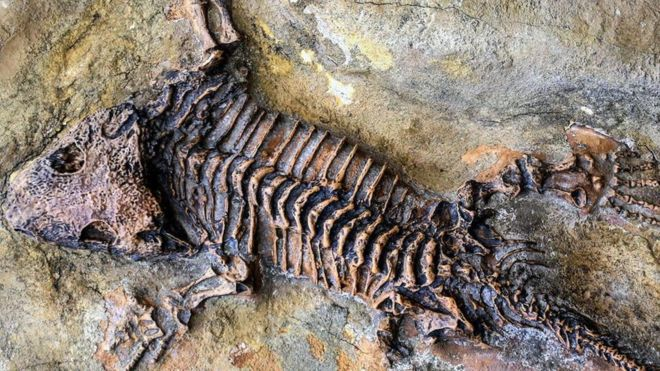
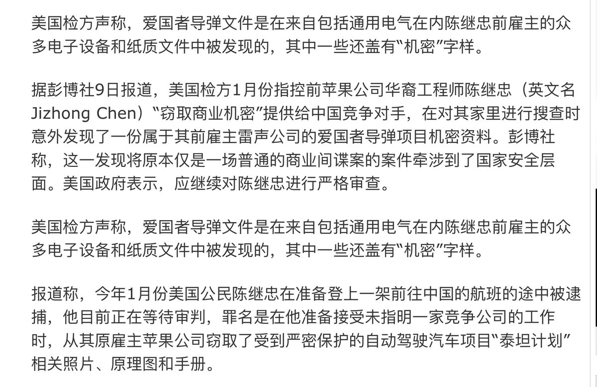
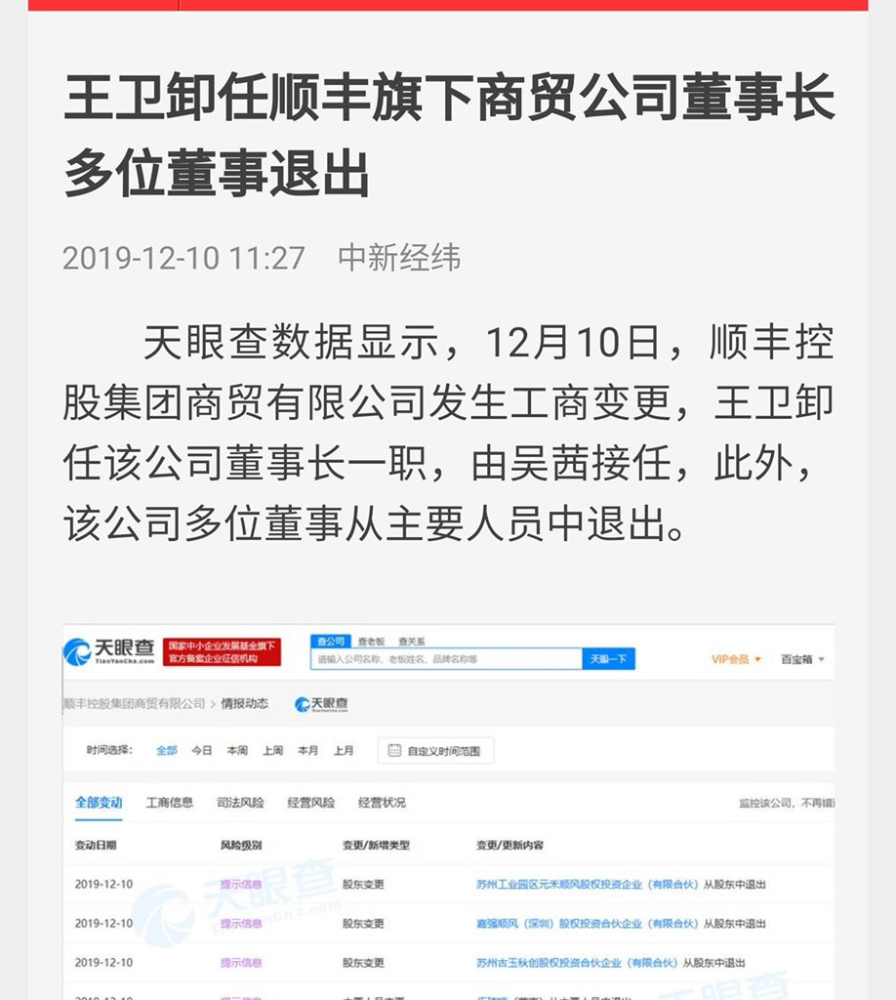
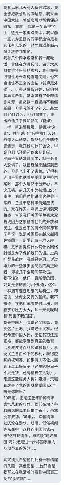

[12月12日 11:16]    纽约时报中文网   @nytchinese    香港的警方监察机构曾聘请外国专家来协助调查有关警察暴力行为的指控，但专家要求获得传唤证人、核实警方说法的权力，却遭到拒绝。
现在，这些专家因缺少实权而选择集体辞职。对期望加强调查可信度的港府而言，这无疑是一个打击。 http://nyti.ms/2PFcf4K   :speech_balloon:评:12 :+1:赞:39 :globe_with_meridians:转:24  

[12月12日 11:05]    BBC News 中文   @bbcchinese    从大选几点可以投票到为什么说这次大选对台湾“生死攸关”，请查收这份台湾选举说明书。 https://bbc.in/34dXAmk   :speech_balloon:评:11 :+1:赞:16 :globe_with_meridians:转:6  

[12月12日 10:33]    纽约时报中文网   @nytchinese    英国今日举行大选，现任首相鲍里斯·约翰逊和工党领袖杰里米·科尔宾将展开激烈角逐，投票结果将决定该国是否或如何退出欧盟。
约翰逊誓言将不惜无协议脱欧，科尔宾则希望该国就脱欧举行第二次公投。此外，国民医疗服务体系的未来也是大选关注的议题之一。
更多简报内容： http://nyti.ms/2rCclCp   :speech_balloon:评:2 :+1:赞:6 :globe_with_meridians:转:4  

[12月12日 10:05]    财经真相   @caijingxiang    美国农业部周三表示，中国买家订购了58.5万吨美国大豆，为八个多月来最大的一笔。
这是美国农业部自11月14日以来首次宣布向中国出售大豆，目前市场正在观望华盛顿是否会在12月15日对价值近1,600亿美元的中国消费品征收新一轮关税。 川普口中的中国行动！依旧是买买买！ https://twitter.com/ReutersCN/status/1204940443772952578 …  :speech_balloon:评:1 :+1:赞:35 :globe_with_meridians:转:4  

[12月12日 10:04]    纽约时报中文网   @nytchinese    早安！今日重点新闻包括：
英国举行大选；中国监禁记者人数全球最多；香港监警会外国专家组辞职；昂山素季否认缅甸对罗辛亚人实施种族灭绝；世界上最年轻的女总理是谁；沙特阿美成全球市值最高上市公司；AirPods Pro测评……NYT简报带你速览今日要闻。 http://nyti.ms/2rCclCp   :speech_balloon:评:9 :+1:赞:21 :globe_with_meridians:转:6  

[12月12日 10:03]    财经真相   @caijingxiang    香港恒生指数暴涨，港币涨破7.8000中间线，看样子北京这次又变卦了！  :speech_balloon:评:15 :+1:赞:64 :globe_with_meridians:转:9  

[12月12日 09:45]    新闻大吐槽   @TuCaoFakeNews    巧了，李洪元的罪如果没能洗清，也是十年左右的刑期，看来华为给自己员工的量刑是十年打底儿  :speech_balloon:评:0 :+1:赞:14 :globe_with_meridians:转:1  

[12月12日 09:20]    财经真相   @caijingxiang    当今世界几大主要央行都想加息而不能，美联储、欧洲、日本、瑞士是因通胀太低而不能；英国只要顺利脱欧就可以；加拿大、澳大利亚、新西兰三国经济主要是靠出口资源，但是国际大宗商品价格太低进而导致通胀低迷而无法加息；唯一的特例是天朝，却总想着降息，结果后路被一头猪给拱着了，通胀达到了4.5%！  :speech_balloon:评:4 :+1:赞:78 :globe_with_meridians:转:24  

[12月12日 09:00]    财经真相   @caijingxiang    鲍威尔说：“為了使利率上升，我希望看到持續的、顯著的通貨膨脹，在提高利率以解決通貨膨脹問題之前，通貨膨脹必須顯著且持續地上升。這是我的觀點。”这表明在通胀低迷的情况下，未来美联储“易降难升”，鲍威尔讲话期间，美元被加速抛售，隔夜黄金大涨。  :speech_balloon:评:2 :+1:赞:28 :globe_with_meridians:转:4  

[12月12日 08:56]    财经真相   @caijingxiang    美联储12月利率决议结束了，符合市场此前按兵不动的预期，这宣布了美元降息周期的暂停，根据利率点阵图显示，2020年美联储维持利率不变，17位美聯儲決策者中有13位預期利率不變，4位預期加息一次。而2021年和2022年各加息一次。也就是说未来美联储还要继续加息，然而市场认为却完全相反！  :speech_balloon:评:2 :+1:赞:63 :globe_with_meridians:转:12  

[12月12日 08:49]    BBC News 中文   @bbcchinese    阿美属于沙特国有资产，原油产量占世界总产量的十分之一，是全球盈利最丰的公司。 https://bbc.in/2LM82vc   :speech_balloon:评:8 :+1:赞:32 :globe_with_meridians:转:12  

[12月12日 08:23]    BBC News 中文   @bbcchinese    人们为什么对食辣如此热衷呢？ https://bbc.in/2PFLwFi   :speech_balloon:评:5 :+1:赞:16 :globe_with_meridians:转:8  

[12月12日 07:47]    BBC News 中文   @bbcchinese    在伦敦金融城里，像罗切斯特这样在办公室里熬通宵观察选举进展的并不在少数。 https://bbc.in/2YDEtBa   :speech_balloon:评:2 :+1:赞:9 :globe_with_meridians:转:5  

[12月12日 02:40]    老司机   @h5lpykl7tp6jjop    这才是真正大写的人  :speech_balloon:评:10 :+1:赞:225 :globe_with_meridians:转:96  

[12月11日 23:30]    BBC News 中文   @bbcchinese    1979年1月16日，伊朗巴列维王朝被推翻，国王被迫出走。巴列维铁腕统治伊朗长达37年，力图重振"大波斯帝国"。但是，失民意者失天下。
 https://bbc.in/2qGB0VU   :speech_balloon:评:19 :+1:赞:32 :globe_with_meridians:转:11  

[12月11日 22:59]    BBC News 中文   @bbcchinese    30年后年就没有巧克力了？最近有人指出，世界将面临严重的巧克力危机。此话从何说起？你有必要担心吗？
 https://bbc.in/2takXAN   :speech_balloon:评:11 :+1:赞:13 :globe_with_meridians:转:6  

[12月11日 22:30]    BBC News 中文   @bbcchinese    在地球上生活过的所有生物只有不到千分之一最终变成了化石保存下来，有一些方法能够增加你变成化石的概率。
 https://bbc.in/36tZbWH   :speech_balloon:评:2 :+1:赞:34 :globe_with_meridians:转:10  

[12月11日 22:10]    BBC News 中文   @bbcchinese    自古英雄出少年...... https://bbc.in/2RHF8Ag   :speech_balloon:评:106 :+1:赞:116 :globe_with_meridians:转:22  

[12月11日 21:59]    BBC News 中文   @bbcchinese    国际市场上石油价格骤跌产生了许多影响，其中之一便是，船只绕着非洲航行可能比穿过苏伊士运河更省钱。
 https://bbc.in/2E9GX0B   :speech_balloon:评:1 :+1:赞:21 :globe_with_meridians:转:5  

[12月11日 21:46]    BBC News 中文   @bbcchinese    大国关注 世界各大国都在关注投票后事态的发展 https://bbc.in/35ifVjS   :speech_balloon:评:1 :+1:赞:14 :globe_with_meridians:转:2  

[12月11日 20:59]    BBC News 中文   @bbcchinese    比利时男孩劳伦特·西蒙斯（Laurent Simons）的父母决定不让他读大学了，他原本希望创下9岁大学毕业的世界纪录。 https://bbc.in/2rp5zjr   :speech_balloon:评:6 :+1:赞:27 :globe_with_meridians:转:10  

[12月11日 20:30]    BBC News 中文   @bbcchinese    明天（12月12日）是英国大选投票日。来看一看有没有你不知道的。 https://bbc.in/2rzNvmF   :speech_balloon:评:6 :+1:赞:14 :globe_with_meridians:转:7  

[12月11日 20:16]    新闻大吐槽   @TuCaoFakeNews    据原华为工程师透露：华为鼓励员工互相举报！

有经理被举报后，被以贪污罪判10年，而李元洪却因举报经理被251，举报人和被举报人随机进监狱~ 

只有任正非稳坐泰山，做勉励状对高管说：“我还是信任你的，你看，这么多举报你的信都被我扣下了”！

和共党一样的恐惧管理  :speech_balloon:评:22 :+1:赞:364 :globe_with_meridians:转:185  

[12月11日 20:16]    新闻大吐槽   @TuCaoFakeNews    据原华为工程师透露：华为鼓励员工互相举报！

有经理被举报后，被以贪污罪判10年，而李元洪却因举报经理被251，举报人和被举报人随机进监狱~ 

只有任正非稳坐泰山，做勉励状对高管说：“我还是信任你的，你看，这么多举报你的信都被我扣下了”！

和共党一样的恐惧管理  :speech_balloon:评:22 :+1:赞:364 :globe_with_meridians:转:185  

[12月11日 20:00]    BBC News 中文   @bbcchinese    【中国熊猫外交的历史】熊猫由50年代开始就成为中国外交的重要工具。当时刚刚建政的毛泽东政府将熊猫赠送给当时的盟友北韩。自此之后，逐渐走出封闭的中国将熊猫仍为礼物送给西方国家。 https://bbc.in/2sbQAtd   :speech_balloon:评:14 :+1:赞:13 :globe_with_meridians:转:3  

[12月11日 19:44]    新闻大吐槽   @TuCaoFakeNews    据报导, 中国对美国出口已经连续第12个月下降，跌幅达23%，因此, 尽管川大爷签了香港人权法案, 中共仍然死乞白咧希望能达成贸易协议。

可是这脸皮也太厚了！此前无数对美帝的狠话硬话，都在事实的打击中抛之脑后~  :speech_balloon:评:4 :+1:赞:100 :globe_with_meridians:转:43  

[12月11日 19:44]    新闻大吐槽   @TuCaoFakeNews    据报导, 中国对美国出口已经连续第12个月下降，跌幅达23%，因此, 尽管川大爷签了香港人权法案, 中共仍然死乞白咧希望能达成贸易协议。

可是这脸皮也太厚了！此前无数对美帝的狠话硬话，都在事实的打击中抛之脑后~  :speech_balloon:评:4 :+1:赞:100 :globe_with_meridians:转:43  

[12月11日 19:33]    纽约时报中文网   @nytchinese    新西兰长期以来将自己标榜为一个可以让游客与危险共舞的地方。怀特岛的游览项目恰好印证了这个说法。
但最终应该由谁来负责确保游客安全？是拥有这个偏远小岛的家族，还是负责执行健康与安全法规的政府？ http://nyti.ms/34a0Fnx   :speech_balloon:评:1 :+1:赞:8 :globe_with_meridians:转:0  

[12月11日 19:31]    BBC News 中文   @bbcchinese    特朗普当选后，不满世贸组织让其在应对中国时束手束脚。现在WTO的“最高法院”瘫痪，四天后中美间新一轮关税将生效，战火纷飞的贸易战会继续升级吗？ https://bbc.in/2RGTYXq   :speech_balloon:评:41 :+1:赞:229 :globe_with_meridians:转:76  

[12月11日 19:31]    新闻大吐槽   @TuCaoFakeNews    不过是一只叮在裸体皇帝屁股上吸脓的“发炎蝇”，竟然想挑战安徒生童话！我希望你有点自知之明！  :speech_balloon:评:77 :+1:赞:385 :globe_with_meridians:转:129  

[12月11日 19:21]    新闻大吐槽   @TuCaoFakeNews    今天，港共在9月初才聘用的5名监警会国际专家发出声明，宣布辞职，他们认为监警会的权力、能力和独立调查力存在明显的缺陷，无法再干下去！

这又是港共和中共学的套路：花大价钱收买国际花瓶，没想到有良心的人不爱财，人家撂挑子不干了！  :speech_balloon:评:8 :+1:赞:495 :globe_with_meridians:转:208  

[12月11日 19:21]    新闻大吐槽   @TuCaoFakeNews    今天，港共在9月初才聘用的5名监警会国际专家发出声明，宣布辞职，他们认为监警会的权力、能力和独立调查力存在明显的缺陷，无法再干下去！

这又是港共和中共学的套路：花大价钱收买国际花瓶，没想到有良心的人不爱财，人家撂挑子不干了！  :speech_balloon:评:8 :+1:赞:495 :globe_with_meridians:转:208  

[12月11日 19:14]    新闻大吐槽   @TuCaoFakeNews    香港民主党前主席刘慧卿认为：习中央误判香港形势是受中联办误导！ 

宣传机构将上街抗争的年青人说成是买不起房的「废青」，也都是有意为之！

嗯！看来管文宣的和管情报的在合伙涮一尊  :speech_balloon:评:60 :+1:赞:353 :globe_with_meridians:转:136  

[12月11日 19:14]    新闻大吐槽   @TuCaoFakeNews    香港民主党前主席刘慧卿认为：习中央误判香港形势是受中联办误导！ 

宣传机构将上街抗争的年青人说成是买不起房的「废青」，也都是有意为之！

嗯！看来管文宣的和管情报的在合伙涮一尊  :speech_balloon:评:60 :+1:赞:353 :globe_with_meridians:转:136  

[12月11日 19:03]    BBC News 中文   @bbcchinese    香港泛民主派认为，事件再次显示现行机制无法有效对警察进行调查，但建制派认为这些专家若有不满应“更早提出”。 https://bbc.in/2LImmVy   :speech_balloon:评:22 :+1:赞:45 :globe_with_meridians:转:18  

[12月11日 19:01]    纽约时报中文网   @nytchinese    保护记者委员会表示，在习近平“对媒体实行越来越严格的管控”之下，中国今年至少有48名记者被监禁，比2018年增加了一人。
新疆的镇压行动导致“数十名记者”被捕，其中包括一些因多年前的报道而被监禁的人。 http://nyti.ms/36s6Yoi   :speech_balloon:评:10 :+1:赞:28 :globe_with_meridians:转:13  

[12月11日 19:00]    老司机   @h5lpykl7tp6jjop    随感  :speech_balloon:评:3 :+1:赞:30 :globe_with_meridians:转:6  

[12月11日 18:43]    老司机   @h5lpykl7tp6jjop    非常珍贵的文物，终于被发掘出土了。
好像是江泽民和朱镕基以国家的名义作出的承诺。 https://twitter.com/zhu0588/status/1204640709837344768 …  :speech_balloon:评:54 :+1:赞:859 :globe_with_meridians:转:499  

[12月11日 18:30]    纽约时报中文网   @nytchinese    尽管科学家们近期一再预警，怀特岛的火山活动将增加，但游客们仍被允许走到该岛附近，甚至观测中心的火山口。
周一的火山喷发导致至少六人死亡。截至周二下午，据信又有八人死亡，紧急救援人员至今无法抵达营救。灾难过后，人们开始反思：究竟谁该对游客的安全负责？ http://nyti.ms/34a0Fnx   :speech_balloon:评:2 :+1:赞:26 :globe_with_meridians:转:10  

[12月11日 18:00]    BBC News 中文   @bbcchinese    2018年12月10日，前加拿大外交官康明凯和商人斯帕弗被拘留。中国指控两人从事间谍活动。事件已经过去一年，他们的境况如何？ https://bbc.in/36piyjW   :speech_balloon:评:40 :+1:赞:113 :globe_with_meridians:转:38  

[12月11日 18:00]    纽约时报中文网   @nytchinese    保护记者委员会调查发现，全球2019年至少有250名记者遭到监禁。中国首次超越土耳其，成为监禁新闻工作者人数最多的国家；沙特阿拉伯和埃及并列第三。
该组织称，中国主席习近平、土耳其总统埃尔多安、沙特王储萨勒曼和埃及总统塞西均“未表现出放松批判性媒体管制的迹象”。 http://nyti.ms/36s6Yoi   :speech_balloon:评:57 :+1:赞:408 :globe_with_meridians:转:198  

[12月11日 17:30]    纽约时报中文网   @nytchinese    如果确认生效，美国的征税范围将扩大到几乎所有从中国进口的商品，包括玩具、智能手机和其他电子产品。
加征的关税会给消费者带来压力，并可能成为即将竞选连任的特朗普的政治累赘。商业团体对进一步征税非常担忧。 http://nyti.ms/349eRNC   :speech_balloon:评:12 :+1:赞:14 :globe_with_meridians:转:1  

[12月11日 17:00]    纽约时报中文网   @nytchinese    众议院司法委员会可能将在周四前对相关指控进行辩论并投票表决。如果众议院在下周圣诞节到来之前数天如期通过投票，特朗普可能在新年年初在参议院受审。
特朗普对民主党的弹劾条款做出了愤怒回应，他在Twitter上宣称民主党指控其向乌克兰施压的说法“荒唐“。 http://nyti.ms/36lXj2n   :speech_balloon:评:5 :+1:赞:6 :globe_with_meridians:转:2  

[12月11日 16:45]    纽约时报中文网   @nytchinese    对中国商品征收的新关税将于周日生效，美国会再次作出推迟决定吗？
目前来看，特朗普政府就此事释放出了含糊的信号。虽然美国官员们公开暗示推迟关税的可能性，但知情人士表示，特朗普仍未作出最终决定。 http://nyti.ms/349eRNC   :speech_balloon:评:8 :+1:赞:38 :globe_with_meridians:转:18  

[12月11日 16:30]    纽约时报中文网   @nytchinese    像they这样的实用性词语获得搜索热潮并不常见。它可能反映出人们对越来越多使用非二元人群的代词产生的好奇和困惑。
韦氏词典的总编辑表示，公众对词汇的兴趣通常是由重大新闻事件驱动的。今年的其他候选单词quid pro quo（交换条件）和impeachment（弹劾）就是如此。 http://nyti.ms/2YAHXnY   :speech_balloon:评:2 :+1:赞:6 :globe_with_meridians:转:2  

[12月11日 16:01]    BBC News 中文   @bbcchinese    如果在海边见到这个场景，你还敢下水吗？  :speech_balloon:评:37 :+1:赞:150 :globe_with_meridians:转:73  

[12月11日 15:46]    纽约时报中文网   @nytchinese    众议院民主党领袖周二正式呼吁特朗普总统下台，并在两项弹劾条款中指控他滥用职权、妨碍国会调查，称其“无视并损害国家利益”。
白宫指责民主党“捏造”调查。这引发了极具党派色彩的历史性宪法冲突，或将加剧美国的分裂。 http://nyti.ms/36lXj2n   :speech_balloon:评:6 :+1:赞:22 :globe_with_meridians:转:5  

[12月11日 15:03]    BBC News 中文   @bbcchinese    “男孩子跟我在一起也只是想玩一玩……我不配活在这个世界上。”救援队迅速判断女生可能遇到了情感问题，从而阻止一场自杀发生。 https://bbc.in/2E8bWdD   :speech_balloon:评:10 :+1:赞:46 :globe_with_meridians:转:12  

[12月11日 15:00]    纽约时报中文网   @nytchinese    #转折点 2019年首次发生的事情还包括：
中国进行史上首次月球背面着陆、世界上最大的飞机首航、英国女王首发ins、在世艺术家作品拍卖纪录被打破、在日本和加拿大发现新的恐龙物种、沙特阿拉伯开放旅游业、两名女性进行历史性太空行走。 http://nyti.ms/2PAtZ1g   :speech_balloon:评:0 :+1:赞:9 :globe_with_meridians:转:1  

[12月11日 14:33]    新闻大吐槽   @TuCaoFakeNews    当事人妻子遭遇丈夫物理掩埋后的信息掩埋！

估计共党肯定在开发能让人失忆的技术，这样就可以永远把韭菜割下去 https://twitter.com/big_ear_cat/status/1204133599475372033 …  :speech_balloon:评:21 :+1:赞:211 :globe_with_meridians:转:115  

[12月11日 14:33]    新闻大吐槽   @TuCaoFakeNews    当事人妻子遭遇丈夫物理掩埋后的信息掩埋！

估计共党肯定在开发能让人失忆的技术，这样就可以永远把韭菜割下去 https://twitter.com/big_ear_cat/status/1204133599475372033 …  :speech_balloon:评:21 :+1:赞:211 :globe_with_meridians:转:115  

[12月11日 14:30]    纽约时报中文网   @nytchinese    周二，韦氏词典宣布人称代词they（他们/她们）为年度词汇，这标志着越来越多人使用这个古老的复数人称代词，来指代性别认同非二元的个人。
该词典称，年度词汇是基于数据选出的：2019年，韦氏词典网站和应用程序中，they的词义搜索量比去年增加了313％。 http://nyti.ms/2YAHXnY   :speech_balloon:评:2 :+1:赞:38 :globe_with_meridians:转:13  

[12月11日 14:02]    BBC News 中文   @bbcchinese    一个香港民间组织于国际人权日晚上，在金钟“连侬墙”集会。  :speech_balloon:评:23 :+1:赞:57 :globe_with_meridians:转:15  

[12月11日 13:53]    老司机   @h5lpykl7tp6jjop    北朝鲜眼中的美国，太惨了！  :speech_balloon:评:1 :+1:赞:22 :globe_with_meridians:转:9  

[12月11日 13:51]    老司机   @h5lpykl7tp6jjop    转发  :speech_balloon:评:1 :+1:赞:38 :globe_with_meridians:转:22  

[12月11日 13:49]    老司机   @h5lpykl7tp6jjop    转发好图  :speech_balloon:评:1 :+1:赞:15 :globe_with_meridians:转:5  

[12月11日 13:25]    纽约时报中文网   @nytchinese    #转折点 中国发现稀有白化病熊猫、美国首次向中国出售大米、天文学家发布第一张黑洞影像、人脸识别软件首次被禁、初次观察到猪对工具的使用.....2019年有哪些历史上首次发生的事？
本文来自“转折点”栏目，这一特别版块探讨了今年一些可能对未来产生影响的关键时刻。 http://nyti.ms/2PAtZ1g   :speech_balloon:评:9 :+1:赞:47 :globe_with_meridians:转:11  

[12月11日 13:01]    BBC News 中文   @bbcchinese    快来跟这对熊猫双胞胎宝宝打声招呼！  :speech_balloon:评:18 :+1:赞:65 :globe_with_meridians:转:10  

[12月11日 13:01]    纽约时报中文网   @nytchinese    #每日一词 Dotard，老糊涂。朝鲜高级官员金英哲周一把特朗普称作“失去耐心的老头”，并说可能将不得不再次称其为“老糊涂”(dotard)。
时报记者王霜舟@austinramzy 曾在报道中提到，朝鲜之所以使用dotard这个老旧晦涩的词语，是因为朝中社翻译文稿时用的是非常旧的朝英词典。 http://nyti.ms/2sYgRvd   :speech_balloon:评:0 :+1:赞:10 :globe_with_meridians:转:1  

[12月11日 12:30]    纽约时报中文网   @nytchinese    为抗议《凡尔赛和约》，凯恩斯辞去政府职务，随后著书写道：重建广义的经济秩序，而不是短视地施加报复，才是当务之急。
他认为，把“摧毁性的负担”强加于战败的协约国，将“威胁到所有国家的金融稳定”，并成为“国际摩擦的持续来源”。 http://nyti.ms/2YAFcDa   :speech_balloon:评:0 :+1:赞:29 :globe_with_meridians:转:11  

[12月11日 12:02]    纽约时报中文网   @nytchinese    “为什么我们必须脚痛着工作？“日本职场女性开始对高跟鞋说不。
日本模特、演员及自由撰稿人石川优美在社交媒体上发起了#KuToo 运动（其中“Ku”取自日语“kutsu”[鞋子]与“kutsuu”[痛苦]的首音节），抗议要求女性在工作场合穿高跟鞋的着装规范，并向政府部门发起联署请愿。 http://nyti.ms/2sYgRvd   :speech_balloon:评:1 :+1:赞:13 :globe_with_meridians:转:4  

[12月11日 11:39]    纽约时报中文网   @nytchinese    #观点 1919年，凯恩斯对《凡尔赛和约》之下欧洲政治和经济秩序的脆弱性发出了警告，认为迫使德国陷入本质上的奴役状态将播下危险的种子。
这位当时相对无名的英国财政部官员是如何预见纳粹德国崛起的？ http://nyti.ms/2YAFcDa   :speech_balloon:评:11 :+1:赞:164 :globe_with_meridians:转:80  

[12月11日 11:13]    老司机   @h5lpykl7tp6jjop    转发好图  :speech_balloon:评:1 :+1:赞:36 :globe_with_meridians:转:23  

[12月11日 11:12]    老司机   @h5lpykl7tp6jjop    被控窃密的前苹果华裔工程师 家中又搜出导弹机密文件  :speech_balloon:评:3 :+1:赞:28 :globe_with_meridians:转:20  

[12月11日 11:01]    纽约时报中文网   @nytchinese    印度计划通过首部数据隐私法，加大对数据收集的控制力度。此举将迫使像Amazon和Facebook这样的公司对使用个人信息寻求明确的许可。
但该法案将减少政府使用个人数据的限制，比如国家身份证系统中包括的指纹和虹膜扫描。印度对互联网的严格监管正愈发向中国靠拢。 http://nyti.ms/2sYgRvd   :speech_balloon:评:5 :+1:赞:9 :globe_with_meridians:转:1  

[12月11日 10:29]    老司机   @h5lpykl7tp6jjop    有个财主儿子继承了家业，生怕别人不知道他有钱，到处乱花，脾气又拧，一天走进古玩店，大不咧咧拿起一把名人字画扇就乱搧，店主说这扇名贵不好搧风用的，谁知这家伙一把撕成两半，还把店家所有字画扇拿起来全撕了，赔了许多钱也无所谓，后来又和另外大财主对赌把家产输了个精光！和当今那位二货很像！  :speech_balloon:评:6 :+1:赞:86 :globe_with_meridians:转:16  

[12月11日 10:10]    财经真相   @caijingxiang    华为心声社区在12月9日晚间刊发华为创始人任正非接受加拿大媒体《环球邮报》的采访纪要。任正非在采访中表示，华为美国研发中心将逐步迁往加拿大，目前加拿大员工人数达1200人，其中三分之二是研发人员。  :speech_balloon:评:11 :+1:赞:92 :globe_with_meridians:转:13  

[12月11日 10:00]    财经真相   @caijingxiang    WTO今天开始名存实亡！  :speech_balloon:评:79 :+1:赞:1302 :globe_with_meridians:转:219  

[12月11日 09:04]    财经真相   @caijingxiang    纳瓦罗的警告，没有迹象表明关税回被推迟！ https://twitter.com/zerohedge/status/1204564513263161349 …  :speech_balloon:评:23 :+1:赞:267 :globe_with_meridians:转:74  

[12月11日 07:03]    老司机   @h5lpykl7tp6jjop    中国CPI“惊人一跃”意味着什么?你将越来越穷！
11月的居民消费价格（CPI）和工业生产者出厂价格（PPI）。
其中CPI的同比涨幅出现了“惊人一跃”，达到了4.5%，创下了自2012年1月以来的新高。
一方面，是猪价上升不断推高的结构性通胀，一方面，是工业品价格仍没能走出的通缩，CPI、PPI剪刀差在扩大。  :speech_balloon:评:1 :+1:赞:15 :globe_with_meridians:转:8  

[12月11日 05:13]    老司机   @h5lpykl7tp6jjop    爱国歌曲大赛，《我和我的祖国一刻也不能分割》竟然没有获得前三名，据说经过嬷嬷亲点，第一名是《我真的还想再活五百年》，明白了没有？连主子的心思都不知道，你们这群蠢奴才！  :speech_balloon:评:7 :+1:赞:75 :globe_with_meridians:转:12  

[12月11日 03:53]    老司机   @h5lpykl7tp6jjop    成都養老金分配不公，退休老人去政府抗議，被當地公安強行抬走。
這一幕似曾相識，往事歷歷在目。
你們的冷眼旁觀助長了公安的囂張，總有一天會輪到每一隻牲人。  :speech_balloon:评:35 :+1:赞:458 :globe_with_meridians:转:280  

[12月11日 01:34]    老司机   @h5lpykl7tp6jjop    老眼昏花，应该是＂超＂出你的想象，＂活＂着也点成＂话＂了，报歉。  :speech_balloon:评:2 :+1:赞:26 :globe_with_meridians:转:0  

[12月11日 01:25]    老司机   @h5lpykl7tp6jjop    共产党官员的无耻起出你的想象，我父亲是现今还话着参加了台儿庄大战的抗战老兵，102岁，身上有五处枪伤，因此成历史反革命被关押二十三年，至今无医保社保，民间关注老兵人士责问有关部门为何不执行国军抗战老兵统一待遇政策，竟答复说无法证明这些枪伤是日本人打的！难道要开枪的皇军从阴间写证明吗  :speech_balloon:评:106 :+1:赞:937 :globe_with_meridians:转:362  

[12月11日 00:16]    新闻大吐槽   @TuCaoFakeNews    大裤衩董倩专访何君尧！

两人都是臭名昭著，董因为逼709良心律师电视认罪，曾被国际组织提议制裁！而何刚被英国母校撸了博士学位！

丑角抱团言论更雷人，何说自己胸口留下的是L形伤疤，代表着Love！

想把穿帮闹剧强行升级成爱国神剧？高级黑！建议董倩立即电视认罪伺候  :speech_balloon:评:53 :+1:赞:320 :globe_with_meridians:转:106  

[12月11日 00:16]    新闻大吐槽   @TuCaoFakeNews    大裤衩董倩专访何君尧！

两人都是臭名昭著，董因为逼709良心律师电视认罪，曾被国际组织提议制裁！而何刚被英国母校撸了博士学位！

丑角抱团言论更雷人，何说自己胸口留下的是L形伤疤，代表着Love！

想把穿帮闹剧强行升级成爱国神剧？高级黑！建议董倩立即电视认罪伺候  :speech_balloon:评:53 :+1:赞:320 :globe_with_meridians:转:106  

[12月10日 23:49]    新闻大吐槽   @TuCaoFakeNews    中共将清除电脑中所有美国技术。

美国专家表示，那我们不买联想电脑！
完了，联想真要变成连想都别想了！黑心商贩总想用地沟油替代食用油！

即将投票的美墨加协议，鼓励原产地优先，如通过，将会把中国产品赶出北美市场，同时把更多产业从中国转移到墨西哥和加拿大！  :speech_balloon:评:28 :+1:赞:642 :globe_with_meridians:转:257  

[12月10日 23:49]    新闻大吐槽   @TuCaoFakeNews    中共将清除电脑中所有美国技术。

美国专家表示，那我们不买联想电脑！
完了，联想真要变成连想都别想了！黑心商贩总想用地沟油替代食用油！

即将投票的美墨加协议，鼓励原产地优先，如通过，将会把中国产品赶出北美市场，同时把更多产业从中国转移到墨西哥和加拿大！  :speech_balloon:评:28 :+1:赞:642 :globe_with_meridians:转:257  

[12月10日 22:10]    墙国铁拳现世报😷   @Socialistfist    “警察说要对我用喷雾剂了”

#社会主义铁拳  :speech_balloon:评:42 :+1:赞:738 :globe_with_meridians:转:173  

[12月10日 21:36]    财经真相   @caijingxiang    中美12月关税被推迟! https://twitter.com/zerohedge/status/1204393850766266373 …  :speech_balloon:评:72 :+1:赞:105 :globe_with_meridians:转:27  

[12月10日 19:14]    老司机   @h5lpykl7tp6jjop    转发好图  :speech_balloon:评:1 :+1:赞:59 :globe_with_meridians:转:33  

[12月10日 19:09]    老司机   @h5lpykl7tp6jjop    螳螂捕蝉黄雀在后，偷上加偷，盗后再盗，乱作一团！没治了！  :speech_balloon:评:5 :+1:赞:57 :globe_with_meridians:转:30  

[12月10日 17:46]    新闻大吐槽   @TuCaoFakeNews    象形文字  :speech_balloon:评:7 :+1:赞:176 :globe_with_meridians:转:53  

[12月10日 17:46]    新闻大吐槽   @TuCaoFakeNews    象形文字  :speech_balloon:评:7 :+1:赞:176 :globe_with_meridians:转:53  

[12月10日 17:13]    财经真相   @caijingxiang    下一位！  :speech_balloon:评:58 :+1:赞:656 :globe_with_meridians:转:274  

[12月10日 16:20]    老司机   @h5lpykl7tp6jjop    看看近半个世纪前七十年代的报纸，今天的中共有改变吗？  :speech_balloon:评:22 :+1:赞:335 :globe_with_meridians:转:159  

[12月10日 14:10]    财经真相   @caijingxiang    真的又去了？ https://twitter.com/meiyangyang888/status/1204264118045143040 …  :speech_balloon:评:13 :+1:赞:48 :globe_with_meridians:转:7  

[12月10日 12:15]    老司机   @h5lpykl7tp6jjop    宁让俄国骗得傻笑，也不和美国同一条道。从俄国进口高价几倍的石油和天然气，从南美进贵过美国的大豆就是不买美国货，中共从来只算政治账不算经济帐！  :speech_balloon:评:8 :+1:赞:47 :globe_with_meridians:转:15  

[12月10日 10:58]    财经真相   @caijingxiang    北京时间10:00点北京附近一氧化碳污染达浓度到4965ppbv，同一时间华盛顿为529ppbv，中国一氧化碳污染是全世界最高的，华北京津冀已经变成世界癌症地区!  :speech_balloon:评:107 :+1:赞:1379 :globe_with_meridians:转:701  

[12月10日 10:39]    财经真相   @caijingxiang    美国农业部长珀杜(Sonny Perdue)周一表示，美国总统特朗普并不想在12月15日对中国输美商品实施下一轮预定关税措施，但希望中国能采取“行动”避免关税实施。 https://twitter.com/ReutersCN/status/1204224553930674176 …  :speech_balloon:评:16 :+1:赞:94 :globe_with_meridians:转:12  

[12月10日 09:50]    财经真相   @caijingxiang    路透社：美国出口商称，中国进口商周一购买了至少五艘将于1月和2月付运的大豆船货，规模约30万吨。此前，北京方面开展部分大豆、猪肉等商品排除工作，对排除范围内商品，给予关税豁免，涉及商品规模至少达到100万吨。新闻要连在一起来看才能得到真相，进口猪肉和农产品，已经不是为了贸易谈判这么简单  :speech_balloon:评:11 :+1:赞:145 :globe_with_meridians:转:38  

[12月10日 09:38]    财经真相   @caijingxiang    从同比看，CPI上涨4.5%，涨幅比上月扩大0.7个百分点。其中，食品价格上涨19.1%，影响CPI上涨约3.72个百分点；非食品价格上涨1.0%，影响CPI上涨约0.77个百分点。猪肉价格同比上涨110.2%，影响CPI上涨约2.64个百分点。 一头发疯的猪，硬是把党国的江山搞的风雨飘摇！  :speech_balloon:评:5 :+1:赞:127 :globe_with_meridians:转:24  

[12月10日 09:36]    财经真相   @caijingxiang    快讯：11月中国CPI年率为4.5%，超过此前市场预期4.2%，其中，城市上涨4.2%，农村上涨5.5%；食品价格上涨19.1%，非食品价格上涨1.0%；消费品价格上涨6.5%，服务价格上涨1.2%。1­­—11月平均，全国居民消费价格比去年同期上涨2.8%。现在是先稳住城市，农村看样子要放弃了，不急还有两个月农民就回老家了  :speech_balloon:评:9 :+1:赞:270 :globe_with_meridians:转:100  

[12月10日 04:26]    老司机   @h5lpykl7tp6jjop    @刘虎三十 
网友批评新华社：不为穷人呼吁免费医疗，却号召没钱看不起病的人死了捐钱捐遗体，新华社要多无耻有多无耻！  :speech_balloon:评:18 :+1:赞:365 :globe_with_meridians:转:204  

[12月10日 02:24]    墙国铁拳现世报😷   @Socialistfist    不了解铁拳的老朋友兔兔是谁的请看这里 https://twitter.com/Socialistfist/status/1175057744858161159?s=19 …  :speech_balloon:评:7 :+1:赞:85 :globe_with_meridians:转:17  

[12月10日 02:15]    墙国铁拳现世报😷   @Socialistfist    另外点名批评的还有新加坡人李连杰和我们的老朋友兔兔 @zzyyzoe 最喜爱的  加拿大人吴亦凡  :speech_balloon:评:9 :+1:赞:137 :globe_with_meridians:转:17  

[12月10日 02:13]    墙国铁拳现世报😷   @Socialistfist    美籍刘亦菲一直以来就因为其国籍问题在墙国招致非议。在今年8月14日微博撑港警后让不少粉红对她国籍的质疑消停不少。没过多久，鹤岗网警就在12月5日发短片手撕刘亦菲
为了同时拥有人民币和美国护照，真乃里外不是人
#社会主义铁拳  :speech_balloon:评:28 :+1:赞:399 :globe_with_meridians:转:112  

[12月10日 00:04]    财经真相   @caijingxiang    深圳特区报：8号在华为全球旗舰店·深圳万象天地店，华为消费者业务软件部总裁王成录在“HUAWEI Talk主题分享”会中为现场观众带来了一场关于EMUI10的公开课。他透露，明年华为除了手机、平板和电脑，其他终端产品将全线搭载鸿蒙系统，并在海内外同步推进；鸿蒙系统的全面开源也将在明年8月正式开放。  :speech_balloon:评:61 :+1:赞:211 :globe_with_meridians:转:38  

[12月09日 23:19]    财经真相   @caijingxiang    金融界今天都在纪念保罗沃克尔，里根与卡特时期的美联储主席，美国杰出的经济学家，更是金融领域教科书级别的大神，其著名的沃克法则就是以他的名字命名的 https://twitter.com/NBCNews/status/1204056999534706690 …  :speech_balloon:评:0 :+1:赞:74 :globe_with_meridians:转:20  

[12月09日 23:00]    财经真相   @caijingxiang    现在市场最大的预期就是继续延后12月15号的关税，如果是这样的结果，人民币小幅上涨后继续围绕7震荡，如果谈判失败就会跌破7.2关口！ https://twitter.com/reuterscn/status/1203967838815490048 …  :speech_balloon:评:18 :+1:赞:130 :globe_with_meridians:转:34  

[12月09日 20:19]    新闻大吐槽   @TuCaoFakeNews    上次说实话被华为威胁，这次说实话，又被华为水军攻击，马来西亚小哥跟华为杠上了！

他在Mate30Pro上用偏门方法安装谷歌套件后，发现Mcdonald与Netflix的app还是不能用，于是他在论坛发帖阐明事实，结果华为水军群起攻之，版主还删他帖~

不过幸好马来西亚没有251，他还可以继续在网上和华为水军战斗  :speech_balloon:评:63 :+1:赞:1675 :globe_with_meridians:转:633  

[12月09日 15:36]    老司机   @h5lpykl7tp6jjop    很久之前的视频了。里面把公权力与腐败问题讲的很清楚了。现在的墙国已经没有这种声音了。  :speech_balloon:评:30 :+1:赞:674 :globe_with_meridians:转:363  

[12月09日 14:14]    财经真相   @caijingxiang    零对冲开始报道中国的加密货币计划是针对美元体系的“珍珠港” https://twitter.com/zerohedge/status/1203917193634877440 …  :speech_balloon:评:13 :+1:赞:231 :globe_with_meridians:转:100  

[12月09日 09:57]    墙国铁拳现世报😷   @Socialistfist    孙夕庆博士已申请“开庭次数最多的刑事案件”的吉尼斯纪录，并已被受理。
小编为孙博士在遇到如此不公后还能保留如此幽默感点赞  :speech_balloon:评:6 :+1:赞:411 :globe_with_meridians:转:87  

[12月09日 09:47]    墙国铁拳现世报😷   @Socialistfist    2014年，两位清华留美博士，都选择回国创业报效国家。
一位是在2015年被羁押就已经长达17个月并再无下文的“千人计划”专家 李港
另一位是被羁押1277天并经历114次庭审的孙夕庆。
#社会主义铁拳  :speech_balloon:评:72 :+1:赞:844 :globe_with_meridians:转:361  

[12月09日 03:56]    凡賽堤/FORSETI   @FecharCCP    12.08國際人權日！  

百萬人以上的香港人展現出人類文明史上最和平，最文明，最理性，最有創意的方式向全世界發出最強的聲音！

香港人用行動向全世界，全人類證明了香港人是最民主的中華族群！

願榮光歸香港！祝福香港人！天佑香港人！

注，感謝大紀元的最前線視頻！  :speech_balloon:评:24 :+1:赞:738 :globe_with_meridians:转:368  

[12月09日 03:22]    凡賽堤/FORSETI   @FecharCCP    12.08國際人權日！  

人類文明史上最震撼的民主訴求盡在香港！

百萬人以上的香港人用最和平，最文明，最有創意的方式向全世界發出最強的聲音！

五大訴求，缺一不可！ 

願榮光歸香港！  :speech_balloon:评:1 :+1:赞:18 :globe_with_meridians:转:7  

[12月09日 03:16]    凡賽堤/FORSETI   @FecharCCP    12.08國際人權日！  

百萬人以上的香港人用最和平，最文明，最有創意的方式向全世界發出最強的聲音！

五大訴求，缺一不可！ 

願榮光歸香港！  :speech_balloon:评:4 :+1:赞:44 :globe_with_meridians:转:23  

[12月09日 03:13]    凡賽堤/FORSETI   @FecharCCP    12.08國際人權日！  願榮光歸香港！

百萬人以上的香港人用最和平，最文明，最有創意的方式向全世界發出最強的聲音！  :speech_balloon:评:1 :+1:赞:29 :globe_with_meridians:转:15  

[12月09日 03:11]    凡賽堤/FORSETI   @FecharCCP    12.08國際人權日！ 

百萬人以上的香港人向全世界發出最強的聲音！

願榮光歸香港！  :speech_balloon:评:2 :+1:赞:6 :globe_with_meridians:转:4  

[12月09日 02:49]    凡賽堤/FORSETI   @FecharCCP    12.08國際人權日！ 

百萬人以上的香港人向全世界發出最強的聲音！

願榮光歸香港！香港人是全世界華人的最好的歷史鏡子！

願CCP和所有盜國賊以及無知腦殘五毛粉在正義的歌聲中回到馬克思身邊！

願聽到香港人正義歌聲的大陸懦夫們站出來！  :speech_balloon:评:0 :+1:赞:12 :globe_with_meridians:转:4  

[12月09日 02:43]    凡賽堤/FORSETI   @FecharCCP    12.08國際人權日！
 百萬人以上的香港人向全世界發出最強的聲音！

香港人-中華民族的驕傲！  :speech_balloon:评:2 :+1:赞:32 :globe_with_meridians:转:13  

[12月09日 02:38]    凡賽堤/FORSETI   @FecharCCP    12.08國際人權日！ 百萬人以上的香港人向全世界發出最強的聲音！

全人類最文明最民主的香港族群，香港人是中華民族的民主典範！  :speech_balloon:评:0 :+1:赞:12 :globe_with_meridians:转:4  

[12月09日 02:38]    凡賽堤/FORSETI   @FecharCCP    全人類最文明最民主的香港族群，香港人是中華民族的民主典範！  :speech_balloon:评:2 :+1:赞:17 :globe_with_meridians:转:10  

[12月09日 01:21]    墙国铁拳现世报😷   @Socialistfist    高级黑还是低级红？  :speech_balloon:评:12 :+1:赞:58 :globe_with_meridians:转:5  

[12月09日 01:20]    墙国铁拳现世报😷   @Socialistfist    民主铁拳现世报是高级黑还是低级红？
请您参与投票！  :speech_balloon:评:43 :+1:赞:231 :globe_with_meridians:转:25  

[12月08日 16:16]    新闻大吐槽   @TuCaoFakeNews    口号声震天，楼宇都在颤抖！
还要展现多少次压倒性的民意，愚蠢的当政者才能醒悟？  :speech_balloon:评:130 :+1:赞:3316 :globe_with_meridians:转:1429  

[12月07日 02:58]    墙国铁拳现世报😷   @Socialistfist    如果您对本推内容有什么想说的并且希望被匿名看到，可以私信小编！
这两位推友如果互相欣赏彼此观点，小编可以介绍认识  :speech_balloon:评:4 :+1:赞:42 :globe_with_meridians:转:1  

[12月07日 02:55]    墙国铁拳现世报😷   @Socialistfist    推友们大家好，首先必须承认最近铁拳推没有之前的数量和质量，向各位关注本推的推友致歉。
再次感谢大家的投稿，如果您的投稿符合本推的投稿标准，小编会陆续给您安排发布
受之前 #现世报读者来信 启发而创立的新系列，这次刊登两位年纪相仿中港的推友对墙内现象的感言，小编认为这样的交流很有意义。  :speech_balloon:评:27 :+1:赞:271 :globe_with_meridians:转:40  

[12月06日 23:15]    墙国铁拳现世报😷   @Socialistfist    有感而发  :speech_balloon:评:4 :+1:赞:210 :globe_with_meridians:转:11  

[12月06日 21:21]    墙国铁拳现世报😷   @Socialistfist    滋磁！ https://twitter.com/minzhutiequan/status/1202745105754419200 …  :speech_balloon:评:36 :+1:赞:224 :globe_with_meridians:转:21  

[12月05日 22:24]    墙国铁拳现世报😷   @Socialistfist    推特魔幻剧场  :speech_balloon:评:15 :+1:赞:133 :globe_with_meridians:转:11  

[12月05日 22:16]    墙国铁拳现世报😷   @Socialistfist    来认识一下党内的“王立” 家族
左起王立强，王立军，王立民，王立新
欢迎补充  :speech_balloon:评:17 :+1:赞:204 :globe_with_meridians:转:42  

[12月05日 10:32]    凡賽堤/FORSETI   @FecharCCP    行动起来！！！ 為川普發聲！！！
FOX直播国会对川普总统的弹劾案youtube，
呼籲全球正義人士都请去点踩
维护川普的尊严发出正義的声音聲援川普！！！ https://www.youtube.com/watch?v=ogmWHENgSTQ …  :speech_balloon:评:0 :+1:赞:9 :globe_with_meridians:转:5  

[12月05日 06:26]    墙国铁拳现世报😷   @Socialistfist    为了实地考察并认真调研总书记任内打击腐败取得的骄人成绩，王立民书记主动要求到狱中体验贪腐分子的日常
什么是学者的钻研精神，小编哭了，你呢？

#社会主义铁拳  :speech_balloon:评:21 :+1:赞:370 :globe_with_meridians:转:86  

[12月04日 20:37]    GFHG SDKM   @zyx_yny    喂喂，香港嘅bb睇落嚟

澳洲設立committee，探討是否有必要頒佈Magnitsky. 可以開始寫信lobby袋鼠囯喔。They accept submissions now

好擔心。區選舉和HKHRDA頒佈后，大家有哋散漫有哋唔focus喎。還有人開始屌來屌去...

bb, come back! 依家有嘢做囖

利申：信還沒寫，不過澳洲list做完一半了 https://twitter.com/NSWHongkongers/status/1202151090399006720 …  :speech_balloon:评:9 :+1:赞:323 :globe_with_meridians:转:204  

[12月03日 18:59]    墙国铁拳现世报😷   @Socialistfist    两位推友匿名私信回应  :speech_balloon:评:16 :+1:赞:166 :globe_with_meridians:转:23  

[12月03日 18:58]    墙国铁拳现世报😷   @Socialistfist    党员推友后续来信  :speech_balloon:评:11 :+1:赞:77 :globe_with_meridians:转:5  

[12月03日 18:22]    墙国铁拳现世报😷   @Socialistfist    曾经中国最年轻的省区首府市市长之一
坚决支持铁腕新疆政策，党内仕途看好
到头来也是落个 “生活奢靡，贪图享乐，道德败坏，搞权色交易”的无期徒刑
刚从俄罗斯和副总理韩正考察回来,就被从首都机场带走。  :speech_balloon:评:35 :+1:赞:458 :globe_with_meridians:转:141  

[12月03日 00:55]    墙国铁拳现世报😷   @Socialistfist    一位推友的来信
欢迎理性讨论  :speech_balloon:评:197 :+1:赞:311 :globe_with_meridians:转:30  

[12月02日 23:05]    墙国铁拳现世报😷   @Socialistfist    补充  :speech_balloon:评:10 :+1:赞:269 :globe_with_meridians:转:57  

[11月30日 08:30]    凡賽堤/FORSETI   @FecharCCP    CCP極權恐怖組織把人民的血汗錢都用在的網絡維穩上了，圈養了人類獨一無二的，人數達千萬的流氓殭屍網絡水軍，谷歌所有集團企業已經淪為CCP極權恐怖組織重要維穩工具了，從2018年google搜索郭文貴的8百萬到現在的360萬，郭媒體從2019年初的18000的全球排名到現在的27669排名，極權不滅，養老永無望！  :speech_balloon:评:1 :+1:赞:10 :globe_with_meridians:转:7  

[11月30日 07:23]    凡賽堤/FORSETI   @FecharCCP    推翻共产党！全民抗议！全民起义！唱响国际歌！起来不愿做奴隶的人们！起来全中国受苦受难的中华儿女！ https://twitter.com/breakup1984/status/1200411445940211714 …  :speech_balloon:评:0 :+1:赞:21 :globe_with_meridians:转:11  

[11月30日 07:19]    凡賽堤/FORSETI   @FecharCCP    人類史上最殘暴的CCP極權殺人恐怖組織正在用各種兇殘手段屠殺我們的同胞...................

CCP極權殺人恐怖組織在香港發射數以萬計的疑似帶有生化武器成份的非標準催淚彈，足以影響三代人的致癌可能！

CCP極權殺人恐怖組織在自己的土地上投放劇毒催淚彈意圖謀殺我們黃色種族同胞！  :speech_balloon:评:2 :+1:赞:29 :globe_with_meridians:转:24  

[11月30日 05:58]    凡賽堤/FORSETI   @FecharCCP    中共催泪弹成分化验结果出炉：山埃毒，也叫氰化钾，爆表！这已经不是镇压抗议者，而是赤裸裸的谋杀，包括对抗议者的生育都会造成影响！  https://twitter.com/SolomonYue/status/1200445644613140480 …  :speech_balloon:评:12 :+1:赞:293 :globe_with_meridians:转:253  

[11月28日 08:19]    凡賽堤/FORSETI   @FecharCCP    幾個月來據不完全統計，CCP極權發動的黑警非法濫捕香港學生孩子以萬人計算，用各種兇殘手段屠殺的幾千人！

讓我們極度關注，傳播香港真相，盡可能的向全世界媒體以各種語言傳播，讓全世界的人看清CCP極權殺人恐怖組織納粹真相，才能真正的減少這些被非法秘密抓捕的香港學生孩子被殺害！天佑香港人！  :speech_balloon:评:44 :+1:赞:198 :globe_with_meridians:转:147  

[11月28日 08:06]    凡賽堤/FORSETI   @FecharCCP    幾個月以來，香港700萬人共同見證了CCP反人類的慘無人道的殘暴罪行！！！

這是千千萬萬的像這麼小的小朋友都親眼見證了CCP反人類的慘無人道的殘暴罪行！！！

天滅CCP！！！天滅極權！！！  :speech_balloon:评:0 :+1:赞:21 :globe_with_meridians:转:8  

[11月28日 07:48]    凡賽堤/FORSETI   @FecharCCP    美國總統川普宣布他已签署
《香港人权与民主法案》

《香港人权与民主法案》已經成功列入美國的法律！
期望美國能執行《香港人权与民主法案》對香港的黑警和淋症夜蛾進行制裁！  :speech_balloon:评:6 :+1:赞:36 :globe_with_meridians:转:18  

[11月26日 01:01]    GFHG SDKM   @zyx_yny    Heading back to London. 

Thank you #HK for letting us share in your unforgettable victory.

香港人, 加油   :speech_balloon:评:2680 :+1:赞:21534 :globe_with_meridians:转:10209  

[11月24日 12:46]    GFHG SDKM   @zyx_yny    Very good to take some time@our from election observation to tell #JuniusHo in person that I was responsible for the revocation of his honorary doctorate from @AngliaRuskin #Sorrynotsorry  :speech_balloon:评:6943 :+1:赞:46314 :globe_with_meridians:转:27890  

[11月24日 08:10]    凡賽堤/FORSETI   @FecharCCP    呼籲請求共同挖掘所有有關香港發生的事，越全面越好，不同角度，越多越好，包括被暗地抓捕的人員，特別是CCP 派出的各種偽裝身份，包括變身變裝行兇的一點一滴都要挖掘出來，把CCP 的邪惡下三濫手段的真相毫無保留的曝光在全世界面前！世界公知公義才能真正挽救和保護香港人！希望懂視頻編輯配上中英文  :speech_balloon:评:3 :+1:赞:21 :globe_with_meridians:转:18  

[11月24日 08:07]    凡賽堤/FORSETI   @FecharCCP    人類史上最殘暴的CCP極權殺人恐怖組織正在用各種兇殘手段屠殺我們的同胞...................

CCP極權殺人恐怖組織超級納粹！超級殘暴！超級流氓！

人類到了全面消滅CCP極權殺人恐怖組織的時代！  :speech_balloon:评:5 :+1:赞:45 :globe_with_meridians:转:51  

[11月24日 08:04]    凡賽堤/FORSETI   @FecharCCP    人類史上最殘暴的CCP極權殺人恐怖組織正在用各種兇殘手段屠殺我們的同胞...................

CCP極權殺人恐怖組織超級納粹！  :speech_balloon:评:1 :+1:赞:40 :globe_with_meridians:转:33  

[11月21日 13:58]    GFHG SDKM   @zyx_yny    On #PolyU being the end game, this OL says it is 100% not the end game.  She says what we saw happened to the students at Poly, the way they were brutally treated by #HKPolice, there's no way HKers will forget.  We will keep on fighting!

#StandWithHongKong #HongKongProtests  :speech_balloon:评:104 :+1:赞:2406 :globe_with_meridians:转:1564  

[11月21日 11:50]    GFHG SDKM   @zyx_yny    We were in front of the Diet Members’ Office Building.

We will keep fighting with you, HKers
We will keep spreading what's happening in HK

You are not alone  :speech_balloon:评:371 :+1:赞:3567 :globe_with_meridians:转:2146  

[11月21日 00:57]    GFHG SDKM   @zyx_yny    Yesterday’s passage of the #HongKong Human Rights & Democracy Act was a good day in the struggle to resist totalitarian #China & its bid for domination. But it was not the last day. We have a long road ahead to protect our jobs, our workers & our security.  :speech_balloon:评:1652 :+1:赞:16325 :globe_with_meridians:转:10816  

[11月20日 21:56]    GFHG SDKM   @zyx_yny    The first day that schools resumed, #hkpolice deliberately targeted high school students to stop and search for no reason. As many #hongkongers suggest, being young becomes a crime as #China and #HKGov are totally out of reach of the whole city.  :speech_balloon:评:262 :+1:赞:5619 :globe_with_meridians:转:6231  

[11月19日 15:33]    GFHG SDKM   @zyx_yny    The tyranny forced us live as middle age warrior  :speech_balloon:评:1 :+1:赞:48 :globe_with_meridians:转:19  

[11月19日 14:41]    GFHG SDKM   @zyx_yny    This scene is no longer only appearing in movies. It’s happening in our reality.

Escaping from death. 

She’s not a #stuntman, she’s just a normal citizen, normal student.

#StandWithHongKong
#Dramaislife
#Lifeisdrama
#PolyUHongKong  :speech_balloon:评:87 :+1:赞:1519 :globe_with_meridians:转:1478  

[11月18日 10:41]    GFHG SDKM   @zyx_yny    With students in Hong-Kong who are blocking the streets to bring economic pressure on China to ensure democratic freedoms in HK! #StandWithHongKong @Andychanhotin @FreedomHKG @Stand_with_HK @hk_watch @HKWORLDCITY #HongKongProtests @joshuawongcf #Freedom  :speech_balloon:评:28 :+1:赞:705 :globe_with_meridians:转:559  

[11月18日 09:32]    GFHG SDKM   @zyx_yny    Stop using #PolyU Wifi for god’s sake.
#HongKongProtests https://twitter.com/hengyanlo/status/1196156883679055872 …  :speech_balloon:评:4 :+1:赞:108 :globe_with_meridians:转:120  

[11月18日 08:54]    GFHG SDKM   @zyx_yny    08:30 students tried to leave #PolyU but #HongKong #Police continued to tear gas them, forcing them to return inside. This is in contradiction to what Poly U President JC Teng said, that cops have agreed to let students leave peacefully. 
@cityusucbc
#PoliceBrutality  :speech_balloon:评:55 :+1:赞:836 :globe_with_meridians:转:1064  

[11月18日 08:50]    GFHG SDKM   @zyx_yny    #PolyU protesters eventually retreat after driving the police back in the face of whizzing rubber bullets and gas pellets. They’re mostly inside the campus again. Police showing no mercy #HK #HongKongProtests #StandWithHongKong  :speech_balloon:评:266 :+1:赞:4922 :globe_with_meridians:转:5435  

[11月18日 08:45]    GFHG SDKM   @zyx_yny    The #HKPolice threatening to shoot press, first-aid as they were attempting to cross the road. This is on the perimeter of #PolyU and some civilians who came here to support the protesters still inside have been injured and/or arrested at the TST east fountain across this road.  :speech_balloon:评:25 :+1:赞:610 :globe_with_meridians:转:830  

[11月18日 08:38]    GFHG SDKM   @zyx_yny    Protestors are trying to escape from Hong Kong Polytechnic University, but HK Police fire tear gas to force them back IN. HK Police have given up any pretense that they try to de-escalate and disperse. Instead, it is evident that their intention is to attack, arrest, and punish. https://twitter.com/JessiePang0125/status/1196224442491396097 …  :speech_balloon:评:34 :+1:赞:986 :globe_with_meridians:转:1153  

[11月18日 08:06]    GFHG SDKM   @zyx_yny    this is the same shameful #PolyU head who refused to shake hands with students wearing a mask during graduation ceremony. Still the same shameful head who escaped the clashes and shrinked his duty for the whole of the clash that lasts for days. https://twitter.com/nytmay/status/1196202338102341633 …  :speech_balloon:评:58 :+1:赞:782 :globe_with_meridians:转:655  

[11月18日 06:02]    GFHG SDKM   @zyx_yny    Around 30 minutes ago at 05:30AM, #HKPolice have entered #PolyU campus. At least 3 protestors subdued, 1 seen with blood all over face during arrest

#PolyU #PolyUMassacre #PolyUSOS
#SOSHK #HongKong #StandwithHK
Vid via Telegram  :speech_balloon:评:47 :+1:赞:1610 :globe_with_meridians:转:2296  

[11月18日 05:16]    GFHG SDKM   @zyx_yny    

They are still fighting! 

#SOSPolyU
#HKPoliceState  :speech_balloon:评:181 :+1:赞:3597 :globe_with_meridians:转:3305  

[11月18日 01:32]    GFHG SDKM   @zyx_yny    “It is fxxking mad!” People with their cars in Tsim Sha Tsui hoping to support #PolyU students (but were stuck due to roadblocks) received tear gas treatment from #HongKong police. Lots of swearing. Video circulated online. #HongKongProtests  :speech_balloon:评:81 :+1:赞:1416 :globe_with_meridians:转:1601  

[11月17日 23:42]    GFHG SDKM   @zyx_yny    Members of Guarding Our Kids, formed by mothers and fathers, decided to stay with #PolyU students who were trapped in the campus: We won't leave our 'kids' behind. We will safeguard this place. We want everyone here can go home. #HongKongProtesters  :speech_balloon:评:632 :+1:赞:10611 :globe_with_meridians:转:10016  

[11月14日 18:36]    财经真相   @caijingxiang    中共基建没有钱，很多网友简单的认为开动印钞机就行，这其实是大错特错，中共央行印的每一分钱，都必须有对应的相应的价值才行，否则就是无锚印钞，汇率崩盘！过去20年央行印钞都是以债务为基础的。比如，房奴的房贷，当房奴申请贷款时，本质是向央行抵押了自己未来30年的劳动力。 https://twitter.com/aspeltuo8/status/1194923278646816768 …  :speech_balloon:评:82 :+1:赞:877 :globe_with_meridians:转:309  

[10月09日 00:47]    GFHG SDKM   @zyx_yny    "Son, when you grow up
You will be the savior of the broken
The beaten, and the damned?"
Please watch this powerful mv #HongKongProtester #hkprotests 
香港反送中護法戰爭(Hong Kong Defensive War 2019)：Welcome To The Black Parade  https://youtu.be/0yXTHODE24Q  via @YouTube  :speech_balloon:评:4 :+1:赞:21 :globe_with_meridians:转:8  

[03月13日 08:10]    老司机   @h5lpykl7tp6jjop    批评是批评家天生的使命！他们只感知对错，信奉真理，指出真相不吐不快，不在意权势和群众的喜好，从批评里不可能获得任何好处，但批评家愚直不改。在中国几乎所有人都讨厌批评家，喜欢阴谋家，因为他们只说好听的！可是就因为中国的批评家太少，中国几乎看不到未来和希望！  :speech_balloon:评:104 :+1:赞:251 :globe_with_meridians:转:51  

