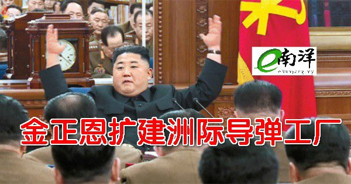
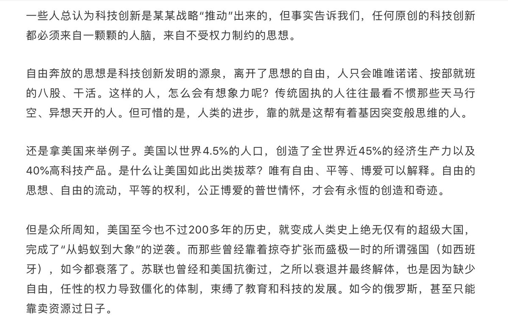
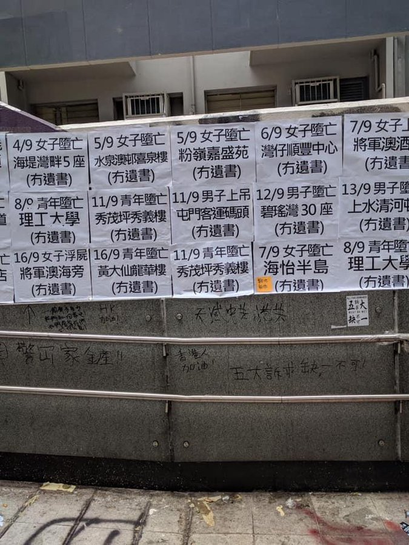

[12月24日 12:00]    纽约时报中文网   @nytchinese    卡舒吉被杀案宣判：五人死刑，三人监禁。这些判决符合沙特长期以来的论调，即杀戮并非预谋，而是特工们在最后一刻做出的决定。
但这种说法与大量证据相矛盾，《纽约时报》的一段调查视频整理出了谋杀发生的时间线。
更多简报内容： http://nyti.ms/2MmqfQ4   :speech_balloon:评:2 :+1:赞:4 :globe_with_meridians:转:1  

[12月24日 11:30]    纽约时报中文网   @nytchinese    林荣基带着“被失踪”的阴影流亡台湾，并着手在台北重开被迫关闭的铜锣湾书店。他在采访中表示，新的铜锣湾书店预计一个月内开张。
他近日接受纽约时报中文网专访，讲述了他与赴台寻求庇护的香港抗议者之间的互动、重开书店的计划，以及他对当前香港抗议局势的观察。 http://nyti.ms/2sjfyXV   :speech_balloon:评:4 :+1:赞:6 :globe_with_meridians:转:3  

[12月24日 11:14]    老司机   @h5lpykl7tp6jjop    这种机器人如果进入中国市场，女机器人肯定会比男机器人畅销！
因为中国男人把女机器人买回去，只要能陪他睡觉和啪啪啪即可，这个功能好解决！
如果想要中国女人买男机器人，机器人最重要的功能可不是陪她睡觉，而是要能挣钱给她花，这个功能可不好解决。
[捂脸] [捂脸] [捂脸] [捂脸]  :speech_balloon:评:1 :+1:赞:21 :globe_with_meridians:转:5  

[12月24日 11:10]    老司机   @h5lpykl7tp6jjop    又见笨贼！澳华人店午夜遭爆窃，结局却让人哭笑不得
澳洲常出笨贼，让人惊吓之余又能让你笑出鼻涕泡！  :speech_balloon:评:2 :+1:赞:7 :globe_with_meridians:转:2  

[12月24日 11:01]    BBC News 中文   @bbcchinese    三国领导人希望通过中日韩领导会议机制为自己寻找转圈空间。但同时，三个国家也需借此机会打破各自双边关系的僵局。 https://bbc.in/2PS6bHK   :speech_balloon:评:5 :+1:赞:16 :globe_with_meridians:转:5  

[12月24日 11:00]    纽约时报中文网   @nytchinese    香港民众自发监督警察行为。在对警察极度不信任的驱使下，旁观者和抗议者开始在网络空间聚集，发布视频和照片，对逮捕事件进行报道和跟踪。
此外，周一晚间，超过1000名抗议者再次上街抗议，要求对警察不当行为进行调查。 
更多简报内容： http://nyti.ms/2MmqfQ4   :speech_balloon:评:4 :+1:赞:8 :globe_with_meridians:转:2  

[12月24日 10:41]    老司机   @h5lpykl7tp6jjop    百亿富豪的2019生死劫:丑闻、逮捕、自杀...真是国进民退大潮！  :speech_balloon:评:1 :+1:赞:12 :globe_with_meridians:转:12  

[12月24日 10:37]    财经真相   @caijingxiang    黄金“春节攻势”持续中，重回1500美元，然后再哪里震荡一段时间是大概率事件。本轮黄金明显受到了，美股不断创新高的压制，中美第一阶段协议，也大大削弱了黄金的涨势，接下来中国央行降准消息公布后，黄金会冲向本轮最高峰，我们拭目以待吧！  :speech_balloon:评:3 :+1:赞:35 :globe_with_meridians:转:7  

[12月24日 10:32]    BBC News 中文   @bbcchinese    来看这位印度小网红怎么成名的？  :speech_balloon:评:1 :+1:赞:34 :globe_with_meridians:转:6  

[12月24日 10:23]    墙国铁拳现世报😷   @Socialistfist    附行政复议书  :speech_balloon:评:2 :+1:赞:27 :globe_with_meridians:转:2  

[12月24日 10:22]    纽约时报中文网   @nytchinese    今年4月从香港跑到台湾后，铜锣湾书店店主林荣基感到安心许多，但在不经意间，在香港与大陆经历的“被失踪“事件还是会闯入他的梦境。“有一次叫得很大声，自己都醒过来。“他回忆，“很可怕啦，那个梦。”
他的噩梦是“反送中“运动的不安前奏，也反映出香港抗议者对中国政府的恐惧。 http://nyti.ms/2sjfyXV   :speech_balloon:评:27 :+1:赞:64 :globe_with_meridians:转:25  

[12月24日 10:18]    墙国铁拳现世报😷   @Socialistfist    ”海口市琼山区龙塘政府自2019年2月开始在没有任何法定证据的前提下，连续三次对香世界庄园下达强制拆除和限期拆除，其中行政复议三次，两次被法院撤销拆除令，第三次复议还在等待结果期间直接无批文强拆……要知道，没有法院批准的拆除令的强拆属于严重违法行为！”

摘自：  http://blog.sina.cn/dpool/blog/s/blog_725524e60102zq6u.html?ref=weibocard&from=109C195010&wm=9847_0002&weiboauthoruid=1918182630 …https://twitter.com/minzhutiequan/status/1209266528006234113 …  :speech_balloon:评:14 :+1:赞:65 :globe_with_meridians:转:8  

[12月24日 10:10]    老司机   @h5lpykl7tp6jjop    每年增收一万亿！你它妈抽干多少老年人的血和命？  :speech_balloon:评:0 :+1:赞:3 :globe_with_meridians:转:0  

[12月24日 10:06]    老司机   @h5lpykl7tp6jjop      :speech_balloon:评:0 :+1:赞:0 :globe_with_meridians:转:0  

[12月24日 10:01]    BBC News 中文   @bbcchinese    如果你觉得这个200岁的白胡子老头与你无关，可能要再好好想一想。马克思有些想法，给我们的生活带来了更好的改变和影响。
 https://bbc.in/371lG5O   :speech_balloon:评:60 :+1:赞:82 :globe_with_meridians:转:19  

[12月24日 09:50]    纽约时报中文网   @nytchinese    早安！今日重点新闻包括：
中国宣布降低859种商品关税；香港书商的流亡人生；香港民众自发监督警察行为；伦敦女孩买圣诞卡发现来自中国监狱的求助；波音首席执行官被解雇；卡舒吉被杀案宣判； 阿尔及利亚实际统治者死亡……NYT简报带你速览今日要闻。 http://nyti.ms/2MmqfQ4   :speech_balloon:评:10 :+1:赞:29 :globe_with_meridians:转:7  

[12月24日 09:40]    老司机   @h5lpykl7tp6jjop    美国中情局还有一个统计，中国排名84。日本第二，  :speech_balloon:评:1 :+1:赞:1 :globe_with_meridians:转:0  

[12月24日 09:32]    老司机   @h5lpykl7tp6jjop      :speech_balloon:评:1 :+1:赞:1 :globe_with_meridians:转:0  

[12月24日 09:31]    老司机   @h5lpykl7tp6jjop      :speech_balloon:评:1 :+1:赞:1 :globe_with_meridians:转:0  

[12月24日 09:30]    BBC News 中文   @bbcchinese    空客A380行将寿终正寝。不少人还记得12年前世界第一架“空中巨无霸”首航的盛况呢。哪儿出错了？
 https://bbc.in/2sS5LrQ   :speech_balloon:评:3 :+1:赞:12 :globe_with_meridians:转:8  

[12月24日 09:24]    财经真相   @caijingxiang    李克强：进一步研究降准和定向降准、再贷款和再贴现！ 降准100点已经在路上，2.8万亿的资金缺口只能这么补了，具体时间点，要么本周五27号，要么下周五（1月3号）！a50估计会涨一波！  :speech_balloon:评:8 :+1:赞:89 :globe_with_meridians:转:17  

[12月24日 08:30]    BBC News 中文   @bbcchinese    有研究指，香港麻将活动不再普遍如昔，打麻将的人数都愈来愈少，到底背后原因是什么？ 【香港麻将走向夕阳所揭示的社会现象】
 https://bbc.in/2sVpPJI   :speech_balloon:评:12 :+1:赞:23 :globe_with_meridians:转:9  

[12月24日 08:02]    新闻大吐槽   @TuCaoFakeNews    《当我落单的时候》
演唱者：黑警

当我落单的时候
我的腿在颤抖
当我落单的时候
小便也差点就失禁
当我落单的时候
才知道恐惧是什么
当我落单的时候
没人听我诉说  :speech_balloon:评:19 :+1:赞:202 :globe_with_meridians:转:96  

[12月24日 08:02]    新闻大吐槽   @TuCaoFakeNews    《当我落单的时候》
演唱者：黑警

当我落单的时候
我的腿在颤抖
当我落单的时候
小便也差点就失禁
当我落单的时候
才知道恐惧是什么
当我落单的时候
没人听我诉说  :speech_balloon:评:19 :+1:赞:202 :globe_with_meridians:转:96  

[12月24日 07:31]    BBC News 中文   @bbcchinese    年龄不是距离！恭喜恭喜有情人终成眷属！
 https://bbc.in/2EIBlef   :speech_balloon:评:60 :+1:赞:137 :globe_with_meridians:转:19  

[12月24日 06:45]    老司机   @h5lpykl7tp6jjop    转发：日本医疗水平和人均寿命双双全球第一，不服不行！
世界卫生组织在最新的报告从“医疗水平”，“接受医疗服务的难度”，“医药费负担公平性”等方面对世界各国的医疗体系进行了综合比较。
日本因为“高品质的医疗服务”和“医疗负担的平等程度”，“国民平均寿命高”等原因，再次蝉联第一位。中国位居第64位。  :speech_balloon:评:5 :+1:赞:60 :globe_with_meridians:转:21  

[12月24日 06:39]    老司机   @h5lpykl7tp6jjop    转发好文：远离俄罗斯，该还是不该？
俄罗斯的悲剧所在，他们喜欢宏大的国家叙事，把国家的强大和人的自由幸福对立起来，把人命当成构架所谓雄图霸业的砖瓦木料和统计数字。  :speech_balloon:评:0 :+1:赞:23 :globe_with_meridians:转:10  

[12月24日 03:41]    老司机   @h5lpykl7tp6jjop    又传来了最新消息…人社部称推迟退休年龄是必然趋势，如果延迟退休到65岁，黄奇帆：妇女延迟退休10年，相当于全国每年增加1万亿养老金，另外有对中国人均寿命调查，实际上人均寿命不足60岁！呵呵！养老金缺口就轻轻松松的补上了！这算盘打立起来了！高！实在是高！  :speech_balloon:评:3 :+1:赞:44 :globe_with_meridians:转:25  

[12月24日 03:17]    老司机   @h5lpykl7tp6jjop    德媒: 中共维稳力道过强 新疆爆发汉人出走潮(组图)
根据《 金融时报》报导，中国政府在新疆推动的再教育营政策已迫使成千上万的汉族商人与工人离开库尔勒市，严重打击新疆第二大城的经济。  :speech_balloon:评:1 :+1:赞:10 :globe_with_meridians:转:3  

[12月24日 03:07]    老司机   @h5lpykl7tp6jjop    网上传出来美国最新飞行器，三角形UFO！  :speech_balloon:评:7 :+1:赞:56 :globe_with_meridians:转:18  

[12月24日 00:00]    财经真相   @caijingxiang    社会主义铁拳，不知道会不会砸醒？祖国强大了，就没人救你了！  :speech_balloon:评:48 :+1:赞:498 :globe_with_meridians:转:143  

[12月23日 23:59]    BBC News 中文   @bbcchinese    很多旅行者认为，西班牙人吃晚餐吃到深夜是因为他们懂得享受悠闲的地中海生活方式，但其实并非如此，而是有惊人的原因。
 https://bbc.in/36Wmwka   :speech_balloon:评:1 :+1:赞:31 :globe_with_meridians:转:6  

[12月23日 22:59]    BBC News 中文   @bbcchinese    美华和智允从朝鲜逃到中国，以为能够展开新生活，但她们一度被迫从事色情直播，每天过着比坐监更痛苦的生活。
 https://bbc.in/2sSsEeC   :speech_balloon:评:78 :+1:赞:104 :globe_with_meridians:转:54  

[12月23日 21:59]    BBC News 中文   @bbcchinese    是否应该设置弃婴箱备受争议。支持者说弃婴箱可以帮助有困难的父母亲，还能保护这些弃婴的安全。反对者认为此措施将会引发弃婴潮，容易让父母随意遗弃孩子。
 https://bbc.in/2MkJUQu   :speech_balloon:评:9 :+1:赞:19 :globe_with_meridians:转:4  

[12月23日 21:30]    纽约时报中文网   @nytchinese    尽管许多居民表示法罗群岛更偏向于美国而不是中国，但一些人对美国官员要求禁止华为的行为表示了愤怒。他们说，该公司帮助建立的现有的4G网络，令他们可以打电话或从岛上一些更加偏远的地区分享照片。一位居民说：“这唤醒了我内心那种’滚一边去吧’的感觉，我们自己做决定。” https://nyti.ms/2tEZeks   :speech_balloon:评:5 :+1:赞:14 :globe_with_meridians:转:7  

[12月23日 21:29]    BBC News 中文   @bbcchinese    【中国否认“Tesco圣诞卡强制劳动指控”】伦敦女孩发现写有“中国囚犯求救讯息”的圣诞贺卡，中国外交部与这是英国侦探韩飞龙“自己编造”的闹剧。  https://bbc.in/35Pf4al   :speech_balloon:评:75 :+1:赞:74 :globe_with_meridians:转:26  

[12月23日 21:00]    纽约时报中文网   @nytchinese    #观点 2012年底习近平的上台，标志着中国共产党宗教政策历史上的第三个新时代。国家不像毛泽东时代那样对宗教进行全面摧毁，也没有采取改革时期相对自由放任的做法，而是实施一种精心策划的复兴运动。by @iandenisjohnson https://nyti.ms/39a8iOP   :speech_balloon:评:2 :+1:赞:11 :globe_with_meridians:转:8  

[12月23日 20:59]    BBC News 中文   @bbcchinese    人类的近亲生活也不容易，要跟同族同类斗，还要跟人斗。
 https://bbc.in/2sZ5NOl   :speech_balloon:评:6 :+1:赞:21 :globe_with_meridians:转:5  

[12月23日 20:30]    纽约时报中文网   @nytchinese    据估计，在土耳其，有2500名维吾尔人没有合法居留权。
土耳其内政部长8月曾表示，政府试图本着“仁慈和良知”管理移民，不会驱逐维吾尔人。但尽管土耳其允许他们留下来，许多维吾尔人表示，移民规定和政府官僚作风让他们难以生存。 https://nyti.ms/2QbJD3x   :speech_balloon:评:2 :+1:赞:14 :globe_with_meridians:转:7  

[12月23日 20:00]    纽约时报中文网   @nytchinese    拉克什明博士说，节日期间的家庭创伤不会有神奇的解决方案。12月本就是充满压力的季节，所以，这可不是翻旧账并以为能解决这些问题的好时机。 http://nyti.ms/399hpiL   :speech_balloon:评:0 :+1:赞:7 :globe_with_meridians:转:3  

[12月23日 19:59]    BBC News 中文   @bbcchinese    首先要清楚了解吸血鬼和僵尸的分别  【牛津大学最难考题：愿意当吸血鬼还是僵尸】
 https://bbc.in/34PXku4   :speech_balloon:评:14 :+1:赞:32 :globe_with_meridians:转:4  

[12月23日 19:50]    财经真相   @caijingxiang    明天就是平安夜了，三胖传说中的“圣诞礼物”是不是也该送到了！我要不要轻仓做点黄金准备一下呢？  :speech_balloon:评:21 :+1:赞:125 :globe_with_meridians:转:18  

[12月23日 19:30]    纽约时报中文网   @nytchinese    2010年后，法罗群岛向中国出口三文鱼的规模开始扩大。当时，中国放缓了对挪威鱼类的购买，以回应将诺贝尔和平奖授予刘晓波的决定。中国目前约占法罗群岛三文鱼销售的7%，该岛政府还在进一步扩大贸易。而现在，三文鱼渔业被卷入了这场5G无线网络的斗争中。 https://nyti.ms/2tEZeks   :speech_balloon:评:1 :+1:赞:6 :globe_with_meridians:转:4  

[12月23日 19:23]    财经真相   @caijingxiang    人大常委会：居住期限满或者居住权人死亡，居住权消失，应及时办理注销登记！  :speech_balloon:评:69 :+1:赞:271 :globe_with_meridians:转:141  

[12月23日 19:01]    BBC News 中文   @bbcchinese    地球轨道变得越来越拥挤：有数千颗正在运行的卫星，还有很多计划准备发射的，这提高相撞的几率。 https://bbc.in/2PSmvIB   :speech_balloon:评:36 :+1:赞:66 :globe_with_meridians:转:20  

[12月23日 18:30]    纽约时报中文网   @nytchinese    #观点 在打压伊斯兰教和基督教的同时，中共选择接纳复兴传统信仰，使得一种新的民间宗教正在形成。这不仅是为了解决道德真空，更是为了政治利益。by @iandenisjohnson https://nyti.ms/39a8iOP   :speech_balloon:评:64 :+1:赞:89 :globe_with_meridians:转:31  

[12月23日 18:08]    墙国铁拳现世报😷   @Socialistfist    补充香世界庄园负责人朋友圈  :speech_balloon:评:8 :+1:赞:194 :globe_with_meridians:转:54  

[12月23日 18:05]    墙国铁拳现世报😷   @Socialistfist    媒体报道  :speech_balloon:评:8 :+1:赞:122 :globe_with_meridians:转:21  

[12月23日 18:04]    墙国铁拳现世报😷   @Socialistfist    补充强拆视频  :speech_balloon:评:10 :+1:赞:162 :globe_with_meridians:转:34  

[12月23日 18:03]    墙国铁拳现世报😷   @Socialistfist    美国驻广州总领事说：香世界庄园是一个很酷的地方！
海口政府官员说：并没有。

海口市十多年企业，百号员工，一天化为乌有
#社会主义铁拳  :speech_balloon:评:137 :+1:赞:1040 :globe_with_meridians:转:459  

[12月23日 18:00]    纽约时报中文网   @nytchinese    大西洋理事会学者格雷厄姆·布鲁克表示：
“这是一个庞大的、肆无忌惮的虚假网络，拥有不同层级的虚假帐号和自动操作，系统地发布了具有两个意识形态重点的内容：支持唐纳德·特朗普、反对中国政府。” https://nyti.ms/2Sg3rW9   :speech_balloon:评:15 :+1:赞:57 :globe_with_meridians:转:22  

[12月23日 17:30]    纽约时报中文网   @nytchinese    法罗群岛希望利用5G建设全新的超高速无线网络，但美国敦促法罗群岛不要启用华为建设5G网络。与此同时，像许多欧洲国家一样，这个群岛与中国的经济联系愈发紧密，特别是其支柱产业三文鱼渔业，这令它左右为难。 https://nyti.ms/2tEZeks   :speech_balloon:评:20 :+1:赞:32 :globe_with_meridians:转:10  

[12月23日 17:17]    老司机   @h5lpykl7tp6jjop    人性总是得到很快就忘记，失去拼命怀念！海外的华人爱国的原因就是这样，从等级社会来到平等社会，得到的自由公平阳光空气很快忘记，失去的社会地位，自我良好感觉一下不见了，特别是自认为在国内混得不错的人，于是去爱国怀旧，很多人说喜欢平等自由，是叶公好龙，对上要有平等，对下想有特权！  :speech_balloon:评:6 :+1:赞:42 :globe_with_meridians:转:7  

[12月23日 17:02]    BBC News 中文   @bbcchinese    不会帮你家小孩绑辫子吗？也许你该加入老爸专属发型教室！  :speech_balloon:评:8 :+1:赞:97 :globe_with_meridians:转:32  

[12月23日 17:01]    BBC News 中文   @bbcchinese    神圣不可侵犯：如果中国留守儿童盼的是春运加班列车把爸妈接回家过年，那法国的圣诞儿童专列大概就在发挥着相似功能。 // 法国罢工：各方力保不砍的圣诞儿童专列 https://bbc.in/36X8cI4   :speech_balloon:评:7 :+1:赞:45 :globe_with_meridians:转:13  

[12月23日 17:00]    纽约时报中文网   @nytchinese    “我们陷在中土关系中间，甚至不知道我们是价值几何的筹码。”在土耳其寻求庇护的阿卜杜加尼说。
今年初，土耳其将至少4名维吾尔人驱逐回塔吉克斯坦。他们从那里被送回中国，令维吾尔人感到震惊。土耳其当局后来表示，他们不会将任何维吾尔人遣返中国。但许多人仍感到焦虑。 https://nyti.ms/2QbJD3x   :speech_balloon:评:8 :+1:赞:5 :globe_with_meridians:转:7  

[12月23日 16:30]    纽约时报中文网   @nytchinese    Facebook表示，该平台移除了与大纪元媒体集团有关的数百个帐号。这些帐号借助人工智能生成伪造的个人资料照片，发布与美国大选、特朗普弹劾案有关的内容。 https://nyti.ms/2Sg3rW9   :speech_balloon:评:95 :+1:赞:280 :globe_with_meridians:转:119  

[12月23日 16:02]    BBC News 中文   @bbcchinese    中国官方罕见在正式场合触及同性婚姻议题，透露有大量民众提议“同性婚姻合法化”应被写入民法典。中国媒体周末发起投票，更是吸引了数百万网友参与。大家都怎么看？ https://bbc.in/34KJLw5   :speech_balloon:评:103 :+1:赞:196 :globe_with_meridians:转:51  

[12月23日 16:00]    纽约时报中文网   @nytchinese    在中共威权领导人习近平的领导下，中国已压制了维权律师和活动人士的声音。但李秀萍和其他人避免了政治上的对抗，她们练就了一种更灵活的行动方式，用受欢迎的社交媒体平台微信来动员、协调和分享应对纠葛不清的离婚的建议。 https://nyti.ms/2EJvllh   :speech_balloon:评:10 :+1:赞:14 :globe_with_meridians:转:1  

[12月23日 15:43]    纽约时报中文网   @nytchinese    随着政府加大新疆地区的同化运动，维吾尔族人纷纷离开中国。在过去的三年中，至少有1.1万人来到拥有类似语言和相同宗教的土耳其，这里也成为他们一直以来青睐的避风港。但随着土耳其与中国的关系逐渐紧密，许多人对未来感到忧虑，甚至担心被驱逐。 https://nyti.ms/2QbJD3x   :speech_balloon:评:68 :+1:赞:92 :globe_with_meridians:转:33  

[12月23日 15:14]    老司机   @h5lpykl7tp6jjop    央视报道孙小果案再次被判死刑，离98年那次死刑判决过了21年，对受害者来说正义从来都在迟到，来都没来自然就是缺席，再过十八年又是一条好汉是古代汉子的豪言壮语，咱共产党的天朝不用胡喊，施施然过了二十一年不仍然还活着吗？孙小果死不死已经不重要，它将永远的站在中共的法律上无耻的嘲笑中国人！  :speech_balloon:评:18 :+1:赞:276 :globe_with_meridians:转:57  

[12月23日 15:02]    BBC News 中文   @bbcchinese    美国好莱坞演员塞隆不讳言，讲述了自己和家人受家庭暴力伤害的故事。 https://bbc.in/2Mn5fsz   :speech_balloon:评:3 :+1:赞:21 :globe_with_meridians:转:6  

[12月23日 15:00]    纽约时报中文网   @nytchinese    时报电视评论人麦克·黑尔评选出了他心目中的2010年代30部最佳国际剧集。以色列剧集《战俘》、英剧《神探夏洛克》和法国剧《巴黎情报局》分列前三位。 https://nyti.ms/2PQCMgZ   :speech_balloon:评:6 :+1:赞:75 :globe_with_meridians:转:30  

[12月23日 14:46]    老司机   @h5lpykl7tp6jjop    转发：
创造人类的繁荣和文明靠的是什么？​
国文修禅  :speech_balloon:评:3 :+1:赞:11 :globe_with_meridians:转:2  

[12月23日 14:30]    纽约时报中文网   @nytchinese    在浴室里躲10分钟冷静一下、安排好拜访的时间长短、花钱住旅馆而不是住在父母家的客房……临床心理学家哈丽雅特·莱纳建议，在与家人共处时，要确保自己能创造一个可以与他们产生一定情感距离的空间。 https://nyti.ms/399hpiL   :speech_balloon:评:2 :+1:赞:16 :globe_with_meridians:转:7  

[12月23日 14:02]    BBC News 中文   @bbcchinese    USB公共充电站安全吗？潜伏在公共充电USB接口的病毒软件也许会神不知鬼不觉地盗取你的个人信息和敏感数据 https://bbc.in/2MndmoW   :speech_balloon:评:11 :+1:赞:31 :globe_with_meridians:转:18  

[12月23日 14:00]    纽约时报中文网   @nytchinese    2003年，中国最高人民法院出台司法解释明确债务分割问题，认定离婚的夫妻双方对个人债务负有共同责任。
这一规定有助于防止利用假离婚来逃避债务，但对于李秀萍和许多其他离婚女性来说，这种试图澄清法律的尝试造成了更多困惑，她们不知道要如何证明自己没有债务责任。 https://nyti.ms/2EJvllh   :speech_balloon:评:1 :+1:赞:14 :globe_with_meridians:转:6  

[12月23日 13:59]    老司机   @h5lpykl7tp6jjop    衙内照片，一付流氓相！  :speech_balloon:评:0 :+1:赞:11 :globe_with_meridians:转:2  

[12月23日 13:41]    老司机   @h5lpykl7tp6jjop    谷歌地图反映的是中国基本上已无森林。l999年，中国最后一条森林铁路退役。也就是说，砍光了，再没什么可砍的了。
正如毛泽东当年所说：“一张白纸，没有负担，好写最新最美的文字，好画最新最美的画图。
口里说让你爱国，它们干的是发财捞钱！哪管后代子孙！  :speech_balloon:评:3 :+1:赞:21 :globe_with_meridians:转:5  

[12月23日 13:31]    BBC News 中文   @bbcchinese    【TESCO圣诞卡求救：中国囚犯向人权记者韩飞龙求救】一名来自伦敦南部的6岁女孩在一盒圣诞卡片中发现了一条“来自上海囚犯的求救信息”，卡上的信息以大写英文字母写道：“我们是在中国上海青浦监狱里的外国囚犯。我们被强制劳动。请帮助我们，并通知人权组织。”  :speech_balloon:评:238 :+1:赞:1376 :globe_with_meridians:转:787  

[12月23日 13:01]    BBC News 中文   @bbcchinese    2019年回顾：恋爱运不佳吗？告诉你Tinder年度最火的议题竟然是政治？！  :speech_balloon:评:2 :+1:赞:24 :globe_with_meridians:转:8  

[12月23日 10:11]    财经真相   @caijingxiang    截至12月13日，国债累计发行约4.03万亿元人民币，地方债券累计发行4.34万亿元，其中，新增债券、再融资债券、置换债券分别发行3.03万亿元、1.15万亿元、0.16万亿元。新增债券中，一般债券、专项债券分别发行0.9万亿元、2.13万亿元。两者相加超过8万亿，还不计算三大政策性银行！  :speech_balloon:评:10 :+1:赞:158 :globe_with_meridians:转:62  

[12月23日 08:44]    老司机   @h5lpykl7tp6jjop    麻煩拿五星旗的滾回去中共好嗎？這裡是台灣 在自己的國家拿敵國國旗 你去中共拿台灣國旗試試  :speech_balloon:评:35 :+1:赞:397 :globe_with_meridians:转:98  

[12月23日 07:49]    新闻大吐槽   @TuCaoFakeNews    假包子在澳门乱传暖流~
真包子在小摊砥砺前行~  :speech_balloon:评:3 :+1:赞:176 :globe_with_meridians:转:5  

[12月23日 05:47]    新闻大吐槽   @TuCaoFakeNews    中南海里的包子早已不是真包子，他只是个被国师操控的傀儡，一切政令都出自国师，包括傀儡念的稿！

而真包子被国师抹去了记忆，扔在包子铺，每天以卖包子为生。  :speech_balloon:评:93 :+1:赞:1162 :globe_with_meridians:转:324  

[12月23日 05:47]    新闻大吐槽   @TuCaoFakeNews    中南海里的包子早已不是真包子，他只是个被国师操控的傀儡，一切政令都出自国师，包括傀儡念的稿！

而真包子被国师抹去了记忆，扔在包子铺，每天以卖包子为生。  :speech_balloon:评:93 :+1:赞:1162 :globe_with_meridians:转:324  

[12月23日 05:38]    新闻大吐槽   @TuCaoFakeNews    挺狗鱼都挺到插管了，看来红毒不但入脑，还入肺，好可怜 https://twitter.com/t88651529/status/1208705472980647937 …  :speech_balloon:评:3 :+1:赞:7 :globe_with_meridians:转:0  

[12月23日 05:38]    老司机   @h5lpykl7tp6jjop    CCP Secret
中共習近平：二次回歸必須殺2/3香港人

2015年内部會議，習近平指出“…#香港二次回歸，必須注意兩件事：#三年自然災害，無數反特黑五類逃往香港…中國人民 #文化大革命，無數反動知識分子逃往香港…反革命分子，仇視人民仇視中國…我們要糾正歷史，鎮壓漏網之魚…我們必須殺2/3香港人…”  :speech_balloon:评:26 :+1:赞:100 :globe_with_meridians:转:86  

[12月23日 04:19]    新闻大吐槽   @TuCaoFakeNews    剩蛋快乐  :speech_balloon:评:97 :+1:赞:1278 :globe_with_meridians:转:299  

[12月23日 04:19]    新闻大吐槽   @TuCaoFakeNews    剩蛋快乐  :speech_balloon:评:97 :+1:赞:1278 :globe_with_meridians:转:299  

[12月23日 00:03]    财经真相   @caijingxiang    本轮通胀是由猪肉上涨引发的，其他商品并未同步大涨，这是典型的“机构性通胀”，目前来看对中国金融系统冲击有限，央行不会为此进行加息，甚至会继续降息。比起吃不起猪肉，明年经济继续下滑带来的失业，更让中共金融系统决策者感到棘手！ https://www.youtube.com/watch?v=Ru5vTNydrSg&lc=z22rsvu4wk31cff3cacdp430qwmpwwda5apw1lcqf0tw03c010c …  :speech_balloon:评:12 :+1:赞:163 :globe_with_meridians:转:39  

[12月22日 23:22]    财经真相   @caijingxiang    12月21日，南方日报记者从广东省地方金融监督管理局获悉，在粤港澳大湾区建设的大背景下，广东将在支持澳门打造中国—葡语国家金融服务平台、推进跨境融资租赁业务开展、不断拓宽跨境合作通道、支持澳门机构参与发起设立粤港澳大湾区国际商业银行、支持两地保险机构合作开发保险产品等多方面进行合作。  :speech_balloon:评:23 :+1:赞:119 :globe_with_meridians:转:20  

[12月22日 22:00]    新闻大吐槽   @TuCaoFakeNews    任正非又疯癫，他接受外媒采访，认为孟无罪，不是因为他可以一桩一桩驳斥美国的指控，而是认为既然川普曾表达可以因贸易战进展而对孟采取不同态度，那说明美国不过是拿孟当筹码，所以孟是无罪的；

这个证无罪的思路很清奇，可川普不是一手遮天的政法委书记，你这么一黑，总统权限内的缓和也做不到了  :speech_balloon:评:13 :+1:赞:140 :globe_with_meridians:转:45  

[12月22日 22:00]    新闻大吐槽   @TuCaoFakeNews    任正非又疯癫，他接受外媒采访，认为孟无罪，不是因为他可以一桩一桩驳斥美国的指控，而是认为既然川普曾表达可以因贸易战进展而对孟采取不同态度，那说明美国不过是拿孟当筹码，所以孟是无罪的；

这个证无罪的思路很清奇，可川普不是一手遮天的政法委书记，你这么一黑，总统权限内的缓和也做不到了  :speech_balloon:评:13 :+1:赞:140 :globe_with_meridians:转:45  

[12月22日 15:50]    财经真相   @caijingxiang    黄奇帆：每项供给侧改革都有万亿级红利，延长女性退休年龄这一供给侧改革，也是黄奇帆认为可带来万亿级红利的重大举措。他认为，如果妇女退休年龄从现在的50岁变革为60岁，甚至是和男性一样延长到65岁，每年相当于增加1万亿元养老金，必将缓和许多省份养老保险资金链紧张的情况！  :speech_balloon:评:114 :+1:赞:474 :globe_with_meridians:转:185  

[12月22日 12:34]    新闻大吐槽   @TuCaoFakeNews    哪怕是大五毛花千芳，当家人遭到不公对待时，在墙内也基本没有发声空间，所有媒体全都不报道；

党对五毛的用法是取其精华、去其糟粕：
花千芳在墙内剩下的声音只有类似：“网文应该传递积极健康的价值观”、“我们为这个国家做了什么”这样的五毛文！

花应该感谢外媒，他们还为你的不公说了公道话！  :speech_balloon:评:20 :+1:赞:211 :globe_with_meridians:转:82  

[12月22日 12:34]    新闻大吐槽   @TuCaoFakeNews    哪怕是大五毛花千芳，当家人遭到不公对待时，在墙内也基本没有发声空间，所有媒体全都不报道；

党对五毛的用法是取其精华、去其糟粕：
花千芳在墙内剩下的声音只有类似：“网文应该传递积极健康的价值观”、“我们为这个国家做了什么”这样的五毛文！

花应该感谢外媒，他们还为你的不公说了公道话！  :speech_balloon:评:20 :+1:赞:211 :globe_with_meridians:转:82  

[12月22日 09:45]    凡賽堤/FORSETI   @FecharCCP    護臺！！！ 救港！！！救疆！！！

台灣人正在醒過來！！！全球華人正在醒過來..........
我們不是旁觀者，我們不是評論員，
我們都是當事人，我們都是見證著！
因為我們都是華族的一員！！！

讓我們一起消滅極權吧！

時代革命，光復華族！

------------原視頻來自台灣自由時報！  :speech_balloon:评:2 :+1:赞:48 :globe_with_meridians:转:22  

[12月22日 09:17]    凡賽堤/FORSETI   @FecharCCP    海外的華族台灣同胞！
台灣正在經歷歷史的變革，此時此刻的台灣正處於生死攸關時刻，台灣未來的命運取決你們手中神聖的全票！
呼籲海外的所有台灣同胞回家投票！
只有國民黨滅亡台灣的未來才有希望！！！

----感謝此視頻的原創作者！  :speech_balloon:评:0 :+1:赞:16 :globe_with_meridians:转:9  

[12月22日 08:55]    凡賽堤/FORSETI   @FecharCCP    極權恐怖組織的殺人犯警試圖用身體和盾擋住拍攝者的視頻！但是它們擋不住700萬正義香港人所有的見證著！
擋不住全球華人和全人類正義的良知！！！
時代革命，消滅極權，光復華族，人人有責！

----感謝此視頻的正義原創作者！  :speech_balloon:评:8 :+1:赞:117 :globe_with_meridians:转:115  

[12月22日 08:46]    凡賽堤/FORSETI   @FecharCCP    浮屍，墜樓，被輪姦，被自殺........一直沒有停止過！

CCP極權殺人恐怖組織正在用各種兇殘手段屠殺我們的同胞...................
CCP極權殺人恐怖組織是全人類的公敵！
呼籲全世界正道主義合力消滅CCP！
呼籲全世界人民看清楚CCP反人類的慘無人道的殘暴罪行！！！  :speech_balloon:评:4 :+1:赞:10 :globe_with_meridians:转:14  

[12月22日 08:35]    凡賽堤/FORSETI   @FecharCCP    正在美國白宮網站請願取消2022北京冬奧會，想法是不錯，不過美國政府可以干預奧運會，但是奧運會不是美國說的算！支持一下也無妨！

Ask the International Olympics Commission & Corporate Sponsors to relocate or cancel the Beijing 2022 Winter Olympics  https://petitions.whitehouse.gov/petition/ask-international-olympics-commission-corporate-sponsors-relocate-or-cancel-beijing-2022-winter-olympics …  :speech_balloon:评:0 :+1:赞:2 :globe_with_meridians:转:1  

[12月22日 08:26]    凡賽堤/FORSETI   @FecharCCP    台灣人正在醒過來！！！全球華人正在醒過來..........
我們不是旁觀者，我們不是評論員，
我們都是當事人，我們都是見證著！
因為我們都是華族的一員！！！

讓我們一起消滅極權吧！

時代革命，光復華族！

------------原視頻來自台灣自由時報！  :speech_balloon:评:0 :+1:赞:13 :globe_with_meridians:转:7  

[12月22日 07:42]    凡賽堤/FORSETI   @FecharCCP    台灣人正在醒過來！！！全球華人正在醒過來..........
讓我們一起消滅極權吧！時代革命，光復華族！

2020將是告別華人歷史的極權統治的新的一年！！！

本人非此視頻的原創！非常感謝此視頻的原創作者！！！  :speech_balloon:评:2 :+1:赞:120 :globe_with_meridians:转:47  

[12月22日 07:34]    凡賽堤/FORSETI   @FecharCCP    感謝此視頻的原始上傳作者！  :speech_balloon:评:0 :+1:赞:4 :globe_with_meridians:转:0  

[12月22日 07:28]    凡賽堤/FORSETI   @FecharCCP    台灣人正在醒過來！！！全球華人正在醒過來..........
讓我們一起消滅極權吧！時代革命，光復華族！  :speech_balloon:评:1 :+1:赞:106 :globe_with_meridians:转:44  

[12月22日 04:03]    新闻大吐槽   @TuCaoFakeNews    小鲜肉老公莫不是党安排在伊能静身边的钉子？
往日颇有正义感的她被现实的苟且打败，可惜 https://twitter.com/lifetimeuscn/status/1208218501858648064 …  :speech_balloon:评:4 :+1:赞:24 :globe_with_meridians:转:5  

[12月22日 03:46]    新闻大吐槽   @TuCaoFakeNews    有才，把海绵宝宝改成了国瑜草包
只是东森这个大红媒为何显得有点首鼠两端？拿了共党的钱，却不与党消灾？
东森：洗地成本太高，速打款  :speech_balloon:评:8 :+1:赞:170 :globe_with_meridians:转:66  

[12月22日 03:46]    新闻大吐槽   @TuCaoFakeNews    有才，把海绵宝宝改成了国瑜草包
只是东森这个大红媒为何显得有点首鼠两端？拿了共党的钱，却不与党消灾？
东森：洗地成本太高，速打款  :speech_balloon:评:8 :+1:赞:170 :globe_with_meridians:转:66  

[12月22日 01:05]    新闻大吐槽   @TuCaoFakeNews    50万人上街要求罢免韩国瑜的同时，另有号称35万人在挺韩游行～

蔡总统呼吁两方面都要保持理性，并认为表达诉求是人民的权利。

面对台湾社会的撕裂，她认为《反渗透法》是非常必要的。
这说明蔡英文把上街挺韩35万人的病因看得很清——红媒渗透  :speech_balloon:评:10 :+1:赞:375 :globe_with_meridians:转:134  

[12月22日 01:05]    新闻大吐槽   @TuCaoFakeNews    50万人上街要求罢免韩国瑜的同时，另有号称35万人在挺韩游行～

蔡总统呼吁两方面都要保持理性，并认为表达诉求是人民的权利。

面对台湾社会的撕裂，她认为《反渗透法》是非常必要的。
这说明蔡英文把上街挺韩35万人的病因看得很清——红媒渗透  :speech_balloon:评:10 :+1:赞:375 :globe_with_meridians:转:134  

[12月21日 23:20]    新闻大吐槽   @TuCaoFakeNews    这并不是香港，而是高雄，今天50万人上街要求罢免韩狗鱼！
高雄人口300万，能把六分之一的人口逼上街，韩书记好威武  :speech_balloon:评:110 :+1:赞:2904 :globe_with_meridians:转:1045  

[12月21日 23:20]    新闻大吐槽   @TuCaoFakeNews    这并不是香港，而是高雄，今天50万人上街要求罢免韩狗鱼！
高雄人口300万，能把六分之一的人口逼上街，韩书记好威武  :speech_balloon:评:110 :+1:赞:2904 :globe_with_meridians:转:1045  

[12月21日 22:56]    财经真相   @caijingxiang    ETC是否具有定位功能，查了一下网络，今年夏季就有人在网上讨论，丽水辟谣网还专门辟谣，一些技术帖子说，ETC不能定位，因为没有定位芯片，但是继续查询发现，没有GPS定位模组，物联网设备LBS也可以定位，有没有懂技术的大神说一下？  :speech_balloon:评:84 :+1:赞:132 :globe_with_meridians:转:30  

[12月21日 22:41]    财经真相   @caijingxiang    ETC真的是太阳能供电，有没有专门的人做检测，如果真的有GPS定位，那真的是细思极恐！中共彻底的随时、随地实时掌控，全国的人、物！彻彻底底的现代化高科技奴隶制度！ https://twitter.com/seanchen_new/status/1208389425987670018 …  :speech_balloon:评:121 :+1:赞:372 :globe_with_meridians:转:111  

[12月21日 22:40]    新闻大吐槽   @TuCaoFakeNews    “光复高雄，时代革命”
“草包，滚！”
今天，50万台湾人上街表达对韩狗鱼的不满  :speech_balloon:评:21 :+1:赞:384 :globe_with_meridians:转:125  

[12月21日 22:08]    财经真相   @caijingxiang    哦哦！这么说以后节假日也不免费了？春节高速还堵路吗？ https://twitter.com/StevenSir2020/status/1208387676606324738 …  :speech_balloon:评:21 :+1:赞:93 :globe_with_meridians:转:17  

[12月21日 20:36]    墙国铁拳现世报😷   @Socialistfist    爱党鄙视链

#战螂在推特  :speech_balloon:评:45 :+1:赞:455 :globe_with_meridians:转:92  

[12月21日 15:42]    财经真相   @caijingxiang    中共政府推广ETC的初衷是为了节约同行时间，但是实际上反而还没以往人工快，尤其是政府自己搭建的收费系统，流量一大就直接卡死，其结果就是车辆直接停在收费站，直到网络显示收费成功后，才可以放行，于是后面等待的车辆一股脑的全变车道，去了人工收费站，整个收费站瞬间变成停车场！  :speech_balloon:评:20 :+1:赞:126 :globe_with_meridians:转:21  

[12月21日 15:38]    财经真相   @caijingxiang    距离国务院下达的时间点就剩10天了，目前ETC普遍存在问题是：①为了强制推广，减少人工收费口，导致人工出口超级堵车②部分小出口过于狭窄，人工口一堵，整个收费站都瘫痪③部分车辆ETC无法识别，被迫变车道，引发各种交通事故④还有的ETC和人工车道并存，结果更堵⑤收费软件卡，结果又是等待堵车  :speech_balloon:评:32 :+1:赞:170 :globe_with_meridians:转:53  

[12月21日 12:37]    财经真相   @caijingxiang    新的银行结售汇数据出来了，2019.1-11的数据很有意思。北京实物购买逆差较多，说明政府才是外汇最大的消耗者。上海服务贸易逆差最大，说明上海人最愿意出国旅游，以及购买国外的服务；赚了外汇汇到国内最多是浙江人，而不是福建人。福建不是传说中的偷渡大省吗？难道他们只是人出去，钱不汇回国吗？  :speech_balloon:评:29 :+1:赞:293 :globe_with_meridians:转:140  

[12月21日 12:31]    凡賽堤/FORSETI   @FecharCCP    国内男子当街殴打儿童，行为令人发指！周围经过的路人选择无视！这就是自夸治安最好的第二大经济体！  :speech_balloon:评:262 :+1:赞:720 :globe_with_meridians:转:665  

[12月21日 09:58]    财经真相   @caijingxiang    但新华社报导，习近平强调，对近一段时间来美方在涉台、涉港、涉疆、涉藏等问题上的消极言行表示严重关切。“这些做法干涉了中国内政、损害了中方利益，不利于双方互信合作。”要坚持政治解决的大方向，各方要相向而行，保持对话缓和势头，这符合各方共同利益。 https://twitter.com/USA_China_Talk/status/1208202887014354944 …  :speech_balloon:评:16 :+1:赞:124 :globe_with_meridians:转:28  

[12月21日 07:56]    新闻大吐槽   @TuCaoFakeNews    不愧是牛津毕业的数学家，林政老公故意在公开场合给林政出难题，不鼓掌明显是当众在给林政难堪，也明示了家庭内部的不和。

另一个重点就是，站在前排的估计只有他不是党员！  :speech_balloon:评:97 :+1:赞:1053 :globe_with_meridians:转:320  

[12月20日 22:48]    墙国铁拳现世报😷   @Socialistfist    “每当回到现实生活中，梦立刻被击得粉碎”
网络文学作家 罗霸道发帖称父母辛苦养鱼和邻居的鸭子被人河中投毒毒死，血本无归。警察和当地畜牧水产踢皮球。经历这些种种，罗霸道发文感慨，自己在现实生活中霸道不起来。

#社会主义铁拳  :speech_balloon:评:52 :+1:赞:481 :globe_with_meridians:转:139  

[12月20日 22:03]    墙国铁拳现世报😷   @Socialistfist    经验教训告诉我们，孙笑川们翻墙爱党的后果就是腾讯推特一起封号
因投稿人要求厚码
#社会主义铁拳  :speech_balloon:评:32 :+1:赞:456 :globe_with_meridians:转:97  

[12月20日 13:56]    财经真相   @caijingxiang    12月20日，中共央行在香港发行100亿元人民币央票。这是继今年2月、5月、6月、8月、9月、11月之后，第7次在香港发行央票。自此，中共央行在香港总共发行了19期、累计1700亿元的央票，如此频繁的行动是较为罕见的。在美国汇率操纵指责以及资本外流背景下，发行央票成了维护汇率的主要手段！  :speech_balloon:评:13 :+1:赞:353 :globe_with_meridians:转:127  

[12月20日 09:10]    凡賽堤/FORSETI   @FecharCCP    浮屍，墜樓，被輪姦，被自殺........一直沒有停止過！
都是我們族人，同胞，親人，朋友......我們還是束手無助！！！ CCP極權在70年間已經有不完全統計的上億華人被以各種手段，莫須有罪名殺害，今天每天都還在發生！
我們怎麼辦？隨時隨刻將在你的親人，朋友身邊發生！！！怎麼辦？  :speech_balloon:评:19 :+1:赞:100 :globe_with_meridians:转:101  

[12月20日 08:08]    凡賽堤/FORSETI   @FecharCCP    時代革命，消滅極權，光復中華，人人有責！！！  :speech_balloon:评:0 :+1:赞:3 :globe_with_meridians:转:0  

[12月20日 07:59]    凡賽堤/FORSETI   @FecharCCP    在科技與文明的新時代，每個華人全部行駛歷史賦予華人的新的神聖使命----時代革命，消滅極權，光復中華！！！  :speech_balloon:评:3 :+1:赞:25 :globe_with_meridians:转:16  

[12月20日 07:48]    凡賽堤/FORSETI   @FecharCCP    CCP極權挾14億華人以令世界70年，聲討與消滅CCP極權的時代已經來了，讓我們一起學習香港人永不屈服的正義精神！！！ 全面傳播香港的危機真相來喚醒14億人的良知！
讓我們一起向全世界發出震撼人類歷史的全民聲討消滅CCP極權組織的聲音！！！永不屈服！！！永不停止！！  :speech_balloon:评:5 :+1:赞:121 :globe_with_meridians:转:80  

[12月20日 07:35]    凡賽堤/FORSETI   @FecharCCP    期望全世界正義之人每個人全面收集整理香港6.9以來的所有視頻，畫面加以時間，事件說明，中英文製作宣傳片，紀錄片，保存並向全世界社交媒體傳播！永不停止！！！ https://twitter.com/FecharCCP/status/1198065532991410177 …  :speech_balloon:评:1 :+1:赞:29 :globe_with_meridians:转:21  

[12月20日 07:25]    凡賽堤/FORSETI   @FecharCCP    我們不可停止，我們將無限循環傳播香港的全方位被CCP極權組織殘暴殺害的種種真相視頻和畫面，永不停止！！！！！！！！！！！！！！！！！！！！！！！！！！！！！！！！！！！！！！！！！！！！！！！！！！！！！！！！！！！！！！！！！！！！！！！！！！！！！！！！！！！  :speech_balloon:评:32 :+1:赞:621 :globe_with_meridians:转:663  

[12月20日 07:21]    凡賽堤/FORSETI   @FecharCCP    我們不可停止，我們將無限循環傳播香港的全方位被CCP極權組織殘暴殺害的種種真相視頻和畫面，永不停止！！！！！！！！！！！！！！！！！！！！！！！！！！！！！！！！！！！！！！！！！！！！！！！！！！！！！！！！！！！！！！！！！！！！！！！！！！！！！！！！！！！  :speech_balloon:评:0 :+1:赞:6 :globe_with_meridians:转:3  

[12月20日 07:18]    凡賽堤/FORSETI   @FecharCCP    我們不可停止，我們將無限循環傳播香港的全方位被CCP極權組織殘暴殺害的種種真相視頻和畫面，永不停止！！！！！！！！！！！！！！！！！！！！！！！！！！！！！！！！！！！！！！！！！！！！！！！！！！！！！！！！！！！！！！！！！！！！！！！！！！！！！！！！！！！ https://twitter.com/FecharCCP/status/1198392652863021056 …  :speech_balloon:评:0 :+1:赞:14 :globe_with_meridians:转:12  

[12月19日 14:39]    财经真相   @caijingxiang    美国历史上四位遭到“弹劾”的总统，以及弹劾条款和原因！  :speech_balloon:评:23 :+1:赞:158 :globe_with_meridians:转:57  

[12月19日 14:26]    财经真相   @caijingxiang    为了庆祝澳门被中共统治20周年，澳门特别行政区政府与珠海市人民政府将于12月22日晚上9时，在澳门旅游塔及珠海横琴金融岛对出海面首次举行联合烟花汇演。本次汇演将有16万枚烟花、4艘大泊船、16个特效燃放平台、56艘无人船及600只无人机参与。 周末没事，可以去看看纳税人的钱如何“天女散花”！  :speech_balloon:评:35 :+1:赞:285 :globe_with_meridians:转:81  

[12月19日 11:59]    财经真相   @caijingxiang    本次降准幅度应该会超过100个基点，去年央行新年大规模降准公布日期是1月4号（新年的第一周的周五），实施日期是1月15日，今年如果央行沿用去年时间点，最迟会在1月3号（周五）公布，或者本周五（明天）宣布！预计本次降准对人民币汇率影响有限，人民币会短线走低后，将会继续重回7附近震荡！  :speech_balloon:评:3 :+1:赞:104 :globe_with_meridians:转:13  

[12月19日 01:55]    墙国铁拳现世报😷   @Socialistfist    后续申明  :speech_balloon:评:17 :+1:赞:125 :globe_with_meridians:转:20  

[12月18日 19:54]    墙国铁拳现世报😷   @Socialistfist    根据网上来源显示抚顺生猪肉价在每公斤30元左右。由此得出花千芳母亲一个月可以购买猪肉6.7公斤左右  :speech_balloon:评:11 :+1:赞:61 :globe_with_meridians:转:8  

[12月18日 19:19]    墙国铁拳现世报😷   @Socialistfist    目前花千芳已经意识到评论翻车已经删除该条微博
小编建议花千芳可以从此把简介改成： 我们的征途是星辰大海和妈妈的养老证  :speech_balloon:评:9 :+1:赞:269 :globe_with_meridians:转:31  

[12月18日 18:42]    墙国铁拳现世报😷   @Socialistfist    #社会主义铁拳 https://twitter.com/zhanglucy88/status/1207234309737697280 …  :speech_balloon:评:31 :+1:赞:368 :globe_with_meridians:转:99  

[12月17日 23:13]    墙国铁拳现世报😷   @Socialistfist      :speech_balloon:评:9 :+1:赞:57 :globe_with_meridians:转:6  

[12月17日 23:13]    墙国铁拳现世报😷   @Socialistfist    注意到他使用日文，这个老哥真是猜不透他  :speech_balloon:评:11 :+1:赞:98 :globe_with_meridians:转:3  

[12月17日 21:53]    墙国铁拳现世报😷   @Socialistfist    补充  :speech_balloon:评:11 :+1:赞:95 :globe_with_meridians:转:7  

[12月17日 21:36]    墙国铁拳现世报😷   @Socialistfist    习近平主席想要知道你的坐标

#战螂在推特 https://twitter.com/minzhutiequan/status/1206795300255387648 …  :speech_balloon:评:26 :+1:赞:299 :globe_with_meridians:转:24  

[12月17日 21:29]    墙国铁拳现世报😷   @Socialistfist    声明：小编在推友提醒后把推文删除了，原因请见配图。与之前其他人不同，他的措辞实属现行网络舆论管制下的无奈。  :speech_balloon:评:26 :+1:赞:320 :globe_with_meridians:转:74  

[12月17日 19:25]    墙国铁拳现世报😷   @Socialistfist    律师函警告  :speech_balloon:评:11 :+1:赞:109 :globe_with_meridians:转:5  

[12月15日 02:39]    GFHG SDKM   @zyx_yny    This Muslim man was just released from a concentration in china 

"He could barely walk by himself. He doesn't recognize anyone in his family and gets frightened by every little movement of people around him"

There are nearly 3 Million Muslim in concentration camps in China   :speech_balloon:评:1489 :+1:赞:75228 :globe_with_meridians:转:62074  

[12月14日 22:11]    GFHG SDKM   @zyx_yny    My 2020 New Year resolution is to free both Hong Kong & China by defeating the New Evil Empire. Happy New Year! https://twitter.com/bohsiuming/status/1205845620851785735 …  :speech_balloon:评:423 :+1:赞:4901 :globe_with_meridians:转:2364  

[12月14日 10:09]    GFHG SDKM   @zyx_yny    #HKPoliceTerrorists has fired nearly 16,000 #TearGas rounds  during the six months of pro-#democracyforhk #HongKongProtests  :speech_balloon:评:12 :+1:赞:279 :globe_with_meridians:转:263  

[12月14日 03:21]    GFHG SDKM   @zyx_yny    #HongKongers & #HongKong #StandwithUyghurs 

To free #Uyghurs in #EastTurkistan, Chinese Communist Party of #China which violates #HumanRights needs to end. 

#BoycottChina  :speech_balloon:评:2 :+1:赞:129 :globe_with_meridians:转:22  

[12月14日 01:42]    GFHG SDKM   @zyx_yny    Support  :speech_balloon:评:7 :+1:赞:404 :globe_with_meridians:转:54  

[12月13日 22:17]    GFHG SDKM   @zyx_yny    警察の鎮圧行動の中、原因不明の転落死で亡くなった周梓樂くん。

これは周くんのお父さんからの手紙。

//君がまだ母親のお腹にいたあの頃に、私たちはすでに君に「樂樂」という名前を付けることを決めたんだ。
君が一生楽しく笑顔で過ごせますように、と願って。//

是非、全文もご一読ください。  :speech_balloon:评:18 :+1:赞:1008 :globe_with_meridians:转:773  

[12月13日 20:13]    GFHG SDKM   @zyx_yny    日本政府が来年、習近平国家主席を国賓として招くことについて、私は強く反対しています。

これはあくまで一人の香港人としての個人的な意見ですが、日本の皆さんに読んでほしいです。→  :speech_balloon:评:741 :+1:赞:22366 :globe_with_meridians:转:10392  

[12月13日 18:50]    GFHG SDKM   @zyx_yny    #HayırlıCumalarDoğuTürkistan   :speech_balloon:评:19685 :+1:赞:218958 :globe_with_meridians:转:103325  

[12月13日 13:58]    GFHG SDKM   @zyx_yny    永不遺忘，常在心中，他們的付出，將會留給世世代代，香港多謝有你才會有未来，香港史書會有手足的勇敢，輝煌的事件。  :speech_balloon:评:52 :+1:赞:843 :globe_with_meridians:转:534  

[12月13日 11:19]    GFHG SDKM   @zyx_yny    Can't believe Commissar Lamb is rewarding @hkpoliceforce human rights abuse & brutality. https://twitter.com/Kaman13032369/status/1205325571070124037 …  :speech_balloon:评:449 :+1:赞:5153 :globe_with_meridians:转:4118  

[12月12日 16:51]    GFHG SDKM   @zyx_yny    Japanese retail brand MUJI was sued by fake "MUJI" copycat in #China (right) for copyright dispute and the fake MUJI won the court case.

The genuine MUJI has to pay the fake one US$85k for their "financial loss" and apologize due to "copyright infringement"

China = Fantasy Land  :speech_balloon:评:151 :+1:赞:1465 :globe_with_meridians:转:1314  

[12月12日 16:35]    GFHG SDKM   @zyx_yny    He comes all the way from Japan, bring coffee with him to give Hong Kong people a free cup. “I come to give some warmth to you guys, I know what happened” he said 

#StandWithHongKong  :speech_balloon:评:162 :+1:赞:4048 :globe_with_meridians:转:2110  

[12月12日 13:43]    GFHG SDKM   @zyx_yny    今日、すき家の香港店がオープンしました。昨日の夜から長い行列ができました（笑）

親中派企業が経営している香港吉野家を多くの香港人がボイコットしている今、すき家は多分大人気になると思いますw

#香港 #すき家  :speech_balloon:评:450 :+1:赞:23885 :globe_with_meridians:转:7791  

[12月04日 20:37]    GFHG SDKM   @zyx_yny    喂喂，香港嘅bb睇落嚟

澳洲設立committee，探討是否有必要頒佈Magnitsky. 可以開始寫信lobby袋鼠囯喔。They accept submissions now

好擔心。區選舉和HKHRDA頒佈后，大家有哋散漫有哋唔focus喎。還有人開始屌來屌去...

bb, come back! 依家有嘢做囖

利申：信還沒寫，不過澳洲list做完一半了 https://twitter.com/NSWHongkongers/status/1202151090399006720 …  :speech_balloon:评:9 :+1:赞:321 :globe_with_meridians:转:201  

[11月26日 01:01]    GFHG SDKM   @zyx_yny    Heading back to London. 

Thank you #HK for letting us share in your unforgettable victory.

香港人, 加油   :speech_balloon:评:2680 :+1:赞:21517 :globe_with_meridians:转:10211  

[11月24日 12:46]    GFHG SDKM   @zyx_yny    Very good to take some time@our from election observation to tell #JuniusHo in person that I was responsible for the revocation of his honorary doctorate from @AngliaRuskin #Sorrynotsorry  :speech_balloon:评:6944 :+1:赞:46242 :globe_with_meridians:转:27857  

[11月24日 08:10]    凡賽堤/FORSETI   @FecharCCP    呼籲請求共同挖掘所有有關香港發生的事，越全面越好，不同角度，越多越好，包括被暗地抓捕的人員，特別是CCP 派出的各種偽裝身份，包括變身變裝行兇的一點一滴都要挖掘出來，把CCP 的邪惡下三濫手段的真相毫無保留的曝光在全世界面前！世界公知公義才能真正挽救和保護香港人！希望懂視頻編輯配上中英文  :speech_balloon:评:4 :+1:赞:24 :globe_with_meridians:转:21  

[11月23日 10:46]    凡賽堤/FORSETI   @FecharCCP    CCP極權殺人恐怖組織正在用各種兇殘手段屠殺我們的同胞...................
CCP極權殺人恐怖組織是全人類的公敵！
呼籲全世界正道主義合力消滅CCP！
呼籲全世界人民看清楚CCP反人類的慘無人道的殘暴罪行！！！

消滅CCP是全世界全人類的當前最緊急任務！！！

視頻是被非法抓捕的學生李俊希"(同音)！  :speech_balloon:评:0 :+1:赞:12 :globe_with_meridians:转:8  

[11月21日 13:58]    GFHG SDKM   @zyx_yny    On #PolyU being the end game, this OL says it is 100% not the end game.  She says what we saw happened to the students at Poly, the way they were brutally treated by #HKPolice, there's no way HKers will forget.  We will keep on fighting!

#StandWithHongKong #HongKongProtests  :speech_balloon:评:104 :+1:赞:2399 :globe_with_meridians:转:1558  

[11月21日 11:50]    GFHG SDKM   @zyx_yny    We were in front of the Diet Members’ Office Building.

We will keep fighting with you, HKers
We will keep spreading what's happening in HK

You are not alone  :speech_balloon:评:370 :+1:赞:3555 :globe_with_meridians:转:2132  

[11月21日 00:57]    GFHG SDKM   @zyx_yny    Yesterday’s passage of the #HongKong Human Rights & Democracy Act was a good day in the struggle to resist totalitarian #China & its bid for domination. But it was not the last day. We have a long road ahead to protect our jobs, our workers & our security.  :speech_balloon:评:1653 :+1:赞:16312 :globe_with_meridians:转:10808  

[11月20日 21:56]    GFHG SDKM   @zyx_yny    The first day that schools resumed, #hkpolice deliberately targeted high school students to stop and search for no reason. As many #hongkongers suggest, being young becomes a crime as #China and #HKGov are totally out of reach of the whole city.  :speech_balloon:评:262 :+1:赞:5602 :globe_with_meridians:转:6212  

[10月09日 00:47]    GFHG SDKM   @zyx_yny    "Son, when you grow up
You will be the savior of the broken
The beaten, and the damned?"
Please watch this powerful mv #HongKongProtester #hkprotests 
香港反送中護法戰爭(Hong Kong Defensive War 2019)：Welcome To The Black Parade  https://youtu.be/0yXTHODE24Q  via @YouTube  :speech_balloon:评:4 :+1:赞:21 :globe_with_meridians:转:8  

[10月07日 02:44]    凡賽堤/FORSETI   @FecharCCP    這是繼毛之後第一個出現統治最歹毒，最凶狠，最狡詐，最血腥，最無情，最恐怖的社會！ https://twitter.com/ylokware/status/1180804846468788224 …  :speech_balloon:评:1 :+1:赞:7 :globe_with_meridians:转:4  

[03月13日 08:10]    老司机   @h5lpykl7tp6jjop    批评是批评家天生的使命！他们只感知对错，信奉真理，指出真相不吐不快，不在意权势和群众的喜好，从批评里不可能获得任何好处，但批评家愚直不改。在中国几乎所有人都讨厌批评家，喜欢阴谋家，因为他们只说好听的！可是就因为中国的批评家太少，中国几乎看不到未来和希望！  :speech_balloon:评:106 :+1:赞:271 :globe_with_meridians:转:55  

