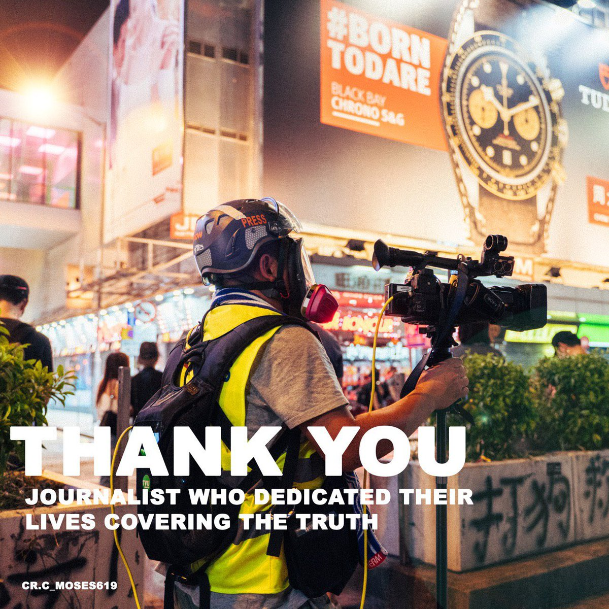
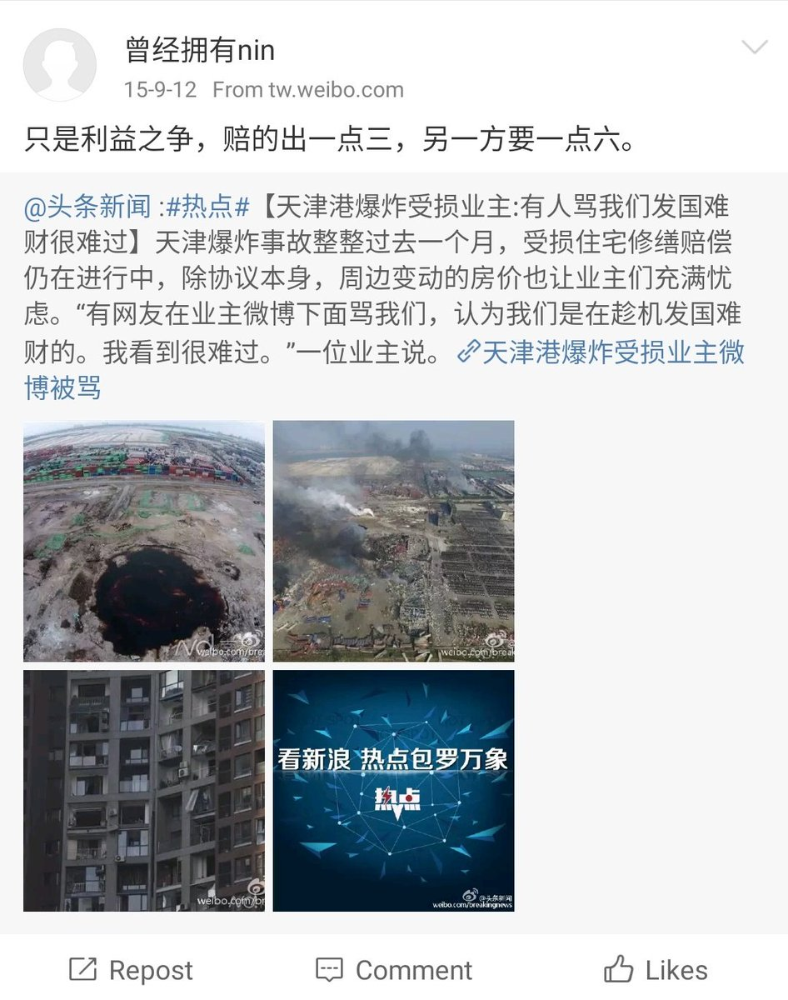

[10月28日 23:43]    BBC News 中文   @bbcchinese    这个悲剧发生在27年前的万圣节。 https://bbc.in/2BRLyUi   :speech_balloon:评:5 :+1:赞:23 :globe_with_meridians:转:12  

[10月28日 23:33]    财经真相   @caijingxiang    人民网评“解析区块链”时称，当前，区块链技术应用已延伸到数字金融、物联网、智能制造、供应链管理等多个领域。无论是出于维护公众安全考虑，还是着眼行业健康发展，都务须高度重视其管理问题。互联网不是法外之地，号称“去中心化”的区块链也不能成为法外之地，必须用好管好。  :speech_balloon:评:15 :+1:赞:42 :globe_with_meridians:转:12  

[10月28日 21:30]    BBC News 中文   @bbcchinese    又延期了。约翰逊首相不是说“宁可死在沟里也不延”吗？ https://bbc.in/2BQju3q   :speech_balloon:评:16 :+1:赞:23 :globe_with_meridians:转:9  

[10月28日 21:12]    BBC News 中文   @bbcchinese    死者到底是谁？来自哪个国家？为你介绍英国法医可能使用的五种查验办法。 https://bbc.in/32PrD42   :speech_balloon:评:34 :+1:赞:37 :globe_with_meridians:转:17  

[10月28日 21:00]    纽约时报中文网   @nytchinese    近年来，随着全球股市稳步走高，越来越多的投资者转向被动投资。
随着中国经济持续增长，指数提供商增加了中国股票的权重。此举对北京来说是一场胜利，可以将资金注入中国市场，并帮助提升中国企业及其货币人民币的国际形象。 http://nyti.ms/2Woe9Km   :speech_balloon:评:2 :+1:赞:5 :globe_with_meridians:转:1  

[10月28日 20:51]    财经真相   @caijingxiang    逢高空两手比特币，但愿能够赚够一个娶区块链女神的钱！  :speech_balloon:评:30 :+1:赞:86 :globe_with_meridians:转:15  

[10月28日 20:25]    新闻大吐槽   @TuCaoFakeNews    复读机呀 整点花样好不好 没底气的人才乱嚷嚷呢  :speech_balloon:评:0 :+1:赞:1 :globe_with_meridians:转:1  

[10月28日 20:11]    新闻大吐槽   @TuCaoFakeNews    爱大清，老佛爷万岁！  :speech_balloon:评:1 :+1:赞:1 :globe_with_meridians:转:1  

[10月28日 20:01]    BBC News 中文   @bbcchinese    【香港示威：什么是黄丝和蓝丝餐厅？】支持与反对示威的市民，各自光顾不同政治立场的食店，你怎么看这现象？ https://bbc.in/2NlW8s1   :speech_balloon:评:25 :+1:赞:31 :globe_with_meridians:转:12  

[10月28日 20:00]    纽约时报中文网   @nytchinese    美国一直在其最先进的武器中使用曾经只在本国生产的电子元件。芯片可以辅助坦克、飞机、火箭和舰船的导航、互相通讯，以及攻击敌方目标。
但许多芯片的国内生产线早已转移至国外，让人担心一旦国外出现政治或军事危机，供应会遭到中断。 http://nyti.ms/32W14dq   :speech_balloon:评:8 :+1:赞:17 :globe_with_meridians:转:7  

[10月28日 19:45]    新闻大吐槽   @TuCaoFakeNews    可惜他們還是聽不懂 https://twitter.com/tucaofakenews/status/1188631888958640129 …  :speech_balloon:评:1 :+1:赞:16 :globe_with_meridians:转:5  

[10月28日 19:42]    墙国铁拳现世报😷   @Socialistfist    药房老板现时仍未回港，店员胡先生今日戴上口罩回店内用漂白水清洁，四名便衣警员到药房表示「唔好意思」，期望药房体谅，他坦言唯有接受道歉。
胡先生续指，估计损失约 1,000 元。他提到，昨晚蘗房已拉半闸，警方未有举起黑旗便施放催泪弹，形容警方是「乱咁射」，但需老板回港后才决定是否追究。  :speech_balloon:评:1 :+1:赞:30 :globe_with_meridians:转:6  

[10月28日 19:39]    墙国铁拳现世报😷   @Socialistfist    尖沙咀发起集会，演变成多处警民冲突，其中晚上警方施放的一枚催泪弹射入位于弥敦道的「明寅药房」，警方今早约4 名便衣警员到店舖道歉，向员工表示「唔好意思」。警员逗留约 2 分钟后离开，并无解释催泪弹射入药房的原因。  :speech_balloon:评:2 :+1:赞:32 :globe_with_meridians:转:5  

[10月28日 19:39]    墙国铁拳现世报😷   @Socialistfist    陈柏雄, 药房东主，在FB上撑警及赞同六四镇压嘅言论，包括他在10月5日发表「当年出坦克车，原来是最正确决定！」、10月8日称抗争者为「暴徒、垃圾废青、曱甴」，又称听到「兄弟、手足」令佢「作呕」。  :speech_balloon:评:1 :+1:赞:31 :globe_with_meridians:转:2  

[10月28日 19:38]    墙国铁拳现世报😷   @Socialistfist    铁拳是最好的决定

感谢香港推友，更多详情请看本推后续推文
#社会主义铁拳
#社会主义特别行政区铁拳  https://twitter.com/BeLightinHK/status/1188465234391883776 …  :speech_balloon:评:6 :+1:赞:87 :globe_with_meridians:转:24  

[10月28日 19:37]    新闻大吐槽   @TuCaoFakeNews      :speech_balloon:评:1 :+1:赞:4 :globe_with_meridians:转:1  

[10月28日 19:37]    新闻大吐槽   @TuCaoFakeNews    马云作为股东怎么不出来谴责一下  :speech_balloon:评:1 :+1:赞:5 :globe_with_meridians:转:1  

[10月28日 19:36]    新闻大吐槽   @TuCaoFakeNews    记者中弹第一视角！感受一下橡胶子弹的威力！

这位中枪的记者来自南华早报，英文名Mantai Chow  :speech_balloon:评:4 :+1:赞:51 :globe_with_meridians:转:37  

[10月28日 19:24]    新闻大吐槽   @TuCaoFakeNews    有理有節。大媽，你都係 HKer. 好 https://twitter.com/TuCaoFakeNews/status/1188476124365385728 …  :speech_balloon:评:0 :+1:赞:24 :globe_with_meridians:转:5  

[10月28日 19:19]    新闻大吐槽   @TuCaoFakeNews    這阿姐幸苦了，苦口婆心的，但恐怕惡魔是聽不懂人話  :speech_balloon:评:0 :+1:赞:7 :globe_with_meridians:转:2  

[10月28日 19:09]    新闻大吐槽   @TuCaoFakeNews     https://www.epochtimes.com/b5/19/10/19/n11598613.htm …
中共派出大量武警公安進駐香港
中共造假説謊！然後衍生出種種無底線的邪惡，讓善良無辜的人一直被迫害！
   :speech_balloon:评:0 :+1:赞:18 :globe_with_meridians:转:8  

[10月28日 19:05]    新闻大吐槽   @TuCaoFakeNews    這個挺港中國人，以前是中國的維權律師，幫人打官司被抓坐牢出來以後就好像是去美國申請政治庇護了！好像是美國  :speech_balloon:评:0 :+1:赞:7 :globe_with_meridians:转:1  

[10月28日 19:01]    BBC News 中文   @bbcchinese    所罗门群岛司法部长日前裁定中国的森田集团租借该国图拉吉岛的协议“非法”，尽管没有证据显示该公司与中国政府有直接关系。 https://bbc.in/2JoCXfO   :speech_balloon:评:15 :+1:赞:34 :globe_with_meridians:转:11  

[10月28日 18:55]    新闻大吐槽   @TuCaoFakeNews    我建议:各个国家、地区的政府，强力遣返不说文明话的人，因为不文明言行怎能在文明地方待?不文明言行的人，95%以上是极暴匪盗组织(共产党和中国现政府)人员或是它的雇佣人。 https://twitter.com/TuCaoFakeNews/status/1188696072987660293 …  :speech_balloon:评:2 :+1:赞:17 :globe_with_meridians:转:5  

[10月28日 18:49]    纽约时报中文网   @nytchinese    中美之间的竞争已扩散至两国的金融关系，导致华盛顿的安全事务鹰派与华尔街的投资者之间的对立。
特朗普政府官员和两党议员希望通过限制投资的方式阻止联邦雇员的退休基金流向中国公司，但商界领袖和华尔街称，限制投资构成了政府干预，可能会破坏金融市场的稳定。 http://nyti.ms/2Woe9Km   :speech_balloon:评:9 :+1:赞:25 :globe_with_meridians:转:11  

[10月28日 18:25]    财经真相   @caijingxiang    公司一愤青，感慨说：三女行，漂亮者必有男友焉，丑陋者必是灯泡也！悲夫，大学机会已过，注定光棍乎？话音刚落，办公室笑喷了，一轻薄男答曰：有钱，或可改变命运也！一女愤怒道：你们都要漂亮的，丑女就该直接守活寡吗？办公室安静了！  :speech_balloon:评:17 :+1:赞:100 :globe_with_meridians:转:10  

[10月28日 18:24]    老司机   @h5lpykl7tp6jjop    中国现在不是富了，是负了，负了一大批债！
未录完，实在太多。  :speech_balloon:评:18 :+1:赞:164 :globe_with_meridians:转:102  

[10月28日 18:21]    纽约时报中文网   @nytchinese    知情人士称，五角大楼官员鼓励芯片企业高管考虑在美国建造新的半导体生产线。他们称，如今美国愈发依赖海外（尤其是台湾的台积电）制造的芯片，随着中美关系持续紧张，一些人担心 ，在香港问题催化下，台湾供应商可能会被迫限产或停产。 http://nyti.ms/32W14dq   :speech_balloon:评:19 :+1:赞:87 :globe_with_meridians:转:33  

[10月28日 18:01]    BBC News 中文   @bbcchinese    6月爆发的香港“反送中”运动对一些在香港生活的大陆人来说是一场政治启蒙，令他们开始思考“我是谁”的身份认同问题。 https://bbc.in/2Nl0Vtw   :speech_balloon:评:164 :+1:赞:204 :globe_with_meridians:转:65  

[10月28日 17:51]    纽约时报中文网   @nytchinese    香港的领导人和警察已把示威者塑造为暴徒和暴力的自行执法者，试图在一线抗议者与更广泛的公众之间制造隔阂。
支持抗议运动目标的温和派人士对暴力表示越来越多的担忧，他们担心暴力行为正中北京的下怀，并削弱公众的支持。 http://nyti.ms/2BKxRX0   :speech_balloon:评:12 :+1:赞:13 :globe_with_meridians:转:3  

[10月28日 17:33]    财经真相   @caijingxiang    “幸福来得太突然？大家不相信中美就这么和好了，内生角度看，美元/人民币越低，客户越不结汇同时增加购汇，”一中资行交易员称。 都不是傻瓜，尤其是中国客户，大部分都是精英阶层，压根不信中共会“结构性改革”！ https://twitter.com/reuterscn/status/1188748290931728384 …  :speech_balloon:评:14 :+1:赞:197 :globe_with_meridians:转:68  

[10月28日 17:27]    新闻大吐槽   @TuCaoFakeNews    恭喜吹风机加入禁售名单倒计时  :speech_balloon:评:0 :+1:赞:4 :globe_with_meridians:转:1  

[10月28日 17:14]    BBC News 中文   @bbcchinese    英国营养基金会发表一份报告称，无论你年龄多大，如果能做出五种饮食改变，将有助于保护你的心脏免受心脏病和中风的威胁。 https://bbc.in/36bEGPg   :speech_balloon:评:3 :+1:赞:69 :globe_with_meridians:转:47  

[10月28日 16:34]    财经真相   @caijingxiang    本轮降息是美联储为了应对持续放缓的美国经济进行的“预防式降息”，并非真正意义的开启新一轮大规模货币宽松政策，正是这种在这种思维主导下，才导致美联储不情愿的降息。这也就注定了下一次重启降息将会相当遥远，也许只有等到美联储看到全面系统性的美国经济衰退。  :speech_balloon:评:1 :+1:赞:44 :globe_with_meridians:转:7  

[10月28日 16:28]    财经真相   @caijingxiang    本周四北京时间凌晨两点，美联储将进行本年度内第三次降息，市场料想这将是中期内最后一次降息，甚至不排除本轮降息就此终止。美联储会议将对未来采取按兵不动政策，黄金多头在基本面上将失去一大支撑，如果中美贸易谈判继续缓和，不排除黄金进行深度回调！  :speech_balloon:评:12 :+1:赞:84 :globe_with_meridians:转:18  

[10月28日 16:05]    新闻大吐槽   @TuCaoFakeNews    美女電玩家故意喊「Taiwan No.1」 一秒激怒陸玩家 https://www.youtube.com/watch?v=OQFpI6t6Ugs …  :speech_balloon:评:0 :+1:赞:20 :globe_with_meridians:转:2  

[10月28日 16:01]    新闻大吐槽   @TuCaoFakeNews    在加拿大，小粉红不敢动手
法治国家大家都有表达自由
口吐污言只能说明自己素质差  :speech_balloon:评:0 :+1:赞:28 :globe_with_meridians:转:1  

[10月28日 16:01]    BBC News 中文   @bbcchinese    2018年10月29日，印尼狮子航空一架波音737客机在起飞后坠毁，机上189人罹难。接近一年后，调查人员发布最终报告，称飞行员、维修人员和波音都存在失误。 https://bbc.in/36cw2QP   :speech_balloon:评:7 :+1:赞:31 :globe_with_meridians:转:12  

[10月28日 16:01]    纽约时报中文网   @nytchinese    香港抗议正将冲突与分歧带进美国各地的校园，并凸显出香港学生与来自中国大陆的同学之间的关系日益紧张。
大学官员面临着一项艰巨的任务，既要支持言论自由，又要避免疏远美国校园里最大的国际学生群体。 http://nyti.ms/2NhHulp   :speech_balloon:评:51 :+1:赞:98 :globe_with_meridians:转:46  

[10月28日 15:53]    新闻大吐槽   @TuCaoFakeNews    【重慶大廈感謝日】
10月25日有網民發起「感謝日」，有人舉辦重慶大廈美食祭，到餐廳消費支持少數族裔
充滿愛心的香港人  :speech_balloon:评:0 :+1:赞:45 :globe_with_meridians:转:17  

[10月28日 15:52]    老司机   @h5lpykl7tp6jjop    还提倡大家不吃肉，不给奸商赚钱的机会！可是当初不超生没给你们罚款的机会，如今老了养老咋办呢？你们连保证都不认账了！你们咋不把特供的机会让点给老百姓呢？  :speech_balloon:评:1 :+1:赞:7 :globe_with_meridians:转:0  

[10月28日 15:24]    新闻大吐槽   @TuCaoFakeNews    柒出國際系列
1:57個句好東西俾加拿大 #Canada 人學到了～ https://twitter.com/TuCaoFakeNews/status/1188696072987660293 …  :speech_balloon:评:0 :+1:赞:15 :globe_with_meridians:转:4  

[10月28日 15:21]    新闻大吐槽   @TuCaoFakeNews    文革从来没结束过，一直以某种形式继续存在。以前的小红卫兵变成了老红卫兵，现在党国又培养出了一批新的小红卫兵……  :speech_balloon:评:1 :+1:赞:17 :globe_with_meridians:转:3  

[10月28日 15:00]    纽约时报中文网   @nytchinese    如果让你列举几个有魅力的人，你会想起谁？也许是摇晃着马提尼酒杯的詹姆斯·邦德，或者是荧幕上妙语连珠的奥普拉·温弗瑞，也有人会说是大声说出“我有一个梦想”的马丁·路德·金......
到底是什么特质让这些魅力十足的人物如此受人爱戴呢？ http://nyti.ms/2pTyR8L   :speech_balloon:评:12 :+1:赞:27 :globe_with_meridians:转:15  

[10月28日 14:54]    新闻大吐槽   @TuCaoFakeNews    Stuck a couple of these around HKU’s law department and within 12 hours they are torn down. The fascist mainland students just cannot accept they have many non-fascist compatriots. 撕一貼百!  :speech_balloon:评:3 :+1:赞:256 :globe_with_meridians:转:172  

[10月28日 14:44]    新闻大吐槽   @TuCaoFakeNews    【大澳浮屍疑點重重】
10月26日晚7時許，有人在大澳近將軍石對開海面發現一名男性屍體，水警及消防接報出動打撈。初時據現場網民稱，警方表示死者十幾歲，但其後警方宣稱是四十多歲，？？
還有很多疑點，大家看後自己分析。總之香港現在非正常死亡率飛速上升  :speech_balloon:评:2 :+1:赞:125 :globe_with_meridians:转:108  

[10月28日 14:01]    BBC News 中文   @bbcchinese    特朗普将巴格达迪之死视为外交政策上的一大胜利，但这一结果能否给特朗普带来持久的政治利益？ https://bbc.in/2Pom0WH   :speech_balloon:评:6 :+1:赞:19 :globe_with_meridians:转:7  

[10月28日 14:00]    纽约时报中文网   @nytchinese    抗议者与当局陷入僵局，让人觉得这场运动似乎正越来越接近发生死亡的方向，甚至可能会导致中国军队的干预，这或进一步危及香港的公民自由。
抗议者说，因为政府不愿满足他们要求更多民主和调查警察行为的诉求，从而将他们逼向极端。当局认为，进一步的让步只会鼓励更多暴力。 http://nyti.ms/2BKxRX0   :speech_balloon:评:22 :+1:赞:21 :globe_with_meridians:转:7  

[10月28日 13:56]    新闻大吐槽   @TuCaoFakeNews    这次在加拿大挺港是大陆人，小粉红再次撒野，满嘴脏话，可笑的是，小粉红的丑态竟被路过的白人学会了，回怼了他一句国骂(1:57) ~
真是让人哭笑不得~  :speech_balloon:评:149 :+1:赞:1085 :globe_with_meridians:转:383  

[10月28日 13:31]    BBC News 中文   @bbcchinese    香港警方水炮車這次避開了清真寺。  :speech_balloon:评:65 :+1:赞:132 :globe_with_meridians:转:63  

[10月28日 13:16]    纽约时报中文网   @nytchinese    阿布·贝克尔·巴格达迪如何从一个沉默寡言的阿訇变成ISIS头目？在这篇时报讣告里，你可以从昔日同学、邻居、ISIS受害者的叙述中找到线索。 https://twitter.com/nytimes/status/1188666720854204417 …  :speech_balloon:评:2 :+1:赞:18 :globe_with_meridians:转:4  

[10月28日 13:00]    BBC News 中文   @bbcchinese    中国已经成了柬埔寨的最大债权国，反华情绪源自哪里？ https://bbc.in/2JseLJH   :speech_balloon:评:72 :+1:赞:89 :globe_with_meridians:转:39  

[10月28日 13:00]    纽约时报中文网   @nytchinese    #每日一词 Pro-life还是pro-choice。面对堕胎，你是生命派还是选择派？在时报观点文章中，一位母亲讲述了亲手“杀死”自己孩子的故事。尽管她自认为是个生命派(pro-life)，但在胎儿被诊断出严重脑部异常后，她和丈夫最终做出了选择派(pro-choice)的决定。
更多简报内容： http://nyti.ms/36dVchJ   :speech_balloon:评:0 :+1:赞:7 :globe_with_meridians:转:3  

[10月28日 12:45]    老司机   @h5lpykl7tp6jjop    对于最近猪肉涨价农业部重拳出击，要严厉打击炒猪客！说猪肉上涨原因是囤肉赚钱的奸商作祟，造谣猪瘟，抬高肉价，和解放前四大家族行为一样恶劣，肉价马上就会降下来，视频无法转播，发几张截图，不过把目前形势和临近垮台的国民党时期相提并论，这感觉是不是非常相似呵？慌得一比？  :speech_balloon:评:5 :+1:赞:24 :globe_with_meridians:转:10  

[10月28日 12:30]    老司机   @h5lpykl7tp6jjop    你家的人活不下去，宁愿花钱偷渡，居然你没有责任，满屏都是英国人的责任，不是老说自己是负责任的大国吗？这脸不要得也太离谱了吧！  :speech_balloon:评:7 :+1:赞:19 :globe_with_meridians:转:2  

[10月28日 12:30]    纽约时报中文网   @nytchinese    肥仔是个大学辍学生，擅长打电子游戏，和母亲住在一起。他同时也是一名足智多谋的指挥官，领导着一群杂乱的抗议者，冒着受伤和被捕的风险与警察对峙。
他和一群年轻的香港抗议者是反政府抗议活动的核心群体的一部分，对中共权威构成了大胆挑战。 http://nyti.ms/2BKxRX0   :speech_balloon:评:183 :+1:赞:290 :globe_with_meridians:转:99  

[10月28日 12:00]    BBC News 中文   @bbcchinese    政府想用楼房捆绑年轻人？ https://bbc.in/2pUWqOk   :speech_balloon:评:51 :+1:赞:54 :globe_with_meridians:转:25  

[10月28日 12:00]    纽约时报中文网   @nytchinese    智慧生活 
• 选择火葬时，需要注意什么？报告称，越来越多的美国人选择火葬而非土葬，这使得火葬成为临终仪式的新规范。
• 喝酸奶可能防癌：通过促进健康的肠道微生物组，高纤维饮食和酸奶等食品可能降低患肺癌的风险，即使对于吸烟者来说也是如此。
更多简报内容： http://nyti.ms/36dVchJ   :speech_balloon:评:1 :+1:赞:3 :globe_with_meridians:转:2  

[10月28日 11:41]    纽约时报中文网   @nytchinese    • 英国卡车司机被控过失杀人罪，以及39项协助非法移民和洗钱的指控。警方称确认受害者身份仍需时间；越南驻伦敦大使馆表示，正在核实受害者中是否有该国公民。
• 巴基斯坦小城近900名儿童艾滋病毒检测呈阳性，据信注射器的重复使用导致了该地区的艾滋大爆发。更多简报内容： http://nyti.ms/36dVchJ   :speech_balloon:评:7 :+1:赞:4 :globe_with_meridians:转:0  

[10月28日 11:30]    BBC News 中文   @bbcchinese    他提出一个设想：如果中国在俄罗斯空军帮助下进攻台湾，结果会如何？ https://bbc.in/366N2rr   :speech_balloon:评:300 :+1:赞:166 :globe_with_meridians:转:49  

[10月28日 11:00]    BBC News 中文   @bbcchinese    同志游行组织者说，今年游行人数与周边观光人数料突破20万人。 https://bbc.in/32SkZdr   :speech_balloon:评:14 :+1:赞:45 :globe_with_meridians:转:11  

[10月28日 10:48]    纽约时报中文网   @nytchinese    #图集【“金凯德大火”肆虐加州】加州山火持续，其中最大的“金凯德大火”迅速蔓延，令该州宣布进入紧急状态。时报摄影师在最前线记录下了山火造成的破坏、受灾的民众和消防员奋力灭火的景象。
点击查看图集： http://nyti.ms/31RCMAf   :speech_balloon:评:9 :+1:赞:11 :globe_with_meridians:转:2  

[10月28日 10:05]    BBC News 中文   @bbcchinese    【英国货柜车39死案：调查重点转向越南社区】BBC联系到6名越南人的家属，他们担心亲属可能已经遇难。 https://bbc.in/2Nk4Bf4   :speech_balloon:评:37 :+1:赞:19 :globe_with_meridians:转:6  

[10月28日 10:00]    纽约时报中文网   @nytchinese    “昨晚，美国将世界头号恐怖分子头目绳之以法。”特朗普在全国电视讲话上宣布，在美军周末在叙利亚展开的突袭行动中，ISIS头目阿布·贝克尔·巴格达迪死亡。
为何美国会展开这场突袭？巴格达迪如何从一个沉默寡言的阿訇变成恐怖分子头目？欢迎查看更多简报内容： http://nyti.ms/36dVchJ   :speech_balloon:评:6 :+1:赞:8 :globe_with_meridians:转:5  

[10月28日 09:54]    财经真相   @caijingxiang    猪肉价格上涨带来的通胀压力还未完全显现，最高峰出现的想两个月后的春节是不难猜测的，今年春节将是中国20年来最有记忆的一个！ https://twitter.com/caolei1/status/1188611532369711104 …  :speech_balloon:评:23 :+1:赞:335 :globe_with_meridians:转:103  

[10月28日 09:39]    纽约时报中文网   @nytchinese    从智利到黎巴嫩，什么点燃了全球抗议的怒火？ http://nyti.ms/2oiisu0 https://twitter.com/ccni/status/1187696798384742407 …  :speech_balloon:评:13 :+1:赞:8 :globe_with_meridians:转:2  

[10月28日 09:20]    BBC News 中文   @bbcchinese    中国的女性电影人成就非凡，但有关她们的故事并不为人所知。 https://bbc.in/365ADUU   :speech_balloon:评:1 :+1:赞:21 :globe_with_meridians:转:12  

[10月28日 09:05]    纽约时报中文网   @nytchinese    早安！今日重点新闻包括：
特朗普称ISIS头目死亡；对话香港前线抗议者；五角大楼担忧芯片供应安全；山火再次肆虐加州；路易威登母公司考虑收购蒂芙尼……NYT简报带你速览今日要闻。 http://nyti.ms/36dVchJ   :speech_balloon:评:17 :+1:赞:52 :globe_with_meridians:转:8  

[10月28日 08:25]    老司机   @h5lpykl7tp6jjop    我想知道，下一个被斩首的邪恶组织头目会是谁？  :speech_balloon:评:33 :+1:赞:221 :globe_with_meridians:转:56  

[10月28日 08:17]    凡賽堤/FORSETI   @FecharCCP    魔鬼在人間

極權殺人恐怖組織正在用各種兇殘手段殺害我們的同胞....................................................................................................

10月27日被極權殺人恐怖組織非法濫捕的香港年輕人已經超過200+ 人！  :speech_balloon:评:0 :+1:赞:16 :globe_with_meridians:转:13  

[10月28日 07:49]    凡賽堤/FORSETI   @FecharCCP    魔鬼在人間

極權殺人恐怖組織正在用各種兇殘手段殺害我們的同胞....................................................................................................

26日又有一10歲出頭的小孩被棄屍大海！  :speech_balloon:评:0 :+1:赞:13 :globe_with_meridians:转:13  

[10月28日 06:22]    BBC News 中文   @bbcchinese    澳大利亞維多利亞州政府在北京簽署「一帶一路」協議引起聯邦政府質疑，中國海外雄心勃勃的大規模基建被認為施展「銳實力」，對西方國家的制度和價值觀構成挑戰。 https://bbc.in/340zY54   :speech_balloon:评:52 :+1:赞:97 :globe_with_meridians:转:34  

[10月28日 04:29]    老司机   @h5lpykl7tp6jjop    香港孩子早熟参加示威爭自由！
大陆孩子早熟强奸女孩杀老师！ https://twitter.com/jamie_noir/status/1188376870502334466 …  :speech_balloon:评:1 :+1:赞:30 :globe_with_meridians:转:6  

[10月28日 04:23]    老司机   @h5lpykl7tp6jjop    英國港口卡車廂39名偷渡者凍死案最新進展：
越南已經認領，中共抓捕家屬。

20人為越南人家屬已報案，經越政府與英國方面溝通確認。

19人是福建省福清長樂人，中共指其給黨和國家抹黑，拒絕與英國協調。有當地人爆料稱，中共地方官員不僅拒絕家屬報案，而且逮捕約100人，防止與外媒記者接觸。转 https://twitter.com/japanaqi/status/1188174511209762816 …  :speech_balloon:评:76 :+1:赞:613 :globe_with_meridians:转:366  

[10月28日 00:35]    凡賽堤/FORSETI   @FecharCCP    人類最恐怖的極權殺人恐怖組織！
警察蒙面公開殺人，毆打，暴打，非法濫捕，暗殺市民！

CCP的極權殺人恐怖組織比本拉登還恐怖一萬倍！

這是一個老人  :speech_balloon:评:0 :+1:赞:3 :globe_with_meridians:转:7  

[10月28日 00:20]    凡賽堤/FORSETI   @FecharCCP    人類最恐怖的極權殺人恐怖組織！
警察蒙面公開殺人，毆打，暴打，非法濫捕，暗殺市民！

CCP的極權殺人恐怖組織比本拉登還恐怖一萬倍！  :speech_balloon:评:3 :+1:赞:196 :globe_with_meridians:转:159  

[10月28日 00:11]    凡賽堤/FORSETI   @FecharCCP    人類最恐怖的極權殺人恐怖組織！
警察蒙面公開殺人，毆打，暴打，非法濫捕，暗殺市民！

CCP的極權殺人恐怖組織比本拉登還恐怖一萬倍！  :speech_balloon:评:4 :+1:赞:126 :globe_with_meridians:转:81  

[10月28日 00:03]    BBC News 中文   @bbcchinese    史迪威说，（中国的）这些要求，并非完全没有法理，历史或地理依据，但是它让其它国家付出了代价。他认为中国为维护“九段线”不断挑衅东盟国家，阻止他们进入资源丰富的南海，造成了地区不稳定，增加了冲突风险。 https://bbc.in/2WlX3wG   :speech_balloon:评:54 :+1:赞:68 :globe_with_meridians:转:25  

[10月27日 23:59]    凡賽堤/FORSETI   @FecharCCP    人類最恐怖的極權殺人恐怖組織！
警察蒙面公開殺人，毆打，暴打，非法濫捕，暗殺市民！

已經被雙手反綁的學生，極權殺人恐怖組織還要把人往死裡整！全人類唯一一個最恐怖的極權殺人恐怖組織！  :speech_balloon:评:0 :+1:赞:7 :globe_with_meridians:转:9  

[10月27日 23:56]    凡賽堤/FORSETI   @FecharCCP    人類最恐怖的極權殺人恐怖組織！
警察蒙面公開殺人，毆打，暴打，非法濫捕，暗殺市民，  :speech_balloon:评:0 :+1:赞:12 :globe_with_meridians:转:13  

[10月27日 23:53]    凡賽堤/FORSETI   @FecharCCP    人類最恐怖的極權殺人恐怖組織！
警察蒙面公開殺人，毆打，暴打，非法濫捕，暗殺市民，  :speech_balloon:评:0 :+1:赞:9 :globe_with_meridians:转:4  

[10月27日 23:45]    凡賽堤/FORSETI   @FecharCCP    魔鬼的殺人罪行！

陳彥霖母女均被極權殺人恐怖組織殺害！  :speech_balloon:评:3 :+1:赞:33 :globe_with_meridians:转:30  

[10月27日 22:59]    老司机   @h5lpykl7tp6jjop    猪肉价格失控  :speech_balloon:评:50 :+1:赞:322 :globe_with_meridians:转:144  

[10月27日 21:33]    BBC News 中文   @bbcchinese    美国总统特朗普宣布，“伊斯兰国”（IS）组织头目巴格达迪在美军的突袭行动中引爆自杀式背心身亡。 ​​​​ https://bbc.in/2WhHmq9   :speech_balloon:评:21 :+1:赞:208 :globe_with_meridians:转:57  

[10月27日 20:23]    老司机   @h5lpykl7tp6jjop    幹得好！
既然你們英文不行，那我說粵語好了。

重慶大廈老外用廣東話粗口‘D'警察。  :speech_balloon:评:44 :+1:赞:1214 :globe_with_meridians:转:545  

[10月27日 20:22]    BBC News 中文   @bbcchinese    “英国集装箱案”发生至今，遇难者身份仍未确定。警方此前称遇难者“都是中国公民”，但随着越来越多越南家庭报案，警方表示，将把调查重点转向越南社区。  :speech_balloon:评:308 :+1:赞:330 :globe_with_meridians:转:149  

[10月27日 19:55]    墙国铁拳现世报😷   @Socialistfist    感谢众多推友投稿，感谢维尼之声的大力支持  :speech_balloon:评:0 :+1:赞:69 :globe_with_meridians:转:0  

[10月27日 19:54]    墙国铁拳现世报😷   @Socialistfist    不忘初心，牢记帮规
------镰刀斧头帮总舵主
#社会主义铁拳  :speech_balloon:评:16 :+1:赞:225 :globe_with_meridians:转:69  

[10月27日 19:19]    老司机   @h5lpykl7tp6jjop    【10月27日香港老伯痛斥大陆警察冒充港警】："我看著香港警察長大，尊敬了香港警察很多年，如今變成這樣！為什麼讓大陸公安混入警隊欺负港人？我們不服大陸公安 "  :speech_balloon:评:17 :+1:赞:488 :globe_with_meridians:转:211  

[10月27日 19:09]    老司机   @h5lpykl7tp6jjop    【10. 27追究警暴】10.27在尖沙咀追究警爆活動中，一位太太完全不怕眼前大陣仗的防暴警，不斷對警察用廣東話碎碎唸，旁邊的先生聽了笑著說：你要說國語。太太糾正「不是國語是普通話」 .  :speech_balloon:评:0 :+1:赞:44 :globe_with_meridians:转:24  

[10月27日 19:08]    老司机   @h5lpykl7tp6jjop     https://twitter.com/9ovvv/status/1188386074315198464 …  :speech_balloon:评:0 :+1:赞:1 :globe_with_meridians:转:1  

[10月27日 18:57]    老司机   @h5lpykl7tp6jjop    谁是暴徒?？
匪警!  :speech_balloon:评:16 :+1:赞:225 :globe_with_meridians:转:138  

[10月27日 17:14]    老司机   @h5lpykl7tp6jjop    This is great!!  Crowd erupts as the big screen TV on top of them starts playing video of #HKPolice and what they did

#HongKong #HongKongProtests  :speech_balloon:评:58 :+1:赞:1695 :globe_with_meridians:转:1171  

[10月27日 17:00]    纽约时报中文网   @nytchinese    #一周热门 当“深层政府”向特朗普展开“复仇”行动 http://nyti.ms/362aQg9   :speech_balloon:评:7 :+1:赞:14 :globe_with_meridians:转:3  

[10月27日 15:34]    老司机   @h5lpykl7tp6jjop    中共一直宣扬对敌斗争仇恨教育，从幼儿园就学扛枪消灭敌人，终于结出恶果，少年犯罪低龄化，15岁男孩砖头谋杀老师！鲜血飞溅！10秒狠砸9下！ 13岁男孩残杀性侵10岁女孩！事后若无其事轻松抖腿面对镜头，这些少年杀人魔因为年龄不够不负刑事责任，每天满大街城管警察暴力殴打民众做示范，这个社会能好吗  :speech_balloon:评:3 :+1:赞:82 :globe_with_meridians:转:27  

[10月27日 15:00]    纽约时报中文网   @nytchinese    #一周热门 为什么亿万富翁还要继续工作？ http://nyti.ms/32ygJj0   :speech_balloon:评:11 :+1:赞:22 :globe_with_meridians:转:15  

[10月27日 13:00]    纽约时报中文网   @nytchinese    #一周热门 日本德仁天皇正式登基，典礼看点回顾 http://nyti.ms/2pNe868   :speech_balloon:评:4 :+1:赞:24 :globe_with_meridians:转:3  

[10月27日 12:54]    财经真相   @caijingxiang    币圈的人来解释一下！所谓的去中心化！ https://twitter.com/zhanglucy88/status/1188308918759329794 …  :speech_balloon:评:48 :+1:赞:100 :globe_with_meridians:转:23  

[10月27日 10:47]    财经真相   @caijingxiang    新华社：《中华人民共和国密码法》已由中华人民共和国第十三届全国人民代表大会常务委员会第十四次会议于2019年10月26日通过，现予公布，自2020年1月1日起施行。  :speech_balloon:评:36 :+1:赞:123 :globe_with_meridians:转:52  

[10月27日 08:55]    财经真相   @caijingxiang    花那么多口水说虚拟货币，不是为了和币圈人抬杠，而是把这个所谓“专业”的技术撕开看看里面究竟是什么玩意儿。我最担心的就是中共以央行为后盾搞的虚拟币，如果它像支付宝一样给点红包优惠，引诱中国普通老百姓使用，他们完全可以做到的，这才是最恐怖的，一但中共倒台他们把数据存储一毁，就是地狱！  :speech_balloon:评:32 :+1:赞:184 :globe_with_meridians:转:53  

[10月27日 08:47]    财经真相   @caijingxiang    扎克伯格搞加密货币初心也是这样，他跑到国会忽悠的一大理由就是要和中国竞争，冠冕堂皇理由背后就是再复制一次中本聪的成功！中共央行搞虚拟币本意是无法封杀虚拟币金融骗局，干脆以国家之力自己搞个更大骗局，而且是第一个政府背书的骗局，这也是中共最无赖最不要脸点之处！  :speech_balloon:评:11 :+1:赞:174 :globe_with_meridians:转:36  

[10月27日 08:40]    财经真相   @caijingxiang    看一堆币圈人留言说我不懂装专家，这个有那么神秘吗？本质就是圈钱，如果说中本聪搞比特币初心还有点理想主义（打破政府货币垄断），那么后面再搞各种币就剩下圈钱一个目的，一针见血的评价：每个搞虚拟币的人，都有成为第二个中本聪的梦！就么简单，少装神弄鬼，别扯什么专业理想！  :speech_balloon:评:39 :+1:赞:335 :globe_with_meridians:转:59  

[10月27日 04:11]    老司机   @h5lpykl7tp6jjop    好文转发《两种完全不同的价值观》

 https://mp.weixin.qq.com/s/Fr1Bs65lyLIlzHozY0Q6jA …  :speech_balloon:评:5 :+1:赞:5 :globe_with_meridians:转:0  

[10月27日 03:51]    老司机   @h5lpykl7tp6jjop    这种超级想象力用在技术创新上还可以有用，用来舔裆太臭了！  :speech_balloon:评:8 :+1:赞:55 :globe_with_meridians:转:12  

[10月26日 22:55]    财经真相   @caijingxiang    比特币买价与卖价，再同一时间围绕着市场报价，差价最大两千美元！  :speech_balloon:评:32 :+1:赞:53 :globe_with_meridians:转:12  

[10月26日 22:42]    老司机   @h5lpykl7tp6jjop    In #YuenLong, riot #police subdued a man who was smoking. One of them jumped on him after he was subdued. Minimum force?
Credit - Live of Apple Daily
#HongKongPolice = #HongKongRioters
#PoliceBrutality #PoliceState #StandWithHongKong #FreeHongKong  :speech_balloon:评:172 :+1:赞:2095 :globe_with_meridians:转:2140  

[10月26日 22:04]    老司机   @h5lpykl7tp6jjop    10月1号阅兵做为受邀功臣坐在天安门观礼台，这特么的才几天功夫就成黑社会保护伞了  :speech_balloon:评:62 :+1:赞:1104 :globe_with_meridians:转:523  

[10月26日 19:08]    墙国铁拳现世报😷   @Socialistfist    生活在这个太平盛世
（除了村里恶霸从14年偷排污染超过30倍废物并在17年到维稳中心打人并且发出死亡威胁以外）
 感恩！

#社会主义铁拳
长文警告  :speech_balloon:评:37 :+1:赞:317 :globe_with_meridians:转:89  

[10月26日 18:06]    财经真相   @caijingxiang    比特币接入暗网那一刻时，就已经不是理想主义者、极客、码农们能够控制的，是有庞大的力量介入了进去，比特币追随者只鼓吹比特币如何便利，却从不谈在暗网上的人口贩卖，甚至直播比特币打赏杀人，那一幕至今让我做噩梦！  :speech_balloon:评:74 :+1:赞:510 :globe_with_meridians:转:136  

[10月26日 17:46]    财经真相   @caijingxiang    该网站只面向匿名软件Tor的使用者，这就是著名的暗网（dark web），随后比特币交易量完全失控。中本聪也在这个时候彻底消失，再也没有人见他出现在网上。但是世人都猜测他手里拥有大量比特币，有人估算是总数的5%，这在今天完全可以算是富可敌国的天量财富！  :speech_balloon:评:6 :+1:赞:68 :globe_with_meridians:转:10  

[10月26日 17:40]    财经真相   @caijingxiang    2010年12月维基解密事件爆发，当时全世界支付机构迫于美国政府压力都拒绝为维基解密捐款，唯有比特币可以，比特币借此名扬世界。两个月后一些理想主义者决定测试比特币规避政府控制的能力，并创建了一个“丝绸之路”的网站，主要是类似亚马逊在线交易，出售一些不住政府控制范围内的非法商品！  :speech_balloon:评:2 :+1:赞:61 :globe_with_meridians:转:11  

[10月26日 17:32]    财经真相   @caijingxiang    2010年4月发生了一起著名事件，一个叫拉撕洛·汉耶滋的程序员用一万个比特币购买了两份披萨饼，这是比特币第一次真正意义上的有用价值购买商品。2010年7月，颇受欢迎的科技新闻聚合网站斜线点，在头版推出了这个有趣的故事，随后斜点应用程序下载飙升7倍，这是比特币第一次真正的成为公众新闻！  :speech_balloon:评:2 :+1:赞:25 :globe_with_meridians:转:5  

[10月26日 17:25]    财经真相   @caijingxiang    随后又有两个程序员加入进来，他们是加文·安德森和马蒂·玛丽米并帮中本聪建立了一个网站，还改进了比特币代码，这就是比特币的诞生。2009年秋他们还为这群人建立了一个论坛。但是这是比特币依旧没法支付和购买商品，只是几个专业小网站可以购买象征价值的贴纸和程序员常用物品！  :speech_balloon:评:2 :+1:赞:20 :globe_with_meridians:转:5  

[10月26日 17:17]    财经真相   @caijingxiang    后来他把想法发到了一个研究数字加密的公共邮箱，以及一个叫做点对点基金会的网站上。在这里有一个叫哈尔·芬尼的程序员，觉得这个想法很有价值，就和中本聪一起进行编码，2009年年初他收到了中本聪的第一个比特币，但那时几乎不值钱！  :speech_balloon:评:3 :+1:赞:24 :globe_with_meridians:转:3  

[10月26日 17:11]    财经真相   @caijingxiang    2008年8月密码学家亚当·巴克收到了一个叫中本聪发来的邮件，提出虚拟货币这个新概念，但是他并未理会，因为这种想法早在1992年就有人跟他提起过，但他都没有采纳，更别说一个陌生人，这是人们第一次听说中本聪这个人！尽管被拒但是他还是为这种新型货币编写三分之一的开源代码！  :speech_balloon:评:10 :+1:赞:121 :globe_with_meridians:转:26  

[10月26日 13:52]    老司机   @h5lpykl7tp6jjop    為什麼警察不讓那個歌手在街頭賣唱，因為他唱榮歸香港，警察害怕引起周圍觀眾的共鳴和附和。這個歌手真有骨氣，把警察蓋在他麥克風上的警帽扔到地上，無言的向警察抗議這是我的私有財產。當警察想把他拉走的時候，周圍的人一下就轟叫起來唱歌也拉嗎？很感動港人的傲骨和正義！堅持你們的良知，你們必勝  :speech_balloon:评:214 :+1:赞:3691 :globe_with_meridians:转:1796  

[10月26日 01:00]    GFHG SDKM   @zyx_yny    A Hong Kong protestor was severely injured by pepper spray with unknown chemicals.
Source: Workercom@facebook

#HongKongProtesters #policestate #HKPolice  :speech_balloon:评:3 :+1:赞:17 :globe_with_meridians:转:16  

[10月26日 00:17]    GFHG SDKM   @zyx_yny    I will not forget#StandWithHongKong #StandWithHK https://twitter.com/we_hkers/status/1187406398834933760 …  :speech_balloon:评:2 :+1:赞:23 :globe_with_meridians:转:17  

[10月25日 20:55]    GFHG SDKM   @zyx_yny    Oops..... 
#HongKongProtests #HongKong #HongKongers #StandWithHK #hkpolicebrutality #HKPoliceTerrorism #hkpolicestate #BloodyCarrie  :speech_balloon:评:0 :+1:赞:9 :globe_with_meridians:转:5  

[10月25日 20:21]    墙国铁拳现世报😷   @Socialistfist    感谢提供的推友，原帖已经删除  :speech_balloon:评:0 :+1:赞:89 :globe_with_meridians:转:2  

[10月25日 20:18]    墙国铁拳现世报😷   @Socialistfist    哦， 原来不是正规军

#社会主义铁拳  :speech_balloon:评:33 :+1:赞:298 :globe_with_meridians:转:74  

[10月25日 19:49]    墙国铁拳现世报😷   @Socialistfist    补图  :speech_balloon:评:1 :+1:赞:60 :globe_with_meridians:转:8  

[10月25日 19:48]    墙国铁拳现世报😷   @Socialistfist    只是姓赵和赵家人，有本质区别

#社会主义铁拳  :speech_balloon:评:32 :+1:赞:269 :globe_with_meridians:转:80  

[10月25日 17:01]    GFHG SDKM   @zyx_yny    等睇警方開記者會飲「藍水」

警隊曾稱水跑車嘅顔色水為食用色素，對人體冇害，係可飲用食水
依家化驗就揭發，所謂嘅顏色水裡面係含有黏合劑或混有害催淚溶液
 #香港原創 #香港插圖 #香港插畫 #畫 #落書き #マンガ #イラスト #日本留学 #夢叶 #插畫 #漫畫 #四人頭 #手繪#文宣收集處 #文宣組  :speech_balloon:评:10 :+1:赞:195 :globe_with_meridians:转:116  

[10月25日 16:14]    墙国铁拳现世报😷   @Socialistfist    翻face比翻book还快  :speech_balloon:评:3 :+1:赞:50 :globe_with_meridians:转:9  

[10月25日 11:54]    GFHG SDKM   @zyx_yny    So this just happened at the Shanghai food expo, food booths were setup for people to try, and uh, well, take a look...

A person from Europe said "I've been exhibiting in nearly 100 countries and have never seen anything like this, not even in Africa"  :speech_balloon:评:344 :+1:赞:2107 :globe_with_meridians:转:1275  

[10月25日 10:33]    GFHG SDKM   @zyx_yny    My interview with @matanevenoff, the legend who baited the cameraman with his #StandWithHongKong T-shirt during Dance Cam at the #Lakers/#Clippers game opening night in the #NBA

Thanks for showing HK your support Matan!
#HongKong #HongKongProtests  :speech_balloon:评:189 :+1:赞:3132 :globe_with_meridians:转:1560  

[10月25日 10:26]    GFHG SDKM   @zyx_yny    兄弟爬山 https://twitter.com/thkag_can/status/1187536917828648960 …  :speech_balloon:评:0 :+1:赞:1 :globe_with_meridians:转:0  

[10月25日 08:30]    GFHG SDKM   @zyx_yny    Kowloon Bay.  Citizens who would normally take MTR to work today are protesting by walking to work.  You can see the entire street from beginning to end is filled with people

Fighting for a good cause and getting exercise = win!

#HongKong #HongKongProtests  :speech_balloon:评:72 :+1:赞:2400 :globe_with_meridians:转:1392  

[10月25日 07:29]    GFHG SDKM   @zyx_yny    Singing is illegal in Hong kong now？！
this young man outside was forced to stop singing the HK anthem “Glory to Hong Kong”by HK police！
video from @ilovehkgers
#FreeHongKong #StandWithHongKong  :speech_balloon:评:150 :+1:赞:2153 :globe_with_meridians:转:1477  

[10月25日 07:03]    GFHG SDKM   @zyx_yny    3rd video in my eng sub series.  Chinese nationalist showing unconditional love for his country at a flower shop in Prince Edward.  Gotta admit, of all the arguments from the pro-China camp, his is the most convincing! 
#HongKong #HongKongProtests

Orig vid from @ajmm19923493  :speech_balloon:评:33 :+1:赞:234 :globe_with_meridians:转:178  

[10月25日 04:10]    GFHG SDKM   @zyx_yny    Couldn't have said it better than @VP Pence today: "American corporations should stand up for American values here at home and around the world." 

Today and every day, I am proud to #StandWithHongKong  :speech_balloon:评:897 :+1:赞:8375 :globe_with_meridians:转:4728  

[10月25日 03:11]    新闻大吐槽   @TuCaoFakeNews    给抗争者提供免费餐的良心餐厅「龙门冰室」昨天被黑社会砸了，市民念这家餐厅的好，在店门口排起了长队，希望用自己的行动来支持有正义感的餐厅！

亲共的美心月饼被砸后，从未听说，有人自发为这家爱国店铺做点什么，看来所谓的爱国更多是谋私利而不顾公义，蓝丝是个伪命题  :speech_balloon:评:134 :+1:赞:3301 :globe_with_meridians:转:1271  

[10月25日 01:20]    GFHG SDKM   @zyx_yny    US Vice President @VP Mike Pence to #HongKongProtesters :

"To the millions in Hong Kong who have been peacefully demonstrating to protect your rights these past months, we stand with you. We are inspired by you."

Thank you @VP!

#FightForFreedom #StandWithHongKong  :speech_balloon:评:49 :+1:赞:1119 :globe_with_meridians:转:634  

[10月25日 01:08]    GFHG SDKM   @zyx_yny      :speech_balloon:评:683 :+1:赞:4985 :globe_with_meridians:转:2674  

[10月25日 00:26]    凡賽堤/FORSETI   @FecharCCP    緊急找尋  :speech_balloon:评:0 :+1:赞:7 :globe_with_meridians:转:6  

[10月24日 23:58]    凡賽堤/FORSETI   @FecharCCP    何韻詩！香港女兒，華人的典範，華人21世紀的巾幗英雄，華人最完美的最值得華人崇拜的國際巨星！！！  :speech_balloon:评:66 :+1:赞:418 :globe_with_meridians:转:131  

[10月24日 23:44]    凡賽堤/FORSETI   @FecharCCP    華人歷史上將永久記住這一刻，
2019年6月9日以來當香港人超過200萬人向政府提出訴求，
用最文明，最和平，最友好的方式遊行，而政府卻用最暴力，最兇殘，最卑鄙的手段僱傭黑社會組織和在職警察，以及大陸警察，武警，部隊喬裝成黑衣人在香港全社會進行大規模暗殺，暴打市民，破環公共設施等嫁禍給港人  :speech_balloon:评:18 :+1:赞:184 :globe_with_meridians:转:115  

[10月24日 23:39]    GFHG SDKM   @zyx_yny    International guidelines for use of water cannons have not been followed by #Hongkong police:
• Do not fire at close range
• Do not fire directly at ppl's bodies
• Allow sufficient time for ppl to disperse before firing
• Do not fire when no crowds are present
ALL VIOLATED https://twitter.com/wwkk27744741/status/1187384284530794496 …  :speech_balloon:评:12 :+1:赞:158 :globe_with_meridians:转:135  

[10月24日 21:26]    GFHG SDKM   @zyx_yny    佢地用我地國歌改加泰文唱
雖然我一個字都聽唔明但我好感動 眼濕濕

我有少少慚愧 人地支持我地支持到比人打 我地對今晚既集會仲咁大顧慮

#StandWithHK #FightForFreedom #FreedomFighter #FiveDemandsNotOneLess #Catalonia  :speech_balloon:评:30 :+1:赞:826 :globe_with_meridians:转:370  

[10月24日 21:14]    GFHG SDKM   @zyx_yny    Outside a #Catalonia's rally, some #China's nationalists were waving their flags.

They then JUMP KICKED a Catalan passerby holding slogan of "Liberate #HongKong. The revolution of our times." & tore it off. 

One of them attacked the journalist streaming the whole thing.

Rude.  :speech_balloon:评:63 :+1:赞:587 :globe_with_meridians:转:578  

[10月24日 18:59]    墙国铁拳现世报😷   @Socialistfist    Facebook CEO 可能是目前为止吃到铁拳中身价最高的了。他学习中文，看习近平著作，到天安门跑步。
花了5年时间他和他的团队才弄明白中国“从来不让我们进入”。
#社会主义铁拳  :speech_balloon:评:83 :+1:赞:1224 :globe_with_meridians:转:420  

[10月24日 18:37]    GFHG SDKM   @zyx_yny    

I really like this #Shout4HK as we need to keep fighting

We have 5 demands and only one is fulfilled this week. The battle is still long!

#光復香港時代革命 #GFHGSDKM
#香港人加油 #HGYGY  :speech_balloon:评:130 :+1:赞:3169 :globe_with_meridians:转:1661  

[10月24日 17:32]    墙国铁拳现世报😷   @Socialistfist    补图  :speech_balloon:评:13 :+1:赞:85 :globe_with_meridians:转:17  

[10月24日 17:31]    墙国铁拳现世报😷   @Socialistfist    发酵快半年的汉能讨薪事件波及到了开国大典总负责人外孙。
前脚祝福祖国母亲生日快乐，
后脚希望祖国母亲主持公道。

#社会主义铁拳  :speech_balloon:评:37 :+1:赞:329 :globe_with_meridians:转:120  

[10月24日 14:57]    GFHG SDKM   @zyx_yny    【大陆留学生破坏加拿大某大学连侬墙】
【中共霸凌香港的缩影】
在加拿大一所大学里，一名大陆留学生破坏连侬墙，并对香港留学生动粗。在加拿大享有言论自由时，该名大陆留学生认为自己亦有“打人的权利”。
#小粉红
#连侬墙  :speech_balloon:评:476 :+1:赞:1533 :globe_with_meridians:转:944  

[10月24日 12:34]    GFHG SDKM   @zyx_yny    i've spoken to the hero kid in the video, his name is Matan and he's now on twitter @matanevenoff!

Matan says he and his family are Clippers season ticket holders, he's been on the Jumbotron many times and he wanted to do something to support HK. he doesn't expect to get back on  :speech_balloon:评:195 :+1:赞:4332 :globe_with_meridians:转:983  

[10月24日 10:28]    凡賽堤/FORSETI   @FecharCCP    【連登尋人】張友恆，現居九龍城，8月31日有參加遊行，9月3日突然退出所有Whatsapp群組，已經失蹤1個多月，公司薪金也沒有領取。  :speech_balloon:评:11 :+1:赞:280 :globe_with_meridians:转:298  

[10月24日 09:04]    凡賽堤/FORSETI   @FecharCCP    香港6.9以來出現人類文明社會史上的世界第一，
最文明的和平遊行世界第一
（井然有序，城市衛生等）
人口規模最大的遊行世界第一 
（203萬人遊行，總人口700-730萬）
遊行過程出現自發自願醫療救護人員世界首創！
香港人，給全世界的華人創下了歷史最偉大的榜樣！
香港人，給全世界華人未來帶來的希望  :speech_balloon:评:4 :+1:赞:75 :globe_with_meridians:转:52  

[10月24日 08:35]    凡賽堤/FORSETI   @FecharCCP    緊急找尋其家人和律師  :speech_balloon:评:0 :+1:赞:10 :globe_with_meridians:转:9  

[10月24日 03:35]    GFHG SDKM   @zyx_yny    My costume for Halloween /Blizzcon came today!  :speech_balloon:评:62 :+1:赞:497 :globe_with_meridians:转:155  

[10月22日 20:13]    墙国铁拳现世报😷   @Socialistfist    網上有帖文指毛漢參與7月20日的守護香港集會，他澄清，幾個月前有人邀請他出席集會，他於台上是說希望香港恢復和平及希望政府了解年輕人多點。他強調自己不是「撐警」，稱現時才知道自己當時出席的場合是「撐警」集會，並說之後有其他「撐警」集會他都沒參加。
我相信他不是撐警～  :speech_balloon:评:5 :+1:赞:50 :globe_with_meridians:转:11  

[10月22日 17:59]    墙国铁拳现世报😷   @Socialistfist    补图  :speech_balloon:评:4 :+1:赞:116 :globe_with_meridians:转:14  

[10月22日 17:58]    墙国铁拳现世报😷   @Socialistfist    墙内一阵子狂喷  :speech_balloon:评:5 :+1:赞:71 :globe_with_meridians:转:12  

[10月22日 17:51]    墙国铁拳现世报😷   @Socialistfist    14年的战螂
15年的粉红
16年的愤青
17年的反贼
「我们终于还是成为了我们当初讨厌的人」

#社会主义铁拳  :speech_balloon:评:33 :+1:赞:376 :globe_with_meridians:转:119  

[10月21日 22:06]    墙国铁拳现世报😷   @Socialistfist    @remonwangxt 辣椒老师是否可以作为新漫画创意  :speech_balloon:评:1 :+1:赞:36 :globe_with_meridians:转:1  

[10月20日 06:29]    凡賽堤/FORSETI   @FecharCCP    【#共产罪恶】香港中文大学女生吴傲雪（Sonia）在哭诉被拘留期间，遭到港警性暴力之后，连日来收到多封恐吓信及短消息，威胁她若再出面发声，将绑架及轮奸她，信中甚至写明“施暴计划”。
10/18周五吴傲雪在记者会上，公布她收到的恐吓及骚扰信，这些信中，有不少是用简体字书写，被怀疑来自中国大陆。  :speech_balloon:评:29 :+1:赞:404 :globe_with_meridians:转:280  

[10月20日 06:04]    凡賽堤/FORSETI   @FecharCCP    魔鬼在人間39

極權殺人恐怖組織正在用各種兇殘手段殺害我們的同胞....................................................................................................

魔鬼的罪行！被刺殺，身處多刀，肚腸都跑出來！  :speech_balloon:评:1 :+1:赞:7 :globe_with_meridians:转:8  

[10月20日 06:02]    凡賽堤/FORSETI   @FecharCCP    魔鬼在人間39

極權殺人恐怖組織正在用各種兇殘手段殺害我們的同胞....................................................................................................

魔鬼的罪行！已被殺  :speech_balloon:评:0 :+1:赞:4 :globe_with_meridians:转:4  

[10月19日 10:36]    凡賽堤/FORSETI   @FecharCCP    極權殺人恐怖組織的兇殘超乎人類想像  :speech_balloon:评:0 :+1:赞:2 :globe_with_meridians:转:0  

[10月19日 10:34]    凡賽堤/FORSETI   @FecharCCP    魔鬼在人間39

極權殺人恐怖組織正在用各種兇殘手段殺害我們的同胞....................................................................................................

魔鬼的罪行！黑警群毆直接致命打頭的兇殘  :speech_balloon:评:3 :+1:赞:63 :globe_with_meridians:转:44  

[10月09日 00:47]    GFHG SDKM   @zyx_yny    "Son, when you grow up
You will be the savior of the broken
The beaten, and the damned?"
Please watch this powerful mv #HongKongProtester #hkprotests 
香港反送中護法戰爭(Hong Kong Defensive War 2019)：Welcome To The Black Parade  https://youtu.be/0yXTHODE24Q  via @YouTube  :speech_balloon:评:3 :+1:赞:16 :globe_with_meridians:转:4  

[10月05日 09:33]    凡賽堤/FORSETI   @FecharCCP    呼籲請求共同挖掘所有有關香港發生的事，越全面越好，不同角度，越多越好，包括被暗地抓捕的人員，特別是CCP 派出的各種偽裝身份，包括變身變裝行兇的一點一滴都要挖掘出來，把CCP 的邪惡下三濫手段的真相毫無保留的曝光在全世界面前！世界公知公義才能真正挽救和保護香港人！希望懂視頻編輯配上中英文 https://twitter.com/hjjohnson17/status/1178969916499746816 …  :speech_balloon:评:13 :+1:赞:20 :globe_with_meridians:转:11  

[03月13日 08:10]    老司机   @h5lpykl7tp6jjop    批评是批评家天生的使命！他们只感知对错，信奉真理，指出真相不吐不快，不在意权势和群众的喜好，从批评里不可能获得任何好处，但批评家愚直不改。在中国几乎所有人都讨厌批评家，喜欢阴谋家，因为他们只说好听的！可是就因为中国的批评家太少，中国几乎看不到未来和希望！  :speech_balloon:评:83 :+1:赞:191 :globe_with_meridians:转:41  

[01月10日 13:30]    纽约时报中文网   @nytchinese    每年一月，《纽约时报》​​会选出52个年度旅游目的地。将举办冬奥会的中国崇礼、炫目奢华的香港、日本濑户内各岛皆入选。
新的一年，你计划好要去哪里旅行了吗？ http://nyti.ms/2Tz9N06   :speech_balloon:评:310 :+1:赞:385 :globe_with_meridians:转:199  

