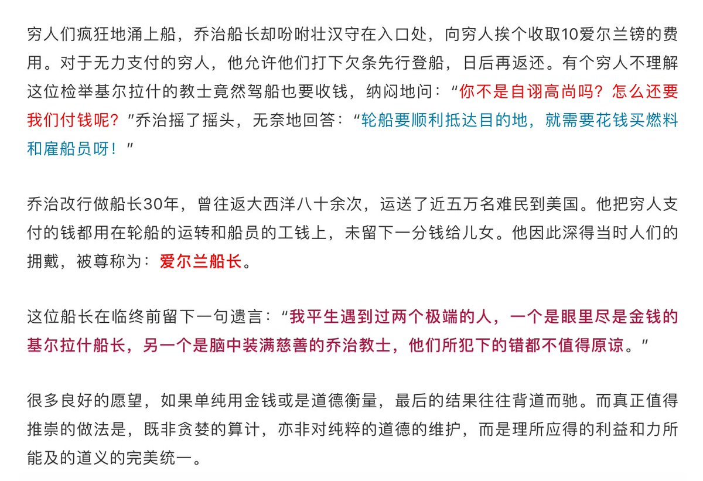

[12月10日 22:10]    墙国铁拳现世报😷   @Socialistfist    “警察说要对我用喷雾剂了”

#社会主义铁拳  :speech_balloon:评:9 :+1:赞:47 :globe_with_meridians:转:16  

[12月10日 22:10]    BBC News 中文   @bbcchinese    你认为中国中央政府会有下一步动作吗？ https://bbc.in/2YxFQBv   :speech_balloon:评:11 :+1:赞:24 :globe_with_meridians:转:9  

[12月10日 21:36]    财经真相   @caijingxiang    中美12月关税被推迟! https://twitter.com/zerohedge/status/1204393850766266373 …  :speech_balloon:评:27 :+1:赞:25 :globe_with_meridians:转:6  

[12月10日 21:30]    BBC News 中文   @bbcchinese    近50万华人常居英国，华人在英国的历史也可以追溯到18世纪。多年来，英国华人参政却十分鲜见。不过，这种现象正在悄然改变。
 https://bbc.in/2Pv6zdB   :speech_balloon:评:5 :+1:赞:10 :globe_with_meridians:转:4  

[12月10日 21:02]    BBC News 中文   @bbcchinese    美丽岛事件40周年，哪些政治人物是当年的重要参与者? https://bbc.in/38nNsei   :speech_balloon:评:4 :+1:赞:28 :globe_with_meridians:转:9  

[12月10日 20:00]    BBC News 中文   @bbcchinese    【揭露好莱坞性侵事件，激发Metoo运动，亲述性侵报导如何被媒体压制】好莱坞名导演伍迪·艾伦之子、调查记者罗南·法罗接受BBC HARDtalk节目专访。关于韦恩斯坦性侵指控的报道，引燃席卷全球的#Metoo运动。他的父亲伍迪·艾伦曾面临养女的性侵指控，对罗南的报道产生深刻影响。　 https://bbc.in/2Loz2AG   :speech_balloon:评:3 :+1:赞:9 :globe_with_meridians:转:4  

[12月10日 20:00]    纽约时报中文网   @nytchinese    他们后来再也没有见过面。她在去年去世，享年100岁。他们在一起的最后那个下午，她请他给她唱歌。他拉着她的手，唱起她在奥斯维辛教他的那首匈牙利歌曲。他想让她知道，他记得那些歌词。
她爱过他，她平静地告诉他。他说，他也爱过她。 http://nyti.ms/2RFu86f   :speech_balloon:评:4 :+1:赞:25 :globe_with_meridians:转:6  

[12月10日 19:14]    老司机   @h5lpykl7tp6jjop    转发好图  :speech_balloon:评:0 :+1:赞:36 :globe_with_meridians:转:21  

[12月10日 19:09]    老司机   @h5lpykl7tp6jjop    螳螂捕蝉黄雀在后，偷上加偷，盗后再盗，乱作一团！没治了！  :speech_balloon:评:4 :+1:赞:20 :globe_with_meridians:转:8  

[12月10日 19:00]    BBC News 中文   @bbcchinese    新西兰北岛东岸附近的白岛活火山周一突然喷发，导致多人伤亡。  :speech_balloon:评:4 :+1:赞:35 :globe_with_meridians:转:20  

[12月10日 19:00]    纽约时报中文网   @nytchinese    大锅炖肉、酸酵种面包、哈利波特分院帽形状的泡芙塔都是令人心动的食谱选项，但是，对许多人而言，“烹饪”意味着在工作日晚上做饭。
快速、简便而不失趣味，这正是NYT Cooking读者今年最喜欢的食谱的关键词。 http://nyti.ms/2sZBCXz   :speech_balloon:评:1 :+1:赞:9 :globe_with_meridians:转:5  

[12月10日 18:00]    BBC News 中文   @bbcchinese    意大利艺术家卡泰兰的作品，一根用胶纸黏在墙上的香蕉日前以12万美元拍卖成交。行为艺术家大卫·达图纳上周将展览中的香蕉剥下吃掉，还说“谢谢，非常美味。”  :speech_balloon:评:35 :+1:赞:211 :globe_with_meridians:转:56  

[12月10日 17:46]    新闻大吐槽   @TuCaoFakeNews    象形文字  :speech_balloon:评:4 :+1:赞:98 :globe_with_meridians:转:23  

[12月10日 17:46]    新闻大吐槽   @TuCaoFakeNews    象形文字  :speech_balloon:评:4 :+1:赞:98 :globe_with_meridians:转:23  

[12月10日 17:28]    纽约时报中文网   @nytchinese    他们在1943年的奥斯维辛集中营相识、相爱，但命运迫使他们分开。72年后，这对昔日恋人在纽约相会。那是他们最后一次见面。
他问她：他能在奥斯维辛活那么久，究竟是不是与她有关？她举起手，伸出五跟手指，“我救了你五次，让你没被送去死。”她还说，她等过他，但他没来。 http://nyti.ms/2RFu86f   :speech_balloon:评:8 :+1:赞:131 :globe_with_meridians:转:48  

[12月10日 17:13]    财经真相   @caijingxiang    下一位！  :speech_balloon:评:39 :+1:赞:329 :globe_with_meridians:转:135  

[12月10日 17:06]    BBC News 中文   @bbcchinese    吕秀莲说：“香港正在上演当年的美丽岛事件。” https://bbc.in/2E0vh03   :speech_balloon:评:24 :+1:赞:84 :globe_with_meridians:转:35  

[12月10日 17:00]    纽约时报中文网   @nytchinese    桂民海系瑞典公民，曾在香港出版批评中共的书籍，2015年被中国拘捕后，中瑞关系一直紧张。上月，国际笔会瑞典办公室向桂民海颁发文学奖后，两国关系进一步恶化。
已有两部瑞典电影已在中国禁映。中国驻瑞典大使称，由于瑞典对桂民海案的处理，中国将限制与瑞典的贸易。 http://nyti.ms/348sufU   :speech_balloon:评:1 :+1:赞:29 :globe_with_meridians:转:9  

[12月10日 16:30]    纽约时报中文网   @nytchinese    醋香鸡配碎橄榄酱、柠檬刺山柑猪排、夏威夷“转转“烤鸡……我们总结了今年时报读者最喜欢的五个食谱。 
这几道料理呼声为何如此之高？它们美味百搭，且不拘泥于食材和烹饪方式。年末试试为家人准备丰盛的一餐吧。 http://nyti.ms/2sZBCXz   :speech_balloon:评:8 :+1:赞:46 :globe_with_meridians:转:10  

[12月10日 16:20]    老司机   @h5lpykl7tp6jjop    看看近半个世纪前七十年代的报纸，今天的中共有改变吗？  :speech_balloon:评:10 :+1:赞:126 :globe_with_meridians:转:66  

[12月10日 16:00]    纽约时报中文网   @nytchinese    当姥姥失去悉心存了70多年的几乎所有积蓄，我以为迎接我的会是一个心烦意乱的老妇人。但姥姥看上去和往常一样，甚至称得上平和。
“那个骗子真让我印象深刻，”她说。姥姥仍以一种扭曲的方式思念着他。“他那么有才，可以改过自新做些好事。” http://nyti.ms/3483QMq   :speech_balloon:评:3 :+1:赞:14 :globe_with_meridians:转:10  

[12月10日 15:30]    纽约时报中文网   @nytchinese    瑞典起诉前驻华大使林戴安，她被控“与外国势力谈判时恣意妄为”，未经授权安排两名代表中国利益的人士与桂民海之女会面，最高将面临两年刑期。
“就这件具体的领事事务来说，她已经超出了委任指令，因此要承担刑事责任。”瑞典国家安全局官员表示。 http://nyti.ms/348sufU   :speech_balloon:评:23 :+1:赞:284 :globe_with_meridians:转:115  

[12月10日 15:04]    BBC News 中文   @bbcchinese    在火车站或地铁设置人脸识别功能的监视系统，你觉得洽当吗？ https://bbc.in/2E3DUHi   :speech_balloon:评:99 :+1:赞:92 :globe_with_meridians:转:27  

[12月10日 15:00]    纽约时报中文网   @nytchinese    新西兰警方称，怀特岛周一被笼罩在灼热的火山灰中，非常危险，紧急救援人员难以靠近。目前尚未与岛上任何人进行任何交流。
怀特岛又名华卡里，属私人所有。周一到访该岛者包括皇家加勒比游轮上的一些游客，但该公司未透露有多少人前往该岛，也未说明他们目前的下落。 http://nyti.ms/2E0rYGb   :speech_balloon:评:0 :+1:赞:8 :globe_with_meridians:转:2  

[12月10日 14:28]    纽约时报中文网   @nytchinese    周一，新西兰人气旅游胜地怀特岛的火山突然爆发，至少五人被确认死亡，数十名游客被困。警方表示，“任何有可能被活着带离该岛的人都已被营救。”
据报道，网络摄像头捕捉到，火山爆发之前，约有12人正在火山口上部游玩。他们已被列为失踪人士。伤亡人数预计仍将上升。 http://nyti.ms/2E0rYGb   :speech_balloon:评:11 :+1:赞:31 :globe_with_meridians:转:19  

[12月10日 14:10]    财经真相   @caijingxiang    真的又去了？ https://twitter.com/meiyangyang888/status/1204264118045143040 …  :speech_balloon:评:11 :+1:赞:35 :globe_with_meridians:转:4  

[12月10日 14:02]    纽约时报中文网   @nytchinese    #观点 姥姥曾经掌控一切，她曾作为政府官员帮助制定国家政策，并参与每项重要的家庭决策，现在却成为一桩电话诈骗的受害者。
诈骗犯编织了一个让她难以抗拒的幻象：一个神秘的、谈吐得体的男人让她觉得，在这个变化快到她不再认识的国度，自己仍然是有用的、有控制权的。 http://nyti.ms/3483QMq   :speech_balloon:评:16 :+1:赞:40 :globe_with_meridians:转:13  

[12月10日 13:32]    纽约时报中文网   @nytchinese    中国媒体的攻势并非都集中在新疆维稳取得的成功上，他们回顾了2014年昆明火车站的恐袭事件，并借此强调边疆安全的严峻性。
但新疆问题专家雷风(Darren Byler)指出，中国政府的叙事没有说明，为何“这一小撮人做了坏事”，最后“需要把180万，或不管估计有多少人关进拘禁营”。 http://nyti.ms/2P5JwqL   :speech_balloon:评:95 :+1:赞:84 :globe_with_meridians:转:27  

[12月10日 13:00]    纽约时报中文网   @nytchinese    #每日一词 Doomsayers，灾难预言者。学者彼得·魏纳观察到，许多坚信人们正面临道德灭顶之灾的“基督教灾难预言者”(Christian doomsayers)正在全力支持特朗普。
他们承认，特朗普个人可能存在问题，但其阻止支持堕胎等的民主党接管美国的事业却是有效的。
更多简报内容： http://nyti.ms/36jnC9h   :speech_balloon:评:3 :+1:赞:8 :globe_with_meridians:转:1  

[12月10日 12:15]    老司机   @h5lpykl7tp6jjop    宁让俄国骗得傻笑，也不和美国同一条道。从俄国进口高价几倍的石油和天然气，从南美进贵过美国的大豆就是不买美国货，中共从来只算政治账不算经济帐！  :speech_balloon:评:8 :+1:赞:38 :globe_with_meridians:转:12  

[12月10日 11:55]    纽约时报中文网   @nytchinese    新疆自治区主席雪克来提·扎克尔在周一的新闻发布会上称，这些“职业教育培训中心”现在只接收自愿留在那里的人，试图以此平息外界批评。他还说，以前在这些设施里的人已经“结业”。
但他没有提供任何细节，也拒绝表示他们是否已被释放。 http://nyti.ms/2P5JwqL   :speech_balloon:评:14 :+1:赞:39 :globe_with_meridians:转:17  

[12月10日 11:30]    纽约时报中文网   @nytchinese    中国政府用花言巧语的视频和咄咄逼人的社论在Twitter和YouTube上发动攻势，拒绝接受中国正在大规模拘禁穆斯林越来越多的证据，并将批评者描绘为西方阴谋的参与者。
中国官员还指责西方立法者、专家和新闻媒体诋毁中国政府的政策，在新疆挑起民族不和。 http://nyti.ms/2P5JwqL   :speech_balloon:评:328 :+1:赞:471 :globe_with_meridians:转:180  

[12月10日 11:25]    纽约时报中文网   @nytchinese    台湾与香港一样，有接收大陆异见人士的历史。对于香港的抗议活动，许多台湾人也表示支持。
不过，虽然这座自治岛屿欢迎抗议者，但政府担心激怒北京，仍谨慎行事。许多前来寻求避难的人发现，自己处于法律边缘地带，只能获得临时签证。 http://nyti.ms/2RAhOEu   :speech_balloon:评:82 :+1:赞:26 :globe_with_meridians:转:8  

[12月10日 11:01]    纽约时报中文网   @nytchinese    新西兰旅游胜地怀特岛火山爆发，造成至少五人死亡，八人失踪，30余人受伤，当地侦查飞机发现岛上已无任何生命迹象。
新西兰当局表示，受伤者中包括来自澳大利亚、中国、马来西亚等地的游客。
更多简报内容： http://nyti.ms/36jnC9h   :speech_balloon:评:0 :+1:赞:10 :globe_with_meridians:转:1  

[12月10日 11:00]    BBC News 中文   @bbcchinese    “我听到一声（狼的）嚎叫，但我知道日本狼在明治时代就灭绝了。”于是他花50年搜寻日本狼。 https://bbc.in/2P7TpUQ   :speech_balloon:评:8 :+1:赞:47 :globe_with_meridians:转:17  

[12月10日 10:58]    财经真相   @caijingxiang    北京时间10:00点北京附近一氧化碳污染达浓度到4965ppbv，同一时间华盛顿为529ppbv，中国一氧化碳污染是全世界最高的，华北京津冀已经变成世界癌症地区!  :speech_balloon:评:76 :+1:赞:992 :globe_with_meridians:转:485  

[12月10日 10:39]    财经真相   @caijingxiang    美国农业部长珀杜(Sonny Perdue)周一表示，美国总统特朗普并不想在12月15日对中国输美商品实施下一轮预定关税措施，但希望中国能采取“行动”避免关税实施。 https://twitter.com/ReutersCN/status/1204224553930674176 …  :speech_balloon:评:15 :+1:赞:78 :globe_with_meridians:转:11  

[12月10日 10:36]    纽约时报中文网   @nytchinese    时报记者孟建国@paulmozur 为我们讲述了一次惊险的采访。他前往新疆探望一名维吾尔女性，她曾两次被关进拘禁营，身体状况十分糟糕。
她久违谋面的儿子正在美国绝望而焦急地盼望与她重聚。她向记者讲述了自己的遭遇，这对母子却因此再次受到当局威胁。
更多简报内容： http://nyti.ms/36jnC9h   :speech_balloon:评:8 :+1:赞:9 :globe_with_meridians:转:4  

[12月10日 10:30]    纽约时报中文网   @nytchinese    在接受时报采访时，阿卜杜拉赫布用普通话说，之所以现在站出来，是希望公众的关注能阻止中国当局伤害她及其家人的企图。
阿卜杜拉赫布说，她在透露自己的身份后感到松了一口气。“我已经说出了一切，”她说。“我现在很平静。” http://nyti.ms/2P5tRb7   :speech_balloon:评:12 :+1:赞:29 :globe_with_meridians:转:7  

[12月10日 10:09]    纽约时报中文网   @nytchinese    早安！今日重点新闻包括：
中国反击对新疆拘禁营批评；瑞典起诉前驻华大使；印度通过法案禁止穆斯林入籍；美军阿富汗战争机密文件曝光；新西兰火山爆发；美朝口水战继续；俄乌关系破冰；金球奖提名揭晓……NYT简报带你速览今日要闻。 http://nyti.ms/36jnC9h   :speech_balloon:评:15 :+1:赞:29 :globe_with_meridians:转:12  

[12月10日 10:00]    BBC News 中文   @bbcchinese    围绕女性性器官存在和流传着许多误解。美国妇产科医生珍·冈特（Dr.Jen Gunter)在北美行医25年。她的新书《阴道圣经》（The Virginal Bible）为女性提供许多实用性建议，在这里我们为你总结5条。 https://bbc.in/2rtU3Da   :speech_balloon:评:14 :+1:赞:92 :globe_with_meridians:转:43  

[12月10日 09:50]    财经真相   @caijingxiang    路透社：美国出口商称，中国进口商周一购买了至少五艘将于1月和2月付运的大豆船货，规模约30万吨。此前，北京方面开展部分大豆、猪肉等商品排除工作，对排除范围内商品，给予关税豁免，涉及商品规模至少达到100万吨。新闻要连在一起来看才能得到真相，进口猪肉和农产品，已经不是为了贸易谈判这么简单  :speech_balloon:评:11 :+1:赞:129 :globe_with_meridians:转:33  

[12月10日 09:38]    财经真相   @caijingxiang    从同比看，CPI上涨4.5%，涨幅比上月扩大0.7个百分点。其中，食品价格上涨19.1%，影响CPI上涨约3.72个百分点；非食品价格上涨1.0%，影响CPI上涨约0.77个百分点。猪肉价格同比上涨110.2%，影响CPI上涨约2.64个百分点。 一头发疯的猪，硬是把党国的江山搞的风雨飘摇！  :speech_balloon:评:5 :+1:赞:112 :globe_with_meridians:转:23  

[12月10日 09:36]    财经真相   @caijingxiang    快讯：11月中国CPI年率为4.5%，超过此前市场预期4.2%，其中，城市上涨4.2%，农村上涨5.5%；食品价格上涨19.1%，非食品价格上涨1.0%；消费品价格上涨6.5%，服务价格上涨1.2%。1­­—11月平均，全国居民消费价格比去年同期上涨2.8%。现在是先稳住城市，农村看样子要放弃了，不急还有两个月农民就回老家了  :speech_balloon:评:9 :+1:赞:220 :globe_with_meridians:转:90  

[12月10日 09:32]    BBC News 中文   @bbcchinese    这一切都是从她的一名学生，死囚犯陈梅珠（Tan Mui Choo，英文名凯瑟琳Catherine）开始的。 https://bbc.in/346kH2m   :speech_balloon:评:7 :+1:赞:18 :globe_with_meridians:转:2  

[12月10日 09:07]    纽约时报中文网   @nytchinese    逃离香港：“反送中”抗议者在台湾寻求庇护  http://nyti.ms/2RAhOEu https://twitter.com/stevenleemyers/status/1203872202967224321 …  :speech_balloon:评:15 :+1:赞:5 :globe_with_meridians:转:3  

[12月10日 08:38]    BBC News 中文   @bbcchinese    多数分析认为，尽管很多未涉及兴奋剂丑闻的俄罗斯运动员仍可以个人身份参赛，但赢取奖牌的实力势必因禁令而大打折扣，给他国对手增添夺牌机会。 https://bbc.in/2YC3IUn   :speech_balloon:评:13 :+1:赞:26 :globe_with_meridians:转:3  

[12月10日 08:12]    BBC News 中文   @bbcchinese    5年前特易购（Tesco）启动转型计划，转移其重点是这一计划的一部分。 https://bbc.in/34btz72   :speech_balloon:评:6 :+1:赞:20 :globe_with_meridians:转:7  

[12月10日 07:49]    BBC News 中文   @bbcchinese    美中贸易战持续了一年多后，新疆和香港问题又为达成协议的前景增添了不确定，此外美中在利益认识上也存在巨大鸿沟。　 https://bbc.in/2Yxy1LQ   :speech_balloon:评:21 :+1:赞:27 :globe_with_meridians:转:9  

[12月10日 05:08]    老司机   @h5lpykl7tp6jjop    更愚蠢的是还有边吃补药一边抽烟喝酒的，不知道脑子装的是什么！还有发清除尼古丁民间奇方贴的家伙，连呼吸系统和消化系统是两个通道都没弄明白，唉……  :speech_balloon:评:1 :+1:赞:31 :globe_with_meridians:转:6  

[12月10日 04:48]    老司机   @h5lpykl7tp6jjop    中国人特别迷信靠吃补药能强身健体，所以搞各类补品发财的富豪一大群，无论怎样揭发这是骗局，但官商勾结的体制下依然毫发无损，鸿毛药酒如今仍是优秀企业！吃补药的中国人越来越多，身体越来越弱，难道他们从来没想过吃薯条汉堡的洋人是靠运动变强壮的？说到底是懒！想出个靠吃变强的理论骗自己和子孙  :speech_balloon:评:11 :+1:赞:162 :globe_with_meridians:转:32  

[12月10日 04:26]    老司机   @h5lpykl7tp6jjop    @刘虎三十 
网友批评新华社：不为穷人呼吁免费医疗，却号召没钱看不起病的人死了捐钱捐遗体，新华社要多无耻有多无耻！  :speech_balloon:评:17 :+1:赞:298 :globe_with_meridians:转:174  

[12月10日 04:24]    老司机   @h5lpykl7tp6jjop    这就是所谓保一方平安的公安局长？还指望它们维护社会稳定，不知道要牺牲多少幼女！禽兽治国，淫棍横行！  :speech_balloon:评:4 :+1:赞:57 :globe_with_meridians:转:36  

[12月10日 02:24]    墙国铁拳现世报😷   @Socialistfist    不了解铁拳的老朋友兔兔是谁的请看这里 https://twitter.com/Socialistfist/status/1175057744858161159?s=19 …  :speech_balloon:评:6 :+1:赞:68 :globe_with_meridians:转:15  

[12月10日 02:15]    墙国铁拳现世报😷   @Socialistfist    另外点名批评的还有新加坡人李连杰和我们的老朋友兔兔 @zzyyzoe 最喜爱的  加拿大人吴亦凡  :speech_balloon:评:7 :+1:赞:112 :globe_with_meridians:转:16  

[12月10日 02:13]    墙国铁拳现世报😷   @Socialistfist    美籍刘亦菲一直以来就因为其国籍问题在墙国招致非议。在今年8月14日微博撑港警后让不少粉红对她国籍的质疑消停不少。没过多久，鹤岗网警就在12月5日发短片手撕刘亦菲
为了同时拥有人民币和美国护照，真乃里外不是人
#社会主义铁拳  :speech_balloon:评:26 :+1:赞:338 :globe_with_meridians:转:105  

[12月10日 00:04]    财经真相   @caijingxiang    深圳特区报：8号在华为全球旗舰店·深圳万象天地店，华为消费者业务软件部总裁王成录在“HUAWEI Talk主题分享”会中为现场观众带来了一场关于EMUI10的公开课。他透露，明年华为除了手机、平板和电脑，其他终端产品将全线搭载鸿蒙系统，并在海内外同步推进；鸿蒙系统的全面开源也将在明年8月正式开放。  :speech_balloon:评:57 :+1:赞:193 :globe_with_meridians:转:36  

[12月09日 23:59]    BBC News 中文   @bbcchinese    尽管这位伟大勇士的陵墓里可能有来自古蒙古帝国的宝藏，但蒙古人却希望陵墓的位置永远是个不解之谜。
 https://bbc.in/2Rvl7wC   :speech_balloon:评:6 :+1:赞:17 :globe_with_meridians:转:5  

[12月09日 23:30]    BBC News 中文   @bbcchinese    你要是口渴，就会去喝水，你要是感到孤独，就会去接触他人。如果这种比喻合理，那么孤独还会造成什么问题呢？
 https://bbc.in/38okkDu   :speech_balloon:评:10 :+1:赞:34 :globe_with_meridians:转:18  

[12月09日 23:19]    财经真相   @caijingxiang    金融界今天都在纪念保罗沃克尔，里根与卡特时期的美联储主席，美国杰出的经济学家，更是金融领域教科书级别的大神，其著名的沃克法则就是以他的名字命名的 https://twitter.com/NBCNews/status/1204056999534706690 …  :speech_balloon:评:0 :+1:赞:69 :globe_with_meridians:转:21  

[12月09日 23:13]    BBC News 中文   @bbcchinese    这名女子如何带领一队志愿者，对付印尼海洋生态危机？  :speech_balloon:评:6 :+1:赞:53 :globe_with_meridians:转:11  

[12月09日 23:00]    财经真相   @caijingxiang    现在市场最大的预期就是继续延后12月15号的关税，如果是这样的结果，人民币小幅上涨后继续围绕7震荡，如果谈判失败就会跌破7.2关口！ https://twitter.com/reuterscn/status/1203967838815490048 …  :speech_balloon:评:18 :+1:赞:129 :globe_with_meridians:转:34  

[12月09日 22:59]    BBC News 中文   @bbcchinese    烫乳是将女性的乳房用灼热的物体烫平，以延缓乳房发育，从而减少女性对男性的吸引力。来自西非的齐娜亚，10岁时也经历了烫乳。因为她的母亲说：“如果我不烫你，会有男人开始来找你，跟你做爱”。
 https://bbc.in/2sbfSay   :speech_balloon:评:36 :+1:赞:81 :globe_with_meridians:转:30  

[12月09日 21:59]    BBC News 中文   @bbcchinese    在我们这个星球的历史上，大规模的火山喷发曾经毁灭过生命。那么一次超级火山喷发会导致人类文明消亡吗？
 https://bbc.in/38nY64u   :speech_balloon:评:2 :+1:赞:13 :globe_with_meridians:转:8  

[12月09日 21:30]    BBC News 中文   @bbcchinese    这场由香港政府建议修订《逃犯条例》引起的示威浪潮至今已经持续半年，香港人究竟在争取什么？来听听他们的心声。 https://bbc.in/34173xy   :speech_balloon:评:40 :+1:赞:49 :globe_with_meridians:转:22  

[12月09日 20:24]    新闻大吐槽   @TuCaoFakeNews    实话是华为的天敌
纯正共党基因  :speech_balloon:评:3 :+1:赞:181 :globe_with_meridians:转:17  

[12月09日 20:24]    新闻大吐槽   @TuCaoFakeNews    实话是华为的天敌
纯正共党基因  :speech_balloon:评:3 :+1:赞:181 :globe_with_meridians:转:17  

[12月09日 20:19]    新闻大吐槽   @TuCaoFakeNews    上次说实话被华为威胁，这次说实话，又被华为水军攻击，马来西亚小哥跟华为杠上了！

他在Mate30Pro上用偏门方法安装谷歌套件后，发现Mcdonald与Netflix的app还是不能用，于是他在论坛发帖阐明事实，结果华为水军群起攻之，版主还删他帖~

不过幸好马来西亚没有251，他还可以继续在网上和华为水军战斗  :speech_balloon:评:59 :+1:赞:1608 :globe_with_meridians:转:607  

[12月09日 20:19]    新闻大吐槽   @TuCaoFakeNews    上次说实话被华为威胁，这次说实话，又被华为水军攻击，马来西亚小哥跟华为杠上了！

他在Mate30Pro上用偏门方法安装谷歌套件后，发现Mcdonald与Netflix的app还是不能用，于是他在论坛发帖阐明事实，结果华为水军群起攻之，版主还删他帖~

不过幸好马来西亚没有251，他还可以继续在网上和华为水军战斗  :speech_balloon:评:59 :+1:赞:1608 :globe_with_meridians:转:607  

[12月09日 16:44]    老司机   @h5lpykl7tp6jjop    味觉没有辣的感知细胞，辣味实际上就是痛感，比赛吃辣就是比赛忍痛，中共统治大陆七十年，大陆人忍痛的水平无疑是世界第一，伊朗油价涨几分钱就爆发示威，中国油价涨几块情绪也很稳定，突尼斯小贩被打自引发革命，中国人被城管打死无数屁事没有，香港人为个条例示威半年警察开枪也压不住因为他们不忍痛  :speech_balloon:评:8 :+1:赞:89 :globe_with_meridians:转:26  

[12月09日 16:05]    新闻大吐槽   @TuCaoFakeNews    消防员敬市民一尺，市民就敬消防员一仗~有情有义~
可再深入想想：除去掺入的大陆假警不论，难道香港警察天生就比香港的消防员坏吗？
恐怕还是共党没人性的制度把警察变坏了！  :speech_balloon:评:31 :+1:赞:480 :globe_with_meridians:转:168  

[12月09日 16:05]    新闻大吐槽   @TuCaoFakeNews    消防员敬市民一尺，市民就敬消防员一仗~有情有义~
可再深入想想：除去掺入的大陆假警不论，难道香港警察天生就比香港的消防员坏吗？
恐怕还是共党没人性的制度把警察变坏了！  :speech_balloon:评:31 :+1:赞:480 :globe_with_meridians:转:168  

[12月09日 14:14]    财经真相   @caijingxiang    零对冲开始报道中国的加密货币计划是针对美元体系的“珍珠港” https://twitter.com/zerohedge/status/1203917193634877440 …  :speech_balloon:评:13 :+1:赞:231 :globe_with_meridians:转:98  

[12月09日 13:40]    老司机   @h5lpykl7tp6jjop    当初斗地资本家觉得应该，后来斗右派也觉得该，文革斗学术权威走资派也都欢迎， 后面又是严打大家都认可，于是又有了抓天安门学生，又有了抓法轮功，抓上访户，抓老兵，抓维权人士……最后大家都跪下了！该怪谁？一开始就上当了，唱东方红太阳升的后果就是中国出了个毛魔疯！跟着它一步步走下地狱！  :speech_balloon:评:2 :+1:赞:36 :globe_with_meridians:转:10  

[12月09日 13:14]    老司机   @h5lpykl7tp6jjop    中东穆斯林 出了恐怖分子不等于新疆的穆斯林也都是恐怖分子，
发现恐怖分子该抓，但不能预先把人设想成罪犯用集中营来关押和所谓的改造，用简单方式来分别好人坏人是幼儿园小朋友的思维，共产党统治中国一直用这种粗暴简单的思维，所以中国人基本丧失了明辨是非的能力，凡事都听党的号召，当帮手有报应  :speech_balloon:评:2 :+1:赞:17 :globe_with_meridians:转:5  

[12月09日 12:06]    财经真相   @caijingxiang    1979年广东革命委员会下发通知，决定实行外汇留成制度，这是中国老百姓，自1949年之后第一次可以自己合法拥有外汇！  :speech_balloon:评:7 :+1:赞:125 :globe_with_meridians:转:41  

[12月09日 12:04]    老司机   @h5lpykl7tp6jjop    浙江海宁市两名律师竺修远与平易，因在推特上为多条“侮辱党和国家领导人的有害信息”点赞，而自身未发布任何类似内容，被当地司法局通报警告。#言论自由  :speech_balloon:评:9 :+1:赞:84 :globe_with_meridians:转:29  

[12月09日 11:57]    老司机   @h5lpykl7tp6jjop    ttingxiao:【11.10和你shop】11月10日下午在又一城「和你SHOP」的活動中，幾個便衣警察混入，伺機抓捕一名青年；又大揮警棍，引起現場民眾憤怒。 …  :speech_balloon:评:1 :+1:赞:3 :globe_with_meridians:转:4  

[12月09日 11:13]    老司机   @h5lpykl7tp6jjop    人性的深刻故事：道德的罪与悔 
19世纪中期，因粮食歉收，爱尔兰闹起了饥荒，5年内有100万人被活活饿死。为了寻条活路，许多饥肠辘辘的穷人主动找到基尔拉什船长，表示希望船长收容自己做奴隶，唯一的条件便是恳求他把自己运到美洲，在那边寻口饭吃。  :speech_balloon:评:1 :+1:赞:21 :globe_with_meridians:转:12  

[12月09日 10:50]    老司机   @h5lpykl7tp6jjop    比所有不要脸的人都还不要脸的是把不要脸说得如此官冕堂皇！  :speech_balloon:评:1 :+1:赞:32 :globe_with_meridians:转:23  

[12月09日 10:42]    老司机   @h5lpykl7tp6jjop    这日本人也太坏了，这硬是把我华大嘴巴的先进经验比下去了吗！  :speech_balloon:评:13 :+1:赞:373 :globe_with_meridians:转:187  

[12月09日 10:36]    老司机   @h5lpykl7tp6jjop    要救国救民的人看看先辈的例子！  :speech_balloon:评:15 :+1:赞:154 :globe_with_meridians:转:70  

[12月09日 10:18]    老司机   @h5lpykl7tp6jjop    2019年8月10日，中国著名翻译家，曾翻译《了不起的盖茨比》的巫宁坤教授，在美国家中逝世，享年99岁。
1993年，他因为出版了回忆录《一滴泪》，惹怒了一些领导，他和夫人的退休金停发，毁门砸锁，全部财物被扫地出门，他再一次无家可归。无奈之下，他只好留在了子女美国的家中，在那里度过了余生。  :speech_balloon:评:5 :+1:赞:76 :globe_with_meridians:转:35  

[12月09日 09:57]    墙国铁拳现世报😷   @Socialistfist    孙夕庆博士已申请“开庭次数最多的刑事案件”的吉尼斯纪录，并已被受理。
小编为孙博士在遇到如此不公后还能保留如此幽默感点赞  :speech_balloon:评:6 :+1:赞:398 :globe_with_meridians:转:84  

[12月09日 09:47]    墙国铁拳现世报😷   @Socialistfist    2014年，两位清华留美博士，都选择回国创业报效国家。
一位是在2015年被羁押就已经长达17个月并再无下文的“千人计划”专家 李港
另一位是被羁押1277天并经历114次庭审的孙夕庆。
#社会主义铁拳  :speech_balloon:评:67 :+1:赞:808 :globe_with_meridians:转:348  

[12月09日 09:43]    财经真相   @caijingxiang    由人民银行牵头，四大国有银行，中国移动、中国电信、中国联通三大电信运营商共同参与的央行法定数字货币试点项目有望在深圳、苏州等地落地。接近试点项目组人士表示，本次试点（深圳法定数字货币试点）计划分为两个阶段，今年底是一个阶段，在小范围场景封闭试点，明年为第二个阶段，在深圳大范围推广  :speech_balloon:评:48 :+1:赞:402 :globe_with_meridians:转:158  

[12月09日 09:18]    财经真相   @caijingxiang    美国民主党总统参选人严厉批评特朗普的减税政策主要令富人收益，并誓言将进一步修订税法，并实施一系列措施，从财富税到限制股票回购。也就是说接下来一年时间，不论川普是被弹劾，还是明年大选失败，都意味着美国上市企业不能够再无限制的进行“回购股票”操作，那将意味着美股十年牛市的终结！  :speech_balloon:评:12 :+1:赞:93 :globe_with_meridians:转:20  

[12月09日 09:15]    财经真相   @caijingxiang    经合组织周四发布的报告显示，2018年美国税收收入占GDP比重下降了2.5个百分点，在经合组织国家中降幅最大。而此前特朗普承诺的，减税刺激经济增长尚未兑现。2018年美国经济2.9%的增长中只有一小部分来自减税。企业并未将利润用于资本投资，而是回购了创纪录的8060亿美元股票，进一步推高了股价。  :speech_balloon:评:3 :+1:赞:151 :globe_with_meridians:转:26  

[12月09日 08:42]    老司机   @h5lpykl7tp6jjop    The Hong Kong police are the Nazis.  :speech_balloon:评:4 :+1:赞:52 :globe_with_meridians:转:35  

[12月09日 03:56]    凡賽堤/FORSETI   @FecharCCP    12.08國際人權日！  

百萬人以上的香港人展現出人類文明史上最和平，最文明，最理性，最有創意的方式向全世界發出最強的聲音！

香港人用行動向全世界，全人類證明了香港人是最民主的中華族群！

願榮光歸香港！祝福香港人！天佑香港人！

注，感謝大紀元的最前線視頻！  :speech_balloon:评:24 :+1:赞:710 :globe_with_meridians:转:354  

[12月09日 03:22]    凡賽堤/FORSETI   @FecharCCP    12.08國際人權日！  

人類文明史上最震撼的民主訴求盡在香港！

百萬人以上的香港人用最和平，最文明，最有創意的方式向全世界發出最強的聲音！

五大訴求，缺一不可！ 

願榮光歸香港！  :speech_balloon:评:1 :+1:赞:17 :globe_with_meridians:转:7  

[12月09日 03:16]    凡賽堤/FORSETI   @FecharCCP    12.08國際人權日！  

百萬人以上的香港人用最和平，最文明，最有創意的方式向全世界發出最強的聲音！

五大訴求，缺一不可！ 

願榮光歸香港！  :speech_balloon:评:4 :+1:赞:43 :globe_with_meridians:转:23  

[12月09日 03:13]    凡賽堤/FORSETI   @FecharCCP    12.08國際人權日！  願榮光歸香港！

百萬人以上的香港人用最和平，最文明，最有創意的方式向全世界發出最強的聲音！  :speech_balloon:评:1 :+1:赞:29 :globe_with_meridians:转:15  

[12月09日 03:11]    凡賽堤/FORSETI   @FecharCCP    12.08國際人權日！ 

百萬人以上的香港人向全世界發出最強的聲音！

願榮光歸香港！  :speech_balloon:评:2 :+1:赞:6 :globe_with_meridians:转:4  

[12月09日 02:49]    凡賽堤/FORSETI   @FecharCCP    12.08國際人權日！ 

百萬人以上的香港人向全世界發出最強的聲音！

願榮光歸香港！香港人是全世界華人的最好的歷史鏡子！

願CCP和所有盜國賊以及無知腦殘五毛粉在正義的歌聲中回到馬克思身邊！

願聽到香港人正義歌聲的大陸懦夫們站出來！  :speech_balloon:评:0 :+1:赞:11 :globe_with_meridians:转:4  

[12月09日 02:43]    凡賽堤/FORSETI   @FecharCCP    12.08國際人權日！
 百萬人以上的香港人向全世界發出最強的聲音！

香港人-中華民族的驕傲！  :speech_balloon:评:2 :+1:赞:32 :globe_with_meridians:转:13  

[12月09日 02:38]    凡賽堤/FORSETI   @FecharCCP    12.08國際人權日！ 百萬人以上的香港人向全世界發出最強的聲音！

全人類最文明最民主的香港族群，香港人是中華民族的民主典範！  :speech_balloon:评:0 :+1:赞:12 :globe_with_meridians:转:4  

[12月09日 02:38]    凡賽堤/FORSETI   @FecharCCP    全人類最文明最民主的香港族群，香港人是中華民族的民主典範！  :speech_balloon:评:2 :+1:赞:17 :globe_with_meridians:转:10  

[12月09日 01:21]    墙国铁拳现世报😷   @Socialistfist    高级黑还是低级红？  :speech_balloon:评:11 :+1:赞:55 :globe_with_meridians:转:4  

[12月09日 01:20]    墙国铁拳现世报😷   @Socialistfist    民主铁拳现世报是高级黑还是低级红？
请您参与投票！  :speech_balloon:评:39 :+1:赞:222 :globe_with_meridians:转:24  

[12月08日 23:40]    新闻大吐槽   @TuCaoFakeNews    89年的时候，大陆人的素质也不差，5月份北京市区几乎没发生交通事故。广场上也是几乎没有垃圾。每个人在横穿救护车行驶的生命线时，都会提前先向纠察队员打招呼，被允许后才过。当民众发自内心的认为是自己的事情时，就会有觉悟，不需要动员！  :speech_balloon:评:4 :+1:赞:67 :globe_with_meridians:转:12  

[12月08日 20:09]    新闻大吐槽   @TuCaoFakeNews    黑警又来搞笑，一边大喊大叫，一边说：“we’re very peaceful”  :speech_balloon:评:43 :+1:赞:410 :globe_with_meridians:转:196  

[12月08日 19:15]    新闻大吐槽   @TuCaoFakeNews    六月份游行时，街边义工派发的是冰凉贴！
而现在，街边义工已经在派发热敷贴~
体验了暑往寒来，又经历了世间冷暖，抗争者更理性，更坚定！  :speech_balloon:评:8 :+1:赞:732 :globe_with_meridians:转:234  

[12月08日 18:53]    新闻大吐槽   @TuCaoFakeNews    6个月前，他们曾为救护车让路！而今晚，他们为消防车让路！
历经打压，香港人并没有变，他们高素质，有序，又体谅别人，已经融入DNA！
随时准备帮助别人，哪怕他们自己还在困苦中艰难前行！

摩西也没能两次分开红海，而香港人做到了！  :speech_balloon:评:9 :+1:赞:482 :globe_with_meridians:转:188  

[12月08日 18:40]    新闻大吐槽   @TuCaoFakeNews    虽然人数众多，但为了让物资可以迅速的传递，人群中间让出一条物资专用通道！
让人想起6月份200万人游行时，救护车分开人群的一幕！  :speech_balloon:评:5 :+1:赞:330 :globe_with_meridians:转:147  

[12月08日 18:27]    新闻大吐槽   @TuCaoFakeNews    从高处看壮观的灯海！  :speech_balloon:评:10 :+1:赞:735 :globe_with_meridians:转:287  

[12月08日 18:10]    新闻大吐槽   @TuCaoFakeNews    夜越暗，灯海越闪亮！  :speech_balloon:评:6 :+1:赞:383 :globe_with_meridians:转:183  

[12月08日 18:09]    新闻大吐槽   @TuCaoFakeNews    这个方阵特别幸运，他们的歌声有小小提琴手一路伴奏！  :speech_balloon:评:12 :+1:赞:477 :globe_with_meridians:转:161  

[12月08日 17:08]    新闻大吐槽   @TuCaoFakeNews    十分混乱！
人民纷纷抛弃独裁者，而很多圈子内的人，也不顾领袖形象，捡了好处，拔腿开溜！  :speech_balloon:评:36 :+1:赞:331 :globe_with_meridians:转:82  

[12月08日 17:07]    财经真相   @caijingxiang    朝鲜中央通讯社8日报道，朝鲜前一天在西海卫星发射场成功实施“一次非常重大的试验”。
　　报道说，朝鲜国防科学院7日下午实施这次重大试验，随后向朝鲜劳动党中央委员会汇报试验成功结果。朝方没有披露这次试验的具体内容，只是表示试验结果将在不久后“对改变朝鲜战略地位”发挥重大作用。  :speech_balloon:评:25 :+1:赞:164 :globe_with_meridians:转:41  

[12月08日 16:58]    新闻大吐槽   @TuCaoFakeNews    面对无耻的共党极权，香港人的不懈的抗争赢得了世人的尊重，有人权活动家小组特地从韩国飞来，现场支持香港人！
香港人也对他们的支持回报以最多的掌声  :speech_balloon:评:10 :+1:赞:547 :globe_with_meridians:转:191  

[12月08日 16:25]    新闻大吐槽   @TuCaoFakeNews    今天游行中示威者打出的三面黑旗！

昨日疆藏
近日香港
明日台湾

我看还要加上一面旗，“前日法轮功”！
因为镇压新疆西藏的手段，确确实实是从迫害法轮功中积累起来的！  :speech_balloon:评:35 :+1:赞:264 :globe_with_meridians:转:106  

[12月08日 16:16]    新闻大吐槽   @TuCaoFakeNews    口号声震天，楼宇都在颤抖！
还要展现多少次压倒性的民意，愚蠢的当政者才能醒悟？  :speech_balloon:评:130 :+1:赞:3292 :globe_with_meridians:转:1420  

[12月08日 16:16]    新闻大吐槽   @TuCaoFakeNews    口号声震天，楼宇都在颤抖！
还要展现多少次压倒性的民意，愚蠢的当政者才能醒悟？  :speech_balloon:评:130 :+1:赞:3292 :globe_with_meridians:转:1420  

[12月08日 01:08]    财经真相   @caijingxiang    贸易战的另一条重磅消息，中国决定自2019年12月15日12时01分起，恢复对美国汽车及零部件加征关税！15号第一阶段协议看样是黄了！  :speech_balloon:评:128 :+1:赞:1157 :globe_with_meridians:转:417  

[12月08日 01:01]    财经真相   @caijingxiang    纽约时报9月份就报道过世界银行调查其贷款被用于新疆集中营的建设，但是该报道在当时并未引起特别关注！中国上次从世界银行申请贷款是2015年，按照世界银行规定，贷款国每五年才可以申请一次，中国此次申请贷款不足五年，明显违反这一规定，但是很有意思的事，媒体对此几乎没有任何报道，甚至还有删除  :speech_balloon:评:17 :+1:赞:332 :globe_with_meridians:转:181  

[12月08日 00:52]    财经真相   @caijingxiang    世界银行过去几十年究竟给中国放过多少贷款？究竟还了多少？又被挪用了多少？随着川普的推文引发的关注，媒体会跟进报道，以及深挖吗？  :speech_balloon:评:4 :+1:赞:143 :globe_with_meridians:转:54  

[12月07日 15:30]    老司机   @h5lpykl7tp6jjop    今天听说，北京景山公园崇祯皇帝吊死的那棵树，已经被武警保卫了，因为很多人向上面挂包子。 https://twitter.com/gmakilVkTDOEe15/status/1203075288713723904 …  :speech_balloon:评:30 :+1:赞:275 :globe_with_meridians:转:73  

[12月07日 02:58]    墙国铁拳现世报😷   @Socialistfist    如果您对本推内容有什么想说的并且希望被匿名看到，可以私信小编！
这两位推友如果互相欣赏彼此观点，小编可以介绍认识  :speech_balloon:评:4 :+1:赞:41 :globe_with_meridians:转:1  

[12月07日 02:55]    墙国铁拳现世报😷   @Socialistfist    推友们大家好，首先必须承认最近铁拳推没有之前的数量和质量，向各位关注本推的推友致歉。
再次感谢大家的投稿，如果您的投稿符合本推的投稿标准，小编会陆续给您安排发布
受之前 #现世报读者来信 启发而创立的新系列，这次刊登两位年纪相仿中港的推友对墙内现象的感言，小编认为这样的交流很有意义。  :speech_balloon:评:27 :+1:赞:270 :globe_with_meridians:转:39  

[12月06日 23:15]    墙国铁拳现世报😷   @Socialistfist    有感而发  :speech_balloon:评:4 :+1:赞:207 :globe_with_meridians:转:11  

[12月06日 21:21]    墙国铁拳现世报😷   @Socialistfist    滋磁！ https://twitter.com/minzhutiequan/status/1202745105754419200 …  :speech_balloon:评:36 :+1:赞:223 :globe_with_meridians:转:21  

[12月05日 22:24]    墙国铁拳现世报😷   @Socialistfist    推特魔幻剧场  :speech_balloon:评:15 :+1:赞:132 :globe_with_meridians:转:11  

[12月05日 22:16]    墙国铁拳现世报😷   @Socialistfist    来认识一下党内的“王立” 家族
左起王立强，王立军，王立民，王立新
欢迎补充  :speech_balloon:评:17 :+1:赞:205 :globe_with_meridians:转:41  

[12月05日 10:32]    凡賽堤/FORSETI   @FecharCCP    行动起来！！！ 為川普發聲！！！
FOX直播国会对川普总统的弹劾案youtube，
呼籲全球正義人士都请去点踩
维护川普的尊严发出正義的声音聲援川普！！！ https://www.youtube.com/watch?v=ogmWHENgSTQ …  :speech_balloon:评:0 :+1:赞:9 :globe_with_meridians:转:5  

[12月05日 06:26]    墙国铁拳现世报😷   @Socialistfist    为了实地考察并认真调研总书记任内打击腐败取得的骄人成绩，王立民书记主动要求到狱中体验贪腐分子的日常
什么是学者的钻研精神，小编哭了，你呢？

#社会主义铁拳  :speech_balloon:评:21 :+1:赞:373 :globe_with_meridians:转:88  

[12月04日 20:37]    GFHG SDKM   @zyx_yny    喂喂，香港嘅bb睇落嚟

澳洲設立committee，探討是否有必要頒佈Magnitsky. 可以開始寫信lobby袋鼠囯喔。They accept submissions now

好擔心。區選舉和HKHRDA頒佈后，大家有哋散漫有哋唔focus喎。還有人開始屌來屌去...

bb, come back! 依家有嘢做囖

利申：信還沒寫，不過澳洲list做完一半了 https://twitter.com/NSWHongkongers/status/1202151090399006720 …  :speech_balloon:评:9 :+1:赞:323 :globe_with_meridians:转:204  

[12月03日 18:59]    墙国铁拳现世报😷   @Socialistfist    两位推友匿名私信回应  :speech_balloon:评:16 :+1:赞:168 :globe_with_meridians:转:23  

[12月03日 18:58]    墙国铁拳现世报😷   @Socialistfist    党员推友后续来信  :speech_balloon:评:11 :+1:赞:77 :globe_with_meridians:转:5  

[12月03日 18:22]    墙国铁拳现世报😷   @Socialistfist    曾经中国最年轻的省区首府市市长之一
坚决支持铁腕新疆政策，党内仕途看好
到头来也是落个 “生活奢靡，贪图享乐，道德败坏，搞权色交易”的无期徒刑
刚从俄罗斯和副总理韩正考察回来,就被从首都机场带走。  :speech_balloon:评:35 :+1:赞:457 :globe_with_meridians:转:141  

[12月03日 00:55]    墙国铁拳现世报😷   @Socialistfist    一位推友的来信
欢迎理性讨论  :speech_balloon:评:197 :+1:赞:314 :globe_with_meridians:转:30  

[12月02日 23:05]    墙国铁拳现世报😷   @Socialistfist    补充  :speech_balloon:评:10 :+1:赞:271 :globe_with_meridians:转:58  

[11月30日 08:30]    凡賽堤/FORSETI   @FecharCCP    CCP極權恐怖組織把人民的血汗錢都用在的網絡維穩上了，圈養了人類獨一無二的，人數達千萬的流氓殭屍網絡水軍，谷歌所有集團企業已經淪為CCP極權恐怖組織重要維穩工具了，從2018年google搜索郭文貴的8百萬到現在的360萬，郭媒體從2019年初的18000的全球排名到現在的27669排名，極權不滅，養老永無望！  :speech_balloon:评:1 :+1:赞:10 :globe_with_meridians:转:7  

[11月30日 07:23]    凡賽堤/FORSETI   @FecharCCP    推翻共产党！全民抗议！全民起义！唱响国际歌！起来不愿做奴隶的人们！起来全中国受苦受难的中华儿女！ https://twitter.com/breakup1984/status/1200411445940211714 …  :speech_balloon:评:0 :+1:赞:21 :globe_with_meridians:转:11  

[11月30日 07:19]    凡賽堤/FORSETI   @FecharCCP    人類史上最殘暴的CCP極權殺人恐怖組織正在用各種兇殘手段屠殺我們的同胞...................

CCP極權殺人恐怖組織在香港發射數以萬計的疑似帶有生化武器成份的非標準催淚彈，足以影響三代人的致癌可能！

CCP極權殺人恐怖組織在自己的土地上投放劇毒催淚彈意圖謀殺我們黃色種族同胞！  :speech_balloon:评:2 :+1:赞:29 :globe_with_meridians:转:24  

[11月30日 05:58]    凡賽堤/FORSETI   @FecharCCP    中共催泪弹成分化验结果出炉：山埃毒，也叫氰化钾，爆表！这已经不是镇压抗议者，而是赤裸裸的谋杀，包括对抗议者的生育都会造成影响！  https://twitter.com/SolomonYue/status/1200445644613140480 …  :speech_balloon:评:12 :+1:赞:294 :globe_with_meridians:转:252  

[11月28日 08:19]    凡賽堤/FORSETI   @FecharCCP    幾個月來據不完全統計，CCP極權發動的黑警非法濫捕香港學生孩子以萬人計算，用各種兇殘手段屠殺的幾千人！

讓我們極度關注，傳播香港真相，盡可能的向全世界媒體以各種語言傳播，讓全世界的人看清CCP極權殺人恐怖組織納粹真相，才能真正的減少這些被非法秘密抓捕的香港學生孩子被殺害！天佑香港人！  :speech_balloon:评:42 :+1:赞:198 :globe_with_meridians:转:146  

[11月28日 08:06]    凡賽堤/FORSETI   @FecharCCP    幾個月以來，香港700萬人共同見證了CCP反人類的慘無人道的殘暴罪行！！！

這是千千萬萬的像這麼小的小朋友都親眼見證了CCP反人類的慘無人道的殘暴罪行！！！

天滅CCP！！！天滅極權！！！  :speech_balloon:评:0 :+1:赞:21 :globe_with_meridians:转:8  

[11月28日 07:48]    凡賽堤/FORSETI   @FecharCCP    美國總統川普宣布他已签署
《香港人权与民主法案》

《香港人权与民主法案》已經成功列入美國的法律！
期望美國能執行《香港人权与民主法案》對香港的黑警和淋症夜蛾進行制裁！  :speech_balloon:评:6 :+1:赞:36 :globe_with_meridians:转:18  

[11月26日 01:01]    GFHG SDKM   @zyx_yny    Heading back to London. 

Thank you #HK for letting us share in your unforgettable victory.

香港人, 加油   :speech_balloon:评:2680 :+1:赞:21533 :globe_with_meridians:转:10209  

[11月24日 12:46]    GFHG SDKM   @zyx_yny    Very good to take some time@our from election observation to tell #JuniusHo in person that I was responsible for the revocation of his honorary doctorate from @AngliaRuskin #Sorrynotsorry  :speech_balloon:评:6944 :+1:赞:46297 :globe_with_meridians:转:27886  

[11月24日 08:10]    凡賽堤/FORSETI   @FecharCCP    呼籲請求共同挖掘所有有關香港發生的事，越全面越好，不同角度，越多越好，包括被暗地抓捕的人員，特別是CCP 派出的各種偽裝身份，包括變身變裝行兇的一點一滴都要挖掘出來，把CCP 的邪惡下三濫手段的真相毫無保留的曝光在全世界面前！世界公知公義才能真正挽救和保護香港人！希望懂視頻編輯配上中英文  :speech_balloon:评:3 :+1:赞:21 :globe_with_meridians:转:18  

[11月24日 08:07]    凡賽堤/FORSETI   @FecharCCP    人類史上最殘暴的CCP極權殺人恐怖組織正在用各種兇殘手段屠殺我們的同胞...................

CCP極權殺人恐怖組織超級納粹！超級殘暴！超級流氓！

人類到了全面消滅CCP極權殺人恐怖組織的時代！  :speech_balloon:评:5 :+1:赞:45 :globe_with_meridians:转:51  

[11月24日 08:04]    凡賽堤/FORSETI   @FecharCCP    人類史上最殘暴的CCP極權殺人恐怖組織正在用各種兇殘手段屠殺我們的同胞...................

CCP極權殺人恐怖組織超級納粹！  :speech_balloon:评:1 :+1:赞:41 :globe_with_meridians:转:34  

[11月21日 13:58]    GFHG SDKM   @zyx_yny    On #PolyU being the end game, this OL says it is 100% not the end game.  She says what we saw happened to the students at Poly, the way they were brutally treated by #HKPolice, there's no way HKers will forget.  We will keep on fighting!

#StandWithHongKong #HongKongProtests  :speech_balloon:评:104 :+1:赞:2408 :globe_with_meridians:转:1563  

[11月21日 11:50]    GFHG SDKM   @zyx_yny    We were in front of the Diet Members’ Office Building.

We will keep fighting with you, HKers
We will keep spreading what's happening in HK

You are not alone  :speech_balloon:评:371 :+1:赞:3565 :globe_with_meridians:转:2147  

[11月21日 00:57]    GFHG SDKM   @zyx_yny    Yesterday’s passage of the #HongKong Human Rights & Democracy Act was a good day in the struggle to resist totalitarian #China & its bid for domination. But it was not the last day. We have a long road ahead to protect our jobs, our workers & our security.  :speech_balloon:评:1652 :+1:赞:16332 :globe_with_meridians:转:10818  

[11月20日 21:56]    GFHG SDKM   @zyx_yny    The first day that schools resumed, #hkpolice deliberately targeted high school students to stop and search for no reason. As many #hongkongers suggest, being young becomes a crime as #China and #HKGov are totally out of reach of the whole city.  :speech_balloon:评:262 :+1:赞:5620 :globe_with_meridians:转:6232  

[11月19日 15:33]    GFHG SDKM   @zyx_yny    The tyranny forced us live as middle age warrior  :speech_balloon:评:1 :+1:赞:48 :globe_with_meridians:转:19  

[11月19日 14:41]    GFHG SDKM   @zyx_yny    This scene is no longer only appearing in movies. It’s happening in our reality.

Escaping from death. 

She’s not a #stuntman, she’s just a normal citizen, normal student.

#StandWithHongKong
#Dramaislife
#Lifeisdrama
#PolyUHongKong  :speech_balloon:评:87 :+1:赞:1523 :globe_with_meridians:转:1480  

[11月18日 10:41]    GFHG SDKM   @zyx_yny    With students in Hong-Kong who are blocking the streets to bring economic pressure on China to ensure democratic freedoms in HK! #StandWithHongKong @Andychanhotin @FreedomHKG @Stand_with_HK @hk_watch @HKWORLDCITY #HongKongProtests @joshuawongcf #Freedom  :speech_balloon:评:28 :+1:赞:702 :globe_with_meridians:转:557  

[11月18日 09:32]    GFHG SDKM   @zyx_yny    Stop using #PolyU Wifi for god’s sake.
#HongKongProtests https://twitter.com/hengyanlo/status/1196156883679055872 …  :speech_balloon:评:4 :+1:赞:108 :globe_with_meridians:转:120  

[11月18日 08:54]    GFHG SDKM   @zyx_yny    08:30 students tried to leave #PolyU but #HongKong #Police continued to tear gas them, forcing them to return inside. This is in contradiction to what Poly U President JC Teng said, that cops have agreed to let students leave peacefully. 
@cityusucbc
#PoliceBrutality  :speech_balloon:评:55 :+1:赞:835 :globe_with_meridians:转:1063  

[11月18日 08:50]    GFHG SDKM   @zyx_yny    #PolyU protesters eventually retreat after driving the police back in the face of whizzing rubber bullets and gas pellets. They’re mostly inside the campus again. Police showing no mercy #HK #HongKongProtests #StandWithHongKong  :speech_balloon:评:266 :+1:赞:4921 :globe_with_meridians:转:5433  

[11月18日 08:45]    GFHG SDKM   @zyx_yny    The #HKPolice threatening to shoot press, first-aid as they were attempting to cross the road. This is on the perimeter of #PolyU and some civilians who came here to support the protesters still inside have been injured and/or arrested at the TST east fountain across this road.  :speech_balloon:评:25 :+1:赞:610 :globe_with_meridians:转:830  

[11月18日 08:38]    GFHG SDKM   @zyx_yny    Protestors are trying to escape from Hong Kong Polytechnic University, but HK Police fire tear gas to force them back IN. HK Police have given up any pretense that they try to de-escalate and disperse. Instead, it is evident that their intention is to attack, arrest, and punish. https://twitter.com/JessiePang0125/status/1196224442491396097 …  :speech_balloon:评:34 :+1:赞:988 :globe_with_meridians:转:1153  

[11月18日 08:06]    GFHG SDKM   @zyx_yny    this is the same shameful #PolyU head who refused to shake hands with students wearing a mask during graduation ceremony. Still the same shameful head who escaped the clashes and shrinked his duty for the whole of the clash that lasts for days. https://twitter.com/nytmay/status/1196202338102341633 …  :speech_balloon:评:58 :+1:赞:782 :globe_with_meridians:转:656  

[11月18日 06:02]    GFHG SDKM   @zyx_yny    Around 30 minutes ago at 05:30AM, #HKPolice have entered #PolyU campus. At least 3 protestors subdued, 1 seen with blood all over face during arrest

#PolyU #PolyUMassacre #PolyUSOS
#SOSHK #HongKong #StandwithHK
Vid via Telegram  :speech_balloon:评:47 :+1:赞:1611 :globe_with_meridians:转:2294  

[11月18日 05:16]    GFHG SDKM   @zyx_yny    

They are still fighting! 

#SOSPolyU
#HKPoliceState  :speech_balloon:评:181 :+1:赞:3594 :globe_with_meridians:转:3301  

[11月18日 01:32]    GFHG SDKM   @zyx_yny    “It is fxxking mad!” People with their cars in Tsim Sha Tsui hoping to support #PolyU students (but were stuck due to roadblocks) received tear gas treatment from #HongKong police. Lots of swearing. Video circulated online. #HongKongProtests  :speech_balloon:评:81 :+1:赞:1414 :globe_with_meridians:转:1601  

[11月17日 23:42]    GFHG SDKM   @zyx_yny    Members of Guarding Our Kids, formed by mothers and fathers, decided to stay with #PolyU students who were trapped in the campus: We won't leave our 'kids' behind. We will safeguard this place. We want everyone here can go home. #HongKongProtesters  :speech_balloon:评:632 :+1:赞:10617 :globe_with_meridians:转:10016  

[11月14日 18:36]    财经真相   @caijingxiang    中共基建没有钱，很多网友简单的认为开动印钞机就行，这其实是大错特错，中共央行印的每一分钱，都必须有对应的相应的价值才行，否则就是无锚印钞，汇率崩盘！过去20年央行印钞都是以债务为基础的。比如，房奴的房贷，当房奴申请贷款时，本质是向央行抵押了自己未来30年的劳动力。 https://twitter.com/aspeltuo8/status/1194923278646816768 …  :speech_balloon:评:82 :+1:赞:860 :globe_with_meridians:转:307  

[10月09日 00:47]    GFHG SDKM   @zyx_yny    "Son, when you grow up
You will be the savior of the broken
The beaten, and the damned?"
Please watch this powerful mv #HongKongProtester #hkprotests 
香港反送中護法戰爭(Hong Kong Defensive War 2019)：Welcome To The Black Parade  https://youtu.be/0yXTHODE24Q  via @YouTube  :speech_balloon:评:4 :+1:赞:21 :globe_with_meridians:转:8  

[03月13日 08:10]    老司机   @h5lpykl7tp6jjop    批评是批评家天生的使命！他们只感知对错，信奉真理，指出真相不吐不快，不在意权势和群众的喜好，从批评里不可能获得任何好处，但批评家愚直不改。在中国几乎所有人都讨厌批评家，喜欢阴谋家，因为他们只说好听的！可是就因为中国的批评家太少，中国几乎看不到未来和希望！  :speech_balloon:评:104 :+1:赞:250 :globe_with_meridians:转:51  

