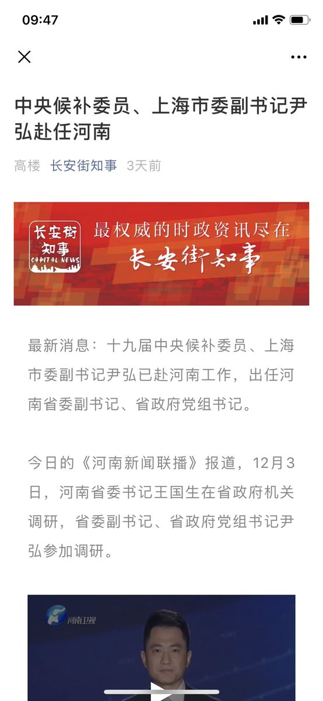

[12月06日 14:23]    纽约时报中文网   @nytchinese    刘宇昆将《三体》翻译成英文，使这部作品在西方大放异彩，改变了全球科幻小说由英美作家主导的格局，弥合了西方读者和中国科幻作品之间的想象力鸿沟。
《三体》英文版出版后，被誉为推想小说的开创之作。它赢得了雨果奖，让刘慈欣成为首位获得雨果奖最佳长篇小说奖的亚洲作家。 http://nyti.ms/2DNcl57   :speech_balloon:评:2 :+1:赞:7 :globe_with_meridians:转:5  

[12月06日 14:16]    财经真相   @caijingxiang    国务院关税税则委员会办公室：中国企业自主通过市场化采购，自美进口一定数量商品。国务院关税税则委员会正在根据相关企业的申请，开展部分大豆、猪肉等商品排除工作，对排除范围内商品，采取不加征我对美301措施反制关税等排除措施。对排除范围内商品采购，企业自主商谈、自行进口、自负盈亏。  :speech_balloon:评:10 :+1:赞:22 :globe_with_meridians:转:2  

[12月06日 14:15]    老司机   @h5lpykl7tp6jjop    中国人的祖先是最不值得崇拜的，除了世代当奴的传统没有留下什么有价值的东西，做父母明明是自己欢娱的结果，应该为此付出代价，却偏偏凭生殖本能变成长辈，政权也以此掌握道德制高点对人民作威作福，什么开国元勋享尽特权，人人也觉得理该如此毫无异议，在一群无羞无耻的大爷大妈面前年轻人能平等吗？  :speech_balloon:评:1 :+1:赞:13 :globe_with_meridians:转:3  

[12月06日 14:01]    BBC News 中文   @bbcchinese    研究显示，许多一夫一妻制的物种，伴侣相似度越高，益处就越多。你跟另一半又相似吗？ https://bbc.in/2DP6OL4   :speech_balloon:评:2 :+1:赞:20 :globe_with_meridians:转:10  

[12月06日 13:36]    新闻大吐槽   @TuCaoFakeNews    凭刀枪不入，和精彩的刺杀剧本，应授予河妖北京电影学院博导职位！ https://twitter.com/lifetimeuscn/status/1202785770597163008 …  :speech_balloon:评:4 :+1:赞:22 :globe_with_meridians:转:6  

[12月06日 13:31]    纽约时报中文网   @nytchinese    在中美试图达成第一阶段贸易协议之际，华盛顿正式就世界银行对中国的金融支持提出反对。美国财长马努钦在众议院对议员们说，美国已反对世界银行的新五年框架，即向中国提供贷款并在中国开展项目。
此举是两国长期争斗中的最新爆发点，也令外界担心，贸易谈判可能再次偏离轨道。 http://nyti.ms/38eBHXl   :speech_balloon:评:7 :+1:赞:54 :globe_with_meridians:转:25  

[12月06日 13:00]    纽约时报中文网   @nytchinese    #每日一词 Severance pay，遣散费。华为老员工李洪元在公司不与他续签合同后，要求公司支付离职补偿(severance pay)，反被拘押251天。
时报科技专栏作者袁莉写道，“251事件”成为华为名声急转直下的转折点。Severance意为切割、隔绝，也可直接用来指解雇补偿。更多简报内容： http://nyti.ms/34PWGhb   :speech_balloon:评:5 :+1:赞:15 :globe_with_meridians:转:6  

[12月06日 12:39]    纽约时报中文网   @nytchinese    《纽约时报》首席影评人@aoscott和@ManohlaDargis评选出2019年度最佳电影 http://nyti.ms/2YodXMa   :speech_balloon:评:1 :+1:赞:9 :globe_with_meridians:转:6  

[12月06日 12:00]    纽约时报中文网   @nytchinese    日本推出大规模经济刺激计划，总额约为13万亿日元（约合1200亿美元）。新一轮支出旨在应对安倍晋三面临的一系列经济挑战。
日本经济已因中国需求下降以及与韩国关系紧张而放缓，其国内的人口老龄化及性别就业歧视等更增添了问题的复杂程度。
更多简报内容： http://nyti.ms/34PWGhb   :speech_balloon:评:1 :+1:赞:12 :globe_with_meridians:转:3  

[12月06日 11:00]    纽约时报中文网   @nytchinese    佩洛西宣布众议院将起草弹劾条款，为在圣诞节前进行弹劾投票创造条件。
特洛西表示，两个月的调查清楚地表明，特朗普违背了其就职誓言，“总统令我们别无选择”。
更多简报内容： http://nyti.ms/34PWGhb   :speech_balloon:评:5 :+1:赞:3 :globe_with_meridians:转:2  

[12月06日 10:55]    纽约时报中文网   @nytchinese    简报：美国反对世界银行对华贷款；众议院将起草弹劾条款 http://nyti.ms/34PWGhb https://twitter.com/ccni/status/1202777491766681600 …  :speech_balloon:评:6 :+1:赞:18 :globe_with_meridians:转:2  

[12月06日 10:30]    纽约时报中文网   @nytchinese    中国公司正出售声称可以分辨维吾尔人的人脸识别系统。官员还从维吾尔人和其他人那里采集了血液样本，以创建追踪少数族裔的新工具。
在某些情况下，西方科学家和公司常在不经意间为这些行动提供了帮助。其中包括在知名期刊上发表论文，这赋予了作者声望，从而使他们获得资源。 http://nyti.ms/2YgCZwA   :speech_balloon:评:10 :+1:赞:27 :globe_with_meridians:转:13  

[12月06日 10:23]    财经真相   @caijingxiang    余额宝里面的钱到底有多少在账上？又被人挪用了多少？他们连银行都敢票据都敢不还，更何况一个公司？  :speech_balloon:评:24 :+1:赞:146 :globe_with_meridians:转:44  

[12月06日 10:19]    新闻大吐槽   @TuCaoFakeNews    维尼熊给泰迪熊打电话：喂，泰迪，你干嘛呢？

泰迪熊：表弟啊，我和你大爷们正在法国抗议呢！你赶紧坐飞机过来！ https://twitter.com/lucifer5868/status/1202606469746692096 …  :speech_balloon:评:1 :+1:赞:45 :globe_with_meridians:转:21  

[12月06日 10:19]    新闻大吐槽   @TuCaoFakeNews    维尼熊给泰迪熊打电话：喂，泰迪，你干嘛呢？

泰迪熊：表弟啊，我和你大爷们正在法国抗议呢！你赶紧坐飞机过来！ https://twitter.com/lucifer5868/status/1202606469746692096 …  :speech_balloon:评:1 :+1:赞:45 :globe_with_meridians:转:21  

[12月06日 10:04]    纽约时报中文网   @nytchinese    早安！今日重点新闻包括：
美国反对世银向中国贷款；众议院将起草弹劾条款；中国少数民族基因研究引发学界反弹；华为起诉美国联邦通信委员会；日本推出大规模经济刺激计划；《纽约时报》年度最佳电影及最佳童书； 沙特阿美募资256亿美元……NYT简报带你速览今日要闻。 http://nyti.ms/34PWGhb   :speech_balloon:评:10 :+1:赞:47 :globe_with_meridians:转:13  

[12月06日 09:59]    财经真相   @caijingxiang    中国央行今日开展3000亿MLF操作为一年期，利率为3.25%，与此前持平。本周，中国央行未开展逆回购操作，因本周无逆回购到期，因此本周实现零投放和零回笼。但央行本周开展3000亿元中期借贷便利（MLF）操作，另有1875亿元MLF到期。从全口径测算，本周实现净投放1125亿元人民币。  :speech_balloon:评:5 :+1:赞:32 :globe_with_meridians:转:6  

[12月06日 09:54]    财经真相   @caijingxiang    国有副大行密集平调！  :speech_balloon:评:4 :+1:赞:49 :globe_with_meridians:转:17  

[12月06日 09:49]    财经真相   @caijingxiang    最近中共高官频繁调动，同时各大银行副行长也调动频繁！  :speech_balloon:评:8 :+1:赞:69 :globe_with_meridians:转:19  

[12月06日 09:36]    BBC News 中文   @bbcchinese    【刘晓明：中国没有政治犯 反问主持有否去过新疆】中国驻英国大使刘晓明再次跟BBC主持人舌剑唇枪。 https://bbc.in/2qp5rQi   :speech_balloon:评:68 :+1:赞:66 :globe_with_meridians:转:17  

[12月06日 08:53]    老司机   @h5lpykl7tp6jjop    高喊要装修白宫的时候忘记了圆明园被烧毁，高喊收回钓鱼岛的时候也忘记了打了八年抗战，说不怕大打贸易战的也忘记了凭票供应的年代，跟着喊不立初心的根本连中共的初心是什么都不知道，中国人就象群羊拥挤着向前，闹轰轰貌似阵容强大，结果除了被屠宰从来没有别的命运，自由奔跑向往山林？没有这种基因  :speech_balloon:评:0 :+1:赞:53 :globe_with_meridians:转:14  

[12月06日 08:48]    新闻大吐槽   @TuCaoFakeNews    区议会选举中击败何菌妖的男人，正在为选民演奏《愿荣光归香港》
不知用的什么独门乐器?  :speech_balloon:评:21 :+1:赞:367 :globe_with_meridians:转:79  

[12月06日 08:48]    新闻大吐槽   @TuCaoFakeNews    区议会选举中击败何菌妖的男人，正在为选民演奏《愿荣光归香港》
不知用的什么独门乐器?  :speech_balloon:评:21 :+1:赞:367 :globe_with_meridians:转:79  

[12月06日 08:20]    BBC News 中文   @bbcchinese    根据英国最近一份专门针对地铁污染的调查发现，伦敦地铁是全世界地铁中污染程度最严重的。 https://bbc.in/2Piqr3K   :speech_balloon:评:16 :+1:赞:24 :globe_with_meridians:转:8  

[12月06日 07:55]    BBC News 中文   @bbcchinese    一场全国性的罢工严重扰乱了法国各地的学校、公共交通，打破了平静的社会生活。因为老无所养？ https://bbc.in/38d3uHB   :speech_balloon:评:31 :+1:赞:44 :globe_with_meridians:转:18  

[12月06日 07:11]    BBC News 中文   @bbcchinese    “我们的民主正处于危险境地，总统让我们除了采取行动之外毫无选择，”佩洛西说。 https://bbc.in/366ztaD   :speech_balloon:评:40 :+1:赞:72 :globe_with_meridians:转:17  

[12月06日 06:35]    BBC News 中文   @bbcchinese    美国专家认为，中国和美国经济共生关系结束，新冷战开始。但以冷战遏制手段对付中国是否有效，则众说纷纭。 https://bbc.in/33TOdIH   :speech_balloon:评:17 :+1:赞:58 :globe_with_meridians:转:19  

[12月06日 04:34]    老司机   @h5lpykl7tp6jjop    三千多年至今，中国仍然没有从一人治国，君临天下的模式中走出来，西方文明大国早已从全民治国（民选精英群体控制）方式上走了二百多年了，然而中国仍然还在坚持中国特色摸石头不过河，在科技日新月异的时代，先进必淘汰落后，文明必淘汰野蛮，任民族情绪如何高涨也无法对抗智能算法，亡国己成定式！  :speech_balloon:评:13 :+1:赞:167 :globe_with_meridians:转:64  

[12月06日 03:40]    新闻大吐槽   @TuCaoFakeNews    修订，是女子的老公与儿子被埋在地下  :speech_balloon:评:0 :+1:赞:28 :globe_with_meridians:转:1  

[12月06日 03:36]    新闻大吐槽   @TuCaoFakeNews    香港黑警要听听！
这个维权者以前也是国家机器上的暴力螺钉！如今失业无福利。 https://twitter.com/today__china/status/1202507149294718976 …  :speech_balloon:评:13 :+1:赞:79 :globe_with_meridians:转:33  

[12月06日 03:36]    新闻大吐槽   @TuCaoFakeNews    香港黑警要听听！
这个维权者以前也是国家机器上的暴力螺钉！如今失业无福利。 https://twitter.com/today__china/status/1202507149294718976 …  :speech_balloon:评:13 :+1:赞:79 :globe_with_meridians:转:33  

[12月06日 03:18]    新闻大吐槽   @TuCaoFakeNews    眼睁睁看着自己未婚夫和公公被无情掩埋，而不能阻止！女子肝肠寸断！

以后这个地方，就是你家的坟地！也是每个广州人良心的坟地！

当开车行经此处，当坐地铁穿过此处，要记得默哀地层中被暴政草菅的枯骨，还有被邪党虐杀后无处归依的灵魂！  :speech_balloon:评:30 :+1:赞:775 :globe_with_meridians:转:424  

[12月06日 03:18]    新闻大吐槽   @TuCaoFakeNews    眼睁睁看着自己未婚夫和公公被无情掩埋，而不能阻止！女子肝肠寸断！

以后这个地方，就是你家的坟地！也是每个广州人良心的坟地！

当开车行经此处，当坐地铁穿过此处，要记得默哀地层中被暴政草菅的枯骨，还有被邪党虐杀后无处归依的灵魂！  :speech_balloon:评:30 :+1:赞:775 :globe_with_meridians:转:424  

[12月06日 03:01]    新闻大吐槽   @TuCaoFakeNews    真·裙带关系
共党那套早学会了，怪不得面相越来越丑陋， https://twitter.com/bannedebook/status/1202649596809248768 …  :speech_balloon:评:0 :+1:赞:11 :globe_with_meridians:转:4  

[12月06日 02:48]    新闻大吐槽   @TuCaoFakeNews    这位香港律师认为大部分被共党操控的香港媒体所采用的平衡报道术，貌似公平，实则荒谬，是不分善恶的，就好比一个人说自己既是男人又是女人！  :speech_balloon:评:22 :+1:赞:193 :globe_with_meridians:转:83  

[12月06日 02:48]    新闻大吐槽   @TuCaoFakeNews    这位香港律师认为大部分被共党操控的香港媒体所采用的平衡报道术，貌似公平，实则荒谬，是不分善恶的，就好比一个人说自己既是男人又是女人！  :speech_balloon:评:22 :+1:赞:193 :globe_with_meridians:转:83  

[12月06日 02:32]    新闻大吐槽   @TuCaoFakeNews    怎么可能既是「党之喉舌」，又「曾经为弱者呐喊」？
鸡西媒体遭欠薪，上访打出的自相矛盾标语，让人困惑。
不知道是甘作喉舌遭果报，还是真正为民说话遭党报复，反正是拿不到工资了。
当小城市经济衰退时，最先被抛弃的竟是党的喉舌，看来当地政府很清楚，喉舌是不创造GDP的 https://www.rfa.org/mandarin/yataibaodao/meiti/ql2-12052019072139.html …  :speech_balloon:评:15 :+1:赞:113 :globe_with_meridians:转:42  

[12月06日 02:32]    新闻大吐槽   @TuCaoFakeNews    怎么可能既是「党之喉舌」，又「曾经为弱者呐喊」？
鸡西媒体遭欠薪，上访打出的自相矛盾标语，让人困惑。
不知道是甘作喉舌遭果报，还是真正为民说话遭党报复，反正是拿不到工资了。
当小城市经济衰退时，最先被抛弃的竟是党的喉舌，看来当地政府很清楚，喉舌是不创造GDP的 https://www.rfa.org/mandarin/yataibaodao/meiti/ql2-12052019072139.html …  :speech_balloon:评:15 :+1:赞:113 :globe_with_meridians:转:42  

[12月05日 23:59]    BBC News 中文   @bbcchinese    糖会吸走伤口上的水分，而细菌需要水分才能繁殖，没有了细菌，伤口便能更快愈合。 https://bbc.in/2sLQ9G5   :speech_balloon:评:23 :+1:赞:264 :globe_with_meridians:转:127  

[12月05日 23:30]    BBC News 中文   @bbcchinese    让人民不起义、亲信不逼宫、对手不夺权有哪些战略战术？独裁者为什么绞尽脑汁争取终身掌权，不下台，是不愿还是不敢？ https://bbc.in/34RmNnP   :speech_balloon:评:84 :+1:赞:558 :globe_with_meridians:转:255  

[12月05日 22:59]    BBC News 中文   @bbcchinese    孤独并不像大多数人想的那样。一项名为“BBC孤独实验”的调查，得出五个出人意料的发现。 https://bbc.in/2OPvF82   :speech_balloon:评:3 :+1:赞:37 :globe_with_meridians:转:16  

[12月05日 22:31]    BBC News 中文   @bbcchinese    徐静芝出生第三天，就被爸爸妈妈遗弃在街头；20年后，她从美国回到杭州，与亲生父母重逢。 https://bbc.in/389AP6s   :speech_balloon:评:14 :+1:赞:27 :globe_with_meridians:转:13  

[12月05日 22:24]    墙国铁拳现世报😷   @Socialistfist    推特魔幻剧场  :speech_balloon:评:10 :+1:赞:95 :globe_with_meridians:转:7  

[12月05日 22:16]    墙国铁拳现世报😷   @Socialistfist    来认识一下党内的“王立” 家族
左起王立强，王立军，王立民，王立新
欢迎补充  :speech_balloon:评:16 :+1:赞:166 :globe_with_meridians:转:36  

[12月05日 22:00]    纽约时报中文网   @nytchinese    时报影评人选出了他们心目中2019年最佳的10部电影。
在流媒体和大财团垄断一切的时代，电影这种艺术形式仍然健康。正如这份名单所证明的，伟大的作品总会出现。 http://nyti.ms/2YodXMa   :speech_balloon:评:4 :+1:赞:93 :globe_with_meridians:转:41  

[12月05日 21:59]    BBC News 中文   @bbcchinese    【也许你连这个影片都看不下去，但这确实是他们的每日菜肴。 】 “我们？我们都习惯了。穷人只能吃这个。只要我们还在这里，我们会继续吃pag pag.”…… https://bbc.in/2DPXreq   :speech_balloon:评:4 :+1:赞:8 :globe_with_meridians:转:3  

[12月05日 21:47]    BBC News 中文   @bbcchinese    原来，德国人出口豪车赚大钱，然后出口自己让别人挣大钱。但是，家有美景何必远行？德国人现在也不再迷恋出国度假了。 https://bbc.in/2RnofKJ   :speech_balloon:评:2 :+1:赞:20 :globe_with_meridians:转:0  

[12月05日 21:00]    纽约时报中文网   @nytchinese    中国针对少数民族的基因研究引发科学界反弹 by @suilee @paulmozur  http://nyti.ms/2YgCZwA https://twitter.com/suilee/status/1202362447711145984 …  :speech_balloon:评:1 :+1:赞:12 :globe_with_meridians:转:4  

[12月05日 20:59]    BBC News 中文   @bbcchinese    护照和证件上的性别，除了男、女，是不是应该加上第三种选择？ https://bbc.in/2LEXFtd   :speech_balloon:评:29 :+1:赞:35 :globe_with_meridians:转:9  

[12月05日 20:30]    纽约时报中文网   @nytchinese    “他们想向美国的顾客表明，华为是一家正经的公司，不是非法的，” 霍夫斯特拉大学法学教授朱利安·库表示，对华为而言，对FCC提出法律挑战增加了其抗议的分量。
“即使在案件中取得了小小的胜利，使FCC重头开始这个程序，对华为来说也将是巨大的胜利。” http://nyti.ms/2DNXs2g   :speech_balloon:评:1 :+1:赞:8 :globe_with_meridians:转:4  

[12月05日 20:13]    财经真相   @caijingxiang    今年以来不良资产包供给总体平稳，但结构上出现变化，体现在国有大行占比呈现下降趋势，区域性的城商行、农商行则出现上升，同时非银行金融机构不良资产供给亦持续增多。现在市、县域农商银行完全成为当地政府的提款机，这也是现在很多政府还能继续发工资的原因！罪恶啊！ https://twitter.com/reuterscn/status/1202551779633876994 …  :speech_balloon:评:8 :+1:赞:154 :globe_with_meridians:转:37  

[12月05日 20:08]    新闻大吐槽   @TuCaoFakeNews    CCAV脸书专页盗取别人图片，并伪造图片内涵，欺骗读者！
结果被原作者揭发！打脸！

国家级媒体，丢世界级大丑！  :speech_balloon:评:37 :+1:赞:818 :globe_with_meridians:转:416  

[12月05日 20:07]    BBC News 中文   @bbcchinese    贝贝生于美国、但是中国籍，在美“居留权”只有四年。贝贝回国，是一甲子“熊猫外交”史上的最新一页。 https://bbc.in/2Pfpwkv   :speech_balloon:评:18 :+1:赞:26 :globe_with_meridians:转:4  

[12月05日 20:05]    BBC News 中文   @bbcchinese    【香港示威与光州事件：韩国镇压老兵与两名香港青年的对话】2019年，韩国光州事件元素出现在香港的示威浪潮中。1980年的光州与2019年的香港，究竟是否有可比之处？BBC邀请曾在光州事件中被派去镇压示威的老兵，与两位曾在香港示威的年轻人对话，听他们探讨彼此最关注的问题。 https://bbc.in/33Pkroq   :speech_balloon:评:9 :+1:赞:30 :globe_with_meridians:转:13  

[12月05日 20:00]    纽约时报中文网   @nytchinese    #新新世界 在某些方面，对华为的新批评让人回想起公司成立之初。华为曾培养一种咄咄逼人的“狼性文化”，鼓励员工拼命工作。
新员工加入公司后会得到一张床垫，因为公司指望每个人都工作到很晚，经常睡在办公室里。十多年前，一系列员工死亡事件引发了人们对华为的审视。 http://nyti.ms/2RhpGKV   :speech_balloon:评:11 :+1:赞:15 :globe_with_meridians:转:5  

[12月05日 19:33]    新闻大吐槽   @TuCaoFakeNews    种草防止土壤沙化至少要提前一年，种树以方便暑天乘凉至少提前10年；

小英提前30年种下的法律，可保今日在红色暴政下挣扎的港人，还有后路可退；这才是华人社会道义的制高点！
  :speech_balloon:评:20 :+1:赞:596 :globe_with_meridians:转:190  

[12月05日 19:33]    新闻大吐槽   @TuCaoFakeNews    种草防止土壤沙化至少要提前一年，种树以方便暑天乘凉至少提前10年；

小英提前30年种下的法律，可保今日在红色暴政下挣扎的港人，还有后路可退；这才是华人社会道义的制高点！
  :speech_balloon:评:20 :+1:赞:596 :globe_with_meridians:转:190  

[12月05日 19:30]    纽约时报中文网   @nytchinese    中国对少数民族DNA的研究引发了全球科学界的强烈反对，许多科学家警告说，北京有可能利用其不断增长的知识来监视和压迫中国人民。
两家享有盛名的科学期刊出版商施普林格·自然和威立本周表示，将重新评估先前出版的关于藏族、维吾尔族和其他少数民族的论文。 http://nyti.ms/2YgCZwA   :speech_balloon:评:58 :+1:赞:242 :globe_with_meridians:转:124  

[12月05日 19:22]    新闻大吐槽   @TuCaoFakeNews    十一被实弹击中，子弹距心脏3cm处穿过的曾同学，今天出庭聆讯，他被指控暴动罪、袭警罪；

用塑料管反抗马列洋教入侵的义士被指控有罪；而依仗洋教，草菅人命的黑警则被说成开枪“合理、合法”

要是广东第一讼师“荒唐镜”看到如今一幕，定会觉得自己不及这傀儡朝廷之荒唐于万一！  :speech_balloon:评:28 :+1:赞:530 :globe_with_meridians:转:369  

[12月05日 19:22]    新闻大吐槽   @TuCaoFakeNews    十一被实弹击中，子弹距心脏3cm处穿过的曾同学，今天出庭聆讯，他被指控暴动罪、袭警罪；

用塑料管反抗马列洋教入侵的义士被指控有罪；而依仗洋教，草菅人命的黑警则被说成开枪“合理、合法”

要是广东第一讼师“荒唐镜”看到如今一幕，定会觉得自己不及这傀儡朝廷之荒唐于万一！  :speech_balloon:评:28 :+1:赞:530 :globe_with_meridians:转:369  

[12月05日 19:01]    纽约时报中文网   @nytchinese    《爷爷，我想念你》的叙述者探讨了她对祖父的感情，虽然素未谋面，但她了解到，祖父长着一个像她叔叔一样的鼻子，还会用各种声音讲故事，从狮子到云朵无所不包。
欢迎查看其他入选的年度最佳童书： http://nyti.ms/2DYSDn7   :speech_balloon:评:2 :+1:赞:6 :globe_with_meridians:转:3  

[12月05日 18:31]    BBC News 中文   @bbcchinese    “华为是一家中国公司，这是他们唯一的借口，”华为公司代表称。他还指美国方面的做法属于用行政手段干预市场，违背美国宪法，华为除上诉外“别无选择”。 https://bbc.in/2YnerCe   :speech_balloon:评:54 :+1:赞:87 :globe_with_meridians:转:7  

[12月05日 18:01]    BBC News 中文   @bbcchinese    加拿大总理杜鲁多在北约峰会站立闲聊时怀疑取笑特朗普，被传媒摄录下来引起特朗普反唇相讥。 这些情况其实也曾在各国领袖身上出现。BBC News 中文为大家盘点5个政治尴尬时刻。 https://bbc.in/362YLq9   :speech_balloon:评:12 :+1:赞:47 :globe_with_meridians:转:8  

[12月05日 17:57]    财经真相   @caijingxiang    央行印出来的货币，必须要有“价值”，没有价值的货币是没人要的！确保印出来的货币有价值是央行的主要职能之一！
在中国央行的主要任务就是给政府.国企以及权贵企业发钱，却用14亿百姓的财富做抵押，以此来给新印的钞票提供价值！ https://youtu.be/HDDCAS4we4E   :speech_balloon:评:13 :+1:赞:290 :globe_with_meridians:转:116  

[12月05日 17:32]    BBC News 中文   @bbcchinese    出身草根、參選前毫無政治聯繫的陳梓維擊敗了建制派政治明星葉傲冬，被香港網民稱作現代版的「大衛打敗哥利亞」故事。 https://bbc.in/38cVAhN   :speech_balloon:评:61 :+1:赞:223 :globe_with_meridians:转:36  

[12月05日 17:00]    纽约时报中文网   @nytchinese    #图集【干旱、洪水、热浪……气候变化加速危及全球】干旱、洪水、再一次干旱、再一次洪水......几十年来，政府短视的政策使数以百万计的印度人生活在恶劣的气候环境中。这些图片记录下了印度面临的困境。
点击查看图集： http://nyti.ms/2sN5xlI   :speech_balloon:评:3 :+1:赞:12 :globe_with_meridians:转:2  

[12月05日 16:30]    纽约时报中文网   @nytchinese    #新新世界 华为是如何在中国失去民心的？  http://nyti.ms/2RhpGKV  by @LiYuan6https://twitter.com/LiYuan6/status/1202177852357038080 …  :speech_balloon:评:17 :+1:赞:15 :globe_with_meridians:转:4  

[12月05日 16:00]    纽约时报中文网   @nytchinese    “我们中的许多人，完全超负荷，总是有压力。”权威色彩公司潘通最近提及了焦虑情绪。潘通称，在如今这个不稳定的时代，“经典蓝”可以满足人们对可靠、稳定基础的渴望。
这一新出炉的年度色彩真的能帮助人们感觉更好吗？还是只是促进消费的噱头？ http://nyti.ms/2PbfZuK   :speech_balloon:评:5 :+1:赞:35 :globe_with_meridians:转:7  

[12月05日 15:30]    纽约时报中文网   @nytchinese    新加坡樟宜机场是一个主题公园，也是一座未来主义逍遥宫，是罕有的会吸引你留下来的机场。
当机场本身就是引人入胜的旅游目的地时，旅客会有什么样的经历呢？ http://nyti.ms/360CBF9   :speech_balloon:评:2 :+1:赞:18 :globe_with_meridians:转:4  

[12月05日 15:11]    老司机   @h5lpykl7tp6jjop    天赋无法阻挡，給农民小伙儿点个赞！  :speech_balloon:评:8 :+1:赞:217 :globe_with_meridians:转:59  

[12月05日 15:00]    纽约时报中文网   @nytchinese    这本第一夫人传记，告诉你有关梅拉尼娅的6件事  http://nyti.ms/2rR8zEX https://twitter.com/ccni/status/1202410071491317760 …  :speech_balloon:评:0 :+1:赞:2 :globe_with_meridians:转:0  

[12月05日 14:41]    老司机   @h5lpykl7tp6jjop    网络上最新的华为流行语：工作996，辞职251，讨论404。  :speech_balloon:评:2 :+1:赞:14 :globe_with_meridians:转:3  

[12月05日 14:15]    BBC News 中文   @bbcchinese    一张印度贫穷女孩在教室外偷偷听课的照片，在网上竟然引起了一场小风波。  :speech_balloon:评:31 :+1:赞:344 :globe_with_meridians:转:93  

[12月05日 14:01]    BBC News 中文   @bbcchinese    在平等、幸福排行榜上常年位居前茅的丹麦，却因性暴力泛滥挨批。难道，受害人没有反抗就不该算强奸？ https://bbc.in/33RFrL7   :speech_balloon:评:22 :+1:赞:53 :globe_with_meridians:转:11  

[12月05日 13:55]    老司机   @h5lpykl7tp6jjop    惡警無處不在  :speech_balloon:评:22 :+1:赞:224 :globe_with_meridians:转:199  

[12月05日 10:32]    凡賽堤/FORSETI   @FecharCCP    行动起来！！！ 為川普發聲！！！
FOX直播国会对川普总统的弹劾案youtube，
呼籲全球正義人士都请去点踩
维护川普的尊严发出正義的声音聲援川普！！！ https://www.youtube.com/watch?v=ogmWHENgSTQ …  :speech_balloon:评:0 :+1:赞:9 :globe_with_meridians:转:5  

[12月05日 08:26]    老司机   @h5lpykl7tp6jjop    我对我们盘丝洞里的小愤青们说：你们不用见了什么不公平就愤怒就巴拉巴拉，冷静一点，理性一点，因为在这片神奇的土地上，所有的不公平最后都能公平的落在每一个人头上。  :speech_balloon:评:11 :+1:赞:278 :globe_with_meridians:转:61  

[12月05日 06:26]    墙国铁拳现世报😷   @Socialistfist    为了实地考察并认真调研总书记任内打击腐败取得的骄人成绩，王立民书记主动要求到狱中体验贪腐分子的日常
什么是学者的钻研精神，小编哭了，你呢？

#社会主义铁拳  :speech_balloon:评:20 :+1:赞:348 :globe_with_meridians:转:85  

[12月04日 22:07]    财经真相   @caijingxiang    日本又拍了一个中国现状的纪录片《光棍儿》，为啥中国现实深刻的事都是日本人拍，中国的媒体难道只会歌功颂德，厉害了我的国！  :speech_balloon:评:53 :+1:赞:545 :globe_with_meridians:转:161  

[12月04日 21:03]    老司机   @h5lpykl7tp6jjop    (转）研究传媒人员经过调查，发现当前大陆民众每天获取新闻信息渠道，已经发生根本性变化。其中75.25%来源于微信群，39.02%来源于抖音，26.61%来源于今日头条，20.03%来源于微博。信息来自传统纸媒的0.68%；来自电视的6.56%（只有老人还看电视）；其他渠道占到4.24%（例如饭局、会议、家庭、街头闲谈）  :speech_balloon:评:24 :+1:赞:282 :globe_with_meridians:转:163  

[12月04日 20:37]    GFHG SDKM   @zyx_yny    喂喂，香港嘅bb睇落嚟

澳洲設立committee，探討是否有必要頒佈Magnitsky. 可以開始寫信lobby袋鼠囯喔。They accept submissions now

好擔心。區選舉和HKHRDA頒佈后，大家有哋散漫有哋唔focus喎。還有人開始屌來屌去...

bb, come back! 依家有嘢做囖

利申：信還沒寫，不過澳洲list做完一半了 https://twitter.com/NSWHongkongers/status/1202151090399006720 …  :speech_balloon:评:9 :+1:赞:322 :globe_with_meridians:转:203  

[12月04日 20:06]    财经真相   @caijingxiang    学到了一个新的英文单词“overtake”意味“颠覆”！  :speech_balloon:评:34 :+1:赞:358 :globe_with_meridians:转:89  

[12月04日 18:06]    财经真相   @caijingxiang    胡锡进“我预计中美接下来几小时内公布达成协议”，这条推特太扯淡，更扯淡的是市场竟然“计价”了！ https://twitter.com/HuXijin_GT/status/1202162573212209154 …  :speech_balloon:评:73 :+1:赞:296 :globe_with_meridians:转:41  

[12月04日 13:40]    老司机   @h5lpykl7tp6jjop    一个老外对我说，你们中国人就是死脑筋，大一统干什么，分裂有什么不好？一下变成十个八个国家，在联合国投票一下多那么多票，有什么不好？我鼻涕泡都笑出来了！这种逆向思维中国人还真没有！  :speech_balloon:评:40 :+1:赞:486 :globe_with_meridians:转:90  

[12月04日 13:33]    老司机   @h5lpykl7tp6jjop    中国人常常自夸聪明，古有三十六计，今有厚黑学。其实西方的一句谚语始终没有学会：打不过对方就干脆加入对方。设想如果自建国以来就不与美国为敌，就不会有韩战，不会遭制裁几十年，不会饿死几千万，不会文革，也就不存在改开，不会在国际上混成孤家寡人，坏就坏在总想另立山头当老大又没有这个本事上  :speech_balloon:评:9 :+1:赞:47 :globe_with_meridians:转:20  

[12月04日 13:05]    老司机   @h5lpykl7tp6jjop    1882年美国签署了排华法案，137年过去了，中国人真有本事，让美国又签下了两个有关针对中国香港和新疆的法案，全世界没有任何国家有此殊荣！我就不明白为什么中国就这么特别呢？要说美国对中国不好？从退还庚子赔款到抗日战争的大量援助支持，还让进WTO赚到钱，怎么这么讨人嫌呢，天朝真是个特殊群体？  :speech_balloon:评:42 :+1:赞:587 :globe_with_meridians:转:143  

[12月04日 12:36]    老司机   @h5lpykl7tp6jjop    中国人炼丹几千年也没出一个化学家，木匠干了几千年还是超不过鲁班，中医问症几千年也跳不出黄帝内经，哲学几千年不如春秋诸子百家，都二十一世纪科技大爆炸时代了，还向外输出孔子学院！面对祖宗羞也羞死了，现代生存需求那一样东西不是从别国偷学得来？每天说作为中国人无比自豪，不知道在自豪什么？  :speech_balloon:评:62 :+1:赞:1193 :globe_with_meridians:转:322  

[12月04日 12:05]    老司机   @h5lpykl7tp6jjop    常常看到大陆的年轻人，找工作没有自信，追女孩没有胆量，学知识没有兴趣，一干活没有耐心，可一旦提起中国，忽然就有自信，一说起黄段子兴趣大到不行，一提起对外开战忽然就有胆量，一玩起游戏一下就有耐心了，就这样它们居然敢说香港上街爭民主自由的青年们是废青！真是不知身己废，隔墙犹自嗨！  :speech_balloon:评:98 :+1:赞:2062 :globe_with_meridians:转:561  

[12月04日 11:41]    老司机   @h5lpykl7tp6jjop    科学解释：为什么越是无知的人越自信？
随着阅历的增长，我们越懂得这样一个道理——不要和笨蛋争论。
因为，有科学研究证明：笨蛋是真的意识不到自己是笨蛋。
在幽默感、文字能力和逻辑能力上最欠缺的那部分人总是高估自己：当他们实际得分只有12%时，却认为自己的得分在60%以上！这就是“达克效应”。  :speech_balloon:评:8 :+1:赞:209 :globe_with_meridians:转:119  

[12月04日 09:46]    财经真相   @caijingxiang    一条被忽视的重磅新闻！12月3日，全国市域社会治理现代化工作会议在北京京西宾馆召开，面向全国、所有地市都有机会参与的市域社会治理现代化试点工作，第一期从2020年至2022年。会议指针对社会矛盾形成、演变特点，关键是要发挥体制优势，推动关口前移、重心下移，努力使市域成为社会矛盾的“终点站”。  :speech_balloon:评:63 :+1:赞:335 :globe_with_meridians:转:174  

[12月04日 09:29]    财经真相   @caijingxiang    隔夜全球市场暴跌，而贸易战受害最大的中国，今天开盘a50竟然还小幅涨，现在已经不是护盘的问题了，因为散户已经被暴跌市场吓跑了，现在是谁护盘呢？  :speech_balloon:评:56 :+1:赞:505 :globe_with_meridians:转:89  

[12月04日 08:19]    老司机   @h5lpykl7tp6jjop    突发新闻：美国国会《维吾尔人权政策法案》，通过了！！！  :speech_balloon:评:214 :+1:赞:3901 :globe_with_meridians:转:1256  

[12月03日 18:59]    墙国铁拳现世报😷   @Socialistfist    两位推友匿名私信回应  :speech_balloon:评:12 :+1:赞:142 :globe_with_meridians:转:18  

[12月03日 18:58]    墙国铁拳现世报😷   @Socialistfist    党员推友后续来信  :speech_balloon:评:10 :+1:赞:60 :globe_with_meridians:转:4  

[12月03日 18:32]    财经真相   @caijingxiang    CNBC：川普说最好2020年大选结果出来后再达成协议，该消息让离岸人民币瞬间暴走！  :speech_balloon:评:20 :+1:赞:339 :globe_with_meridians:转:102  

[12月03日 18:28]    财经真相   @caijingxiang    消息公布后，离岸人民币扩大跌幅，黄金、日元跳涨！开始了！ https://twitter.com/CNBC/status/1201809520751783936 …  :speech_balloon:评:19 :+1:赞:554 :globe_with_meridians:转:149  

[12月03日 18:22]    墙国铁拳现世报😷   @Socialistfist    曾经中国最年轻的省区首府市市长之一
坚决支持铁腕新疆政策，党内仕途看好
到头来也是落个 “生活奢靡，贪图享乐，道德败坏，搞权色交易”的无期徒刑
刚从俄罗斯和副总理韩正考察回来,就被从首都机场带走。  :speech_balloon:评:34 :+1:赞:438 :globe_with_meridians:转:139  

[12月03日 16:58]    老司机   @h5lpykl7tp6jjop    街头惊现"喪盡天良，還我器官……"条幅！生活在这样一个国家，别说你去保护家人和财产，你连自已的器官和小命都保不住，随时被活摘被消失……这样的社会不推倒重来，还有啥活头？  :speech_balloon:评:17 :+1:赞:548 :globe_with_meridians:转:320  

[12月03日 12:45]    老司机   @h5lpykl7tp6jjop    好文分享：

“爱国人士”的困惑：不是说中国已成大赢家吗？  :speech_balloon:评:2 :+1:赞:67 :globe_with_meridians:转:26  

[12月03日 12:26]    老司机   @h5lpykl7tp6jjop    南博万呀，南博万呀，多么流弊地南博万！偶们唱歌，偶们跳舞，介么多地南博万！  :speech_balloon:评:9 :+1:赞:210 :globe_with_meridians:转:123  

[12月03日 10:35]    财经真相   @caijingxiang    海航控股同意公司与以国开行为牵头行及代理行，以中国进出口银行、中国银行等为初始贷款人组成的银团签署《海航控股2019 年流动资金贷款联合授信项目人民币资金银团贷款合同》，向银团申请贷款共计40亿元（8 家银行各提供5亿元）。贷款期限为3年，前2年为宽限期。贷款利率为固定利率，即年利率4.75%。  :speech_balloon:评:23 :+1:赞:157 :globe_with_meridians:转:43  

[12月03日 08:23]    老司机   @h5lpykl7tp6jjop    好消息！

中共国各地方银行全面跌破发行价，目前有20多家上市银行面临破产。  :speech_balloon:评:84 :+1:赞:1139 :globe_with_meridians:转:506  

[12月03日 04:57]    老司机   @h5lpykl7tp6jjop    @听字多一点 
1967年夏  裹着红卫兵战旗的重庆武斗的一派死难者的尸体  :speech_balloon:评:6 :+1:赞:40 :globe_with_meridians:转:25  

[12月03日 00:55]    墙国铁拳现世报😷   @Socialistfist    一位推友的来信
欢迎理性讨论  :speech_balloon:评:195 :+1:赞:301 :globe_with_meridians:转:29  

[12月03日 00:02]    财经真相   @caijingxiang    罗斯说如果12月15号前，中美达不成第一阶段的协议，将提高关税!消息公布日元、黄金避险资产上涨，美股跳水，恐慌指数VIX短线走高，离岸人民币小幅走低！  :speech_balloon:评:10 :+1:赞:220 :globe_with_meridians:转:63  

[12月02日 23:05]    财经真相   @caijingxiang    华为正式回应：“支持李洪元运用法律武器”，语气可以说霸气外露，这样的语气不是冲李洪元去的，他只是一个小棋子，而是回应故意让新闻不时蹦出来的那帮人，这些人的能力不容小觑，他们完全可以在不断删新闻的背景下，继续让虎嗅网大胆的发新闻，而且还操控整个微博热点，甚至通过外交系统“借美国人的刀” https://twitter.com/caijingxiang/status/1201075431123763200 …  :speech_balloon:评:8 :+1:赞:128 :globe_with_meridians:转:40  

[12月02日 23:05]    墙国铁拳现世报😷   @Socialistfist    补充  :speech_balloon:评:9 :+1:赞:260 :globe_with_meridians:转:57  

[12月02日 22:53]    墙国铁拳现世报😷   @Socialistfist    华为251事件在微博上引起热烈讨论，不少贸易战时脑热购买华为手机的粉红一夜间大有幡然醒悟之感。
爱国爱党情怀还能消费多久？
#社会主义铁拳  :speech_balloon:评:74 :+1:赞:875 :globe_with_meridians:转:293  

[12月02日 22:35]    财经真相   @caijingxiang    来猜猜，“枪杆子”对“钱袋子、刀把子、海外大外宣以及外交系统，这胜算有多大？ https://twitter.com/caijingxiang/status/1201507785998946306 …  :speech_balloon:评:20 :+1:赞:181 :globe_with_meridians:转:29  

[12月02日 22:25]    财经真相   @caijingxiang    习近平主席令新闻联播前被临时取消，如果这事属实，那将是北京高层的一场重大地震！  :speech_balloon:评:136 :+1:赞:969 :globe_with_meridians:转:183  

[12月02日 21:28]    财经真相   @caijingxiang    这个是算的政治账，不是经济账，试想如果俄罗斯换成美国，现在香港法案通过背景下，这样一条输气管道岂不成了制裁对象！ https://twitter.com/RFA_Chinese/status/1201490172203827212 …  :speech_balloon:评:10 :+1:赞:40 :globe_with_meridians:转:10  

[12月02日 08:45]    墙国铁拳现世报😷   @Socialistfist    请各位推友注意上推安全 https://twitter.com/keepcnsecurity/status/1201167265804087296 …  :speech_balloon:评:3 :+1:赞:75 :globe_with_meridians:转:18  

[12月01日 09:33]    墙国铁拳现世报😷   @Socialistfist    没想到昨天上了墙内头条的这位可怜人，也是社会主义铁拳击的受害人；

@Socialistfist  :speech_balloon:评:67 :+1:赞:428 :globe_with_meridians:转:102  

[11月30日 21:18]    墙国铁拳现世报😷   @Socialistfist    粉蚷战螂被小编挂以后，一个嘴硬的都没有。  :speech_balloon:评:25 :+1:赞:178 :globe_with_meridians:转:9  

[11月30日 08:30]    凡賽堤/FORSETI   @FecharCCP    CCP極權恐怖組織把人民的血汗錢都用在的網絡維穩上了，圈養了人類獨一無二的，人數達千萬的流氓殭屍網絡水軍，谷歌所有集團企業已經淪為CCP極權恐怖組織重要維穩工具了，從2018年google搜索郭文貴的8百萬到現在的360萬，郭媒體從2019年初的18000的全球排名到現在的27669排名，極權不滅，養老永無望！  :speech_balloon:评:0 :+1:赞:10 :globe_with_meridians:转:7  

[11月30日 07:23]    凡賽堤/FORSETI   @FecharCCP    推翻共产党！全民抗议！全民起义！唱响国际歌！起来不愿做奴隶的人们！起来全中国受苦受难的中华儿女！ https://twitter.com/breakup1984/status/1200411445940211714 …  :speech_balloon:评:0 :+1:赞:21 :globe_with_meridians:转:11  

[11月30日 07:19]    凡賽堤/FORSETI   @FecharCCP    人類史上最殘暴的CCP極權殺人恐怖組織正在用各種兇殘手段屠殺我們的同胞...................

CCP極權殺人恐怖組織在香港發射數以萬計的疑似帶有生化武器成份的非標準催淚彈，足以影響三代人的致癌可能！

CCP極權殺人恐怖組織在自己的土地上投放劇毒催淚彈意圖謀殺我們黃色種族同胞！  :speech_balloon:评:2 :+1:赞:29 :globe_with_meridians:转:24  

[11月30日 05:58]    凡賽堤/FORSETI   @FecharCCP    中共催泪弹成分化验结果出炉：山埃毒，也叫氰化钾，爆表！这已经不是镇压抗议者，而是赤裸裸的谋杀，包括对抗议者的生育都会造成影响！  https://twitter.com/SolomonYue/status/1200445644613140480 …  :speech_balloon:评:12 :+1:赞:293 :globe_with_meridians:转:252  

[11月30日 01:48]    墙国铁拳现世报😷   @Socialistfist    好一句“打得好”，但如果所有香港人都和他們一樣幸災樂禍，咁香港就真正被同化了  :speech_balloon:评:4 :+1:赞:104 :globe_with_meridians:转:7  

[11月30日 01:13]    墙国铁拳现世报😷   @Socialistfist    有推友说最近铁拳不够劲
小编一如既往地欢迎大家踊跃投稿
但有时候，无铁拳胜过假铁拳  :speech_balloon:评:7 :+1:赞:158 :globe_with_meridians:转:4  

[11月30日 01:09]    墙国铁拳现世报😷   @Socialistfist    补图  :speech_balloon:评:9 :+1:赞:135 :globe_with_meridians:转:22  

[11月30日 01:08]    墙国铁拳现世报😷   @Socialistfist    “打得好”

#社会主义铁拳  :speech_balloon:评:27 :+1:赞:249 :globe_with_meridians:转:57  

[11月30日 00:40]    墙国铁拳现世报😷   @Socialistfist    吼啊！ 
小编举双手赞同，一定滋磁捧场
不过要严正说明，我们是 社会主义 的生产者，我们只是 社会主义 的搬运工 https://twitter.com/Ray27809561/status/1196838238771531776 …  :speech_balloon:评:22 :+1:赞:268 :globe_with_meridians:转:27  

[11月29日 18:12]    墙国铁拳现世报😷   @Socialistfist    评论区一览  :speech_balloon:评:20 :+1:赞:302 :globe_with_meridians:转:53  

[11月29日 18:08]    墙国铁拳现世报😷   @Socialistfist    一个中国人没有被逼到绝路，谁想和石头撞。

#社会主义铁拳  :speech_balloon:评:140 :+1:赞:943 :globe_with_meridians:转:354  

[11月28日 08:19]    凡賽堤/FORSETI   @FecharCCP    幾個月來據不完全統計，CCP極權發動的黑警非法濫捕香港學生孩子以萬人計算，用各種兇殘手段屠殺的幾千人！

讓我們極度關注，傳播香港真相，盡可能的向全世界媒體以各種語言傳播，讓全世界的人看清CCP極權殺人恐怖組織納粹真相，才能真正的減少這些被非法秘密抓捕的香港學生孩子被殺害！天佑香港人！  :speech_balloon:评:44 :+1:赞:198 :globe_with_meridians:转:147  

[11月28日 08:06]    凡賽堤/FORSETI   @FecharCCP    幾個月以來，香港700萬人共同見證了CCP反人類的慘無人道的殘暴罪行！！！

這是千千萬萬的像這麼小的小朋友都親眼見證了CCP反人類的慘無人道的殘暴罪行！！！

天滅CCP！！！天滅極權！！！  :speech_balloon:评:0 :+1:赞:21 :globe_with_meridians:转:8  

[11月28日 07:48]    凡賽堤/FORSETI   @FecharCCP    美國總統川普宣布他已签署
《香港人权与民主法案》

《香港人权与民主法案》已經成功列入美國的法律！
期望美國能執行《香港人权与民主法案》對香港的黑警和淋症夜蛾進行制裁！  :speech_balloon:评:6 :+1:赞:36 :globe_with_meridians:转:19  

[11月28日 00:29]    墙国铁拳现世报😷   @Socialistfist    那两个字不会写
阿钟哥请你jiayou学中文
#战螂在推特  :speech_balloon:评:48 :+1:赞:284 :globe_with_meridians:转:41  

[11月26日 01:01]    GFHG SDKM   @zyx_yny    Heading back to London. 

Thank you #HK for letting us share in your unforgettable victory.

香港人, 加油   :speech_balloon:评:2680 :+1:赞:21525 :globe_with_meridians:转:10195  

[11月24日 12:46]    GFHG SDKM   @zyx_yny    Very good to take some time@our from election observation to tell #JuniusHo in person that I was responsible for the revocation of his honorary doctorate from @AngliaRuskin #Sorrynotsorry  :speech_balloon:评:6941 :+1:赞:46310 :globe_with_meridians:转:27855  

[11月24日 08:10]    凡賽堤/FORSETI   @FecharCCP    呼籲請求共同挖掘所有有關香港發生的事，越全面越好，不同角度，越多越好，包括被暗地抓捕的人員，特別是CCP 派出的各種偽裝身份，包括變身變裝行兇的一點一滴都要挖掘出來，把CCP 的邪惡下三濫手段的真相毫無保留的曝光在全世界面前！世界公知公義才能真正挽救和保護香港人！希望懂視頻編輯配上中英文  :speech_balloon:评:3 :+1:赞:21 :globe_with_meridians:转:18  

[11月24日 08:07]    凡賽堤/FORSETI   @FecharCCP    人類史上最殘暴的CCP極權殺人恐怖組織正在用各種兇殘手段屠殺我們的同胞...................

CCP極權殺人恐怖組織超級納粹！超級殘暴！超級流氓！

人類到了全面消滅CCP極權殺人恐怖組織的時代！  :speech_balloon:评:5 :+1:赞:44 :globe_with_meridians:转:50  

[11月24日 08:04]    凡賽堤/FORSETI   @FecharCCP    人類史上最殘暴的CCP極權殺人恐怖組織正在用各種兇殘手段屠殺我們的同胞...................

CCP極權殺人恐怖組織超級納粹！  :speech_balloon:评:1 :+1:赞:41 :globe_with_meridians:转:34  

[11月24日 07:57]    凡賽堤/FORSETI   @FecharCCP    人類史上最殘暴的CCP極權殺人恐怖組織正在用各種兇殘手段屠殺我們的同胞...................

CCP極權殺人恐怖組織超級納粹！  :speech_balloon:评:6 :+1:赞:181 :globe_with_meridians:转:159  

[11月24日 07:37]    凡賽堤/FORSETI   @FecharCCP    人類史上最殘暴的CCP極權殺人恐怖組織正在用各種兇殘手段屠殺我們的同胞...................  :speech_balloon:评:1 :+1:赞:13 :globe_with_meridians:转:15  

[11月24日 07:28]    凡賽堤/FORSETI   @FecharCCP    CCP極權殺人恐怖組織正在用各種兇殘手段屠殺我們的同胞...................

視頻是CCP極權殺人恐怖組織在人流密集區投放巨量的不合格（不具國際標準）的化學毒氣催淚瓦斯彈 毒害我們的同胞！  :speech_balloon:评:0 :+1:赞:8 :globe_with_meridians:转:4  

[11月23日 11:14]    凡賽堤/FORSETI   @FecharCCP    CCP極權殺人恐怖組織是全人類的公敵！
呼籲全世界正道主義合力消滅CCP！
呼籲全世界人民看清楚CCP反人類的慘無人道的殘暴罪行！！！

消滅CCP是全世界全人類的當前最緊急任務！！！

視頻是CCP瘋狂屠殺香港學生畫面之一  :speech_balloon:评:4 :+1:赞:10 :globe_with_meridians:转:15  

[11月23日 11:08]    凡賽堤/FORSETI   @FecharCCP    凡是罔顧香港事實在推特和youtube上支持CCP和香港黑警的五毛必死全家，有朝一日必死於CCP的殺人恐怖組織之下，起底五毛祖宗十八代世代不得為人！  :speech_balloon:评:3 :+1:赞:5 :globe_with_meridians:转:1  

[11月23日 11:02]    凡賽堤/FORSETI   @FecharCCP    CCP極權殺人恐怖組織是全人類的公敵！
呼籲全世界正道主義合力消滅CCP！
呼籲全世界人民看清楚CCP反人類的慘無人道的殘暴罪行！！！

消滅CCP是全世界全人類的當前最緊急任務！！！

視頻是深夜被CCP黑警暗殺的少女！  :speech_balloon:评:1 :+1:赞:6 :globe_with_meridians:转:12  

[11月23日 10:59]    凡賽堤/FORSETI   @FecharCCP    CCP極權殺人恐怖組織是全人類的公敵！
呼籲全世界正道主義合力消滅CCP！
呼籲全世界人民看清楚CCP反人類的慘無人道的殘暴罪行！！！

消滅CCP是全世界全人類的當前最緊急任務！！！

視頻是被CCP瘋狂屠殺射中頭部身亡的香港學生  :speech_balloon:评:2 :+1:赞:4 :globe_with_meridians:转:9  

[11月23日 10:55]    凡賽堤/FORSETI   @FecharCCP    CCP極權殺人恐怖組織是全人類的公敵！
呼籲全世界正道主義合力消滅CCP！
呼籲全世界人民看清楚CCP反人類的慘無人道的殘暴罪行！！！

消滅CCP是全世界全人類的當前最緊急任務！！！

視頻是CCP瘋狂屠殺香港學生畫面之一  :speech_balloon:评:2 :+1:赞:15 :globe_with_meridians:转:13  

[11月23日 10:52]    凡賽堤/FORSETI   @FecharCCP    CCP極權殺人恐怖組織是全人類的公敵！
呼籲全世界正道主義合力消滅CCP！
呼籲全世界人民看清楚CCP反人類的慘無人道的殘暴罪行！！！

消滅CCP是全世界全人類的當前最緊急任務！！！

據報導已被發現2537宗屍體，失踪近萬人！  :speech_balloon:评:0 :+1:赞:4 :globe_with_meridians:转:0  

[11月21日 13:58]    GFHG SDKM   @zyx_yny    On #PolyU being the end game, this OL says it is 100% not the end game.  She says what we saw happened to the students at Poly, the way they were brutally treated by #HKPolice, there's no way HKers will forget.  We will keep on fighting!

#StandWithHongKong #HongKongProtests  :speech_balloon:评:104 :+1:赞:2404 :globe_with_meridians:转:1561  

[11月21日 11:50]    GFHG SDKM   @zyx_yny    We were in front of the Diet Members’ Office Building.

We will keep fighting with you, HKers
We will keep spreading what's happening in HK

You are not alone  :speech_balloon:评:371 :+1:赞:3560 :globe_with_meridians:转:2140  

[11月21日 00:57]    GFHG SDKM   @zyx_yny    Yesterday’s passage of the #HongKong Human Rights & Democracy Act was a good day in the struggle to resist totalitarian #China & its bid for domination. But it was not the last day. We have a long road ahead to protect our jobs, our workers & our security.  :speech_balloon:评:1653 :+1:赞:16312 :globe_with_meridians:转:10805  

[11月20日 21:56]    GFHG SDKM   @zyx_yny    The first day that schools resumed, #hkpolice deliberately targeted high school students to stop and search for no reason. As many #hongkongers suggest, being young becomes a crime as #China and #HKGov are totally out of reach of the whole city.  :speech_balloon:评:262 :+1:赞:5619 :globe_with_meridians:转:6226  

[11月19日 15:33]    GFHG SDKM   @zyx_yny    The tyranny forced us live as middle age warrior  :speech_balloon:评:1 :+1:赞:48 :globe_with_meridians:转:19  

[11月19日 14:41]    GFHG SDKM   @zyx_yny    This scene is no longer only appearing in movies. It’s happening in our reality.

Escaping from death. 

She’s not a #stuntman, she’s just a normal citizen, normal student.

#StandWithHongKong
#Dramaislife
#Lifeisdrama
#PolyUHongKong  :speech_balloon:评:87 :+1:赞:1521 :globe_with_meridians:转:1479  

[11月18日 10:41]    GFHG SDKM   @zyx_yny    With students in Hong-Kong who are blocking the streets to bring economic pressure on China to ensure democratic freedoms in HK! #StandWithHongKong @Andychanhotin @FreedomHKG @Stand_with_HK @hk_watch @HKWORLDCITY #HongKongProtests @joshuawongcf #Freedom  :speech_balloon:评:28 :+1:赞:702 :globe_with_meridians:转:556  

[11月18日 09:32]    GFHG SDKM   @zyx_yny    Stop using #PolyU Wifi for god’s sake.
#HongKongProtests https://twitter.com/hengyanlo/status/1196156883679055872 …  :speech_balloon:评:4 :+1:赞:107 :globe_with_meridians:转:119  

[11月18日 08:54]    GFHG SDKM   @zyx_yny    08:30 students tried to leave #PolyU but #HongKong #Police continued to tear gas them, forcing them to return inside. This is in contradiction to what Poly U President JC Teng said, that cops have agreed to let students leave peacefully. 
@cityusucbc
#PoliceBrutality  :speech_balloon:评:55 :+1:赞:832 :globe_with_meridians:转:1058  

[11月18日 08:50]    GFHG SDKM   @zyx_yny    #PolyU protesters eventually retreat after driving the police back in the face of whizzing rubber bullets and gas pellets. They’re mostly inside the campus again. Police showing no mercy #HK #HongKongProtests #StandWithHongKong  :speech_balloon:评:266 :+1:赞:4911 :globe_with_meridians:转:5426  

[11月18日 08:45]    GFHG SDKM   @zyx_yny    The #HKPolice threatening to shoot press, first-aid as they were attempting to cross the road. This is on the perimeter of #PolyU and some civilians who came here to support the protesters still inside have been injured and/or arrested at the TST east fountain across this road.  :speech_balloon:评:25 :+1:赞:611 :globe_with_meridians:转:829  

[11月18日 08:38]    GFHG SDKM   @zyx_yny    Protestors are trying to escape from Hong Kong Polytechnic University, but HK Police fire tear gas to force them back IN. HK Police have given up any pretense that they try to de-escalate and disperse. Instead, it is evident that their intention is to attack, arrest, and punish. https://twitter.com/JessiePang0125/status/1196224442491396097 …  :speech_balloon:评:34 :+1:赞:986 :globe_with_meridians:转:1152  

[11月18日 08:06]    GFHG SDKM   @zyx_yny    this is the same shameful #PolyU head who refused to shake hands with students wearing a mask during graduation ceremony. Still the same shameful head who escaped the clashes and shrinked his duty for the whole of the clash that lasts for days. https://twitter.com/nytmay/status/1196202338102341633 …  :speech_balloon:评:58 :+1:赞:784 :globe_with_meridians:转:655  

[11月18日 06:02]    GFHG SDKM   @zyx_yny    Around 30 minutes ago at 05:30AM, #HKPolice have entered #PolyU campus. At least 3 protestors subdued, 1 seen with blood all over face during arrest

#PolyU #PolyUMassacre #PolyUSOS
#SOSHK #HongKong #StandwithHK
Vid via Telegram  :speech_balloon:评:47 :+1:赞:1611 :globe_with_meridians:转:2288  

[11月18日 05:16]    GFHG SDKM   @zyx_yny    

They are still fighting! 

#SOSPolyU
#HKPoliceState  :speech_balloon:评:181 :+1:赞:3588 :globe_with_meridians:转:3295  

[11月18日 01:32]    GFHG SDKM   @zyx_yny    “It is fxxking mad!” People with their cars in Tsim Sha Tsui hoping to support #PolyU students (but were stuck due to roadblocks) received tear gas treatment from #HongKong police. Lots of swearing. Video circulated online. #HongKongProtests  :speech_balloon:评:81 :+1:赞:1409 :globe_with_meridians:转:1598  

[11月17日 23:42]    GFHG SDKM   @zyx_yny    Members of Guarding Our Kids, formed by mothers and fathers, decided to stay with #PolyU students who were trapped in the campus: We won't leave our 'kids' behind. We will safeguard this place. We want everyone here can go home. #HongKongProtesters  :speech_balloon:评:632 :+1:赞:10608 :globe_with_meridians:转:10002  

[11月14日 18:36]    财经真相   @caijingxiang    中共基建没有钱，很多网友简单的认为开动印钞机就行，这其实是大错特错，中共央行印的每一分钱，都必须有对应的相应的价值才行，否则就是无锚印钞，汇率崩盘！过去20年央行印钞都是以债务为基础的。比如，房奴的房贷，当房奴申请贷款时，本质是向央行抵押了自己未来30年的劳动力。 https://twitter.com/aspeltuo8/status/1194923278646816768 …  :speech_balloon:评:77 :+1:赞:836 :globe_with_meridians:转:304  

[10月09日 00:47]    GFHG SDKM   @zyx_yny    "Son, when you grow up
You will be the savior of the broken
The beaten, and the damned?"
Please watch this powerful mv #HongKongProtester #hkprotests 
香港反送中護法戰爭(Hong Kong Defensive War 2019)：Welcome To The Black Parade  https://youtu.be/0yXTHODE24Q  via @YouTube  :speech_balloon:评:4 :+1:赞:21 :globe_with_meridians:转:8  

[03月13日 08:10]    老司机   @h5lpykl7tp6jjop    批评是批评家天生的使命！他们只感知对错，信奉真理，指出真相不吐不快，不在意权势和群众的喜好，从批评里不可能获得任何好处，但批评家愚直不改。在中国几乎所有人都讨厌批评家，喜欢阴谋家，因为他们只说好听的！可是就因为中国的批评家太少，中国几乎看不到未来和希望！  :speech_balloon:评:102 :+1:赞:241 :globe_with_meridians:转:48  

