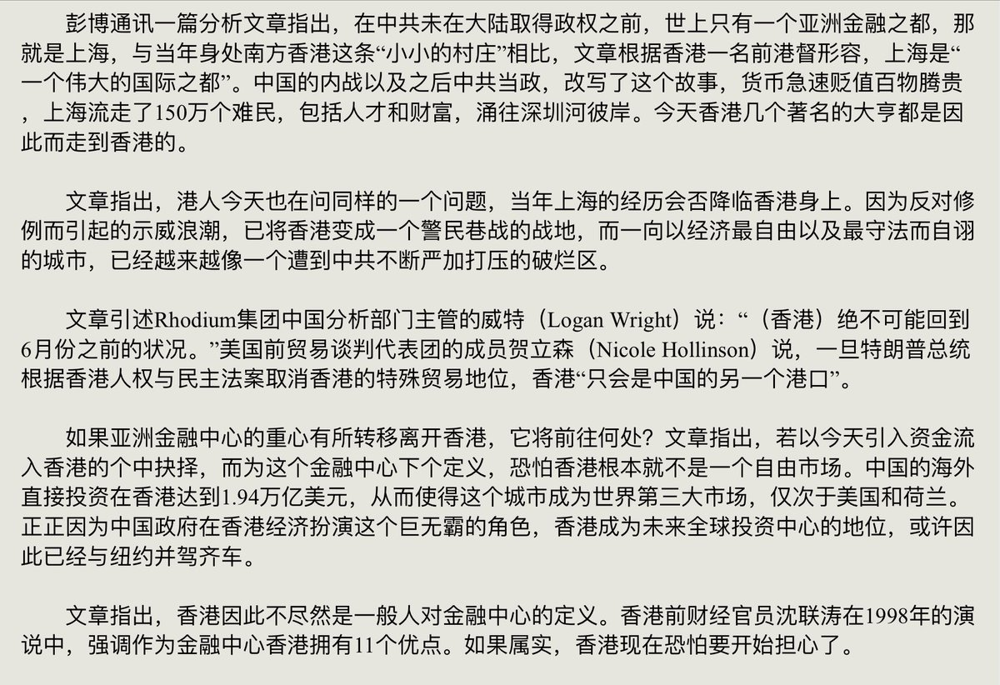

[12月08日 05:29]    新闻大吐槽   @TuCaoFakeNews    尔康这个大清自干五，先用话术稳住反贼萧剑，下一步就要去举报他了  :speech_balloon:评:0 :+1:赞:9 :globe_with_meridians:转:2  

[12月08日 04:20]    老司机   @h5lpykl7tp6jjop    彭博:中共40年代接管上海盛极而衰 今天香港重蹈覆辙  :speech_balloon:评:0 :+1:赞:7 :globe_with_meridians:转:5  

[12月08日 01:51]    BBC News 中文   @bbcchinese    美国总统特朗普称，欢迎被伊朗以从事间谍活动为借口关押的华人王夕越获释。 https://www.bbc.com/zhongwen/simp/science-50700437 …  :speech_balloon:评:4 :+1:赞:84 :globe_with_meridians:转:22  

[12月08日 01:08]    财经真相   @caijingxiang    贸易战的另一条重磅消息，中国决定自2019年12月15日12时01分起，恢复对美国汽车及零部件加征关税！15号第一阶段协议看样是黄了！  :speech_balloon:评:38 :+1:赞:243 :globe_with_meridians:转:109  

[12月08日 01:01]    财经真相   @caijingxiang    纽约时报9月份就报道过世界银行调查其贷款被用于新疆集中营的建设，但是该报道在当时并未引起特别关注！中国上次从世界银行申请贷款是2015年，按照世界银行规定，贷款国每五年才可以申请一次，中国此次申请贷款不足五年，明显违反这一规定，但是很有意思的事，媒体对此几乎没有任何报道，甚至还有删除  :speech_balloon:评:6 :+1:赞:88 :globe_with_meridians:转:57  

[12月08日 00:52]    财经真相   @caijingxiang    世界银行过去几十年究竟给中国放过多少贷款？究竟还了多少？又被挪用了多少？随着川普的推文引发的关注，媒体会跟进报道，以及深挖吗？  :speech_balloon:评:0 :+1:赞:64 :globe_with_meridians:转:23  

[12月08日 00:35]    BBC News 中文   @bbcchinese    马德里顶级美术馆世界名画被“篡改”后...... https://bbc.in/2ron6bo   :speech_balloon:评:2 :+1:赞:12 :globe_with_meridians:转:1  

[12月07日 21:50]    新闻大吐槽   @TuCaoFakeNews    “但凡有一点点自知之明的人，应该非常虚心地来和中国交流和借鉴，学习中国成功的发展经验。 ”

这荒谬场景上演的机会不多了，且看且珍惜  :speech_balloon:评:50 :+1:赞:234 :globe_with_meridians:转:63  

[12月07日 21:50]    新闻大吐槽   @TuCaoFakeNews    “但凡有一点点自知之明的人，应该非常虚心地来和中国交流和借鉴，学习中国成功的发展经验。 ”

这荒谬场景上演的机会不多了，且看且珍惜  :speech_balloon:评:50 :+1:赞:234 :globe_with_meridians:转:63  

[12月07日 21:34]    BBC News 中文   @bbcchinese    即将过去的2019年是全球抗议年。从香港到智利，再到伊朗、加泰罗尼亚，成千上万愤怒的人群在今年某一刻走上街头抗议。他们中的一些人，未必是运动中的领袖人物，却成了抗争的代言人。 https://www.bbc.com/zhongwen/simp/world-50697274 …  :speech_balloon:评:64 :+1:赞:308 :globe_with_meridians:转:107  

[12月07日 20:01]    BBC News 中文   @bbcchinese    【台湾大选：蔡英文、韩国瑜和宋楚瑜掀起的世代之争】台湾大选如箭在弦！ https://bbc.in/2YwG4Jb   :speech_balloon:评:6 :+1:赞:8 :globe_with_meridians:转:4  

[12月07日 19:00]    纽约时报中文网   @nytchinese    #一周热门 5个问题，全面了解美国众议院弹劾报告 http://nyti.ms/365cdd1   :speech_balloon:评:8 :+1:赞:20 :globe_with_meridians:转:8  

[12月07日 18:47]    财经真相   @caijingxiang    12月7日上午，杨洁篪同美国国务卿蓬佩奥通电话。杨洁篪这个电话打的很是时候，不提贸易只对香港、新疆法案表示严重抗议，这是什么意思？  :speech_balloon:评:75 :+1:赞:258 :globe_with_meridians:转:74  

[12月07日 18:00]    BBC News 中文   @bbcchinese    【一周热点回顾】法国示威者抗议政府改革退休制度，发起全国大罢工。法国国家铁路公司估计，全国九成高铁列车将要停驶。民航局预计两成航班要取消，教育部长预料全国逾五成教职员罢工。  :speech_balloon:评:35 :+1:赞:80 :globe_with_meridians:转:10  

[12月07日 17:50]    老司机   @h5lpykl7tp6jjop    629名女孩遭卖至中国当新娘 巴铁无奈冷处理
与中共来往和魔鬼打交道没区别，最终会倒晦！  :speech_balloon:评:0 :+1:赞:13 :globe_with_meridians:转:3  

[12月07日 17:17]    新闻大吐槽   @TuCaoFakeNews    上面不是我说的，是有人说：
  :speech_balloon:评:2 :+1:赞:9 :globe_with_meridians:转:0  

[12月07日 17:08]    新闻大吐槽   @TuCaoFakeNews    中国政法大学有一半校友是高官，他们的工作就是，把另外一半的律师校友抓进监狱！
河妖这是想加入前者 https://twitter.com/hawking197428/status/1203144972410605569 …  :speech_balloon:评:11 :+1:赞:182 :globe_with_meridians:转:54  

[12月07日 17:08]    新闻大吐槽   @TuCaoFakeNews    中国政法大学有一半校友是高官，他们的工作就是，把另外一半的律师校友抓进监狱！
河妖这是想加入前者 https://twitter.com/hawking197428/status/1203144972410605569 …  :speech_balloon:评:11 :+1:赞:182 :globe_with_meridians:转:54  

[12月07日 16:00]    BBC News 中文   @bbcchinese    【一周热点回顾】糖会吸走伤口上的水分，而细菌需要水分才能繁殖，没有了细菌，伤口便能更快愈合。 https://bbc.in/2Lrl2X1   :speech_balloon:评:9 :+1:赞:138 :globe_with_meridians:转:69  

[12月07日 13:46]    BBC News 中文   @bbcchinese    在美国动物园出生的大熊猫贝贝过完四岁生日，乘包机返回中国。根据美中双方协议，贝贝生于美国、但却是中国国籍，在美“居留权”只有四年。

贝贝的故事，也是中国熊猫外交的最新一页。  :speech_balloon:评:64 :+1:赞:189 :globe_with_meridians:转:43  

[12月07日 13:22]    新闻大吐槽   @TuCaoFakeNews    上个月，在区议会选举中落败的亲共派议员周浩鼎，出来站街谢票，当他向一位女士说“感谢您的支持”时，女士毫不犹豫的回答“我从来没有支持过你！”
脸打的piapia的
  :speech_balloon:评:27 :+1:赞:490 :globe_with_meridians:转:143  

[12月07日 13:22]    新闻大吐槽   @TuCaoFakeNews    上个月，在区议会选举中落败的亲共派议员周浩鼎，出来站街谢票，当他向一位女士说“感谢您的支持”时，女士毫不犹豫的回答“我从来没有支持过你！”
脸打的piapia的
  :speech_balloon:评:27 :+1:赞:490 :globe_with_meridians:转:143  

[12月07日 13:11]    新闻大吐槽   @TuCaoFakeNews    王记者手上的姿势很复杂，透露出说谎时，忐忑不安的心情！  :speech_balloon:评:7 :+1:赞:53 :globe_with_meridians:转:4  

[12月07日 13:10]    新闻大吐槽   @TuCaoFakeNews    只要人民一反对共党，西方策动的帽子就扣过来，党不是讲内因起决定作用吗？双标~
卡扎菲政权杀害无辜，何止2万，而王记者的意思是：想推翻我们暴政，你准备好流血了吗？呜呼，没有民权，谈民生就是耍流氓！
中共已在香港实现：贪污腐败自由，人口失踪自由，打瞎记者眼睛自由！  :speech_balloon:评:80 :+1:赞:322 :globe_with_meridians:转:126  

[12月07日 13:10]    新闻大吐槽   @TuCaoFakeNews    只要人民一反对共党，西方策动的帽子就扣过来，党不是讲内因起决定作用吗？双标~
卡扎菲政权杀害无辜，何止2万，而王记者的意思是：想推翻我们暴政，你准备好流血了吗？呜呼，没有民权，谈民生就是耍流氓！
中共已在香港实现：贪污腐败自由，人口失踪自由，打瞎记者眼睛自由！  :speech_balloon:评:80 :+1:赞:322 :globe_with_meridians:转:126  

[12月07日 13:00]    纽约时报中文网   @nytchinese    #一周热门 这本第一夫人传记，告诉你有关梅拉尼娅的6件事 http://nyti.ms/2rR8zEX   :speech_balloon:评:0 :+1:赞:11 :globe_with_meridians:转:2  

[12月07日 12:00]    纽约时报中文网   @nytchinese    “我们被世界的精英掌控着，他们希望我们一直穷下去。“被工厂裁员的一名纺织工人说。
“我小时候，是共产党在保护工人，保护我们的社会阶层。现在，是联盟党在保护人民。” http://nyti.ms/2qr2FKm   :speech_balloon:评:3 :+1:赞:48 :globe_with_meridians:转:11  

[12月07日 11:53]    财经真相   @caijingxiang    市场希望通过德拉基的首秀，能够了解她执掌下的欧洲央行未来货币政策走向，尤其她是否会继续前任继续扮演“欧元杀手”的角色。另外本周五最后一个交易日结束前，中美能够达成协议，将会对市场走向产生决定性的影响。最后，随着圣诞节、新年的临近，黄金销售旺季的来临，黄金的新年攻势蓄势也将开始计价！  :speech_balloon:评:5 :+1:赞:43 :globe_with_meridians:转:8  

[12月07日 11:42]    财经真相   @caijingxiang    下周金融市场焦点比较多，尤其是（北京时间）周四，美联储、巴西、菲律宾、土耳其以及欧洲央行都将公布12月利率决议。对于美联储本次会议，市场普遍认为将按兵不动，除了利率点阵图外，并没有太多看点。反而真正的主角将是欧洲央行的新任掌门人“拉加德”，这是她就职以来的“首秀”！  :speech_balloon:评:6 :+1:赞:60 :globe_with_meridians:转:17  

[12月07日 11:00]    纽约时报中文网   @nytchinese    #一周热门 《纽约时报》2019年最佳童书 http://nyti.ms/2DYSDn7   :speech_balloon:评:1 :+1:赞:18 :globe_with_meridians:转:4  

[12月07日 10:06]    老司机   @h5lpykl7tp6jjop    改革春风吹满地，中国人民真争气。物质精神两手抓，魔幻现实人人夸。  :speech_balloon:评:33 :+1:赞:312 :globe_with_meridians:转:155  

[12月07日 09:42]    老司机   @h5lpykl7tp6jjop    当年陈毅当上海市长，搞公私合营逼得资本家跳楼，他每天都问部下今天有多少空降兵啦？意思是当天有多少跳楼的资本家。现在风水轮流转，共产党的书记们都在排队当空降兵了，陈毅在阴间也没料到吧！  :speech_balloon:评:6 :+1:赞:126 :globe_with_meridians:转:51  

[12月07日 09:25]    新闻大吐槽   @TuCaoFakeNews    红朝赏的学位很丰满，英国学位被撸很骨感  :speech_balloon:评:1 :+1:赞:7 :globe_with_meridians:转:1  

[12月07日 09:00]    BBC News 中文   @bbcchinese    【一周热点回顾】美国众议院要求国务院提交报告，审视中国新疆维吾尔族的人权状况，制裁镇压维吾尔人的中国高级官员。中国外交部批评该法案蓄意诋毁中国新疆的人权状况，严重干涉中国内政，中方表示强烈愤慨、坚决反对。  :speech_balloon:评:57 :+1:赞:116 :globe_with_meridians:转:30  

[12月07日 09:00]    纽约时报中文网   @nytchinese    #一周热门 #新新世界 华为是如何在中国失去民心的？ http://nyti.ms/2RhpGKV   :speech_balloon:评:148 :+1:赞:256 :globe_with_meridians:转:67  

[12月07日 08:44]    老司机   @h5lpykl7tp6jjop    北大教授：谁要生5个孩子 应获1个免考进北大名额
从一人超生全村结扎！到谁能给党生娃，生上五个上北大！
中国的生育政策咋这么搞笑呢？你们把女人下面当水龙头吗？想关就关，想开就开！？  :speech_balloon:评:3 :+1:赞:40 :globe_with_meridians:转:15  

[12月07日 08:26]    BBC News 中文   @bbcchinese    印度警方告诉英国广播公司（BBC）泰卢固语部说，嫌犯试图偷取警察的枪逃跑，被警察击毙。在这个过程中，两名警察也受伤了。 https://bbc.in/366m2Yc   :speech_balloon:评:17 :+1:赞:31 :globe_with_meridians:转:16  

[12月07日 07:58]    老司机   @h5lpykl7tp6jjop    老外为了过河建桥二百多年来都很好，继续用，中国最伟大的改革开放设计师说，我们摸着石头过河！他的继承者都三四代了，摸石头上瘾，决定不过河了！于是中国人还要在水里继续泡很多年。  :speech_balloon:评:1 :+1:赞:40 :globe_with_meridians:转:9  

[12月07日 07:50]    老司机   @h5lpykl7tp6jjop    官媒，“捅雞”糧食生產創歷史新高。
同樣官媒，11月農作物絕收38.1千公頃，同比農作物受災面積增加315％。  :speech_balloon:评:2 :+1:赞:25 :globe_with_meridians:转:23  

[12月07日 07:39]    老司机   @h5lpykl7tp6jjop    有人和我说中国人讲中庸之道，我问：诛连九族，斩草除根，破棺鞭尸，䥣骨扬灰，剥皮萱草，诛人诛心，文字狱，查三代，这些都是老外传给中国人的？他说今天有事，先走。  :speech_balloon:评:40 :+1:赞:896 :globe_with_meridians:转:241  

[12月07日 07:35]    BBC News 中文   @bbcchinese    从印度钦奈的清贫之家，到谷歌帝国掌门人的办公室，皮采47年的人生故事被称为“美国梦”的实例，也是印度在国际科技界的地位的明证。 https://bbc.in/34YcwGv   :speech_balloon:评:40 :+1:赞:310 :globe_with_meridians:转:84  

[12月07日 07:00]    纽约时报中文网   @nytchinese    #一周热门 中国针对少数民族的基因研究引发科学界反弹 http://nyti.ms/2YgCZwA   :speech_balloon:评:10 :+1:赞:43 :globe_with_meridians:转:8  

[12月07日 06:56]    BBC News 中文   @bbcchinese    美国这次针对的法国产品数额虽然不高，但美国对法国此番警告的原因是什么呢？ https://bbc.in/2rYnnSh   :speech_balloon:评:5 :+1:赞:14 :globe_with_meridians:转:5  

[12月07日 02:58]    墙国铁拳现世报😷   @Socialistfist    如果您对本推内容有什么想说的并且希望被匿名看到，可以私信小编！
这两位推友如果互相欣赏彼此观点，小编可以介绍认识  :speech_balloon:评:2 :+1:赞:36 :globe_with_meridians:转:1  

[12月07日 02:56]    BBC News 中文   @bbcchinese    目前中国对美国构成的挑战具有旧冷战时期美国的主要对手苏联不具备的特点，其中主要是经济挑战。苏联从来没有像中国这样显示出强大的经济活力和科技竞争力。 https://bbc.in/388Q0N7   :speech_balloon:评:57 :+1:赞:105 :globe_with_meridians:转:32  

[12月07日 02:55]    墙国铁拳现世报😷   @Socialistfist    推友们大家好，首先必须承认最近铁拳推没有之前的数量和质量，向各位关注本推的推友致歉。
再次感谢大家的投稿，如果您的投稿符合本推的投稿标准，小编会陆续给您安排发布
受之前 #现世报读者来信 启发而创立的新系列，这次刊登两位年纪相仿中港的推友对墙内现象的感言，小编认为这样的交流很有意义。  :speech_balloon:评:23 :+1:赞:243 :globe_with_meridians:转:36  

[12月07日 01:32]    新闻大吐槽   @TuCaoFakeNews    何君尧获颁中国政法大学名誉博士学位，仿该校副院长的名言《丰满与骨感》，送给何妖——
仕途很丰满，人格很骨感！
荣华很丰满，廉耻很骨感！
勾结黑社会羽翼很丰满！能挡刀的排骨也是真骨感！

你可以做建制派，但能不能别卖港求荣？
也罢，你可以卖港求荣，但能不能苦练一下演技？ https://twitter.com/o66071443/status/891270589637427200 …  :speech_balloon:评:15 :+1:赞:178 :globe_with_meridians:转:74  

[12月07日 01:32]    新闻大吐槽   @TuCaoFakeNews    何君尧获颁中国政法大学名誉博士学位，仿该校副院长的名言《丰满与骨感》，送给何妖——
仕途很丰满，人格很骨感！
荣华很丰满，廉耻很骨感！
勾结黑社会羽翼很丰满！能挡刀的排骨也是真骨感！

你可以做建制派，但能不能别卖港求荣？
也罢，你可以卖港求荣，但能不能苦练一下演技？ https://twitter.com/o66071443/status/891270589637427200 …  :speech_balloon:评:15 :+1:赞:178 :globe_with_meridians:转:74  

[12月07日 00:35]    BBC News 中文   @bbcchinese    12月起，中国手机用户新办手机号必须进行面部扫描，但中国大陆一份大型调查显示，相当数量的中国受访者对人脸识别的安全性十分担忧。 https://www.bbc.com/zhongwen/simp/chinese-news-50685535 …  :speech_balloon:评:230 :+1:赞:310 :globe_with_meridians:转:126  

[12月07日 00:11]    BBC News 中文   @bbcchinese    爱沙尼亚没有大型补习班，孩子七岁才进小学，却成为此次PISA考核亚洲以外排名最高的国家。  :speech_balloon:评:15 :+1:赞:286 :globe_with_meridians:转:107  

[12月06日 23:20]    财经真相   @caijingxiang    由于通用罢工结束，员工返回工作岗位，导致11月美国非农数据远超预期，降低了明年美国经济衰退的预期，同时也减少了美联储继续降息的预期，但是该数据由于是临时性的，后期还需要更多数据来佐证经济发展情况！  :speech_balloon:评:8 :+1:赞:133 :globe_with_meridians:转:11  

[12月06日 23:15]    墙国铁拳现世报😷   @Socialistfist    有感而发  :speech_balloon:评:4 :+1:赞:188 :globe_with_meridians:转:10  

[12月06日 22:35]    纽约时报中文网   @nytchinese    随着公众对移民的愤怒加剧，意大利极右翼政党联盟党迅速崛起。
但转变早在数十年前就已打下根基，许多纺织小城在与中国的竞争中日益衰败，急剧向右翼摇摆。许多劳动阶层人士认为，这是搞错了先后顺序：是左翼先抛弃了他们。 http://nyti.ms/2qr2FKm   :speech_balloon:评:23 :+1:赞:146 :globe_with_meridians:转:53  

[12月06日 22:30]    BBC News 中文   @bbcchinese    中国政府现正进行人口普查，尝试找出全国“留守儿童”的确实数字，有估计指全中国约有六千万“留守儿童”。 https://bbc.in/2rkkOdi   :speech_balloon:评:23 :+1:赞:54 :globe_with_meridians:转:34  

[12月06日 21:59]    BBC News 中文   @bbcchinese    纳撒尼尔·霍尔发生第一次性行为后，感染了爱滋病毒（HIV）。那时他只有16岁，恐惧、羞愧和对自己的厌恶让他在接下来的14年中，对家人隐瞒了自己的病情。 https://bbc.in/2Yongvj   :speech_balloon:评:2 :+1:赞:18 :globe_with_meridians:转:7  

[12月06日 21:30]    BBC News 中文   @bbcchinese    从八岁“小将军”到朝鲜当权者，金正恩经历了怎样的旅程？他到底在想什么？ https://bbc.in/2YlfUbY   :speech_balloon:评:9 :+1:赞:16 :globe_with_meridians:转:13  

[12月06日 21:21]    墙国铁拳现世报😷   @Socialistfist    滋磁！ https://twitter.com/minzhutiequan/status/1202745105754419200 …  :speech_balloon:评:36 :+1:赞:202 :globe_with_meridians:转:21  

[12月06日 21:05]    BBC News 中文   @bbcchinese    在英国伦敦举行的北约70周年峰会，花边新闻很多，不过国际媒体并没有漏掉峰会上的大新闻：北约联合声明第一次提及中国带来的机遇和挑战。 https://bbc.in/2Pd12rW   :speech_balloon:评:9 :+1:赞:47 :globe_with_meridians:转:16  

[12月06日 20:36]    BBC News 中文   @bbcchinese    东京地铁拥挤不堪，你亲身体验过吗？东京地铁究竟能拥挤到什么程度？透过迈克尔·沃尔夫拍摄的这组照片来看看。
 https://bbc.in/2Rnu2jD   :speech_balloon:评:6 :+1:赞:12 :globe_with_meridians:转:5  

[12月06日 20:05]    BBC News 中文   @bbcchinese    【青天白日满地红旗与五星红旗，如何在美国唐人街展开拉锯战】走在海外唐人街，常会见到一个特殊景象：中华民国的青天白日满地红旗与中华人民共和国的五星红旗一同迎风飘扬，两面旗帜之间可能仅相隔数米窄巷。两面代表“中国”的红旗在海外华人间的拉锯战仍在持续。 https://bbc.in/2DHXKYG   :speech_balloon:评:32 :+1:赞:74 :globe_with_meridians:转:16  

[12月06日 19:06]    新闻大吐槽   @TuCaoFakeNews    女儿还在加拿大扣押，却要把研发中心搬家到加拿大，这是用投资来讨好加拿大，以图赎回251公主；

还是此前251公主是故意送货上门，在加国被捕，作为老狐狸任正非家族沉船计划的一部分？ https://twitter.com/ttingxiao/status/1202775697405534209 …  :speech_balloon:评:29 :+1:赞:280 :globe_with_meridians:转:82  

[12月06日 19:06]    新闻大吐槽   @TuCaoFakeNews    女儿还在加拿大扣押，却要把研发中心搬家到加拿大，这是用投资来讨好加拿大，以图赎回251公主；

还是此前251公主是故意送货上门，在加国被捕，作为老狐狸任正非家族沉船计划的一部分？ https://twitter.com/ttingxiao/status/1202775697405534209 …  :speech_balloon:评:29 :+1:赞:280 :globe_with_meridians:转:82  

[12月06日 18:00]    老司机   @h5lpykl7tp6jjop    钳制言论自由的最大害处，其实并不是被压制不准张口的民众，而是统治者自己，一个问题不揭露并不等于不存在，发声正是一种信息反馈，如果人失去痛感，就变得极为危险，一个小失误就可能丧命，正常的文明国家非常在意保护新闻和言论自由，只有独裁国家愚蠢的这么干，厉害了我的国其实是病得很厉害没救了  :speech_balloon:评:6 :+1:赞:65 :globe_with_meridians:转:15  

[12月06日 17:45]    财经真相   @caijingxiang    环球时报社评：美国军舰敢访台湾？我军舰就直接驶入台湾港口！ 各位都截图保存，到时看看党国是否敢兑现今日的吹风!  :speech_balloon:评:73 :+1:赞:877 :globe_with_meridians:转:331  

[12月06日 17:00]    纽约时报中文网   @nytchinese    #观点 中国国有企业及名义上的私有企业进入美国资本市场几乎不受约束，包括在美国交易所上市，以及获得来自国家最大型退休基金的重大投资。
为什么美国退休基金要向帮助压迫人权、支持中国军队、可能搜集美国情报的中国企业投资呢？ http://nyti.ms/33RGb2H   :speech_balloon:评:169 :+1:赞:407 :globe_with_meridians:转:131  

[12月06日 16:59]    新闻大吐槽   @TuCaoFakeNews    这位65岁的年长抗争者，4号在医院去世了。
大上周他因为吸入催泪烟，导致呼吸不畅而住院！

希望那些把催泪烟说成比BBQ还要人畜无害的港共官员，最好陪老人一起上路，当着阎王爷的面，给老人家一个说法 https://twitter.com/ronnie_yeung/status/1202444694086541312 …  :speech_balloon:评:21 :+1:赞:458 :globe_with_meridians:转:269  

[12月06日 16:59]    新闻大吐槽   @TuCaoFakeNews    这位65岁的年长抗争者，4号在医院去世了。
大上周他因为吸入催泪烟，导致呼吸不畅而住院！

希望那些把催泪烟说成比BBQ还要人畜无害的港共官员，最好陪老人一起上路，当着阎王爷的面，给老人家一个说法 https://twitter.com/ronnie_yeung/status/1202444694086541312 …  :speech_balloon:评:21 :+1:赞:458 :globe_with_meridians:转:269  

[12月06日 16:30]    财经真相   @caijingxiang    最近中共在贸易上的语气明显软了许多，有种求饶的感觉，15号关税时间节点临近，还是希望用买来换时间，但这次川普不会再给机会！ https://twitter.com/caijingxiang/status/1202834120939696128 …  :speech_balloon:评:36 :+1:赞:249 :globe_with_meridians:转:48  

[12月06日 16:30]    纽约时报中文网   @nytchinese    《三体》的英语翻译刘宇昆研究这部小说混乱的时间轴，并建议把隐藏在故事中部的历史倒叙拉出来，变成小说的开头。
当刘宇昆把这个彻底的改变建议给小说作者刘慈欣时，他做好了遭到拒绝的准备。刘慈欣立即同意刘宇昆的建议。“我当初正是这么想的！“刘宇昆回想起刘慈欣这样说。 http://nyti.ms/2DNcl57   :speech_balloon:评:6 :+1:赞:24 :globe_with_meridians:转:9  

[12月06日 16:23]    财经真相   @caijingxiang    银保监会：现公布修订后的《中华人民共和国外资保险公司管理条例实施细则》，自公布之日起施行。银保监会：外国保险公司分公司成立后，外国保险公司不得以任何形式抽回营运资金。  :speech_balloon:评:49 :+1:赞:389 :globe_with_meridians:转:157  

[12月06日 16:09]    纽约时报中文网   @nytchinese    #图集【在美国，230万美元能买到什么房？】手握230万美元，你能买到位于费城一座建于1925年的石屋，或是新墨西哥州圣达菲的一座普韦布洛式房屋，也可以选择伊利诺伊州埃文斯顿的一处历史悠久的豪宅。
点击查看图集： http://nyti.ms/2OWDjxr   :speech_balloon:评:17 :+1:赞:36 :globe_with_meridians:转:4  

[12月06日 16:00]    新闻大吐槽   @TuCaoFakeNews    终于见到江天勇律师了。他被妈妈锁住栅栏门。妈妈怕那些人闯进家里抓走他。  :speech_balloon:评:13 :+1:赞:496 :globe_with_meridians:转:183  

[12月06日 14:55]    财经真相   @caijingxiang    我都能想象的出该片配上《愿荣光归香港》的背景曲会是多么悲壮！  :speech_balloon:评:6 :+1:赞:62 :globe_with_meridians:转:4  

[12月06日 14:51]    财经真相   @caijingxiang    大外宣CGTN制作了一个新疆暴恐纪录片，向墙内老百姓洗脑，这种办法是恨有迷惑性！不过这种方式可以借鉴，香港示威这么久，确实需要一个制作精良的纪录片，把散碎的新闻事件连贯起来，既可以宣传香港真相，又可以快速帮助墙内被洗脑很深的国人，最好用多国语言制作，不知道有没有能人为香港办点实事！  :speech_balloon:评:37 :+1:赞:151 :globe_with_meridians:转:53  

[12月06日 14:23]    纽约时报中文网   @nytchinese    刘宇昆将《三体》翻译成英文，使这部作品在西方大放异彩，改变了全球科幻小说由英美作家主导的格局，弥合了西方读者和中国科幻作品之间的想象力鸿沟。
《三体》英文版出版后，被誉为推想小说的开创之作。它赢得了雨果奖，让刘慈欣成为首位获得雨果奖最佳长篇小说奖的亚洲作家。 http://nyti.ms/2DNcl57   :speech_balloon:评:20 :+1:赞:141 :globe_with_meridians:转:47  

[12月06日 14:16]    财经真相   @caijingxiang    国务院关税税则委员会办公室：中国企业自主通过市场化采购，自美进口一定数量商品。国务院关税税则委员会正在根据相关企业的申请，开展部分大豆、猪肉等商品排除工作，对排除范围内商品，采取不加征我对美301措施反制关税等排除措施。对排除范围内商品采购，企业自主商谈、自行进口、自负盈亏。  :speech_balloon:评:34 :+1:赞:220 :globe_with_meridians:转:69  

[12月06日 14:15]    老司机   @h5lpykl7tp6jjop    中国人的祖先是最不值得崇拜的，除了世代当奴的传统没有留下什么有价值的东西，做父母明明是自己欢娱的结果，应该为此付出代价，却偏偏凭生殖本能变成长辈，政权也以此掌握道德制高点对人民作威作福，什么开国元勋享尽特权，人人也觉得理该如此毫无异议，在一群无羞无耻的大爷大妈面前年轻人能平等吗？  :speech_balloon:评:5 :+1:赞:148 :globe_with_meridians:转:40  

[12月06日 13:31]    纽约时报中文网   @nytchinese    在中美试图达成第一阶段贸易协议之际，华盛顿正式就世界银行对中国的金融支持提出反对。美国财长马努钦在众议院对议员们说，美国已反对世界银行的新五年框架，即向中国提供贷款并在中国开展项目。
此举是两国长期争斗中的最新爆发点，也令外界担心，贸易谈判可能再次偏离轨道。 http://nyti.ms/38eBHXl   :speech_balloon:评:22 :+1:赞:220 :globe_with_meridians:转:93  

[12月06日 13:00]    纽约时报中文网   @nytchinese    #每日一词 Severance pay，遣散费。华为老员工李洪元在公司不与他续签合同后，要求公司支付离职补偿(severance pay)，反被拘押251天。
时报科技专栏作者袁莉写道，“251事件”成为华为名声急转直下的转折点。Severance意为切割、隔绝，也可直接用来指解雇补偿。更多简报内容： http://nyti.ms/34PWGhb   :speech_balloon:评:9 :+1:赞:24 :globe_with_meridians:转:11  

[12月06日 12:39]    纽约时报中文网   @nytchinese    《纽约时报》首席影评人@aoscott和@ManohlaDargis评选出2019年度最佳电影 http://nyti.ms/2YodXMa   :speech_balloon:评:3 :+1:赞:12 :globe_with_meridians:转:8  

[12月06日 12:00]    纽约时报中文网   @nytchinese    日本推出大规模经济刺激计划，总额约为13万亿日元（约合1200亿美元）。新一轮支出旨在应对安倍晋三面临的一系列经济挑战。
日本经济已因中国需求下降以及与韩国关系紧张而放缓，其国内的人口老龄化及性别就业歧视等更增添了问题的复杂程度。
更多简报内容： http://nyti.ms/34PWGhb   :speech_balloon:评:1 :+1:赞:16 :globe_with_meridians:转:6  

[12月06日 11:00]    纽约时报中文网   @nytchinese    佩洛西宣布众议院将起草弹劾条款，为在圣诞节前进行弹劾投票创造条件。
特洛西表示，两个月的调查清楚地表明，特朗普违背了其就职誓言，“总统令我们别无选择”。
更多简报内容： http://nyti.ms/34PWGhb   :speech_balloon:评:8 :+1:赞:4 :globe_with_meridians:转:3  

[12月06日 10:55]    纽约时报中文网   @nytchinese    简报：美国反对世界银行对华贷款；众议院将起草弹劾条款 http://nyti.ms/34PWGhb https://twitter.com/ccni/status/1202777491766681600 …  :speech_balloon:评:10 :+1:赞:22 :globe_with_meridians:转:3  

[12月06日 10:30]    纽约时报中文网   @nytchinese    中国公司正出售声称可以分辨维吾尔人的人脸识别系统。官员还从维吾尔人和其他人那里采集了血液样本，以创建追踪少数族裔的新工具。
在某些情况下，西方科学家和公司常在不经意间为这些行动提供了帮助。其中包括在知名期刊上发表论文，这赋予了作者声望，从而使他们获得资源。 http://nyti.ms/2YgCZwA   :speech_balloon:评:26 :+1:赞:44 :globe_with_meridians:转:20  

[12月06日 10:23]    财经真相   @caijingxiang    余额宝里面的钱到底有多少在账上？又被人挪用了多少？他们连银行都敢票据都敢不还，更何况一个公司？  :speech_balloon:评:41 :+1:赞:252 :globe_with_meridians:转:84  

[12月06日 10:04]    纽约时报中文网   @nytchinese    早安！今日重点新闻包括：
美国反对世银向中国贷款；众议院将起草弹劾条款；中国少数民族基因研究引发学界反弹；华为起诉美国联邦通信委员会；日本推出大规模经济刺激计划；《纽约时报》年度最佳电影及最佳童书； 沙特阿美募资256亿美元……NYT简报带你速览今日要闻。 http://nyti.ms/34PWGhb   :speech_balloon:评:17 :+1:赞:79 :globe_with_meridians:转:22  

[12月06日 09:59]    财经真相   @caijingxiang    中国央行今日开展3000亿MLF操作为一年期，利率为3.25%，与此前持平。本周，中国央行未开展逆回购操作，因本周无逆回购到期，因此本周实现零投放和零回笼。但央行本周开展3000亿元中期借贷便利（MLF）操作，另有1875亿元MLF到期。从全口径测算，本周实现净投放1125亿元人民币。  :speech_balloon:评:7 :+1:赞:40 :globe_with_meridians:转:8  

[12月06日 09:54]    财经真相   @caijingxiang    国有副大行密集平调！  :speech_balloon:评:10 :+1:赞:87 :globe_with_meridians:转:35  

[12月06日 09:49]    财经真相   @caijingxiang    最近中共高官频繁调动，同时各大银行副行长也调动频繁！  :speech_balloon:评:9 :+1:赞:108 :globe_with_meridians:转:30  

[12月06日 08:53]    老司机   @h5lpykl7tp6jjop    高喊要装修白宫的时候忘记了圆明园被烧毁，高喊收回钓鱼岛的时候也忘记了打了八年抗战，说不怕大打贸易战的也忘记了凭票供应的年代，跟着喊不立初心的根本连中共的初心是什么都不知道，中国人就象群羊拥挤着向前，闹轰轰貌似阵容强大，结果除了被屠宰从来没有别的命运，自由奔跑向往山林？没有这种基因  :speech_balloon:评:0 :+1:赞:59 :globe_with_meridians:转:15  

[12月06日 04:34]    老司机   @h5lpykl7tp6jjop    三千多年至今，中国仍然没有从一人治国，君临天下的模式中走出来，西方文明大国早已从全民治国（民选精英群体控制）方式上走了二百多年了，然而中国仍然还在坚持中国特色摸石头不过河，在科技日新月异的时代，先进必淘汰落后，文明必淘汰野蛮，任民族情绪如何高涨也无法对抗智能算法，亡国己成定式！  :speech_balloon:评:14 :+1:赞:304 :globe_with_meridians:转:88  

[12月06日 03:18]    新闻大吐槽   @TuCaoFakeNews    眼睁睁看着自己未婚夫和公公被无情掩埋，而不能阻止！女子肝肠寸断！

以后这个地方，就是你家的坟地！也是每个广州人良心的坟地！

当开车行经此处，当坐地铁穿过此处，要记得默哀地层中被暴政草菅的枯骨，还有被邪党虐杀后无处归依的灵魂！  :speech_balloon:评:49 :+1:赞:1127 :globe_with_meridians:转:595  

[12月06日 03:18]    新闻大吐槽   @TuCaoFakeNews    眼睁睁看着自己未婚夫和公公被无情掩埋，而不能阻止！女子肝肠寸断！

以后这个地方，就是你家的坟地！也是每个广州人良心的坟地！

当开车行经此处，当坐地铁穿过此处，要记得默哀地层中被暴政草菅的枯骨，还有被邪党虐杀后无处归依的灵魂！  :speech_balloon:评:49 :+1:赞:1127 :globe_with_meridians:转:595  

[12月05日 22:24]    墙国铁拳现世报😷   @Socialistfist    推特魔幻剧场  :speech_balloon:评:14 :+1:赞:121 :globe_with_meridians:转:10  

[12月05日 22:16]    墙国铁拳现世报😷   @Socialistfist    来认识一下党内的“王立” 家族
左起王立强，王立军，王立民，王立新
欢迎补充  :speech_balloon:评:17 :+1:赞:193 :globe_with_meridians:转:40  

[12月05日 22:00]    纽约时报中文网   @nytchinese    时报影评人选出了他们心目中2019年最佳的10部电影。
在流媒体和大财团垄断一切的时代，电影这种艺术形式仍然健康。正如这份名单所证明的，伟大的作品总会出现。 http://nyti.ms/2YodXMa   :speech_balloon:评:7 :+1:赞:107 :globe_with_meridians:转:46  

[12月05日 20:13]    财经真相   @caijingxiang    今年以来不良资产包供给总体平稳，但结构上出现变化，体现在国有大行占比呈现下降趋势，区域性的城商行、农商行则出现上升，同时非银行金融机构不良资产供给亦持续增多。现在市、县域农商银行完全成为当地政府的提款机，这也是现在很多政府还能继续发工资的原因！罪恶啊！ https://twitter.com/reuterscn/status/1202551779633876994 …  :speech_balloon:评:8 :+1:赞:163 :globe_with_meridians:转:39  

[12月05日 17:57]    财经真相   @caijingxiang    央行印出来的货币，必须要有“价值”，没有价值的货币是没人要的！确保印出来的货币有价值是央行的主要职能之一！
在中国央行的主要任务就是给政府.国企以及权贵企业发钱，却用14亿百姓的财富做抵押，以此来给新印的钞票提供价值！ https://youtu.be/HDDCAS4we4E   :speech_balloon:评:14 :+1:赞:303 :globe_with_meridians:转:122  

[12月05日 15:11]    老司机   @h5lpykl7tp6jjop    天赋无法阻挡，給农民小伙儿点个赞！  :speech_balloon:评:9 :+1:赞:226 :globe_with_meridians:转:64  

[12月05日 14:41]    老司机   @h5lpykl7tp6jjop    网络上最新的华为流行语：工作996，辞职251，讨论404。  :speech_balloon:评:2 :+1:赞:14 :globe_with_meridians:转:3  

[12月05日 13:55]    老司机   @h5lpykl7tp6jjop    惡警無處不在  :speech_balloon:评:30 :+1:赞:275 :globe_with_meridians:转:253  

[12月05日 10:32]    凡賽堤/FORSETI   @FecharCCP    行动起来！！！ 為川普發聲！！！
FOX直播国会对川普总统的弹劾案youtube，
呼籲全球正義人士都请去点踩
维护川普的尊严发出正義的声音聲援川普！！！ https://www.youtube.com/watch?v=ogmWHENgSTQ …  :speech_balloon:评:0 :+1:赞:9 :globe_with_meridians:转:5  

[12月05日 08:26]    老司机   @h5lpykl7tp6jjop    我对我们盘丝洞里的小愤青们说：你们不用见了什么不公平就愤怒就巴拉巴拉，冷静一点，理性一点，因为在这片神奇的土地上，所有的不公平最后都能公平的落在每一个人头上。  :speech_balloon:评:10 :+1:赞:288 :globe_with_meridians:转:63  

[12月05日 06:26]    墙国铁拳现世报😷   @Socialistfist    为了实地考察并认真调研总书记任内打击腐败取得的骄人成绩，王立民书记主动要求到狱中体验贪腐分子的日常
什么是学者的钻研精神，小编哭了，你呢？

#社会主义铁拳  :speech_balloon:评:20 :+1:赞:361 :globe_with_meridians:转:87  

[12月04日 22:07]    财经真相   @caijingxiang    日本又拍了一个中国现状的纪录片《光棍儿》，为啥中国现实深刻的事都是日本人拍，中国的媒体难道只会歌功颂德，厉害了我的国！  :speech_balloon:评:53 :+1:赞:553 :globe_with_meridians:转:164  

[12月04日 21:03]    老司机   @h5lpykl7tp6jjop    (转）研究传媒人员经过调查，发现当前大陆民众每天获取新闻信息渠道，已经发生根本性变化。其中75.25%来源于微信群，39.02%来源于抖音，26.61%来源于今日头条，20.03%来源于微博。信息来自传统纸媒的0.68%；来自电视的6.56%（只有老人还看电视）；其他渠道占到4.24%（例如饭局、会议、家庭、街头闲谈）  :speech_balloon:评:24 :+1:赞:284 :globe_with_meridians:转:168  

[12月04日 20:37]    GFHG SDKM   @zyx_yny    喂喂，香港嘅bb睇落嚟

澳洲設立committee，探討是否有必要頒佈Magnitsky. 可以開始寫信lobby袋鼠囯喔。They accept submissions now

好擔心。區選舉和HKHRDA頒佈后，大家有哋散漫有哋唔focus喎。還有人開始屌來屌去...

bb, come back! 依家有嘢做囖

利申：信還沒寫，不過澳洲list做完一半了 https://twitter.com/NSWHongkongers/status/1202151090399006720 …  :speech_balloon:评:9 :+1:赞:322 :globe_with_meridians:转:203  

[12月04日 13:40]    老司机   @h5lpykl7tp6jjop    一个老外对我说，你们中国人就是死脑筋，大一统干什么，分裂有什么不好？一下变成十个八个国家，在联合国投票一下多那么多票，有什么不好？我鼻涕泡都笑出来了！这种逆向思维中国人还真没有！  :speech_balloon:评:40 :+1:赞:491 :globe_with_meridians:转:92  

[12月04日 13:33]    老司机   @h5lpykl7tp6jjop    中国人常常自夸聪明，古有三十六计，今有厚黑学。其实西方的一句谚语始终没有学会：打不过对方就干脆加入对方。设想如果自建国以来就不与美国为敌，就不会有韩战，不会遭制裁几十年，不会饿死几千万，不会文革，也就不存在改开，不会在国际上混成孤家寡人，坏就坏在总想另立山头当老大又没有这个本事上  :speech_balloon:评:9 :+1:赞:47 :globe_with_meridians:转:20  

[12月04日 13:05]    老司机   @h5lpykl7tp6jjop    1882年美国签署了排华法案，137年过去了，中国人真有本事，让美国又签下了两个有关针对中国香港和新疆的法案，全世界没有任何国家有此殊荣！我就不明白为什么中国就这么特别呢？要说美国对中国不好？从退还庚子赔款到抗日战争的大量援助支持，还让进WTO赚到钱，怎么这么讨人嫌呢，天朝真是个特殊群体？  :speech_balloon:评:47 :+1:赞:592 :globe_with_meridians:转:144  

[12月03日 18:59]    墙国铁拳现世报😷   @Socialistfist    两位推友匿名私信回应  :speech_balloon:评:16 :+1:赞:158 :globe_with_meridians:转:22  

[12月03日 18:58]    墙国铁拳现世报😷   @Socialistfist    党员推友后续来信  :speech_balloon:评:10 :+1:赞:70 :globe_with_meridians:转:5  

[12月03日 18:22]    墙国铁拳现世报😷   @Socialistfist    曾经中国最年轻的省区首府市市长之一
坚决支持铁腕新疆政策，党内仕途看好
到头来也是落个 “生活奢靡，贪图享乐，道德败坏，搞权色交易”的无期徒刑
刚从俄罗斯和副总理韩正考察回来,就被从首都机场带走。  :speech_balloon:评:35 :+1:赞:451 :globe_with_meridians:转:140  

[12月03日 00:55]    墙国铁拳现世报😷   @Socialistfist    一位推友的来信
欢迎理性讨论  :speech_balloon:评:196 :+1:赞:310 :globe_with_meridians:转:30  

[12月02日 23:05]    墙国铁拳现世报😷   @Socialistfist    补充  :speech_balloon:评:9 :+1:赞:265 :globe_with_meridians:转:58  

[12月02日 22:53]    墙国铁拳现世报😷   @Socialistfist    华为251事件在微博上引起热烈讨论，不少贸易战时脑热购买华为手机的粉红一夜间大有幡然醒悟之感。
爱国爱党情怀还能消费多久？
#社会主义铁拳  :speech_balloon:评:76 :+1:赞:884 :globe_with_meridians:转:294  

[12月02日 08:45]    墙国铁拳现世报😷   @Socialistfist    请各位推友注意上推安全 https://twitter.com/keepcnsecurity/status/1201167265804087296 …  :speech_balloon:评:3 :+1:赞:76 :globe_with_meridians:转:19  

[12月01日 09:33]    墙国铁拳现世报😷   @Socialistfist    没想到昨天上了墙内头条的这位可怜人，也是社会主义铁拳击的受害人；

@Socialistfist  :speech_balloon:评:67 :+1:赞:434 :globe_with_meridians:转:102  

[11月30日 21:18]    墙国铁拳现世报😷   @Socialistfist    粉蚷战螂被小编挂以后，一个嘴硬的都没有。  :speech_balloon:评:25 :+1:赞:179 :globe_with_meridians:转:9  

[11月30日 08:30]    凡賽堤/FORSETI   @FecharCCP    CCP極權恐怖組織把人民的血汗錢都用在的網絡維穩上了，圈養了人類獨一無二的，人數達千萬的流氓殭屍網絡水軍，谷歌所有集團企業已經淪為CCP極權恐怖組織重要維穩工具了，從2018年google搜索郭文貴的8百萬到現在的360萬，郭媒體從2019年初的18000的全球排名到現在的27669排名，極權不滅，養老永無望！  :speech_balloon:评:1 :+1:赞:10 :globe_with_meridians:转:7  

[11月30日 07:23]    凡賽堤/FORSETI   @FecharCCP    推翻共产党！全民抗议！全民起义！唱响国际歌！起来不愿做奴隶的人们！起来全中国受苦受难的中华儿女！ https://twitter.com/breakup1984/status/1200411445940211714 …  :speech_balloon:评:0 :+1:赞:21 :globe_with_meridians:转:11  

[11月30日 07:19]    凡賽堤/FORSETI   @FecharCCP    人類史上最殘暴的CCP極權殺人恐怖組織正在用各種兇殘手段屠殺我們的同胞...................

CCP極權殺人恐怖組織在香港發射數以萬計的疑似帶有生化武器成份的非標準催淚彈，足以影響三代人的致癌可能！

CCP極權殺人恐怖組織在自己的土地上投放劇毒催淚彈意圖謀殺我們黃色種族同胞！  :speech_balloon:评:2 :+1:赞:29 :globe_with_meridians:转:24  

[11月30日 05:58]    凡賽堤/FORSETI   @FecharCCP    中共催泪弹成分化验结果出炉：山埃毒，也叫氰化钾，爆表！这已经不是镇压抗议者，而是赤裸裸的谋杀，包括对抗议者的生育都会造成影响！  https://twitter.com/SolomonYue/status/1200445644613140480 …  :speech_balloon:评:12 :+1:赞:293 :globe_with_meridians:转:252  

[11月30日 01:48]    墙国铁拳现世报😷   @Socialistfist    好一句“打得好”，但如果所有香港人都和他們一樣幸災樂禍，咁香港就真正被同化了  :speech_balloon:评:4 :+1:赞:105 :globe_with_meridians:转:7  

[11月30日 01:13]    墙国铁拳现世报😷   @Socialistfist    有推友说最近铁拳不够劲
小编一如既往地欢迎大家踊跃投稿
但有时候，无铁拳胜过假铁拳  :speech_balloon:评:7 :+1:赞:158 :globe_with_meridians:转:4  

[11月30日 01:09]    墙国铁拳现世报😷   @Socialistfist    补图  :speech_balloon:评:9 :+1:赞:136 :globe_with_meridians:转:23  

[11月30日 01:08]    墙国铁拳现世报😷   @Socialistfist    “打得好”

#社会主义铁拳  :speech_balloon:评:27 :+1:赞:250 :globe_with_meridians:转:57  

[11月28日 08:19]    凡賽堤/FORSETI   @FecharCCP    幾個月來據不完全統計，CCP極權發動的黑警非法濫捕香港學生孩子以萬人計算，用各種兇殘手段屠殺的幾千人！

讓我們極度關注，傳播香港真相，盡可能的向全世界媒體以各種語言傳播，讓全世界的人看清CCP極權殺人恐怖組織納粹真相，才能真正的減少這些被非法秘密抓捕的香港學生孩子被殺害！天佑香港人！  :speech_balloon:评:44 :+1:赞:198 :globe_with_meridians:转:147  

[11月28日 08:06]    凡賽堤/FORSETI   @FecharCCP    幾個月以來，香港700萬人共同見證了CCP反人類的慘無人道的殘暴罪行！！！

這是千千萬萬的像這麼小的小朋友都親眼見證了CCP反人類的慘無人道的殘暴罪行！！！

天滅CCP！！！天滅極權！！！  :speech_balloon:评:0 :+1:赞:21 :globe_with_meridians:转:8  

[11月28日 07:48]    凡賽堤/FORSETI   @FecharCCP    美國總統川普宣布他已签署
《香港人权与民主法案》

《香港人权与民主法案》已經成功列入美國的法律！
期望美國能執行《香港人权与民主法案》對香港的黑警和淋症夜蛾進行制裁！  :speech_balloon:评:6 :+1:赞:36 :globe_with_meridians:转:18  

[11月26日 01:01]    GFHG SDKM   @zyx_yny    Heading back to London. 

Thank you #HK for letting us share in your unforgettable victory.

香港人, 加油   :speech_balloon:评:2680 :+1:赞:21543 :globe_with_meridians:转:10208  

[11月24日 12:46]    GFHG SDKM   @zyx_yny    Very good to take some time@our from election observation to tell #JuniusHo in person that I was responsible for the revocation of his honorary doctorate from @AngliaRuskin #Sorrynotsorry  :speech_balloon:评:6942 :+1:赞:46334 :globe_with_meridians:转:27874  

[11月24日 08:10]    凡賽堤/FORSETI   @FecharCCP    呼籲請求共同挖掘所有有關香港發生的事，越全面越好，不同角度，越多越好，包括被暗地抓捕的人員，特別是CCP 派出的各種偽裝身份，包括變身變裝行兇的一點一滴都要挖掘出來，把CCP 的邪惡下三濫手段的真相毫無保留的曝光在全世界面前！世界公知公義才能真正挽救和保護香港人！希望懂視頻編輯配上中英文  :speech_balloon:评:3 :+1:赞:21 :globe_with_meridians:转:18  

[11月24日 08:07]    凡賽堤/FORSETI   @FecharCCP    人類史上最殘暴的CCP極權殺人恐怖組織正在用各種兇殘手段屠殺我們的同胞...................

CCP極權殺人恐怖組織超級納粹！超級殘暴！超級流氓！

人類到了全面消滅CCP極權殺人恐怖組織的時代！  :speech_balloon:评:5 :+1:赞:45 :globe_with_meridians:转:51  

[11月24日 08:04]    凡賽堤/FORSETI   @FecharCCP    人類史上最殘暴的CCP極權殺人恐怖組織正在用各種兇殘手段屠殺我們的同胞...................

CCP極權殺人恐怖組織超級納粹！  :speech_balloon:评:1 :+1:赞:41 :globe_with_meridians:转:34  

[11月24日 07:57]    凡賽堤/FORSETI   @FecharCCP    人類史上最殘暴的CCP極權殺人恐怖組織正在用各種兇殘手段屠殺我們的同胞...................

CCP極權殺人恐怖組織超級納粹！  :speech_balloon:评:6 :+1:赞:182 :globe_with_meridians:转:160  

[11月24日 07:37]    凡賽堤/FORSETI   @FecharCCP    人類史上最殘暴的CCP極權殺人恐怖組織正在用各種兇殘手段屠殺我們的同胞...................  :speech_balloon:评:1 :+1:赞:13 :globe_with_meridians:转:15  

[11月24日 07:28]    凡賽堤/FORSETI   @FecharCCP    CCP極權殺人恐怖組織正在用各種兇殘手段屠殺我們的同胞...................

視頻是CCP極權殺人恐怖組織在人流密集區投放巨量的不合格（不具國際標準）的化學毒氣催淚瓦斯彈 毒害我們的同胞！  :speech_balloon:评:0 :+1:赞:8 :globe_with_meridians:转:4  

[11月23日 11:14]    凡賽堤/FORSETI   @FecharCCP    CCP極權殺人恐怖組織是全人類的公敵！
呼籲全世界正道主義合力消滅CCP！
呼籲全世界人民看清楚CCP反人類的慘無人道的殘暴罪行！！！

消滅CCP是全世界全人類的當前最緊急任務！！！

視頻是CCP瘋狂屠殺香港學生畫面之一  :speech_balloon:评:4 :+1:赞:10 :globe_with_meridians:转:15  

[11月23日 11:08]    凡賽堤/FORSETI   @FecharCCP    凡是罔顧香港事實在推特和youtube上支持CCP和香港黑警的五毛必死全家，有朝一日必死於CCP的殺人恐怖組織之下，起底五毛祖宗十八代世代不得為人！  :speech_balloon:评:3 :+1:赞:6 :globe_with_meridians:转:2  

[11月23日 11:02]    凡賽堤/FORSETI   @FecharCCP    CCP極權殺人恐怖組織是全人類的公敵！
呼籲全世界正道主義合力消滅CCP！
呼籲全世界人民看清楚CCP反人類的慘無人道的殘暴罪行！！！

消滅CCP是全世界全人類的當前最緊急任務！！！

視頻是深夜被CCP黑警暗殺的少女！  :speech_balloon:评:1 :+1:赞:6 :globe_with_meridians:转:12  

[11月23日 10:59]    凡賽堤/FORSETI   @FecharCCP    CCP極權殺人恐怖組織是全人類的公敵！
呼籲全世界正道主義合力消滅CCP！
呼籲全世界人民看清楚CCP反人類的慘無人道的殘暴罪行！！！

消滅CCP是全世界全人類的當前最緊急任務！！！

視頻是被CCP瘋狂屠殺射中頭部身亡的香港學生  :speech_balloon:评:2 :+1:赞:4 :globe_with_meridians:转:9  

[11月23日 10:55]    凡賽堤/FORSETI   @FecharCCP    CCP極權殺人恐怖組織是全人類的公敵！
呼籲全世界正道主義合力消滅CCP！
呼籲全世界人民看清楚CCP反人類的慘無人道的殘暴罪行！！！

消滅CCP是全世界全人類的當前最緊急任務！！！

視頻是CCP瘋狂屠殺香港學生畫面之一  :speech_balloon:评:2 :+1:赞:15 :globe_with_meridians:转:13  

[11月23日 10:52]    凡賽堤/FORSETI   @FecharCCP    CCP極權殺人恐怖組織是全人類的公敵！
呼籲全世界正道主義合力消滅CCP！
呼籲全世界人民看清楚CCP反人類的慘無人道的殘暴罪行！！！

消滅CCP是全世界全人類的當前最緊急任務！！！

據報導已被發現2537宗屍體，失踪近萬人！  :speech_balloon:评:0 :+1:赞:4 :globe_with_meridians:转:0  

[11月21日 13:58]    GFHG SDKM   @zyx_yny    On #PolyU being the end game, this OL says it is 100% not the end game.  She says what we saw happened to the students at Poly, the way they were brutally treated by #HKPolice, there's no way HKers will forget.  We will keep on fighting!

#StandWithHongKong #HongKongProtests  :speech_balloon:评:104 :+1:赞:2409 :globe_with_meridians:转:1563  

[11月21日 11:50]    GFHG SDKM   @zyx_yny    We were in front of the Diet Members’ Office Building.

We will keep fighting with you, HKers
We will keep spreading what's happening in HK

You are not alone  :speech_balloon:评:371 :+1:赞:3567 :globe_with_meridians:转:2148  

[11月21日 00:57]    GFHG SDKM   @zyx_yny    Yesterday’s passage of the #HongKong Human Rights & Democracy Act was a good day in the struggle to resist totalitarian #China & its bid for domination. But it was not the last day. We have a long road ahead to protect our jobs, our workers & our security.  :speech_balloon:评:1652 :+1:赞:16319 :globe_with_meridians:转:10805  

[11月20日 21:56]    GFHG SDKM   @zyx_yny    The first day that schools resumed, #hkpolice deliberately targeted high school students to stop and search for no reason. As many #hongkongers suggest, being young becomes a crime as #China and #HKGov are totally out of reach of the whole city.  :speech_balloon:评:262 :+1:赞:5621 :globe_with_meridians:转:6229  

[11月19日 15:33]    GFHG SDKM   @zyx_yny    The tyranny forced us live as middle age warrior  :speech_balloon:评:1 :+1:赞:47 :globe_with_meridians:转:18  

[11月19日 14:41]    GFHG SDKM   @zyx_yny    This scene is no longer only appearing in movies. It’s happening in our reality.

Escaping from death. 

She’s not a #stuntman, she’s just a normal citizen, normal student.

#StandWithHongKong
#Dramaislife
#Lifeisdrama
#PolyUHongKong  :speech_balloon:评:87 :+1:赞:1523 :globe_with_meridians:转:1479  

[11月18日 10:41]    GFHG SDKM   @zyx_yny    With students in Hong-Kong who are blocking the streets to bring economic pressure on China to ensure democratic freedoms in HK! #StandWithHongKong @Andychanhotin @FreedomHKG @Stand_with_HK @hk_watch @HKWORLDCITY #HongKongProtests @joshuawongcf #Freedom  :speech_balloon:评:28 :+1:赞:704 :globe_with_meridians:转:558  

[11月18日 09:32]    GFHG SDKM   @zyx_yny    Stop using #PolyU Wifi for god’s sake.
#HongKongProtests https://twitter.com/hengyanlo/status/1196156883679055872 …  :speech_balloon:评:4 :+1:赞:108 :globe_with_meridians:转:120  

[11月18日 08:54]    GFHG SDKM   @zyx_yny    08:30 students tried to leave #PolyU but #HongKong #Police continued to tear gas them, forcing them to return inside. This is in contradiction to what Poly U President JC Teng said, that cops have agreed to let students leave peacefully. 
@cityusucbc
#PoliceBrutality  :speech_balloon:评:55 :+1:赞:835 :globe_with_meridians:转:1060  

[11月18日 08:50]    GFHG SDKM   @zyx_yny    #PolyU protesters eventually retreat after driving the police back in the face of whizzing rubber bullets and gas pellets. They’re mostly inside the campus again. Police showing no mercy #HK #HongKongProtests #StandWithHongKong  :speech_balloon:评:266 :+1:赞:4916 :globe_with_meridians:转:5432  

[11月18日 08:45]    GFHG SDKM   @zyx_yny    The #HKPolice threatening to shoot press, first-aid as they were attempting to cross the road. This is on the perimeter of #PolyU and some civilians who came here to support the protesters still inside have been injured and/or arrested at the TST east fountain across this road.  :speech_balloon:评:25 :+1:赞:612 :globe_with_meridians:转:830  

[11月18日 08:38]    GFHG SDKM   @zyx_yny    Protestors are trying to escape from Hong Kong Polytechnic University, but HK Police fire tear gas to force them back IN. HK Police have given up any pretense that they try to de-escalate and disperse. Instead, it is evident that their intention is to attack, arrest, and punish. https://twitter.com/JessiePang0125/status/1196224442491396097 …  :speech_balloon:评:34 :+1:赞:987 :globe_with_meridians:转:1152  

[11月18日 08:06]    GFHG SDKM   @zyx_yny    this is the same shameful #PolyU head who refused to shake hands with students wearing a mask during graduation ceremony. Still the same shameful head who escaped the clashes and shrinked his duty for the whole of the clash that lasts for days. https://twitter.com/nytmay/status/1196202338102341633 …  :speech_balloon:评:58 :+1:赞:782 :globe_with_meridians:转:655  

[11月18日 06:02]    GFHG SDKM   @zyx_yny    Around 30 minutes ago at 05:30AM, #HKPolice have entered #PolyU campus. At least 3 protestors subdued, 1 seen with blood all over face during arrest

#PolyU #PolyUMassacre #PolyUSOS
#SOSHK #HongKong #StandwithHK
Vid via Telegram  :speech_balloon:评:47 :+1:赞:1612 :globe_with_meridians:转:2290  

[11月18日 05:16]    GFHG SDKM   @zyx_yny    

They are still fighting! 

#SOSPolyU
#HKPoliceState  :speech_balloon:评:181 :+1:赞:3590 :globe_with_meridians:转:3298  

[11月18日 01:32]    GFHG SDKM   @zyx_yny    “It is fxxking mad!” People with their cars in Tsim Sha Tsui hoping to support #PolyU students (but were stuck due to roadblocks) received tear gas treatment from #HongKong police. Lots of swearing. Video circulated online. #HongKongProtests  :speech_balloon:评:81 :+1:赞:1412 :globe_with_meridians:转:1599  

[11月17日 23:42]    GFHG SDKM   @zyx_yny    Members of Guarding Our Kids, formed by mothers and fathers, decided to stay with #PolyU students who were trapped in the campus: We won't leave our 'kids' behind. We will safeguard this place. We want everyone here can go home. #HongKongProtesters  :speech_balloon:评:632 :+1:赞:10611 :globe_with_meridians:转:10013  

[11月14日 18:36]    财经真相   @caijingxiang    中共基建没有钱，很多网友简单的认为开动印钞机就行，这其实是大错特错，中共央行印的每一分钱，都必须有对应的相应的价值才行，否则就是无锚印钞，汇率崩盘！过去20年央行印钞都是以债务为基础的。比如，房奴的房贷，当房奴申请贷款时，本质是向央行抵押了自己未来30年的劳动力。 https://twitter.com/aspeltuo8/status/1194923278646816768 …  :speech_balloon:评:80 :+1:赞:844 :globe_with_meridians:转:305  

[10月09日 00:47]    GFHG SDKM   @zyx_yny    "Son, when you grow up
You will be the savior of the broken
The beaten, and the damned?"
Please watch this powerful mv #HongKongProtester #hkprotests 
香港反送中護法戰爭(Hong Kong Defensive War 2019)：Welcome To The Black Parade  https://youtu.be/0yXTHODE24Q  via @YouTube  :speech_balloon:评:4 :+1:赞:21 :globe_with_meridians:转:8  

[03月13日 08:10]    老司机   @h5lpykl7tp6jjop    批评是批评家天生的使命！他们只感知对错，信奉真理，指出真相不吐不快，不在意权势和群众的喜好，从批评里不可能获得任何好处，但批评家愚直不改。在中国几乎所有人都讨厌批评家，喜欢阴谋家，因为他们只说好听的！可是就因为中国的批评家太少，中国几乎看不到未来和希望！  :speech_balloon:评:104 :+1:赞:247 :globe_with_meridians:转:50  

