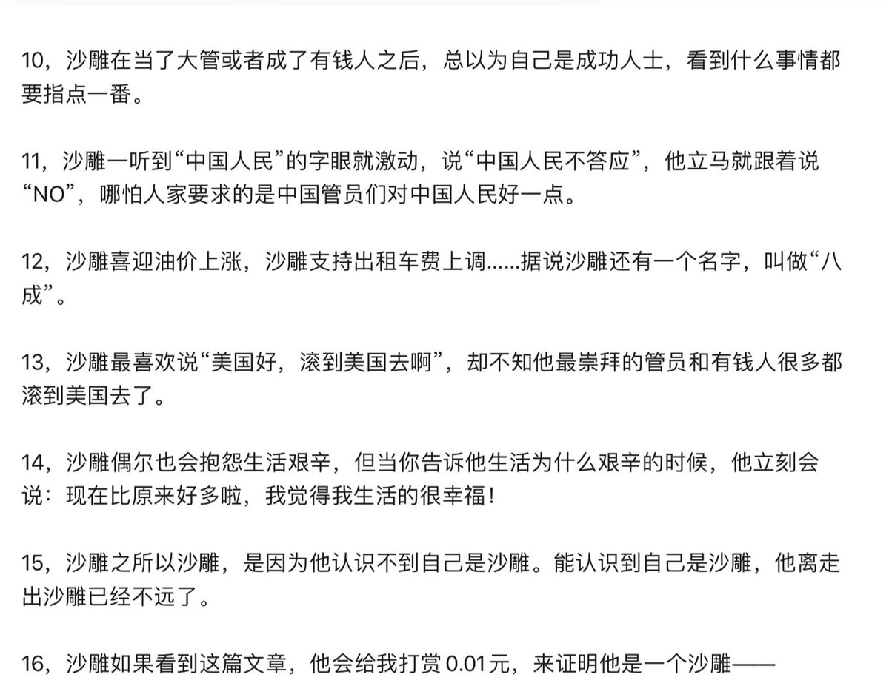

[12月01日 10:06]    新闻大吐槽   @TuCaoFakeNews    邓炳强目前还不敢如大陆国企老总一般欺负百姓，无法无天；
但一旦香港一国一制，他这种香港市公安局长兼政法委书记的角色，真是可以为所欲为；
归根结底，体制之恶也！  :speech_balloon:评:0 :+1:赞:0 :globe_with_meridians:转:0  

[12月01日 09:33]    新闻大吐槽   @TuCaoFakeNews    没想到昨天上了墙内头条的这位可怜人，也是社会主义铁拳击的受害人；

@Socialistfist  :speech_balloon:评:13 :+1:赞:33 :globe_with_meridians:转:8  

[12月01日 09:01]    BBC News 中文   @bbcchinese    【一周热点回顾】美国总统特朗普不理会中国反对，签署《香港人权与民主法案》和《保护香港法案》。香港示威者为何希望美国通过人权民主法案？ https://bbc.in/35Lzhxv   :speech_balloon:评:10 :+1:赞:24 :globe_with_meridians:转:13  

[12月01日 09:00]    纽约时报中文网   @nytchinese    #一周热门 间谍疑云后续：台湾扣留两名涉事中国公司高管 http://nyti.ms/35AJYTk   :speech_balloon:评:2 :+1:赞:7 :globe_with_meridians:转:3  

[12月01日 07:00]    新闻大吐槽   @TuCaoFakeNews    70岁的老太太，有几个能如此清醒，没被求生的龌龊打垮？

优雅、理性、善良的老去，叶德娴显得如此有尊严，如此让人敬重！  :speech_balloon:评:21 :+1:赞:550 :globe_with_meridians:转:185  

[12月01日 07:00]    新闻大吐槽   @TuCaoFakeNews    70岁的老太太，有几个能如此清醒，没被求生的龌龊打垮？

优雅、理性、善良的老去，叶德娴显得如此有尊严，如此让人敬重！  :speech_balloon:评:21 :+1:赞:550 :globe_with_meridians:转:185  

[12月01日 07:00]    纽约时报中文网   @nytchinese    #一周热门 #观点 “恶性病毒”、“感染”：北京形容香港抗议的措辞说明了什么 http://nyti.ms/2sdmK7q   :speech_balloon:评:13 :+1:赞:30 :globe_with_meridians:转:13  

[12月01日 02:48]    新闻大吐槽   @TuCaoFakeNews    专门给老年人准备的文宣——粤剧唱腔《愿荣光归香港》，有模有样！
创新手段扩大民意基本盘，

记得台湾被红媒洗脑的也大多是中老年人，台湾反红媒可以借鉴一下  :speech_balloon:评:10 :+1:赞:131 :globe_with_meridians:转:56  

[12月01日 02:48]    新闻大吐槽   @TuCaoFakeNews    专门给老年人准备的文宣——粤剧唱腔《愿荣光归香港》，有模有样！
创新手段扩大民意基本盘，

记得台湾被红媒洗脑的也大多是中老年人，台湾反红媒可以借鉴一下  :speech_balloon:评:10 :+1:赞:131 :globe_with_meridians:转:56  

[12月01日 02:32]    新闻大吐槽   @TuCaoFakeNews    黑警两字印在墙上，也烙在香港人心里！撕也撕不掉！
如果讨厌被这样称呼，就不要做黑警，而不是妄图掩盖真相！  :speech_balloon:评:5 :+1:赞:87 :globe_with_meridians:转:31  

[12月01日 02:32]    新闻大吐槽   @TuCaoFakeNews    黑警两字印在墙上，也烙在香港人心里！撕也撕不掉！
如果讨厌被这样称呼，就不要做黑警，而不是妄图掩盖真相！  :speech_balloon:评:5 :+1:赞:87 :globe_with_meridians:转:31  

[12月01日 02:09]    BBC News 中文   @bbcchinese    古埃及是世界四大文明古国之一，除了埃及金字塔和木乃伊这些广为人知的古迹文物，还有一些古埃及的“名人”和神灵。我们在今天的社会中随处可以感受到他们的痕迹和影响力。 https://bbc.in/2OYCHpR   :speech_balloon:评:8 :+1:赞:47 :globe_with_meridians:转:13  

[12月01日 01:28]    新闻大吐槽   @TuCaoFakeNews    喜闻乐见啊，具体是哪个富豪？有知道的吗？ https://twitter.com/kevinbbj909090/status/1200827978277511168 …  :speech_balloon:评:9 :+1:赞:85 :globe_with_meridians:转:40  

[12月01日 01:28]    新闻大吐槽   @TuCaoFakeNews    喜闻乐见啊，具体是哪个富豪？有知道的吗？ https://twitter.com/kevinbbj909090/status/1200827978277511168 …  :speech_balloon:评:9 :+1:赞:85 :globe_with_meridians:转:40  

[12月01日 00:47]    BBC News 中文   @bbcchinese    伦敦周五（11月29日）发生恐怖袭击，凶手是28岁的乌斯曼·汗（Usman Khan），而两名受害者之一是25岁的剑桥大学毕业生杰克·梅立特（Jack Merritt）。案情越来越明朗，也带出很多需要回答的问题。 https://bbc.in/2suFwax   :speech_balloon:评:88 :+1:赞:92 :globe_with_meridians:转:38  

[12月01日 00:27]    新闻大吐槽   @TuCaoFakeNews    去年9月在英国会场打人的ccav孔琳琳，被英法庭裁定普通袭击罪成立，判1年监禁，缓期1年执行，另需缴纳2000英镑罚金。
中共驻英大使暴怒！

当时孔琳琳撒泼打的就是香港义工，如今判决惩治了泼妇，帮香港义工讨回公道。

同理，不给香港一个说法，时间之神就会给你一个说法  :speech_balloon:评:29 :+1:赞:350 :globe_with_meridians:转:137  

[12月01日 00:27]    新闻大吐槽   @TuCaoFakeNews    去年9月在英国会场打人的ccav孔琳琳，被英法庭裁定普通袭击罪成立，判1年监禁，缓期1年执行，另需缴纳2000英镑罚金。
中共驻英大使暴怒！

当时孔琳琳撒泼打的就是香港义工，如今判决惩治了泼妇，帮香港义工讨回公道。

同理，不给香港一个说法，时间之神就会给你一个说法  :speech_balloon:评:29 :+1:赞:350 :globe_with_meridians:转:137  

[11月30日 21:51]    BBC News 中文   @bbcchinese    当韩流明星具荷拉被她的男友偷偷拍下视频的时候，具荷拉公开发起反抗，试图寻求公义，而为此她在网络上受到大量恶意攻击。具荷拉上周去世，警方称其为自杀。 https://www.bbc.com/zhongwen/simp/world-50598855 …  :speech_balloon:评:16 :+1:赞:71 :globe_with_meridians:转:27  

[11月30日 21:18]    墙国铁拳现世报😷   @Socialistfist    粉蚷战螂被小编挂以后，一个嘴硬的都没有。  :speech_balloon:评:13 :+1:赞:123 :globe_with_meridians:转:4  

[11月30日 21:00]    纽约时报中文网   @nytchinese    #一周热门《纽约时报》2019年度十大好书 http://nyti.ms/2qOkHXa   :speech_balloon:评:5 :+1:赞:36 :globe_with_meridians:转:13  

[11月30日 19:56]    新闻大吐槽   @TuCaoFakeNews    今晚，民众即将在黄大仙广场举行集会，庆祝泛民主派拿下黄大仙区全部25个区议会议席，目前是最后的准备工作。

作为催泪弹重灾区的黄大仙，能出现如此逆转的选举结果，想必是吃香火的神仙，也受够了催泪弹毒烟~  :speech_balloon:评:2 :+1:赞:149 :globe_with_meridians:转:32  

[11月30日 19:56]    新闻大吐槽   @TuCaoFakeNews    今晚，民众即将在黄大仙广场举行集会，庆祝泛民主派拿下黄大仙区全部25个区议会议席，目前是最后的准备工作。

作为催泪弹重灾区的黄大仙，能出现如此逆转的选举结果，想必是吃香火的神仙，也受够了催泪弹毒烟~  :speech_balloon:评:2 :+1:赞:149 :globe_with_meridians:转:32  

[11月30日 19:11]    新闻大吐槽   @TuCaoFakeNews    注意这个媒体是加国的globalnews，不是胡锡进的globaltimes

还有，这位省议员祖籍广东，在香港长大  :speech_balloon:评:2 :+1:赞:31 :globe_with_meridians:转:4  

[11月30日 19:08]    新闻大吐槽   @TuCaoFakeNews    加拿大省议员李灿明，曾于2015年在上海机场落地时被中共扣留8小时，并以危害国家安全将他遣返，回加后，他一直沉默，现受郑文杰影响，决定站出来披露当年真相，原来被中共拒绝入境的原因是：他每年都纪念64，还为被中共迫害的信仰团体和少数族群呼吁；

与普世价值为敌中共 https://globalnews.ca/news/6228973/b-c-politician-richard-lee-china-detained-interfering-democracy/ …  :speech_balloon:评:12 :+1:赞:254 :globe_with_meridians:转:157  

[11月30日 19:08]    新闻大吐槽   @TuCaoFakeNews    加拿大省议员李灿明，曾于2015年在上海机场落地时被中共扣留8小时，并以危害国家安全将他遣返，回加后，他一直沉默，现受郑文杰影响，决定站出来披露当年真相，原来被中共拒绝入境的原因是：他每年都纪念64，还为被中共迫害的信仰团体和少数族群呼吁；

与普世价值为敌中共 https://globalnews.ca/news/6228973/b-c-politician-richard-lee-china-detained-interfering-democracy/ …  :speech_balloon:评:12 :+1:赞:254 :globe_with_meridians:转:157  

[11月30日 19:00]    纽约时报中文网   @nytchinese    #一周热门 #时报专栏 这场美中“战争”究竟要走向何方？ http://nyti.ms/2rr5rzA   :speech_balloon:评:15 :+1:赞:11 :globe_with_meridians:转:2  

[11月30日 17:40]    新闻大吐槽   @TuCaoFakeNews    今天下午，渣打花园~

连侬墙继续，集会继续，抗争继续！

经历了大风大浪，更珍视彼此的价值，合理非与勇武不割席！  :speech_balloon:评:7 :+1:赞:250 :globe_with_meridians:转:98  

[11月30日 17:20]    财经真相   @caijingxiang    环球时报：中国国安抓捕两名“反中乱港”分子！  :speech_balloon:评:23 :+1:赞:167 :globe_with_meridians:转:61  

[11月30日 17:00]    纽约时报中文网   @nytchinese    #一周热门 香港区议会选举结果图表分析 http://nyti.ms/2XIXVfd   :speech_balloon:评:3 :+1:赞:14 :globe_with_meridians:转:6  

[11月30日 16:47]    BBC News 中文   @bbcchinese    中国央视驻欧洲站记者孔琳琳去年因与一名义工发生冲突，在英国被判袭击罪成立，但已在有条件下释放。 https://www.bbc.com/zhongwen/simp/chinese-news-50612131 …  :speech_balloon:评:84 :+1:赞:351 :globe_with_meridians:转:88  

[11月30日 16:00]    纽约时报中文网   @nytchinese    研究表明，在同样的运动量下，空腹锻炼者燃烧的脂肪大约是吃过早餐者的两倍。
科学家建议，在不增加强度和时间的情况下，早餐前锻炼效果更好，但个人可视情况合理安排。 http://nyti.ms/2qP6MjP   :speech_balloon:评:7 :+1:赞:113 :globe_with_meridians:转:55  

[11月30日 15:42]    新闻大吐槽   @TuCaoFakeNews    7天里，用各种办法从理工大学逃掉的约有400人，K先生是逃亡的策划者，他殚精竭虑，每天睡得很少；
逃走人最多的是一处下水道口，放风者趁着1、2分钟没人的时候，拽小朋友上来，乘车离开；
他本来不鼓励这样逃亡，可相比下水道的泥泞，孩子们更怕黑警和酷刑~
“他们只是要回家”，K先生说着说着，潸然泪下  :speech_balloon:评:48 :+1:赞:1476 :globe_with_meridians:转:762  

[11月30日 15:23]    纽约时报中文网   @nytchinese    一名商人称中国计划将他安插到议会、向澳洲寻求庇护的王立强详述北京的政治干预活动……
新披露信息震动澳大利亚政坛。对中国干预的恐惧一度笼罩着澳大利亚。而现在，北京的政治野心，及其为之推波助澜的间谍活动，突然变得仿佛就在眼前且始终存在。 http://nyti.ms/2OA1hP1   :speech_balloon:评:49 :+1:赞:271 :globe_with_meridians:转:114  

[11月30日 15:01]    BBC News 中文   @bbcchinese    【一周热点回顾】许多泛民主派当选人认为，结果反映香港市民强烈要求政府答应“五大诉求”，而建制派认为地区民生事务工作已经不能保证选情。 https://bbc.in/2R3MkWW   :speech_balloon:评:21 :+1:赞:56 :globe_with_meridians:转:8  

[11月30日 15:00]    纽约时报中文网   @nytchinese    #一周热门 #观点 “新疆文件”证实了中国不想让我们知道的一切 http://nyti.ms/34hfhSY   :speech_balloon:评:45 :+1:赞:134 :globe_with_meridians:转:37  

[11月30日 14:49]    老司机   @h5lpykl7tp6jjop    好文分享：
问君何所似？天地一沙雕！
文/豆腐
2019/11/29  :speech_balloon:评:0 :+1:赞:10 :globe_with_meridians:转:6  

[11月30日 14:24]    老司机   @h5lpykl7tp6jjop    ＂大多数人的利益＂是人类史上最荒谬的一句口号！
那些代表中国大多数人的利益的人却拿走了大多数人的利益！它们享受着特权，住在中南海皇宫中，居然恬不知耻在大门口写着为人民服务！拥有万亿美元存在海外，子孙后代在海外享福，开着豪车高喊爱国，而穷人没钱看病只有跳楼，九十多岁老人还拾荒为生！  :speech_balloon:评:2 :+1:赞:88 :globe_with_meridians:转:34  

[11月30日 13:01]    BBC News 中文   @bbcchinese    【一周热点回顾】一名美国年轻人在中国短视频平台抖音海外版上传一段教人夹睫毛的影片，但却突然聊到中国在新疆设立“集中营”，视频在社交媒体上广泛流传。 https://bbc.in/2rCnId0   :speech_balloon:评:57 :+1:赞:331 :globe_with_meridians:转:93  

[11月30日 13:00]    纽约时报中文网   @nytchinese    #一周热门 香港区议会选举民主派大胜意味着什么？ http://nyti.ms/2OlbgHG   :speech_balloon:评:23 :+1:赞:25 :globe_with_meridians:转:10  

[11月30日 11:01]    BBC News 中文   @bbcchinese    【一周热点回顾】加拿大籍台湾艺人高以翔在浙江宁波录制一档真人秀节目时猝死，在中国大陆和台湾引发震动。 https://bbc.in/2rB31ye   :speech_balloon:评:23 :+1:赞:43 :globe_with_meridians:转:11  

[11月30日 11:00]    纽约时报中文网   @nytchinese    #一周热门 #观点 抗议的面孔 http://nyti.ms/2QQTVIh   :speech_balloon:评:21 :+1:赞:49 :globe_with_meridians:转:11  

[11月30日 10:33]    老司机   @h5lpykl7tp6jjop    当穷人穷的没尊严，富人就会富得没安全！
如果逻辑调一下，它仍然成立，
当富人富的沒安全，穷人就会穷得没尊严！  :speech_balloon:评:67 :+1:赞:565 :globe_with_meridians:转:387  

[11月30日 09:53]    财经真相   @caijingxiang    不良资产证券化，这次扩围竟然把四大AMC也纳入进来了，真是可笑啊，四大不良资管公司，本来就是化解不良资产，现在竟然打包直接融资为证券，问题是这些证券谁买？还有这些证券究竟是什么产品？  :speech_balloon:评:31 :+1:赞:183 :globe_with_meridians:转:50  

[11月30日 09:48]    老司机   @h5lpykl7tp6jjop    广东化州因火葬场大游行事件，看看警察打死打伤多少示威群众……真是惨不忍睹，凶残至极！谁来救救大陆民众？  :speech_balloon:评:75 :+1:赞:737 :globe_with_meridians:转:500  

[11月30日 09:42]    财经真相   @caijingxiang    工商银行手机端根据《信息技术安全-个人信息安全规范》（GB/T35273-2017）要求，要收集用户个人地理位置、相册，这是什么根据？  :speech_balloon:评:53 :+1:赞:338 :globe_with_meridians:转:152  

[11月30日 09:30]    BBC News 中文   @bbcchinese    英国警方说，市中心伦敦桥上发生持刀捅人事件，造成两人死亡，3人受伤。警方称这是一起恐怖袭击事件。 https://bbc.in/2R3z9Fy   :speech_balloon:评:175 :+1:赞:96 :globe_with_meridians:转:29  

[11月30日 09:01]    BBC News 中文   @bbcchinese    【一周热点回顾】郑文杰是嫖娼还是“被嫖娼”？网友们有不同看法。 https://bbc.in/37P3o8Y   :speech_balloon:评:191 :+1:赞:134 :globe_with_meridians:转:38  

[11月30日 09:00]    纽约时报中文网   @nytchinese    #一周热门 “变节者”揭露中共干预港台政局细节，自称曾为中国间谍 http://nyti.ms/35vlmeW   :speech_balloon:评:37 :+1:赞:91 :globe_with_meridians:转:30  

[11月30日 08:31]    BBC News 中文   @bbcchinese    冷战会“以猛烈的方式重来”？英国国防智库警告，一旦战争爆发英军和盟军会被俄军击溃，引发大量北约和俄罗斯对抗的报道。 https://bbc.in/2Oxot03   :speech_balloon:评:45 :+1:赞:128 :globe_with_meridians:转:35  

[11月30日 08:30]    凡賽堤/FORSETI   @FecharCCP    CCP極權恐怖組織把人民的血汗錢都用在的網絡維穩上了，圈養了人類獨一無二的，人數達千萬的流氓殭屍網絡水軍，谷歌所有集團企業已經淪為CCP極權恐怖組織重要維穩工具了，從2018年google搜索郭文貴的8百萬到現在的360萬，郭媒體從2019年初的18000的全球排名到現在的27669排名，極權不滅，養老永無望！  :speech_balloon:评:0 :+1:赞:9 :globe_with_meridians:转:8  

[11月30日 08:27]    新闻大吐槽   @TuCaoFakeNews    抖音美国版tiktok要被玩死了，年轻人前仆后继挑战中共红线，为新疆发声。
抖音是继续删号，替中共审查美国人，还是向美国输诚，坐视类似视频刷版？

要我是抖音负责人，就立即放弃在美国发展的想法  :speech_balloon:评:83 :+1:赞:2987 :globe_with_meridians:转:1275  

[11月30日 07:31]    BBC News 中文   @bbcchinese    最新研究发现英国超市塑料垃圾增加之际，北京宣布将于2020年开始实施垃圾分类如何处理废塑料？ https://bbc.in/33wbLD5   :speech_balloon:评:11 :+1:赞:28 :globe_with_meridians:转:9  

[11月30日 07:23]    凡賽堤/FORSETI   @FecharCCP    推翻共产党！全民抗议！全民起义！唱响国际歌！起来不愿做奴隶的人们！起来全中国受苦受难的中华儿女！ https://twitter.com/breakup1984/status/1200411445940211714 …  :speech_balloon:评:0 :+1:赞:20 :globe_with_meridians:转:11  

[11月30日 07:19]    凡賽堤/FORSETI   @FecharCCP    人類史上最殘暴的CCP極權殺人恐怖組織正在用各種兇殘手段屠殺我們的同胞...................

CCP極權殺人恐怖組織在香港發射數以萬計的疑似帶有生化武器成份的非標準催淚彈，足以影響三代人的致癌可能！

CCP極權殺人恐怖組織在自己的土地上投放劇毒催淚彈意圖謀殺我們黃色種族同胞！  :speech_balloon:评:2 :+1:赞:28 :globe_with_meridians:转:24  

[11月30日 07:00]    纽约时报中文网   @nytchinese    #一周热门 擅闯特朗普庄园的中国女子被判八个月监禁 http://nyti.ms/37ClGdE   :speech_balloon:评:7 :+1:赞:38 :globe_with_meridians:转:7  

[11月30日 06:42]    老司机   @h5lpykl7tp6jjop    看看这些杀气腾腾的家伙以及这么多点赞，谁能告诉我们，共产党哪一天会制造出类似卢旺达大屠杀，柬埔寨大屠杀这样的惨案吗？文革时期的道县，大兴，广西大规模杀人吃人事件有多少人知道？这是什么样的疯狂理论制造出来的疯子！？  :speech_balloon:评:16 :+1:赞:44 :globe_with_meridians:转:20  

[11月30日 06:19]    老司机   @h5lpykl7tp6jjop    又来号召中国人民团结起来抵制美帝了！
有网友说：关中国人民什么事？我又没有存款在美国。
我又没有房产在美国。我又没有家属子女在美国。
免费医疗有我们吗？公平退休养老有我们吗？
美国制裁好了，谁怕谁是孙子！  :speech_balloon:评:1 :+1:赞:41 :globe_with_meridians:转:13  

[11月30日 05:58]    老司机   @h5lpykl7tp6jjop    中共催泪弹成分化验结果出炉：山埃毒，也叫氰化钾，爆表！这已经不是镇压抗议者，而是赤裸裸的谋杀，包括对抗议者的生育都会造成影响！  https://twitter.com/SolomonYue/status/1200445644613140480 …  :speech_balloon:评:11 :+1:赞:266 :globe_with_meridians:转:236  

[11月30日 05:58]    凡賽堤/FORSETI   @FecharCCP    中共催泪弹成分化验结果出炉：山埃毒，也叫氰化钾，爆表！这已经不是镇压抗议者，而是赤裸裸的谋杀，包括对抗议者的生育都会造成影响！  https://twitter.com/SolomonYue/status/1200445644613140480 …  :speech_balloon:评:11 :+1:赞:266 :globe_with_meridians:转:236  

[11月30日 05:47]    老司机   @h5lpykl7tp6jjop    世界各国的历史对于国家统治形态有各种不同的尝试，从古希腊雅典的民主，罗马的元老院，英国大宪章，议会一直到现在比较完善的民主制度，只有中国不同的是从古至今几千年醉心于一人君临天下当独裁皇帝！而且是人人心向往之，你方唱罢我登场，络绎不绝，即便打着民主旗号的一上台也都最后变成独裁暴君！  :speech_balloon:评:1 :+1:赞:26 :globe_with_meridians:转:9  

[11月30日 04:42]    老司机   @h5lpykl7tp6jjop    老外拍摄一国两制的大学生寝室，是谁在岐视中国人？  :speech_balloon:评:47 :+1:赞:435 :globe_with_meridians:转:232  

[11月30日 04:25]    老司机   @h5lpykl7tp6jjop    中国人能彻底懂得这句话的人很少，但是还是要再发一次 : 不要仇恨别的国家，你本人在当代生活中所受的苦难和压力，其根源的99.99% 都不来自别的国家。  :speech_balloon:评:24 :+1:赞:365 :globe_with_meridians:转:145  

[11月30日 01:48]    墙国铁拳现世报😷   @Socialistfist    好一句“打得好”，但如果所有香港人都和他們一樣幸災樂禍，咁香港就真正被同化了  :speech_balloon:评:4 :+1:赞:79 :globe_with_meridians:转:7  

[11月30日 01:13]    墙国铁拳现世报😷   @Socialistfist    有推友说最近铁拳不够劲
小编一如既往地欢迎大家踊跃投稿
但有时候，无铁拳胜过假铁拳  :speech_balloon:评:7 :+1:赞:140 :globe_with_meridians:转:3  

[11月30日 01:09]    墙国铁拳现世报😷   @Socialistfist    补图  :speech_balloon:评:9 :+1:赞:125 :globe_with_meridians:转:21  

[11月30日 01:08]    墙国铁拳现世报😷   @Socialistfist    “打得好”

#社会主义铁拳  :speech_balloon:评:28 :+1:赞:230 :globe_with_meridians:转:54  

[11月30日 00:40]    墙国铁拳现世报😷   @Socialistfist    吼啊！ 
小编举双手赞同，一定滋磁捧场
不过要严正说明，我们是 社会主义 的生产者，我们只是 社会主义 的搬运工 https://twitter.com/Ray27809561/status/1196838238771531776 …  :speech_balloon:评:21 :+1:赞:261 :globe_with_meridians:转:28  

[11月30日 00:18]    BBC News 中文   @bbcchinese    英国警方说，当地时间周五（29日）下午约14点，市中心伦敦桥上发生持刀捅人事件，造成数人受伤。警方称这是一起涉恐事件。 https://bbc.in/2rCTy9E   :speech_balloon:评:283 :+1:赞:206 :globe_with_meridians:转:83  

[11月29日 23:30]    老司机   @h5lpykl7tp6jjop    香港警察还是挺幸运的  :speech_balloon:评:232 :+1:赞:3946 :globe_with_meridians:转:2091  

[11月29日 23:17]    老司机   @h5lpykl7tp6jjop    招行以【系統升級改造】為由，暫時停止“境外匯款”，恢復時間另行通知。

12月2日起不再接受新指令，12月30日起關閉匯款計劃服務，所有未執行的指令都會失效。  :speech_balloon:评:15 :+1:赞:158 :globe_with_meridians:转:70  

[11月29日 21:07]    BBC News 中文   @bbcchinese    该案件是近段时间来震惊韩国流行乐坛的多起性丑闻中的一件。 https://bbc.in/35PcK2D   :speech_balloon:评:8 :+1:赞:27 :globe_with_meridians:转:8  

[11月29日 20:36]    老司机   @h5lpykl7tp6jjop    广东省茂名市，化州县火葬场事件，据说警察打死2人，下面是其中一位：

中共囿于香港国际金融中心地位，以及洗钱必经之地等原因，不敢在香港明目张胆的杀人，可到了大陆，真是砍瓜切菜一般，毫无顾忌！  :speech_balloon:评:120 :+1:赞:1563 :globe_with_meridians:转:1126  

[11月29日 20:33]    BBC News 中文   @bbcchinese    有些物种在一个地区一度绝迹，被认为绝种，但在其他地区不为人知地存活着，后来被发现。 https://bbc.in/2Du6CAY   :speech_balloon:评:1 :+1:赞:31 :globe_with_meridians:转:14  

[11月29日 20:05]    BBC News 中文   @bbcchinese    【特朗普签香港人权法案，感恩节集会上有香港市民说“很惊讶”】美国总统特朗普签署《香港人权与民主法案》。 香港有市民在感恩节当天举行集会，一些支持此法案的市民认为，这会令香港政府处理示威浪潮时更加克制，避免美国政府改变给予香港特殊地位的政策。 https://bbc.in/33sUgU3   :speech_balloon:评:36 :+1:赞:48 :globe_with_meridians:转:12  

[11月29日 18:30]    纽约时报中文网   @nytchinese    佐藤郁夫站在东京一个法庭上，向世界宣布自己是同性恋。他描述了自己作为一个年轻男性的焦虑，在充满约束的日本社会中苦于难以表达自己的性态。
他说，如果修改法律允许同性婚姻，或许“我们的社会可以让下一代不必有再有这种感受”。 http://nyti.ms/2q1KhHT   :speech_balloon:评:5 :+1:赞:21 :globe_with_meridians:转:5  

[11月29日 18:12]    墙国铁拳现世报😷   @Socialistfist    评论区一览  :speech_balloon:评:21 :+1:赞:292 :globe_with_meridians:转:55  

[11月29日 18:08]    墙国铁拳现世报😷   @Socialistfist    一个中国人没有被逼到绝路，谁想和石头撞。

#社会主义铁拳  :speech_balloon:评:138 :+1:赞:919 :globe_with_meridians:转:347  

[11月29日 18:01]    BBC News 中文   @bbcchinese    巴基斯坦有一个小镇，镇上将近900名儿童感染艾滋病病毒。让人奇怪的是，大部分感染的儿童年龄都低于12岁，家族并无病史。 https://bbc.in/2qV4vDy   :speech_balloon:评:34 :+1:赞:120 :globe_with_meridians:转:68  

[11月29日 17:07]    纽约时报中文网   @nytchinese    #图集【在美国，35万美元能买到什么房？】手握35万美元，你能买到位于路易斯维尔一座建于1941年的科德角式建筑，或杰克逊维尔的一幢艺术与工艺风格住宅，也可以选择底特律附近的1840年代早期房屋。
点击查看图集： http://nyti.ms/2R3YJds   :speech_balloon:评:13 :+1:赞:40 :globe_with_meridians:转:10  

[11月29日 17:01]    BBC News 中文   @bbcchinese    抖音早前因为封锁一名美国少女的帐号，引起外界批评，指抖音是因为视频里提到北京政府在新疆设立的“再教育营”。抖音之后把少女的帐号解锁，同时向对方道歉，但坚持封锁帐号与政治审查无关。 https://bbc.in/2q09Okz   :speech_balloon:评:212 :+1:赞:846 :globe_with_meridians:转:296  

[11月29日 16:28]    纽约时报中文网   @nytchinese    周五，警方将对香港理工大学校园的控制权交还给校方，抗议活动中尤为激烈的一段时期宣告结束。
警方称，在周五上午的最后搜查中未发现抗议者。警方表示，在过去的两天里，搜查人员在校园里发现了近4000枚燃烧弹和其他爆炸性物品和数瓶腐蚀性液体。 http://nyti.ms/2rG9s2X   :speech_balloon:评:32 :+1:赞:128 :globe_with_meridians:转:49  

[11月29日 16:01]    BBC News 中文   @bbcchinese    “我可以随时随地进行冥想”，泰国僧人波姆（Pom）说。
他在派对上度过了青春时光，但这已经没有意义了。他决定加入泰国一间要求最严格的寺院。  :speech_balloon:评:15 :+1:赞:112 :globe_with_meridians:转:32  

[11月29日 15:39]    纽约时报中文网   @nytchinese    近年来日本舆论对同性婚姻支持激增，地方政府越来越多地承认同性伴侣关系，就连以刻板著称的日本企业也开始站出来支持他们。
但在其它方面，这些成果仍然不切实际。同性恋者面临着巨大的压力，要他们遵循沉默、压抑的社会规范。同性婚姻法案在保守的政界也缺乏支持。 http://nyti.ms/2q1KhHT   :speech_balloon:评:11 :+1:赞:84 :globe_with_meridians:转:21  

[11月29日 15:02]    纽约时报中文网   @nytchinese    《复仇者联盟》、《冰雪奇缘》、《月光男孩》、《美国狙击手》、《饥饿游戏2：星火燎原》、《星球大战：原力觉醒》……时报影评人选出了十年来在娱乐界乃至更广范围产生巨大影响的影片。
它们反映了我们所处的时代，改变甚至塑造了电影行业。 http://nyti.ms/2DtnpUC   :speech_balloon:评:10 :+1:赞:79 :globe_with_meridians:转:34  

[11月29日 15:01]    BBC News 中文   @bbcchinese    香港的移民中介称，六月示威爆发前，前来谘询的客户仍对移民举棋未定。但在六月之后，不仅谘询数量翻倍，而且客户似乎都已经下定决心离开。 https://bbc.in/2R7Adbz   :speech_balloon:评:111 :+1:赞:381 :globe_with_meridians:转:143  

[11月29日 14:30]    纽约时报中文网   @nytchinese    #时报专栏 这场美中“战争”究竟要走向何方？ http://nyti.ms/2rr5rzA https://twitter.com/ccni/status/1199875515613614080 …  :speech_balloon:评:6 :+1:赞:7 :globe_with_meridians:转:0  

[11月29日 14:10]    财经真相   @caijingxiang    外资也不是傻子！ https://twitter.com/renfanzi/status/1199949375360786433 …  :speech_balloon:评:14 :+1:赞:168 :globe_with_meridians:转:36  

[11月29日 14:10]    纽约时报中文网   @nytchinese    据纪录片《喜梅》，在90年代的一次地方疫情中，河南省估计有30万人感染了HIV。当时，官员们鼓励农民卖血为生。病毒通过受污染的设备和输血传播。
多年后，河南的艾滋病患者仍然遭到冷落——家人嘲笑他们，一些医院拒绝对他们进行治疗，要求他们填写复杂的报销表格。 http://nyti.ms/37O2cmv   :speech_balloon:评:7 :+1:赞:47 :globe_with_meridians:转:31  

[11月29日 13:30]    纽约时报中文网   @nytchinese    “‘色情作品’听起来没那么有趣，”音频色情平台Quinn的创始人斯皮格尔说。她和同事的目标是让Quinn成为非视觉色情作品的首选目的地。
“视觉色情对我不起作用，”她说。“太多偷窥的感觉了。”她发现音频色情给主观性和想象力留下了更多的空间。而且你可以在任何地方听。 http://nyti.ms/2DsYrF6   :speech_balloon:评:2 :+1:赞:17 :globe_with_meridians:转:4  

[11月29日 13:08]    财经真相   @caijingxiang    还有两个小时a股收盘，中共怼香港法案的反击不会停留在嘴炮上，周末应该会很热闹，a股散户割肉吧！即使没有政治关系，临近年底a股也是到了收割时时候！ https://twitter.com/caijingxiang/status/1200265864064335872 …  :speech_balloon:评:10 :+1:赞:177 :globe_with_meridians:转:28  

[11月29日 12:10]    财经真相   @caijingxiang    今天a股跌各种股侠、大校、股神、V们没有脾气！茅台这次也是真喝醉了！  :speech_balloon:评:22 :+1:赞:298 :globe_with_meridians:转:34  

[11月29日 11:23]    老司机   @h5lpykl7tp6jjop      :speech_balloon:评:1 :+1:赞:12 :globe_with_meridians:转:10  

[11月29日 11:22]    老司机   @h5lpykl7tp6jjop    最悲催的事

                            王朔

一、好不容易建立新中国，结果新中国饿死的人比抗日战争牺牲的还多。
三、发现当初的国民党四大家族，其实还不如我党的乡镇干部有钱。
四、党国官员们带领我们反美反西方，却发现他们把自己的老婆后代全都移民去美国了。  :speech_balloon:评:6 :+1:赞:447 :globe_with_meridians:转:224  

[11月29日 11:17]    老司机   @h5lpykl7tp6jjop    #维权运动 

场面和香港熟悉吗？
重点看 #15秒地上拖人的动作

广东省茂名化州市文楼镇数千人与警察发生激烈冲突

当地政府以建生态公园为名骗老人签字
后改为建火葬场  :speech_balloon:评:29 :+1:赞:426 :globe_with_meridians:转:270  

[11月29日 09:49]    老司机   @h5lpykl7tp6jjop    【比旧社会的地主恶霸还凶残百倍】霸占了农民的土地，现在又强夺农民的房子，最终让他们一无所有，除了满身的病痛和疲惫的身躯……这就是不关心政治的结果，你再怎么努力都是徒劳无益，为人作嫁，最终都竹篮打水一场空！  :speech_balloon:评:41 :+1:赞:406 :globe_with_meridians:转:211  

[11月29日 04:21]    老司机   @h5lpykl7tp6jjop    你它妈的是谁总能代表人民喜迎涨价？  :speech_balloon:评:13 :+1:赞:107 :globe_with_meridians:转:40  

[11月29日 04:17]    老司机   @h5lpykl7tp6jjop    转发：这个奴才还挺会算计！
翻译成奴隶们能听懂的话，就是：维持奴隶主及其后代们的奢侈生活，需要奴隶们生出更多的小奴隶。如果你没有勇气改变这个国家，那你就别生孩子或者少生孩子。因为未来你的孩子有90%的可能性和你一样在金字塔的底层，每天为了生存而挣扎。  :speech_balloon:评:7 :+1:赞:27 :globe_with_meridians:转:13  

[11月28日 18:02]    财经真相   @caijingxiang    人民日报这篇文章玄机很深，直接不点名骂川普是“地产商的吹牛”，这对一国元首直接开骂是极不寻常的事件，似乎是故意在激怒白宫，如果白宫曝光川习电话录音，习近平将彻底成为世界公认的“屠夫“，这与曝光新疆四百页文件一脉相承，好一个借刀杀人之计！  :speech_balloon:评:14 :+1:赞:354 :globe_with_meridians:转:60  

[11月28日 17:45]    财经真相   @caijingxiang    这次人民日报开始直接不点名骂川普了，不知道川普同志如何看待？各位都@川普  :speech_balloon:评:69 :+1:赞:495 :globe_with_meridians:转:160  

[11月28日 16:51]    财经真相   @caijingxiang    太极拳已经没必要继续打了，彻底撕破脸的时刻，香港法案的影响，绝对不会只是，停留在嘴炮上！交易员们避险情绪随时会突然涌上来，做好准备！  :speech_balloon:评:7 :+1:赞:197 :globe_with_meridians:转:22  

[11月28日 16:31]    财经真相   @caijingxiang    如果消息属实，金融市场很快即将迎来天翻复地的巨变，人民币、黄金、股市做好冲浪准备！ https://twitter.com/IntyPython/status/1199952867953561600 …  :speech_balloon:评:50 :+1:赞:565 :globe_with_meridians:转:157  

[11月28日 15:21]    财经真相   @caijingxiang    胡锡进：美国“香港人权与民主法案”有两大内容：一是威胁取消美国对香港的特殊关税待遇，二是威胁制裁香港官员和建制派人士。  :speech_balloon:评:75 :+1:赞:242 :globe_with_meridians:转:51  

[11月28日 10:39]    财经真相   @caijingxiang    法案签署后，目前中国股市、人民币汇率处于“西线无战时”，黄金市场没有波动，川普签署法案的事市场早有预期，因此几乎没有波动，但是对中美贸易谈判产生何种影响，市场还没做好准备，接下来就看中共如何实质性反击！  :speech_balloon:评:33 :+1:赞:319 :globe_with_meridians:转:57  

[11月28日 09:21]    财经真相   @caijingxiang    一位神秘买家在黄金期货市场以175万美元购买了一笔看涨合约，押注黄金在2021年6月涨到4000美元，这样的疯狂赌注，按照目前正常市场情况下，除非美联储实行负利率，但是这对美联储而言显然不太可能；除非世界出现重大“风险事件”，引发黄金超级避险情绪，如果该合约真的押注正确其收益将是爆炸性的！  :speech_balloon:评:112 :+1:赞:709 :globe_with_meridians:转:180  

[11月28日 08:56]    财经真相   @caijingxiang    第一张多米诺骨牌终于倒下来了，接下来它产生的效应会不断扩大，直到红色帝国大厦里轰然倒塌！未来几十年的世界格局就此打破！ https://twitter.com/voachinese/status/1199826749246312448 …  :speech_balloon:评:52 :+1:赞:754 :globe_with_meridians:转:170  

[11月28日 08:19]    凡賽堤/FORSETI   @FecharCCP    幾個月來據不完全統計，CCP極權發動的黑警非法濫捕香港學生孩子以萬人計算，用各種兇殘手段屠殺的幾千人！

讓我們極度關注，傳播香港真相，盡可能的向全世界媒體以各種語言傳播，讓全世界的人看清CCP極權殺人恐怖組織納粹真相，才能真正的減少這些被非法秘密抓捕的香港學生孩子被殺害！天佑香港人！  :speech_balloon:评:43 :+1:赞:199 :globe_with_meridians:转:147  

[11月28日 08:06]    凡賽堤/FORSETI   @FecharCCP    幾個月以來，香港700萬人共同見證了CCP反人類的慘無人道的殘暴罪行！！！

這是千千萬萬的像這麼小的小朋友都親眼見證了CCP反人類的慘無人道的殘暴罪行！！！

天滅CCP！！！天滅極權！！！  :speech_balloon:评:0 :+1:赞:20 :globe_with_meridians:转:8  

[11月28日 07:48]    凡賽堤/FORSETI   @FecharCCP    美國總統川普宣布他已签署
《香港人权与民主法案》

《香港人权与民主法案》已經成功列入美國的法律！
期望美國能執行《香港人权与民主法案》對香港的黑警和淋症夜蛾進行制裁！  :speech_balloon:评:5 :+1:赞:37 :globe_with_meridians:转:19  

[11月28日 01:20]    财经真相   @caijingxiang    三季度美国GDP增速二读为2.1%，高于预期和初值1.9%，二季度为2%。但商业投资仍是经济薄弱环节，企业盈利核心指标持续弱化。与年初相比，美国经济增速明显放缓，包括美联储在内的经济学家认为四季度增长率“大幅减弱”，美联储12月或保持“按兵不动”的利率政策。  :speech_balloon:评:8 :+1:赞:93 :globe_with_meridians:转:13  

[11月28日 00:29]    墙国铁拳现世报😷   @Socialistfist    那两个字不会写
阿钟哥请你jiayou学中文
#战螂在推特  :speech_balloon:评:46 :+1:赞:276 :globe_with_meridians:转:40  

[11月27日 23:41]    墙国铁拳现世报😷   @Socialistfist    一个美国人向俄国人解释为什么说美国是一个真正言论自由的国家。
美国人说：“我可以走到白宫前，高喊让里根下地狱！”
俄国人很不以为然：“你这算什么，我也可以走到红场上高喊，让里根下地狱”！ https://twitter.com/jiayoubiss/status/1199703307943600128 …  :speech_balloon:评:24 :+1:赞:693 :globe_with_meridians:转:116  

[11月27日 22:46]    墙国铁拳现世报😷   @Socialistfist    哪里不自由？

#社会主义铁拳  :speech_balloon:评:43 :+1:赞:681 :globe_with_meridians:转:139  

[11月27日 16:32]    财经真相   @caijingxiang    胡锡进：用抹黑中共来打击中国，此术休想得逞！蓬佩奥把中共与中国区分开来的战术开始奏效！  :speech_balloon:评:77 :+1:赞:562 :globe_with_meridians:转:161  

[11月27日 13:13]    财经真相   @caijingxiang    下联：吸血拌雪花，既雪拌血又或血拌雪！求横批： https://twitter.com/qiubaibot/status/1199394907196030977 …  :speech_balloon:评:45 :+1:赞:102 :globe_with_meridians:转:21  

[11月27日 11:15]    财经真相   @caijingxiang    广东省第十二届委员会第八次全体会议于11月25日至26日在广州召开。本次会议审议通过《关于支持深圳建设中国特色社会主义先行示范区的若干重大措施》 深圳要成为“样板”了！  :speech_balloon:评:75 :+1:赞:241 :globe_with_meridians:转:87  

[11月27日 00:38]    财经真相   @caijingxiang    人民币疯涨，貌似没有任何消息面，就是纯粹在拉，而且黄金也涨，根本不是以往的贸易利好消息！  :speech_balloon:评:43 :+1:赞:369 :globe_with_meridians:转:53  

[11月26日 23:10]    墙国铁拳现世报😷   @Socialistfist    发#社会主义铁拳 太难了，业余还要打假  :speech_balloon:评:14 :+1:赞:124 :globe_with_meridians:转:6  

[11月26日 18:15]    财经真相   @caijingxiang    央视新闻：习近平主持召开中央全面深化改革委员会第十一次会议强调：落实党的十九届四中全会重要举措，继续全面深化改革实现有机衔接融会贯通。看到落实四中全会，及知道这个所谓的全面深化改革究竟是如何“改革”  :speech_balloon:评:35 :+1:赞:150 :globe_with_meridians:转:28  

[11月26日 02:49]    墙国铁拳现世报😷   @Socialistfist    潘福仁退休前在2007年与网友 网论司法公正
 http://law.eastday.com/dongfangfz/node7/u1a5371.html …  :speech_balloon:评:0 :+1:赞:45 :globe_with_meridians:转:6  

[11月26日 02:47]    墙国铁拳现世报😷   @Socialistfist    江西中级人民法院法官 
判被告 前
上海中级人民法院法官
9年半有期徒刑

#社会主义铁拳  :speech_balloon:评:16 :+1:赞:266 :globe_with_meridians:转:67  

[11月26日 01:01]    GFHG SDKM   @zyx_yny    Heading back to London. 

Thank you #HK for letting us share in your unforgettable victory.

香港人, 加油   :speech_balloon:评:2661 :+1:赞:21432 :globe_with_meridians:转:10086  

[11月25日 14:20]    墙国铁拳现世报😷   @Socialistfist    搬运一个来自微博的欢乐源泉，给墙内开票开了通宵，按时间倒序，他分别表演了：

1. 目瞪口呆
2. 伤心欲绝
3. 自欺欺人
4. 微博全部被删  :speech_balloon:评:263 :+1:赞:3974 :globe_with_meridians:转:1424  

[11月25日 00:13]    老司机   @h5lpykl7tp6jjop    太可怕了，中共早已切斷美國和澳大利亞新西蘭的海上交通咽喉，也就是說如果第三次世界大戰爆發，中國對澳新軍事打擊時，美國海上補給的路給堵死了。為什麼中共在香港問題上那麼驕橫跋扈，為何新西蘭政府從來不表態撐香港，因為金錢外交已深入南太平洋每個島國。最後一片淨土也將毀在中共的魔爪之下  :speech_balloon:评:38 :+1:赞:503 :globe_with_meridians:转:369  

[11月24日 12:46]    GFHG SDKM   @zyx_yny    Very good to take some time@our from election observation to tell #JuniusHo in person that I was responsible for the revocation of his honorary doctorate from @AngliaRuskin #Sorrynotsorry  :speech_balloon:评:6937 :+1:赞:46252 :globe_with_meridians:转:27761  

[11月24日 08:10]    凡賽堤/FORSETI   @FecharCCP    呼籲請求共同挖掘所有有關香港發生的事，越全面越好，不同角度，越多越好，包括被暗地抓捕的人員，特別是CCP 派出的各種偽裝身份，包括變身變裝行兇的一點一滴都要挖掘出來，把CCP 的邪惡下三濫手段的真相毫無保留的曝光在全世界面前！世界公知公義才能真正挽救和保護香港人！希望懂視頻編輯配上中英文  :speech_balloon:评:2 :+1:赞:19 :globe_with_meridians:转:18  

[11月24日 08:07]    凡賽堤/FORSETI   @FecharCCP    人類史上最殘暴的CCP極權殺人恐怖組織正在用各種兇殘手段屠殺我們的同胞...................

CCP極權殺人恐怖組織超級納粹！超級殘暴！超級流氓！

人類到了全面消滅CCP極權殺人恐怖組織的時代！  :speech_balloon:评:5 :+1:赞:45 :globe_with_meridians:转:51  

[11月24日 08:04]    凡賽堤/FORSETI   @FecharCCP    人類史上最殘暴的CCP極權殺人恐怖組織正在用各種兇殘手段屠殺我們的同胞...................

CCP極權殺人恐怖組織超級納粹！  :speech_balloon:评:1 :+1:赞:41 :globe_with_meridians:转:34  

[11月24日 07:57]    凡賽堤/FORSETI   @FecharCCP    人類史上最殘暴的CCP極權殺人恐怖組織正在用各種兇殘手段屠殺我們的同胞...................

CCP極權殺人恐怖組織超級納粹！  :speech_balloon:评:6 :+1:赞:184 :globe_with_meridians:转:161  

[11月24日 07:37]    凡賽堤/FORSETI   @FecharCCP    人類史上最殘暴的CCP極權殺人恐怖組織正在用各種兇殘手段屠殺我們的同胞...................  :speech_balloon:评:1 :+1:赞:13 :globe_with_meridians:转:15  

[11月24日 07:28]    凡賽堤/FORSETI   @FecharCCP    CCP極權殺人恐怖組織正在用各種兇殘手段屠殺我們的同胞...................

視頻是CCP極權殺人恐怖組織在人流密集區投放巨量的不合格（不具國際標準）的化學毒氣催淚瓦斯彈 毒害我們的同胞！  :speech_balloon:评:0 :+1:赞:8 :globe_with_meridians:转:4  

[11月23日 21:27]    墙国铁拳现世报😷   @Socialistfist    #社会主义铁拳 https://twitter.com/big_ear_cat/status/1197861132364603401 …  :speech_balloon:评:9 :+1:赞:226 :globe_with_meridians:转:49  

[11月23日 12:26]    墙国铁拳现世报😷   @Socialistfist    辛辛苦苦咬文嚼字将近一年，揭露邪恶，为正义发声，可推特连解释都不解释，直接就给我封号了！而且close了我的申诉，只是冷冷一句，“你多次违反推特rules”，我觉得自己像是在面对另一个中宣部，连自我审查都不过关，不过我也看清一点：推特并不是按照良知/非良知，来实行奖惩的

我现在注册了新号，  :speech_balloon:评:168 :+1:赞:610 :globe_with_meridians:转:271  

[11月23日 11:14]    凡賽堤/FORSETI   @FecharCCP    CCP極權殺人恐怖組織是全人類的公敵！
呼籲全世界正道主義合力消滅CCP！
呼籲全世界人民看清楚CCP反人類的慘無人道的殘暴罪行！！！

消滅CCP是全世界全人類的當前最緊急任務！！！

視頻是CCP瘋狂屠殺香港學生畫面之一  :speech_balloon:评:3 :+1:赞:10 :globe_with_meridians:转:15  

[11月23日 11:08]    凡賽堤/FORSETI   @FecharCCP    凡是罔顧香港事實在推特和youtube上支持CCP和香港黑警的五毛必死全家，有朝一日必死於CCP的殺人恐怖組織之下，起底五毛祖宗十八代世代不得為人！  :speech_balloon:评:4 :+1:赞:7 :globe_with_meridians:转:3  

[11月23日 11:02]    凡賽堤/FORSETI   @FecharCCP    CCP極權殺人恐怖組織是全人類的公敵！
呼籲全世界正道主義合力消滅CCP！
呼籲全世界人民看清楚CCP反人類的慘無人道的殘暴罪行！！！

消滅CCP是全世界全人類的當前最緊急任務！！！

視頻是深夜被CCP黑警暗殺的少女！  :speech_balloon:评:1 :+1:赞:6 :globe_with_meridians:转:12  

[11月23日 10:59]    凡賽堤/FORSETI   @FecharCCP    CCP極權殺人恐怖組織是全人類的公敵！
呼籲全世界正道主義合力消滅CCP！
呼籲全世界人民看清楚CCP反人類的慘無人道的殘暴罪行！！！

消滅CCP是全世界全人類的當前最緊急任務！！！

視頻是被CCP瘋狂屠殺射中頭部身亡的香港學生  :speech_balloon:评:2 :+1:赞:4 :globe_with_meridians:转:9  

[11月23日 10:55]    凡賽堤/FORSETI   @FecharCCP    CCP極權殺人恐怖組織是全人類的公敵！
呼籲全世界正道主義合力消滅CCP！
呼籲全世界人民看清楚CCP反人類的慘無人道的殘暴罪行！！！

消滅CCP是全世界全人類的當前最緊急任務！！！

視頻是CCP瘋狂屠殺香港學生畫面之一  :speech_balloon:评:2 :+1:赞:15 :globe_with_meridians:转:13  

[11月23日 10:52]    凡賽堤/FORSETI   @FecharCCP    CCP極權殺人恐怖組織是全人類的公敵！
呼籲全世界正道主義合力消滅CCP！
呼籲全世界人民看清楚CCP反人類的慘無人道的殘暴罪行！！！

消滅CCP是全世界全人類的當前最緊急任務！！！

據報導已被發現2537宗屍體，失踪近萬人！  :speech_balloon:评:0 :+1:赞:4 :globe_with_meridians:转:0  

[11月23日 10:46]    凡賽堤/FORSETI   @FecharCCP    CCP極權殺人恐怖組織正在用各種兇殘手段屠殺我們的同胞...................
CCP極權殺人恐怖組織是全人類的公敵！
呼籲全世界正道主義合力消滅CCP！
呼籲全世界人民看清楚CCP反人類的慘無人道的殘暴罪行！！！

消滅CCP是全世界全人類的當前最緊急任務！！！

視頻是被非法抓捕的學生李俊希"(同音)！  :speech_balloon:评:0 :+1:赞:9 :globe_with_meridians:转:4  

[11月23日 00:30]    墙国铁拳现世报😷   @Socialistfist    另外一个造假的人造铁拳是这则，同样张冠李戴。

 https://boxun.com/news/gb/china/2018/06/201806100004.shtml …  :speech_balloon:评:6 :+1:赞:97 :globe_with_meridians:转:6  

[11月23日 00:27]    墙国铁拳现世报😷   @Socialistfist    有推友询问是否能证明假图
有趣的是这张假图的配图恰好是微博用户“被威胁强拆的鹤岗小市民” 一个本推曾经在10月19日发布过的铁拳现世报内容。如果你搜索“小市民”，你会看见他每日在微博刷屏式维权也未曾导致他的微博被和谐。然而这些人造铁拳却是无迹可循。  :speech_balloon:评:3 :+1:赞:71 :globe_with_meridians:转:6  

[11月22日 19:06]    墙国铁拳现世报😷   @Socialistfist    这些人造铁拳固然有很高“观赏性”，但小编不赞同用这些截图去混淆视听。  :speech_balloon:评:15 :+1:赞:380 :globe_with_meridians:转:26  

[11月21日 13:58]    GFHG SDKM   @zyx_yny    On #PolyU being the end game, this OL says it is 100% not the end game.  She says what we saw happened to the students at Poly, the way they were brutally treated by #HKPolice, there's no way HKers will forget.  We will keep on fighting!

#StandWithHongKong #HongKongProtests  :speech_balloon:评:104 :+1:赞:2416 :globe_with_meridians:转:1559  

[11月21日 11:50]    GFHG SDKM   @zyx_yny    We were in front of the Diet Members’ Office Building.

We will keep fighting with you, HKers
We will keep spreading what's happening in HK

You are not alone  :speech_balloon:评:371 :+1:赞:3601 :globe_with_meridians:转:2144  

[11月21日 00:57]    GFHG SDKM   @zyx_yny    Yesterday’s passage of the #HongKong Human Rights & Democracy Act was a good day in the struggle to resist totalitarian #China & its bid for domination. But it was not the last day. We have a long road ahead to protect our jobs, our workers & our security.  :speech_balloon:评:1651 :+1:赞:16375 :globe_with_meridians:转:10779  

[11月20日 21:56]    GFHG SDKM   @zyx_yny    The first day that schools resumed, #hkpolice deliberately targeted high school students to stop and search for no reason. As many #hongkongers suggest, being young becomes a crime as #China and #HKGov are totally out of reach of the whole city.  :speech_balloon:评:262 :+1:赞:5631 :globe_with_meridians:转:6196  

[11月19日 15:33]    GFHG SDKM   @zyx_yny    The tyranny forced us live as middle age warrior  :speech_balloon:评:1 :+1:赞:50 :globe_with_meridians:转:19  

[11月19日 14:41]    GFHG SDKM   @zyx_yny    This scene is no longer only appearing in movies. It’s happening in our reality.

Escaping from death. 

She’s not a #stuntman, she’s just a normal citizen, normal student.

#StandWithHongKong
#Dramaislife
#Lifeisdrama
#PolyUHongKong  :speech_balloon:评:87 :+1:赞:1535 :globe_with_meridians:转:1479  

[11月18日 10:41]    GFHG SDKM   @zyx_yny    With students in Hong-Kong who are blocking the streets to bring economic pressure on China to ensure democratic freedoms in HK! #StandWithHongKong @Andychanhotin @FreedomHKG @Stand_with_HK @hk_watch @HKWORLDCITY #HongKongProtests @joshuawongcf #Freedom  :speech_balloon:评:28 :+1:赞:703 :globe_with_meridians:转:552  

[11月18日 09:32]    GFHG SDKM   @zyx_yny    Stop using #PolyU Wifi for god’s sake.
#HongKongProtests https://twitter.com/hengyanlo/status/1196156883679055872 …  :speech_balloon:评:4 :+1:赞:110 :globe_with_meridians:转:120  

[11月18日 08:54]    GFHG SDKM   @zyx_yny    08:30 students tried to leave #PolyU but #HongKong #Police continued to tear gas them, forcing them to return inside. This is in contradiction to what Poly U President JC Teng said, that cops have agreed to let students leave peacefully. 
@cityusucbc
#PoliceBrutality  :speech_balloon:评:55 :+1:赞:842 :globe_with_meridians:转:1064  

[11月18日 08:50]    GFHG SDKM   @zyx_yny    #PolyU protesters eventually retreat after driving the police back in the face of whizzing rubber bullets and gas pellets. They’re mostly inside the campus again. Police showing no mercy #HK #HongKongProtests #StandWithHongKong  :speech_balloon:评:266 :+1:赞:4930 :globe_with_meridians:转:5424  

[11月18日 08:45]    GFHG SDKM   @zyx_yny    The #HKPolice threatening to shoot press, first-aid as they were attempting to cross the road. This is on the perimeter of #PolyU and some civilians who came here to support the protesters still inside have been injured and/or arrested at the TST east fountain across this road.  :speech_balloon:评:25 :+1:赞:612 :globe_with_meridians:转:829  

[11月18日 08:38]    GFHG SDKM   @zyx_yny    Protestors are trying to escape from Hong Kong Polytechnic University, but HK Police fire tear gas to force them back IN. HK Police have given up any pretense that they try to de-escalate and disperse. Instead, it is evident that their intention is to attack, arrest, and punish. https://twitter.com/JessiePang0125/status/1196224442491396097 …  :speech_balloon:评:34 :+1:赞:995 :globe_with_meridians:转:1152  

[11月18日 08:06]    GFHG SDKM   @zyx_yny    this is the same shameful #PolyU head who refused to shake hands with students wearing a mask during graduation ceremony. Still the same shameful head who escaped the clashes and shrinked his duty for the whole of the clash that lasts for days. https://twitter.com/nytmay/status/1196202338102341633 …  :speech_balloon:评:58 :+1:赞:786 :globe_with_meridians:转:656  

[11月18日 06:02]    GFHG SDKM   @zyx_yny    Around 30 minutes ago at 05:30AM, #HKPolice have entered #PolyU campus. At least 3 protestors subdued, 1 seen with blood all over face during arrest

#PolyU #PolyUMassacre #PolyUSOS
#SOSHK #HongKong #StandwithHK
Vid via Telegram  :speech_balloon:评:47 :+1:赞:1624 :globe_with_meridians:转:2285  

[11月18日 05:16]    GFHG SDKM   @zyx_yny    

They are still fighting! 

#SOSPolyU
#HKPoliceState  :speech_balloon:评:181 :+1:赞:3601 :globe_with_meridians:转:3286  

[11月18日 02:48]    GFHG SDKM   @zyx_yny    [PolyU frontliner's last words?]

"If very unfortunately I die in Kowloon today, even though history may just remember me as a number, I hope HKers will remember all of our deeds, stay angry & rational & turn our revenge chants into reality."

#SOSHK

OP: https://lihkg.com/thread/1731186/page/1 …  :speech_balloon:评:110 :+1:赞:2137 :globe_with_meridians:转:2024  

[11月18日 01:32]    GFHG SDKM   @zyx_yny    “It is fxxking mad!” People with their cars in Tsim Sha Tsui hoping to support #PolyU students (but were stuck due to roadblocks) received tear gas treatment from #HongKong police. Lots of swearing. Video circulated online. #HongKongProtests  :speech_balloon:评:81 :+1:赞:1423 :globe_with_meridians:转:1599  

[11月17日 23:42]    GFHG SDKM   @zyx_yny    Members of Guarding Our Kids, formed by mothers and fathers, decided to stay with #PolyU students who were trapped in the campus: We won't leave our 'kids' behind. We will safeguard this place. We want everyone here can go home. #HongKongProtesters  :speech_balloon:评:632 :+1:赞:10632 :globe_with_meridians:转:9984  

[11月14日 18:36]    财经真相   @caijingxiang    中共基建没有钱，很多网友简单的认为开动印钞机就行，这其实是大错特错，中共央行印的每一分钱，都必须有对应的相应的价值才行，否则就是无锚印钞，汇率崩盘！过去20年央行印钞都是以债务为基础的。比如，房奴的房贷，当房奴申请贷款时，本质是向央行抵押了自己未来30年的劳动力。 https://twitter.com/aspeltuo8/status/1194923278646816768 …  :speech_balloon:评:72 :+1:赞:806 :globe_with_meridians:转:284  

[10月09日 00:47]    GFHG SDKM   @zyx_yny    "Son, when you grow up
You will be the savior of the broken
The beaten, and the damned?"
Please watch this powerful mv #HongKongProtester #hkprotests 
香港反送中護法戰爭(Hong Kong Defensive War 2019)：Welcome To The Black Parade  https://youtu.be/0yXTHODE24Q  via @YouTube  :speech_balloon:评:4 :+1:赞:20 :globe_with_meridians:转:8  

[03月13日 08:10]    老司机   @h5lpykl7tp6jjop    批评是批评家天生的使命！他们只感知对错，信奉真理，指出真相不吐不快，不在意权势和群众的喜好，从批评里不可能获得任何好处，但批评家愚直不改。在中国几乎所有人都讨厌批评家，喜欢阴谋家，因为他们只说好听的！可是就因为中国的批评家太少，中国几乎看不到未来和希望！  :speech_balloon:评:98 :+1:赞:228 :globe_with_meridians:转:45  

