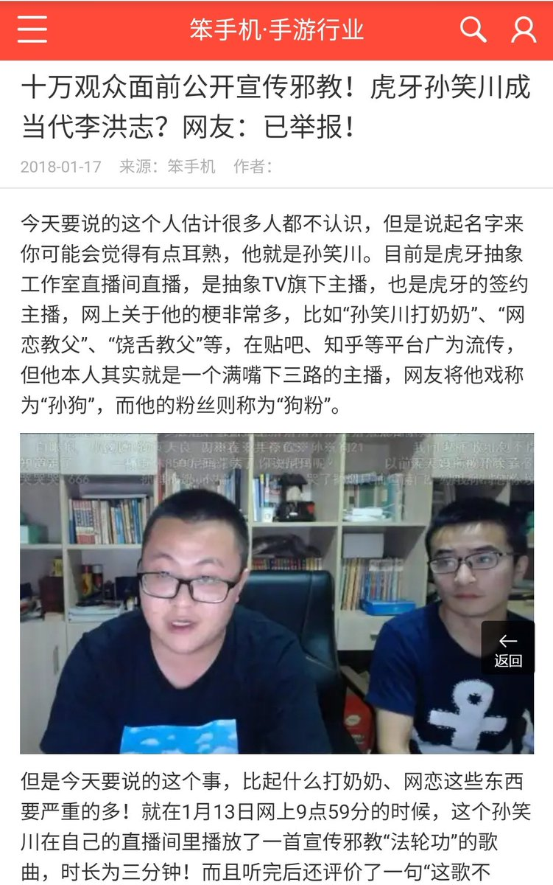

[11月21日 00:12]    墙国铁拳现世报😷   @Socialistfist      :speech_balloon:评:1 :+1:赞:24 :globe_with_meridians:转:6  

[11月21日 00:07]    墙国铁拳现世报😷   @Socialistfist    评论区的孙笑川们开始了一贯的颠倒黑白，全过程视频在此 https://twitter.com/hkwuliff/status/1193726052184387584?s=09 …  :speech_balloon:评:1 :+1:赞:17 :globe_with_meridians:转:4  

[11月20日 23:56]    墙国铁拳现世报😷   @Socialistfist    双十一当天，因为目睹正在跟拍的香港警察往女儿所在楼发射催泪弹，哭的撕心裂肺的hk01记者（亲中媒体）之事，被传到墙内变成了“ 反华媒体记者女儿被催泪弹”，微博评论区中粉红战螂瞬间高潮。
不知该记者和其同事看到了该有如何反应
#社会主义铁拳
#社会主义特别行政区铁拳  :speech_balloon:评:21 :+1:赞:143 :globe_with_meridians:转:53  

[11月20日 23:16]    财经真相   @caijingxiang    2019年出生人口预估约1100万，较2018年1523万再次断崖！按照这个趋势，几年内人口就会负增长！  :speech_balloon:评:21 :+1:赞:117 :globe_with_meridians:转:53  

[11月20日 22:15]    BBC News 中文   @bbcchinese    美国经济学者和决策者迷信自由市场，认为不需要政府干涉，市场本身足以有效地驱动创新。相比之下，中国的技术官僚则不受这种争论束缚，他们只在乎什么在实际中有效。 https://bbc.in/2OoNIAw   :speech_balloon:评:32 :+1:赞:29 :globe_with_meridians:转:5  

[11月20日 21:59]    新闻大吐槽   @TuCaoFakeNews      :speech_balloon:评:2 :+1:赞:21 :globe_with_meridians:转:13  

[11月20日 21:54]    新闻大吐槽   @TuCaoFakeNews    鸟犹如此，人何以堪。现在特别牵挂那些押上火车的抗争者，愿苍天可怜我苦难同胞......心情激动，词不达意理，勿怪  :speech_balloon:评:0 :+1:赞:9 :globe_with_meridians:转:3  

[11月20日 21:53]    新闻大吐槽   @TuCaoFakeNews    痛心！ https://twitter.com/TuCaoFakeNews/status/1197148603057238029 …  :speech_balloon:评:1 :+1:赞:10 :globe_with_meridians:转:9  

[11月20日 21:48]    新闻大吐槽   @TuCaoFakeNews      :speech_balloon:评:2 :+1:赞:25 :globe_with_meridians:转:13  

[11月20日 21:48]    新闻大吐槽   @TuCaoFakeNews    支那男人的武勇体现在打老弱病残，虐猫狗上。  :speech_balloon:评:0 :+1:赞:22 :globe_with_meridians:转:3  

[11月20日 21:44]    新闻大吐槽   @TuCaoFakeNews    勇武派多身陷囹圄，现在列车上有亲共暴徒围殴女抗争者，也无人保护了！

党管到哪，哪里就劣币驱逐良币！  :speech_balloon:评:27 :+1:赞:129 :globe_with_meridians:转:88  

[11月20日 21:41]    新闻大吐槽   @TuCaoFakeNews    where are eco organizations? #SOSHK https://twitter.com/TuCaoFakeNews/status/1196919421203206145 …  :speech_balloon:评:1 :+1:赞:6 :globe_with_meridians:转:4  

[11月20日 21:38]    新闻大吐槽   @TuCaoFakeNews    英国驻香港总领事馆香港籍雇员郑文杰（Simon Cheng）在大陆被捕，被污以嫖娼罪名，关押了15天，他站出来指证共党在关押期间对他的酷刑折磨！

据他回忆，同一个看守所至少还关有其他十名香港抗争者  :speech_balloon:评:35 :+1:赞:387 :globe_with_meridians:转:316  

[11月20日 21:31]    新闻大吐槽   @TuCaoFakeNews    您們用不屈的勇氣
救贖了昏暗的世界
感恩香港！
加油香港！  https://twitter.com/TuCaoFakeNews/status/1197120081714532352 …  :speech_balloon:评:1 :+1:赞:24 :globe_with_meridians:转:3  

[11月20日 21:28]    新闻大吐槽   @TuCaoFakeNews    由此可見，港共極權有多邪惡，學生寧冒生命危險逃亡，也不願落入魔掌  :speech_balloon:评:0 :+1:赞:9 :globe_with_meridians:转:1  

[11月20日 21:26]    新闻大吐槽   @TuCaoFakeNews     https://twitter.com/TuCaoFakeNews/status/1196919421203206145?s=19 …  :speech_balloon:评:0 :+1:赞:6 :globe_with_meridians:转:4  

[11月20日 21:14]    BBC News 中文   @bbcchinese    具体可以学什么？美国面前有哪些挑战？听听专家怎样说。 https://bbc.in/2OsYdmq   :speech_balloon:评:25 :+1:赞:25 :globe_with_meridians:转:3  

[11月20日 21:09]    新闻大吐槽   @TuCaoFakeNews     https://twitter.com/TuCaoFakeNews/status/1197120081714532352 …  :speech_balloon:评:0 :+1:赞:12 :globe_with_meridians:转:3  

[11月20日 21:08]    新闻大吐槽   @TuCaoFakeNews    好兆头。
蛇是中共的化身。  https://twitter.com/TuCaoFakeNews/status/1197120081714532352 …  :speech_balloon:评:0 :+1:赞:8 :globe_with_meridians:转:2  

[11月20日 20:56]    新闻大吐槽   @TuCaoFakeNews    香港的反送中抗暴运动，可以说是世界抗争史上方法最多样的，今年很多其他地方的游行示威都在向香港人学习  :speech_balloon:评:1 :+1:赞:10 :globe_with_meridians:转:1  

[11月20日 20:50]    新闻大吐槽   @TuCaoFakeNews    The redemption of "uninstitutionalized HongKongers. You know some birds are not meant to be caged, their feathers are just too bright. 有些鳥是籠子關不住的，他們的羽翼太過鮮亮。  :speech_balloon:评:0 :+1:赞:8 :globe_with_meridians:转:7  

[11月20日 20:35]    新闻大吐槽   @TuCaoFakeNews    正氣激昂  :speech_balloon:评:1 :+1:赞:3 :globe_with_meridians:转:1  

[11月20日 20:33]    新闻大吐槽   @TuCaoFakeNews    您好客氣哦叫它維尼？維尼可愛的世界有名，一條毒蛇猛獸能称維尼？樂死它了！我們都叫它：梁家河子！豬瘟！通商寬衣！大海小池塘！200斤麥子不換肩！小學生！等等圈子不同，語言也不同哦  :speech_balloon:评:1 :+1:赞:13 :globe_with_meridians:转:1  

[11月20日 20:28]    新闻大吐槽   @TuCaoFakeNews    相信很多可歌可泣的故事  :speech_balloon:评:0 :+1:赞:4 :globe_with_meridians:转:2  

[11月20日 20:26]    新闻大吐槽   @TuCaoFakeNews    以后香港电影里，不再有正义的警察，但会有很多抗争者智斗黑警的电影！  :speech_balloon:评:3 :+1:赞:29 :globe_with_meridians:转:5  

[11月20日 19:52]    老司机   @h5lpykl7tp6jjop    资本外逃，全球财富迁移报告：中国排名第一
亚非银行（AfrAsia Bank）和New World Wealth共同发布了《2019 年全球财富迁移报告》。  :speech_balloon:评:0 :+1:赞:4 :globe_with_meridians:转:1  

[11月20日 19:16]    老司机   @h5lpykl7tp6jjop    中共撒谎进入WTO，从韬光养晦到闷声发大财，从百姓身上压榨血汗发财了，这时候习二毛上台，这个败家仔膨胀了，要和美国叫板对车将军！很好，暴露得很及时，美国人终于明白，流氓有钱以后还是流氓，穿上西装打领带仍然一样杀人放火！贸易战的结果不管是冷战还是热战，对立已经形成，结果是中共必亡！  :speech_balloon:评:1 :+1:赞:53 :globe_with_meridians:转:13  

[11月20日 19:00]    纽约时报中文网   @nytchinese    中国外交部在参议院投票后对该法案表示谴责，称其“干涉中国内政”，并且“严重违反国际法和国际关系基本准则”。
香港政府表示，该法案“既无必要，亦毫无理据”，将损害美国和香港之间的关系。 http://nyti.ms/35aSpVo   :speech_balloon:评:16 :+1:赞:18 :globe_with_meridians:转:4  

[11月20日 18:45]    老司机   @h5lpykl7tp6jjop    新造爱国谣又来了！据说是中国新研发的舞蹈机器人，估计是首长需要的，太鲜活了！跟真的一样！  :speech_balloon:评:3 :+1:赞:20 :globe_with_meridians:转:2  

[11月20日 18:30]    纽约时报中文网   @nytchinese    76岁的中国女演员赵淑珍可能因为在《别告诉她》中饰演女家长“奶奶“提名奥斯卡奖最佳女配角。
《别告诉她》讲述的是一个中国家庭设法向他们心爱的奶奶隐瞒她患了晚期癌症的消息。它已获得了极大的成功，成为了颁奖季的大热门之一。 http://nyti.ms/2XsQ6KI   :speech_balloon:评:4 :+1:赞:65 :globe_with_meridians:转:19  

[11月20日 18:04]    纽约时报中文网   @nytchinese    理工大遭封锁，香港学生抗议者父母走上“前线”  http://nyti.ms/336C56p https://twitter.com/ccni/status/1197087691608735744 …  :speech_balloon:评:15 :+1:赞:21 :globe_with_meridians:转:12  

[11月20日 17:53]    老司机   @h5lpykl7tp6jjop    鲁迅: 最高的鄙视是无言，而且连眼珠都不转过去。  :speech_balloon:评:3 :+1:赞:131 :globe_with_meridians:转:56  

[11月20日 17:28]    BBC News 中文   @bbcchinese    英国驻香港总领事馆前雇员郑文杰对BBC说，他在中国受到“国保”人员的折磨，并被指控煽动香港的政治动乱。 https://bbc.in/2O0MrR4   :speech_balloon:评:287 :+1:赞:669 :globe_with_meridians:转:399  

[11月20日 17:00]    纽约时报中文网   @nytchinese    《纽约时报》52个地方旅行者@sebmodak在一周之内到访崇礼和香港，在双城之旅体验到中港的疏离感。
“我去了中国的崇礼，那里的一处新滑雪场也入选了最值得去的52个地方名单，一周之内我又去了香港，但感觉它们之间几十年来从未如此疏远。”他写道。 http://nyti.ms/2XuYsS1   :speech_balloon:评:20 :+1:赞:31 :globe_with_meridians:转:9  

[11月20日 16:31]    纽约时报中文网   @nytchinese    一名新娘和她父亲因为片场的混乱而无法进入教堂，于是汉克斯停止拍摄，护送他们走向圣坛；在公园里捡到一名女孩的学生证，他用他的Twitter账号把证件还给了她；坚持完成电影拍摄前的海军陆战队员军事训练，并鼓励其他人也坚持下去…… http://nyti.ms/32ZDqfh   :speech_balloon:评:2 :+1:赞:36 :globe_with_meridians:转:7  

[11月20日 15:00]    BBC News 中文   @bbcchinese    美国信息技术和创新基金会主席罗伯特·阿特金斯(Robert D. Atkinson)指出，美国需要学习中国，支持技术发展，这样美国才能在跟中国的竞争中获胜。 https://bbc.in/35cqtAm   :speech_balloon:评:50 :+1:赞:49 :globe_with_meridians:转:16  

[11月20日 15:00]    纽约时报中文网   @nytchinese    参议院一致通过了这项《香港人权与民主法案》，众议院上个月也通过了自己的版本。
由于该法案在理论上得到了确保否决无效的国会多数人的支持，即使遭到特朗普的否决，它也可以成为法律。参众两院预计将拿出一个统一的法案版本，送给总统签署。 http://nyti.ms/35aSpVo   :speech_balloon:评:10 :+1:赞:69 :globe_with_meridians:转:28  

[11月20日 14:30]    纽约时报中文网   @nytchinese    数百名家长一起在警戒线附近静坐，他们戴着口罩，举着写有“救救孩子，不要杀我们的孩子”、“他们是上帝的孩子！放了他们！”字样的硬纸板。许多人说，他们来这里只是为了能与校园里的孩子们离得更近。
“要不是我女儿在里面，我不会站在离前线这么近的地方，”一名家长说。“ http://nyti.ms/336C56p   :speech_balloon:评:67 :+1:赞:81 :globe_with_meridians:转:14  

[11月20日 14:00]    BBC News 中文   @bbcchinese    所有老板都说，在办公室里睡觉是不行的；但专家们建议重新考虑这个问题。 https://bbc.in/35jbox6   :speech_balloon:评:5 :+1:赞:25 :globe_with_meridians:转:4  

[11月20日 14:00]    纽约时报中文网   @nytchinese    中美贸易战已持续一年半之久，特朗普的方法尚未产生他所希望的盛大结局。
相反，他的吓人策略似乎让复杂的贸易谈判更加难以收官，并且加剧了全球经济的不确定性。 http://nyti.ms/2Ou4cY0   :speech_balloon:评:5 :+1:赞:10 :globe_with_meridians:转:1  

[11月20日 13:57]    财经真相   @caijingxiang    恩，应该在这问题上明确声明，关于理工大学生里有领导亲属的传言，是别有用心之人的谣言，恶意中伤抹黑国家领导人，其用心极为险恶！建议官媒照此发表声明以正视听！  :speech_balloon:评:1 :+1:赞:144 :globe_with_meridians:转:20  

[11月20日 13:45]    财经真相   @caijingxiang    看了一下，墙内关于的事大都是颠倒黑白的宣传，各种帮腔的自媒体以及V们都提到了理工大的事，但是关于朱孙女也在学校里的事，没有任何人敢说，哪怕是颠倒黑白的宣传都不敢，似乎根本就没有这件事！以前任消息他们都会反驳，唯独这件事让他们讳莫如深！  :speech_balloon:评:33 :+1:赞:519 :globe_with_meridians:转:137  

[11月20日 13:34]    纽约时报中文网   @nytchinese    周二，美国参议院通过《香港人权与民主法案》，要求制裁在香港侵犯人权的中港官员，并敦促政府支持香港民主人士。
如果特朗普签署了该法案，美国还将每年审查华盛顿给予香港的优惠贸易地位。撤销香港的特殊地位意味着，美国与香港之间的贸易条件会变得不那么优惠。 http://nyti.ms/35aSpVo   :speech_balloon:评:83 :+1:赞:267 :globe_with_meridians:转:85  

[11月20日 13:00]    BBC News 中文   @bbcchinese    美国与韩国在首尔举行的最新一轮《韩美防卫费分担特别协定》谈判不欢而散。 https://bbc.in/34fl77e   :speech_balloon:评:31 :+1:赞:33 :globe_with_meridians:转:5  

[11月20日 13:00]    纽约时报中文网   @nytchinese    #每日一词 Hairbag，老警察。一名自称被迫退休的警官以年龄歧视为由，把在背后说他是hairbag的上司告上法庭。
一说称“bag”在警察行话中意为“制服”，一名长期服役的警官的制服会变得毛茸茸(hairy)。但也有人认为这个词源自“老油条”警察过去以理发为借口擅离职守的一个习惯。 http://nyti.ms/2D2GPPS   :speech_balloon:评:3 :+1:赞:4 :globe_with_meridians:转:3  

[11月20日 12:30]    纽约时报中文网   @nytchinese    警方表示，周一和周二，约有1100人在理大校园附近被拘留。这是抗议活动自6月开始以来单日规模最大的逮捕人数，几乎占到被捕总人数的五分之一。
他们被控的罪名包括暴乱和持有攻击性武器。暴乱罪最高可判10年监禁，许多抗议者为避免被指控而不愿投降。 http://nyti.ms/35bQwb1   :speech_balloon:评:16 :+1:赞:27 :globe_with_meridians:转:14  

[11月20日 12:01]    新闻大吐槽   @TuCaoFakeNews    我关心的不是通过 是法案哪些内容可以实质伤害ccp 香港学生抗争这么久 多少女生被轮奸 男生被鸡奸 天台 海里 楼下 到处尸体 被黑社会打死 还有无数正在冰柜里冷冻的 消失的人 终于感动西方 法案通过 也就是说必须死人 死的越多越惨 才能感动海外权贵 有人愿意帮助 我觉得这是人类最大的悲哀 可耻  :speech_balloon:评:10 :+1:赞:44 :globe_with_meridians:转:10  

[11月20日 12:00]    BBC News 中文   @bbcchinese    英国的一份报告，一份合同，尽显欧盟国家面对中国崛起的尴尬。 https://bbc.in/2O5RKPv   :speech_balloon:评:54 :+1:赞:130 :globe_with_meridians:转:45  

[11月20日 12:00]    纽约时报中文网   @nytchinese    两名旁听了特朗普与乌克兰总统电话的白宫官员对特朗普口中的“一次完美通话”提出质疑。白宫乌克兰问题专家文德曼称特朗普的做法“不恰当”且为“党派之争”。
国家安全官员威廉姆斯称这通电话不同寻常，因其讨论了“国内政治问题”。特朗普反击，弹劾听证会是“大骗局”。更多简报内容： http://nyti.ms/2D2GPPS   :speech_balloon:评:2 :+1:赞:4 :globe_with_meridians:转:2  

[11月20日 11:30]    纽约时报中文网   @nytchinese    本周，警方封锁香港理工大学，将1000多名抗议者围困在内，卷入香港这场危机的一个新群体随之挺身而出：抗议者的父母。
数百名家长来到香港理工大学警戒线附近静坐。他们戴着口罩，呼吁对僵持局面采取妥协做法。一些家长说，亲身体验了警方战术，让他们更加同情孩子的选择。 http://nyti.ms/336C56p   :speech_balloon:评:305 :+1:赞:912 :globe_with_meridians:转:376  

[11月20日 11:00]    BBC News 中文   @bbcchinese    11月24日香港将举行地区议会选举，被视为选民对特首林郑月娥政府的一次考核。 https://bbc.in/2Xt7Jda   :speech_balloon:评:14 :+1:赞:63 :globe_with_meridians:转:29  

[11月20日 11:00]    纽约时报中文网   @nytchinese    截至周二晚间，约有50名抗议者仍留在香港理工大学内。超过1000名抗议者被警方拘留。在警察包围了学校后，这些示威者别无选择，投降并被捕。
不过，也有一些学生大胆逃脱，从附近的一座桥上撤退，被等待在那里的摩托车接走。另一些学生尝试从下水道逃离，但未能成功。 http://nyti.ms/35bQwb1   :speech_balloon:评:47 :+1:赞:97 :globe_with_meridians:转:32  

[11月20日 10:50]    老司机   @h5lpykl7tp6jjop    法媒:台湾走远了 香港乱了 习近平的中国梦碎了  :speech_balloon:评:4 :+1:赞:21 :globe_with_meridians:转:7  

[11月20日 10:44]    财经真相   @caijingxiang    11月19日，美国国会参议院审议通过“香港人权与民主法案”。该法案罔顾事实、混淆是非、违反公理，玩弄双重标准，公然插手香港事务，干涉中国内政，严重违反国际法和国际关系基本准则，中方对此表示强烈谴责和坚决反对。  :speech_balloon:评:80 :+1:赞:185 :globe_with_meridians:转:34  

[11月20日 10:37]    老司机   @h5lpykl7tp6jjop    美国立法史上罕见一幕：《香港人权民主法案》
众议院一致通过！
参议院一致通过！
历史会记住这一天！  :speech_balloon:评:82 :+1:赞:880 :globe_with_meridians:转:253  

[11月20日 10:30]    BBC News 中文   @bbcchinese    BBC中文记者深入香港理大校园的所见所闻。 https://bbc.in/37nzjgI   :speech_balloon:评:50 :+1:赞:59 :globe_with_meridians:转:44  

[11月20日 10:30]    纽约时报中文网   @nytchinese    盘点奥斯卡热门角逐者，谁能成为最大赢家？ http://nyti.ms/2XvqZHg   :speech_balloon:评:5 :+1:赞:4 :globe_with_meridians:转:2  

[11月20日 10:29]    财经真相   @caijingxiang    会议要求六大行提高政治站位，易纲划重点，提高信贷投放能力。随着年底结算时间的临近，中小银行面临的挤兑风险越来越高，这种情况下，召集钱最多的六大行，开金融稳定会议，就显得格外引人关注！  :speech_balloon:评:3 :+1:赞:62 :globe_with_meridians:转:7  

[11月20日 10:29]    纽约时报中文网   @nytchinese    简报：美参议院通过香港法案；香港学生家长走上“前线”  http://nyti.ms/2D2GPPS https://twitter.com/ccni/status/1196977043428270080 …  :speech_balloon:评:3 :+1:赞:21 :globe_with_meridians:转:4  

[11月20日 10:22]    财经真相   @caijingxiang    11月19日，央行行长、国务院金融稳定发展委员会办公室主任易纲主持召开金融机构货币信贷形势分析座谈会。本次会议阵容强大，除了易纲外，央行副行长刘国强、央行相关司局负责人均出席会议。此外，6家银行主要负责人工商陈四清、农行周慕冰、建行田国立、中信谢志斌、浦发潘卫东、兴业陶以平。  :speech_balloon:评:12 :+1:赞:55 :globe_with_meridians:转:16  

[11月20日 10:15]    BBC News 中文   @bbcchinese    该法案要求美国国务卿每年向国会提交报告，评估香港是否仍存在足够自治，是否符合资格享有有别于中国大陆的特别待遇。 https://bbc.in/3430P0Z   :speech_balloon:评:192 :+1:赞:830 :globe_with_meridians:转:295  

[11月20日 10:03]    纽约时报中文网   @nytchinese    早安！今日重点新闻包括：
美国参议院全票通过《香港人权与民主法案》；理大学生家长走上“前线”；两名曾旁听美乌总统通话的白宫官员就弹劾调查作证；瑞典放弃对阿桑奇性侵指控调查；爱泼斯坦案两名狱警被起诉；大熊猫“贝贝”从华盛顿返回中国……NYT简报带你速览今日要闻。 http://nyti.ms/2D2GPPS   :speech_balloon:评:16 :+1:赞:64 :globe_with_meridians:转:13  

[11月20日 09:50]    老司机   @h5lpykl7tp6jjop    【男子#偷30斤香腸被抓後跪地求饒#，被偷肉攤老闆：價值約1400元】
11月19日，四川中江一男子抓起肉攤上的香腸就跑，騎電瓶車狂奔1公里後被抓住，被抓時香腸撒滿地，男子脖子上還掛一截，肉攤老闆稱被盜香腸共30斤，價值1400多元。據警察介紹，男子有前科，現時已被刑拘。
為了“肉”拼了……  :speech_balloon:评:7 :+1:赞:40 :globe_with_meridians:转:25  

[11月20日 09:37]    财经真相   @caijingxiang    5年期贷款市场报价利率（LPR）为4.8%，此前为4.85%。1年期贷款市场报价利率（LPR）为4.15%，此前为4.2%。 新增房贷利率下降了！  :speech_balloon:评:6 :+1:赞:68 :globe_with_meridians:转:7  

[11月20日 09:30]    BBC News 中文   @bbcchinese    从法国王后玛丽‧安东尼的奢华服饰，到今天的高级定制时装，法国一直引导着全球的流行时尚，真正的关键因素是什么？ https://bbc.in/2Xu6hHN   :speech_balloon:评:9 :+1:赞:20 :globe_with_meridians:转:5  

[11月20日 09:28]    纽约时报中文网   @nytchinese    汤姆·汉克斯就像你想象的那么好，也正是你希望他成为的样子——随和、友善、乐观、关爱他人。
在一个崩坏和悲观的时代，他的言行几乎体现了高尚品德的黄金标准。 http://nyti.ms/32ZDqfh   :speech_balloon:评:12 :+1:赞:139 :globe_with_meridians:转:33  

[11月20日 08:52]    财经真相   @caijingxiang    11月19日，深圳市委常委会召开会议，传达学习习近平在中央政治局第十八次集体学习时的重要讲话精神；
会议强调，要充分发挥深圳科技创新优势，加强区块链基础研究和关键技术攻关，加快区块链和人工智能、大数据、物联网等前沿信息技术的深度融合，不断增强自主创新能力，努力抢占技术发展制高点；  :speech_balloon:评:26 :+1:赞:89 :globe_with_meridians:转:22  

[11月20日 08:39]    财经真相   @caijingxiang    众议院全票通过，参议院也全票通过，这种情况在美国历史上，是一种什么样的存在？  :speech_balloon:评:179 :+1:赞:2369 :globe_with_meridians:转:487  

[11月20日 08:28]    财经真相   @caijingxiang    参议院法案一致通过，现在第一阶段的贸易协议，打水漂的概率极高，市场情绪很快就会反转！ https://twitter.com/ReutersCN/status/1196943843347841025 …  :speech_balloon:评:6 :+1:赞:195 :globe_with_meridians:转:37  

[11月20日 05:05]    老司机   @h5lpykl7tp6jjop      :speech_balloon:评:0 :+1:赞:0 :globe_with_meridians:转:1  

[11月20日 05:04]    老司机   @h5lpykl7tp6jjop    全球抗暴风起云涌，伊朗示威视频 https://youtu.be/V7TWMnzd-Qc   :speech_balloon:评:1 :+1:赞:1 :globe_with_meridians:转:0  

[11月20日 03:52]    老司机   @h5lpykl7tp6jjop    30年前，中共军警在北京开着坦克车碾压学生，今天在香港开着几辆白色巴士高速撞向学生，这些帐都得算。
暴政以为它们手里的暴力机器是最强大的，殊不知最强大的是人心和公义，与天意民心做对，中共必死无疑！ https://twitter.com/breakup1984/status/1196800138192334848 …  :speech_balloon:评:9 :+1:赞:154 :globe_with_meridians:转:113  

[11月20日 01:59]    老司机   @h5lpykl7tp6jjop    中国历史文化无论三千年还是五千年直到今天还是封建家长制，从国到家习惯一个人说了算，没有平等自由人权观念，连说话都不准，极力反对文明进步！以拥有暴力为荣，以不服霸道为逆，丛树社会漫步几千年，居然以奴民数量众多自称大国，全然不顾经济文明人均素质低劣为耻！奴民无选择自由居然自豪不知所谓  :speech_balloon:评:3 :+1:赞:58 :globe_with_meridians:转:16  

[11月19日 23:47]    财经真相   @caijingxiang    一次抓千于人，押往上火车，会被送到什么地方？等待他们的又是什么样的命运？九死一生后还能再回去吗？深圳火车最近有没有异常情况？世人必须关注，不能遗忘！  :speech_balloon:评:63 :+1:赞:811 :globe_with_meridians:转:306  

[11月19日 21:57]    BBC News 中文   @bbcchinese    沙特阿美是世界最大的石油公司、也是盈利最多分红最大方的公司，为什么IPO也不容易？为什么不去华尔街？ https://bbc.in/2Qyt2sk   :speech_balloon:评:12 :+1:赞:34 :globe_with_meridians:转:10  

[11月19日 21:10]    BBC News 中文   @bbcchinese    【世界厕所日】有手机的人远远多过有抽水马桶的人，这是为什么？ https://bbc.in/2s0yPgj   :speech_balloon:评:17 :+1:赞:67 :globe_with_meridians:转:31  

[11月19日 19:20]    墙国铁拳现世报😷   @Socialistfist    腾讯铁拳，重锤出击  :speech_balloon:评:29 :+1:赞:234 :globe_with_meridians:转:57  

[11月19日 19:02]    BBC News 中文   @bbcchinese    在香港市郊，一群工程师正在设计特别的电脑芯片，利用光而不是电信号来传输信息。这个由华为部分赞助的项目背后，是中国计划逐鹿世界高端芯片行业主导权的雄心。 https://bbc.in/2pvkR53   :speech_balloon:评:40 :+1:赞:83 :globe_with_meridians:转:32  

[11月19日 18:36]    财经真相   @caijingxiang    美股继续创新高，与此同时美国各项经济数据都在亮红灯，只有中美达成协议，一切都不是事！  :speech_balloon:评:26 :+1:赞:115 :globe_with_meridians:转:23  

[11月19日 18:30]    纽约时报中文网   @nytchinese    欢迎关注今日重点新闻：
数百名香港理工大学抗议者被捕  http://nyti.ms/35bQwb1 
美国政界人士就香港局势发声 http://nyti.ms/37in3hg 
中国回应时报新疆报导，为镇压穆斯林辩护 http://nyti.ms/2Qw4QXO 
图集：香港理工大学“围城战”http://nyti.ms/2NXPt8S   :speech_balloon:评:75 :+1:赞:29 :globe_with_meridians:转:13  

[11月19日 18:12]    纽约时报中文网   @nytchinese    特朗普将他特有的对演艺的热爱带到了与中国的贸易谈判中，公开地将表演注入了通常刻板的议事程序。
他一会表现出对北京的愤怒，一会表现热情，并担任了一个永不满足的谈判者的角色，如果中国不接受他的条件，他就把宏大的贸易协定目标和更大的威胁绑在一起。 http://nyti.ms/2Ou4cY0   :speech_balloon:评:44 :+1:赞:69 :globe_with_meridians:转:21  

[11月19日 18:02]    BBC News 中文   @bbcchinese    BBC中文记者深入理大校园，传来这一批最新照片。 https://bbc.in/2pA0e7Y   :speech_balloon:评:96 :+1:赞:237 :globe_with_meridians:转:122  

[11月19日 17:42]    老司机   @h5lpykl7tp6jjop    安徽阜阳男子班某东，因给狗取名“城管”和“协管”，于5月13日被拘留10日。#言论自由  https://bit.ly/2qhxwZZ   :speech_balloon:评:3 :+1:赞:57 :globe_with_meridians:转:24  

[11月19日 17:02]    BBC News 中文   @bbcchinese    香港高等法院裁定《禁蒙面法》“违宪”，触发中国全国人大常委会法工委和港澳办高调批评；香港民主派形容，这样是将香港司法机构拉至与中国一样的水平，即党大于法。 https://bbc.in/2KBrYQL   :speech_balloon:评:328 :+1:赞:921 :globe_with_meridians:转:413  

[11月19日 16:43]    老司机   @h5lpykl7tp6jjop    1月19日凌晨中共僱兇縱火，火燒承印大紀元印刷廠

歹徒穿黑衣戴口罩假扮勇武想要混淆視聽，大紀元在被中共的打壓中已經走過了近二十年，暴力恐嚇和全力打壓，不會讓我們退縮。因為大紀元和全體香港人一樣，在堅持真相和自由方面，我們已經退無可退。

大紀元決不放棄報導真相，與港人同行！  :speech_balloon:评:117 :+1:赞:881 :globe_with_meridians:转:560  

[11月19日 16:42]    老司机   @h5lpykl7tp6jjop    造反有罪，下跪也有罪。  :speech_balloon:评:20 :+1:赞:87 :globe_with_meridians:转:40  

[11月19日 16:41]    老司机   @h5lpykl7tp6jjop    这绝对是美国好莱坞枪战大片，八九六四2.0版！  :speech_balloon:评:22 :+1:赞:333 :globe_with_meridians:转:290  

[11月19日 16:13]    老司机   @h5lpykl7tp6jjop    港警拘4491人最小仅11岁 3个月增2500具尸体

香港反送中运动以来，中共几乎动用包括黑社会等在内的一切力量渗透香港，对抗争者的滥暴滥捕。港警18日称，6月至今共拘捕4491人，年龄介于11岁至83岁。

从6月至9月的3个月中，警方共接获2537宗发现尸体个案。消息显示，港府滥暴滥捕的背后隐藏着中共毒计  :speech_balloon:评:60 :+1:赞:418 :globe_with_meridians:转:447  

[11月19日 16:09]    BBC News 中文   @bbcchinese    香港理工大学被警察包围第三天，有校内的人尝试循地下渠道离开。  :speech_balloon:评:507 :+1:赞:1036 :globe_with_meridians:转:555  

[11月19日 15:33]    GFHG SDKM   @zyx_yny    The tyranny forced us live as middle age warrior  :speech_balloon:评:1 :+1:赞:50 :globe_with_meridians:转:19  

[11月19日 15:10]    BBC News 中文   @bbcchinese    香港抗议运动持续，特区政府任命邓炳强为警队“一哥”，本地媒体称他是“鹰派”领军人物。
新任“一哥”有何背景？他在这次抗议运动中起到了什么作用？ https://bbc.in/2NYfDZ6   :speech_balloon:评:77 :+1:赞:133 :globe_with_meridians:转:48  

[11月19日 14:45]    老司机   @h5lpykl7tp6jjop    這是赤裸裸的謀殺！這些兇手應該去死！過去幾個月來，我們每天都在譴責當局的暴行。都已經喊啞了嗓子。有一句話我憋了很久了：為什麼不反抗？我希望看到哪怕有一個作惡的警察被懲治。很遺憾現在一個都沒有！我要是香港人，一定會成為第一個復仇的人！  :speech_balloon:评:147 :+1:赞:447 :globe_with_meridians:转:307  

[11月19日 14:41]    GFHG SDKM   @zyx_yny    This scene is no longer only appearing in movies. It’s happening in our reality.

Escaping from death. 

She’s not a #stuntman, she’s just a normal citizen, normal student.

#StandWithHongKong
#Dramaislife
#Lifeisdrama
#PolyUHongKong  :speech_balloon:评:85 :+1:赞:1496 :globe_with_meridians:转:1427  

[11月19日 13:21]    老司机   @h5lpykl7tp6jjop    湖南两公职人员强奸12岁女孩 公检不立案反调查女孩  :speech_balloon:评:2 :+1:赞:12 :globe_with_meridians:转:10  

[11月19日 13:19]    老司机   @h5lpykl7tp6jjop    重庆庭审上演好戏：“黑老大”当庭指认主诉检察官是他的保护伞！  :speech_balloon:评:1 :+1:赞:20 :globe_with_meridians:转:8  

[11月19日 12:57]    BBC News 中文   @bbcchinese    BBC中文记者身处遭到警察包围超过两天的香港理工大学内，现场可见，有留守者出现低温症迹象。  :speech_balloon:评:308 :+1:赞:566 :globe_with_meridians:转:339  

[11月19日 12:00]    BBC News 中文   @bbcchinese    英国王室成员安德鲁王子在接受BBC独家采访时，解释他与已故的性侵犯罪嫌疑人、美国富豪杰弗里·爱泼斯坦（Jeffrey Epstein）的关系，并回应一位少女对他的性侵指控。 https://bbc.in/35hlWfU   :speech_balloon:评:24 :+1:赞:23 :globe_with_meridians:转:5  

[11月19日 11:36]    财经真相   @caijingxiang    盛京银行4月23日晚间发布公告称，张启阳因工作安排，已辞任董事长，消息公布后盛京银行股价暴跌13.94%！  :speech_balloon:评:4 :+1:赞:61 :globe_with_meridians:转:14  

[11月19日 11:25]    财经真相   @caijingxiang    南京银行是个奇葩的存在，它由于债券的投资和承销收入贡献了很大比例，被称为“债券之王”；由于同业增长飞速，在城商行里还被称为“同业之王”；5月份时行长突然离职引发各种猜测，10月份由于该行核销的不良贷款不断增加被证监会问询。南京银行2017、2018、2019上半年核销分别为18.8亿、30.3亿、25.9亿元  :speech_balloon:评:5 :+1:赞:147 :globe_with_meridians:转:54  

[11月19日 10:47]    财经真相   @caijingxiang    一个公司组织的出了国旅游，在英国大桥之前合唱《我和我的国》！  :speech_balloon:评:600 :+1:赞:479 :globe_with_meridians:转:168  

[11月19日 10:34]    财经真相   @caijingxiang    市场对LPR明天降息预期空前高涨，股市持续大涨，本轮LPR降息看点是五年定价，这关系到房贷利率！  :speech_balloon:评:5 :+1:赞:77 :globe_with_meridians:转:14  

[11月19日 08:24]    财经真相   @caijingxiang    北京時間周四（11月21日）淩晨3:00，美聯儲將公布10月會議紀要。從最新的非農、通脹數據以及包括鮑威爾在內的多位美聯儲高官的表態來看，美聯儲基本可確定不會在12月降息，估計10月會議紀要也是相似的傾向.  :speech_balloon:评:3 :+1:赞:67 :globe_with_meridians:转:15  

[11月19日 01:05]    老司机   @h5lpykl7tp6jjop    立即廣傳 開真槍掃射  :speech_balloon:评:32 :+1:赞:404 :globe_with_meridians:转:552  

[11月18日 23:48]    墙国铁拳现世报😷   @Socialistfist    腾讯也是扔了一个战术式社会主义核弹吗  :speech_balloon:评:75 :+1:赞:590 :globe_with_meridians:转:123  

[11月18日 23:14]    墙国铁拳现世报😷   @Socialistfist    大家都误会了孙笑川们了，这些学徒面临国内拘捕的风险，用emoji表情作为暗号，名面上辱废青反贼，实际上暗地里作为暗号传播法轮功思想。  :speech_balloon:评:30 :+1:赞:282 :globe_with_meridians:转:23  

[11月18日 23:09]    墙国铁拳现世报😷   @Socialistfist    推特上的孙笑川们原来是国内潜伏法轮功学徒
#社会主义铁拳  :speech_balloon:评:123 :+1:赞:302 :globe_with_meridians:转:73  

[11月18日 22:34]    财经真相   @caijingxiang    CNBC：由于存在脱钩可能性，北京正在悄悄地把美元多元化！ https://twitter.com/CNBC/status/1196434530372075521 …  :speech_balloon:评:11 :+1:赞:144 :globe_with_meridians:转:54  

[11月18日 21:46]    财经真相   @caijingxiang    CNBC援引中方消息人士：北京对贸易协议的看法是悲观的。特朗普表示无关税撤回后，中国感到困惑。消息公布后市场对中美乐观贸易情绪有所降温！随着12月15日关税节点的临近，中美贸易谈判乐观情绪完全可以随时再次反转，各位交易员现在暂时不要碰黄金，人民币可以逢低抄底，澳日也可以逢高做空！ https://twitter.com/caijingxiang/status/1196422668406231040 …  :speech_balloon:评:18 :+1:赞:151 :globe_with_meridians:转:34  

[11月18日 21:39]    财经真相   @caijingxiang    刚刚贸易谈判消息又逆转了，人民币、股市在跌，黄金、日元在涨！  :speech_balloon:评:52 :+1:赞:442 :globe_with_meridians:转:86  

[11月18日 21:23]    墙国铁拳现世报😷   @Socialistfist    曾经推特中文圈最后一片净土还是被污染了
如果您想要批量屏蔽某些账号，建议大家参考转推内容。
如果您只是追求“眼不见心不烦”， 可以参考下图，选择设置-高级过滤-隐藏通知
推特世界归于宁静  https://twitter.com/keepcnsecurity/status/1195607211940040705 …  :speech_balloon:评:63 :+1:赞:105 :globe_with_meridians:转:37  

[11月18日 20:34]    墙国铁拳现世报😷   @Socialistfist    这小伙还是个文案人才，手动滑稽  :speech_balloon:评:23 :+1:赞:356 :globe_with_meridians:转:43  

[11月18日 20:13]    墙国铁拳现世报😷   @Socialistfist    推特做不到的事情，腾讯却做到了

#战螂在推特
#社会主义铁拳  :speech_balloon:评:247 :+1:赞:1789 :globe_with_meridians:转:524  

[11月18日 16:15]    新闻大吐槽   @TuCaoFakeNews    被黑警围困在一个天台上，大陆交换生喊出了中国人的时代最强音！「光复香港，时代革命！」

期盼已久，期盼已久，同学你太有勇气了！

相信不远的将来，这句口号稍加改动就会叫响在九百六十万平方公里的大陆——光复大陆，倒共革命！  :speech_balloon:评:321 :+1:赞:2787 :globe_with_meridians:转:1425  

[11月18日 14:12]    墙国铁拳现世报😷   @Socialistfist    三十年後又黃昏，再見刀兵校外陳。惜乎有民十三億，盡是為虎作倀人  :speech_balloon:评:6 :+1:赞:223 :globe_with_meridians:转:83  

[11月18日 10:41]    GFHG SDKM   @zyx_yny    With students in Hong-Kong who are blocking the streets to bring economic pressure on China to ensure democratic freedoms in HK! #StandWithHongKong @Andychanhotin @FreedomHKG @Stand_with_HK @hk_watch @HKWORLDCITY #HongKongProtests @joshuawongcf #Freedom  :speech_balloon:评:28 :+1:赞:707 :globe_with_meridians:转:557  

[11月18日 09:41]    GFHG SDKM   @zyx_yny    Trans
"About 200 #PolyU students tried to escape in the direction of Hunghom. Not sure if they made it or not. Hope all managed to escape." https://twitter.com/meilong15/status/1196240402988187648 …  :speech_balloon:评:7 :+1:赞:44 :globe_with_meridians:转:41  

[11月18日 09:32]    GFHG SDKM   @zyx_yny    Stop using #PolyU Wifi for god’s sake.
#HongKongProtests https://twitter.com/hengyanlo/status/1196156883679055872 …  :speech_balloon:评:4 :+1:赞:111 :globe_with_meridians:转:120  

[11月18日 08:56]    GFHG SDKM   @zyx_yny    The people of Hong Kong are right to stand up to Communist China and fight for freedom. 

We hear your cries for democracy and are doing our part to hold China accountable for their acts of violence against protestors. 

Thank you @marcorubio @SenatorRisch for your leadership.  :speech_balloon:评:2128 :+1:赞:19353 :globe_with_meridians:转:16159  

[11月18日 08:54]    GFHG SDKM   @zyx_yny    08:30 students tried to leave #PolyU but #HongKong #Police continued to tear gas them, forcing them to return inside. This is in contradiction to what Poly U President JC Teng said, that cops have agreed to let students leave peacefully. 
@cityusucbc
#PoliceBrutality  :speech_balloon:评:54 :+1:赞:844 :globe_with_meridians:转:1063  

[11月18日 08:50]    GFHG SDKM   @zyx_yny    #PolyU protesters eventually retreat after driving the police back in the face of whizzing rubber bullets and gas pellets. They’re mostly inside the campus again. Police showing no mercy #HK #HongKongProtests #StandWithHongKong  :speech_balloon:评:264 :+1:赞:4901 :globe_with_meridians:转:5366  

[11月18日 08:45]    GFHG SDKM   @zyx_yny    The #HKPolice threatening to shoot press, first-aid as they were attempting to cross the road. This is on the perimeter of #PolyU and some civilians who came here to support the protesters still inside have been injured and/or arrested at the TST east fountain across this road.  :speech_balloon:评:25 :+1:赞:610 :globe_with_meridians:转:828  

[11月18日 08:38]    GFHG SDKM   @zyx_yny    Protestors are trying to escape from Hong Kong Polytechnic University, but HK Police fire tear gas to force them back IN. HK Police have given up any pretense that they try to de-escalate and disperse. Instead, it is evident that their intention is to attack, arrest, and punish. https://twitter.com/JessiePang0125/status/1196224442491396097 …  :speech_balloon:评:34 :+1:赞:996 :globe_with_meridians:转:1151  

[11月18日 08:06]    GFHG SDKM   @zyx_yny    this is the same shameful #PolyU head who refused to shake hands with students wearing a mask during graduation ceremony. Still the same shameful head who escaped the clashes and shrinked his duty for the whole of the clash that lasts for days. https://twitter.com/nytmay/status/1196202338102341633 …  :speech_balloon:评:58 :+1:赞:785 :globe_with_meridians:转:650  

[11月18日 07:36]    GFHG SDKM   @zyx_yny    At 530am, #HKPoliceTerriorists suddenly attacked the #PolyU campus and arrested some students.

Wherever #HKPolice goes, there will be a war zone. 

This is not a movie scene. This is an university campus and now is set on fire. 

Plz save them. 
#SOSHK  :speech_balloon:评:165 :+1:赞:4046 :globe_with_meridians:转:4371  

[11月18日 06:42]    GFHG SDKM   @zyx_yny    needs to recall U.S. Ambassador Branstad for @hkpoliceforce assault onPolyU & committing crimes against humanity. https://twitter.com/LIHKGPicks/status/1196138147945431040 …  :speech_balloon:评:1104 :+1:赞:12278 :globe_with_meridians:转:11601  

[11月18日 06:02]    GFHG SDKM   @zyx_yny    Around 30 minutes ago at 05:30AM, #HKPolice have entered #PolyU campus. At least 3 protestors subdued, 1 seen with blood all over face during arrest

#PolyU #PolyUMassacre #PolyUSOS
#SOSHK #HongKong #StandwithHK
Vid via Telegram  :speech_balloon:评:47 :+1:赞:1593 :globe_with_meridians:转:2250  

[11月18日 05:16]    GFHG SDKM   @zyx_yny    

They are still fighting! 

#SOSPolyU
#HKPoliceState  :speech_balloon:评:172 :+1:赞:3539 :globe_with_meridians:转:3221  

[11月18日 03:23]    GFHG SDKM   @zyx_yny    Trans
"I'm a first aider on site at #PolyU. Lots of casualties. Don't know if they could hang on until 6am. No enough ice, no doctors around. Many people fired by water cannon have hypothermia." https://twitter.com/ChingyeeWong3/status/1196145895290458113 …  :speech_balloon:评:24 :+1:赞:820 :globe_with_meridians:转:1032  

[11月18日 02:48]    GFHG SDKM   @zyx_yny    [PolyU frontliner's last words?]

"If very unfortunately I die in Kowloon today, even though history may just remember me as a number, I hope HKers will remember all of our deeds, stay angry & rational & turn our revenge chants into reality."

#SOSHK

OP: https://lihkg.com/thread/1731186/page/1 …  :speech_balloon:评:110 :+1:赞:2119 :globe_with_meridians:转:1990  

[11月18日 01:32]    GFHG SDKM   @zyx_yny    “It is fxxking mad!” People with their cars in Tsim Sha Tsui hoping to support #PolyU students (but were stuck due to roadblocks) received tear gas treatment from #HongKong police. Lots of swearing. Video circulated online. #HongKongProtests  :speech_balloon:评:81 :+1:赞:1412 :globe_with_meridians:转:1582  

[11月18日 01:12]    GFHG SDKM   @zyx_yny    Old friend, world renowned photographer, Stephen Boitano, sharing his concerns on escalated police violence in Hk. Please  pray it is a very dangerous situation. #StandWithHongKong #HongKongProtests @FreedomHKG @Stand_with_HK @HKWORLDCITY @hk_watch @Andychanhotin @Andychanhotin  :speech_balloon:评:701 :+1:赞:9552 :globe_with_meridians:转:9659  

[11月18日 00:41]    墙国铁拳现世报😷   @Socialistfist    推荐一些启发小编开办《墙国铁拳现世报》的parody或自媒体推号：
中国民调@PollChina 
新蛤社@XinHaNewsAgency
推特小红旗@Xhnsoc__Redflag
共青团中央 (学习小组）@CPCYouthLeague
乳透社@Ruters0615 
胡锡进（流亡）@HuXijin_huaiqiu
LIFETIME 視界@LifetimeUSCN
不分先后，欢迎推荐后续补充  :speech_balloon:评:13 :+1:赞:157 :globe_with_meridians:转:24  

[11月17日 23:42]    GFHG SDKM   @zyx_yny    Members of Guarding Our Kids, formed by mothers and fathers, decided to stay with #PolyU students who were trapped in the campus: We won't leave our 'kids' behind. We will safeguard this place. We want everyone here can go home. #HongKongProtesters  :speech_balloon:评:630 :+1:赞:10548 :globe_with_meridians:转:9866  

[11月16日 18:05]    墙国铁拳现世报😷   @Socialistfist    小编要郑重警告刘女士，国家是有寻衅滋事和煽动颠覆这些国民待遇的。

#社会主义铁拳  :speech_balloon:评:95 :+1:赞:721 :globe_with_meridians:转:210  

[11月15日 08:24]    墙国铁拳现世报😷   @Socialistfist    小编认为本月最佳铁拳，滋磁不滋磁啊？  :speech_balloon:评:38 :+1:赞:769 :globe_with_meridians:转:44  

[11月15日 08:21]    墙国铁拳现世报😷   @Socialistfist    面对大陆的善意，台大教授自信的进去了---亲中学者 施正屏
#社会主义铁拳  :speech_balloon:评:187 :+1:赞:1867 :globe_with_meridians:转:822  

[11月15日 01:03]    墙国铁拳现世报😷   @Socialistfist    那必须和兄弟你平分啊，猪肉价格这么高  https://twitter.com/Dofuralanmingo/status/1194993538292826114 …  :speech_balloon:评:18 :+1:赞:223 :globe_with_meridians:转:11  

[11月14日 19:09]    墙国铁拳现世报😷   @Socialistfist    北京废青，危言耸听

#社会主义铁拳  :speech_balloon:评:64 :+1:赞:646 :globe_with_meridians:转:167  

[11月14日 18:36]    财经真相   @caijingxiang    中共基建没有钱，很多网友简单的认为开动印钞机就行，这其实是大错特错，中共央行印的每一分钱，都必须有对应的相应的价值才行，否则就是无锚印钞，汇率崩盘！过去20年央行印钞都是以债务为基础的。比如，房奴的房贷，当房奴申请贷款时，本质是向央行抵押了自己未来30年的劳动力。 https://twitter.com/aspeltuo8/status/1194923278646816768 …  :speech_balloon:评:62 :+1:赞:753 :globe_with_meridians:转:273  

[11月14日 01:30]    墙国铁拳现世报😷   @Socialistfist    支持言论自由不受侵害 https://twitter.com/keepcnsecurity/status/1194633823964631046 …  :speech_balloon:评:8 :+1:赞:123 :globe_with_meridians:转:32  

[11月13日 18:38]    墙国铁拳现世报😷   @Socialistfist    一天二更，快夸我。
最近推友投稿质量很高，再次感谢！  :speech_balloon:评:19 :+1:赞:228 :globe_with_meridians:转:4  

[11月13日 18:38]    墙国铁拳现世报😷   @Socialistfist    祝这位推友早日康复

#战螂在推特  :speech_balloon:评:26 :+1:赞:277 :globe_with_meridians:转:53  

[11月12日 07:22]    凡賽堤/FORSETI   @FecharCCP    11日早在西湾河开枪射伤示威者的港警关家荣身份被起底，其担任家教会主席的德望学校师生、家长及校友发起联署要求解除其在该校的职务。其两个女儿在该校就读。另有消息指，关家荣受过“大陆警察部门”特殊培训。下面这个小视频，足以解释这场血案的真相：这是流氓国家自上而下有计划的谋杀。  :speech_balloon:评:21 :+1:赞:267 :globe_with_meridians:转:178  

[11月12日 07:14]    凡賽堤/FORSETI   @FecharCCP    救救悲慘的香港 #HKSOS

香港黑警拔槍亂殺港民！已多人中槍和死亡！

天滅極權！  :speech_balloon:评:3 :+1:赞:14 :globe_with_meridians:转:11  

[11月12日 07:11]    凡賽堤/FORSETI   @FecharCCP    11.11 香港殺人魔家庭資料！
全世界通緝這殺人魔全家！  :speech_balloon:评:48 :+1:赞:14 :globe_with_meridians:转:12  

[11月12日 07:07]    凡賽堤/FORSETI   @FecharCCP    救救悲慘的香港 #HKSOS

香港黑警拔槍亂殺港民！已多人中槍和死亡！  :speech_balloon:评:3 :+1:赞:9 :globe_with_meridians:转:8  

[11月12日 06:57]    凡賽堤/FORSETI   @FecharCCP    天滅流氓政權！！！CCP極權殺人恐怖組織正在用各種兇殘手段屠殺我們的同胞...................

看看這些大陸的黑警（公安，武警，士兵裝扮成香港警察）是如何沒有人性的屠殺香港學生！！！

天滅流氓政權！！！天滅CCP！！！  :speech_balloon:评:1 :+1:赞:22 :globe_with_meridians:转:24  

[11月12日 06:42]    凡賽堤/FORSETI   @FecharCCP    天滅流氓政權！！！CCP極權殺人恐怖組織正在用各種兇殘手段殺害我們的同胞...................

看看這些大陸的黑警（公安，武警，士兵裝扮成香港警察）是如何沒有人性的屠殺香港學生！！！

那個小年輕不知道是休克還是已經死亡！

天滅流氓政權！！！天滅CCP！！！  :speech_balloon:评:34 :+1:赞:21 :globe_with_meridians:转:20  

[11月12日 06:25]    凡賽堤/FORSETI   @FecharCCP    坐水凳（英語：waterboarding）是水刑的一種，做法是將受害人固定其雙手雙腳，在頭部放上布後持續澆水。如此會讓受害人產生溺水的錯覺而心生恐懼。雖然坐水凳不在身上留下可辨識的傷痕，但受害人在過程中會因為嗆到水甚至吸入性肺炎而受傷害。另外有些人因此導致心理方面的傷害，是酷刑的一種。  :speech_balloon:评:1 :+1:赞:37 :globe_with_meridians:转:34  

[11月05日 04:28]    凡賽堤/FORSETI   @FecharCCP    急救香港  #HKSOS！！！

天滅流氓政權！！！極權殺人恐怖組織正在用各種兇殘手段殺害我們的同胞..................................................

流氓政權的極權殺人恐怖組織蓄意謀殺香港年輕人！（13）

被暴力制服的年輕人已經休克，還殘暴折斷手！

兇殘，殘暴手段令人髮指到已經超越納粹！  :speech_balloon:评:0 :+1:赞:3 :globe_with_meridians:转:12  

[11月05日 04:25]    凡賽堤/FORSETI   @FecharCCP    急救香港  #HKSOS！！！

天滅流氓政權！！！極權殺人恐怖組織正在用各種兇殘手段殺害我們的同胞..................................................

流氓政權的極權殺人恐怖組織蓄意謀殺香港年輕人！（12）
兇殘，殘暴手段令人髮指到已經超越納粹！
天滅流氓政權！！！  :speech_balloon:评:1 :+1:赞:8 :globe_with_meridians:转:9  

[11月05日 04:24]    凡賽堤/FORSETI   @FecharCCP    急救香港  #HKSOS！！！

天滅流氓政權！！！極權殺人恐怖組織正在用各種兇殘手段殺害我們的同胞..................................................

流氓政權的極權殺人恐怖組織蓄意謀殺香港年輕人！（11）
兇殘，殘暴手段令人髮指到已經超越納粹！
天滅流氓政權！！！  :speech_balloon:评:0 :+1:赞:49 :globe_with_meridians:转:46  

[11月05日 04:23]    凡賽堤/FORSETI   @FecharCCP    急救香港  #HKSOS！！！

天滅流氓政權！！！極權殺人恐怖組織正在用各種兇殘手段殺害我們的同胞..................................................

流氓政權的極權殺人恐怖組織蓄意謀殺香港年輕人！（10）
兇殘，殘暴手段令人髮指到已經超越納粹！
天滅流氓政權！！！  :speech_balloon:评:0 :+1:赞:3 :globe_with_meridians:转:5  

[11月05日 04:19]    凡賽堤/FORSETI   @FecharCCP    急救香港  #HKSOS！！！

天滅流氓政權！！！極權殺人恐怖組織正在用各種兇殘手段殺害我們的同胞..................................................

流氓政權的極權殺人恐怖組織蓄意謀殺香港年輕人！（9）
兇殘，殘暴手段令人髮指到已經超越納粹！
天滅流氓政權！！！  :speech_balloon:评:1 :+1:赞:4 :globe_with_meridians:转:6  

[11月05日 04:16]    凡賽堤/FORSETI   @FecharCCP    急救香港  #HKSOS！！！

天滅流氓政權！！！極權殺人恐怖組織正在用各種兇殘手段殺害我們的同胞..................................................

流氓政權的極權殺人恐怖組織蓄意謀殺香港年輕人！（8）
兇殘，殘暴手段令人髮指到已經超越納粹！
天滅流氓政權！！！  :speech_balloon:评:1 :+1:赞:43 :globe_with_meridians:转:56  

[11月05日 04:13]    凡賽堤/FORSETI   @FecharCCP    急救香港SOS！！！

天滅流氓政權！！！極權殺人恐怖組織正在用各種兇殘手段殺害我們的同胞..................................................

流氓政權的極權殺人恐怖組織蓄意謀殺香港年輕人！（7）
兇殘，殘暴手段令人髮指到已經超越納粹！
天滅流氓政權！！！  :speech_balloon:评:3 :+1:赞:12 :globe_with_meridians:转:21  

[11月05日 04:10]    凡賽堤/FORSETI   @FecharCCP    急救香港SOS！！！

天滅流氓政權！！！極權殺人恐怖組織正在用各種兇殘手段殺害我們的同胞..................................................

流氓政權的極權殺人恐怖組織蓄意謀殺香港年輕人！（6）
兇殘，殘暴手段令人髮指到已經超越納粹！
天滅流氓政權！！！  :speech_balloon:评:1 :+1:赞:38 :globe_with_meridians:转:40  

[11月05日 04:07]    凡賽堤/FORSETI   @FecharCCP    急救香港SOS！！！

天滅流氓政權！！！極權殺人恐怖組織正在用各種兇殘手段殺害我們的同胞..................................................

流氓政權的極權殺人恐怖組織蓄意謀殺香港年輕人！（5）
兇殘，殘暴手段令人髮指到已經超越納粹！
天滅流氓政權！！！  :speech_balloon:评:0 :+1:赞:2 :globe_with_meridians:转:0  

[11月05日 04:06]    凡賽堤/FORSETI   @FecharCCP    急救香港SOS！！！

天滅流氓政權！！！極權殺人恐怖組織正在用各種兇殘手段殺害我們的同胞..................................................

流氓政權的極權殺人恐怖組織蓄意謀殺香港年輕人！（3）
兇殘，殘暴手段令人髮指到已經超越納粹！
天滅流氓政權！！！  :speech_balloon:评:1 :+1:赞:10 :globe_with_meridians:转:15  

[11月05日 04:05]    凡賽堤/FORSETI   @FecharCCP    急救香港SOS！！！

天滅流氓政權！！！極權殺人恐怖組織正在用各種兇殘手段殺害我們的同胞..................................................

流氓政權的極權殺人恐怖組織蓄意謀殺香港不同意見的議員！（2）

兇殘，殘暴手段令人髮指到已經超越納粹！
天滅流氓政權！！！  :speech_balloon:评:0 :+1:赞:3 :globe_with_meridians:转:3  

[11月05日 04:04]    凡賽堤/FORSETI   @FecharCCP    急救香港SOS！！！

天滅流氓政權！！！極權殺人恐怖組織正在用各種兇殘手段殺害我們的同胞..................................................

流氓政權的極權殺人恐怖組織蓄意謀殺香港年輕人！（1）
兇殘，殘暴手段令人髮指到已經超越納粹！
天滅流氓政權！！！  :speech_balloon:评:1 :+1:赞:8 :globe_with_meridians:转:7  

[11月03日 08:23]    凡賽堤/FORSETI   @FecharCCP    他們不配稱警察，他們是納粹的狗！魔鬼般的瘋狗！

極權殺人恐怖組織正在用各種兇殘手段殺害我們的同胞..................................................

滅絕人性對待老人  :speech_balloon:评:4 :+1:赞:44 :globe_with_meridians:转:43  

[10月09日 00:47]    GFHG SDKM   @zyx_yny    "Son, when you grow up
You will be the savior of the broken
The beaten, and the damned?"
Please watch this powerful mv #HongKongProtester #hkprotests 
香港反送中護法戰爭(Hong Kong Defensive War 2019)：Welcome To The Black Parade  https://youtu.be/0yXTHODE24Q  via @YouTube  :speech_balloon:评:4 :+1:赞:20 :globe_with_meridians:转:8  

[10月05日 09:33]    凡賽堤/FORSETI   @FecharCCP    呼籲請求共同挖掘所有有關香港發生的事，越全面越好，不同角度，越多越好，包括被暗地抓捕的人員，特別是CCP 派出的各種偽裝身份，包括變身變裝行兇的一點一滴都要挖掘出來，把CCP 的邪惡下三濫手段的真相毫無保留的曝光在全世界面前！世界公知公義才能真正挽救和保護香港人！希望懂視頻編輯配上中英文 https://twitter.com/hjjohnson17/status/1178969916499746816 …  :speech_balloon:评:20 :+1:赞:21 :globe_with_meridians:转:12  

[03月13日 08:10]    老司机   @h5lpykl7tp6jjop    批评是批评家天生的使命！他们只感知对错，信奉真理，指出真相不吐不快，不在意权势和群众的喜好，从批评里不可能获得任何好处，但批评家愚直不改。在中国几乎所有人都讨厌批评家，喜欢阴谋家，因为他们只说好听的！可是就因为中国的批评家太少，中国几乎看不到未来和希望！  :speech_balloon:评:96 :+1:赞:214 :globe_with_meridians:转:44  

