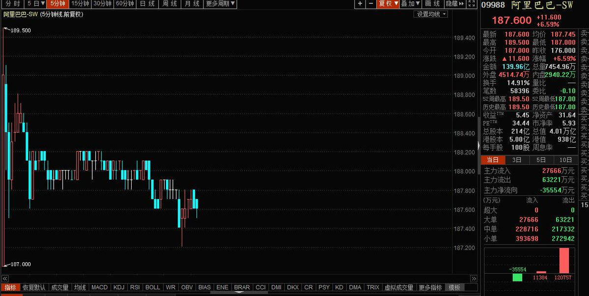

[11月27日 05:30]    新闻大吐槽   @TuCaoFakeNews    今后此推时间轴将干净无比，不用担心follow后被刷屏，请放心关注！

转推网友精彩吐槽，由小号承接  :speech_balloon:评:0 :+1:赞:4 :globe_with_meridians:转:3  

[11月27日 05:24]    新闻大吐槽   @TuCaoFakeNews    这就是理工大学围城的时候，仔细看能观察到记者中枪时，头上溅起的火星  :speech_balloon:评:1 :+1:赞:1 :globe_with_meridians:转:0  

[11月27日 05:05]    新闻大吐槽   @TuCaoFakeNews    记得周董关于家暴的老歌《爸，我回来了！》吗？

香港网红歌手晴天林把此歌改编成反应警暴的《警察，你辛苦了》，充满讽刺意味。

这种说唱填词还是挺难的，有才  :speech_balloon:评:1 :+1:赞:33 :globe_with_meridians:转:21  

[11月27日 04:57]    新闻大吐槽   @TuCaoFakeNews    一为人民服务，人民就要遭殃！ https://twitter.com/selinajin1/status/1199367304179568641 …  :speech_balloon:评:0 :+1:赞:4 :globe_with_meridians:转:1  

[11月27日 04:24]    新闻大吐槽   @TuCaoFakeNews    一声枪响，记者头盔上一团烟雾，这是此前碰巧记录下的，黑警对头射击的另一起案例！
被击中的记者吓的一哆嗦，还好不是打中眼睛，不然又是一起失明惨剧  :speech_balloon:评:1 :+1:赞:30 :globe_with_meridians:转:20  

[11月27日 00:38]    财经真相   @caijingxiang    人民币疯涨，貌似没有任何消息面，就是纯粹在拉，而且黄金也涨，根本不是以往的贸易利好消息！  :speech_balloon:评:16 :+1:赞:102 :globe_with_meridians:转:19  

[11月26日 23:10]    墙国铁拳现世报😷   @Socialistfist    发#社会主义铁拳 太难了，业余还要打假  :speech_balloon:评:7 :+1:赞:70 :globe_with_meridians:转:3  

[11月26日 22:47]    新闻大吐槽   @TuCaoFakeNews    尽管校园搜查队已经搜了个底掉，黑警还是不相信，并没有撤掉包围  :speech_balloon:评:2 :+1:赞:39 :globe_with_meridians:转:13  

[11月26日 22:47]    新闻大吐槽   @TuCaoFakeNews    尽管校园搜查队已经搜了个底掉，黑警还是不相信，并没有撤掉包围  :speech_balloon:评:2 :+1:赞:39 :globe_with_meridians:转:13  

[11月26日 22:44]    新闻大吐槽   @TuCaoFakeNews    公民党正在招募抗争者雇员为新当选的区议员工作，因为区议员有权雇佣一到两名文员～

而所有的工资与开销都由政府出资～

民意的大胜给很多年轻抗争者解决了工作问题  :speech_balloon:评:5 :+1:赞:49 :globe_with_meridians:转:18  

[11月26日 22:44]    新闻大吐槽   @TuCaoFakeNews    公民党正在招募抗争者雇员为新当选的区议员工作，因为区议员有权雇佣一到两名文员～

而所有的工资与开销都由政府出资～

民意的大胜给很多年轻抗争者解决了工作问题  :speech_balloon:评:5 :+1:赞:49 :globe_with_meridians:转:18  

[11月26日 22:37]    BBC News 中文   @bbcchinese    阿里巴巴在港交所上市，全天涨6.59%，收报187.60港元。这使阿里巴巴总市值超过4万亿港元，超越腾讯，登顶“港股一哥”。 https://www.bbc.com/zhongwen/simp/business-50556946 …  :speech_balloon:评:14 :+1:赞:41 :globe_with_meridians:转:15  

[11月26日 22:35]    新闻大吐槽   @TuCaoFakeNews    新屋岭大兴土木！是在学新疆建集中营？ https://twitter.com/liberresearch/status/1199325751708749825 …  :speech_balloon:评:4 :+1:赞:31 :globe_with_meridians:转:31  

[11月26日 22:35]    新闻大吐槽   @TuCaoFakeNews    新屋岭大兴土木！是在学新疆建集中营？ https://twitter.com/liberresearch/status/1199325751708749825 …  :speech_balloon:评:4 :+1:赞:31 :globe_with_meridians:转:31  

[11月26日 22:27]    BBC News 中文   @bbcchinese    被自称“叛逃中国间谍”王立强指称是中国情报人员的中国创新投资公司主席向心、龚青夫妇，在台湾机场被阻止出境，要求配合调查。台湾内政部长徐国勇表示，对向心夫妇实施限制出海出境不是“政治动作”，而是独立的司法作为。 https://bbc.in/37DLHZT   :speech_balloon:评:12 :+1:赞:83 :globe_with_meridians:转:21  

[11月26日 21:31]    BBC News 中文   @bbcchinese    许多国家曾经列大麻为“毒品”，完全禁绝，但近年越来越多国家却解禁，为何它们对大麻的态度180度改变？ https://bbc.in/2XLkpfE   :speech_balloon:评:58 :+1:赞:97 :globe_with_meridians:转:46  

[11月26日 21:00]    纽约时报中文网   @nytchinese    #观点 北京并不打算用口号对抗议者以牙还牙。它的战略布局要宽泛得多。
目前还不清楚相关措施的力度，但习近平已经警示称，任何企图在中国搞分裂的人“结果只能是粉身碎骨”。他的言语充满暴力，几乎没有留下妥协或同情的余地。 http://nyti.ms/2sdmK7q   :speech_balloon:评:86 :+1:赞:15 :globe_with_meridians:转:8  

[11月26日 20:30]    纽约时报中文网   @nytchinese    “他们的坠落可能和成名一样突然、一样戏剧化，”韩国记者李赫俊说。
“他们的职业尤其容易受到心理压力的影响——他们会在社交媒体上受到无时无刻的关注，关于他们私生活的假新闻会立即传播开来。” http://nyti.ms/2Oo8Isx   :speech_balloon:评:2 :+1:赞:7 :globe_with_meridians:转:3  

[11月26日 20:10]    新闻大吐槽   @TuCaoFakeNews    。。。在这次过程中。。人们付出了太多太多了。。为了他们。。不能放弃! https://twitter.com/TuCaoFakeNews/status/1199248303793197061 …  :speech_balloon:评:0 :+1:赞:17 :globe_with_meridians:转:10  

[11月26日 20:04]    新闻大吐槽   @TuCaoFakeNews    The indonesian press who got shot blind by #HKPolice ,still suffering from the tragedy she experienced. After 6 weeks there is still no response from either court or the police to reveal the one who shot her. She will continue her report in HK until justice is served. #hkprotest https://twitter.com/tucaofakenews/status/1199248303793197061 …  :speech_balloon:评:0 :+1:赞:14 :globe_with_meridians:转:9  

[11月26日 20:00]    BBC News 中文   @bbcchinese    【新疆“教育营”：BBC揭露维吾尔人如何被“洗脑”】一名老师说她这样教学生：“没有共产党，我就没法生存。” https://bbc.in/33erIha   :speech_balloon:评:60 :+1:赞:76 :globe_with_meridians:转:33  

[11月26日 20:00]    纽约时报中文网   @nytchinese    #观点 V的面具一眼就能认出来。它的眉毛、唇须、细长的山羊胡，仿佛是在一张雪花石膏脸上用拳头和黑色马克笔画出来的。它现在是抗议的面孔，主要是反政府的抗议，但不止于此。
这个令人不安的脸庞，漂浮在在一片黄色背心、雨伞和黑帽衫的海洋中，让你无从忽视。 http://nyti.ms/2QQTVIh   :speech_balloon:评:2 :+1:赞:13 :globe_with_meridians:转:4  

[11月26日 19:41]    新闻大吐槽   @TuCaoFakeNews    唉 https://twitter.com/TuCaoFakeNews/status/1199248303793197061 …  :speech_balloon:评:0 :+1:赞:7 :globe_with_meridians:转:2  

[11月26日 19:01]    BBC News 中文   @bbcchinese    台湾首次有政党将大麻合法化议题端上政见成为话题。关于大麻合法化争议一直存在，大家怎么看？ https://bbc.in/2XNOY4D   :speech_balloon:评:22 :+1:赞:35 :globe_with_meridians:转:9  

[11月26日 19:00]    纽约时报中文网   @nytchinese    香港警方禁止了大多数大型集会，因此产生了一些规模较小的抗议活动，这些活动吞噬了整个社区，但没有影响到该市的其他大部分地区。
尽管有交通堵塞和其他问题，跨国公司也能在很大程度上畅通无阻地开展业务。 http://nyti.ms/2XKq45R   :speech_balloon:评:6 :+1:赞:12 :globe_with_meridians:转:0  

[11月26日 18:56]    新闻大吐槽   @TuCaoFakeNews    忘了肖华和莫雷了？  :speech_balloon:评:0 :+1:赞:4 :globe_with_meridians:转:4  

[11月26日 18:53]    新闻大吐槽   @TuCaoFakeNews    Injustice anywhere is a threat to justice everywhere #hkprotest #HKPoliceBrutality https://twitter.com/tucaofakenews/status/1199248303793197061 …  :speech_balloon:评:0 :+1:赞:9 :globe_with_meridians:转:7  

[11月26日 18:30]    纽约时报中文网   @nytchinese    周一，她称特朗普以某种方式邀请她到他的住所，但法官谴责其向政府撒谎并改变说法。
法官表示，她的非法侵入犯罪类似于闯入军事设施这样的政府设施，“这是严重犯罪”。 http://nyti.ms/37ClGdE   :speech_balloon:评:5 :+1:赞:14 :globe_with_meridians:转:3  

[11月26日 18:15]    财经真相   @caijingxiang    央视新闻：习近平主持召开中央全面深化改革委员会第十一次会议强调：落实党的十九届四中全会重要举措，继续全面深化改革实现有机衔接融会贯通。看到落实四中全会，及知道这个所谓的全面深化改革究竟是如何“改革”  :speech_balloon:评:29 :+1:赞:100 :globe_with_meridians:转:20  

[11月26日 18:01]    BBC News 中文   @bbcchinese    很多从未参政的年轻“素人”晋身香港区议会，有人甚至尚未大学毕业！ https://bbc.in/37A8JBb   :speech_balloon:评:128 :+1:赞:377 :globe_with_meridians:转:89  

[11月26日 17:52]    BBC News 中文   @bbcchinese    来自芬兰的构想，这个神奇的宝宝箱子正在非洲拯救许多小生命。  :speech_balloon:评:2 :+1:赞:49 :globe_with_meridians:转:16  

[11月26日 17:36]    财经真相   @caijingxiang    美国政府当前正在启动，在美国上市的中国企业，财务独立调查，该法案正在推进中，阿里巴巴回归港股，在某种意义上也是一种预防措施，尤其是港交所目前还在自家人控制的情况下。而港交所收购伦敦交易所似乎也有某种千丝万缕的连续！  :speech_balloon:评:2 :+1:赞:65 :globe_with_meridians:转:16  

[11月26日 17:30]    纽约时报中文网   @nytchinese    当上周王立强的指控出现时，向心和龚青正在台湾，他们于周日在桃园机场被拦下，并在台北受到检察官讯问。
该指控的出现也正值将于1月11日举行的台湾总统大选的前几周，这进一步突显了官员和专家们一直以来的警告：中国试图干预竞选。 http://nyti.ms/35AJYTk   :speech_balloon:评:12 :+1:赞:37 :globe_with_meridians:转:12  

[11月26日 17:29]    财经真相   @caijingxiang    阿里巴巴美股第四季度股权持有情况值得留意，在香港今天局势下，阿里继续选择上市，绝非其港股ipo招股书上主要用于驱动用户增长及提升参与度、助力企业实现数字化转型，提升运营效率、持续创新三个战略方向。  :speech_balloon:评:1 :+1:赞:42 :globe_with_meridians:转:7  

[11月26日 17:26]    财经真相   @caijingxiang    阿里巴巴-SW在香港上市首日涨6.59%，报价187.6港元，-SW"这一后缀。“-W”代表的含义是“同股不同权”，“-S”的含义则代表是第二次上市。 核心关键点：阿里巴巴在香港上市股份与纽交所上市的美国存托股将可互相转换。在美每一份美国存托股代表八股普通股，而此次港股阿里全球发行5亿普通股！  :speech_balloon:评:9 :+1:赞:93 :globe_with_meridians:转:32  

[11月26日 17:01]    BBC News 中文   @bbcchinese    中国被指对美国及其盟国进行网络间谍活动，获取军事机密和商业机密。现在中国所有的社交媒体也被视为安全隐患。 https://bbc.in/2DhW8EQ   :speech_balloon:评:77 :+1:赞:230 :globe_with_meridians:转:67  

[11月26日 17:00]    纽约时报中文网   @nytchinese    #观点 中国官媒使用“恶性病毒”和“感染”这些疾病隐喻，凸显了北京对抗议的看法，认为它是对国家的威胁，意识形态的感染给中共带来了生存危机。
这可能预示香港会出现新的言论管制，而这种可能性似乎正在逐渐逼近。by @limlouisa http://nyti.ms/2sdmK7q   :speech_balloon:评:42 :+1:赞:107 :globe_with_meridians:转:60  

[11月26日 16:47]    新闻大吐槽   @TuCaoFakeNews    右眼失明印尼女记者，现已出院，她重回中枪现场，唤醒恐怖记忆，全身发抖~

她说自己会继续留在香港做记者，而她早前联系了高等法院，要求警方披露涉事警员身分，等了六星期仍然未有回覆~

警察滥权，酿成悲剧，港共却把警员保护起来，使社会失去公平！  :speech_balloon:评:25 :+1:赞:790 :globe_with_meridians:转:505  

[11月26日 16:33]    新闻大吐槽   @TuCaoFakeNews    带上不再犯法的口罩，上百名参加“和你lunch”活动的抗争者，在午饭时间，上街设路障；
他们手拿面包和可乐，送给警察，攻心战开打！
其实也不光是计策，而是给那些心有惭愧的警察一个从新做好的机会~

阿Sir，还犹豫什么，赶快站到民意这边来，才能从新变成一名光荣的警官！  :speech_balloon:评:21 :+1:赞:347 :globe_with_meridians:转:156  

[11月26日 16:30]    纽约时报中文网   @nytchinese    多位明星自杀已让韩国乐迷开始反思K-pop到底出了什么问题。在魅力四射的表象下，K-pop行业丑闻缠身，娱乐业专家早就对其阴暗面发出警告。
大批年轻的韩国人通常从十几岁开始投入训练，磨练歌唱技巧和舞蹈动作。“他们从小过着机械的生活，受着斯巴达式的训练，”一名韩国记者说。 http://nyti.ms/2Oo8Isx   :speech_balloon:评:8 :+1:赞:54 :globe_with_meridians:转:17  

[11月26日 16:26]    新闻大吐槽   @TuCaoFakeNews    经搜查队仔细查找，在学校找到一名18岁以上的女同学，辅导员希望把她带出来，除这个女同学外，没有抗争者在校园了 https://twitter.com/XinqiSu/status/1199234861405327360?s=20 …  :speech_balloon:评:2 :+1:赞:62 :globe_with_meridians:转:20  

[11月26日 16:00]    纽约时报中文网   @nytchinese    阿里巴巴周二完成了在香港融资112亿美元的计划。阿里的股价周二开盘报23.90美元，比该公司上周设定的每股22.50美元的发行价高出逾1美元。这仅略低于阿里最初设定的24美元目标。
阿里成功上市正值香港经济需要提振之际。尽管抗议活动变得更加暴力，但目前投资者情绪已有所改善。 http://nyti.ms/2XKq45R   :speech_balloon:评:9 :+1:赞:25 :globe_with_meridians:转:5  

[11月26日 15:49]    纽约时报中文网   @nytchinese    布拉格与北京不再是“姐妹”，捷中关系走向何方  http://nyti.ms/34eq6VU https://twitter.com/ccni/status/1199162573628817408 …  :speech_balloon:评:4 :+1:赞:13 :globe_with_meridians:转:3  

[11月26日 15:36]    财经真相   @caijingxiang    11月20日，京东旗下网银在线因违规将外汇转移境外，受到2943万元巨额罚单。跟据《中共外汇管理条例》第三十九条，有违反规定将境内外汇转移境外，或者以欺骗手段将境内资本转移境外等逃汇行为的，由外汇管理机关责令限期调回外汇，处逃汇金额30%以下的罚款；情节严重的，处逃汇金额30%以上的罚款  :speech_balloon:评:22 :+1:赞:320 :globe_with_meridians:转:170  

[11月26日 15:30]    纽约时报中文网   @nytchinese    #观点 上翘的唇须、细长的山羊胡、弯弓似的眉毛。在世界各地，抗议者不约而同地带着以盖伊·福克斯为原型的面具。这名十七世纪的英国造反分子的脸已成为抗议的面孔。
1988年，福克斯进入全球主流。在漫画《V字仇杀队》中的法西斯主义的未来英格兰，福克斯成了终极反英雄。 http://nyti.ms/2QQTVIh   :speech_balloon:评:11 :+1:赞:129 :globe_with_meridians:转:43  

[11月26日 15:01]    BBC News 中文   @bbcchinese    在自称是“中国间谍”而逃往澳洲的王立强事件被发现存在诸多疑点之际，澳媒再指中国安排间谍“渗透议会”，该男子最终被发现死亡。中国则回应称澳大利亚已“草木皆兵”。 https://bbc.in/37zoWGx   :speech_balloon:评:49 :+1:赞:189 :globe_with_meridians:转:61  

[11月26日 15:00]    纽约时报中文网   @nytchinese    据报道，台湾拘捕了一家香港公司的两名高管向心和龚青。这家公司被指控充当中国情报机构的幌子，试图削弱香港和台湾的民主。
台湾正对疑似叛逃至澳大利亚、自称中国前间谍的王立强的陈述展开调查，王立强称向心和龚青供职的中国创新投资有限公司为中国情报部门行事。 http://nyti.ms/35AJYTk   :speech_balloon:评:23 :+1:赞:194 :globe_with_meridians:转:58  

[11月26日 14:30]    纽约时报中文网   @nytchinese    在香港区议会选举中，建制派阵营遭遇了自香港回归中国以来最大的失败之一，几十名资深政治人士被一批新人取代，其中很多人参选是受到反政府抗议活动的激发。
以下是五名最令人关注的新任区议员，以及他们的心声： http://nyti.ms/2XJRpVK   :speech_balloon:评:11 :+1:赞:71 :globe_with_meridians:转:18  

[11月26日 14:00]    纽约时报中文网   @nytchinese    在印度德里密林深处的一座与世隔绝的废弃宫殿里，住着一名古怪的王子——他自称是奥德王朝的王室遗孤，遵守王室礼节，从不肯屈尊降贵、与平民交往。他曾生活富庶、仆从环绕，却在贫困和病痛中死去。他的一生的故事堪称传奇。但它是真的吗？还是个大骗局？ 更多简报内容： http://nyti.ms/34g7l4t   :speech_balloon:评:3 :+1:赞:6 :globe_with_meridians:转:2  

[11月26日 13:53]    老司机   @h5lpykl7tp6jjop    爱国贼的生意经，打得一手好算盘，党和群众都喜欢，它们却遛了！  :speech_balloon:评:1 :+1:赞:15 :globe_with_meridians:转:5  

[11月26日 13:00]    BBC News 中文   @bbcchinese    这名神秘女子最终被判监禁8个月，而她已经在审讯过程里被拘留了7个多月。 https://bbc.in/2QRuQwI   :speech_balloon:评:29 :+1:赞:79 :globe_with_meridians:转:27  

[11月26日 13:00]    纽约时报中文网   @nytchinese    #每日一词 Deepfake，深伪、AI换脸技术。当AI换脸技术发展至毫无破绽，你还相信自己的眼睛吗？时报视频节目The Weekly播出了一段被改过的视频，并披露其制作过程。Deepfake是deep learning（深度学习）和fake（伪造）的合成词，指利用AI改变人脸的图像合成技术。更多简报内容： http://nyti.ms/34g7l4t   :speech_balloon:评:3 :+1:赞:11 :globe_with_meridians:转:3  

[11月26日 12:30]    纽约时报中文网   @nytchinese    今年年初携带多部电子产品擅入马阿拉歌庄园的中国女商人张玉婧获刑。她因非法侵入和向联邦特工说谎被判八个月监禁。
联邦法官下令，届时将驱逐张玉婧出境。她曾于9月因涉嫌擅自闯入特朗普庄园并向联邦特工撒谎而被定罪。 http://nyti.ms/37ClGdE   :speech_balloon:评:14 :+1:赞:83 :globe_with_meridians:转:33  

[11月26日 12:01]    纽约时报中文网   @nytchinese    各派人士认为，一边倒的选举结果使中共在对抗议活动作出回应上面临更大的压力。但他们对这意味着什么有不同看法。
对民主派来说，这意味着要解决香港人对官员有更大问责的呼声。其他人则担心，投票的结果或被北京视为香港正进一步脱离其控制的信号，需要北京作出更严厉的回应。 http://nyti.ms/2OlbgHG   :speech_balloon:评:25 :+1:赞:54 :globe_with_meridians:转:20  

[11月26日 12:00]    BBC News 中文   @bbcchinese    如果娱乐性大麻在台湾合法化，那将会是亚洲第一。 https://bbc.in/2QQa151   :speech_balloon:评:119 :+1:赞:218 :globe_with_meridians:转:35  

[11月26日 11:30]    纽约时报中文网   @nytchinese    特朗普看似愿意将人权问题与贸易方面的进展联系起来的言论遭到两党人士的指责，他们认为这种立场可能会损害美国作为全球民主捍卫者的角色。
“不要搞错了：特朗普今天的言论，并不反映美国人民或国会对习近平主席对香港人民采取高压政策的看法，”参议院少数派领袖查克·舒默说。 http://nyti.ms/2OKjJTG   :speech_balloon:评:79 :+1:赞:59 :globe_with_meridians:转:16  

[11月26日 11:00]    纽约时报中文网   @nytchinese    • 法国奢侈品巨头LVMH斥资162亿美元收购蒂芙尼。这笔巨额交易是奢侈品行业有史以来最大的一笔收购，将使LVMH在美国站稳脚跟，并帮助蒂芙尼在欧洲和中国发展。
• 牌照难续，优步在伦敦受挫。不断涌现的安全问题让伦敦当局拒绝延长其出租车运营许可证。
更多简报内容： http://nyti.ms/34g7l4t   :speech_balloon:评:4 :+1:赞:6 :globe_with_meridians:转:3  

[11月26日 10:59]    财经真相   @caijingxiang    美国两院通过法案是在11月20日(美国时间)，按照程序美国总统要在接下来10天内签证通过（10天不包含周末），按照这样推断最后截止日期将是在12月5日，香港时间12月6日凌晨！  :speech_balloon:评:33 :+1:赞:305 :globe_with_meridians:转:91  

[11月26日 10:37]    BBC News 中文   @bbcchinese    报道指，他可能是大选中最亲中的美国总统参选人。 https://bbc.in/2QMKcTr   :speech_balloon:评:94 :+1:赞:225 :globe_with_meridians:转:63  

[11月26日 10:36]    老司机   @h5lpykl7tp6jjop    终审法院大法官回击人大:香港司法独立不容置疑  :speech_balloon:评:2 :+1:赞:47 :globe_with_meridians:转:10  

[11月26日 10:30]    纽约时报中文网   @nytchinese    #观点 试想：官方统计数据显示，2015年至2018年间，新疆最大的两个维吾尔人地区和田与喀什的人口净增长率合计下降了约84%。
中国共产党宣称，要在新疆少数民族进行“教育转化”。事实上，它正在摧毁整个社群，并对他们进行大规模镇压。而这些，都是在习主席本人的指示下进行的。 http://nyti.ms/34hfhSY   :speech_balloon:评:44 :+1:赞:77 :globe_with_meridians:转:25  

[11月26日 10:07]    老司机   @h5lpykl7tp6jjop    目前大陆民间流传预言：猪年闹猪瘟，鼠年闹鼠疫，不怕屁眼黑、就怕跑不脱！
当年天上掉下陨石雨，三个大块无数小块，坊间流言闰七不闰八，闰八遭刀杀，是年农历闰八月，果然共党三大头领亡，中国是个落后神秘国度，许多事情无法解释！且看如何分解。  :speech_balloon:评:2 :+1:赞:34 :globe_with_meridians:转:7  

[11月26日 10:02]    财经真相   @caijingxiang    2019年11月25日，中国工商银行、中央国债登记结算有限公司、新加坡交易所在新加坡共同向全球发布“中债－工行人民币债券指数”，并于新加坡交易所挂牌。同时，三方签署合作备忘录，共同推广该指数的应用。  :speech_balloon:评:12 :+1:赞:48 :globe_with_meridians:转:20  

[11月26日 09:50]    财经真相   @caijingxiang    11月26日上午，中方牵头人刘鹤与美国贸易代表莱特希泽、财政部长姆努钦通话。双方就解决彼此核心关切问题进行了讨论，就解决好相关问题取得共识，同意就第一阶段协议磋商的剩余事项保持沟通。商务部部长钟山、中国人民银行行长易纲、国家发改委副主任宁吉喆等参加通话。消息公布CNH条件反射式小幅上涨  :speech_balloon:评:19 :+1:赞:120 :globe_with_meridians:转:22  

[11月26日 08:30]    BBC News 中文   @bbcchinese    她经常被人以毕加索的情人而提起，但实际上，她本人也是一位极富天分的艺术家。 https://bbc.in/2XN8OwK   :speech_balloon:评:0 :+1:赞:36 :globe_with_meridians:转:13  

[11月26日 08:30]    BBC News 中文   @bbcchinese    南太平洋巴布亚新几内亚东部最大岛屿布干维尔举行全民公投。大国正在关注它是否可能独立建国。 https://bbc.in/2QLU1Rw   :speech_balloon:评:11 :+1:赞:63 :globe_with_meridians:转:10  

[11月26日 06:33]    财经真相   @caijingxiang    恐慌型指数VIX已经跌至贸易战以来最低点，市场目前对第一阶段贸易充满乐观情绪，似乎已经达成了协议，而且随着美联储重回扩表，美股还在不断创新高，目前市场困惑的目前市场搞不清楚两个因素那个更是推动力！  :speech_balloon:评:9 :+1:赞:73 :globe_with_meridians:转:9  

[11月26日 06:19]    新闻大吐槽   @TuCaoFakeNews    非常值得收藏 http://www.epochtimes.com/gb/19/11/25/n11680082.htm …  :speech_balloon:评:5 :+1:赞:247 :globe_with_meridians:转:190  

[11月26日 02:49]    墙国铁拳现世报😷   @Socialistfist    潘福仁退休前在2007年与网友 网论司法公正
 http://law.eastday.com/dongfangfz/node7/u1a5371.html …  :speech_balloon:评:0 :+1:赞:42 :globe_with_meridians:转:5  

[11月26日 02:47]    墙国铁拳现世报😷   @Socialistfist    江西中级人民法院法官 
判被告 前
上海中级人民法院法官
9年半有期徒刑

#社会主义铁拳  :speech_balloon:评:16 :+1:赞:249 :globe_with_meridians:转:62  

[11月26日 01:01]    GFHG SDKM   @zyx_yny    Heading back to London. 

Thank you #HK for letting us share in your unforgettable victory.

香港人, 加油   :speech_balloon:评:2337 :+1:赞:18260 :globe_with_meridians:转:8462  

[11月25日 23:56]    BBC News 中文   @bbcchinese    【英国安德鲁王子性丑闻：我从未与爱泼斯坦贩运的女子发生性关系】安德鲁王子首次公开谈论曾与他有交情的爱泼斯坦当年的作为。在接受BBC专访时，安德鲁王子矢口否认曾与爱泼斯坦性侵案中的指控者有关联。但是在此前专访后数天，安德鲁王子却停止了一切公务。 https://www.youtube.com/watch?v=ClhviGV-t6I …  :speech_balloon:评:27 :+1:赞:42 :globe_with_meridians:转:14  

[11月25日 22:02]    财经真相   @caijingxiang    现在是信息化时代，全球金融市场连在一起，香港人权法案即将在白宫通过，香港区大选结果也已经出炉，中共最后的赌注要来了，深圳银行停贷绝不是表面现象那么简单，港人要小心，这次是玩真的！  :speech_balloon:评:10 :+1:赞:197 :globe_with_meridians:转:43  

[11月25日 21:57]    财经真相   @caijingxiang    深圳多家分行暂停发放按揭贷款，或将于明年元旦恢复！元旦恢复是说要过了年底结算期，而这个时候也是中国用钱高峰！可见银行系统资金紧张程度，而建行总行关闭深圳放贷，有两层含义，一是刚才是的年底结算，另一个就是香港，香港有动静，深圳房价必然受到波及，停止按揭是一种提前止损！  :speech_balloon:评:25 :+1:赞:395 :globe_with_meridians:转:153  

[11月25日 19:34]    老司机   @h5lpykl7tp6jjop    几个月来一直被悲伤和愤怒的情绪所影响，心有垒块郁堵，一夜之间香港区议会选举民主派大获全胜，笑到老泪纵横！民心向背诚不可欺！中共走狗有权有枪有钱又如何？丢脸丢大发了！这一小撮坏份子究竟是谁？这不一目了然吗？难坏了中共媒体，建制派输得这么惨，这祭文咋写呢？到底是谁在不明白真相呢？  :speech_balloon:评:3 :+1:赞:59 :globe_with_meridians:转:8  

[11月25日 19:01]    BBC News 中文   @bbcchinese    民主派候选人夺得更多区议员席位，是否意味着在特首选举中有更大话语权？香港目前的纷争局势能走向平息吗？ https://bbc.in/2KSLmsN   :speech_balloon:评:69 :+1:赞:116 :globe_with_meridians:转:23  

[11月25日 18:43]    老司机   @h5lpykl7tp6jjop    荷眾議院132：18通過法案　挺台灣加入國際組織 https://www.mirrormedia.mg/story/20191009edi004?utm_source=facebook&utm_medium=mmpage …  :speech_balloon:评:21 :+1:赞:847 :globe_with_meridians:转:288  

[11月25日 18:30]    老司机   @h5lpykl7tp6jjop    将来的评估人员又是一大肥缺，人人争送红包。  :speech_balloon:评:4 :+1:赞:59 :globe_with_meridians:转:0  

[11月25日 18:24]    老司机   @h5lpykl7tp6jjop    船沉之前要搜刮干净老百姓兜里每一块铜板！
财政部确定：房产税即将开征，按房屋评估价征收！
财政部部长肖捷日前谈及房地产税，明确未来的房地产税将按照房屋评估值征收。要按照“立法先行、充分授权、分步推进”的原则，推进房地产税立法和实施。  :speech_balloon:评:29 :+1:赞:341 :globe_with_meridians:转:112  

[11月25日 18:12]    老司机   @h5lpykl7tp6jjop    11.25 香港
前保安局长叶刘淑仪,如过街老鼠,竟然需要重兵保护,才能出门。
市民对她高呼"杀人犯"  :speech_balloon:评:1 :+1:赞:35 :globe_with_meridians:转:18  

[11月25日 18:01]    BBC News 中文   @bbcchinese    最近披露的一批文件显示，中国当局如何在新疆设立再教育营系统，对上百万维吾尔人进行“洗脑”。而中国驻英国大使将这些文件斥为假消息。 https://bbc.in/37xU9tK   :speech_balloon:评:140 :+1:赞:295 :globe_with_meridians:转:125  

[11月25日 17:18]    老司机   @h5lpykl7tp6jjop    像葉劉淑儀、鄭若驊、林鄭月娥這些中共走卒是真邪惡。
如果在中國生長的共卒親共，我們還可以顧念他們一生于黨化洗腦術中的教育背景，在憎惡之余心生一絲怜憫。
而這班人不同，她們生長于資訊自由社會，接受過最好的英式教育，對專制政體與民主政體認識清晰。她們卻甘為暴政之打手，自選一條道走到黑。 https://twitter.com/rfa_chinese/status/1198873809916321792 …  :speech_balloon:评:32 :+1:赞:329 :globe_with_meridians:转:111  

[11月25日 16:01]    BBC News 中文   @bbcchinese    第56届金马奖11月23日登场，中国电影金鸡奖则一改过去9月举行的惯例，改为与金马奖同一天于厦门举行，加上中国下令大陆影人不得参加金马奖，使两项颁奖典礼充满浓浓政治味。 https://bbc.in/2KQ4xU4   :speech_balloon:评:69 :+1:赞:131 :globe_with_meridians:转:23  

[11月25日 15:13]    财经真相   @caijingxiang    人民日报发表关于香港去议会选举通告，嗯，仅仅只是通告，而且还是没有说明投票结果的通告，全文透露着无奈！如果这次中共造假舞弊赢得多数，那么现在的通稿到处都是“民意”，以及对一小撮暴徒不得民心的强烈愤慨！  :speech_balloon:评:49 :+1:赞:445 :globe_with_meridians:转:102  

[11月25日 14:36]    老司机   @h5lpykl7tp6jjop    那些说小王童鞋是骗子的出来走两步 https://twitter.com/jiongnasen/status/1198851139510259712 …  :speech_balloon:评:2 :+1:赞:49 :globe_with_meridians:转:13  

[11月25日 14:20]    墙国铁拳现世报😷   @Socialistfist    搬运一个来自微博的欢乐源泉，给墙内开票开了通宵，按时间倒序，他分别表演了：

1. 目瞪口呆
2. 伤心欲绝
3. 自欺欺人
4. 微博全部被删  :speech_balloon:评:260 :+1:赞:3865 :globe_with_meridians:转:1381  

[11月25日 14:18]    老司机   @h5lpykl7tp6jjop    藍屍口中的選舉唔公平呢啲一定係老臨  :speech_balloon:评:192 :+1:赞:3344 :globe_with_meridians:转:1533  

[11月25日 14:01]    BBC News 中文   @bbcchinese    曾担任英国外交部香港事务部主任的皮特·里基茨勋爵（Lord Peter Ricketts）呼吁北京当局鼓励香港特首林政月娥对暴力双方进行“绝对不偏不倚的司法调查”。 https://bbc.in/2qH7Q9a   :speech_balloon:评:70 :+1:赞:286 :globe_with_meridians:转:76  

[11月25日 13:46]    财经真相   @caijingxiang    来猜猜看，香港法案川普会不会在自动生效的最后一天签署呢？ https://twitter.com/q7syrkosumosu/status/1198813739379654658 …  :speech_balloon:评:46 :+1:赞:188 :globe_with_meridians:转:36  

[11月25日 13:09]    老司机   @h5lpykl7tp6jjop    《习近平与他的情人们》一书电子版(全文)  https://www.newhighlandvision.com/%e3%80%8a%e4%b9%a0%e8%bf%91%e5%b9%b3%e4%b8%8e%e4%bb%96%e7%9a%84%e6%83%85%e4%ba%ba%e4%bb%ac%e3%80%8b%e4%b8%80%e4%b9%a6%e7%94%b5%e5%ad%90%e7%89%88%e5%85%a8%e6%96%87/ … 来自 @新高地 New Highland Vision  :speech_balloon:评:9 :+1:赞:69 :globe_with_meridians:转:33  

[11月25日 11:16]    财经真相   @caijingxiang    香港选举结果出来了，国内官媒如丧考妣，环球时报发文说，这次区议会选举，希望建制派不要灰心；国内关注香港局势的人，突然发现昔日“一小撮暴徒”，突然变成了“一大撮”，甚至是整个香港民意！  :speech_balloon:评:101 :+1:赞:2455 :globe_with_meridians:转:569  

[11月25日 10:33]    老司机   @h5lpykl7tp6jjop      :speech_balloon:评:0 :+1:赞:3 :globe_with_meridians:转:1  

[11月25日 10:24]    老司机   @h5lpykl7tp6jjop    选举说明了民心所向，下一步中共怎么办？难道学希特勒再搞一次国会纵火案？  :speech_balloon:评:1 :+1:赞:12 :globe_with_meridians:转:3  

[11月25日 10:18]    BBC News 中文   @bbcchinese    历时15小时的香港区议会投票基本和平结束。在“反送中”运动持续下，地区政治版图变天。 https://bbc.in/2XHtXbA   :speech_balloon:评:49 :+1:赞:133 :globe_with_meridians:转:25  

[11月25日 09:59]    财经真相   @caijingxiang    游戏剧情模拟下的《权利的游戏》夜王率领的僵尸大军，南下进攻君临城，与瑟曦女王的大战，没想到画面制作的这么精美，一点都不比真实版的电视剧差！链接 https://www.youtube.com/watch?v=VfwlyN-8ZlQ …  :speech_balloon:评:4 :+1:赞:57 :globe_with_meridians:转:10  

[11月25日 08:37]    财经真相   @caijingxiang    11月18日，刘强东卸任京东云计算有限公司总经理，助理张芳卸任法人代表！下一个！  :speech_balloon:评:24 :+1:赞:580 :globe_with_meridians:转:245  

[11月25日 04:04]    老司机   @h5lpykl7tp6jjop    這次有很多新當選議員都是在反送中運動中被逮捕過，甚至被中共稱為「暴徒」。但是，今天香港人民選擇了他們。「機場大叔」陳振哲一直用自己法律專業知識在街頭向勇敢地向港警「普法」，累遭港警暴力襲擊。今天陳振哲當選了！  :speech_balloon:评:23 :+1:赞:1258 :globe_with_meridians:转:380  

[11月24日 18:03]    老司机   @h5lpykl7tp6jjop      :speech_balloon:评:1 :+1:赞:15 :globe_with_meridians:转:5  

[11月24日 17:59]    老司机   @h5lpykl7tp6jjop    港警被告上国际法庭 逾50万人控告三大重罪  :speech_balloon:评:10 :+1:赞:198 :globe_with_meridians:转:69  

[11月24日 12:46]    GFHG SDKM   @zyx_yny    Very good to take some time@our from election observation to tell #JuniusHo in person that I was responsible for the revocation of his honorary doctorate from @AngliaRuskin #Sorrynotsorry  :speech_balloon:评:6909 :+1:赞:46024 :globe_with_meridians:转:27633  

[11月24日 08:10]    凡賽堤/FORSETI   @FecharCCP    呼籲請求共同挖掘所有有關香港發生的事，越全面越好，不同角度，越多越好，包括被暗地抓捕的人員，特別是CCP 派出的各種偽裝身份，包括變身變裝行兇的一點一滴都要挖掘出來，把CCP 的邪惡下三濫手段的真相毫無保留的曝光在全世界面前！世界公知公義才能真正挽救和保護香港人！希望懂視頻編輯配上中英文  :speech_balloon:评:1 :+1:赞:17 :globe_with_meridians:转:18  

[11月24日 08:07]    凡賽堤/FORSETI   @FecharCCP    人類史上最殘暴的CCP極權殺人恐怖組織正在用各種兇殘手段屠殺我們的同胞...................

CCP極權殺人恐怖組織超級納粹！超級殘暴！超級流氓！

人類到了全面消滅CCP極權殺人恐怖組織的時代！  :speech_balloon:评:5 :+1:赞:45 :globe_with_meridians:转:51  

[11月24日 08:04]    凡賽堤/FORSETI   @FecharCCP    人類史上最殘暴的CCP極權殺人恐怖組織正在用各種兇殘手段屠殺我們的同胞...................

CCP極權殺人恐怖組織超級納粹！  :speech_balloon:评:1 :+1:赞:41 :globe_with_meridians:转:34  

[11月24日 07:57]    凡賽堤/FORSETI   @FecharCCP    人類史上最殘暴的CCP極權殺人恐怖組織正在用各種兇殘手段屠殺我們的同胞...................

CCP極權殺人恐怖組織超級納粹！  :speech_balloon:评:6 :+1:赞:182 :globe_with_meridians:转:162  

[11月24日 07:37]    凡賽堤/FORSETI   @FecharCCP    人類史上最殘暴的CCP極權殺人恐怖組織正在用各種兇殘手段屠殺我們的同胞...................  :speech_balloon:评:1 :+1:赞:13 :globe_with_meridians:转:14  

[11月24日 07:28]    凡賽堤/FORSETI   @FecharCCP    CCP極權殺人恐怖組織正在用各種兇殘手段屠殺我們的同胞...................

視頻是CCP極權殺人恐怖組織在人流密集區投放巨量的不合格（不具國際標準）的化學毒氣催淚瓦斯彈 毒害我們的同胞！  :speech_balloon:评:0 :+1:赞:8 :globe_with_meridians:转:4  

[11月23日 22:09]    老司机   @h5lpykl7tp6jjop    当你为正‌义申辩时，往往不‌仅需‌要面对国家的暴力机器，还‌要面‌对无知愚‌民的狂欢和嘲‌讽！
          —— 伏尔泰  :speech_balloon:评:27 :+1:赞:1107 :globe_with_meridians:转:675  

[11月23日 21:27]    墙国铁拳现世报😷   @Socialistfist    #社会主义铁拳 https://twitter.com/big_ear_cat/status/1197861132364603401 …  :speech_balloon:评:9 :+1:赞:213 :globe_with_meridians:转:47  

[11月23日 17:46]    老司机   @h5lpykl7tp6jjop    香港某大厦外墙上的布告栏，民主派参选人的海报竟然被人撕掉，而亲共派候选人的海报却都原封不动，如果任由流氓破坏规则，选民连民主派的参选人是谁都不知道，民主派如何能胜选？

某些政党成立时是流氓起家，现在都建党近百年了，还是流氓行径，本性难改~  :speech_balloon:评:14 :+1:赞:87 :globe_with_meridians:转:45  

[11月23日 16:37]    财经真相   @caijingxiang    第二届彭博财经论坛在北京召开，美国前财政部长保尔森：要避免“脱钩的妄想”  :speech_balloon:评:26 :+1:赞:91 :globe_with_meridians:转:18  

[11月23日 12:26]    墙国铁拳现世报😷   @Socialistfist    辛辛苦苦咬文嚼字将近一年，揭露邪恶，为正义发声，可推特连解释都不解释，直接就给我封号了！而且close了我的申诉，只是冷冷一句，“你多次违反推特rules”，我觉得自己像是在面对另一个中宣部，连自我审查都不过关，不过我也看清一点：推特并不是按照良知/非良知，来实行奖惩的

我现在注册了新号，  :speech_balloon:评:168 :+1:赞:610 :globe_with_meridians:转:270  

[11月23日 11:51]    财经真相   @caijingxiang    必须要特别说明的，得年轻人者，得天下！粤币要想长远发展，必须动手挖沪币的墙角，千万别搞什么，广东是广东的天下，其他人统统滚蛋，甚至设置各种歧视排外政策，如果广东人未来正的选一帮这样的政客，等于是直接宣判粤币死亡！  :speech_balloon:评:19 :+1:赞:130 :globe_with_meridians:转:16  

[11月23日 11:32]    财经真相   @caijingxiang    甚至很多权贵主动“退赃”以换取政治和财产安全，这样可以在不引起全体富人恐慌的情况下，让富人成为最后债务承担者，这是沪币、粤币具有的无可比拟的优势，如果处理得当，未来两币超越日元、欧元完全不成问题，甚至有可能把美元霸主地位都给拉下马，当然这将是很久以后的事情了！  :speech_balloon:评:10 :+1:赞:47 :globe_with_meridians:转:9  

[11月23日 11:14]    凡賽堤/FORSETI   @FecharCCP    CCP極權殺人恐怖組織是全人類的公敵！
呼籲全世界正道主義合力消滅CCP！
呼籲全世界人民看清楚CCP反人類的慘無人道的殘暴罪行！！！

消滅CCP是全世界全人類的當前最緊急任務！！！

視頻是CCP瘋狂屠殺香港學生畫面之一  :speech_balloon:评:3 :+1:赞:10 :globe_with_meridians:转:15  

[11月23日 11:08]    凡賽堤/FORSETI   @FecharCCP    凡是罔顧香港事實在推特和youtube上支持CCP和香港黑警的五毛必死全家，有朝一日必死於CCP的殺人恐怖組織之下，起底五毛祖宗十八代世代不得為人！  :speech_balloon:评:3 :+1:赞:6 :globe_with_meridians:转:2  

[11月23日 11:02]    凡賽堤/FORSETI   @FecharCCP    CCP極權殺人恐怖組織是全人類的公敵！
呼籲全世界正道主義合力消滅CCP！
呼籲全世界人民看清楚CCP反人類的慘無人道的殘暴罪行！！！

消滅CCP是全世界全人類的當前最緊急任務！！！

視頻是深夜被CCP黑警暗殺的少女！  :speech_balloon:评:1 :+1:赞:6 :globe_with_meridians:转:12  

[11月23日 10:59]    凡賽堤/FORSETI   @FecharCCP    CCP極權殺人恐怖組織是全人類的公敵！
呼籲全世界正道主義合力消滅CCP！
呼籲全世界人民看清楚CCP反人類的慘無人道的殘暴罪行！！！

消滅CCP是全世界全人類的當前最緊急任務！！！

視頻是被CCP瘋狂屠殺射中頭部身亡的香港學生  :speech_balloon:评:2 :+1:赞:5 :globe_with_meridians:转:9  

[11月23日 10:55]    凡賽堤/FORSETI   @FecharCCP    CCP極權殺人恐怖組織是全人類的公敵！
呼籲全世界正道主義合力消滅CCP！
呼籲全世界人民看清楚CCP反人類的慘無人道的殘暴罪行！！！

消滅CCP是全世界全人類的當前最緊急任務！！！

視頻是CCP瘋狂屠殺香港學生畫面之一  :speech_balloon:评:2 :+1:赞:15 :globe_with_meridians:转:13  

[11月23日 10:52]    凡賽堤/FORSETI   @FecharCCP    CCP極權殺人恐怖組織是全人類的公敵！
呼籲全世界正道主義合力消滅CCP！
呼籲全世界人民看清楚CCP反人類的慘無人道的殘暴罪行！！！

消滅CCP是全世界全人類的當前最緊急任務！！！

據報導已被發現2537宗屍體，失踪近萬人！  :speech_balloon:评:0 :+1:赞:4 :globe_with_meridians:转:0  

[11月23日 10:46]    凡賽堤/FORSETI   @FecharCCP    CCP極權殺人恐怖組織正在用各種兇殘手段屠殺我們的同胞...................
CCP極權殺人恐怖組織是全人類的公敵！
呼籲全世界正道主義合力消滅CCP！
呼籲全世界人民看清楚CCP反人類的慘無人道的殘暴罪行！！！

消滅CCP是全世界全人類的當前最緊急任務！！！

視頻是被非法抓捕的學生李俊希"(同音)！  :speech_balloon:评:0 :+1:赞:9 :globe_with_meridians:转:4  

[11月23日 10:43]    凡賽堤/FORSETI   @FecharCCP    CCP極權殺人恐怖組織正在用各種兇殘手段屠殺我們的同胞...................
CCP極權殺人恐怖組織是全人類的公敵！
呼籲全世界正道主義合力消滅CCP！
呼籲全世界人民看清楚CCP反人類的慘無人道的殘暴罪行！！！

消滅CCP是全世界全人類的當前最緊急任務！！！

視頻是近距離射殺香港理工大學學生的罪行  :speech_balloon:评:7 :+1:赞:46 :globe_with_meridians:转:19  

[11月23日 10:36]    凡賽堤/FORSETI   @FecharCCP    CCP極權殺人恐怖組織正在用各種兇殘手段屠殺我們的同胞...................
CCP極權殺人恐怖組織是全人類的公敵！
呼籲全世界正道主義合力消滅CCP！
呼籲全世界人民看清楚CCP反人類的慘無人道的殘暴罪行！！！

消滅CCP是全世界全人類的當前最緊急任務！！！

視頻是CCP屠殺深夜香港理工大學的罪行之一  :speech_balloon:评:0 :+1:赞:4 :globe_with_meridians:转:1  

[11月23日 10:34]    凡賽堤/FORSETI   @FecharCCP    CCP極權殺人恐怖組織正在用各種兇殘手段屠殺我們的同胞...................
CCP極權殺人恐怖組織是全人類的公敵！
呼籲全世界正道主義合力消滅CCP！
呼籲全世界人民看清楚CCP反人類的慘無人道的殘暴罪行！！！

消滅CCP是全世界全人類的當前最緊急任務！！！

視頻是CCP屠殺深夜香港理工大學的罪行之一  :speech_balloon:评:20 :+1:赞:55 :globe_with_meridians:转:51  

[11月23日 10:29]    凡賽堤/FORSETI   @FecharCCP    CCP極權殺人恐怖組織正在用各種兇殘手段屠殺我們的同胞.............
CCP極權殺人恐怖組織是全人類的公敵！
呼籲全世界正道主義合力消滅CCP！
呼籲全世界人民看清楚CCP反人類的慘無人道的殘暴罪行！！！

消滅CCP是全世界全人類的當前最緊急任務！！！

視頻是被非法濫捕的數千名香港理工大學無辜學生  :speech_balloon:评:0 :+1:赞:5 :globe_with_meridians:转:5  

[11月23日 10:27]    凡賽堤/FORSETI   @FecharCCP    CCP極權殺人恐怖組織正在用各種兇殘手段屠殺我們的同胞...................
CCP極權殺人恐怖組織是全人類的公敵！
呼籲全世界正道主義合力消滅CCP！
呼籲全世界人民看清楚CCP反人類的慘無人道的殘暴罪行！！！

消滅CCP是全世界全人類的當前最緊急任務！！！

視頻是CCP下令屠殺香港理工大學的殘暴罪行  :speech_balloon:评:6 :+1:赞:49 :globe_with_meridians:转:38  

[11月23日 10:23]    凡賽堤/FORSETI   @FecharCCP    CCP極權殺人恐怖組織正在用各種兇殘手段屠殺我們的同胞...................
CCP極權殺人恐怖組織是全人類的公敵！
呼籲全世界正道主義合力消滅CCP！
呼籲全世界人民看清楚CCP反人類的慘無人道的殘暴罪行！！！

消滅CCP是全世界全人類的當前最緊急任務！！！  :speech_balloon:评:0 :+1:赞:12 :globe_with_meridians:转:4  

[11月23日 10:15]    凡賽堤/FORSETI   @FecharCCP    CCP極權殺人恐怖組織正在用各種兇殘手段屠殺我們的同胞...................
CCP極權殺人恐怖組織是全人類的公敵！呼籲全世界正道主義合力消滅CCP！

圖為被殺害的年輕少女！  :speech_balloon:评:0 :+1:赞:5 :globe_with_meridians:转:4  

[11月23日 00:30]    墙国铁拳现世报😷   @Socialistfist    另外一个造假的人造铁拳是这则，同样张冠李戴。

 https://boxun.com/news/gb/china/2018/06/201806100004.shtml …  :speech_balloon:评:5 :+1:赞:83 :globe_with_meridians:转:6  

[11月23日 00:27]    墙国铁拳现世报😷   @Socialistfist    有推友询问是否能证明假图
有趣的是这张假图的配图恰好是微博用户“被威胁强拆的鹤岗小市民” 一个本推曾经在10月19日发布过的铁拳现世报内容。如果你搜索“小市民”，你会看见他每日在微博刷屏式维权也未曾导致他的微博被和谐。然而这些人造铁拳却是无迹可循。  :speech_balloon:评:3 :+1:赞:69 :globe_with_meridians:转:6  

[11月22日 19:06]    墙国铁拳现世报😷   @Socialistfist    这些人造铁拳固然有很高“观赏性”，但小编不赞同用这些截图去混淆视听。  :speech_balloon:评:14 :+1:赞:366 :globe_with_meridians:转:26  

[11月22日 18:59]    墙国铁拳现世报😷   @Socialistfist    近几日收到了大量推友投稿私信，都是关于图二图三内容，特发此推说明，就不一一私信回复解释了，请见谅。
图一是几个月前就发推讨论过的造假铁拳图。这些疑似假图的截图 
主要特征是“隔日”铁拳的戏剧效果和无迹可查的微博搜索信息。
投稿中有众多港台两地推友对微博不甚了解, 容易上当，请大家转发告知  :speech_balloon:评:33 :+1:赞:342 :globe_with_meridians:转:97  

[11月22日 17:31]    墙国铁拳现世报😷   @Socialistfist    #社会主义铁拳 https://twitter.com/RogerHPNg/status/1197778808503328768 …  :speech_balloon:评:5 :+1:赞:131 :globe_with_meridians:转:13  

[11月21日 13:58]    GFHG SDKM   @zyx_yny    On #PolyU being the end game, this OL says it is 100% not the end game.  She says what we saw happened to the students at Poly, the way they were brutally treated by #HKPolice, there's no way HKers will forget.  We will keep on fighting!

#StandWithHongKong #HongKongProtests  :speech_balloon:评:104 :+1:赞:2414 :globe_with_meridians:转:1559  

[11月21日 11:50]    GFHG SDKM   @zyx_yny    We were in front of the Diet Members’ Office Building.

We will keep fighting with you, HKers
We will keep spreading what's happening in HK

You are not alone  :speech_balloon:评:371 :+1:赞:3597 :globe_with_meridians:转:2141  

[11月21日 00:57]    GFHG SDKM   @zyx_yny    Yesterday’s passage of the #HongKong Human Rights & Democracy Act was a good day in the struggle to resist totalitarian #China & its bid for domination. But it was not the last day. We have a long road ahead to protect our jobs, our workers & our security.  :speech_balloon:评:1639 :+1:赞:16381 :globe_with_meridians:转:10774  

[11月21日 00:12]    墙国铁拳现世报😷   @Socialistfist      :speech_balloon:评:5 :+1:赞:208 :globe_with_meridians:转:28  

[11月21日 00:07]    墙国铁拳现世报😷   @Socialistfist    评论区的孙笑川们开始了一贯的颠倒黑白，全过程视频在此 https://twitter.com/hkwuliff/status/1193726052184387584?s=09 …  :speech_balloon:评:10 :+1:赞:161 :globe_with_meridians:转:30  

[11月20日 23:56]    墙国铁拳现世报😷   @Socialistfist    双十一当天，因为目睹正在跟拍的香港警察往女儿所在楼发射催泪弹，哭的撕心裂肺的hk01记者（亲中媒体）之事，被传到墙内变成了“ 反华媒体记者女儿被催泪弹”，微博评论区中粉红战螂瞬间高潮。
不知该记者和其同事看到了该有如何反应
#社会主义铁拳
#社会主义特别行政区铁拳  :speech_balloon:评:93 :+1:赞:934 :globe_with_meridians:转:375  

[11月20日 21:56]    GFHG SDKM   @zyx_yny    The first day that schools resumed, #hkpolice deliberately targeted high school students to stop and search for no reason. As many #hongkongers suggest, being young becomes a crime as #China and #HKGov are totally out of reach of the whole city.  :speech_balloon:评:260 :+1:赞:5642 :globe_with_meridians:转:6195  

[11月19日 19:20]    墙国铁拳现世报😷   @Socialistfist    腾讯铁拳，重锤出击  :speech_balloon:评:35 :+1:赞:301 :globe_with_meridians:转:73  

[11月19日 15:33]    GFHG SDKM   @zyx_yny    The tyranny forced us live as middle age warrior  :speech_balloon:评:1 :+1:赞:50 :globe_with_meridians:转:19  

[11月19日 14:41]    GFHG SDKM   @zyx_yny    This scene is no longer only appearing in movies. It’s happening in our reality.

Escaping from death. 

She’s not a #stuntman, she’s just a normal citizen, normal student.

#StandWithHongKong
#Dramaislife
#Lifeisdrama
#PolyUHongKong  :speech_balloon:评:87 :+1:赞:1539 :globe_with_meridians:转:1480  

[11月19日 05:19]    老司机   @h5lpykl7tp6jjop    移動很慢的貨運火車，玻璃全部封上，很可疑。感謝戰友傳遞消息，注意安全，保存實力。光復香港，時代革命。  :speech_balloon:评:174 :+1:赞:1178 :globe_with_meridians:转:1205  

[11月18日 23:48]    墙国铁拳现世报😷   @Socialistfist    腾讯也是扔了一个战术式社会主义核弹吗  :speech_balloon:评:83 :+1:赞:635 :globe_with_meridians:转:132  

[11月18日 21:23]    墙国铁拳现世报😷   @Socialistfist    曾经推特中文圈最后一片净土还是被污染了
如果您想要批量屏蔽某些账号，建议大家参考转推内容。
如果您只是追求“眼不见心不烦”， 可以参考下图，选择设置-高级过滤-隐藏通知
推特世界归于宁静  https://twitter.com/keepcnsecurity/status/1195607211940040705 …  :speech_balloon:评:65 :+1:赞:116 :globe_with_meridians:转:40  

[11月18日 20:34]    墙国铁拳现世报😷   @Socialistfist    这小伙还是个文案人才，手动滑稽  :speech_balloon:评:23 :+1:赞:366 :globe_with_meridians:转:42  

[11月18日 20:13]    墙国铁拳现世报😷   @Socialistfist    推特做不到的事情，腾讯却做到了

#战螂在推特
#社会主义铁拳  :speech_balloon:评:255 :+1:赞:1862 :globe_with_meridians:转:542  

[11月18日 14:12]    墙国铁拳现世报😷   @Socialistfist    三十年後又黃昏，再見刀兵校外陳。惜乎有民十三億，盡是為虎作倀人  :speech_balloon:评:7 :+1:赞:244 :globe_with_meridians:转:85  

[11月18日 10:41]    GFHG SDKM   @zyx_yny    With students in Hong-Kong who are blocking the streets to bring economic pressure on China to ensure democratic freedoms in HK! #StandWithHongKong @Andychanhotin @FreedomHKG @Stand_with_HK @hk_watch @HKWORLDCITY #HongKongProtests @joshuawongcf #Freedom  :speech_balloon:评:28 :+1:赞:715 :globe_with_meridians:转:561  

[11月18日 09:32]    GFHG SDKM   @zyx_yny    Stop using #PolyU Wifi for god’s sake.
#HongKongProtests https://twitter.com/hengyanlo/status/1196156883679055872 …  :speech_balloon:评:4 :+1:赞:111 :globe_with_meridians:转:121  

[11月18日 08:54]    GFHG SDKM   @zyx_yny    08:30 students tried to leave #PolyU but #HongKong #Police continued to tear gas them, forcing them to return inside. This is in contradiction to what Poly U President JC Teng said, that cops have agreed to let students leave peacefully. 
@cityusucbc
#PoliceBrutality  :speech_balloon:评:55 :+1:赞:844 :globe_with_meridians:转:1068  

[11月18日 08:50]    GFHG SDKM   @zyx_yny    #PolyU protesters eventually retreat after driving the police back in the face of whizzing rubber bullets and gas pellets. They’re mostly inside the campus again. Police showing no mercy #HK #HongKongProtests #StandWithHongKong  :speech_balloon:评:266 :+1:赞:4938 :globe_with_meridians:转:5421  

[11月18日 08:45]    GFHG SDKM   @zyx_yny    The #HKPolice threatening to shoot press, first-aid as they were attempting to cross the road. This is on the perimeter of #PolyU and some civilians who came here to support the protesters still inside have been injured and/or arrested at the TST east fountain across this road.  :speech_balloon:评:25 :+1:赞:615 :globe_with_meridians:转:831  

[11月18日 08:38]    GFHG SDKM   @zyx_yny    Protestors are trying to escape from Hong Kong Polytechnic University, but HK Police fire tear gas to force them back IN. HK Police have given up any pretense that they try to de-escalate and disperse. Instead, it is evident that their intention is to attack, arrest, and punish. https://twitter.com/JessiePang0125/status/1196224442491396097 …  :speech_balloon:评:34 :+1:赞:991 :globe_with_meridians:转:1151  

[11月18日 08:06]    GFHG SDKM   @zyx_yny    this is the same shameful #PolyU head who refused to shake hands with students wearing a mask during graduation ceremony. Still the same shameful head who escaped the clashes and shrinked his duty for the whole of the clash that lasts for days. https://twitter.com/nytmay/status/1196202338102341633 …  :speech_balloon:评:58 :+1:赞:787 :globe_with_meridians:转:655  

[11月18日 06:02]    GFHG SDKM   @zyx_yny    Around 30 minutes ago at 05:30AM, #HKPolice have entered #PolyU campus. At least 3 protestors subdued, 1 seen with blood all over face during arrest

#PolyU #PolyUMassacre #PolyUSOS
#SOSHK #HongKong #StandwithHK
Vid via Telegram  :speech_balloon:评:47 :+1:赞:1620 :globe_with_meridians:转:2284  

[11月18日 05:16]    GFHG SDKM   @zyx_yny    

They are still fighting! 

#SOSPolyU
#HKPoliceState  :speech_balloon:评:181 :+1:赞:3603 :globe_with_meridians:转:3287  

[11月18日 02:48]    GFHG SDKM   @zyx_yny    [PolyU frontliner's last words?]

"If very unfortunately I die in Kowloon today, even though history may just remember me as a number, I hope HKers will remember all of our deeds, stay angry & rational & turn our revenge chants into reality."

#SOSHK

OP: https://lihkg.com/thread/1731186/page/1 …  :speech_balloon:评:110 :+1:赞:2139 :globe_with_meridians:转:2019  

[11月18日 01:32]    GFHG SDKM   @zyx_yny    “It is fxxking mad!” People with their cars in Tsim Sha Tsui hoping to support #PolyU students (but were stuck due to roadblocks) received tear gas treatment from #HongKong police. Lots of swearing. Video circulated online. #HongKongProtests  :speech_balloon:评:81 :+1:赞:1419 :globe_with_meridians:转:1595  

[11月17日 23:42]    GFHG SDKM   @zyx_yny    Members of Guarding Our Kids, formed by mothers and fathers, decided to stay with #PolyU students who were trapped in the campus: We won't leave our 'kids' behind. We will safeguard this place. We want everyone here can go home. #HongKongProtesters  :speech_balloon:评:632 :+1:赞:10644 :globe_with_meridians:转:9988  

[11月14日 18:36]    财经真相   @caijingxiang    中共基建没有钱，很多网友简单的认为开动印钞机就行，这其实是大错特错，中共央行印的每一分钱，都必须有对应的相应的价值才行，否则就是无锚印钞，汇率崩盘！过去20年央行印钞都是以债务为基础的。比如，房奴的房贷，当房奴申请贷款时，本质是向央行抵押了自己未来30年的劳动力。 https://twitter.com/aspeltuo8/status/1194923278646816768 …  :speech_balloon:评:68 :+1:赞:797 :globe_with_meridians:转:282  

[10月09日 00:47]    GFHG SDKM   @zyx_yny    "Son, when you grow up
You will be the savior of the broken
The beaten, and the damned?"
Please watch this powerful mv #HongKongProtester #hkprotests 
香港反送中護法戰爭(Hong Kong Defensive War 2019)：Welcome To The Black Parade  https://youtu.be/0yXTHODE24Q  via @YouTube  :speech_balloon:评:4 :+1:赞:20 :globe_with_meridians:转:8  

[03月13日 08:10]    老司机   @h5lpykl7tp6jjop    批评是批评家天生的使命！他们只感知对错，信奉真理，指出真相不吐不快，不在意权势和群众的喜好，从批评里不可能获得任何好处，但批评家愚直不改。在中国几乎所有人都讨厌批评家，喜欢阴谋家，因为他们只说好听的！可是就因为中国的批评家太少，中国几乎看不到未来和希望！  :speech_balloon:评:97 :+1:赞:221 :globe_with_meridians:转:45  

