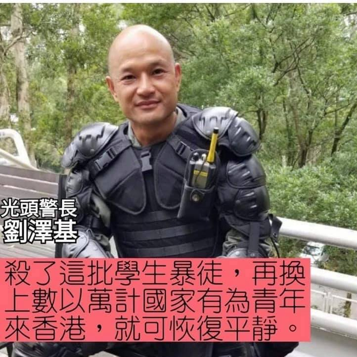
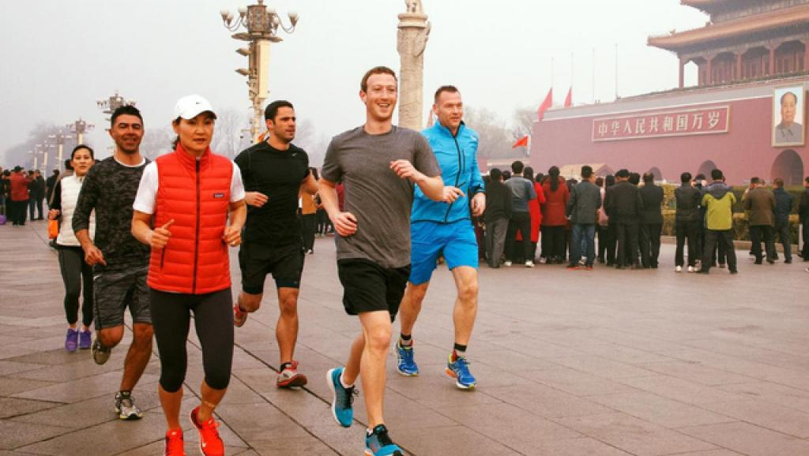
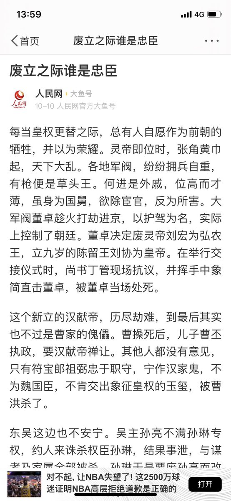
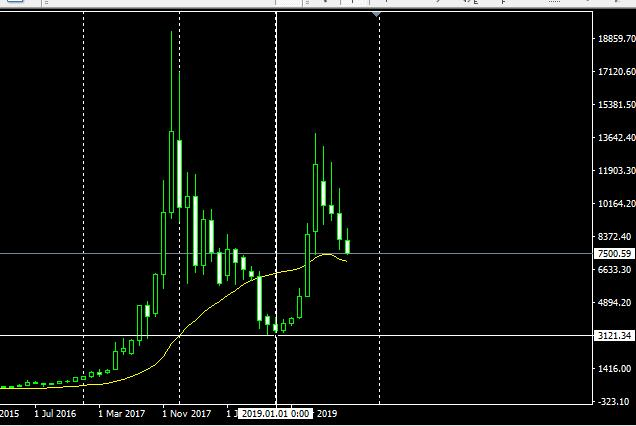

[10月25日 06:30]    BBC News 中文   @bbcchinese    彭斯定位中国为美国的“经济与战略对手”，但强调华盛顿并不希望与中国起冲突、或制约中国，只是谋求“公平竞争”。
 https://bbc.in/360pWmm   :speech_balloon:评:1 :+1:赞:5 :globe_with_meridians:转:0  

[10月25日 06:08]    新闻大吐槽   @TuCaoFakeNews    港人有情有義！  :speech_balloon:评:0 :+1:赞:7 :globe_with_meridians:转:4  

[10月25日 06:04]    新闻大吐槽   @TuCaoFakeNews    小粉红：是暴徒干的！  :speech_balloon:评:0 :+1:赞:1 :globe_with_meridians:转:1  

[10月25日 05:13]    老司机   @h5lpykl7tp6jjop    要说穷，它们满世界撒币，出钱请黑文盲来读大学，造军舰如下饺子，
要说富，它们抢百姓土地，连摆小摊卖水果蔬菜都抢，连骑电瓶车都不放过，
一个野蛮恐怖政权，一群愚昧懦弱的百姓，居然要指挥文明世界，
抵制世界各国，特别的自信，特别的牛逼，究竟是谁给它的胆子？马克思加上中国传统文化的精髓吗  :speech_balloon:评:1 :+1:赞:28 :globe_with_meridians:转:11  

[10月25日 04:50]    老司机   @h5lpykl7tp6jjop    中国十四亿人，每十四人中就有一个是排名全球前10％的富人？真的有这么多富人了？  :speech_balloon:评:2 :+1:赞:0 :globe_with_meridians:转:0  

[10月25日 04:47]    新闻大吐槽   @TuCaoFakeNews    沒做錯怕誰，老闆讚  :speech_balloon:评:0 :+1:赞:23 :globe_with_meridians:转:8  

[10月25日 04:39]    新闻大吐槽   @TuCaoFakeNews    讽刺 https://twitter.com/tucaofakenews/status/1186443477032157184 …  :speech_balloon:评:0 :+1:赞:4 :globe_with_meridians:转:1  

[10月25日 04:38]    新闻大吐槽   @TuCaoFakeNews    公道在人间!美心，黑心!  :speech_balloon:评:0 :+1:赞:4 :globe_with_meridians:转:1  

[10月25日 04:32]    新闻大吐槽   @TuCaoFakeNews    這就是香港人滴正義 良知 與 民意  :speech_balloon:评:0 :+1:赞:3 :globe_with_meridians:转:1  

[10月25日 04:28]    新闻大吐槽   @TuCaoFakeNews    老子排隊吃東西不犯法吧？  :speech_balloon:评:0 :+1:赞:1 :globe_with_meridians:转:1  

[10月25日 03:39]    新闻大吐槽   @TuCaoFakeNews    凡是亲共者，必然表现出暴力和愚蠢，已经在世界范围内得到了验证！ https://twitter.com/dopjcs8kzsj6w8r/status/1187306189324898304 …  :speech_balloon:评:0 :+1:赞:11 :globe_with_meridians:转:6  

[10月25日 03:33]    新闻大吐槽   @TuCaoFakeNews    黎巴嫩人不推翻腐败政府，誓不罢休！
为何世界人民瘀积的不满都在今年爆发，俨然成了一个谜题！  :speech_balloon:评:10 :+1:赞:99 :globe_with_meridians:转:37  

[10月25日 03:22]    新闻大吐槽   @TuCaoFakeNews    彭斯释放明确挺港信号：在过去几个月中，几百万香港人为了保护自己的正当权益，而进行的和平抗议鼓舞了美国人，我们站在香港人这边！  :speech_balloon:评:2 :+1:赞:52 :globe_with_meridians:转:16  

[10月25日 03:11]    新闻大吐槽   @TuCaoFakeNews    给抗争者提供免费餐的良心餐厅「龙门冰室」昨天被黑社会砸了，市民念这家餐厅的好，在店门口排起了长队，希望用自己的行动来支持有正义感的餐厅！

亲共的美心月饼被砸后，从未听说，有人自发为这家爱国店铺做点什么，看来所谓的爱国更多是谋私利而不顾公义，蓝丝是个伪命题  :speech_balloon:评:18 :+1:赞:378 :globe_with_meridians:转:155  

[10月25日 02:58]    新闻大吐槽   @TuCaoFakeNews     https://twitter.com/i/status/1160923613563744258 …  :speech_balloon:评:0 :+1:赞:6 :globe_with_meridians:转:4  

[10月25日 02:22]    新闻大吐槽   @TuCaoFakeNews    最後她做到了,能慢慢改變藍絲正視問題出在哪方,
兄弟爬山 ,各自努力   :speech_balloon:评:0 :+1:赞:4 :globe_with_meridians:转:1  

[10月25日 01:46]    老司机   @h5lpykl7tp6jjop    上中学的时候读《苛政猛于虎》，说孔子过泰山看见妇人哭坟，因父舅夫子均死于虎口却不离去，孔子叹：苛政猛于虎！二千多年了，中国苛政仍猛于虎，只是没有深山可躲，只得往外逃，2000年英国多佛港发现58人被闷死在偷渡的货柜车中，今天又是39人死在货柜车中！拚死外逃掙钱的中国多么强大多么富裕！  :speech_balloon:评:1 :+1:赞:15 :globe_with_meridians:转:9  

[10月25日 01:41]    新闻大吐槽   @TuCaoFakeNews     https://twitter.com/TuCaoFakeNews/status/1187343006405255171?s=19 …  :speech_balloon:评:0 :+1:赞:2 :globe_with_meridians:转:1  

[10月25日 00:57]    BBC News 中文   @bbcchinese    英国首相约翰逊表示，他将给予议员们更多时间辩论脱欧问题，但条件是他们必须同意在12月12日举行大选。
 https://bbc.in/361DC0r   :speech_balloon:评:0 :+1:赞:12 :globe_with_meridians:转:4  

[10月25日 00:29]    财经真相   @caijingxiang    彭斯演讲一句话总结：软硬兼施，最后通牒！  :speech_balloon:评:47 :+1:赞:414 :globe_with_meridians:转:59  

[10月25日 00:26]    凡賽堤/FORSETI   @FecharCCP    緊急找尋  :speech_balloon:评:0 :+1:赞:6 :globe_with_meridians:转:5  

[10月24日 23:58]    凡賽堤/FORSETI   @FecharCCP    何韻詩！香港女兒，華人的典範，華人21世紀的巾幗英雄，華人最完美的最值得華人崇拜的國際巨星！！！  :speech_balloon:评:0 :+1:赞:38 :globe_with_meridians:转:14  

[10月24日 23:55]    财经真相   @caijingxiang    伍德罗·威尔逊国际学者中心是世界排名前15的智库，该中心主要项目包括：历史与公共政策项目、冷战国际史项目、朝鲜国际文件研究项目。2011年，威尔逊中心与华东师范大学合作开展冷战史研究，并在威尔逊中心成立了“华东师大—威尔逊中心冷战研究美国工作室”。  :speech_balloon:评:4 :+1:赞:27 :globe_with_meridians:转:16  

[10月24日 23:44]    凡賽堤/FORSETI   @FecharCCP    華人歷史上將永久記住這一刻，
2019年6月9日以來當香港人超過200萬人向政府提出訴求，
用最文明，最和平，最友好的方式遊行，而政府卻用最暴力，最兇殘，最卑鄙的手段僱傭黑社會組織和在職警察，以及大陸警察，武警，部隊喬裝成黑衣人在香港全社會進行大規模暗殺，暴打市民，破環公共設施等嫁禍給港人  :speech_balloon:评:3 :+1:赞:96 :globe_with_meridians:转:55  

[10月24日 23:26]    凡賽堤/FORSETI   @FecharCCP    一个出生于吉林的80多岁老太婆，在2018年2月，个人居然拥有800万亿授信额度！！！！！

王岐山这伙盗国贼们，准备把中共国这艘船彻底凿沉吗？ https://twitter.com/YAHUIZHANG9/status/1187312938287161344 …  :speech_balloon:评:3 :+1:赞:27 :globe_with_meridians:转:26  

[10月24日 23:18]    GFHG SDKM   @zyx_yny    A young man singing #願榮光歸香港 in #Central but the #HongKongPolice yelled at him and stopped him singing that song. I don't think that young man has done wrong to sing in the public?! 
#StandWithHK
#StandWithHongKong  :speech_balloon:评:50 :+1:赞:438 :globe_with_meridians:转:350  

[10月24日 22:45]    新闻大吐槽   @TuCaoFakeNews    那些催泪弹，蓝毒水不仅伤害港人，还会伤害流浪小动物的，小鸟，鱼，各种植物的，会严重破坏香港的生态。保皇派们你们以后都去北京不用住香港吗？ https://twitter.com/tucaofakenews/status/1187343006405255171 …  :speech_balloon:评:1 :+1:赞:13 :globe_with_meridians:转:4  

[10月24日 22:05]    新闻大吐槽   @TuCaoFakeNews    國內群眾被黨強姦連聲都不能出。上訪到天邊也沒有人會管。於是良心好點的選擇出逃，良心壞點的就去欺負別人賺取錢財。完全是劣勝優汰的一個過程。  :speech_balloon:评:0 :+1:赞:7 :globe_with_meridians:转:4  

[10月24日 21:19]    新闻大吐槽   @TuCaoFakeNews    Truth speak louder than propaganda.

Once the information barrier begin to be demolished, even the dark blue one can be transferred.

But what a tough road this lady walked.  :speech_balloon:评:0 :+1:赞:2 :globe_with_meridians:转:1  

[10月24日 21:12]    GFHG SDKM   @zyx_yny    JUST IN:
[Barcelona] Chinese with Five-starred Red Flags snatched a signage written "Liberate Hong Kong, the revolution of our times" (光復香港，時代革命) from a Catalan woman who supports the Hong Kong protests.

They tore her signage apart and attempted to kick her.

#Chinazi  :speech_balloon:评:73 :+1:赞:632 :globe_with_meridians:转:561  

[10月24日 21:01]    新闻大吐槽   @TuCaoFakeNews    、@zhanyoutongmeng
@hNeBHUlLJhBbwFH
@Today__China
@RXDSv1EwYcmq0cU
@chenmezhisheng
@TG6UlUmEtXFNRNH
@TuCaoFakeNews
@VOAChinese
@Mrdoorvpn
@goldenp11462989
@CCP_is_devil https://twitter.com/Anonymouspc2020/status/1187352981492006912 …  :speech_balloon:评:2 :+1:赞:7 :globe_with_meridians:转:5  

[10月24日 21:00]    纽约时报中文网   @nytchinese    美国外交元老谈香港：中美双方都自以为是 https://nyti.ms/2pOZJ9C   :speech_balloon:评:17 :+1:赞:30 :globe_with_meridians:转:14  

[10月24日 20:26]    GFHG SDKM   @zyx_yny    WOW. 

Republican or Democrat, we shouldn’t let #China’s thuggish, #OrganHarvesting, #ConcentrationCamp-building, #HumanRights-violating, IP stealing, trade cheating Communist regime talk about @SpeakerPelosi — or ANY other American leader — this way. https://twitter.com/globaltimesnews/status/1187341782687707142 …  :speech_balloon:评:78 :+1:赞:570 :globe_with_meridians:转:353  

[10月24日 20:25]    GFHG SDKM   @zyx_yny    Catalans are singing "Glory To Hong Kong" in front of Chinese Consulate-General in Barcelona in the "Catalonia-Hong Kong Solidaritat Amb Hong Kong" Assembly. Thank you so much! #StandWithHongKong #StandUpForCatalonia  :speech_balloon:评:91 :+1:赞:2416 :globe_with_meridians:转:1316  

[10月24日 20:20]    新闻大吐槽   @TuCaoFakeNews    一个黄丝女嫁给了一个蓝丝警！而更夸张的是，娘家人全是深黄，而婆家人都是深蓝！

夫妻的小天地成了两个家族的冲突前线，如同武侠小说里正派女主角爱上了魔道头子，他们的爱情牵连着正邪两派。

极权造成的裂痕，有时候在领土，有时候在族群，有时候是在一张小小的双人床！  :speech_balloon:评:16 :+1:赞:266 :globe_with_meridians:转:111  

[10月24日 20:05]    BBC News 中文   @bbcchinese    【世界上最长途的赛马活动蒙古德比】蒙古德比是世界上最长途的赛马活动。赛事全程1000公里，骑师每日骑行14小时，为期10天。有多少骑师能够完成整个赛事？ https://bbc.in/2JhXAKt   :speech_balloon:评:2 :+1:赞:12 :globe_with_meridians:转:2  

[10月24日 20:00]    纽约时报中文网   @nytchinese    通过研究这些遭遇动荡的国家，专家发现了一种更深层次的模式：在民主让人感到失望、腐败问题严重、少数阶级挥霍而年轻人生活贫困的国家，反对精英阶级的呼喊声会比通常更大。 https://nyti.ms/2oiisu0   :speech_balloon:评:11 :+1:赞:14 :globe_with_meridians:转:4  

[10月24日 19:31]    BBC News 中文   @bbcchinese    “伊斯兰国”一直以利用Facebook、YouTube和Twitter平台散播资讯著称，不过这似乎是他们第一次利用抖音海外版TikTok。 https://bbc.in/33WmU0x   :speech_balloon:评:20 :+1:赞:47 :globe_with_meridians:转:10  

[10月24日 19:30]    纽约时报中文网   @nytchinese    傅立民：香港的和平示威者现在不是在捍卫民主，而是要求更多的民主，要求香港的权贵阶级和当局多加考虑普通民众的问题。但随着对抗不断升级，讨论已经变得不可能。
暴力示威者不应该受到外国同情。他们没有捍卫“港人治港”的原则，而是在引致“港人灭港”。 https://nyti.ms/2pOZJ9C   :speech_balloon:评:13 :+1:赞:12 :globe_with_meridians:转:3  

[10月24日 19:19]    纽约时报中文网   @nytchinese    更新：英国警方周四表示，39名死者据信均为中国公民，其中八人为女性，31人为男性。 http://nyti.ms/2Jjbdcv   :speech_balloon:评:15 :+1:赞:34 :globe_with_meridians:转:22  

[10月24日 19:12]    新闻大吐槽   @TuCaoFakeNews    这个哥们组织的加泰罗尼亚——香港连线活动，今晚参加者寥寥。

看来大多数抗争者都不想给外界造成香港的抗争与独立有关的印象。也再一次证明了，每个港人都是在独立思考后才慎重选择参加每次活动的。

毕竟五大诉求与独立无关，避免横生枝节是明智选择。  :speech_balloon:评:8 :+1:赞:70 :globe_with_meridians:转:20  

[10月24日 19:01]    BBC News 中文   @bbcchinese    中美贸易战影响数千亿美元商品，但全球贸易额超过25万亿美元，是直接受美国和中国关税影响产品价值的50倍以上。 https://bbc.in/2W8Xb2p   :speech_balloon:评:1 :+1:赞:12 :globe_with_meridians:转:4  

[10月24日 19:00]    纽约时报中文网   @nytchinese    部分特朗普政府官员以及美国工商界和科学界的不少人坚称，针对中国过于严格的限制带来的危险是将研究推向海外，从而削弱当初为美国带来技术优势的工商业。中国批评人士则说，北京是必须解决的重大安全威胁。 https://nyti.ms/32IGXiY   :speech_balloon:评:10 :+1:赞:23 :globe_with_meridians:转:5  

[10月24日 18:59]    墙国铁拳现世报😷   @Socialistfist    Facebook CEO 可能是目前为止吃到铁拳中身价最高的了。他学习中文，看习近平著作，到天安门跑步。
花了5年时间他和他的团队才弄明白中国“从来不让我们进入”。
#社会主义铁拳  :speech_balloon:评:62 :+1:赞:806 :globe_with_meridians:转:128  

[10月24日 18:30]    纽约时报中文网   @nytchinese    美国资深外交官傅立民：大陆对火箭队总经理言论的反应是一种中国式政治正确的实例，过于敏感、没习惯新财富和强大的中国人试图对那些使用“敏感词”的人下主观判断，将之视为“搞小动作”。中国很难适应这样一个事实：作为一个曾经令人敬畏的大国，宽宏大量比敏感多疑的好处更大。 https://nyti.ms/2pOZJ9C   :speech_balloon:评:5 :+1:赞:18 :globe_with_meridians:转:6  

[10月24日 18:07]    BBC News 中文   @bbcchinese    详细报道：英集装箱惨案39名死者“初步据信为中国公民” http://bbc.in/2PgnLoI   :speech_balloon:评:48 :+1:赞:89 :globe_with_meridians:转:61  

[10月24日 18:04]    BBC News 中文   @bbcchinese    据了解，英国埃塞克斯郡集装箱藏尸案中的39名死者，初步相信为中国公民。  :speech_balloon:评:157 :+1:赞:264 :globe_with_meridians:转:154  

[10月24日 18:00]    纽约时报中文网   @nytchinese    今日图片：“不可能汉堡包”是一款由新一代人造素食肉制成的汉堡。
更多简报内容： https://nyti.ms/2qFZtdF   :speech_balloon:评:1 :+1:赞:8 :globe_with_meridians:转:2  

[10月24日 17:32]    墙国铁拳现世报😷   @Socialistfist    补图  :speech_balloon:评:12 :+1:赞:70 :globe_with_meridians:转:12  

[10月24日 17:31]    墙国铁拳现世报😷   @Socialistfist    发酵快半年的汉能讨薪事件波及到了开国大典总负责人外孙。
前脚祝福祖国母亲生日快乐，
后脚希望祖国母亲主持公道。

#社会主义铁拳  :speech_balloon:评:32 :+1:赞:257 :globe_with_meridians:转:95  

[10月24日 17:27]    老司机   @h5lpykl7tp6jjop    这究竟该相信那个数据，一会儿说中国有 l 亿富人？己超过美国？一会儿又说有5．6亿零存款，搞不懂你们究竟想说什么？大家分析分析！  :speech_balloon:评:5 :+1:赞:19 :globe_with_meridians:转:10  

[10月24日 17:15]    纽约时报中文网   @nytchinese    在智利，地铁票价的上涨激起了人们的愤怒狂潮；在黎巴嫩，人们因政府对WhatsApp语音通话征税而走上街头；在沙特阿拉伯，政府对水烟筒收税的决定引发了不满；在印度，人们关心的则是餐桌上的洋葱。
为什么这些原本看似微不足道的事件会点燃全球抗议的怒火？ https://nyti.ms/2oiisu0   :speech_balloon:评:80 :+1:赞:214 :globe_with_meridians:转:80  

[10月24日 17:01]    BBC News 中文   @bbcchinese    石虎是台湾动物保育的明星！牠的濒临绝种如何象征台湾环境危机呢？科技又怎么介入呢？ https://bbc.in/2WbbC5O   :speech_balloon:评:4 :+1:赞:28 :globe_with_meridians:转:11  

[10月24日 16:31]    老司机   @h5lpykl7tp6jjop    网恋女人毒性有多大？
七十岁澳洲老头受中国小三勾引，做下杀妻骗保惊人罪案，得手1．5亿澳元后罪情暴露，最终在阿德莱德机场警方将Peter正式拘捕！Peter手中正握着前往中国的机票，想来是准备去见聊骚网友了…在Peter的行李箱里，警方发现了一整箱避孕套，同时还有伟哥药物、性玩具和千奇百怪的内衣…  :speech_balloon:评:9 :+1:赞:39 :globe_with_meridians:转:19  

[10月24日 16:30]    纽约时报中文网   @nytchinese    #每日一词 lynching（私刑）一词最早来自于19世纪中期的“林奇法”(Lynch's law)，以威廉·林奇上尉的名字命名。在独立战争时期，他曾于弗吉尼亚州自行组建司法法庭，在正式法庭之外寻求“正义”。如今，对于针对自己的弹劾调查，特朗普宣称这是一场死刑。 https://nyti.ms/2MHQnG0   :speech_balloon:评:12 :+1:赞:15 :globe_with_meridians:转:4  

[10月24日 16:01]    BBC News 中文   @bbcchinese    警方最新调查显示，在伦敦附近发现载有39具尸体的集装箱可能不是来自保加利亚，卡车拖车也并非一同入境。 https://bbc.in/36aWQ3U   :speech_balloon:评:13 :+1:赞:27 :globe_with_meridians:转:7  

[10月24日 16:00]    纽约时报中文网   @nytchinese    #观点 研究显示，尽管无数人企图将薪酬差距说成是“信心差距”，但女性要求加薪的次数和男性一样多。她们只是没得到而已。
也许我们不该让女人争着去满足男人的标准，而应该训练男人发扬恭顺、谦逊等品质。许多最紧迫的社会问题都是男人过度自信造成的。 https://nyti.ms/31I5nb9   :speech_balloon:评:6 :+1:赞:16 :globe_with_meridians:转:6  

[10月24日 15:36]    老司机   @h5lpykl7tp6jjop    关于猪的讲话  :speech_balloon:评:1 :+1:赞:10 :globe_with_meridians:转:8  

[10月24日 15:31]    BBC News 中文   @bbcchinese    “他们也不知道，原来大陆人也有支持这场运动的，不是所有人都是『小粉红』。” https://bbc.in/363LazB   :speech_balloon:评:235 :+1:赞:452 :globe_with_meridians:转:127  

[10月24日 15:30]    纽约时报中文网   @nytchinese    周三凌晨，英国警方在伦敦东部工业园区的一辆卡车中发现了39具尸体，并以涉嫌谋杀的罪名逮捕了来自北爱尔兰的司机。目前尚不清楚死者的身份及死因，但有迹象表明卡车的行驶轨迹与移民偷渡的常见路线相吻合。 https://nyti.ms/2Jjbdcv   :speech_balloon:评:26 :+1:赞:69 :globe_with_meridians:转:39  

[10月24日 15:00]    BBC News 中文   @bbcchinese    如果欧盟确认将英国脱欧日期延迟到2020年新年，英国首相约翰逊表示将寻求提前大选。 https://bbc.in/31IeSqG   :speech_balloon:评:3 :+1:赞:20 :globe_with_meridians:转:8  

[10月24日 15:00]    纽约时报中文网   @nytchinese    香港抗议导火索案件嫌疑人出狱，港台争论难休  https://nyti.ms/2JeTz9D https://twitter.com/ccni/status/1187182433629802497 …  :speech_balloon:评:10 :+1:赞:5 :globe_with_meridians:转:0  

[10月24日 14:30]    纽约时报中文网   @nytchinese    #观点 希望扩大对华食品出口的国际农业企业已经在巴西一些最不发达地区进行了大量投资，导致以前的丛林地区变成了富裕的城市。一些专家将中国的需求与此前亚马孙的森林砍伐联系起来，称之为“中国因素”。 https://nyti.ms/32EWRej   :speech_balloon:评:39 :+1:赞:45 :globe_with_meridians:转:20  

[10月24日 14:04]    老司机   @h5lpykl7tp6jjop     陳秋實：呼籲香港法律界，絕不能讓陳同佳離開香港！
基於保護管轄原則，香港對於陳同佳涉嫌殺人一案是有管轄權的，請香港法律界秉承法律良知，在捍衛香港司法主權的同時還死者一個公道。法律問題，請政客們走開。
 https://youtu.be/AiqgBh5qSTo   :speech_balloon:评:228 :+1:赞:1725 :globe_with_meridians:转:741  

[10月24日 14:04]    GFHG SDKM   @zyx_yny     陳秋實：呼籲香港法律界，絕不能讓陳同佳離開香港！
基於保護管轄原則，香港對於陳同佳涉嫌殺人一案是有管轄權的，請香港法律界秉承法律良知，在捍衛香港司法主權的同時還死者一個公道。法律問題，請政客們走開。
 https://youtu.be/AiqgBh5qSTo   :speech_balloon:评:228 :+1:赞:1725 :globe_with_meridians:转:741  

[10月24日 14:00]    财经真相   @caijingxiang    人民网：废立之际谁是忠臣！  :speech_balloon:评:73 :+1:赞:309 :globe_with_meridians:转:116  

[10月24日 14:00]    纽约时报中文网   @nytchinese    在傅立民看来，《香港人权与民主法案》并不会给北京带来太大压力，它的意图是确保香港能维持“一国两制”——这符合美国的利益；但一些美国官员需要明白“沉默是金”的道理。在谈到NBA事件时，他认为中美双方都自以为是，但中国需要适应这样一个事实：宽宏大量比敏感多疑好处更大。 https://nyti.ms/2pOZJ9C   :speech_balloon:评:15 :+1:赞:17 :globe_with_meridians:转:1  

[10月24日 13:54]    财经真相   @caijingxiang    新华视点：中共中央政治局会议决定，中国共产党第十九届中央委员会第四次全体会议于10月28日至31日在北京召开。  :speech_balloon:评:26 :+1:赞:133 :globe_with_meridians:转:52  

[10月24日 13:03]    BBC News 中文   @bbcchinese    1916年墨西哥革命家比利亚率军入侵美国南部边陲小镇，近百年后墨西哥马队再次跨越边界，但不是入侵而是纪念游行。 https://bbc.in/2BAnZyX   :speech_balloon:评:2 :+1:赞:13 :globe_with_meridians:转:4  

[10月24日 13:00]    纽约时报中文网   @nytchinese    今日食谱：烤肠、甜葡萄和醋蘸洋葱的绝妙搭配。
更多简报内容： https://nyti.ms/2qFZtdF   :speech_balloon:评:2 :+1:赞:7 :globe_with_meridians:转:0  

[10月24日 12:40]    财经真相   @caijingxiang    如果购买比特币，要靠谱的渠道！  :speech_balloon:评:24 :+1:赞:43 :globe_with_meridians:转:5  

[10月24日 12:30]    纽约时报中文网   @nytchinese    #每日一词 lynching
美国总统特朗普周二发推称，民主党对他的弹劾调查是“一场私刑”(a lynching)。由于“lynching”一词让人联想起从1800年代到1968年期间长达数十年的白人暴民谋杀黑人的种族主义历史，特朗普的这一用词选择掀起了一场舆论风暴。 https://nyti.ms/2MHQnG0   :speech_balloon:评:7 :+1:赞:20 :globe_with_meridians:转:5  

[10月24日 12:15]    BBC News 中文   @bbcchinese    英国首相约翰逊表示“震惊”，并说必须把幕后黑手追寻到底。 https://bbc.in/31GjE80   :speech_balloon:评:10 :+1:赞:28 :globe_with_meridians:转:13  

[10月24日 12:00]    纽约时报中文网   @nytchinese    #智慧生活 警惕“无症状”的心脏病发作：人们总是认为心脏病发作是明显而极度痛苦的，但事实并非如此，数百万人曾经历过“无痛型心肌梗塞”，而这种情况相比典型的心梗发作来的更加危险。医生建议，高风险人士应定期接受检查，以防延误治疗。
更多简报内容： https://nyti.ms/2qFZtdF   :speech_balloon:评:2 :+1:赞:8 :globe_with_meridians:转:1  

[10月24日 11:59]    GFHG SDKM   @zyx_yny    Lovely to hang out with Hong Kong's Superwoman! @hoccgoomusic You have made us all so proud. Your songs are saving lives and fighting for freedom. That is the highest purpose that any artist can strive for. Godspeed Denise, and Godspeed Hong Kongers. <3 #HongKongProtest  :speech_balloon:评:92 :+1:赞:2004 :globe_with_meridians:转:428  

[10月24日 11:59]    BBC News 中文   @bbcchinese    英格兰东南部一个工业园区内一辆货柜车箱内发现39具尸体，警方正在辨识死者身份，货柜车司机涉嫌谋杀已被拘捕。 https://bbc.in/2pQnz5a   :speech_balloon:评:28 :+1:赞:61 :globe_with_meridians:转:18  

[10月24日 11:33]    纽约时报中文网   @nytchinese    特朗普总统和他的许多高级顾问已将中国的技术野心视为对国家安全的威胁，希望限制美国销往海外的技术类型。但相关计划遭到了特朗普政府内部一些人的强烈反对，他们认为，限制太多可能会适得其反，并损害美国的工业。 https://nyti.ms/32IGXiY   :speech_balloon:评:18 :+1:赞:30 :globe_with_meridians:转:9  

[10月24日 11:24]    老司机   @h5lpykl7tp6jjop    警察10.20之夜在朗豪坊對出清場時 與一名老人發生交集  :speech_balloon:评:1 :+1:赞:34 :globe_with_meridians:转:25  

[10月24日 11:00]    纽约时报中文网   @nytchinese    • 据报道，金正恩在视察朝韩两国共同经营的金刚山观光区时，批评了金刚山共建这一“前任的错误政策”。
• 狮航空难调查结果：印尼国家运输安全委员会表示，空难是由波音737 Max飞机的系统性设计缺陷引起的，而机组人员的失误又加剧了这一缺陷。
更多简报内容： https://nyti.ms/2qFZtdF   :speech_balloon:评:2 :+1:赞:1 :globe_with_meridians:转:1  

[10月24日 10:30]    纽约时报中文网   @nytchinese    从《香港人权与民主法案》到美国对中国外交官设限，日益紧张的中美关系似乎变得更糟糕了。对此，美国资深外交官傅立民(Chas Freeman)认为中美双方都应该保持克制，不可放纵于情绪。他近日接受了纽约时报中文网的访问，对香港乱局、NBA争议下的中美关系发表了自己的看法。 https://nyti.ms/2pOZJ9C   :speech_balloon:评:56 :+1:赞:101 :globe_with_meridians:转:25  

[10月24日 10:28]    凡賽堤/FORSETI   @FecharCCP    【連登尋人】張友恆，現居九龍城，8月31日有參加遊行，9月3日突然退出所有Whatsapp群組，已經失蹤1個多月，公司薪金也沒有領取。  :speech_balloon:评:7 :+1:赞:244 :globe_with_meridians:转:261  

[10月24日 10:00]    BBC News 中文   @bbcchinese    你想到这些城市旅游吗？小心有可能精神病发作！ https://bbc.in/2JePd2p   :speech_balloon:评:9 :+1:赞:26 :globe_with_meridians:转:7  

[10月24日 09:28]    财经真相   @caijingxiang    中国央行今日开展600亿元逆回购操作，因今日无逆回购到期，当日实现净投放600亿元。加上2500亿MLF和其他逆回购操作，本周截至目前，中国央行公开市场累计净投放达5600亿元。  :speech_balloon:评:17 :+1:赞:179 :globe_with_meridians:转:48  

[10月24日 09:04]    凡賽堤/FORSETI   @FecharCCP    香港6.9以來出現人類文明社會史上的世界第一，
最文明的和平遊行世界第一
（井然有序，城市衛生等）
人口規模最大的遊行世界第一 
（203萬人遊行，總人口700-730萬）
遊行過程出現自發自願醫療救護人員世界首創！
香港人，給全世界的華人創下了歷史最偉大的榜樣！
香港人，給全世界華人未來帶來的希望  :speech_balloon:评:5 :+1:赞:69 :globe_with_meridians:转:48  

[10月24日 08:35]    凡賽堤/FORSETI   @FecharCCP    緊急找尋其家人和律師  :speech_balloon:评:0 :+1:赞:6 :globe_with_meridians:转:7  

[10月24日 08:30]    BBC News 中文   @bbcchinese    北京香山论坛落下帷幕。虽然会议气氛总体友好，但台湾和南海问题依然是一个讨论焦点。中美如何管控冲突风险？
 https://bbc.in/2N8v3bn   :speech_balloon:评:11 :+1:赞:13 :globe_with_meridians:转:2  

[10月24日 07:52]    老司机   @h5lpykl7tp6jjop    撑港人抗争的龍門冰室，昨天被黑社会砸了！
不用猜也知道，十有八九又是何君尧这些烂人在捣鬼~

同样是砸铺：
勇武是反抗极权，直面不公；
而官黑勾结，是依仗极权，维持不公！

总之，一次失败的浑水摸鱼、穿帮的cosplay，香港光复后，都将入罪~  :speech_balloon:评:29 :+1:赞:328 :globe_with_meridians:转:187  

[10月24日 07:51]    GFHG SDKM   @zyx_yny    John Quincy Adams: Wherever the standard of freedom is unfurled, there will be America’s prayers, there will be America’s benedictions, there will be America’s heart. Today, that place is Hong Kong #StandWithHK  :speech_balloon:评:1230 :+1:赞:8054 :globe_with_meridians:转:4522  

[10月24日 07:32]    财经真相   @caijingxiang    当当网李国庆半夜大新闻,大陆新闻的舆论焦点有了！今天彭斯演讲有调料中和了！  :speech_balloon:评:22 :+1:赞:108 :globe_with_meridians:转:24  

[10月24日 07:30]    BBC News 中文   @bbcchinese    俄非峰会被认为是莫斯科非洲政策的转折点，标志俄罗斯将重返非洲大陆，与中国和西方展开竞争。
 https://bbc.in/31GtDKv   :speech_balloon:评:9 :+1:赞:18 :globe_with_meridians:转:7  

[10月24日 06:30]    BBC News 中文   @bbcchinese    英格兰被旅游指南《孤独星球》列为2020年世界第二位最佳旅游地区和国家。BBC告诉你为什么。
 https://bbc.in/32IfC0m   :speech_balloon:评:7 :+1:赞:32 :globe_with_meridians:转:14  

[10月24日 04:57]    老司机   @h5lpykl7tp6jjop    毛贼给中共留下来的不是什么狗屁革命理论，而是最恐怖的中共的组织系统！它把所有中国人密不透风的监控起来，每个人都受到威胁和恐吓，它们随时可以取消你的所有的生存权利，你无法反抗，因为这会连累你的家人朋友，它们秘密建立档案资料记录你的言行举止，一直跟踪到你死也不销毁，所以中国人不敢反抗  :speech_balloon:评:1 :+1:赞:59 :globe_with_meridians:转:10  

[10月24日 04:07]    老司机   @h5lpykl7tp6jjop    感谢这些香港有良心的医务人员，一直在秘密地治疗着受伤的抗议者，这是采访的一位地下医生，我加了中文字幕，谢谢你们。  :speech_balloon:评:60 :+1:赞:1489 :globe_with_meridians:转:845  

[10月24日 04:04]    老司机   @h5lpykl7tp6jjop    早有今天这么痛快，何必惹出这么多麻烦！五分钟能解决的事情，搞了五个月！死了这么多人，抓了这么多人！惹出天大的祸！谁来解决现在这么多大问题！这就是猪头治国的毛病，开始拍胸口，然后拍脑袋，最后拍屁股！  :speech_balloon:评:1 :+1:赞:21 :globe_with_meridians:转:8  

[10月24日 03:39]    老司机   @h5lpykl7tp6jjop    天朝太奇葩，竟然在地铁里逼着女士卸妆！官方说是浓妆太惊悚，会造成恐慌！
如此说，女士们最好都打扮成ccav女主持一般「端庄」的样子，社会就和谐了！
以后化妆术这种东西必须国家垄断，无论是烟熏妆，还是政治化妆！  :speech_balloon:评:41 :+1:赞:197 :globe_with_meridians:转:109  

[10月23日 21:59]    BBC News 中文   @bbcchinese    进太空执行任务，男女都可胜任，但女性是否需要为此付出和承受更多？ https://bbc.in/2BCGhj6   :speech_balloon:评:4 :+1:赞:17 :globe_with_meridians:转:4  

[10月23日 21:44]    财经真相   @caijingxiang    新华社：国务院总理李克强20日下午在钓鱼台养源斋会见美国前财政部长保尔森。李克强积极评价保尔森基金会为推动中美关系发展，促进两国务实合作方面所做工作，希望基金会继续发挥中美友好的纽带作用，为促进中美关系健康稳定发展作出不懈努力。两个“赵家人”代表中美进行会谈！  :speech_balloon:评:7 :+1:赞:72 :globe_with_meridians:转:15  

[10月23日 21:13]    财经真相   @caijingxiang    比特币第二轮崩盘中，上一波最低跌到3000美元，这一波怎么着也要跌到5000美元！  :speech_balloon:评:34 :+1:赞:153 :globe_with_meridians:转:35  

[10月23日 21:01]    BBC News 中文   @bbcchinese    睡觉前一个小时远离手机荧幕，你做得到吗？ https://bbc.in/2PbiSxe   :speech_balloon:评:16 :+1:赞:78 :globe_with_meridians:转:21  

[10月23日 19:25]    GFHG SDKM   @zyx_yny    唔止ban鳩你Twitter account
香港人直情想ban咗你成個人 ban鳩你成個人生啊  :speech_balloon:评:0 :+1:赞:0 :globe_with_meridians:转:0  

[10月23日 19:14]    GFHG SDKM   @zyx_yny    Dear : 

Only a photo can't tell how beautiful #HongKong is.

Thanks for the magician like producer to demonstrate such impressive views of our home

Full video:  https://youtu.be/gYO1uk7vIcc  by TimeLab Pro

#香港の写真を何の説明もなく上げてみる #HongKongProtest  :speech_balloon:评:8 :+1:赞:298 :globe_with_meridians:转:156  

[10月23日 17:22]    老司机   @h5lpykl7tp6jjop    这是搞什么鬼！  :speech_balloon:评:0 :+1:赞:3 :globe_with_meridians:转:0  

[10月23日 15:13]    老司机   @h5lpykl7tp6jjop    稅率第一、稅种第一、稅收第一，油價世界第一高，过路费世界第一多，又沒有实行免費医疗、免費教育、国家養老，你他媽告诉我们財政沒錢？

第一次听說全國財政吃緊
是很正常的現象。（转）  :speech_balloon:评:37 :+1:赞:366 :globe_with_meridians:转:229  

[10月23日 15:11]    财经真相   @caijingxiang    【推荐一个恶搞MV—你是我的习大大】我們不再怕美帝，每年都漲ＧＤＰ，中國有個偉大主席 
手機照片全是你，硬盤放的都是你，讓我們每天向你學習 
中華女兒非你不嫁因為你帥氣，外國勢力把你抹黑你都不生氣 
日本鬼子來了他們不敢放個屁，誰人罵你我就馬上操！他！媽！B https://www.youtube.com/watch?v=PCimU5x25ic …  :speech_balloon:评:23 :+1:赞:392 :globe_with_meridians:转:114  

[10月23日 13:06]    GFHG SDKM   @zyx_yny    Our beautiful team who made the miracle happen. Thank you the organizers, contributors, volunteers... every single one  We Love HK. We Fight Together. 
#StandWithHongKong #TheNorth #NBATwitter  #nba  #Raptors #Toronto #nbaopeningnight #SupportHongKong #HongKongProtests  :speech_balloon:评:777 :+1:赞:5623 :globe_with_meridians:转:3251  

[10月23日 12:26]    GFHG SDKM   @zyx_yny    the best clip to start the NBA season is this kid baiting the broadcast into flashing a "Fight for freedom stand with Hong Kong" sign on TV and then the cameraman pans away  :speech_balloon:评:1956 :+1:赞:230918 :globe_with_meridians:转:62196  

[10月23日 08:44]    GFHG SDKM   @zyx_yny    在中国没有一个人是安全的，共产党的治理体制就是一部黑暗残酷的绞肉机。  :speech_balloon:评:7 :+1:赞:103 :globe_with_meridians:转:31  

[10月23日 08:23]    财经真相   @caijingxiang    北京成为外汇消耗最多地区是可以理解，因为中国外汇花费最多的就是政府，尤其是货物贸易采购达到-1730.72亿美元，但是最让人难以理解的是上海，服务贸易逆差比货物逆差还多，是不是可以理解为上海才是中国资本外逃最大的地区！最后还有一个规律，那就是每当中美贸易缓和时，银行结售汇就会转为正！  :speech_balloon:评:6 :+1:赞:147 :globe_with_meridians:转:46  

[10月23日 08:17]    财经真相   @caijingxiang    2019年1-8月银行结售汇-447.48亿美元，经常项目-438.69 
亿，其中货物贸易1111.66亿，服务贸易-1,331.77亿，收益和经常转移-218.58亿；就地区来看，北京是中国外汇逆差最大的地区达到-2098亿，上海以-1083.27位居第二位；外汇顺差最大来源地分别是浙江967.46、江苏850.77、广东
563.11、福建163.84 。  :speech_balloon:评:14 :+1:赞:285 :globe_with_meridians:转:146  

[10月23日 08:17]    老司机   @h5lpykl7tp6jjop    數十名喬裝警打砸縱火後，被記者追踪逃入廁所企圖換裝，傳媒在廁所包圍，防暴趕至將廁所包圍並保護這些打砸縱火的歹徒安全離開，並沒有拘捕，而是保護，記者追拍並問這群歹徒是否警員並喬裝黑衣市民，他們從廁所走出，己脫去了黑衣換上普通衣服。  :speech_balloon:评:60 :+1:赞:1269 :globe_with_meridians:转:1033  

[10月23日 08:07]    老司机   @h5lpykl7tp6jjop    明居正：台湾人需要明确的反共意识，看清谁是最大敌人

蓝营最大敌不是绿
绿营最大敌不是蓝
只有共同的最大敌——红...
明年选举
谁不反共谁就会落选

美国对中国无恶意，但对中共有
中国不是美国的敌人，但中共是美国的敌人
中共仍是台湾的敌人，还是自由世界的敌人...  :speech_balloon:评:26 :+1:赞:587 :globe_with_meridians:转:266  

[10月23日 07:03]    财经真相   @caijingxiang    美国众议院投票推动立法，要求空壳公司披露所有者信息并更新反洗钱规定。  :speech_balloon:评:7 :+1:赞:305 :globe_with_meridians:转:75  

[10月23日 01:49]    老司机   @h5lpykl7tp6jjop    @侯安扬HF 
三个以下情妇叫生活腐化，三个以上情妇叫生活糜烂。  :speech_balloon:评:4 :+1:赞:75 :globe_with_meridians:转:52  

[10月23日 00:57]    GFHG SDKM   @zyx_yny    「主人，我好辛苦，好驚呀．．．」
＂Master,  I feel uncomfortable and scared.＂

#香港 #HongKong #HongKongprotests #HKPoliceBrutality #Animal #Dog #AnimalAbuse #AnimalRights #HKPoliceTerrorism #SaveTheDogs #StandWithHongKong #policedog  :speech_balloon:评:74 :+1:赞:1490 :globe_with_meridians:转:1353  

[10月22日 20:13]    墙国铁拳现世报😷   @Socialistfist    網上有帖文指毛漢參與7月20日的守護香港集會，他澄清，幾個月前有人邀請他出席集會，他於台上是說希望香港恢復和平及希望政府了解年輕人多點。他強調自己不是「撐警」，稱現時才知道自己當時出席的場合是「撐警」集會，並說之後有其他「撐警」集會他都沒參加。
我相信他不是撐警～  :speech_balloon:评:5 :+1:赞:38 :globe_with_meridians:转:10  

[10月22日 17:59]    墙国铁拳现世报😷   @Socialistfist    补图  :speech_balloon:评:4 :+1:赞:112 :globe_with_meridians:转:13  

[10月22日 17:58]    墙国铁拳现世报😷   @Socialistfist    墙内一阵子狂喷  :speech_balloon:评:6 :+1:赞:60 :globe_with_meridians:转:12  

[10月22日 17:51]    墙国铁拳现世报😷   @Socialistfist    14年的战螂
15年的粉红
16年的愤青
17年的反贼
「我们终于还是成为了我们当初讨厌的人」

#社会主义铁拳  :speech_balloon:评:33 :+1:赞:354 :globe_with_meridians:转:112  

[10月22日 17:34]    财经真相   @caijingxiang    中国商务部：美商务部日前发布公告，称将自10月31日起对中国3000亿美元加征关税清单产品启动排除程序。如果排除申请得到批准，自2019年9月1日起已经加征的关税可以追溯返还。该消息公布后离岸人民币汇率几无波动！  :speech_balloon:评:29 :+1:赞:230 :globe_with_meridians:转:63  

[10月22日 15:36]    GFHG SDKM   @zyx_yny    尊重係中國人應有既素質，而香港人更需要一個識尊重人、尊重宗教既特首。
從小圈子選舉揀左林鄭咁無素質既人做特首就知制度有問題，解決方法只有真普選。

光復香港 時代革命
五大訴求 決一不可  :speech_balloon:评:2 :+1:赞:100 :globe_with_meridians:转:15  

[10月22日 12:24]    老司机   @h5lpykl7tp6jjop    香港人太有才了精闢！

共產黨是什麼

如果把歷史還原他們是一幫士匪
如果把謊言拆穿他們是一幫騙子
如果把財產公開他們是一幫強盜
如果把帳目公開他們是一幫小偷
如果將他們的國籍公開他們全部是漢奸
如果把地圖打開他們是一幫賣國賊
如果將血腥運動揭開他們是種族滅絕屠夫
@realDonaldTrump  :speech_balloon:评:12 :+1:赞:370 :globe_with_meridians:转:202  

[10月22日 10:17]    财经真相   @caijingxiang    最新猪肉行情：猪肉价格再次迎来大涨，想做腊肉无望！  :speech_balloon:评:53 :+1:赞:290 :globe_with_meridians:转:100  

[10月22日 04:35]    GFHG SDKM   @zyx_yny    Thank you so much to wonderful #HKers in London! We are going to fill the Public Gallery in the House of Lords  
So really sorry to latecomers but *we can’t fit any more people*. If we try we’ll be taken to the Tower of London! @hk_watch @Stand_with_HK @nathanlawkc https://twitter.com/lukedepulford/status/1185846937259560961 …  :speech_balloon:评:72 :+1:赞:824 :globe_with_meridians:转:380  

[10月21日 22:06]    墙国铁拳现世报😷   @Socialistfist    @remonwangxt 辣椒老师是否可以作为新漫画创意  :speech_balloon:评:1 :+1:赞:31 :globe_with_meridians:转:0  

[10月21日 21:17]    墙国铁拳现世报😷   @Socialistfist    补图  :speech_balloon:评:4 :+1:赞:75 :globe_with_meridians:转:13  

[10月21日 20:37]    墙国铁拳现世报😷   @Socialistfist    前香港印度协会主席曾经出现在支持香港警察的最前线。近日被高压水枪喷过后，出现在谴责香港警察的最前线
高压水枪的蓝色物质具有刺激性成分，会使人睁不开眼，咳嗽不止，并容易被警察辨识抓捕。

#社会主义铁拳
#社会主义特别行政区铁拳  :speech_balloon:评:42 :+1:赞:396 :globe_with_meridians:转:142  

[10月21日 18:16]    墙国铁拳现世报😷   @Socialistfist    有热心推友创立的电报群，同步更新的推特内容，喜欢用电报的可以关注
感谢这位推友的无私帮助 http://t.me/socialistfist   :speech_balloon:评:1 :+1:赞:44 :globe_with_meridians:转:7  

[10月21日 17:24]    墙国铁拳现世报😷   @Socialistfist    补充  :speech_balloon:评:4 :+1:赞:56 :globe_with_meridians:转:11  

[10月21日 17:23]    墙国铁拳现世报😷   @Socialistfist    自称在被房地产开发商骗取80万并且维权无果，患上抑郁症后。9月29后突然高频的在微博上关注香港局势。
发帖还债还是抑郁病发？

#社会主义铁拳  :speech_balloon:评:37 :+1:赞:193 :globe_with_meridians:转:71  

[10月21日 14:57]    财经真相   @caijingxiang    国家电影局电影公映许可证，新电影《催眠•裁决》审核通过，好莱坞电影也要有这玩意儿吗？推友当中有知道的吗？  :speech_balloon:评:12 :+1:赞:73 :globe_with_meridians:转:22  

[10月21日 12:08]    财经真相   @caijingxiang    遵义市约谈早餐店涨价！  :speech_balloon:评:27 :+1:赞:178 :globe_with_meridians:转:66  

[10月21日 11:48]    财经真相   @caijingxiang    库德洛VS纳瓦罗 ！ https://twitter.com/ChineseWSJ/status/1186113880042418183 …  :speech_balloon:评:3 :+1:赞:30 :globe_with_meridians:转:8  

[10月21日 10:34]    财经真相   @caijingxiang    好莱坞如果开始反中共，其影响力是巨大的，时至今日中国大陆的小年轻不关心政治是常态，但是却很愿意为看电影翻墙！ https://twitter.com/USA_China_Talk/status/1186104831083208704 …  :speech_balloon:评:24 :+1:赞:618 :globe_with_meridians:转:139  

[10月21日 09:57]    GFHG SDKM   @zyx_yny    中国內地網民支持攻擊清真寺
認為警方不應道歉
建議香港實施新疆「再教育營」

Chinese mainlander support the water canon attack on kowloon mosque by #HKPolice  :speech_balloon:评:384 :+1:赞:3616 :globe_with_meridians:转:3556  

[10月21日 09:28]    财经真相   @caijingxiang    以前经济快速发展时禁止农民用宅基地抵押贷款，导致农民没有原始资本被迫沦为“农民工”，现在产能严重过剩，央行印钞缺少抵押物时，他们终于放开政策，问题是现在农民贷款可以干啥赚钱？  :speech_balloon:评:24 :+1:赞:146 :globe_with_meridians:转:31  

[10月20日 23:21]    GFHG SDKM   @zyx_yny    A pigeon was affected by tear gas. The Hong Kong protesters used water to let it feel more comfort. #HongKongProtesters #HongKong #Love #animal  :speech_balloon:评:700 :+1:赞:16357 :globe_with_meridians:转:11306  

[10月20日 22:39]    GFHG SDKM   @zyx_yny    Very touching and very simple, because we are all HKers.
#StandWithHongKong #HongKongProtests #FightForFreedomStandWithHongKong  :speech_balloon:评:4 :+1:赞:236 :globe_with_meridians:转:112  

[10月20日 16:45]    GFHG SDKM   @zyx_yny    Where can we get some of these t-shirts in the UK (as worn below by @nathanlawkc)? I know many friends of #HongKong who want one ahead of Thursday’s debate. Parliament will be v busy this week! https://twitter.com/nathanlawkc/status/1185410763315470336 …  :speech_balloon:评:8 :+1:赞:195 :globe_with_meridians:转:88  

[10月20日 07:59]    新闻大吐槽   @TuCaoFakeNews    油管up主PewDiePie是油管第一网红，有一亿粉丝，前几天他节目中，谈到了香港抗争和小熊维尼，被中共封杀。可他并不怂，又出来回怼！

作为第一网红，他不但会左右粉丝对中共的看法，还会带动众多中V、小V加入话题讨论，引发连锁效应！

中共是不是很后悔，早知道不惹他了！  :speech_balloon:评:120 :+1:赞:2970 :globe_with_meridians:转:1161  

[10月20日 06:29]    凡賽堤/FORSETI   @FecharCCP    【#共产罪恶】香港中文大学女生吴傲雪（Sonia）在哭诉被拘留期间，遭到港警性暴力之后，连日来收到多封恐吓信及短消息，威胁她若再出面发声，将绑架及轮奸她，信中甚至写明“施暴计划”。
10/18周五吴傲雪在记者会上，公布她收到的恐吓及骚扰信，这些信中，有不少是用简体字书写，被怀疑来自中国大陆。  :speech_balloon:评:29 :+1:赞:404 :globe_with_meridians:转:279  

[10月20日 06:04]    凡賽堤/FORSETI   @FecharCCP    魔鬼在人間39

極權殺人恐怖組織正在用各種兇殘手段殺害我們的同胞....................................................................................................

魔鬼的罪行！被刺殺，身處多刀，肚腸都跑出來！  :speech_balloon:评:1 :+1:赞:6 :globe_with_meridians:转:7  

[10月20日 06:02]    凡賽堤/FORSETI   @FecharCCP    魔鬼在人間39

極權殺人恐怖組織正在用各種兇殘手段殺害我們的同胞....................................................................................................

魔鬼的罪行！已被殺  :speech_balloon:评:0 :+1:赞:3 :globe_with_meridians:转:3  

[10月19日 10:36]    凡賽堤/FORSETI   @FecharCCP    極權殺人恐怖組織的兇殘超乎人類想像  :speech_balloon:评:0 :+1:赞:2 :globe_with_meridians:转:0  

[10月19日 10:34]    凡賽堤/FORSETI   @FecharCCP    魔鬼在人間39

極權殺人恐怖組織正在用各種兇殘手段殺害我們的同胞....................................................................................................

魔鬼的罪行！黑警群毆直接致命打頭的兇殘  :speech_balloon:评:3 :+1:赞:62 :globe_with_meridians:转:43  

[10月19日 10:31]    凡賽堤/FORSETI   @FecharCCP    魔鬼在人間39

極權殺人恐怖組織正在用各種兇殘手段殺害我們的同胞....................................................................................................

魔鬼的罪行！地鐵車廂暴打無辜港民  :speech_balloon:评:0 :+1:赞:27 :globe_with_meridians:转:25  

[10月19日 08:03]    墙国铁拳现世报😷   @Socialistfist    她要是手抖@一个云南网警，是不是就进去了？  :speech_balloon:评:13 :+1:赞:76 :globe_with_meridians:转:11  

[10月19日 07:48]    墙国铁拳现世报😷   @Socialistfist    补图  :speech_balloon:评:4 :+1:赞:106 :globe_with_meridians:转:18  

[10月19日 07:47]    墙国铁拳现世报😷   @Socialistfist    赞美铁拳
#社会主义铁拳  :speech_balloon:评:76 :+1:赞:545 :globe_with_meridians:转:140  

[10月18日 21:53]    凡賽堤/FORSETI   @FecharCCP    15歲香港少年 :「我不會因懼怕自己將來所受的刑罰而停下，我會用我的年輕作為阻止極權吞噬香港的本錢，再多的刑責也不能令我畏怯退縮。香港愛了我15年，就用我未來的15年換來抗爭的養分，我想在30歲完成刑滿出獄時，還會感受到這仍是我最愛的香港！我，誓不低頭。」 https://m.ntdtv.com/b5/2019/10/18/a102688460.html?fbclid=IwAR3lmWVhl4YLi2Vq-9FANGtFkUe3PCPZ-ip_W0weDP_fzGHDx-v6hrvmKuo …  :speech_balloon:评:16 :+1:赞:325 :globe_with_meridians:转:143  

[10月18日 21:35]    凡賽堤/FORSETI   @FecharCCP    唔该幫手forward出去,家人同朋友都搵唔到呢位手足，已失蹤四日.如果有消息請聯络90796504  :speech_balloon:评:1 :+1:赞:26 :globe_with_meridians:转:36  

[10月18日 02:32]    墙国铁拳现世报😷   @Socialistfist    “乐天滚粗中..........哎..警察同志您轻点”

#社会主义铁拳  :speech_balloon:评:52 :+1:赞:428 :globe_with_meridians:转:153  

[10月17日 21:00]    凡賽堤/FORSETI   @FecharCCP    極權殺人恐怖組織已經開始展開對海外的自媒體誘捕計劃！！！
以合作發展，收購，投資為誘餌，實則釣魚，騙取你的個人資料，實行威逼利誘！為他們傳播假信息，假圖片和視頻！ 接下來將會有巨量的假信息，假圖片和視頻出現在網絡！

目的！故意製造黑警被打死，打傷等來掩蓋真相！污衊文明正義的港人！ https://twitter.com/FecharCCP/status/1184815328418783234 …  :speech_balloon:评:0 :+1:赞:8 :globe_with_meridians:转:4  

[10月17日 20:56]    凡賽堤/FORSETI   @FecharCCP    香港街面的黑警90%都是大陸來的黑警，真正的香港警察的警服，警徽，裝備已經都被上繳！！！

現職警長梁兆祥編號33678，曾獲長期服務奬章，種種跡象，有理由相信日前被年輕人弄傷頸部的「中國籍男子」X並非梁兆祥本人 。  :speech_balloon:评:1 :+1:赞:38 :globe_with_meridians:转:33  

[10月17日 20:46]    凡賽堤/FORSETI   @FecharCCP    極權殺人恐怖組織已經開始展開對海外的自媒體誘捕計劃！！！

以合作發展，收購，投資為誘餌，實則釣魚，騙取你的個人資料，實行威逼利誘！

和極權殺人恐怖組織合作最終的下場就是死無葬身之地！！！ 他們永遠與良知，正義為敵！ https://twitter.com/FecharCCP/status/1184799556246085632 …  :speech_balloon:评:1 :+1:赞:2 :globe_with_meridians:转:2  

[10月17日 20:15]    凡賽堤/FORSETI   @FecharCCP    畫面內容
记者：为何不抗争，就失去一切？
黎智英：失去自由就失去一切。
记者：还有美妙的城市和繁荣。
黎智英：那适合某些“国人”，有躯壳无灵魂，只想赚钱和“好”的生活，不管政治、自由、人权、法治，只要吃，“享受”人生。
记者：为何这些不足够？
黎智英：我们是人，不是狗。  :speech_balloon:评:3 :+1:赞:66 :globe_with_meridians:转:22  

[10月17日 20:03]    凡賽堤/FORSETI   @FecharCCP    極權殺人恐怖組織正在用各種兇殘手段殺害我們的同胞....................................................................................................

注！ 極權殺人恐怖組織用邪惡手段試圖殺害岑子傑！  :speech_balloon:评:0 :+1:赞:5 :globe_with_meridians:转:2  

[10月17日 18:08]    墙国铁拳现世报😷   @Socialistfist     http://t.me/VoiceofPooh   :speech_balloon:评:0 :+1:赞:36 :globe_with_meridians:转:5  

[10月17日 18:06]    墙国铁拳现世报😷   @Socialistfist    本推由好友 维尼之声编辑部投稿
@VoiceofPooh
欢迎关注每日优质键政咨询  :speech_balloon:评:1 :+1:赞:58 :globe_with_meridians:转:0  

[10月17日 18:00]    墙国铁拳现世报😷   @Socialistfist    好玩的铁拳02 申请加你为好友！

#社会主义铁拳  :speech_balloon:评:36 :+1:赞:357 :globe_with_meridians:转:74  

[10月14日 08:07]    老司机   @h5lpykl7tp6jjop    30年前
歐美對中國：我不會要求你維護人權、言論自由與民主法治；我們來談生意。

30年後
中國對歐美：我要求你放棄維護人權、言論自由與民主法治，我們才能繼續做生意。 https://cn.nytimes.com/books/20131114/tc14architecture/zh-hant/ …  :speech_balloon:评:2 :+1:赞:222 :globe_with_meridians:转:102  

[10月09日 00:47]    GFHG SDKM   @zyx_yny    "Son, when you grow up
You will be the savior of the broken
The beaten, and the damned?"
Please watch this powerful mv #HongKongProtester #hkprotests 
香港反送中護法戰爭(Hong Kong Defensive War 2019)：Welcome To The Black Parade  https://youtu.be/0yXTHODE24Q  via @YouTube  :speech_balloon:评:3 :+1:赞:14 :globe_with_meridians:转:4  

[10月05日 09:33]    凡賽堤/FORSETI   @FecharCCP    呼籲請求共同挖掘所有有關香港發生的事，越全面越好，不同角度，越多越好，包括被暗地抓捕的人員，特別是CCP 派出的各種偽裝身份，包括變身變裝行兇的一點一滴都要挖掘出來，把CCP 的邪惡下三濫手段的真相毫無保留的曝光在全世界面前！世界公知公義才能真正挽救和保護香港人！希望懂視頻編輯配上中英文 https://twitter.com/hjjohnson17/status/1178969916499746816 …  :speech_balloon:评:11 :+1:赞:18 :globe_with_meridians:转:10  

[10月03日 20:11]    GFHG SDKM   @zyx_yny    中国共产党解放军对香港进行入侵、战争、对香港人民杀戮大合集！
The complete collection of the PLA of the communist party of China invaded, fought and killed Hong Kong people!
完整版链接  https://youtu.be/ESc8xaGq6nA   :speech_balloon:评:268 :+1:赞:568 :globe_with_meridians:转:554  

[03月13日 08:10]    老司机   @h5lpykl7tp6jjop    批评是批评家天生的使命！他们只感知对错，信奉真理，指出真相不吐不快，不在意权势和群众的喜好，从批评里不可能获得任何好处，但批评家愚直不改。在中国几乎所有人都讨厌批评家，喜欢阴谋家，因为他们只说好听的！可是就因为中国的批评家太少，中国几乎看不到未来和希望！  :speech_balloon:评:83 :+1:赞:182 :globe_with_meridians:转:40  

[01月10日 13:30]    纽约时报中文网   @nytchinese    每年一月，《纽约时报》​​会选出52个年度旅游目的地。将举办冬奥会的中国崇礼、炫目奢华的香港、日本濑户内各岛皆入选。
新的一年，你计划好要去哪里旅行了吗？ http://nyti.ms/2Tz9N06   :speech_balloon:评:308 :+1:赞:382 :globe_with_meridians:转:198  

