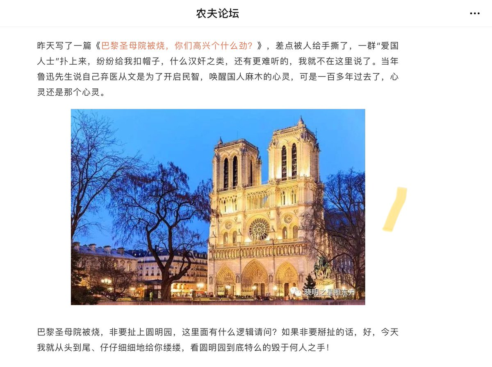
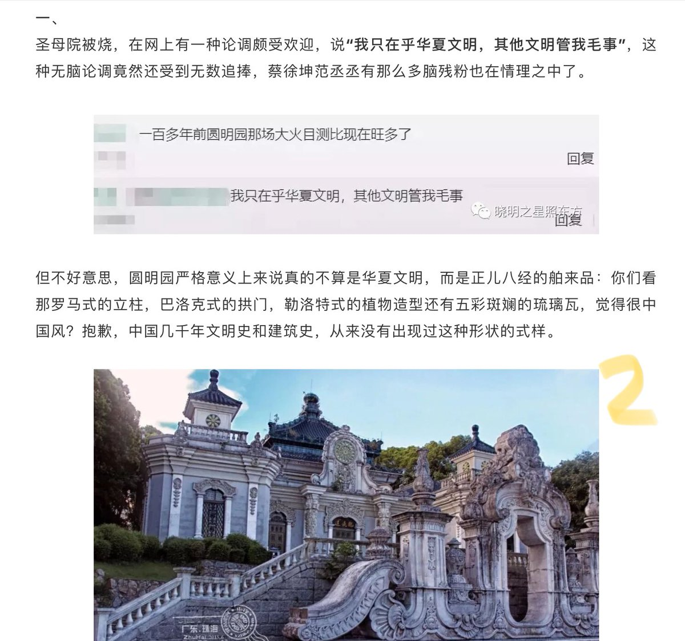

[12月28日 17:00]    纽约时报中文网   @nytchinese    #一周热门 中国首例未婚冻卵案：单身女性有生育权吗？ http://nyti.ms/2ro885f   :speech_balloon:评:2 :+1:赞:8 :globe_with_meridians:转:2  

[12月28日 16:23]    BBC News 中文   @bbcchinese    人们认为日本是尖端数码高科技的前沿阵地，但其实日本仍有人默默怀念早已过时的模拟信息技术，比如胶片相机。 https://bbc.in/2SAlqGW   :speech_balloon:评:5 :+1:赞:32 :globe_with_meridians:转:3  

[12月28日 15:00]    纽约时报中文网   @nytchinese    #一周热门 十年来最好看的30部国际剧集 http://nyti.ms/2PQCMgZ   :speech_balloon:评:1 :+1:赞:27 :globe_with_meridians:转:13  

[12月28日 14:43]    老司机   @h5lpykl7tp6jjop      :speech_balloon:评:0 :+1:赞:21 :globe_with_meridians:转:2  

[12月28日 14:43]    老司机   @h5lpykl7tp6jjop    好文转发：

我特么今天就告诉你圆明园到底是谁毁的！

农夫论坛  昨天  :speech_balloon:评:6 :+1:赞:86 :globe_with_meridians:转:46  

[12月28日 13:59]    新闻大吐槽   @TuCaoFakeNews    《中国梦想秀》参赛者的梦想——移民美国
打脸不? https://twitter.com/RFA_Chinese/status/1210763598252765184 …  :speech_balloon:评:1 :+1:赞:16 :globe_with_meridians:转:7  

[12月28日 13:21]    BBC News 中文   @bbcchinese    刚刚过去的一周，BBC中文以下新闻内容受到读者的关注。如果你错过了它们，BBC中文带你一一回顾。 https://bbc.in/2EYoQLN   :speech_balloon:评:4 :+1:赞:15 :globe_with_meridians:转:3  

[12月28日 13:00]    纽约时报中文网   @nytchinese    #一周热门 备忘录揭示班农与郭文贵财务关系 http://nyti.ms/34TcfUD   :speech_balloon:评:21 :+1:赞:33 :globe_with_meridians:转:9  

[12月28日 12:13]    老司机   @h5lpykl7tp6jjop    现在的中国社会犹如一口高压锅，基层政府部门，警察城管，都是加柴添火的，宣传部门是堵排气孔的，习草包是总瓢把子，往左往右开都是炸，无法掌控！六个稳也好八个稳也好，都没用！什么时候炸？天知道！  :speech_balloon:评:3 :+1:赞:42 :globe_with_meridians:转:7  

[12月28日 11:24]    老司机   @h5lpykl7tp6jjop    坏消息不断传出，这年还过不过了？  :speech_balloon:评:0 :+1:赞:4 :globe_with_meridians:转:2  

[12月28日 11:08]    老司机   @h5lpykl7tp6jjop    最汗的是一个学习毛选积极分子女知青，每天晚上带着当地青年学毛选，开始人多，后来就只有一个人了，一晚她发现那双盯着她胸脯的眼睛冒着光，想：毛主席教导我们说：要想贫下中农之所想，急贫下中农之所急，于是一篇毛选误终身……  :speech_balloon:评:2 :+1:赞:7 :globe_with_meridians:转:3  

[12月28日 11:00]    纽约时报中文网   @nytchinese    #一周热门 离婚后“被负债”，中国女记者向婚姻法发起挑战 http://nyti.ms/2EJvllh   :speech_balloon:评:0 :+1:赞:10 :globe_with_meridians:转:5  

[12月28日 10:40]    老司机   @h5lpykl7tp6jjop    转发青年网友的合理要求  :speech_balloon:评:0 :+1:赞:7 :globe_with_meridians:转:1  

[12月28日 10:30]    BBC News 中文   @bbcchinese    你以为墨镜是用来挡太阳吗？少年，你太年青了…… 中国警察戴上的是面部识别的墨镜
 https://bbc.in/39rBl0m   :speech_balloon:评:165 :+1:赞:297 :globe_with_meridians:转:131  

[12月28日 10:08]    老司机   @h5lpykl7tp6jjop    转发网文：对鸿茅药酒严肃点儿，这都是咱老祖宗的智慧。
 https://mp.weixin.qq.com/s/hppm-1ATAVb_CCn5WCbLvQ …
原创： 仙桃爸  维克多如果1994  昨天
俗话说，三个劫道的不如一个卖药的，卖什么药？卖玩弄“祖国医学”概念集大成的保健品，比如鸿茅药酒。  :speech_balloon:评:0 :+1:赞:9 :globe_with_meridians:转:1  

[12月28日 09:59]    BBC News 中文   @bbcchinese    艾米发现老公似乎对她的一切都了如指掌，包括她和朋友的私下聊天内容，艾米顿时感到一阵惊悚，几乎无法呼吸……
 https://bbc.in/368rhr6   :speech_balloon:评:3 :+1:赞:3 :globe_with_meridians:转:7  

[12月28日 09:57]    老司机   @h5lpykl7tp6jjop    那有什么三年自然灾害，饿死几千万人当个屁，粮食照样可以出口！  :speech_balloon:评:2 :+1:赞:1 :globe_with_meridians:转:2  

[12月28日 09:51]    老司机   @h5lpykl7tp6jjop    一旦来真的，三胖哑火了！
美军24日晚到26日期间罕见出动4型6架不同侦察机对朝监视。
据韩联社26日援引追踪飞机动向的网站“飞机守望”消息，美国侦察机RC-135S“眼镜蛇球”（Cobra Ball）当天从冲绳美军驻日基地出动飞临朝鲜半岛东部海域上空，并与前一天的同种机型进行了交接。  :speech_balloon:评:2 :+1:赞:21 :globe_with_meridians:转:2  

[12月28日 09:45]    老司机   @h5lpykl7tp6jjop    转发网文：3杯鸿茅药酒遥敬范冰冰！  :speech_balloon:评:0 :+1:赞:1 :globe_with_meridians:转:0  

[12月28日 09:36]    老司机   @h5lpykl7tp6jjop    美国人要中国人的钱，俄国人要中国人的地，日本人要中国人的资源，非洲人要中国的女人和钱，只有中国人，要中国人的命......  :speech_balloon:评:11 :+1:赞:74 :globe_with_meridians:转:30  

[12月28日 09:18]    财经真相   @caijingxiang    【重磅】中共央行：发布通知，2020年1月1日前金融机构已发放的和已签订合同但未发放的参考贷款基准利率定价的浮动利率贷款（不包括公积金个人住房贷款）。自2020年1月1日起，各金融机构不得签订参考贷款基准利率定价的浮动利率贷款合同。  :speech_balloon:评:15 :+1:赞:39 :globe_with_meridians:转:17  

[12月28日 09:00]    纽约时报中文网   @nytchinese    #一周热门 该不该用华为建5G？法罗群岛成中美科技冷战新战场 http://nyti.ms/2QbJD3x   :speech_balloon:评:3 :+1:赞:6 :globe_with_meridians:转:0  

[12月28日 08:54]    财经真相   @caijingxiang    以前中共端着刺刀，强行征收都没有这次搜刮的彻底，新时代统治手段就是不一样，换一个委婉的手段，耍了一个金融把戏，竟然把三代人的财富都给拿走了，而且还是韭菜们乖乖配合的前提下完成的，高，实在是高！房子真的比刺刀厉害！ https://twitter.com/gnews202064/status/1210444987416006657 …  :speech_balloon:评:1 :+1:赞:104 :globe_with_meridians:转:22  

[12月28日 08:43]    老司机   @h5lpykl7tp6jjop    别再吹中国武侠飞檐走壁，看看洋小伙现实的跑酷！  :speech_balloon:评:21 :+1:赞:160 :globe_with_meridians:转:68  

[12月28日 08:16]    老司机   @h5lpykl7tp6jjop    曹操看上了天朝社会，竟穿越来此发展霸业？

你没有看错！曹操团伙落网了

近期，海南陵水警方重拳出击，成功打掉以曹操为首的犯罪团伙，团伙头目曹操及团伙成员薛勇、张逢喜等人均已落网。  :speech_balloon:评:0 :+1:赞:2 :globe_with_meridians:转:0  

[12月28日 07:59]    BBC News 中文   @bbcchinese    过去，关于女性性高潮的话题主要集中在建议方面，而现在研究人员正在把注意力转移到女性身体结构的本身。
 https://bbc.in/362WY50   :speech_balloon:评:16 :+1:赞:40 :globe_with_meridians:转:20  

[12月28日 07:54]    凡賽堤/FORSETI   @FecharCCP    我們不可停止，我們將無限循環傳播香港的全方位被CCP極權組織殘暴殺害的種種真相視頻和畫面，永不停止！！！！！！！！！！！！！！！！！！！！！！！！！！！！！！！！！！！！！！！！！！！！！！！！！！！！！！！！！！！！！！！！！！！！！！！！！！！！！！！！！！！ https://twitter.com/FecharCCP/status/1207809972341559296 …  :speech_balloon:评:1 :+1:赞:10 :globe_with_meridians:转:12  

[12月28日 07:52]    凡賽堤/FORSETI   @FecharCCP    極權恐怖組織的殺人犯警2019年12月份的納粹暴行（16）

我們都是歷史的見證者！

時代革命，消滅極權，CCP 不能代表中國，CCP 不能代表中國人！

----感謝此視頻的原創作者！  :speech_balloon:评:0 :+1:赞:22 :globe_with_meridians:转:24  

[12月28日 07:48]    老司机   @h5lpykl7tp6jjop    美国绿林好汉劫富济贫庆祝圣诞节！

男子抢银行得手后 竟在路上大洒钞票 高喊圣诞快乐  :speech_balloon:评:0 :+1:赞:0 :globe_with_meridians:转:0  

[12月28日 07:44]    凡賽堤/FORSETI   @FecharCCP    極權恐怖組織的殺人犯警2019年12月份的納粹暴行（15）

---黑警犯警強姦警暴警殺人警非法執法濫捕香港小青年，學生，兒童！

我們都是歷史的見證者！

時代革命，消滅極權，CCP 不能代表中國，CCP 不能代表中國人！

----感謝此視頻的原創作者！  :speech_balloon:评:1 :+1:赞:15 :globe_with_meridians:转:9  

[12月28日 07:37]    凡賽堤/FORSETI   @FecharCCP    極權恐怖組織的殺人犯警2019年12月份的納粹暴行（14）

---黑警犯警強姦警暴警殺人警非法執法濫捕香港小青年，學生，兒童！

我們都是歷史的見證者！

時代革命，消滅極權，CCP 不能代表中國，CCP 不能代表中國人！

----感謝此視頻的原創作者！  :speech_balloon:评:2 :+1:赞:26 :globe_with_meridians:转:22  

[12月28日 07:30]    BBC News 中文   @bbcchinese    人类史上首张黑洞照片问世：早在1915年，爱因斯坦发表广义相对论，最先预言了黑洞的存在。 100多年后的今天，人类第一次“亲眼目睹”黑洞真容。
 https://bbc.in/2Ztprya   :speech_balloon:评:16 :+1:赞:46 :globe_with_meridians:转:15  

[12月28日 07:09]    墙国铁拳现世报😷   @Socialistfist    最新人造铁拳
未知原因，微博用户“青游记” 已经在此类P图内“被代言” 了好几回了，小编在这里表示慰问。  :speech_balloon:评:2 :+1:赞:18 :globe_with_meridians:转:1  

[12月28日 07:08]    凡賽堤/FORSETI   @FecharCCP    極權恐怖組織的殺人犯警2019年12月份的納粹暴行（13）

---黑警犯警強姦警暴警殺人警非法執法濫捕香港小青年，學生，兒童！

我們都是歷史的見證者！

時代革命，消滅極權，光復華族，人人有責！

----感謝此視頻的原創作者！  :speech_balloon:评:0 :+1:赞:4 :globe_with_meridians:转:5  

[12月28日 06:55]    凡賽堤/FORSETI   @FecharCCP    極權恐怖組織的殺人犯警2019年12月份的納粹暴行（12）

---黑警犯警強姦警暴警殺人警非法執法濫捕香港小青年，學生，兒童！

我們都是歷史的見證者！

時代革命，消滅極權，光復華族，人人有責！

----感謝此視頻的原創作者！  :speech_balloon:评:2 :+1:赞:19 :globe_with_meridians:转:19  

[12月28日 06:50]    凡賽堤/FORSETI   @FecharCCP    極權恐怖組織的殺人犯警2019年12月份的納粹暴行（11）
---她們都是正常走在街上的學生而已！

我們都是歷史的見證者！

時代革命，消滅極權，光復華族，人人有責！

----感謝此視頻的正義原創作者！  :speech_balloon:评:1 :+1:赞:28 :globe_with_meridians:转:27  

[12月28日 06:42]    凡賽堤/FORSETI   @FecharCCP    極權恐怖組織的殺人犯警2019年12月份的納粹暴行（10）

我們都是歷史的見證者！

時代革命，消滅極權，光復華族，人人有責！

----感謝此視頻的正義原創作者！  :speech_balloon:评:0 :+1:赞:4 :globe_with_meridians:转:1  

[12月28日 06:36]    凡賽堤/FORSETI   @FecharCCP    極權恐怖組織的殺人犯警2019年12月份的納粹暴行（9）

我們都是歷史的見證者！

時代革命，消滅極權，光復華族，人人有責！

----感謝此視頻的正義原創作者！  :speech_balloon:评:0 :+1:赞:5 :globe_with_meridians:转:3  

[12月28日 06:35]    凡賽堤/FORSETI   @FecharCCP    極權恐怖組織的殺人犯警2019年12月份的納粹暴行（7）

我們都是歷史的見證者！

時代革命，消滅極權，光復華族，人人有責！

----感謝此視頻的正義原創作者！  :speech_balloon:评:0 :+1:赞:16 :globe_with_meridians:转:16  

[12月28日 06:34]    凡賽堤/FORSETI   @FecharCCP    極權恐怖組織的殺人犯警2019年12月份的納粹暴行（8）

我們都是歷史的見證者！

時代革命，消滅極權，光復華族，人人有責！

----感謝此視頻的正義原創作者！  :speech_balloon:评:2 :+1:赞:30 :globe_with_meridians:转:71  

[12月28日 06:32]    凡賽堤/FORSETI   @FecharCCP    極權恐怖組織的殺人犯警2019年12月份的納粹暴行（6）

我們都是歷史的見證者！

時代革命，消滅極權，光復華族，人人有責！

----感謝此視頻的正義原創作者！  :speech_balloon:评:0 :+1:赞:2 :globe_with_meridians:转:7  

[12月28日 06:31]    凡賽堤/FORSETI   @FecharCCP    極權恐怖組織的殺人犯警2019年12月份的納粹暴行（5）

我們都是歷史的見證者！

時代革命，消滅極權，光復華族，人人有責！

----感謝此視頻的正義原創作者！  :speech_balloon:评:14 :+1:赞:204 :globe_with_meridians:转:161  

[12月28日 06:29]    凡賽堤/FORSETI   @FecharCCP    極權恐怖組織的殺人犯警2019年12月份的納粹暴行（4）

我們都是歷史的見證者！

時代革命，消滅極權，光復華族，人人有責！

----感謝此視頻的正義原創作者！  :speech_balloon:评:0 :+1:赞:5 :globe_with_meridians:转:2  

[12月28日 06:28]    凡賽堤/FORSETI   @FecharCCP    極權恐怖組織的殺人犯警2019年12月份的納粹暴行（3）

我們都是歷史的見證者！

時代革命，消滅極權，光復華族，人人有責！

----感謝此視頻的正義原創作者！  :speech_balloon:评:0 :+1:赞:37 :globe_with_meridians:转:34  

[12月28日 06:28]    凡賽堤/FORSETI   @FecharCCP    極權恐怖組織的殺人犯警2019年12月份的納粹暴行（2）

我們都是歷史的見證者！

時代革命，消滅極權，光復華族，人人有責！

----感謝此視頻的正義原創作者！  :speech_balloon:评:1 :+1:赞:11 :globe_with_meridians:转:18  

[12月28日 06:26]    凡賽堤/FORSETI   @FecharCCP    極權恐怖組織的殺人犯警2019年12月份的納粹暴行（1）

我們都是歷史的見證著！

時代革命，消滅極權，光復華族，人人有責！

----感謝此視頻的正義原創作者！  :speech_balloon:评:0 :+1:赞:9 :globe_with_meridians:转:2  

[12月28日 06:14]    新闻大吐槽   @TuCaoFakeNews    早在12月中旬，北大叫兽就已经献计献策：
北大中文系教授张颐武：文化传播需要更多李子柒  https://twitter.com/zhaozhenxiang/status/1210680228495941633 …  :speech_balloon:评:2 :+1:赞:12 :globe_with_meridians:转:10  

[12月28日 05:27]    新闻大吐槽   @TuCaoFakeNews    俞强声真的叛逃美国了吗？
据说并没有，他改名换姓，在中国演小品，最危险的地方就是最安全的地方~  :speech_balloon:评:8 :+1:赞:34 :globe_with_meridians:转:10  

[12月28日 05:27]    新闻大吐槽   @TuCaoFakeNews    俞强声真的叛逃美国了吗？
据说并没有，他改名换姓，在中国演小品，最危险的地方就是最安全的地方~  :speech_balloon:评:8 :+1:赞:34 :globe_with_meridians:转:10  

[12月28日 05:10]    新闻大吐槽   @TuCaoFakeNews    华春莹：你通过了考核，明天请来外交部报道  :speech_balloon:评:3 :+1:赞:39 :globe_with_meridians:转:1  

[12月28日 05:10]    新闻大吐槽   @TuCaoFakeNews    华春莹：你通过了考核，明天请来外交部报道  :speech_balloon:评:3 :+1:赞:39 :globe_with_meridians:转:1  

[12月28日 05:04]    老司机   @h5lpykl7tp6jjop    汇源果汁被查封的真实原因！  :speech_balloon:评:15 :+1:赞:247 :globe_with_meridians:转:159  

[12月28日 03:45]    新闻大吐槽   @TuCaoFakeNews    中共国庆10月1日，台湾国庆10月10日。
韩国瑜赠送的2020年日历（民国109年），国庆竟然是中共版本的10月1日。

这投共之心，路人皆知了  :speech_balloon:评:6 :+1:赞:89 :globe_with_meridians:转:46  

[12月28日 03:45]    新闻大吐槽   @TuCaoFakeNews    中共国庆10月1日，台湾国庆10月10日。
韩国瑜赠送的2020年日历（民国109年），国庆竟然是中共版本的10月1日。

这投共之心，路人皆知了  :speech_balloon:评:6 :+1:赞:89 :globe_with_meridians:转:46  

[12月28日 03:29]    新闻大吐槽   @TuCaoFakeNews    在这位大妈看来：
无人售票=没人售票=可以不买票

这不怨我  :speech_balloon:评:23 :+1:赞:168 :globe_with_meridians:转:36  

[12月28日 03:29]    新闻大吐槽   @TuCaoFakeNews    在这位大妈看来：
无人售票=没人售票=可以不买票

这不怨我  :speech_balloon:评:23 :+1:赞:168 :globe_with_meridians:转:36  

[12月28日 01:34]    新闻大吐槽   @TuCaoFakeNews    视频好短，信息好丰富：

文化殖民，红歌，汉服，从小灌输，体罚非洲娃，一带一路。

下血本把非洲权贵子弟伺候好了，为的是在非洲培养、收割韭菜？  :speech_balloon:评:8 :+1:赞:67 :globe_with_meridians:转:25  

[12月28日 01:34]    新闻大吐槽   @TuCaoFakeNews    视频好短，信息好丰富：

文化殖民，红歌，汉服，从小灌输，体罚非洲娃，一带一路。

下血本把非洲权贵子弟伺候好了，为的是在非洲培养、收割韭菜？  :speech_balloon:评:8 :+1:赞:67 :globe_with_meridians:转:25  

[12月28日 00:30]    BBC News 中文   @bbcchinese    俄罗斯历史学者潘佐夫用苏联解密档案揭示,毛泽东早年在巩固其中共党内权力的过程中一直受到前苏联领导人斯大林的支持，而且斯大林当时在中共高层还安插了他的耳目，从而更容易了解中共的一举一动。
 https://bbc.in/37iws7F   :speech_balloon:评:26 :+1:赞:101 :globe_with_meridians:转:49  

[12月27日 23:59]    BBC News 中文   @bbcchinese    俄罗斯历史学者潘佐夫查阅大量苏联解密档案试图还原真实的毛泽东，揭示了毛泽东从斯大林那里得到的支持和思想灵感多于此前研究的描述。
 https://bbc.in/2ZziUlJ   :speech_balloon:评:18 :+1:赞:124 :globe_with_meridians:转:69  

[12月27日 23:30]    BBC News 中文   @bbcchinese    最早开始，人类是无法消化动物奶水的，但现在很多人喝牛奶都没事了。为什么人类要演化进而适应动物乳制品呢？
 https://bbc.in/2PZSgza   :speech_balloon:评:23 :+1:赞:65 :globe_with_meridians:转:22  

[12月27日 23:12]    老司机   @h5lpykl7tp6jjop    人类罪恶史上从没看到的场景：

10几个港共恶警

围追堵截一个才10几岁的小女孩！ 

#freehongkong  :speech_balloon:评:14 :+1:赞:184 :globe_with_meridians:转:144  

[12月27日 22:59]    BBC News 中文   @bbcchinese    她本来想当外交官，后来在法国却成了二战期间最令纳粹心惊胆战的间谍，形影无踪，战后荣誉无数却至死默默无闻。终于有人写了她的传记。
 https://bbc.in/2t6Vfgi   :speech_balloon:评:2 :+1:赞:48 :globe_with_meridians:转:23  

[12月27日 22:30]    BBC News 中文   @bbcchinese    如果你的 Instagram 上都是一些俊男美女自拍照的话，最好的建议是放下手机。
 https://bbc.in/2t2R19v   :speech_balloon:评:4 :+1:赞:30 :globe_with_meridians:转:5  

[12月27日 21:59]    BBC News 中文   @bbcchinese    中国警告欧盟不要限制中国公司进入欧洲，否则让欧盟自身利益受损，并且阻碍中国在欧洲的投资。
 https://bbc.in/2MxOECu   :speech_balloon:评:36 :+1:赞:45 :globe_with_meridians:转:26  

[12月27日 21:00]    纽约时报中文网   @nytchinese    图书编辑和行业主管说，近年来环境变得越来越谨慎。中共宣传部门今年告诉出版商说，获得批准的图书总数将减少，并支持国内作家，宣传党和注入了资本主义的中国社会主义的书籍将受到最多的鼓励。 https://nyti.ms/2Q04CHB   :speech_balloon:评:2 :+1:赞:17 :globe_with_meridians:转:8  

[12月27日 20:59]    BBC News 中文   @bbcchinese    我们在那里逗留了几个小时，操纵无人机拍火山和间歇泉山谷地貌。就在我们收拾设备准备离开时，有人大喊：熊！
 https://bbc.in/2SvM2sM   :speech_balloon:评:5 :+1:赞:19 :globe_with_meridians:转:4  

[12月27日 20:01]    BBC News 中文   @bbcchinese    【老龄化香港的缩影：拾荒者兰姐的故事】兰姐是香港街头的拾荒者。这个群体在香港约有3000人。63岁的兰姐说话斩钉截铁，中气很足。她的作息极不规律，有时为了守纸皮，会整夜睡在店铺门口，等待清晨开门，第一个拿到纸皮。她说，要做这行，要练就“铁脚马和神仙肚”。 https://bbc.in/2rrg45C   :speech_balloon:评:5 :+1:赞:35 :globe_with_meridians:转:12  

[12月27日 19:02]    BBC News 中文   @bbcchinese    【哈萨克斯坦空难】中国阿拉木图总领馆称，该飞机上有一名中国籍男性乘客，事故中没有受伤。  https://bbc.in/2QsfZHi  #Bekair  :speech_balloon:评:6 :+1:赞:26 :globe_with_meridians:转:9  

[12月27日 18:53]    老司机   @h5lpykl7tp6jjop    突破！日本研发出了6G芯片，速度将是5G技术的40倍！  :speech_balloon:评:10 :+1:赞:154 :globe_with_meridians:转:55  

[12月27日 18:32]    老司机   @h5lpykl7tp6jjop    国内一个老朋友和我谈及中共篡政七十年，说从毛的穷折腾起到今天习的瞎折腾止，没有安生的日子，略微好点是邓的改革开放，江的闷声发财，胡的不折腾，但也正是邓江胡这三个家伙让官后代们窃走巨大财富造成如今民穷国危的局面，中国人遇上共产党真是倒了八辈子晦！
我笑：从打土豪分田地那天起就注定了  :speech_balloon:评:7 :+1:赞:194 :globe_with_meridians:转:60  

[12月27日 18:32]    BBC News 中文   @bbcchinese    【中国明星工厂：如何从小打造一名流行偶像】12岁的杨竞欣说，她很喜欢当偶像的感觉，但她也深知每个偶像都有自己的生存寿命。 https://bbc.in/2t5dumt   :speech_balloon:评:2 :+1:赞:12 :globe_with_meridians:转:5  

[12月27日 18:25]    新闻大吐槽   @TuCaoFakeNews    主持人：韩市长，对台湾威胁最大的国家是哪个？

韩国鱼：这个，，哎呀，，其实，，那个，，怎么说呢，要不我跳给你看吧！

（噗通！）

主持人：您的意思是红锅（国）吗？

韩国鱼：下……个……问……题……

主持人：韩市长，你怎么红了？把自己煮了？  :speech_balloon:评:9 :+1:赞:97 :globe_with_meridians:转:33  

[12月27日 18:25]    新闻大吐槽   @TuCaoFakeNews    主持人：韩市长，对台湾威胁最大的国家是哪个？

韩国鱼：这个，，哎呀，，其实，，那个，，怎么说呢，要不我跳给你看吧！

（噗通！）

主持人：您的意思是红锅（国）吗？

韩国鱼：下……个……问……题……

主持人：韩市长，你怎么红了？把自己煮了？  :speech_balloon:评:9 :+1:赞:97 :globe_with_meridians:转:33  

[12月27日 18:10]    纽约时报中文网   @nytchinese    贸易战加剧以来，中国出版监管机构几乎完全冻结了美国图书的审批，从畅销书到学术书籍的发行基本陷入停滞。
中国出版界谨慎乐观地认为，本月北京与华盛顿之间达成的局部贸易停战将结束这一停滞局面，但他们也担心美国图书可能在未来的打击行动中成为目标。 https://nyti.ms/2Q04CHB   :speech_balloon:评:16 :+1:赞:99 :globe_with_meridians:转:34  

[12月27日 18:00]    纽约时报中文网   @nytchinese    纳瓦罗的怀疑论始于1970年代，当时他在亚洲到处旅行，观察到中国对其邻国经济产生的负面影响。
自从2001年中国加入世界贸易组织后，他对于中国贸易做法对美国产生的影响越来越不满，特别是因为他的许多商科学生抱怨中国的竞争致使他们失业。 https://nyti.ms/2PZrqHt   :speech_balloon:评:16 :+1:赞:43 :globe_with_meridians:转:10  

[12月27日 17:52]    墙国铁拳现世报😷   @Socialistfist    据推友提供的截图显示，@minzhutiequan 不幸被举报生效推特铁拳，虽然小编一直没有觉得此人在推上言行违反过相关条例。  :speech_balloon:评:25 :+1:赞:173 :globe_with_meridians:转:17  

[12月27日 16:47]    老司机   @h5lpykl7tp6jjop    为什么中国教育没有创造力？因为它只教对错！而创造力来源于对和错之外的第三状态，这些年网友创造了一个叫小明的同学，他的神回复总是出人意料之外，不在对错之中，让传统教育目瞪口呆！让广大同学欢天喜地，让标准答案为之色变！然而领导老爷们还在研究怎样规范统一思想，还在想法禁言，禁敏感词！蠢  :speech_balloon:评:18 :+1:赞:205 :globe_with_meridians:转:69  

[12月27日 16:22]    新闻大吐槽   @TuCaoFakeNews    要学港人五大诉求，才是真出路  :speech_balloon:评:6 :+1:赞:50 :globe_with_meridians:转:3  

[12月27日 16:22]    新闻大吐槽   @TuCaoFakeNews    要学港人五大诉求，才是真出路  :speech_balloon:评:6 :+1:赞:50 :globe_with_meridians:转:3  

[12月27日 16:21]    新闻大吐槽   @TuCaoFakeNews    北京昌平，数九寒天，政府为了完成强拆任务，断了小区的电，寒冬中瑟瑟发抖的村民，还在打着红旗希望党开恩。

可是，这种小聪明式的抗争方式，早就被无数访民亲身实践证明无效，可每位新韭菜总要把老韭菜的路从新走一遍！

历来新韭总乐观，为何不见老韭哭？  :speech_balloon:评:48 :+1:赞:319 :globe_with_meridians:转:136  

[12月27日 16:21]    新闻大吐槽   @TuCaoFakeNews    北京昌平，数九寒天，政府为了完成强拆任务，断了小区的电，寒冬中瑟瑟发抖的村民，还在打着红旗希望党开恩。

可是，这种小聪明式的抗争方式，早就被无数访民亲身实践证明无效，可每位新韭菜总要把老韭菜的路从新走一遍！

历来新韭总乐观，为何不见老韭哭？  :speech_balloon:评:48 :+1:赞:319 :globe_with_meridians:转:136  

[12月27日 16:03]    新闻大吐槽   @TuCaoFakeNews    魔警想挡住”未来”，但他们终究无法做到！  :speech_balloon:评:4 :+1:赞:77 :globe_with_meridians:转:25  

[12月27日 16:00]    纽约时报中文网   @nytchinese    当特朗普在白宫召集他的高级贸易顾问来决定是否与中国达成协议时，纳瓦罗提出，如果达成协议，取消特朗普的任何关税，会让美国显得软弱。据当时在场的一名政府官员称，纳瓦罗抨击那些支持取消关税的人是“全球主义者”。 https://nyti.ms/2PZrqHt   :speech_balloon:评:6 :+1:赞:15 :globe_with_meridians:转:4  

[12月27日 15:53]    老司机   @h5lpykl7tp6jjop    别说什么青春无悔，仔细翻出当年的记忆，知青老大妈都不敢面对！  :speech_balloon:评:8 :+1:赞:87 :globe_with_meridians:转:52  

[12月27日 15:52]    新闻大吐槽   @TuCaoFakeNews    满脸疲惫的谢Sir虽然换岗了，但庆祝节日时，香港市民还是没有忘记他！  :speech_balloon:评:19 :+1:赞:505 :globe_with_meridians:转:156  

[12月27日 15:30]    纽约时报中文网   @nytchinese    #时报专栏 年轻人不仅发明和塑造了社交媒体，社交媒体也塑造并改变了年轻人。
这十年，算法以迎合我们的喜好为目标，却只是令我们的喜好变窄；网络社区的建立导致了分裂，并且传播虚假信息和仇恨；数字连接加深了个体的隔离，令我们更脆弱、更容易受影响。 https://nyti.ms/37gE4aL   :speech_balloon:评:18 :+1:赞:13 :globe_with_meridians:转:3  

[12月27日 15:25]    财经真相   @caijingxiang    一个替罪，竟然可以抵消千亿烂账，这些都是谁拿走？死缓罪说明一切，如果直接判死刑，就会杀鸡儆猴，恐慌情绪就会弥漫整个银行体系，以后所有银行主管都会捂紧钱袋子，中共权贵们的空头票据就很难从银行弄到钱了，等于是给自己找麻烦。弄个死缓监狱里照样包养女人，给大家都留个台阶下！ https://twitter.com/reuterscn/status/1210150046353764352 …  :speech_balloon:评:6 :+1:赞:269 :globe_with_meridians:转:98  

[12月27日 15:01]    BBC News 中文   @bbcchinese    【2019年热点回顾】孙杨在游泳世锦赛三日内两金，但是对手拒绝与他同台的画面传遍世界。 https://bbc.in/2Mlp5V6   :speech_balloon:评:58 :+1:赞:102 :globe_with_meridians:转:23  

[12月27日 14:30]    纽约时报中文网   @nytchinese    三年来，首席贸易顾问纳瓦罗一直是特朗普的贸易斗士。他利用特朗普对全球化的蔑视，煽动其保护主义本能，鼓励他与中国展开惩罚性的贸易战。即使中美已经达成初步贸易协议，他仍在寻找对抗中国的方法。 https://nyti.ms/2PZrqHt   :speech_balloon:评:113 :+1:赞:216 :globe_with_meridians:转:59  

[12月27日 14:01]    BBC News 中文   @bbcchinese    【2019年热点回顾】说到不被国际承认但却真实存在的“事实国家”，人口2300万的台湾绝对是最大的一个，但你知道欧洲还有这3个不被承认的国家吗？ https://bbc.in/2Zu3cZj   :speech_balloon:评:169 :+1:赞:278 :globe_with_meridians:转:82  

[12月27日 14:00]    纽约时报中文网   @nytchinese    #每日一词 Bumpy，坎坷的。英国女王伊丽莎白二世的公开声明往往避免争议或细节，但她在圣诞致辞中承认，英国经历了“坎坷”的一年。Bumpy一词原型为bump，后者有肿块、颠簸之意，故加上形容词后缀，bumpy表示崎岖不平的、困难重重的。
更多简报内容： https://nyti.ms/2PWX5cB   :speech_balloon:评:1 :+1:赞:17 :globe_with_meridians:转:4  

[12月27日 13:30]    纽约时报中文网   @nytchinese    #图集 【亚洲各地天空现“火环”日食奇景】周四下午开始，新月从太阳前面经过，部分遮住了太阳，在其边缘留下一圈光。这一奇特的天文现象在亚洲和中东地区吸引了大量的观测者。
点击查看图集： https://nyti.ms/2Q2XL0l   :speech_balloon:评:4 :+1:赞:40 :globe_with_meridians:转:16  

[12月27日 13:01]    BBC News 中文   @bbcchinese    【2019年热点回顾】你可能知道异性恋、同性恋以及双性恋。但你听说过无性恋吗？他们是怎样一群人，又过着什么样的生活呢？ https://bbc.in/35V4QFI   :speech_balloon:评:6 :+1:赞:31 :globe_with_meridians:转:16  

[12月27日 13:00]    纽约时报中文网   @nytchinese    #时报专栏 这个十年的标志是年轻人对旧秩序的强烈敌意。在他们看来，自由主义国际秩序没有维护和平，而是榨干我们的血汗。资本主义没有使国家富裕，而是让富人更富有。硅谷没有从事技术创新，而是挖掘我们的数据。
这也是民粹主义右翼崛起的原因。 https://nyti.ms/37gE4aL   :speech_balloon:评:3 :+1:赞:19 :globe_with_meridians:转:9  

[12月27日 12:01]    BBC News 中文   @bbcchinese    【2019年热点回顾】伦敦一位居民周末在自家后院晒太阳，突然一具冻僵男尸从天而降，砸到他身边一米地方，血浆四溅。 https://bbc.in/2sTVT0L   :speech_balloon:评:11 :+1:赞:71 :globe_with_meridians:转:30  

[12月27日 12:00]    纽约时报中文网   @nytchinese    耶稣是个同性恋？巴西一制作公司因拍摄相关影片遇袭。三名蒙面歹徒在平安夜投掷燃烧弹，并发布视频表示对此负责。尽管未造成人员伤亡，但在该片中饰演耶稣的演员表示，这起袭击开创了一个令人不安的先例。
更多简报内容： https://nyti.ms/2PWX5cB   :speech_balloon:评:3 :+1:赞:11 :globe_with_meridians:转:2  

[12月27日 11:30]    纽约时报中文网   @nytchinese    中国最著名的“#我也是”诽谤诉讼案莫过于刘强东起诉两名博主对他强奸指控的评论。未受到控罪的刘强东要求赔偿43.6万美元。
去年，弦子指控央视主持人朱军在2014年对她进行性侵犯，朱军对弦子提起诽谤诉讼，称她的指控是“公然捏造和恶意传播”，并要求赔偿约9.5万美元的损失。 https://nyti.ms/2MvA4LH   :speech_balloon:评:1 :+1:赞:14 :globe_with_meridians:转:6  

[12月27日 11:00]    纽约时报中文网   @nytchinese    #时报专栏 2010年代是属于千禧一代的十年。年轻人对旧秩序和社会现状怀抱敌意和愤怒，他们的技术发明、迁徙、疾病和道德信念从根本上改变了这个十年。 https://nyti.ms/37gE4aL   :speech_balloon:评:4 :+1:赞:49 :globe_with_meridians:转:19  

[12月27日 10:30]    纽约时报中文网   @nytchinese    选举在即，中国首艘国产航母“山东舰”通过台湾海峡。台湾将于1月11日举行总统选举，一位熟悉台湾安全规划的高级官员表示，中国此举意在“通过展示军事实力，恐吓不听话的选民。”
更多简报内容： https://nyti.ms/2PWX5cB   :speech_balloon:评:6 :+1:赞:4 :globe_with_meridians:转:2  

[12月27日 10:21]    财经真相   @caijingxiang    中国股市今天涨疯了，看样子今天下午收盘后，中共要宣布降准了！  :speech_balloon:评:67 :+1:赞:274 :globe_with_meridians:转:37  

[12月27日 09:58]    纽约时报中文网   @nytchinese    早安！今日重点新闻包括：
中国“我也是”女性困境；山东舰航母驶入台湾海峡；揭秘贸易战美方鹰派斗士；亚洲各地出现“火环”日食；中国公园里的“黄昏恋”；菲律宾遭台风袭击；内塔尼亚胡赢得党内领导人选举……NYT简报带你速览今日要闻。 https://nyti.ms/2PWX5cB   :speech_balloon:评:2 :+1:赞:30 :globe_with_meridians:转:7  

[12月27日 02:04]    墙国铁拳现世报😷   @Socialistfist    高光时刻  :speech_balloon:评:21 :+1:赞:144 :globe_with_meridians:转:16  

[12月26日 23:22]    墙国铁拳现世报😷   @Socialistfist    @minzhutiequan  :speech_balloon:评:8 :+1:赞:65 :globe_with_meridians:转:2  

[12月26日 23:18]    墙国铁拳现世报😷   @Socialistfist    寻人启事  :speech_balloon:评:85 :+1:赞:456 :globe_with_meridians:转:83  

[12月26日 21:49]    财经真相   @caijingxiang    明年是鼠年，一个中国公司年会的特别节目，竟然弄了一条黄金蟒蛇表演！话说生肖鼠的克星应该是蛇啊！北京怎么捕杀起狗来了？  :speech_balloon:评:23 :+1:赞:107 :globe_with_meridians:转:12  

[12月26日 21:00]    纽约时报中文网   @nytchinese    中国政府已经颁布了禁止性骚扰的法律，但并未给出定义。执法情况很糟。诽谤法有利于原告，而更大的举证责任落在了受害者身上。如果没能举证，会被认为是存在“主观过错”。 https://nyti.ms/2MvA4LH   :speech_balloon:评:9 :+1:赞:18 :globe_with_meridians:转:7  

[12月26日 12:11]    财经真相   @caijingxiang    在岸人民币20年走势图，从防涨横盘=》被迫升值=》主动贬值=》短暂自由浮动=》市场推动下跌=》防跌=》市场推动上涨=》贸易战爆发下跌=》防跌=》被迫破7=》被迫贬值=》8.3线失守 失控、崩盘！  :speech_balloon:评:22 :+1:赞:270 :globe_with_meridians:转:87  

[12月26日 09:49]    财经真相   @caijingxiang    今天离岸人民币涨破6.99关口，本轮升值是由在岸人民币汇率带动的，临近年底国内企业必须要结汇换取人民币进行资金周转，这真是中共现在最需要的，但是这种涨势并不会持久，随着元旦一过，新的购汇需求上升，人民币还会继续贬值到7附近，如果1月初中美不能正式签字，则新一轮贬值就会到来！  :speech_balloon:评:19 :+1:赞:408 :globe_with_meridians:转:81  

[12月25日 22:41]    财经真相   @caijingxiang    有些细节是需要认真推敲，看一下日历就明白，莱特希泽把签字日期定在1月第一周是经过精心挑选的，如果下周不签字，双方最长可以延长10天，而且必须公布具体的签字日期，如果延长超过10天，基本上意味着第一阶段贸易协议彻底谈崩。因为春节过后，二月份距离3月3日的人大会比较近，几乎很难纳入立法程序  :speech_balloon:评:22 :+1:赞:250 :globe_with_meridians:转:78  

[12月25日 22:25]    财经真相   @caijingxiang    如果下周不能就第一阶段协议正式签字，那么随着春节的临近，中共在春节前签字的概率就会大大降低；如果是春节以后再正式签字，那么距离三月的两会比较近，协议中“结构性”变革必然牵扯到“立法”，两会是立法的关键。结论就是：如果春节前第一阶段协议不签字，则中美就会彻底谈判破裂！因为后续时间不够！  :speech_balloon:评:22 :+1:赞:219 :globe_with_meridians:转:41  

[12月25日 22:19]    财经真相   @caijingxiang    美国人正过圣诞节，原本说金三胖会送一份“圣诞大礼”，结果三胖软了，反到是中国放了一个巨浪三，这种射程一万公里的潜射核导弹，从渤海发射经北极完全可以覆盖整个美国。另外今天外交部说，中美正就第一阶段经贸协议签署具体安排保持密切沟通，按理说本次不应该公布具体的签字日期吗？莱特希泽要打脸了  :speech_balloon:评:21 :+1:赞:301 :globe_with_meridians:转:74  

[12月25日 19:01]    墙国铁拳现世报😷   @Socialistfist    今天是12月25日，墙国铁拳现世报编辑部全体祝各位推友圣诞快乐，心想事成，也要祝各位粉蚷战螂剩蛋快乐！  :speech_balloon:评:13 :+1:赞:251 :globe_with_meridians:转:11  

[12月25日 13:04]    财经真相   @caijingxiang    国务院：各地区要第一时间处置因规模性失业引发的群体性突发事件！  :speech_balloon:评:28 :+1:赞:429 :globe_with_meridians:转:174  

[12月25日 10:13]    GFHG SDKM   @zyx_yny    #HongKongPolice Fire #TearGas Cannisters From Rooftop of the Police Station
~12:30am, 25 Dec 2019
Tsim Sha Tsui (TST) police station, #HKProtesters 
Source: RTHK  :speech_balloon:评:19 :+1:赞:534 :globe_with_meridians:转:634  

[12月25日 09:42]    财经真相   @caijingxiang    为啥党国不过圣诞节？因为苏联在这一天灰飞烟灭！  :speech_balloon:评:87 :+1:赞:1631 :globe_with_meridians:转:497  

[12月25日 08:27]    新闻大吐槽   @TuCaoFakeNews    意大利男高音的歌声越来越美！技艺随着无私的付出而提升！商场的天井成了巨大扩音器，自由之声从最底层直冲顶层，在整个商场中共鸣！  :speech_balloon:评:25 :+1:赞:1060 :globe_with_meridians:转:415  

[12月25日 04:12]    GFHG SDKM   @zyx_yny    #ChristmasEve2019HongKong  :speech_balloon:评:6 :+1:赞:136 :globe_with_meridians:转:175  

[12月25日 02:17]    GFHG SDKM   @zyx_yny    Corrupt regime ..Hong Kong is dying Hong Kong people will not forget these hatreds.  :speech_balloon:评:6 :+1:赞:92 :globe_with_meridians:转:119  

[12月25日 00:37]    财经真相   @caijingxiang    伦敦12月23日libor美元隔夜拆借利率报1.5345%，港币比美元拆解利率高：2.90393%-1.5345%=1.36943%，说明港币比美元更紧俏，但是这种利率倒挂不会持续很久，一月内港币拆解利率将会重新跌破1%！  :speech_balloon:评:2 :+1:赞:38 :globe_with_meridians:转:3  

[12月25日 00:30]    财经真相   @caijingxiang    港币今天隔夜拆借利率达到2.90393%，创新几个月的新高，港币拆解利率高于美元，再过几天就元旦了，新年一过，港币资金流动趋紧的情况就会得到改善，港币拆解利率很快就会回落，届时港币重新跌回弱势上方，现在港币真的是个不错的做空位置。  :speech_balloon:评:1 :+1:赞:85 :globe_with_meridians:转:15  

[12月25日 00:27]    GFHG SDKM   @zyx_yny    This boy was just walking past at the Harbour City with a mask on, but was severely beaten by the mad dog @hkpoliceforce aiming at his head.

#HongKongPoliceTerrorists #hongkongpolicebrutality #HongKongProstests #HongKongPoliceState #China_is_terroris #SOSHK https://twitter.com/nanalai/status/1209448858406637569 …  :speech_balloon:评:3 :+1:赞:67 :globe_with_meridians:转:83  

[12月25日 00:19]    财经真相   @caijingxiang    各位圣诞快乐！  :speech_balloon:评:27 :+1:赞:264 :globe_with_meridians:转:2  

[12月25日 00:18]    GFHG SDKM   @zyx_yny    Can’t help but think, looking at these pictures of Christmas Eve in #HongKong, that the birth Christians celebrate tomorrow is a rebuke and a challenge to tyrants everywhere #StandWithHongKong https://twitter.com/jeffreychngo/status/1209452932095258625 …  :speech_balloon:评:1558 :+1:赞:15537 :globe_with_meridians:转:12153  

[12月24日 23:55]    GFHG SDKM   @zyx_yny    #HKPoliceTerrorists opened fire at protestors from atop buildings, breaking guidelines and endangering civilians’ lives. People may get headshot and killed. 

#PoliceBrutality  :speech_balloon:评:184 :+1:赞:2935 :globe_with_meridians:转:3340  

[12月24日 20:01]    墙国铁拳现世报😷   @Socialistfist    感谢广大推友的对上一推的热烈反响和支持。
收到疑似有推友上微博围观评论而遭到喝茶的报告
小编请大家注意网络键政的安全，也不鼓励大家反串留言。  :speech_balloon:评:14 :+1:赞:172 :globe_with_meridians:转:18  

[12月24日 10:37]    财经真相   @caijingxiang    黄金“春节攻势”持续中，重回1500美元，然后再哪里震荡一段时间是大概率事件。本轮黄金明显受到了，美股不断创新高的压制，中美第一阶段协议，也大大削弱了黄金的涨势，接下来中国央行降准消息公布后，黄金会冲向本轮最高峰，我们拭目以待吧！  :speech_balloon:评:6 :+1:赞:87 :globe_with_meridians:转:13  

[12月24日 10:23]    墙国铁拳现世报😷   @Socialistfist    附行政复议书  :speech_balloon:评:3 :+1:赞:82 :globe_with_meridians:转:8  

[12月24日 10:18]    墙国铁拳现世报😷   @Socialistfist    ”海口市琼山区龙塘政府自2019年2月开始在没有任何法定证据的前提下，连续三次对香世界庄园下达强制拆除和限期拆除，其中行政复议三次，两次被法院撤销拆除令，第三次复议还在等待结果期间直接无批文强拆……要知道，没有法院批准的拆除令的强拆属于严重违法行为！”

摘自：  http://blog.sina.cn/dpool/blog/s/blog_725524e60102zq6u.html?ref=weibocard&from=109C195010&wm=9847_0002&weiboauthoruid=1918182630 …https://twitter.com/minzhutiequan/status/1209266528006234113 …  :speech_balloon:评:28 :+1:赞:184 :globe_with_meridians:转:28  

[12月24日 09:24]    财经真相   @caijingxiang    李克强：进一步研究降准和定向降准、再贷款和再贴现！ 降准100点已经在路上，2.8万亿的资金缺口只能这么补了，具体时间点，要么本周五27号，要么下周五（1月3号）！a50估计会涨一波！  :speech_balloon:评:18 :+1:赞:215 :globe_with_meridians:转:58  

[12月24日 00:00]    财经真相   @caijingxiang    社会主义铁拳，不知道会不会砸醒？祖国强大了，就没人救你了！  :speech_balloon:评:73 :+1:赞:737 :globe_with_meridians:转:213  

[12月23日 19:50]    财经真相   @caijingxiang    明天就是平安夜了，三胖传说中的“圣诞礼物”是不是也该送到了！我要不要轻仓做点黄金准备一下呢？  :speech_balloon:评:23 :+1:赞:144 :globe_with_meridians:转:19  

[12月23日 19:23]    财经真相   @caijingxiang    人大常委会：居住期限满或者居住权人死亡，居住权消失，应及时办理注销登记！  :speech_balloon:评:78 :+1:赞:327 :globe_with_meridians:转:158  

[12月23日 18:08]    墙国铁拳现世报😷   @Socialistfist    补充香世界庄园负责人朋友圈  :speech_balloon:评:11 :+1:赞:241 :globe_with_meridians:转:68  

[12月23日 18:05]    墙国铁拳现世报😷   @Socialistfist    媒体报道  :speech_balloon:评:10 :+1:赞:149 :globe_with_meridians:转:26  

[12月23日 18:04]    墙国铁拳现世报😷   @Socialistfist    补充强拆视频  :speech_balloon:评:11 :+1:赞:205 :globe_with_meridians:转:42  

[12月23日 18:03]    墙国铁拳现世报😷   @Socialistfist    美国驻广州总领事说：香世界庄园是一个很酷的地方！
海口政府官员说：并没有。

海口市十多年企业，百号员工，一天化为乌有
#社会主义铁拳  :speech_balloon:评:152 :+1:赞:1287 :globe_with_meridians:转:547  

[12月23日 16:07]    GFHG SDKM   @zyx_yny    Crime of Violence Hong Kong Police Links
香港警察16項國際罪行已經翻譯20種語言
阿拉伯語 –  https://youtu.be/3ATOcsLBuFY 
中文語言 - https://youtu.be/o-mRxwDgWWs 
荷蘭語 - https://youtu.be/fJAZXpwLvjA 
英語 - https://youtu.be/GioMow5iemo 
法語 - https://youtu.be/ANYh58MtjIc 
德語 -https://youtu.be/Im6sTcDJWhE   :speech_balloon:评:29 :+1:赞:956 :globe_with_meridians:转:985  

[12月23日 00:03]    财经真相   @caijingxiang    本轮通胀是由猪肉上涨引发的，其他商品并未同步大涨，这是典型的“机构性通胀”，目前来看对中国金融系统冲击有限，央行不会为此进行加息，甚至会继续降息。比起吃不起猪肉，明年经济继续下滑带来的失业，更让中共金融系统决策者感到棘手！ https://www.youtube.com/watch?v=Ru5vTNydrSg&lc=z22rsvu4wk31cff3cacdp430qwmpwwda5apw1lcqf0tw03c010c …  :speech_balloon:评:13 :+1:赞:175 :globe_with_meridians:转:44  

[12月22日 09:45]    凡賽堤/FORSETI   @FecharCCP    護臺！！！ 救港！！！救疆！！！

台灣人正在醒過來！！！全球華人正在醒過來..........
我們不是旁觀者，我們不是評論員，
我們都是當事人，我們都是見證著！
因為我們都是華族的一員！！！

讓我們一起消滅極權吧！

時代革命，光復華族！

------------原視頻來自台灣自由時報！  :speech_balloon:评:2 :+1:赞:49 :globe_with_meridians:转:22  

[12月22日 09:17]    凡賽堤/FORSETI   @FecharCCP    海外的華族台灣同胞！
台灣正在經歷歷史的變革，此時此刻的台灣正處於生死攸關時刻，台灣未來的命運取決你們手中神聖的全票！
呼籲海外的所有台灣同胞回家投票！
只有國民黨滅亡台灣的未來才有希望！！！

----感謝此視頻的原創作者！  :speech_balloon:评:0 :+1:赞:16 :globe_with_meridians:转:9  

[12月21日 20:36]    墙国铁拳现世报😷   @Socialistfist    爱党鄙视链

#战螂在推特  :speech_balloon:评:46 :+1:赞:476 :globe_with_meridians:转:94  

[12月20日 22:48]    墙国铁拳现世报😷   @Socialistfist    “每当回到现实生活中，梦立刻被击得粉碎”
网络文学作家 罗霸道发帖称父母辛苦养鱼和邻居的鸭子被人河中投毒毒死，血本无归。警察和当地畜牧水产踢皮球。经历这些种种，罗霸道发文感慨，自己在现实生活中霸道不起来。

#社会主义铁拳  :speech_balloon:评:53 :+1:赞:492 :globe_with_meridians:转:143  

[12月20日 22:03]    墙国铁拳现世报😷   @Socialistfist    经验教训告诉我们，孙笑川们翻墙爱党的后果就是腾讯推特一起封号
因投稿人要求厚码
#社会主义铁拳  :speech_balloon:评:34 :+1:赞:469 :globe_with_meridians:转:99  

[12月20日 07:25]    凡賽堤/FORSETI   @FecharCCP    我們不可停止，我們將無限循環傳播香港的全方位被CCP極權組織殘暴殺害的種種真相視頻和畫面，永不停止！！！！！！！！！！！！！！！！！！！！！！！！！！！！！！！！！！！！！！！！！！！！！！！！！！！！！！！！！！！！！！！！！！！！！！！！！！！！！！！！！！！  :speech_balloon:评:33 :+1:赞:624 :globe_with_meridians:转:671  

[12月19日 01:55]    墙国铁拳现世报😷   @Socialistfist    后续申明  :speech_balloon:评:17 :+1:赞:128 :globe_with_meridians:转:20  

[12月18日 19:54]    墙国铁拳现世报😷   @Socialistfist    根据网上来源显示抚顺生猪肉价在每公斤30元左右。由此得出花千芳母亲一个月可以购买猪肉6.7公斤左右  :speech_balloon:评:12 :+1:赞:68 :globe_with_meridians:转:8  

[12月18日 19:19]    墙国铁拳现世报😷   @Socialistfist    目前花千芳已经意识到评论翻车已经删除该条微博
小编建议花千芳可以从此把简介改成： 我们的征途是星辰大海和妈妈的养老证  :speech_balloon:评:9 :+1:赞:275 :globe_with_meridians:转:32  

[12月15日 02:39]    GFHG SDKM   @zyx_yny    This Muslim man was just released from a concentration in china 

"He could barely walk by himself. He doesn't recognize anyone in his family and gets frightened by every little movement of people around him"

There are nearly 3 Million Muslim in concentration camps in China   :speech_balloon:评:1493 :+1:赞:75235 :globe_with_meridians:转:62074  

[12月14日 22:11]    GFHG SDKM   @zyx_yny    My 2020 New Year resolution is to free both Hong Kong & China by defeating the New Evil Empire. Happy New Year! https://twitter.com/bohsiuming/status/1205845620851785735 …  :speech_balloon:评:423 :+1:赞:4893 :globe_with_meridians:转:2361  

[12月14日 10:09]    GFHG SDKM   @zyx_yny    #HKPoliceTerrorists has fired nearly 16,000 #TearGas rounds  during the six months of pro-#democracyforhk #HongKongProtests  :speech_balloon:评:12 :+1:赞:278 :globe_with_meridians:转:262  

[12月14日 03:21]    GFHG SDKM   @zyx_yny    #HongKongers & #HongKong #StandwithUyghurs 

To free #Uyghurs in #EastTurkistan, Chinese Communist Party of #China which violates #HumanRights needs to end. 

#BoycottChina  :speech_balloon:评:2 :+1:赞:129 :globe_with_meridians:转:21  

[12月14日 01:42]    GFHG SDKM   @zyx_yny    Support  :speech_balloon:评:7 :+1:赞:406 :globe_with_meridians:转:54  

[12月13日 22:17]    GFHG SDKM   @zyx_yny    警察の鎮圧行動の中、原因不明の転落死で亡くなった周梓樂くん。

これは周くんのお父さんからの手紙。

//君がまだ母親のお腹にいたあの頃に、私たちはすでに君に「樂樂」という名前を付けることを決めたんだ。
君が一生楽しく笑顔で過ごせますように、と願って。//

是非、全文もご一読ください。  :speech_balloon:评:18 :+1:赞:1012 :globe_with_meridians:转:782  

[12月13日 20:13]    GFHG SDKM   @zyx_yny    日本政府が来年、習近平国家主席を国賓として招くことについて、私は強く反対しています。

これはあくまで一人の香港人としての個人的な意見ですが、日本の皆さんに読んでほしいです。→  :speech_balloon:评:745 :+1:赞:22432 :globe_with_meridians:转:10418  

[12月13日 18:50]    GFHG SDKM   @zyx_yny    #HayırlıCumalarDoğuTürkistan   :speech_balloon:评:20121 :+1:赞:223506 :globe_with_meridians:转:104798  

[12月13日 13:58]    GFHG SDKM   @zyx_yny    永不遺忘，常在心中，他們的付出，將會留給世世代代，香港多謝有你才會有未来，香港史書會有手足的勇敢，輝煌的事件。  :speech_balloon:评:52 :+1:赞:844 :globe_with_meridians:转:535  

[12月13日 11:19]    GFHG SDKM   @zyx_yny    Can't believe Commissar Lamb is rewarding @hkpoliceforce human rights abuse & brutality. https://twitter.com/Kaman13032369/status/1205325571070124037 …  :speech_balloon:评:449 :+1:赞:5150 :globe_with_meridians:转:4115  

[12月12日 16:51]    GFHG SDKM   @zyx_yny    Japanese retail brand MUJI was sued by fake "MUJI" copycat in #China (right) for copyright dispute and the fake MUJI won the court case.

The genuine MUJI has to pay the fake one US$85k for their "financial loss" and apologize due to "copyright infringement"

China = Fantasy Land  :speech_balloon:评:151 :+1:赞:1458 :globe_with_meridians:转:1313  

[12月12日 16:35]    GFHG SDKM   @zyx_yny    He comes all the way from Japan, bring coffee with him to give Hong Kong people a free cup. “I come to give some warmth to you guys, I know what happened” he said 

#StandWithHongKong  :speech_balloon:评:162 :+1:赞:4041 :globe_with_meridians:转:2111  

[12月12日 13:43]    GFHG SDKM   @zyx_yny    今日、すき家の香港店がオープンしました。昨日の夜から長い行列ができました（笑）

親中派企業が経営している香港吉野家を多くの香港人がボイコットしている今、すき家は多分大人気になると思いますw

#香港 #すき家  :speech_balloon:评:452 :+1:赞:23906 :globe_with_meridians:转:7803  

[11月24日 08:10]    凡賽堤/FORSETI   @FecharCCP    呼籲請求共同挖掘所有有關香港發生的事，越全面越好，不同角度，越多越好，包括被暗地抓捕的人員，特別是CCP 派出的各種偽裝身份，包括變身變裝行兇的一點一滴都要挖掘出來，把CCP 的邪惡下三濫手段的真相毫無保留的曝光在全世界面前！世界公知公義才能真正挽救和保護香港人！希望懂視頻編輯配上中英文  :speech_balloon:评:4 :+1:赞:25 :globe_with_meridians:转:22  

[10月09日 00:47]    GFHG SDKM   @zyx_yny    "Son, when you grow up
You will be the savior of the broken
The beaten, and the damned?"
Please watch this powerful mv #HongKongProtester #hkprotests 
香港反送中護法戰爭(Hong Kong Defensive War 2019)：Welcome To The Black Parade  https://youtu.be/0yXTHODE24Q  via @YouTube  :speech_balloon:评:4 :+1:赞:21 :globe_with_meridians:转:8  

[03月13日 08:10]    老司机   @h5lpykl7tp6jjop    批评是批评家天生的使命！他们只感知对错，信奉真理，指出真相不吐不快，不在意权势和群众的喜好，从批评里不可能获得任何好处，但批评家愚直不改。在中国几乎所有人都讨厌批评家，喜欢阴谋家，因为他们只说好听的！可是就因为中国的批评家太少，中国几乎看不到未来和希望！  :speech_balloon:评:107 :+1:赞:276 :globe_with_meridians:转:58  

