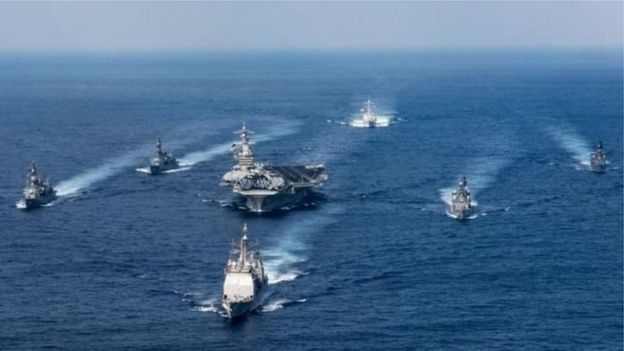
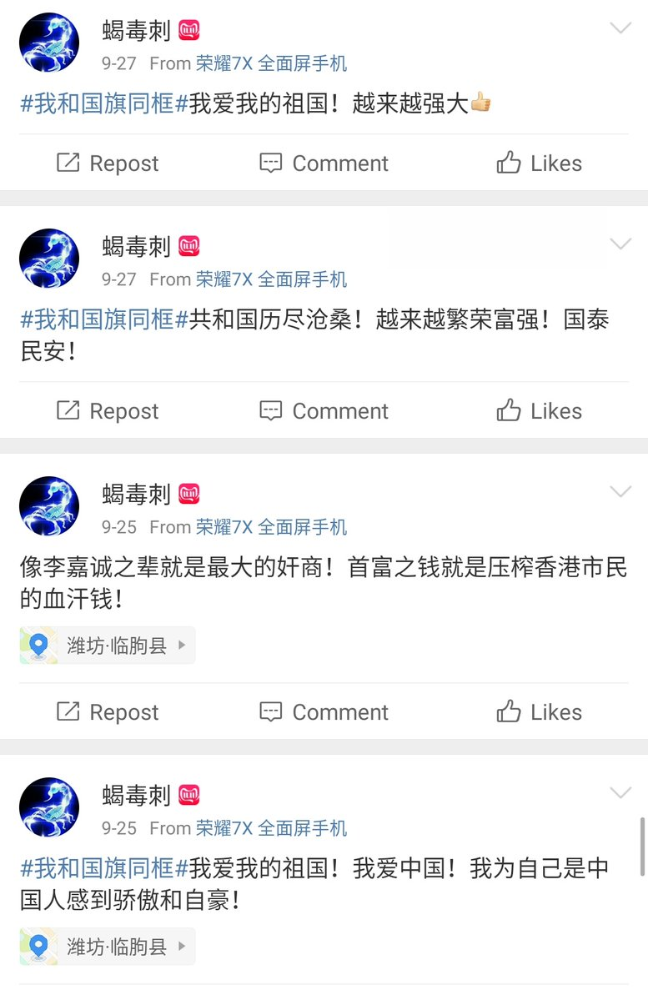

[11月08日 10:19]    新闻大吐槽   @TuCaoFakeNews     https://twitter.com/tucaofakenews/status/1192512810560839680 …  :speech_balloon:评:0 :+1:赞:1 :globe_with_meridians:转:1  

[11月08日 10:15]    纽约时报中文网   @nytchinese    为何中共在香港难以推进国家安全立法 by @ChuBailiang  http://nyti.ms/2PTEbnt https://twitter.com/ccni/status/1192362409719037952 …  :speech_balloon:评:0 :+1:赞:2 :globe_with_meridians:转:0  

[11月08日 10:14]    新闻大吐槽   @TuCaoFakeNews    邓的64，江的flg，xi的香港。都是学毛大杀特杀毫不留情，为啥整不死、整不服呢？一代又一代债越背越多  :speech_balloon:评:0 :+1:赞:3 :globe_with_meridians:转:2  

[11月08日 10:09]    新闻大吐槽   @TuCaoFakeNews    While conniving at retail and drug users, they showed a crackdown posture in front of the US government, extremely hypocritical and ugly. https://twitter.com/TuCaoFakeNews/status/1192619709293744128 …  :speech_balloon:评:0 :+1:赞:1 :globe_with_meridians:转:2  

[11月08日 10:07]    新闻大吐槽   @TuCaoFakeNews    Glory to Hong Kong
恐怕以後只能在異國才能聽到這首樂曲…… https://twitter.com/TuCaoFakeNews/status/1191665290267910145 …  :speech_balloon:评:0 :+1:赞:10 :globe_with_meridians:转:4  

[11月08日 10:04]    纽约时报中文网   @nytchinese    早安！今日重点新闻包括：
中美贸易谈判现曙光；中国制造监控设备流入美政府；中国试图整顿银行系统；乌克兰曾计划答应特朗普“交换条件”；中国判处一名芬太尼走私犯死缓；布隆伯格积极筹备参加2020大选；英国警方证实卡车案39名受害者均为越南籍……NYT简报带你速览今日要闻。 http://nyti.ms/2WRzoo3   :speech_balloon:评:2 :+1:赞:3 :globe_with_meridians:转:2  

[11月08日 09:52]    新闻大吐槽   @TuCaoFakeNews    听着那些红歌就难受！  :speech_balloon:评:0 :+1:赞:4 :globe_with_meridians:转:1  

[11月08日 09:47]    新闻大吐槽   @TuCaoFakeNews    需要演戏给美国看的时候，之前被党护在羽翼下的从犯就被抛出来祭旗~
应判处主犯死刑，即输出芬太尼的决策制定者——共党高官！ https://twitter.com/ttingxiao/status/1192607158845620224 …  :speech_balloon:评:0 :+1:赞:6 :globe_with_meridians:转:2  

[11月08日 09:47]    新闻大吐槽   @TuCaoFakeNews    穿红衣服没转身的好像是教职工，他们估计怕一转身工作就丢了，这也反衬出学生无所畏惧的勇气，香港的未来在年轻人身上！  :speech_balloon:评:0 :+1:赞:2 :globe_with_meridians:转:1  

[11月08日 09:43]    新闻大吐槽   @TuCaoFakeNews    香港的下一代太优秀了，让我们这一代汗颜 https://twitter.com/TuCaoFakeNews/status/1192510433946566657 …  :speech_balloon:评:0 :+1:赞:4 :globe_with_meridians:转:1  

[11月08日 09:36]    新闻大吐槽   @TuCaoFakeNews    @UNHumanRights    Best graduation ceremony  :speech_balloon:评:0 :+1:赞:1 :globe_with_meridians:转:1  

[11月08日 09:33]    新闻大吐槽   @TuCaoFakeNews    这才是国家栋梁，为之动容！按理说不是先放国歌再放校歌吗，校方是不是也不太愿意放国歌  :speech_balloon:评:0 :+1:赞:2 :globe_with_meridians:转:1  

[11月08日 09:32]    新闻大吐槽   @TuCaoFakeNews    所以从幼儿园就要开始洗脑，生怕你有一点点自己的思想。  :speech_balloon:评:0 :+1:赞:3 :globe_with_meridians:转:1  

[11月08日 09:30]    纽约时报中文网   @nytchinese    中国官员正在讨论创建一种与中国的真实货币人民币挂钩、更容易追踪的加密货币。这可能使中国放松对人民币在境外使用方式的限制，同时牢牢保持最终控制权。
中国利用货币控制来加强对金融体系的管理，但长期以来，也一直羡慕美元在世界各地的广泛使用给美国带来的权力与影响力。 http://nyti.ms/33rTszU   :speech_balloon:评:1 :+1:赞:4 :globe_with_meridians:转:0  

[11月08日 09:25]    新闻大吐槽   @TuCaoFakeNews    鲁比奥：要求国防部拆除中国监控设备

美国国会参议员鲁比奥周三致函国防部长埃斯珀，要求国防部拆除所有中国生产的监控摄像机，因为中共可能通过这些设备，渗透和监视美国国安网络以及军事活动。  :speech_balloon:评:0 :+1:赞:13 :globe_with_meridians:转:9  

[11月08日 09:24]    新闻大吐槽   @TuCaoFakeNews    中国小银行接连遭挤兑 专家: 明年更多

11月6号，营口沿海银行发生挤兑事件。这是一周之内发生的第二起银行挤兑事件。在此之前河南洛阳伊川农商行从10月29号起连续三天被挤兑。
引发外界对中国数百家小型银行财政状况的担忧。专家指出由于中国经济下行加剧，明年可能会有更多银行倒闭和挤兑现象出现。  :speech_balloon:评:1 :+1:赞:19 :globe_with_meridians:转:13  

[11月08日 09:17]    新闻大吐槽   @TuCaoFakeNews    涉权钱色交易 广东清远前公安局长落马

贝冰涉嫌权色、钱色交易、以权谋私、收受巨额财物，充当黑恶势力“保护伞”，以权谋私、大肆敛财，收受巨额财物等，构成职务违法并涉嫌受贿犯罪。对当地法轮功学员被绑架、抄家、拘留、判刑、酷刑、洗脑等迫害负有责任。  :speech_balloon:评:0 :+1:赞:14 :globe_with_meridians:转:9  

[11月08日 09:08]    新闻大吐槽   @TuCaoFakeNews    美大规模调查生物医学窃密 涉案多为华裔

近期，美国多部门联手，对盗窃美国“生物医学”知识产权的行为，展开大规模调查。目前涉案的科学家，绝大多数是华裔。美国网路安全公司火眼8月也指出，中共资助的骇客组织APT22，专门攻击美国医疗机构，窃取生物医学相关机密。  :speech_balloon:评:0 :+1:赞:10 :globe_with_meridians:转:7  

[11月08日 09:06]    新闻大吐槽   @TuCaoFakeNews    這才是新移民的真正想法, 來到香港當然是想有自由！ 謝謝這位同學的發言  :speech_balloon:评:0 :+1:赞:9 :globe_with_meridians:转:1  

[11月08日 09:05]    新闻大吐槽   @TuCaoFakeNews    只是要有意志度过眼下的黑暗时期，虽说时间不会太长，但也要一天一天的坚持  :speech_balloon:评:1 :+1:赞:3 :globe_with_meridians:转:1  

[11月08日 08:43]    新闻大吐槽   @TuCaoFakeNews    江天勇再被国保谩骂 评：当局借机关押他

北京维权律师江天勇已经获释八个多月，但是他的一举一动仍然受到当局全天候监控。日前，江天勇再次与挑衅他的国保发生冲突。有分析指出，不排除当局故意激怒江天勇，借机再次关押他。  :speech_balloon:评:1 :+1:赞:12 :globe_with_meridians:转:9  

[11月08日 08:06]    BBC News 中文   @bbcchinese    波音787梦幻客机有安全隐患，而大部分人都不知道？ https://bbc.in/2pHpcCw   :speech_balloon:评:7 :+1:赞:14 :globe_with_meridians:转:8  

[11月08日 07:45]    BBC News 中文   @bbcchinese    弹劾调查的重心聚焦在指控特朗普向乌克兰施压，令其对特朗普的政治对手拜登（Joe Biden）展开调查。 https://bbc.in/2JUGcvR   :speech_balloon:评:3 :+1:赞:7 :globe_with_meridians:转:2  

[11月08日 07:21]    BBC News 中文   @bbcchinese    1989年最令人瞩目的一个大事件便是震惊世界的“柏林墙倒塌”，迄今已整整30周年。 https://bbc.in/33pBQEM   :speech_balloon:评:9 :+1:赞:101 :globe_with_meridians:转:37  

[11月08日 06:51]    BBC News 中文   @bbcchinese    几时签？在哪签？怎么签？ https://bbc.in/2WT5cIX   :speech_balloon:评:5 :+1:赞:18 :globe_with_meridians:转:4  

[11月08日 02:43]    新闻大吐槽   @TuCaoFakeNews    这位香港科技大学一年级新生，是位大陆新移民！
移民来香港无非是为了自由，可恶魔的脚步追着他走，如果香港变成大陆，他就白移民了！所以已经把香港视为家的他，坚定的站在抗争者一边！与手足生死与共！  :speech_balloon:评:17 :+1:赞:235 :globe_with_meridians:转:89  

[11月08日 02:33]    新闻大吐槽   @TuCaoFakeNews    中文大学毕业典礼现场，当奏校歌时，同学们还都面向主席台，可当开始播放红朝国歌时，所有同学全体转身，背对主席台，同时举起标语，高喊时代革命！

香港好同学！世界上所有正义人士都已经为你们亮灯！请转身！  :speech_balloon:评:133 :+1:赞:1589 :globe_with_meridians:转:622  

[11月08日 00:58]    墙国铁拳现世报😷   @Socialistfist    彻底翻了 https://twitter.com/tdtw/status/1192485721698897920 …  :speech_balloon:评:16 :+1:赞:325 :globe_with_meridians:转:63  

[11月07日 22:56]    BBC News 中文   @bbcchinese    止痛药芬太尼的合成药物，因价格低廉而功效更强（能比海洛因强50倍），正越来越多地被美国人当作毒品滥用。 https://bbc.in/2JWq5xW   :speech_balloon:评:14 :+1:赞:61 :globe_with_meridians:转:23  

[11月07日 22:01]    GFHG SDKM   @zyx_yny    Chinese tourists' uncivilised behaviours on the beautiful Miyako Island, Japan: throwing rubbish onto the beach.

Every Wednesday cruise ships carry loads of Chinese tourists to the Island; local residents call it:

"Wednesdays of Demons"  :speech_balloon:评:45 :+1:赞:462 :globe_with_meridians:转:354  

[11月07日 21:34]    BBC News 中文   @bbcchinese    美国宇航局的前高级顾问凯西·劳里尼(Kathy Laurini)的话说，“他们（中国人）设立战略性，长期性的目标，而且为达到这些目标进行专注的，系统性的努力。” https://bbc.in/33tG6CY   :speech_balloon:评:9 :+1:赞:20 :globe_with_meridians:转:7  

[11月07日 21:30]    纽约时报中文网   @nytchinese    根据卢浮宫的调查，大约80%的游客来这里是为看《蒙娜丽莎》——而大多数人离开时都不开心。在这个大众旅游和数字自恋的时代，蒙娜丽莎成了一个反艺术的黑洞，把博物馆翻了个底朝天。
卢浮宫是时候承认失败了。蒙娜丽莎该走了。 http://nyti.ms/33sWuE2   :speech_balloon:评:11 :+1:赞:42 :globe_with_meridians:转:12  

[11月07日 21:00]    纽约时报中文网   @nytchinese    #观点 德国创业者莱茵甘斯让员工把手机放在办公室的包里，并屏蔽公司网络上的社交媒体。严格的规定减少了花在会议上的时间。
或许最重要的是，他的员工如今每天只查看两次工作邮件——没有冗长的来回交流分散他们的注意力，也没有在晚饭时或在场边看孩子打比赛时偷偷查看收件箱。 http://nyti.ms/2NrZF9j   :speech_balloon:评:0 :+1:赞:11 :globe_with_meridians:转:4  

[11月07日 20:30]    纽约时报中文网   @nytchinese    中国国家禁毒委副主任于海滨表示，对涉案人员的重判彰显了中国严惩芬太尼类物质犯罪的立场和决心。他也重申，导致美国芬太尼类物质滥用的主因是其自身原因，中国受到了不公平的指责。
他称即使中国加强了与美国执法机构的合作并加强出口管制，美国药物过量的死亡人数仍在上升。 http://nyti.ms/32pIwRG   :speech_balloon:评:57 :+1:赞:5 :globe_with_meridians:转:4  

[11月07日 20:16]    墙国铁拳现世报😷   @Socialistfist    官媒已经意识到翻船，已经控评  :speech_balloon:评:6 :+1:赞:172 :globe_with_meridians:转:13  

[11月07日 20:01]    BBC News 中文   @bbcchinese    【英国上议院讨论BN(O)居英权问题】英国上议院讨论是否赋予持有BN(O)的香港人居留英国的权利，芬利女男爵认为英国对所有类别的英国护照持有者有道义责任，不能抛弃他们的权利和义务。而前港督则认为英国不能，也不应该试图告诉香港政府怎么做。 https://bbc.in/2Nnnwac   :speech_balloon:评:30 :+1:赞:34 :globe_with_meridians:转:12  

[11月07日 19:57]    GFHG SDKM   @zyx_yny    (Sensitive Content/ 慎入) 

Another death found in Mongkok today/ 大約6點，旺角家樂坊隔離有年輕男子全裸從高處墮下。

#香港 #香港人反抗 #StandWithHongKong #PoliceBrutality  :speech_balloon:评:104 :+1:赞:566 :globe_with_meridians:转:661  

[11月07日 19:52]    纽约时报中文网   @nytchinese    #观点 早上8点到公司，下午1点离开，此后直到第二天早上都不工作。听起来是不是很吸引人？
如今，工作占据了我们越来越多醒着的时间，许多人疲于应付没完没了的工作和爆满的收件箱。一项创新实践说明，可能有更好的方式，让你的大脑以更好、更可持续的方式提供有价值的产出。 http://nyti.ms/2NrZF9j   :speech_balloon:评:9 :+1:赞:22 :globe_with_meridians:转:10  

[11月07日 19:52]    财经真相   @caijingxiang    人民银行于2019年11月7日在香港成功发行300亿元人民币央行票据，其中3个月期央行票据200亿元，1年期央行票据100亿元，中标利率均为2.90%。此次发行受到市场欢迎，全场投标总量超过640亿元，是发行量的2.1倍。以前投标量是发放量的十几倍！  :speech_balloon:评:11 :+1:赞:95 :globe_with_meridians:转:32  

[11月07日 19:01]    BBC News 中文   @bbcchinese    农民少，耕地少，日本在劳动力和耕地严重短缺的情况下，如何推动农业革命，确保国人吃饱、吃好、吃放心？ https://bbc.in/2Q1udjI   :speech_balloon:评:15 :+1:赞:110 :globe_with_meridians:转:50  

[11月07日 19:00]    纽约时报中文网   @nytchinese    在习近平的领导下，中国官员在监管大型科技公司方面采取了更有力的措施，推动它们帮助传播中国共产党倡导的文化价值观。
电子游戏已经成为一个普遍的目标。官方媒体将一些游戏比作“毒药”，并以过于暴力为由，禁掉了一些游戏。 http://nyti.ms/2PV2PUw   :speech_balloon:评:9 :+1:赞:12 :globe_with_meridians:转:6  

[11月07日 18:46]    墙国铁拳现世报😷   @Socialistfist    往期的铁拳都是精确制导战斧
这次的铁拳像是战术型核导弹 https://twitter.com/zhanglucy88/status/1192387643977265152 …  :speech_balloon:评:57 :+1:赞:451 :globe_with_meridians:转:146  

[11月07日 18:37]    墙国铁拳现世报😷   @Socialistfist    门面有价，国旗无价。
丢了门面，得了国旗，
万能的推友们你们说说，她是不是赚了？
图二原微博已经被删
#社会主义铁拳  :speech_balloon:评:40 :+1:赞:333 :globe_with_meridians:转:76  

[11月07日 18:09]    GFHG SDKM   @zyx_yny    @zyx_yny @BannedBigot @Mavis13945654 @JoachimWatson @realKyleOlbert @KerAngry @GuoLibrary @SolomonYue @dewolfleloup @hkdemonow another video appears. Chow didnt run to escape tg. A tall black figure seen in it. He was running fm him  :speech_balloon:评:2 :+1:赞:1 :globe_with_meridians:转:1  

[11月07日 18:01]    BBC News 中文   @bbcchinese    澳大利亚可以避开来自中国的投资、学生以及机会，有时亦确实如此，华为便是一个例子。但是，这样的大规模尝试，例如在印度太平洋寻求其他合作伙伴关系，将意味着巨大的牺牲 https://bbc.in/2JYuCQm   :speech_balloon:评:13 :+1:赞:27 :globe_with_meridians:转:13  

[11月07日 17:51]    纽约时报中文网   @nytchinese    #时报专栏 在描述巴格达迪的临终一幕时，特朗普紧紧围绕“哭喊”、“尖叫”和“抽抽搭搭”几个动词。对名词的选用则是巴格达迪死得“像一条狗”。
对特朗普来说，所有的关系都是交易，世间万物的价值只与抬高他、滋养他的能力有关。而狗对特朗普毫无用处，至少在他关心的那些事情上。 http://nyti.ms/2NT44Rw   :speech_balloon:评:29 :+1:赞:21 :globe_with_meridians:转:4  

[11月07日 17:32]    BBC News 中文   @bbcchinese    【树洞救援队：中国志愿者网络用AI救援自杀者】这个由600多名分布在中国各地的志愿者自发建立的AI救援队，已救回超过700名轻生者。 https://www.bbc.com/zhongwen/simp/science-50313320 …  :speech_balloon:评:3 :+1:赞:25 :globe_with_meridians:转:12  

[11月07日 17:15]    纽约时报中文网   @nytchinese    “极端邪恶”、“严重不道德”：泰国王室的宫闱密事  http://nyti.ms/2PYfjLr https://twitter.com/ccni/status/1192364623955021824 …  :speech_balloon:评:3 :+1:赞:4 :globe_with_meridians:转:0  

[11月07日 17:06]    墙国铁拳现世报😷   @Socialistfist    #社会主义铁拳 https://twitter.com/anebubucho/status/1192294894385025024 …  :speech_balloon:评:13 :+1:赞:136 :globe_with_meridians:转:27  

[11月07日 17:01]    BBC News 中文   @bbcchinese    丹麦绘画大师哈莫修依和他笔下空荡荡的室内场景，始终像谜一般的存在。他的作品唤起寂静，带出一种强烈存在的孤立感。 https://bbc.in/2PYZVhw   :speech_balloon:评:1 :+1:赞:17 :globe_with_meridians:转:8  

[11月07日 17:00]    纽约时报中文网   @nytchinese    中美执法机构联合调查，破获了一个生产并向美国走私芬太尼的庞大地下网络，主犯刘勇被判死刑、缓期两年执行。
美国长期将该国芬太尼泛滥归咎于中国执法不力，甚至是助长毒品流行的共谋行为。此案判决之际，中国谈判代表正试图与美国政府敲定一项贸易协议。 http://nyti.ms/32pIwRG   :speech_balloon:评:17 :+1:赞:43 :globe_with_meridians:转:16  

[11月07日 16:30]    纽约时报中文网   @nytchinese    #图集【遥远的西伯利亚，梦境之地贝加尔湖】俄罗斯贝加尔湖的奥尔洪岛拥有成群的野马、无数萨满教图腾和让人惊叹的壮丽美景。时报“52个地方”旅行者@sebmodak造访此地，留下了属于他的光影印记。
点击查看图集： http://nyti.ms/2JYIycZ   :speech_balloon:评:0 :+1:赞:20 :globe_with_meridians:转:11  

[11月07日 16:03]    BBC News 中文   @bbcchinese    在火车站或地铁设置人脸识别功能的监视系统，你觉得洽当吗？ https://bbc.in/2NpZbk0   :speech_balloon:评:103 :+1:赞:56 :globe_with_meridians:转:15  

[11月07日 16:00]    纽约时报中文网   @nytchinese    此番表态使中国国内对加密货币的兴趣激增。在投资者的推动下，与数字货币有关的本地企业股价飙升，加密货币的忠实支持者则欢欣鼓舞。
“我会开更多矿，”在中国拥有四个加密货币矿的喻伟说。 http://nyti.ms/33rTszU   :speech_balloon:评:52 :+1:赞:13 :globe_with_meridians:转:3  

[11月07日 15:39]    财经真相   @caijingxiang    商务部新闻发言人高峰在7日的新闻发布会上表示，如果(中美)双方达成第一阶段协议，应当根据协议内容，同步等比率取消已加征关税，这是达成协议的重要条件。“同等比率”就是说中国对美国征收1000亿，取消500亿，就是50%，美国5000亿，也要取消50%，即2500亿，而不是500亿!  :speech_balloon:评:83 :+1:赞:290 :globe_with_meridians:转:81  

[11月07日 15:30]    纽约时报中文网   @nytchinese    中国为未成年游戏玩家制定了规则：晚上10点以后不许玩电子游戏、非节假日玩游戏的时间不得超过90分钟、每月充值不超过400元。
中国政府发布了旨在遏制年轻人沉迷电子游戏的新规定，高层官员认为，这个问题是全社会越来越多年轻人出现近视和学习不佳的原因。 http://nyti.ms/2PV2PUw   :speech_balloon:评:72 :+1:赞:154 :globe_with_meridians:转:63  

[11月07日 15:20]    GFHG SDKM   @zyx_yny    What about these ?  :speech_balloon:评:1 :+1:赞:59 :globe_with_meridians:转:31  

[11月07日 15:19]    墙国铁拳现世报😷   @Socialistfist    #社会主义铁拳就是好呀就是好

中央今日宣布放开香港人在大湾区的购房条件，取消工作社保等限制。

护旗手闻讯，哀鸿遍野，如丧考妣。

本条推文链意在展示社会主义铁拳之下神州大地一片生灵涂炭的景象，共计二十多张截图，请大家随意享用，有助于排解郁闷，恢复一天好心情。  :speech_balloon:评:262 :+1:赞:1454 :globe_with_meridians:转:610  

[11月07日 15:00]    纽约时报中文网   @nytchinese    自抗议活动开始以来，中国一直在寻找与其措辞强硬的立场相匹配的有效政策。这个问题或令推出覆盖整个香港地区的国家安全措施的努力受阻，或者付诸东流。
今年早些时候，中国曾暗示可能会派军队到香港帮助结束抗议活动，但此想法不了了之，专家和许多香港人认为这种做法不现实。 http://nyti.ms/2PTEbnt   :speech_balloon:评:6 :+1:赞:11 :globe_with_meridians:转:7  

[11月07日 14:30]    纽约时报中文网   @nytchinese    中国官员已经将比特币等加密货币开采业务从计划取缔的行业名单中移除，习近平上个月也表态支持区块链研究。
观察人士表示，这番表态极有可能是为中国创造自己的数字货币铺平道路，以便加强控制，同时让中国的货币在境外更容易获得。 http://nyti.ms/33rTszU   :speech_balloon:评:12 :+1:赞:31 :globe_with_meridians:转:13  

[11月07日 14:03]    BBC News 中文   @bbcchinese    中国经济差了，网购生意反而好了，马云也更有钱了…… https://bbc.in/2WN6NAe   :speech_balloon:评:71 :+1:赞:76 :globe_with_meridians:转:23  

[11月07日 14:00]    纽约时报中文网   @nytchinese    《纽约时报》/纽约公共图书馆最佳儿童绘本奖获奖名单出炉。今年获奖的绘本有哪些？ http://nyti.ms/2oRMwNg   :speech_balloon:评:0 :+1:赞:2 :globe_with_meridians:转:3  

[11月07日 13:30]    纽约时报中文网   @nytchinese    中共希望通过国家安全立法来平息香港的动乱，但香港的政界人士对可能引发更激烈抗议的安全立法兴趣不大。
许多专家也怀疑，北京能在多大程度上直接将自己的意愿强加于香港的法律体系，而又不会严重危及当地人和国际上对香港特殊地位的信任。 http://nyti.ms/2PTEbnt   :speech_balloon:评:61 :+1:赞:109 :globe_with_meridians:转:44  

[11月07日 13:02]    BBC News 中文   @bbcchinese    英国议会跨党派报告指出，英国大学受专制国家干预，特别是中国及俄罗斯；大学代表则否认遭到系统性干预。大家怎么看？ https://bbc.in/2qxtAnG   :speech_balloon:评:66 :+1:赞:106 :globe_with_meridians:转:35  

[11月07日 13:00]    纽约时报中文网   @nytchinese    #每日一词 A chicken-and-egg issue，先有蛋还是先有鸡？导演马丁·斯科塞斯在时报撰文称，漫威系列这种模式化的产品供应是“一个先有蛋还是先有鸡的问题”，若没完没了地向观众卖这种东西，人们当然就想要更多这种东西。A chicken-and-egg issue指因果难定的情形。更多简报内容： http://nyti.ms/2WQC1q1   :speech_balloon:评:1 :+1:赞:4 :globe_with_meridians:转:0  

[11月07日 12:00]    纽约时报中文网   @nytchinese    弹劾调查首次公开听证会将于下周三开启。美国驻乌克兰最高外交官泰勒等三名高级外交官将赴国会作证。
泰勒此前告诉调查人员，是特朗普的私人律师朱利安尼煽动了向乌克兰施压的运动，泰勒还对军事援助与政治调查之间的“交换条件”做出了明确说明。
更多简报内容： http://nyti.ms/2WQC1q1   :speech_balloon:评:0 :+1:赞:7 :globe_with_meridians:转:2  

[11月07日 11:57]    GFHG SDKM   @zyx_yny    I can’t believe that #hongkong Chief Magistrate Mr SO Wai-tak thinks a”laser pointer pen” is a weapon . It’s ridiculous. 

No more judicial independence in hongkong .  :speech_balloon:评:255 :+1:赞:2104 :globe_with_meridians:转:2147  

[11月07日 11:21]    财经真相   @caijingxiang    猪肉涨的多了，通胀被推高了，没事，把猪在通胀的权限降低就好了！这很中共，猪也必须要有党性！否则就要下调通胀权重！ https://twitter.com/reuterscn/status/1192279082345672705 …  :speech_balloon:评:23 :+1:赞:189 :globe_with_meridians:转:69  

[11月07日 11:17]    财经真相   @caijingxiang    中共外汇管理条例 第39条:有违法规定将境内外汇转移境外，或以欺骗手段逃汇行为的，由外管局责令限期调回外汇，处逃外汇金额30%以下的处罚；情节严重的，处30%以上等值以下的罚款；构成犯罪的，依法追究刑事责任！  :speech_balloon:评:17 :+1:赞:214 :globe_with_meridians:转:85  

[11月07日 11:06]    财经真相   @caijingxiang    满纸便民用汇，理性购汇，核心就一句话：你的钱，政府花！你的美元，权贵拿！  :speech_balloon:评:9 :+1:赞:185 :globe_with_meridians:转:74  

[11月07日 11:02]    BBC News 中文   @bbcchinese    学者说：“这可能意味着，地球上有些地方不再适合人类居住”。 https://bbc.in/2pPsi7c   :speech_balloon:评:10 :+1:赞:38 :globe_with_meridians:转:26  

[11月07日 10:36]    GFHG SDKM   @zyx_yny    A mainland Chinese student was using a knife to threaten the CUHK graduates who were peacefully protesting on campus. He was later taken away by the university security.  

Source: @appledaily_hk
#FreedomHK #HongKongProtests #FightForFreedom #StandwithHK  :speech_balloon:评:101 :+1:赞:735 :globe_with_meridians:转:748  

[11月07日 10:25]    老司机   @h5lpykl7tp6jjop    审判长怒斥被告人：
为啥要走私？
被告人答辩：看见中石化、中石油等国企年年亏损，平均每天亏损额两亿多，我们于心不忍，所以为国分忧……  :speech_balloon:评:0 :+1:赞:35 :globe_with_meridians:转:6  

[11月07日 10:18]    老司机   @h5lpykl7tp6jjop    考智商的新闻！  :speech_balloon:评:4 :+1:赞:54 :globe_with_meridians:转:31  

[11月07日 09:51]    财经真相   @caijingxiang    2018年6月贸易战的影响开始显现，地方政府被迫重新启动新一轮基建，为了筹集基建资金，中共几乎完全放开了地方债发行的所有限制，这些地方债的大头都被当地银行吃进，最终导致这些银行资金流减少，这就是后来央行拼命给中小银行降准的根源。我做的油管视频《从定向降准看背后的维稳逻辑》可以看一下  :speech_balloon:评:3 :+1:赞:122 :globe_with_meridians:转:21  

[11月07日 09:37]    财经真相   @caijingxiang    五月份时，央行连续分阶段大规模下调中小银行准备金率，当时我就觉得这里面很有问题，收集资料后才发现中小银行的大部分资金流都购买了地方政府债，尤其是区域小型市、县级地方银行，几乎成为了地方政府搞基建的提款机！  :speech_balloon:评:4 :+1:赞:126 :globe_with_meridians:转:22  

[11月07日 09:31]    财经真相   @caijingxiang    辽宁营口银行遭到挤兑，嗯，前几天还说大额提现要从严管理，现在知道目的了！快到年底结算时间了，会有更多惊喜出来！  :speech_balloon:评:10 :+1:赞:244 :globe_with_meridians:转:80  

[11月07日 09:13]    BBC News 中文   @bbcchinese    香港特首林郑月娥继早前与中国国家主席习近平会面后，在北京与中国政府主管香港和澳门事务的国务院副总理韩正会面，是三天内再次会见中国高层领导人。 https://bbc.in/32pXNC4   :speech_balloon:评:17 :+1:赞:36 :globe_with_meridians:转:12  

[11月07日 08:12]    BBC News 中文   @bbcchinese    国际媒体报道说，显然地球对于中国的经济雄心来说已经不够大。 https://bbc.in/2NQb9T5   :speech_balloon:评:106 :+1:赞:188 :globe_with_meridians:转:63  

[11月07日 07:51]    BBC News 中文   @bbcchinese    7个东欧国家年龄超过40岁的受访者中，认为今天的世界比1989年柏林墙倒塌前更安全的人还不到四分之一。 https://bbc.in/33ndzyV   :speech_balloon:评:25 :+1:赞:130 :globe_with_meridians:转:50  

[11月07日 07:17]    GFHG SDKM   @zyx_yny    Respect the flag   :speech_balloon:评:60 :+1:赞:2202 :globe_with_meridians:转:1215  

[11月07日 07:15]    BBC News 中文   @bbcchinese    这份报告在结论中还提及，为了保持美国的繁荣富强，“必须在经济层面部分与中国断了来往”（a partial economic disengagement from China）。 https://bbc.in/2Nrv2kt   :speech_balloon:评:35 :+1:赞:141 :globe_with_meridians:转:56  

[11月07日 06:38]    老司机   @h5lpykl7tp6jjop    嗜血罪犯、精神病、小资：俄罗斯颠覆列宁神话
俄罗斯国营第一电视频道（Pervy Kanal）即将播出的18集纪录片系列“列宁”（Lenin）中呈现出来的形象与苏联之前对其形象的宣传的的陈词滥调相距甚远：嗜血罪犯，精神病，小资产阶级。剧本的作者伊戈尔·列宾说，他的目的就是想要“终结苏维埃缔造者的神话”。  :speech_balloon:评:4 :+1:赞:17 :globe_with_meridians:转:9  

[11月07日 06:31]    老司机   @h5lpykl7tp6jjop    中国正处在各种危机越来越火烧眉毛的时候，习近平却突然大谈“区块链”，究竟是习近平卖弄学问，还是区块链技术确实有可能帮他解决中国的治理难题呢？但凡对区块链这个重大发明有点知识的人都知道，发明者的初衷是“去中心化”，而习近平则是一个极端迷信中央集权的人，他怎么突然会对区块链感兴趣了呢  :speech_balloon:评:0 :+1:赞:17 :globe_with_meridians:转:10  

[11月07日 06:08]    老司机   @h5lpykl7tp6jjop    跑得最彻底的中国富豪
有重庆李嘉诚之称的张松桥把342万平物业以55亿元卖给恒大集团，成都7个项目以32亿元卖给融创中国，到目前为止中渝置地几乎抛售了所有房地产，他斥巨资在英国、澳洲等地买下大量物业资产。以101亿元拿下伦敦最高建筑利德贺大楼，花25亿元买下了位于伦敦帕丁顿火车站附近的写字楼。  :speech_balloon:评:22 :+1:赞:327 :globe_with_meridians:转:85  

[11月07日 05:34]    BBC News 中文   @bbcchinese    美国特朗普政府推出印太战略，加强在安全和经济方面抵消中国日益扩大的影响 https://bbc.in/36DyxvB   :speech_balloon:评:7 :+1:赞:31 :globe_with_meridians:转:12  

[11月06日 23:33]    墙国铁拳现世报😷   @Socialistfist    补图  :speech_balloon:评:6 :+1:赞:93 :globe_with_meridians:转:13  

[11月06日 23:33]    墙国铁拳现世报😷   @Socialistfist    研究表明，养猪场播放 「我和我的祖国」等爱国歌曲能有效提升肉质和食用者的爱国情操。
但由于猪肉肉价上涨，不少小粉红出现了营养不良，思想滑坡的不良现象。

#社会主义铁拳  :speech_balloon:评:31 :+1:赞:291 :globe_with_meridians:转:67  

[11月06日 23:30]    老司机   @h5lpykl7tp6jjop    吃草的日子近了！ https://twitter.com/ningxianhua/status/1192068553651970048 …  :speech_balloon:评:3 :+1:赞:27 :globe_with_meridians:转:15  

[11月06日 18:48]    墙国铁拳现世报😷   @Socialistfist    经热心推友补充，男主角是当地国保
坐实铁拳了  :speech_balloon:评:35 :+1:赞:210 :globe_with_meridians:转:63  

[11月06日 11:58]    GFHG SDKM   @zyx_yny    We've got a Telegram group collecting and analyzing OSINT material. We've got a decent timeline now. DM for invite. https://twitter.com/zyx_yny/status/1191923574912831489 …  :speech_balloon:评:0 :+1:赞:4 :globe_with_meridians:转:4  

[11月06日 11:47]    GFHG SDKM   @zyx_yny    Calling for more video footage or images of police vehicles impeding ambulance trying to save student Chow. Please clearly state the time the photo/video was taken. Tg admin wants more evidence.

#HKprotests https://twitter.com/zyx_yny/status/1191923574912831489 …  :speech_balloon:评:0 :+1:赞:6 :globe_with_meridians:转:9  

[11月06日 11:41]    GFHG SDKM   @zyx_yny    有冇手足有警蛆車阻救護車救周同學嘅片or相。請註明時間。tg谷admin收集緊證據
#HKprotests  :speech_balloon:评:1 :+1:赞:2 :globe_with_meridians:转:4  

[11月06日 11:30]    老司机   @h5lpykl7tp6jjop    就是你在银行存了很多钱，现在想一次取10万，或者你的企业一次想取50万，对不起，他们要背着你商量一下，取不取给你，要看你怎么证明你必需要取这笔钱急用 ! 哪怕是取来救命，那也得要医院给你出证明 ! 这跟取大额现金提前申报是两码事 ! 为啥要这样做 ? 他们说预防犯罪 ! 其实就是缸里没米了......  :speech_balloon:评:33 :+1:赞:310 :globe_with_meridians:转:138  

[11月06日 11:23]    老司机   @h5lpykl7tp6jjop    曾经中国人也是这个样子，说世界人民都生活在水深火热之中，说要解放全世界！
后来才知道，在那个斗志昂扬的年代，饿死了几千万中国人。  :speech_balloon:评:49 :+1:赞:586 :globe_with_meridians:转:250  

[11月06日 11:15]    老司机   @h5lpykl7tp6jjop    中共的一带一路没有走出去，黑哥的一带一路一串串的冲进来了！现在是烫手山芋，无法解决，后患无穷！  :speech_balloon:评:5 :+1:赞:26 :globe_with_meridians:转:15  

[11月06日 11:06]    老司机   @h5lpykl7tp6jjop    现在老子又出来缴械投降了！  :speech_balloon:评:3 :+1:赞:6 :globe_with_meridians:转:2  

[11月06日 10:01]    老司机   @h5lpykl7tp6jjop    今日网评：什么是正确的价值观？  :speech_balloon:评:1 :+1:赞:9 :globe_with_meridians:转:11  

[11月06日 09:37]    财经真相   @caijingxiang    截止到今天各省市财政一般收入媒体已经报道过了，但是支出各省数据还未全部公布出来，我过几天整理出来，相信很有冲击力！  :speech_balloon:评:6 :+1:赞:114 :globe_with_meridians:转:21  

[11月06日 09:34]    GFHG SDKM   @zyx_yny    何妖被斬，請冷處理。 否則變民鬥民，雙方武力升級，香港人冇著數(普通人帶𠝹刀都拉，藍絲出菜刀都冇事) 
 
佢亦暫時仲係立法會議員，高調慶祝等如認可對政客暴力。
 
開香檳，私下開算喇。  :speech_balloon:评:33 :+1:赞:241 :globe_with_meridians:转:91  

[11月06日 08:30]    GFHG SDKM   @zyx_yny    The people of Hong Kong are under assault by Communist China. They deserve our full support in their pursuit of freedom.

#HongKongHumanRightsAndDemocracyAct  :speech_balloon:评:2158 :+1:赞:12399 :globe_with_meridians:转:8075  

[11月06日 06:48]    老司机   @h5lpykl7tp6jjop    近几日，一则“走私僵尸肉上餐桌，最高肉龄超40年”的帖子上了热搜，一时间关于“僵尸肉”、“冷冻肉”的议论铺天盖地；什么是僵尸肉？肉龄超过40年还能吃吗？
改革开放当年走私手表，收录机，电视机，出口猪肉粮食蔬菜水果，几十年以后反过来，走私的改成出口的，出口的改成走私的，这是发展了还是倒退了？  :speech_balloon:评:3 :+1:赞:9 :globe_with_meridians:转:3  

[11月06日 06:35]    老司机   @h5lpykl7tp6jjop    北京马拉松女跑者偷能量胶发图炫耀
偷拿东西不以为耻反以为荣，中国人道德没底线到了没有最低只有更低的地步！  :speech_balloon:评:4 :+1:赞:25 :globe_with_meridians:转:14  

[11月06日 00:14]    GFHG SDKM   @zyx_yny    有冇英文文宣手足 https://twitter.com/Jim97147570/status/1191499676475785216 …  :speech_balloon:评:0 :+1:赞:2 :globe_with_meridians:转:2  

[11月05日 22:52]    GFHG SDKM   @zyx_yny    Here is the video  :speech_balloon:评:5 :+1:赞:124 :globe_with_meridians:转:124  

[11月05日 22:27]    财经真相   @caijingxiang    前一段时间纳瓦罗说12月的关税是为了第二阶段谈判准备的筹码，美国官方至今没有明确表示完全取消这笔关税，只是回应说双方谈的很好，很快签第一阶段的协议，但是市场吊诡的是不但计价了正式签协议，还把12月份取消关税纳入其中，乐观情绪甚至把中方单边提出的取消9月份关税也计价了！  :speech_balloon:评:7 :+1:赞:56 :globe_with_meridians:转:9  

[11月05日 22:14]    财经真相   @caijingxiang    Politico和英国金融时报都报道称中国希望取消9月加征的关税，甚至争取取消所有关税，对此美国方面还未对此作出回应，但是市场竟然提前计价了，股市更是创下新高。现在特朗普的麻烦是，如果否认那么股市就会大跌，如果公开证实传言，则会对引发特朗普退让的指责，股市绑架下，干脆只能装聋作哑！ https://twitter.com/reuterscn/status/1191567937011961859 …  :speech_balloon:评:24 :+1:赞:130 :globe_with_meridians:转:33  

[11月05日 22:02]    财经真相   @caijingxiang    随着贸易战深入，美国贸易逆差缩小值创下三年最高，特朗普真的成功了吗？ https://twitter.com/zerohedge/status/1191712574989066240 …  :speech_balloon:评:9 :+1:赞:45 :globe_with_meridians:转:7  

[11月05日 20:17]    GFHG SDKM   @zyx_yny    #LIVE: It's been a month since HK leader, Carrie Lam, invoked the Emergency Regulations Ordinance and enacted the mask ban. Yet, people are not deterred. Hundreds gather in Tsim Sha Tsui. "We are not scared of dying; we use our deaths to threaten you," they chant. #antiELAB  :speech_balloon:评:14 :+1:赞:274 :globe_with_meridians:转:204  

[11月05日 19:54]    老司机   @h5lpykl7tp6jjop    中共患有强迫性精神病！它什么都想控制，上管天下管地，中间管空气，管思想管情绪还管生殖器！大街小巷楼房商场任何角落都有无数监视器，买菜刀剪刀实名制登记，上网登记，乘车乘船乘机登记，什么人脸视别，动态识别，挖空心思来监控人民，可它仍然不放心！莎翁说过：无限的权力只会毁掉它的占有者！  :speech_balloon:评:2 :+1:赞:70 :globe_with_meridians:转:13  

[11月05日 19:25]    墙国铁拳现世报😷   @Socialistfist    丈夫民警妻子教师，生第三胎被单位双双开除。

#社会主义铁拳  :speech_balloon:评:51 :+1:赞:436 :globe_with_meridians:转:149  

[11月05日 18:43]    GFHG SDKM   @zyx_yny    We put the student in our prayers. https://twitter.com/li8jim/status/1191621688909123584 …  :speech_balloon:评:358 :+1:赞:4408 :globe_with_meridians:转:2813  

[11月05日 18:35]    新闻大吐槽   @TuCaoFakeNews    香港年轻人在伦敦圣潘克拉斯国际车站演奏钢琴版「荣光归于香港」！
远在异国的他，悲愤随着他有力的指尖撞击在琴键上，散播在空气中！他在为脑干死亡的手足痛心吗？

匆匆行人啊，能否停下脚步，聆听些许他对自由的向往？他们可是在用血和恶魔搏斗！
国际社会，请救救香港人！  :speech_balloon:评:132 :+1:赞:2836 :globe_with_meridians:转:1032  

[11月05日 18:23]    财经真相   @caijingxiang    提前计价取消9月份的关税，这个明显是忽悠！  :speech_balloon:评:8 :+1:赞:29 :globe_with_meridians:转:4  

[11月05日 18:22]    财经真相   @caijingxiang    一外资行交易员表示，近日中美谈判利好不断，市场普遍处于乐观氛围中，加上此前并未过多期望已加征的关税能够取消，今天媒体相关报导远超预期，推动人民币强势走升。
“市场现在很敏感，今天这波走升比前两天要坚决一些，“不过对自营盘而言现在去追并不是好的策略，更多是在区间的边界上进行操作。 https://twitter.com/ReutersCN/status/1191654970690588672 …  :speech_balloon:评:6 :+1:赞:51 :globe_with_meridians:转:13  

[11月05日 18:12]    GFHG SDKM   @zyx_yny    When this student dies over #extraditionlaw, his blood is on Commiessar Lam's hands!  :speech_balloon:评:411 :+1:赞:2580 :globe_with_meridians:转:1940  

[11月05日 17:50]    GFHG SDKM   @zyx_yny    Hundreds of #HK secondary students hold masked protests on 1mo anniversary of executive edict banning masks & also object to recent arrests of fellow students. #香港人反抗  https://www.scmp.com/news/hong-kong/politics/article/3036355/hong-kong-pupils-cover-faces-citywide-protests-marking-one …  :speech_balloon:评:5 :+1:赞:277 :globe_with_meridians:转:196  

[11月05日 16:32]    财经真相   @caijingxiang    破7前是顶，破7后是底！这个基本面还未改变，接下来要看央行中间价会不会大举破7！  :speech_balloon:评:8 :+1:赞:82 :globe_with_meridians:转:6  

[11月05日 16:21]    财经真相   @caijingxiang    人民币涨破7了，而且是在央行MLF降息的情况下进行的，宽松货币汇率升值，这操作就问你服不服！第一阶段协议的利好消化的差不多了，情绪乐观有点过度了，甚至开始计价减掉部分产品的关税，我的策略是继续做空，随便拉！  :speech_balloon:评:42 :+1:赞:306 :globe_with_meridians:转:56  

[11月05日 11:29]    财经真相   @caijingxiang    MLF降息5基点，股市涨疯了！  :speech_balloon:评:23 :+1:赞:151 :globe_with_meridians:转:21  

[11月05日 11:26]    GFHG SDKM   @zyx_yny    Did any reporter capture this "FAKE" @hkpoliceforce cop assigned code? Reporters need to ask if there arePeople's Armed Police cops in Hong Kong in #HKPF uniform as riot cops. https://twitter.com/themonma/status/1191509700153495554 …  :speech_balloon:评:324 :+1:赞:4759 :globe_with_meridians:转:4178  

[11月05日 11:11]    老司机   @h5lpykl7tp6jjop    好文转发：我是怎样变成一个孤家寡人的
文/豆腐
2019/11/03  :speech_balloon:评:0 :+1:赞:26 :globe_with_meridians:转:9  

[11月05日 10:43]    老司机   @h5lpykl7tp6jjop    无法统计有多少人在问候这位专家全家！  :speech_balloon:评:8 :+1:赞:61 :globe_with_meridians:转:29  

[11月05日 09:51]    老司机   @h5lpykl7tp6jjop    香港街頭，共軍指揮官普通話訓斥下屬軍人：

這是大陸軍人參與鎮壓香港市民的鐵證！

保存好，看西方國家裝聾作啞到幾時？！  :speech_balloon:评:46 :+1:赞:352 :globe_with_meridians:转:257  

[11月05日 09:47]    墙国铁拳现世报😷   @Socialistfist    发推后，该用户微博改名，头像更换，微博删除至2016年内容  :speech_balloon:评:2 :+1:赞:101 :globe_with_meridians:转:10  

[11月05日 09:26]    老司机   @h5lpykl7tp6jjop    中共引进马列的邪恶理论制造了共产主义神话，它们砸烂了中国几千年沉重的传统，得到了政权，可是这个叫共产主义的神话在饿死了几千万人之后在人们心中轰然崩塌，但政权却在它们黑暗的组织系统掌控下牢牢掌握，它们不停的编造各种理论，但始终不能涉及文明进步，因为阴暗邪恶的魔鬼要吸干人血进入地狱！  :speech_balloon:评:2 :+1:赞:12 :globe_with_meridians:转:4  

[11月05日 09:18]    财经真相   @caijingxiang    中国央行：为推动大额现金管理工作，探索大额现金管理实现路径，中国人民银行起草了《中国人民银行关于在河北省、浙江省、深圳市试点开展大额现金管理的通知（公开征求意见稿）》。  :speech_balloon:评:29 :+1:赞:180 :globe_with_meridians:转:67  

[11月05日 08:53]    老司机   @h5lpykl7tp6jjop    突发！王思聪宣布破产， 股份被冻结......
破巢之下，岂有完卵？2019是中共大崩溃总爆发的开始，各种消息不断出现，大家留心看，天天都有新鲜不断出现！

 https://mp.weixin.qq.com/s/TfGVob-BNFq2kk0WpovqDA …  :speech_balloon:评:38 :+1:赞:257 :globe_with_meridians:转:82  

[11月05日 04:28]    凡賽堤/FORSETI   @FecharCCP    急救香港  #HKSOS！！！

天滅流氓政權！！！極權殺人恐怖組織正在用各種兇殘手段殺害我們的同胞..................................................

流氓政權的極權殺人恐怖組織蓄意謀殺香港年輕人！（13）

被暴力制服的年輕人已經休克，還殘暴折斷手！

兇殘，殘暴手段令人髮指到已經超越納粹！  :speech_balloon:评:0 :+1:赞:3 :globe_with_meridians:转:10  

[11月05日 04:25]    凡賽堤/FORSETI   @FecharCCP    急救香港  #HKSOS！！！

天滅流氓政權！！！極權殺人恐怖組織正在用各種兇殘手段殺害我們的同胞..................................................

流氓政權的極權殺人恐怖組織蓄意謀殺香港年輕人！（12）
兇殘，殘暴手段令人髮指到已經超越納粹！
天滅流氓政權！！！  :speech_balloon:评:1 :+1:赞:8 :globe_with_meridians:转:9  

[11月05日 04:24]    凡賽堤/FORSETI   @FecharCCP    急救香港  #HKSOS！！！

天滅流氓政權！！！極權殺人恐怖組織正在用各種兇殘手段殺害我們的同胞..................................................

流氓政權的極權殺人恐怖組織蓄意謀殺香港年輕人！（11）
兇殘，殘暴手段令人髮指到已經超越納粹！
天滅流氓政權！！！  :speech_balloon:评:0 :+1:赞:51 :globe_with_meridians:转:47  

[11月05日 04:23]    凡賽堤/FORSETI   @FecharCCP    急救香港  #HKSOS！！！

天滅流氓政權！！！極權殺人恐怖組織正在用各種兇殘手段殺害我們的同胞..................................................

流氓政權的極權殺人恐怖組織蓄意謀殺香港年輕人！（10）
兇殘，殘暴手段令人髮指到已經超越納粹！
天滅流氓政權！！！  :speech_balloon:评:0 :+1:赞:4 :globe_with_meridians:转:5  

[11月05日 04:19]    凡賽堤/FORSETI   @FecharCCP    急救香港  #HKSOS！！！

天滅流氓政權！！！極權殺人恐怖組織正在用各種兇殘手段殺害我們的同胞..................................................

流氓政權的極權殺人恐怖組織蓄意謀殺香港年輕人！（9）
兇殘，殘暴手段令人髮指到已經超越納粹！
天滅流氓政權！！！  :speech_balloon:评:1 :+1:赞:6 :globe_with_meridians:转:7  

[11月05日 04:16]    凡賽堤/FORSETI   @FecharCCP    急救香港  #HKSOS！！！

天滅流氓政權！！！極權殺人恐怖組織正在用各種兇殘手段殺害我們的同胞..................................................

流氓政權的極權殺人恐怖組織蓄意謀殺香港年輕人！（8）
兇殘，殘暴手段令人髮指到已經超越納粹！
天滅流氓政權！！！  :speech_balloon:评:1 :+1:赞:44 :globe_with_meridians:转:57  

[11月05日 04:13]    凡賽堤/FORSETI   @FecharCCP    急救香港SOS！！！

天滅流氓政權！！！極權殺人恐怖組織正在用各種兇殘手段殺害我們的同胞..................................................

流氓政權的極權殺人恐怖組織蓄意謀殺香港年輕人！（7）
兇殘，殘暴手段令人髮指到已經超越納粹！
天滅流氓政權！！！  :speech_balloon:评:2 :+1:赞:14 :globe_with_meridians:转:20  

[11月05日 04:10]    凡賽堤/FORSETI   @FecharCCP    急救香港SOS！！！

天滅流氓政權！！！極權殺人恐怖組織正在用各種兇殘手段殺害我們的同胞..................................................

流氓政權的極權殺人恐怖組織蓄意謀殺香港年輕人！（6）
兇殘，殘暴手段令人髮指到已經超越納粹！
天滅流氓政權！！！  :speech_balloon:评:1 :+1:赞:40 :globe_with_meridians:转:41  

[11月05日 04:07]    凡賽堤/FORSETI   @FecharCCP    急救香港SOS！！！

天滅流氓政權！！！極權殺人恐怖組織正在用各種兇殘手段殺害我們的同胞..................................................

流氓政權的極權殺人恐怖組織蓄意謀殺香港年輕人！（5）
兇殘，殘暴手段令人髮指到已經超越納粹！
天滅流氓政權！！！  :speech_balloon:评:0 :+1:赞:2 :globe_with_meridians:转:0  

[11月05日 04:06]    凡賽堤/FORSETI   @FecharCCP    急救香港SOS！！！

天滅流氓政權！！！極權殺人恐怖組織正在用各種兇殘手段殺害我們的同胞..................................................

流氓政權的極權殺人恐怖組織蓄意謀殺香港年輕人！（3）
兇殘，殘暴手段令人髮指到已經超越納粹！
天滅流氓政權！！！  :speech_balloon:评:1 :+1:赞:10 :globe_with_meridians:转:15  

[11月05日 04:05]    凡賽堤/FORSETI   @FecharCCP    急救香港SOS！！！

天滅流氓政權！！！極權殺人恐怖組織正在用各種兇殘手段殺害我們的同胞..................................................

流氓政權的極權殺人恐怖組織蓄意謀殺香港不同意見的議員！（2）

兇殘，殘暴手段令人髮指到已經超越納粹！
天滅流氓政權！！！  :speech_balloon:评:0 :+1:赞:3 :globe_with_meridians:转:3  

[11月05日 04:04]    凡賽堤/FORSETI   @FecharCCP    急救香港SOS！！！

天滅流氓政權！！！極權殺人恐怖組織正在用各種兇殘手段殺害我們的同胞..................................................

流氓政權的極權殺人恐怖組織蓄意謀殺香港年輕人！（1）
兇殘，殘暴手段令人髮指到已經超越納粹！
天滅流氓政權！！！  :speech_balloon:评:1 :+1:赞:8 :globe_with_meridians:转:7  

[11月05日 03:49]    GFHG SDKM   @zyx_yny    Today's Daily at King Cross.
A Hong Kong youth was playing <Glory to Hong Kong> piano version in St. Pancras Int station.  :speech_balloon:评:125 :+1:赞:2487 :globe_with_meridians:转:1306  

[11月04日 22:43]    墙国铁拳现世报😷   @Socialistfist    #社会主义铁拳 https://twitter.com/Time_HorizonX/status/1191288775348908032 …  :speech_balloon:评:16 :+1:赞:325 :globe_with_meridians:转:89  

[11月04日 22:04]    老司机   @h5lpykl7tp6jjop    希望国内多出现这样的作品。  :speech_balloon:评:28 :+1:赞:507 :globe_with_meridians:转:269  

[11月04日 13:33]    财经真相   @caijingxiang    猪肉涨了，鸡肉也要涨了！  :speech_balloon:评:52 :+1:赞:191 :globe_with_meridians:转:59  

[11月04日 06:57]    财经真相   @caijingxiang    据香港特区政府网站消息，11月5日，特首林郑月娥将出席第二届上海进博会，晚上则转往北京，次日上午将与国务院副总理韩正举行会见，下午出席粤港澳大湾区建设领导小组第三次全体会议。  :speech_balloon:评:7 :+1:赞:106 :globe_with_meridians:转:23  

[11月03日 08:23]    凡賽堤/FORSETI   @FecharCCP    他們不配稱警察，他們是納粹的狗！魔鬼般的瘋狗！

極權殺人恐怖組織正在用各種兇殘手段殺害我們的同胞..................................................

滅絕人性對待老人  :speech_balloon:评:4 :+1:赞:45 :globe_with_meridians:转:44  

[11月03日 08:16]    凡賽堤/FORSETI   @FecharCCP    他們不配稱警察，他們是納粹的狗！魔鬼般的瘋狗！

極權殺人恐怖組織正在用各種兇殘手段殺害我們的同胞..................................................

無辜港民被納粹的狗打破頭！  :speech_balloon:评:1 :+1:赞:4 :globe_with_meridians:转:3  

[11月03日 08:12]    凡賽堤/FORSETI   @FecharCCP    他們不配稱警察，他們是納粹的狗！魔鬼般的瘋狗！

極權殺人恐怖組織正在用各種兇殘手段殺害我們的同胞..................................................

我們唯一能救她們的就是瘋狂轉發，讓全世界都知道！才有可能不會極權殺人恐怖組織暗殺，被墜樓，被自殺，被棄屍！  :speech_balloon:评:0 :+1:赞:6 :globe_with_meridians:转:6  

[11月03日 08:05]    凡賽堤/FORSETI   @FecharCCP    他們不配稱警察，他們是納粹的狗！魔鬼般的瘋狗！

極權殺人恐怖組織正在用各種兇殘手段殺害我們的同胞..................................................

我們唯一能救她們的就是瘋狂轉發，讓全世界都知道！才有可能不會極權殺人恐怖組織暗殺，被墜樓，被自殺，被棄屍！  :speech_balloon:评:4 :+1:赞:29 :globe_with_meridians:转:29  

[11月03日 07:58]    凡賽堤/FORSETI   @FecharCCP    極權殺人恐怖組織正在用各種兇殘手段殺害我們的同胞..................................................

我們唯一能救她們的就是瘋狂轉發，讓全世界都知道！才有可能不會極權殺人恐怖組織暗殺，被墜樓，被自殺，被棄屍！  :speech_balloon:评:0 :+1:赞:2 :globe_with_meridians:转:5  

[11月03日 07:45]    凡賽堤/FORSETI   @FecharCCP    極權殺人恐怖組織正在用各種兇殘手段殺害我們的同胞..................................................

我們唯一能救她們的就是瘋狂轉發，讓全世界都知道！才有可能不會極權殺人恐怖組織暗殺，被墜樓，被自殺，被棄屍！  :speech_balloon:评:16 :+1:赞:576 :globe_with_meridians:转:626  

[11月03日 07:44]    凡賽堤/FORSETI   @FecharCCP    極權殺人恐怖組織正在用各種兇殘手段殺害我們的同胞..................................................

我們唯一能救她們的就是瘋狂轉發，讓全世界都知道！才有可能不會極權殺人恐怖組織暗殺，被墜樓，被自殺，被棄屍！  :speech_balloon:评:30 :+1:赞:637 :globe_with_meridians:转:775  

[11月03日 07:36]    凡賽堤/FORSETI   @FecharCCP    極權殺人恐怖組織正在用各種兇殘手段殺害我們的同胞..................................................

大陸軍警蒙面扮港民  :speech_balloon:评:2 :+1:赞:146 :globe_with_meridians:转:151  

[11月02日 22:35]    墙国铁拳现世报😷   @Socialistfist    小编谨代表墙国铁拳现世报读者欢迎您来推特。
看来上次强拆不但把你村邻居房子拆了，还把你的防火墙也给拆了嘛 https://twitter.com/Xiuxianlu/status/1190623728545062912 …  :speech_balloon:评:8 :+1:赞:161 :globe_with_meridians:转:18  

[11月02日 18:26]    墙国铁拳现世报😷   @Socialistfist    如此猖狂, 举报头像来一波？  :speech_balloon:评:3 :+1:赞:102 :globe_with_meridians:转:8  

[11月02日 18:12]    墙国铁拳现世报😷   @Socialistfist    P1 头像煽动颠覆
P2 韭菜谈奴性  :speech_balloon:评:9 :+1:赞:141 :globe_with_meridians:转:18  

[11月02日 18:06]    墙国铁拳现世报😷   @Socialistfist    别人家被强拆，可以接受
别人家被强拆，自己被拔了网线，是万万不能接受的

#社会主义铁拳  :speech_balloon:评:36 :+1:赞:356 :globe_with_meridians:转:98  

[11月01日 19:31]    墙国铁拳现世报😷   @Socialistfist    掐指一算，已经是两周了。希望兔兔可以被善待  :speech_balloon:评:14 :+1:赞:118 :globe_with_meridians:转:15  

[11月01日 17:39]    墙国铁拳现世报😷   @Socialistfist    可惜北京的青天习老爷不玩微博

#社会主义铁拳  :speech_balloon:评:23 :+1:赞:267 :globe_with_meridians:转:63  

[11月01日 00:15]    财经真相   @caijingxiang    中共发行的数字货币究竟目的是什么？答案是毁灭全世界，摧毁美元世界霸权，进而摧毁世界贸易体系，再摧毁世界经济，最终将世界变成人间炼狱！  :speech_balloon:评:121 :+1:赞:511 :globe_with_meridians:转:239  

[10月31日 17:56]    墙国铁拳现世报😷   @Socialistfist    就当是给祖国母亲的生日礼物了~

#社会主义铁拳  :speech_balloon:评:31 :+1:赞:369 :globe_with_meridians:转:74  

[10月31日 06:13]    墙国铁拳现世报😷   @Socialistfist    香港导演争当护旗手！
结果当他翻拍鹿鼎记时，剧本翻来覆去修改多次，中共还是不予批准！

护旗手就是要给党折磨的
@Socialistfist  :speech_balloon:评:67 :+1:赞:557 :globe_with_meridians:转:137  

[10月09日 00:47]    GFHG SDKM   @zyx_yny    "Son, when you grow up
You will be the savior of the broken
The beaten, and the damned?"
Please watch this powerful mv #HongKongProtester #hkprotests 
香港反送中護法戰爭(Hong Kong Defensive War 2019)：Welcome To The Black Parade  https://youtu.be/0yXTHODE24Q  via @YouTube  :speech_balloon:评:3 :+1:赞:17 :globe_with_meridians:转:4  

[10月05日 09:33]    凡賽堤/FORSETI   @FecharCCP    呼籲請求共同挖掘所有有關香港發生的事，越全面越好，不同角度，越多越好，包括被暗地抓捕的人員，特別是CCP 派出的各種偽裝身份，包括變身變裝行兇的一點一滴都要挖掘出來，把CCP 的邪惡下三濫手段的真相毫無保留的曝光在全世界面前！世界公知公義才能真正挽救和保護香港人！希望懂視頻編輯配上中英文 https://twitter.com/hjjohnson17/status/1178969916499746816 …  :speech_balloon:评:13 :+1:赞:20 :globe_with_meridians:转:11  

[03月13日 08:10]    老司机   @h5lpykl7tp6jjop    批评是批评家天生的使命！他们只感知对错，信奉真理，指出真相不吐不快，不在意权势和群众的喜好，从批评里不可能获得任何好处，但批评家愚直不改。在中国几乎所有人都讨厌批评家，喜欢阴谋家，因为他们只说好听的！可是就因为中国的批评家太少，中国几乎看不到未来和希望！  :speech_balloon:评:86 :+1:赞:201 :globe_with_meridians:转:41  

