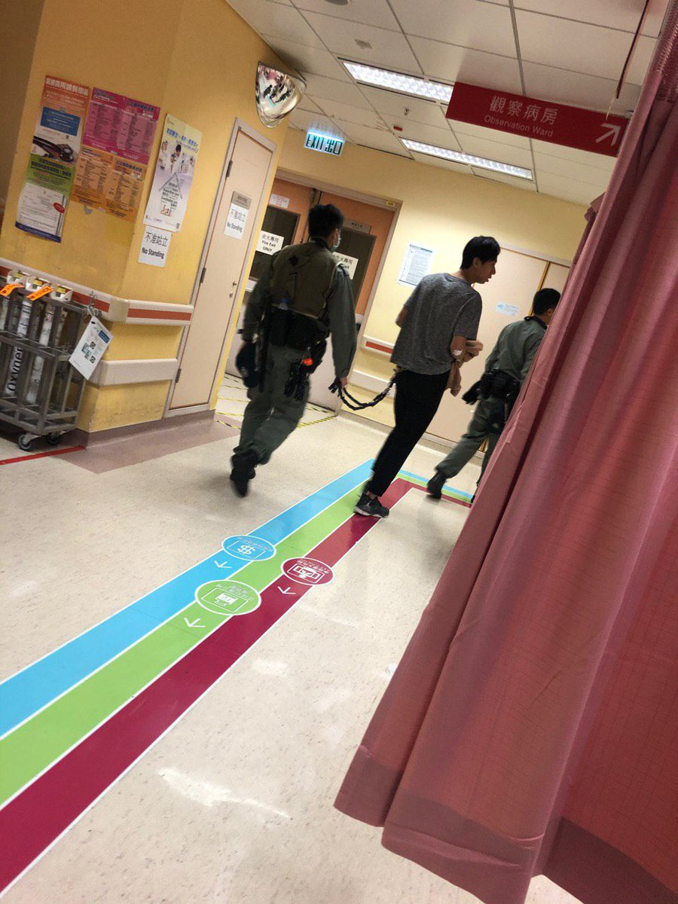

[11月12日 01:49]    GFHG SDKM   @zyx_yny    玻利維亞宣佈推翻Evo Morales的暴政了，他們的警察倒戈加入市民，最後與市民在奧魯羅一同慶祝。
警察的職責是保護市民，而不是與民為敵。
為何香港警察可以如此泯滅人性？
#stnadwithHK https://twitter.com/ThomasVLinge/status/1193644580471791616 …  :speech_balloon:评:6 :+1:赞:21 :globe_with_meridians:转:10  

[11月12日 01:48]    新闻大吐槽   @TuCaoFakeNews    不拆了这堵墙，美国很难赢。  :speech_balloon:评:1 :+1:赞:3 :globe_with_meridians:转:1  

[11月12日 01:44]    GFHG SDKM   @zyx_yny    如果今次輸咗 我會自殺
我寧願死 都唔會俾中共統治乖乖做順民
我依家出街都會帶把刀 如果有休班狗或者臥底出現 我唔介意跌把刀喺佢地身上
今日真係好難過 點解仲可以平行時空
大學校園慢慢失守 遲啲屋企都唔安全
黑警姦你個女仲要俾你睇  :speech_balloon:评:3 :+1:赞:1 :globe_with_meridians:转:0  

[11月12日 01:42]    新闻大吐槽   @TuCaoFakeNews    今日中文大學的二號橋之戰的聲明  :speech_balloon:评:0 :+1:赞:27 :globe_with_meridians:转:18  

[11月12日 01:41]    新闻大吐槽   @TuCaoFakeNews     https://twitter.com/TuCaoFakeNews/status/1193702694835253248?s=19 …  :speech_balloon:评:0 :+1:赞:1 :globe_with_meridians:转:1  

[11月12日 01:34]    GFHG SDKM   @zyx_yny     So sorry you guys have to come out

 It's what we should do

 It's so hard on you , I'm so sorry 
 #Hongkong is our home, we're family. No need to apologise

 Nothing must happen to any of you! Be careful of popo! Don't die!

 Yes we'll take care. Stay safe too! https://twitter.com/JoyceCh78833761/status/1193802445723324416 …  :speech_balloon:评:0 :+1:赞:8 :globe_with_meridians:转:6  

[11月12日 01:34]    新闻大吐槽   @TuCaoFakeNews    还真是，在大陆野蛮惯了，大陆人也习惯了。到了香港，到了海外，那就不同了，不是有钱有枪你就想干什么干什么。人们心中的捍卫的民主自由是永远灭不掉的！ https://twitter.com/tucaofakenews/status/1193702694835253248 …  :speech_balloon:评:1 :+1:赞:6 :globe_with_meridians:转:3  

[11月12日 01:18]    GFHG SDKM   @zyx_yny    Thank you for everthing and please continue to stand by us with the spread of words  :speech_balloon:评:0 :+1:赞:1 :globe_with_meridians:转:1  

[11月12日 01:12]    新闻大吐槽   @TuCaoFakeNews    林郑港府以及背后的中共才是香港动乱的根本原因 https://twitter.com/TuCaoFakeNews/status/1193869291700940800 …  :speech_balloon:评:1 :+1:赞:2 :globe_with_meridians:转:1  

[11月12日 01:08]    新闻大吐槽   @TuCaoFakeNews    納睟远不如共 https://twitter.com/tucaofakenews/status/1193805895525785600 …  :speech_balloon:评:0 :+1:赞:3 :globe_with_meridians:转:2  

[11月12日 01:07]    新闻大吐槽   @TuCaoFakeNews    就是!问得好!疑点重重  :speech_balloon:评:0 :+1:赞:2 :globe_with_meridians:转:1  

[11月12日 01:07]    新闻大吐槽   @TuCaoFakeNews    就一群病豬想管理人類啊 https://twitter.com/TuCaoFakeNews/status/1193702694835253248 …  :speech_balloon:评:0 :+1:赞:4 :globe_with_meridians:转:1  

[11月12日 01:06]    新闻大吐槽   @TuCaoFakeNews    共匪ㄧ惯技量,嫁祸示威者的!!!  :speech_balloon:评:0 :+1:赞:6 :globe_with_meridians:转:1  

[11月12日 00:20]    GFHG SDKM   @zyx_yny    I left HongKong. After being gassed several times and being threatened with live ammunition, police told me to stop reporting immediately, leave the country and never come back. The situation in HK is serious and have no clue what happens next. 
Ich habe…  https://www.instagram.com/p/B4u0EIqoH8w/   :speech_balloon:评:184 :+1:赞:898 :globe_with_meridians:转:570  

[11月11日 23:36]    新闻大吐槽   @TuCaoFakeNews    大陸火鍋店燃料沾到客人身上著火燒的比這慘多了
還有潑汽油點小三 量差不多
對方都燒焦了

他還站在那 腰帶都沒著火 
而且這燒的是誰啊  :speech_balloon:评:0 :+1:赞:6 :globe_with_meridians:转:3  

[11月11日 23:26]    新闻大吐槽   @TuCaoFakeNews    香港示威者是為了自己的崇高信念兒抗爭的；點火燒人與香港人的理念不符！這樣沒有人性的行為，倒是很符合哪些一貫栽贓陷害、殘忍至極的一群惡魔！！！ https://twitter.com/TuCaoFakeNews/status/1193805895525785600 …  :speech_balloon:评:0 :+1:赞:7 :globe_with_meridians:转:1  

[11月11日 23:23]    新闻大吐槽   @TuCaoFakeNews    它们说这个严重威胁了警察的人身安全  :speech_balloon:评:1 :+1:赞:2 :globe_with_meridians:转:1  

[11月11日 23:14]    新闻大吐槽   @TuCaoFakeNews    两个字写出了所有港人的满腔怒火 https://twitter.com/TuCaoFakeNews/status/1193125214697086976 …  :speech_balloon:评:0 :+1:赞:9 :globe_with_meridians:转:3  

[11月11日 23:13]    GFHG SDKM   @zyx_yny    This the World Famous #Terrorists in #HongKong International Financial Center ~ #HongKongRioters #HKPoliceTerrorist 
They Kill 
They Shoot 
They Gang Rape 
They Murder
They Abandon dead bodies
They are #CCPChina #Terrorists
#HKPoliceTerrorism
#StandwithHK
#FreeHK
#FreedomHK https://twitter.com/cnni/status/1193775114564853760 …  :speech_balloon:评:3 :+1:赞:41 :globe_with_meridians:转:41  

[11月11日 23:07]    GFHG SDKM   @zyx_yny    :君たちに戦わせて、本当に申し訳ない
:僕たちがやるべきことだから
:苦しいよね本当に申し訳ない（泣）
:香港は僕たちの家で、僕たちはみんな家族です。謝らないで
:本当に気をつけて！狂った警察に気をつけて！死んだらダメだよ！
:わかりました！あなたも気をつけてくださいね
→  :speech_balloon:评:110 :+1:赞:3895 :globe_with_meridians:转:1743  

[11月11日 23:01]    新闻大吐槽   @TuCaoFakeNews    令人发指 https://twitter.com/tucaofakenews/status/1193805895525785600 …  :speech_balloon:评:0 :+1:赞:2 :globe_with_meridians:转:1  

[11月11日 23:01]    墙国铁拳现世报😷   @Socialistfist    所有推文内容来自于公开的网络社交媒体。
年轻人还是需要学习一个
毕竟too young https://twitter.com/muxiawenyuzi/status/1193888039799574528 …  :speech_balloon:评:11 :+1:赞:105 :globe_with_meridians:转:11  

[11月11日 22:49]    新闻大吐槽   @TuCaoFakeNews    魔鬼逞凶，天必灭之…… https://twitter.com/tucaofakenews/status/1193687461416718336 …  :speech_balloon:评:0 :+1:赞:5 :globe_with_meridians:转:2  

[11月11日 22:36]    新闻大吐槽   @TuCaoFakeNews    咋一看视频还觉得触目惊心 但是了解了前因后果只觉得可笑  :speech_balloon:评:0 :+1:赞:3 :globe_with_meridians:转:1  

[11月11日 22:36]    新闻大吐槽   @TuCaoFakeNews    WTF! 邪惡啊！  :speech_balloon:评:0 :+1:赞:2 :globe_with_meridians:转:1  

[11月11日 22:35]    新闻大吐槽   @TuCaoFakeNews    中槍的有兩個啊！一個中在手部，一個打在肝臟腎臟脊骨危殆！  :speech_balloon:评:1 :+1:赞:3 :globe_with_meridians:转:1  

[11月11日 22:34]    GFHG SDKM   @zyx_yny    Thank you #kbsworld #KBS2 The show interview the victim about #hongkongpolicebrutality And she claimed one young boy rape by police. A police invited from the interview and it that’s true.  :speech_balloon:评:4 :+1:赞:189 :globe_with_meridians:转:228  

[11月11日 22:32]    新闻大吐槽   @TuCaoFakeNews    中共只能骗强国人了，有墙真好，瞎几把吹牛，都没人知道有没有问题！  :speech_balloon:评:0 :+1:赞:2 :globe_with_meridians:转:1  

[11月11日 22:30]    纽约时报中文网   @nytchinese    #时报内情 在中国做记者，你很难知道当局的界限在哪里。外国新闻虽会受到审查，但记者仍被授予资格。当地警察有时会在路上设置障碍和威胁。这些时刻可能让人觉得既害怕又好笑。
做过所有合理尝试后，我们给北京一个级别更高的官员打去电话。此人的工作是帮记者处理这样的情况。 http://nyti.ms/2X3UIXs   :speech_balloon:评:12 :+1:赞:33 :globe_with_meridians:转:14  

[11月11日 22:23]    GFHG SDKM   @zyx_yny    Water cannon targeting journalists intentionally @SenRickScott @hkdemonow @Mavis13945654 @GuoLibrary @studioincendo @HawleyMO @JoachimWatson @JoachimWatson @zyx_yny @LIHKGPicks @SenRubioPress @SolomonYue @RepMcGovern @senatemajldr  :speech_balloon:评:1 :+1:赞:16 :globe_with_meridians:转:22  

[11月11日 22:00]    纽约时报中文网   @nytchinese    #观点 从四中全会开始，习正式进入他的执政第二季。在第一季完成了对干部队伍的整肃和改造，并再造制度体系这两大任务后，习在第二季将以超越的姿态，平衡各派势力，减少内部折腾和消耗，团结在其旗下，和衷共济，拼经济，抗外敌，伺机统一台湾。这是习的三大任务。 http://nyti.ms/2ObRZaz   :speech_balloon:评:9 :+1:赞:21 :globe_with_meridians:转:5  

[11月11日 21:50]    GFHG SDKM   @zyx_yny    And more police mad acts recorded today. Hong Kong police is simply a group of law-breaking mobs. The rule of law of HK ends in their hands.
#StandWithHongKong  :speech_balloon:评:1 :+1:赞:27 :globe_with_meridians:转:10  

[11月11日 21:48]    GFHG SDKM   @zyx_yny    教堂裡把人往死裡打。

古惑仔都不太敢，我覺得 https://twitter.com/studioincendo/status/1193882865307533312 …  :speech_balloon:评:4 :+1:赞:91 :globe_with_meridians:转:66  

[11月11日 21:45]    GFHG SDKM   @zyx_yny    This is the situation in HongKong. Police carrying guns and weapons are allowed to enter the hospital. They interfered with hospital operations and disregarded patients’ privacy.
#HongKongProtests #SOSHK #HumanRights #FreeHongKong  :speech_balloon:评:15 :+1:赞:386 :globe_with_meridians:转:497  

[11月11日 21:42]    纽约时报中文网   @nytchinese    中国债务问题有多严重？地方医院向职工借钱筹资  http://nyti.ms/33GgJhu https://twitter.com/jotted/status/1193883286570799106 …  :speech_balloon:评:16 :+1:赞:16 :globe_with_meridians:转:6  

[11月11日 21:39]    纽约时报中文网   @nytchinese    多年来，中国地方政府靠借钱来创造就业和保持工厂运转。如今，中国经济增速降至近30年来的最低水平，高达数万亿美元的债务已经开始威胁经济。
随着北京收紧信贷，越来越多的地方城市转向医院、学校及其他机构筹集资金。 http://nyti.ms/33GgJhu   :speech_balloon:评:22 :+1:赞:70 :globe_with_meridians:转:47  

[11月11日 21:31]    纽约时报中文网   @nytchinese    30年前，柏林墙的倒塌让一些东德人将之拆除的梦想得以实现。没有一声枪响、没有苏联的坦克，这场改变世界的意外如何发生？
这不是精心策划的的地缘政治交易的结果，而是人为过失、自发性和个人勇气作用下的奇妙之作。 http://nyti.ms/2CDzw0R   :speech_balloon:评:13 :+1:赞:49 :globe_with_meridians:转:21  

[11月11日 20:42]    GFHG SDKM   @zyx_yny     https://twitter.com/emilywaiyi/status/1193809269600075776?s=21 …

A slower motion of the video,nobody wanna grab his gun,he pointed his gun towards other before any action.  :speech_balloon:评:0 :+1:赞:25 :globe_with_meridians:转:9  

[11月11日 20:33]    新闻大吐槽   @TuCaoFakeNews    香港中文大学的学生用床垫抵挡黑警的子弹，心碎的一幕 https://twitter.com/pourlapeine_hk/status/1193765262337572864 …  :speech_balloon:评:20 :+1:赞:281 :globe_with_meridians:转:157  

[11月11日 20:31]    BBC News 中文   @bbcchinese    香港发生示威五个月以来第三起警察实弹枪伤抗议者事件，警方指示威者当时尝试抢夺警员的佩枪，另有市民被示威者纵火严重烧伤 。 https://bbc.in/2pbuVA8   :speech_balloon:评:101 :+1:赞:96 :globe_with_meridians:转:47  

[11月11日 20:30]    BBC News 中文   @bbcchinese    围绕女性性器官存在和流传着许多误解。美国妇产科医生珍·冈特（Dr.Jen Gunter)在北美行医25年。她的新书《阴道圣经》（The Virginal Bible）为女性提供许多实用性建议，在这里我们为你总结5条。 https://bbc.in/2pPw0Ot   :speech_balloon:评:5 :+1:赞:62 :globe_with_meridians:转:22  

[11月11日 20:07]    GFHG SDKM   @zyx_yny    The violence is likely to further inflame passions in Hong Kong after a student who fell during an earlier protest succumbed to his injuries Friday and police arrested six pro-democracy lawmakers over the weekend. http://cbc.ca/1.5355205   :speech_balloon:评:107 :+1:赞:882 :globe_with_meridians:转:868  

[11月11日 20:05]    BBC News 中文   @bbcchinese    【香港示威：张炳良称中港关系恶化 因议员侮辱中国人身份】#香港 运输及房屋局前局长 #张炳良 接受BBC HARDtalk专访。他用其 #建制派 立场阐述了对香港反政府示威的观察，以及对现届香港政府的看法。 https://bbc.in/2K2hEkA   :speech_balloon:评:13 :+1:赞:10 :globe_with_meridians:转:4  

[11月11日 19:50]    GFHG SDKM   @zyx_yny    Now, we’re arresting schoolgirls in uniform! 

Outrageous. Please get her help ASAP because girls are not safe near the popo! Actually, no one is. Not girls, not boys. These are animals, they won’t spare anyone. https://twitter.com/eyepressnews/status/1193848114261585920 …  :speech_balloon:评:54 :+1:赞:967 :globe_with_meridians:转:1089  

[11月11日 19:25]    GFHG SDKM   @zyx_yny    Hong Kong protester shot at close range by police – video https://www.theguardian.com/global/video/2019/nov/11/hong-kong-protester-shot-at-close-range-by-police-video?utm_term=Autofeed&CMP=twt_b-gdnnews&utm_medium=Social&utm_source=Twitter#Echobox=1573471152 …  :speech_balloon:评:119 :+1:赞:859 :globe_with_meridians:转:889  

[11月11日 18:56]    GFHG SDKM   @zyx_yny    Mitch McConnell, how many more eyes need to get shot out before you get the #HKHRDA passed? Do the right thing, for once. You are responsible for dragging out this tragedy. @senatemajldr https://twitter.com/demosisto/status/1193840962239221760 …  :speech_balloon:评:73 :+1:赞:815 :globe_with_meridians:转:685  

[11月11日 18:00]    纽约时报中文网   @nytchinese    周一流传的一则视频显示，在香港东北部地区马鞍山，一名似乎是政府支持者的男子在与一群批评人士争论后，被泼洒易燃液体并被点燃。
人群高呼“返大湾区啦你！“——用北京的术语来形容中国南部，包括香港和临近城市的地区。香港医院管理局随后称，该男子情况危急。 http://nyti.ms/2p5hmCa   :speech_balloon:评:18 :+1:赞:9 :globe_with_meridians:转:7  

[11月11日 17:31]    GFHG SDKM   @zyx_yny    “Police” can grab just any girls at university campus now? And I can’t tell if he’s a police or not, in casual wear, no identity, face covered with baton. #HKPoliceState #HKPoliceTerrorism #chinazi #antichinazi #AntiCCP #antihkgov #StandWithHongKong #FightForFreedomStandWithHK  :speech_balloon:评:189 :+1:赞:2704 :globe_with_meridians:转:3233  

[11月11日 17:30]    纽约时报中文网   @nytchinese    #时报内情 一名警察威胁要对我们展开刑事调查。一名当地官员恳求我们从正面角度报道。
北京试图压制那些在它看来会破坏中共权威，或涉及敏感的人道主义或政治议题的报道。但地方经济问题长期以来一直是可以报道的。现在不是了。随着经济放缓，它也成了一个敏感话题。 http://nyti.ms/2X3UIXs   :speech_balloon:评:43 :+1:赞:196 :globe_with_meridians:转:72  

[11月11日 17:21]    墙国铁拳现世报😷   @Socialistfist      :speech_balloon:评:19 :+1:赞:76 :globe_with_meridians:转:7  

[11月11日 17:19]    墙国铁拳现世报😷   @Socialistfist    在吗？我微博被封了，可以聊聊吗？

#社会主义铁拳
#战螂在推特  :speech_balloon:评:21 :+1:赞:229 :globe_with_meridians:转:46  

[11月11日 17:01]    BBC News 中文   @bbcchinese    中国商家借“双11”、“光棍节”发财之际，影星艾玛·沃特森宣告：我单身，我自豪。这叫“自我为伴”。 https://bbc.in/36SaFVi   :speech_balloon:评:95 :+1:赞:98 :globe_with_meridians:转:19  

[11月11日 17:00]    纽约时报中文网   @nytchinese    周一在社交媒体上流传的录像片段显示，在一条街道上，一名骑着摩托车的警察驶入抗议者人群中，至少撞到了他们其中的一人。
这则视频显示，当警察驾驶摩托车冲撞身着黑衣的抗议者时，他们看起来正在撤退，当地媒体称视频是周一在葵芳拍摄的。 http://nyti.ms/2p5hmCa   :speech_balloon:评:12 :+1:赞:30 :globe_with_meridians:转:10  

[11月11日 16:00]    纽约时报中文网   @nytchinese    枪击事件引发民众愤怒，上班族加入抗议队伍。抗议者对警察开枪感到愤怒，他们聚集在香港大会堂附近，警察也在中央商务区采取了行动。
 “去死，蟑螂。”一些人朝正在向地铁入口走去的十几名警察大喊。在附近，其他示威者大喊口号：“为自由而战，与香港并肩！” http://nyti.ms/2p5hmCa   :speech_balloon:评:30 :+1:赞:48 :globe_with_meridians:转:15  

[11月11日 15:30]    纽约时报中文网   @nytchinese    中国政府上周表示，作为任何协议的一部分，双方已承诺取消部分关税。但并不是所有白宫内部人士都支持这个方案。
特朗普一些更为鹰派的顾问力劝他，不要把取消关税放进“第一阶段”的贸易协议中，除非中国承诺做出迄今为止一直不愿做出的重大让步。 http://nyti.ms/36X2Uxp   :speech_balloon:评:12 :+1:赞:36 :globe_with_meridians:转:13  

[11月11日 15:19]    老司机   @h5lpykl7tp6jjop    中国几千年来一直不能改变的就是：总是用一个谎言代替另一个谎言，用一种愚昧代替另一种愚昧，用一种暴力代替另一种暴力，用一种诡辩代替另一种诡辩，永远在下流的泥沼自我陶醉！  :speech_balloon:评:4 :+1:赞:40 :globe_with_meridians:转:14  

[11月11日 15:01]    BBC News 中文   @bbcchinese    “量子波动速读”这一超乎常规的高价培训方式近期在中国大陆走红，但迅速被教育监管机构喊停。伪科学如何得以招摇过市？ https://bbc.in/36SfZaW   :speech_balloon:评:41 :+1:赞:63 :globe_with_meridians:转:27  

[11月11日 14:49]    GFHG SDKM   @zyx_yny    NOW: #HongKong protesters march the streets after police fired gunshots at protestors this morning. Get an update from the ground w/ @AcaciaCpy @ktse852 & host @JackBury #HongKongProtests #antielab #FreeHongKong https://www.pscp.tv/w/cJj8EzFkclFlTGxKZExCRWJ8MW1ueGV6RVdWQW5LWBD5uWJleEyYQ1ZslIIgxzhWKAgIUYVr6itX-My7q1Oo …  :speech_balloon:评:49 :+1:赞:659 :globe_with_meridians:转:668  

[11月11日 14:30]    纽约时报中文网   @nytchinese    周一发生枪击事件的同时，香港民主抗议者还封锁了道路，并在全市范围内与防暴警察展开混战。
时报整理了香港抗议运动的最新进展： http://nyti.ms/2p5hmCa   :speech_balloon:评:18 :+1:赞:22 :globe_with_meridians:转:9  

[11月11日 14:12]    财经真相   @caijingxiang    记得有个官员说过一句很经典的话“没有坏账，哪来那么多富人”，就是直接点出了中国银行游戏的本质。穷人要想贷款只能是“消费性质的”，这就是“房贷、车贷”，其他原始资本积累性质的贷款，是坚决被禁止的。而富人、官员、权贵则不然，他们贷款或者打着政府名义免抵押物要求，或者凭借权利直接贷款！  :speech_balloon:评:5 :+1:赞:249 :globe_with_meridians:转:72  

[11月11日 14:02]    财经真相   @caijingxiang    银行的新增存款不但停止增加，甚至开始减少，这个时候如果再赶上“春节”用钱高峰，银行就没有钱去应对储户提现要求，最终引发挤兑，银行破产！  :speech_balloon:评:6 :+1:赞:97 :globe_with_meridians:转:27  

[11月11日 14:00]    财经真相   @caijingxiang    票据贷如果只借一次也就罢了，关键是很多权贵，不但票据（欠条）到期后不还钱，反而再开一张票据，又拿走了一笔贷款，如此反复操作下去，银行的窟窿越来越大。以往经济好的时候，银行的存款也是不断的增加，比如从10块增加的20块，银行还可以勉强维持下去，直到中美贸易打的鸡飞狗跳，经济实质性的下滑  :speech_balloon:评:1 :+1:赞:51 :globe_with_meridians:转:18  

[11月11日 14:00]    纽约时报中文网   @nytchinese    特朗普上周表示，他尚未同意取消对中国商品加征的任何关税，如果中美达成协议，他不会取消对价值3600亿美元商品加征的全部关税。
据信白宫顾问正在就此产生分歧，鹰派人士呼吁保留关税，继续向中国施压。 http://nyti.ms/36X2Uxp   :speech_balloon:评:8 :+1:赞:30 :globe_with_meridians:转:7  

[11月11日 13:55]    财经真相   @caijingxiang    因此中国的银行存款大部分是被国企和政府拿走，另一个就是房贷，这些几乎占据了中国银行贷款的8成以上，而这些要么是很难还款，要么就是根本不想换，由此造成银行资金连长期紧张，除了上面这些方面外，某些地方政府或者权贵企业干脆任何抵押物都不提供，直接给张欠条，就把钱贷走了，这就票据贷！  :speech_balloon:评:3 :+1:赞:61 :globe_with_meridians:转:22  

[11月11日 13:54]    BBC News 中文   @bbcchinese    【香港西湾河开枪：警察以实弹近距离击中黑衣人】这是香港反《逃犯条例》修订案示威爆发以来，第三起警察真枪实弹打伤示威者的事件。BBC中文以影片还原了事发经过。 https://bbc.in/2rpJ6lI   :speech_balloon:评:315 :+1:赞:247 :globe_with_meridians:转:135  

[11月11日 13:50]    财经真相   @caijingxiang    房贷、车贷等割老百姓韭菜性质的贷款，却管比较宽松，一般只要能够提供稳定工作证明就可以“放贷”，不要提供抵押物，但是其他性质的贷款则必须提供足量的抵押物，这也是中国中小企业贷款难、融资贵的核心根源。不过贷款对于国企而言却不是个事，因为国企本质是有政府背书，而且出事后银行一般免于追责！  :speech_balloon:评:3 :+1:赞:57 :globe_with_meridians:转:18  

[11月11日 13:44]    财经真相   @caijingxiang    银行最大借贷是6块，与总存款10块有一个比率，被称为存贷比，这在国际银行界都有严格规定；出借的6块中，确定不能还的钱，就是通常所说的坏账，坏账与总资本也有一个比率，被称坏账率，坏账率根据巴塞尔协议也有严格限制，不得超过规定！在中国从银行贷款都严格的抵押物要求，因此普通百姓一般都拿不到  :speech_balloon:评:1 :+1:赞:51 :globe_with_meridians:转:19  

[11月11日 13:36]    财经真相   @caijingxiang    平时银行手里的2块足够应对社会的取现，但是如果碰到春节，现金需求量大时，比如春节需求4块，银行2块就不够用，这时银行一般可以其他银行或者保险公司等金融机构借款，这被称为“同业拆借”，如果同业的钱也不够用，就只能找央行要回那笔“存款保证金”，央行一般会根据大数据分析缺口来定额度这就是降准  :speech_balloon:评:2 :+1:赞:81 :globe_with_meridians:转:21  

[11月11日 13:30]    纽约时报中文网   @nytchinese    儿童性虐待图片在大肆流传，科技公司未能有效制止传播，到底哪里出了错？
时报调查发现，尽管平台已经禁止在网上发布这些文件，但搜索引擎、社交网络和云存储中仍充斥着犯罪分子可以利用的空白。对受害者来说，她们的痛苦被永久保存在互联网上。
更多简报内容： http://nyti.ms/2Nxuw4h   :speech_balloon:评:3 :+1:赞:7 :globe_with_meridians:转:3  

[11月11日 13:28]    财经真相   @caijingxiang    “钱荒”首先要弄清楚是哪个地方缺钱，临近春节最缺钱的就是银行。银行才是真正的“货币蓄水池”，银行本质就是钱的中介，一边吸收存款，另一边加点利息把收来的存款贷出去。正常情况下银行吸收了10块，只能贷出6块，2块交个央行保管，这比钱被称为存款保证金，剩下2元，作为手头现金流应对日常所需！  :speech_balloon:评:11 :+1:赞:328 :globe_with_meridians:转:148  

[11月11日 13:20]    BBC News 中文   @bbcchinese    这是自香港反对《逃犯条例》修订案示威今年6月爆发以来，第三次警察真枪实弹打伤示威者的事件。 https://bbc.in/36TQNRq   :speech_balloon:评:327 :+1:赞:325 :globe_with_meridians:转:177  

[11月11日 13:13]    GFHG SDKM   @zyx_yny    An utterly horrific situation in Hong Kong today as police try to bring ‘security’ to the streets of a 21st century global city. For who and at what cost?  https://twitter.com/ray_slowbeat/status/1193720129856520192 …  :speech_balloon:评:196 :+1:赞:1473 :globe_with_meridians:转:1350  

[11月11日 13:00]    纽约时报中文网   @nytchinese    #每日一词 Distemper，政治混乱。 时报专栏作者布鲁尼写道，特朗普可能认为狗是愚蠢的，因为它们服从命令，而特朗普本人偏爱不服从的姿态，更钟意“政治上的动荡(distemper)”。
他在这里使用了双关，distemper意为政治混乱，同时还有狗瘟的意思。
更多简报内容： http://nyti.ms/2Nxuw4h   :speech_balloon:评:3 :+1:赞:5 :globe_with_meridians:转:2  

[11月11日 12:30]    纽约时报中文网   @nytchinese    #观点 习近平为制度重建和改造党国端出了国家治理现代化这盘大菜，然此菜虽冠以“现代化”的名号，可此现代化非彼现代化，习再怎么提治理现代化，他心目中的现代化跟人们一般认为的现代化是两个概念和价值体系，中共革命党的本质在推进国家治理体系现代化的过程中是不可改变的。 http://nyti.ms/2ObRZaz   :speech_balloon:评:27 :+1:赞:68 :globe_with_meridians:转:28  

[11月11日 12:00]    纽约时报中文网   @nytchinese    引领韩国保守派复兴的民粹主义牧师：63岁的长老会牧师全光焄已成为韩国政坛一股不可忽视的力量，他以上帝、爱国主义和家庭价值观为名，带头向文在寅发起攻击，指责后者正在“共产化”韩国，是“朝鲜的主要间谍”。
更多简报内容： http://nyti.ms/2Nxuw4h   :speech_balloon:评:1 :+1:赞:14 :globe_with_meridians:转:8  

[11月11日 11:34]    纽约时报中文网   @nytchinese    视频显示，周一早间，一名香港警察向一名反政府抗议者开枪。抗议者在被近距离射中后倒地，随后出现神志不清的情况。
在香港已因最近参加抗议活动的一名学生死亡一事而情势紧张之际，这一事件可能会使事态进一步升级。 http://nyti.ms/2p5hmCa   :speech_balloon:评:249 :+1:赞:292 :globe_with_meridians:转:155  

[11月11日 11:00]    纽约时报中文网   @nytchinese    • 致命火灾肆虐澳大利亚东海岸地区，已造成三人死亡、数十人受伤并摧毁了至少150幢房屋。火情预计本周将威胁悉尼。
• 沙特阿美IPO在即，12月5日宣布最终股价。其IPO可能创下史上最高记录、超过阿里IPO时筹集的近220亿美元，但仍可能低于沙特王储萨勒曼的预期。更多简报内容： http://nyti.ms/2Nxuw4h   :speech_balloon:评:1 :+1:赞:2 :globe_with_meridians:转:1  

[11月11日 10:30]    纽约时报中文网   @nytchinese    #观点 四中全会通过的决定标志着习近平迎来他在中国执政的第二季，正式开启党国统治的升级版。他进一步强化了个人对党的掌控和党对国家与人民的掌控，并准备向西方反向输送价值观。
我不清楚如何破解这个党国体系的升级版，但任何“完美极权”总有脆弱的一环。 http://nyti.ms/2ObRZaz   :speech_balloon:评:50 :+1:赞:147 :globe_with_meridians:转:61  

[11月11日 10:20]    纽约时报中文网   @nytchinese    简报：视频显示港警向抗议者开枪；中国债务问题有多严重 http://nyti.ms/2Nxuw4h https://twitter.com/ccni/status/1193714126817808389 …  :speech_balloon:评:13 :+1:赞:10 :globe_with_meridians:转:10  

[11月11日 08:44]    BBC News 中文   @bbcchinese    几张图告诉你中国和美国的“金融切割”没那么简单。 https://www.bbc.com/zhongwen/simp/world-49965106 …  :speech_balloon:评:7 :+1:赞:53 :globe_with_meridians:转:26  

[11月11日 08:21]    老司机   @h5lpykl7tp6jjop    交通黑警连开三枪（真枪），其中一名抗争者中枪倒地！
太卑鄙了！！！！！！
当街杀人  :speech_balloon:评:99 :+1:赞:631 :globe_with_meridians:转:507  

[11月10日 22:23]    墙国铁拳现世报😷   @Socialistfist    5. 因投稿较多且具体事件有时效性，也许会延迟发布您的投稿，希望能够理解。对于一些重复投稿的或者不符合主题的投稿，也许不会被采用。
6. 最佳投稿途径是发送私信，@ 本推会被其他通知挤掉
7. 如果您有好的内容，欢迎使用 #社会主义铁拳 和 #社會主義鐵拳，简繁双体的tag。符合内容的推文会给予转推  :speech_balloon:评:0 :+1:赞:45 :globe_with_meridians:转:6  

[11月10日 22:18]    墙国铁拳现世报😷   @Socialistfist    1. 为避免潜在视奸号盗取IP，不接受含有网站链接的投稿
2. 社会主义铁拳相关主题内容应当是，个体或集体有赞美言论后被社会主义政权铁拳的事例。自然灾害或非社会主义政权皆不算是#社会主义铁拳
3. 本推主题明确统一，不接受除了铁拳现世报以外的爆料或投稿
4. 推荐使用多张截图和文字相配合的投稿方式  :speech_balloon:评:1 :+1:赞:72 :globe_with_meridians:转:9  

[11月10日 22:14]    墙国铁拳现世报😷   @Socialistfist    感谢所有新关注的推友和所有开推以来一路的老朋友。
本推的成长离不开所有积极投稿的热心推友，再次表示特别感谢。为了明确投稿规范，特别发此推做出说明。  :speech_balloon:评:5 :+1:赞:96 :globe_with_meridians:转:10  

[11月10日 21:07]    老司机   @h5lpykl7tp6jjop    剛刚：这阵仗像极了大陆解放军攻打香港，看起来特别地荒唐可笑！竟然用这阵仗对付手无寸铁的民众、自已的骨肉同胞？你们也真不要逼脸！  :speech_balloon:评:247 :+1:赞:1177 :globe_with_meridians:转:773  

[11月10日 20:00]    BBC News 中文   @bbcchinese    【贸易战：为何美国将中国当成死对头？】保守派智库美国传统基金会的专家成斌说：“越来越多企业认识到，与中国合作最终不一定能赚钱，甚至可能要倒赔”。 https://bbc.in/2Nw9YZR   :speech_balloon:评:56 :+1:赞:76 :globe_with_meridians:转:25  

[11月10日 18:56]    BBC News 中文   @bbcchinese    中国国务院港澳办主任张晓明周六发文指，香港未完成23条立法是近年“港独”不断加剧的主要原因之一。 https://bbc.in/2X5RlPJ   :speech_balloon:评:123 :+1:赞:101 :globe_with_meridians:转:51  

[11月10日 17:22]    老司机   @h5lpykl7tp6jjop    8年获得科研经费补贴15亿元。最终还是破产了！
国企为主的政策主导下，自主研发口号让领导开心，大笔一挥，
山东常林集团，一家拥有“国家重点实验室”和“山东省重点实验室”的企业，多次名列"中国机械工业百强"榜单，可现实残酷骗局终于现相：  :speech_balloon:评:9 :+1:赞:107 :globe_with_meridians:转:70  

[11月10日 17:00]    BBC News 中文   @bbcchinese    77岁的布隆伯格创立彭博集团，以555亿美元财富排福布斯富豪榜第九位，2001年至2013年担任纽约市长。他的顾问说，他能够胜过特朗普。 https://bbc.in/32wixs2   :speech_balloon:评:44 :+1:赞:53 :globe_with_meridians:转:20  

[11月10日 16:50]    新闻大吐槽   @TuCaoFakeNews    最新消息爆出：黑警强奸15岁女生，致其堕胎~
市民们愤怒无比，大喊强奸犯！
很多中老年人也加入了声讨黑警的人群~

情势越是危急，香港人就越团结，太感动了！真值得大陆人好好学习  :speech_balloon:评:131 :+1:赞:2363 :globe_with_meridians:转:1255  

[11月10日 15:55]    财经真相   @caijingxiang    有人说我做的前三季度财政不全，没有算上土地出让金，因为那个才是地方政府收入的大头，好吧，补充一下，1-9月全国政府性基金预算收入53163亿元，其中中央收入3086亿元，地方收入50077亿元。支出方面，全国是61768亿元，中央支出1838亿元，地方支出59930亿元。基金赤字全国为-8675亿，地方为-9853亿！  :speech_balloon:评:8 :+1:赞:244 :globe_with_meridians:转:81  

[11月10日 15:01]    BBC News 中文   @bbcchinese    【一周热点重温】这张在中国祁连山上拍到的照片看起来可能类似“搞笑对白”，但实际是一只狐狸向土拨鼠发动攻击的生死瞬间。中国摄影师鲍永清为了拍摄这张照片，在青藏高原上躲藏盯梢好几个小时，凭此在2019年度野生动物摄影师大赛获胜。 https://bbc.in/2X1FTVh   :speech_balloon:评:12 :+1:赞:187 :globe_with_meridians:转:35  

[11月10日 14:47]    老司机   @h5lpykl7tp6jjop    转发网络笑话：做一个有思想的废青！

大清早被银行的催债电话吵醒，顿时对着电话怒骂：都跟你说了多少遍了，那个贷款合同已经是历史文件了，不具有现实意义了！并且我自己挣的钱，还不还，不由你这个外人说三道四！骂完后我很解气的挂掉了电话，回到床上继续做起了中国梦。  :speech_balloon:评:6 :+1:赞:443 :globe_with_meridians:转:126  

[11月10日 14:36]    老司机   @h5lpykl7tp6jjop    中国如何渗透台湾大选 调查发现某管道恐为入口
大陆穷百姓艰难求生，中共把钱用来打水飘！  :speech_balloon:评:0 :+1:赞:11 :globe_with_meridians:转:4  

[11月10日 13:01]    BBC News 中文   @bbcchinese    【一周热点重温】虽然世界贸易组织(WTO) 这一裁决涉及的36亿美元，与中美贸易战所涉及的数千亿美元相比显得数额很小，然而世贸组织这一裁决却颇有象征意义。 https://bbc.in/33wuqzr   :speech_balloon:评:14 :+1:赞:38 :globe_with_meridians:转:10  

[11月10日 11:30]    BBC News 中文   @bbcchinese    【一周热点重温】何君尧的声明称：“今早是香港区议会选举上黑色的一天”。 https://bbc.in/2X3gGKg   :speech_balloon:评:41 :+1:赞:30 :globe_with_meridians:转:9  

[11月10日 09:01]    BBC News 中文   @bbcchinese    【一周热点重温】中国《中央电视台》主播录制视频宣传中国对台举措，并喊话“湾湾回家吧”。这样有没有拉拢到你的心？ https://bbc.in/2NtN1GH   :speech_balloon:评:205 :+1:赞:117 :globe_with_meridians:转:31  

[11月10日 08:57]    财经真相   @caijingxiang    以往临近年底地方政府财政有盈余的都会进行突击花钱，这在客观因素上带动了部分消费，但是今年这种场景估计也就只有上海才会出现了。赤字最大的河南省到年底时还要补各种拖欠，扩大的7000亿的地方是大概率事件，听说目前河南的交警查违章很勤奋，在此提醒各位有车族，快过年了，防火、防盗、防交警！  :speech_balloon:评:11 :+1:赞:214 :globe_with_meridians:转:53  

[11月10日 08:34]    财经真相   @caijingxiang    整理了一下前三季度中国各地方一般财政收入数据，各位可以和半年度数据进行对比一下。另外还有几个地方数据没有找到支出数据，欢迎各位补充！  :speech_balloon:评:29 :+1:赞:286 :globe_with_meridians:转:141  

[11月10日 08:13]    BBC News 中文   @bbcchinese    我们很多人都学过一门外语，然后在简历上声称自己说得很流利，一个善意的小谎言怎么会让我们丢掉工作呢？ https://bbc.in/2NxvIF2   :speech_balloon:评:11 :+1:赞:44 :globe_with_meridians:转:17  

[11月10日 05:28]    老司机   @h5lpykl7tp6jjop    中共不同于苏共，它比苏共除了狂妄自大以外还卑鄙无耻得多很多，每当危及生存之时它都可以断尾求生， 历界总书记大多数没有好下场，别看今天香港警匪在中共黑手下威风，可以预见香港打手的未来，一旦国际国内形势对中共不利，中共为了求存你们就是中共的代价，蜥蜴的尾巴，拉清单清算的日子等着你们！  :speech_balloon:评:0 :+1:赞:54 :globe_with_meridians:转:15  

[11月10日 05:07]    老司机   @h5lpykl7tp6jjop      :speech_balloon:评:0 :+1:赞:3 :globe_with_meridians:转:2  

[11月10日 05:07]    老司机   @h5lpykl7tp6jjop      :speech_balloon:评:1 :+1:赞:3 :globe_with_meridians:转:3  

[11月10日 05:06]    老司机   @h5lpykl7tp6jjop    柏林墙倒掉三十年，今天的香港是当年的柏林！  :speech_balloon:评:1 :+1:赞:10 :globe_with_meridians:转:3  

[11月09日 23:45]    BBC News 中文   @bbcchinese    大批香港人在添马公园亮起灯光，悼念于周五（8日）离世的22岁科大学生周梓乐。  :speech_balloon:评:165 :+1:赞:973 :globe_with_meridians:转:356  

[11月09日 21:49]    BBC News 中文   @bbcchinese    【柏林围墙倒塌30年：它是如何建成的？】让我们用3分钟告诉你柏林围墙的历史缘由。 https://bbc.in/2CthezG   :speech_balloon:评:9 :+1:赞:60 :globe_with_meridians:转:25  

[11月09日 21:10]    老司机   @h5lpykl7tp6jjop    2019年11月9日，上海宝山区蕰川路物流园区爆炸  :speech_balloon:评:13 :+1:赞:163 :globe_with_meridians:转:90  

[11月09日 20:44]    墙国铁拳现世报😷   @Socialistfist    删了重发是因为小编是强迫症，之前推有一个重复字。  :speech_balloon:评:3 :+1:赞:137 :globe_with_meridians:转:3  

[11月09日 20:44]    BBC News 中文   @bbcchinese    【周梓乐离世：韩国人首尔集会悼念周同学 促政府支持香港人】集会的主办方指，韩国军政府独裁时期，国际社会也向韩国民主运动表示支持，因此现在韩国政府也不应在香港议题上沉默。 https://bbc.in/2NZY0GW   :speech_balloon:评:83 :+1:赞:395 :globe_with_meridians:转:155  

[11月09日 20:43]    墙国铁拳现世报😷   @Socialistfist    孩子，这次你让祖国爸爸失望了

#社会主义铁拳  :speech_balloon:评:87 :+1:赞:726 :globe_with_meridians:转:217  

[11月09日 18:00]    BBC News 中文   @bbcchinese    柏林墙倒塌30周年纪念日前夕，美国务卿蓬佩奥访问德国发表演讲，警告西方世界应警惕中国与俄罗斯，是否在宣布第二次冷战的爆发？ https://bbc.in/2WXEWgE   :speech_balloon:评:90 :+1:赞:304 :globe_with_meridians:转:106  

[11月09日 10:56]    财经真相   @caijingxiang    马鞍山托底楼市，发文规定楼盘跌幅不能超过10%！  :speech_balloon:评:38 :+1:赞:343 :globe_with_meridians:转:157  

[11月09日 10:49]    财经真相   @caijingxiang    浮亏大约6万多美元，这种涨幅从一开始就有预防，爆仓线压在6.8，减仓后到6.6 https://twitter.com/Blackstonefund/status/1192989400117862400 …  :speech_balloon:评:46 :+1:赞:105 :globe_with_meridians:转:10  

[11月09日 10:47]    老司机   @h5lpykl7tp6jjop    上亿人听过他的演讲 陈秋实：被枪毙也无悔
美国之音采访文字时录，

 https://www.wenxuecity.com/news/2019/11/08/8836866.html …  :speech_balloon:评:1 :+1:赞:2 :globe_with_meridians:转:0  

[11月09日 10:29]    老司机   @h5lpykl7tp6jjop    惊！传崔永元遭半软禁超半年 无可奈何
偷税七亿的人没事，曝光的人倒晦了，依法治国？  :speech_balloon:评:3 :+1:赞:59 :globe_with_meridians:转:29  

[11月09日 10:12]    老司机   @h5lpykl7tp6jjop    企业倒闭潮来临：中国设逾90个破产法庭

美中贸易战重挫中国经济，加之中国企业债台高筑，引发企业倒闭潮。美媒披露，中共官方为防止经济硬着陆，罕见容许中国公司以美国式破产方式倒闭，大陆现有超过90个破产法庭，仅2018年就有1.9万家企业申请破产。  :speech_balloon:评:1 :+1:赞:20 :globe_with_meridians:转:8  

[11月09日 10:01]    老司机   @h5lpykl7tp6jjop    肉类储备严重不足 中国拟解除进口美国禽肉限制

在决定恢复对加拿大猪肉牛肉进口后，中国正研究开始实施新的措施——解除美国禽肉对华出口限制。

　　7日，据新华社消息，中国海关总署和农业农村部正在研究解除美国禽肉对华出口限制事宜。  :speech_balloon:评:1 :+1:赞:3 :globe_with_meridians:转:1  

[11月09日 09:48]    老司机   @h5lpykl7tp6jjop    评人民日报：何君尧遇刺事件是有政治目的的谋杀

说得真好！近半年来有目的政治谋杀官方有一个人死吗？这位何姓议员被刺后五小时才去医院手术，谋杀的剧本不太严谨吧！
而大陆军人暗渡陈仓冒名顶替香港警察，打杀了多少香港人，强奸了多少小女生，海上不明浮尸超过十年总和，这不叫有政治目的的谋杀？  :speech_balloon:评:2 :+1:赞:58 :globe_with_meridians:转:16  

[11月09日 09:35]    财经真相   @caijingxiang    其中，猪肉价格上涨20.1%，涨幅比上月扩大0.4个百分点，影响CPI上涨约0.79个百分点，占CPI环比总涨幅的近九成。  :speech_balloon:评:12 :+1:赞:59 :globe_with_meridians:转:6  

[11月09日 09:35]    老司机   @h5lpykl7tp6jjop    好文转发：
美国人坦言： "在上海活着,才叫活着"！

朝鲜崔龙浩  :speech_balloon:评:3 :+1:赞:16 :globe_with_meridians:转:7  

[11月09日 09:34]    财经真相   @caijingxiang    刚刚中共官方公布的10月年率为3.8%，超过市场预期的3.3%，ppi年率为-1.6%，典型的“滞胀”！ https://twitter.com/caijingxiang/status/1192717156858744833 …  :speech_balloon:评:8 :+1:赞:133 :globe_with_meridians:转:45  

[11月09日 04:44]    老司机   @h5lpykl7tp6jjop    有些国家（以色列），哪怕一只鸟儿挂在高压线上，它都可以出动直升机进行挽救！
有些国家（***），哪怕它的国民看不起病跳楼自杀，它却依然无动于衷！  :speech_balloon:评:19 :+1:赞:667 :globe_with_meridians:转:262  

[11月08日 23:05]    财经真相   @caijingxiang    川大爷的推特辟谣减掉现有关税，瞬间金融市场鸡飞狗跳，黄金大涨8美元，离岸人民币再度跌破7！美股转跌1  :speech_balloon:评:46 :+1:赞:651 :globe_with_meridians:转:146  

[11月08日 21:45]    墙国铁拳现世报😷   @Socialistfist    补充  :speech_balloon:评:26 :+1:赞:132 :globe_with_meridians:转:14  

[11月08日 21:36]    墙国铁拳现世报😷   @Socialistfist    考虑拿日元明年去日本花呀？  :speech_balloon:评:17 :+1:赞:109 :globe_with_meridians:转:12  

[11月08日 21:32]    老司机   @h5lpykl7tp6jjop    RT「這個世界到底多瘋狂」

這張照片裡警察打開了他的車門，瞄準記者擊發並且射出了子彈。

他對著鏡頭射擊，完全不在意記者並不是示威者，記者也對警察的人身安全無慮，香港警察只是嗜血，只是憑自己的喜好任意殺人。
（續）  :speech_balloon:评:10 :+1:赞:313 :globe_with_meridians:转:190  

[11月08日 21:29]    墙国铁拳现世报😷   @Socialistfist    没聊上三句，就被B了。
想和粉红战螂谈心太难了  :speech_balloon:评:13 :+1:赞:111 :globe_with_meridians:转:6  

[11月08日 21:12]    墙国铁拳现世报😷   @Socialistfist      :speech_balloon:评:4 :+1:赞:57 :globe_with_meridians:转:6  

[11月08日 21:07]    墙国铁拳现世报😷   @Socialistfist    噗嗤，您可能搞错了。小编从来都是坚定支持中国特色社会主义的（铁拳）  https://twitter.com/kanade_ash/status/1192783549474099200 …  :speech_balloon:评:21 :+1:赞:116 :globe_with_meridians:转:15  

[11月08日 20:24]    财经真相   @caijingxiang    黄金跌破1460，深度回调持续中，基本面两大利空：一个是中美贸易乐观虚假信息；二是美联储已经停止降息！ https://twitter.com/caijingxiang/status/1188734283260874752 …  :speech_balloon:评:13 :+1:赞:103 :globe_with_meridians:转:31  

[11月08日 20:17]    墙国铁拳现世报😷   @Socialistfist    感谢 @OLLieGuo 的投稿和其他推友的推送和补充  :speech_balloon:评:1 :+1:赞:78 :globe_with_meridians:转:1  

[11月08日 20:16]    墙国铁拳现世报😷   @Socialistfist    被战术核导弹式铁拳砸到的韭菜开始发生了变异
#社会主义铁拳
#战螂在推特  :speech_balloon:评:108 :+1:赞:630 :globe_with_meridians:转:185  

[11月08日 20:04]    财经真相   @caijingxiang    美国驻华大使馆发了，美国国家药物管制政策办公室就中国起诉和判决芬太尼贩运者和生产者声明！  :speech_balloon:评:3 :+1:赞:57 :globe_with_meridians:转:20  

[11月08日 19:41]    财经真相   @caijingxiang    就是这歌逻辑，投其所好，用股市上涨收买川普！你看只要同意中国的要求，减免现行关税股市就会天天创新高，如果你继续加税，股市立马暴跌！ https://twitter.com/qinzhubipashui/status/1192767901549228034 …  :speech_balloon:评:19 :+1:赞:133 :globe_with_meridians:转:33  

[11月08日 19:32]    财经真相   @caijingxiang    市场最能反应真相，这是金融行业的名言，但是现在的市场却很扯淡，中美两国绝大多数人都认为不可能达成协议，所有的利好都是假消息，偏偏市场就按照假消息计价，尤其是华尔街还把美股不断创新高，这与以往按照美国经济数据计价完全不同，无论中美经济数据多差，都抵不过一个中美贸易利好消息！  :speech_balloon:评:14 :+1:赞:123 :globe_with_meridians:转:15  

[11月08日 11:02]    老司机   @h5lpykl7tp6jjop    張志新被割喉、李九蓮与林昭被虐死、遇羅克們被槍決，這些公开的殘酷迫害经過开放改革的＂反思＂，他們做惡不是有所收斂，而是采用更隱蔽的方式，殺人手段更毒辣。如劉曉波盰癌死、曹順利不明不白死等。
中共及其打手林鄭不用對話，而用殺人暴行強力而血腥地對待港人，說明它與人民不共戴天，是死敵！ https://twitter.com/anna12112124/status/1192632878611488768 …  :speech_balloon:评:9 :+1:赞:279 :globe_with_meridians:转:137  

[11月08日 00:58]    墙国铁拳现世报😷   @Socialistfist    彻底翻了 https://twitter.com/tdtw/status/1192485721698897920 …  :speech_balloon:评:24 :+1:赞:551 :globe_with_meridians:转:105  

[11月07日 20:16]    墙国铁拳现世报😷   @Socialistfist    官媒已经意识到翻船，已经控评  :speech_balloon:评:7 :+1:赞:217 :globe_with_meridians:转:16  

[11月07日 18:46]    墙国铁拳现世报😷   @Socialistfist    往期的铁拳都是精确制导战斧
这次的铁拳像是战术型核导弹 https://twitter.com/zhanglucy88/status/1192387643977265152 …  :speech_balloon:评:67 :+1:赞:534 :globe_with_meridians:转:172  

[11月07日 18:37]    墙国铁拳现世报😷   @Socialistfist    门面有价，国旗无价。
丢了门面，得了国旗，
万能的推友们你们说说，她是不是赚了？
图二原微博已经被删
#社会主义铁拳  :speech_balloon:评:47 :+1:赞:435 :globe_with_meridians:转:109  

[11月07日 17:06]    墙国铁拳现世报😷   @Socialistfist    #社会主义铁拳  https://twitter.com/anebubucho/status/1192294894385025024 …  :speech_balloon:评:13 :+1:赞:145 :globe_with_meridians:转:29  

[11月05日 04:28]    凡賽堤/FORSETI   @FecharCCP    急救香港  #HKSOS！！！

天滅流氓政權！！！極權殺人恐怖組織正在用各種兇殘手段殺害我們的同胞..................................................

流氓政權的極權殺人恐怖組織蓄意謀殺香港年輕人！（13）

被暴力制服的年輕人已經休克，還殘暴折斷手！

兇殘，殘暴手段令人髮指到已經超越納粹！  :speech_balloon:评:0 :+1:赞:3 :globe_with_meridians:转:11  

[11月05日 04:25]    凡賽堤/FORSETI   @FecharCCP    急救香港  #HKSOS！！！

天滅流氓政權！！！極權殺人恐怖組織正在用各種兇殘手段殺害我們的同胞..................................................

流氓政權的極權殺人恐怖組織蓄意謀殺香港年輕人！（12）
兇殘，殘暴手段令人髮指到已經超越納粹！
天滅流氓政權！！！  :speech_balloon:评:1 :+1:赞:8 :globe_with_meridians:转:9  

[11月05日 04:24]    凡賽堤/FORSETI   @FecharCCP    急救香港  #HKSOS！！！

天滅流氓政權！！！極權殺人恐怖組織正在用各種兇殘手段殺害我們的同胞..................................................

流氓政權的極權殺人恐怖組織蓄意謀殺香港年輕人！（11）
兇殘，殘暴手段令人髮指到已經超越納粹！
天滅流氓政權！！！  :speech_balloon:评:0 :+1:赞:51 :globe_with_meridians:转:47  

[11月05日 04:23]    凡賽堤/FORSETI   @FecharCCP    急救香港  #HKSOS！！！

天滅流氓政權！！！極權殺人恐怖組織正在用各種兇殘手段殺害我們的同胞..................................................

流氓政權的極權殺人恐怖組織蓄意謀殺香港年輕人！（10）
兇殘，殘暴手段令人髮指到已經超越納粹！
天滅流氓政權！！！  :speech_balloon:评:0 :+1:赞:4 :globe_with_meridians:转:5  

[11月05日 04:19]    凡賽堤/FORSETI   @FecharCCP    急救香港  #HKSOS！！！

天滅流氓政權！！！極權殺人恐怖組織正在用各種兇殘手段殺害我們的同胞..................................................

流氓政權的極權殺人恐怖組織蓄意謀殺香港年輕人！（9）
兇殘，殘暴手段令人髮指到已經超越納粹！
天滅流氓政權！！！  :speech_balloon:评:1 :+1:赞:6 :globe_with_meridians:转:7  

[11月05日 04:16]    凡賽堤/FORSETI   @FecharCCP    急救香港  #HKSOS！！！

天滅流氓政權！！！極權殺人恐怖組織正在用各種兇殘手段殺害我們的同胞..................................................

流氓政權的極權殺人恐怖組織蓄意謀殺香港年輕人！（8）
兇殘，殘暴手段令人髮指到已經超越納粹！
天滅流氓政權！！！  :speech_balloon:评:1 :+1:赞:44 :globe_with_meridians:转:57  

[11月05日 04:13]    凡賽堤/FORSETI   @FecharCCP    急救香港SOS！！！

天滅流氓政權！！！極權殺人恐怖組織正在用各種兇殘手段殺害我們的同胞..................................................

流氓政權的極權殺人恐怖組織蓄意謀殺香港年輕人！（7）
兇殘，殘暴手段令人髮指到已經超越納粹！
天滅流氓政權！！！  :speech_balloon:评:2 :+1:赞:14 :globe_with_meridians:转:21  

[11月05日 04:10]    凡賽堤/FORSETI   @FecharCCP    急救香港SOS！！！

天滅流氓政權！！！極權殺人恐怖組織正在用各種兇殘手段殺害我們的同胞..................................................

流氓政權的極權殺人恐怖組織蓄意謀殺香港年輕人！（6）
兇殘，殘暴手段令人髮指到已經超越納粹！
天滅流氓政權！！！  :speech_balloon:评:1 :+1:赞:40 :globe_with_meridians:转:41  

[11月05日 04:07]    凡賽堤/FORSETI   @FecharCCP    急救香港SOS！！！

天滅流氓政權！！！極權殺人恐怖組織正在用各種兇殘手段殺害我們的同胞..................................................

流氓政權的極權殺人恐怖組織蓄意謀殺香港年輕人！（5）
兇殘，殘暴手段令人髮指到已經超越納粹！
天滅流氓政權！！！  :speech_balloon:评:0 :+1:赞:2 :globe_with_meridians:转:0  

[11月05日 04:06]    凡賽堤/FORSETI   @FecharCCP    急救香港SOS！！！

天滅流氓政權！！！極權殺人恐怖組織正在用各種兇殘手段殺害我們的同胞..................................................

流氓政權的極權殺人恐怖組織蓄意謀殺香港年輕人！（3）
兇殘，殘暴手段令人髮指到已經超越納粹！
天滅流氓政權！！！  :speech_balloon:评:1 :+1:赞:10 :globe_with_meridians:转:15  

[11月05日 04:05]    凡賽堤/FORSETI   @FecharCCP    急救香港SOS！！！

天滅流氓政權！！！極權殺人恐怖組織正在用各種兇殘手段殺害我們的同胞..................................................

流氓政權的極權殺人恐怖組織蓄意謀殺香港不同意見的議員！（2）

兇殘，殘暴手段令人髮指到已經超越納粹！
天滅流氓政權！！！  :speech_balloon:评:0 :+1:赞:3 :globe_with_meridians:转:3  

[11月05日 04:04]    凡賽堤/FORSETI   @FecharCCP    急救香港SOS！！！

天滅流氓政權！！！極權殺人恐怖組織正在用各種兇殘手段殺害我們的同胞..................................................

流氓政權的極權殺人恐怖組織蓄意謀殺香港年輕人！（1）
兇殘，殘暴手段令人髮指到已經超越納粹！
天滅流氓政權！！！  :speech_balloon:评:1 :+1:赞:8 :globe_with_meridians:转:7  

[11月03日 08:23]    凡賽堤/FORSETI   @FecharCCP    他們不配稱警察，他們是納粹的狗！魔鬼般的瘋狗！

極權殺人恐怖組織正在用各種兇殘手段殺害我們的同胞..................................................

滅絕人性對待老人  :speech_balloon:评:4 :+1:赞:45 :globe_with_meridians:转:44  

[11月03日 08:16]    凡賽堤/FORSETI   @FecharCCP    他們不配稱警察，他們是納粹的狗！魔鬼般的瘋狗！

極權殺人恐怖組織正在用各種兇殘手段殺害我們的同胞..................................................

無辜港民被納粹的狗打破頭！  :speech_balloon:评:1 :+1:赞:5 :globe_with_meridians:转:4  

[11月03日 08:12]    凡賽堤/FORSETI   @FecharCCP    他們不配稱警察，他們是納粹的狗！魔鬼般的瘋狗！

極權殺人恐怖組織正在用各種兇殘手段殺害我們的同胞..................................................

我們唯一能救她們的就是瘋狂轉發，讓全世界都知道！才有可能不會極權殺人恐怖組織暗殺，被墜樓，被自殺，被棄屍！  :speech_balloon:评:0 :+1:赞:6 :globe_with_meridians:转:6  

[11月03日 08:05]    凡賽堤/FORSETI   @FecharCCP    他們不配稱警察，他們是納粹的狗！魔鬼般的瘋狗！

極權殺人恐怖組織正在用各種兇殘手段殺害我們的同胞..................................................

我們唯一能救她們的就是瘋狂轉發，讓全世界都知道！才有可能不會極權殺人恐怖組織暗殺，被墜樓，被自殺，被棄屍！  :speech_balloon:评:4 :+1:赞:29 :globe_with_meridians:转:29  

[11月03日 07:58]    凡賽堤/FORSETI   @FecharCCP    極權殺人恐怖組織正在用各種兇殘手段殺害我們的同胞..................................................

我們唯一能救她們的就是瘋狂轉發，讓全世界都知道！才有可能不會極權殺人恐怖組織暗殺，被墜樓，被自殺，被棄屍！  :speech_balloon:评:0 :+1:赞:2 :globe_with_meridians:转:5  

[11月03日 07:45]    凡賽堤/FORSETI   @FecharCCP    極權殺人恐怖組織正在用各種兇殘手段殺害我們的同胞..................................................

我們唯一能救她們的就是瘋狂轉發，讓全世界都知道！才有可能不會極權殺人恐怖組織暗殺，被墜樓，被自殺，被棄屍！  :speech_balloon:评:18 :+1:赞:578 :globe_with_meridians:转:628  

[11月03日 07:44]    凡賽堤/FORSETI   @FecharCCP    極權殺人恐怖組織正在用各種兇殘手段殺害我們的同胞..................................................

我們唯一能救她們的就是瘋狂轉發，讓全世界都知道！才有可能不會極權殺人恐怖組織暗殺，被墜樓，被自殺，被棄屍！  :speech_balloon:评:34 :+1:赞:660 :globe_with_meridians:转:804  

[11月03日 07:36]    凡賽堤/FORSETI   @FecharCCP    極權殺人恐怖組織正在用各種兇殘手段殺害我們的同胞..................................................

大陸軍警蒙面扮港民  :speech_balloon:评:2 :+1:赞:147 :globe_with_meridians:转:151  

[11月01日 00:15]    财经真相   @caijingxiang    中共发行的数字货币究竟目的是什么？答案是毁灭全世界，摧毁美元世界霸权，进而摧毁世界贸易体系，再摧毁世界经济，最终将世界变成人间炼狱！  :speech_balloon:评:125 :+1:赞:533 :globe_with_meridians:转:246  

[10月09日 00:47]    GFHG SDKM   @zyx_yny    "Son, when you grow up
You will be the savior of the broken
The beaten, and the damned?"
Please watch this powerful mv #HongKongProtester #hkprotests 
香港反送中護法戰爭(Hong Kong Defensive War 2019)：Welcome To The Black Parade  https://youtu.be/0yXTHODE24Q  via @YouTube  :speech_balloon:评:3 :+1:赞:17 :globe_with_meridians:转:4  

[10月05日 09:33]    凡賽堤/FORSETI   @FecharCCP    呼籲請求共同挖掘所有有關香港發生的事，越全面越好，不同角度，越多越好，包括被暗地抓捕的人員，特別是CCP 派出的各種偽裝身份，包括變身變裝行兇的一點一滴都要挖掘出來，把CCP 的邪惡下三濫手段的真相毫無保留的曝光在全世界面前！世界公知公義才能真正挽救和保護香港人！希望懂視頻編輯配上中英文 https://twitter.com/hjjohnson17/status/1178969916499746816 …  :speech_balloon:评:15 :+1:赞:20 :globe_with_meridians:转:12  

[03月13日 08:10]    老司机   @h5lpykl7tp6jjop    批评是批评家天生的使命！他们只感知对错，信奉真理，指出真相不吐不快，不在意权势和群众的喜好，从批评里不可能获得任何好处，但批评家愚直不改。在中国几乎所有人都讨厌批评家，喜欢阴谋家，因为他们只说好听的！可是就因为中国的批评家太少，中国几乎看不到未来和希望！  :speech_balloon:评:86 :+1:赞:203 :globe_with_meridians:转:41  

