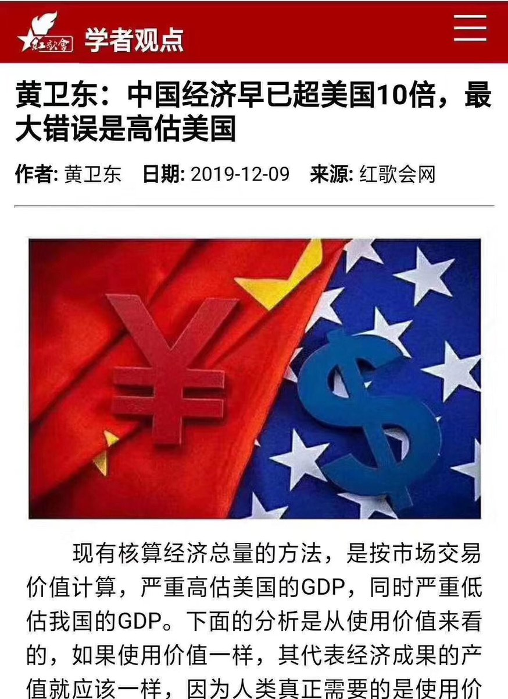

[12月13日 08:01]    纽约时报中文网   @nytchinese    #年度图集 华盛顿最有权势的人物之一、众议院议长南希·佩洛西在为特朗普总统的国情咨文讲话鼓掌时笑了笑——她的表情成了网络米姆。
尽管华盛顿的权力之争基本上避开了镜头，我们的摄影师仍设法拍到了一些微妙而生动的照片，展现了一个常常被政治操纵和演技掩盖的过程。 http://nyti.ms/2PDzfBq   :speech_balloon:评:1 :+1:赞:5 :globe_with_meridians:转:1  

[12月13日 06:56]    老司机   @h5lpykl7tp6jjop    真的好象又回到了年轻的时候！  :speech_balloon:评:2 :+1:赞:10 :globe_with_meridians:转:1  

[12月13日 04:57]    老司机   @h5lpykl7tp6jjop    自从上推特反共以来，退休生活一下有了目标，头也不晕了，眼也不花了，手指头也灵活了，打字特快， 脑子也好使，牙好胃口也好，吃嘛嘛香，身体倍儿捧！

反共真它妈的爽呵！  :speech_balloon:评:11 :+1:赞:106 :globe_with_meridians:转:7  

[12月13日 00:39]    财经真相   @caijingxiang    厦门地铁塌了！  :speech_balloon:评:26 :+1:赞:180 :globe_with_meridians:转:103  

[12月13日 00:34]    财经真相   @caijingxiang    有个细节必须要闹明白，本轮行情真正的大驱动着是华尔街日报关于3600亿存量关税减50%，川普空洞的“非常接近”的论调只是一个引子，没有华尔街日报的“fake news”补刀，人民币根本无力涨破7！说到底还是一场戏耍！  :speech_balloon:评:23 :+1:赞:114 :globe_with_meridians:转:14  

[12月12日 23:49]    财经真相   @caijingxiang    人民币涨到7后，已经没有了劲头，“破7前是顶，破7后是底”，这一人民币汇率原则依然没有改变，并且已经得到几次验证，只要不爆仓，继续持有人民币空仓。这次除了川普接近达成协议这种空洞的表态外，真正的杀伤力是华尔街日报的削减50%关税报道，这真是一个大坑，周日一切都会尘埃落定！  :speech_balloon:评:23 :+1:赞:174 :globe_with_meridians:转:35  

[12月12日 23:31]    BBC News 中文   @bbcchinese    她是模特，邂逅这位富有的军火商，加入他的后宫团，成为“寻欢作乐小老婆”之一。是爱情？是友情？听她自己说……
 https://bbc.in/2EbxtSH   :speech_balloon:评:5 :+1:赞:13 :globe_with_meridians:转:1  

[12月12日 23:16]    财经真相   @caijingxiang    黄金技术上刚刚突破1485美元，很多人都会加仓，川普这么一条推文，不知道有多少人被埋啊！割肉三万！  :speech_balloon:评:57 :+1:赞:170 :globe_with_meridians:转:27  

[12月12日 23:07]    新闻大吐槽   @TuCaoFakeNews    就好比俩强盗对话：都怪你当年没杀死他，现在我们暴露了，怎么办？！  :speech_balloon:评:1 :+1:赞:10 :globe_with_meridians:转:0  

[12月12日 22:59]    BBC News 中文   @bbcchinese    文革轰轰烈烈的当口，中国刮起一股奇特风潮。金芒果怎样走上神坛？如何为对毛泽东的个人崇拜助势？今天回想起来什么感觉？ https://bbc.in/34g46JB   :speech_balloon:评:15 :+1:赞:51 :globe_with_meridians:转:19  

[12月12日 22:53]    新闻大吐槽   @TuCaoFakeNews    香港抗争熊熊不熄，与港澳办谎报军情有直接关系，自觉不妙的张晓明开始甩锅，他在党媒发文，称当年23条未遂，是导致如今局面的原因，并说23条是港府的紧迫任务。
梁家杰：你今天通过了23条，明天香港的民主运动就会平息？

评：都怪前任当年不够狠，不够左，怨我咯？  :speech_balloon:评:9 :+1:赞:102 :globe_with_meridians:转:48  

[12月12日 22:53]    新闻大吐槽   @TuCaoFakeNews    香港抗争熊熊不熄，与港澳办谎报军情有直接关系，自觉不妙的张晓明开始甩锅，他在党媒发文，称当年23条未遂，是导致如今局面的原因，并说23条是港府的紧迫任务。
梁家杰：你今天通过了23条，明天香港的民主运动就会平息？

评：都怪前任当年不够狠，不够左，怨我咯？  :speech_balloon:评:9 :+1:赞:102 :globe_with_meridians:转:48  

[12月12日 22:43]    财经真相   @caijingxiang    川大爷一句话，人民币浮亏中，还好涨的不多！ https://twitter.com/realDonaldTrump/status/1205134155853574145 …  :speech_balloon:评:47 :+1:赞:105 :globe_with_meridians:转:28  

[12月12日 22:39]    财经真相   @caijingxiang    崇祯皇帝上台前，只是一个亲王，很多朝廷内幕和秘闻并不了解，缺乏对东林党为代表文官集团贪腐的认知，被群臣忽悠的错恨阉党；他铲除魏忠贤，大明王朝就失去了对东林党贪污最后制约的力量，当内阁把高税收转移到灾荒严重的西北时，李自成、张献忠们的崛起就创造了条件。诸臣误我！是他最后的大悟！  :speech_balloon:评:20 :+1:赞:248 :globe_with_meridians:转:39  

[12月12日 22:30]    BBC News 中文   @bbcchinese    我们知道饥饿为何令人发脾气，但女人真的比男人更容易受其影响吗？
 https://bbc.in/2LKYYqf   :speech_balloon:评:4 :+1:赞:8 :globe_with_meridians:转:2  

[12月12日 22:30]    BBC News 中文   @bbcchinese    台湾政府力推美食旅游吸引外国游客，但西方人却另有视角，当局希望让外国人饱嘴福似乎有点“一厢情愿”。
 https://bbc.in/35fQ7of   :speech_balloon:评:10 :+1:赞:13 :globe_with_meridians:转:3  

[12月12日 21:59]    BBC News 中文   @bbcchinese    “腐国”英伦并非只有黑暗料理。美味煎饼还进了文学殿堂。英文中，女人平胸、车胎爆气，都可以用"平如煎饼"来形容。
 https://bbc.in/34axwZD   :speech_balloon:评:13 :+1:赞:16 :globe_with_meridians:转:7  

[12月12日 21:43]    墙国铁拳现世报😷   @Socialistfist    感谢近几日投稿的推友！  :speech_balloon:评:0 :+1:赞:42 :globe_with_meridians:转:1  

[12月12日 21:42]    墙国铁拳现世报😷   @Socialistfist    红色精神流传一次一百万

#社会主义铁拳  :speech_balloon:评:31 :+1:赞:289 :globe_with_meridians:转:77  

[12月12日 21:25]    BBC News 中文   @bbcchinese    一天，20岁的奈特把车开到缅因州乡下的森林中。随后，他弃车徒步走进森林，身上只带一些最基本的生存用品。从此就再也没有出来，直到被人发现。
 https://bbc.in/34e9rAX   :speech_balloon:评:8 :+1:赞:65 :globe_with_meridians:转:25  

[12月12日 21:00]    BBC News 中文   @bbcchinese    英国在12月12日举行大选，这是英国自2015年以来的第三次大选，短时期内频繁大选是为什么？  :speech_balloon:评:7 :+1:赞:15 :globe_with_meridians:转:4  

[12月12日 20:31]    BBC News 中文   @bbcchinese    昂山素季出席海牙国际法庭，严词否认缅甸有种族清洗意图。
缅甸一直坚称该国是在处理来自罗兴亚族群内部“极端主义”的威胁，昂山素季也坚持这一立场。 https://bbc.in/2t3vRbc   :speech_balloon:评:13 :+1:赞:36 :globe_with_meridians:转:9  

[12月12日 20:30]    纽约时报中文网   @nytchinese    新的AirPods非常适合在户外使用。通过启动透明模式，使用者能够在过马路时听到汽车的动向，在不那么安全的社区中走动时保持警惕。
如果你经常打电话，AirPods Pro也会是一款出色的耳机。但如果你要买AirPods Pro，请注意：你很可能在两年后不得不再掏腰包。 http://nyti.ms/35a5dM5   :speech_balloon:评:1 :+1:赞:6 :globe_with_meridians:转:4  

[12月12日 20:11]    墙国铁拳现世报😷   @Socialistfist    补充  :speech_balloon:评:0 :+1:赞:39 :globe_with_meridians:转:8  

[12月12日 20:06]    墙国铁拳现世报😷   @Socialistfist    基层腐败，中央英明 -----某战螂

#社会主义铁拳  :speech_balloon:评:25 :+1:赞:252 :globe_with_meridians:转:55  

[12月12日 20:01]    BBC News 中文   @bbcchinese    【新疆“再教育营”：泄密文件披露中国如何洗脑百万维族人】BBC《广角镜》（Panorama）节目获得了一批外泄的中国官方文件，首次揭露了新疆再教育营的运作细节，并跟中国驻英大使刘晓明当面对质。 https://bbc.in/2PAJB4R   :speech_balloon:评:148 :+1:赞:264 :globe_with_meridians:转:122  

[12月12日 20:00]    纽约时报中文网   @nytchinese    诺贝尔和平奖长期以来争议不断。本周，缅甸领导人昂山素季和埃塞俄比亚总理艾哈迈德几乎同时面临指责。
1994年获奖的昂山素季在国际法院否认其政府对罗辛亚人进行种族灭绝；今年的获奖者艾哈迈德则被控对政治抗议活动实施严厉镇压，他甚至没有参加获奖后的新闻发布会。 http://nyti.ms/2tbcopg   :speech_balloon:评:7 :+1:赞:17 :globe_with_meridians:转:8  

[12月12日 19:30]    纽约时报中文网   @nytchinese    中国企业在扩张中积攒了如山的债务，但全世界的投资和借贷者仍争相给它们送去更多的资金。
如今，账单即将到期，越来越多的企业无法偿还贷款。中企借方今年已出现近200亿美元的债务违约。中国金融体系在巨额借贷狂潮的重压下举步维艰。 http://nyti.ms/34ezOHd   :speech_balloon:评:54 :+1:赞:246 :globe_with_meridians:转:118  

[12月12日 19:06]    纽约时报中文网   @nytchinese    #年度图集 战争的画面似乎比过去几年少了，但家园被摧毁、生存难以为继，需要背井离乡的苦痛并没有消失。
一对父女在试图穿越从墨西哥进入美国的边境时被淹死，委内瑞拉的经济危机引发了大量人口外逃，也门这个曾经美丽的国家如今陷入可怕的人道主义危机……还有更多。 http://nyti.ms/2PDzfBq   :speech_balloon:评:3 :+1:赞:12 :globe_with_meridians:转:1  

[12月12日 18:48]    凡賽堤/FORSETI   @FecharCCP    王健
捷克总统之所以会来93阅兵
叶简明，吴小晖
陈小鲁 https://twitter.com/dragrnovlayins/status/1204808401181540352 …  :speech_balloon:评:0 :+1:赞:2 :globe_with_meridians:转:1  

[12月12日 18:48]    凡賽堤/FORSETI   @FecharCCP    加上我一個-我們要持續不斷地吶喊 https://twitter.com/faith8964/status/1205075628875141120 …  :speech_balloon:评:0 :+1:赞:102 :globe_with_meridians:转:59  

[12月12日 18:46]    凡賽堤/FORSETI   @FecharCCP    Recall 6.12 #HKPoliceBrutality towards a girl. 

6 mths were over. #HKPoliceBrutality becomes more severe. Hong Kong is under humanitarian crisis. Tyranny hasn’t stepped down. Justice hasn’t come. NO freedom. NO human rights. 

Dear world, pls help HK. #StandWithHongKong #SOSHK  :speech_balloon:评:3 :+1:赞:32 :globe_with_meridians:转:30  

[12月12日 18:40]    BBC News 中文   @bbcchinese    英国在不到5年的时间里第3次举行全国大选投票，引起广泛关注。
 https://bbc.in/2YGrwGJ   :speech_balloon:评:6 :+1:赞:11 :globe_with_meridians:转:7  

[12月12日 18:40]    纽约时报中文网   @nytchinese    新款AirPods这么贵，性能有多好？与其他高端耳机相比，AirPods在消除噪音方面不是最好的。但它已经可以满足要求，而且整体性价比极高。
在飞机、火车和日常使用等场景的测评中，它的表现都足够优秀。其小巧设计带来的便利可以说没有对手。此外，新款比老款实在要好得多。 http://nyti.ms/35a5dM5   :speech_balloon:评:10 :+1:赞:49 :globe_with_meridians:转:19  

[12月12日 18:35]    凡賽堤/FORSETI   @FecharCCP    4、陳彥霖母親何女士
09年11月11號，早上7點天水圍天恆邨有女子墮樓，現場屍身完整，沒發現大量血跡，屍體很快變得蠟黃，屍體臉部特徵經過鑑定，可以判斷是陳彥霖母親，我曾經查過屍體變化的資料，屍體會這麼快變色，有很大的可能陳母已經死去多日，藏在凍庫，之後再被丟下樓，偽造「跳樓自殺」。  :speech_balloon:评:4 :+1:赞:44 :globe_with_meridians:转:31  

[12月12日 18:10]    纽约时报中文网   @nytchinese    TikTok上2019年最受欢迎的视频包括戴维·多布里克进行的科学实验，一名男子给香蕉做手术和一个自制泳池被破坏的场景。
排名最高的模因则有 #TikTokChecks（打卡地点或晒出物件）、VSCO女孩（一种追求自然环保的亚文化），以及“走一英里”（需要穿上奇形怪状的“高跟鞋”）。 http://nyti.ms/2qOyblS   :speech_balloon:评:1 :+1:赞:6 :globe_with_meridians:转:2  

[12月12日 18:02]    BBC News 中文   @bbcchinese    如果你正在寻找地球上生命里最强的动物，看这篇文章就会有答案了。 https://bbc.in/35dNXph   :speech_balloon:评:5 :+1:赞:31 :globe_with_meridians:转:22  

[12月12日 17:51]    老司机   @h5lpykl7tp6jjop    有这些专家帮忙，何愁天朝不亡！  :speech_balloon:评:10 :+1:赞:34 :globe_with_meridians:转:14  

[12月12日 17:40]    纽约时报中文网   @nytchinese    #年度图集 今年的许多新闻都是在街头发生的。在香港、伦敦、伊拉克和圣地亚哥，群众集会的骚动产生了一些今年最有力的画面。
大火摧毁了亚马孙雨林的大部分地区、巴黎圣母院整个屋顶都起了火，自然灾害带来的破坏显然很有镜头冲击力，但也有一些安静画面才令人悲伤。 http://nyti.ms/2PDzfBq   :speech_balloon:评:2 :+1:赞:19 :globe_with_meridians:转:7  

[12月12日 17:21]    财经真相   @caijingxiang    没谈拢，只能“继续沟通”，如果谈成早就公布了，现在的问题是15号，特朗普是否继续加关税，还是拖延！目前市场已经对“拖延”计价，正式公布了，人民币也涨幅有限，但是如果继续加税，人民币就会再度大跌，我准备加仓人民币空仓，因为这是一个风险低收益高的赌注！ https://twitter.com/ReutersCN/status/1205038631603318784 …  :speech_balloon:评:59 :+1:赞:382 :globe_with_meridians:转:67  

[12月12日 17:11]    纽约时报中文网   @nytchinese    从香港抗议、巴黎圣母院火灾到华盛顿的权力之争，时报从约560万张图片中精选出了今年的视觉编年史。
这组照片见证了过去365天里的冲突与胜利、灾难与成就，以及日常生活中简单却令人心酸的时刻。
 http://nyti.ms/2PDzfBq   :speech_balloon:评:11 :+1:赞:83 :globe_with_meridians:转:37  

[12月12日 17:05]    BBC News 中文   @bbcchinese    今场选举的历史性意义在于，两大党代表的两条道路，不但是二次大战以来最泾渭分明，而且一旦选择了，足以影响今后几代人。 https://bbc.in/2PtMXXw   :speech_balloon:评:24 :+1:赞:73 :globe_with_meridians:转:32  

[12月12日 16:31]    凡賽堤/FORSETI   @FecharCCP    同胞们当我看到这样的场景……听到这位可爱的香港女童稚嫩的声音时……我脑海里一下子涌现的是这半年的时间里，伟大港人血肉模糊的青春身影，我听到的是无数港人无法遏止的心中怒火 愤怒 挣扎和绝望的嘶喊……人类无法想象香港人如此坚强不屈，如此伟大光荣。
每一个细节都无法言状
太你们了  :speech_balloon:评:8 :+1:赞:232 :globe_with_meridians:转:115  

[12月12日 16:04]    BBC News 中文   @bbcchinese    约翰逊如何透过大选打破政治僵局以顺利实现脱欧？ https://bbc.in/2self8Y   :speech_balloon:评:3 :+1:赞:7 :globe_with_meridians:转:2  

[12月12日 15:30]    BBC News 中文   @bbcchinese    英国迎来5年内的第3次大选，选举结果将左右脱欧进程。 https://bbc.in/2RJYJ2M   :speech_balloon:评:6 :+1:赞:16 :globe_with_meridians:转:7  

[12月12日 15:06]    老司机   @h5lpykl7tp6jjop    偷渡，伪证，作假只要为了革命，都可以吗？  :speech_balloon:评:5 :+1:赞:45 :globe_with_meridians:转:16  

[12月12日 15:03]    BBC News 中文   @bbcchinese    英国选民最关心什么，你猜呢？ https://bbc.in/2DZmFa6   :speech_balloon:评:15 :+1:赞:15 :globe_with_meridians:转:5  

[12月12日 15:01]    老司机   @h5lpykl7tp6jjop    假如中共掌握了大脑植入芯片技术，十四亿人会怎样？
你的大脑数据将会被传输至手机，与手机软件进行无缝的对接！你的思想和大脑数据将会被一一提取，人们将再无秘密可言！中央数据库可以随时篡改你的大脑数据！你将彻底沦为一个不受自己操控的——生化人！
终于达到了党的要求，一切行动听指挥！细思恐极  :speech_balloon:评:8 :+1:赞:61 :globe_with_meridians:转:12  

[12月12日 15:00]    纽约时报中文网   @nytchinese    喜欢折纸的有各种各样的人。对许多人来说，纸是“手头现成的玩具”，折纸可以让人感到平静和疗愈。
“折纸艺术家的年龄从5岁到100岁都有，折纸完全没有年龄限制，不过我怀疑有些人可能会因为关节炎而退出这一行，”一位曾用名片完成大型折纸项目的软件工程师说。 http://nyti.ms/34aefYg   :speech_balloon:评:1 :+1:赞:18 :globe_with_meridians:转:4  

[12月12日 14:55]    新闻大吐槽   @TuCaoFakeNews    喂喂喂，那只喵，你在做什么，不要弄掉了一尊！
………………………

可是看到你这么可爱，一尊碎了也没关系  :speech_balloon:评:4 :+1:赞:67 :globe_with_meridians:转:9  

[12月12日 14:53]    新闻大吐槽   @TuCaoFakeNews    不知道是根据”香港民主与人权法案”中的哪条？感觉很给力！
关键就厉害在说干就干，绝不拖泥带水 https://twitter.com/nrdituydxmtzta9/status/1204915985204924417 …  :speech_balloon:评:5 :+1:赞:42 :globe_with_meridians:转:17  

[12月12日 14:49]    老司机   @h5lpykl7tp6jjop    政府缺钱，专家帮忙要命：为消费者健康着想，中国消费税应增加10倍以上！
12月3日，财政部出台的中华人民共和国消费税征求意见稿，复旦大学经济学院特聘讲座教授、澳大利亚社会科学院院士黄有光在网易研究局的专栏发表文章称：卷烟、汽油、珠宝等税率均有上调的空间，其中汽油的税率应增加十倍以上。  :speech_balloon:评:0 :+1:赞:4 :globe_with_meridians:转:2  

[12月12日 14:31]    老司机   @h5lpykl7tp6jjop    “我会杀了你”！悉尼华人男子醉酒后，爬上床对老婆说了这句话！老婆不知真假惊恐之下报警，于是这位53岁酒疯子被抓，而且拒绝保释，尽管妻子和另一位亲友出面，还拿出早在8月份订好的游轮圣诞游的订票，但无济于事，法官表示游轮上更方便作案，
威胁要杀对方在中国这都不算事很常见，可是在法治国家不行  :speech_balloon:评:7 :+1:赞:120 :globe_with_meridians:转:43  

[12月12日 14:00]    老司机   @h5lpykl7tp6jjop    港警高层家庭申请移民马来西亚被拒 ，香港警察明天往哪里逃？  :speech_balloon:评:28 :+1:赞:190 :globe_with_meridians:转:62  

[12月12日 14:00]    纽约时报中文网   @nytchinese    #每日一词 They，他们/她们。人称代词they今年在韦氏词典的搜索量增加了313%，当选该词典的年度词汇。
该机构在其词条中为they添加了单数人称代词的定义，用来指拥有非二元性别的人。
更多简报内容： http://nyti.ms/2rCclCp 
欢迎点此加入订阅：http://bit.ly/2EFQSOC   :speech_balloon:评:3 :+1:赞:3 :globe_with_meridians:转:2  

[12月12日 13:30]    纽约时报中文网   @nytchinese    这个国际调查小组于今年9月初被聘请，其中包括来自英国、加拿大、澳大利亚和新西兰的警务专家。
监警会主席曾表示，这些专家不懂香港的法律。但民主派议员说，专家组退出调查的决定，只是支持了公众的诉求。“整件事成为一个国际笑话。” http://nyti.ms/2PFcf4K   :speech_balloon:评:15 :+1:赞:63 :globe_with_meridians:转:24  

[12月12日 13:03]    BBC News 中文   @bbcchinese    一张生病男孩躺在医院地上候诊的照片，让利兹总医院道歉，并让首相约翰逊难堪。但这如何在英国大选前引发一场假消息战？ https://bbc.in/2PxLiA1   :speech_balloon:评:15 :+1:赞:35 :globe_with_meridians:转:10  

[12月12日 12:59]    纽约时报中文网   @nytchinese    TikTok发布2019年度榜单，展示了其app上排名最高的视频、类型和创作者等。排行榜突出了美与时尚、运动、宠物和舞蹈潮流等主题领域。
该公司表示，正在考虑如何帮助不断涌现的创作者赚钱。但随着它变得越来越政治化，这一急速发展的平台也面临挑战。 http://nyti.ms/2qOyblS   :speech_balloon:评:15 :+1:赞:36 :globe_with_meridians:转:12  

[12月12日 12:25]    纽约时报中文网   @nytchinese    周二，34岁的桑娜·马林宣誓就职芬兰总理，成为世界上最年轻的政府首脑。她持左派观点，关注气候变化、平等和社会福利等议题。
自2015年进入议会以来，马林一直是社会民主党的后起之秀。她目前领导一个由五个政党组成的联合政府，这些政党的领袖均为女性。
更多简报内容： http://nyti.ms/2rCclCp   :speech_balloon:评:4 :+1:赞:10 :globe_with_meridians:转:2  

[12月12日 12:00]    纽约时报中文网   @nytchinese    折纸是一种古老的艺术，其历史可以追溯到几千年前，至今仍被全球各地的许多人喜爱。无论作品简单还是复杂，精确是折纸的关键，不过，热情和坚持也很重要。
在折纸中，创造不同形状的方法曲折、打褶和花瓣折。它还可以用上雕塑技巧，比如湿折，以及更高级的3D设计。
 http://nyti.ms/34aefYg   :speech_balloon:评:2 :+1:赞:29 :globe_with_meridians:转:12  

[12月12日 11:33]    凡賽堤/FORSETI   @FecharCCP    报应来了 ，何柱国是美国华人中的巨富，从小生活在美，现仍有三百多亿美元财富，进出美国都坐他的私人飞机。近几年多待在香港打理他在港中两地业务。十一月底他回美国时被约谈三小时，然后原机遣返香港再不能回美。对方列出了数月来他在港的＂撑警＂言行属反自由民主反人类罪。
此事在港中引起极大震憾 https://twitter.com/fei66202064/status/1204825084315283462 …  :speech_balloon:评:14 :+1:赞:355 :globe_with_meridians:转:172  

[12月12日 11:24]    凡賽堤/FORSETI   @FecharCCP    傷勢跟進（手足投稿）：

早前有手足披露過因加料胡椒所傷的恐怖傷勢（連結： https://www.facebook.com/1076113639215003/posts/1314721285354236?d=n&sfns=mo …）感謝各方踴躍提供意見，最後亦有醫生跟進。

傷口方面，因受化學腐蝕，至今兩個月都埋唔到口就係埋唔到，唯有手術切除腐肉再聯返針，正考慮是否做手術。

再次感謝網民既關心。  :speech_balloon:评:28 :+1:赞:119 :globe_with_meridians:转:143  

[12月12日 11:16]    纽约时报中文网   @nytchinese    香港的警方监察机构曾聘请外国专家来协助调查有关警察暴力行为的指控，但专家要求获得传唤证人、核实警方说法的权力，却遭到拒绝。
现在，这些专家因缺少实权而选择集体辞职。对期望加强调查可信度的港府而言，这无疑是一个打击。 http://nyti.ms/2PFcf4K   :speech_balloon:评:68 :+1:赞:492 :globe_with_meridians:转:250  

[12月12日 11:05]    BBC News 中文   @bbcchinese    从大选几点可以投票到为什么说这次大选对台湾“生死攸关”，请查收这份台湾选举说明书。 https://bbc.in/34dXAmk   :speech_balloon:评:44 :+1:赞:160 :globe_with_meridians:转:48  

[12月12日 10:33]    纽约时报中文网   @nytchinese    英国今日举行大选，现任首相鲍里斯·约翰逊和工党领袖杰里米·科尔宾将展开激烈角逐，投票结果将决定该国是否或如何退出欧盟。
约翰逊誓言将不惜无协议脱欧，科尔宾则希望该国就脱欧举行第二次公投。此外，国民医疗服务体系的未来也是大选关注的议题之一。
更多简报内容： http://nyti.ms/2rCclCp   :speech_balloon:评:2 :+1:赞:11 :globe_with_meridians:转:4  

[12月12日 10:32]    凡賽堤/FORSETI   @FecharCCP    台灣黑道是中共在台第五縱隊 醜聞曝光 - 大紀元 http://www.epochtimes.com/b5/17/10/1/n9689082.htm …  :speech_balloon:评:0 :+1:赞:109 :globe_with_meridians:转:46  

[12月12日 10:05]    财经真相   @caijingxiang    美国农业部周三表示，中国买家订购了58.5万吨美国大豆，为八个多月来最大的一笔。
这是美国农业部自11月14日以来首次宣布向中国出售大豆，目前市场正在观望华盛顿是否会在12月15日对价值近1,600亿美元的中国消费品征收新一轮关税。 川普口中的中国行动！依旧是买买买！ https://twitter.com/ReutersCN/status/1204940443772952578 …  :speech_balloon:评:10 :+1:赞:101 :globe_with_meridians:转:12  

[12月12日 10:04]    纽约时报中文网   @nytchinese    早安！今日重点新闻包括：
英国举行大选；中国监禁记者人数全球最多；香港监警会外国专家组辞职；昂山素季否认缅甸对罗辛亚人实施种族灭绝；世界上最年轻的女总理是谁；沙特阿美成全球市值最高上市公司；AirPods Pro测评……NYT简报带你速览今日要闻。 http://nyti.ms/2rCclCp   :speech_balloon:评:15 :+1:赞:39 :globe_with_meridians:转:13  

[12月12日 10:03]    财经真相   @caijingxiang    香港恒生指数暴涨，港币涨破7.8000中间线，看样子北京这次又变卦了！  :speech_balloon:评:33 :+1:赞:246 :globe_with_meridians:转:41  

[12月12日 09:45]    新闻大吐槽   @TuCaoFakeNews    巧了，李洪元的罪如果没能洗清，也是十年左右的刑期，看来华为给自己员工的量刑是十年打底儿  :speech_balloon:评:1 :+1:赞:28 :globe_with_meridians:转:2  

[12月12日 09:20]    财经真相   @caijingxiang    当今世界几大主要央行都想加息而不能，美联储、欧洲、日本、瑞士是因通胀太低而不能；英国只要顺利脱欧就可以；加拿大、澳大利亚、新西兰三国经济主要是靠出口资源，但是国际大宗商品价格太低进而导致通胀低迷而无法加息；唯一的特例是天朝，却总想着降息，结果后路被一头猪给拱着了，通胀达到了4.5%！  :speech_balloon:评:11 :+1:赞:188 :globe_with_meridians:转:60  

[12月12日 09:00]    财经真相   @caijingxiang    鲍威尔说：“為了使利率上升，我希望看到持續的、顯著的通貨膨脹，在提高利率以解決通貨膨脹問題之前，通貨膨脹必須顯著且持續地上升。這是我的觀點。”这表明在通胀低迷的情况下，未来美联储“易降难升”，鲍威尔讲话期间，美元被加速抛售，隔夜黄金大涨。  :speech_balloon:评:1 :+1:赞:43 :globe_with_meridians:转:6  

[12月12日 08:56]    财经真相   @caijingxiang    美联储12月利率决议结束了，符合市场此前按兵不动的预期，这宣布了美元降息周期的暂停，根据利率点阵图显示，2020年美联储维持利率不变，17位美聯儲決策者中有13位預期利率不變，4位預期加息一次。而2021年和2022年各加息一次。也就是说未来美联储还要继续加息，然而市场认为却完全相反！  :speech_balloon:评:2 :+1:赞:103 :globe_with_meridians:转:16  

[12月12日 08:49]    BBC News 中文   @bbcchinese    阿美属于沙特国有资产，原油产量占世界总产量的十分之一，是全球盈利最丰的公司。 https://bbc.in/2LM82vc   :speech_balloon:评:10 :+1:赞:46 :globe_with_meridians:转:23  

[12月12日 08:23]    BBC News 中文   @bbcchinese    人们为什么对食辣如此热衷呢？ https://bbc.in/2PFLwFi   :speech_balloon:评:7 :+1:赞:28 :globe_with_meridians:转:17  

[12月12日 07:47]    BBC News 中文   @bbcchinese    在伦敦金融城里，像罗切斯特这样在办公室里熬通宵观察选举进展的并不在少数。 https://bbc.in/2YDEtBa   :speech_balloon:评:2 :+1:赞:18 :globe_with_meridians:转:7  

[12月12日 02:40]    老司机   @h5lpykl7tp6jjop    这才是真正大写的人  :speech_balloon:评:17 :+1:赞:409 :globe_with_meridians:转:164  

[12月12日 00:21]    凡賽堤/FORSETI   @FecharCCP    这是文贵先生2017-717在明镜爆料。

评:白手套们，别拿自己当回事了，看见没，只不过盗国集团家的狗(家奴都算不上)。你们可悲啊! https://twitter.com/dragrnovlayins/status/1204785647753416710 …  :speech_balloon:评:3 :+1:赞:25 :globe_with_meridians:转:11  

[12月11日 22:50]    凡賽堤/FORSETI   @FecharCCP    周梓樂同學天堂安息，我哋為你報仇  :speech_balloon:评:6 :+1:赞:153 :globe_with_meridians:转:55  

[12月11日 22:30]    凡賽堤/FORSETI   @FecharCCP    一手誌

天澤反送中之路(6.9-10.31)

12.11 天澤連儂牆，記載了反送中歷程（6月9日至10月31日），未知11月及其後的文宣是尚在製作，或已被破壞。
#LennonWall #HongKong #HongKongProtests  :speech_balloon:评:3 :+1:赞:127 :globe_with_meridians:转:103  

[12月11日 20:16]    新闻大吐槽   @TuCaoFakeNews    据原华为工程师透露：华为鼓励员工互相举报！

有经理被举报后，被以贪污罪判10年，而李元洪却因举报经理被251，举报人和被举报人随机进监狱~ 

只有任正非稳坐泰山，做勉励状对高管说：“我还是信任你的，你看，这么多举报你的信都被我扣下了”！

和共党一样的恐惧管理  :speech_balloon:评:29 :+1:赞:560 :globe_with_meridians:转:296  

[12月11日 20:16]    新闻大吐槽   @TuCaoFakeNews    据原华为工程师透露：华为鼓励员工互相举报！

有经理被举报后，被以贪污罪判10年，而李元洪却因举报经理被251，举报人和被举报人随机进监狱~ 

只有任正非稳坐泰山，做勉励状对高管说：“我还是信任你的，你看，这么多举报你的信都被我扣下了”！

和共党一样的恐惧管理  :speech_balloon:评:29 :+1:赞:560 :globe_with_meridians:转:296  

[12月11日 19:44]    新闻大吐槽   @TuCaoFakeNews    据报导, 中国对美国出口已经连续第12个月下降，跌幅达23%，因此, 尽管川大爷签了香港人权法案, 中共仍然死乞白咧希望能达成贸易协议。

可是这脸皮也太厚了！此前无数对美帝的狠话硬话，都在事实的打击中抛之脑后~  :speech_balloon:评:4 :+1:赞:119 :globe_with_meridians:转:45  

[12月11日 19:44]    新闻大吐槽   @TuCaoFakeNews    据报导, 中国对美国出口已经连续第12个月下降，跌幅达23%，因此, 尽管川大爷签了香港人权法案, 中共仍然死乞白咧希望能达成贸易协议。

可是这脸皮也太厚了！此前无数对美帝的狠话硬话，都在事实的打击中抛之脑后~  :speech_balloon:评:4 :+1:赞:119 :globe_with_meridians:转:45  

[12月11日 19:33]    纽约时报中文网   @nytchinese    新西兰长期以来将自己标榜为一个可以让游客与危险共舞的地方。怀特岛的游览项目恰好印证了这个说法。
但最终应该由谁来负责确保游客安全？是拥有这个偏远小岛的家族，还是负责执行健康与安全法规的政府？ http://nyti.ms/34a0Fnx   :speech_balloon:评:1 :+1:赞:9 :globe_with_meridians:转:0  

[12月11日 19:31]    新闻大吐槽   @TuCaoFakeNews    不过是一只叮在裸体皇帝屁股上吸脓的“发炎蝇”，竟然想挑战安徒生童话！我希望你有点自知之明！  :speech_balloon:评:90 :+1:赞:469 :globe_with_meridians:转:155  

[12月11日 19:21]    新闻大吐槽   @TuCaoFakeNews    今天，港共在9月初才聘用的5名监警会国际专家发出声明，宣布辞职，他们认为监警会的权力、能力和独立调查力存在明显的缺陷，无法再干下去！

这又是港共和中共学的套路：花大价钱收买国际花瓶，没想到有良心的人不爱财，人家撂挑子不干了！  :speech_balloon:评:10 :+1:赞:571 :globe_with_meridians:转:240  

[12月11日 19:21]    新闻大吐槽   @TuCaoFakeNews    今天，港共在9月初才聘用的5名监警会国际专家发出声明，宣布辞职，他们认为监警会的权力、能力和独立调查力存在明显的缺陷，无法再干下去！

这又是港共和中共学的套路：花大价钱收买国际花瓶，没想到有良心的人不爱财，人家撂挑子不干了！  :speech_balloon:评:10 :+1:赞:571 :globe_with_meridians:转:240  

[12月11日 19:14]    新闻大吐槽   @TuCaoFakeNews    香港民主党前主席刘慧卿认为：习中央误判香港形势是受中联办误导！ 

宣传机构将上街抗争的年青人说成是买不起房的「废青」，也都是有意为之！

嗯！看来管文宣的和管情报的在合伙涮一尊  :speech_balloon:评:62 :+1:赞:403 :globe_with_meridians:转:150  

[12月11日 19:14]    新闻大吐槽   @TuCaoFakeNews    香港民主党前主席刘慧卿认为：习中央误判香港形势是受中联办误导！ 

宣传机构将上街抗争的年青人说成是买不起房的「废青」，也都是有意为之！

嗯！看来管文宣的和管情报的在合伙涮一尊  :speech_balloon:评:62 :+1:赞:403 :globe_with_meridians:转:150  

[12月11日 19:01]    纽约时报中文网   @nytchinese    保护记者委员会表示，在习近平“对媒体实行越来越严格的管控”之下，中国今年至少有48名记者被监禁，比2018年增加了一人。
新疆的镇压行动导致“数十名记者”被捕，其中包括一些因多年前的报道而被监禁的人。 http://nyti.ms/36s6Yoi   :speech_balloon:评:10 :+1:赞:28 :globe_with_meridians:转:13  

[12月11日 19:00]    老司机   @h5lpykl7tp6jjop    随感  :speech_balloon:评:3 :+1:赞:31 :globe_with_meridians:转:7  

[12月11日 18:43]    老司机   @h5lpykl7tp6jjop    非常珍贵的文物，终于被发掘出土了。
好像是江泽民和朱镕基以国家的名义作出的承诺。 https://twitter.com/zhu0588/status/1204640709837344768 …  :speech_balloon:评:72 :+1:赞:1101 :globe_with_meridians:转:610  

[12月11日 14:33]    新闻大吐槽   @TuCaoFakeNews    当事人妻子遭遇丈夫物理掩埋后的信息掩埋！

估计共党肯定在开发能让人失忆的技术，这样就可以永远把韭菜割下去 https://twitter.com/big_ear_cat/status/1204133599475372033 …  :speech_balloon:评:22 :+1:赞:221 :globe_with_meridians:转:122  

[12月11日 14:33]    新闻大吐槽   @TuCaoFakeNews    当事人妻子遭遇丈夫物理掩埋后的信息掩埋！

估计共党肯定在开发能让人失忆的技术，这样就可以永远把韭菜割下去 https://twitter.com/big_ear_cat/status/1204133599475372033 …  :speech_balloon:评:22 :+1:赞:221 :globe_with_meridians:转:122  

[12月11日 13:53]    老司机   @h5lpykl7tp6jjop    北朝鲜眼中的美国，太惨了！  :speech_balloon:评:1 :+1:赞:24 :globe_with_meridians:转:10  

[12月11日 13:51]    老司机   @h5lpykl7tp6jjop    转发  :speech_balloon:评:2 :+1:赞:40 :globe_with_meridians:转:25  

[12月11日 13:49]    老司机   @h5lpykl7tp6jjop    转发好图  :speech_balloon:评:1 :+1:赞:16 :globe_with_meridians:转:5  

[12月11日 12:13]    凡賽堤/FORSETI   @FecharCCP    12/10 即使是一粒尘埃，也能有尊严地在宇宙中存在。#王歧山， 如果你要让为你服务了几十年的王健死，也要让他有尊严地死去！你这么没有人性地残暴杀害王健，你将被人类诅咒！王健的尸体，就是你的黑白无常！你将在成千上万人的唾骂中，带着羞愧和恐惧，奔上你的地狱之路！  https://twitter.com/wlkd6iuxizqbvm7/status/1204588034123014144 …  :speech_balloon:评:4 :+1:赞:82 :globe_with_meridians:转:38  

[12月11日 11:13]    老司机   @h5lpykl7tp6jjop    转发好图  :speech_balloon:评:1 :+1:赞:35 :globe_with_meridians:转:22  

[12月11日 11:12]    老司机   @h5lpykl7tp6jjop    被控窃密的前苹果华裔工程师 家中又搜出导弹机密文件  :speech_balloon:评:3 :+1:赞:28 :globe_with_meridians:转:20  

[12月11日 10:29]    老司机   @h5lpykl7tp6jjop    有个财主儿子继承了家业，生怕别人不知道他有钱，到处乱花，脾气又拧，一天走进古玩店，大不咧咧拿起一把名人字画扇就乱搧，店主说这扇名贵不好搧风用的，谁知这家伙一把撕成两半，还把店家所有字画扇拿起来全撕了，赔了许多钱也无所谓，后来又和另外大财主对赌把家产输了个精光！和当今那位二货很像！  :speech_balloon:评:6 :+1:赞:89 :globe_with_meridians:转:16  

[12月11日 10:10]    财经真相   @caijingxiang    华为心声社区在12月9日晚间刊发华为创始人任正非接受加拿大媒体《环球邮报》的采访纪要。任正非在采访中表示，华为美国研发中心将逐步迁往加拿大，目前加拿大员工人数达1200人，其中三分之二是研发人员。  :speech_balloon:评:11 :+1:赞:99 :globe_with_meridians:转:14  

[12月11日 10:00]    财经真相   @caijingxiang    WTO今天开始名存实亡！  :speech_balloon:评:78 :+1:赞:1354 :globe_with_meridians:转:224  

[12月11日 09:04]    财经真相   @caijingxiang    纳瓦罗的警告，没有迹象表明关税回被推迟！ https://twitter.com/zerohedge/status/1204564513263161349 …  :speech_balloon:评:22 :+1:赞:270 :globe_with_meridians:转:75  

[12月11日 07:48]    凡賽堤/FORSETI   @FecharCCP    香港警察總督察鄭智傑（Jacky Cheng）使用非法武力，強行切斷了示威者的手腕（彎曲的手腕呈180度彎曲），損壞了示威者的手永久性殘疾。請制裁他和家人 https://twitter.com/IamMsFF/status/1204294655346540549 …  :speech_balloon:评:11 :+1:赞:210 :globe_with_meridians:转:187  

[12月11日 07:22]    凡賽堤/FORSETI   @FecharCCP    According to the source, there’re at least 700 ppl missing throughout #HongKong movement, some were found and have alrdy became corpses. 

These missing posts are updating everyday in social media, we may not able to find this young freedom fighters forever
#HumanitarianCrisis  https://twitter.com/ho_steffie/status/1204482455329075200 …  :speech_balloon:评:41 :+1:赞:463 :globe_with_meridians:转:562  

[12月11日 07:03]    老司机   @h5lpykl7tp6jjop    中国CPI“惊人一跃”意味着什么?你将越来越穷！
11月的居民消费价格（CPI）和工业生产者出厂价格（PPI）。
其中CPI的同比涨幅出现了“惊人一跃”，达到了4.5%，创下了自2012年1月以来的新高。
一方面，是猪价上升不断推高的结构性通胀，一方面，是工业品价格仍没能走出的通缩，CPI、PPI剪刀差在扩大。  :speech_balloon:评:1 :+1:赞:16 :globe_with_meridians:转:8  

[12月11日 03:53]    老司机   @h5lpykl7tp6jjop    成都養老金分配不公，退休老人去政府抗議，被當地公安強行抬走。
這一幕似曾相識，往事歷歷在目。
你們的冷眼旁觀助長了公安的囂張，總有一天會輪到每一隻牲人。  :speech_balloon:评:36 :+1:赞:508 :globe_with_meridians:转:313  

[12月11日 03:26]    凡賽堤/FORSETI   @FecharCCP    Where are the 700 missing #HongKongers? The ones who were found are already dead bodies. The unfound are unknown...

Who still cares about them....?

#StandWithHongKong
#MissingPerson
#HongKongProstest 
#  :speech_balloon:评:17 :+1:赞:298 :globe_with_meridians:转:350  

[12月11日 00:16]    新闻大吐槽   @TuCaoFakeNews    大裤衩董倩专访何君尧！

两人都是臭名昭著，董因为逼709良心律师电视认罪，曾被国际组织提议制裁！而何刚被英国母校撸了博士学位！

丑角抱团言论更雷人，何说自己胸口留下的是L形伤疤，代表着Love！

想把穿帮闹剧强行升级成爱国神剧？高级黑！建议董倩立即电视认罪伺候  :speech_balloon:评:55 :+1:赞:322 :globe_with_meridians:转:108  

[12月10日 23:49]    新闻大吐槽   @TuCaoFakeNews    中共将清除电脑中所有美国技术。

美国专家表示，那我们不买联想电脑！
完了，联想真要变成连想都别想了！黑心商贩总想用地沟油替代食用油！

即将投票的美墨加协议，鼓励原产地优先，如通过，将会把中国产品赶出北美市场，同时把更多产业从中国转移到墨西哥和加拿大！  :speech_balloon:评:28 :+1:赞:644 :globe_with_meridians:转:258  

[12月10日 22:10]    墙国铁拳现世报😷   @Socialistfist    “警察说要对我用喷雾剂了”

#社会主义铁拳  :speech_balloon:评:45 :+1:赞:749 :globe_with_meridians:转:174  

[12月10日 21:36]    财经真相   @caijingxiang    中美12月关税被推迟! https://twitter.com/zerohedge/status/1204393850766266373 …  :speech_balloon:评:71 :+1:赞:107 :globe_with_meridians:转:27  

[12月10日 17:13]    财经真相   @caijingxiang    下一位！  :speech_balloon:评:57 :+1:赞:658 :globe_with_meridians:转:277  

[12月10日 14:10]    财经真相   @caijingxiang    真的又去了？ https://twitter.com/meiyangyang888/status/1204264118045143040 …  :speech_balloon:评:13 :+1:赞:49 :globe_with_meridians:转:7  

[12月10日 10:58]    财经真相   @caijingxiang    北京时间10:00点北京附近一氧化碳污染达浓度到4965ppbv，同一时间华盛顿为529ppbv，中国一氧化碳污染是全世界最高的，华北京津冀已经变成世界癌症地区!  :speech_balloon:评:107 :+1:赞:1388 :globe_with_meridians:转:708  

[12月10日 10:39]    财经真相   @caijingxiang    美国农业部长珀杜(Sonny Perdue)周一表示，美国总统特朗普并不想在12月15日对中国输美商品实施下一轮预定关税措施，但希望中国能采取“行动”避免关税实施。 https://twitter.com/ReutersCN/status/1204224553930674176 …  :speech_balloon:评:16 :+1:赞:95 :globe_with_meridians:转:12  

[12月10日 02:24]    墙国铁拳现世报😷   @Socialistfist    不了解铁拳的老朋友兔兔是谁的请看这里 https://twitter.com/Socialistfist/status/1175057744858161159?s=19 …  :speech_balloon:评:8 :+1:赞:85 :globe_with_meridians:转:17  

[12月10日 02:15]    墙国铁拳现世报😷   @Socialistfist    另外点名批评的还有新加坡人李连杰和我们的老朋友兔兔 @zzyyzoe 最喜爱的  加拿大人吴亦凡  :speech_balloon:评:9 :+1:赞:136 :globe_with_meridians:转:17  

[12月10日 02:13]    墙国铁拳现世报😷   @Socialistfist    美籍刘亦菲一直以来就因为其国籍问题在墙国招致非议。在今年8月14日微博撑港警后让不少粉红对她国籍的质疑消停不少。没过多久，鹤岗网警就在12月5日发短片手撕刘亦菲
为了同时拥有人民币和美国护照，真乃里外不是人
#社会主义铁拳  :speech_balloon:评:29 :+1:赞:404 :globe_with_meridians:转:116  

[12月09日 15:36]    老司机   @h5lpykl7tp6jjop    很久之前的视频了。里面把公权力与腐败问题讲的很清楚了。现在的墙国已经没有这种声音了。  :speech_balloon:评:31 :+1:赞:693 :globe_with_meridians:转:371  

[12月09日 09:57]    墙国铁拳现世报😷   @Socialistfist    孙夕庆博士已申请“开庭次数最多的刑事案件”的吉尼斯纪录，并已被受理。
小编为孙博士在遇到如此不公后还能保留如此幽默感点赞  :speech_balloon:评:6 :+1:赞:413 :globe_with_meridians:转:88  

[12月09日 09:47]    墙国铁拳现世报😷   @Socialistfist    2014年，两位清华留美博士，都选择回国创业报效国家。
一位是在2015年被羁押就已经长达17个月并再无下文的“千人计划”专家 李港
另一位是被羁押1277天并经历114次庭审的孙夕庆。
#社会主义铁拳  :speech_balloon:评:72 :+1:赞:844 :globe_with_meridians:转:358  

[12月09日 03:56]    凡賽堤/FORSETI   @FecharCCP    12.08國際人權日！  

百萬人以上的香港人展現出人類文明史上最和平，最文明，最理性，最有創意的方式向全世界發出最強的聲音！

香港人用行動向全世界，全人類證明了香港人是最民主的中華族群！

願榮光歸香港！祝福香港人！天佑香港人！

注，感謝大紀元的最前線視頻！  :speech_balloon:评:24 :+1:赞:734 :globe_with_meridians:转:367  

[12月09日 03:22]    凡賽堤/FORSETI   @FecharCCP    12.08國際人權日！  

人類文明史上最震撼的民主訴求盡在香港！

百萬人以上的香港人用最和平，最文明，最有創意的方式向全世界發出最強的聲音！

五大訴求，缺一不可！ 

願榮光歸香港！  :speech_balloon:评:1 :+1:赞:18 :globe_with_meridians:转:7  

[12月09日 03:16]    凡賽堤/FORSETI   @FecharCCP    12.08國際人權日！  

百萬人以上的香港人用最和平，最文明，最有創意的方式向全世界發出最強的聲音！

五大訴求，缺一不可！ 

願榮光歸香港！  :speech_balloon:评:4 :+1:赞:43 :globe_with_meridians:转:23  

[12月09日 03:13]    凡賽堤/FORSETI   @FecharCCP    12.08國際人權日！  願榮光歸香港！

百萬人以上的香港人用最和平，最文明，最有創意的方式向全世界發出最強的聲音！  :speech_balloon:评:1 :+1:赞:29 :globe_with_meridians:转:15  

[12月09日 01:21]    墙国铁拳现世报😷   @Socialistfist    高级黑还是低级红？  :speech_balloon:评:12 :+1:赞:58 :globe_with_meridians:转:5  

[12月09日 01:20]    墙国铁拳现世报😷   @Socialistfist    民主铁拳现世报是高级黑还是低级红？
请您参与投票！  :speech_balloon:评:43 :+1:赞:229 :globe_with_meridians:转:26  

[12月08日 16:16]    新闻大吐槽   @TuCaoFakeNews    口号声震天，楼宇都在颤抖！
还要展现多少次压倒性的民意，愚蠢的当政者才能醒悟？  :speech_balloon:评:132 :+1:赞:3324 :globe_with_meridians:转:1433  

[12月07日 02:58]    墙国铁拳现世报😷   @Socialistfist    如果您对本推内容有什么想说的并且希望被匿名看到，可以私信小编！
这两位推友如果互相欣赏彼此观点，小编可以介绍认识  :speech_balloon:评:4 :+1:赞:40 :globe_with_meridians:转:1  

[12月07日 02:55]    墙国铁拳现世报😷   @Socialistfist    推友们大家好，首先必须承认最近铁拳推没有之前的数量和质量，向各位关注本推的推友致歉。
再次感谢大家的投稿，如果您的投稿符合本推的投稿标准，小编会陆续给您安排发布
受之前 #现世报读者来信 启发而创立的新系列，这次刊登两位年纪相仿中港的推友对墙内现象的感言，小编认为这样的交流很有意义。  :speech_balloon:评:27 :+1:赞:271 :globe_with_meridians:转:39  

[12月06日 23:15]    墙国铁拳现世报😷   @Socialistfist    有感而发  :speech_balloon:评:4 :+1:赞:209 :globe_with_meridians:转:11  

[12月06日 21:21]    墙国铁拳现世报😷   @Socialistfist    滋磁！ https://twitter.com/minzhutiequan/status/1202745105754419200 …  :speech_balloon:评:36 :+1:赞:222 :globe_with_meridians:转:21  

[12月05日 22:24]    墙国铁拳现世报😷   @Socialistfist    推特魔幻剧场  :speech_balloon:评:15 :+1:赞:131 :globe_with_meridians:转:11  

[12月05日 22:16]    墙国铁拳现世报😷   @Socialistfist    来认识一下党内的“王立” 家族
左起王立强，王立军，王立民，王立新
欢迎补充  :speech_balloon:评:17 :+1:赞:202 :globe_with_meridians:转:42  

[12月05日 06:26]    墙国铁拳现世报😷   @Socialistfist    为了实地考察并认真调研总书记任内打击腐败取得的骄人成绩，王立民书记主动要求到狱中体验贪腐分子的日常
什么是学者的钻研精神，小编哭了，你呢？

#社会主义铁拳  :speech_balloon:评:21 :+1:赞:368 :globe_with_meridians:转:86  

[12月04日 20:37]    GFHG SDKM   @zyx_yny    喂喂，香港嘅bb睇落嚟

澳洲設立committee，探討是否有必要頒佈Magnitsky. 可以開始寫信lobby袋鼠囯喔。They accept submissions now

好擔心。區選舉和HKHRDA頒佈后，大家有哋散漫有哋唔focus喎。還有人開始屌來屌去...

bb, come back! 依家有嘢做囖

利申：信還沒寫，不過澳洲list做完一半了 https://twitter.com/NSWHongkongers/status/1202151090399006720 …  :speech_balloon:评:9 :+1:赞:322 :globe_with_meridians:转:203  

[12月03日 18:59]    墙国铁拳现世报😷   @Socialistfist    两位推友匿名私信回应  :speech_balloon:评:16 :+1:赞:166 :globe_with_meridians:转:23  

[11月26日 01:01]    GFHG SDKM   @zyx_yny    Heading back to London. 

Thank you #HK for letting us share in your unforgettable victory.

香港人, 加油   :speech_balloon:评:2680 :+1:赞:21530 :globe_with_meridians:转:10206  

[11月24日 12:46]    GFHG SDKM   @zyx_yny    Very good to take some time@our from election observation to tell #JuniusHo in person that I was responsible for the revocation of his honorary doctorate from @AngliaRuskin #Sorrynotsorry  :speech_balloon:评:6944 :+1:赞:46336 :globe_with_meridians:转:27891  

[11月24日 08:10]    凡賽堤/FORSETI   @FecharCCP    呼籲請求共同挖掘所有有關香港發生的事，越全面越好，不同角度，越多越好，包括被暗地抓捕的人員，特別是CCP 派出的各種偽裝身份，包括變身變裝行兇的一點一滴都要挖掘出來，把CCP 的邪惡下三濫手段的真相毫無保留的曝光在全世界面前！世界公知公義才能真正挽救和保護香港人！希望懂視頻編輯配上中英文  :speech_balloon:评:3 :+1:赞:21 :globe_with_meridians:转:18  

[11月21日 13:58]    GFHG SDKM   @zyx_yny    On #PolyU being the end game, this OL says it is 100% not the end game.  She says what we saw happened to the students at Poly, the way they were brutally treated by #HKPolice, there's no way HKers will forget.  We will keep on fighting!

#StandWithHongKong #HongKongProtests  :speech_balloon:评:104 :+1:赞:2406 :globe_with_meridians:转:1561  

[11月21日 11:50]    GFHG SDKM   @zyx_yny    We were in front of the Diet Members’ Office Building.

We will keep fighting with you, HKers
We will keep spreading what's happening in HK

You are not alone  :speech_balloon:评:371 :+1:赞:3564 :globe_with_meridians:转:2144  

[11月21日 00:57]    GFHG SDKM   @zyx_yny    Yesterday’s passage of the #HongKong Human Rights & Democracy Act was a good day in the struggle to resist totalitarian #China & its bid for domination. But it was not the last day. We have a long road ahead to protect our jobs, our workers & our security.  :speech_balloon:评:1652 :+1:赞:16321 :globe_with_meridians:转:10813  

[11月20日 21:56]    GFHG SDKM   @zyx_yny    The first day that schools resumed, #hkpolice deliberately targeted high school students to stop and search for no reason. As many #hongkongers suggest, being young becomes a crime as #China and #HKGov are totally out of reach of the whole city.  :speech_balloon:评:262 :+1:赞:5623 :globe_with_meridians:转:6229  

[11月19日 15:33]    GFHG SDKM   @zyx_yny    The tyranny forced us live as middle age warrior  :speech_balloon:评:1 :+1:赞:48 :globe_with_meridians:转:19  

[11月19日 14:41]    GFHG SDKM   @zyx_yny    This scene is no longer only appearing in movies. It’s happening in our reality.

Escaping from death. 

She’s not a #stuntman, she’s just a normal citizen, normal student.

#StandWithHongKong
#Dramaislife
#Lifeisdrama
#PolyUHongKong  :speech_balloon:评:87 :+1:赞:1515 :globe_with_meridians:转:1475  

[11月18日 10:41]    GFHG SDKM   @zyx_yny    With students in Hong-Kong who are blocking the streets to bring economic pressure on China to ensure democratic freedoms in HK! #StandWithHongKong @Andychanhotin @FreedomHKG @Stand_with_HK @hk_watch @HKWORLDCITY #HongKongProtests @joshuawongcf #Freedom  :speech_balloon:评:28 :+1:赞:706 :globe_with_meridians:转:558  

[11月18日 09:32]    GFHG SDKM   @zyx_yny    Stop using #PolyU Wifi for god’s sake.
#HongKongProtests https://twitter.com/hengyanlo/status/1196156883679055872 …  :speech_balloon:评:4 :+1:赞:107 :globe_with_meridians:转:119  

[11月18日 08:54]    GFHG SDKM   @zyx_yny    08:30 students tried to leave #PolyU but #HongKong #Police continued to tear gas them, forcing them to return inside. This is in contradiction to what Poly U President JC Teng said, that cops have agreed to let students leave peacefully. 
@cityusucbc
#PoliceBrutality  :speech_balloon:评:55 :+1:赞:835 :globe_with_meridians:转:1061  

[11月18日 08:50]    GFHG SDKM   @zyx_yny    #PolyU protesters eventually retreat after driving the police back in the face of whizzing rubber bullets and gas pellets. They’re mostly inside the campus again. Police showing no mercy #HK #HongKongProtests #StandWithHongKong  :speech_balloon:评:266 :+1:赞:4923 :globe_with_meridians:转:5430  

[11月18日 08:45]    GFHG SDKM   @zyx_yny    The #HKPolice threatening to shoot press, first-aid as they were attempting to cross the road. This is on the perimeter of #PolyU and some civilians who came here to support the protesters still inside have been injured and/or arrested at the TST east fountain across this road.  :speech_balloon:评:25 :+1:赞:610 :globe_with_meridians:转:829  

[11月18日 08:38]    GFHG SDKM   @zyx_yny    Protestors are trying to escape from Hong Kong Polytechnic University, but HK Police fire tear gas to force them back IN. HK Police have given up any pretense that they try to de-escalate and disperse. Instead, it is evident that their intention is to attack, arrest, and punish. https://twitter.com/JessiePang0125/status/1196224442491396097 …  :speech_balloon:评:34 :+1:赞:985 :globe_with_meridians:转:1151  

[11月18日 08:06]    GFHG SDKM   @zyx_yny    this is the same shameful #PolyU head who refused to shake hands with students wearing a mask during graduation ceremony. Still the same shameful head who escaped the clashes and shrinked his duty for the whole of the clash that lasts for days. https://twitter.com/nytmay/status/1196202338102341633 …  :speech_balloon:评:58 :+1:赞:782 :globe_with_meridians:转:655  

[11月18日 06:02]    GFHG SDKM   @zyx_yny    Around 30 minutes ago at 05:30AM, #HKPolice have entered #PolyU campus. At least 3 protestors subdued, 1 seen with blood all over face during arrest

#PolyU #PolyUMassacre #PolyUSOS
#SOSHK #HongKong #StandwithHK
Vid via Telegram  :speech_balloon:评:47 :+1:赞:1609 :globe_with_meridians:转:2294  

[11月18日 05:16]    GFHG SDKM   @zyx_yny    

They are still fighting! 

#SOSPolyU
#HKPoliceState  :speech_balloon:评:181 :+1:赞:3594 :globe_with_meridians:转:3303  

[11月18日 01:32]    GFHG SDKM   @zyx_yny    “It is fxxking mad!” People with their cars in Tsim Sha Tsui hoping to support #PolyU students (but were stuck due to roadblocks) received tear gas treatment from #HongKong police. Lots of swearing. Video circulated online. #HongKongProtests  :speech_balloon:评:81 :+1:赞:1416 :globe_with_meridians:转:1599  

[11月17日 23:42]    GFHG SDKM   @zyx_yny    Members of Guarding Our Kids, formed by mothers and fathers, decided to stay with #PolyU students who were trapped in the campus: We won't leave our 'kids' behind. We will safeguard this place. We want everyone here can go home. #HongKongProtesters  :speech_balloon:评:632 :+1:赞:10608 :globe_with_meridians:转:10012  

[11月14日 18:36]    财经真相   @caijingxiang    中共基建没有钱，很多网友简单的认为开动印钞机就行，这其实是大错特错，中共央行印的每一分钱，都必须有对应的相应的价值才行，否则就是无锚印钞，汇率崩盘！过去20年央行印钞都是以债务为基础的。比如，房奴的房贷，当房奴申请贷款时，本质是向央行抵押了自己未来30年的劳动力。 https://twitter.com/aspeltuo8/status/1194923278646816768 …  :speech_balloon:评:82 :+1:赞:878 :globe_with_meridians:转:310  

[10月20日 19:36]    凡賽堤/FORSETI   @FecharCCP    【挖掘机团队出品！】
【狗屎系列：广州国安特务，龚老太太之前世今生～】
龚老太太，大号龚小夏，生于
1956年的北京！籍贯湖南～您没看错，是1956年！那么到现在2019年，龚老太太芳龄应该是63岁！岁数比那个自称“女孩子”的57岁港台婊凌有屎也大不了几岁嘛！  :speech_balloon:评:157 :+1:赞:988 :globe_with_meridians:转:515  

[10月09日 00:47]    GFHG SDKM   @zyx_yny    "Son, when you grow up
You will be the savior of the broken
The beaten, and the damned?"
Please watch this powerful mv #HongKongProtester #hkprotests 
香港反送中護法戰爭(Hong Kong Defensive War 2019)：Welcome To The Black Parade  https://youtu.be/0yXTHODE24Q  via @YouTube  :speech_balloon:评:4 :+1:赞:21 :globe_with_meridians:转:8  

[03月13日 08:10]    老司机   @h5lpykl7tp6jjop    批评是批评家天生的使命！他们只感知对错，信奉真理，指出真相不吐不快，不在意权势和群众的喜好，从批评里不可能获得任何好处，但批评家愚直不改。在中国几乎所有人都讨厌批评家，喜欢阴谋家，因为他们只说好听的！可是就因为中国的批评家太少，中国几乎看不到未来和希望！  :speech_balloon:评:104 :+1:赞:253 :globe_with_meridians:转:52  

