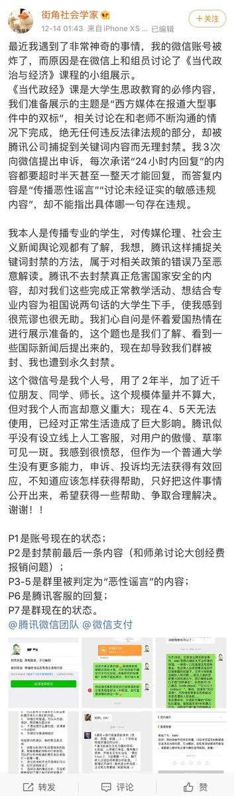
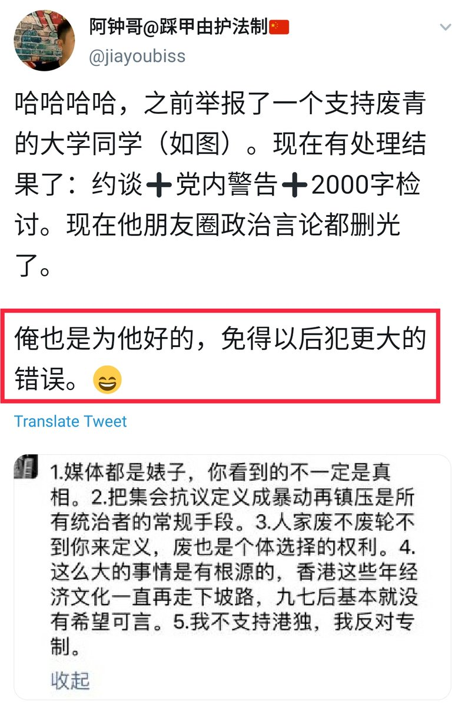

[12月19日 20:28]    BBC News 中文   @bbcchinese    英国外相在中英联合声明签署35周年之际表示，香港正经历主权移交以来最大的动荡，敦促北京尊重“一国两制”与港人对话。
 https://bbc.in/2s0xVR6   :speech_balloon:评:7 :+1:赞:8 :globe_with_meridians:转:4  

[12月19日 20:01]    BBC News 中文   @bbcchinese    【香港示威中的盲人律师：我上前线 因为爱这些年轻人】香港这位常常出现在示威人群里的盲人律师说，黑衣人的破坏行为是不对的，但他还是想上前线，因为爱。 https://bbc.in/2sLgkfW   :speech_balloon:评:14 :+1:赞:7 :globe_with_meridians:转:6  

[12月19日 19:00]    纽约时报中文网   @nytchinese    复旦大学修改章程删除“思想自由”，引发学生抗议  http://nyti.ms/2txXXvD https://twitter.com/HernandezJavier/status/1207478502867361793 …  :speech_balloon:评:3 :+1:赞:22 :globe_with_meridians:转:22  

[12月19日 18:30]    纽约时报中文网   @nytchinese    与香港相比，澳门在“一国两制”模式下更容易接受北京在国家政策事务上的终极权威。无论是被大陆拉拢还是胁迫，在大多数情况下，该城市的67万居民都能与之和平共处。
这种顺从有其历史原因，也因为澳门经济高度依赖赌博业，受中国大陆影响更大。 http://nyti.ms/2PDTsrX   :speech_balloon:评:20 :+1:赞:55 :globe_with_meridians:转:23  

[12月19日 18:09]    老司机   @h5lpykl7tp6jjop    这几天，澳洲热得就跟火炉似的。
刚好，这段时间悉尼鲜虾泛滥，各位华人，还不拿起渔网捞虾去？最近，一位悉尼的华人博主“你的摄影师JOF”，在小红书上上传了这么一段视频都是因为，最近悉尼海里的虾实在是太多了！一个小时后，两个大水桶就全装满了！  :speech_balloon:评:2 :+1:赞:6 :globe_with_meridians:转:0  

[12月19日 18:00]    纽约时报中文网   @nytchinese    《纽约时报》今日头版 https://twitter.com/TomJolly/status/1207520965556654080 …  :speech_balloon:评:5 :+1:赞:6 :globe_with_meridians:转:2  

[12月19日 17:44]    老司机   @h5lpykl7tp6jjop    金正恩在平壤大街公开处决“百花园迎宾馆”馆长
因遭发现在家中藏有300万美金钜款，最后以涉嫌贪污，在平壤大街遭处决。该馆是朝鲜接待外宾最主要场所，代表着最高规格的礼遇，曾经招待过前韩国总统金大中、卢武铉、前日本首相小泉纯一郎及前美国总统卡特等各国政要。
贪污是东西朝鲜无法医治的痼疾！  :speech_balloon:评:6 :+1:赞:27 :globe_with_meridians:转:6  

[12月19日 17:30]    纽约时报中文网   @nytchinese    此次的章程修改再度令人担心，自2012年上任以来对言论自由施行广泛镇压的习近平正在加紧行动，将大学变成党的堡垒，抑制异见的声音。
“我们想表明我们不能容忍这一点，”一名复旦大学本科生表示。该学生是周三抗议该校决定从其章程中删除“思想自由”的数十名学生之一。 http://nyti.ms/2txXXvD   :speech_balloon:评:16 :+1:赞:37 :globe_with_meridians:转:15  

[12月19日 17:14]    纽约时报中文网   @nytchinese    #观点 我们的危机远超过过去的任何分歧：它已经来到了我们所有人的门前，而我们认为再没有其他选择了。
我们真诚希望，但并不感到乐观的是，那些在可能的参议院弹劾审判中担任陪审的共和党人也会这样想。 http://nyti.ms/2S4GyEQ   :speech_balloon:评:6 :+1:赞:5 :globe_with_meridians:转:2  

[12月19日 17:01]    BBC News 中文   @bbcchinese    参议院的聆讯会如何进行？特朗普被免职后，明年还可以继续竞选总统吗？这是有关弹劾案你需要知道的事情。 https://bbc.in/2PA25Ug   :speech_balloon:评:15 :+1:赞:15 :globe_with_meridians:转:6  

[12月19日 16:30]    纽约时报中文网   @nytchinese    复旦大学学生周三举行抗议活动，反对共产党进一步扩大对大学校园的控制，这是一次罕见而危险的谴责，凸显人们对习近平执政下言论自由受到侵蚀的广泛担忧。
抗议活动是对复旦大学本月决定改写章程的回应。修改后的章程强调对党的忠诚高于独立和学术自由等价值观。 http://nyti.ms/2txXXvD   :speech_balloon:评:57 :+1:赞:256 :globe_with_meridians:转:110  

[12月19日 16:27]    新闻大吐槽   @TuCaoFakeNews    三星——儒家文化——己所不欲勿施于人——离职好聚好散
华为——共党文化——斗争哲学人性泯灭——离职关你251天 https://twitter.com/zhanglucy88/status/1207519402117058567 …  :speech_balloon:评:2 :+1:赞:40 :globe_with_meridians:转:13  

[12月19日 16:00]    BBC News 中文   @bbcchinese    对一般人来说，俄国人炫耀著名的罗宋汤是理所当然的，但乌克兰人却不以为然，因为他们认为罗宋汤本是乌克兰国菜。 https://bbc.in/36My7lR   :speech_balloon:评:25 :+1:赞:53 :globe_with_meridians:转:12  

[12月19日 16:00]    纽约时报中文网   @nytchinese    中国建设系统性监控网络，警察权力扩张  http://nyti.ms/34CXyEQ https://twitter.com/paulmozur/status/1207151583626088448 …  :speech_balloon:评:6 :+1:赞:9 :globe_with_meridians:转:8  

[12月19日 15:30]    纽约时报中文网   @nytchinese    投票为明年初在参议院进行历史性审判奠定了基础，在特朗普竞选连任的10个月前，审判将最终决定是否将特朗普无罪释放或定罪并免职。
由共和党控制的参议院可能宣判无罪释放，但这一程序必定会恶化美国政治与文化的分歧，这种分歧在特朗普任内已被戏剧化放大。 http://nyti.ms/2M9qRZf   :speech_balloon:评:10 :+1:赞:10 :globe_with_meridians:转:4  

[12月19日 15:03]    新闻大吐槽   @TuCaoFakeNews    同样一身警皮，
三哥不欺妇女，
反观亚洲东隅，
人伦底线告急！

港警专虐花季，
陆警顽似泼皮，
欺凌老弱病残，
无所不用其极！

盖为共产邪说，
无神论之恶疾，
怜悯之心全无，
坠入禽兽之域！ https://twitter.com/hAqxu49QLnUufFq/status/1207534948724301829 …  :speech_balloon:评:8 :+1:赞:56 :globe_with_meridians:转:22  

[12月19日 15:01]    BBC News 中文   @bbcchinese    在台湾大选首场电视政见发表会，蔡英文和韩国瑜就香港议题正面交锋，同场的还有宋楚瑜。  :speech_balloon:评:80 :+1:赞:210 :globe_with_meridians:转:58  

[12月19日 15:00]    纽约时报中文网   @nytchinese    时报发现，中国将数百万人的个人数据储存在甚至连基本的安全措施都没有的服务器上。此外，私人承包商和中间商可以广泛获取中国政府收集的个人数据。
这项建设才刚开始，但它正在席卷中国各个城市。这些监控网络由地方警方控制，就好比美国的县治安官在运行其自己的国家安全局。 http://nyti.ms/34CXyEQ   :speech_balloon:评:8 :+1:赞:30 :globe_with_meridians:转:14  

[12月19日 14:39]    财经真相   @caijingxiang    美国历史上四位遭到“弹劾”的总统，以及弹劾条款和原因！  :speech_balloon:评:15 :+1:赞:76 :globe_with_meridians:转:22  

[12月19日 14:30]    BBC News 中文   @bbcchinese    “我根本没有被弹劾的感觉”  :speech_balloon:评:30 :+1:赞:244 :globe_with_meridians:转:72  

[12月19日 14:30]    纽约时报中文网   @nytchinese    #图集【2019年我们最喜欢的22张旅行照片】2019年，时报旅游版共拍摄了3万9千多张照片，我们从中选出了记者和编辑们最喜欢的22张。从佛罗里达海滩到哈瓦那音乐现场，跟随我们开启一场视觉旋风之旅吧！
点击查看图集： http://nyti.ms/34DZjlc   :speech_balloon:评:11 :+1:赞:15 :globe_with_meridians:转:4  

[12月19日 14:26]    财经真相   @caijingxiang    为了庆祝澳门被中共统治20周年，澳门特别行政区政府与珠海市人民政府将于12月22日晚上9时，在澳门旅游塔及珠海横琴金融岛对出海面首次举行联合烟花汇演。本次汇演将有16万枚烟花、4艘大泊船、16个特效燃放平台、56艘无人船及600只无人机参与。 周末没事，可以去看看纳税人的钱如何“天女散花”！  :speech_balloon:评:13 :+1:赞:129 :globe_with_meridians:转:36  

[12月19日 14:01]    BBC News 中文   @bbcchinese    巴基斯坦前总统穆沙拉夫因叛国罪被判死刑。近年来，台湾陈水扁，韩国朴槿惠等从权力巅峰跌落的国家领导人似乎大有人在。 https://bbc.in/2ZamzGA   :speech_balloon:评:22 :+1:赞:25 :globe_with_meridians:转:3  

[12月19日 14:00]    纽约时报中文网   @nytchinese    中国正在把监视其近14亿人口的能力提升到一个令人不安的新水平，为世界提供了如何建设数字极权国家的蓝图。
当局正在将手机扫描、人脸识别等技术结合，形成一套新型控制工具。这项席卷各个城市的建设以牺牲个人隐私为代价，将使地方警察有能力追踪每个街头行人。 http://nyti.ms/34CXyEQ   :speech_balloon:评:101 :+1:赞:273 :globe_with_meridians:转:158  

[12月19日 13:30]    纽约时报中文网   @nytchinese    周三，众议院以妨碍国会调查和滥用职权为由弹劾总统特朗普，使其成为美国历史上第三位被控犯有严重罪行和不检行为，面临参议院罢免的总统。
当天激烈的辩论反映了特朗普时代美国政治深陷两极分化，在辩论后，党派对于两项弹劾条款的投票泾渭分明。 http://nyti.ms/2M9qRZf   :speech_balloon:评:12 :+1:赞:39 :globe_with_meridians:转:11  

[12月19日 13:01]    BBC News 中文   @bbcchinese    印度各地近日都发生了大规模示威游行，反对莫迪政府的新公民法。印度民族主义崛起导致的潜在矛盾开始公开化。 https://bbc.in/36ZRxnB   :speech_balloon:评:19 :+1:赞:44 :globe_with_meridians:转:19  

[12月19日 13:00]    纽约时报中文网   @nytchinese    #每日一词 cherry-pick，精挑细选。美国外国情报监控法庭周二对FBI发起指控，称其在涉俄调查中，就监听特朗普前竞选顾问Carter Page申请许可时，精心挑选了相关证据。
Cherry-pick一词字面意思为摘樱桃，后引申为特意挑选（最佳的、最有利的），一般含有贬义。更多简报内容： http://nyti.ms/35DjWiH   :speech_balloon:评:0 :+1:赞:3 :globe_with_meridians:转:1  

[12月19日 12:00]    纽约时报中文网   @nytchinese    两名试图叛逃的朝鲜渔民被韩国遣返。这一事件因摄影师拍下总统助手手机上的短信遭到曝光，引发了韩国人的愤怒。
人权活动人士称，朝鲜肯定会处决他们。但韩国官员表示，这两人屠杀了船长和其他15名船员，不是需要保护的难民。
更多简报内容： http://nyti.ms/35DjWiH   :speech_balloon:评:0 :+1:赞:15 :globe_with_meridians:转:6  

[12月19日 11:59]    财经真相   @caijingxiang    本次降准幅度应该会超过100个基点，去年央行新年大规模降准公布日期是1月4号（新年的第一周的周五），实施日期是1月15日，今年如果央行沿用去年时间点，最迟会在1月3号（周五）公布，或者本周五（明天）宣布！预计本次降准对人民币汇率影响有限，人民币会短线走低后，将会继续重回7附近震荡！  :speech_balloon:评:3 :+1:赞:84 :globe_with_meridians:转:9  

[12月19日 11:48]    财经真相   @caijingxiang    【重要】昨天央行开展2500亿逆回购操作，其中包含1500亿14天操作，14天后到期日刚好是元旦，这说明央行已经开始安排跨年流动性。由于春节提现高峰，以及提前下发2020年一万亿专项债开始筹资，再加上到期4075亿MLF，交税费高峰，初步估算整个1月份资金缺口达到2.8万亿，为此央行大概率全面性再次降准！  :speech_balloon:评:9 :+1:赞:196 :globe_with_meridians:转:52  

[12月19日 11:00]    BBC News 中文   @bbcchinese    美国众议院对特朗普弹劾案第一项罪名“滥用权力”的投票结果是：229名民主党议员支持，197名共和党议员反对。他要下台了吗？ https://bbc.in/2r8bUj5   :speech_balloon:评:81 :+1:赞:124 :globe_with_meridians:转:29  

[12月19日 11:00]    纽约时报中文网   @nytchinese    日本女记者伊藤诗织指控遭遇性侵案胜诉，获赔330万日元（约合人民币21万元）。被告山口敬之是日本知名记者，曾为安倍晋三书写传记。
日本很少有女性公开谈论性侵犯，作为“我也是”运动的代表人物，伊藤诗织称这一裁决是一个里程碑。 
更多简报内容： http://nyti.ms/35DjWiH   :speech_balloon:评:0 :+1:赞:7 :globe_with_meridians:转:2  

[12月19日 10:31]    BBC News 中文   @bbcchinese    最新的计划是将澳门发展成一个金融中心，分散对博彩业的依赖，也有人认为将把它打造成社会纷争不断的香港一个“后备”。 https://bbc.in/35BuL51   :speech_balloon:评:45 :+1:赞:43 :globe_with_meridians:转:10  

[12月19日 10:30]    纽约时报中文网   @nytchinese    “我认为这是使这个村子重现生机的美好方式。”一名到访名顷的访客说。
另一位访客在学校一个教室的黑板上缭乱地写下了一个尖锐的信息：“活人哪去了？” http://nyti.ms/34zkJjm   :speech_balloon:评:1 :+1:赞:7 :globe_with_meridians:转:0  

[12月19日 10:17]    纽约时报中文网   @nytchinese    特朗普因滥用权力和妨碍国会调查被弹劾，成为美国史上第三位被正式弹劾的总统，将面临参议院审判。 https://twitter.com/nytimes/status/1207479419897622529 …  :speech_balloon:评:34 :+1:赞:103 :globe_with_meridians:转:27  

[12月19日 10:14]    纽约时报中文网   @nytchinese    美国众议院历史性投票结果出炉：特朗普因滥用权力和妨碍国会调查被弹劾，成为美国史上第三位被正式弹劾的总统，将面临参议院审判。
与此同时，特朗普正在密歇根州的集会上发表讲话，对此展开反击。民主党和共和党的激辩反映了美国政坛严重的两极分化。 更多简报内容： http://nyti.ms/35DjWiH   :speech_balloon:评:3 :+1:赞:10 :globe_with_meridians:转:4  

[12月19日 10:10]    纽约时报中文网   @nytchinese    早安！今日重点新闻包括：
中国系统性建设监控网络；美众院投票弹劾特朗普；复旦大学修改章程引发学生抗议；香港抗争未平，习近平访问澳门；日本女记者伊藤诗织指控遭遇性侵案胜诉；韩国遣返两名试图叛逃朝鲜渔民引发争议……以下是今天的重点新闻。 http://nyti.ms/35DjWiH   :speech_balloon:评:10 :+1:赞:27 :globe_with_meridians:转:8  

[12月19日 10:01]    BBC News 中文   @bbcchinese    中国每年产生超过两亿吨城市垃圾，西安最大填埋场比原计划提前了25年被装满，当地开始寻求其它方式处理垃圾。 https://bbc.in/2Z4boPI   :speech_balloon:评:32 :+1:赞:67 :globe_with_meridians:转:28  

[12月19日 09:01]    BBC News 中文   @bbcchinese    她的爱犬去世时，老板让她放两天假来悼念离世的宠物。“丧宠假”会成为主流吗？ https://bbc.in/2Ew2lgK   :speech_balloon:评:13 :+1:赞:27 :globe_with_meridians:转:2  

[12月19日 07:20]    新闻大吐槽   @TuCaoFakeNews    火葬场迁址播扬镇，又遭强烈抵制，市民们非常有策略，在震天的锣鼓点的掩护下，攻入政府大楼！各种杂物齐射党官，吓得他们屁滚尿流逃窜~
尽管抗争如此激烈，可路过的不知情者肯定还以为是在庆祝什么活动~
抗争者深得兵法要诀，共党支部好似被套上麻袋，一顿胖揍  :speech_balloon:评:30 :+1:赞:377 :globe_with_meridians:转:194  

[12月19日 05:09]    老司机   @h5lpykl7tp6jjop    几乎所有反共的组织中共都当作小菜一碟，能让它们忌惮的只有法轮功，因为中共洗脑是靠威胁利诱，而法轮功是真让信徒入迷而信，比打土豪分田地一人一个女学生要高尚得多，所以这么多年，也没有把他们打垮，我不信法轮功，对他们尊重，但很怀疑靠中华文化和个人崇拜能救中国？  :speech_balloon:评:18 :+1:赞:91 :globe_with_meridians:转:10  

[12月19日 04:32]    老司机   @h5lpykl7tp6jjop    网文节选转发  :speech_balloon:评:0 :+1:赞:11 :globe_with_meridians:转:5  

[12月19日 04:04]    老司机   @h5lpykl7tp6jjop    日本管理大师新作:中国是典型“低智商国家”

45.9万中国人共用一所图书馆，而且里面没有好书。  :speech_balloon:评:6 :+1:赞:120 :globe_with_meridians:转:41  

[12月19日 03:47]    老司机   @h5lpykl7tp6jjop    加国华人女教授怒告大学种族歧视 性骚扰 下毒
湖首大学秘密监控了我的银行账户和生活起居，法庭上，华人女教授这样说道，但是被问到具体的细节和证据时，她又迅速改口说是性骚扰和性诱骗等，最终人权法庭驳回了她的诉讼。怀疑自己遭受到了种族歧视就要打官司，没有证据光凭怀疑？这位女教授咋当上的？  :speech_balloon:评:0 :+1:赞:8 :globe_with_meridians:转:2  

[12月19日 02:07]    老司机   @h5lpykl7tp6jjop    妙文共欣赏：《霾是故乡浓》  :speech_balloon:评:0 :+1:赞:11 :globe_with_meridians:转:0  

[12月19日 01:55]    墙国铁拳现世报😷   @Socialistfist    后续申明  :speech_balloon:评:14 :+1:赞:98 :globe_with_meridians:转:15  

[12月18日 23:59]    BBC News 中文   @bbcchinese    激进组织“伊斯兰国”在伊拉克摩苏尔炸毁奈比尤努斯清真寺，竟意外发现了距今3000年的亚述王朝宫殿。故事从这里开始（本篇为长阅读哦） https://bbc.in/2S2NLVZ   :speech_balloon:评:10 :+1:赞:175 :globe_with_meridians:转:88  

[12月18日 23:30]    BBC News 中文   @bbcchinese    这条马路会变得很甜喔  【德国小镇液态巧克力流出导致道路封闭】 https://bbc.in/2PyevMn   :speech_balloon:评:8 :+1:赞:57 :globe_with_meridians:转:18  

[12月18日 23:00]    BBC News 中文   @bbcchinese    英国脱欧五个月后，特朗普赢了大选。这一次，英国的政治动向是否再次预示着美国下一步即将发生什么？ https://bbc.in/2YYcWdZ   :speech_balloon:评:5 :+1:赞:20 :globe_with_meridians:转:6  

[12月18日 22:30]    BBC News 中文   @bbcchinese    强迫婚姻，每天遭到老公强奸。这一切竟然发生在当今的英国家庭… https://bbc.in/36MQGpV   :speech_balloon:评:55 :+1:赞:68 :globe_with_meridians:转:28  

[12月18日 22:20]    BBC News 中文   @bbcchinese    以文科见长的复旦大学章程修改引发更多网络关注，新公布的章程相当将此前所有推进学术自由的努力付诸东流。 https://bbc.in/2PBfuf4   :speech_balloon:评:87 :+1:赞:398 :globe_with_meridians:转:194  

[12月18日 22:01]    BBC News 中文   @bbcchinese    一年一度的欧洲议会萨哈罗夫奖颁奖典礼在法国斯特拉斯堡举行，今年获奖者是在中国被监禁的维吾尔族学者伊利哈木·土赫提。 https://bbc.in/34CmBrz   :speech_balloon:评:27 :+1:赞:134 :globe_with_meridians:转:46  

[12月18日 21:42]    BBC News 中文   @bbcchinese    回顾睡在衣柜里的三个月，马蒂亚斯说那是“疯狂的时刻，但超酷”。他补充说：“我每天都在工作，所以老实说我不在乎睡觉的地方。” https://bbc.in/34vOWQr   :speech_balloon:评:2 :+1:赞:16 :globe_with_meridians:转:2  

[12月18日 21:01]    BBC News 中文   @bbcchinese    男性已知的避孕方式主要有两种：安全套或是做输精管结扎术。为何没有男性避孕药上市呢？ https://bbc.in/35yaOMr   :speech_balloon:评:14 :+1:赞:33 :globe_with_meridians:转:8  

[12月18日 20:34]    老司机   @h5lpykl7tp6jjop    2019年，香港人给党送终没完没了；而本以为平息的广东茂名火葬场事件又波澜再起；
共党在文楼镇没能得逞，旋即选中距离文楼镇27公里的播扬镇，不料又遭强烈抵制，本周一有近万村民上街示威，并且用燃烧弹与警方死磕~

香港负责给党送终，茂名负责火化，一条龙服务！  :speech_balloon:评:28 :+1:赞:375 :globe_with_meridians:转:144  

[12月18日 20:34]    新闻大吐槽   @TuCaoFakeNews    2019年，香港人给党送终没完没了；而本以为平息的广东茂名火葬场事件又波澜再起；
共党在文楼镇没能得逞，旋即选中距离文楼镇27公里的播扬镇，不料又遭强烈抵制，本周一有近万村民上街示威，并且用燃烧弹与警方死磕~

香港负责给党送终，茂名负责火化，一条龙服务！  :speech_balloon:评:28 :+1:赞:375 :globe_with_meridians:转:144  

[12月18日 20:34]    新闻大吐槽   @TuCaoFakeNews    2019年，香港人给党送终没完没了；而本以为平息的广东茂名火葬场事件又波澜再起；
共党在文楼镇没能得逞，旋即选中距离文楼镇27公里的播扬镇，不料又遭强烈抵制，本周一有近万村民上街示威，并且用燃烧弹与警方死磕~

香港负责给党送终，茂名负责火化，一条龙服务！  :speech_balloon:评:28 :+1:赞:375 :globe_with_meridians:转:144  

[12月18日 20:12]    新闻大吐槽   @TuCaoFakeNews    复旦师生不满共党将「独立之精神，自由之思想」等字眼从大学章程中删除，齐聚食堂，唱校歌抗议。歌词：復旦復旦復旦，日月光华同灿烂！

复旦原指：不忘“震旦”之旧，更含复兴中华之意~
新解：要想中华复兴，共党必须滚旦~  :speech_balloon:评:43 :+1:赞:700 :globe_with_meridians:转:253  

[12月18日 20:12]    新闻大吐槽   @TuCaoFakeNews    复旦师生不满共党将「独立之精神，自由之思想」等字眼从大学章程中删除，齐聚食堂，唱校歌抗议。歌词：復旦復旦復旦，日月光华同灿烂！

复旦原指：不忘“震旦”之旧，更含复兴中华之意~
新解：要想中华复兴，共党必须滚旦~  :speech_balloon:评:43 :+1:赞:700 :globe_with_meridians:转:253  

[12月18日 20:00]    纽约时报中文网   @nytchinese    “我希望这里能有更多孩子，那样会更热闹，”绫野说。“所以我制作了这些孩子。”
“年轻人在这里没有机会，”在绫野的回忆里，村里曾经有一家医疗诊所，一个老虎机游戏厅和一个餐馆。如今名顷甚至没有一家商店。“他们无法谋生。” http://nyti.ms/34zkJjm   :speech_balloon:评:1 :+1:赞:12 :globe_with_meridians:转:5  

[12月18日 19:55]    财经真相   @caijingxiang    澳门向内地汇款额度提高到8万，那么从内地到澳门的额度没有提高吗？怎么感觉是在撸澳门人的羊毛节奏啊！难道就是因为澳门人老实，往死里忽悠？  :speech_balloon:评:34 :+1:赞:281 :globe_with_meridians:转:81  

[12月18日 19:54]    墙国铁拳现世报😷   @Socialistfist    根据网上来源显示抚顺生猪肉价在每公斤30元左右。由此得出花千芳母亲一个月可以购买猪肉6.7公斤左右  :speech_balloon:评:11 :+1:赞:45 :globe_with_meridians:转:6  

[12月18日 19:35]    新闻大吐槽   @TuCaoFakeNews    一鳞半爪尚且精美优雅，何况真龙乎？
亚里士多德说”人类社会是洞外世界的投影“，美有其更高的来处，当从上到下连上了，艺术的感召力无可匹敌，比如每年在世界上巡回的神韵演出，广受西方世界欢迎，因为他不仅仅是服饰美，舞蹈美，还在阐释中华文化之精神内涵，是在接已被共党斩断的中华文化根脉~  :speech_balloon:评:1 :+1:赞:13 :globe_with_meridians:转:4  

[12月18日 19:35]    新闻大吐槽   @TuCaoFakeNews    鬼子盯上花姑娘，花姑娘何罪之有？
李子柒，滇西小哥，将被共党破坏后的传统文化残片拿到世界级平台上展示，都美丽的无可挑剔~让老外服气~

不用批评他们假，艺术本来就是高于生活，其实冷血、反人性的共党文化永远也开不出半朵温情的文化之花~

希望有生命力的东西免于邪党魔爪~  :speech_balloon:评:2 :+1:赞:47 :globe_with_meridians:转:11  

[12月18日 19:19]    墙国铁拳现世报😷   @Socialistfist    目前花千芳已经意识到评论翻车已经删除该条微博
小编建议花千芳可以从此把简介改成： 我们的征途是星辰大海和妈妈的养老证  :speech_balloon:评:9 :+1:赞:239 :globe_with_meridians:转:25  

[12月18日 19:19]    财经真相   @caijingxiang    这就是说美国人给的时间点就是下个月的第一周，算时间就是两周内中共内斗出结果！ https://twitter.com/globalhimalaya/status/1207104656129658881 …  :speech_balloon:评:12 :+1:赞:240 :globe_with_meridians:转:93  

[12月18日 18:42]    墙国铁拳现世报😷   @Socialistfist    #社会主义铁拳 https://twitter.com/zhanglucy88/status/1207234309737697280 …  :speech_balloon:评:31 :+1:赞:350 :globe_with_meridians:转:94  

[12月18日 17:41]    老司机   @h5lpykl7tp6jjop    著名自干五粉紅花千芳
居然敢指責政府黑了養老金
把其母養老證收回
養老金改存款利息了
狠……黑……!

也有被鐵拳砸疼的時候!
  :speech_balloon:评:76 :+1:赞:439 :globe_with_meridians:转:169  

[12月18日 16:36]    财经真相   @caijingxiang    中国国家发改委新闻发言人孟玮17日透露，今后一段时间，特别是中国“两节”期间，将根据市场形势变化，择机增加中央冻猪肉储备投放。  :speech_balloon:评:19 :+1:赞:135 :globe_with_meridians:转:19  

[12月18日 13:15]    老司机   @h5lpykl7tp6jjop    老眼昏花又把必须打成心须了.报歉！  :speech_balloon:评:1 :+1:赞:9 :globe_with_meridians:转:0  

[12月18日 13:09]    老司机   @h5lpykl7tp6jjop    权力傲慢的结果！  :speech_balloon:评:2 :+1:赞:96 :globe_with_meridians:转:27  

[12月18日 12:36]    老司机   @h5lpykl7tp6jjop    从小老一辈就叱责，没有规矩不成方圆，中国人生存第一课就是得懂什么是规矩，共产党的规矩就是下级服从上级，全党服从中央！一切行动听指挥！心须服从共产党领导！然后还有若干小规矩， 总之一句话就是要听话！不要乱说话！然后就没有然后了，你觉得还有剩下什么吗？自由民主平等…你在说什么？不听话  :speech_balloon:评:13 :+1:赞:136 :globe_with_meridians:转:27  

[12月18日 04:40]    老司机   @h5lpykl7tp6jjop    古有商纣王烽火戏诸侯，裂帛博妃笑，毛大帝也不含忽，当年灭四害歼灭麻雀战爭的影片重现，能让人笑中带泪，泪中带笑！

哭笑不得：《围剿麻雀》1958年全民围剿麻雀运动的真实记录 https://mp.weixin.qq.com/s/LhhiDSahbqjVdaWPUQVrVw …  :speech_balloon:评:1 :+1:赞:9 :globe_with_meridians:转:2  

[12月18日 04:26]    老司机   @h5lpykl7tp6jjop    好文转发  :speech_balloon:评:6 :+1:赞:64 :globe_with_meridians:转:28  

[12月18日 03:46]    老司机   @h5lpykl7tp6jjop    “出轨”血案全国热议 女子遭当街暴打毁容涂大便
究竟是主权高于人权，还是人权第一？  :speech_balloon:评:9 :+1:赞:20 :globe_with_meridians:转:6  

[12月18日 03:40]    老司机   @h5lpykl7tp6jjop      :speech_balloon:评:0 :+1:赞:8 :globe_with_meridians:转:3  

[12月18日 03:40]    老司机   @h5lpykl7tp6jjop    复旦大学修改章程世人侧目 这就是中国未来的方向？
先把独立去掉，再把自由抹杀，这就是习特勒的依法制国？  :speech_balloon:评:3 :+1:赞:37 :globe_with_meridians:转:15  

[12月18日 03:24]    老司机   @h5lpykl7tp6jjop    联合国沦陷，人权高专办竟向北京提供异见者名单  :speech_balloon:评:0 :+1:赞:7 :globe_with_meridians:转:4  

[12月18日 00:01]    老司机   @h5lpykl7tp6jjop    全世界不可能發生的事，在共匪國都發生了。 https://twitter.com/bj0ven4ue2atlsb/status/1206944794653708288 …  :speech_balloon:评:15 :+1:赞:147 :globe_with_meridians:转:90  

[12月17日 23:20]    老司机   @h5lpykl7tp6jjop    肇事逃逸，老人被撞，没有人打120急救！遭受三车接连碾压,不幸身亡！
扩散！寻找肇事者！12月17日，北流市公安局交警管理大队宣传中队一位工作人员称，监控视频属实。视频老人惨遭连撞身亡，3车逃逸。  :speech_balloon:评:87 :+1:赞:376 :globe_with_meridians:转:322  

[12月17日 23:13]    墙国铁拳现世报😷   @Socialistfist      :speech_balloon:评:7 :+1:赞:51 :globe_with_meridians:转:6  

[12月17日 23:13]    墙国铁拳现世报😷   @Socialistfist    注意到他使用日文，这个老哥真是猜不透他  :speech_balloon:评:10 :+1:赞:85 :globe_with_meridians:转:3  

[12月17日 21:53]    墙国铁拳现世报😷   @Socialistfist    补充  :speech_balloon:评:11 :+1:赞:93 :globe_with_meridians:转:7  

[12月17日 21:36]    墙国铁拳现世报😷   @Socialistfist    习近平主席想要知道你的坐标

#战螂在推特 https://twitter.com/minzhutiequan/status/1206795300255387648 …  :speech_balloon:评:27 :+1:赞:290 :globe_with_meridians:转:24  

[12月17日 21:29]    墙国铁拳现世报😷   @Socialistfist    声明：小编在推友提醒后把推文删除了，原因请见配图。与之前其他人不同，他的措辞实属现行网络舆论管制下的无奈。  :speech_balloon:评:26 :+1:赞:316 :globe_with_meridians:转:76  

[12月17日 19:41]    财经真相   @caijingxiang    2018年专项债余额（7.39万亿）就已经超过了政府性基金收入（7.14万亿）的规模！专项债以前高益完全可以靠土地财政收入填补，现在土地财政收入也不行了，必须要找别的办法解决！  :speech_balloon:评:12 :+1:赞:128 :globe_with_meridians:转:30  

[12月17日 19:34]    财经真相   @caijingxiang    政府债券流动性不足，翻译成人话就是说，政府债券没人买，而且购买人多数为银行机构，市场机构太聪明，不要！所以必须换个名字“特别国债”，继续忽悠！  :speech_balloon:评:32 :+1:赞:521 :globe_with_meridians:转:199  

[12月17日 19:33]    新闻大吐槽   @TuCaoFakeNews    貌似是在做睫毛，其实在位新疆鸣不平；
貌似是在做蛋糕，其实蛋糕上写的是光复香港
这样下去TikTok在美国是玩不下去了!  :speech_balloon:评:44 :+1:赞:1876 :globe_with_meridians:转:706  

[12月17日 19:25]    墙国铁拳现世报😷   @Socialistfist    律师函警告  :speech_balloon:评:10 :+1:赞:106 :globe_with_meridians:转:6  

[12月17日 14:57]    新闻大吐槽   @TuCaoFakeNews    据说是一两年以前就用的包装，能坚持不换也可以点个赞  :speech_balloon:评:1 :+1:赞:40 :globe_with_meridians:转:0  

[12月17日 14:24]    新闻大吐槽   @TuCaoFakeNews    李嘉诚旗下的屈臣氏矿泉水瓶身上写着“为香港学生打气” https://twitter.com/jim97147570/status/1206746541446164480 …  :speech_balloon:评:29 :+1:赞:953 :globe_with_meridians:转:285  

[12月17日 14:24]    新闻大吐槽   @TuCaoFakeNews    李嘉诚旗下的屈臣氏矿泉水瓶身上写着“为香港学生打气” https://twitter.com/jim97147570/status/1206746541446164480 …  :speech_balloon:评:29 :+1:赞:953 :globe_with_meridians:转:285  

[12月17日 12:09]    新闻大吐槽   @TuCaoFakeNews    先是香港问题引发抵制NBA，然后新疆问题引发抵制英超。

不过这次党媒学乖了，宁愿挨了这一闷棍，不像对待NBA事件那样开动宣传机器狂轰滥炸。

将来，闷棍会越来越多，粉红们却会被党妈冷处理，看来只有继续装睡才是共党苟延残喘的唯一法子 https://www.soundofhope.org/post/322231   :speech_balloon:评:2 :+1:赞:117 :globe_with_meridians:转:38  

[12月17日 12:09]    新闻大吐槽   @TuCaoFakeNews    先是香港问题引发抵制NBA，然后新疆问题引发抵制英超。

不过这次党媒学乖了，宁愿挨了这一闷棍，不像对待NBA事件那样开动宣传机器狂轰滥炸。

将来，闷棍会越来越多，粉红们却会被党妈冷处理，看来只有继续装睡才是共党苟延残喘的唯一法子 https://www.soundofhope.org/post/322231   :speech_balloon:评:2 :+1:赞:117 :globe_with_meridians:转:38  

[12月16日 19:25]    墙国铁拳现世报😷   @Socialistfist    评论区表情包大赏？  :speech_balloon:评:12 :+1:赞:181 :globe_with_meridians:转:10  

[12月16日 19:17]    墙国铁拳现世报😷   @Socialistfist    任职于长春一汽公司的戛戛
每当遇到生活中的烦心事，总会回到家，一个人坐在沙发上，打开音响，调大音量, 循环播放 天赋事变的rap
［hey！democracy...] 
听着听着，戛戛就睡了过去，嘴角划出一道微笑，在中国梦里的她不再被世俗纷扰
晚安中国

#社会主义铁拳  :speech_balloon:评:78 :+1:赞:694 :globe_with_meridians:转:191  

[12月16日 17:03]    财经真相   @caijingxiang    第十九届四中全会精神！ https://twitter.com/landofyelang/status/1206481839906418688 …  :speech_balloon:评:22 :+1:赞:358 :globe_with_meridians:转:164  

[12月15日 19:13]    新闻大吐槽   @TuCaoFakeNews    反送中半年以来，我们看见过：
在香港街头高歌《愿荣光归香港》的意大利歌唱家；
来了解831太子站惨案的韩国影星；
在理工大学守护学生的美国牧师；
还有因给港人免费煮咖啡而备受黑警骚扰的日本小伙~

如果这些人就是中共口中的敌对势力，那么与这些人为敌，就是与一切信奉自由与仁爱的人为敌！  :speech_balloon:评:3 :+1:赞:186 :globe_with_meridians:转:83  

[12月15日 18:43]    新闻大吐槽   @TuCaoFakeNews    被香港抗争者的不屈精神感动，日本小伙飘洋过海，到香港街头给抗争者提供免费咖啡，可黑警处处阻挠，动不动就要盘查他，搞得他狼狈不堪~

日式咖啡一杯
自由精神百倍
帮煮帮倒免费
妒警心生暗鬼
纯打油  :speech_balloon:评:57 :+1:赞:1236 :globe_with_meridians:转:476  

[12月15日 16:43]    新闻大吐槽   @TuCaoFakeNews    有朋友问，这几天好安静，香港的抗争停下来了吗？
我说不会的，不信你看这个，半小时之前的事情~
抗争者分散成小队，在不同的地点出击！  :speech_balloon:评:16 :+1:赞:503 :globe_with_meridians:转:232  

[12月15日 12:37]    墙国铁拳现世报😷   @Socialistfist    #铁拳砸死小粉红

某新闻传播专业大学生，打算于思政课讨论“西方媒体在报道大型事件中的双标”，为此开设了微信讨论组交换素材与思路，但因为发言触及过多敏感词，惨遭微信封号，目前正在微博伸冤。

一场成功的“谁说我国没有言论自由”行为艺术表演。  :speech_balloon:评:91 :+1:赞:1031 :globe_with_meridians:转:359  

[12月15日 12:20]    财经真相   @caijingxiang    海南要升级为中央特区，谁决定的？该不会是某些一边干着女星，一边卖官的混蛋商量的吧？  :speech_balloon:评:124 :+1:赞:685 :globe_with_meridians:转:197  

[12月15日 11:54]    财经真相   @caijingxiang    在中国如果公司经营不下去的时候，没有什么问题是卖房不能解决的！  :speech_balloon:评:17 :+1:赞:187 :globe_with_meridians:转:31  

[12月15日 11:48]    财经真相   @caijingxiang    灵隐寺：12月13日，某媒体称：“12月18日—19日，天风证券将在上海召开展望2020年度策略会，而在下周五上午，天风策略会将会'移步'灵隐寺，接待人为灵隐寺主持方丈……”对此，灵隐寺郑重声明：“券商基金年终祈福”活动与本寺无任何关系，本寺从未委托或授权任何单位或个人开展与此相关的活动。  :speech_balloon:评:7 :+1:赞:60 :globe_with_meridians:转:13  

[12月15日 10:54]    新闻大吐槽   @TuCaoFakeNews    党媒记者和华大妈一问一答演双簧~

党媒妓者：美国媒体对中国不公，CGTN新疆反恐纪录片被Youtube下架，而且《纽约时报》记者还把香港暴徒称作“支持民主的活动分子”

华大妈：美国一些媒体没有恪守最基本的新闻报道准则，也失去了最起码的社会公德和责任！

网民：能否开放油管，我们想去谴责美帝媒体！  :speech_balloon:评:69 :+1:赞:397 :globe_with_meridians:转:116  

[12月15日 08:50]    新闻大吐槽   @TuCaoFakeNews    香港律政司长鄭若驊借口受伤手术康复，赖在英国不回港，被大使刘晓明亲自押解送中！

有传言说，北京担心这个垮脸大妈在手术时被军情六处植入窃听芯片，所以把大妈弄到北京作详细体检~

推行送中的罪魁被第一个送中，还被共党体检羞辱，不知她作何感受~心情不好，垮脸会加速~  :speech_balloon:评:30 :+1:赞:368 :globe_with_meridians:转:169  

[12月15日 02:39]    GFHG SDKM   @zyx_yny    This Muslim man was just released from a concentration in china 

"He could barely walk by himself. He doesn't recognize anyone in his family and gets frightened by every little movement of people around him"

There are nearly 3 Million Muslim in concentration camps in China   :speech_balloon:评:1466 :+1:赞:74574 :globe_with_meridians:转:61422  

[12月14日 23:24]    墙国铁拳现世报😷   @Socialistfist    “生而为国人，边早就选了”
当初NBA风波的爱国表态，提到在国家尊严前不值一提。
鼠绘汉化网因侵犯海贼王版权疑似被哔哩哔哩上海公司举报，现已经跨省批捕
NBA目前在中国照旧正常播出

#社会主义铁拳  :speech_balloon:评:48 :+1:赞:761 :globe_with_meridians:转:189  

[12月14日 22:11]    GFHG SDKM   @zyx_yny    My 2020 New Year resolution is to free both Hong Kong & China by defeating the New Evil Empire. Happy New Year! https://twitter.com/bohsiuming/status/1205845620851785735 …  :speech_balloon:评:422 :+1:赞:4877 :globe_with_meridians:转:2354  

[12月14日 19:00]    财经真相   @caijingxiang    特朗普上台前，中国依旧是资本流入国，这一时期如何逼迫中共放开管制，好让美企也能在中国分一杯羹是中美贸易纠纷的核心；无论是纳瓦罗这样的美国智库，还是特朗普竞选承诺，都是围绕的如何“进中国”来开展的，但是这个思维到今天就完全不合时宜，中国已经成为资本外流国，如何“出中国”必须要摆到桌面上  :speech_balloon:评:12 :+1:赞:198 :globe_with_meridians:转:36  

[12月14日 18:31]    财经真相   @caijingxiang    中共对外资企业实行外汇管制，是最大的贸易不公平，你连以前投资的钱都拿不回来，扯什么其他谈判就是胡扯！这点莱特希泽不知道吗？美国企业难道没有跟他沟通过吗？问题是中共权贵不可能把吃进肚子的美元吐出来，给美企撤退，考虑明白这一层，你就会明白贸易谈判从一开始就破裂了！  :speech_balloon:评:10 :+1:赞:276 :globe_with_meridians:转:68  

[12月14日 18:22]    财经真相   @caijingxiang    中美贸易谈判最核心的议题不是技术盗窃、知识产权、网络攻击、国企补贴等等，而是金融资本的全面开放，尤其是在华投资和利润如何顺利撤出，农产品购买之所以成为谈判焦点，归根结底还是“钱”，这也是为啥区区500亿美元就这么显眼的原因！如果放开美资外汇管制，那将是多少个500亿呢？  :speech_balloon:评:28 :+1:赞:421 :globe_with_meridians:转:97  

[12月14日 16:19]    财经真相   @caijingxiang    据朝中社今日报道，朝鲜国防科学院发言人发表谈话称，当地时间13日晚上10点41分至48分，朝鲜在西海卫星发射场再次进行重大试验。该发言人称，朝鲜近期取得的国防科研成果，将进一步夯实朝鲜的战略核战争遏制力。  :speech_balloon:评:16 :+1:赞:95 :globe_with_meridians:转:12  

[12月14日 10:09]    GFHG SDKM   @zyx_yny    #HKPoliceTerrorists has fired nearly 16,000 #TearGas rounds  during the six months of pro-#democracyforhk #HongKongProtests  :speech_balloon:评:12 :+1:赞:279 :globe_with_meridians:转:261  

[12月14日 03:21]    GFHG SDKM   @zyx_yny    #HongKongers & #HongKong #StandwithUyghurs 

To free #Uyghurs in #EastTurkistan, Chinese Communist Party of #China which violates #HumanRights needs to end. 

#BoycottChina  :speech_balloon:评:2 :+1:赞:116 :globe_with_meridians:转:20  

[12月14日 01:42]    GFHG SDKM   @zyx_yny    Support  :speech_balloon:评:7 :+1:赞:335 :globe_with_meridians:转:38  

[12月14日 01:01]    财经真相   @caijingxiang    第一阶段协议背后的数字博弈：15号即将生效的1600亿美元25%的关税，算下来就是400亿美元税收；将9月份1200亿美元15%的关税降7.5%，就是等于少征收90亿美元关税，两者总计是490亿美元。刚好就是中国采购500亿美元农产品！  :speech_balloon:评:79 :+1:赞:810 :globe_with_meridians:转:251  

[12月14日 00:28]    财经真相   @caijingxiang    1.关税原来说是取消3600亿的一半，现在只是1200亿的一半，没有假消息公布的好；2.利好出尽，获利了结；3.对比双方公告内容存在差异很多，引发市场担忧情绪！ https://twitter.com/QingLucky/status/1205524315807969281 …  :speech_balloon:评:12 :+1:赞:164 :globe_with_meridians:转:51  

[12月14日 00:21]    财经真相   @caijingxiang    中美第一阶段协议公告差异：1.美方公布包含强制执行机制，中方没有！2.中方公告说同意分阶段降低关税，美方公告里没有！3.美方公告中方承诺会购买大量农产品，中方公告中没有，且新闻发布会上故意混淆说，美方也会购买中国农产品！4.下一阶段，中方强调需要进行校对、翻译、商量时间（拖），美方没有！  :speech_balloon:评:109 :+1:赞:1410 :globe_with_meridians:转:777  

[12月13日 22:17]    GFHG SDKM   @zyx_yny    警察の鎮圧行動の中、原因不明の転落死で亡くなった周梓樂くん。

これは周くんのお父さんからの手紙。

//君がまだ母親のお腹にいたあの頃に、私たちはすでに君に「樂樂」という名前を付けることを決めたんだ。
君が一生楽しく笑顔で過ごせますように、と願って。//

是非、全文もご一読ください。  :speech_balloon:评:18 :+1:赞:994 :globe_with_meridians:转:767  

[12月13日 20:13]    GFHG SDKM   @zyx_yny    日本政府が来年、習近平国家主席を国賓として招くことについて、私は強く反対しています。

これはあくまで一人の香港人としての個人的な意見ですが、日本の皆さんに読んでほしいです。→  :speech_balloon:评:723 :+1:赞:22072 :globe_with_meridians:转:10222  

[12月13日 19:54]    墙国铁拳现世报😷   @Socialistfist    啧啧啧

#战螂在推特 2  :speech_balloon:评:23 :+1:赞:133 :globe_with_meridians:转:25  

[12月13日 18:50]    GFHG SDKM   @zyx_yny    #HayırlıCumalarDoğuTürkistan   :speech_balloon:评:17051 :+1:赞:173919 :globe_with_meridians:转:72094  

[12月13日 13:58]    GFHG SDKM   @zyx_yny    永不遺忘，常在心中，他們的付出，將會留給世世代代，香港多謝有你才會有未来，香港史書會有手足的勇敢，輝煌的事件。  :speech_balloon:评:52 :+1:赞:843 :globe_with_meridians:转:535  

[12月13日 11:46]    新闻大吐槽   @TuCaoFakeNews    港人很喜欢吃日式牛丼饭，但他们就是忍住不去吃吉野家！
因为吉野家解雇了为反送中发声的员工，主动替港共迫害香港人！

直到这家叫做SUKIYA的同类日料店开张，香港人排起长队准备大快朵颐。

不知道吉野家看到这大长队作何感想？
“矮马，没人吃，今天的牛肉又要臭了”  :speech_balloon:评:167 :+1:赞:2406 :globe_with_meridians:转:917  

[12月13日 11:19]    GFHG SDKM   @zyx_yny    Can't believe Commissar Lamb is rewarding @hkpoliceforce human rights abuse & brutality. https://twitter.com/Kaman13032369/status/1205325571070124037 …  :speech_balloon:评:447 :+1:赞:5117 :globe_with_meridians:转:4096  

[12月12日 21:43]    墙国铁拳现世报😷   @Socialistfist    感谢近几日投稿的推友！  :speech_balloon:评:0 :+1:赞:66 :globe_with_meridians:转:1  

[12月12日 21:42]    墙国铁拳现世报😷   @Socialistfist    红色精神流传一次一百万

#社会主义铁拳  :speech_balloon:评:41 :+1:赞:472 :globe_with_meridians:转:128  

[12月12日 20:11]    墙国铁拳现世报😷   @Socialistfist    补充  :speech_balloon:评:0 :+1:赞:55 :globe_with_meridians:转:11  

[12月12日 20:06]    墙国铁拳现世报😷   @Socialistfist    基层腐败，中央英明 -----某战螂

#社会主义铁拳  :speech_balloon:评:27 :+1:赞:341 :globe_with_meridians:转:75  

[12月12日 16:51]    GFHG SDKM   @zyx_yny    Japanese retail brand MUJI was sued by fake "MUJI" copycat in #China (right) for copyright dispute and the fake MUJI won the court case.

The genuine MUJI has to pay the fake one US$85k for their "financial loss" and apologize due to "copyright infringement"

China = Fantasy Land  :speech_balloon:评:151 :+1:赞:1456 :globe_with_meridians:转:1304  

[12月12日 16:35]    GFHG SDKM   @zyx_yny    He comes all the way from Japan, bring coffee with him to give Hong Kong people a free cup. “I come to give some warmth to you guys, I know what happened” he said 

#StandWithHongKong  :speech_balloon:评:162 :+1:赞:4051 :globe_with_meridians:转:2116  

[12月12日 13:43]    GFHG SDKM   @zyx_yny    今日、すき家の香港店がオープンしました。昨日の夜から長い行列ができました（笑）

親中派企業が経営している香港吉野家を多くの香港人がボイコットしている今、すき家は多分大人気になると思いますw

#香港 #すき家  :speech_balloon:评:447 :+1:赞:23720 :globe_with_meridians:转:7721  

[12月10日 22:10]    墙国铁拳现世报😷   @Socialistfist    “警察说要对我用喷雾剂了”

#社会主义铁拳  :speech_balloon:评:47 :+1:赞:769 :globe_with_meridians:转:180  

[12月04日 20:37]    GFHG SDKM   @zyx_yny    喂喂，香港嘅bb睇落嚟

澳洲設立committee，探討是否有必要頒佈Magnitsky. 可以開始寫信lobby袋鼠囯喔。They accept submissions now

好擔心。區選舉和HKHRDA頒佈后，大家有哋散漫有哋唔focus喎。還有人開始屌來屌去...

bb, come back! 依家有嘢做囖

利申：信還沒寫，不過澳洲list做完一半了 https://twitter.com/NSWHongkongers/status/1202151090399006720 …  :speech_balloon:评:9 :+1:赞:321 :globe_with_meridians:转:201  

[11月26日 01:01]    GFHG SDKM   @zyx_yny    Heading back to London. 

Thank you #HK for letting us share in your unforgettable victory.

香港人, 加油   :speech_balloon:评:2681 :+1:赞:21513 :globe_with_meridians:转:10211  

[11月24日 12:46]    GFHG SDKM   @zyx_yny    Very good to take some time@our from election observation to tell #JuniusHo in person that I was responsible for the revocation of his honorary doctorate from @AngliaRuskin #Sorrynotsorry  :speech_balloon:评:6943 :+1:赞:46239 :globe_with_meridians:转:27860  

[11月24日 08:10]    凡賽堤/FORSETI   @FecharCCP    呼籲請求共同挖掘所有有關香港發生的事，越全面越好，不同角度，越多越好，包括被暗地抓捕的人員，特別是CCP 派出的各種偽裝身份，包括變身變裝行兇的一點一滴都要挖掘出來，把CCP 的邪惡下三濫手段的真相毫無保留的曝光在全世界面前！世界公知公義才能真正挽救和保護香港人！希望懂視頻編輯配上中英文  :speech_balloon:评:3 :+1:赞:22 :globe_with_meridians:转:19  

[11月23日 10:13]    凡賽堤/FORSETI   @FecharCCP    CCP極權殺人恐怖組織正在用各種兇殘手段屠殺我們的同胞...................
CCP極權殺人恐怖組織是全人類的公敵！呼籲全世界正道主義合力消滅CCP！

圖為被殺害的陳彥霖母女！  :speech_balloon:评:0 :+1:赞:9 :globe_with_meridians:转:12  

[11月21日 13:58]    GFHG SDKM   @zyx_yny    On #PolyU being the end game, this OL says it is 100% not the end game.  She says what we saw happened to the students at Poly, the way they were brutally treated by #HKPolice, there's no way HKers will forget.  We will keep on fighting!

#StandWithHongKong #HongKongProtests  :speech_balloon:评:104 :+1:赞:2400 :globe_with_meridians:转:1559  

[11月21日 11:50]    GFHG SDKM   @zyx_yny    We were in front of the Diet Members’ Office Building.

We will keep fighting with you, HKers
We will keep spreading what's happening in HK

You are not alone  :speech_balloon:评:370 :+1:赞:3556 :globe_with_meridians:转:2135  

[11月21日 00:57]    GFHG SDKM   @zyx_yny    Yesterday’s passage of the #HongKong Human Rights & Democracy Act was a good day in the struggle to resist totalitarian #China & its bid for domination. But it was not the last day. We have a long road ahead to protect our jobs, our workers & our security.  :speech_balloon:评:1651 :+1:赞:16299 :globe_with_meridians:转:10806  

[11月20日 21:56]    GFHG SDKM   @zyx_yny    The first day that schools resumed, #hkpolice deliberately targeted high school students to stop and search for no reason. As many #hongkongers suggest, being young becomes a crime as #China and #HKGov are totally out of reach of the whole city.  :speech_balloon:评:262 :+1:赞:5607 :globe_with_meridians:转:6219  

[11月14日 18:36]    财经真相   @caijingxiang    中共基建没有钱，很多网友简单的认为开动印钞机就行，这其实是大错特错，中共央行印的每一分钱，都必须有对应的相应的价值才行，否则就是无锚印钞，汇率崩盘！过去20年央行印钞都是以债务为基础的。比如，房奴的房贷，当房奴申请贷款时，本质是向央行抵押了自己未来30年的劳动力。 https://twitter.com/aspeltuo8/status/1194923278646816768 …  :speech_balloon:评:85 :+1:赞:904 :globe_with_meridians:转:315  

[11月12日 07:22]    凡賽堤/FORSETI   @FecharCCP    11日早在西湾河开枪射伤示威者的港警关家荣身份被起底，其担任家教会主席的德望学校师生、家长及校友发起联署要求解除其在该校的职务。其两个女儿在该校就读。另有消息指，关家荣受过“大陆警察部门”特殊培训。下面这个小视频，足以解释这场血案的真相：这是流氓国家自上而下有计划的谋杀。  :speech_balloon:评:22 :+1:赞:259 :globe_with_meridians:转:177  

[11月05日 04:28]    凡賽堤/FORSETI   @FecharCCP    急救香港  #HKSOS！！！

天滅流氓政權！！！極權殺人恐怖組織正在用各種兇殘手段殺害我們的同胞..................................................

流氓政權的極權殺人恐怖組織蓄意謀殺香港年輕人！（13）

被暴力制服的年輕人已經休克，還殘暴折斷手！

兇殘，殘暴手段令人髮指到已經超越納粹！  :speech_balloon:评:1 :+1:赞:7 :globe_with_meridians:转:18  

[11月05日 04:24]    凡賽堤/FORSETI   @FecharCCP    急救香港  #HKSOS！！！

天滅流氓政權！！！極權殺人恐怖組織正在用各種兇殘手段殺害我們的同胞..................................................

流氓政權的極權殺人恐怖組織蓄意謀殺香港年輕人！（11）
兇殘，殘暴手段令人髮指到已經超越納粹！
天滅流氓政權！！！  :speech_balloon:评:0 :+1:赞:51 :globe_with_meridians:转:49  

[11月05日 04:23]    凡賽堤/FORSETI   @FecharCCP    急救香港  #HKSOS！！！

天滅流氓政權！！！極權殺人恐怖組織正在用各種兇殘手段殺害我們的同胞..................................................

流氓政權的極權殺人恐怖組織蓄意謀殺香港年輕人！（10）
兇殘，殘暴手段令人髮指到已經超越納粹！
天滅流氓政權！！！  :speech_balloon:评:0 :+1:赞:4 :globe_with_meridians:转:8  

[11月05日 04:16]    凡賽堤/FORSETI   @FecharCCP    急救香港  #HKSOS！！！

天滅流氓政權！！！極權殺人恐怖組織正在用各種兇殘手段殺害我們的同胞..................................................

流氓政權的極權殺人恐怖組織蓄意謀殺香港年輕人！（8）
兇殘，殘暴手段令人髮指到已經超越納粹！
天滅流氓政權！！！  :speech_balloon:评:1 :+1:赞:45 :globe_with_meridians:转:56  

[11月05日 04:13]    凡賽堤/FORSETI   @FecharCCP    急救香港SOS！！！

天滅流氓政權！！！極權殺人恐怖組織正在用各種兇殘手段殺害我們的同胞..................................................

流氓政權的極權殺人恐怖組織蓄意謀殺香港年輕人！（7）
兇殘，殘暴手段令人髮指到已經超越納粹！
天滅流氓政權！！！  :speech_balloon:评:4 :+1:赞:13 :globe_with_meridians:转:23  

[11月05日 04:06]    凡賽堤/FORSETI   @FecharCCP    急救香港SOS！！！

天滅流氓政權！！！極權殺人恐怖組織正在用各種兇殘手段殺害我們的同胞..................................................

流氓政權的極權殺人恐怖組織蓄意謀殺香港年輕人！（3）
兇殘，殘暴手段令人髮指到已經超越納粹！
天滅流氓政權！！！  :speech_balloon:评:2 :+1:赞:11 :globe_with_meridians:转:18  

[10月28日 00:20]    凡賽堤/FORSETI   @FecharCCP    人類最恐怖的極權殺人恐怖組織！
警察蒙面公開殺人，毆打，暴打，非法濫捕，暗殺市民！

CCP的極權殺人恐怖組織比本拉登還恐怖一萬倍！  :speech_balloon:评:6 :+1:赞:207 :globe_with_meridians:转:167  

[10月27日 23:59]    凡賽堤/FORSETI   @FecharCCP    人類最恐怖的極權殺人恐怖組織！
警察蒙面公開殺人，毆打，暴打，非法濫捕，暗殺市民！

已經被雙手反綁的學生，極權殺人恐怖組織還要把人往死裡整！全人類唯一一個最恐怖的極權殺人恐怖組織！  :speech_balloon:评:0 :+1:赞:11 :globe_with_meridians:转:13  

[10月19日 10:34]    凡賽堤/FORSETI   @FecharCCP    魔鬼在人間39

極權殺人恐怖組織正在用各種兇殘手段殺害我們的同胞....................................................................................................

魔鬼的罪行！黑警群毆直接致命打頭的兇殘  :speech_balloon:评:3 :+1:赞:65 :globe_with_meridians:转:47  

[10月16日 18:30]    凡賽堤/FORSETI   @FecharCCP    極權殺人恐怖組織正在用各種兇殘手段殺害我們的同胞..........

拯救港人，拯救華族，勢在必行！！！！！！！！

極權不滅全人類人人遭殃！！！ https://twitter.com/FecharCCP/status/1183188604132188161 …  :speech_balloon:评:0 :+1:赞:20 :globe_with_meridians:转:16  

[10月15日 02:01]    凡賽堤/FORSETI   @FecharCCP    緊急提醒！

未來將有極權恐怖組織偽裝成各種各樣的所謂正義人士要求高價購買自6.9以來香港黑警殺人等犯罪證據，呼籲要提高一千萬的警惕和小心，別把自己的命給賣力！極權殺人恐怖組織從來不會讓有證據的人活在這個世界上！！！ https://twitter.com/FecharCCP/status/1183188604132188161 …  :speech_balloon:评:3 :+1:赞:44 :globe_with_meridians:转:41  

[10月15日 01:24]    凡賽堤/FORSETI   @FecharCCP    美國西方國家用70年為大陸人開啟民智，結果反被吞噬！某些海外華人聲稱是為大陸人開啟民智！ 把自己封為比上帝還高的聖人，卻把眼睛盯著榮耀！但是卻不明白，千千萬萬正義的小螞蟻才是真正為大陸人開啟民智先鋒！
因為他們把極權殺人恐怖組織在香港犯下的種種罪行的真相向全世界和大陸傳播！良知無國界  :speech_balloon:评:3 :+1:赞:18 :globe_with_meridians:转:8  

[10月15日 00:36]    凡賽堤/FORSETI   @FecharCCP    總覺得現在的海外華人口口聲聲說反極權CCP，把美國的白宮演變成CCP的信訪局，然後他們也變成了美國政府的白宮，總統的“代言人“或“爆料們“，說難聽的是皮條客，靠這樣就能滅CCP？一點殺傷力都沒有，無非也是譁眾取寵吸引眼球，浪費時間轉移了核心，6.9香港返送中以來，這麼大的事件，香港如此悲慘！（1 https://twitter.com/FecharCCP/status/1183188604132188161 …  :speech_balloon:评:1 :+1:赞:9 :globe_with_meridians:转:4  

[10月14日 11:02]    凡賽堤/FORSETI   @FecharCCP    這些香港每一個慘不忍睹的畫面和視頻，如果有正義自媒體和新聞一直跟踪報導，也許很多都可以活下來！無形中幫助和挽救多少香港人啊！！！ https://twitter.com/FecharCCP/status/1182079900393582592 …  :speech_balloon:评:1 :+1:赞:8 :globe_with_meridians:转:10  

[10月14日 11:00]    凡賽堤/FORSETI   @FecharCCP    這些香港每一個慘不忍睹的畫面和視頻，如果有正義自媒體和新聞一直跟踪報導，也許很多都可以活下來！無形中幫助和挽救多少香港人啊！！！ https://twitter.com/FecharCCP/status/1182079392387911680 …  :speech_balloon:评:0 :+1:赞:3 :globe_with_meridians:转:4  

[10月14日 10:26]    凡賽堤/FORSETI   @FecharCCP    希望所有正義自媒體能跟進香港幾個月被極權殺人組織殘暴的每個事件，香港人被殺那麼多人，一定要傳播真相，致於如何避開版權問題是自媒體應該智者見智的問題！但是我們渴望所有正義自媒體能盡量放大香港人被打死，打傷，大殘，被自殺，被跳樓，被棄屍，黑警暴力的畫面和視頻的傳播！才是真正傳播真相！ https://twitter.com/FecharCCP/status/1183188604132188161 …  :speech_balloon:评:10 :+1:赞:41 :globe_with_meridians:转:43  

[10月13日 09:12]    凡賽堤/FORSETI   @FecharCCP    魔鬼在人間35

極權殺人恐怖組織正在用各種兇殘手段殺害我們的同胞....................................................................................................

注！直接打断左手  :speech_balloon:评:114 :+1:赞:978 :globe_with_meridians:转:964  

[10月10日 07:44]    凡賽堤/FORSETI   @FecharCCP    悲慘的香港5 ，看到這一幕幕屍體，我們是悲痛？是無助？還是哭泣？是憤怒？ 面對強權，我們該如何？

（聲明！圖片來源均來自網絡媒體，如有侵權，立即刪除）  :speech_balloon:评:52 :+1:赞:417 :globe_with_meridians:转:329  

[10月09日 00:47]    GFHG SDKM   @zyx_yny    "Son, when you grow up
You will be the savior of the broken
The beaten, and the damned?"
Please watch this powerful mv #HongKongProtester #hkprotests 
香港反送中護法戰爭(Hong Kong Defensive War 2019)：Welcome To The Black Parade  https://youtu.be/0yXTHODE24Q  via @YouTube  :speech_balloon:评:4 :+1:赞:21 :globe_with_meridians:转:8  

[03月13日 08:10]    老司机   @h5lpykl7tp6jjop    批评是批评家天生的使命！他们只感知对错，信奉真理，指出真相不吐不快，不在意权势和群众的喜好，从批评里不可能获得任何好处，但批评家愚直不改。在中国几乎所有人都讨厌批评家，喜欢阴谋家，因为他们只说好听的！可是就因为中国的批评家太少，中国几乎看不到未来和希望！  :speech_balloon:评:106 :+1:赞:257 :globe_with_meridians:转:53  

