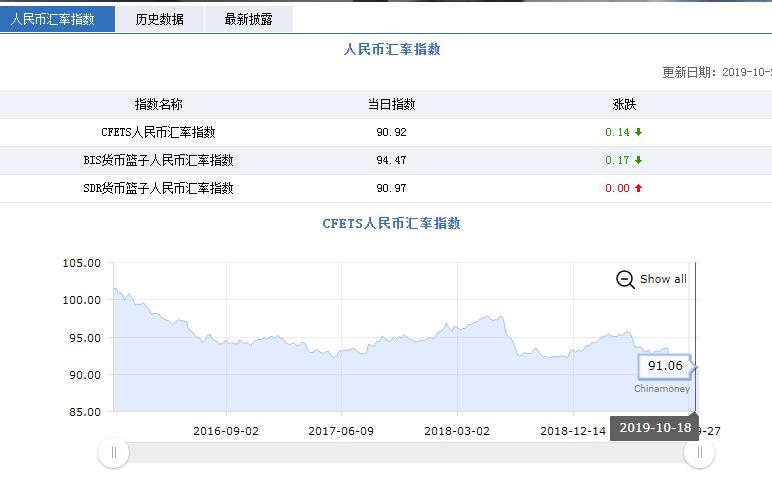
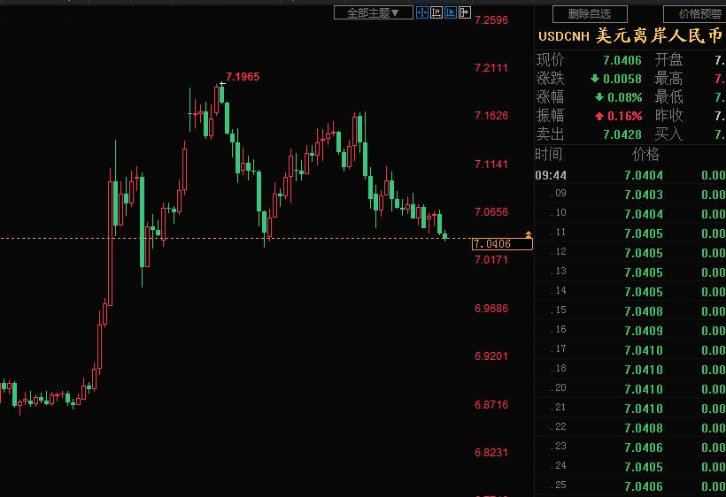
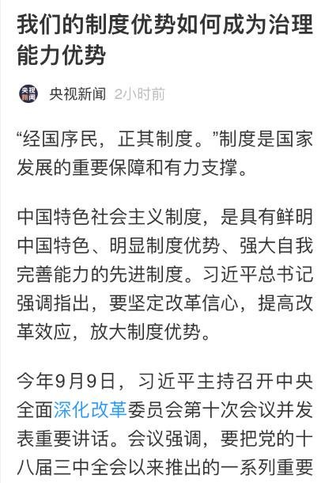

[10月31日 17:30]    BBC News 中文   @bbcchinese    香港第三季GDP预先估计数字，较去年同期下跌2.9%，是2009年以来，首次录得季度按年跌幅。学者认为，中美贸易战对香港经济影响更大，但示威活动加快了衰退的步伐。 https://bbc.in/34k6aAq   :speech_balloon:评:5 :+1:赞:4 :globe_with_meridians:转:3  

[10月31日 17:30]    纽约时报中文网   @nytchinese    在越南中北部一个饱受贫困和环境灾难之苦的地区，越南和英国政府正在共同努力，确定罹难者的身份。
据越南一家官方新闻机构报道，越南当局已收到了14个家庭的求助请求，这些家庭称亲人在英国失踪。越南总理阮春福也已经下令官员对越南公民被非法送往海外的情况展开调查。 http://nyti.ms/34cpAao   :speech_balloon:评:1 :+1:赞:1 :globe_with_meridians:转:1  

[10月31日 17:10]    财经真相   @caijingxiang    China said to be unwilling to budge on big structural changes！  :speech_balloon:评:2 :+1:赞:15 :globe_with_meridians:转:5  

[10月31日 17:09]    财经真相   @caijingxiang    快讯：中共称不可能进行结构性改革，消息一出黄金上涨，人民币短线下跌  :speech_balloon:评:18 :+1:赞:46 :globe_with_meridians:转:13  

[10月31日 17:00]    纽约时报中文网   @nytchinese    博尔顿的副手曾表示，博尔顿对特朗普向乌克兰施压的行为感到愤怒，并曾警告称，特朗普的私人律师、在电话门实践中起到主导作用的朱利安尼是“一颗会把所有人都炸死的手榴弹”。
但博尔顿是否将接受质询尚不确定，其律师表示，他“无意自愿出庭”。 http://nyti.ms/2pw9h9I   :speech_balloon:评:0 :+1:赞:3 :globe_with_meridians:转:0  

[10月31日 16:57]    新闻大吐槽   @TuCaoFakeNews    “无盘可叼的” 发自内心仇视 “叼的正欢的”  :speech_balloon:评:2 :+1:赞:5 :globe_with_meridians:转:1  

[10月31日 16:54]    新闻大吐槽   @TuCaoFakeNews    叼盘：我躺着也要中枪吗  :speech_balloon:评:0 :+1:赞:1 :globe_with_meridians:转:1  

[10月31日 16:48]    新闻大吐槽   @TuCaoFakeNews    针对此事，不甘寂寞的司马南怒了！他蹦出来在微博发帖称：为了开展“意识形态斗争”，他自己就经常翻墙，狗友胡锡进翻墙浏览反共信息更是猖獗，他希望黑警赶紧把他俩都抓了！

夹头近年被边缘化，怒气淤结，对党指桑骂槐。
可你自己破罐破摔也就罢了，但插胡锡进一刀是几个意思？
叼盘侠祸从天降 https://twitter.com/ttingxiao/status/1189540401553629184 …  :speech_balloon:评:3 :+1:赞:13 :globe_with_meridians:转:3  

[10月31日 16:34]    BBC News 中文   @bbcchinese    【日本冲绳首里城大火：整座木制首里城几乎全部烧毁】#日本 #冲绳 #首里城 发生大火，整座木制的首里城，包括正殿、南殿和北殿几乎全部烧毁。那霸市消防局表示，大火烧了11小时，火势在当地时间下午扑灭。首里城于13世纪末兴建，2000年被联合国教科文组织列为世界文化遗产。 https://bbc.in/3331O0A   :speech_balloon:评:12 :+1:赞:13 :globe_with_meridians:转:7  

[10月31日 16:30]    纽约时报中文网   @nytchinese    周四，日本冲绳的世界文化遗产首里城的大部分建筑遭大火烧毁。首里城曾是从15世纪至19世纪存在的琉球王国的宫殿所在地，至今已有500多年的历史。
据当地官员和新闻报道称，大火中没有人员受伤。NHK称，大火烧毁了包括正殿在内的七座建筑物。 http://nyti.ms/2PCblHZ   :speech_balloon:评:15 :+1:赞:15 :globe_with_meridians:转:13  

[10月31日 16:00]    新闻大吐槽   @TuCaoFakeNews    That’s why we call the “black cop” - human rights abusers https://twitter.com/tucaofakenews/status/1189504845461372928 …  :speech_balloon:评:0 :+1:赞:5 :globe_with_meridians:转:2  

[10月31日 16:00]    BBC News 中文   @bbcchinese    APEC峰会取消後，那中美贸易协定要去哪里签呢? https://bbc.in/2q8HEn4   :speech_balloon:评:11 :+1:赞:19 :globe_with_meridians:转:3  

[10月31日 16:00]    纽约时报中文网   @nytchinese    #时报专栏 政府、政界和商界知名人士的行为方式，极大破坏了民主制度的核心和规范，以致我们只能推测，他们觉得国家的稳定是既定事实——他们可对其滥用和加压，它不会坏。
他们错了。我们是会把美国玩坏的。无论是冷战、越战还是水门案期间，我都没像现在这样为我们的国家担忧。 http://nyti.ms/2JDsNbc   :speech_balloon:评:7 :+1:赞:5 :globe_with_meridians:转:1  

[10月31日 15:57]    新闻大吐槽   @TuCaoFakeNews    他内心应该想的是为什么别人舔就有钱，我舔就没有。  :speech_balloon:评:1 :+1:赞:2 :globe_with_meridians:转:1  

[10月31日 15:48]    新闻大吐槽   @TuCaoFakeNews    未来估计像日本动画《心理测量者》一样了  :speech_balloon:评:0 :+1:赞:2 :globe_with_meridians:转:1  

[10月31日 15:46]    新闻大吐槽   @TuCaoFakeNews    去機場過安檢也要刷臉，住酒店也要刷臉，上網需要個人身份驗證才可以！真不知道北京到底有多少壞人存在 https://twitter.com/tucaofakenews/status/1189633677233287168 …  :speech_balloon:评:1 :+1:赞:6 :globe_with_meridians:转:2  

[10月31日 15:43]    新闻大吐槽   @TuCaoFakeNews      :speech_balloon:评:2 :+1:赞:25 :globe_with_meridians:转:7  

[10月31日 15:41]    老司机   @h5lpykl7tp6jjop    终于暴露中共才是华为背后的大老板！
任正非：华为交班已完成多年 我只是中间的“傀儡”  :speech_balloon:评:1 :+1:赞:13 :globe_with_meridians:转:11  

[10月31日 15:31]    BBC News 中文   @bbcchinese    【兰桂坊主席盛智文：如果几年便买到500呎楼 很多人不会上街】盛智文认为，如果港府能像新加坡一样给人民安居乐业，很多人会放弃上街。 https://bbc.in/2NswykX   :speech_balloon:评:37 :+1:赞:19 :globe_with_meridians:转:8  

[10月31日 15:30]    纽约时报中文网   @nytchinese    周三，众议院弹劾调查人员传召特朗普的前国家安全顾问约翰·博尔顿及另外两名白宫高级律师，要求他们下周就特朗普弹劾调查作证。
对调查人员来说，在美国外交事务中长期扮演重要角色的博尔顿可能是他们最想要质询的证人了。由于与特朗普的外交政策冲突，博尔顿于9月离开白宫。 http://nyti.ms/2pw9h9I   :speech_balloon:评:4 :+1:赞:9 :globe_with_meridians:转:0  

[10月31日 15:29]    新闻大吐槽   @TuCaoFakeNews    体验了两把ATM刷脸取钱  :speech_balloon:评:0 :+1:赞:1 :globe_with_meridians:转:1  

[10月31日 15:29]    新闻大吐槽   @TuCaoFakeNews    @UN https://twitter.com/tucaofakenews/status/1189657825410052096 …  :speech_balloon:评:0 :+1:赞:2 :globe_with_meridians:转:2  

[10月31日 15:23]    新闻大吐槽   @TuCaoFakeNews    学一学梁家辉吧！
人家一站台 就给批了！
真的畜生不是每个人都有本事做滴！  :speech_balloon:评:0 :+1:赞:3 :globe_with_meridians:转:1  

[10月31日 15:06]    新闻大吐槽   @TuCaoFakeNews    现在飞机也刷脸了，登机牌都不用，也不用身份证直接就刷脸  :speech_balloon:评:3 :+1:赞:6 :globe_with_meridians:转:2  

[10月31日 15:01]    BBC News 中文   @bbcchinese    一年一度的万圣节又来了，不论是大人或是小孩，都要装神弄鬼一番极尽吓人的本事，但你知道万圣节的由来吗？ https://bbc.in/2MTMugW   :speech_balloon:评:4 :+1:赞:16 :globe_with_meridians:转:8  

[10月31日 15:00]    纽约时报中文网   @nytchinese    #讣告 黄永砅敏锐地意识到，在一个新的“全球时代”，艺术正如何被用于加强和促进文化的刻板印象和等级制度，就像“西方”和“非西方”这些说法本身所体现的那样。
1987年，他把两本权威的艺术史书籍放进了洗衣机并展示了结果：一堆浸透了的纸浆，其中的具体文字和图像难以分辨。 http://nyti.ms/2pgzJ7t   :speech_balloon:评:0 :+1:赞:4 :globe_with_meridians:转:1  

[10月31日 14:47]    新闻大吐槽   @TuCaoFakeNews    正义执行  :speech_balloon:评:0 :+1:赞:1 :globe_with_meridians:转:1  

[10月31日 14:46]    新闻大吐槽   @TuCaoFakeNews    【 勿 忘 8・31 】太子恐襲
雖然已經看不到我，但請不要忘記我。
 I had disappeared from sight, but not from memory.

不要忘記 ! 手足還在太子月台遊走。。RIP  :speech_balloon:评:6 :+1:赞:144 :globe_with_meridians:转:99  

[10月31日 14:40]    新闻大吐槽   @TuCaoFakeNews    今日第二單RIP

2019.10.31 中午1200 
鑽石山鳳德 雪鳳樓
再有墮樓  :speech_balloon:评:14 :+1:赞:78 :globe_with_meridians:转:99  

[10月31日 14:30]    纽约时报中文网   @nytchinese    近年来，由于萨德系统引发的紧张关系，许多韩国艺人前往中国演出时遇到困难，中国对该系统极其愤怒，认为是对其自身安全的威胁。
伊士曼曾表示，尽管韩国学生被排除在外，仍将继续巡演。但在学生和校友强烈抗议，其中一些学生指责校方对中国卑躬屈膝后，校方改变了做法。 http://nyti.ms/2BWquvF   :speech_balloon:评:5 :+1:赞:16 :globe_with_meridians:转:3  

[10月31日 14:01]    BBC News 中文   @bbcchinese    1998年，全球有整整16%的热带珊瑚礁死亡，而到了2016年，全球70%的珊瑚礁遭到破坏，有些更是无法挽回的。人类到底还可以做什么？ https://bbc.in/2PwUeHw   :speech_balloon:评:13 :+1:赞:32 :globe_with_meridians:转:11  

[10月31日 14:00]    纽约时报中文网   @nytchinese    #每日一词  Yangocrat，杨主党。一些曾经支持特朗普的美国选民现在将自己称为“杨主党“(Yangocrat)——2020年总统参选人杨安泽的姓氏与民主党人英文Democrats后缀的结合。来自白人的狂热支持表明，杨安泽已成功地成为了一个淡化身份政治的“亚裔普通人“。
更多简报内容： http://nyti.ms/2q25tNv   :speech_balloon:评:0 :+1:赞:3 :globe_with_meridians:转:0  

[10月31日 13:48]    财经真相   @caijingxiang    潘石屹soho卖给了黑石集团和GIC，考虑到黑石的背景，这次报价应该会很低！  :speech_balloon:评:13 :+1:赞:110 :globe_with_meridians:转:24  

[10月31日 13:30]    纽约时报中文网   @nytchinese    祭桌已经摆好了。尽管英国当局仍未确认卡车尸体案39名死者的身份，但一些越南家庭已把听不到亲人的消息当作足够的证明，开始祭奠亲人。
在越南一些极度贫困的地区，穷人搭乘集装箱偷渡，寻找工作和未来。“如果电线杆有腿，它也会跑。”一名当地牧师说。 http://nyti.ms/34cpAao   :speech_balloon:评:25 :+1:赞:29 :globe_with_meridians:转:27  

[10月31日 13:01]    BBC News 中文   @bbcchinese    国际慈善组织基督教救世军近日发布报告称，中国是2019年该组织在英国救助奴工的第3大原籍来源国。 https://bbc.in/34gDVCG   :speech_balloon:评:22 :+1:赞:49 :globe_with_meridians:转:19  

[10月31日 13:00]    纽约时报中文网   @nytchinese    陷入中美两国之间不断加剧的紧张关系的美国实体清单在扩大，任举几例：Nike、Apple、Gap和NBA。如今又增加了一个：来自纽约州的伊士曼爱乐乐团。
该乐团本周取消了原定的中国之行，此前乐团的三名韩国成员没能拿到签证，这显然是对韩国在2016年同意部署萨德系统的报复。 http://nyti.ms/2BWquvF   :speech_balloon:评:19 :+1:赞:79 :globe_with_meridians:转:32  

[10月31日 12:51]    新闻大吐槽   @TuCaoFakeNews    【这画面太美，不敢看！】：枣庄市公安局原局长徐忠街头拉条幅喊冤。控诉检察院副检察长刑讯逼供，制造冤假错案……昔日害人者成了被害者，这就叫害人害已，出来混，迟早要还！  :speech_balloon:评:30 :+1:赞:376 :globe_with_meridians:转:185  

[10月31日 12:48]    财经真相   @caijingxiang    商务部新闻发言人声明：中美双方经贸团队一直保持密切沟通，目前磋商工作进展顺利。双方将按原计划继续推进磋商等各项工作。双方牵头人将于本周五再次通话。 中美贸易谈判现在是天天都有好消息，人民币也天天涨，静静的等待结果，看看究竟可以忽悠到什么时候！  :speech_balloon:评:14 :+1:赞:110 :globe_with_meridians:转:24  

[10月31日 12:30]    纽约时报中文网   @nytchinese    国际移民组织的约内斯科说，总的来说，研究表明，各国现在应该开始为更多居民在国内重新安置做好准备。
“我们一直试图敲响警钟，”约内斯科说。“我们知道它就要来了。”她还说，这种规模的人口流动在现代几乎没有先例。 http://nyti.ms/2JBzv1E   :speech_balloon:评:3 :+1:赞:13 :globe_with_meridians:转:4  

[10月31日 12:16]    GFHG SDKM   @zyx_yny    #Halloween 
今晚維園至蘭桂坊有面具之夜 無論黑警有咩行動 都希望可以令再上trending topic
#HKPolice  :speech_balloon:评:0 :+1:赞:1 :globe_with_meridians:转:5  

[10月31日 12:10]    GFHG SDKM   @zyx_yny    One of my friends living next to this estate could hardly go back to home because of those #HKPolice https://twitter.com/nathanlawkc/status/1189570603042426880 …  :speech_balloon:评:0 :+1:赞:0 :globe_with_meridians:转:0  

[10月31日 12:01]    BBC News 中文   @bbcchinese    美国的狗说：“在我们国家，如果你一直犬吠不止，终究会有人听到你的，会给你肉吃”；波兰的狗问：“什么是肉啊？”；苏联的狗问：“什么是犬吠啊？”这些坊间流传的笑话，成为中情局当年解读苏联民情的资料。 https://bbc.in/2Nmzks8   :speech_balloon:评:51 :+1:赞:209 :globe_with_meridians:转:70  

[10月31日 12:00]    纽约时报中文网   @nytchinese    美联储年内第三次降息：在降息25个基点之际，美国经济继续显示出放缓迹象。本次调整几乎扭转了2018年所有的加息。
尽管全球制造业收紧，贸易也存在不确定性，但美联储暗示，它正在转向一种更有耐心的模式。
更多简报内容： http://nyti.ms/2q25tNv   :speech_balloon:评:2 :+1:赞:5 :globe_with_meridians:转:2  

[10月31日 11:31]    BBC News 中文   @bbcchinese    学习过程中，了解到立法会的构成最令张同学震撼。“它会让你发现，香港并没有民主，”他说，“我认为这是重要的概念，这也解释了好多香港的政策为什么没有民意授权也能过，政府有预谋地利用这个漏洞去通过一些东西。” https://bbc.in/36mTdrp   :speech_balloon:评:18 :+1:赞:66 :globe_with_meridians:转:17  

[10月31日 11:00]    BBC News 中文   @bbcchinese    這款遊戲你有興趣玩嗎？  :speech_balloon:评:145 :+1:赞:411 :globe_with_meridians:转:151  

[10月31日 11:00]    纽约时报中文网   @nytchinese    智利宣布取消举办APEC会议和气候大会，中美元首会晤计划被打乱。智利总统皮涅拉在讲话中提到因地铁票涨价而引发的大规模抗议活动，将优先应对国内局势。
此举打乱了习近平和特朗普的会晤计划，据信，双方原计划在11月中的APEC峰会上签署初步贸易协议。
更多简报内容： http://nyti.ms/2q25tNv   :speech_balloon:评:1 :+1:赞:5 :globe_with_meridians:转:3  

[10月31日 10:45]    纽约时报中文网   @nytchinese    宋庆龄在北京度过余生（尽管她更喜欢上海，但不得不按照党的规定行事），她基本上是一个独裁政权的傀儡，对这个政权的控制力越来越少。
宋霭龄在美国和台湾间飞来飞去，宋美龄在纽约度过了最后的日子，她认为纽约才是她真正的家。宋庆龄一直没和家人和好，直到她们生命的尽头。 http://nyti.ms/2Nr96Ez   :speech_balloon:评:2 :+1:赞:11 :globe_with_meridians:转:8  

[10月31日 10:31]    纽约时报中文网   @nytchinese    #时报专栏 “人渣”、“私刑”和特朗普的魔鬼英语  http://nyti.ms/2owmH5m  by @FrankBrunihttps://twitter.com/ccni/status/1189352602665979907 …  :speech_balloon:评:0 :+1:赞:0 :globe_with_meridians:转:2  

[10月31日 10:31]    BBC News 中文   @bbcchinese    特朗普总统确认美国将退出联合国巴黎气候协议，这个举动将对美国外交，对中国和俄国产生什么影响？
 https://bbc.in/2PA0huP   :speech_balloon:评:15 :+1:赞:20 :globe_with_meridians:转:5  

[10月31日 10:24]    财经真相   @caijingxiang    据国务院新闻办公室10月31日消息，国务院新闻办公室定于2019年11月1日（星期五）上午10时举行中国共产党十九届四中全会新闻发布会，请中央宣传部、中央政策研究室、中央财经委员会办公室、全国人大常委会法工委、全国政协办公厅、司法部负责同志介绍有关情况，并答记者问。  :speech_balloon:评:7 :+1:赞:71 :globe_with_meridians:转:24  

[10月31日 10:14]    纽约时报中文网   @nytchinese    早安！今日重点新闻包括：
习近平特朗普会晤计划生变；著名乐团取消中国巡演；美联储年内第三次降息；加州山火持续肆虐；美众议院就弹劾调查传唤博尔顿……NYT简报带你速览今日要闻。 http://nyti.ms/2q25tNv   :speech_balloon:评:8 :+1:赞:27 :globe_with_meridians:转:11  

[10月31日 10:04]    新闻大吐槽   @TuCaoFakeNews    山西法轮功学员崔玉桃被迫害致死

大同市法轮功学员崔玉桃，10月23号在山西省太原市109监狱医院被迫害致死，年仅五十岁
据“法轮大法明慧网”报导，崔玉桃原是山西大同矿区工商局公务员，因不放弃信仰，在中共迫害法轮功的20年间，十多次被非法绑架，在监狱遭受多种酷刑折磨，并被野蛮灌食、注射不明药物  :speech_balloon:评:0 :+1:赞:12 :globe_with_meridians:转:6  

[10月31日 09:51]    财经真相   @caijingxiang    CFETS人民币汇率指数和SDR货币篮子人民币汇率指数都创下了四年来新低。现在决策层在汇率操作上“骑虎难下”，如果让人民币跟随欧元等篮子货币上涨，则会对本来就已经不断出血的出口“雪上加霜”。如果不跟就会激发市场对人民币未来继续下跌的预期，一旦美元指数走强重新走强，市场做空人民币压力很逆转。  :speech_balloon:评:3 :+1:赞:82 :globe_with_meridians:转:23  

[10月31日 09:50]    纽约时报中文网   @nytchinese    #影评 如今，现实世界和由此产生的新闻标题都不怎么有趣，而当演员们在那些写得最好的《摩登情爱》故事中拿出最佳发挥时，这些在大城市里发生的亲切、有点厌世的关系故事让人很难抗拒。 http://nyti.ms/2MZ6eQD   :speech_balloon:评:2 :+1:赞:4 :globe_with_meridians:转:2  

[10月31日 09:32]    新闻大吐槽   @TuCaoFakeNews    港府禁黄之锋参选
美多位议员发推谴责

众议院议长佩洛西说：“单独禁止黄之锋参选即将举行的区议会选举是再次破坏香港法治和‘一国两制’原则，香港人民应该要能够选择他们的民选官员。”  :speech_balloon:评:9 :+1:赞:114 :globe_with_meridians:转:51  

[10月31日 09:30]    BBC News 中文   @bbcchinese    未来世界，如果人工智能变得如此强大，可能会威胁人类生存。但他们是有意识地要摧毁人类，还是因为太胜任了呢？
 https://bbc.in/2BZA6pI   :speech_balloon:评:4 :+1:赞:13 :globe_with_meridians:转:7  

[10月31日 09:20]    纽约时报中文网   @nytchinese    新的数据显示，已经有1.1亿人生活在涨潮线以下的地方。气候中心的首席执行官施特劳斯将其归因于海堤等防护措施。
施特劳斯说，城市必须在这类防御措施上投入大量资金，而且必须尽快。但即使投资到位，防御性措施能起到的作用有限。 http://nyti.ms/2JBzv1E   :speech_balloon:评:1 :+1:赞:15 :globe_with_meridians:转:7  

[10月31日 08:30]    BBC News 中文   @bbcchinese    有些人为了方便记忆，干脆使用一码通，即所有帐户都使用同一个密码。这样做的危险是一旦一个密码被盗，所有账户都面临危险。
 https://bbc.in/2N21Ujo   :speech_balloon:评:3 :+1:赞:23 :globe_with_meridians:转:10  

[10月31日 08:22]    财经真相   @caijingxiang    美联储在利率声明中，删除了“采取相当程度维持扩张”的措词，包括鲍威尔强调美国经济“基本前景仍然是有利的 ”，“只要经济前景与我们保持一致，货币政策就是合适”，但是保留了经济发生变化时，改变想法的空间。正是这种保留想法，让市场重新计价12月份继续降息的预期，导致美元大跌，市场这次真的有点过  :speech_balloon:评:3 :+1:赞:61 :globe_with_meridians:转:9  

[10月31日 08:00]    纽约时报中文网   @nytchinese    五名员工说，随着公司的扩张，张家想聘用有经验的高管，同时又不信任外人，这让他们很是烦恼。
他们说，近年来，Forever 21急切地聘请专家对公司的部分业务进行全面检查，后来却无视专家在新技术和市场营销等各个方面提出的建议。 http://nyti.ms/2MVDjg2   :speech_balloon:评:0 :+1:赞:6 :globe_with_meridians:转:3  

[10月31日 07:30]    BBC News 中文   @bbcchinese    有没有想过，你的万圣节造型，其实也可以是一门生意。
 https://bbc.in/2Nq3BpZ   :speech_balloon:评:2 :+1:赞:19 :globe_with_meridians:转:6  

[10月31日 06:13]    墙国铁拳现世报😷   @Socialistfist    香港导演争当护旗手！
结果当他翻拍鹿鼎记时，剧本翻来覆去修改多次，中共还是不予批准！

护旗手就是要给党折磨的
@Socialistfist  :speech_balloon:评:47 :+1:赞:364 :globe_with_meridians:转:95  

[10月31日 04:41]    GFHG SDKM   @zyx_yny    No search warrant? https://twitter.com/SJPeralta2/status/1189576641812393984 …  :speech_balloon:评:1379 :+1:赞:5252 :globe_with_meridians:转:3925  

[10月31日 03:52]    老司机   @h5lpykl7tp6jjop    看过一张图片，老中医一边吊着盐水，一边摸脉给病人看病，非常和谐，病人迷信相信老中医，他们没有怀疑为什么老中医自己病了看西医，这就是爱国废民没有逻辑的思维！  :speech_balloon:评:0 :+1:赞:34 :globe_with_meridians:转:11  

[10月31日 03:39]    老司机   @h5lpykl7tp6jjop    涨了就是涨了，涨幅收窄？这样的把戏想骗老百姓不懂？  :speech_balloon:评:2 :+1:赞:25 :globe_with_meridians:转:12  

[10月31日 03:11]    老司机   @h5lpykl7tp6jjop    正式通过！参议院通过台北法案 强化台湾外交
台湾一天天好起来，中共一天天烂下去！  :speech_balloon:评:2 :+1:赞:49 :globe_with_meridians:转:16  

[10月31日 02:54]    老司机   @h5lpykl7tp6jjop    美国政府下令：要彻底清退华为和中兴
美国政府启动程序彻底清退美国境内的华为等中国通信设备。美国政府下令要求安装了中国通信设备的美国通信企业全面更换设备，预计达10亿美元更换费用将由美国政府用税金提供支援。美国还可能要求包括韩国在内的同盟国采取类似措施。中国官方谴责美国此种做法是霸凌  :speech_balloon:评:1 :+1:赞:130 :globe_with_meridians:转:33  

[10月31日 02:40]    老司机   @h5lpykl7tp6jjop    潘石屹也要跑？清仓国内资产 80亿美元卖办公楼  :speech_balloon:评:3 :+1:赞:36 :globe_with_meridians:转:20  

[10月31日 02:32]    老司机   @h5lpykl7tp6jjop    要注意的是注水的量，它隐藏在各项债务中，如果只看到当前的购买价值，就觉得不太适合，但是一旦发生信用崩溃，挤兑出现，大家就会看到有钱买不到东西，就像苏联崩溃时卢布2万兑一美元的情况。  :speech_balloon:评:0 :+1:赞:2 :globe_with_meridians:转:0  

[10月31日 00:55]    财经真相   @caijingxiang    经济参考报头版：经济体制改革将继续全面推进，并引用“业内人士”的话说，在财税、金融和国企领域更多改革措施将推出，并引用中财院赵福昌话说，经济治理的核心和目标就是发挥市场在资源配置中的决定性作用 这种论调完全和习不是一个思路，党内“拥邓派”还再制造舆论！  :speech_balloon:评:14 :+1:赞:88 :globe_with_meridians:转:9  

[10月31日 00:29]    GFHG SDKM   @zyx_yny    [SOS!!] TERRORIST riot #HongKongPolice went INSIDE a number of residential buildings in Tuen Mun area for arbitrary arrests. Reports said they have the passwords for entry. HK #PoliceState established #HongKongProstests  :speech_balloon:评:89 :+1:赞:1703 :globe_with_meridians:转:1915  

[10月31日 00:15]    GFHG SDKM   @zyx_yny    DC, NCM Yue, we all need to see this. A simple picture explains everything. Average residents are humiliated inside their home without reasons. Things are worsening.
@SolomonYue @tedcruz @marcorubio @SenRickScott @CNN @foxnewsalert  :speech_balloon:评:239 :+1:赞:1968 :globe_with_meridians:转:1710  

[10月31日 00:00]    老司机   @h5lpykl7tp6jjop    #香港10月30日 23：20 #屯門 盈豐園有一男一女在一間食肆外跳舞引來防暴警不滿，該對男女走入一間食肆，女負責人拒絕警員入內蒙面警即時情緒失控，粗暴拉跌女負責人並闖入店內截查跳舞男女.蒙面警的失控濫權濫暴行為惹來街坊不滿，警員即指街坊非法集結舉藍旗警告  :speech_balloon:评:4 :+1:赞:47 :globe_with_meridians:转:45  

[10月30日 23:35]    GFHG SDKM   @zyx_yny    [2240 Tuen Mun] #HongKongPolice claimed there were 1 male & 1 female "dancing" inside a dessert restaurant.

They demanded to go in to make arrests; the owner refused & the police forced their way into the restaurant, pulling the two "suspects" and the owners out & arrested them.  https://twitter.com/WBYeats1865/status/1189560737737277442 …  :speech_balloon:评:107 :+1:赞:1592 :globe_with_meridians:转:1761  

[10月30日 23:33]    财经真相   @caijingxiang    大陆所有官方、公司、外资网站都把台湾列入中共国的一个省，这就说明中共不灭台湾人幻想的真正安全就永远不存在，与其做缩头乌龟还不如反击，直接在台湾网上把大陆也列为“民国领土”，以彼之道还施彼身，有何不妥？  :speech_balloon:评:64 :+1:赞:493 :globe_with_meridians:转:71  

[10月30日 23:17]    财经真相   @caijingxiang    还有就是大陆人申请时，直接就是“广州联邦省、上海联邦省、香港等联邦概念”，等于是用“中华民国”概念联邦化，领域超过台湾进而扩大化，如此一来世界格局真的天翻复地了，如果台湾领导人真的做到，那对中华民族而言真是大功一件，需要极强的历史使命感才行！  :speech_balloon:评:45 :+1:赞:252 :globe_with_meridians:转:30  

[10月30日 23:09]    财经真相   @caijingxiang    我只是说允许大陆人申请护照，但是不放人去台湾，因为法理上大陆就是民国，大陆人完全可以留在大陆，这样大陆涌起“申请民国护照热潮”，这在人心是想当不错的“攻心术”，完全起到杀共诛心，台湾这需要一个网址，连张纸都不要浪费，就完全可以实现“反攻大陆”。  :speech_balloon:评:28 :+1:赞:291 :globe_with_meridians:转:43  

[10月30日 22:42]    BBC News 中文   @bbcchinese    这一次，西方为主的23个国家和54个亚非拉国家在新疆人权问题上立场对立，各执一词。然而，真相究竟怎样？ https://bbc.in/2WqVVaU   :speech_balloon:评:143 :+1:赞:133 :globe_with_meridians:转:51  

[10月30日 22:00]    纽约时报中文网   @nytchinese    宋氏姐妹的传奇故事没有神奇的结局。她们都早早地做出了人生的选择，等到停下来思考自己的人生轨迹时，世界已经变了，而她们再也不能从年轻时的信念上回头。
庆龄在生命的最后几年里冷冷地说，“我做出了自己的选择，我不后悔。”这话听起来像是在说服自己，也像是在说服别人。 http://nyti.ms/2Nr96Ez   :speech_balloon:评:6 :+1:赞:35 :globe_with_meridians:转:9  

[10月30日 21:54]    新闻大吐槽   @TuCaoFakeNews    忠忠说：我之前是一名中共体制内的工作者，是一名不折不扣的党员，也许是因为我还比较善良，神佛用特殊的方式让我脱离了这个环境，那一刻我终于醒悟，我终于知道自己原来在干着助纣为虐的事情而不自知，在此我郑重声明，自愿退出中共党、团、队及其一切组织，在此之前我发过的誓言全部作废，自此之后…  :speech_balloon:评:2 :+1:赞:18 :globe_with_meridians:转:7  

[10月30日 21:51]    新闻大吐槽   @TuCaoFakeNews    河北15岁学生浏览信息获罪 网友:荒唐

10月29号，河北省承德市公安局双桥公安分局微博发布了一则“警情通报”，称近日破获一名年仅15岁的学生观看所谓“反华”、“仇华”信息的案件，对该学生处以“严肃批评教育”。消息发布后，许多大陆网友觉得荒唐，还有网友说，古今中外也无此暴政。  :speech_balloon:评:2 :+1:赞:65 :globe_with_meridians:转:42  

[10月30日 21:14]    财经真相   @caijingxiang    如果台湾真的公开承认香港属于中华民国，并对所有被迫害的香港市民提供政治庇护，包括大陆公民都可以随时申请台湾护照，那么中共会改如何应对？  :speech_balloon:评:219 :+1:赞:841 :globe_with_meridians:转:159  

[10月30日 21:13]    BBC News 中文   @bbcchinese    脱欧节骨眼上的大选，输赢且慢论，一场恶斗估计在所难免。你希望知道的一切都在这里。 https://bbc.in/2NsxuWD   :speech_balloon:评:8 :+1:赞:23 :globe_with_meridians:转:9  

[10月30日 20:19]    墙国铁拳现世报😷   @Socialistfist    大家投票踊跃，下周就从点赞数从多到少挑四个选吧
有什么建议 意见可以回复此推  :speech_balloon:评:3 :+1:赞:25 :globe_with_meridians:转:1  

[10月30日 20:17]    墙国铁拳现世报😷   @Socialistfist    后续  :speech_balloon:评:2 :+1:赞:20 :globe_with_meridians:转:1  

[10月30日 20:12]    墙国铁拳现世报😷   @Socialistfist    推友最喜爱“上周最佳铁拳” 评选活动
更多选项看后续  :speech_balloon:评:2 :+1:赞:64 :globe_with_meridians:转:15  

[10月30日 20:01]    BBC News 中文   @bbcchinese    【MAGA帽——特朗普的畅销产品对美国的特殊意义】美国已经进入竞选周期，特朗普也快将启动其选举工程，争取连任，而其阵营声称印有其招牌口号“让美国再次强大”（Make American Great Again; MAGA）的红色鸭舌帽已经卖出将近100万顶。 https://bbc.in/2N074fP   :speech_balloon:评:7 :+1:赞:16 :globe_with_meridians:转:4  

[10月30日 19:46]    BBC News 中文   @bbcchinese    “台北法案”获美参议会通过，有专家说若此案最后过关对台美外交意义重大。大家怎么看？ https://www.bbc.com/zhongwen/simp/chinese-news-50233841 …  :speech_balloon:评:71 :+1:赞:108 :globe_with_meridians:转:41  

[10月30日 19:38]    财经真相   @caijingxiang    反之，如果美联储对12月份再次降息“打太极”，有可能会被市场牵着鼻子走，最后被迫启动全面宽松货币政策，这是美联储最不愿意看到的结果。无论何种结果都将引发市场巨震，美联储这次将无法继续“打太极”。特此提示，本次利率决议将会改变市场整个基本面的未来预期，所带来的市场波动很大，切记控制仓位。  :speech_balloon:评:5 :+1:赞:58 :globe_with_meridians:转:8  

[10月30日 19:33]    财经真相   @caijingxiang    除了弹劾政治突发事件外，再过几个小时，美国东部时间下午两点，美联储将正式公布10月份利率决议，目前市场已经消化了美联储降息25个基点的预期。真正的看点将是鲍威尔如何—宣布暂停降息，如果美联储暗示本轮降息结束的话，这无疑是鹰派降息，会引发股市、黄金大跌，美元飙升；  :speech_balloon:评:5 :+1:赞:66 :globe_with_meridians:转:9  

[10月30日 19:25]    财经真相   @caijingxiang    美国最流行的博彩网站之一PredictIt预测，特朗普遭到弹劾的几率飙升至创纪录的79%；9月中旬以前一直维持在25%左右；9月18日起，遭弹劾几率开始飙升；10月29日，美国众议院民主党提交一份决议，如果今天获得通过则会正式启动弹劾程序。届时不排除市场会启动短暂的避险情绪，交易员今天必须留意该事件！  :speech_balloon:评:17 :+1:赞:132 :globe_with_meridians:转:34  

[10月30日 19:24]    墙国铁拳现世报😷   @Socialistfist    全文  :speech_balloon:评:2 :+1:赞:59 :globe_with_meridians:转:11  

[10月30日 19:24]    墙国铁拳现世报😷   @Socialistfist    收了几次精赵智商税就开始闹，成何体统？
原文已删，全文看后续

#社会主义铁拳  :speech_balloon:评:9 :+1:赞:216 :globe_with_meridians:转:61  

[10月30日 19:01]    BBC News 中文   @bbcchinese    自我欣赏、陶醉到什么程度算自恋？自恋到什么程度变成病? “自恋病”真的存在吗？ https://bbc.in/36rnrtE   :speech_balloon:评:8 :+1:赞:16 :globe_with_meridians:转:7  

[10月30日 18:34]    财经真相   @caijingxiang    央视新闻：我们的制度优势成为治理能力优势！ 中国制度优势就割中国老百姓的韭菜速度快，韭菜还不吭声的优势！  :speech_balloon:评:24 :+1:赞:258 :globe_with_meridians:转:78  

[10月30日 18:31]    BBC News 中文   @bbcchinese    去年今日，华语武侠文学泰斗金庸逝世。他是华语世界独步天下的文化现象，他一个人就几乎代表了一个文学类别。 https://bbc.in/2q2lFhS   :speech_balloon:评:16 :+1:赞:110 :globe_with_meridians:转:34  

[10月30日 14:21]    老司机   @h5lpykl7tp6jjop    究竟是富了，还是穷了？  :speech_balloon:评:17 :+1:赞:99 :globe_with_meridians:转:55  

[10月30日 12:39]    财经真相   @caijingxiang    对于涨价，中共官方文件给出的说法是，财政补助增加了30元，所以农民自己也要多增加30元，但是这里有个逻辑欺诈，中共财政补贴只有真正得了大病时才会实行，而大部分没有得病农民是强制必须缴纳的，到头来中共还是赚的！最重要的“每年一结算，不累计”，中共医疗支出本质是减少的，只能让农民积累来填坑  :speech_balloon:评:14 :+1:赞:171 :globe_with_meridians:转:47  

[10月30日 12:33]    财经真相   @caijingxiang    有人私信我说今年的新农合作医疗有两个问题：①今年每个农民合作医疗涨到250元/每人 ②以往合作医疗都是可以积累的，今年改成必须本年度使用，过了就会作废。这导致很多农民不愿意缴纳，因为小病不报销，而得大病概率很低，一年一清很不划算。恩，合作医疗从今年开始成了农民的第二税收了！  :speech_balloon:评:25 :+1:赞:236 :globe_with_meridians:转:96  

[10月30日 12:14]    财经真相   @caijingxiang    商务部：上周食用农产品价格有所上涨，其中猪肉价格为每公斤51.21元，上涨11%；牛肉、羊肉价格分别为每公斤65.81元和62.73元，分别上涨1.2%和1.7%。苹果、梨、葡萄、香蕉价格分别下降5.7%、2.3%、1.9%和1.8% 摁住了水果，浮起了猪肉，国内肉夹馍年初6元一个，现在涨到了8块，涨幅33.33%  :speech_balloon:评:39 :+1:赞:177 :globe_with_meridians:转:88  

[10月30日 11:47]    老司机   @h5lpykl7tp6jjop    事发：2019年10月23号云南曲靖市20岁女孩小寒，在某宾馆二楼被两名男子强行拉上楼！期间被掌掴！在房间内小寒被侮辱！小寒从4楼跳下！

有没有被性侵！  :speech_balloon:评:28 :+1:赞:339 :globe_with_meridians:转:327  

[10月30日 10:59]    老司机   @h5lpykl7tp6jjop    中国搞区块链、数字货币，真实目的是企图去美元中心化，但是不可能成功，因为中国最终还是需要用美元来购买石油和大宗物资，数字货币必须与美元或黄金挂钩，否则一文不值。也许唯一的结果是，不需要增印人民币了，也不需要印各种凭票供应的票据了，用数字货币，来延缓和掩盖中国经济的重大危机。  :speech_balloon:评:28 :+1:赞:202 :globe_with_meridians:转:83  

[10月30日 08:55]    老司机   @h5lpykl7tp6jjop    【爆炸新闻】厉害国完了，温州银行倒闭！数百民众围在银行前维权！  :speech_balloon:评:101 :+1:赞:1202 :globe_with_meridians:转:636  

[10月30日 08:37]    老司机   @h5lpykl7tp6jjop    之前推过 倒西瓜，倒菠萝，倒桃子，倒西红柿，倒枣子，倒桔子，倒葡萄，倒李子，现在轮到 倒青椒。
太不正常，共产党的国到底怎么了？  :speech_balloon:评:75 :+1:赞:531 :globe_with_meridians:转:295  

[10月30日 07:24]    老司机   @h5lpykl7tp6jjop    什么是中国特色？就是别人没有的你都有：商君书、诛九族、连坐制、等级制、裹小脚、三十六计、奴婢制、一妻多妾制、中央集权制、强拆、活摘、嫖宿、双轨制、潜规则、局域网、一国两制、计划生育、非法讨薪、恶意上访、单双号限行车辆等...... 
没有半点文明的影子，不知道中国人的民族自豪感从何而来？  :speech_balloon:评:67 :+1:赞:905 :globe_with_meridians:转:344  

[10月30日 02:45]    老司机   @h5lpykl7tp6jjop    十四亿个脑袋居然由一个猪头脑袋坐中央，控制全体的思想，指挥行动的对错，这是动物世界吗？不！已经是昆虫界，是蚂蚁窝！蚁民不会思想，只明白对错，一有违反，兵蚁立刻拼命撕咬，说错话，表错态，转错贴，轻则拘留，重则判刑，还要连累亲属，就这种形态，是一个崛起的历史悠久的古槐安大国，很厉害哦  :speech_balloon:评:10 :+1:赞:184 :globe_with_meridians:转:50  

[10月29日 22:31]    财经真相   @caijingxiang    根据资料显示，2016年到2018年，河南伊川农商行不良贷款分别为7117万元、40516万元和100470万元，三年间翻了两番。其核心一级资本充足率也从2016年的16.08%，掉到了2018年的9.88%。三个月前中诚信国际还将该行信用评级下调。 官媒说挤兑是谣言引发的，但是该行的财报不会撒谎！  :speech_balloon:评:10 :+1:赞:247 :globe_with_meridians:转:105  

[10月29日 22:20]    老司机   @h5lpykl7tp6jjop    美國佐治亞州的監獄開設了一個有爭議的項目。那就是請那些家長把他們教育不了的"熊孩子"們送到這裡，來個"一日游"。
看樣子，效果不錯。  :speech_balloon:评:15 :+1:赞:359 :globe_with_meridians:转:184  

[10月29日 19:41]    老司机   @h5lpykl7tp6jjop    不用专家预测，我来个大胆的推断，明后年所有开健身房的老板都要关门！做减肥生意的都要破产！以后中国人民都跟朝鲜人民一样苗条，看到猪习同志都会激动得热泪盈眶！你要不信，肉价会让你嘴巴张大合不拢后只有吞口水！  :speech_balloon:评:1 :+1:赞:29 :globe_with_meridians:转:14  

[10月29日 19:22]    墙国铁拳现世报😷   @Socialistfist    “哎呦.....太君别开枪.....”

#社会主义铁拳
#社会主义特别行政区铁拳  :speech_balloon:评:30 :+1:赞:418 :globe_with_meridians:转:131  

[10月29日 18:44]    老司机   @h5lpykl7tp6jjop    西方人有一种固执想法:
损害权利的事
如果发生在别人身上
那么它就有可能发生在自己身上
必须阻止

厉害国也有一种固定思维:
损害权利的事
只要发生在别人身上
就与我无关
说明我比别人高明
随他去

久而久之
西方人越来越爱憎分明
厉害国越来越虚伪自私
……  :speech_balloon:评:40 :+1:赞:1079 :globe_with_meridians:转:354  

[10月29日 13:23]    老司机   @h5lpykl7tp6jjop    以前有“收聽敵台罪”的，VOA和RFA都夠這個標準  https://twitter.com/lnx1983/status/1189037641456467970 …  :speech_balloon:评:39 :+1:赞:543 :globe_with_meridians:转:154  

[10月29日 11:51]    老司机   @h5lpykl7tp6jjop    真的又開始吃土了。

大明搖搖欲墜時，很多人就是吃這種土吃死了。後來李自成就出來了，再後來崇禎就上樹了。現在又來了。。

雖然是一個活動，但在如今的大背景下，怎麼看都有【一吃成讖】的感覺。。

搞什麼活動不好，偏要搞這種活動？  :speech_balloon:评:35 :+1:赞:178 :globe_with_meridians:转:61  

[10月29日 08:08]    新闻大吐槽   @TuCaoFakeNews    10月份，华为Mate 30 Pro在马来西亚上市；价格3899令吉（约合6584rmb）~

一个马来西亚小哥，手贱买了一个，发现谷歌套件一个也不能用！肯定郁闷死了！那么贵  :speech_balloon:评:311 :+1:赞:2217 :globe_with_meridians:转:1041  

[10月28日 19:42]    墙国铁拳现世报😷   @Socialistfist    药房老板现时仍未回港，店员胡先生今日戴上口罩回店内用漂白水清洁，四名便衣警员到药房表示「唔好意思」，期望药房体谅，他坦言唯有接受道歉。
胡先生续指，估计损失约 1,000 元。他提到，昨晚蘗房已拉半闸，警方未有举起黑旗便施放催泪弹，形容警方是「乱咁射」，但需老板回港后才决定是否追究。  :speech_balloon:评:3 :+1:赞:58 :globe_with_meridians:转:10  

[10月28日 19:39]    墙国铁拳现世报😷   @Socialistfist    尖沙咀发起集会，演变成多处警民冲突，其中晚上警方施放的一枚催泪弹射入位于弥敦道的「明寅药房」，警方今早约4 名便衣警员到店舖道歉，向员工表示「唔好意思」。警员逗留约 2 分钟后离开，并无解释催泪弹射入药房的原因。  :speech_balloon:评:2 :+1:赞:59 :globe_with_meridians:转:7  

[10月28日 19:39]    墙国铁拳现世报😷   @Socialistfist    陈柏雄, 药房东主，在FB上撑警及赞同六四镇压嘅言论，包括他在10月5日发表「当年出坦克车，原来是最正确决定！」、10月8日称抗争者为「暴徒、垃圾废青、曱甴」，又称听到「兄弟、手足」令佢「作呕」。  :speech_balloon:评:2 :+1:赞:61 :globe_with_meridians:转:7  

[10月28日 19:38]    墙国铁拳现世报😷   @Socialistfist    铁拳是最好的决定

感谢香港推友，更多详情请看本推后续推文
#社会主义铁拳
#社会主义特别行政区铁拳  https://twitter.com/BeLightinHK/status/1188465234391883776 …  :speech_balloon:评:9 :+1:赞:142 :globe_with_meridians:转:44  

[10月28日 08:17]    凡賽堤/FORSETI   @FecharCCP    魔鬼在人間

極權殺人恐怖組織正在用各種兇殘手段殺害我們的同胞....................................................................................................

10月27日被極權殺人恐怖組織非法濫捕的香港年輕人已經超過200+ 人！  :speech_balloon:评:2 :+1:赞:25 :globe_with_meridians:转:19  

[10月28日 07:49]    凡賽堤/FORSETI   @FecharCCP    魔鬼在人間

極權殺人恐怖組織正在用各種兇殘手段殺害我們的同胞....................................................................................................

26日又有一10歲出頭的小孩被棄屍大海！  :speech_balloon:评:0 :+1:赞:16 :globe_with_meridians:转:14  

[10月28日 00:35]    凡賽堤/FORSETI   @FecharCCP    人類最恐怖的極權殺人恐怖組織！
警察蒙面公開殺人，毆打，暴打，非法濫捕，暗殺市民！

CCP的極權殺人恐怖組織比本拉登還恐怖一萬倍！

這是一個老人  :speech_balloon:评:1 :+1:赞:3 :globe_with_meridians:转:7  

[10月28日 00:20]    凡賽堤/FORSETI   @FecharCCP    人類最恐怖的極權殺人恐怖組織！
警察蒙面公開殺人，毆打，暴打，非法濫捕，暗殺市民！

CCP的極權殺人恐怖組織比本拉登還恐怖一萬倍！  :speech_balloon:评:4 :+1:赞:211 :globe_with_meridians:转:172  

[10月28日 00:11]    凡賽堤/FORSETI   @FecharCCP    人類最恐怖的極權殺人恐怖組織！
警察蒙面公開殺人，毆打，暴打，非法濫捕，暗殺市民！

CCP的極權殺人恐怖組織比本拉登還恐怖一萬倍！  :speech_balloon:评:5 :+1:赞:131 :globe_with_meridians:转:83  

[10月27日 23:59]    凡賽堤/FORSETI   @FecharCCP    人類最恐怖的極權殺人恐怖組織！
警察蒙面公開殺人，毆打，暴打，非法濫捕，暗殺市民！

已經被雙手反綁的學生，極權殺人恐怖組織還要把人往死裡整！全人類唯一一個最恐怖的極權殺人恐怖組織！  :speech_balloon:评:0 :+1:赞:7 :globe_with_meridians:转:9  

[10月27日 23:56]    凡賽堤/FORSETI   @FecharCCP    人類最恐怖的極權殺人恐怖組織！
警察蒙面公開殺人，毆打，暴打，非法濫捕，暗殺市民，  :speech_balloon:评:0 :+1:赞:12 :globe_with_meridians:转:13  

[10月27日 23:53]    凡賽堤/FORSETI   @FecharCCP    人類最恐怖的極權殺人恐怖組織！
警察蒙面公開殺人，毆打，暴打，非法濫捕，暗殺市民，  :speech_balloon:评:0 :+1:赞:9 :globe_with_meridians:转:4  

[10月27日 23:45]    凡賽堤/FORSETI   @FecharCCP    魔鬼的殺人罪行！

陳彥霖母女均被極權殺人恐怖組織殺害！  :speech_balloon:评:3 :+1:赞:36 :globe_with_meridians:转:31  

[10月27日 19:55]    墙国铁拳现世报😷   @Socialistfist    感谢众多推友投稿，感谢维尼之声的大力支持  :speech_balloon:评:1 :+1:赞:79 :globe_with_meridians:转:0  

[10月27日 19:54]    墙国铁拳现世报😷   @Socialistfist    不忘初心，牢记帮规
------镰刀斧头帮总舵主
#社会主义铁拳  :speech_balloon:评:19 :+1:赞:242 :globe_with_meridians:转:71  

[10月26日 19:08]    墙国铁拳现世报😷   @Socialistfist    生活在这个太平盛世
（除了村里恶霸从14年偷排污染超过30倍废物并在17年到维稳中心打人并且发出死亡威胁以外）
 感恩！

#社会主义铁拳
长文警告  :speech_balloon:评:39 :+1:赞:327 :globe_with_meridians:转:92  

[10月26日 01:00]    GFHG SDKM   @zyx_yny    A Hong Kong protestor was severely injured by pepper spray with unknown chemicals.
Source: Workercom@facebook

#HongKongProtesters #policestate #HKPolice  :speech_balloon:评:3 :+1:赞:17 :globe_with_meridians:转:17  

[10月26日 00:17]    GFHG SDKM   @zyx_yny    I will not forget#StandWithHongKong #StandWithHK https://twitter.com/we_hkers/status/1187406398834933760 …  :speech_balloon:评:2 :+1:赞:24 :globe_with_meridians:转:18  

[10月25日 20:55]    GFHG SDKM   @zyx_yny    Oops..... 
#HongKongProtests #HongKong #HongKongers #StandWithHK #hkpolicebrutality #HKPoliceTerrorism #hkpolicestate #BloodyCarrie  :speech_balloon:评:0 :+1:赞:9 :globe_with_meridians:转:4  

[10月25日 20:21]    墙国铁拳现世报😷   @Socialistfist    感谢提供的推友，原帖已经删除  :speech_balloon:评:0 :+1:赞:92 :globe_with_meridians:转:2  

[10月25日 20:18]    墙国铁拳现世报😷   @Socialistfist    哦， 原来不是正规军

#社会主义铁拳  :speech_balloon:评:34 :+1:赞:310 :globe_with_meridians:转:76  

[10月25日 19:49]    墙国铁拳现世报😷   @Socialistfist    补图  :speech_balloon:评:1 :+1:赞:64 :globe_with_meridians:转:9  

[10月25日 19:48]    墙国铁拳现世报😷   @Socialistfist    只是姓赵和赵家人，有本质区别

#社会主义铁拳  :speech_balloon:评:32 :+1:赞:272 :globe_with_meridians:转:81  

[10月25日 17:01]    GFHG SDKM   @zyx_yny    等睇警方開記者會飲「藍水」

警隊曾稱水跑車嘅顔色水為食用色素，對人體冇害，係可飲用食水
依家化驗就揭發，所謂嘅顏色水裡面係含有黏合劑或混有害催淚溶液
 #香港原創 #香港插圖 #香港插畫 #畫 #落書き #マンガ #イラスト #日本留学 #夢叶 #插畫 #漫畫 #四人頭 #手繪#文宣收集處 #文宣組  :speech_balloon:评:10 :+1:赞:198 :globe_with_meridians:转:116  

[10月25日 16:14]    墙国铁拳现世报😷   @Socialistfist    翻face比翻book还快  :speech_balloon:评:3 :+1:赞:53 :globe_with_meridians:转:9  

[10月25日 11:54]    GFHG SDKM   @zyx_yny    So this just happened at the Shanghai food expo, food booths were setup for people to try, and uh, well, take a look...

A person from Europe said "I've been exhibiting in nearly 100 countries and have never seen anything like this, not even in Africa"  :speech_balloon:评:343 :+1:赞:2102 :globe_with_meridians:转:1273  

[10月25日 10:33]    GFHG SDKM   @zyx_yny    My interview with @matanevenoff, the legend who baited the cameraman with his #StandWithHongKong T-shirt during Dance Cam at the #Lakers/#Clippers game opening night in the #NBA

Thanks for showing HK your support Matan!
#HongKong #HongKongProtests  :speech_balloon:评:191 :+1:赞:3172 :globe_with_meridians:转:1582  

[10月25日 10:26]    GFHG SDKM   @zyx_yny    兄弟爬山 https://twitter.com/THKAG_CAN/status/1187536917828648960 …  :speech_balloon:评:0 :+1:赞:1 :globe_with_meridians:转:0  

[10月25日 01:08]    GFHG SDKM   @zyx_yny      :speech_balloon:评:686 :+1:赞:5001 :globe_with_meridians:转:2679  

[10月25日 00:26]    凡賽堤/FORSETI   @FecharCCP    緊急找尋  :speech_balloon:评:0 :+1:赞:6 :globe_with_meridians:转:5  

[10月24日 23:58]    凡賽堤/FORSETI   @FecharCCP    何韻詩！香港女兒，華人的典範，華人21世紀的巾幗英雄，華人最完美的最值得華人崇拜的國際巨星！！！  :speech_balloon:评:66 :+1:赞:416 :globe_with_meridians:转:130  

[10月24日 23:44]    凡賽堤/FORSETI   @FecharCCP    華人歷史上將永久記住這一刻，
2019年6月9日以來當香港人超過200萬人向政府提出訴求，
用最文明，最和平，最友好的方式遊行，而政府卻用最暴力，最兇殘，最卑鄙的手段僱傭黑社會組織和在職警察，以及大陸警察，武警，部隊喬裝成黑衣人在香港全社會進行大規模暗殺，暴打市民，破環公共設施等嫁禍給港人  :speech_balloon:评:20 :+1:赞:183 :globe_with_meridians:转:115  

[10月24日 23:39]    GFHG SDKM   @zyx_yny    International guidelines for use of water cannons have not been followed by #Hongkong police:
• Do not fire at close range
• Do not fire directly at ppl's bodies
• Allow sufficient time for ppl to disperse before firing
• Do not fire when no crowds are present
ALL VIOLATED https://twitter.com/wwkk27744741/status/1187384284530794496 …  :speech_balloon:评:12 :+1:赞:157 :globe_with_meridians:转:133  

[10月24日 21:26]    GFHG SDKM   @zyx_yny    佢地用我地國歌改加泰文唱
雖然我一個字都聽唔明但我好感動 眼濕濕

我有少少慚愧 人地支持我地支持到比人打 我地對今晚既集會仲咁大顧慮

#StandWithHK #FightForFreedom #FreedomFighter #FiveDemandsNotOneLess #Catalonia  :speech_balloon:评:30 :+1:赞:821 :globe_with_meridians:转:366  

[10月24日 21:14]    GFHG SDKM   @zyx_yny    Outside a #Catalonia's rally, some #China's nationalists were waving their flags.

They then JUMP KICKED a Catalan passerby holding slogan of "Liberate #HongKong. The revolution of our times." & tore it off. 

One of them attacked the journalist streaming the whole thing.

Rude.  :speech_balloon:评:63 :+1:赞:582 :globe_with_meridians:转:573  

[10月24日 18:59]    墙国铁拳现世报😷   @Socialistfist    Facebook CEO 可能是目前为止吃到铁拳中身价最高的了。他学习中文，看习近平著作，到天安门跑步。
花了5年时间他和他的团队才弄明白中国“从来不让我们进入”。
#社会主义铁拳  :speech_balloon:评:84 :+1:赞:1233 :globe_with_meridians:转:426  

[10月24日 18:37]    GFHG SDKM   @zyx_yny    

I really like this #Shout4HK as we need to keep fighting

We have 5 demands and only one is fulfilled this week. The battle is still long!

#光復香港時代革命 #GFHGSDKM
#香港人加油 #HGYGY  :speech_balloon:评:130 :+1:赞:3171 :globe_with_meridians:转:1674  

[10月24日 14:57]    GFHG SDKM   @zyx_yny    【大陆留学生破坏加拿大某大学连侬墙】
【中共霸凌香港的缩影】
在加拿大一所大学里，一名大陆留学生破坏连侬墙，并对香港留学生动粗。在加拿大享有言论自由时，该名大陆留学生认为自己亦有“打人的权利”。
#小粉红
#连侬墙  :speech_balloon:评:481 :+1:赞:1540 :globe_with_meridians:转:947  

[10月24日 10:28]    凡賽堤/FORSETI   @FecharCCP    【連登尋人】張友恆，現居九龍城，8月31日有參加遊行，9月3日突然退出所有Whatsapp群組，已經失蹤1個多月，公司薪金也沒有領取。  :speech_balloon:评:11 :+1:赞:279 :globe_with_meridians:转:294  

[10月24日 09:04]    凡賽堤/FORSETI   @FecharCCP    香港6.9以來出現人類文明社會史上的世界第一，
最文明的和平遊行世界第一
（井然有序，城市衛生等）
人口規模最大的遊行世界第一 
（203萬人遊行，總人口700-730萬）
遊行過程出現自發自願醫療救護人員世界首創！
香港人，給全世界的華人創下了歷史最偉大的榜樣！
香港人，給全世界華人未來帶來的希望  :speech_balloon:评:4 :+1:赞:74 :globe_with_meridians:转:51  

[10月24日 08:35]    凡賽堤/FORSETI   @FecharCCP    緊急找尋其家人和律師  :speech_balloon:评:0 :+1:赞:9 :globe_with_meridians:转:8  

[10月24日 03:35]    GFHG SDKM   @zyx_yny    My costume for Halloween /Blizzcon came today!  :speech_balloon:评:63 :+1:赞:497 :globe_with_meridians:转:154  

[10月20日 06:29]    凡賽堤/FORSETI   @FecharCCP    【#共产罪恶】香港中文大学女生吴傲雪（Sonia）在哭诉被拘留期间，遭到港警性暴力之后，连日来收到多封恐吓信及短消息，威胁她若再出面发声，将绑架及轮奸她，信中甚至写明“施暴计划”。
10/18周五吴傲雪在记者会上，公布她收到的恐吓及骚扰信，这些信中，有不少是用简体字书写，被怀疑来自中国大陆。  :speech_balloon:评:29 :+1:赞:403 :globe_with_meridians:转:277  

[10月20日 06:04]    凡賽堤/FORSETI   @FecharCCP    魔鬼在人間39

極權殺人恐怖組織正在用各種兇殘手段殺害我們的同胞....................................................................................................

魔鬼的罪行！被刺殺，身處多刀，肚腸都跑出來！  :speech_balloon:评:1 :+1:赞:6 :globe_with_meridians:转:7  

[10月20日 06:02]    凡賽堤/FORSETI   @FecharCCP    魔鬼在人間39

極權殺人恐怖組織正在用各種兇殘手段殺害我們的同胞....................................................................................................

魔鬼的罪行！已被殺  :speech_balloon:评:0 :+1:赞:3 :globe_with_meridians:转:3  

[10月19日 10:36]    凡賽堤/FORSETI   @FecharCCP    極權殺人恐怖組織的兇殘超乎人類想像  :speech_balloon:评:0 :+1:赞:2 :globe_with_meridians:转:0  

[10月19日 10:34]    凡賽堤/FORSETI   @FecharCCP    魔鬼在人間39

極權殺人恐怖組織正在用各種兇殘手段殺害我們的同胞....................................................................................................

魔鬼的罪行！黑警群毆直接致命打頭的兇殘  :speech_balloon:评:3 :+1:赞:62 :globe_with_meridians:转:43  

[10月09日 00:47]    GFHG SDKM   @zyx_yny    "Son, when you grow up
You will be the savior of the broken
The beaten, and the damned?"
Please watch this powerful mv #HongKongProtester #hkprotests 
香港反送中護法戰爭(Hong Kong Defensive War 2019)：Welcome To The Black Parade  https://youtu.be/0yXTHODE24Q  via @YouTube  :speech_balloon:评:3 :+1:赞:17 :globe_with_meridians:转:4  

[10月05日 09:33]    凡賽堤/FORSETI   @FecharCCP    呼籲請求共同挖掘所有有關香港發生的事，越全面越好，不同角度，越多越好，包括被暗地抓捕的人員，特別是CCP 派出的各種偽裝身份，包括變身變裝行兇的一點一滴都要挖掘出來，把CCP 的邪惡下三濫手段的真相毫無保留的曝光在全世界面前！世界公知公義才能真正挽救和保護香港人！希望懂視頻編輯配上中英文 https://twitter.com/hjjohnson17/status/1178969916499746816 …  :speech_balloon:评:13 :+1:赞:20 :globe_with_meridians:转:10  

[03月13日 08:10]    老司机   @h5lpykl7tp6jjop    批评是批评家天生的使命！他们只感知对错，信奉真理，指出真相不吐不快，不在意权势和群众的喜好，从批评里不可能获得任何好处，但批评家愚直不改。在中国几乎所有人都讨厌批评家，喜欢阴谋家，因为他们只说好听的！可是就因为中国的批评家太少，中国几乎看不到未来和希望！  :speech_balloon:评:84 :+1:赞:192 :globe_with_meridians:转:40  

[01月10日 13:30]    纽约时报中文网   @nytchinese    每年一月，《纽约时报》​​会选出52个年度旅游目的地。将举办冬奥会的中国崇礼、炫目奢华的香港、日本濑户内各岛皆入选。
新的一年，你计划好要去哪里旅行了吗？ http://nyti.ms/2Tz9N06   :speech_balloon:评:311 :+1:赞:388 :globe_with_meridians:转:198  

