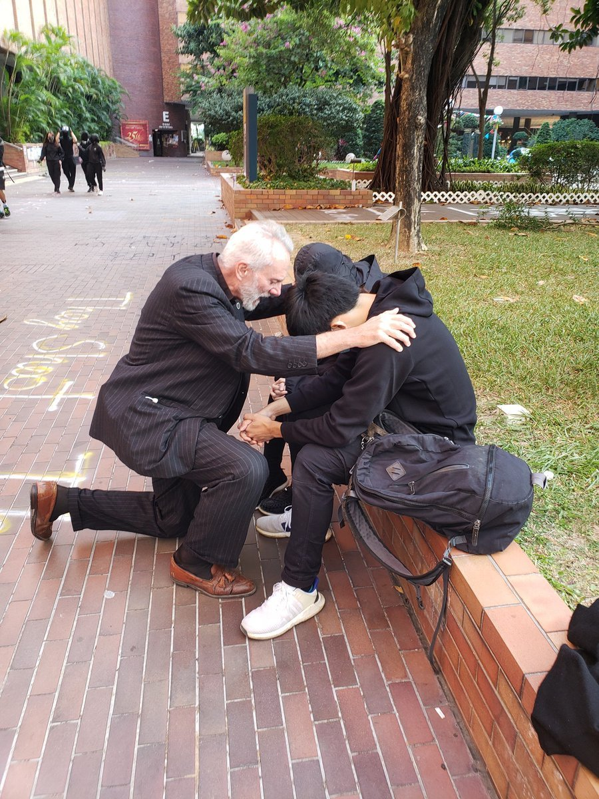
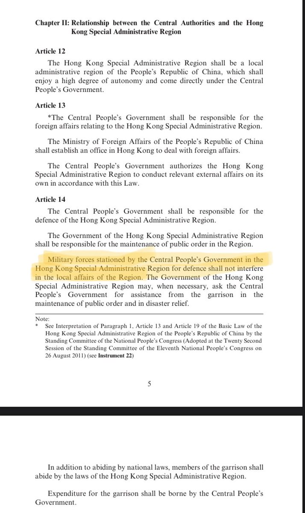
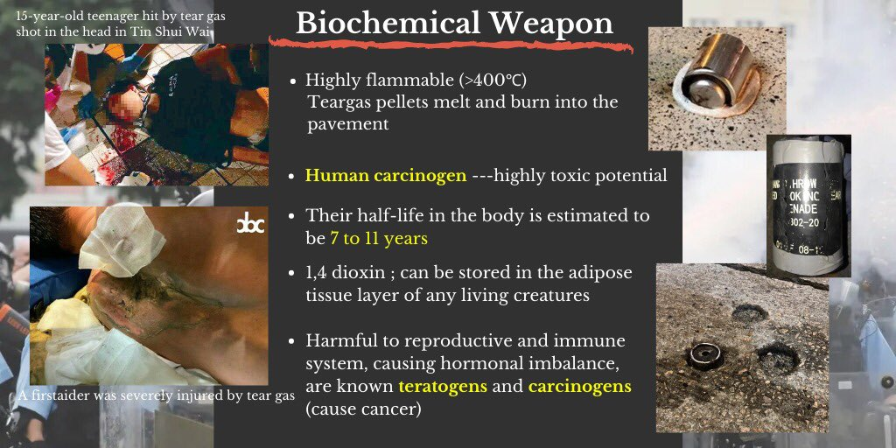

[11月17日 12:01]    新闻大吐槽   @TuCaoFakeNews    黑警发言人：死因无可疑！ https://twitter.com/hkgirlyy1/status/1195577702570283010 …  :speech_balloon:评:0 :+1:赞:1 :globe_with_meridians:转:1  

[11月17日 12:00]    纽约时报中文网   @nytchinese    #图集【在美国，55万美元能买到什么房？】手握55万美元，你能买到明尼苏达州圣保罗摄政复兴风格的公寓，或伯克郡一间净零能源住宅，也可以选择印第安纳州布卢明顿的梁柱结构房屋。
点击查看图集： http://nyti.ms/2OivGzP   :speech_balloon:评:0 :+1:赞:2 :globe_with_meridians:转:0  

[11月17日 11:56]    新闻大吐槽   @TuCaoFakeNews    春淫亡缢更爽：我们中共就是要做邪恶的集大成者！  :speech_balloon:评:0 :+1:赞:2 :globe_with_meridians:转:1  

[11月17日 11:52]    新闻大吐槽   @TuCaoFakeNews    能进这些世界名校的大陆生，非富即贵都是既得利益者的孩子，他们都是花钱进的名校，不为读书只为镀金，将来接各种大位。  :speech_balloon:评:0 :+1:赞:4 :globe_with_meridians:转:2  

[11月17日 11:52]    新闻大吐槽   @TuCaoFakeNews    说美国不好，死也要死在美国，说中国好，打死也不愿回去  :speech_balloon:评:4 :+1:赞:10 :globe_with_meridians:转:1  

[11月17日 11:48]    新闻大吐槽   @TuCaoFakeNews    古今中外，公开以大学为战场、以大学生为敌的政府，中共算是第一！这就把极权主义的形象彻底暴露于全世界！中共超越纳粹，创造世界纪录了！ https://twitter.com/TuCaoFakeNews/status/1195902053576429569 …  :speech_balloon:评:1 :+1:赞:6 :globe_with_meridians:转:5  

[11月17日 11:46]    新闻大吐槽   @TuCaoFakeNews    2位美国牧师到香港理工支持抗争者，还会搜集警暴证据，他们有备而来，头盔、眼罩、防毒面具，一应俱全；

正邪的力量总是均衡的，这边派出驻港部队上街施加威胁，那边就派出牧师保护学生，就像当年的飞虎队，虽是自发，也必有美国政府的安排，一切皆非偶然；魔高一尺道高一丈。  https://twitter.com/TuCaoFakeNews/status/1195823810961821696 …  :speech_balloon:评:1 :+1:赞:10 :globe_with_meridians:转:5  

[11月17日 11:46]    新闻大吐槽   @TuCaoFakeNews    中共最討厭知識分子，尤其是年輕熱血的，因為知青會看穿中共的謊言，而且有行動力去反抗  :speech_balloon:评:0 :+1:赞:4 :globe_with_meridians:转:1  

[11月17日 11:45]    新闻大吐槽   @TuCaoFakeNews    他们不捡砖头了吗？今天是如此方式爱香港人吗？ https://twitter.com/tucaofakenews/status/1195902053576429569 …  :speech_balloon:评:0 :+1:赞:3 :globe_with_meridians:转:3  

[11月17日 11:43]    新闻大吐槽   @TuCaoFakeNews    这帮傻子射桥顶上了！  :speech_balloon:评:0 :+1:赞:1 :globe_with_meridians:转:1  

[11月17日 11:40]    新闻大吐槽   @TuCaoFakeNews    本日神評：公款消費  :speech_balloon:评:1 :+1:赞:2 :globe_with_meridians:转:1  

[11月17日 11:02]    BBC News 中文   @bbcchinese    【一周热点回顾】围绕女性性器官存在和流传着许多误解。美国妇产科医生珍·冈特（Dr.Jen Gunter)在北美行医25年。她的新书《阴道圣经》（The Virginal Bible）为女性提供许多实用性建议，在这里我们为你总结5条。 https://bbc.in/32M3UAV   :speech_balloon:评:3 :+1:赞:25 :globe_with_meridians:转:12  

[11月17日 11:00]    纽约时报中文网   @nytchinese    #一周热门 #摩登情爱  他让我想起爸爸，我们约会了 http://nyti.ms/2CD43ft   :speech_balloon:评:1 :+1:赞:7 :globe_with_meridians:转:2  

[11月17日 10:56]    新闻大吐槽   @TuCaoFakeNews    11月17日解放軍「不請自到」在浸會大學附近清理路障磚頭。解放軍用十多分鐘清理完路障後回到軍營，演完「軍民一家親」後，警察繼續來窩打老道聯合道浸會大學處。  :speech_balloon:评:3 :+1:赞:9 :globe_with_meridians:转:7  

[11月17日 10:45]    新闻大吐槽   @TuCaoFakeNews    中共军队香港街头清理路障 泛民议员批违法

周六，中共驻港部队突然在香港街头出现，清理抗议者设置的路障，引发争议。24 名泛民主派立法会议员晚间发表声明，质疑中共军队的行动违反《驻军法》和《基本法》。   :speech_balloon:评:3 :+1:赞:29 :globe_with_meridians:转:16  

[11月17日 10:43]    新闻大吐槽   @TuCaoFakeNews    11.16旺角之夜，抗議市民罵警察「共狗」，警察與不遠處市民對罵，並叫喊「夠膽的過來啊！」  :speech_balloon:评:2 :+1:赞:19 :globe_with_meridians:转:12  

[11月17日 10:22]    新闻大吐槽   @TuCaoFakeNews    立场决定消费 港人排长龙支持黄色小店

记者 梁珍：“星期六是黄色爆买日，我们看到不少市民都来到这里支持有良心的黄色小店。比如这家位于红磡的龙门冰室门口就大排长龙。”

支持抗争学生的龙门冰室，曾被亲共人士两次破坏，但来支持消费的民众络绎不绝。香港市民：我纯粹支持他是一个很有良心的老板  :speech_balloon:评:2 :+1:赞:65 :globe_with_meridians:转:31  

[11月17日 10:16]    新闻大吐槽   @TuCaoFakeNews    一個軍階是大校的工資竟然可以買到勞力士，貪了多少錢，呵呵  :speech_balloon:评:1 :+1:赞:7 :globe_with_meridians:转:3  

[11月17日 10:04]    新闻大吐槽   @TuCaoFakeNews    感觉用意比挽回形象更加阴毒 https://twitter.com/tucaofakenews/status/1195711083417202688 …  :speech_balloon:评:1 :+1:赞:3 :globe_with_meridians:转:2  

[11月17日 10:03]    新闻大吐槽   @TuCaoFakeNews    感谢 https://twitter.com/tucaofakenews/status/1195823810961821696 …  :speech_balloon:评:0 :+1:赞:5 :globe_with_meridians:转:4  

[11月17日 10:00]    纽约时报中文网   @nytchinese    在持续整夜的航班上，大多数航空公司会马上为乘客提供饮食，然后把灯打开，但是这一次，我们要开灯6个多小时，直到纽约时间的半夜。
除此之外，航班会向我们提供辣味的晚餐，曾担任飞机上的时差顾问的认知心理学家卡罗尔教授说，这就像“把人打醒的一记耳光。” http://nyti.ms/2rOIxCt   :speech_balloon:评:0 :+1:赞:8 :globe_with_meridians:转:1  

[11月17日 09:56]    新闻大吐槽   @TuCaoFakeNews    卧槽 长得也太像了 
肯定是人渣父子俩了，
应该都是习近平失散多年的亲戚！

香港台湾的朋友，你们能认得右边这个老人渣是谁吗？

他可是中共国著名非物质人渣文化继承者哦，

猜猜他是干什么工作的？？？

 https://twitter.com/tucaofakenews/status/1195830175386099712 …  :speech_balloon:评:2 :+1:赞:10 :globe_with_meridians:转:6  

[11月17日 09:54]    新闻大吐槽   @TuCaoFakeNews    最新民調顯示：
80%港人支持成立獨立調查委員會 https://twitter.com/tucaofakenews/status/1195711083417202688 …  :speech_balloon:评:0 :+1:赞:4 :globe_with_meridians:转:2  

[11月17日 09:42]    新闻大吐槽   @TuCaoFakeNews    您好，这违反《驻军法》 https://twitter.com/TuCaoFakeNews/status/1195711083417202688 …  :speech_balloon:评:0 :+1:赞:3 :globe_with_meridians:转:1  

[11月17日 09:00]    BBC News 中文   @bbcchinese    【一周热点回顾】为什么这些国家的污染比世界制造大国——中国的情况还要严重呢？ https://bbc.in/2Xn6zjt   :speech_balloon:评:39 :+1:赞:21 :globe_with_meridians:转:10  

[11月17日 09:00]    纽约时报中文网   @nytchinese    #一周热门 #时报内情 在今日中国，经济已成为一个敏感话题 http://nyti.ms/2X3UIXs   :speech_balloon:评:31 :+1:赞:34 :globe_with_meridians:转:10  

[11月17日 08:00]    纽约时报中文网   @nytchinese    环保人士估计，生活在该地区的近700只考拉中有350只已经死亡。截至周四，有22只成年考拉和一只幼年考拉获救。
它们和其他几十种动物一起在考拉医院接受治疗，包括被狗袭击或因车祸受伤的袋鼠和负鼠——这通常是受灾后寻找新家时遭遇的附带伤害。 http://nyti.ms/357ejJg   :speech_balloon:评:2 :+1:赞:3 :globe_with_meridians:转:2  

[11月17日 07:00]    纽约时报中文网   @nytchinese    #一周热门 #观点 习近平执政第二季：完美极权登 http://nyti.ms/2ObRZaz   :speech_balloon:评:27 :+1:赞:59 :globe_with_meridians:转:17  

[11月17日 05:00]    纽约时报中文网   @nytchinese    #一周热门 世界银行缩减新疆贷款项目规模 http://nyti.ms/33OmHx3   :speech_balloon:评:6 :+1:赞:37 :globe_with_meridians:转:12  

[11月17日 04:42]    老司机   @h5lpykl7tp6jjop    两名德国男子在港被捕 原因竟是...
香港警方当地时间14日晚拘捕两名外籍男子，涉嫌非法集结和违反《禁止蒙面规例》。法新社16日的报道表示，这两名被捕的外籍男子是在香港的德国留学生。香港警方今日发给环球时报-环球网记者的声明证实被捕外籍男子是“德国籍”，屯门重案一队正在调查”。  :speech_balloon:评:0 :+1:赞:22 :globe_with_meridians:转:8  

[11月17日 02:35]    老司机   @h5lpykl7tp6jjop    鼠疫患者急救现场画面曝光 医院通知细思极恐
鼠疫疑已扩散中国4省市 多人感染有儿童死亡
官方极力封锁消息 多名北京医生披露内情
 https://yanmingshiping.blogspot.com/2019/11/4_16.html …  :speech_balloon:评:2 :+1:赞:22 :globe_with_meridians:转:17  

[11月17日 00:25]    老司机   @h5lpykl7tp6jjop    今日的悔悟似乎有点晚。看从前，台湾是公民社会，公共事务参与比例高；香港是平民社会，多数只管赚钱不问政事；大陆根本就是个奴隶社会，不闻不问任由主子宰杀！  :speech_balloon:评:4 :+1:赞:24 :globe_with_meridians:转:12  

[11月17日 00:18]    BBC News 中文   @bbcchinese    11月16日，香港政府新闻处代中国解放军驻香港部队发出新闻稿，回应有解放军驻香港部队离开军营清理路障一事。  :speech_balloon:评:120 :+1:赞:138 :globe_with_meridians:转:45  

[11月16日 23:38]    老司机   @h5lpykl7tp6jjop    【20191114】15時頃セントラル(中環)で、 #香港警察 がフラッシュモブ形式の抗議活動を行っている民衆を強制排除中、取材中の記者が押し倒され、携帯もカメラも壊された。  :speech_balloon:评:13 :+1:赞:381 :globe_with_meridians:转:410  

[11月16日 23:33]    GFHG SDKM   @zyx_yny    Home sweet home #HongKong, the city of tear gas https://twitter.com/stegersaurus/status/1195725568433672193 …  :speech_balloon:评:0 :+1:赞:0 :globe_with_meridians:转:0  

[11月16日 23:32]    GFHG SDKM   @zyx_yny    No sir, we won’t surrender. So #HongKongers are fighting against the control of CCP  https://twitter.com/jkylebass/status/1195700447685828608 …  :speech_balloon:评:0 :+1:赞:1 :globe_with_meridians:转:1  

[11月16日 23:00]    纽约时报中文网   @nytchinese    #一周热门 香港抗议者背后的志愿者大军 http://nyti.ms/32Cy1ee   :speech_balloon:评:97 :+1:赞:72 :globe_with_meridians:转:18  

[11月16日 22:47]    GFHG SDKM   @zyx_yny    旺角朗豪坊後面大量身份不明，疑似防暴警察的綠衣人圍住一個女仔，仲大力推咗佢落地下，被他們粗暴搜身。

#hkpolicebrutality #standwithhongkong #standwithhk  :speech_balloon:评:76 :+1:赞:814 :globe_with_meridians:转:967  

[11月16日 22:39]    GFHG SDKM   @zyx_yny    Can anyone explain to me how today’s “voluntary assistance” from the Chinese People’s Liberation Army is consistent with the #HongKong Basic Law. 

Didn’t think so. 

Clearing today. Crackdown tomorrow. 

#OneSystemOneCountry
#StandWithHongKong  :speech_balloon:评:654 :+1:赞:4848 :globe_with_meridians:转:4482  

[11月16日 22:00]    纽约时报中文网   @nytchinese    边走路边看手机有多危险，以及你该如何控制自己 http://nyti.ms/2Xf8bMh   :speech_balloon:评:1 :+1:赞:2 :globe_with_meridians:转:2  

[11月16日 21:54]    老司机   @h5lpykl7tp6jjop    #香港旺角11月16日 21：25 #旺角 朗豪坊附近，大量緑衣警察包圍一個女士，突然用力推她倒地，搜完身女士獲放行
#黑警濫暴
#HongKongPoliceTerrorism
#SOSHongKong  :speech_balloon:评:7 :+1:赞:78 :globe_with_meridians:转:85  

[11月16日 21:05]    GFHG SDKM   @zyx_yny    一出就俾刪，請廣傳！！！！！  :speech_balloon:评:25 :+1:赞:357 :globe_with_meridians:转:444  

[11月16日 21:00]    GFHG SDKM   @zyx_yny    More than 400 pages of internal Chinese documents detail the origins and growth of the indoctrination program in Xinjiang, where a million or more predominately Muslim minorities have been held in a vast network of detention centers https://www.nytimes.com/interactive/2019/11/16/world/asia/china-xinjiang-documents.html …  :speech_balloon:评:538 :+1:赞:11167 :globe_with_meridians:转:10164  

[11月16日 21:00]    纽约时报中文网   @nytchinese    #一周热门 接触还是遏制？九位中国专家谈美国对华政策 http://nyti.ms/34WsGjt   :speech_balloon:评:60 :+1:赞:18 :globe_with_meridians:转:11  

[11月16日 20:59]    GFHG SDKM   @zyx_yny    #BREAKING People's Liberation Army confirms Chinese soldiers deployed in Hong Kong clean-up  :speech_balloon:评:121 :+1:赞:977 :globe_with_meridians:转:1010  

[11月16日 20:58]    BBC News 中文   @bbcchinese    美中争当世界头号人工智能（AI）大国，竞赛结果难以预测，或需机器人来帮忙。 https://bbc.in/2Ql11EN   :speech_balloon:评:13 :+1:赞:23 :globe_with_meridians:转:7  

[11月16日 20:55]    GFHG SDKM   @zyx_yny    1 tweet said #PLA did it 2 be "proactive". It means NO ask & NO invite. ThenviolatedBasic Law & PLA must go back 2barricks. ORcan blame Commissar Lam by claiming she invited PLA w/o emergency declaration/informingers publicly. Lam must go. There's no win in either case. https://twitter.com/hkpeachy/status/1195673719877722114 …  :speech_balloon:评:216 :+1:赞:3509 :globe_with_meridians:转:2890  

[11月16日 20:25]    GFHG SDKM   @zyx_yny    #PLA charming offense gives us a chance 2 explore the inconsistency in #CCP messaging. 4 images: @hkpoliceforce human rights abuse, prothugs brutally attacked candidates/civilians, DQ/election cancellation, #PLA cleaningstreets. Which image Emperor Pooh wantsers 2 believe? https://twitter.com/SeleneChan19/status/1195674031497678848 …  :speech_balloon:评:66 :+1:赞:1306 :globe_with_meridians:转:1015  

[11月16日 20:18]    GFHG SDKM   @zyx_yny    Journalist from CRHK shot from the back by riot police for "assaulting police"
今朝早防暴警從背後射擊商業電台記者及並誣衊佢襲警嘅影片曝光
Video taken in morning of Nov 16 HKT. source: 真•香港人頻道 #TiananmenSquareMassacre2019  :speech_balloon:评:25 :+1:赞:466 :globe_with_meridians:转:501  

[11月16日 20:08]    GFHG SDKM   @zyx_yny    今日、香港に駐屯している中国の人民解放軍が駐屯地から離れ、「自発的に」香港バプテスト大学周辺にデモ隊が設置したバリケードを取り除きました。

香港の「駐軍法」によると、「緊急事態ではない時に、自発的にバリケードやゴミを拾う」ことは人民解放軍の仕事ではありません。→  :speech_balloon:评:656 :+1:赞:15307 :globe_with_meridians:转:11188  

[11月16日 19:44]    GFHG SDKM   @zyx_yny    第二次整文宣，求支持
二噁英 | How harmful is the Dioxin?
8,500 tear gas canisters has fired within 5 months 
tear gas =contains DIOXIN =biochemical weapon
#StandwithHongKong
#chinazi
#HongKongProtests
#HongKongPoliceTerrorism
#freedomHK  :speech_balloon:评:35 :+1:赞:550 :globe_with_meridians:转:552  

[11月16日 19:00]    纽约时报中文网   @nytchinese    #一周热门 图集：大学校园成香港抗议最新阵地 http://nyti.ms/2pd93nT   :speech_balloon:评:11 :+1:赞:26 :globe_with_meridians:转:11  

[11月16日 18:18]    财经真相   @caijingxiang    现在距离12月15号,还有四周时间，如果下周结束之前，双方再不公布两国具体签协议是具体时间表，基本上宣布本轮谈判再次破裂，因为目前双方元首根本没有会面的时间表，所谓伦敦峰会还只是停留在媒体猜测层面，没有得到官方确认，库德罗周五表示，第一阶段协议签订不需要双方元首会面签字，就是铺垫！  :speech_balloon:评:3 :+1:赞:77 :globe_with_meridians:转:16  

[11月16日 18:11]    财经真相   @caijingxiang    美国总统特朗普上周五在白宫对记者表示，他尚未决定取消已经加征的对华关税。
随后，特朗普上周六在马里兰州安德鲁斯联合基地表示，美中两国贸易谈判取得很好的进展。但是慢，“对我来说太慢”。特朗普对记者表示，谈判进行顺利。不过，他也强调，愿意达成协议，但是协议必须符合美方设想。  :speech_balloon:评:6 :+1:赞:86 :globe_with_meridians:转:16  

[11月16日 18:05]    墙国铁拳现世报😷   @Socialistfist    小编要郑重警告刘女士，国家是有寻衅滋事和煽动颠覆这些国民待遇的。

#社会主义铁拳  :speech_balloon:评:79 :+1:赞:586 :globe_with_meridians:转:175  

[11月16日 18:00]    BBC News 中文   @bbcchinese    姜、蒜、橙子、柚子，这和癌症有什么关系？欧洲专家警告，癌症治疗期间慎用这些产品辅助制品。 https://bbc.in/2Kr9imV   :speech_balloon:评:6 :+1:赞:48 :globe_with_meridians:转:27  

[11月16日 17:58]    GFHG SDKM   @zyx_yny    This self proclaimed "volunteered" #PLA deployment is seriously dangerous.

This violates the Garrison Law, the Basic Law and the Sino-British Joint Declaration.

Today they can volunteer to pick up bricks on the streets, tomorrow they can volunteer to slaughter #HongKong people. https://twitter.com/DonttreadonH/status/1195623868339089412 …  :speech_balloon:评:48 :+1:赞:908 :globe_with_meridians:转:873  

[11月16日 17:30]    BBC News 中文   @bbcchinese    "有人认为，民主根本就是短视的，因此依靠'善良的独裁者'或许会更好，他们能够代表我们所有人，以长远的眼光看待人类面临的多重危机。"你怎么看？ https://bbc.in/33S3Gts   :speech_balloon:评:336 :+1:赞:302 :globe_with_meridians:转:98  

[11月16日 17:28]    老司机   @h5lpykl7tp6jjop    【不怕恐怖圖片，要讓世界知道，多少香港人民死在習近平匪幫的鐵蹄下！】
OMG!!!又有人“被自殺”
而家真係變左個翻版8964 ...
目擊者
發現地點係喺石硤尾嘅美映樓
發現時間係11月16號嘅凌晨12點05分

死得超級恐怖
係已經爆頭  :speech_balloon:评:90 :+1:赞:169 :globe_with_meridians:转:180  

[11月16日 17:28]    老司机   @h5lpykl7tp6jjop    有人说香港人应该放弃抵抗不给中共镇压有借口，说这话的人太天真，历史经验是一旦放弃对抗，它们将大规模抓捕所有反抗过的人，除非你能逃走，不在它的控制之下，中共对内对外斗起来都是你死我活的唯一法则，这是非人类恶魔，一旦惹了它只有一条路，拼命！  :speech_balloon:评:17 :+1:赞:312 :globe_with_meridians:转:86  

[11月16日 17:14]    GFHG SDKM   @zyx_yny    PLA soldiers sent onto streets of Hong Kong for first time since protests began – to help clear roadblocks near Kowloon Tong garrison https://www.scmp.com/news/hong-kong/politics/article/3038049/pla-soldiers-sent-streets-hong-kong-first-time-protests …  :speech_balloon:评:248 :+1:赞:1191 :globe_with_meridians:转:1096  

[11月16日 17:00]    BBC News 中文   @bbcchinese    持续了5个多月的香港抗议，至今仍然没有平息的迹象，对香港的政治、经济和社会造成了哪些影响？ https://bbc.in/2CLQavt   :speech_balloon:评:49 :+1:赞:63 :globe_with_meridians:转:20  

[11月16日 17:00]    纽约时报中文网   @nytchinese    #一周热门 被学生举报的中国大学教授后来怎么了 http://nyti.ms/2CGn3tm   :speech_balloon:评:28 :+1:赞:116 :globe_with_meridians:转:71  

[11月16日 16:44]    GFHG SDKM   @zyx_yny    #BREAKING men in army green T shirts who seemingly are PLA soldiers are out in Kowloon Tong clearing roadblocks.  :speech_balloon:评:191 :+1:赞:1842 :globe_with_meridians:转:1836  

[11月16日 16:44]    GFHG SDKM   @zyx_yny    PLA soldiers are working at lightning speed to clear away bricks from the streets of Kowloon Tong. #HongKong
 https://news.rthk.hk/rthk/en/component/k2/1492616-20191116.htm …  :speech_balloon:评:534 :+1:赞:4022 :globe_with_meridians:转:3965  

[11月16日 16:00]    纽约时报中文网   @nytchinese    很显然，避免陷入边走边发短信的危险境地的方法就是不要边走边发短信。
但这说来容易做起来难，因为人们很难控制自己对科技产品的使用。所以一些专家建议进行自我控制练习。 http://nyti.ms/2Xf8bMh   :speech_balloon:评:1 :+1:赞:14 :globe_with_meridians:转:2  

[11月16日 15:01]    BBC News 中文   @bbcchinese    【一周热点回顾】美国可能无法阻挡中国经济崛起，只有中国自己失误才能阻挡这个进程。习近平治下中国有可能走上勃列日涅夫的老路。 https://bbc.in/2NNeV0B   :speech_balloon:评:87 :+1:赞:101 :globe_with_meridians:转:37  

[11月16日 15:00]    纽约时报中文网   @nytchinese    #一周热门 特朗普重申对华关税威胁，贸易协议不确定性增加 http://nyti.ms/2q7MRfs   :speech_balloon:评:5 :+1:赞:22 :globe_with_meridians:转:2  

[11月16日 14:00]    纽约时报中文网   @nytchinese    虽然考拉已经进化到可以与野火共存，但它们面临的新威胁不仅来自气候变化，还来自人类的发展，后者使本地种群流离失所，削弱了它们在火灾中的存活能力。
科学家说，在一些地区，考拉的数量下降了80%，尽管很难知道全澳大利亚还有多少考拉。 http://nyti.ms/357ejJg   :speech_balloon:评:3 :+1:赞:7 :globe_with_meridians:转:2  

[11月16日 13:47]    GFHG SDKM   @zyx_yny    facebook 不斷del 這兩張圖
請廣人傳!
pls share!
#SOSHK
#HongKongPoliceTerrorists  :speech_balloon:评:44 :+1:赞:657 :globe_with_meridians:转:806  

[11月16日 13:06]    老司机   @h5lpykl7tp6jjop    优秀的共产党员干部原来都是这样的货色！  :speech_balloon:评:6 :+1:赞:33 :globe_with_meridians:转:22  

[11月16日 13:02]    BBC News 中文   @bbcchinese    【一周热点回顾】14世纪时，鼠疫横扫欧洲，夺走三分之一人的生命。时过境迁...... https://bbc.in/355PdKw   :speech_balloon:评:71 :+1:赞:138 :globe_with_meridians:转:62  

[11月16日 13:00]    纽约时报中文网   @nytchinese    #一周热门 中国债务问题有多严重？地方医院向职工借钱筹资 http://nyti.ms/33GgJhu   :speech_balloon:评:64 :+1:赞:54 :globe_with_meridians:转:28  

[11月16日 12:31]    老司机   @h5lpykl7tp6jjop    證據確鑿，黑警恐嚇市民：「小心被消失」

推爆佢！  :speech_balloon:评:47 :+1:赞:788 :globe_with_meridians:转:858  

[11月16日 12:08]    GFHG SDKM   @zyx_yny    有無手足同我一樣想打德語區戰線？
但我發現德文啲post真係唔多推得到，英文反而推得順啲
其實我學德文果陣都聽過好多東歐國家人唔識得英文反而識得德文，所以德文除左德國、奧地利、瑞士德語區同列支敦斯登之外都多人用
有無人可以幫手一齊打定係我打翻英文戰線算
#StandWithHongKong
#國際戰線  :speech_balloon:评:140 :+1:赞:966 :globe_with_meridians:转:460  

[11月16日 12:00]    纽约时报中文网   @nytchinese    #摩登情爱 我听人说过，选择流浪街头是一种慢性自杀。认识DJ的母亲七年，我敢说这是对的。她所做的每一件事似乎都在招致危险。
我已经记不清她有多少朋友和男友死于吸毒过量、酒精中毒，以及冻死。 http://nyti.ms/2picNEM   :speech_balloon:评:0 :+1:赞:5 :globe_with_meridians:转:1  

[11月16日 11:00]    纽约时报中文网   @nytchinese    #一周热门 柏林墙倒塌30年：改变世界的一场意外 http://nyti.ms/2CDzw0R   :speech_balloon:评:1 :+1:赞:16 :globe_with_meridians:转:10  

[11月16日 10:25]    财经真相   @caijingxiang    中国人民银行：按照“因城施策”的基本原则，落实房地产长效管理机制，不将房地产作为短期刺激经济的手段。如果真心控制房价，十年前就做了，现在不是想怎样控制房价，而是已经无力放更多的货币，继续推高房价；如果还能再大涨一波，也就不会有现在的财政赤字、中小银行遭到挤兑的困境了！  :speech_balloon:评:3 :+1:赞:73 :globe_with_meridians:转:15  

[11月16日 10:19]    财经真相   @caijingxiang    中国人民银行：正确看待央行资产负债表规模变化；当前，中国仍实施常态货币政策，法定准备金率是使用的主要政策工具之一。虽然中国人民银行资产规模增长放缓甚至可能下降，但降准放松了流动性约束，增大了货币创造能力，与国外央行量化宽松结束后一度进行的“缩表”有本质区别。找不到足够的抵押物！  :speech_balloon:评:6 :+1:赞:80 :globe_with_meridians:转:20  

[11月16日 10:16]    BBC News 中文   @bbcchinese    美国众议院对总统特朗普的弹劾调查继续推进。前美国驻乌克兰大使约瓦诺维奇作证时，特朗普实时发表推文，两人展开隔空辩论。 https://bbc.in/2Xgij7q   :speech_balloon:评:15 :+1:赞:24 :globe_with_meridians:转:11  

[11月16日 10:12]    财经真相   @caijingxiang    发改委副秘书长高杲16日透露，根据全国PPP监测服务平台数据，截至11月初，各地正在推进的PPP项目近7000个，总投资约9万亿元人民币。其中城市基础设施、农林水利、社会事业、交通运输、生态环保五大领域占全部项目个数和总投资规模比重均接近90%。  :speech_balloon:评:2 :+1:赞:64 :globe_with_meridians:转:16  

[11月16日 10:05]    财经真相   @caijingxiang    这次规模应该会超过以往，国内的小心！  :speech_balloon:评:34 :+1:赞:337 :globe_with_meridians:转:160  

[11月16日 10:00]    纽约时报中文网   @nytchinese    你的身体紧邻世界上最壮观的港口之一，即使你的大脑已经滑入“迷离时空”。
你在不到一天的时间里走过了半个地球。你周五离开了一个地方，周日成功抵达另一个地方。很难理解这个概念，我们多么漫不经心地跳过时间和空间，多么随意地失去一整天。 http://nyti.ms/2rOIxCt   :speech_balloon:评:56 :+1:赞:20 :globe_with_meridians:转:5  

[11月16日 09:02]    BBC News 中文   @bbcchinese    【一周热点回顾】香港中文大学校内多处黑烟四起，示威者与防暴警察在校内二号桥对峙。有示威者向警方投掷砖头、汽油弹等物体。警方发射催泪弹、橡胶子弹，并用水炮车发射蓝色催泪剂驱散人群。校长段崇智和前校长沈祖尧先后到场调停，均遭遇催泪弹。 https://bbc.in/378XTld   :speech_balloon:评:92 :+1:赞:230 :globe_with_meridians:转:86  

[11月16日 09:00]    纽约时报中文网   @nytchinese    #一周热门 北京确诊两例肺鼠疫病例，民众担忧疫情蔓延 http://nyti.ms/32E8DVb   :speech_balloon:评:16 :+1:赞:13 :globe_with_meridians:转:10  

[11月16日 04:34]    GFHG SDKM   @zyx_yny    I can’t imagine why anyone would oppose this bill that supports the men and women in #HongKong fighting each day for their human rights!

I hope all of our colleagues will help pass this bill. This shouldn’t be a partisan issue. We need to stand unified in support of HK! https://twitter.com/marcorubio/status/1195422789261549573 …  :speech_balloon:评:1730 :+1:赞:15600 :globe_with_meridians:转:13082  

[11月16日 00:58]    GFHG SDKM   @zyx_yny    Thank you @SenatorRisch and @MarcoRubio for your commitment to pass the #HongKongHumanRightsandDemocracyAct in the Senate. It sends a strong message that America stands with the people of Hong Kong.  :speech_balloon:评:847 :+1:赞:10697 :globe_with_meridians:转:8828  

[11月15日 20:31]    BBC News 中文   @bbcchinese    意大利著名水上城市威尼斯遭遇半世纪以来最大水灾。全城80%被淹，损失严重。如何保护世界遗产和古迹是人类面临的最大挑战之一。 https://bbc.in/340pMdv   :speech_balloon:评:29 :+1:赞:68 :globe_with_meridians:转:33  

[11月15日 20:30]    BBC News 中文   @bbcchinese    有网民将其比喻为即时战略游戏中的攻击手段，认为学生的技术已经“进化”，进入“帝王时代”（游戏的术语）。但示威者的一些手法也引发争议和批评。 https://www.bbc.com/zhongwen/simp/chinese-news-50429383 …  :speech_balloon:评:96 :+1:赞:101 :globe_with_meridians:转:34  

[11月15日 19:04]    BBC News 中文   @bbcchinese    中国游泳名将孙杨周五在他的“抗药检”事件听证会上表示，是药检团队中的一名“护士”用手机拍摄他，令他怀疑团队的职业资格，因此与药检人员发生争执。

2018年9月，孙杨被指破坏尿液和血液样本，拒绝药检人员取走。BBC中文此前报道： https://bbc.in/32Oq4Cz   :speech_balloon:评:71 :+1:赞:61 :globe_with_meridians:转:41  

[11月15日 18:08]    BBC News 中文   @bbcchinese    横扫中国的非洲猪瘟疫情正导致中国的猪肉严重短缺，但这家濒临绝境的广西养猪场为何留下最后一只猪？  :speech_balloon:评:68 :+1:赞:266 :globe_with_meridians:转:100  

[11月15日 17:29]    BBC News 中文   @bbcchinese    香港抗议活动冲击企业营收，虽然巴宝莉（Burberry）在香港的门市未被打砸，但这家公司已将这些门市的价值减记1400万英镑；国泰航空的入境旅客流量则在8月和9月下降38%，10月下降35%。 https://www.bbc.com/zhongwen/simp/business-50430153 …  :speech_balloon:评:46 :+1:赞:57 :globe_with_meridians:转:29  

[11月15日 16:42]    老司机   @h5lpykl7tp6jjop    这个世界上所有的流氓碰上中共都只有甘拜下风，因为即使残暴也不及它冷血，即使冷血也不及它卑鄙，即使卑鄙也不及它阴险，即使阴险也不及它无耻，即使无耻也不及它无赖，即使无赖也不及它下流，即使下流也不及它无底限！这是人类最最最肮脏龌龊的集团，它们集中了动物界所有的恶行，它不灭亡，没有安宁  :speech_balloon:评:24 :+1:赞:382 :globe_with_meridians:转:121  

[11月15日 16:28]    财经真相   @caijingxiang    随着贸易战的深入，华强北也受到了巨大冲击，特朗普不断上调的关税尚不足以构成致命伤害，真正的要命之处是美国终结的国际邮费优惠，对于一个手机壳来说，其单价还不如国际邮费贵，一但邮费优惠终结，其价格优势也将不复存在！  :speech_balloon:评:7 :+1:赞:131 :globe_with_meridians:转:18  

[11月15日 16:17]    老司机   @h5lpykl7tp6jjop    Dead bodies in black are found in the sea or in front of buildings every few hrs in HK. And cops here said they are all with no suspicion!
 https://www.facebook.com/groups/hkpfveryugly/permalink/2580460815381809?sfns=mo …
@SolomonYue #HongKongPoliceTerrorists #HongKongProtesters #StandWithHongKong #SOSHK #savehongkong  :speech_balloon:评:106 :+1:赞:756 :globe_with_meridians:转:942  

[11月15日 16:11]    财经真相   @caijingxiang    深圳之所以成为中国的创业之都，大部分归功于华强北，年轻的大学生不需要关系、资金，只需要一个网店，然后在华强北上千家工厂店里询价、穿梭，尽可能的找到最低批发价，以及最便宜的发快递方式，你就可以实现创业了。当然这里面也充满着心酸，正是中国权贵不屑于多繁琐低回报，才给了屌丝逆袭狭缝！  :speech_balloon:评:5 :+1:赞:140 :globe_with_meridians:转:22  

[11月15日 16:00]    财经真相   @caijingxiang    在过去20年里， 华强北是中国底层屌丝最容易创业逆袭的地方，在这里只要你足够勤奋，吃苦耐劳，善于在细微之处发现商机，你就可以实现人生逆袭，完全摆脱不上班就饿死的宿命！在炎炎夏日里一个人连夜就把八吨充电宝发往全国各地的类似故事每天都在上演！  :speech_balloon:评:4 :+1:赞:80 :globe_with_meridians:转:9  

[11月15日 15:59]    老司机   @h5lpykl7tp6jjop    阿Q的国是无敌的！即使被打败也是为世界和平做出了贡献，从无耻到无敌就转换得这么圆润饱满有光泽！每一粒青春爱国疙瘩豆都显得这么红光发亮，光彩照人！让人们不得不接受这无言的结局！  :speech_balloon:评:3 :+1:赞:33 :globe_with_meridians:转:16  

[11月15日 15:51]    财经真相   @caijingxiang    华强北与香港一河之隔，这里东亚最大的手机配件集散地，它的货物远销世界，很多东南亚、香港、印度等地的商人都在此批发货物。每天都有大量香港店主乘坐地铁来此进货，可以说香港所有3c产品，都来自华强北以及依附它的几千家小工厂！持续的抗争运动已经开始波及到这里的产业链！  :speech_balloon:评:15 :+1:赞:165 :globe_with_meridians:转:42  

[11月15日 14:14]    财经真相   @caijingxiang    李大霄近五年的各种底！“现在已经是婴儿底，你们可以打我的脸了”！  :speech_balloon:评:23 :+1:赞:125 :globe_with_meridians:转:42  

[11月15日 14:06]    财经真相   @caijingxiang    14日，俄罗斯金融媒体RBC报道，金砖国家正在建立金砖国家之间的单一支付系统，也就是创建“金砖国家”的加密货币！  :speech_balloon:评:24 :+1:赞:206 :globe_with_meridians:转:63  

[11月15日 13:28]    老司机   @h5lpykl7tp6jjop    Holy shit!  King's Road is completely packed to the brim with protesters.  At this rate they're going to have to occupy that tram.  And what's with all the dress shirts?  It's casual Friday!

#StandWithHongKong #HongKongProtests  :speech_balloon:评:74 :+1:赞:2769 :globe_with_meridians:转:1910  

[11月15日 12:34]    老司机   @h5lpykl7tp6jjop    从古至今中国的统治者都把心思用在折腾老百姓身上，穷折腾几千年还是一穷二白，所谓的驭民之术并不能使其强大。而西方搞工商业，发展贸易，工业革命，科技发展最终改变了人类命运！只有中国人对奴役同类有极大兴趣，它们永远不理解平等公平的真实意义，该跪谁，谁跪我是它们唯一衡量人际关系的标准！  :speech_balloon:评:5 :+1:赞:81 :globe_with_meridians:转:25  

[11月15日 12:28]    BBC News 中文   @bbcchinese    其中一个可能是，中国的钢铁并非在全世界都受欢迎？ https://www.bbc.com/zhongwen/simp/business-50416457 …  :speech_balloon:评:120 :+1:赞:71 :globe_with_meridians:转:17  

[11月15日 11:57]    BBC News 中文   @bbcchinese    宋楚瑜在参选宣言中比喻自己是金庸小说中武术最高的隐士“独孤求败”，表明此次参选不在于求胜，但希望够带动民心及社会改变。 https://www.bbc.com/zhongwen/simp/chinese-news-50417297 …  :speech_balloon:评:52 :+1:赞:35 :globe_with_meridians:转:5  

[11月15日 09:56]    财经真相   @caijingxiang    高息储蓄产品不属于中共三种不赔的范围！  :speech_balloon:评:10 :+1:赞:64 :globe_with_meridians:转:24  

[11月15日 09:43]    财经真相   @caijingxiang    库德洛称美国正制定减税计划,将在特朗普的第二个总统任期实施.该消息对美股短期内构成巨大支撑，美股不断创新高！  :speech_balloon:评:7 :+1:赞:114 :globe_with_meridians:转:40  

[11月15日 09:02]    财经真相   @caijingxiang    周五亚盘刚开始，美國國家經濟顧問庫德洛最新表示，“我們正接近與中國達成一項貿易協定”。庫德洛並指出，與中國的會談一直非常有建設性。消息公布后美股再度创新高、日元、黄金短线下跌，离岸人民币转涨！又是周五固定利好，这个“传说”中的第一阶段协议已经被说了N次，最扯淡的是每次市场都计价！  :speech_balloon:评:31 :+1:赞:261 :globe_with_meridians:转:58  

[11月15日 08:24]    墙国铁拳现世报😷   @Socialistfist    小编认为本月最佳铁拳，滋磁不滋磁啊？  :speech_balloon:评:37 :+1:赞:736 :globe_with_meridians:转:44  

[11月15日 08:21]    墙国铁拳现世报😷   @Socialistfist    面对大陆的善意，台大教授自信的进去了---亲中学者 施正屏
#社会主义铁拳  :speech_balloon:评:182 :+1:赞:1795 :globe_with_meridians:转:794  

[11月15日 07:59]    BBC News 中文   @bbcchinese    德国德累斯顿称其存在极右势力的严重问题，宣布进入“纳粹紧急状态”，折射欧洲对极端主义思潮的担忧。 https://bbc.in/33O5cwt   :speech_balloon:评:52 :+1:赞:61 :globe_with_meridians:转:21  

[11月15日 07:31]    BBC News 中文   @bbcchinese    美国可能无法阻挡中国经济崛起，只有中国自己失误才能阻挡这个进程。习近平治下中国有可能走上勃列日涅夫的老路。 https://bbc.in/374sHnh   :speech_balloon:评:319 :+1:赞:556 :globe_with_meridians:转:184  

[11月15日 04:21]    老司机   @h5lpykl7tp6jjop    香港发展今天的地步实际上就是中共不遵守承诺，破坏两制修例引起民众反对，独裁霸道的它们在大陆横行七十年从不让步造成今天后果，文明的政府善于听取民意，民众一有反对意见立即让步，结果社会稳定人民幸福。暴政很威风不退让，代替却巨大，不学会让步就只有你死我活一条路！中共一直在这条死路上狂奔  :speech_balloon:评:1 :+1:赞:63 :globe_with_meridians:转:14  

[11月15日 02:02]    老司机   @h5lpykl7tp6jjop    2019年11月12日 香港中文大学“攻防战” 实录（一）

同一天，还有其他几所香港大学，也被中共军警围攻！

中产主义 邪恶魔爪 已伸进 香港校园 ！

#SOS
#国际社会救救香港的孩子  :speech_balloon:评:8 :+1:赞:103 :globe_with_meridians:转:59  

[11月15日 01:50]    新闻大吐槽   @TuCaoFakeNews    香港理工大学中央食堂已经在学生手中正常运转，完美供应所有抗争者饮食！

很多孩子从没下过厨，甚至没洗过碗，抗争让他们一夕长大！  :speech_balloon:评:522 :+1:赞:3130 :globe_with_meridians:转:1087  

[11月15日 01:30]    老司机   @h5lpykl7tp6jjop    【中大保衞戰】
2號橋之役，苦戰15小時，血肉之軀抵擋逾2000發子彈。

致敬——HK勇士！  :speech_balloon:评:36 :+1:赞:501 :globe_with_meridians:转:298  

[11月15日 01:03]    墙国铁拳现世报😷   @Socialistfist    那必须和兄弟你平分啊，猪肉价格这么高  https://twitter.com/Dofuralanmingo/status/1194993538292826114 …  :speech_balloon:评:17 :+1:赞:205 :globe_with_meridians:转:11  

[11月14日 20:43]    老司机   @h5lpykl7tp6jjop    车是警车，人却是“暴徒”，“暴徒”们还熟门熟路，不需要警察押送，自己登车，自己关门！还能有比香港警察更无耻的吗？香港之乱香港之暴，源于警方的堕落！再次说明：绝对的权力绝对的腐败！支持港警的都是青光眼，只看到表面的混乱，看不到混乱后面的黑手是政府掌握了绝对权力  :speech_balloon:评:154 :+1:赞:1609 :globe_with_meridians:转:1006  

[11月14日 19:18]    财经真相   @caijingxiang    这种财富游戏，体现在央行层面，就是无法继续扩表，有价值的印钞已经没有了，现在甚至连农村宅基地和农田都允许抵押贷款，央行如果想继续扩大印钞，除了以高利息忽悠洋韭菜进来外，还有一条办法就是以行政命令，直接掠夺还未欠债的中产阶级，当这波掠夺完后，就只剩下无锚印钞一条路了！也是炼狱之路！  :speech_balloon:评:18 :+1:赞:245 :globe_with_meridians:转:60  

[11月14日 19:10]    财经真相   @caijingxiang    现在中共统治的危机根源是，央行想继续印钞，但是却找不到足够多的“承债人”，14亿底层屁民，通过过去20年加入WTO在血汗工厂赚的那几个铜板，已经被高房价掠夺的差不多了，政府财政收支也到了难以为继的地步；能够赚钱的基建项目也建的差不多了，剩下的都是亏钱的亏钱买卖，如果继续搞，财政根本罩不住  :speech_balloon:评:6 :+1:赞:234 :globe_with_meridians:转:49  

[11月14日 19:09]    墙国铁拳现世报😷   @Socialistfist    北京废青，危言耸听

#社会主义铁拳  :speech_balloon:评:61 :+1:赞:617 :globe_with_meridians:转:161  

[11月14日 19:02]    财经真相   @caijingxiang    中共权贵对中国人统治本质就是财富掠夺，这一最本质的游戏规则始终没有改变。只是统治方法变的更加高明，掠财方式更加隐蔽。以前是挂着刺刀直接强制征收，现在则是以金融变现殖民掠夺。这也是高干二代们大部分都玩金融根源。  :speech_balloon:评:3 :+1:赞:162 :globe_with_meridians:转:37  

[11月14日 18:57]    财经真相   @caijingxiang    还有参与大规模基建投标的私人企业，大多数是和中共权贵密切相关的人，他们在承接项目时虚高报价，这里面的差价本质也是偷14亿国民的财富。再如修路，一条高速路的修建，其资金来源自然是商业银行，商行加点利息后最后找央行借钱，最后的还款方式就是是该高速路的收费，也就是通过该路的车主最后买单！  :speech_balloon:评:3 :+1:赞:138 :globe_with_meridians:转:24  

[11月14日 18:51]    财经真相   @caijingxiang    中共热衷于基建，因为基建贷款抵押的是政府财政税收，而税收最终买单人是全体国民，到最后是全体14亿国民为基建贷款买单。每一轮基建高潮，都会对应央行大规模放水，本质上是中共偷偷把14亿人的劳动力抵押给了央行。在基建过程中，中共各级官员可以吃回扣，贪污偷工减料，这一过程就是偷盗国民的劳动力  :speech_balloon:评:4 :+1:赞:190 :globe_with_meridians:转:37  

[11月14日 18:36]    财经真相   @caijingxiang    中共基建没有钱，很多网友简单的认为开动印钞机就行，这其实是大错特错，中共央行印的每一分钱，都必须有对应的相应的价值才行，否则就是无锚印钞，汇率崩盘！过去20年央行印钞都是以债务为基础的。比如，房奴的房贷，当房奴申请贷款时，本质是向央行抵押了自己未来30年的劳动力。 https://twitter.com/aspeltuo8/status/1194923278646816768 …  :speech_balloon:评:51 :+1:赞:720 :globe_with_meridians:转:267  

[11月14日 05:06]    老司机   @h5lpykl7tp6jjop    這的確不是港普，是普通話  :speech_balloon:评:156 :+1:赞:1373 :globe_with_meridians:转:1089  

[11月14日 01:30]    墙国铁拳现世报😷   @Socialistfist    支持言论自由不受侵害 https://twitter.com/keepcnsecurity/status/1194633823964631046 …  :speech_balloon:评:8 :+1:赞:119 :globe_with_meridians:转:33  

[11月14日 01:27]    老司机   @h5lpykl7tp6jjop    手足
你安息啦
我地會幫你行落去

唔殺曬每一個黑社會同黑警
我地唔會停  :speech_balloon:评:146 :+1:赞:876 :globe_with_meridians:转:556  

[11月13日 18:38]    墙国铁拳现世报😷   @Socialistfist    一天二更，快夸我。
最近推友投稿质量很高，再次感谢！  :speech_balloon:评:16 :+1:赞:218 :globe_with_meridians:转:4  

[11月13日 18:38]    墙国铁拳现世报😷   @Socialistfist    祝这位推友早日康复

#战螂在推特  :speech_balloon:评:24 :+1:赞:267 :globe_with_meridians:转:53  

[11月13日 18:15]    墙国铁拳现世报😷   @Socialistfist    卧床狙击手

#社会主义铁拳  :speech_balloon:评:113 :+1:赞:717 :globe_with_meridians:转:182  

[11月13日 12:30]    纽约时报中文网   @nytchinese    继周一警察向示威者开枪、一名责骂示威者的人遭纵火之后，香港周二再度陷入混乱。
抗议者在校园内纵火、丢掷汽油弹，而防暴警察则试图用催泪瓦斯和水炮将他们击退。
这里是周二抗议活动的一些照片： http://nyti.ms/2pd93nT   :speech_balloon:评:416 :+1:赞:221 :globe_with_meridians:转:103  

[11月12日 19:22]    墙国铁拳现世报😷   @Socialistfist    从2018年9月到现在频繁微博维权，神奇的是，小编就是没看出来他举报的贪污腐败是什么内容  :speech_balloon:评:4 :+1:赞:148 :globe_with_meridians:转:11  

[11月12日 19:20]    墙国铁拳现世报😷   @Socialistfist    宝贝别哭

#社会主义铁拳  :speech_balloon:评:34 :+1:赞:356 :globe_with_meridians:转:80  

[11月12日 07:22]    凡賽堤/FORSETI   @FecharCCP    11日早在西湾河开枪射伤示威者的港警关家荣身份被起底，其担任家教会主席的德望学校师生、家长及校友发起联署要求解除其在该校的职务。其两个女儿在该校就读。另有消息指，关家荣受过“大陆警察部门”特殊培训。下面这个小视频，足以解释这场血案的真相：这是流氓国家自上而下有计划的谋杀。  :speech_balloon:评:20 :+1:赞:265 :globe_with_meridians:转:175  

[11月12日 07:14]    凡賽堤/FORSETI   @FecharCCP    救救悲慘的香港 #HKSOS

香港黑警拔槍亂殺港民！已多人中槍和死亡！

天滅極權！  :speech_balloon:评:2 :+1:赞:10 :globe_with_meridians:转:8  

[11月12日 07:11]    凡賽堤/FORSETI   @FecharCCP    11.11 香港殺人魔家庭資料！
全世界通緝這殺人魔全家！  :speech_balloon:评:49 :+1:赞:13 :globe_with_meridians:转:10  

[11月12日 07:07]    凡賽堤/FORSETI   @FecharCCP    救救悲慘的香港 #HKSOS

香港黑警拔槍亂殺港民！已多人中槍和死亡！  :speech_balloon:评:0 :+1:赞:9 :globe_with_meridians:转:6  

[11月12日 06:57]    凡賽堤/FORSETI   @FecharCCP    天滅流氓政權！！！CCP極權殺人恐怖組織正在用各種兇殘手段屠殺我們的同胞...................

看看這些大陸的黑警（公安，武警，士兵裝扮成香港警察）是如何沒有人性的屠殺香港學生！！！

天滅流氓政權！！！天滅CCP！！！  :speech_balloon:评:1 :+1:赞:21 :globe_with_meridians:转:21  

[11月12日 06:42]    凡賽堤/FORSETI   @FecharCCP    天滅流氓政權！！！CCP極權殺人恐怖組織正在用各種兇殘手段殺害我們的同胞...................

看看這些大陸的黑警（公安，武警，士兵裝扮成香港警察）是如何沒有人性的屠殺香港學生！！！

那個小年輕不知道是休克還是已經死亡！

天滅流氓政權！！！天滅CCP！！！  :speech_balloon:评:34 :+1:赞:19 :globe_with_meridians:转:16  

[11月12日 06:25]    凡賽堤/FORSETI   @FecharCCP    坐水凳（英語：waterboarding）是水刑的一種，做法是將受害人固定其雙手雙腳，在頭部放上布後持續澆水。如此會讓受害人產生溺水的錯覺而心生恐懼。雖然坐水凳不在身上留下可辨識的傷痕，但受害人在過程中會因為嗆到水甚至吸入性肺炎而受傷害。另外有些人因此導致心理方面的傷害，是酷刑的一種。  :speech_balloon:评:1 :+1:赞:36 :globe_with_meridians:转:33  

[11月11日 23:01]    墙国铁拳现世报😷   @Socialistfist    所有推文内容来自于公开的网络社交媒体。
年轻人还是需要学习一个
毕竟too young  https://twitter.com/muxiawenyuzi/status/1193888039799574528 …  :speech_balloon:评:11 :+1:赞:164 :globe_with_meridians:转:14  

[11月11日 17:21]    墙国铁拳现世报😷   @Socialistfist      :speech_balloon:评:19 :+1:赞:100 :globe_with_meridians:转:9  

[11月11日 17:19]    墙国铁拳现世报😷   @Socialistfist    在吗？我微博被封了，可以聊聊吗？

#社会主义铁拳
#战螂在推特  :speech_balloon:评:31 :+1:赞:303 :globe_with_meridians:转:59  

[11月10日 22:23]    墙国铁拳现世报😷   @Socialistfist    5. 因投稿较多且具体事件有时效性，也许会延迟发布您的投稿，希望能够理解。对于一些重复投稿的或者不符合主题的投稿，也许不会被采用。
6. 最佳投稿途径是发送私信，@ 本推会被其他通知挤掉
7. 如果您有好的内容，欢迎使用 #社会主义铁拳 和 #社會主義鐵拳，简繁双体的tag。符合内容的推文会给予转推  :speech_balloon:评:0 :+1:赞:60 :globe_with_meridians:转:7  

[11月10日 22:18]    墙国铁拳现世报😷   @Socialistfist    1. 为避免潜在视奸号盗取IP，不接受含有网站链接的投稿
2. 社会主义铁拳相关主题内容应当是，个体或集体有赞美言论后被社会主义政权铁拳的事例。自然灾害或非社会主义政权皆不算是#社会主义铁拳
3. 本推主题明确统一，不接受除了铁拳现世报以外的爆料或投稿
4. 推荐使用多张截图和文字相配合的投稿方式  :speech_balloon:评:1 :+1:赞:93 :globe_with_meridians:转:11  

[11月10日 22:14]    墙国铁拳现世报😷   @Socialistfist    感谢所有新关注的推友和所有开推以来一路的老朋友。
本推的成长离不开所有积极投稿的热心推友，再次表示特别感谢。为了明确投稿规范，特别发此推做出说明。  :speech_balloon:评:5 :+1:赞:113 :globe_with_meridians:转:13  

[11月09日 20:44]    墙国铁拳现世报😷   @Socialistfist    删了重发是因为小编是强迫症，之前推有一个重复字。  :speech_balloon:评:3 :+1:赞:148 :globe_with_meridians:转:3  

[11月09日 20:43]    墙国铁拳现世报😷   @Socialistfist    孩子，这次你让祖国爸爸失望了

#社会主义铁拳  :speech_balloon:评:90 :+1:赞:775 :globe_with_meridians:转:236  

[11月08日 21:45]    墙国铁拳现世报😷   @Socialistfist    补充  :speech_balloon:评:27 :+1:赞:145 :globe_with_meridians:转:16  

[11月05日 04:28]    凡賽堤/FORSETI   @FecharCCP    急救香港  #HKSOS！！！

天滅流氓政權！！！極權殺人恐怖組織正在用各種兇殘手段殺害我們的同胞..................................................

流氓政權的極權殺人恐怖組織蓄意謀殺香港年輕人！（13）

被暴力制服的年輕人已經休克，還殘暴折斷手！

兇殘，殘暴手段令人髮指到已經超越納粹！  :speech_balloon:评:0 :+1:赞:3 :globe_with_meridians:转:10  

[11月05日 04:25]    凡賽堤/FORSETI   @FecharCCP    急救香港  #HKSOS！！！

天滅流氓政權！！！極權殺人恐怖組織正在用各種兇殘手段殺害我們的同胞..................................................

流氓政權的極權殺人恐怖組織蓄意謀殺香港年輕人！（12）
兇殘，殘暴手段令人髮指到已經超越納粹！
天滅流氓政權！！！  :speech_balloon:评:1 :+1:赞:8 :globe_with_meridians:转:9  

[11月05日 04:24]    凡賽堤/FORSETI   @FecharCCP    急救香港  #HKSOS！！！

天滅流氓政權！！！極權殺人恐怖組織正在用各種兇殘手段殺害我們的同胞..................................................

流氓政權的極權殺人恐怖組織蓄意謀殺香港年輕人！（11）
兇殘，殘暴手段令人髮指到已經超越納粹！
天滅流氓政權！！！  :speech_balloon:评:0 :+1:赞:50 :globe_with_meridians:转:47  

[11月05日 04:23]    凡賽堤/FORSETI   @FecharCCP    急救香港  #HKSOS！！！

天滅流氓政權！！！極權殺人恐怖組織正在用各種兇殘手段殺害我們的同胞..................................................

流氓政權的極權殺人恐怖組織蓄意謀殺香港年輕人！（10）
兇殘，殘暴手段令人髮指到已經超越納粹！
天滅流氓政權！！！  :speech_balloon:评:0 :+1:赞:3 :globe_with_meridians:转:5  

[11月05日 04:19]    凡賽堤/FORSETI   @FecharCCP    急救香港  #HKSOS！！！

天滅流氓政權！！！極權殺人恐怖組織正在用各種兇殘手段殺害我們的同胞..................................................

流氓政權的極權殺人恐怖組織蓄意謀殺香港年輕人！（9）
兇殘，殘暴手段令人髮指到已經超越納粹！
天滅流氓政權！！！  :speech_balloon:评:1 :+1:赞:5 :globe_with_meridians:转:7  

[11月05日 04:16]    凡賽堤/FORSETI   @FecharCCP    急救香港  #HKSOS！！！

天滅流氓政權！！！極權殺人恐怖組織正在用各種兇殘手段殺害我們的同胞..................................................

流氓政權的極權殺人恐怖組織蓄意謀殺香港年輕人！（8）
兇殘，殘暴手段令人髮指到已經超越納粹！
天滅流氓政權！！！  :speech_balloon:评:1 :+1:赞:44 :globe_with_meridians:转:56  

[11月05日 04:13]    凡賽堤/FORSETI   @FecharCCP    急救香港SOS！！！

天滅流氓政權！！！極權殺人恐怖組織正在用各種兇殘手段殺害我們的同胞..................................................

流氓政權的極權殺人恐怖組織蓄意謀殺香港年輕人！（7）
兇殘，殘暴手段令人髮指到已經超越納粹！
天滅流氓政權！！！  :speech_balloon:评:3 :+1:赞:13 :globe_with_meridians:转:21  

[11月05日 04:10]    凡賽堤/FORSETI   @FecharCCP    急救香港SOS！！！

天滅流氓政權！！！極權殺人恐怖組織正在用各種兇殘手段殺害我們的同胞..................................................

流氓政權的極權殺人恐怖組織蓄意謀殺香港年輕人！（6）
兇殘，殘暴手段令人髮指到已經超越納粹！
天滅流氓政權！！！  :speech_balloon:评:1 :+1:赞:39 :globe_with_meridians:转:41  

[11月05日 04:07]    凡賽堤/FORSETI   @FecharCCP    急救香港SOS！！！

天滅流氓政權！！！極權殺人恐怖組織正在用各種兇殘手段殺害我們的同胞..................................................

流氓政權的極權殺人恐怖組織蓄意謀殺香港年輕人！（5）
兇殘，殘暴手段令人髮指到已經超越納粹！
天滅流氓政權！！！  :speech_balloon:评:0 :+1:赞:2 :globe_with_meridians:转:0  

[11月05日 04:06]    凡賽堤/FORSETI   @FecharCCP    急救香港SOS！！！

天滅流氓政權！！！極權殺人恐怖組織正在用各種兇殘手段殺害我們的同胞..................................................

流氓政權的極權殺人恐怖組織蓄意謀殺香港年輕人！（3）
兇殘，殘暴手段令人髮指到已經超越納粹！
天滅流氓政權！！！  :speech_balloon:评:1 :+1:赞:10 :globe_with_meridians:转:15  

[11月05日 04:05]    凡賽堤/FORSETI   @FecharCCP    急救香港SOS！！！

天滅流氓政權！！！極權殺人恐怖組織正在用各種兇殘手段殺害我們的同胞..................................................

流氓政權的極權殺人恐怖組織蓄意謀殺香港不同意見的議員！（2）

兇殘，殘暴手段令人髮指到已經超越納粹！
天滅流氓政權！！！  :speech_balloon:评:0 :+1:赞:3 :globe_with_meridians:转:3  

[11月05日 04:04]    凡賽堤/FORSETI   @FecharCCP    急救香港SOS！！！

天滅流氓政權！！！極權殺人恐怖組織正在用各種兇殘手段殺害我們的同胞..................................................

流氓政權的極權殺人恐怖組織蓄意謀殺香港年輕人！（1）
兇殘，殘暴手段令人髮指到已經超越納粹！
天滅流氓政權！！！  :speech_balloon:评:1 :+1:赞:8 :globe_with_meridians:转:7  

[11月03日 08:23]    凡賽堤/FORSETI   @FecharCCP    他們不配稱警察，他們是納粹的狗！魔鬼般的瘋狗！

極權殺人恐怖組織正在用各種兇殘手段殺害我們的同胞..................................................

滅絕人性對待老人  :speech_balloon:评:4 :+1:赞:45 :globe_with_meridians:转:43  

[10月09日 00:47]    GFHG SDKM   @zyx_yny    "Son, when you grow up
You will be the savior of the broken
The beaten, and the damned?"
Please watch this powerful mv #HongKongProtester #hkprotests 
香港反送中護法戰爭(Hong Kong Defensive War 2019)：Welcome To The Black Parade  https://youtu.be/0yXTHODE24Q  via @YouTube  :speech_balloon:评:3 :+1:赞:21 :globe_with_meridians:转:8  

[10月05日 09:33]    凡賽堤/FORSETI   @FecharCCP    呼籲請求共同挖掘所有有關香港發生的事，越全面越好，不同角度，越多越好，包括被暗地抓捕的人員，特別是CCP 派出的各種偽裝身份，包括變身變裝行兇的一點一滴都要挖掘出來，把CCP 的邪惡下三濫手段的真相毫無保留的曝光在全世界面前！世界公知公義才能真正挽救和保護香港人！希望懂視頻編輯配上中英文 https://twitter.com/hjjohnson17/status/1178969916499746816 …  :speech_balloon:评:19 :+1:赞:22 :globe_with_meridians:转:12  

[03月13日 08:10]    老司机   @h5lpykl7tp6jjop    批评是批评家天生的使命！他们只感知对错，信奉真理，指出真相不吐不快，不在意权势和群众的喜好，从批评里不可能获得任何好处，但批评家愚直不改。在中国几乎所有人都讨厌批评家，喜欢阴谋家，因为他们只说好听的！可是就因为中国的批评家太少，中国几乎看不到未来和希望！  :speech_balloon:评:87 :+1:赞:212 :globe_with_meridians:转:43  

