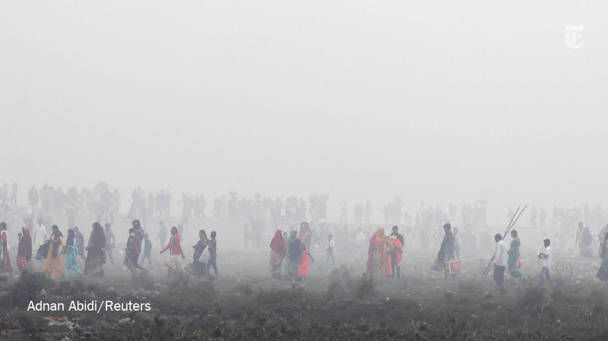
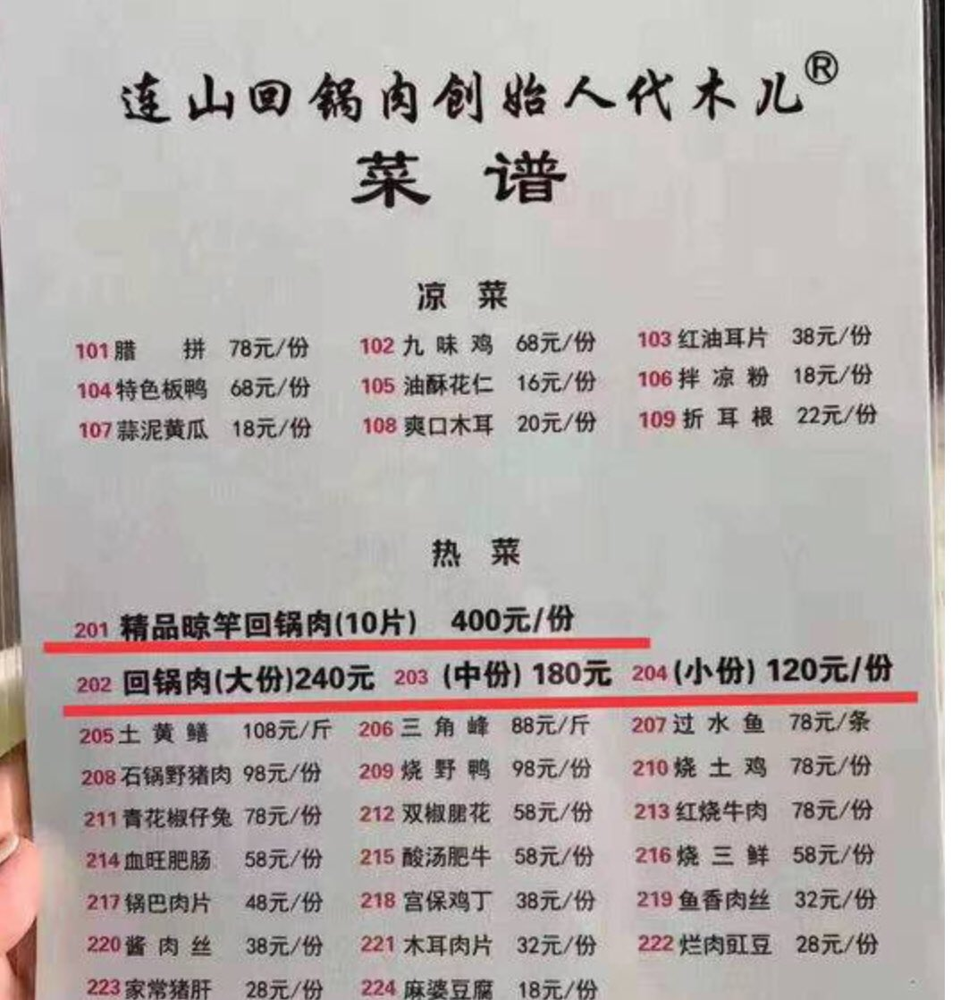

[11月06日 00:14]    GFHG SDKM   @zyx_yny    有冇英文文宣手足 https://twitter.com/jim97147570/status/1191499676475785216 …  :speech_balloon:评:0 :+1:赞:0 :globe_with_meridians:转:0  

[11月05日 23:40]    GFHG SDKM   @zyx_yny    We are all V  :speech_balloon:评:0 :+1:赞:1 :globe_with_meridians:转:0  

[11月05日 23:37]    GFHG SDKM   @zyx_yny    Today 5/11 is the day that #AntiMaskLaw has been introduced for one month.
But it can’t stop us. #HKprotesters will not surrender.
#VforVendetta  :speech_balloon:评:1 :+1:赞:4 :globe_with_meridians:转:2  

[11月05日 23:25]    BBC News 中文   @bbcchinese    所有尸体的腹部都有一道细小的剖口，像手术刀切口一样利落精准。心和肝都不见了。这是谁干的？怎么干的？ https://bbc.in/2NGrKsw   :speech_balloon:评:13 :+1:赞:25 :globe_with_meridians:转:7  

[11月05日 22:52]    GFHG SDKM   @zyx_yny    Here is the video  :speech_balloon:评:4 :+1:赞:82 :globe_with_meridians:转:91  

[11月05日 22:27]    财经真相   @caijingxiang    前一段时间纳瓦罗说12月的关税是为了第二阶段谈判准备的筹码，美国官方至今没有明确表示完全取消这笔关税，只是回应说双方谈的很好，很快签第一阶段的协议，但是市场吊诡的是不但计价了正式签协议，还把12月份取消关税纳入其中，乐观情绪甚至把中方单边提出的取消9月份关税也计价了！  :speech_balloon:评:5 :+1:赞:19 :globe_with_meridians:转:4  

[11月05日 22:14]    财经真相   @caijingxiang    Politico和英国金融时报都报道称中国希望取消9月加征的关税，甚至争取取消所有关税，对此美国方面还未对此作出回应，但是市场竟然提前计价了，股市更是创下新高。现在特朗普的麻烦是，如果否认那么股市就会大跌，如果公开证实传言，则会对引发特朗普退让的指责，股市绑架下，干脆只能装聋作哑！ https://twitter.com/reuterscn/status/1191567937011961859 …  :speech_balloon:评:20 :+1:赞:70 :globe_with_meridians:转:20  

[11月05日 22:09]    新闻大吐槽   @TuCaoFakeNews    #Hongkongers https://twitter.com/tucaofakenews/status/1191665290267910145 …  :speech_balloon:评:0 :+1:赞:9 :globe_with_meridians:转:2  

[11月05日 22:05]    新闻大吐槽   @TuCaoFakeNews    【維園採訪家庭主婦nono】(字幕) 全世界人 .開始覺醒，認識到共產黨的鎮壓 殘害 沒人性 .  :speech_balloon:评:0 :+1:赞:29 :globe_with_meridians:转:19  

[11月05日 22:03]    新闻大吐槽   @TuCaoFakeNews    Hero don’t always wear cape. #StandWithHongKong https://twitter.com/tucaofakenews/status/1191478041672744960 …  :speech_balloon:评:0 :+1:赞:7 :globe_with_meridians:转:5  

[11月05日 22:02]    财经真相   @caijingxiang    随着贸易战深入，美国贸易逆差缩小值创下三年最高，特朗普真的成功了吗？ https://twitter.com/zerohedge/status/1191712574989066240 …  :speech_balloon:评:7 :+1:赞:28 :globe_with_meridians:转:6  

[11月05日 22:02]    新闻大吐槽   @TuCaoFakeNews    勇敢
#standwithHongKong
#hongkongpolicestate
#freehongkong
#fightforfreedom https://twitter.com/TuCaoFakeNews/status/1191478041672744960 …  :speech_balloon:评:1 :+1:赞:11 :globe_with_meridians:转:5  

[11月05日 22:00]    新闻大吐槽   @TuCaoFakeNews    這一曲包含了多少心酸與無奈....  :speech_balloon:评:0 :+1:赞:8 :globe_with_meridians:转:1  

[11月05日 21:56]    新闻大吐槽   @TuCaoFakeNews     https://twitter.com/tucaofakenews/status/1191665290267910145 …  :speech_balloon:评:0 :+1:赞:9 :globe_with_meridians:转:3  

[11月05日 21:42]    新闻大吐槽   @TuCaoFakeNews    The guy was playing “Glory to Hongkong” in London! It is almost could not to do it publicly in Hongkong now. https://twitter.com/tucaofakenews/status/1191665290267910145 …  :speech_balloon:评:0 :+1:赞:7 :globe_with_meridians:转:7  

[11月05日 21:34]    新闻大吐槽   @TuCaoFakeNews    来一个口琴版  :speech_balloon:评:1 :+1:赞:21 :globe_with_meridians:转:4  

[11月05日 21:32]    新闻大吐槽   @TuCaoFakeNews    #GloryToHongKong https://twitter.com/TuCaoFakeNews/status/1191665290267910145 …  :speech_balloon:评:0 :+1:赞:13 :globe_with_meridians:转:5  

[11月05日 21:31]    新闻大吐槽   @TuCaoFakeNews    ！ https://twitter.com/tucaofakenews/status/1191665290267910145 …  :speech_balloon:评:0 :+1:赞:9 :globe_with_meridians:转:1  

[11月05日 21:30]    纽约时报中文网   @nytchinese    #观点 气候变化的一个主要原因一直被忽视或轻视：服装。一项研究显示，服装和鞋类行业的温室气体排放量占全球的8%，几乎相当于整个欧盟。如果不进行干预，到2030年，该行业对气候的影响将增加近一半。
每个人都能在让服装变得可持续方面发挥作用，你能做些什么？ http://nyti.ms/2CdlbIt   :speech_balloon:评:14 :+1:赞:17 :globe_with_meridians:转:6  

[11月05日 21:23]    新闻大吐槽   @TuCaoFakeNews    传播、传播，让中共的谎言与罪恶在阳光下裸奔！香港是直播台，香港是展示厅！——中共的每一桩罪恶，每一件暴行，每一句谎言，每一个阴谋，都将通过香港传播到世界各地！靠欺骗维持统治的中共暴政，终于遇到了一个强大的对手与克星——勇敢智慧的香港人民+互联网时代！香港加油  :speech_balloon:评:0 :+1:赞:13 :globe_with_meridians:转:4  

[11月05日 21:23]    新闻大吐槽   @TuCaoFakeNews    A lots of people stand with Hong Kong in the world.

#StandWithHongKong
#HKHumanRightsandDemocracyAct
#5DemandsNot1Less
#HKpoliceforcemustrestructuring https://twitter.com/TuCaoFakeNews/status/1191665290267910145 …  :speech_balloon:评:0 :+1:赞:6 :globe_with_meridians:转:1  

[11月05日 21:19]    新闻大吐槽   @TuCaoFakeNews    黑警冇人性

#HKpolicebrutality https://twitter.com/TuCaoFakeNews/status/1191478041672744960 …  :speech_balloon:评:0 :+1:赞:8 :globe_with_meridians:转:7  

[11月05日 21:07]    BBC News 中文   @bbcchinese    “刷脸”时代来临，你是否担心刷完之后可能面对的风险？ https://bbc.in/2NjKizN   :speech_balloon:评:28 :+1:赞:13 :globe_with_meridians:转:9  

[11月05日 21:06]    新闻大吐槽   @TuCaoFakeNews    我們要揭露真相，為什麼香港一夜之間港警也變得如此兇殘暴戾的原因！簡直是大開殺戒對付民眾！  :speech_balloon:评:0 :+1:赞:3 :globe_with_meridians:转:2  

[11月05日 21:00]    纽约时报中文网   @nytchinese    习近平发言的大部分内容都着重于保证中国将维持其长期的经济改革和开放计划。
许多西方经济学家认为，习近平执政七年以来，已逐渐将经济转回对国内产业、尤其是国有企业的依赖。 http://nyti.ms/33huenv   :speech_balloon:评:11 :+1:赞:10 :globe_with_meridians:转:0  

[11月05日 20:57]    新闻大吐槽   @TuCaoFakeNews    真好听。
在香港这样弹琴，估计也会被中共媒体称作暴徒吧。

你知道，我为了学习研究新闻要用，手机上有正常的新闻APP，也有中共的洗脑新闻APP，于是每天看新闻内心好分裂。党媒上，感觉香港街上不管做什么都是暴徒，而所有的港警都是文明理智公正，但是所有接受采访的香港市民都心向共产党。  :speech_balloon:评:1 :+1:赞:6 :globe_with_meridians:转:1  

[11月05日 20:52]    新闻大吐槽   @TuCaoFakeNews    連結我與中共的，只有痛恨！願天滅中共，灰飛煙滅！  :speech_balloon:评:2 :+1:赞:11 :globe_with_meridians:转:1  

[11月05日 20:52]    新闻大吐槽   @TuCaoFakeNews    Hong Kong young people play the piano version of "Glory to Hong Kong" at St. Pancras International Station in London!
 Far away from the foreign country, his anger and anger accompanied his powerful fingertips on the keys and spread in the air! https://twitter.com/tucaofakenews/status/1191665290267910145 …  :speech_balloon:评:1 :+1:赞:23 :globe_with_meridians:转:9  

[11月05日 20:49]    新闻大吐槽   @TuCaoFakeNews    救救我們的年青人吧，他們是這麼優秀。 https://twitter.com/TuCaoFakeNews/status/1191665290267910145 …  :speech_balloon:评:2 :+1:赞:31 :globe_with_meridians:转:6  

[11月05日 20:35]    新闻大吐槽   @TuCaoFakeNews    帥！ https://twitter.com/tucaofakenews/status/1191665290267910145 …  :speech_balloon:评:0 :+1:赞:7 :globe_with_meridians:转:7  

[11月05日 20:30]    纽约时报中文网   @nytchinese    美国国家卫生研究院说，一些接受调查的研究人员用美国政府资助、美国机构拥有的研究成果，已经在中国获取了专利。
政府官员和大学管理人员说，还有些人涉嫌在中国设立实验室，秘密地复制他们在美国的研究。 http://nyti.ms/2pFUQA0   :speech_balloon:评:65 :+1:赞:12 :globe_with_meridians:转:4  

[11月05日 20:30]    纽约时报中文网   @nytchinese    中国起初否认其工厂违反了对CFC-11的禁令，但政府也承诺取缔其发现的任何非法生产。周三，该国向《蒙特利尔议定书》缔约国会议提交报告，介绍了中方的行动。
中国表示专门加强了监控和执法，向检查人员提供设备，以便立即发现CFC-11的存在，并建立了六个地区检测实验室。 http://nyti.ms/32j2Owc   :speech_balloon:评:7 :+1:赞:4 :globe_with_meridians:转:0  

[11月05日 20:29]    新闻大吐槽   @TuCaoFakeNews    We can't let those youths float to the surface of the sea, and build a list one by one!
 https://www.epochtimes.com/b5/19/10/19/n11598613.htm …
Leaders of democratic countries all over the world must immediately unite and help Hong Kong. Otherwise, history will record how cold-blooded human beings now.https://twitter.com/TuCaoFakeNews/status/1191665290267910145 …  :speech_balloon:评:0 :+1:赞:7 :globe_with_meridians:转:3  

[11月05日 20:02]    纽约时报中文网   @nytchinese    #新新世界 在科技铁幕拉下之际，字节跳动是少有的能在全球互联网取得成功的中国科技公司。
但生活在一个由中国支持的社交媒体影响的世界里，一些美国人为该应用构成的潜在国家安全和隐私威胁感到担忧。by @LiYuan6 http://nyti.ms/36ByQXG   :speech_balloon:评:17 :+1:赞:19 :globe_with_meridians:转:7  

[11月05日 20:01]    BBC News 中文   @bbcchinese    【前苏联领袖戈尔巴乔夫回望历史 告诫全球废除核武】在柏林围墙倒下，共产东德倒台30周年之际，苏联最后一任总统戈尔巴乔夫接受BBC驻莫斯科记者罗森伯格（Steve Rosenberg）专访。他回忆当年为何决定不介入东德局势之余，促请世界各国齐心裁撤核武器。 https://bbc.in/2NfrYrn   :speech_balloon:评:13 :+1:赞:20 :globe_with_meridians:转:8  

[11月05日 19:54]    老司机   @h5lpykl7tp6jjop    中共患有强迫性精神病！它什么都想控制，上管天下管地，中间管空气，管思想管情绪还管生殖器！大街小巷楼房商场任何角落都有无数监视器，买菜刀剪刀实名制登记，上网登记，乘车乘船乘机登记，什么人脸视别，动态识别，挖空心思来监控人民，可它仍然不放心！莎翁说过：无限的权力只会毁掉它的占有者！  :speech_balloon:评:2 :+1:赞:46 :globe_with_meridians:转:7  

[11月05日 19:51]    纽约时报中文网   @nytchinese    习近平周二在上海的中国国际进口博览会开幕式上强调了对自由贸易原则的广泛支持，并承诺将坚持改革开放的基本国策、欢迎外国投资。
他没有提及中美贸易战，但通过谴责单边主义间接批评了特朗普政府。 http://nyti.ms/33huenv   :speech_balloon:评:10 :+1:赞:15 :globe_with_meridians:转:1  

[11月05日 19:25]    墙国铁拳现世报😷   @Socialistfist    丈夫民警妻子教师，生第三胎被单位双双开除。

#社会主义铁拳  :speech_balloon:评:26 :+1:赞:190 :globe_with_meridians:转:63  

[11月05日 19:01]    BBC News 中文   @bbcchinese    台湾总统蔡英文上任后，已有7个邦交国与台湾断交。而洪都拉斯财政部长表示，台湾将提供3亿美元贷款，学者认为这笔贷款目的是巩固邦交。 https://bbc.in/2py5Dwn   :speech_balloon:评:55 :+1:赞:41 :globe_with_meridians:转:11  

[11月05日 18:43]    GFHG SDKM   @zyx_yny    We put the student in our prayers. https://twitter.com/li8jim/status/1191621688909123584 …  :speech_balloon:评:259 :+1:赞:2568 :globe_with_meridians:转:1552  

[11月05日 18:31]    BBC News 中文   @bbcchinese    美国已通知联合国，正式开启退出《巴黎协议》的程序，为期一年。
这将对全球气候产生怎样影响？ https://bbc.in/2JSwEBp   :speech_balloon:评:30 :+1:赞:42 :globe_with_meridians:转:8  

[11月05日 18:23]    财经真相   @caijingxiang    提前计价取消9月份的关税，这个明显是忽悠！  :speech_balloon:评:7 :+1:赞:24 :globe_with_meridians:转:4  

[11月05日 18:22]    财经真相   @caijingxiang    一外资行交易员表示，近日中美谈判利好不断，市场普遍处于乐观氛围中，加上此前并未过多期望已加征的关税能够取消，今天媒体相关报导远超预期，推动人民币强势走升。
“市场现在很敏感，今天这波走升比前两天要坚决一些，“不过对自营盘而言现在去追并不是好的策略，更多是在区间的边界上进行操作。 https://twitter.com/reuterscn/status/1191654970690588672 …  :speech_balloon:评:5 :+1:赞:41 :globe_with_meridians:转:12  

[11月05日 18:12]    GFHG SDKM   @zyx_yny    When this student dies over #extraditionlaw, his blood is on Commiessar Lam's hands!  :speech_balloon:评:327 :+1:赞:1877 :globe_with_meridians:转:1414  

[11月05日 17:51]    BBC News 中文   @bbcchinese    该名科大学生接受多次手术。综合香港传媒报道，他的情况并不乐观。  :speech_balloon:评:86 :+1:赞:174 :globe_with_meridians:转:113  

[11月05日 17:30]    纽约时报中文网   @nytchinese    林郑月娥能否继续担任香港特首，取决于习近平的明确支持，此次表态可能会让她松一口气，此前一直有传言称，习近平可能会在抗议活动平息后要求她下台。
不过，林郑月娥的政治前途可能取决于如何处理中国领导人上周宣布的计划，即在香港执行更严厉的“国家安全”措施。 http://nyti.ms/33lRZuM   :speech_balloon:评:9 :+1:赞:14 :globe_with_meridians:转:3  

[11月05日 17:00]    纽约时报中文网   @nytchinese    周一公布的数据显示，自2012年以来，被禁的破坏臭氧层的气体CFC-11排放量意外上升，但在过去两年中，排放量似乎有所下降。
中国曾被认为是主要排放来源。调查表明，如今中国在打击非法生产方面取得了进展。 http://nyti.ms/32j2Owc   :speech_balloon:评:4 :+1:赞:15 :globe_with_meridians:转:3  

[11月05日 16:32]    财经真相   @caijingxiang    破7前是顶，破7后是底！这个基本面还未改变，接下来要看央行中间价会不会大举破7！  :speech_balloon:评:7 :+1:赞:66 :globe_with_meridians:转:5  

[11月05日 16:21]    财经真相   @caijingxiang    人民币涨破7了，而且是在央行MLF降息的情况下进行的，宽松货币汇率升值，这操作就问你服不服！第一阶段协议的利好消化的差不多了，情绪乐观有点过度了，甚至开始计价减掉部分产品的关税，我的策略是继续做空，随便拉！  :speech_balloon:评:39 :+1:赞:219 :globe_with_meridians:转:36  

[11月05日 16:00]    纽约时报中文网   @nytchinese    美国正在打击生物医学领域知识产权盗窃，180起涉及潜在知识产权盗窃的案子几乎均涉及华裔科学家。这些调查加剧了对中国利用美国科学体系的相对开放性从事经济间谍活动的担忧。
一些批评人士称，随着中美地缘政治竞争加剧，调查正在不公平地把华裔科学家当作审查对象。 http://nyti.ms/2pFUQA0   :speech_balloon:评:86 :+1:赞:84 :globe_with_meridians:转:35  

[11月05日 15:35]    纽约时报中文网   @nytchinese    据新华社报道，习近平周一晚间在上海会见林郑月娥时对她表示了支持。林郑月娥向习近平介绍了香港的事态发展；习近平表示对林郑“高度信任”、“充分肯定”。
与此同时，习近平还提醒林郑月娥，北京支持对抗议活动采取严厉措施。 http://nyti.ms/33lRZuM   :speech_balloon:评:62 :+1:赞:94 :globe_with_meridians:转:48  

[11月05日 15:01]    BBC News 中文   @bbcchinese    香港《逃犯条例》修订引发的抗议活动持续5个月后，中国国家主席习近平会见香港特首林郑月娥，肯定她的工作。大家对林郑月娥的工作表现有什么看法？ https://bbc.in/2NGSUiL   :speech_balloon:评:106 :+1:赞:78 :globe_with_meridians:转:21  

[11月05日 15:00]    纽约时报中文网   @nytchinese    #观点 现在Facebook上有一则广告，称拜登给了乌克兰总检察长10亿美元，让后者不要调查自己的儿子。这不是捍卫言论自由，马克，而是在攻击真相。
你我都希望保护言论，确保没有人因为说了或写了不受欢迎的东西而遭监禁或杀害，而不是确保谎言能够不受约束地进入美国选民的视线。 http://nyti.ms/32jEgDk   :speech_balloon:评:11 :+1:赞:11 :globe_with_meridians:转:6  

[11月05日 14:30]    纽约时报中文网   @nytchinese    为了改善空气质量，周一，新德里的官员开始对私家车实行单双日车牌限号。
尽管如此，周一大部分城市的空气质量指数仍停留在被认为是“非常差”的400左右。 http://nyti.ms/2WKE7rG   :speech_balloon:评:1 :+1:赞:0 :globe_with_meridians:转:4  

[11月05日 14:01]    BBC News 中文   @bbcchinese    林郑月娥早前表示，香港目前面对的经济下行比当年非典和金融风暴等时期更严峻，但有经济学者不认同。香港当年经历政治风波及金融危机时，情况有多差？目前情况会否步当年后尘？ https://bbc.in/2NgwplJ   :speech_balloon:评:34 :+1:赞:29 :globe_with_meridians:转:10  

[11月05日 14:00]    纽约时报中文网   @nytchinese    #观点 我钦佩你对言论自由的坚定信仰。我从第一修正案中获益良多。最重要的是，它是我们民主的基石，需要坚决贯彻。
但是，但Facebook上的虚假政治广告不是捍卫言论自由，而是在用疯狂的谎言把水搅浑。谎言对我们的选举、我们的生活和我们孩子的生活有着非常真实和危险的影响。 http://nyti.ms/32jEgDk   :speech_balloon:评:19 :+1:赞:138 :globe_with_meridians:转:48  

[11月05日 13:30]    纽约时报中文网   @nytchinese    周末，印度新德里空气污染“破表”，政府宣布进入公共卫生紧急状态。官员们开始限制汽车使用、关闭小学，并暂停建设项目。NASA的卫星图像显示，印度北部大片平原被雾霾笼罩。
在许多地区，致命颗粒物的水平达到了全球安全限值的60倍左右，相当于每天吸烟超过两包。 http://nyti.ms/2WKE7rG   :speech_balloon:评:21 :+1:赞:45 :globe_with_meridians:转:27  

[11月05日 13:00]    BBC News 中文   @bbcchinese    让我们告诉你威士忌的由来！  :speech_balloon:评:9 :+1:赞:63 :globe_with_meridians:转:26  

[11月05日 13:00]    纽约时报中文网   @nytchinese    #每日一词 Oligarch，寡头。欧盟每年花650亿美元补贴农业，但时报调查发现，在整个匈牙利及中欧和东欧的大部分地区，这些钱大多流向寡头(oligarchs)和民粹主义者的口袋。
Oligarch意为寡头政治家、寡头统治集团成员；寡头政治指的是由少数人掌握政权的统治形式。更多简报内容： http://nyti.ms/34sLgzi   :speech_balloon:评:6 :+1:赞:7 :globe_with_meridians:转:3  

[11月05日 12:00]    BBC News 中文   @bbcchinese    70多年前的世界首富、大英帝国印度王公米尔·奥斯曼·阿里·汗至今仍是印度历史上最富有的人。 https://bbc.in/2Cf2vrT   :speech_balloon:评:8 :+1:赞:53 :globe_with_meridians:转:19  

[11月05日 12:00]    纽约时报中文网   @nytchinese    #今日图片 印度首都新德里，一个烟雾蒙蒙的周一早晨。过去几天，这座城市的空气污染攀升至新高。
官员已经开始限制车辆使用，并关闭学校。在许多地区，空气的有害性相当于每天吸两包以上的香烟。
更多简报内容： http://nyti.ms/34sLgzi   :speech_balloon:评:2 :+1:赞:3 :globe_with_meridians:转:2  

[11月05日 11:30]    纽约时报中文网   @nytchinese    中国有禁止性别歧视和怀孕歧视的法律，还有确保98天带薪产假的生育政策，但执行力度不够。
因不公正的对待而寻求法律救济的女性往往只能得到微薄的补偿。她们担心一旦发生冲突，不管是怎样的冲突，都会毁掉她们再找其他工作的机会。而且，她们也害怕公开发声会遭到报复。 http://nyti.ms/34vltX4   :speech_balloon:评:12 :+1:赞:22 :globe_with_meridians:转:4  

[11月05日 11:29]    财经真相   @caijingxiang    MLF降息5基点，股市涨疯了！  :speech_balloon:评:22 :+1:赞:133 :globe_with_meridians:转:20  

[11月05日 11:11]    老司机   @h5lpykl7tp6jjop    好文转发：我是怎样变成一个孤家寡人的
文/豆腐
2019/11/03  :speech_balloon:评:0 :+1:赞:22 :globe_with_meridians:转:9  

[11月05日 11:00]    BBC News 中文   @bbcchinese    你买咖啡的时候，有没有发觉大中小三种容量，中杯价格几乎和大杯差不多，很多人就是为了贪小便宜而多花了钱，反而还觉得自己赚了。 https://bbc.in/2qhs8pb   :speech_balloon:评:4 :+1:赞:102 :globe_with_meridians:转:42  

[11月05日 11:00]    纽约时报中文网   @nytchinese    • 英国卡车惨案追踪：越南周一拘捕八名涉案嫌疑人，另有两人在上周被捕。越南官员誓言“打击和铲除这些将非法移民带到英国的团伙”。调查人员仍在确认受害者的死因和身份。
• 麦当劳宣布解雇首席执行官伊斯特布鲁克。此前他违反公司政策与一名员工发生亲密关系。更多简报内容： http://nyti.ms/34sLgzi   :speech_balloon:评:3 :+1:赞:4 :globe_with_meridians:转:4  

[11月05日 10:49]    BBC News 中文   @bbcchinese    习近平在香港“反送中”运动爆发后，首次开腔肯定香港特首林郑月娥的工作。  :speech_balloon:评:146 :+1:赞:384 :globe_with_meridians:转:123  

[11月05日 10:43]    老司机   @h5lpykl7tp6jjop    无法统计有多少人在问候这位专家全家！  :speech_balloon:评:9 :+1:赞:54 :globe_with_meridians:转:24  

[11月05日 10:06]    纽约时报中文网   @nytchinese    China’s Xi Endorses Hong Kong’s Embattled Chief Executive. Vast Dragnet Targets Theft of Biomedical Secrets for China. Chinese Working Mothers Say They Are Fired or Sidelined. How to say "oligarch" in Chinese? Follow us @nytchinese https://cn.nytimes.com/morning-brief/20191105/china-us-scientists-xi-lam/ …  :speech_balloon:评:3 :+1:赞:22 :globe_with_meridians:转:11  

[11月05日 09:59]    纽约时报中文网   @nytchinese    早安！今日重点新闻包括：
习近平公开力挺林郑月娥；美国调查多名华裔科学家；美国正式启动退出巴黎协议议程；臭氧“杀手“气体排放量显著下降；中国职场妈妈的生存困境；特朗普政府正式启动退出巴黎协议议程；麦当劳宣布解雇首席执行官……NYT简报带你速览今日要闻。 http://nyti.ms/34sLgzi   :speech_balloon:评:20 :+1:赞:62 :globe_with_meridians:转:15  

[11月05日 09:54]    BBC News 中文   @bbcchinese    这个霉菌的用途，真的令人意想不到！  :speech_balloon:评:0 :+1:赞:39 :globe_with_meridians:转:14  

[11月05日 09:51]    老司机   @h5lpykl7tp6jjop    香港街頭，共軍指揮官普通話訓斥下屬軍人：

這是大陸軍人參與鎮壓香港市民的鐵證！

保存好，看西方國家裝聾作啞到幾時？！  :speech_balloon:评:33 :+1:赞:295 :globe_with_meridians:转:221  

[11月05日 09:47]    墙国铁拳现世报😷   @Socialistfist    发推后，该用户微博改名，头像更换，微博删除至2016年内容  :speech_balloon:评:2 :+1:赞:83 :globe_with_meridians:转:9  

[11月05日 09:42]    BBC News 中文   @bbcchinese    蒙娜丽莎有个妹妹？ https://bbc.in/2Ng5pCT   :speech_balloon:评:3 :+1:赞:16 :globe_with_meridians:转:9  

[11月05日 09:26]    老司机   @h5lpykl7tp6jjop    中共引进马列的邪恶理论制造了共产主义神话，它们砸烂了中国几千年沉重的传统，得到了政权，可是这个叫共产主义的神话在饿死了几千万人之后在人们心中轰然崩塌，但政权却在它们黑暗的组织系统掌控下牢牢掌握，它们不停的编造各种理论，但始终不能涉及文明进步，因为阴暗邪恶的魔鬼要吸干人血进入地狱！  :speech_balloon:评:2 :+1:赞:11 :globe_with_meridians:转:3  

[11月05日 09:18]    财经真相   @caijingxiang    中国央行：为推动大额现金管理工作，探索大额现金管理实现路径，中国人民银行起草了《中国人民银行关于在河北省、浙江省、深圳市试点开展大额现金管理的通知（公开征求意见稿）》。  :speech_balloon:评:23 :+1:赞:162 :globe_with_meridians:转:63  

[11月05日 08:53]    老司机   @h5lpykl7tp6jjop    突发！王思聪宣布破产， 股份被冻结......
破巢之下，岂有完卵？2019是中共大崩溃总爆发的开始，各种消息不断出现，大家留心看，天天都有新鲜不断出现！

 https://mp.weixin.qq.com/s/TfGVob-BNFq2kk0WpovqDA …  :speech_balloon:评:18 :+1:赞:157 :globe_with_meridians:转:49  

[11月05日 08:18]    BBC News 中文   @bbcchinese    “来自其他宇宙的”暗能量 https://bbc.in/32ggs3t   :speech_balloon:评:3 :+1:赞:9 :globe_with_meridians:转:2  

[11月05日 07:50]    BBC News 中文   @bbcchinese    中国外交部副部长乐玉成说，“存在的几个问题会在今年得到解决”。他还说，“只要印度准备好了，任何时候都欢迎（印度）加入。” https://bbc.in/33iq3rA   :speech_balloon:评:17 :+1:赞:21 :globe_with_meridians:转:7  

[11月05日 07:05]    BBC News 中文   @bbcchinese    新措施包括容许台湾企业参与5G技术研发和让台湾运动员以本土内援身份参加中国大陆的体育职业联赛等等。 https://bbc.in/2NG0ryj   :speech_balloon:评:73 :+1:赞:129 :globe_with_meridians:转:40  

[11月05日 04:45]    老司机   @h5lpykl7tp6jjop    猪肉上涨，粮食上涨，天然气上涨，全面上涨已经开始，群众情绪保持稳定！  :speech_balloon:评:30 :+1:赞:191 :globe_with_meridians:转:92  

[11月05日 04:28]    凡賽堤/FORSETI   @FecharCCP    急救香港  #HKSOS！！！

天滅流氓政權！！！極權殺人恐怖組織正在用各種兇殘手段殺害我們的同胞..................................................

流氓政權的極權殺人恐怖組織蓄意謀殺香港年輕人！（13）

被暴力制服的年輕人已經休克，還殘暴折斷手！

兇殘，殘暴手段令人髮指到已經超越納粹！  :speech_balloon:评:0 :+1:赞:3 :globe_with_meridians:转:9  

[11月05日 04:25]    凡賽堤/FORSETI   @FecharCCP    急救香港  #HKSOS！！！

天滅流氓政權！！！極權殺人恐怖組織正在用各種兇殘手段殺害我們的同胞..................................................

流氓政權的極權殺人恐怖組織蓄意謀殺香港年輕人！（12）
兇殘，殘暴手段令人髮指到已經超越納粹！
天滅流氓政權！！！  :speech_balloon:评:1 :+1:赞:8 :globe_with_meridians:转:9  

[11月05日 04:24]    凡賽堤/FORSETI   @FecharCCP    急救香港  #HKSOS！！！

天滅流氓政權！！！極權殺人恐怖組織正在用各種兇殘手段殺害我們的同胞..................................................

流氓政權的極權殺人恐怖組織蓄意謀殺香港年輕人！（11）
兇殘，殘暴手段令人髮指到已經超越納粹！
天滅流氓政權！！！  :speech_balloon:评:0 :+1:赞:49 :globe_with_meridians:转:45  

[11月05日 04:23]    凡賽堤/FORSETI   @FecharCCP    急救香港  #HKSOS！！！

天滅流氓政權！！！極權殺人恐怖組織正在用各種兇殘手段殺害我們的同胞..................................................

流氓政權的極權殺人恐怖組織蓄意謀殺香港年輕人！（10）
兇殘，殘暴手段令人髮指到已經超越納粹！
天滅流氓政權！！！  :speech_balloon:评:0 :+1:赞:4 :globe_with_meridians:转:5  

[11月05日 04:19]    凡賽堤/FORSETI   @FecharCCP    急救香港  #HKSOS！！！

天滅流氓政權！！！極權殺人恐怖組織正在用各種兇殘手段殺害我們的同胞..................................................

流氓政權的極權殺人恐怖組織蓄意謀殺香港年輕人！（9）
兇殘，殘暴手段令人髮指到已經超越納粹！
天滅流氓政權！！！  :speech_balloon:评:1 :+1:赞:6 :globe_with_meridians:转:7  

[11月05日 04:16]    凡賽堤/FORSETI   @FecharCCP    急救香港  #HKSOS！！！

天滅流氓政權！！！極權殺人恐怖組織正在用各種兇殘手段殺害我們的同胞..................................................

流氓政權的極權殺人恐怖組織蓄意謀殺香港年輕人！（8）
兇殘，殘暴手段令人髮指到已經超越納粹！
天滅流氓政權！！！  :speech_balloon:评:1 :+1:赞:41 :globe_with_meridians:转:57  

[11月05日 04:13]    凡賽堤/FORSETI   @FecharCCP    急救香港SOS！！！

天滅流氓政權！！！極權殺人恐怖組織正在用各種兇殘手段殺害我們的同胞..................................................

流氓政權的極權殺人恐怖組織蓄意謀殺香港年輕人！（7）
兇殘，殘暴手段令人髮指到已經超越納粹！
天滅流氓政權！！！  :speech_balloon:评:2 :+1:赞:10 :globe_with_meridians:转:15  

[11月05日 04:10]    凡賽堤/FORSETI   @FecharCCP    急救香港SOS！！！

天滅流氓政權！！！極權殺人恐怖組織正在用各種兇殘手段殺害我們的同胞..................................................

流氓政權的極權殺人恐怖組織蓄意謀殺香港年輕人！（6）
兇殘，殘暴手段令人髮指到已經超越納粹！
天滅流氓政權！！！  :speech_balloon:评:1 :+1:赞:39 :globe_with_meridians:转:40  

[11月05日 04:07]    凡賽堤/FORSETI   @FecharCCP    急救香港SOS！！！

天滅流氓政權！！！極權殺人恐怖組織正在用各種兇殘手段殺害我們的同胞..................................................

流氓政權的極權殺人恐怖組織蓄意謀殺香港年輕人！（5）
兇殘，殘暴手段令人髮指到已經超越納粹！
天滅流氓政權！！！  :speech_balloon:评:0 :+1:赞:2 :globe_with_meridians:转:0  

[11月05日 04:06]    凡賽堤/FORSETI   @FecharCCP    急救香港SOS！！！

天滅流氓政權！！！極權殺人恐怖組織正在用各種兇殘手段殺害我們的同胞..................................................

流氓政權的極權殺人恐怖組織蓄意謀殺香港年輕人！（3）
兇殘，殘暴手段令人髮指到已經超越納粹！
天滅流氓政權！！！  :speech_balloon:评:1 :+1:赞:9 :globe_with_meridians:转:14  

[11月05日 04:05]    凡賽堤/FORSETI   @FecharCCP    急救香港SOS！！！

天滅流氓政權！！！極權殺人恐怖組織正在用各種兇殘手段殺害我們的同胞..................................................

流氓政權的極權殺人恐怖組織蓄意謀殺香港不同意見的議員！（2）

兇殘，殘暴手段令人髮指到已經超越納粹！
天滅流氓政權！！！  :speech_balloon:评:0 :+1:赞:3 :globe_with_meridians:转:3  

[11月05日 04:04]    凡賽堤/FORSETI   @FecharCCP    急救香港SOS！！！

天滅流氓政權！！！極權殺人恐怖組織正在用各種兇殘手段殺害我們的同胞..................................................

流氓政權的極權殺人恐怖組織蓄意謀殺香港年輕人！（1）
兇殘，殘暴手段令人髮指到已經超越納粹！
天滅流氓政權！！！  :speech_balloon:评:1 :+1:赞:8 :globe_with_meridians:转:6  

[11月05日 03:49]    GFHG SDKM   @zyx_yny    Today's Daily at King Cross.
A Hong Kong youth was playing <Glory to Hong Kong> piano version in St. Pancras Int station.  :speech_balloon:评:108 :+1:赞:1992 :globe_with_meridians:转:1037  

[11月04日 22:56]    BBC News 中文   @bbcchinese    【经典文章回顾】马克龙，这位法兰西历史上最年轻的总统，从政之路与个人情感都有很多不落窠臼的故事。 https://bbc.in/34sy0L1   :speech_balloon:评:6 :+1:赞:18 :globe_with_meridians:转:7  

[11月04日 22:43]    墙国铁拳现世报😷   @Socialistfist    #社会主义铁拳 https://twitter.com/Time_HorizonX/status/1191288775348908032 …  :speech_balloon:评:15 :+1:赞:296 :globe_with_meridians:转:78  

[11月04日 22:26]    BBC News 中文   @bbcchinese    【经典文章回顾】人类的任何一次进步，都有人付出你难以想像的代价。 https://bbc.in/32cMRrt   :speech_balloon:评:10 :+1:赞:220 :globe_with_meridians:转:112  

[11月04日 22:04]    老司机   @h5lpykl7tp6jjop    希望国内多出现这样的作品。  :speech_balloon:评:23 :+1:赞:430 :globe_with_meridians:转:244  

[11月04日 21:10]    BBC News 中文   @bbcchinese    双方是自愿的，CEO离婚后独身也是自由的。但是，一个是老板，一个是下属，谈恋爱就坏了公司的规矩。 https://bbc.in/2NeVL3t   :speech_balloon:评:20 :+1:赞:80 :globe_with_meridians:转:26  

[11月04日 17:54]    老司机   @h5lpykl7tp6jjop    今年过年不吃肉啊，不吃肉啊不吃肉！吃肉滚到美国去啊，美国去啊美国去……
好文转发，有删减，文/豆府  :speech_balloon:评:2 :+1:赞:46 :globe_with_meridians:转:25  

[11月04日 13:33]    财经真相   @caijingxiang    猪肉涨了，鸡肉也要涨了！  :speech_balloon:评:51 :+1:赞:189 :globe_with_meridians:转:60  

[11月04日 11:34]    GFHG SDKM   @zyx_yny    Just in: Local paper @mingpaocom confirms that this first-aid volunteer is a freshman from Hong Kong Shue Yan University. Holding a certificate in first aid, he was amply performing his duties on Nov 2, says the student union. He is in stable condition. Photo from @cityusucbc  :speech_balloon:评:6 :+1:赞:190 :globe_with_meridians:转:140  

[11月04日 10:28]    GFHG SDKM   @zyx_yny    A human Ear Necklace ——  #CarrieLam’s new jewelry delivered from last night‘s pro Beijing attack. 
An ear，several eyes and dozens of young lives of HongKong protesters are all in her bloody collection.
Enough is enough！
#HongKongProtests #StandWithHongKong  :speech_balloon:评:51 :+1:赞:809 :globe_with_meridians:转:605  

[11月04日 10:26]    GFHG SDKM   @zyx_yny    Facebook have blocked the share function of photos that reflects the fact of #HKPoliceTerrorists
#StandWithHongKong  :speech_balloon:评:2 :+1:赞:17 :globe_with_meridians:转:27  

[11月04日 09:40]    GFHG SDKM   @zyx_yny    Facebook is trying to delete the photo, cover the crime of Hk police!  
#HKPoliceTerrorists  :speech_balloon:评:0 :+1:赞:15 :globe_with_meridians:转:25  

[11月04日 06:57]    财经真相   @caijingxiang    据香港特区政府网站消息，11月5日，特首林郑月娥将出席第二届上海进博会，晚上则转往北京，次日上午将与国务院副总理韩正举行会见，下午出席粤港澳大湾区建设领导小组第三次全体会议。  :speech_balloon:评:7 :+1:赞:104 :globe_with_meridians:转:23  

[11月04日 06:39]    财经真相   @caijingxiang    陶然笔记：即使第一阶段协议也应该体现中国核心要求！  :speech_balloon:评:10 :+1:赞:26 :globe_with_meridians:转:0  

[11月04日 03:05]    GFHG SDKM   @zyx_yny    #HKPoliceTerrorists suddenly stormed a public housing estate in Tseung Kwan O at midnight and fired tear gas at residents out of no reason. A passerby fell from a 3-storey carpark when dodging teargas, and now suffered from severe internal bleeding. #PoliceState #PoliceBrutality  :speech_balloon:评:64 :+1:赞:1017 :globe_with_meridians:转:1246  

[11月04日 02:58]    GFHG SDKM   @zyx_yny    香港天天在死人，世界人民眼睁睁看着却毫无办法？这是人类的奇耻大辱！  :speech_balloon:评:1 :+1:赞:40 :globe_with_meridians:转:16  

[11月04日 01:18]    GFHG SDKM   @zyx_yny    革命要成功，需勇武和理非的配合和默契！沙田新城市廣場被捕捉到的這一慕是五個月來難得一見的鏡頭。一手足挣脫畜警束縛，畜警不甘急追，於電光火石間（2秒），一位義士迅速上前，冷不防伸腳一絆，畜警即失平衡，來記惡狗搶屎。這是戰友間的默契，被追的手兄未必知道他今晚能回家是因為那位智勇義士。  :speech_balloon:评:136 :+1:赞:2865 :globe_with_meridians:转:1191  

[11月04日 00:32]    GFHG SDKM   @zyx_yny    “Is it just me, or is it getting crazier out there?”
「是否只得我一個，或是外面的世界變得瘋狂？」

在這城市，我也分不清楚了。  :speech_balloon:评:34 :+1:赞:796 :globe_with_meridians:转:642  

[11月04日 00:12]    老司机   @h5lpykl7tp6jjop    雖然畫面會令你不適，但我們要認清事件真相必須認清太古大陸口音兇徒短刀刺傷四人的殘忍事實，刀刀致命，該男子頸部被刺如刺中大動脈會失血致死，到發文前一小時，兩人危殆兩人嚴重。但是，無線新聞只字沒有報道兇徒斬人及咬斷趙家賢議員耳朵的事件，而斷章取義片面報道兇徒被群眾制服毆打的画面  :speech_balloon:评:16 :+1:赞:300 :globe_with_meridians:转:327  

[11月03日 23:31]    财经真相   @caijingxiang    根据最新美国气象预计，从10号开始，北美大陆将会迎来下半年来最强冷空，这股寒潮国境后，五大湖地区气温将会骤降，芝加哥地区在14号将会降至零下20度；目前美国天然气期货还未完全计价！  :speech_balloon:评:9 :+1:赞:90 :globe_with_meridians:转:32  

[11月03日 22:02]    财经真相   @caijingxiang    新华微评：我们走的是一条中国特色社会主义政治发展道路，人民民主是一种全过程的民主”。“全过程”民主的真谛就在于有事好商量，众人的事情由众人商量，通过充分商量找到全社会意愿和要求的最大公约数，从而有效解决问题，实现人民当家作主、管理国家社会各项事务的民主权利。  :speech_balloon:评:64 :+1:赞:95 :globe_with_meridians:转:34  

[11月03日 21:56]    GFHG SDKM   @zyx_yny    The murderer kept smiling since he knows he won't be charged in this Police State.  :speech_balloon:评:13 :+1:赞:101 :globe_with_meridians:转:74  

[11月03日 20:58]    GFHG SDKM   @zyx_yny     #BREAKING: Graphic Warning!

Dr Andrew Chiu, district councillor’s EAR was brutally BITTEN OFF — can you see the #smirking face of the Pro-#Beijing Attacker!!!?

#crazyHongKong #HongKongProtests #HongKong #antichinazi #chinazi  :speech_balloon:评:2 :+1:赞:53 :globe_with_meridians:转:53  

[11月03日 20:48]    GFHG SDKM   @zyx_yny    #HongKong - a knife-wielding Pro-#Beijing supporter brutally BITES OFF part of a district councillor's EAR after argument over politics.

Brave bystanders caught him before he tried to escape.

— “Is it just me, or is it getting #CRAZIER out there?”
#HongKongProtests #香港デモ  :speech_balloon:评:15 :+1:赞:293 :globe_with_meridians:转:311  

[11月03日 17:49]    GFHG SDKM   @zyx_yny    NCM Yue 教大家點樣遊説議員做香港人權民主法案 co-sponsor
主要係形容
官逼民反（唔俾和平集會）、
黑警濫暴（建議手足俾埋相同影片證據）、
操控選舉（DQ 黃之鋒、拉區議會候選人）

每日都發生太多荒謬、難過既事
如果今個會期過唔到要等下年
我哋冇咁多時間
前線做咗好多, 文宣都要發力 https://twitter.com/solomonyue/status/1190667854162599937 …  :speech_balloon:评:11 :+1:赞:356 :globe_with_meridians:转:284  

[11月03日 17:40]    GFHG SDKM   @zyx_yny    我来自新加坡。我们一向来对港警十分敬佩。这是因为TVB和警匪港剧的影响。但现实中的popo却让我大吃一惊。
我对hkpopo感到彻底失望。如果你还有人性，你应该退伍。popo 在保护的不是港民而是中共中央。popo正在摧毁民主人权和年轻人的未来。
#HKprotests #HKPoliceState #HKPolice #光复香港时代革  :speech_balloon:评:132 :+1:赞:1328 :globe_with_meridians:转:478  

[11月03日 14:54]    老司机   @h5lpykl7tp6jjop    如果中共及其红后代在海外肆意猖狂下去，排华事件 未必不会再次发生！
发生在1965年的印尼排华事件，就是由中共输出革命失败所引起，造成印尼华人大量被杀，前后死亡300万，这个话题至今为止一直是印尼的禁忌话题，即使到今天仍然极度敏感。  :speech_balloon:评:5 :+1:赞:149 :globe_with_meridians:转:84  

[11月03日 10:45]    老司机   @h5lpykl7tp6jjop    它們指鹿為馬、它們顛倒黑白、它們混淆視聽、它們底線盡毀、它們厚顏無恥、它們愚人洗腦.......
美國物價低廉穩定利國利民，卻在它們的嘴裡說成「如坐針氈」的慘狀，難道象牆國家一斤豬肉賣幾十元才好？！  :speech_balloon:评:30 :+1:赞:185 :globe_with_meridians:转:82  

[11月03日 10:36]    老司机   @h5lpykl7tp6jjop    这孩子，怎么不能领会贸易战的重要意义呢？这家大人把视频发到网上要考虑影响呀，如果转发上了500，可以直接拘留的啊！要以国家大局为重，不要只考虑个人小家，再过几天就进入全面小康社会了！继续坚持！没有肉是暂时的，前途是光明的，共产主义就在明天！  :speech_balloon:评:6 :+1:赞:99 :globe_with_meridians:转:39  

[11月03日 10:19]    老司机   @h5lpykl7tp6jjop    香港警队完全丧失英国管理下百年来的荣誉！除自身的败类外一大批中共军警混入其中，一个个色中饿鬼，人面豺狼进入香港花花世界，看到年轻女性兽性大发，身穿制服形同野兽，辣手摧花不堪入目，香港今天竟变成原始社会！共产党兽行逆天，古今中外无耻之极，言语不能形容之肮脏！镜头无法录全之下流！呸！  :speech_balloon:评:1 :+1:赞:53 :globe_with_meridians:转:14  

[11月03日 09:58]    老司机   @h5lpykl7tp6jjop    强烈要求该同志升任中国银监会担任一把手！  :speech_balloon:评:5 :+1:赞:10 :globe_with_meridians:转:4  

[11月03日 08:46]    老司机   @h5lpykl7tp6jjop    一个把多快好省写进宪法里的国家，一个贪多图快要好又要省的族群，有什么能阻止他们急功近利的发财欲望？不管黑猫白猫的理论，造就了今天假货横行，骗技高超 ，偷窃不耻，笑贫不笑娼的无良社会，只求升官发财，不计手段下流，胜者为王，不顾天良，披人皮只作为抢窃的面具，这样的国家和民族还有救吗？  :speech_balloon:评:6 :+1:赞:96 :globe_with_meridians:转:29  

[11月03日 08:23]    凡賽堤/FORSETI   @FecharCCP    他們不配稱警察，他們是納粹的狗！魔鬼般的瘋狗！

極權殺人恐怖組織正在用各種兇殘手段殺害我們的同胞..................................................

滅絕人性對待老人  :speech_balloon:评:4 :+1:赞:45 :globe_with_meridians:转:44  

[11月03日 08:16]    凡賽堤/FORSETI   @FecharCCP    他們不配稱警察，他們是納粹的狗！魔鬼般的瘋狗！

極權殺人恐怖組織正在用各種兇殘手段殺害我們的同胞..................................................

無辜港民被納粹的狗打破頭！  :speech_balloon:评:1 :+1:赞:4 :globe_with_meridians:转:3  

[11月03日 08:12]    凡賽堤/FORSETI   @FecharCCP    他們不配稱警察，他們是納粹的狗！魔鬼般的瘋狗！

極權殺人恐怖組織正在用各種兇殘手段殺害我們的同胞..................................................

我們唯一能救她們的就是瘋狂轉發，讓全世界都知道！才有可能不會極權殺人恐怖組織暗殺，被墜樓，被自殺，被棄屍！  :speech_balloon:评:0 :+1:赞:6 :globe_with_meridians:转:6  

[11月03日 08:05]    凡賽堤/FORSETI   @FecharCCP    他們不配稱警察，他們是納粹的狗！魔鬼般的瘋狗！

極權殺人恐怖組織正在用各種兇殘手段殺害我們的同胞..................................................

我們唯一能救她們的就是瘋狂轉發，讓全世界都知道！才有可能不會極權殺人恐怖組織暗殺，被墜樓，被自殺，被棄屍！  :speech_balloon:评:4 :+1:赞:29 :globe_with_meridians:转:29  

[11月03日 07:58]    凡賽堤/FORSETI   @FecharCCP    極權殺人恐怖組織正在用各種兇殘手段殺害我們的同胞..................................................

我們唯一能救她們的就是瘋狂轉發，讓全世界都知道！才有可能不會極權殺人恐怖組織暗殺，被墜樓，被自殺，被棄屍！  :speech_balloon:评:0 :+1:赞:2 :globe_with_meridians:转:5  

[11月03日 07:45]    凡賽堤/FORSETI   @FecharCCP    極權殺人恐怖組織正在用各種兇殘手段殺害我們的同胞..................................................

我們唯一能救她們的就是瘋狂轉發，讓全世界都知道！才有可能不會極權殺人恐怖組織暗殺，被墜樓，被自殺，被棄屍！  :speech_balloon:评:16 :+1:赞:575 :globe_with_meridians:转:624  

[11月03日 07:44]    凡賽堤/FORSETI   @FecharCCP    極權殺人恐怖組織正在用各種兇殘手段殺害我們的同胞..................................................

我們唯一能救她們的就是瘋狂轉發，讓全世界都知道！才有可能不會極權殺人恐怖組織暗殺，被墜樓，被自殺，被棄屍！  :speech_balloon:评:30 :+1:赞:634 :globe_with_meridians:转:771  

[11月03日 07:36]    凡賽堤/FORSETI   @FecharCCP    極權殺人恐怖組織正在用各種兇殘手段殺害我們的同胞..................................................

大陸軍警蒙面扮港民  :speech_balloon:评:2 :+1:赞:145 :globe_with_meridians:转:151  

[11月02日 23:38]    老司机   @h5lpykl7tp6jjop    人民唯一能保護自己的兩樣東西：選票和槍。失去了這些就等於隨時會失去生命！  :speech_balloon:评:41 :+1:赞:637 :globe_with_meridians:转:352  

[11月02日 22:35]    墙国铁拳现世报😷   @Socialistfist    小编谨代表墙国铁拳现世报读者欢迎您来推特。
看来上次强拆不但把你村邻居房子拆了，还把你的防火墙也给拆了嘛 https://twitter.com/Xiuxianlu/status/1190623728545062912 …  :speech_balloon:评:8 :+1:赞:154 :globe_with_meridians:转:18  

[11月02日 19:09]    财经真相   @caijingxiang    盛世明星赛富商，乱世戏子逃饥荒！一心只盼有戏拍，不闻香港成战场！  :speech_balloon:评:6 :+1:赞:293 :globe_with_meridians:转:29  

[11月02日 19:03]    财经真相   @caijingxiang    国内很多明星都在抱怨没戏拍可拍，这个其实也可以理解，很多演员都是吃青春饭的，天天在家闲着很容易“过气”，尤其那些还未捞够的新人最焦虑。以前很多烂戏卖出天价，其背后是资本有“洗钱”需求，现在政治从严，经济处于实质性衰退的背景下，地主家日子也不好过，自然也就没人在戏子身上再挥金如土了！  :speech_balloon:评:24 :+1:赞:455 :globe_with_meridians:转:91  

[11月02日 18:26]    墙国铁拳现世报😷   @Socialistfist    如此猖狂, 举报头像来一波？  :speech_balloon:评:3 :+1:赞:91 :globe_with_meridians:转:7  

[11月02日 18:12]    墙国铁拳现世报😷   @Socialistfist    P1 头像煽动颠覆
P2 韭菜谈奴性  :speech_balloon:评:9 :+1:赞:131 :globe_with_meridians:转:18  

[11月02日 18:06]    墙国铁拳现世报😷   @Socialistfist    别人家被强拆，可以接受
别人家被强拆，自己被拔了网线，是万万不能接受的

#社会主义铁拳  :speech_balloon:评:36 :+1:赞:348 :globe_with_meridians:转:96  

[11月02日 17:56]    老司机   @h5lpykl7tp6jjop    大陆人民生活水平不断提高！一片回锅肉要40元，台湾同胞你们吃得起吗？
近日，一份《连山回锅肉创始人代木儿菜谱》引发网友热议，菜谱中，精品晾竿回锅肉（10片）标价为400元。“什么肉这么贵？”“400元一份的回锅肉，要吃出西餐的感觉。”不少网友对这份菜品的价格产生质疑。店家回应肉价都涨到58一斤。  :speech_balloon:评:1 :+1:赞:12 :globe_with_meridians:转:7  

[11月02日 16:35]    财经真相   @caijingxiang    福耀玻璃董事长曹德旺在经济参考报《其实我想说》栏目中表示，年轻精英们一路风险不断，钱应该更多用在自己身上。而他的钱就像赘肉，要给它一块一块地切掉，他有能力也不怕痛。 老曹这觉悟很高啊，党国会就此放过他吗？  :speech_balloon:评:18 :+1:赞:184 :globe_with_meridians:转:33  

[11月02日 15:52]    财经真相   @caijingxiang    疯狂的讽刺，今日就成了现实！ https://twitter.com/MrdoorVPN/status/1190506974418325505 …  :speech_balloon:评:17 :+1:赞:438 :globe_with_meridians:转:178  

[11月02日 14:53]    老司机   @h5lpykl7tp6jjop    Checking...屯門建新村  :speech_balloon:评:19 :+1:赞:95 :globe_with_meridians:转:123  

[11月02日 06:38]    新闻大吐槽   @TuCaoFakeNews    保镖开道，维尼熊扭着妖娆的身段，不停的抛出飞吻

要说鬼节，还是日本人会玩  :speech_balloon:评:109 :+1:赞:3438 :globe_with_meridians:转:1216  

[11月02日 02:36]    老司机   @h5lpykl7tp6jjop    〖11.1香港美少女又被抓〗一個弱靚女，你們用得著一堆解放軍圍著嗎？你們啥意思，流氓地痞？！這麼小的孩子，她是暴徒嗎？忍不住要罵人了，你們是他媽的娘養的嗎，畜生！  :speech_balloon:评:162 :+1:赞:1445 :globe_with_meridians:转:882  

[11月01日 19:31]    墙国铁拳现世报😷   @Socialistfist    掐指一算，已经是两周了。希望兔兔可以被善待  :speech_balloon:评:14 :+1:赞:116 :globe_with_meridians:转:15  

[11月01日 19:16]    财经真相   @caijingxiang    美国驻华大使微信公众号，今天发布的蓬佩奥国务卿在哈德逊研究所的讲话，改文链接被微信以网页包含违法或违规内容，被多人投诉为由封杀，彭斯在弗雷德里克·马勒克纪念讲座发表讲话也无法打开，其他文章链接正常，均可打开阅读！  :speech_balloon:评:35 :+1:赞:386 :globe_with_meridians:转:190  

[11月01日 18:46]    财经真相   @caijingxiang    再补充一个问题，外资可以自由汇出，是仅限于美国企业，还是所有外资？如果只是美资，有效期是仅限于最近签署第一阶段协议的时候、还是永远自由出入？  :speech_balloon:评:10 :+1:赞:109 :globe_with_meridians:转:7  

[11月01日 17:52]    纽约时报中文网   @nytchinese    中国大学正在部署学生对教师进行监督，越来越多的“学生信息员”密切关注着教授的思想观点。他们既是学生又是间谍，其任务是帮助铲除对习近平和共产党有不忠迹象的教师。
这场大规模行动的目的是消除异议，把大学变成党的根据地。至今已有十几名教授遭举报后被开除或处罚。 http://nyti.ms/2PzncGG   :speech_balloon:评:196 :+1:赞:701 :globe_with_meridians:转:410  

[11月01日 17:39]    墙国铁拳现世报😷   @Socialistfist    可惜北京的青天习老爷不玩微博

#社会主义铁拳  :speech_balloon:评:23 :+1:赞:264 :globe_with_meridians:转:60  

[11月01日 00:15]    财经真相   @caijingxiang    中共发行的数字货币究竟目的是什么？答案是毁灭全世界，摧毁美元世界霸权，进而摧毁世界贸易体系，再摧毁世界经济，最终将世界变成人间炼狱！  :speech_balloon:评:111 :+1:赞:495 :globe_with_meridians:转:230  

[10月31日 17:56]    墙国铁拳现世报😷   @Socialistfist    就当是给祖国母亲的生日礼物了~

#社会主义铁拳  :speech_balloon:评:29 :+1:赞:352 :globe_with_meridians:转:68  

[10月31日 06:13]    墙国铁拳现世报😷   @Socialistfist    香港导演争当护旗手！
结果当他翻拍鹿鼎记时，剧本翻来覆去修改多次，中共还是不予批准！

护旗手就是要给党折磨的
@Socialistfist  :speech_balloon:评:67 :+1:赞:551 :globe_with_meridians:转:136  

[10月30日 20:19]    墙国铁拳现世报😷   @Socialistfist    大家投票踊跃，下周就从点赞数从多到少挑四个选吧
有什么建议 意见可以回复此推  :speech_balloon:评:3 :+1:赞:32 :globe_with_meridians:转:1  

[10月30日 20:17]    墙国铁拳现世报😷   @Socialistfist    后续  :speech_balloon:评:2 :+1:赞:28 :globe_with_meridians:转:1  

[10月30日 20:12]    墙国铁拳现世报😷   @Socialistfist    推友最喜爱“上周最佳铁拳” 评选活动
更多选项看后续  :speech_balloon:评:2 :+1:赞:75 :globe_with_meridians:转:16  

[10月30日 19:24]    墙国铁拳现世报😷   @Socialistfist    全文  :speech_balloon:评:2 :+1:赞:69 :globe_with_meridians:转:12  

[10月30日 19:24]    墙国铁拳现世报😷   @Socialistfist    收了几次精赵智商税就开始闹，成何体统？
原文已删，全文看后续

#社会主义铁拳  :speech_balloon:评:9 :+1:赞:254 :globe_with_meridians:转:72  

[10月29日 19:22]    墙国铁拳现世报😷   @Socialistfist    “哎呦.....太君别开枪.....”

#社会主义铁拳
#社会主义特别行政区铁拳  :speech_balloon:评:35 :+1:赞:443 :globe_with_meridians:转:135  

[10月28日 19:42]    墙国铁拳现世报😷   @Socialistfist    药房老板现时仍未回港，店员胡先生今日戴上口罩回店内用漂白水清洁，四名便衣警员到药房表示「唔好意思」，期望药房体谅，他坦言唯有接受道歉。
胡先生续指，估计损失约 1,000 元。他提到，昨晚蘗房已拉半闸，警方未有举起黑旗便施放催泪弹，形容警方是「乱咁射」，但需老板回港后才决定是否追究。  :speech_balloon:评:3 :+1:赞:63 :globe_with_meridians:转:11  

[10月28日 19:39]    墙国铁拳现世报😷   @Socialistfist    尖沙咀发起集会，演变成多处警民冲突，其中晚上警方施放的一枚催泪弹射入位于弥敦道的「明寅药房」，警方今早约4 名便衣警员到店舖道歉，向员工表示「唔好意思」。警员逗留约 2 分钟后离开，并无解释催泪弹射入药房的原因。  :speech_balloon:评:2 :+1:赞:60 :globe_with_meridians:转:8  

[10月28日 19:39]    墙国铁拳现世报😷   @Socialistfist    陈柏雄, 药房东主，在FB上撑警及赞同六四镇压嘅言论，包括他在10月5日发表「当年出坦克车，原来是最正确决定！」、10月8日称抗争者为「暴徒、垃圾废青、曱甴」，又称听到「兄弟、手足」令佢「作呕」。  :speech_balloon:评:2 :+1:赞:65 :globe_with_meridians:转:7  

[10月09日 00:47]    GFHG SDKM   @zyx_yny    "Son, when you grow up
You will be the savior of the broken
The beaten, and the damned?"
Please watch this powerful mv #HongKongProtester #hkprotests 
香港反送中護法戰爭(Hong Kong Defensive War 2019)：Welcome To The Black Parade  https://youtu.be/0yXTHODE24Q  via @YouTube  :speech_balloon:评:3 :+1:赞:17 :globe_with_meridians:转:4  

[10月05日 09:33]    凡賽堤/FORSETI   @FecharCCP    呼籲請求共同挖掘所有有關香港發生的事，越全面越好，不同角度，越多越好，包括被暗地抓捕的人員，特別是CCP 派出的各種偽裝身份，包括變身變裝行兇的一點一滴都要挖掘出來，把CCP 的邪惡下三濫手段的真相毫無保留的曝光在全世界面前！世界公知公義才能真正挽救和保護香港人！希望懂視頻編輯配上中英文 https://twitter.com/hjjohnson17/status/1178969916499746816 …  :speech_balloon:评:13 :+1:赞:20 :globe_with_meridians:转:10  

[03月13日 08:10]    老司机   @h5lpykl7tp6jjop    批评是批评家天生的使命！他们只感知对错，信奉真理，指出真相不吐不快，不在意权势和群众的喜好，从批评里不可能获得任何好处，但批评家愚直不改。在中国几乎所有人都讨厌批评家，喜欢阴谋家，因为他们只说好听的！可是就因为中国的批评家太少，中国几乎看不到未来和希望！  :speech_balloon:评:86 :+1:赞:198 :globe_with_meridians:转:41  

