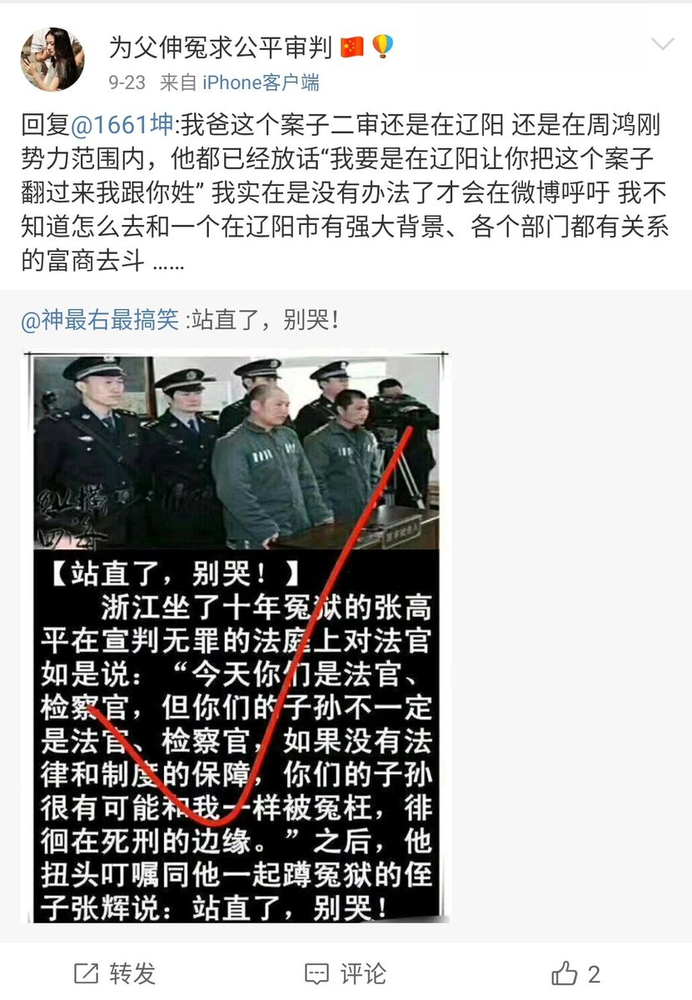

[10月10日 02:00]    纽约时报中文网   @nytchinese    土耳其发动叙利亚攻势，向该国东北部派遣战机和军队，以清剿一个库尔德民兵组织，后者是美国打击伊斯兰国的重要盟友。
特朗普曾对土耳其的行动表示默许，但行动展开后又称其是“一个坏主意”，并重申他反对“无意义的战争”。
更多简报内容： http://nyti.ms/2OzDhMj   :speech_balloon:评:2 :+1:赞:2 :globe_with_meridians:转:0  

[10月10日 01:48]    财经真相   @caijingxiang    离岸人民币从7.1680到7.0999，短短一个小时近700点！  :speech_balloon:评:25 :+1:赞:57 :globe_with_meridians:转:13  

[10月10日 01:10]    财经真相   @caijingxiang    这两天市场被媒体忽悠惨了，来回割肉，不过现在加大农产品采购，说明中共还是玩的买买买的套路，不准备全面达成协议。双方第一次接触将很重要，也就是说北京时间10号21:00至11号凌晨5点，将是决定本轮会谈最后时间，各位交易员做好准备，暴风雨要来了！ https://twitter.com/LoneCapital/status/1182096813882372097 …  :speech_balloon:评:15 :+1:赞:69 :globe_with_meridians:转:34  

[10月10日 01:07]    纽约时报中文网   @nytchinese    早安！今日重点新闻包括：
苹果因香港问题遭中国炮轰；学者展望中共四中全会；暴雪取消“挺港”玩家参赛资格引发抗议；欧盟警告慎用“敌对”势力5G公司，暗指华为；土耳其向叙利亚发起军事行动；德国犹太教堂遭枪手袭击……NYT简报带你速览今日要闻。 http://nyti.ms/2OzDhMj   :speech_balloon:评:7 :+1:赞:16 :globe_with_meridians:转:6  

[10月09日 21:09]    老司机   @h5lpykl7tp6jjop    中国人有一种特别的心理，哪怕在独裁暴政制下仍然相信自己的运气，别人冤案被打被骗是他们运气不好，你看他们在赌场里疯狂下注，不怕各种陷阱圈套十赌九输仍然相信有机会能赢，对这种执迷不悟的人群，任何理性的劝导都无用，他们就是输红眼的赌徒，绝不会戒赌，只想继续下注翻本，所以就继续投机中共！  :speech_balloon:评:2 :+1:赞:41 :globe_with_meridians:转:5  

[10月09日 15:15]    墙国铁拳现世报😷   @Socialistfist    中国突然取消了NBA投票选项 https://twitter.com/VOAChinese/status/1181942149064998912 …  :speech_balloon:评:2 :+1:赞:35 :globe_with_meridians:转:3  

[10月09日 15:08]    财经真相   @caijingxiang    香港资本外逃，从2017年年初肖建华被抓就已经开始了，这也是2017年年初那波高峰的原因，此后资本外逃就没有停止过，始终停留在最高峰，我做的YouTube视频《港币危机真正根源——被掩盖的红色恐慌指数（red vix）》 https://www.youtube.com/watch?v=7wHu4BAMzxI&t=2s …  有详细讲解，零对冲这个图各位可以对比一下！https://twitter.com/zerohedge/status/1181947916770058240 …  :speech_balloon:评:1 :+1:赞:158 :globe_with_meridians:转:56  

[10月09日 14:56]    墙国铁拳现世报😷   @Socialistfist    后后续，王老师已销号，推出推特  :speech_balloon:评:7 :+1:赞:44 :globe_with_meridians:转:3  

[10月09日 12:35]    iyouport   @iyouport_news    手机号码是万恶之源。的确完全不需要物理接触，也能使用简单的密码重置实现入侵 ——和你同乘电梯就行了。

最近，杰克·多尔西自己的帐户被劫持，比其他任何警告都更有效地宣传了这种验证方法的弱点。 https://www.forbes.com/sites/zakdoffman/2019/10/07/fbi-issues-surprise-cyber-attack-warningurges-new-precautions/#77e04cea7efb …

推特应该重新思考这个问题。

期待IYP的攻击演示。所有演示都在提醒安全意识https://twitter.com/iyouport_news/status/1181899766193541120 …  :speech_balloon:评:0 :+1:赞:18 :globe_with_meridians:转:10  

[10月09日 12:30]    纽约时报中文网   @nytchinese    “和NBA一样，我们欢迎中国的审查进入我们的家园与内心，”《南方公园》的剧创在一则开玩笑的声明写道。
“我们也爱钱胜过自由与民主。习近平一点都不像小熊维尼。” http://nyti.ms/35lndUk   :speech_balloon:评:10 :+1:赞:184 :globe_with_meridians:转:35  

[10月09日 11:58]    老司机   @h5lpykl7tp6jjop    那時她是那麼的無助，我差點落淚。看到這個視頻，心裡有無限的痛與怒！勢單力薄的女孩單獨面對4條惡犬！萬幸最後喊出了姓名。
我願以最高的敬意獻於這位英勇的港女 
記住她  :speech_balloon:评:8 :+1:赞:498 :globe_with_meridians:转:343  

[10月09日 11:50]    iyouport   @iyouport_news    7/ 鉴于包括中国在内的很多国家政府都可以使用恶意密码重置功能+拦截手机短信以获得入侵及识别真实身份的优势，我们强烈建议社交媒体平台*至少*允许谷歌身份验证器的使用。

IYP将详细解释恶意密码重置攻击，根本不需要没收你的设备 —— 不需要物理接触你的设备 —— 也能实现同样目的的攻击。  :speech_balloon:评:0 :+1:赞:11 :globe_with_meridians:转:3  

[10月09日 11:50]    iyouport   @iyouport_news    6/ 当然，这种事 Facebook 也做过，见《Facebook 以”安全性”为幌子骗取你的手机号码》 https://www.iyouport.org/facebook-%e4%bb%a5%e5%ae%89%e5%85%a8%e6%80%a7%e4%b8%ba%e5%b9%8c%e5%ad%90%e9%aa%97%e5%8f%96%e4%bd%a0%e7%9a%84%e6%89%8b%e6%9c%ba%e5%8f%b7%e7%a0%81/ … 
虚拟手机号有很多用途，IYP将详细介绍多款好用的虚拟号码；但是，社交媒体平台有他们自己的验证机制，该机制可以识别很多虚拟号码的使用 - 一旦被识别到您有可能被视为机器人而被永久封锁  :speech_balloon:评:1 :+1:赞:5 :globe_with_meridians:转:3  

[10月09日 11:49]    iyouport   @iyouport_news    5/ 推特要求使用且*仅仅使用*手机号作为两步验证工具，也就是说，你必须输入自己的手机号码以接受验证短信。现在，你的手机号码正在被用于定位广告的目的： https://www.vice.com/en_us/article/9kez8d/twitter-took-phone-numbers-for-security-used-for-advertising …
电话号码是大问题。对于中国用户来说不仅仅是广告追踪这么简单，因为当局可能拦截手机短信验证码以揭露你的真实身份  :speech_balloon:评:2 :+1:赞:1 :globe_with_meridians:转:5  

[10月09日 11:49]    iyouport   @iyouport_news    4/ 还有，《美国科技公司主动自我审查以迎合印度的新审查法》 https://www.iyouport.org/%e7%be%8e%e5%9b%bd%e7%a7%91%e6%8a%80%e5%85%ac%e5%8f%b8%e4%b8%bb%e5%8a%a8%e8%87%aa%e6%88%91%e5%ae%a1%e6%9f%a5%e8%bf%8e%e5%90%88%e5%8d%b0%e5%ba%a6%e7%9a%84%e6%96%b0%e5%ae%a1%e6%9f%a5%e6%b3%95/ …  :speech_balloon:评:1 :+1:赞:1 :globe_with_meridians:转:1  

[10月09日 11:48]    iyouport   @iyouport_news    3/ 在巴基斯坦，异议人士和记者们遇到了更危险的来自推特的威胁，见：《Twitter和政治威胁》； https://www.iyouport.org/twitter-%e5%92%8c%e6%94%bf%e6%b2%bb%e5%a8%81%e8%83%81/ … 

甚至在美国本土，海军陆战队退伍军人和亚利桑那州的前国会候选人也遭到了封锁，见《‘Twitter 禁止我，没有理由，但最终他们会失败’》https://www.iyouport.org/twitter-%e7%a6%81%e6%ad%a2%e6%88%91%ef%bc%8c%e6%b2%a1%e6%9c%89%e7%90%86%e7%94%b1%ef%bc%8c%e4%bd%86%e6%9c%80%e7%bb%88%e4%bb%96%e4%bb%ac%e4%bc%9a%e5%a4%b1%e8%b4%a5/ …  :speech_balloon:评:1 :+1:赞:2 :globe_with_meridians:转:1  

[10月09日 11:48]    iyouport   @iyouport_news    2/ 中文推特账户被大批封锁的情况所有人都知道 —— 包括IYP也遭遇了封锁。这里是我们在那之后的评论
《在无可言说之中言说中国》 https://www.iyouport.org/%e5%9c%a8%e6%97%a0%e5%8f%af%e8%a8%80%e8%af%b4%e4%b9%8b%e4%b8%ad%e8%a8%80%e8%af%b4%e4%b8%ad%e5%9b%bd/ … 

同类的事在其他国家也多次发生过：  :speech_balloon:评:2 :+1:赞:3 :globe_with_meridians:转:4  

[10月09日 11:48]    iyouport   @iyouport_news    1/ 过去一周内超过100个推特账户被封锁 - 他们都属于批评埃及政府的人，包括著名的埃及作家 @asoueif，都遭到了推特的封锁。

众所周知埃及是典型专制政权之一。

并且这并不是第一次发生这类事。

这类事必须彻底调查，推特在协助专制政权压制异议的行动中究竟扮演什么角色 https://www.independent.co.uk/independentpremium/editors-letters/egypt-protests-president-sisi-twitter-suspended-ahdaf-soueif-a9146371.html …  :speech_balloon:评:2 :+1:赞:15 :globe_with_meridians:转:8  

[10月09日 11:45]    财经真相   @caijingxiang    对火箭队的讨论在中国已经达到文革的地步！  :speech_balloon:评:52 :+1:赞:421 :globe_with_meridians:转:161  

[10月09日 11:30]    纽约时报中文网   @nytchinese    在信阳，许多居民将饥荒归咎于不忠诚的地方官员，尤其是信阳市委书记路宪文，他被指控隐瞒了不断增加的死亡人数。
大多数研究过这场饥荒和其他动乱的中国学者对毛泽东不那么宽容。隐瞒这场愈演愈烈的灾难的当地官员承受着巨大的压力，不敢冒险惹怒毛泽东。 http://nyti.ms/2ATdO8o   :speech_balloon:评:20 :+1:赞:41 :globe_with_meridians:转:18  

[10月09日 11:05]    墙国铁拳现世报😷   @Socialistfist    CBA目前领先，NBA加油呀！  :speech_balloon:评:3 :+1:赞:217 :globe_with_meridians:转:3  

[10月09日 11:03]    墙国铁拳现世报😷   @Socialistfist      :speech_balloon:评:7 :+1:赞:154 :globe_with_meridians:转:12  

[10月09日 11:03]    墙国铁拳现世报😷   @Socialistfist    如果让您自由选择收看NBA或者CBA中的一种，你会选择看哪个篮球联赛？  :speech_balloon:评:133 :+1:赞:637 :globe_with_meridians:转:117  

[10月09日 10:52]    纽约时报中文网   @nytchinese    #观点 “最觉醒的职业体育联盟“是NBA建立起的声誉和品牌，其总裁肖华认为发表“政治言论“是球员“在联盟中的绝对权利“。
但在中国面前，肖华和NBA可耻地保持了沉默。 http://nyti.ms/2IAinc1   :speech_balloon:评:112 :+1:赞:176 :globe_with_meridians:转:71  

[10月09日 10:50]    墙国铁拳现世报😷   @Socialistfist    失业人员互相取暖  :speech_balloon:评:7 :+1:赞:139 :globe_with_meridians:转:34  

[10月09日 10:40]    墙国铁拳现世报😷   @Socialistfist    辛苦做ppt-放假看阿中哥哥-第一天上班被告知失业-回家刷李易峰做饭圈女孩
资本主义铁拳？
ps，上万nba从业者瑟瑟发抖  :speech_balloon:评:30 :+1:赞:310 :globe_with_meridians:转:81  

[10月09日 10:36]    老司机   @h5lpykl7tp6jjop    不论大官还是小民，一言不合上意，下课！
中国早已全面进入文革升级版时代！
日前，中共证监会原主席刘士余被连降四级。官方通报指他公开发表不当言论，但通报未具体说明原由。据一位近期来自中国的访问学者披露，刘士余下台的真实的原因是他在清华大学透露出习近平要搞国家牛市、慢牛，结果带来了疯牛  :speech_balloon:评:3 :+1:赞:155 :globe_with_meridians:转:48  

[10月09日 10:22]    老司机   @h5lpykl7tp6jjop    爱国挺共后遗症！这下入你们爱国的意愿了，回去吧！  :speech_balloon:评:2 :+1:赞:28 :globe_with_meridians:转:7  

[10月09日 09:46]    纽约时报中文网   @nytchinese    《南方公园》在上周名为《中国乐队》的剧集中嘲讽了中国的审查制度及其对美国娱乐业产生深远影响。该剧在中国网络的相关讨论迅速被删。
在NBA艰难地应对”挺港“风波之际，《南方公园》的剧创似乎在享受这种战斗。两名剧创发布了假道歉声明，在其中嘲弄NBA，同时羞辱了习近平。 http://nyti.ms/35lndUk   :speech_balloon:评:126 :+1:赞:1283 :globe_with_meridians:转:431  

[10月09日 09:29]    老司机   @h5lpykl7tp6jjop      :speech_balloon:评:0 :+1:赞:3 :globe_with_meridians:转:1  

[10月09日 09:25]    老司机   @h5lpykl7tp6jjop    大家自己看看属于哪一种家庭，马上就要 全面进入小康生活时代  :speech_balloon:评:7 :+1:赞:33 :globe_with_meridians:转:15  

[10月09日 09:20]    iyouport   @iyouport_news    被骗意味着认知弱点被利用。 https://www.iyouport.org/%e7%9c%8b%e8%b5%b7%e6%9d%a5%e4%b8%93%e4%b8%9a%e4%b8%8d%e6%84%8f%e5%91%b3%e7%9d%80%e6%ad%a3%e7%a1%ae%ef%bc%9a%e5%8f%8d%e7%9f%a5%e8%af%86%e7%9a%84%e8%bf%b7%e6%83%91%e6%80%a7%ef%bc%884%ef%bc%89/amp/?__twitter_impression=true …  :speech_balloon:评:0 :+1:赞:3 :globe_with_meridians:转:3  

[10月09日 09:19]    iyouport   @iyouport_news    一个澳大利亚罪犯团伙是典型，他们参观了警察毕业典礼，拍照，然后使用面部识别软件创建了自己的卧底警察数据库。
不论您是希望躲警察还是躲犯罪分子，有效的保护措施都是您应该了解的。 https://www.iyouport.org/%e7%a6%81%e6%ad%a2%e9%9d%a2%e9%83%a8%e8%af%86%e5%88%ab%e5%8f%af%e4%bb%a5%e5%81%9a%e5%88%b0%e4%bb%80%e4%b9%88%e3%80%81%e4%b8%8d%e8%83%bd%e5%81%9a%e5%88%b0%e4%bb%80%e4%b9%88/amp/?__twitter_impression=true …  :speech_balloon:评:0 :+1:赞:11 :globe_with_meridians:转:11  

[10月09日 08:30]    纽约时报中文网   @nytchinese    连日来，火箭队总经理莫雷的”挺港“言论引发争议，让许多中国网民宣布抵制NBA。对此，NBA一直处于止损状态，而其在美国也因为似乎对中国卑躬屈膝而受到抨击。
对企业而言，无论对象如何变化，中国的国民愤怒往往集中在一个问题上：国家主权。 http://nyti.ms/2Mwogbw   :speech_balloon:评:29 :+1:赞:24 :globe_with_meridians:转:7  

[10月09日 08:25]    老司机   @h5lpykl7tp6jjop      :speech_balloon:评:1 :+1:赞:6 :globe_with_meridians:转:0  

[10月09日 08:24]    老司机   @h5lpykl7tp6jjop    推友们注意这个李方可能是假的！共产党特务利用他的账号骗我发蒙面照片和家人的资料，我在澳洲也不怕，反正都七十岁了能让共产党费尽心机来让我成仁也不在乎，大家小心！共产党马上就要垮台，疯狂到最后一刻来了！  :speech_balloon:评:10 :+1:赞:60 :globe_with_meridians:转:10  

[10月09日 08:07]    iyouport   @iyouport_news    More than that https://www.iyouport.org/%e7%8b%ac%e5%ae%b6%ef%bc%9a%e5%8c%97%e4%ba%ac%e7%9a%84%e6%94%bf%e6%b2%bb%e5%ae%a3%e4%bc%a0%e6%a8%a1%e5%bc%8f%e5%8f%91%e7%94%9f%e6%94%b9%e5%8f%98/amp/?__twitter_impression=true …  :speech_balloon:评:0 :+1:赞:3 :globe_with_meridians:转:1  

[10月09日 07:38]    纽约时报中文网   @nytchinese    中国革命历史的痛苦记忆，在河南信阳延绵起伏的麦田和散落的村庄间游荡，为了纪念中共建国70周年，习近平最近视察了这里。
然而，在习近平此番政治朝圣之旅中，并非所有在毛的混乱年代丧生的人都得到了纪念。谁被铭记，谁又被忽视，让人清楚地看到他对中国历史的威权主义重述。 http://nyti.ms/2ATdO8o   :speech_balloon:评:29 :+1:赞:132 :globe_with_meridians:转:47  

[10月09日 06:32]    纽约时报中文网   @nytchinese    对于想在中国做生意的跨国企业来说，规则曾经很简单——不要谈论西藏、台湾和天安门镇压。在民族主义崛起、日益政治化的中国，NBA和其他外企发现，中国市场如今处处是“地雷”。
如今，跨国公司越来越纠结于一个问题：如何在一个日益政治化和严厉的中国远离政治。 http://nyti.ms/2Mwogbw   :speech_balloon:评:343 :+1:赞:361 :globe_with_meridians:转:142  

[10月09日 05:42]    财经真相   @caijingxiang    胡锡进：NBA需要付出代价，但停止与它合作无需成为一种风潮。本来想搬起石头砸一下NBA给美国人看看支持香港的下场，但是搬起来后发现美国民意气势汹汹，大有跟你干到底的样子，于是中共彻底怂了，陪着笑脸朝自己脚砸去！  :speech_balloon:评:69 :+1:赞:1469 :globe_with_meridians:转:305  

[10月09日 05:30]    纽约时报中文网   @nytchinese    #新新世界 中共确实在动用国家权力告诉中国人民他们应该如何思考。
但是，爱国主义的表现，尤其是来自年轻人的爱国主义表现，也表明，在大众媒体和社交媒体时代，中共的宣传机器已经掌握了符号和象征手法的力量。 http://nyti.ms/2ATH3rH   :speech_balloon:评:57 :+1:赞:42 :globe_with_meridians:转:16  

[10月09日 05:24]    老司机   @h5lpykl7tp6jjop    加油干吧，同志们，留下给你们抵制的已经不多啦！  :speech_balloon:评:2 :+1:赞:42 :globe_with_meridians:转:17  

[10月09日 05:04]    老司机   @h5lpykl7tp6jjop    从小培养远大理想，结果都是洗脑，只有她知道这才是现实生活！你不是红二代理想个屁！  :speech_balloon:评:3 :+1:赞:49 :globe_with_meridians:转:25  

[10月09日 05:00]    老司机   @h5lpykl7tp6jjop    当香港又一抗争者被跳海，尸首刚被捞起，使被跳楼、被吊颈，被跳海、被分尸人数急剧增至近45人！

香港人的特首林郑月娥展露自信的笑容，在记者会告诉港人若香港发生更多暴乱，请北京发兵会成为其中一个迭项！  :speech_balloon:评:17 :+1:赞:54 :globe_with_meridians:转:47  

[10月09日 04:18]    iyouport   @iyouport_news    回顾下面这个。

其实NBA的事，他们就是想要试试这个 - 他们最担心的东西，对外姿态是次要的；

他们试了。他们到底得到“信心”了吗？-  请注意 您能看到的“爱国疯”并非都是独立观点。 https://twitter.com/DonEvansWm/status/1178662172626309120 …  :speech_balloon:评:0 :+1:赞:11 :globe_with_meridians:转:4  

[10月09日 04:00]    纽约时报中文网   @nytchinese    智慧生活：
• 狗到底有多聪明？主人和科学家想的不一样。主人们渴望给自己的狗评估智商，但科学家对狗狗智力的定义和测量方式和主人是不同的，“聪明"其实是给狗强加人类概念。
• 技术使人类能够轻松地监视自己的邻居和家人。但我们应该这样做吗？
更多简报内容： http://nyti.ms/2LZHNlx   :speech_balloon:评:2 :+1:赞:5 :globe_with_meridians:转:1  

[10月09日 03:46]    墙国铁拳现世报😷   @Socialistfist    8:00 上贴吧讨论，贴吧被封
9:00 豆瓣瓜组组cp，组被解散号被封
10:00 微博质问来去之间，期间言论被收集于@Socialistfist 
11:00 连vpn上pornhub
11:05 撸完骂几句女优丑
12:00 起点yy小说，穿越之我是希特勒
1:00am 睡觉，醒来又是斗志满满的一天呢  :speech_balloon:评:4 :+1:赞:78 :globe_with_meridians:转:12  

[10月09日 03:43]    老司机   @h5lpykl7tp6jjop    改革开放前中国人看见外国人港台人戴个太阳镜都羡慕得流口水，怂得那一个土鳖样，现在才有点糟钱就不知道姓啥，张狂那样子希特勒都要甘拜下风，什么战狼 我看就是疯狗，没有 文明进化的人不能有点钱，就像中东的一些发了石油财的木石磷国家没钱还安安静静，有钱就疯了恨不得把地球倒着转，中国人也一样 https://twitter.com/huanghebian/status/1181597599247155205 …  :speech_balloon:评:5 :+1:赞:72 :globe_with_meridians:转:13  

[10月09日 03:34]    iyouport   @iyouport_news    其实胡某人很擅长使用的就是这种骗术。但他只能用一半。因为他无法绕开塔西佗陷阱。

没人会去关心胡某人，这里关心的是我们自己 ——因为这种欺骗形式特别高效，同时当权者的手段正快速进化；我们得在前面等着他们，等他们get到了再去分析就晚了。

如果您了解什么是“高级五毛”，就能知道这不是吓唬人的 https://twitter.com/iyouport_news/status/1181773107381465088 …  :speech_balloon:评:0 :+1:赞:16 :globe_with_meridians:转:9  

[10月09日 03:33]    iyouport   @iyouport_news    人们喜欢看中美的高堡奇人撕逼世界。

IYP专门有个“高堡奇人”栏目，收集的都是中美，但不是您能从两国的宣传机构中看到的东西 - 而是它的背面，是他们不想让你看到的东西。

于是它显然比撕逼擂台更有趣
 https://www.iyouport.org/%E4%B8%AD%E5%9B%BD%E7%97%87%E5%80%99%E7%BE%A4%EF%BC%9A%E5%BD%933com%E9%81%87%E5%88%B0%E5%8D%8E%E4%B8%BA/ …https://twitter.com/iyouport_news/status/1181772752568475648 …  :speech_balloon:评:0 :+1:赞:6 :globe_with_meridians:转:2  

[10月09日 03:31]    iyouport   @iyouport_news    转一个旧文，找骂用
《政府监视公民一举一动，公民无动于衷-China》 https://www.iyouport.org/%e6%94%bf%e5%ba%9c%e7%9b%91%e8%a7%86%e5%85%ac%e6%b0%91%e4%b8%80%e4%b8%be%e4%b8%80%e5%8a%a8%ef%bc%8c%e5%85%ac%e6%b0%91%e6%97%a0%e5%8a%a8%e4%ba%8e%e8%a1%b7-china/ …https://twitter.com/iyouport_news/status/1181772616706605056 …  :speech_balloon:评:0 :+1:赞:3 :globe_with_meridians:转:1  

[10月09日 03:31]    iyouport   @iyouport_news    这篇文章以及同类很多其他文章都在提醒：如何警惕当权者的敷衍愚弄。
当所有主流媒体都在称颂面部识别禁令时，您应该知道《禁止面部识别可以做到什么、不能做到什么》
 https://www.iyouport.org/%E7%A6%81%E6%AD%A2%E9%9D%A2%E9%83%A8%E8%AF%86%E5%88%AB%E5%8F%AF%E4%BB%A5%E5%81%9A%E5%88%B0%E4%BB%80%E4%B9%88%E3%80%81%E4%B8%8D%E8%83%BD%E5%81%9A%E5%88%B0%E4%BB%80%E4%B9%88/ …  
中国当局特别擅长敷衍，看起来就像他们在“解决问题”一样，但是，当权者的方案将永远以他们的利益为宗旨https://twitter.com/iyouport_news/status/1181772395012489216 …  :speech_balloon:评:0 :+1:赞:6 :globe_with_meridians:转:4  

[10月09日 03:30]    纽约时报中文网   @nytchinese    #新新世界 “在我的生长环境里，爱国和国旗合影以前会觉得不酷，“一名中国网友在谈到年轻人的爱国热情时写道。“现在不一样了。”
国庆前后，种种爱国主义情绪的流露很容易被视为共产党洗脑成功的证据，或是对异见人士采用严密监视和高压手段的结果，但真实情况要复杂得多。 http://nyti.ms/2ATH3rH   :speech_balloon:评:258 :+1:赞:243 :globe_with_meridians:转:104  

[10月09日 03:29]    iyouport   @iyouport_news    几乎所有创作者都低估了中国观众的鉴赏水平。

其实有些中国观众特别聪明，你还记得吗，早在多年前中国观众群中就有一支坚定的因“讨厌美剧正能量”而转向英剧的队伍。他们真的指出了美剧最根本的问题

下面这篇文章不是第一次揭露政审，去年的“独家”中也有相关资料的引用，见： https://www.iyouport.org/%e7%8b%ac%e5%ae%b6%ef%bc%9a%e5%8c%97%e4%ba%ac%e7%9a%84%e6%94%bf%e6%b2%bb%e5%ae%a3%e4%bc%a0%e6%a8%a1%e5%bc%8f%e5%8f%91%e7%94%9f%e6%94%b9%e5%8f%98/ …https://twitter.com/iyouport_news/status/1181771976228012033 …  :speech_balloon:评:0 :+1:赞:19 :globe_with_meridians:转:4  

[10月09日 03:27]    iyouport   @iyouport_news    去年开始中国国社要求被约稿人必须带有足够高的头衔；这点可能也是所有商业媒体所追求的。

头衔之所以能成为吸引流量的重要诱饵 —— 而不是内容本身 —— 正因为大多数人都会下意识地视专家头衔为全能，事实上远远不是如此。

继续关于欺骗的话题《反知识的迷惑性（4）》
 https://www.iyouport.org/%E7%9C%8B%E8%B5%B7%E6%9D%A5%E4%B8%93%E4%B8%9A%E4%B8%8D%E6%84%8F%E5%91%B3%E7%9D%80%E6%AD%A3%E7%A1%AE%EF%BC%9A%E5%8F%8D%E7%9F%A5%E8%AF%86%E7%9A%84%E8%BF%B7%E6%83%91%E6%80%A7%EF%BC%884%EF%BC%89/ …  :speech_balloon:评:0 :+1:赞:11 :globe_with_meridians:转:4  

[10月09日 03:25]    iyouport   @iyouport_news    曾经一度陷入困境的美国科技先驱如何与雄心勃勃的中国新贵联姻？

这是来自一本书的摘录，暴露了中美科技战中一些鲜为人知的背景 … #Huawei

详细《中国症候群：当3Com遇到华为》

 https://www.iyouport.org/%E4%B8%AD%E5%9B%BD%E7%97%87%E5%80%99%E7%BE%A4%EF%BC%9A%E5%BD%933com%E9%81%87%E5%88%B0%E5%8D%8E%E4%B8%BA/ …  :speech_balloon:评:0 :+1:赞:1 :globe_with_meridians:转:3  

[10月09日 03:25]    iyouport   @iyouport_news    当局一直在使用强大的技术来追踪人们的每一步出行，这种监视是在各地警方的配合下。

他们是怎么做的？#Surveillance

详见《监视出行的恐慌》
 https://www.iyouport.org/%E7%9B%91%E8%A7%86%E5%87%BA%E8%A1%8C%E7%9A%84%E6%81%90%E6%85%8C/ …  :speech_balloon:评:0 :+1:赞:1 :globe_with_meridians:转:1  

[10月09日 03:00]    纽约时报中文网   @nytchinese    特朗普的律师在一封写给众议院领导人的信中表示，白宫将不会配合弹劾调查。信发出几小时前，白宫阻止了主要证人、美国驻欧盟大使出席国会听证会。
此外，CIA举报人的备忘录显示，一名白宫官员曾在特朗普与乌克兰总统通话的第二天称，这通电话的内容疯狂、可怕。更多简报内容： http://nyti.ms/2LZHNlx   :speech_balloon:评:1 :+1:赞:4 :globe_with_meridians:转:2  

[10月09日 02:32]    纽约时报中文网   @nytchinese    #每日一词 美国总统如果涉嫌违法，可以免于调查和起诉吗？对此，特朗普的答案显然是肯定的。但一名联邦法官做出的裁决却给出了截然不同的答案。
据时报报道，这项裁决驳回了特朗普的诉讼：他试图阻止要求其提供长达八年的个人和公司纳税申报表的传票(subpoena)。 http://nyti.ms/2MnTnpv   :speech_balloon:评:5 :+1:赞:19 :globe_with_meridians:转:10  

[10月09日 02:27]    财经真相   @caijingxiang    听说杀猪时，猪会怪怪的等待被杀，那是因为它没有感觉到疼，当刀子割破喉咙时，它就会拼尽一切进行反抗！  :speech_balloon:评:12 :+1:赞:143 :globe_with_meridians:转:30  

[10月09日 02:04]    财经真相   @caijingxiang    最近中共的审查制度导致的各种抵制效果明显，比如它成功的把著名财经博客“零对冲”变成了一个政治号，以前五毛总是攻击我，一个财经号天天发政治内容！恩，现在你们可以攻击零对冲了！ https://twitter.com/zerohedge/status/1181742329788600320 …  :speech_balloon:评:6 :+1:赞:179 :globe_with_meridians:转:34  

[10月09日 02:00]    纽约时报中文网   @nytchinese    • 贸易战将拖累全球经济：IMF总裁警告，到2020年，中美贸易紧张局势或使全球经济损失约7000亿美元，相当于瑞士整个经济的规模。
• 港交所撤回了此前提出的以370亿美元收购其竞争对手伦交所的报价。这对港交所寻求与欧洲市场建立紧密联系的努力来说是一大挫折。更多简报内容： http://nyti.ms/2LZHNlx   :speech_balloon:评:1 :+1:赞:7 :globe_with_meridians:转:1  

[10月09日 01:30]    纽约时报中文网   @nytchinese    #观点 林郑月娥和中国共产党可以援引此类恶化行为，以及所谓的纵火，将这场运动称为暴乱，参与者是在蓄意破坏。
他们的一个希望是，由于社会成本的增加，更多的香港人可能会与这场运动保持距离。另一个希望是，这场运动将失去它在世界各地自由民主国家中所拥有的一些道德威信。 http://nyti.ms/2ocvBEZ   :speech_balloon:评:23 :+1:赞:20 :globe_with_meridians:转:11  

[10月09日 01:27]    纽约时报中文网   @nytchinese    China Is a Minefield, and Foreign Firms Keep Hitting New Tripwires. China Masters Political Propaganda for the Instagram Age. Swine Fever? Trade War? China Turns to Strategic Pork Reserve. How do you say "subpoena" in Chinese? Find out @nytchinese https://cn.nytimes.com/morning-brief/20191009/nba-china-hong-kong-strategic-pork-reserve/ …  :speech_balloon:评:6 :+1:赞:23 :globe_with_meridians:转:11  

[10月09日 00:57]    纽约时报中文网   @nytchinese    早安！今日重点新闻包括：NBA“挺港”事件发酵；揭秘中国战略猪肉储备制度；《南方公园》因讽刺中国审查机构在华遭封杀；IMF警告中美贸易战将拖累全球经济；白宫向弹劾调查宣战；习近平政权如何改写中国叙事……NYT简报带你速览今日要闻。 http://nyti.ms/2LZHNlx   :speech_balloon:评:17 :+1:赞:50 :globe_with_meridians:转:15  

[10月08日 22:40]    老司机   @h5lpykl7tp6jjop    #HKprotester gradually entered a coma, but #PoliceTerrorism still pressed his neck with and shouted to him shut your mouth up and go fk yourself.
That’s a so-call their “professional” and “conscience standard” why so different .  :speech_balloon:评:18 :+1:赞:333 :globe_with_meridians:转:430  

[10月08日 16:41]    墙国铁拳现世报😷   @Socialistfist    如果说美国是世界警察，中国就是世界网警。
这一波操作美国人完全理解不了  :speech_balloon:评:5 :+1:赞:329 :globe_with_meridians:转:31  

[10月08日 15:31]    财经真相   @caijingxiang    商务部新闻发言人就美商务部将28家中国实体列入出口管制“实体清单”发表谈话，中方强烈敦促美方立即停止在涉疆问题上说三道四，停止干涉中国内政的错误行径，尽快将相关中国实体移出“实体清单”。中方也将采取一切必要措施，坚决维护中方自身利益。  :speech_balloon:评:35 :+1:赞:222 :globe_with_meridians:转:81  

[10月08日 15:07]    墙国铁拳现世报😷   @Socialistfist    16-19年不完全“辱华”品牌与机构名单  :speech_balloon:评:60 :+1:赞:541 :globe_with_meridians:转:217  

[10月08日 12:30]    纽约时报中文网   @nytchinese    #观点 香港一直以尊重法制为荣，但所有这一切在上周五改变了。林郑月娥决定援引《紧急情况规例条例》，禁止在公共集会上使用口罩和其他面罩。
林郑称禁令是为了制止暴力，恢复秩序。但当局盘算的是，如果禁止蒙面，集会规模将会更小。“一国两制”行将消亡，现在，法制也在消亡。 http://nyti.ms/2ocvBEZ   :speech_balloon:评:279 :+1:赞:288 :globe_with_meridians:转:92  

[10月08日 12:00]    纽约时报中文网   @nytchinese    鉴于越来越多的证据表明，贸易战正在给美中双方造成经济负担，人们对这轮谈判可能达成某种协议的期望一直在升高。
中美官员一直在各自寻找缓解贸易紧张关系的途径，这预示着可能会达成一项初步协议，即美国同意降低部分关税，以换取中国加强对知识产权的保护并购买美国农产品。 http://nyti.ms/2AUwEMw   :speech_balloon:评:6 :+1:赞:5 :globe_with_meridians:转:0  

[10月08日 10:28]    财经真相   @caijingxiang    南华早报刚刚报道称，中国代表团将缩短在美国逗留时间，消息公布后离岸人民币急挫，黄金小幅上涨，a50扩大跌幅！自从贸易战爆发后，影响到金融市场计价的媒体最多的是彭博社，其次是路透社，再次就是这个被马云收购的南华早报！  :speech_balloon:评:40 :+1:赞:554 :globe_with_meridians:转:182  

[10月08日 10:08]    老司机   @h5lpykl7tp6jjop    又有浮屍，又係全黑，真係忍唔住喊，感覺係後生女來，，點解要咁樣對待，真係犯都唔會咁樣對待，一係咪坐10年，天琦都坐緊啦，有咩需要去到要殺人？？？有咩仇口要去到咁？就只係因為反共？呢個殺人政權同埋班狗，真係永遠勢不兩立！！！！ #chinazi #HongKongProtest  :speech_balloon:评:277 :+1:赞:1368 :globe_with_meridians:转:1126  

[10月08日 09:51]    老司机   @h5lpykl7tp6jjop    叫几个朋友...抓黑衣女子...
拉上车随便玩...
记得拍片...
惩罚蟑螂..
警察也在做..

「警告」推上熱門 女手足一定要小心
 https://lih.kg/1638282 
- 分享自 #LIHKG 討論區

#chinazi
#HKprotests
#香港デモ
#香港加油
#香港人反抗
#StandwithHK
#StandWithHongKong
#一切都是刚刚开始
#MeToo  :speech_balloon:评:19 :+1:赞:111 :globe_with_meridians:转:109  

[10月08日 09:28]    墙国铁拳现世报😷   @Socialistfist    续
ps谢谢投稿的推友  :speech_balloon:评:7 :+1:赞:133 :globe_with_meridians:转:15  

[10月08日 09:27]    墙国铁拳现世报😷   @Socialistfist    国庆献礼混剪视频被B站删除
当事人：“爱国爱的我难受”  :speech_balloon:评:32 :+1:赞:291 :globe_with_meridians:转:67  

[10月08日 08:24]    墙国铁拳现世报😷   @Socialistfist    理想极度肥胖，现实营养不良@Socialistfist  :speech_balloon:评:19 :+1:赞:133 :globe_with_meridians:转:37  

[10月08日 08:18]    老司机   @h5lpykl7tp6jjop    太恐怖了！昨晚，一个孩子和他父母一家三口路过，竟被防暴警察包围并被指控参加"未经授权的集会"，孩子被吓的大哭。在香港，根据殖民地公共秩序条例，3人即可进行"未经授权的集会"。  :speech_balloon:评:51 :+1:赞:400 :globe_with_meridians:转:295  

[10月08日 07:21]    老司机   @h5lpykl7tp6jjop    这样对待一群自由集会的年轻人，跟对待监狱里面的犯人有什么区别？日治三年时期恐怕日本人都没这么干过，举着身份证自报姓名，声音不大，还让你重说几遍，并且把你的照片录下来，随时可以上门抓捕你。全港全大陆全台湾的华人，此时不团结起来反共，更待何时?你们愿意过新疆集中营的生活吗？  :speech_balloon:评:38 :+1:赞:340 :globe_with_meridians:转:234  

[10月08日 04:31]    财经真相   @caijingxiang    【重磅】天眼查数据显示，2019年9月29日百度云计算技术（北京）有限公司管理架构发生变更，百度创始人李彦宏卸任执行董事。同时，刘辉卸任总经理一职，新增崔珊珊为总经理、执行董事。另外，百度云计算技术（北京）有限公司的法定代表人也发生变更，刘辉退出，由崔珊珊接任。 下一个！  :speech_balloon:评:24 :+1:赞:495 :globe_with_meridians:转:236  

[10月08日 03:41]    财经真相   @caijingxiang    海康威视高级副总裁黄方红，强烈反对美国把公司纳入实体清单，这个决定没有事实根据，呼吁美国政府本着公平、公正、无歧视的原则，重新进行审视，将海康威视移出实体清单。
北京旷视科技有限公司8日公告称，关于今天美国商务部在没有任何事实根据情况下将旷视列入实体清单，我们对这一决定表示强烈抗议  :speech_balloon:评:47 :+1:赞:220 :globe_with_meridians:转:79  

[10月08日 03:21]    财经真相   @caijingxiang    国庆假期首个交易日，中国股市大涨，离岸人民币小涨，完全不理会香港局势的恶化，也不计价美国对28家公安局制裁，更不在乎川普所说的“全面deal与部分deal差异”，甚至9月财新中国服务业PMI降至七个月新低也完全没有任何影响，所有的利空消息都不如国庆大阅兵打鸡血的利好！  :speech_balloon:评:74 :+1:赞:180 :globe_with_meridians:转:57  

[10月08日 03:14]    财经真相   @caijingxiang    土耳其总统埃尔多安不顾川普总统警告，毅然对叙利亚境内的库尔德武装进行打击，消息公布后，土耳其里拉跳贬！  :speech_balloon:评:8 :+1:赞:96 :globe_with_meridians:转:26  

[10月08日 02:23]    老司机   @h5lpykl7tp6jjop    昨晚，众多市民在太子站祭奠831的亡魂~
结果，引来了黑警的不满，他们掀翻祭品，还抓捕孩子；

这时，报应来了，一个黑警无缘无故的摔了一个大屁墩儿！
记得上次也是在太子站，一个粉红来踢祭坛，也是一屁股摔在地上，不敢再踢，悻悻逃走！

现世报往往不会很重，真正的果报来时，坏人可别后悔！  :speech_balloon:评:37 :+1:赞:538 :globe_with_meridians:转:270  

[10月08日 01:36]    墙国铁拳现世报😷   @Socialistfist    不愧是野兽，遭受重拳还不被KO  :speech_balloon:评:23 :+1:赞:167 :globe_with_meridians:转:22  

[10月08日 00:04]    老司机   @h5lpykl7tp6jjop    急診室醫生發聲  :speech_balloon:评:28 :+1:赞:944 :globe_with_meridians:转:868  

[10月07日 18:24]    老司机   @h5lpykl7tp6jjop    This is a private residence and it is necessary to search warrant for it to enter the search. 
It seems recently that there is a strong force to support them to doing this #CCP? #BloodyCarrie ? 
The relationship between Hk citizens and police has more deteriorated day by day.  :speech_balloon:评:75 :+1:赞:910 :globe_with_meridians:转:969  

[10月07日 17:59]    墙国铁拳现世报😷   @Socialistfist    我的确很放心 你乌合之众的智商 https://twitter.com/kMAduL6XzvDBG2W/status/1181236888822145024 …  :speech_balloon:评:15 :+1:赞:134 :globe_with_meridians:转:5  

[10月07日 13:14]    墙国铁拳现世报😷   @Socialistfist    真是一朵共产主义奇葩
#战螂在推特  :speech_balloon:评:103 :+1:赞:465 :globe_with_meridians:转:106  

[10月07日 12:08]    财经真相   @caijingxiang    怎么做才算是努力？上学时所有人都告诉你，好好学习就是努力！进入社会后，好好工作就是努力！到了中年后发现，很多钻营取巧、溜须拍马、坑蒙拐骗的人，在讲自己美化版本的努力获取成功之道！临到快死时，努力希望自己下辈子投胎成为官二代、红二代！努力究竟是什么？一个没有人能够回答对问题！ https://twitter.com/caijingxiang/status/1181174592062124033 …  :speech_balloon:评:38 :+1:赞:376 :globe_with_meridians:转:105  

[10月07日 11:49]    财经真相   @caijingxiang    一个女生滔滔不绝的跟她男友说，你不努力就会怎样，怎样！
男孩反问道：不要告诉我要不要努力，请告诉我怎么做才是努力？
女生缓缓的说“比如好好工作”
男孩：你确定好好工作就是努力？就可以赚到钱买房和你结婚？
女生不说话了！
后来她告诉别人分手的原因，是因为男生没有上进心，不努力！  :speech_balloon:评:77 :+1:赞:770 :globe_with_meridians:转:184  

[10月07日 11:06]    墙国铁拳现世报😷   @Socialistfist    这才是真相……  :speech_balloon:评:7 :+1:赞:127 :globe_with_meridians:转:24  

[10月07日 09:16]    墙国铁拳现世报😷   @Socialistfist    续  :speech_balloon:评:11 :+1:赞:93 :globe_with_meridians:转:11  

[10月07日 09:10]    墙国铁拳现世报😷   @Socialistfist    “求人民帮我”
人民帮你了,谁去帮国家政府？
#社会主义铁拳  :speech_balloon:评:51 :+1:赞:303 :globe_with_meridians:转:92  

[10月07日 01:26]    财经真相   @caijingxiang    预料之中的事，人民币已经准备好雄赳赳气昂昂跨过7.2！ https://twitter.com/chinesewsj/status/1181011338803470342 …  :speech_balloon:评:25 :+1:赞:407 :globe_with_meridians:转:129  

[10月06日 16:38]    墙国铁拳现世报😷   @Socialistfist    我说毛左怎么一个个都高潮连连  :speech_balloon:评:12 :+1:赞:114 :globe_with_meridians:转:19  

[10月05日 18:08]    财经真相   @caijingxiang    Denuclearization Talks Between North Korea And The US Collapse  https://www.zerohedge.com/geopolitical/denuclearization-talks-between-north-korea-and-us-collapse …  :speech_balloon:评:27 :+1:赞:132 :globe_with_meridians:转:84  

[10月05日 17:36]    财经真相   @caijingxiang    猜测成为现实！贝莱德！ https://twitter.com/ShinRa_ElectPow/status/1160871960034721794 …  :speech_balloon:评:10 :+1:赞:129 :globe_with_meridians:转:38  

[10月05日 16:55]    财经真相   @caijingxiang    汇丰银行在香港拥有崇高地位，是香港三大授权发钞行之首（汇丰、渣打、中银香港），现时汇丰的港元纸币发行量占全港流通纸币的63%以上。当前香港危机达到临界点，外界对港币联系汇率崩盘不断感到担忧，如果说香港金融陷入危机的话，汇丰控股必将遭到巨大打击，贝莱德此时增持股份明显违背常理！ https://twitter.com/caijingxiang/status/1180522876488699905 …  :speech_balloon:评:27 :+1:赞:440 :globe_with_meridians:转:171  

[10月05日 16:39]    财经真相   @caijingxiang    10月4日，根据汇丰控股披露，贝莱德于9月30日斥资45.45港亿元增持，持股比例增至7.32%，成为汇丰控股最大单一股东，超越平安集团7.01%持股比例。贝莱德前身与黑石渊源很深，同时在中国业务规模极大，而黑石与中共关系更加复杂，汇丰银行在香港值此关键时刻大股东变动绝非巧合，这让人想起前期高管变动  :speech_balloon:评:9 :+1:赞:142 :globe_with_meridians:转:70  

[09月06日 11:03]    财经真相   @caijingxiang    本次降准总计是释放增量资金9000亿，但是提前下发的2020年地方债最高为1.85万亿，降准释放的资金只够新一轮刺激的一半，剩下的资金将会从现有社会存量来补充，这在一定程度收紧了金融系统的流动性；不过和以往一样，央行的降准刺激措施依然是打着“中小企业”的名义下调的!连接 https://www.youtube.com/watch?v=Usp9LIngNl0&feature=youtu.be …  :speech_balloon:评:20 :+1:赞:232 :globe_with_meridians:转:77  

[08月14日 03:44]    iyouport   @iyouport_news    2个分类知识*新*列表已在互联网开放；浏览无需登录。

如果您不知道该搜什么知识，这些列表会有帮助。

它们是工具箱和装甲，当您能熟练使用这些知识时，就能获得想要的成功。

#IYP <新版>列表1 - 29个栏目： https://docs.google.com/document/d/1zHDRsb7BtR05ILg3F3rhAxBAcD9PJpbBwpGXPaAPP9w/edit?usp=sharing …  

列表2:- 17个栏目: https://docs.google.com/document/d/1tmU2VmsdHRo79NniIM85yWJrS-A_GIhku_0yXZOg8Fk/edit?usp=sharing …  :speech_balloon:评:0 :+1:赞:59 :globe_with_meridians:转:17  

[03月13日 00:10]    老司机   @h5lpykl7tp6jjop    批评是批评家天生的使命！他们只感知对错，信奉真理，指出真相不吐不快，不在意权势和群众的喜好，从批评里不可能获得任何好处，但批评家愚直不改。在中国几乎所有人都讨厌批评家，喜欢阴谋家，因为他们只说好听的！可是就因为中国的批评家太少，中国几乎看不到未来和希望！  :speech_balloon:评:75 :+1:赞:165 :globe_with_meridians:转:41  

[01月10日 05:30]    纽约时报中文网   @nytchinese    每年一月，《纽约时报》​​会选出52个年度旅游目的地。将举办冬奥会的中国崇礼、炫目奢华的香港、日本濑户内各岛皆入选。
新的一年，你计划好要去哪里旅行了吗？ http://nyti.ms/2Tz9N06   :speech_balloon:评:275 :+1:赞:371 :globe_with_meridians:转:191  

