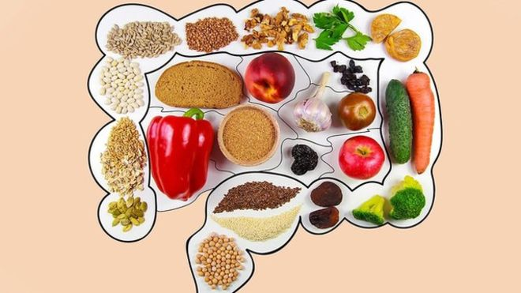

[10月19日 23:53]    BBC News 中文   @bbcchinese    英国议会又和约翰逊首相就脱欧较劲。 https://www.bbc.com/zhongwen/simp/world-50110944 …  :speech_balloon:评:9 :+1:赞:10 :globe_with_meridians:转:8  

[10月19日 21:51]    新闻大吐槽   @TuCaoFakeNews    画张图吧，名字就叫“国旗下的暴力”。  :speech_balloon:评:0 :+1:赞:4 :globe_with_meridians:转:2  

[10月19日 21:34]    新闻大吐槽   @TuCaoFakeNews    这样的节目必须支持！ https://twitter.com/TuCaoFakeNews/status/1185529233205952513 …  :speech_balloon:评:0 :+1:赞:10 :globe_with_meridians:转:1  

[10月19日 21:30]    BBC News 中文   @bbcchinese    智利反地铁加价示威升级，总统皮涅拉宣布首都圣地亚哥进入紧急状态。  :speech_balloon:评:64 :+1:赞:127 :globe_with_meridians:转:51  

[10月19日 21:28]    新闻大吐槽   @TuCaoFakeNews    不不不，特务做事不可能这么光明正大，粉红很多人脑子虎的一批，你刺激到他，他真的就能做出这种事，骂CNMB只是标准配置，我之前在国外碰到的粉红游行，有留学生就拿刀去了，随时准备在和他们口中得港毒发生冲突后砍了别人  :speech_balloon:评:2 :+1:赞:12 :globe_with_meridians:转:3  

[10月19日 21:27]    新闻大吐槽   @TuCaoFakeNews    Pro-CCP thug, waving a knife on his hand, yelling at people around. Everyday Maoist Terrorism!
#Maoistterrorism #antichinazi https://twitter.com/tucaofakenews/status/1185540881484410881 …  :speech_balloon:评:0 :+1:赞:4 :globe_with_meridians:转:3  

[10月19日 21:25]    新闻大吐槽   @TuCaoFakeNews    好奇搜索了一下，淘宝居然还有大批南方公园的盗版周边卖，衣服帽子都有  :speech_balloon:评:1 :+1:赞:7 :globe_with_meridians:转:1  

[10月19日 21:25]    新闻大吐槽   @TuCaoFakeNews    砍人的不叫暴徒，被砍的叫暴徒，双标五毛犬  :speech_balloon:评:1 :+1:赞:32 :globe_with_meridians:转:8  

[10月19日 21:25]    新闻大吐槽   @TuCaoFakeNews    反共大潮，浩浩蕩蕩！反應慢的估計連蛋糕渣都搶不到喔！  :speech_balloon:评:1 :+1:赞:7 :globe_with_meridians:转:3  

[10月19日 21:23]    新闻大吐槽   @TuCaoFakeNews    你说他是狂热粉丝吧？他还知道躲警局。
根本早就策划好了。
现在如果不对这个问题进行有效的应对，恐怕尝到甜头的粉红或者特务只会越来越嚣张，越来越肆无忌惮，伤害也会进一步扩大。犯罪如果没有制约，这个社会也完了  :speech_balloon:评:2 :+1:赞:7 :globe_with_meridians:转:2  

[10月19日 21:22]    新闻大吐槽   @TuCaoFakeNews    粉蛆在俄罗斯，头都不敢抬  :speech_balloon:评:0 :+1:赞:8 :globe_with_meridians:转:1  

[10月19日 21:20]    新闻大吐槽   @TuCaoFakeNews    站着挣钱，不用向中共磕头要饭，西方企业特别是搞媒体、电影的应该好好的学一学！  :speech_balloon:评:0 :+1:赞:10 :globe_with_meridians:转:3  

[10月19日 21:16]    新闻大吐槽   @TuCaoFakeNews    补铁补血补党费  盖上国旗就下跪  :speech_balloon:评:0 :+1:赞:3 :globe_with_meridians:转:1  

[10月19日 21:15]    新闻大吐槽   @TuCaoFakeNews    我认为您应该给他准备超大号的十全大补丸，先让此人补补肾，肾虚导致精神错乱，这也算是病入膏肓了  :speech_balloon:评:0 :+1:赞:3 :globe_with_meridians:转:1  

[10月19日 21:11]    新闻大吐槽   @TuCaoFakeNews    看看，看看，站着赚钱多爽啊。  :speech_balloon:评:0 :+1:赞:7 :globe_with_meridians:转:2  

[10月19日 21:11]    新闻大吐槽   @TuCaoFakeNews    虽然不是一个人  :speech_balloon:评:0 :+1:赞:8 :globe_with_meridians:转:3  

[10月19日 21:10]    新闻大吐槽   @TuCaoFakeNews    暴徒无法忍受不愿意作奴才的人  就像太监希望全天下都没有真男人  :speech_balloon:评:0 :+1:赞:17 :globe_with_meridians:转:1  

[10月19日 21:10]    新闻大吐槽   @TuCaoFakeNews      :speech_balloon:评:1 :+1:赞:7 :globe_with_meridians:转:2  

[10月19日 21:10]    新闻大吐槽   @TuCaoFakeNews      :speech_balloon:评:2 :+1:赞:6 :globe_with_meridians:转:4  

[10月19日 21:07]    新闻大吐槽   @TuCaoFakeNews    能养生？晚上睡觉给你盖一面如何？鲜血染成的，敢不敢养生一下？ https://twitter.com/chenwensheng2/status/1185497257283440642 …  :speech_balloon:评:4 :+1:赞:12 :globe_with_meridians:转:1  

[10月19日 21:00]    BBC News 中文   @bbcchinese    台湾陆委会认为香港应自行追究陈同佳罪嫌，港府当前做法“刻意放弃司法管辖权、别具用心”。 // 港杀人嫌犯陈同佳愿赴台自首 再引司法角力 https://bbc.in/35PiKcP   :speech_balloon:评:33 :+1:赞:103 :globe_with_meridians:转:36  

[10月19日 21:00]    纽约时报中文网   @nytchinese    #一周热门 香港抗议者抵制星巴克，麦当劳会是下一个吗？ https://nyti.ms/2qdwLjX   :speech_balloon:评:29 :+1:赞:10 :globe_with_meridians:转:3  

[10月19日 20:49]    新闻大吐槽   @TuCaoFakeNews    给美国跪着舔共的企业看看  :speech_balloon:评:0 :+1:赞:7 :globe_with_meridians:转:3  

[10月19日 20:44]    新闻大吐槽   @TuCaoFakeNews    引领潮流了  :speech_balloon:评:0 :+1:赞:8 :globe_with_meridians:转:2  

[10月19日 20:00]    纽约时报中文网   @nytchinese    #一周热门 中国拘留两名美国人，加剧在华美国人不安情绪 https://nyti.ms/31qRUUW   :speech_balloon:评:37 :+1:赞:39 :globe_with_meridians:转:8  

[10月19日 19:00]    纽约时报中文网   @nytchinese    #一周热门 #时报专栏 对中国的恐惧是件好事 https://nyti.ms/2BhSJop   :speech_balloon:评:34 :+1:赞:69 :globe_with_meridians:转:14  

[10月19日 18:52]    BBC News 中文   @bbcchinese    【加泰罗尼亚示威︰独立领袖被判囚后，年青人如何看待示威浪潮】西班牙多名推动2017年加泰罗尼亚独立公投的领袖被判囚，当地示威者不满法院的决定，连续多天与警察爆发冲突。 https://www.youtube.com/watch?v=ItajpAYdwFs …  :speech_balloon:评:43 :+1:赞:46 :globe_with_meridians:转:12  

[10月19日 18:00]    纽约时报中文网   @nytchinese    #一周热门 中国经济进一步放缓，第三季度GDP增长6% https://nyti.ms/2VRzLOG   :speech_balloon:评:19 :+1:赞:15 :globe_with_meridians:转:2  

[10月19日 17:37]    BBC News 中文   @bbcchinese    具有“读心术”的外骨骼装置，让四肢瘫痪的他也能行走  :speech_balloon:评:4 :+1:赞:154 :globe_with_meridians:转:45  

[10月19日 17:20]    老司机   @h5lpykl7tp6jjop    和精神病院主任的对话  :speech_balloon:评:0 :+1:赞:21 :globe_with_meridians:转:11  

[10月19日 17:00]    BBC News 中文   @bbcchinese    【任晓媛：创建中国水污染地图的“90后”女学者】她在农村出身，后来在全球首屈一指的大学毕业，最终回到农村解决下一代的食水问题。  https://bbc.in/2VS5bVd  #100women @bbc100women  :speech_balloon:评:3 :+1:赞:53 :globe_with_meridians:转:14  

[10月19日 17:00]    纽约时报中文网   @nytchinese    #一周热门 6个要点，迅速了解德意志银行如何在中国做生意 https://nyti.ms/2ITf2oz   :speech_balloon:评:5 :+1:赞:31 :globe_with_meridians:转:11  

[10月19日 16:00]    纽约时报中文网   @nytchinese    #一周热门 香港抗议僵局难解，亲北京阵营陷入分歧 https://nyti.ms/2MshxAp   :speech_balloon:评:12 :+1:赞:28 :globe_with_meridians:转:3  

[10月19日 15:00]    BBC News 中文   @bbcchinese    【一周热点回顾】西班牙神经学会癫痫研究小组协调人洛佩兹告诉BBC：“这是一种非常罕见的癫痫，在所有癫痫类型中仅占0.2%。” https://bbc.in/2OV2elg   :speech_balloon:评:5 :+1:赞:39 :globe_with_meridians:转:8  

[10月19日 15:00]    纽约时报中文网   @nytchinese    #一周热门 德银中国生意经：赠送高官奢侈礼物、雇佣权贵亲属 https://nyti.ms/2ITnynr   :speech_balloon:评:10 :+1:赞:28 :globe_with_meridians:转:5  

[10月19日 14:02]    BBC News 中文   @bbcchinese     两幅《蒙娜丽莎》怎分辨？？  // 达芬奇的争议：“早期”蒙娜丽莎之谜 https://bbc.in/2J4lr0p   :speech_balloon:评:1 :+1:赞:22 :globe_with_meridians:转:6  

[10月19日 14:00]    纽约时报中文网   @nytchinese    #一周热门 中国加密货币计划的强大盟友：“老大哥” https://nyti.ms/31upAkm   :speech_balloon:评:3 :+1:赞:33 :globe_with_meridians:转:11  

[10月19日 13:00]    纽约时报中文网   @nytchinese    #一周热门 NBA遇上“铁拳”：美国软实力在中国遇挫 https://nyti.ms/2pnVmSI   :speech_balloon:评:14 :+1:赞:11 :globe_with_meridians:转:4  

[10月19日 12:10]    BBC News 中文   @bbcchinese    【一周热点回顾】香港抗议、中美贸易战……大家觉得谁在影响谁？ // 香港抗议、中美贸易战、赵紫阳骨灰安葬和本周更多好故事  https://bbc.in/2MSYVZt   :speech_balloon:评:30 :+1:赞:14 :globe_with_meridians:转:2  

[10月19日 12:00]    纽约时报中文网   @nytchinese    #一周热门 被杀死的“神”：大坝和中国力量如何威胁湄公河 https://nyti.ms/33xhh8Q   :speech_balloon:评:21 :+1:赞:37 :globe_with_meridians:转:17  

[10月19日 11:00]    BBC News 中文   @bbcchinese    【一周热点回顾】11月前，中国的记者将参加一场考试，以测试他们对党的政策及主席习近平的忠诚度。 https://bbc.in/2BmZhC5   :speech_balloon:评:58 :+1:赞:121 :globe_with_meridians:转:49  

[10月19日 11:00]    纽约时报中文网   @nytchinese    #一周热门 抗议活动进入“持久战”，香港经济困境加剧 https://nyti.ms/2MsjLQ9   :speech_balloon:评:18 :+1:赞:30 :globe_with_meridians:转:9  

[10月19日 10:36]    凡賽堤/FORSETI   @FecharCCP    極權殺人恐怖組織的兇殘超乎人類想像  :speech_balloon:评:0 :+1:赞:2 :globe_with_meridians:转:0  

[10月19日 10:34]    凡賽堤/FORSETI   @FecharCCP    魔鬼在人間39

極權殺人恐怖組織正在用各種兇殘手段殺害我們的同胞....................................................................................................

魔鬼的罪行！黑警群毆直接致命打頭的兇殘  :speech_balloon:评:2 :+1:赞:39 :globe_with_meridians:转:23  

[10月19日 10:31]    凡賽堤/FORSETI   @FecharCCP    魔鬼在人間39

極權殺人恐怖組織正在用各種兇殘手段殺害我們的同胞....................................................................................................

魔鬼的罪行！地鐵車廂暴打無辜港民  :speech_balloon:评:0 :+1:赞:23 :globe_with_meridians:转:21  

[10月19日 10:19]    财经真相   @caijingxiang    从涨价去库存，到六稳，再到三保，尽管尽量掩饰经济下滑，但是从这些官方用词里，也能感受到中国经济瑟瑟寒风！  :speech_balloon:评:19 :+1:赞:307 :globe_with_meridians:转:62  

[10月19日 10:00]    纽约时报中文网   @nytchinese    #一周热门 自由女神像与波普海报：香港抗议中的街头艺术 https://nyti.ms/33GVTy8   :speech_balloon:评:46 :+1:赞:164 :globe_with_meridians:转:39  

[10月19日 09:00]    BBC News 中文   @bbcchinese    【一周热点回顾】法案的通过被视为美国当局回应香港近期示威浪潮的重要一步。 https://bbc.in/33QzmPF   :speech_balloon:评:43 :+1:赞:90 :globe_with_meridians:转:24  

[10月19日 09:00]    纽约时报中文网   @nytchinese    #一周热门 一份初步贸易协议对特朗普和习近平意味着什么？ https://nyti.ms/33CdKpQ   :speech_balloon:评:71 :+1:赞:10 :globe_with_meridians:转:2  

[10月19日 08:43]    财经真相   @caijingxiang    这是真账号吗？怎么有点小孩斗嘴的感觉？这架势就是撕破脸的节奏啊！ https://twitter.com/usa_china_talk/status/1185160722440830976 …  :speech_balloon:评:19 :+1:赞:110 :globe_with_meridians:转:23  

[10月19日 08:03]    墙国铁拳现世报😷   @Socialistfist    她要是手抖@一个云南网警，是不是就进去了？  :speech_balloon:评:9 :+1:赞:57 :globe_with_meridians:转:7  

[10月19日 07:49]    BBC News 中文   @bbcchinese    香料的故事 #madeonearthchinese  :speech_balloon:评:3 :+1:赞:38 :globe_with_meridians:转:7  

[10月19日 07:48]    墙国铁拳现世报😷   @Socialistfist    补图  :speech_balloon:评:4 :+1:赞:82 :globe_with_meridians:转:14  

[10月19日 07:47]    墙国铁拳现世报😷   @Socialistfist    赞美铁拳
#社会主义铁拳  :speech_balloon:评:61 :+1:赞:438 :globe_with_meridians:转:105  

[10月19日 07:22]    BBC News 中文   @bbcchinese    叙利亚库尔德人为什么跟“伊斯兰国”打仗？ https://bbc.in/2BmMCz6   :speech_balloon:评:14 :+1:赞:68 :globe_with_meridians:转:48  

[10月19日 06:41]    BBC News 中文   @bbcchinese    中美之间过去一年多的贸易战，真的只是关乎两国的贸易问题，而无关其他吗？ https://bbc.in/32v31xd   :speech_balloon:评:19 :+1:赞:43 :globe_with_meridians:转:15  

[10月19日 03:25]    老司机   @h5lpykl7tp6jjop    从工程层层转包到杀人也层层转包，中国人的智慧在雁过拔毛方面用到了极致，200万的杀人酬金四次转手只剩10万，终于也成了豆腐渣工程，真是一场荒唐闹剧！  :speech_balloon:评:1 :+1:赞:42 :globe_with_meridians:转:27  

[10月18日 23:02]    老司机   @h5lpykl7tp6jjop    求神保守你看顧你平安 安全不受傷害
［無法無天］
10月18日：中大女生吳傲雪向傳媒展示她收到的恐嚇訊息，包括寫有「天拿水等緊你」，恐嚇她一年內會輪姦她，安排五個黑衣人將她帶走，之後在「無人山」輪姦她等等。吳傲雪指這些恐嚇訊息內容非常仔細。  :speech_balloon:评:25 :+1:赞:410 :globe_with_meridians:转:334  

[10月18日 22:59]    BBC News 中文   @bbcchinese    英国男孩的死令母亲感到震惊。他自杀前用电邮的形式给妈妈留了遗书，详述自己的痛苦挣扎。
 https://bbc.in/2oGPxA5   :speech_balloon:评:8 :+1:赞:18 :globe_with_meridians:转:8  

[10月18日 22:30]    BBC News 中文   @bbcchinese    咖啡正在挤进以茶文化为主的中国市场，越来越多人开始习惯喝咖啡，中国咖啡消费量很有可能从全球垫底变成全球领先。
 https://bbc.in/35Lvtx2   :speech_balloon:评:47 :+1:赞:69 :globe_with_meridians:转:29  

[10月18日 21:59]    BBC News 中文   @bbcchinese    亚斯普雷曾是美国硅谷的一名技术主管，但一次西藏之旅却给他创造出防弹咖啡的灵感，从此改变了他的人生。
 https://bbc.in/2qpXmKT   :speech_balloon:评:2 :+1:赞:45 :globe_with_meridians:转:10  

[10月18日 21:53]    凡賽堤/FORSETI   @FecharCCP    15歲香港少年 :「我不會因懼怕自己將來所受的刑罰而停下，我會用我的年輕作為阻止極權吞噬香港的本錢，再多的刑責也不能令我畏怯退縮。香港愛了我15年，就用我未來的15年換來抗爭的養分，我想在30歲完成刑滿出獄時，還會感受到這仍是我最愛的香港！我，誓不低頭。」 https://m.ntdtv.com/b5/2019/10/18/a102688460.html?fbclid=IwAR3lmWVhl4YLi2Vq-9FANGtFkUe3PCPZ-ip_W0weDP_fzGHDx-v6hrvmKuo …  :speech_balloon:评:16 :+1:赞:298 :globe_with_meridians:转:134  

[10月18日 21:35]    凡賽堤/FORSETI   @FecharCCP    唔该幫手forward出去,家人同朋友都搵唔到呢位手足，已失蹤四日.如果有消息請聯络90796504  :speech_balloon:评:1 :+1:赞:27 :globe_with_meridians:转:37  

[10月18日 21:30]    BBC News 中文   @bbcchinese    阿姆斯特丹市政府计划要求妓女申请牌照和向她们收税，有人批评政府这样做变相成为拉皮条者。
 https://bbc.in/2Msr76i   :speech_balloon:评:4 :+1:赞:28 :globe_with_meridians:转:10  

[10月18日 20:59]    BBC News 中文   @bbcchinese    健康饮食的重要性越来越受到人们重视，选择健康食品不但让你身体更强壮，而且还能帮助你减少压力...
 https://bbc.in/2MR67VR   :speech_balloon:评:2 :+1:赞:24 :globe_with_meridians:转:11  

[10月18日 20:52]    财经真相   @caijingxiang    本周六全世界金融市场都会紧盯英国议会，由于英国女王和约翰逊的坚持，届时无论是何种结果，英国都会在10月31日彻底脱欧。这是一次关乎英国国运的重大事件，我相信英国不会就此彻底沦落为一个三流国家，我轻仓持有一些英镑多单，为了确保安全，已经抽调所有子仓和备用资金至主力仓，天佑英国！  :speech_balloon:评:18 :+1:赞:173 :globe_with_meridians:转:17  

[10月18日 20:44]    财经真相   @caijingxiang    周六英国脱欧将迎来最后的投票，作为一个改变世界政治格局的重大政治事件，必将在国际金融市场掀起惊涛骇浪。今天很多外汇券商下发邮件告知下调英镑关联货币的杠杆，每当出现这种几十年一遇的重大行情时，一些交易员利用高杠杆，选择不同平台进行双向对冲下单，赢了拿钱走人，输了赖账，导致平台巨亏！  :speech_balloon:评:9 :+1:赞:165 :globe_with_meridians:转:38  

[10月18日 20:31]    BBC News 中文   @bbcchinese    英国约翰逊政府和欧盟已达成一项修正过的英国脱欧协议。里面的主要内容是什么？
 https://bbc.in/2MoDrV7   :speech_balloon:评:0 :+1:赞:10 :globe_with_meridians:转:3  

[10月18日 20:00]    纽约时报中文网   @nytchinese    对于香港抗议者要求更多民主权利的最大诉求，建制派内的分歧深刻。
温和派的代表正是四面楚歌的特首林郑月娥，她希望能在北京预定的范围内逐步实现更自由的选举。但香港强硬派厌恶这种想法，他们对林郑月娥愿跟民主派谈判、不愿命令警察进行更严厉的镇压非常不满。 https://nyti.ms/2MshxAp   :speech_balloon:评:29 :+1:赞:61 :globe_with_meridians:转:15  

[10月18日 20:00]    纽约时报中文网   @nytchinese    #观点 钱佳楠：我们大多数人都爱我们的国家。这几乎是一种本能。也许更大的问题是如何使爱国主义成为一种教育，而不是灌输。这对每个国家都是一种教训，不仅仅是对中国。 https://nyti.ms/2J1rAdt   :speech_balloon:评:22 :+1:赞:34 :globe_with_meridians:转:9  

[10月18日 19:58]    财经真相   @caijingxiang    国内银行不知道什么时候开始有“外汇普及月”，提倡个人合理用汇！这是什么鬼？  :speech_balloon:评:35 :+1:赞:168 :globe_with_meridians:转:56  

[10月18日 19:00]    纽约时报中文网   @nytchinese    根据官方统计数据，中国第三季度经济产出增长6%，
中国的增长速度将从过去几年的迅猛增长变为放缓。其现在的经济规模是十年前的两倍。劳动力正在减少，而且这个国家已经到处是公路、铁路和工厂，限制了潜在的新投资。问题在于，在通往更慢增长的道路上，是否会出现大幅下滑。 https://nyti.ms/2VRzLOG   :speech_balloon:评:88 :+1:赞:61 :globe_with_meridians:转:9  

[10月18日 18:00]    纽约时报中文网   @nytchinese    中国拘留两名美国人，加剧在华美国人不安情绪 https://nyti.ms/31qRUUW   :speech_balloon:评:29 :+1:赞:36 :globe_with_meridians:转:9  

[10月18日 17:44]    老司机   @h5lpykl7tp6jjop    香港警察武装到牙齿，人民连雨伞都不准带，你们真以为可以把香港变成新疆？  :speech_balloon:评:2 :+1:赞:8 :globe_with_meridians:转:2  

[10月18日 17:30]    纽约时报中文网   @nytchinese    #观点 钱佳楠：中国的爱国主义诞生于战争期间，人们学到的是党领导中国人民最终推翻了“帝国主义、封建主义和官僚资本主义的统治”。这种爱国主义也诞生于耻辱之中，从小到大，我们了解到中国的“屈辱历史”。在还没大到足以理解应该吸收的信息之前，我们便已沉浸在这些信息中。 https://nyti.ms/2J1rAdt   :speech_balloon:评:151 :+1:赞:318 :globe_with_meridians:转:129  

[10月18日 17:00]    纽约时报中文网   @nytchinese    如今，缓和香港日趋暴力的抗议活动的任务，极有可能会落在极有影响力的亲北京阵营的头上。而麻烦在于：他们内部分歧颇多。
这些北京的盟友当中，有部分希望打破当地企业垄断。有部分则是富商，只要不触及他们的生意，他们乐于支持香港政府和北京当局。 https://nyti.ms/2MshxAp   :speech_balloon:评:10 :+1:赞:24 :globe_with_meridians:转:4  

[10月18日 16:36]    老司机   @h5lpykl7tp6jjop    防民如防贼，正应了那句话，几千年来，牠们只干两件事，向老百姓收钱，防老百姓造反。  :speech_balloon:评:122 :+1:赞:783 :globe_with_meridians:转:430  

[10月18日 16:30]    纽约时报中文网   @nytchinese    中国经济放缓在很大程度上源于国内。中国一直不愿以放贷的形式向经济注入更多资金，这已经让其金融体系背上了沉重的债务负担。随着消费者信心的减弱，其他领域也出现了疲软，汽车行业就是其中之一。 https://nyti.ms/2VRzLOG   :speech_balloon:评:21 :+1:赞:15 :globe_with_meridians:转:2  

[10月18日 14:37]    财经真相   @caijingxiang    在当前中国经济困境下，当局不会大规模人造牛市拉升股市，原因很简单，股市涨上去容易，跌下来难！大规模剧烈性的股市下跌稍有不慎就会引发连锁反应，危机整个脆弱的金融系统，所以在贸易战彻底未尘埃落定之前，维持股市震荡格局是金融维稳的必然要求！  :speech_balloon:评:11 :+1:赞:127 :globe_with_meridians:转:23  

[10月18日 14:23]    财经真相   @caijingxiang    今天GDP数据公布后市场对未来经济下滑担忧情绪加重，A股午后大幅下跌，前一段时间涨势凌厉的50权重股跌的最猛，我的空仓浮亏已经回血很多，现在股市已经计价完了中美贸易利好消息，任何轻度利空消息都会被用来当成股市回调的原因，根本原因依旧没有改变，3000点附近反复拉锯割韭菜！  :speech_balloon:评:10 :+1:赞:140 :globe_with_meridians:转:33  

[10月18日 14:04]    老司机   @h5lpykl7tp6jjop    在中国，哪怕有一点点权力的人身边都会有上百个人去帮它当打手，上千个人巴结它，上万个人都不吭气。趋炎附势是它们的生存之道，没有正义，没有真相，只有人情，只有派头，只有威风，
完全是丛林法则猴群社会，几千年如此，历史悠久，根深蒂固！对于人它们只分能惹和不能惹，其余的就是能吃和不能吃！  :speech_balloon:评:19 :+1:赞:360 :globe_with_meridians:转:92  

[10月18日 11:44]    老司机   @h5lpykl7tp6jjop    深受鼓舞！
來自消防的聲音…

慶幸香港還有你們。感恩  :speech_balloon:评:52 :+1:赞:1237 :globe_with_meridians:转:648  

[10月18日 10:04]    财经真相   @caijingxiang    国家统计局：第三季度中国GDP增长6%，低于市场预期的6.1%。这个数据可以说很讲党性！  :speech_balloon:评:45 :+1:赞:270 :globe_with_meridians:转:56  

[10月18日 09:32]    老司机   @h5lpykl7tp6jjop    中国任何一个底层人物的发迹都包含着对权力的献媚 ! 凭借对知识、技能的运用和对规则的尊重是不可能成功的 ! 媒体总会找些底层发迹的暴发户，将他们勤奋刻苦的发迹史放大，隐瞒其与官场的关系，证明当下社会也有“机会" ; 然后再把大部分底层人士归结为他们自己”不努力”，跟社会不公和权力垄断没关系。  :speech_balloon:评:14 :+1:赞:276 :globe_with_meridians:转:152  

[10月18日 08:03]    老司机   @h5lpykl7tp6jjop    《如果⋯香港》
 
如果警察停止濫暴…
如果警黑停止勾結…
如果政府停止白色恐怖…
如果香港有真雙普選…
如果……
如果香港人永不放棄，也許能一同堅守信念創造一個屬於我們最好的結果。

如果你有良知，你願意和我們站在一起嗎?  :speech_balloon:评:19 :+1:赞:392 :globe_with_meridians:转:200  

[10月18日 07:31]    财经真相   @caijingxiang    在这种背景中共讨论发行深圳特区币，准备让深圳地区只许“深圳币”流通，但是该方案遭到中资于香港的企业银行代强烈表反对，最终作罢！1985年11月，深圳成立了中国第一家外汇调剂中心，开始尝试放开外汇官方管制，随着外汇调剂在全国铺展开来，港币在中国扩张步伐才得到遏制，港元的流通比率也逐年下降。  :speech_balloon:评:3 :+1:赞:57 :globe_with_meridians:转:8  

[10月18日 07:24]    财经真相   @caijingxiang    由于使用港元可在深圳买到很多用人民币买不到的商品，又可以到香港沙头角边界购买各种名贵货物，因此港元在深圳备受青睐，人民币和外汇券则受到排挤。当时的黑市兑汇市场，最高可以100港元兑换55元人民币，较外汇牌价高出19.6元。港币对人民币形成“优币驱逐劣币”现象，中共害怕港币流行危机货币发行权  :speech_balloon:评:3 :+1:赞:80 :globe_with_meridians:转:13  

[10月18日 07:22]    财经真相   @caijingxiang    深圳币是深圳特区刚成立时官方拟发行的一种货币，由于当时香港商品不断流入深圳，香港人到深圳消费以至购买房产等皆多用港元，到深圳投资的港商亦多以港元发工资，深圳流通的港元随之不断增加，形成深圳同时有人民币、外汇券、港元三种货币流通的情况。  :speech_balloon:评:8 :+1:赞:156 :globe_with_meridians:转:42  

[10月18日 07:19]    老司机   @h5lpykl7tp6jjop    周四，汉堡，93岁的前纳粹集中营警卫Bruno D坐在轮椅上进入法庭接受审判，面临着5230项谋杀罪指控，但由于他当时年龄为17-18岁，尚不知道案件能否进入到最终的诉讼程序。  :speech_balloon:评:33 :+1:赞:372 :globe_with_meridians:转:181  

[10月18日 05:38]    老司机   @h5lpykl7tp6jjop    难怪香港警察这次出奇地配合共畜
原来共畜特别为他们以及即将退休的香港警察打造了
「雅居樂肇慶香港城」
第一期将于2020年落成
在如此高房价的香港，确实是一笔大钱

#反共 #反习 #中国变天 #口罩革命 #临时反共联合政府  :speech_balloon:评:5 :+1:赞:40 :globe_with_meridians:转:31  

[10月18日 02:32]    墙国铁拳现世报😷   @Socialistfist    “乐天滚粗中..........哎..警察同志您轻点”

#社会主义铁拳  :speech_balloon:评:47 :+1:赞:413 :globe_with_meridians:转:148  

[10月17日 23:42]    老司机   @h5lpykl7tp6jjop    Wts the purpose of kept on attacking the protester’s head instead of  arm/feet since he was caught already?
Can’t agree police are still following guideline during operation. I tell u, carrie lam, that’s why 6th demand rises up #disbandHKPolice #hkpolicebrutality #hkprotest  :speech_balloon:评:449 :+1:赞:4480 :globe_with_meridians:转:4744  

[10月17日 22:35]    财经真相   @caijingxiang    中国海关通知，最新香港（头盔、雨伞、迷彩服、消毒水）四类敏感产品，如要报关退税，暂时不接！  :speech_balloon:评:15 :+1:赞:223 :globe_with_meridians:转:117  

[10月17日 21:00]    凡賽堤/FORSETI   @FecharCCP    極權殺人恐怖組織已經開始展開對海外的自媒體誘捕計劃！！！
以合作發展，收購，投資為誘餌，實則釣魚，騙取你的個人資料，實行威逼利誘！為他們傳播假信息，假圖片和視頻！ 接下來將會有巨量的假信息，假圖片和視頻出現在網絡！

目的！故意製造黑警被打死，打傷等來掩蓋真相！污衊文明正義的港人！ https://twitter.com/FecharCCP/status/1184815328418783234 …  :speech_balloon:评:0 :+1:赞:8 :globe_with_meridians:转:4  

[10月17日 20:56]    凡賽堤/FORSETI   @FecharCCP    香港街面的黑警90%都是大陸來的黑警，真正的香港警察的警服，警徽，裝備已經都被上繳！！！

現職警長梁兆祥編號33678，曾獲長期服務奬章，種種跡象，有理由相信日前被年輕人弄傷頸部的「中國籍男子」X並非梁兆祥本人 。  :speech_balloon:评:1 :+1:赞:38 :globe_with_meridians:转:34  

[10月17日 20:46]    凡賽堤/FORSETI   @FecharCCP    極權殺人恐怖組織已經開始展開對海外的自媒體誘捕計劃！！！

以合作發展，收購，投資為誘餌，實則釣魚，騙取你的個人資料，實行威逼利誘！

和極權殺人恐怖組織合作最終的下場就是死無葬身之地！！！ 他們永遠與良知，正義為敵！ https://twitter.com/FecharCCP/status/1184799556246085632 …  :speech_balloon:评:1 :+1:赞:2 :globe_with_meridians:转:2  

[10月17日 20:15]    凡賽堤/FORSETI   @FecharCCP    畫面內容
记者：为何不抗争，就失去一切？
黎智英：失去自由就失去一切。
记者：还有美妙的城市和繁荣。
黎智英：那适合某些“国人”，有躯壳无灵魂，只想赚钱和“好”的生活，不管政治、自由、人权、法治，只要吃，“享受”人生。
记者：为何这些不足够？
黎智英：我们是人，不是狗。  :speech_balloon:评:3 :+1:赞:66 :globe_with_meridians:转:22  

[10月17日 20:14]    财经真相   @caijingxiang    商务部：在回答中美经贸磋商相关问题时，新闻发言人高峰介绍，目前，中美双方正在加紧磋商，争取就协议文本进行落实。高峰强调，中方始终认为，合作是两国最好选择，也是解决问题的唯一正确选择，双方取得阶段性成果，有利于消除不确定性，恢复市场信心，对于稳定全球经济形势具有非常重要的意义。  :speech_balloon:评:8 :+1:赞:71 :globe_with_meridians:转:13  

[10月17日 20:03]    凡賽堤/FORSETI   @FecharCCP    極權殺人恐怖組織正在用各種兇殘手段殺害我們的同胞....................................................................................................

注！ 極權殺人恐怖組織用邪惡手段試圖殺害岑子傑！  :speech_balloon:评:0 :+1:赞:5 :globe_with_meridians:转:2  

[10月17日 19:53]    凡賽堤/FORSETI   @FecharCCP    出現的CCTV裡，在電梯，和各個場面的假陳彥霖演員。
扮陳彥霖故意錄製網絡傳播！

目的！串改時間點，混謠試聽，毀滅殺人證據！
 
極權殺人恐怖組織的恐怖只有你想不到，沒有它們做不到的！

要消除我們內心恐懼就要消滅極權！
 
消滅極權，人人有責！！！  :speech_balloon:评:2 :+1:赞:37 :globe_with_meridians:转:27  

[10月17日 19:23]    凡賽堤/FORSETI   @FecharCCP    極權殺人恐怖組織把大陸的武警，公安偽裝成香港警察在香港濫殺，濫爆，濫捕！未來將會出現千千萬萬的岑子傑！
香港是不屈之城，正義之城！  :speech_balloon:评:16 :+1:赞:96 :globe_with_meridians:转:47  

[10月17日 19:04]    凡賽堤/FORSETI   @FecharCCP    一個極權流氓政府花納稅人的錢來圈養300萬殭屍死士在網路世界張牙舞爪恐嚇納稅人，威脅全人類！
他們都是活死人，他們的任務就是到處瘋咬！所以建議看到這場面，不必理會，因為他們只是魔鬼圈養的殭屍死士，說白了，就是活死人！！！！！5M  消滅極權，人人有責！  :speech_balloon:评:0 :+1:赞:9 :globe_with_meridians:转:3  

[10月17日 18:08]    墙国铁拳现世报😷   @Socialistfist     http://t.me/VoiceofPooh   :speech_balloon:评:0 :+1:赞:34 :globe_with_meridians:转:4  

[10月17日 18:06]    墙国铁拳现世报😷   @Socialistfist    本推由好友 维尼之声编辑部投稿
@VoiceofPooh
欢迎关注每日优质键政咨询  :speech_balloon:评:1 :+1:赞:53 :globe_with_meridians:转:0  

[10月17日 18:00]    墙国铁拳现世报😷   @Socialistfist    好玩的铁拳02 申请加你为好友！

#社会主义铁拳  :speech_balloon:评:35 :+1:赞:336 :globe_with_meridians:转:72  

[10月17日 17:23]    墙国铁拳现世报😷   @Socialistfist    后续 和 总结
1.大仙女在国内算是中产，满足现状
2  关心社会问题（云南，邻居强拆,李心草）
3. 强拆的是菜市场摊位且是邻居。 评论群里洗地说是违章建筑可以看看截图  :speech_balloon:评:27 :+1:赞:69 :globe_with_meridians:转:5  

[10月17日 17:01]    老司机   @h5lpykl7tp6jjop    你想了解早期的中共，就去参加传销组织，人人被灌入远大理想的目标，艰苦朴素被囚禁的生活，神秘单线联系的上级领导。中期的中共就象朝鲜，半饥半饱却斗志昂扬要解放全人类！最近的中共就象大清末年，一边搞洋务运动一边坚持中国特色一边抓乱党！  :speech_balloon:评:12 :+1:赞:333 :globe_with_meridians:转:110  

[10月17日 16:11]    老司机   @h5lpykl7tp6jjop    香港民主派议员陈志全大骂建制派议员，要求建制派主席下岗，骂的好！  :speech_balloon:评:37 :+1:赞:732 :globe_with_meridians:转:292  

[10月17日 13:33]    财经真相   @caijingxiang    针对10月16日DIOR迪奥人事部员工在校园宣讲会的PPT中播放错误地图事件，DIOR今天（17日）凌晨2时许在官方微博发布声明称，公司深表歉意，这是一个不代表公司立场的员工个人失当行为，已着手认真调查，并承诺予以严肃处理。声明还称，DIOR始终尊重并维护一个中国的原则，严格维护中国的主权及领土完整  :speech_balloon:评:12 :+1:赞:88 :globe_with_meridians:转:39  

[10月17日 11:27]    财经真相   @caijingxiang    学习小组就是放风的，下周是大概率！ https://twitter.com/caolei1/status/1184670260869267458 …  :speech_balloon:评:18 :+1:赞:87 :globe_with_meridians:转:15  

[10月17日 11:23]    财经真相   @caijingxiang    我想赚RMB！
很好，跪下！ https://twitter.com/cusonlo/status/1184468378724925441 …  :speech_balloon:评:18 :+1:赞:761 :globe_with_meridians:转:265  

[10月17日 11:09]    凡賽堤/FORSETI   @FecharCCP    同意回复！一個政府花納稅人的錢來圈養300萬殭屍死士在網路世界張牙舞爪恐嚇納稅人，威脅全人類！確實了不起！
他們都是活死人，他們的任務就是到處瘋咬！所以建議看到這場面，不必理會，因為他們只是魔鬼圈養的殭屍死士，說白了，就是活死人！！！！！5M  :speech_balloon:评:1 :+1:赞:6 :globe_with_meridians:转:1  

[10月17日 10:48]    老司机   @h5lpykl7tp6jjop      :speech_balloon:评:0 :+1:赞:1 :globe_with_meridians:转:0  

[10月17日 09:05]    老司机   @h5lpykl7tp6jjop    来，晒晒工资吧！
到底人家把自己的工资晒出来了，
你们呢？敢拿出来晒的是什么？  :speech_balloon:评:8 :+1:赞:22 :globe_with_meridians:转:16  

[10月17日 05:09]    老司机   @h5lpykl7tp6jjop    丧失主权不一定是恶果，清朝海关自从聘请洋人赫德管理后成为唯一清廉的政府部门，而获得主权南非从非洲钻石变成石头！  :speech_balloon:评:3 :+1:赞:43 :globe_with_meridians:转:14  

[10月17日 04:55]    老司机   @h5lpykl7tp6jjop    香港建制派，從屬中聯辦而不是香港人，無民意，一半人零票當選立法會議員，卻能把持香港立法會，整天黑白顛倒，完全服從中聯辦，在香港天怨人怒。這種虛假民主、一國兩制的獨裁造就今天的光復香港時代革命運動。泛民議員陳淑莊在立法會揭穿建制派的醜惡面目，建制派逃出議會廳  :speech_balloon:评:21 :+1:赞:765 :globe_with_meridians:转:357  

[10月17日 00:03]    墙国铁拳现世报😷   @Socialistfist    推友提供的与当事人私信  :speech_balloon:评:24 :+1:赞:150 :globe_with_meridians:转:23  

[10月16日 23:14]    老司机   @h5lpykl7tp6jjop    不知哪里冒出来的一群衣冠不整其貌不扬的土匪兵：共匪占领军里的杂牌军，土鳖警长。大家看看，他们象不象穿上港警服的城管。  :speech_balloon:评:24 :+1:赞:188 :globe_with_meridians:转:132  

[10月16日 22:05]    财经真相   @caijingxiang    香港的秘密，中共两股力量在香港！  :speech_balloon:评:58 :+1:赞:628 :globe_with_meridians:转:332  

[10月16日 18:30]    凡賽堤/FORSETI   @FecharCCP    極權殺人恐怖組織正在用各種兇殘手段殺害我們的同胞..........

拯救港人，拯救華族，勢在必行！！！！！！！！

極權不滅全人類人人遭殃！！！ https://twitter.com/FecharCCP/status/1183188604132188161 …  :speech_balloon:评:0 :+1:赞:19 :globe_with_meridians:转:13  

[10月16日 18:25]    凡賽堤/FORSETI   @FecharCCP    何韻詩！黎智英！香港人的英雄，華人的驕傲！華人良知與正義的代表！幾個月來永不放棄，傳播香港事實真相，全世界遊說！有力促進美國國會全面通過（香港人權與民主法案）貢獻人物名單之一！
支持香港蘋果日報，壹新聞，大紀元！  :speech_balloon:评:48 :+1:赞:491 :globe_with_meridians:转:171  

[10月16日 18:16]    墙国铁拳现世报😷   @Socialistfist    你们这些护旗手动机不纯，小编很愤慨  :speech_balloon:评:36 :+1:赞:599 :globe_with_meridians:转:87  

[10月16日 17:44]    墙国铁拳现世报😷   @Socialistfist    你们以为 #社会主义铁拳  只是一个比喻？  :speech_balloon:评:207 :+1:赞:1019 :globe_with_meridians:转:356  

[10月16日 13:31]    新闻大吐槽   @TuCaoFakeNews    一位餐厅老板支持抗争者，给抗争学生提供免费餐饮，可一个支持北京的大妈也带着女儿来蹭饭，吃饭时口中还出言不逊，老板怒了，把她们请了出去！

但大妈和女儿还是蹭饭成功，只因老板希望她赶紧离开，饭钱都不要了。

亲共者的见利忘义在轻财重义的老板面前，显得如此龌龊  :speech_balloon:评:147 :+1:赞:1926 :globe_with_meridians:转:738  

[10月16日 10:09]    财经真相   @caijingxiang    根据克尔瑞的报告，9月份95家典型房企的融资总额为1124.48亿，环比上升45.3%，同比上升17.2%。融资成本也再上台阶，今年前三季度，房企债券类融资成本6.88%，较2018年全年上升了0.67个百分点。截至10月8日，年内房企美元融资533.6亿美元，同比上涨50%。虽然各种政策收紧，但房企美元融资仍刷新历史纪录  :speech_balloon:评:11 :+1:赞:112 :globe_with_meridians:转:29  

[10月16日 09:55]    财经真相   @caijingxiang    受到放开外资保险和银行条例消息的刺激，今天中国保险和银行板块大涨，这是一个很有意思的现象，正常情况下放开外资进来，这会对国内的这些企业构成竞争压力，但是今天他们的股票却大涨，这里面的逻辑是什么？  :speech_balloon:评:121 :+1:赞:281 :globe_with_meridians:转:84  

[10月16日 09:47]    财经真相   @caijingxiang    中国外交部：我们对美国国会众议院执意通过所谓“香港人权与民主法案”表示强烈愤慨和坚决反对。香港是中国的香港，香港事务纯属中国内政，不容任何外部势力干预。我们奉劝美方认清形势，悬崖勒马，立即停止推动审议有关涉港法案，立即停止插手香港事务、干涉中国内政。  :speech_balloon:评:97 :+1:赞:295 :globe_with_meridians:转:124  

[10月16日 00:18]    墙国铁拳现世报😷   @Socialistfist    万fo新头像  :speech_balloon:评:29 :+1:赞:275 :globe_with_meridians:转:12  

[10月15日 23:03]    墙国铁拳现世报😷   @Socialistfist    新浪微博先关了评论区，后删除了该条微博。
本报不赞成任何形式网络暴力，也希望不要用你们的热情去唤醒楚门的世界。请大家让他做一个普通中国人  :speech_balloon:评:34 :+1:赞:252 :globe_with_meridians:转:42  

[10月15日 22:31]    凡賽堤/FORSETI   @FecharCCP    我們都是陳彥琳。一個15歲的小妹妹。極權卻對她如此殘忍。
願妳早日沉冤得雪
We are all Chan Yin Lam, a aged 15 kid in HK, who was slaughtered by the tyranny.  :speech_balloon:评:5 :+1:赞:161 :globe_with_meridians:转:113  

[10月15日 19:34]    墙国铁拳现世报😷   @Socialistfist    补充  :speech_balloon:评:11 :+1:赞:158 :globe_with_meridians:转:30  

[10月15日 19:32]    墙国铁拳现世报😷   @Socialistfist    大仙女：请出动我们的部队
当地拆迁办： 好的

#社会主义铁拳  :speech_balloon:评:134 :+1:赞:1209 :globe_with_meridians:转:351  

[10月15日 16:53]    墙国铁拳现世报😷   @Socialistfist    我去，微博上有多少潜伏的推友  :speech_balloon:评:18 :+1:赞:163 :globe_with_meridians:转:19  

[10月15日 13:43]    老司机   @h5lpykl7tp6jjop    二百万人上街反抗被说成暴徒，他们暴在哪里？打死警察啦？打残警察啦？而警方做了什么呢！一天发射催泪弹1400发，使用布袋弹、橡皮子弹、空爆催泪弹，共匪占领军铁膝疯狂滥捕示威者，重手暴打不死即伤，派大量黑警假扮示威者，纵火打人，专门捕抓少女，他们才是暴徒。

香港人民有自己认同，绝不屈服。  :speech_balloon:评:65 :+1:赞:1095 :globe_with_meridians:转:528  

[10月15日 08:49]    凡賽堤/FORSETI   @FecharCCP    希望陳彥霖家屬決不能放棄，任何金錢都無法和一個活生生的生命兌換！拿起法律武器！極權殺人恐怖組織殺害太多香港人，他們正在製造任何被害的正常死亡假象和消滅所有證據！極權殺人恐怖組織的恐怖只有人想不到的，沒有他們做不到！！！！！！！！  :speech_balloon:评:0 :+1:赞:2 :globe_with_meridians:转:0  

[10月15日 08:44]    凡賽堤/FORSETI   @FecharCCP    這是15歲游泳健將陳彥霖小女孩被殺害前出來逛街的自拍視頻！她還在自我解嘲穿成這樣不可能被定為暴徒！
拍攝時間未能確定，這是被抓捕前還是抓捕後？
她被抓捕過，抓捕時間？如果被釋放一定有本人和家長簽名的依據，所以這視頻的時間很重要，如果是抓捕前的，那是極權殺人恐怖組織故意放出來掩蓋罪行  :speech_balloon:评:2 :+1:赞:19 :globe_with_meridians:转:12  

[10月15日 02:46]    凡賽堤/FORSETI   @FecharCCP    正義小螞蟻！傳播英文，西文，法文，德文，日文，著重描述，殘暴行為和手段，來自大陸的黑警，被施暴對象為學生，小孩，女孩 ，老人   傳播真相目的，激發西方人的憤怒！  :speech_balloon:评:1 :+1:赞:5 :globe_with_meridians:转:8  

[10月15日 00:01]    墙国铁拳现世报😷   @Socialistfist    通知 经推友集思广益，现已删除 “种花家的爱国红小将” 的转推。  :speech_balloon:评:2 :+1:赞:61 :globe_with_meridians:转:2  

[10月14日 20:44]    墙国铁拳现世报😷   @Socialistfist    图片源通过谷歌识图可以知道这个微博内容是伪造的。其中有“保安”的图片事件至少发生在2018年6月以前。虽然是另外一个铁拳现世报的故事，但是没有必要为了黑而抹黑。正确的姿势至少应该是摆事实才能讲道理。另外个人非常厌恶抵制这个伪造微博的人的做法。新闻源 https://www.bannedbook.org/bnews/zh-tw/weiquan/qunti/20180610/955337.html …  :speech_balloon:评:0 :+1:赞:74 :globe_with_meridians:转:8  

[10月14日 19:55]    墙国铁拳现世报😷   @Socialistfist    欢迎举证  :speech_balloon:评:5 :+1:赞:31 :globe_with_meridians:转:1  

[10月14日 19:28]    墙国铁拳现世报😷   @Socialistfist    推上流传的这张截图，很多推油都给我发了，微博上查不到这个号。
鉴于之前流传的反串P图号也查不到微博，大家智者见智

#社会主义铁拳？  :speech_balloon:评:31 :+1:赞:211 :globe_with_meridians:转:45  

[10月05日 09:33]    凡賽堤/FORSETI   @FecharCCP    呼籲請求共同挖掘所有有關香港發生的事，越全面越好，不同角度，越多越好，包括被暗地抓捕的人員，特別是CCP 派出的各種偽裝身份，包括變身變裝行兇的一點一滴都要挖掘出來，把CCP 的邪惡下三濫手段的真相毫無保留的曝光在全世界面前！世界公知公義才能真正挽救和保護香港人！希望懂視頻編輯配上中英文 https://twitter.com/hjjohnson17/status/1178969916499746816 …  :speech_balloon:评:11 :+1:赞:16 :globe_with_meridians:转:9  

[09月06日 19:03]    财经真相   @caijingxiang    本次降准总计是释放增量资金9000亿，但是提前下发的2020年地方债最高为1.85万亿，降准释放的资金只够新一轮刺激的一半，剩下的资金将会从现有社会存量来补充，这在一定程度收紧了金融系统的流动性；不过和以往一样，央行的降准刺激措施依然是打着“中小企业”的名义下调的!连接 https://www.youtube.com/watch?v=Usp9LIngNl0&feature=youtu.be …  :speech_balloon:评:22 :+1:赞:245 :globe_with_meridians:转:80  

[03月13日 08:10]    老司机   @h5lpykl7tp6jjop    批评是批评家天生的使命！他们只感知对错，信奉真理，指出真相不吐不快，不在意权势和群众的喜好，从批评里不可能获得任何好处，但批评家愚直不改。在中国几乎所有人都讨厌批评家，喜欢阴谋家，因为他们只说好听的！可是就因为中国的批评家太少，中国几乎看不到未来和希望！  :speech_balloon:评:81 :+1:赞:177 :globe_with_meridians:转:40  

[01月10日 13:30]    纽约时报中文网   @nytchinese    每年一月，《纽约时报》​​会选出52个年度旅游目的地。将举办冬奥会的中国崇礼、炫目奢华的香港、日本濑户内各岛皆入选。
新的一年，你计划好要去哪里旅行了吗？ http://nyti.ms/2Tz9N06   :speech_balloon:评:287 :+1:赞:375 :globe_with_meridians:转:194  

