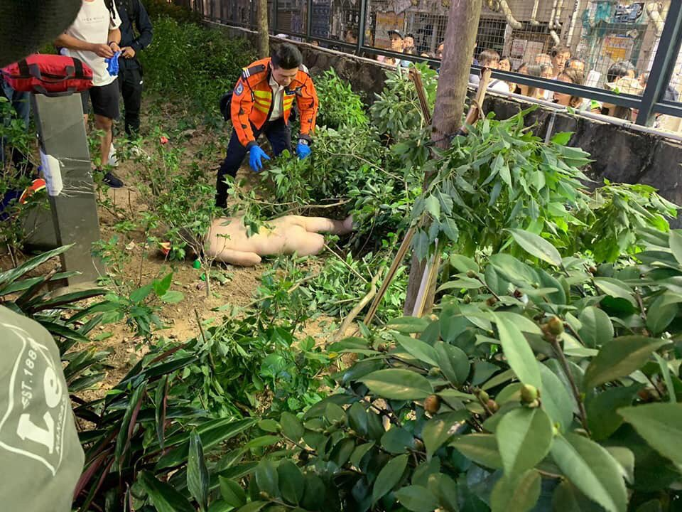
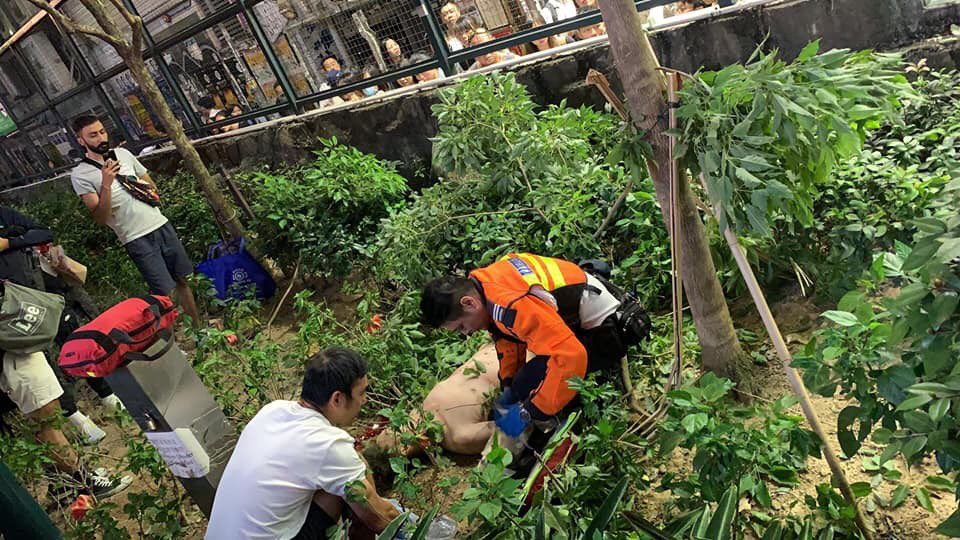
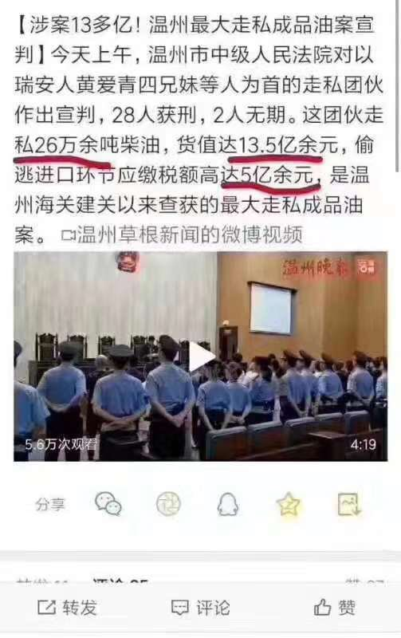

[11月08日 18:00]    纽约时报中文网   @nytchinese    中国试图清理银行系统过去无序扩张带来的不良贷款，但多家小型银行因此陷入困境。监管机构的行动令储户恐慌，有些地方出现挤兑潮，多名“散布谣言“者遭逮捕。
随着银行承受的压力越来越大，当局正在想方设法让它们得以维持，以免大规模的倒闭波及整个金融系统。 http://nyti.ms/32rps5U   :speech_balloon:评:1 :+1:赞:2 :globe_with_meridians:转:0  

[11月08日 17:30]    纽约时报中文网   @nytchinese    “你知道在集会上不能戴口罩吗？”一名警官对一名黑衣男子说。他援引的是上个月根据紧急权力法案颁布的蒙面禁令。
“这是葬礼，你疯了吗？”另一个人对他喊道。 http://nyti.ms/2PTss8q   :speech_balloon:评:4 :+1:赞:13 :globe_with_meridians:转:4  

[11月08日 17:08]    新闻大吐槽   @TuCaoFakeNews    罢它一个月，港共政府就会疯掉。  :speech_balloon:评:1 :+1:赞:3 :globe_with_meridians:转:1  

[11月08日 17:01]    BBC News 中文   @bbcchinese    中国《中央电视台》主播录制视频宣传中国对台举措，并喊话“湾湾回家吧”。这样有没有拉拢到你的心？ https://bbc.in/2CrruIo   :speech_balloon:评:77 :+1:赞:31 :globe_with_meridians:转:9  

[11月08日 16:57]    新闻大吐槽   @TuCaoFakeNews    一首充滿香港人悲憤和淚水的歌 年輕人血和惡夢的歌 還想期望得到尊重和認同嗎 歌曲播出時 腦裏滿滿都要惡毒的罵聲和冷冷的諷刺...國家都容不下我們 談什麼血濃於水  :speech_balloon:评:0 :+1:赞:3 :globe_with_meridians:转:2  

[11月08日 16:41]    新闻大吐槽   @TuCaoFakeNews    民憤了 https://twitter.com/tucaofakenews/status/1192705750646153222 …  :speech_balloon:评:0 :+1:赞:8 :globe_with_meridians:转:3  

[11月08日 16:37]    新闻大吐槽   @TuCaoFakeNews    跟江峰预测的分毫不差
暂停区议会选举是刺何案的目的
幕后有人在运作  :speech_balloon:评:0 :+1:赞:9 :globe_with_meridians:转:2  

[11月08日 16:35]    新闻大吐槽   @TuCaoFakeNews    自己逃到外國、但不可別人要自由民主、什麼心理呀？ https://twitter.com/tucaofakenews/status/1192653819437404161 …  :speech_balloon:评:2 :+1:赞:8 :globe_with_meridians:转:5  

[11月08日 16:31]    新闻大吐槽   @TuCaoFakeNews    人心向背 自在公道人心 https://twitter.com/tucaofakenews/status/1192510433946566657 …  :speech_balloon:评:0 :+1:赞:13 :globe_with_meridians:转:3  

[11月08日 16:29]    新闻大吐槽   @TuCaoFakeNews    转：明殺、暗殺，佢唔係第一個，也都唔會係最後一個。
CCP嘅目的，就係想殺晒港人五大訴求嘅希望！
話俾你地嗰班扑街克警知：絕無可能！
你啲如此濫捕濫殺嘅行為，只會激起港人如火山爆發嘅反抗！
CCP，滅咗你嘅仇恨種子正發咁芽！
時機一到，一定要你的斷子絕孫！
你的唔配有後代⋯⋯
因為你的係魔鬼  :speech_balloon:评:0 :+1:赞:8 :globe_with_meridians:转:2  

[11月08日 16:29]    新闻大吐槽   @TuCaoFakeNews    所谓图穷匕见  :speech_balloon:评:0 :+1:赞:2 :globe_with_meridians:转:2  

[11月08日 16:26]    新闻大吐槽   @TuCaoFakeNews    果然被江峰說對了  :speech_balloon:评:0 :+1:赞:6 :globe_with_meridians:转:1  

[11月08日 16:25]    新闻大吐槽   @TuCaoFakeNews    何君尧演完戏，后续的动作跟上了 https://twitter.com/ivy0118/status/1192607292358713344 …  :speech_balloon:评:9 :+1:赞:30 :globe_with_meridians:转:17  

[11月08日 16:23]    新闻大吐槽   @TuCaoFakeNews    看着看着，我眼泪都流下来了。大陆匪共要如何得到香港人的心，即时收回香港，没有人心民意的支持，你抓得完吗？民主自由的种子终于在香港这块土地上生根发芽了，为香港人感到自豪自豪 https://twitter.com/tucaofakenews/status/1192510433946566657 …  :speech_balloon:评:0 :+1:赞:15 :globe_with_meridians:转:5  

[11月08日 16:17]    新闻大吐槽   @TuCaoFakeNews    这很难不让人联想起六七暴动时被左派烧死的电台主持林彬  :speech_balloon:评:0 :+1:赞:1 :globe_with_meridians:转:1  

[11月08日 16:16]    老司机   @h5lpykl7tp6jjop    人民军队属于党，
全党听从党中央，
中央都服总书记，
党总书记是皇上，
书记自小看书多，
大海掀翻小池塘，
满朝文武藏绿卡，
半壁江山养美娘，
有钱非洲去撒币，
没钱各地倒银行，
半边脸笑骗台湾，
暗中派兵杀香港，
谈判川普吊胃口，
不管肉价天天涨，
景山那稞老槐树，
就是皇上的下场！  :speech_balloon:评:0 :+1:赞:41 :globe_with_meridians:转:13  

[11月08日 16:16]    新闻大吐槽   @TuCaoFakeNews    不是谋杀是什么  :speech_balloon:评:0 :+1:赞:1 :globe_with_meridians:转:1  

[11月08日 16:15]    新闻大吐槽   @TuCaoFakeNews    ”我们会查明你和CGTN的关系，并向德国政府以间谍罪指控你“

這才是有效限制它們擴大惡行的重點
把它們的身份長相公佈會幫助更多人/企業減少被欺騙被滲透  :speech_balloon:评:0 :+1:赞:3 :globe_with_meridians:转:1  

[11月08日 16:15]    财经真相   @caijingxiang    明天将公布10月CPI年率，目前市场预计为3.3%，从今年3月份开始，本轮通胀开始，目前正在加速上涨！  :speech_balloon:评:8 :+1:赞:46 :globe_with_meridians:转:23  

[11月08日 16:10]    新闻大吐槽   @TuCaoFakeNews    这是不是共党蓄意谋杀，制造恐怖？ https://twitter.com/panzerwong/status/1192417365343891456 …  :speech_balloon:评:6 :+1:赞:22 :globe_with_meridians:转:5  

[11月08日 16:00]    纽约时报中文网   @nytchinese    在周五举行的毕业典礼上，香港科技大学校长史维提议为周梓乐默哀一分钟。在典礼重新开始前，他用纸巾擦掉眼泪。
该校学生会在校园里举行了默哀和游行活动。还有人聚集在中环地区举行纪念仪式，并与到场的警察发生口角。 http://nyti.ms/2PTss8q   :speech_balloon:评:4 :+1:赞:11 :globe_with_meridians:转:5  

[11月08日 15:57]    新闻大吐槽   @TuCaoFakeNews    愿周同学安息 https://twitter.com/lz_64/status/1192684395812966401?s=19 …  :speech_balloon:评:0 :+1:赞:12 :globe_with_meridians:转:3  

[11月08日 15:46]    新闻大吐槽   @TuCaoFakeNews    合格毕业生，为香港教育点赞  :speech_balloon:评:0 :+1:赞:7 :globe_with_meridians:转:2  

[11月08日 15:44]    新闻大吐槽   @TuCaoFakeNews    殺孩子的政權！！！Evil CCP!!!  :speech_balloon:评:1 :+1:赞:25 :globe_with_meridians:转:8  

[11月08日 15:30]    纽约时报中文网   @nytchinese    多年来，阿文图拉科技公司向美国军方出售的监控摄像机等监控设备，包装盒上贴有“美国制造”的标签和星条旗标识。
这些设备安装在多个军方和政府机构内，该公司及七名员工因隐瞒产品原产地受到刑事指控。检方表示，这些设备易受黑客攻击，同时存在被中国用于间谍活动的可能性。 http://nyti.ms/36JoK77   :speech_balloon:评:22 :+1:赞:43 :globe_with_meridians:转:24  

[11月08日 14:51]    纽约时报中文网   @nytchinese    22岁的周梓乐可能是警方与示威者之间的对抗而直接导致死亡的首位死者。但他坠落的原因目前仍不清楚。
一些抗议者推测，催泪瓦斯或尝试躲避警方可能是周梓乐坠楼的原因。但是该该建筑所有者周三公布的监控视频显示，在周梓乐坠落之前，该停车场并没有出现警察或大量的催泪瓦斯。 http://nyti.ms/2PTss8q   :speech_balloon:评:24 :+1:赞:27 :globe_with_meridians:转:11  

[11月08日 14:01]    BBC News 中文   @bbcchinese    水泥墙，挡得住人身挡不住音乐；斯塔西，重拳大棒压不死年轻人对自由的向往.....摇滚声越来越大，柏林墙轰然倒塌。 https://bbc.in/33taPA7   :speech_balloon:评:26 :+1:赞:115 :globe_with_meridians:转:50  

[11月08日 14:00]    纽约时报中文网   @nytchinese    中美双方官员均表示，两国的初步贸易协议将取消他们对彼此产品征收的部分关税。
这是美国首次同意取消对价值3600亿美元中国商品征收的关税。这一进展表明，双方距离达成协议更近了一步，协议将减轻企业和消费者因关税带来的额外成本而承受的负担。 http://nyti.ms/2WSjHga   :speech_balloon:评:9 :+1:赞:15 :globe_with_meridians:转:8  

[11月08日 13:30]    纽约时报中文网   @nytchinese    卢浮宫本身并不存在拥挤的问题。只是有《蒙娜丽莎》的问题。其他任何标志性的画作都无法像蒙娜丽莎那样垄断整个博物馆的注意力。
如果游客数量继续增长，如果去年的1000万游客明年变成1100万或1200万，这个地方就会崩溃。 http://nyti.ms/33sWuE2   :speech_balloon:评:2 :+1:赞:10 :globe_with_meridians:转:7  

[11月08日 13:21]    老司机   @h5lpykl7tp6jjop    起底变态杀人犯  :speech_balloon:评:1 :+1:赞:5 :globe_with_meridians:转:5  

[11月08日 13:07]    GFHG SDKM   @zyx_yny    数日前、香港の大学生がデモ現場で血を流し倒れた姿で発見され、今朝亡くなりました。彼は催涙弾から逃れようとして3階から2階に転落したとされていますが、真相はまだ不明です。警察が救急隊を妨害し、到着が遅くなったことが死因の一つという証言があります。政府は真相究明に全力を注ぐべきです  :speech_balloon:评:237 :+1:赞:9451 :globe_with_meridians:转:6157  

[11月08日 13:02]    BBC News 中文   @bbcchinese    意大利西西里岛的标志美食油炸饭团口感独特，寓意团结，备受欢迎，但出人意料的是，油炸饭团的名字竟引起岛民的争论。 https://bbc.in/36E4bt3   :speech_balloon:评:6 :+1:赞:23 :globe_with_meridians:转:8  

[11月08日 13:00]    纽约时报中文网   @nytchinese    #每日一词 Recanvass，复核。美国肯塔基州州长选举告一段落，现任州长、共和党人马特·贝文以5000票之差败北。面对败选，贝文呼吁全州重新检票(recanvass)。
Recanvass一词意为重新细查，尤指选举委员会或其他选举官员对选举结果的审查。更多简报内容： http://nyti.ms/2WRzoo3   :speech_balloon:评:0 :+1:赞:0 :globe_with_meridians:转:0  

[11月08日 12:59]    GFHG SDKM   @zyx_yny    RIP Chow Tsz-lok #周梓樂  The student protestor who fell from a car park passed away today. He fell from 3rd to 2nd floor while riot police firing tear gas in the area. 
#StandWithHongKong
#HongKongPolice
#PoliceBrutality 

link for portrait downloading： https://drive.google.com/open?id=1J6CU3W9MSTPjOG7dxhGC-B8-ky9IC2Jz …  :speech_balloon:评:43 :+1:赞:653 :globe_with_meridians:转:511  

[11月08日 12:52]    老司机   @h5lpykl7tp6jjop    今日评论：  :speech_balloon:评:0 :+1:赞:23 :globe_with_meridians:转:17  

[11月08日 12:33]    GFHG SDKM   @zyx_yny    RIP... #HKprotesters #HKPoliceTerrorism  :speech_balloon:评:0 :+1:赞:1 :globe_with_meridians:转:2  

[11月08日 12:30]    纽约时报中文网   @nytchinese    周一凌晨在警方与抗议者发生冲突期间坠楼的港科大学生周梓乐不治身亡。
香港反政府示威已持续数月，在暴力冲突不断加剧之际，这一事态发展可能将加剧公众的愤怒。 http://nyti.ms/2PTss8q   :speech_balloon:评:89 :+1:赞:144 :globe_with_meridians:转:70  

[11月08日 12:07]    新闻大吐槽   @TuCaoFakeNews    美公司伪装中国设备出售 6人被逮捕

位于纽约长岛的一家科技公司，不仅涉嫌隐瞒 进口中国生产的安全及监控设备，还谎称设备是“美国制造”并转售给美国政府，11月7日，美国联邦检察官宣布，已经起诉了该公司。  :speech_balloon:评:3 :+1:赞:50 :globe_with_meridians:转:30  

[11月08日 12:00]    纽约时报中文网   @nytchinese    • 英国女王向皮草“说不”：白金汉宫证实，现年93岁的伊丽莎白二世将不再购买皮草服装；但她仍会在正式场合穿有毛皮里衬的官方礼服。
• 英国警方证实，卡车惨案39名受害者均为越南籍。警方称已确认这八名女性和31名男性的身份，他们的家人已得到通知。
更多简报内容： http://nyti.ms/2WRzoo3   :speech_balloon:评:0 :+1:赞:1 :globe_with_meridians:转:0  

[11月08日 11:58]    新闻大吐槽   @TuCaoFakeNews    香港中大科大生毕业礼上抗议

中文大学和科技大学昨日分别举行毕业礼，两间大学学生趁机表达诉求。播放中共国歌时，大批学生高喊口号，抗议声此起彼伏。有毕业生高举写有“无惧枪弹 捍卫真相”的横幅，高叫“天灭中共”等口号，并高唱《愿荣光归香港》。许多毕业生在烽火台前的“天灭中共”标语前拍毕业照。  :speech_balloon:评:4 :+1:赞:52 :globe_with_meridians:转:18  

[11月08日 11:45]    GFHG SDKM   @zyx_yny    周同學出事當晚
當晚凌晨3點48分，尚德A停車場2-3/F：
NL1882
VH8082
HN6066
DM2782
2樓
-
HF391
RN6567
NZ7961
3樓
-
*LB4938
PB8826
RC5871*
2樓案發位置對正
-
FL3298
TZ8746
SN4147
BG3938
WA4497
VY4660
TL8381
SD6659
SV9700
BG3938 （最尾望晒全層嗰架）
3樓其餘車

求片  :speech_balloon:评:8 :+1:赞:307 :globe_with_meridians:转:325  

[11月08日 11:36]    GFHG SDKM   @zyx_yny     https://twitter.com/freedomhkg/status/1191748873888452609?s=21 …
#HKPoliceTerrorism #StandWithHongKong
#HKHumanRightsandDemocracyAct  :speech_balloon:评:4 :+1:赞:129 :globe_with_meridians:转:144  

[11月08日 11:18]    BBC News 中文   @bbcchinese    【香港“反送中”示威】在星期一凌晨防暴警察驱散将军澳示威者期间被发现从高处堕下的香港科技大学学生周梓乐，延至星期五早上不治，终年22岁。 https://bbc.in/2Cmks7J   :speech_balloon:评:172 :+1:赞:337 :globe_with_meridians:转:221  

[11月08日 11:00]    纽约时报中文网   @nytchinese    • 乌克兰曾计划向特朗普低头，答应“交换条件”。调查发现，乌克兰政府原定于在CNN上宣布对特朗普政敌展开调查，但特朗普在国内压力下解冻了对乌援助，乌方顺势取消了露面计划。  
• 知情人士称前纽约市市长、亿万富商布隆伯格正在积极准备参加民主党总统初选。更多简报内容： http://nyti.ms/2WRzoo3   :speech_balloon:评:0 :+1:赞:2 :globe_with_meridians:转:2  

[11月08日 10:48]    GFHG SDKM   @zyx_yny    #HongKong Chow Tsz Lok, university student who had been severely injured in car park fall, passed away this morning at 8.

醫院證實墮樓科大生周梓樂今早約8時死亡

Rest in peace.

#HongKongProstests https://news.rthk.hk/rthk/ch/component/k2/1490724-20191108.htm …  :speech_balloon:评:93 :+1:赞:606 :globe_with_meridians:转:697  

[11月08日 10:41]    GFHG SDKM   @zyx_yny    BREAKING: This HKUST student, Alex Chow, has just passed away. https://twitter.com/demosisto/status/1191068794602414081 …  :speech_balloon:评:264 :+1:赞:1621 :globe_with_meridians:转:1831  

[11月08日 10:32]    老司机   @h5lpykl7tp6jjop    中国富豪榜TOP10：不见王健林 身家缩水惊人

一年一度的福布斯中国富豪榜出炉了，几家欢喜几家愁。领跑榜单的除了“二马”、许家印之外，也有拼多多黄峥这样的“生面孔”。

而王健林的财产缩水最多，达到682亿元，从去年的第4一下子跌到第14。李彦宏的身家则从1007.4亿跌至537.4亿，排名从第8名跌至第35。  :speech_balloon:评:2 :+1:赞:11 :globe_with_meridians:转:9  

[11月08日 10:30]    纽约时报中文网   @nytchinese    在中国大陆，习近平已迫使中共控制的立法结构作出了意义深远的变化。
但一些专家表示，香港源自英国的法律体系，可能会让中国大陆把针对国家安全犯罪的法律直接强加于香港的任何企图复杂化，甚至受挫。 http://nyti.ms/2PTEbnt   :speech_balloon:评:1 :+1:赞:4 :globe_with_meridians:转:1  

[11月08日 10:15]    纽约时报中文网   @nytchinese    为何中共在香港难以推进国家安全立法 by @ChuBailiang  http://nyti.ms/2PTEbnt https://twitter.com/ccni/status/1192362409719037952 …  :speech_balloon:评:2 :+1:赞:6 :globe_with_meridians:转:0  

[11月08日 10:04]    纽约时报中文网   @nytchinese    早安！今日重点新闻包括：
中美贸易谈判现曙光；中国制造监控设备流入美政府；中国试图整顿银行系统；乌克兰曾计划答应特朗普“交换条件”；中国判处一名芬太尼走私犯死缓；布隆伯格积极筹备参加2020大选；英国警方证实卡车案39名受害者均为越南籍……NYT简报带你速览今日要闻。 http://nyti.ms/2WRzoo3   :speech_balloon:评:8 :+1:赞:15 :globe_with_meridians:转:6  

[11月08日 09:30]    纽约时报中文网   @nytchinese    中国官员正在讨论创建一种与中国的真实货币人民币挂钩、更容易追踪的加密货币。这可能使中国放松对人民币在境外使用方式的限制，同时牢牢保持最终控制权。
中国利用货币控制来加强对金融体系的管理，但长期以来，也一直羡慕美元在世界各地的广泛使用给美国带来的权力与影响力。 http://nyti.ms/33rTszU   :speech_balloon:评:3 :+1:赞:7 :globe_with_meridians:转:4  

[11月08日 08:06]    BBC News 中文   @bbcchinese    波音787梦幻客机有安全隐患，而大部分人都不知道？ https://bbc.in/2pHpcCw   :speech_balloon:评:11 :+1:赞:27 :globe_with_meridians:转:12  

[11月08日 07:45]    BBC News 中文   @bbcchinese    弹劾调查的重心聚焦在指控特朗普向乌克兰施压，令其对特朗普的政治对手拜登（Joe Biden）展开调查。 https://bbc.in/2JUGcvR   :speech_balloon:评:2 :+1:赞:11 :globe_with_meridians:转:5  

[11月08日 07:21]    BBC News 中文   @bbcchinese    1989年最令人瞩目的一个大事件便是震惊世界的“柏林墙倒塌”，迄今已整整30周年。 https://bbc.in/33pBQEM   :speech_balloon:评:15 :+1:赞:226 :globe_with_meridians:转:93  

[11月08日 06:51]    BBC News 中文   @bbcchinese    几时签？在哪签？怎么签？ https://bbc.in/2WT5cIX   :speech_balloon:评:15 :+1:赞:20 :globe_with_meridians:转:5  

[11月08日 02:33]    老司机   @h5lpykl7tp6jjop    中文大学毕业典礼现场，当奏校歌时，同学们还都面向主席台，可当开始播放红朝国歌时，所有同学全体转身，背对主席台，同时举起标语，高喊时代革命！

香港好同学！世界上所有正义人士都已经为你们亮灯！请转身！  :speech_balloon:评:257 :+1:赞:2947 :globe_with_meridians:转:1169  

[11月08日 02:33]    新闻大吐槽   @TuCaoFakeNews    中文大学毕业典礼现场，当奏校歌时，同学们还都面向主席台，可当开始播放红朝国歌时，所有同学全体转身，背对主席台，同时举起标语，高喊时代革命！

香港好同学！世界上所有正义人士都已经为你们亮灯！请转身！  :speech_balloon:评:257 :+1:赞:2948 :globe_with_meridians:转:1169  

[11月08日 00:58]    墙国铁拳现世报😷   @Socialistfist    彻底翻了 https://twitter.com/tdtw/status/1192485721698897920 …  :speech_balloon:评:23 :+1:赞:443 :globe_with_meridians:转:85  

[11月07日 22:56]    BBC News 中文   @bbcchinese    止痛药芬太尼的合成药物，因价格低廉而功效更强（能比海洛因强50倍），正越来越多地被美国人当作毒品滥用。 https://bbc.in/2JWq5xW   :speech_balloon:评:23 :+1:赞:66 :globe_with_meridians:转:26  

[11月07日 22:01]    GFHG SDKM   @zyx_yny    Chinese tourists' uncivilised behaviours on the beautiful Miyako Island, Japan: throwing rubbish onto the beach.

Every Wednesday cruise ships carry loads of Chinese tourists to the Island; local residents call it:

"Wednesdays of Demons"  :speech_balloon:评:56 :+1:赞:588 :globe_with_meridians:转:445  

[11月07日 21:34]    BBC News 中文   @bbcchinese    美国宇航局的前高级顾问凯西·劳里尼(Kathy Laurini)的话说，“他们（中国人）设立战略性，长期性的目标，而且为达到这些目标进行专注的，系统性的努力。” https://bbc.in/33tG6CY   :speech_balloon:评:10 :+1:赞:19 :globe_with_meridians:转:7  

[11月07日 21:30]    纽约时报中文网   @nytchinese    根据卢浮宫的调查，大约80%的游客来这里是为看《蒙娜丽莎》——而大多数人离开时都不开心。在这个大众旅游和数字自恋的时代，蒙娜丽莎成了一个反艺术的黑洞，把博物馆翻了个底朝天。
卢浮宫是时候承认失败了。蒙娜丽莎该走了。 http://nyti.ms/33sWuE2   :speech_balloon:评:16 :+1:赞:70 :globe_with_meridians:转:19  

[11月07日 21:00]    纽约时报中文网   @nytchinese    #观点 德国创业者莱茵甘斯让员工把手机放在办公室的包里，并屏蔽公司网络上的社交媒体。严格的规定减少了花在会议上的时间。
或许最重要的是，他的员工如今每天只查看两次工作邮件——没有冗长的来回交流分散他们的注意力，也没有在晚饭时或在场边看孩子打比赛时偷偷查看收件箱。 http://nyti.ms/2NrZF9j   :speech_balloon:评:0 :+1:赞:11 :globe_with_meridians:转:4  

[11月07日 20:48]    GFHG SDKM   @zyx_yny    Wow! What a great news!

Thank you so much for #StandWithHongKong  :speech_balloon:评:0 :+1:赞:33 :globe_with_meridians:转:4  

[11月07日 20:43]    GFHG SDKM   @zyx_yny    A cross-party group of MPs in the UK has launched a new group to promote democracy and challenge human rights abuses in Hong Kong. 
Thank you officers in the All Party Parliamentary Group (APPG)!
You can't imaging how grateful we, the #HongKongers are!
#StandwithHK  :speech_balloon:评:261 :+1:赞:2429 :globe_with_meridians:转:2141  

[11月07日 20:30]    纽约时报中文网   @nytchinese    中国国家禁毒委副主任于海滨表示，对涉案人员的重判彰显了中国严惩芬太尼类物质犯罪的立场和决心。他也重申，导致美国芬太尼类物质滥用的主因是其自身原因，中国受到了不公平的指责。
他称即使中国加强了与美国执法机构的合作并加强出口管制，美国药物过量的死亡人数仍在上升。 http://nyti.ms/32pIwRG   :speech_balloon:评:57 :+1:赞:6 :globe_with_meridians:转:4  

[11月07日 20:16]    墙国铁拳现世报😷   @Socialistfist    官媒已经意识到翻船，已经控评  :speech_balloon:评:6 :+1:赞:188 :globe_with_meridians:转:13  

[11月07日 20:01]    BBC News 中文   @bbcchinese    【英国上议院讨论BN(O)居英权问题】英国上议院讨论是否赋予持有BN(O)的香港人居留英国的权利，芬利女男爵认为英国对所有类别的英国护照持有者有道义责任，不能抛弃他们的权利和义务。而前港督则认为英国不能，也不应该试图告诉香港政府怎么做。 https://bbc.in/2Nnnwac   :speech_balloon:评:36 :+1:赞:35 :globe_with_meridians:转:13  

[11月07日 19:57]    GFHG SDKM   @zyx_yny    (Sensitive Content/ 慎入) 

Another death found in Mongkok today/ 大約6點，旺角家樂坊隔離有年輕男子全裸從高處墮下。

#香港 #香港人反抗 #StandWithHongKong #PoliceBrutality  :speech_balloon:评:130 :+1:赞:724 :globe_with_meridians:转:837  

[11月07日 19:52]    纽约时报中文网   @nytchinese    #观点 早上8点到公司，下午1点离开，此后直到第二天早上都不工作。听起来是不是很吸引人？
如今，工作占据了我们越来越多醒着的时间，许多人疲于应付没完没了的工作和爆满的收件箱。一项创新实践说明，可能有更好的方式，让你的大脑以更好、更可持续的方式提供有价值的产出。 http://nyti.ms/2NrZF9j   :speech_balloon:评:9 :+1:赞:23 :globe_with_meridians:转:10  

[11月07日 19:52]    财经真相   @caijingxiang    人民银行于2019年11月7日在香港成功发行300亿元人民币央行票据，其中3个月期央行票据200亿元，1年期央行票据100亿元，中标利率均为2.90%。此次发行受到市场欢迎，全场投标总量超过640亿元，是发行量的2.1倍。以前投标量是发放量的十几倍！  :speech_balloon:评:12 :+1:赞:107 :globe_with_meridians:转:35  

[11月07日 19:01]    BBC News 中文   @bbcchinese    农民少，耕地少，日本在劳动力和耕地严重短缺的情况下，如何推动农业革命，确保国人吃饱、吃好、吃放心？ https://bbc.in/2Q1udjI   :speech_balloon:评:15 :+1:赞:131 :globe_with_meridians:转:53  

[11月07日 19:00]    纽约时报中文网   @nytchinese    在习近平的领导下，中国官员在监管大型科技公司方面采取了更有力的措施，推动它们帮助传播中国共产党倡导的文化价值观。
电子游戏已经成为一个普遍的目标。官方媒体将一些游戏比作“毒药”，并以过于暴力为由，禁掉了一些游戏。 http://nyti.ms/2PV2PUw   :speech_balloon:评:9 :+1:赞:13 :globe_with_meridians:转:6  

[11月07日 18:46]    墙国铁拳现世报😷   @Socialistfist    往期的铁拳都是精确制导战斧
这次的铁拳像是战术型核导弹 https://twitter.com/zhanglucy88/status/1192387643977265152 …  :speech_balloon:评:63 :+1:赞:494 :globe_with_meridians:转:160  

[11月07日 18:37]    墙国铁拳现世报😷   @Socialistfist    门面有价，国旗无价。
丢了门面，得了国旗，
万能的推友们你们说说，她是不是赚了？
图二原微博已经被删
#社会主义铁拳  :speech_balloon:评:45 :+1:赞:387 :globe_with_meridians:转:94  

[11月07日 18:09]    GFHG SDKM   @zyx_yny    @zyx_yny @BannedBigot @Mavis13945654 @JoachimWatson @realKyleOlbert @KerAngry @GuoLibrary @SolomonYue @dewolfleloup @hkdemonow another video appears. Chow didnt run to escape tg. A tall black figure seen in it. He was running fm him  :speech_balloon:评:2 :+1:赞:2 :globe_with_meridians:转:2  

[11月07日 18:01]    BBC News 中文   @bbcchinese    澳大利亚可以避开来自中国的投资、学生以及机会，有时亦确实如此，华为便是一个例子。但是，这样的大规模尝试，例如在印度太平洋寻求其他合作伙伴关系，将意味着巨大的牺牲 https://bbc.in/2JYuCQm   :speech_balloon:评:13 :+1:赞:28 :globe_with_meridians:转:13  

[11月07日 17:32]    BBC News 中文   @bbcchinese    【树洞救援队：中国志愿者网络用AI救援自杀者】这个由600多名分布在中国各地的志愿者自发建立的AI救援队，已救回超过700名轻生者。 https://www.bbc.com/zhongwen/simp/science-50313320 …  :speech_balloon:评:3 :+1:赞:25 :globe_with_meridians:转:13  

[11月07日 17:06]    墙国铁拳现世报😷   @Socialistfist    #社会主义铁拳  https://twitter.com/anebubucho/status/1192294894385025024 …  :speech_balloon:评:13 :+1:赞:142 :globe_with_meridians:转:27  

[11月07日 17:01]    BBC News 中文   @bbcchinese    丹麦绘画大师哈莫修依和他笔下空荡荡的室内场景，始终像谜一般的存在。他的作品唤起寂静，带出一种强烈存在的孤立感。 https://bbc.in/2PYZVhw   :speech_balloon:评:2 :+1:赞:17 :globe_with_meridians:转:8  

[11月07日 16:03]    BBC News 中文   @bbcchinese    在火车站或地铁设置人脸识别功能的监视系统，你觉得洽当吗？ https://bbc.in/2NpZbk0   :speech_balloon:评:115 :+1:赞:62 :globe_with_meridians:转:15  

[11月07日 15:39]    财经真相   @caijingxiang    商务部新闻发言人高峰在7日的新闻发布会上表示，如果(中美)双方达成第一阶段协议，应当根据协议内容，同步等比率取消已加征关税，这是达成协议的重要条件。“同等比率”就是说中国对美国征收1000亿，取消500亿，就是50%，美国5000亿，也要取消50%，即2500亿，而不是500亿!  :speech_balloon:评:85 :+1:赞:305 :globe_with_meridians:转:87  

[11月07日 15:20]    GFHG SDKM   @zyx_yny    What about these ?  :speech_balloon:评:2 :+1:赞:66 :globe_with_meridians:转:32  

[11月07日 15:19]    墙国铁拳现世报😷   @Socialistfist    #社会主义铁拳就是好呀就是好

中央今日宣布放开香港人在大湾区的购房条件，取消工作社保等限制。

护旗手闻讯，哀鸿遍野，如丧考妣。

本条推文链意在展示社会主义铁拳之下神州大地一片生灵涂炭的景象，共计二十多张截图，请大家随意享用，有助于排解郁闷，恢复一天好心情。  :speech_balloon:评:289 :+1:赞:1681 :globe_with_meridians:转:712  

[11月07日 14:03]    BBC News 中文   @bbcchinese    中国经济差了，网购生意反而好了，马云也更有钱了…… https://bbc.in/2WN6NAe   :speech_balloon:评:76 :+1:赞:78 :globe_with_meridians:转:24  

[11月07日 13:02]    BBC News 中文   @bbcchinese    英国议会跨党派报告指出，英国大学受专制国家干预，特别是中国及俄罗斯；大学代表则否认遭到系统性干预。大家怎么看？ https://bbc.in/2qxtAnG   :speech_balloon:评:70 :+1:赞:111 :globe_with_meridians:转:37  

[11月07日 12:53]    老司机   @h5lpykl7tp6jjop    这个戏还有必要继续演下去吗？ https://twitter.com/V8Vod4/status/1192251542901907458 …  :speech_balloon:评:32 :+1:赞:175 :globe_with_meridians:转:68  

[11月07日 11:57]    GFHG SDKM   @zyx_yny    I can’t believe that #hongkong Chief Magistrate Mr SO Wai-tak thinks a”laser pointer pen” is a weapon . It’s ridiculous. 

No more judicial independence in hongkong .  :speech_balloon:评:281 :+1:赞:2522 :globe_with_meridians:转:2606  

[11月07日 11:21]    财经真相   @caijingxiang    猪肉涨的多了，通胀被推高了，没事，把猪在通胀的权限降低就好了！这很中共，猪也必须要有党性！否则就要下调通胀权重！ https://twitter.com/reuterscn/status/1192279082345672705 …  :speech_balloon:评:23 :+1:赞:195 :globe_with_meridians:转:70  

[11月07日 11:17]    财经真相   @caijingxiang    中共外汇管理条例 第39条:有违法规定将境内外汇转移境外，或以欺骗手段逃汇行为的，由外管局责令限期调回外汇，处逃外汇金额30%以下的处罚；情节严重的，处30%以上等值以下的罚款；构成犯罪的，依法追究刑事责任！  :speech_balloon:评:17 :+1:赞:212 :globe_with_meridians:转:84  

[11月07日 11:06]    财经真相   @caijingxiang    满纸便民用汇，理性购汇，核心就一句话：你的钱，政府花！你的美元，权贵拿！  :speech_balloon:评:9 :+1:赞:190 :globe_with_meridians:转:76  

[11月07日 11:02]    BBC News 中文   @bbcchinese    学者说：“这可能意味着，地球上有些地方不再适合人类居住”。 https://bbc.in/2pPsi7c   :speech_balloon:评:9 :+1:赞:37 :globe_with_meridians:转:26  

[11月07日 10:36]    GFHG SDKM   @zyx_yny    A mainland Chinese student was using a knife to threaten the CUHK graduates who were peacefully protesting on campus. He was later taken away by the university security.  

Source: @appledaily_hk
#FreedomHK #HongKongProtests #FightForFreedom #StandwithHK  :speech_balloon:评:104 :+1:赞:763 :globe_with_meridians:转:775  

[11月07日 10:25]    老司机   @h5lpykl7tp6jjop    审判长怒斥被告人：
为啥要走私？
被告人答辩：看见中石化、中石油等国企年年亏损，平均每天亏损额两亿多，我们于心不忍，所以为国分忧……  :speech_balloon:评:0 :+1:赞:37 :globe_with_meridians:转:6  

[11月07日 10:18]    老司机   @h5lpykl7tp6jjop    考智商的新闻！  :speech_balloon:评:4 :+1:赞:54 :globe_with_meridians:转:31  

[11月07日 09:51]    财经真相   @caijingxiang    2018年6月贸易战的影响开始显现，地方政府被迫重新启动新一轮基建，为了筹集基建资金，中共几乎完全放开了地方债发行的所有限制，这些地方债的大头都被当地银行吃进，最终导致这些银行资金流减少，这就是后来央行拼命给中小银行降准的根源。我做的油管视频《从定向降准看背后的维稳逻辑》可以看一下  :speech_balloon:评:3 :+1:赞:123 :globe_with_meridians:转:22  

[11月07日 09:37]    财经真相   @caijingxiang    五月份时，央行连续分阶段大规模下调中小银行准备金率，当时我就觉得这里面很有问题，收集资料后才发现中小银行的大部分资金流都购买了地方政府债，尤其是区域小型市、县级地方银行，几乎成为了地方政府搞基建的提款机！  :speech_balloon:评:4 :+1:赞:127 :globe_with_meridians:转:23  

[11月07日 09:31]    财经真相   @caijingxiang    辽宁营口银行遭到挤兑，嗯，前几天还说大额提现要从严管理，现在知道目的了！快到年底结算时间了，会有更多惊喜出来！  :speech_balloon:评:11 :+1:赞:246 :globe_with_meridians:转:81  

[11月07日 09:13]    BBC News 中文   @bbcchinese    香港特首林郑月娥继早前与中国国家主席习近平会面后，在北京与中国政府主管香港和澳门事务的国务院副总理韩正会面，是三天内再次会见中国高层领导人。 https://bbc.in/32pXNC4   :speech_balloon:评:16 :+1:赞:37 :globe_with_meridians:转:12  

[11月07日 07:17]    GFHG SDKM   @zyx_yny    Respect the flag   :speech_balloon:评:63 :+1:赞:2409 :globe_with_meridians:转:1343  

[11月07日 06:38]    老司机   @h5lpykl7tp6jjop    嗜血罪犯、精神病、小资：俄罗斯颠覆列宁神话
俄罗斯国营第一电视频道（Pervy Kanal）即将播出的18集纪录片系列“列宁”（Lenin）中呈现出来的形象与苏联之前对其形象的宣传的的陈词滥调相距甚远：嗜血罪犯，精神病，小资产阶级。剧本的作者伊戈尔·列宾说，他的目的就是想要“终结苏维埃缔造者的神话”。  :speech_balloon:评:4 :+1:赞:17 :globe_with_meridians:转:9  

[11月07日 06:31]    老司机   @h5lpykl7tp6jjop    中国正处在各种危机越来越火烧眉毛的时候，习近平却突然大谈“区块链”，究竟是习近平卖弄学问，还是区块链技术确实有可能帮他解决中国的治理难题呢？但凡对区块链这个重大发明有点知识的人都知道，发明者的初衷是“去中心化”，而习近平则是一个极端迷信中央集权的人，他怎么突然会对区块链感兴趣了呢  :speech_balloon:评:0 :+1:赞:17 :globe_with_meridians:转:10  

[11月07日 06:08]    老司机   @h5lpykl7tp6jjop    跑得最彻底的中国富豪
有重庆李嘉诚之称的张松桥把342万平物业以55亿元卖给恒大集团，成都7个项目以32亿元卖给融创中国，到目前为止中渝置地几乎抛售了所有房地产，他斥巨资在英国、澳洲等地买下大量物业资产。以101亿元拿下伦敦最高建筑利德贺大楼，花25亿元买下了位于伦敦帕丁顿火车站附近的写字楼。  :speech_balloon:评:22 :+1:赞:336 :globe_with_meridians:转:85  

[11月06日 23:33]    墙国铁拳现世报😷   @Socialistfist    补图  :speech_balloon:评:6 :+1:赞:94 :globe_with_meridians:转:13  

[11月06日 23:33]    墙国铁拳现世报😷   @Socialistfist    研究表明，养猪场播放 「我和我的祖国」等爱国歌曲能有效提升肉质和食用者的爱国情操。
但由于猪肉肉价上涨，不少小粉红出现了营养不良，思想滑坡的不良现象。

#社会主义铁拳  :speech_balloon:评:31 :+1:赞:294 :globe_with_meridians:转:69  

[11月06日 23:30]    老司机   @h5lpykl7tp6jjop    吃草的日子近了！ https://twitter.com/ningxianhua/status/1192068553651970048 …  :speech_balloon:评:3 :+1:赞:27 :globe_with_meridians:转:15  

[11月06日 18:48]    墙国铁拳现世报😷   @Socialistfist    经热心推友补充，男主角是当地国保
坐实铁拳了  :speech_balloon:评:35 :+1:赞:214 :globe_with_meridians:转:63  

[11月06日 11:30]    老司机   @h5lpykl7tp6jjop    就是你在银行存了很多钱，现在想一次取10万，或者你的企业一次想取50万，对不起，他们要背着你商量一下，取不取给你，要看你怎么证明你必需要取这笔钱急用 ! 哪怕是取来救命，那也得要医院给你出证明 ! 这跟取大额现金提前申报是两码事 ! 为啥要这样做 ? 他们说预防犯罪 ! 其实就是缸里没米了......  :speech_balloon:评:33 :+1:赞:320 :globe_with_meridians:转:142  

[11月06日 11:23]    老司机   @h5lpykl7tp6jjop    曾经中国人也是这个样子，说世界人民都生活在水深火热之中，说要解放全世界！
后来才知道，在那个斗志昂扬的年代，饿死了几千万中国人。  :speech_balloon:评:51 :+1:赞:598 :globe_with_meridians:转:254  

[11月06日 11:15]    老司机   @h5lpykl7tp6jjop    中共的一带一路没有走出去，黑哥的一带一路一串串的冲进来了！现在是烫手山芋，无法解决，后患无穷！  :speech_balloon:评:5 :+1:赞:26 :globe_with_meridians:转:15  

[11月06日 11:06]    老司机   @h5lpykl7tp6jjop    现在老子又出来缴械投降了！  :speech_balloon:评:3 :+1:赞:6 :globe_with_meridians:转:2  

[11月06日 10:01]    老司机   @h5lpykl7tp6jjop    今日网评：什么是正确的价值观？  :speech_balloon:评:1 :+1:赞:9 :globe_with_meridians:转:11  

[11月06日 09:37]    财经真相   @caijingxiang    截止到今天各省市财政一般收入媒体已经报道过了，但是支出各省数据还未全部公布出来，我过几天整理出来，相信很有冲击力！  :speech_balloon:评:6 :+1:赞:114 :globe_with_meridians:转:21  

[11月06日 08:30]    GFHG SDKM   @zyx_yny    The people of Hong Kong are under assault by Communist China. They deserve our full support in their pursuit of freedom.

#HongKongHumanRightsAndDemocracyAct  :speech_balloon:评:2167 :+1:赞:12484 :globe_with_meridians:转:8131  

[11月06日 06:48]    老司机   @h5lpykl7tp6jjop    近几日，一则“走私僵尸肉上餐桌，最高肉龄超40年”的帖子上了热搜，一时间关于“僵尸肉”、“冷冻肉”的议论铺天盖地；什么是僵尸肉？肉龄超过40年还能吃吗？
改革开放当年走私手表，收录机，电视机，出口猪肉粮食蔬菜水果，几十年以后反过来，走私的改成出口的，出口的改成走私的，这是发展了还是倒退了？  :speech_balloon:评:3 :+1:赞:9 :globe_with_meridians:转:3  

[11月06日 06:35]    老司机   @h5lpykl7tp6jjop    北京马拉松女跑者偷能量胶发图炫耀
偷拿东西不以为耻反以为荣，中国人道德没底线到了没有最低只有更低的地步！  :speech_balloon:评:4 :+1:赞:25 :globe_with_meridians:转:14  

[11月06日 04:39]    GFHG SDKM   @zyx_yny    Parliament may be about to dissolve, but the work to #StandWithHongKong goes on.

The UK has a historic responsibility. And we should be a nation standing for #HumanRights, #democracy and the #RuleOfLaw. https://twitter.com/Stand_with_HK/status/1191799234493894656 …  :speech_balloon:评:332 :+1:赞:1771 :globe_with_meridians:转:1260  

[11月06日 03:27]    GFHG SDKM   @zyx_yny    【UK: Westminster cross-party group launched to promote democracy in Hong Kong】A historic move to demonstrate solidarity bn @UKParliament + HK people, new #APPGonHongKong launched. Co-chairs: @natalieben @amcarmichaelMP Thanks all attendees!
 http://bit.ly/2CguE1S 
#StandwithHK  :speech_balloon:评:66 :+1:赞:823 :globe_with_meridians:转:708  

[11月05日 22:27]    财经真相   @caijingxiang    前一段时间纳瓦罗说12月的关税是为了第二阶段谈判准备的筹码，美国官方至今没有明确表示完全取消这笔关税，只是回应说双方谈的很好，很快签第一阶段的协议，但是市场吊诡的是不但计价了正式签协议，还把12月份取消关税纳入其中，乐观情绪甚至把中方单边提出的取消9月份关税也计价了！  :speech_balloon:评:7 :+1:赞:56 :globe_with_meridians:转:9  

[11月05日 22:14]    财经真相   @caijingxiang    Politico和英国金融时报都报道称中国希望取消9月加征的关税，甚至争取取消所有关税，对此美国方面还未对此作出回应，但是市场竟然提前计价了，股市更是创下新高。现在特朗普的麻烦是，如果否认那么股市就会大跌，如果公开证实传言，则会对引发特朗普退让的指责，股市绑架下，干脆只能装聋作哑！ https://twitter.com/reuterscn/status/1191567937011961859 …  :speech_balloon:评:24 :+1:赞:129 :globe_with_meridians:转:33  

[11月05日 22:02]    财经真相   @caijingxiang    随着贸易战深入，美国贸易逆差缩小值创下三年最高，特朗普真的成功了吗？ https://twitter.com/zerohedge/status/1191712574989066240 …  :speech_balloon:评:9 :+1:赞:45 :globe_with_meridians:转:7  

[11月05日 20:48]    GFHG SDKM   @zyx_yny    "Standing in elections is a fundamental right enshrined in basic law" @DominicRaab speaking today. https://twitter.com/Stand_with_HK/status/1191697637759758337 …  :speech_balloon:评:153 :+1:赞:2120 :globe_with_meridians:转:1778  

[11月05日 19:54]    老司机   @h5lpykl7tp6jjop    中共患有强迫性精神病！它什么都想控制，上管天下管地，中间管空气，管思想管情绪还管生殖器！大街小巷楼房商场任何角落都有无数监视器，买菜刀剪刀实名制登记，上网登记，乘车乘船乘机登记，什么人脸视别，动态识别，挖空心思来监控人民，可它仍然不放心！莎翁说过：无限的权力只会毁掉它的占有者！  :speech_balloon:评:2 :+1:赞:70 :globe_with_meridians:转:13  

[11月05日 19:25]    墙国铁拳现世报😷   @Socialistfist    丈夫民警妻子教师，生第三胎被单位双双开除。

#社会主义铁拳  :speech_balloon:评:51 :+1:赞:438 :globe_with_meridians:转:149  

[11月05日 18:23]    财经真相   @caijingxiang    提前计价取消9月份的关税，这个明显是忽悠！  :speech_balloon:评:8 :+1:赞:29 :globe_with_meridians:转:4  

[11月05日 18:22]    财经真相   @caijingxiang    一外资行交易员表示，近日中美谈判利好不断，市场普遍处于乐观氛围中，加上此前并未过多期望已加征的关税能够取消，今天媒体相关报导远超预期，推动人民币强势走升。
“市场现在很敏感，今天这波走升比前两天要坚决一些，“不过对自营盘而言现在去追并不是好的策略，更多是在区间的边界上进行操作。 https://twitter.com/ReutersCN/status/1191654970690588672 …  :speech_balloon:评:6 :+1:赞:51 :globe_with_meridians:转:13  

[11月05日 16:32]    财经真相   @caijingxiang    破7前是顶，破7后是底！这个基本面还未改变，接下来要看央行中间价会不会大举破7！  :speech_balloon:评:8 :+1:赞:82 :globe_with_meridians:转:6  

[11月05日 16:21]    财经真相   @caijingxiang    人民币涨破7了，而且是在央行MLF降息的情况下进行的，宽松货币汇率升值，这操作就问你服不服！第一阶段协议的利好消化的差不多了，情绪乐观有点过度了，甚至开始计价减掉部分产品的关税，我的策略是继续做空，随便拉！  :speech_balloon:评:42 :+1:赞:305 :globe_with_meridians:转:56  

[11月05日 11:29]    财经真相   @caijingxiang    MLF降息5基点，股市涨疯了！  :speech_balloon:评:23 :+1:赞:151 :globe_with_meridians:转:21  

[11月05日 09:47]    墙国铁拳现世报😷   @Socialistfist    发推后，该用户微博改名，头像更换，微博删除至2016年内容  :speech_balloon:评:2 :+1:赞:102 :globe_with_meridians:转:10  

[11月05日 09:18]    财经真相   @caijingxiang    中国央行：为推动大额现金管理工作，探索大额现金管理实现路径，中国人民银行起草了《中国人民银行关于在河北省、浙江省、深圳市试点开展大额现金管理的通知（公开征求意见稿）》。  :speech_balloon:评:29 :+1:赞:181 :globe_with_meridians:转:67  

[11月05日 04:28]    凡賽堤/FORSETI   @FecharCCP    急救香港  #HKSOS！！！

天滅流氓政權！！！極權殺人恐怖組織正在用各種兇殘手段殺害我們的同胞..................................................

流氓政權的極權殺人恐怖組織蓄意謀殺香港年輕人！（13）

被暴力制服的年輕人已經休克，還殘暴折斷手！

兇殘，殘暴手段令人髮指到已經超越納粹！  :speech_balloon:评:0 :+1:赞:3 :globe_with_meridians:转:10  

[11月05日 04:25]    凡賽堤/FORSETI   @FecharCCP    急救香港  #HKSOS！！！

天滅流氓政權！！！極權殺人恐怖組織正在用各種兇殘手段殺害我們的同胞..................................................

流氓政權的極權殺人恐怖組織蓄意謀殺香港年輕人！（12）
兇殘，殘暴手段令人髮指到已經超越納粹！
天滅流氓政權！！！  :speech_balloon:评:1 :+1:赞:8 :globe_with_meridians:转:9  

[11月05日 04:24]    凡賽堤/FORSETI   @FecharCCP    急救香港  #HKSOS！！！

天滅流氓政權！！！極權殺人恐怖組織正在用各種兇殘手段殺害我們的同胞..................................................

流氓政權的極權殺人恐怖組織蓄意謀殺香港年輕人！（11）
兇殘，殘暴手段令人髮指到已經超越納粹！
天滅流氓政權！！！  :speech_balloon:评:0 :+1:赞:51 :globe_with_meridians:转:46  

[11月05日 04:23]    凡賽堤/FORSETI   @FecharCCP    急救香港  #HKSOS！！！

天滅流氓政權！！！極權殺人恐怖組織正在用各種兇殘手段殺害我們的同胞..................................................

流氓政權的極權殺人恐怖組織蓄意謀殺香港年輕人！（10）
兇殘，殘暴手段令人髮指到已經超越納粹！
天滅流氓政權！！！  :speech_balloon:评:0 :+1:赞:4 :globe_with_meridians:转:5  

[11月05日 04:19]    凡賽堤/FORSETI   @FecharCCP    急救香港  #HKSOS！！！

天滅流氓政權！！！極權殺人恐怖組織正在用各種兇殘手段殺害我們的同胞..................................................

流氓政權的極權殺人恐怖組織蓄意謀殺香港年輕人！（9）
兇殘，殘暴手段令人髮指到已經超越納粹！
天滅流氓政權！！！  :speech_balloon:评:1 :+1:赞:6 :globe_with_meridians:转:7  

[11月05日 04:16]    凡賽堤/FORSETI   @FecharCCP    急救香港  #HKSOS！！！

天滅流氓政權！！！極權殺人恐怖組織正在用各種兇殘手段殺害我們的同胞..................................................

流氓政權的極權殺人恐怖組織蓄意謀殺香港年輕人！（8）
兇殘，殘暴手段令人髮指到已經超越納粹！
天滅流氓政權！！！  :speech_balloon:评:1 :+1:赞:44 :globe_with_meridians:转:57  

[11月05日 04:13]    凡賽堤/FORSETI   @FecharCCP    急救香港SOS！！！

天滅流氓政權！！！極權殺人恐怖組織正在用各種兇殘手段殺害我們的同胞..................................................

流氓政權的極權殺人恐怖組織蓄意謀殺香港年輕人！（7）
兇殘，殘暴手段令人髮指到已經超越納粹！
天滅流氓政權！！！  :speech_balloon:评:2 :+1:赞:14 :globe_with_meridians:转:20  

[11月05日 04:10]    凡賽堤/FORSETI   @FecharCCP    急救香港SOS！！！

天滅流氓政權！！！極權殺人恐怖組織正在用各種兇殘手段殺害我們的同胞..................................................

流氓政權的極權殺人恐怖組織蓄意謀殺香港年輕人！（6）
兇殘，殘暴手段令人髮指到已經超越納粹！
天滅流氓政權！！！  :speech_balloon:评:1 :+1:赞:40 :globe_with_meridians:转:40  

[11月05日 04:07]    凡賽堤/FORSETI   @FecharCCP    急救香港SOS！！！

天滅流氓政權！！！極權殺人恐怖組織正在用各種兇殘手段殺害我們的同胞..................................................

流氓政權的極權殺人恐怖組織蓄意謀殺香港年輕人！（5）
兇殘，殘暴手段令人髮指到已經超越納粹！
天滅流氓政權！！！  :speech_balloon:评:0 :+1:赞:2 :globe_with_meridians:转:0  

[11月05日 04:06]    凡賽堤/FORSETI   @FecharCCP    急救香港SOS！！！

天滅流氓政權！！！極權殺人恐怖組織正在用各種兇殘手段殺害我們的同胞..................................................

流氓政權的極權殺人恐怖組織蓄意謀殺香港年輕人！（3）
兇殘，殘暴手段令人髮指到已經超越納粹！
天滅流氓政權！！！  :speech_balloon:评:1 :+1:赞:10 :globe_with_meridians:转:15  

[11月05日 04:05]    凡賽堤/FORSETI   @FecharCCP    急救香港SOS！！！

天滅流氓政權！！！極權殺人恐怖組織正在用各種兇殘手段殺害我們的同胞..................................................

流氓政權的極權殺人恐怖組織蓄意謀殺香港不同意見的議員！（2）

兇殘，殘暴手段令人髮指到已經超越納粹！
天滅流氓政權！！！  :speech_balloon:评:0 :+1:赞:3 :globe_with_meridians:转:3  

[11月05日 04:04]    凡賽堤/FORSETI   @FecharCCP    急救香港SOS！！！

天滅流氓政權！！！極權殺人恐怖組織正在用各種兇殘手段殺害我們的同胞..................................................

流氓政權的極權殺人恐怖組織蓄意謀殺香港年輕人！（1）
兇殘，殘暴手段令人髮指到已經超越納粹！
天滅流氓政權！！！  :speech_balloon:评:1 :+1:赞:8 :globe_with_meridians:转:7  

[11月04日 22:43]    墙国铁拳现世报😷   @Socialistfist    #社会主义铁拳 https://twitter.com/Time_HorizonX/status/1191288775348908032 …  :speech_balloon:评:16 :+1:赞:326 :globe_with_meridians:转:89  

[11月04日 13:33]    财经真相   @caijingxiang    猪肉涨了，鸡肉也要涨了！  :speech_balloon:评:52 :+1:赞:190 :globe_with_meridians:转:59  

[11月03日 08:23]    凡賽堤/FORSETI   @FecharCCP    他們不配稱警察，他們是納粹的狗！魔鬼般的瘋狗！

極權殺人恐怖組織正在用各種兇殘手段殺害我們的同胞..................................................

滅絕人性對待老人  :speech_balloon:评:4 :+1:赞:45 :globe_with_meridians:转:44  

[11月03日 08:16]    凡賽堤/FORSETI   @FecharCCP    他們不配稱警察，他們是納粹的狗！魔鬼般的瘋狗！

極權殺人恐怖組織正在用各種兇殘手段殺害我們的同胞..................................................

無辜港民被納粹的狗打破頭！  :speech_balloon:评:1 :+1:赞:4 :globe_with_meridians:转:3  

[11月03日 08:12]    凡賽堤/FORSETI   @FecharCCP    他們不配稱警察，他們是納粹的狗！魔鬼般的瘋狗！

極權殺人恐怖組織正在用各種兇殘手段殺害我們的同胞..................................................

我們唯一能救她們的就是瘋狂轉發，讓全世界都知道！才有可能不會極權殺人恐怖組織暗殺，被墜樓，被自殺，被棄屍！  :speech_balloon:评:0 :+1:赞:6 :globe_with_meridians:转:6  

[11月03日 08:05]    凡賽堤/FORSETI   @FecharCCP    他們不配稱警察，他們是納粹的狗！魔鬼般的瘋狗！

極權殺人恐怖組織正在用各種兇殘手段殺害我們的同胞..................................................

我們唯一能救她們的就是瘋狂轉發，讓全世界都知道！才有可能不會極權殺人恐怖組織暗殺，被墜樓，被自殺，被棄屍！  :speech_balloon:评:4 :+1:赞:29 :globe_with_meridians:转:29  

[11月03日 07:58]    凡賽堤/FORSETI   @FecharCCP    極權殺人恐怖組織正在用各種兇殘手段殺害我們的同胞..................................................

我們唯一能救她們的就是瘋狂轉發，讓全世界都知道！才有可能不會極權殺人恐怖組織暗殺，被墜樓，被自殺，被棄屍！  :speech_balloon:评:0 :+1:赞:2 :globe_with_meridians:转:5  

[11月03日 07:45]    凡賽堤/FORSETI   @FecharCCP    極權殺人恐怖組織正在用各種兇殘手段殺害我們的同胞..................................................

我們唯一能救她們的就是瘋狂轉發，讓全世界都知道！才有可能不會極權殺人恐怖組織暗殺，被墜樓，被自殺，被棄屍！  :speech_balloon:评:16 :+1:赞:578 :globe_with_meridians:转:626  

[11月03日 07:44]    凡賽堤/FORSETI   @FecharCCP    極權殺人恐怖組織正在用各種兇殘手段殺害我們的同胞..................................................

我們唯一能救她們的就是瘋狂轉發，讓全世界都知道！才有可能不會極權殺人恐怖組織暗殺，被墜樓，被自殺，被棄屍！  :speech_balloon:评:30 :+1:赞:634 :globe_with_meridians:转:774  

[11月03日 07:36]    凡賽堤/FORSETI   @FecharCCP    極權殺人恐怖組織正在用各種兇殘手段殺害我們的同胞..................................................

大陸軍警蒙面扮港民  :speech_balloon:评:2 :+1:赞:146 :globe_with_meridians:转:151  

[11月02日 22:35]    墙国铁拳现世报😷   @Socialistfist    小编谨代表墙国铁拳现世报读者欢迎您来推特。
看来上次强拆不但把你村邻居房子拆了，还把你的防火墙也给拆了嘛 https://twitter.com/Xiuxianlu/status/1190623728545062912 …  :speech_balloon:评:8 :+1:赞:163 :globe_with_meridians:转:18  

[11月02日 18:26]    墙国铁拳现世报😷   @Socialistfist    如此猖狂, 举报头像来一波？  :speech_balloon:评:3 :+1:赞:104 :globe_with_meridians:转:9  

[11月02日 18:12]    墙国铁拳现世报😷   @Socialistfist    P1 头像煽动颠覆
P2 韭菜谈奴性  :speech_balloon:评:9 :+1:赞:143 :globe_with_meridians:转:18  

[11月02日 18:06]    墙国铁拳现世报😷   @Socialistfist    别人家被强拆，可以接受
别人家被强拆，自己被拔了网线，是万万不能接受的

#社会主义铁拳  :speech_balloon:评:36 :+1:赞:359 :globe_with_meridians:转:99  

[11月01日 19:31]    墙国铁拳现世报😷   @Socialistfist    掐指一算，已经是两周了。希望兔兔可以被善待  :speech_balloon:评:14 :+1:赞:119 :globe_with_meridians:转:15  

[11月01日 17:39]    墙国铁拳现世报😷   @Socialistfist    可惜北京的青天习老爷不玩微博

#社会主义铁拳  :speech_balloon:评:23 :+1:赞:268 :globe_with_meridians:转:63  

[11月01日 00:15]    财经真相   @caijingxiang    中共发行的数字货币究竟目的是什么？答案是毁灭全世界，摧毁美元世界霸权，进而摧毁世界贸易体系，再摧毁世界经济，最终将世界变成人间炼狱！  :speech_balloon:评:124 :+1:赞:512 :globe_with_meridians:转:239  

[10月31日 17:56]    墙国铁拳现世报😷   @Socialistfist    就当是给祖国母亲的生日礼物了~

#社会主义铁拳  :speech_balloon:评:31 :+1:赞:370 :globe_with_meridians:转:74  

[10月31日 06:13]    墙国铁拳现世报😷   @Socialistfist    香港导演争当护旗手！
结果当他翻拍鹿鼎记时，剧本翻来覆去修改多次，中共还是不予批准！

护旗手就是要给党折磨的
@Socialistfist  :speech_balloon:评:67 :+1:赞:557 :globe_with_meridians:转:136  

[10月09日 00:47]    GFHG SDKM   @zyx_yny    "Son, when you grow up
You will be the savior of the broken
The beaten, and the damned?"
Please watch this powerful mv #HongKongProtester #hkprotests 
香港反送中護法戰爭(Hong Kong Defensive War 2019)：Welcome To The Black Parade  https://youtu.be/0yXTHODE24Q  via @YouTube  :speech_balloon:评:3 :+1:赞:17 :globe_with_meridians:转:4  

[10月05日 09:33]    凡賽堤/FORSETI   @FecharCCP    呼籲請求共同挖掘所有有關香港發生的事，越全面越好，不同角度，越多越好，包括被暗地抓捕的人員，特別是CCP 派出的各種偽裝身份，包括變身變裝行兇的一點一滴都要挖掘出來，把CCP 的邪惡下三濫手段的真相毫無保留的曝光在全世界面前！世界公知公義才能真正挽救和保護香港人！希望懂視頻編輯配上中英文 https://twitter.com/hjjohnson17/status/1178969916499746816 …  :speech_balloon:评:13 :+1:赞:20 :globe_with_meridians:转:11  

[03月13日 08:10]    老司机   @h5lpykl7tp6jjop    批评是批评家天生的使命！他们只感知对错，信奉真理，指出真相不吐不快，不在意权势和群众的喜好，从批评里不可能获得任何好处，但批评家愚直不改。在中国几乎所有人都讨厌批评家，喜欢阴谋家，因为他们只说好听的！可是就因为中国的批评家太少，中国几乎看不到未来和希望！  :speech_balloon:评:86 :+1:赞:201 :globe_with_meridians:转:41  

