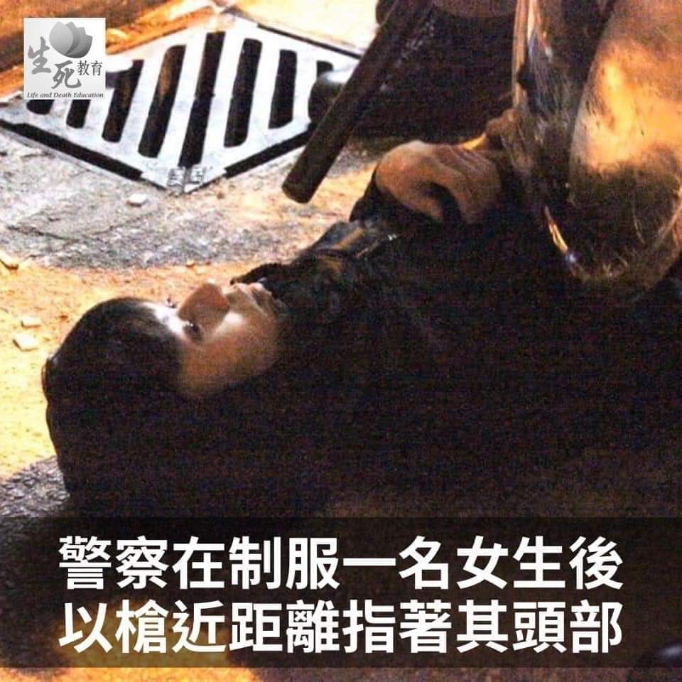

[11月13日 21:14]    新闻大吐槽   @TuCaoFakeNews    都是邪教匪共挑起民鬥！  :speech_balloon:评:0 :+1:赞:2 :globe_with_meridians:转:1  

[11月13日 21:13]    新闻大吐槽   @TuCaoFakeNews    心疼维尼两秒钟，他亲妈真不是东西。  :speech_balloon:评:1 :+1:赞:2 :globe_with_meridians:转:1  

[11月13日 21:07]    新闻大吐槽   @TuCaoFakeNews    大陆人几乎每家都经历过类似的事！
从反右，文革，8964，法轮功，等等，几乎每个家庭都撕裂过，包括维尼小的时候从陕西下放的农场逃回北京，还被亲妈举报了 https://twitter.com/suesue2019/status/1194601434206990336 …  :speech_balloon:评:1 :+1:赞:9 :globe_with_meridians:转:2  

[11月13日 21:05]    新闻大吐槽   @TuCaoFakeNews    好采仲有個大人 https://twitter.com/tucaofakenews/status/1194399605795901441 …  :speech_balloon:评:0 :+1:赞:2 :globe_with_meridians:转:2  

[11月13日 21:02]    新闻大吐槽   @TuCaoFakeNews    這個個案真是讓人很傷心，中共用各種手段分化香港人，我們身心都極度的疲累和痛苦這些是香港人從未經歷過的折磨。  :speech_balloon:评:2 :+1:赞:4 :globe_with_meridians:转:3  

[11月13日 21:00]    新闻大吐槽   @TuCaoFakeNews    唔怪得前缐𢇁話：今生只嫁勇武巴！讚 https://twitter.com/tucaofakenews/status/1194550358132920321 …  :speech_balloon:评:1 :+1:赞:11 :globe_with_meridians:转:4  

[11月13日 20:55]    新闻大吐槽   @TuCaoFakeNews    “疾风知劲草，板荡识诚臣”
一份报纸的信誉是用勇气、良知、乃至鲜血浇灌出来的！ https://twitter.com/jenniferatntd/status/1194419789357309956 …  :speech_balloon:评:0 :+1:赞:8 :globe_with_meridians:转:1  

[11月13日 20:55]    新闻大吐槽   @TuCaoFakeNews    Thanks for #StandwithHK #FightForFreedom #FreeHK #freechina https://twitter.com/tucaofakenews/status/1194560972448399360 …  :speech_balloon:评:0 :+1:赞:6 :globe_with_meridians:转:2  

[11月13日 20:51]    新闻大吐槽   @TuCaoFakeNews    也是最孬種的魔鬼，只懂殘害自己的公民  :speech_balloon:评:0 :+1:赞:3 :globe_with_meridians:转:1  

[11月13日 20:51]    新闻大吐槽   @TuCaoFakeNews    這是人性的覺醒，讓偉大的香港人看清惡魔共產黨永遠是滅絕人性反人類惡魔，唯有推翻滅絕人性反人類惡魔共產黨和惡魔共產黨圈養下的香港極權魔政，才能讓香港回歸正常人類生活....... https://twitter.com/tucaofakenews/status/1194549610489905152 …  :speech_balloon:评:1 :+1:赞:4 :globe_with_meridians:转:3  

[11月13日 20:49]    新闻大吐槽   @TuCaoFakeNews    没有邪恶该多好! https://twitter.com/TuCaoFakeNews/status/1194549610489905152 …  :speech_balloon:评:0 :+1:赞:3 :globe_with_meridians:转:1  

[11月13日 20:48]    新闻大吐槽   @TuCaoFakeNews    日軍侵華是事實，劫走文物也是事實，但歷史像是一種造化。沒有被侵略軍掠走的文物，在中共發動的政治運動中遭到中國人自己的最徹底的毀滅性的破壞。  :speech_balloon:评:1 :+1:赞:7 :globe_with_meridians:转:2  

[11月13日 20:47]    新闻大吐槽   @TuCaoFakeNews    世界沒有ccp多好，ccp是人類歷史上最邪惡的魔鬼  :speech_balloon:评:1 :+1:赞:15 :globe_with_meridians:转:1  

[11月13日 20:45]    新闻大吐槽   @TuCaoFakeNews    如果我的儿子是这样的想法，我会辞去香港警察的工作，买一个摄像机记录下儿子以及同学们勇敢的时刻，让全世界的同龄人为你们骄傲，同时也让你们年轻人的抗争展示在世界文明人的面前！  :speech_balloon:评:1 :+1:赞:7 :globe_with_meridians:转:2  

[11月13日 20:45]    新闻大吐槽   @TuCaoFakeNews    不是第一次了  :speech_balloon:评:0 :+1:赞:3 :globe_with_meridians:转:5  

[11月13日 20:44]    新闻大吐槽   @TuCaoFakeNews      :speech_balloon:评:1 :+1:赞:14 :globe_with_meridians:转:1  

[11月13日 20:39]    新闻大吐槽   @TuCaoFakeNews    共匪可能以为中大是勇武派中坚份子所在地  :speech_balloon:评:0 :+1:赞:3 :globe_with_meridians:转:2  

[11月13日 20:36]    新闻大吐槽   @TuCaoFakeNews    哭。最優秀的人，為維護文明和正義不懼犧牲。我們除了感謝沒有別的可以説可以做，慚愧  :speech_balloon:评:1 :+1:赞:8 :globe_with_meridians:转:3  

[11月13日 20:35]    新闻大吐槽   @TuCaoFakeNews    啥時候在央視直播時搞這麼一下子就好了  :speech_balloon:评:2 :+1:赞:2 :globe_with_meridians:转:1  

[11月13日 20:34]    新闻大吐槽   @TuCaoFakeNews    英勇且温暖，还这么有型  :speech_balloon:评:0 :+1:赞:3 :globe_with_meridians:转:1  

[11月13日 20:30]    纽约时报中文网   @nytchinese    我们这个年代的弹劾连续剧正在播出之际，重温PBS电视台有关水门事件的节目，可以体验如今的媒体与政治在口吻和基调上有多么不同。我们还能重拾那种共同关注和信任吗？ http://nyti.ms/2KfOpe6   :speech_balloon:评:3 :+1:赞:6 :globe_with_meridians:转:2  

[11月13日 20:28]    财经真相   @caijingxiang    中国国内首个合法商用VPN来了！关于中共官办VPN，我最近正在收集资料，准备做一期视频，来撩开中国神秘防火长城的运作方式！  :speech_balloon:评:24 :+1:赞:86 :globe_with_meridians:转:37  

[11月13日 20:25]    BBC News 中文   @bbcchinese    升级的暴力行动或立场之争让许多大陆和台湾学生开始担忧自身安危，寻求离开香港。也有学生表示会继续留下来。 https://bbc.in/2pj98GM   :speech_balloon:评:14 :+1:赞:42 :globe_with_meridians:转:19  

[11月13日 20:00]    BBC News 中文   @bbcchinese    “我听到一声（狼的）嚎叫，但我知道日本狼在明治时代就灭绝了。”于是他花50年搜寻日本狼。 https://bbc.in/2qKpQzg   :speech_balloon:评:2 :+1:赞:18 :globe_with_meridians:转:3  

[11月13日 20:00]    纽约时报中文网   @nytchinese    上个月，中国当局表示将加强检疫措施，防范鼠疫进入中国。此前，马达加斯加曾爆发迅速蔓延的鼠疫疫情。
目前仍不清楚这些病例何时最初在中国被发现，但居民们在问，为什么当局花了这么长时间才诊断和披露这个问题。 http://nyti.ms/32E8DVb   :speech_balloon:评:2 :+1:赞:8 :globe_with_meridians:转:2  

[11月13日 19:55]    财经真相   @caijingxiang    11月12日，伦敦证券交易所集团（以下简称“伦交所集团”）首席执行官David Schwimmer一行4人到访中央结算公司。看来香港交易所收购事并没结束，搞不好还有下文！  :speech_balloon:评:7 :+1:赞:30 :globe_with_meridians:转:18  

[11月13日 19:40]    纽约时报中文网   @nytchinese    香港抗议者背后的志愿者大军 http://nyti.ms/32Cy1ee https://twitter.com/ccni/status/1194438255829278722 …  :speech_balloon:评:7 :+1:赞:8 :globe_with_meridians:转:7  

[11月13日 19:36]    纽约时报中文网   @nytchinese    #图集【桥中识巴黎】钢制的、石制的、木制的......塞纳河穿过巴黎，而塞纳河上的37座桥梁则为这条河、这座城市提供了建筑瑰宝、历史细节和其浪漫史的源头。
点击查看图集： http://nyti.ms/2qRLXUw   :speech_balloon:评:0 :+1:赞:13 :globe_with_meridians:转:3  

[11月13日 19:00]    BBC News 中文   @bbcchinese    张善政说，找回“善良政治”、“下架蔡英文”、“科技兴国”，是他愿意出来担任韩国瑜副手的原因。然而韩国瑜常常语出惊人，张善政常替他打圆场，被民进党人讥为“张善后”。 https://bbc.in/2CG7x0M   :speech_balloon:评:10 :+1:赞:11 :globe_with_meridians:转:6  

[11月13日 18:38]    墙国铁拳现世报😷   @Socialistfist    一天二更，快夸我。
最近推友投稿质量很高，再次感谢！  :speech_balloon:评:9 :+1:赞:96 :globe_with_meridians:转:3  

[11月13日 18:38]    墙国铁拳现世报😷   @Socialistfist    祝这位推友早日康复

#战螂在推特  :speech_balloon:评:14 :+1:赞:114 :globe_with_meridians:转:22  

[11月13日 18:31]    BBC News 中文   @bbcchinese    香港中文大学校内多处黑烟四起，示威者与防暴警察在校内二号桥对峙。有示威者向警方投掷砖头、汽油弹等物体。警方发射催泪弹、橡胶子弹，并用水炮车发射蓝色催泪剂驱散人群。校长段崇智和前校长沈祖尧先后到场调停，均遭遇催泪弹。到底发生了什么？为何冲突进入校园？ https://bbc.in/2Kitl6I   :speech_balloon:评:84 :+1:赞:168 :globe_with_meridians:转:105  

[11月13日 18:15]    墙国铁拳现世报😷   @Socialistfist    卧床狙击手

#社会主义铁拳  :speech_balloon:评:41 :+1:赞:256 :globe_with_meridians:转:68  

[11月13日 17:57]    老司机   @h5lpykl7tp6jjop    很多到了西方国家的中国人和这头已经自由的驴一模一样！  :speech_balloon:评:20 :+1:赞:236 :globe_with_meridians:转:86  

[11月13日 17:37]    纽约时报中文网   @nytchinese    周二，北京确诊两名鼠疫病患。这引发了人们对这种高传染性致命疾病可能蔓延的恐慌，促使中国提醒公民采取预防措施保护自己。
北京官员表示，两名感染者来自内蒙古，警告人们避免前往受感染地区、接触啮齿动物。报道称朝阳医院急诊区已被隔离。批评者质疑政府未能及时披露疫情。 http://nyti.ms/32E8DVb   :speech_balloon:评:13 :+1:赞:57 :globe_with_meridians:转:24  

[11月13日 17:37]    老司机   @h5lpykl7tp6jjop    当国家由一个神经病掌握以后，人民倒霉就是必然的结果！
不要以为不可能，仔细想想中国人为什么活得这么憋屈？  :speech_balloon:评:3 :+1:赞:29 :globe_with_meridians:转:8  

[11月13日 17:00]    BBC News 中文   @bbcchinese    周一和周二，香港多家大学变成“战场”，有学生指责警方攻击代表自由意志的大学；香港警方强调可以在校园内执法，强调行动并非“攻入校园”。 https://bbc.in/351m0QP   :speech_balloon:评:66 :+1:赞:98 :globe_with_meridians:转:45  

[11月13日 17:00]    纽约时报中文网   @nytchinese    尤盛东的遭遇并非个案，近几年，有数十位中国大学的教师因为在课堂上发表了所谓不当言论而被学生举报，或者被停职，或者被开除。
中国的大学甚至在学校招聘教学信息员来监督老师的教学，有的学校在招聘描述中要求学生信息员举报传播迷信思想、西方价值观和批评党的原则的教授。 http://nyti.ms/2CGn3tm   :speech_balloon:评:8 :+1:赞:25 :globe_with_meridians:转:12  

[11月13日 16:45]    财经真相   @caijingxiang    知道这些有啥用？这是个及其致命的问题，以利益引导法，对我周边的人影响很大，他们现实过的都不太好，生活没有一丝希望，麻木、无趣，简直像木头一样活着。每当我说到中国社会巨变，国有企业私有化带来的巨大创业机遇时，总能让这些木头兴奋一天，他们还经常把我的“荒唐说法”讲给更多人听！  :speech_balloon:评:9 :+1:赞:66 :globe_with_meridians:转:5  

[11月13日 16:33]    财经真相   @caijingxiang    就算是知道这些有什么用？每当话题聊到这个时候，我就说关心这些能赚钱，或许还可以改变命运，因为中共倒台时人民币剧烈贬值，可以用杠杆做空赚大钱。整个中国的财富分配会被洗牌，你现在没关系、没人脉、没资本根本翻不了身，但是机遇是给有准备的人，你现在关心这些，才能在未来巨变时抓到机遇！  :speech_balloon:评:25 :+1:赞:123 :globe_with_meridians:转:20  

[11月13日 16:30]    纽约时报中文网   @nytchinese    特朗普在演讲中花了部分时间为自己的关税进行辩护。他指责中国多年来欺骗美国，并采用关税手段不公平地针对美国农民。
他否认他的贸易政策给经济带来了不确定性，并补充说，“如果我们什么都不做”，才会付出真正的代价。 http://nyti.ms/2q7MRfs   :speech_balloon:评:29 :+1:赞:69 :globe_with_meridians:转:26  

[11月13日 16:16]    财经真相   @caijingxiang    对于不炒股的朋友，他们最关心的另一个话题是“楼市”，每当他们说某个朋友买房赚钱时，我总会来一句，如果买房真的赚钱，那中国14亿人干脆都买房，每个都赚一百万，大家都成了富人，中国也就没有穷人了，大家都不用天天上班，不用在工厂加班，多好啊，赶紧买吧！这么简单逻辑，直接把他的兴奋劲头搞没了  :speech_balloon:评:11 :+1:赞:96 :globe_with_meridians:转:17  

[11月13日 16:06]    财经真相   @caijingxiang    墙内有个朋友谈到中美贸易战时说，中国现在太强大了，美国人嫉妒要故意打压咱们国家，中国绝对不能屈服。我直接怼了一句“卖国贼太多”，一定会投降，领导子女和资产都在美国，你觉得中共敢跟美国玩真的吗？此话直接把他给说泄气了！  :speech_balloon:评:12 :+1:赞:142 :globe_with_meridians:转:22  

[11月13日 16:00]    BBC News 中文   @bbcchinese    中国网红刘世超坚持称，自己不是酗酒者。他还表示，自己豪饮后身体也没有任何不适。但医生却不这么看。 https://bbc.in/379FWDg   :speech_balloon:评:25 :+1:赞:33 :globe_with_meridians:转:11  

[11月13日 16:00]    纽约时报中文网   @nytchinese    艺术家在城市各处创作抗议海报。心理学家为情绪低落的人提供免费心理咨询。在秘密诊所工作的急诊室医生们帮抗议者接骨。
很多个晚上，居住在人口密集地区的居民们打开窗户，对着天空大喊抗议口号。还有一场众筹活动募集了数百万美元用于医疗、法律辩护基金和其他开支。 http://nyti.ms/32Cy1ee   :speech_balloon:评:21 :+1:赞:28 :globe_with_meridians:转:7  

[11月13日 15:55]    财经真相   @caijingxiang    慢慢的他们开始把我当成大神，很多人甚至专门找我询问关于贸易战的事，以及对于行情的预判，在赚钱的引导下，他们开始慢慢接受了真相，也有人主动学习翻墙的办法，我为此专门花钱搭建了一些翻墙节点免费供他们使用，每当他们告诉我说自己的价值观简直被颠倒过来时，心中总有一种自豪感！  :speech_balloon:评:13 :+1:赞:135 :globe_with_meridians:转:10  

[11月13日 15:49]    财经真相   @caijingxiang    可能是由于我是金融行业的缘故吧，过去两年中美贸易争端引发的汇率、股市剧烈波动，由于国内新闻屏蔽了贸易战的消息，每当发生巨大波动时，很多人都来问我原因，我就借机把整个事情的前因后果都讲了一下，并且预判人民币会破7，中美不会达成全面协议，后来这些预判都得到验证，很多人都赚了钱！  :speech_balloon:评:4 :+1:赞:99 :globe_with_meridians:转:6  

[11月13日 15:44]    财经真相   @caijingxiang    我最初传播真相时就被很多国内朋友认为太极端，大多数时候他们都会善意的说，这些事你自己知道就好，不要跟别人说，更多的时候干脆跟你说，知道这些有什么用？你又能改变什么呢？咱就是草民一个别天天张口就说国家大事，会让人笑话！  :speech_balloon:评:9 :+1:赞:78 :globe_with_meridians:转:14  

[11月13日 15:40]    财经真相   @caijingxiang    很多人抱怨周边朋友被洗脑太深，根本不相信香港发生的事，也不相信中共快要倒台，这思想之毒确实很深，但不代表大陆人无可救药，千万不要为此轻易和这些朋友闹到绝交的地步。在墙内传播真相要学会利益引诱，不要直接填充式的进行观点灌输，因为那样会让人觉的你是愤青一个！  :speech_balloon:评:70 :+1:赞:432 :globe_with_meridians:转:93  

[11月13日 15:09]    纽约时报中文网   @nytchinese    #摩登情爱 选择流浪街头是一种慢性自杀。也许DJ的母亲知道她要自我毁灭，所以才想确保她的孩子不会受到伤害。
她把他留在了一个安全的地方，跟她为他选择的家长住在一起，哪怕把他交给别人令她心碎，但她知道如果他离自己太近，同样也会受到伤害。 http://nyti.ms/2picNEM   :speech_balloon:评:62 :+1:赞:14 :globe_with_meridians:转:3  

[11月13日 15:00]    BBC News 中文   @bbcchinese    她说，“如果你想活下去，就握一下我的手。”这时，生命垂危的他已经陷入幻觉、自以为变成了一条蛇。他想活，但蛇没有手...... https://bbc.in/372A5zi   :speech_balloon:评:4 :+1:赞:45 :globe_with_meridians:转:15  

[11月13日 14:00]    纽约时报中文网   @nytchinese    尤盛东：“我们如果不改变，我们这个国家会落伍。这几年赶上去是亏的实行了邓小平的教育面向世界、面向未来、面向现代化这个教育方针。”
’如果回到文化（大）革命时候，老师被当成资产阶级反动知识分子，让学生去揪老师、抓老师、批斗老师，那我们这个教育就毁掉了。“ http://nyti.ms/2CGn3tm   :speech_balloon:评:12 :+1:赞:35 :globe_with_meridians:转:9  

[11月13日 13:30]    纽约时报中文网   @nytchinese    周二，特朗普表示美国“接近”与中国达成一项临时协议，但他也称，如果北京不同意美国的贸易条件，将“大幅提高关税”。
他还为自己的关税政策进行辩护，淡化贸易战对美国的影响，称自己带来了经济“繁荣”。 http://nyti.ms/2q7MRfs   :speech_balloon:评:17 :+1:赞:19 :globe_with_meridians:转:3  

[11月13日 13:00]    纽约时报中文网   @nytchinese    #每日一词 Retail therapy 对于阿里巴巴“双11”破纪录的销售额，时报写道，这并不是对当前形势如何影响中国中产阶级“购物解忧”(retail therapy)胃口的完美衡量。Retail therapy指为排解忧愁、使自己感到快乐的购物行为，类似中文语境里的“包”治百病。
更多简报内容： http://nyti.ms/2O4I4Dq   :speech_balloon:评:5 :+1:赞:7 :globe_with_meridians:转:2  

[11月13日 12:35]    老司机   @h5lpykl7tp6jjop    香港中大战役，令人想到斯巴达三百勇士，而该校碧秋楼管理的计算机系统，就是香港国际互联网的温泉关，有99%数据经过此地。中大学生就像列奥尼达的三百勇士，利用校园地形优势，以血肉之躯抵挡住了数量装备上远超他们的黑警军长达两天，其宁为玉碎不为瓦全的勇气惊天地泣鬼神！  :speech_balloon:评:14 :+1:赞:306 :globe_with_meridians:转:138  

[11月13日 12:30]    纽约时报中文网   @nytchinese    继周一警察向示威者开枪、一名责骂示威者的人遭纵火之后，香港周二再度陷入混乱。
抗议者在校园内纵火、丢掷汽油弹，而防暴警察则试图用催泪瓦斯和水炮将他们击退。
这里是周二抗议活动的一些照片： http://nyti.ms/2pd93nT   :speech_balloon:评:189 :+1:赞:92 :globe_with_meridians:转:47  

[11月13日 12:00]    纽约时报中文网   @nytchinese    • 美国前总统卡特接受降脑压手术。95岁高龄的卡特近几个月来数次跌倒。据他所在的非营利组织说，手术没有并发症，卡特将留院观察。
• 北极圈寒流南下冲击美国，多地气温骤降。中部和东部大部分地区受影响，预计周三白天和夜间气温将达历史最低水平。
更多简报内容： http://nyti.ms/2O4I4Dq   :speech_balloon:评:1 :+1:赞:3 :globe_with_meridians:转:2  

[11月13日 11:58]    BBC News 中文   @bbcchinese    在叙利亚创办俗称“白头盔”（White Helmets）的公民防卫组织，因而得到英女王嘉奖的英国前陆军军官詹姆斯·勒梅热勒（James Le Mesurier）被发现死于土耳其。 https://bbc.in/2CEy8eM   :speech_balloon:评:50 :+1:赞:76 :globe_with_meridians:转:48  

[11月13日 11:30]    纽约时报中文网   @nytchinese    在本该是安心教书的古稀之年，71岁的经济学教授尤盛东却在美国多地奔波往返，寻找能为他提供三尺讲台的美国大学。
尤盛东因为批评中共领导的宣传口号与官方贸易政策等言论，而遭学生举报，随后被开除。他的经历提供了中共在大专院校推行洗脑教育的一手资料。 http://nyti.ms/2CGn3tm   :speech_balloon:评:85 :+1:赞:398 :globe_with_meridians:转:204  

[11月13日 11:29]    财经真相   @caijingxiang    广州财政。  :speech_balloon:评:45 :+1:赞:295 :globe_with_meridians:转:139  

[11月13日 11:00]    纽约时报中文网   @nytchinese    北京确认接诊肺鼠疫病例：两名患者来自内蒙古锡林郭勒盟。据报道，接诊的朝阳医院急诊科座椅全部换新；目击者称，急诊大楼门口曾戒严。
朝阳医院负责人表示，患者已转至他院，并称“一切尽在掌控中”。朝阳区政府深夜发文证实相关消息。
更多简报内容： http://nyti.ms/2O4I4Dq   :speech_balloon:评:4 :+1:赞:10 :globe_with_meridians:转:6  

[11月13日 10:30]    纽约时报中文网   @nytchinese    据官方媒体报道，一名男子在云南一所幼儿园内喷腐蚀性化学物质，造成51名学生和三名教师受伤。
袭击发生一小时后，警方拘留了一名23岁的孔姓男子。当局表示，他喷这种名为烧碱的化学物质是为“报复社会“。 http://nyti.ms/2Kigt0B   :speech_balloon:评:14 :+1:赞:46 :globe_with_meridians:转:23  

[11月13日 10:25]    纽约时报中文网   @nytchinese    简报：香港骚乱延至校园；北京确认接诊鼠疫病例  http://nyti.ms/2O4I4Dq https://twitter.com/ccni/status/1194437413818515456 …  :speech_balloon:评:3 :+1:赞:9 :globe_with_meridians:转:4  

[11月13日 10:20]    纽约时报中文网   @nytchinese    云南一所幼儿园遭腐蚀性液体袭击，51名儿童受伤  http://nyti.ms/2Kigt0B https://twitter.com/nytimesworld/status/1194397485441134593 …  :speech_balloon:评:4 :+1:赞:9 :globe_with_meridians:转:13  

[11月13日 08:02]    BBC News 中文   @bbcchinese    40多年前，对前总统尼克松的弹劾调查，人们最终大舒一口气，“机制是有效的”。今天，对现总统特朗普的弹劾调查，则可能导致对美国宪法尊严的前所未有的挑战。 https://bbc.in/2QcxahC   :speech_balloon:评:26 :+1:赞:105 :globe_with_meridians:转:37  

[11月13日 07:41]    BBC News 中文   @bbcchinese    两国领导人在如此短暂的时间内密集互访的事实，无疑是这两个国家关系密切的体现。 https://bbc.in/2X9DibP   :speech_balloon:评:31 :+1:赞:46 :globe_with_meridians:转:16  

[11月13日 07:40]    新闻大吐槽   @TuCaoFakeNews    中文大学前校长留在一线保护学生！  :speech_balloon:评:116 :+1:赞:2737 :globe_with_meridians:转:1253  

[11月13日 07:11]    BBC News 中文   @bbcchinese    BBC在美国的记者大卫·格罗斯曼报道说，近年来美国对中国态度明显向负面转变，即使在2016年民主党的希拉里，或其他共和党候选人当选担任总统，也会有今天的对华强硬政策。 https://bbc.in/2XeyKB5   :speech_balloon:评:24 :+1:赞:50 :globe_with_meridians:转:20  

[11月13日 04:49]    老司机   @h5lpykl7tp6jjop    捧着书偷睡的学生和辛勤看书至疲倦睡着了的学生看起来一样，只有想弄清真相的人才会知道真相！  :speech_balloon:评:0 :+1:赞:30 :globe_with_meridians:转:17  

[11月13日 02:07]    老司机   @h5lpykl7tp6jjop    “我不會自殺，性格樂觀”

这是抗争香港青年被捕前
一定要记得说的话，
因为被自杀
是黑警滥杀无辜所用的拙劣手段。 https://twitter.com/kj88tcfyikagblx/status/1194301046140497925 …  :speech_balloon:评:3 :+1:赞:53 :globe_with_meridians:转:26  

[11月13日 00:52]    纽约时报中文网   @nytchinese    Long night in Hong Long. 12-11-2019.  :speech_balloon:评:72 :+1:赞:1934 :globe_with_meridians:转:1370  

[11月12日 23:05]    老司机   @h5lpykl7tp6jjop    战火纷飞，硝烟迷漫，这里不是遥远的叙利亚战场，而是香港中文大学的校园。中共恶警从下午开始攻打校园，催泪弹和橡皮子弹不停地向学生们发射。
共产党曾经对香港人承诺：马照跑，舞照跳，一国两制的政策五十年不变。结果他们接手香港以后，香港人的面包没了，牛奶没了，现在连自由也没了。  :speech_balloon:评:101 :+1:赞:928 :globe_with_meridians:转:548  

[11月12日 21:25]    财经真相   @caijingxiang    看到这里，很多网友也许就会认为，参议员的议员太坏，不及众议院好，如果你这样认为就大错特错。因为参议员的议员知识文化水平普遍较高，看待问题也更加理性，这与众议院经常出现“白左”的理想化议员形成鲜明对比。如果没有参议院的制衡，美国恐怕会上演“美国版的打土豪分田地”，其后果将是灾难性的！  :speech_balloon:评:13 :+1:赞:166 :globe_with_meridians:转:29  

[11月12日 21:16]    财经真相   @caijingxiang    众议院议员在投票时，更多的是以道义为出发点，直接表达对香港人的支持；参议员的议员背后是大财团和政治家族，他们在中国和香港有着大量的资产和利益，因此参议院在香港问题不如众议院积极就比较容易理解，毕竟屁股决定脑袋，对这些议员来说，在钱大部分撤回来之前，最好不要和中共彻底撕破脸！  :speech_balloon:评:9 :+1:赞:161 :globe_with_meridians:转:44  

[11月12日 21:10]    财经真相   @caijingxiang    美国众议院是以人口为基准确定席位，其议员大多数来自普通公民，因此更贴近民意；而参议院议员人数较少，一般更代表美国精英集团的意志；两院互相制衡，协调美国普通阶层与精英阶层的利益诉求，这是美国政治稳定的核心。在香港法案上，众议院0票反对率先通过，这代表美国民意对香港的支持！  :speech_balloon:评:7 :+1:赞:343 :globe_with_meridians:转:100  

[11月12日 21:08]    BBC News 中文   @bbcchinese    国民党候选人韩国瑜和他新选定的竞选搭档张善政方方面面都有差异，“韩张配”是否相得益彰？ https://bbc.in/32F6V67   :speech_balloon:评:11 :+1:赞:14 :globe_with_meridians:转:6  

[11月12日 20:32]    老司机   @h5lpykl7tp6jjop    知道所有真相，了解，思考過， 自己怎麼想最清楚。
最怕的是，永遠不看真相的人  :speech_balloon:评:1 :+1:赞:9 :globe_with_meridians:转:8  

[11月12日 20:03]    老司机   @h5lpykl7tp6jjop      :speech_balloon:评:11 :+1:赞:149 :globe_with_meridians:转:45  

[11月12日 19:22]    墙国铁拳现世报😷   @Socialistfist    从2018年9月到现在频繁微博维权，神奇的是，小编就是没看出来他举报的贪污腐败是什么内容  :speech_balloon:评:4 :+1:赞:123 :globe_with_meridians:转:7  

[11月12日 19:20]    墙国铁拳现世报😷   @Socialistfist    宝贝别哭

#社会主义铁拳  :speech_balloon:评:35 :+1:赞:317 :globe_with_meridians:转:77  

[11月12日 19:00]    BBC News 中文   @bbcchinese    南非17岁少女一个偶然机会发现自己有两个妈妈，一个真妈，一个假妈，于是引出一段五味杂陈的故事。 https://bbc.in/2X4oAmw   :speech_balloon:评:0 :+1:赞:19 :globe_with_meridians:转:6  

[11月12日 16:00]    BBC News 中文   @bbcchinese    “双十一”（11月11日）这天，阿里巴巴旗下电商平台交易额达到2684亿元，再次刷新纪录。 https://bbc.in/33EWIrG   :speech_balloon:评:66 :+1:赞:61 :globe_with_meridians:转:17  

[11月12日 15:01]    BBC News 中文   @bbcchinese    中国在人脸识别技术的世界领先地位，你知道多少？科技带来的隐私、人权案件有哪些先例？ https://bbc.in/2KbRtYM   :speech_balloon:评:56 :+1:赞:82 :globe_with_meridians:转:46  

[11月12日 14:46]    老司机   @h5lpykl7tp6jjop    今天，当勇武派出现在市中心商业区的时候，受到了英雄一般的热烈欢迎。
而此前，林郑月娥称：「抗争者是人民的敌人」  :speech_balloon:评:175 :+1:赞:2853 :globe_with_meridians:转:1401  

[11月12日 14:44]    财经真相   @caijingxiang    支持胡主编把宣传口径拉到海外的，这真是一个高招啊！你想啊，中国有14亿爱国群众，很容易赢得舆论上的胜利！强烈建议胡主编向上级反映，开放推特，接触防火墙！  :speech_balloon:评:17 :+1:赞:134 :globe_with_meridians:转:34  

[11月12日 13:36]    老司机   @h5lpykl7tp6jjop    黑警再次突破底线，坏事做绝，竟然殴打孕妇。
没人性！恐怖输出  :speech_balloon:评:86 :+1:赞:622 :globe_with_meridians:转:490  

[11月12日 12:09]    财经真相   @caijingxiang    淘宝双十一数据布在三次回归曲线上，拟合度均超过99.94%，几乎为1，今年2684亿，与2689亿的预测数据只差5亿，这说明淘宝在造假！  :speech_balloon:评:144 :+1:赞:669 :globe_with_meridians:转:246  

[11月12日 12:01]    BBC News 中文   @bbcchinese    印度最高法院作出判决表示，印度北部极具宗教争议的阿约提亚圣地应该交给那些希望在那里修建寺庙的印度教徒。 https://bbc.in/2CuaTUB   :speech_balloon:评:4 :+1:赞:7 :globe_with_meridians:转:6  

[11月12日 11:01]    BBC News 中文   @bbcchinese    有在台湾念书的大陆学生证实收到要求2020年1月11日前离开台湾的讯息，而当日台湾将举行总统大选，有台湾学者称中国此举可能是不希望太多大陆学生在台湾感受民主气氛。不过中国地方台办否认有发出类似讯息。 https://bbc.in/2Kb6A4H   :speech_balloon:评:252 :+1:赞:329 :globe_with_meridians:转:130  

[11月12日 10:36]    老司机   @h5lpykl7tp6jjop    什么最重要？信息自由排第一！  :speech_balloon:评:5 :+1:赞:120 :globe_with_meridians:转:43  

[11月12日 10:20]    财经真相   @caijingxiang    对于被捕的学生处理方式有三种，第一种确定登记所有学生信息，并以家人安全进行威胁，如果学生屈服就释放并进行定期监控；第二种就是没有一丝屈服，视死如归的直接弄死抛尸；第三种多次被捕，毒打后直接监禁，同时加快深圳附近集中营的建设。这也是香港抗议规模逐渐减少的原因！  :speech_balloon:评:17 :+1:赞:196 :globe_with_meridians:转:81  

[11月12日 10:10]    财经真相   @caijingxiang    班农透露共和党正忙于应对川普的弹劾案，到明年2月份参议院都很难通过香港法案，也就是说香港人还要继续被打被杀至少三个月，以目前中共每天逮捕两百人计算，三个月就是近两万人，中共确信这些时间足够把香港积极抗争的学生全部逮捕，最终恢复香港所谓的稳定秩序！这就是中共对香港的策略吧！  :speech_balloon:评:51 :+1:赞:389 :globe_with_meridians:转:149  

[11月12日 10:01]    BBC News 中文   @bbcchinese    手机屏幕会让你老得更快？快告诉一位手机不离手的朋友！  :speech_balloon:评:10 :+1:赞:112 :globe_with_meridians:转:87  

[11月12日 08:48]    BBC News 中文   @bbcchinese    敬业集团要在这宗收购中得到什么？ https://bbc.in/36ZM54X   :speech_balloon:评:8 :+1:赞:14 :globe_with_meridians:转:7  

[11月12日 08:26]    BBC News 中文   @bbcchinese    2019年，她入选了BBC巾帼百名杰出女性名单。 https://bbc.in/2pTGD2O   :speech_balloon:评:6 :+1:赞:15 :globe_with_meridians:转:7  

[11月12日 07:22]    凡賽堤/FORSETI   @FecharCCP    11日早在西湾河开枪射伤示威者的港警关家荣身份被起底，其担任家教会主席的德望学校师生、家长及校友发起联署要求解除其在该校的职务。其两个女儿在该校就读。另有消息指，关家荣受过“大陆警察部门”特殊培训。下面这个小视频，足以解释这场血案的真相：这是流氓国家自上而下有计划的谋杀。  :speech_balloon:评:20 :+1:赞:261 :globe_with_meridians:转:169  

[11月12日 07:14]    凡賽堤/FORSETI   @FecharCCP    救救悲慘的香港 #HKSOS

香港黑警拔槍亂殺港民！已多人中槍和死亡！

天滅極權！  :speech_balloon:评:1 :+1:赞:10 :globe_with_meridians:转:8  

[11月12日 07:11]    凡賽堤/FORSETI   @FecharCCP    11.11 香港殺人魔家庭資料！
全世界通緝這殺人魔全家！  :speech_balloon:评:47 :+1:赞:13 :globe_with_meridians:转:10  

[11月12日 07:07]    凡賽堤/FORSETI   @FecharCCP    救救悲慘的香港 #HKSOS

香港黑警拔槍亂殺港民！已多人中槍和死亡！  :speech_balloon:评:0 :+1:赞:8 :globe_with_meridians:转:6  

[11月12日 06:57]    凡賽堤/FORSETI   @FecharCCP    天滅流氓政權！！！CCP極權殺人恐怖組織正在用各種兇殘手段屠殺我們的同胞...................

看看這些大陸的黑警（公安，武警，士兵裝扮成香港警察）是如何沒有人性的屠殺香港學生！！！

天滅流氓政權！！！天滅CCP！！！  :speech_balloon:评:1 :+1:赞:20 :globe_with_meridians:转:21  

[11月12日 06:42]    凡賽堤/FORSETI   @FecharCCP    天滅流氓政權！！！CCP極權殺人恐怖組織正在用各種兇殘手段殺害我們的同胞...................

看看這些大陸的黑警（公安，武警，士兵裝扮成香港警察）是如何沒有人性的屠殺香港學生！！！

那個小年輕不知道是休克還是已經死亡！

天滅流氓政權！！！天滅CCP！！！  :speech_balloon:评:34 :+1:赞:18 :globe_with_meridians:转:15  

[11月12日 06:25]    凡賽堤/FORSETI   @FecharCCP    坐水凳（英語：waterboarding）是水刑的一種，做法是將受害人固定其雙手雙腳，在頭部放上布後持續澆水。如此會讓受害人產生溺水的錯覺而心生恐懼。雖然坐水凳不在身上留下可辨識的傷痕，但受害人在過程中會因為嗆到水甚至吸入性肺炎而受傷害。另外有些人因此導致心理方面的傷害，是酷刑的一種。  :speech_balloon:评:0 :+1:赞:36 :globe_with_meridians:转:33  

[11月12日 04:31]    老司机   @h5lpykl7tp6jjop    共产主义是一个最大的政治笑话，有人说，马克思也许设计了一个巨大的烟囱，它的信徒把图纸拿倒了，挖造成了一座座深井，把这些国家和人民都活埋在下面见不到阳光和空气，最可悲的是当这些人来真实的世界，它们反而觉得真实的世界不正常，它们居然怀念那个黑暗的深井！  :speech_balloon:评:5 :+1:赞:109 :globe_with_meridians:转:28  

[11月11日 23:01]    墙国铁拳现世报😷   @Socialistfist    所有推文内容来自于公开的网络社交媒体。
年轻人还是需要学习一个
毕竟too young  https://twitter.com/muxiawenyuzi/status/1193888039799574528 …  :speech_balloon:评:11 :+1:赞:160 :globe_with_meridians:转:14  

[11月11日 17:21]    墙国铁拳现世报😷   @Socialistfist      :speech_balloon:评:19 :+1:赞:95 :globe_with_meridians:转:9  

[11月11日 17:19]    墙国铁拳现世报😷   @Socialistfist    在吗？我微博被封了，可以聊聊吗？

#社会主义铁拳
#战螂在推特  :speech_balloon:评:30 :+1:赞:287 :globe_with_meridians:转:58  

[11月11日 16:40]    老司机   @h5lpykl7tp6jjop    Mitch McConnell (@senatemajldr) are you too corrupted by Foremost Shipping money to pass the #HKHRDA? If so you are too corrupt for the Senate. Get out and let a leader lead. https://twitter.com/hoccgoomusic/status/1193749769291620352 …  :speech_balloon:评:31 :+1:赞:448 :globe_with_meridians:转:371  

[11月11日 15:19]    老司机   @h5lpykl7tp6jjop    中国几千年来一直不能改变的就是：总是用一个谎言代替另一个谎言，用一种愚昧代替另一种愚昧，用一种暴力代替另一种暴力，用一种诡辩代替另一种诡辩，永远在下流的泥沼自我陶醉！  :speech_balloon:评:7 :+1:赞:59 :globe_with_meridians:转:19  

[11月11日 14:12]    财经真相   @caijingxiang    记得有个官员说过一句很经典的话“没有坏账，哪来那么多富人”，就是直接点出了中国银行游戏的本质。穷人要想贷款只能是“消费性质的”，这就是“房贷、车贷”，其他原始资本积累性质的贷款，是坚决被禁止的。而富人、官员、权贵则不然，他们贷款或者打着政府名义免抵押物要求，或者凭借权利直接贷款！  :speech_balloon:评:7 :+1:赞:325 :globe_with_meridians:转:96  

[11月11日 14:02]    财经真相   @caijingxiang    银行的新增存款不但停止增加，甚至开始减少，这个时候如果再赶上“春节”用钱高峰，银行就没有钱去应对储户提现要求，最终引发挤兑，银行破产！  :speech_balloon:评:10 :+1:赞:130 :globe_with_meridians:转:34  

[11月11日 08:21]    老司机   @h5lpykl7tp6jjop    交通黑警连开三枪（真枪），其中一名抗争者中枪倒地！
太卑鄙了！！！！！！
当街杀人  :speech_balloon:评:105 :+1:赞:660 :globe_with_meridians:转:520  

[11月10日 22:23]    墙国铁拳现世报😷   @Socialistfist    5. 因投稿较多且具体事件有时效性，也许会延迟发布您的投稿，希望能够理解。对于一些重复投稿的或者不符合主题的投稿，也许不会被采用。
6. 最佳投稿途径是发送私信，@ 本推会被其他通知挤掉
7. 如果您有好的内容，欢迎使用 #社会主义铁拳 和 #社會主義鐵拳，简繁双体的tag。符合内容的推文会给予转推  :speech_balloon:评:0 :+1:赞:52 :globe_with_meridians:转:6  

[11月10日 22:18]    墙国铁拳现世报😷   @Socialistfist    1. 为避免潜在视奸号盗取IP，不接受含有网站链接的投稿
2. 社会主义铁拳相关主题内容应当是，个体或集体有赞美言论后被社会主义政权铁拳的事例。自然灾害或非社会主义政权皆不算是#社会主义铁拳
3. 本推主题明确统一，不接受除了铁拳现世报以外的爆料或投稿
4. 推荐使用多张截图和文字相配合的投稿方式  :speech_balloon:评:1 :+1:赞:79 :globe_with_meridians:转:9  

[11月10日 22:14]    墙国铁拳现世报😷   @Socialistfist    感谢所有新关注的推友和所有开推以来一路的老朋友。
本推的成长离不开所有积极投稿的热心推友，再次表示特别感谢。为了明确投稿规范，特别发此推做出说明。  :speech_balloon:评:5 :+1:赞:107 :globe_with_meridians:转:11  

[11月10日 21:07]    老司机   @h5lpykl7tp6jjop    剛刚：这阵仗像极了大陆解放军攻打香港，看起来特别地荒唐可笑！竟然用这阵仗对付手无寸铁的民众、自已的骨肉同胞？你们也真不要逼脸！  :speech_balloon:评:292 :+1:赞:1263 :globe_with_meridians:转:816  

[11月10日 17:22]    老司机   @h5lpykl7tp6jjop    8年获得科研经费补贴15亿元。最终还是破产了！
国企为主的政策主导下，自主研发口号让领导开心，大笔一挥，
山东常林集团，一家拥有“国家重点实验室”和“山东省重点实验室”的企业，多次名列"中国机械工业百强"榜单，可现实残酷骗局终于现相：  :speech_balloon:评:9 :+1:赞:115 :globe_with_meridians:转:72  

[11月10日 14:47]    老司机   @h5lpykl7tp6jjop    转发网络笑话：做一个有思想的废青！

大清早被银行的催债电话吵醒，顿时对着电话怒骂：都跟你说了多少遍了，那个贷款合同已经是历史文件了，不具有现实意义了！并且我自己挣的钱，还不还，不由你这个外人说三道四！骂完后我很解气的挂掉了电话，回到床上继续做起了中国梦。  :speech_balloon:评:6 :+1:赞:449 :globe_with_meridians:转:129  

[11月10日 14:36]    老司机   @h5lpykl7tp6jjop    中国如何渗透台湾大选 调查发现某管道恐为入口
大陆穷百姓艰难求生，中共把钱用来打水飘！  :speech_balloon:评:0 :+1:赞:12 :globe_with_meridians:转:5  

[11月09日 20:44]    墙国铁拳现世报😷   @Socialistfist    删了重发是因为小编是强迫症，之前推有一个重复字。  :speech_balloon:评:3 :+1:赞:143 :globe_with_meridians:转:3  

[11月09日 20:43]    墙国铁拳现世报😷   @Socialistfist    孩子，这次你让祖国爸爸失望了

#社会主义铁拳  :speech_balloon:评:89 :+1:赞:752 :globe_with_meridians:转:226  

[11月08日 21:45]    墙国铁拳现世报😷   @Socialistfist    补充  :speech_balloon:评:26 :+1:赞:137 :globe_with_meridians:转:14  

[11月08日 21:36]    墙国铁拳现世报😷   @Socialistfist    考虑拿日元明年去日本花呀？  :speech_balloon:评:18 :+1:赞:115 :globe_with_meridians:转:12  

[11月08日 21:29]    墙国铁拳现世报😷   @Socialistfist    没聊上三句，就被B了。
想和粉红战螂谈心太难了  :speech_balloon:评:14 :+1:赞:115 :globe_with_meridians:转:6  

[11月08日 21:12]    墙国铁拳现世报😷   @Socialistfist      :speech_balloon:评:4 :+1:赞:60 :globe_with_meridians:转:6  

[11月08日 21:07]    墙国铁拳现世报😷   @Socialistfist    噗嗤，您可能搞错了。小编从来都是坚定支持中国特色社会主义的（铁拳）  https://twitter.com/kanade_ash/status/1192783549474099200 …  :speech_balloon:评:21 :+1:赞:119 :globe_with_meridians:转:15  

[11月08日 20:17]    墙国铁拳现世报😷   @Socialistfist    感谢 @OLLieGuo 的投稿和其他推友的推送和补充  :speech_balloon:评:1 :+1:赞:79 :globe_with_meridians:转:1  

[11月08日 20:16]    墙国铁拳现世报😷   @Socialistfist    被战术核导弹式铁拳砸到的韭菜开始发生了变异
#社会主义铁拳
#战螂在推特  :speech_balloon:评:108 :+1:赞:634 :globe_with_meridians:转:186  

[11月07日 22:41]    老司机   @h5lpykl7tp6jjop    苏联解体前用匿名信的方式警告恶警和官吏不要与人民为敌，然后，对恶警和贪官污吏进行了定点清除（暗杀） 【共杀掉五万多贪官污吏】后来，当百性走向街头时，警察保持了中立，有效的奠定了苏联解体的民意基础。对无法无天，残暴恶劣的昏官恶警对他们以牙还牙，甚至取他们的脑袋，是唯一正确的方式！  :speech_balloon:评:37 :+1:赞:394 :globe_with_meridians:转:201  

[11月05日 04:28]    凡賽堤/FORSETI   @FecharCCP    急救香港  #HKSOS！！！

天滅流氓政權！！！極權殺人恐怖組織正在用各種兇殘手段殺害我們的同胞..................................................

流氓政權的極權殺人恐怖組織蓄意謀殺香港年輕人！（13）

被暴力制服的年輕人已經休克，還殘暴折斷手！

兇殘，殘暴手段令人髮指到已經超越納粹！  :speech_balloon:评:0 :+1:赞:3 :globe_with_meridians:转:11  

[11月05日 04:25]    凡賽堤/FORSETI   @FecharCCP    急救香港  #HKSOS！！！

天滅流氓政權！！！極權殺人恐怖組織正在用各種兇殘手段殺害我們的同胞..................................................

流氓政權的極權殺人恐怖組織蓄意謀殺香港年輕人！（12）
兇殘，殘暴手段令人髮指到已經超越納粹！
天滅流氓政權！！！  :speech_balloon:评:1 :+1:赞:8 :globe_with_meridians:转:9  

[11月05日 04:24]    凡賽堤/FORSETI   @FecharCCP    急救香港  #HKSOS！！！

天滅流氓政權！！！極權殺人恐怖組織正在用各種兇殘手段殺害我們的同胞..................................................

流氓政權的極權殺人恐怖組織蓄意謀殺香港年輕人！（11）
兇殘，殘暴手段令人髮指到已經超越納粹！
天滅流氓政權！！！  :speech_balloon:评:0 :+1:赞:51 :globe_with_meridians:转:47  

[11月05日 04:23]    凡賽堤/FORSETI   @FecharCCP    急救香港  #HKSOS！！！

天滅流氓政權！！！極權殺人恐怖組織正在用各種兇殘手段殺害我們的同胞..................................................

流氓政權的極權殺人恐怖組織蓄意謀殺香港年輕人！（10）
兇殘，殘暴手段令人髮指到已經超越納粹！
天滅流氓政權！！！  :speech_balloon:评:0 :+1:赞:4 :globe_with_meridians:转:5  

[11月05日 04:19]    凡賽堤/FORSETI   @FecharCCP    急救香港  #HKSOS！！！

天滅流氓政權！！！極權殺人恐怖組織正在用各種兇殘手段殺害我們的同胞..................................................

流氓政權的極權殺人恐怖組織蓄意謀殺香港年輕人！（9）
兇殘，殘暴手段令人髮指到已經超越納粹！
天滅流氓政權！！！  :speech_balloon:评:1 :+1:赞:6 :globe_with_meridians:转:7  

[11月05日 04:16]    凡賽堤/FORSETI   @FecharCCP    急救香港  #HKSOS！！！

天滅流氓政權！！！極權殺人恐怖組織正在用各種兇殘手段殺害我們的同胞..................................................

流氓政權的極權殺人恐怖組織蓄意謀殺香港年輕人！（8）
兇殘，殘暴手段令人髮指到已經超越納粹！
天滅流氓政權！！！  :speech_balloon:评:1 :+1:赞:44 :globe_with_meridians:转:57  

[11月05日 04:13]    凡賽堤/FORSETI   @FecharCCP    急救香港SOS！！！

天滅流氓政權！！！極權殺人恐怖組織正在用各種兇殘手段殺害我們的同胞..................................................

流氓政權的極權殺人恐怖組織蓄意謀殺香港年輕人！（7）
兇殘，殘暴手段令人髮指到已經超越納粹！
天滅流氓政權！！！  :speech_balloon:评:3 :+1:赞:13 :globe_with_meridians:转:21  

[11月05日 04:10]    凡賽堤/FORSETI   @FecharCCP    急救香港SOS！！！

天滅流氓政權！！！極權殺人恐怖組織正在用各種兇殘手段殺害我們的同胞..................................................

流氓政權的極權殺人恐怖組織蓄意謀殺香港年輕人！（6）
兇殘，殘暴手段令人髮指到已經超越納粹！
天滅流氓政權！！！  :speech_balloon:评:1 :+1:赞:40 :globe_with_meridians:转:41  

[11月05日 04:07]    凡賽堤/FORSETI   @FecharCCP    急救香港SOS！！！

天滅流氓政權！！！極權殺人恐怖組織正在用各種兇殘手段殺害我們的同胞..................................................

流氓政權的極權殺人恐怖組織蓄意謀殺香港年輕人！（5）
兇殘，殘暴手段令人髮指到已經超越納粹！
天滅流氓政權！！！  :speech_balloon:评:0 :+1:赞:2 :globe_with_meridians:转:0  

[11月05日 04:06]    凡賽堤/FORSETI   @FecharCCP    急救香港SOS！！！

天滅流氓政權！！！極權殺人恐怖組織正在用各種兇殘手段殺害我們的同胞..................................................

流氓政權的極權殺人恐怖組織蓄意謀殺香港年輕人！（3）
兇殘，殘暴手段令人髮指到已經超越納粹！
天滅流氓政權！！！  :speech_balloon:评:1 :+1:赞:10 :globe_with_meridians:转:15  

[11月05日 04:05]    凡賽堤/FORSETI   @FecharCCP    急救香港SOS！！！

天滅流氓政權！！！極權殺人恐怖組織正在用各種兇殘手段殺害我們的同胞..................................................

流氓政權的極權殺人恐怖組織蓄意謀殺香港不同意見的議員！（2）

兇殘，殘暴手段令人髮指到已經超越納粹！
天滅流氓政權！！！  :speech_balloon:评:0 :+1:赞:3 :globe_with_meridians:转:3  

[11月05日 04:04]    凡賽堤/FORSETI   @FecharCCP    急救香港SOS！！！

天滅流氓政權！！！極權殺人恐怖組織正在用各種兇殘手段殺害我們的同胞..................................................

流氓政權的極權殺人恐怖組織蓄意謀殺香港年輕人！（1）
兇殘，殘暴手段令人髮指到已經超越納粹！
天滅流氓政權！！！  :speech_balloon:评:1 :+1:赞:8 :globe_with_meridians:转:7  

[11月03日 08:23]    凡賽堤/FORSETI   @FecharCCP    他們不配稱警察，他們是納粹的狗！魔鬼般的瘋狗！

極權殺人恐怖組織正在用各種兇殘手段殺害我們的同胞..................................................

滅絕人性對待老人  :speech_balloon:评:4 :+1:赞:45 :globe_with_meridians:转:44  

[11月01日 00:15]    财经真相   @caijingxiang    中共发行的数字货币究竟目的是什么？答案是毁灭全世界，摧毁美元世界霸权，进而摧毁世界贸易体系，再摧毁世界经济，最终将世界变成人间炼狱！  :speech_balloon:评:127 :+1:赞:540 :globe_with_meridians:转:247  

[10月05日 09:33]    凡賽堤/FORSETI   @FecharCCP    呼籲請求共同挖掘所有有關香港發生的事，越全面越好，不同角度，越多越好，包括被暗地抓捕的人員，特別是CCP 派出的各種偽裝身份，包括變身變裝行兇的一點一滴都要挖掘出來，把CCP 的邪惡下三濫手段的真相毫無保留的曝光在全世界面前！世界公知公義才能真正挽救和保護香港人！希望懂視頻編輯配上中英文 https://twitter.com/hjjohnson17/status/1178969916499746816 …  :speech_balloon:评:17 :+1:赞:20 :globe_with_meridians:转:13  

[03月13日 08:10]    老司机   @h5lpykl7tp6jjop    批评是批评家天生的使命！他们只感知对错，信奉真理，指出真相不吐不快，不在意权势和群众的喜好，从批评里不可能获得任何好处，但批评家愚直不改。在中国几乎所有人都讨厌批评家，喜欢阴谋家，因为他们只说好听的！可是就因为中国的批评家太少，中国几乎看不到未来和希望！  :speech_balloon:评:86 :+1:赞:207 :globe_with_meridians:转:41  

