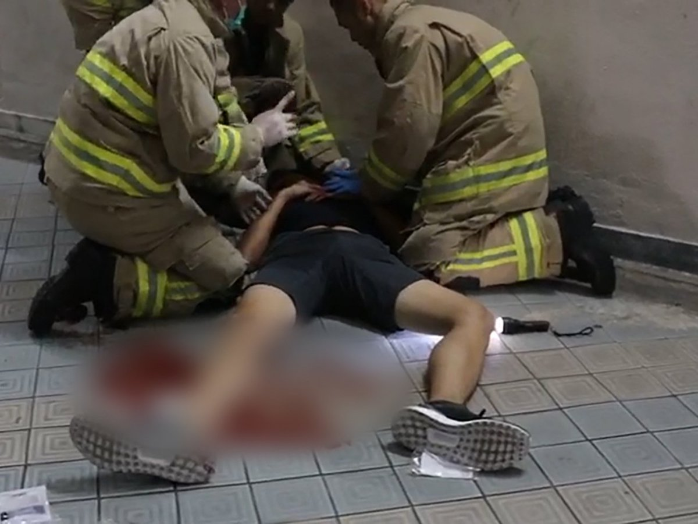

[11月10日 01:29]    新闻大吐槽   @TuCaoFakeNews    顺便把账本也处理了  :speech_balloon:评:1 :+1:赞:2 :globe_with_meridians:转:1  

[11月10日 01:28]    新闻大吐槽   @TuCaoFakeNews    李副省长日思夜想，盼着塔利班开飞机来撞省政府！
盖个新的不但宽敞舒适，还能拉动gdp https://twitter.com/gaoyu200812/status/1193104819520712704 …  :speech_balloon:评:3 :+1:赞:9 :globe_with_meridians:转:4  

[11月10日 00:52]    新闻大吐槽   @TuCaoFakeNews    A HKUST student, who is an immigrant from China and speaks Putonghua (not the Cantonese language, the mother tongue of most HKers), openly supported HK freedom fighters in HK in a forum. Let's salute to his bravery! He is a true HKer!
@SolomonYue, please have a look! https://twitter.com/TuCaoFakeNews/status/1192512810560839680 …  :speech_balloon:评:1 :+1:赞:22 :globe_with_meridians:转:10  

[11月10日 00:42]    新闻大吐槽   @TuCaoFakeNews    周同學蒙主寵召，安息主懷！但我們不必悲傷，須知：為義受逼迫的人有福了，因為天國是他們的！
逝者安息，生者永懷…  :speech_balloon:评:2 :+1:赞:7 :globe_with_meridians:转:2  

[11月10日 00:42]    新闻大吐槽   @TuCaoFakeNews    香港加油 https://twitter.com/tucaofakenews/status/1193152121975099393 …  :speech_balloon:评:0 :+1:赞:4 :globe_with_meridians:转:2  

[11月10日 00:03]    新闻大吐槽   @TuCaoFakeNews    这位香港科技大学一年级新生，是位大陆新移民！
移民来香港无非是为了自由，可恶魔的脚步追着他走，如果香港变成大陆，他就白移民了！所以已经把香港视为家的他，坚定的站在抗争者一边！与手足生死与共！ https://twitter.com/tucaofakenews/status/1192512810560839680 …  :speech_balloon:评:0 :+1:赞:26 :globe_with_meridians:转:10  

[11月09日 23:55]    新闻大吐槽   @TuCaoFakeNews    推翻中共，是全人类的使命！  :speech_balloon:评:0 :+1:赞:6 :globe_with_meridians:转:1  

[11月09日 23:49]    新闻大吐槽   @TuCaoFakeNews    这位香港科技大学一年级新生，是位大陆新移民！
移民来香港无非是为了自由，可恶魔的脚步追着他走，如果香港变成大陆，他就白移民了！所以已经把香港视为家的他，坚定的站在抗争者一边！与手足生死与共！ https://twitter.com/tucaofakenews/status/1192512810560839680 …  :speech_balloon:评:1 :+1:赞:34 :globe_with_meridians:转:6  

[11月09日 23:45]    BBC News 中文   @bbcchinese    大批香港人在添马公园亮起灯光，悼念于周五（8日）离世的22岁科大学生周梓乐。  :speech_balloon:评:55 :+1:赞:307 :globe_with_meridians:转:129  

[11月09日 23:14]    新闻大吐槽   @TuCaoFakeNews    也好，停止傻B坑爹行為。  :speech_balloon:评:0 :+1:赞:1 :globe_with_meridians:转:1  

[11月09日 22:40]    新闻大吐槽   @TuCaoFakeNews    周同學！我們不會忘記你！  :speech_balloon:评:0 :+1:赞:7 :globe_with_meridians:转:3  

[11月09日 22:37]    新闻大吐槽   @TuCaoFakeNews     https://twitter.com/TuCaoFakeNews/status/1193129141966528514?s=19 …  :speech_balloon:评:0 :+1:赞:6 :globe_with_meridians:转:3  

[11月09日 22:00]    新闻大吐槽   @TuCaoFakeNews    【11.9主佑義士】11月9日晚上大批民眾聚集在金鐘添馬公園，以演講及歌唱為死去的義士悼念，現場民眾不斷往舞台前送花.  :speech_balloon:评:0 :+1:赞:85 :globe_with_meridians:转:51  

[11月09日 22:00]    纽约时报中文网   @nytchinese    #一周热门 数据显示臭氧“杀手”气体排放量下降 http://nyti.ms/32j2Owc   :speech_balloon:评:6 :+1:赞:7 :globe_with_meridians:转:0  

[11月09日 21:49]    BBC News 中文   @bbcchinese    【柏林围墙倒塌30年：它是如何建成的？】让我们用3分钟告诉你柏林围墙的历史缘由。 https://bbc.in/2CthezG   :speech_balloon:评:4 :+1:赞:42 :globe_with_meridians:转:17  

[11月09日 21:33]    新闻大吐槽   @TuCaoFakeNews    中共对港人的迫害集处于聚光灯下，世界瞩目。
而中共对大陆信仰者的屠戮，从未停止，世界似乎已经麻木！ https://twitter.com/lotus_pak/status/1193157889981992965 …  :speech_balloon:评:3 :+1:赞:22 :globe_with_meridians:转:4  

[11月09日 21:26]    新闻大吐槽   @TuCaoFakeNews    你以为自己能扑灭人们对自由的向往！？  :speech_balloon:评:10 :+1:赞:122 :globe_with_meridians:转:56  

[11月09日 21:03]    新闻大吐槽   @TuCaoFakeNews    添马公园悼念现场的灯海与挽歌！还有众人不屈的心  :speech_balloon:评:5 :+1:赞:188 :globe_with_meridians:转:75  

[11月09日 21:00]    纽约时报中文网   @nytchinese    #一周热门 为何中共在香港难以推进国家安全立法 http://nyti.ms/2PTEbnt   :speech_balloon:评:20 :+1:赞:14 :globe_with_meridians:转:6  

[11月09日 20:57]    GFHG SDKM   @zyx_yny      :speech_balloon:评:0 :+1:赞:9 :globe_with_meridians:转:4  

[11月09日 20:44]    墙国铁拳现世报😷   @Socialistfist    删了重发是因为小编是强迫症，之前推有一个重复字。  :speech_balloon:评:3 :+1:赞:74 :globe_with_meridians:转:2  

[11月09日 20:44]    BBC News 中文   @bbcchinese    【周梓乐离世：韩国人首尔集会悼念周同学 促政府支持香港人】集会的主办方指，韩国军政府独裁时期，国际社会也向韩国民主运动表示支持，因此现在韩国政府也不应在香港议题上沉默。 https://bbc.in/2NZY0GW   :speech_balloon:评:46 :+1:赞:241 :globe_with_meridians:转:92  

[11月09日 20:43]    墙国铁拳现世报😷   @Socialistfist    孩子，这次你让祖国爸爸失望了

#社会主义铁拳  :speech_balloon:评:46 :+1:赞:345 :globe_with_meridians:转:95  

[11月09日 20:00]    纽约时报中文网   @nytchinese    #一周热门 #观点 《社交网络》编剧给扎克伯格的公开信 http://nyti.ms/32jEgDk   :speech_balloon:评:4 :+1:赞:11 :globe_with_meridians:转:7  

[11月09日 19:46]    新闻大吐槽   @TuCaoFakeNews    彦林耻，犹未雪。梓乐恨，何时灭。  :speech_balloon:评:3 :+1:赞:31 :globe_with_meridians:转:5  

[11月09日 19:00]    纽约时报中文网   @nytchinese    #一周热门 美公司用“中国制造”冒充美国货，向政府出售监控设备 http://nyti.ms/36JoK77   :speech_balloon:评:11 :+1:赞:46 :globe_with_meridians:转:23  

[11月09日 18:53]    新闻大吐槽   @TuCaoFakeNews    添马公园里传来阵阵You raise me up! 的萨克斯风旋律！

周同学虽逝去，但他的抗争精神不灭，会托起香港人走的更远，更决绝！直至那重光之日  :speech_balloon:评:5 :+1:赞:92 :globe_with_meridians:转:28  

[11月09日 18:45]    新闻大吐槽   @TuCaoFakeNews    拿起路人赠送的菊花，人们纷纷赶往政府总部旁的添马公园参加集会，要去悼念昨日离世的周同学

一人遭遇不测，人人都站出来。

这是一个有凝聚力的社会
这是一个唇亡齿寒，人人抱团的社会

这不是一个见人挨拳，低头走开的冷漠社会
也不是一个无事岁静，有事碎灭的原子化社会  :speech_balloon:评:1 :+1:赞:213 :globe_with_meridians:转:80  

[11月09日 18:02]    GFHG SDKM   @zyx_yny    DC & the free world need to know what is happening to ers. @hkpoliceforce human rights abuse & brutality must be exposed. https://twitter.com/terrynwa/status/1193104779318190081 …  :speech_balloon:评:154 :+1:赞:1694 :globe_with_meridians:转:1299  

[11月09日 18:00]    BBC News 中文   @bbcchinese    柏林墙倒塌30周年纪念日前夕，美国务卿蓬佩奥访问德国发表演讲，警告西方世界应警惕中国与俄罗斯，是否在宣布第二次冷战的爆发？ https://bbc.in/2WXEWgE   :speech_balloon:评:72 :+1:赞:237 :globe_with_meridians:转:87  

[11月09日 18:00]    纽约时报中文网   @nytchinese    中国试图清理银行系统过去无序扩张带来的不良贷款，但多家小型银行因此陷入困境，迫使监管机构在经济担忧和庞大但支离破碎的金融系统的健康之间找到平衡。
监管机构的行动令储户恐慌，有些地方出现挤兑潮，多名“散布谣言”者遭逮捕。 http://nyti.ms/32rps5U   :speech_balloon:评:11 :+1:赞:55 :globe_with_meridians:转:34  

[11月09日 17:55]    新闻大吐槽   @TuCaoFakeNews    轉：黑龙江李海涛副省长宣布2019年全省119消防宣传月正式啟動，把119消防说成911，这水平…想不出名都不行！  :speech_balloon:评:79 :+1:赞:492 :globe_with_meridians:转:208  

[11月09日 17:55]    GFHG SDKM   @zyx_yny    A female arrestee, 16, was raped by 4 #HongKongPolice and was pregnant. This was confirmed in the afternoon by anonymous hospital staff secret page who has high creditability.
⁦@SolomonYue⁩
⁦@marcorubio⁩
⁦⁦⁦⁦@HawleyMO⁩  https://www.facebook.com/731331330322257/posts/2458946840894022?d=n&sfns=mo …  :speech_balloon:评:17 :+1:赞:250 :globe_with_meridians:转:240  

[11月09日 17:28]    GFHG SDKM   @zyx_yny    Attention
A group of Chinese studying in Rutgers, the State University of New Jersey, plan to attack Hong Kong Student using stun guns (electroshock weapon)on 11 November.

They may randomly attack the people in the crowd. 

#USA #HongKong #SOSHK #Chinazi #Rutgers  :speech_balloon:评:29 :+1:赞:141 :globe_with_meridians:转:160  

[11月09日 17:00]    BBC News 中文   @bbcchinese    你认为哪一则新闻最重要呢？ https://bbc.in/33wxdIT   :speech_balloon:评:30 :+1:赞:13 :globe_with_meridians:转:8  

[11月09日 17:00]    纽约时报中文网   @nytchinese    #一周热门 用镜头记录香港的城市战场  http://nyti.ms/36DKyRK   :speech_balloon:评:0 :+1:赞:13 :globe_with_meridians:转:2  

[11月09日 16:00]    BBC News 中文   @bbcchinese    中美的紧张关系涉及的是比贸易更深的层面，BBC驻美国记者在华盛顿访问过的人当中，没有一个认为上月签订的框架协议能带来多少改变。 https://bbc.in/2NuWOfD   :speech_balloon:评:22 :+1:赞:34 :globe_with_meridians:转:13  

[11月09日 16:00]    纽约时报中文网   @nytchinese    #一周热门 美国调查生物医学知识产权盗窃，涉多名华裔科学家 http://nyti.ms/2pFUQA0   :speech_balloon:评:3 :+1:赞:32 :globe_with_meridians:转:11  

[11月09日 15:32]    GFHG SDKM   @zyx_yny    In what situation, hk police force can stop the arrestees to voice out their name to lawyer? #HKPoliceTerrorism #HKPoliceState #HKPolice  :speech_balloon:评:2 :+1:赞:16 :globe_with_meridians:转:14  

[11月09日 15:01]    BBC News 中文   @bbcchinese    【一周热点重温】香港示威抗议活动周日在太古城中心再度发生流血事件，至少有4人遭到持刀攻击者刺伤，区议员赵家贤还被咬掉部分耳朵。 https://bbc.in/2K5Ra1I   :speech_balloon:评:22 :+1:赞:54 :globe_with_meridians:转:26  

[11月09日 15:00]    纽约时报中文网   @nytchinese    #一周热门  法国推进“博物馆外交”，蓬皮杜中心上海分馆开幕 http://nyti.ms/2NkK6jv   :speech_balloon:评:3 :+1:赞:10 :globe_with_meridians:转:2  

[11月09日 14:00]    纽约时报中文网   @nytchinese    #一周热门 #新新世界 TikTok在全球舞台强势崛起，但这也可能毁了它 http://nyti.ms/36ByQXG   :speech_balloon:评:7 :+1:赞:17 :globe_with_meridians:转:5  

[11月09日 13:01]    BBC News 中文   @bbcchinese    【一周热点重温】所有尸体的腹部都有一道细小的剖口，像手术刀切口一样利落精准。心和肝都不见了。这是谁干的？怎么干的？ https://bbc.in/2NR2wYp   :speech_balloon:评:9 :+1:赞:41 :globe_with_meridians:转:14  

[11月09日 13:00]    纽约时报中文网   @nytchinese    #一周热门 #观点 马丁·斯科塞斯：我为什么说漫威电影不是“电影” http://nyti.ms/33lJAYp   :speech_balloon:评:0 :+1:赞:6 :globe_with_meridians:转:4  

[11月09日 12:00]    纽约时报中文网   @nytchinese    #图集 【在美国，65万美元能买到什么房？】手握65万美元，你能买到得克萨斯州加尔维斯顿的维多利亚式房屋，或俄勒冈州尤金一间享有市中心美景的现代住宅，也可以选择康涅狄格州莱姆19世纪的殖民地风格建筑。
点击查看图集： http://nyti.ms/2CrhAqc   :speech_balloon:评:7 :+1:赞:21 :globe_with_meridians:转:7  

[11月09日 11:12]    新闻大吐槽   @TuCaoFakeNews    銅鑼灣 警無故向市民施暴 腳踢椒噴剛路過市民

有一男一女市民剛步出銅鑼灣港鐵站準備離開。期間沒有與警員發生任何口角，卻忽然被警員扯住背囊，並多次近距離向二人與其他在場市民施放胡椒噴霧。男子被警員按壓在地後再被警員腳踢，女子中椒後只是低頭呼救亦被警員再近距離「補噴」數發胡椒噴霧。  :speech_balloon:评:29 :+1:赞:325 :globe_with_meridians:转:303  

[11月09日 11:04]    GFHG SDKM   @zyx_yny    The fact that a protester died while riot police were deployed to protect a police wedding is double distasteful and sickening.  :speech_balloon:评:52 :+1:赞:1374 :globe_with_meridians:转:824  

[11月09日 11:01]    BBC News 中文   @bbcchinese    【一周热点重温】就医时，她身高只有1.35米，体重只有40多斤......她的故事，折射出怎样的社会现状？ https://bbc.in/2K4cogd   :speech_balloon:评:100 :+1:赞:128 :globe_with_meridians:转:64  

[11月09日 11:00]    纽约时报中文网   @nytchinese    #一周热门 香港抗议者求助于美国，中国嗅到了阴谋的味道 http://nyti.ms/2Ndg4hQ   :speech_balloon:评:41 :+1:赞:48 :globe_with_meridians:转:13  

[11月09日 10:56]    财经真相   @caijingxiang    马鞍山托底楼市，发文规定楼盘跌幅不能超过10%！  :speech_balloon:评:32 :+1:赞:299 :globe_with_meridians:转:140  

[11月09日 10:49]    财经真相   @caijingxiang    浮亏大约6万多美元，这种涨幅从一开始就有预防，爆仓线压在6.8，减仓后到6.6 https://twitter.com/Blackstonefund/status/1192989400117862400 …  :speech_balloon:评:38 :+1:赞:85 :globe_with_meridians:转:9  

[11月09日 10:47]    老司机   @h5lpykl7tp6jjop    上亿人听过他的演讲 陈秋实：被枪毙也无悔
美国之音采访文字时录，

 https://www.wenxuecity.com/news/2019/11/08/8836866.html …  :speech_balloon:评:1 :+1:赞:2 :globe_with_meridians:转:0  

[11月09日 10:29]    老司机   @h5lpykl7tp6jjop    惊！传崔永元遭半软禁超半年 无可奈何
偷税七亿的人没事，曝光的人倒晦了，依法治国？  :speech_balloon:评:1 :+1:赞:50 :globe_with_meridians:转:24  

[11月09日 10:12]    老司机   @h5lpykl7tp6jjop    企业倒闭潮来临：中国设逾90个破产法庭

美中贸易战重挫中国经济，加之中国企业债台高筑，引发企业倒闭潮。美媒披露，中共官方为防止经济硬着陆，罕见容许中国公司以美国式破产方式倒闭，大陆现有超过90个破产法庭，仅2018年就有1.9万家企业申请破产。  :speech_balloon:评:1 :+1:赞:17 :globe_with_meridians:转:7  

[11月09日 10:01]    老司机   @h5lpykl7tp6jjop    肉类储备严重不足 中国拟解除进口美国禽肉限制

在决定恢复对加拿大猪肉牛肉进口后，中国正研究开始实施新的措施——解除美国禽肉对华出口限制。

　　7日，据新华社消息，中国海关总署和农业农村部正在研究解除美国禽肉对华出口限制事宜。  :speech_balloon:评:1 :+1:赞:2 :globe_with_meridians:转:0  

[11月09日 10:00]    纽约时报中文网   @nytchinese    贸易战导致中国经济增长放缓，而对于贸易战对美国的影响，经济学家也发出越来越多的警告。
其他知情人士说，包括美国最高贸易谈判代表罗伯特·莱特希泽在内的一些官员一开始就反对9月1日征收的关税，他们也不反对用关税换取中国的重大让步。 http://nyti.ms/2WSjHga   :speech_balloon:评:3 :+1:赞:9 :globe_with_meridians:转:2  

[11月09日 09:48]    老司机   @h5lpykl7tp6jjop    评人民日报：何君尧遇刺事件是有政治目的的谋杀

说得真好！近半年来有目的政治谋杀官方有一个人死吗？这位何姓议员被刺后五小时才去医院手术，谋杀的剧本不太严谨吧！
而大陆军人暗渡陈仓冒名顶替香港警察，打杀了多少香港人，强奸了多少小女生，海上不明浮尸超过十年总和，这不叫有政治目的的谋杀？  :speech_balloon:评:2 :+1:赞:51 :globe_with_meridians:转:15  

[11月09日 09:45]    BBC News 中文   @bbcchinese    中国空间技术研究院空间科学与深空探测首席科学家叶培建在中新社报道中说，中国将在2020年发射火星探测器，计划在2021年，即中共建党100周年前降落在火星。 https://bbc.in/32uMUiz   :speech_balloon:评:16 :+1:赞:28 :globe_with_meridians:转:10  

[11月09日 09:35]    财经真相   @caijingxiang    其中，猪肉价格上涨20.1%，涨幅比上月扩大0.4个百分点，影响CPI上涨约0.79个百分点，占CPI环比总涨幅的近九成。  :speech_balloon:评:12 :+1:赞:52 :globe_with_meridians:转:6  

[11月09日 09:35]    老司机   @h5lpykl7tp6jjop    好文转发：
美国人坦言： "在上海活着,才叫活着"！

朝鲜崔龙浩  :speech_balloon:评:3 :+1:赞:14 :globe_with_meridians:转:7  

[11月09日 09:34]    财经真相   @caijingxiang    刚刚中共官方公布的10月年率为3.8%，超过市场预期的3.3%，ppi年率为-1.6%，典型的“滞胀”！ https://twitter.com/caijingxiang/status/1192717156858744833 …  :speech_balloon:评:7 :+1:赞:120 :globe_with_meridians:转:42  

[11月09日 09:20]    BBC News 中文   @bbcchinese    据报有中国人在内的26名富豪投资者及家属的护照被塞浦路斯政府收回。 https://bbc.in/2WWIks8   :speech_balloon:评:10 :+1:赞:136 :globe_with_meridians:转:72  

[11月09日 09:01]    BBC News 中文   @bbcchinese    【一周热点重温】中国国家主席习近平11月2日在上海考察时首次提出“全过程民主”，引起各种猜测和讨论。 https://bbc.in/34KZWtA   :speech_balloon:评:35 :+1:赞:22 :globe_with_meridians:转:8  

[11月09日 09:00]    纽约时报中文网   @nytchinese    #一周热门 降薪、解职、被边缘化：中国职场妈妈的生存困境 http://nyti.ms/34vltX4   :speech_balloon:评:13 :+1:赞:13 :globe_with_meridians:转:3  

[11月09日 08:59]    BBC News 中文   @bbcchinese    想要帮助孩子大脑发育，增进智力，让其终身受益无穷，有一个诀窍非常简单易行：多多和孩子交流对话，倾听并且回应。 https://bbc.in/2NQyaoV   :speech_balloon:评:1 :+1:赞:40 :globe_with_meridians:转:27  

[11月09日 08:19]    BBC News 中文   @bbcchinese    为什么这些国家的污染比世界制造大国——中国的情况还要严重呢？ https://bbc.in/34MTCCb   :speech_balloon:评:64 :+1:赞:85 :globe_with_meridians:转:43  

[11月09日 08:03]    BBC News 中文   @bbcchinese    香港多区星期五晚有群众集会悼念“反送中”抗议冲突中堕楼身亡的大学生，但同时有多处再次爆发警民冲突。 https://youtu.be/mtObxNw_y4s   :speech_balloon:评:11 :+1:赞:19 :globe_with_meridians:转:7  

[11月09日 08:00]    纽约时报中文网   @nytchinese    #观点 格兰特今年46岁。她看起来就像46岁的样子，而不是好莱坞版本的46岁。
相比夸奖李维斯与“恰当年龄“的人约会，他的“女朋友“才更激励人心。她让人们知道，你可以在散发吸引力的同时，看起来与自己的实际年龄相符。 http://nyti.ms/2rqv4jY   :speech_balloon:评:5 :+1:赞:68 :globe_with_meridians:转:25  

[11月09日 07:38]    BBC News 中文   @bbcchinese    联合国贸易发展大会（UNCTAD）最新公布的报告，指出了谁是中美贸易战的受害者，谁又从中美贸易对垒中获得了最多好处。 https://bbc.in/2PZPiv9   :speech_balloon:评:16 :+1:赞:31 :globe_with_meridians:转:18  

[11月09日 07:28]    GFHG SDKM   @zyx_yny    There’s a difference between watching Hong Kong’s pro-democracy protesters face police violence and living it. Now you can with the video game Liberate Hong Kong

Here's how this game puts players on the frontlines of the Hong Kong protests:  http://bit.ly/LiberateHKBIT   :speech_balloon:评:83 :+1:赞:1522 :globe_with_meridians:转:1246  

[11月09日 07:00]    纽约时报中文网   @nytchinese    #一周热门 消息称美国对TikTok展开国家安全审查 http://nyti.ms/2JOcxnV   :speech_balloon:评:8 :+1:赞:22 :globe_with_meridians:转:4  

[11月09日 04:44]    老司机   @h5lpykl7tp6jjop    有些国家（以色列），哪怕一只鸟儿挂在高压线上，它都可以出动直升机进行挽救！
有些国家（***），哪怕它的国民看不起病跳楼自杀，它却依然无动于衷！  :speech_balloon:评:18 :+1:赞:595 :globe_with_meridians:转:230  

[11月09日 04:29]    GFHG SDKM   @zyx_yny    The arrest of pro-democracy legislators is yet another startling escalation from Beijing’s puppets in #HongKong. 

The people of HK are fighting for the autonomy & human rights they deserve. It’s time for the world to stand and present a unified front against China’s aggression.  :speech_balloon:评:655 :+1:赞:6454 :globe_with_meridians:转:5605  

[11月09日 01:47]    GFHG SDKM   @zyx_yny    Hong Kong Police claims to pop Champagne to celebrate the death of the recently passed away student (Chow Tsz Lok) - 8th Nov

 https://lih.kg/1700472 
●來源：i-cable TV
#警察 #去人化 #周同學 #AntiELAB #LIHKG #HongKongProtests  :speech_balloon:评:458 :+1:赞:5030 :globe_with_meridians:转:5967  

[11月09日 01:36]    BBC News 中文   @bbcchinese    香港因为《逃犯条例》引发的示威浪潮持续。一名大学生早前在示威现场堕楼受伤，之后伤重不治。消息传出后，许多香港市民上街悼念，要求当地政府彻查事实真相。 https://bbc.in/2Csm8N4   :speech_balloon:评:57 :+1:赞:168 :globe_with_meridians:转:66  

[11月08日 23:05]    财经真相   @caijingxiang    川大爷的推特辟谣减掉现有关税，瞬间金融市场鸡飞狗跳，黄金大涨8美元，离岸人民币再度跌破7！美股转跌1  :speech_balloon:评:44 :+1:赞:625 :globe_with_meridians:转:139  

[11月08日 22:26]    GFHG SDKM   @zyx_yny    Day 153: (8/11/2019)
警察下午中環拘捕時：「如果你咁掛住佢(周同學)，我送你去見佢囉！」
"If you miss Chow so much, then I'll send you to him (death)!" the police said when they were arresting people in Central this afternoon.
#PoliceBrutality #PoliceState #HongKongProtests  :speech_balloon:评:130 :+1:赞:1164 :globe_with_meridians:转:1606  

[11月08日 21:57]    BBC News 中文   @bbcchinese    她说，“如果你想活下去，就握一下我的手。”这时，生命垂危的他已经陷入幻觉、自以为变成了一条蛇。他想活，但蛇没有手...... https://bbc.in/32rKMIj   :speech_balloon:评:6 :+1:赞:61 :globe_with_meridians:转:31  

[11月08日 21:45]    墙国铁拳现世报😷   @Socialistfist    补充  :speech_balloon:评:24 :+1:赞:111 :globe_with_meridians:转:12  

[11月08日 21:36]    墙国铁拳现世报😷   @Socialistfist    考虑拿日元明年去日本花呀？  :speech_balloon:评:16 :+1:赞:95 :globe_with_meridians:转:9  

[11月08日 21:32]    老司机   @h5lpykl7tp6jjop    RT「這個世界到底多瘋狂」

這張照片裡警察打開了他的車門，瞄準記者擊發並且射出了子彈。

他對著鏡頭射擊，完全不在意記者並不是示威者，記者也對警察的人身安全無慮，香港警察只是嗜血，只是憑自己的喜好任意殺人。
（續）  :speech_balloon:评:8 :+1:赞:264 :globe_with_meridians:转:151  

[11月08日 21:29]    墙国铁拳现世报😷   @Socialistfist    没聊上三句，就被B了。
想和粉红战螂谈心太难了  :speech_balloon:评:13 :+1:赞:97 :globe_with_meridians:转:5  

[11月08日 21:12]    墙国铁拳现世报😷   @Socialistfist      :speech_balloon:评:4 :+1:赞:54 :globe_with_meridians:转:6  

[11月08日 21:07]    墙国铁拳现世报😷   @Socialistfist    噗嗤，您可能搞错了。小编从来都是坚定支持中国特色社会主义的（铁拳）  https://twitter.com/kanade_ash/status/1192783549474099200 …  :speech_balloon:评:21 :+1:赞:111 :globe_with_meridians:转:15  

[11月08日 21:06]    BBC News 中文   @bbcchinese    【香港“反送中”示威──青年周梓乐去世】香港时间20:00（12:00 GMT），不少市民响应网上号召到周梓乐堕楼现场悼念。他们排队从地面走上停车场二楼，全层贴满市民手写的祝福语，以及“沉冤待雪”标语。  https://bbc.in/36N5Lsn   :speech_balloon:评:41 :+1:赞:58 :globe_with_meridians:转:24  

[11月08日 21:01]    GFHG SDKM   @zyx_yny    #HKPolice covered his mouth to stop him shouting out his name and personal information. 
He is a high school student only. #HKprotests  :speech_balloon:评:2 :+1:赞:6 :globe_with_meridians:转:8  

[11月08日 20:52]    BBC News 中文   @bbcchinese    【11月9日，柏林墙倒塌30周年纪念】重温柏林墙畔、铁丝网后一段凄美的爱情故事。1987年，一对东德恋人策划投奔自由。跨越柏林墙的百米路程，成了史诗般的万里长征。他们途径俄国、蒙古前往中国，打算在北京投奔西德大使馆。结果…… https://bbc.in/34NKqNX   :speech_balloon:评:15 :+1:赞:50 :globe_with_meridians:转:20  

[11月08日 20:30]    纽约时报中文网   @nytchinese    #时报专栏 特朗普最近远程结识了一只有正经工作的狗，一只叫柯南的比利时玛利诺犬。柯南出色地执行了寻找、追逐和围堵巴格达迪的任务。
为何这只玛利诺犬被授予勋章，而“一条狗”则被嘲笑？还是说但凡“是条狗”都会有个出风头的机会？by @FrankBruni http://nyti.ms/2NT44Rw   :speech_balloon:评:7 :+1:赞:0 :globe_with_meridians:转:0  

[11月08日 20:24]    财经真相   @caijingxiang    黄金跌破1460，深度回调持续中，基本面两大利空：一个是中美贸易乐观虚假信息；二是美联储已经停止降息！ https://twitter.com/caijingxiang/status/1188734283260874752 …  :speech_balloon:评:13 :+1:赞:100 :globe_with_meridians:转:31  

[11月08日 20:17]    墙国铁拳现世报😷   @Socialistfist    感谢 @OLLieGuo 的投稿和其他推友的推送和补充  :speech_balloon:评:1 :+1:赞:69 :globe_with_meridians:转:1  

[11月08日 20:16]    墙国铁拳现世报😷   @Socialistfist    被战术核导弹式铁拳砸到的韭菜开始发生了变异
#社会主义铁拳
#战螂在推特  :speech_balloon:评:95 :+1:赞:568 :globe_with_meridians:转:170  

[11月08日 20:04]    财经真相   @caijingxiang    美国驻华大使馆发了，美国国家药物管制政策办公室就中国起诉和判决芬太尼贩运者和生产者声明！  :speech_balloon:评:3 :+1:赞:53 :globe_with_meridians:转:20  

[11月08日 19:41]    财经真相   @caijingxiang    就是这歌逻辑，投其所好，用股市上涨收买川普！你看只要同意中国的要求，减免现行关税股市就会天天创新高，如果你继续加税，股市立马暴跌！ https://twitter.com/qinzhubipashui/status/1192767901549228034 …  :speech_balloon:评:19 :+1:赞:127 :globe_with_meridians:转:32  

[11月08日 19:32]    财经真相   @caijingxiang    市场最能反应真相，这是金融行业的名言，但是现在的市场却很扯淡，中美两国绝大多数人都认为不可能达成协议，所有的利好都是假消息，偏偏市场就按照假消息计价，尤其是华尔街还把美股不断创新高，这与以往按照美国经济数据计价完全不同，无论中美经济数据多差，都抵不过一个中美贸易利好消息！  :speech_balloon:评:14 :+1:赞:120 :globe_with_meridians:转:15  

[11月08日 19:30]    纽约时报中文网   @nytchinese    该案触及美国国家安全官员长期以来对中国电信设备可能会被用于间谍活动的担忧。
美国司法部称，自2012年以来，联邦检察官提起的经济间谍案件中，80%以上都涉及中国。 http://nyti.ms/36JoK77   :speech_balloon:评:8 :+1:赞:48 :globe_with_meridians:转:22  

[11月08日 19:23]    财经真相   @caijingxiang    纳瓦罗：那些取消现行关税的新闻被抛出来，是为了赚啥子的东西！只有川普总统才能决定取消关税，就那么简单！莱特希泽的规则是一切交易都在幕后进行！人民币空仓我拿定了，这次国运赌注一定会赢！ https://twitter.com/globalhimalaya/status/1192736142291914753 …  :speech_balloon:评:31 :+1:赞:321 :globe_with_meridians:转:96  

[11月08日 18:30]    纽约时报中文网   @nytchinese    中国的“双11”购物节即将来临，美国公司则在谨慎行事。贸易战导致一些中国消费者抛弃了美国品牌。调查显示，对很多中国购物者而言，特朗普关于贸易的好战言论损害了他们对美国品牌的认知。
而企业如何应对香港民主示威活动的紧张局势，也进一步加剧了经济上的摇摆不定。 http://nyti.ms/2WS3GXK   :speech_balloon:评:84 :+1:赞:14 :globe_with_meridians:转:4  

[11月08日 18:27]    财经真相   @caijingxiang    央视新闻：中国信息通信研究院今天在北京发布《区块链白皮书（2019年）》。白皮书统计显示，目前全球公开区块链专利的申请数量高达1.8 万余件，中国占比超过半数，居全球第一。  :speech_balloon:评:4 :+1:赞:65 :globe_with_meridians:转:9  

[11月08日 18:00]    纽约时报中文网   @nytchinese    中国试图清理银行系统过去无序扩张带来的不良贷款，但多家小型银行因此陷入困境。监管机构的行动令储户恐慌，有些地方出现挤兑潮，多名“散布谣言“者遭逮捕。
随着银行承受的压力越来越大，当局正在想方设法让它们得以维持，以免大规模的倒闭波及整个金融系统。 http://nyti.ms/32rps5U   :speech_balloon:评:12 :+1:赞:41 :globe_with_meridians:转:25  

[11月08日 16:16]    老司机   @h5lpykl7tp6jjop    人民军队属于党，
全党听从党中央，
中央都服总书记，
党总书记是皇上，
书记自小看书多，
大海掀翻小池塘，
满朝文武藏绿卡，
半壁江山养美娘，
有钱非洲去撒币，
没钱各地倒银行，
半边脸笑骗台湾，
暗中派兵杀香港，
谈判川普吊胃口，
不管肉价天天涨，
景山那稞老槐树，
就是皇上的下场！  :speech_balloon:评:9 :+1:赞:407 :globe_with_meridians:转:105  

[11月08日 16:15]    财经真相   @caijingxiang    明天将公布10月CPI年率，目前市场预计为3.3%，从今年3月份开始，本轮通胀开始，目前正在加速上涨！  :speech_balloon:评:14 :+1:赞:98 :globe_with_meridians:转:39  

[11月08日 13:26]    GFHG SDKM   @zyx_yny    上週中左中國製Tg嘅FA現在嘅傷勢：  :speech_balloon:评:84 :+1:赞:605 :globe_with_meridians:转:610  

[11月08日 13:21]    老司机   @h5lpykl7tp6jjop    起底变态杀人犯  :speech_balloon:评:1 :+1:赞:7 :globe_with_meridians:转:8  

[11月08日 13:07]    GFHG SDKM   @zyx_yny    数日前、香港の大学生がデモ現場で血を流し倒れた姿で発見され、今朝亡くなりました。彼は催涙弾から逃れようとして3階から2階に転落したとされていますが、真相はまだ不明です。警察が救急隊を妨害し、到着が遅くなったことが死因の一つという証言があります。政府は真相究明に全力を注ぐべきです  :speech_balloon:评:437 :+1:赞:20208 :globe_with_meridians:转:12840  

[11月08日 12:59]    GFHG SDKM   @zyx_yny    RIP Chow Tsz-lok #周梓樂  The student protestor who fell from a car park passed away today. He fell from 3rd to 2nd floor while riot police firing tear gas in the area. 
#StandWithHongKong
#HongKongPolice
#PoliceBrutality 

link for portrait downloading： https://drive.google.com/open?id=1J6CU3W9MSTPjOG7dxhGC-B8-ky9IC2Jz …  :speech_balloon:评:94 :+1:赞:1371 :globe_with_meridians:转:1006  

[11月08日 12:52]    老司机   @h5lpykl7tp6jjop    今日评论：  :speech_balloon:评:0 :+1:赞:38 :globe_with_meridians:转:23  

[11月08日 12:33]    GFHG SDKM   @zyx_yny    RIP... #HKprotesters #HKPoliceTerrorism  :speech_balloon:评:0 :+1:赞:1 :globe_with_meridians:转:3  

[11月08日 11:45]    GFHG SDKM   @zyx_yny    周同學出事當晚
當晚凌晨3點48分，尚德A停車場2-3/F：
NL1882
VH8082
HN6066
DM2782
2樓
-
HF391
RN6567
NZ7961
3樓
-
*LB4938
PB8826
RC5871*
2樓案發位置對正
-
FL3298
TZ8746
SN4147
BG3938
WA4497
VY4660
TL8381
SD6659
SV9700
BG3938 （最尾望晒全層嗰架）
3樓其餘車

求片  :speech_balloon:评:12 :+1:赞:568 :globe_with_meridians:转:575  

[11月08日 11:36]    GFHG SDKM   @zyx_yny     https://twitter.com/freedomhkg/status/1191748873888452609?s=21 …
#HKPoliceTerrorism #StandWithHongKong
#HKHumanRightsandDemocracyAct  :speech_balloon:评:4 :+1:赞:181 :globe_with_meridians:转:195  

[11月08日 10:48]    GFHG SDKM   @zyx_yny    #HongKong Chow Tsz Lok, university student who had been severely injured in car park fall, passed away this morning at 8.

醫院證實墮樓科大生周梓樂今早約8時死亡

Rest in peace.

#HongKongProstests https://news.rthk.hk/rthk/ch/component/k2/1490724-20191108.htm …  :speech_balloon:评:109 :+1:赞:799 :globe_with_meridians:转:883  

[11月08日 10:41]    GFHG SDKM   @zyx_yny    BREAKING: This HKUST student, Alex Chow, has just passed away. https://twitter.com/demosisto/status/1191068794602414081 …  :speech_balloon:评:290 :+1:赞:2094 :globe_with_meridians:转:2278  

[11月08日 10:32]    老司机   @h5lpykl7tp6jjop    中国富豪榜TOP10：不见王健林 身家缩水惊人

一年一度的福布斯中国富豪榜出炉了，几家欢喜几家愁。领跑榜单的除了“二马”、许家印之外，也有拼多多黄峥这样的“生面孔”。

而王健林的财产缩水最多，达到682亿元，从去年的第4一下子跌到第14。李彦宏的身家则从1007.4亿跌至537.4亿，排名从第8名跌至第35。  :speech_balloon:评:2 :+1:赞:15 :globe_with_meridians:转:15  

[11月08日 02:33]    老司机   @h5lpykl7tp6jjop    中文大学毕业典礼现场，当奏校歌时，同学们还都面向主席台，可当开始播放红朝国歌时，所有同学全体转身，背对主席台，同时举起标语，高喊时代革命！

香港好同学！世界上所有正义人士都已经为你们亮灯！请转身！  :speech_balloon:评:390 :+1:赞:4949 :globe_with_meridians:转:2068  

[11月08日 02:33]    新闻大吐槽   @TuCaoFakeNews    中文大学毕业典礼现场，当奏校歌时，同学们还都面向主席台，可当开始播放红朝国歌时，所有同学全体转身，背对主席台，同时举起标语，高喊时代革命！

香港好同学！世界上所有正义人士都已经为你们亮灯！请转身！  :speech_balloon:评:390 :+1:赞:4949 :globe_with_meridians:转:2068  

[11月08日 00:58]    墙国铁拳现世报😷   @Socialistfist    彻底翻了 https://twitter.com/tdtw/status/1192485721698897920 …  :speech_balloon:评:25 :+1:赞:540 :globe_with_meridians:转:102  

[11月07日 20:48]    GFHG SDKM   @zyx_yny    Wow! What a great news!

Thank you so much for #StandWithHongKong  :speech_balloon:评:0 :+1:赞:33 :globe_with_meridians:转:4  

[11月07日 20:16]    墙国铁拳现世报😷   @Socialistfist    官媒已经意识到翻船，已经控评  :speech_balloon:评:7 :+1:赞:208 :globe_with_meridians:转:16  

[11月07日 19:52]    财经真相   @caijingxiang    人民银行于2019年11月7日在香港成功发行300亿元人民币央行票据，其中3个月期央行票据200亿元，1年期央行票据100亿元，中标利率均为2.90%。此次发行受到市场欢迎，全场投标总量超过640亿元，是发行量的2.1倍。以前投标量是发放量的十几倍！  :speech_balloon:评:13 :+1:赞:115 :globe_with_meridians:转:39  

[11月07日 18:46]    墙国铁拳现世报😷   @Socialistfist    往期的铁拳都是精确制导战斧
这次的铁拳像是战术型核导弹 https://twitter.com/zhanglucy88/status/1192387643977265152 …  :speech_balloon:评:67 :+1:赞:525 :globe_with_meridians:转:171  

[11月07日 18:37]    墙国铁拳现世报😷   @Socialistfist    门面有价，国旗无价。
丢了门面，得了国旗，
万能的推友们你们说说，她是不是赚了？
图二原微博已经被删
#社会主义铁拳  :speech_balloon:评:47 :+1:赞:425 :globe_with_meridians:转:106  

[11月07日 17:06]    墙国铁拳现世报😷   @Socialistfist    #社会主义铁拳  https://twitter.com/anebubucho/status/1192294894385025024 …  :speech_balloon:评:13 :+1:赞:145 :globe_with_meridians:转:29  

[11月07日 15:39]    财经真相   @caijingxiang    商务部新闻发言人高峰在7日的新闻发布会上表示，如果(中美)双方达成第一阶段协议，应当根据协议内容，同步等比率取消已加征关税，这是达成协议的重要条件。“同等比率”就是说中国对美国征收1000亿，取消500亿，就是50%，美国5000亿，也要取消50%，即2500亿，而不是500亿!  :speech_balloon:评:85 :+1:赞:317 :globe_with_meridians:转:90  

[11月07日 15:19]    墙国铁拳现世报😷   @Socialistfist    #社会主义铁拳就是好呀就是好

中央今日宣布放开香港人在大湾区的购房条件，取消工作社保等限制。

护旗手闻讯，哀鸿遍野，如丧考妣。

本条推文链意在展示社会主义铁拳之下神州大地一片生灵涂炭的景象，共计二十多张截图，请大家随意享用，有助于排解郁闷，恢复一天好心情。  :speech_balloon:评:312 :+1:赞:1836 :globe_with_meridians:转:782  

[11月07日 12:53]    老司机   @h5lpykl7tp6jjop    这个戏还有必要继续演下去吗？ https://twitter.com/V8Vod4/status/1192251542901907458 …  :speech_balloon:评:31 :+1:赞:187 :globe_with_meridians:转:70  

[11月07日 11:21]    财经真相   @caijingxiang    猪肉涨的多了，通胀被推高了，没事，把猪在通胀的权限降低就好了！这很中共，猪也必须要有党性！否则就要下调通胀权重！ https://twitter.com/reuterscn/status/1192279082345672705 …  :speech_balloon:评:23 :+1:赞:199 :globe_with_meridians:转:72  

[11月07日 11:17]    财经真相   @caijingxiang    中共外汇管理条例 第39条:有违法规定将境内外汇转移境外，或以欺骗手段逃汇行为的，由外管局责令限期调回外汇，处逃外汇金额30%以下的处罚；情节严重的，处30%以上等值以下的罚款；构成犯罪的，依法追究刑事责任！  :speech_balloon:评:17 :+1:赞:217 :globe_with_meridians:转:86  

[11月07日 11:06]    财经真相   @caijingxiang    满纸便民用汇，理性购汇，核心就一句话：你的钱，政府花！你的美元，权贵拿！  :speech_balloon:评:9 :+1:赞:194 :globe_with_meridians:转:79  

[11月07日 10:25]    老司机   @h5lpykl7tp6jjop    审判长怒斥被告人：
为啥要走私？
被告人答辩：看见中石化、中石油等国企年年亏损，平均每天亏损额两亿多，我们于心不忍，所以为国分忧……  :speech_balloon:评:0 :+1:赞:38 :globe_with_meridians:转:6  

[11月07日 10:18]    老司机   @h5lpykl7tp6jjop    考智商的新闻！  :speech_balloon:评:4 :+1:赞:55 :globe_with_meridians:转:32  

[11月07日 09:51]    财经真相   @caijingxiang    2018年6月贸易战的影响开始显现，地方政府被迫重新启动新一轮基建，为了筹集基建资金，中共几乎完全放开了地方债发行的所有限制，这些地方债的大头都被当地银行吃进，最终导致这些银行资金流减少，这就是后来央行拼命给中小银行降准的根源。我做的油管视频《从定向降准看背后的维稳逻辑》可以看一下  :speech_balloon:评:4 :+1:赞:129 :globe_with_meridians:转:24  

[11月07日 09:37]    财经真相   @caijingxiang    五月份时，央行连续分阶段大规模下调中小银行准备金率，当时我就觉得这里面很有问题，收集资料后才发现中小银行的大部分资金流都购买了地方政府债，尤其是区域小型市、县级地方银行，几乎成为了地方政府搞基建的提款机！  :speech_balloon:评:4 :+1:赞:133 :globe_with_meridians:转:24  

[11月07日 09:31]    财经真相   @caijingxiang    辽宁营口银行遭到挤兑，嗯，前几天还说大额提现要从严管理，现在知道目的了！快到年底结算时间了，会有更多惊喜出来！  :speech_balloon:评:11 :+1:赞:258 :globe_with_meridians:转:84  

[11月07日 06:38]    老司机   @h5lpykl7tp6jjop    嗜血罪犯、精神病、小资：俄罗斯颠覆列宁神话
俄罗斯国营第一电视频道（Pervy Kanal）即将播出的18集纪录片系列“列宁”（Lenin）中呈现出来的形象与苏联之前对其形象的宣传的的陈词滥调相距甚远：嗜血罪犯，精神病，小资产阶级。剧本的作者伊戈尔·列宾说，他的目的就是想要“终结苏维埃缔造者的神话”。  :speech_balloon:评:4 :+1:赞:17 :globe_with_meridians:转:10  

[11月07日 06:31]    老司机   @h5lpykl7tp6jjop    中国正处在各种危机越来越火烧眉毛的时候，习近平却突然大谈“区块链”，究竟是习近平卖弄学问，还是区块链技术确实有可能帮他解决中国的治理难题呢？但凡对区块链这个重大发明有点知识的人都知道，发明者的初衷是“去中心化”，而习近平则是一个极端迷信中央集权的人，他怎么突然会对区块链感兴趣了呢  :speech_balloon:评:0 :+1:赞:18 :globe_with_meridians:转:10  

[11月07日 06:08]    老司机   @h5lpykl7tp6jjop    跑得最彻底的中国富豪
有重庆李嘉诚之称的张松桥把342万平物业以55亿元卖给恒大集团，成都7个项目以32亿元卖给融创中国，到目前为止中渝置地几乎抛售了所有房地产，他斥巨资在英国、澳洲等地买下大量物业资产。以101亿元拿下伦敦最高建筑利德贺大楼，花25亿元买下了位于伦敦帕丁顿火车站附近的写字楼。  :speech_balloon:评:22 :+1:赞:348 :globe_with_meridians:转:86  

[11月06日 23:33]    墙国铁拳现世报😷   @Socialistfist    补图  :speech_balloon:评:6 :+1:赞:99 :globe_with_meridians:转:14  

[11月06日 23:33]    墙国铁拳现世报😷   @Socialistfist    研究表明，养猪场播放 「我和我的祖国」等爱国歌曲能有效提升肉质和食用者的爱国情操。
但由于猪肉肉价上涨，不少小粉红出现了营养不良，思想滑坡的不良现象。

#社会主义铁拳  :speech_balloon:评:35 :+1:赞:301 :globe_with_meridians:转:74  

[11月06日 23:30]    老司机   @h5lpykl7tp6jjop    吃草的日子近了！ https://twitter.com/ningxianhua/status/1192068553651970048 …  :speech_balloon:评:3 :+1:赞:28 :globe_with_meridians:转:15  

[11月06日 18:48]    墙国铁拳现世报😷   @Socialistfist    经热心推友补充，男主角是当地国保
坐实铁拳了  :speech_balloon:评:37 :+1:赞:251 :globe_with_meridians:转:75  

[11月05日 19:25]    墙国铁拳现世报😷   @Socialistfist    丈夫民警妻子教师，生第三胎被单位双双开除。

#社会主义铁拳  :speech_balloon:评:51 :+1:赞:445 :globe_with_meridians:转:154  

[11月05日 09:47]    墙国铁拳现世报😷   @Socialistfist    发推后，该用户微博改名，头像更换，微博删除至2016年内容  :speech_balloon:评:2 :+1:赞:106 :globe_with_meridians:转:10  

[11月05日 04:28]    凡賽堤/FORSETI   @FecharCCP    急救香港  #HKSOS！！！

天滅流氓政權！！！極權殺人恐怖組織正在用各種兇殘手段殺害我們的同胞..................................................

流氓政權的極權殺人恐怖組織蓄意謀殺香港年輕人！（13）

被暴力制服的年輕人已經休克，還殘暴折斷手！

兇殘，殘暴手段令人髮指到已經超越納粹！  :speech_balloon:评:0 :+1:赞:3 :globe_with_meridians:转:10  

[11月05日 04:25]    凡賽堤/FORSETI   @FecharCCP    急救香港  #HKSOS！！！

天滅流氓政權！！！極權殺人恐怖組織正在用各種兇殘手段殺害我們的同胞..................................................

流氓政權的極權殺人恐怖組織蓄意謀殺香港年輕人！（12）
兇殘，殘暴手段令人髮指到已經超越納粹！
天滅流氓政權！！！  :speech_balloon:评:1 :+1:赞:8 :globe_with_meridians:转:9  

[11月05日 04:24]    凡賽堤/FORSETI   @FecharCCP    急救香港  #HKSOS！！！

天滅流氓政權！！！極權殺人恐怖組織正在用各種兇殘手段殺害我們的同胞..................................................

流氓政權的極權殺人恐怖組織蓄意謀殺香港年輕人！（11）
兇殘，殘暴手段令人髮指到已經超越納粹！
天滅流氓政權！！！  :speech_balloon:评:0 :+1:赞:51 :globe_with_meridians:转:47  

[11月05日 04:23]    凡賽堤/FORSETI   @FecharCCP    急救香港  #HKSOS！！！

天滅流氓政權！！！極權殺人恐怖組織正在用各種兇殘手段殺害我們的同胞..................................................

流氓政權的極權殺人恐怖組織蓄意謀殺香港年輕人！（10）
兇殘，殘暴手段令人髮指到已經超越納粹！
天滅流氓政權！！！  :speech_balloon:评:0 :+1:赞:4 :globe_with_meridians:转:5  

[11月05日 04:19]    凡賽堤/FORSETI   @FecharCCP    急救香港  #HKSOS！！！

天滅流氓政權！！！極權殺人恐怖組織正在用各種兇殘手段殺害我們的同胞..................................................

流氓政權的極權殺人恐怖組織蓄意謀殺香港年輕人！（9）
兇殘，殘暴手段令人髮指到已經超越納粹！
天滅流氓政權！！！  :speech_balloon:评:1 :+1:赞:6 :globe_with_meridians:转:7  

[11月05日 04:16]    凡賽堤/FORSETI   @FecharCCP    急救香港  #HKSOS！！！

天滅流氓政權！！！極權殺人恐怖組織正在用各種兇殘手段殺害我們的同胞..................................................

流氓政權的極權殺人恐怖組織蓄意謀殺香港年輕人！（8）
兇殘，殘暴手段令人髮指到已經超越納粹！
天滅流氓政權！！！  :speech_balloon:评:1 :+1:赞:44 :globe_with_meridians:转:57  

[11月05日 04:13]    凡賽堤/FORSETI   @FecharCCP    急救香港SOS！！！

天滅流氓政權！！！極權殺人恐怖組織正在用各種兇殘手段殺害我們的同胞..................................................

流氓政權的極權殺人恐怖組織蓄意謀殺香港年輕人！（7）
兇殘，殘暴手段令人髮指到已經超越納粹！
天滅流氓政權！！！  :speech_balloon:评:2 :+1:赞:14 :globe_with_meridians:转:20  

[11月05日 04:10]    凡賽堤/FORSETI   @FecharCCP    急救香港SOS！！！

天滅流氓政權！！！極權殺人恐怖組織正在用各種兇殘手段殺害我們的同胞..................................................

流氓政權的極權殺人恐怖組織蓄意謀殺香港年輕人！（6）
兇殘，殘暴手段令人髮指到已經超越納粹！
天滅流氓政權！！！  :speech_balloon:评:1 :+1:赞:40 :globe_with_meridians:转:41  

[11月05日 04:07]    凡賽堤/FORSETI   @FecharCCP    急救香港SOS！！！

天滅流氓政權！！！極權殺人恐怖組織正在用各種兇殘手段殺害我們的同胞..................................................

流氓政權的極權殺人恐怖組織蓄意謀殺香港年輕人！（5）
兇殘，殘暴手段令人髮指到已經超越納粹！
天滅流氓政權！！！  :speech_balloon:评:0 :+1:赞:2 :globe_with_meridians:转:0  

[11月05日 04:06]    凡賽堤/FORSETI   @FecharCCP    急救香港SOS！！！

天滅流氓政權！！！極權殺人恐怖組織正在用各種兇殘手段殺害我們的同胞..................................................

流氓政權的極權殺人恐怖組織蓄意謀殺香港年輕人！（3）
兇殘，殘暴手段令人髮指到已經超越納粹！
天滅流氓政權！！！  :speech_balloon:评:1 :+1:赞:10 :globe_with_meridians:转:15  

[11月05日 04:05]    凡賽堤/FORSETI   @FecharCCP    急救香港SOS！！！

天滅流氓政權！！！極權殺人恐怖組織正在用各種兇殘手段殺害我們的同胞..................................................

流氓政權的極權殺人恐怖組織蓄意謀殺香港不同意見的議員！（2）

兇殘，殘暴手段令人髮指到已經超越納粹！
天滅流氓政權！！！  :speech_balloon:评:0 :+1:赞:3 :globe_with_meridians:转:3  

[11月05日 04:04]    凡賽堤/FORSETI   @FecharCCP    急救香港SOS！！！

天滅流氓政權！！！極權殺人恐怖組織正在用各種兇殘手段殺害我們的同胞..................................................

流氓政權的極權殺人恐怖組織蓄意謀殺香港年輕人！（1）
兇殘，殘暴手段令人髮指到已經超越納粹！
天滅流氓政權！！！  :speech_balloon:评:1 :+1:赞:8 :globe_with_meridians:转:7  

[11月03日 08:23]    凡賽堤/FORSETI   @FecharCCP    他們不配稱警察，他們是納粹的狗！魔鬼般的瘋狗！

極權殺人恐怖組織正在用各種兇殘手段殺害我們的同胞..................................................

滅絕人性對待老人  :speech_balloon:评:4 :+1:赞:45 :globe_with_meridians:转:44  

[11月03日 08:16]    凡賽堤/FORSETI   @FecharCCP    他們不配稱警察，他們是納粹的狗！魔鬼般的瘋狗！

極權殺人恐怖組織正在用各種兇殘手段殺害我們的同胞..................................................

無辜港民被納粹的狗打破頭！  :speech_balloon:评:1 :+1:赞:5 :globe_with_meridians:转:4  

[11月03日 08:12]    凡賽堤/FORSETI   @FecharCCP    他們不配稱警察，他們是納粹的狗！魔鬼般的瘋狗！

極權殺人恐怖組織正在用各種兇殘手段殺害我們的同胞..................................................

我們唯一能救她們的就是瘋狂轉發，讓全世界都知道！才有可能不會極權殺人恐怖組織暗殺，被墜樓，被自殺，被棄屍！  :speech_balloon:评:0 :+1:赞:6 :globe_with_meridians:转:6  

[11月03日 08:05]    凡賽堤/FORSETI   @FecharCCP    他們不配稱警察，他們是納粹的狗！魔鬼般的瘋狗！

極權殺人恐怖組織正在用各種兇殘手段殺害我們的同胞..................................................

我們唯一能救她們的就是瘋狂轉發，讓全世界都知道！才有可能不會極權殺人恐怖組織暗殺，被墜樓，被自殺，被棄屍！  :speech_balloon:评:4 :+1:赞:29 :globe_with_meridians:转:29  

[11月03日 07:58]    凡賽堤/FORSETI   @FecharCCP    極權殺人恐怖組織正在用各種兇殘手段殺害我們的同胞..................................................

我們唯一能救她們的就是瘋狂轉發，讓全世界都知道！才有可能不會極權殺人恐怖組織暗殺，被墜樓，被自殺，被棄屍！  :speech_balloon:评:0 :+1:赞:2 :globe_with_meridians:转:5  

[11月03日 07:45]    凡賽堤/FORSETI   @FecharCCP    極權殺人恐怖組織正在用各種兇殘手段殺害我們的同胞..................................................

我們唯一能救她們的就是瘋狂轉發，讓全世界都知道！才有可能不會極權殺人恐怖組織暗殺，被墜樓，被自殺，被棄屍！  :speech_balloon:评:17 :+1:赞:579 :globe_with_meridians:转:627  

[11月03日 07:44]    凡賽堤/FORSETI   @FecharCCP    極權殺人恐怖組織正在用各種兇殘手段殺害我們的同胞..................................................

我們唯一能救她們的就是瘋狂轉發，讓全世界都知道！才有可能不會極權殺人恐怖組織暗殺，被墜樓，被自殺，被棄屍！  :speech_balloon:评:30 :+1:赞:638 :globe_with_meridians:转:778  

[11月03日 07:36]    凡賽堤/FORSETI   @FecharCCP    極權殺人恐怖組織正在用各種兇殘手段殺害我們的同胞..................................................

大陸軍警蒙面扮港民  :speech_balloon:评:2 :+1:赞:147 :globe_with_meridians:转:151  

[11月01日 00:15]    财经真相   @caijingxiang    中共发行的数字货币究竟目的是什么？答案是毁灭全世界，摧毁美元世界霸权，进而摧毁世界贸易体系，再摧毁世界经济，最终将世界变成人间炼狱！  :speech_balloon:评:124 :+1:赞:521 :globe_with_meridians:转:242  

[10月09日 00:47]    GFHG SDKM   @zyx_yny    "Son, when you grow up
You will be the savior of the broken
The beaten, and the damned?"
Please watch this powerful mv #HongKongProtester #hkprotests 
香港反送中護法戰爭(Hong Kong Defensive War 2019)：Welcome To The Black Parade  https://youtu.be/0yXTHODE24Q  via @YouTube  :speech_balloon:评:3 :+1:赞:17 :globe_with_meridians:转:4  

[10月05日 09:33]    凡賽堤/FORSETI   @FecharCCP    呼籲請求共同挖掘所有有關香港發生的事，越全面越好，不同角度，越多越好，包括被暗地抓捕的人員，特別是CCP 派出的各種偽裝身份，包括變身變裝行兇的一點一滴都要挖掘出來，把CCP 的邪惡下三濫手段的真相毫無保留的曝光在全世界面前！世界公知公義才能真正挽救和保護香港人！希望懂視頻編輯配上中英文 https://twitter.com/hjjohnson17/status/1178969916499746816 …  :speech_balloon:评:13 :+1:赞:20 :globe_with_meridians:转:11  

[03月13日 08:10]    老司机   @h5lpykl7tp6jjop    批评是批评家天生的使命！他们只感知对错，信奉真理，指出真相不吐不快，不在意权势和群众的喜好，从批评里不可能获得任何好处，但批评家愚直不改。在中国几乎所有人都讨厌批评家，喜欢阴谋家，因为他们只说好听的！可是就因为中国的批评家太少，中国几乎看不到未来和希望！  :speech_balloon:评:86 :+1:赞:200 :globe_with_meridians:转:41  

