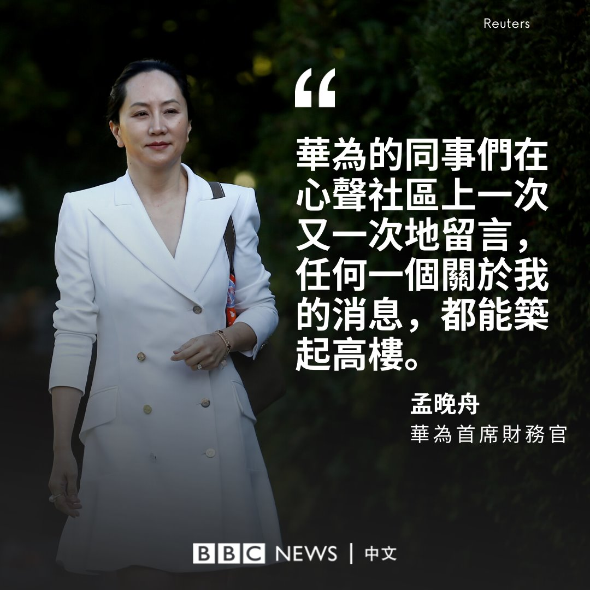

[12月03日 17:30]    纽约时报中文网   @nytchinese    《刺客聂隐娘》、《天注定》、《伯德小姐》、《疯狂的麦克斯4：狂暴之路》、《脸庞，村庄》、《月光男孩》、《托尼·厄德曼》……《纽约时报》两位首席影评人选出了十年来他们最喜欢的十部电影，这里是一份清单： http://nyti.ms/35TOfl9   :speech_balloon:评:0 :+1:赞:1 :globe_with_meridians:转:1  

[12月03日 17:01]    BBC News 中文   @bbcchinese    香港航空财政困难消息传出多天后，母公司海航集团近日宣布获得贷款，但能否让这家香港少数非国泰系的公司延续业务仍是未知数。 https://bbc.in/2RgIlWX   :speech_balloon:评:8 :+1:赞:6 :globe_with_meridians:转:4  

[12月03日 17:00]    纽约时报中文网   @nytchinese    几十年来，有188名居民的台城洞享受着韩国罕见的福利：这里的男子免于义务兵役，46户家庭获得特别减税。
这是在曾被称为地球上最可怕的地方生存的回报。台城洞自由村是非军事区里唯一有韩国平民居住的地方。最近，村民们获得了另一个奖励：韩国移动电话运营商KT安装的5G网络。 http://nyti.ms/2Ljg0M1   :speech_balloon:评:0 :+1:赞:7 :globe_with_meridians:转:2  

[12月03日 16:39]    新闻大吐槽   @TuCaoFakeNews    有谁会剪辑？可以把“孟晚舟女士”改成“李洪元先生”，一点也不违和！  :speech_balloon:评:9 :+1:赞:17 :globe_with_meridians:转:2  

[12月03日 16:36]    BBC News 中文   @bbcchinese    《华尔街日报》说，这个价值550亿美元的天然气管道项目是俄中伙伴关系的证明，对美国的经济和战略影响构成挑战。 https://bbc.in/2DLsM1v   :speech_balloon:评:11 :+1:赞:15 :globe_with_meridians:转:6  

[12月03日 16:30]    纽约时报中文网   @nytchinese    空腹锻炼让你燃烧更多脂肪 http://nyti.ms/2qP6MjP   :speech_balloon:评:0 :+1:赞:3 :globe_with_meridians:转:0  

[12月03日 16:04]    纽约时报中文网   @nytchinese    著名“网红猫”Lil Bub是一只身型永远不会长大的小猫，垂下的舌头和无辜的眼神使她成为互联网上最受欢迎的猫咪之一。她于周日因骨感染去世，享年8岁。
Lil Bub的去世引来了大量粉丝的哀悼，她在社交媒体上拥有数百万粉丝，并拥有一个小型的商业帝国。 http://nyti.ms/2OGQW3I   :speech_balloon:评:3 :+1:赞:28 :globe_with_meridians:转:4  

[12月03日 15:58]    新闻大吐槽   @TuCaoFakeNews    今天，香港的美国领事馆前，迎来不速之客，一群红卫兵又在收钱伪造民意，他们在美国国旗上踏上一万只脚，还狂言《香港民主法案》不过废纸一张！

转而又齐声高喊打倒特朗普！延续了一贯的暴力文革风！

只是不知道，既然这么厉害，区议会选举时干嘛去了？  :speech_balloon:评:55 :+1:赞:175 :globe_with_meridians:转:86  

[12月03日 15:38]    新闻大吐槽   @TuCaoFakeNews    李洪元的案子并不是孟晚舟直接导致，可这种案子在华为每年都有几起，而孟晚舟是实际上的华为掌门人，这种恶性的制度难道不是孟的策略下出现的吗？孟不是作恶者吗？  :speech_balloon:评:1 :+1:赞:17 :globe_with_meridians:转:4  

[12月03日 15:30]    纽约时报中文网   @nytchinese    #观点 在中国的饭局上，女性如何生存？ http://nyti.ms/2R862AU   :speech_balloon:评:3 :+1:赞:5 :globe_with_meridians:转:4  

[12月03日 15:08]    新闻大吐槽   @TuCaoFakeNews    学学中国，耍手段、下套把职员送进监狱，
无罪！ https://twitter.com/bannedebook/status/1201757968993140736 …  :speech_balloon:评:2 :+1:赞:11 :globe_with_meridians:转:0  

[12月03日 15:01]    BBC News 中文   @bbcchinese    原来，美国早就“深挖洞、广积粮”了。 https://bbc.in/35Vx3LV   :speech_balloon:评:9 :+1:赞:36 :globe_with_meridians:转:5  

[12月03日 15:00]    纽约时报中文网   @nytchinese    #观点 中国已经几乎没有在台湾实现“和平统一”的可能，但北京仍在继续使用自己的军事和经济杠杆，还试图破坏台湾的民主进程，分裂台湾社会。
尽管北京在努力破坏，但台湾的民主制度被证明很健康，而且很活跃。by @natashaskassam http://nyti.ms/2Y9wBXQ   :speech_balloon:评:72 :+1:赞:157 :globe_with_meridians:转:50  

[12月03日 14:30]    纽约时报中文网   @nytchinese    香港三支股票闪崩，暴露市场监管积弊 http://nyti.ms/2qSBubL   :speech_balloon:评:2 :+1:赞:5 :globe_with_meridians:转:1  

[12月03日 14:02]    BBC News 中文   @bbcchinese    中国的网络控制已经开始越界向世界延伸，争夺话语权。这是一个重大的转变。 https://bbc.in/2R9lPiZ   :speech_balloon:评:67 :+1:赞:201 :globe_with_meridians:转:94  

[12月03日 14:00]    纽约时报中文网   @nytchinese    孟晚舟在法庭上的形象引人注目，总是身穿各式各样的休闲套装或色彩鲜艳的设计师款连衣裙。
9月，她穿了一条鲜红色的裙子，佩戴珐琅制的中国国旗胸针。她喜爱名牌细高跟鞋，这会让人注意到她左脚踝上的GPS追踪器，法官命令她戴上这个追踪器，以确保她不会逃离这个国家。 http://nyti.ms/2LiFLvX   :speech_balloon:评:15 :+1:赞:29 :globe_with_meridians:转:5  

[12月03日 13:30]    纽约时报中文网   @nytchinese    中国一直在措辞强硬地回应美国的这项新法案，但周一宣布的制裁表明，北京不愿让这个争端影响到中美贸易谈判。
目前尚不清楚这些制裁措施会对中国特别实施惩罚的组织产生什么影响。被华春莹点名的大多数组织在中国大陆没有办事处。 http://nyti.ms/2Y9RemN   :speech_balloon:评:12 :+1:赞:17 :globe_with_meridians:转:4  

[12月03日 13:00]    BBC News 中文   @bbcchinese    中国外交部在推特开通了新帐号“Spokesperson发言人办公室”，首发的几则帖文都针对西方国家。 https://bbc.in/35VB571   :speech_balloon:评:117 :+1:赞:187 :globe_with_meridians:转:64  

[12月03日 13:00]    纽约时报中文网   @nytchinese    #每日一词：dry wit，冷峻的机智、冷幽默。梅里特是在伦敦桥恐袭事件中不幸罹难的两人之一。时报社论委员会一名研究员回忆了她与这位同学的旧时交往。
她写道，他的性格冷峻而幽默(dry wit)，有着充满男孩子气的外表，对刑法改革充满热忱。
更多简报内容： http://nyti.ms/33Ew8hr   :speech_balloon:评:3 :+1:赞:12 :globe_with_meridians:转:2  

[12月03日 12:45]    老司机   @h5lpykl7tp6jjop    好文分享：

“爱国人士”的困惑：不是说中国已成大赢家吗？  :speech_balloon:评:2 :+1:赞:33 :globe_with_meridians:转:13  

[12月03日 12:38]    新闻大吐槽   @TuCaoFakeNews    胆小怯懦的各级党官，为了自己屁股下的座位，可以舍弃别人的性命！和共产主义的邪恶理论一样，假称为了更多人的利益放弃少数人的利益是合理的！
可这种放弃，却是放弃了人之所以为人的根本！进而产生了一群行尸走肉！  :speech_balloon:评:3 :+1:赞:86 :globe_with_meridians:转:22  

[12月03日 12:35]    新闻大吐槽   @TuCaoFakeNews    从湖南来广州务工的老石骑着电单车，载着要奉子成婚的儿子骑行在街上，突然地面凹陷，他们跌入了深坑！然而等待他们的不是救援，而是狠心的回填，借口是害怕更大的地陷发生！

儿媳喻妮亲眼目睹一切，而新华网报道却称投入千人抢救，只字不提回填；
现在，抱着1月大女儿，她不知如何给亲人举办葬礼！  :speech_balloon:评:60 :+1:赞:463 :globe_with_meridians:转:358  

[12月03日 12:35]    新闻大吐槽   @TuCaoFakeNews    从湖南来广州务工的老石骑着电单车，载着要奉子成婚的儿子骑行在街上，突然地面凹陷，他们跌入了深坑！然而等待他们的不是救援，而是狠心的回填，借口是害怕更大的地陷发生！

儿媳喻妮亲眼目睹一切，而新华网报道却称投入千人抢救，只字不提回填；
现在，抱着1月大女儿，她不知如何给亲人举办葬礼！  :speech_balloon:评:60 :+1:赞:463 :globe_with_meridians:转:358  

[12月03日 12:30]    纽约时报中文网   @nytchinese    “这一年，学会了坚强承受，从容面对，不畏未知。”被捕一周年之际，华为高管孟晚舟写了一封信，形容她“经历了恐惧和痛苦，失望和无奈，煎熬和挣扎“，但也有接受，有了更多属于自己的时间。
孟晚舟光鲜的拘留生活与被囚禁在中国的加拿大人的命运形成对比，在加拿大引起了愤怒。 http://nyti.ms/2LiFLvX   :speech_balloon:评:116 :+1:赞:231 :globe_with_meridians:转:86  

[12月03日 12:26]    老司机   @h5lpykl7tp6jjop    南博万呀，南博万呀，多么流弊地南博万！偶们唱歌，偶们跳舞，介么多地南博万！  :speech_balloon:评:5 :+1:赞:90 :globe_with_meridians:转:52  

[12月03日 12:01]    BBC News 中文   @bbcchinese    近日一位美国学者在推特发帖，称印度菜肴难吃到“可怕”。这位学者之后受到猛烈炮轰。不过，移民是否也有必要反思自己或许不爱西餐的深层原因呢？ https://bbc.in/2r65PDx   :speech_balloon:评:23 :+1:赞:42 :globe_with_meridians:转:14  

[12月03日 12:00]    纽约时报中文网   @nytchinese    • 缅甸领导人昂山素季下周将赴国际法院对种族灭绝指控进行抗辩，她的支持者已展开了宣传活动。
• 沙特阿拉伯拥抱西方体育，以期提升国际形象。女子摔跤和冲浪等运动开始在沙特风行，但批评者称，这一转变是为了转移外界对沙特人权记录的注意力。
更多简报内容： http://nyti.ms/33Ew8hr   :speech_balloon:评:4 :+1:赞:9 :globe_with_meridians:转:4  

[12月03日 11:30]    纽约时报中文网   @nytchinese    中国周一表示，将暂停美国军舰访问香港，并对几家总部设在美国的非政府组织实施制裁。这是对特朗普上周签署强硬的人权法案作出的象征性报复。
中国外交部发言人华春莹说，这些措施是对美国“无理行为”的回应。她谴责了美国关于香港人权的立法是对中国国内事务的非法干涉。 http://nyti.ms/2Y9RemN   :speech_balloon:评:17 :+1:赞:49 :globe_with_meridians:转:15  

[12月03日 11:00]    BBC News 中文   @bbcchinese    中国外交部刚在推特上开通了官方帐号“Spokesperson发言人办公室”，社交媒体会否成为中美角力新战场？ https://bbc.in/33JChcm   :speech_balloon:评:120 :+1:赞:189 :globe_with_meridians:转:73  

[12月03日 11:00]    纽约时报中文网   @nytchinese    美国暴风雪持续肆虐：感恩节假期席卷中西部的恶劣天气现在又给东北部带来雨雪。600多架航班被取消，纽约和波士顿机场受影响严重。
从宾夕法尼亚州到马萨诸塞州，多地学校停课；纽约州部分地区宣布进入紧急状态。
更多简报内容： http://nyti.ms/33Ew8hr   :speech_balloon:评:3 :+1:赞:6 :globe_with_meridians:转:2  

[12月03日 10:52]    纽约时报中文网   @nytchinese    简报：中国报复特朗普签署香港法案；孟晚舟发表公开信 http://nyti.ms/33Ew8hr https://twitter.com/ccni/status/1201686852291440641 …  :speech_balloon:评:5 :+1:赞:5 :globe_with_meridians:转:2  

[12月03日 10:35]    财经真相   @caijingxiang    海航控股同意公司与以国开行为牵头行及代理行，以中国进出口银行、中国银行等为初始贷款人组成的银团签署《海航控股2019 年流动资金贷款联合授信项目人民币资金银团贷款合同》，向银团申请贷款共计40亿元（8 家银行各提供5亿元）。贷款期限为3年，前2年为宽限期。贷款利率为固定利率，即年利率4.75%。  :speech_balloon:评:22 :+1:赞:123 :globe_with_meridians:转:32  

[12月03日 10:30]    纽约时报中文网   @nytchinese    由于芬太尼的效力较强，其生产受到法律的严格控制。然而直到今年，中国的法律还没有涵盖为规避现有法律限制而不断生产的新芬太尼化学变体。
制造商只需稍微调整一下化学结构，就能制造出一种尚未被禁的新型类似药物。在这个法律的灰色地带，中国的产量飙升。 http://nyti.ms/380hkNt   :speech_balloon:评:5 :+1:赞:11 :globe_with_meridians:转:1  

[12月03日 10:15]    BBC News 中文   @bbcchinese    整容与亵渎神明的关系…… https://bbc.in/2DGk5Wi   :speech_balloon:评:11 :+1:赞:25 :globe_with_meridians:转:6  

[12月03日 10:10]    新闻大吐槽   @TuCaoFakeNews    去年，孟晚舟在加国被捕15天后，李洪元在深圳被捕！2个几乎同时发生的牢狱之灾，却充满了对比与讽刺！

昨天是孟晚舟被捕一周年，一年里，她时装、豪车、豪宅，过的如明星一般，却矫情发文称：经历了恐惧和痛苦，失望和无奈，煎熬和挣扎~

可知李这一年经历了什么？

制造痛苦的人，总嫌自己痛苦太多  :speech_balloon:评:25 :+1:赞:587 :globe_with_meridians:转:262  

[12月03日 10:10]    新闻大吐槽   @TuCaoFakeNews    去年，孟晚舟在加国被捕15天后，李洪元在深圳被捕！2个几乎同时发生的牢狱之灾，却充满了对比与讽刺！

昨天是孟晚舟被捕一周年，一年里，她时装、豪车、豪宅，过的如明星一般，却矫情发文称：经历了恐惧和痛苦，失望和无奈，煎熬和挣扎~

可知李这一年经历了什么？

制造痛苦的人，总嫌自己痛苦太多  :speech_balloon:评:25 :+1:赞:587 :globe_with_meridians:转:262  

[12月03日 09:48]    纽约时报中文网   @nytchinese    早安！今日重点新闻包括：
中国报复特朗普签署香港法案；孟晚舟发表公开信回顾“恐惧”与“痛苦”；特朗普顾问称中美仍可能在年内达成贸易协议；美国暴风雪持续肆虐；中国加强管控芬太尼，但对美国来说还不够；观点：在中国的饭局上，女性如何生存……NYT简报带你速览今日要闻。 http://nyti.ms/33Ew8hr   :speech_balloon:评:19 :+1:赞:30 :globe_with_meridians:转:8  

[12月03日 09:39]    BBC News 中文   @bbcchinese    癌症最初什么模样，要是知道，就有可能将它消灭在初始阶段。但有谁见过刚露头的癌？ https://bbc.in/2sElFWB   :speech_balloon:评:2 :+1:赞:34 :globe_with_meridians:转:22  

[12月03日 08:57]    新闻大吐槽   @TuCaoFakeNews    能歌善舞的黎巴嫩抗争者，把世界上其他发生抗争国家的名字，都编到歌曲里，唱成了贯口！

“苏丹，香港，伊朗，伊拉克，沙特阿拉伯，阿尔及利亚，巴基斯坦，叙利亚，巴林和智利”

香港作为其中唯一经济发达地区，一朝摔下云端，与动荡多发区为伍；全拜愚蠢的共党所赐！  :speech_balloon:评:14 :+1:赞:184 :globe_with_meridians:转:85  

[12月03日 08:57]    新闻大吐槽   @TuCaoFakeNews    能歌善舞的黎巴嫩抗争者，把世界上其他发生抗争国家的名字，都编到歌曲里，唱成了贯口！

“苏丹，香港，伊朗，伊拉克，沙特阿拉伯，阿尔及利亚，巴基斯坦，叙利亚，巴林和智利”

香港作为其中唯一经济发达地区，一朝摔下云端，与动荡多发区为伍；全拜愚蠢的共党所赐！  :speech_balloon:评:14 :+1:赞:184 :globe_with_meridians:转:85  

[12月03日 08:45]    BBC News 中文   @bbcchinese    特朗普则在周一对记者说，他知道签署上述法案对贸易谈判“没有好处”，但认为中国依然有意达成贸易协议。“中国人总是在谈判......中国想要达成协议，我们姑且看看会发生什么。” https://bbc.in/34H48uR   :speech_balloon:评:19 :+1:赞:34 :globe_with_meridians:转:12  

[12月03日 08:36]    新闻大吐槽   @TuCaoFakeNews    4日对峙，文楼镇政府软了，退让了！如果没有秋后算账，那真是少有的民意胜利！

现在的问题是，这倒霉的火葬场最终建在哪里？恐怕建哪里哪里反抗，不如就建在县委大院好了！  :speech_balloon:评:11 :+1:赞:75 :globe_with_meridians:转:27  

[12月03日 08:36]    新闻大吐槽   @TuCaoFakeNews    4日对峙，文楼镇政府软了，退让了！如果没有秋后算账，那真是少有的民意胜利！

现在的问题是，这倒霉的火葬场最终建在哪里？恐怕建哪里哪里反抗，不如就建在县委大院好了！  :speech_balloon:评:11 :+1:赞:75 :globe_with_meridians:转:27  

[12月03日 08:23]    老司机   @h5lpykl7tp6jjop    好消息！

中共国各地方银行全面跌破发行价，目前有20多家上市银行面临破产。  :speech_balloon:评:26 :+1:赞:369 :globe_with_meridians:转:162  

[12月03日 08:19]    BBC News 中文   @bbcchinese    特朗普这次来伦敦不是对英国的国事访问，而是出席在伦敦召开的北约特别峰会。东道主和北约盟国为何都惴惴不安？ https://bbc.in/2DQdmtf   :speech_balloon:评:16 :+1:赞:24 :globe_with_meridians:转:12  

[12月03日 07:49]    BBC News 中文   @bbcchinese    彭博社报道说，俄罗斯天然气通过中俄东线天然气管道开通是普京把重心靠向中国的标志。《华尔街日报》说，这个价值550亿美元的天然气管道项目是俄中伙伴关系的证明，对美国的经济和战略影响构成挑战。 https://bbc.in/2DFEESU   :speech_balloon:评:22 :+1:赞:33 :globe_with_meridians:转:9  

[12月03日 07:05]    BBC News 中文   @bbcchinese    她称在过去一年中，“经历了恐惧和痛苦、失望和无奈、煎熬和挣扎”，但学会了“坚强承受、从容面对、不畏未知”。 https://bbc.in/2LhMRAP   :speech_balloon:评:203 :+1:赞:183 :globe_with_meridians:转:45  

[12月03日 05:44]    新闻大吐槽   @TuCaoFakeNews    这新谱的歌词体现了李嘉诚思想中的传统意识，注重做人做事，鼓励踏踏实实，提倡奉献精神，不鼓吹个人成功！

德育，传统，加上原曲的自由底蕴，让人动容。
希望唱着这首歌、流着泪毕业的汕大同学，准备好拥抱从香江滚滚而来的时代大潮，准备好迎接真正的《海阔天空》！ https://twitter.com/jacob43817149/status/1201204585546895364 …  :speech_balloon:评:11 :+1:赞:100 :globe_with_meridians:转:36  

[12月03日 04:58]    老司机   @h5lpykl7tp6jjop    全球还有三分之二的人民没有得到解放哦！要不要去比尔盖茨家推销一下社保呀？既然专业搞传销就该全世界都铺开嘛，气魄还不够大！  :speech_balloon:评:3 :+1:赞:35 :globe_with_meridians:转:0  

[12月03日 04:57]    老司机   @h5lpykl7tp6jjop    @听字多一点 
1967年夏  裹着红卫兵战旗的重庆武斗的一派死难者的尸体  :speech_balloon:评:5 :+1:赞:32 :globe_with_meridians:转:24  

[12月03日 03:27]    新闻大吐槽   @TuCaoFakeNews    脸上没有一丝风霜，还渔夫  :speech_balloon:评:13 :+1:赞:211 :globe_with_meridians:转:3  

[12月03日 03:20]    新闻大吐槽   @TuCaoFakeNews    这是推特红号发出来的视频，在老外圈子里广泛流传！

可老外哪里知道，这看似甜蜜的小情侣只能是市里宣传部门的科员，而不可能是什么渔夫！渔夫吃这么好，下个月喝西北风？

血旗下的摆拍，想让人把吃饱饭和对政权的感恩戴德挂钩，形成条件反射！虚假却精致的宣传！ https://twitter.com/carlzha/status/1200970384511655936 …  :speech_balloon:评:211 :+1:赞:654 :globe_with_meridians:转:204  

[12月03日 03:06]    新闻大吐槽   @TuCaoFakeNews    有人嘴上说支持抗争，可早就办好移民，随时准备开溜，实际上是不看好抗争者的；

可随着事态的演变，年轻抗争者们展现出来的不屈勇气和灵活策略，却使人动心、让人看到希望！

刘医师这种本来想去台湾，现在他决定留下来！陪抗争者一路同行！  :speech_balloon:评:18 :+1:赞:468 :globe_with_meridians:转:204  

[12月03日 00:55]    墙国铁拳现世报😷   @Socialistfist    一位推友的来信
欢迎理性讨论  :speech_balloon:评:179 :+1:赞:220 :globe_with_meridians:转:14  

[12月03日 00:50]    新闻大吐槽   @TuCaoFakeNews    "It happened very quickly. And then they just left."

Around 3:30am on the morning of Nov. 19, four masked intruders set a fire in the printing warehouse of the #HongKong edition of @EpochTimes.

"They cannot scare us to back off."  :speech_balloon:评:22 :+1:赞:417 :globe_with_meridians:转:344  

[12月03日 00:02]    财经真相   @caijingxiang    罗斯说如果12月15号前，中美达不成第一阶段的协议，将提高关税!消息公布日元、黄金避险资产上涨，美股跳水，恐慌指数VIX短线走高，离岸人民币小幅走低！  :speech_balloon:评:9 :+1:赞:197 :globe_with_meridians:转:58  

[12月02日 23:27]    BBC News 中文   @bbcchinese    中国电信巨头华为首席财务官孟晚舟在加拿大被扣押一周年，她在华为员工的网络社区“心声社区”发表公开信，感谢支持。  :speech_balloon:评:161 :+1:赞:133 :globe_with_meridians:转:29  

[12月02日 23:05]    财经真相   @caijingxiang    华为正式回应：“支持李洪元运用法律武器”，语气可以说霸气外露，这样的语气不是冲李洪元去的，他只是一个小棋子，而是回应故意让新闻不时蹦出来的那帮人，这些人的能力不容小觑，他们完全可以在不断删新闻的背景下，继续让虎嗅网大胆的发新闻，而且还操控整个微博热点，甚至通过外交系统“借美国人的刀” https://twitter.com/caijingxiang/status/1201075431123763200 …  :speech_balloon:评:8 :+1:赞:112 :globe_with_meridians:转:36  

[12月02日 23:05]    墙国铁拳现世报😷   @Socialistfist    补充  :speech_balloon:评:6 :+1:赞:215 :globe_with_meridians:转:51  

[12月02日 22:53]    墙国铁拳现世报😷   @Socialistfist    华为251事件在微博上引起热烈讨论，不少贸易战时脑热购买华为手机的粉红一夜间大有幡然醒悟之感。
爱国爱党情怀还能消费多久？
#社会主义铁拳  :speech_balloon:评:62 :+1:赞:722 :globe_with_meridians:转:243  

[12月02日 22:35]    财经真相   @caijingxiang    来猜猜，“枪杆子”对“钱袋子、刀把子、海外大外宣以及外交系统，这胜算有多大？ https://twitter.com/caijingxiang/status/1201507785998946306 …  :speech_balloon:评:20 :+1:赞:161 :globe_with_meridians:转:28  

[12月02日 22:25]    财经真相   @caijingxiang    习近平主席令新闻联播前被临时取消，如果这事属实，那将是北京高层的一场重大地震！  :speech_balloon:评:124 :+1:赞:868 :globe_with_meridians:转:168  

[12月02日 21:28]    财经真相   @caijingxiang    这个是算的政治账，不是经济账，试想如果俄罗斯换成美国，现在香港法案通过背景下，这样一条输气管道岂不成了制裁对象！ https://twitter.com/rfa_chinese/status/1201490172203827212 …  :speech_balloon:评:9 :+1:赞:38 :globe_with_meridians:转:10  

[12月02日 21:00]    纽约时报中文网   @nytchinese    数十亿美元的滑雪胜地以创纪录的速度纷纷涌现，坐在缆车上可以看到所有造雪景观。
许多团体举办集体培训，宣扬雪地滑行的乐趣。这是党计划中的一部分：要在冬奥会开幕前培养3亿“冬季运动爱好者”。这个数字是法国、德国和瑞士人口总和的两倍。 http://nyti.ms/2r4b1b9   :speech_balloon:评:6 :+1:赞:9 :globe_with_meridians:转:5  

[12月02日 20:31]    BBC News 中文   @bbcchinese    华春莹敦促美方停止插手香港事务，并称中方会根据形势发展，采取进一步必要行动。 https://bbc.in/2P5qzmR   :speech_balloon:评:55 :+1:赞:112 :globe_with_meridians:转:25  

[12月02日 20:11]    老司机   @h5lpykl7tp6jjop    RT "Two female Hongkongers sing "glory to Hong Kong" on the street. See how people responses. I Can't stop crying." [This video has no English subtitles, we believe there is no need to add them.] #StandWithHK https://twitter.com/feichi1978/status/1201142329710534657 …  :speech_balloon:评:1 :+1:赞:53 :globe_with_meridians:转:24  

[12月02日 20:05]    BBC News 中文   @bbcchinese    【香港示威：BBC贴身追访 解构示威者的不同角色】BBC Our World 栏目跟踪采访了其中的“哨兵”、“勇武派”和“急救员”，看走上街头的年青人如何充当着不同的角色。 https://bbc.in/33ER5Jl   :speech_balloon:评:15 :+1:赞:45 :globe_with_meridians:转:21  

[12月02日 19:38]    财经真相   @caijingxiang    网传不知真假，求证！  :speech_balloon:评:19 :+1:赞:70 :globe_with_meridians:转:14  

[12月02日 19:16]    纽约时报中文网   @nytchinese    中国实施了更严格的药品管制，大幅减少了芬太尼对美国的出口量；还修改了相关法律，打击芬太尼物质变种。
但美国官员期望看到中方在追究责任方面采取更多行动。警方探员和检察官经过苦心调查，追踪到芬太尼的源头，找出了跟美国用药过量事件有直接联系的生产商和经销商。 http://nyti.ms/380hkNt   :speech_balloon:评:24 :+1:赞:79 :globe_with_meridians:转:14  

[12月02日 19:02]    BBC News 中文   @bbcchinese    杨恒均的好友、悉尼科技大学中国研究中心副教授冯崇义对BBC中文表示，杨恒均的家人十分担心其健康状况，看守所称他患有肾脏、前列腺严重病症，也有高血压，每天让他服用9粒药丸。 https://bbc.in/2rMXLHO   :speech_balloon:评:34 :+1:赞:92 :globe_with_meridians:转:39  

[12月02日 18:40]    财经真相   @caijingxiang    要声明的是，本人水平有限，真的看不懂央行的资产负债表，不知是否有哪位高人，能够用人听得懂的话，把这里面的道理简单说明一下！  :speech_balloon:评:18 :+1:赞:95 :globe_with_meridians:转:10  

[12月02日 18:38]    财经真相   @caijingxiang    商业银行接受的贷款超过其存款时，一般有两个办法补充其缺口，一个是找其他银行借款，这个被称之为同业拆借，另一个就是找央行借，因为只有央行才能印钞，找央行借体现在央行负债表上就是“对其他存款性公司债权”，截止10月份央行对全体中国商业银行放贷总共是10.43万亿，这点钱根本对不上缺口！  :speech_balloon:评:5 :+1:赞:114 :globe_with_meridians:转:23  

[12月02日 18:33]    财经真相   @caijingxiang    我们都知道商业银行最主要的业务就是吸收存款，然后加点利息放出贷款，自己是不能印钞的，只有央行才行。根据央行公布的数据，2019年10月中国商行存款（准货币）为138.74万亿，但是放出的信贷却高达212.36万亿，这多出来的73.62万亿是哪来的？即使全体货币m2也就194.56万亿，也是不够！  :speech_balloon:评:40 :+1:赞:391 :globe_with_meridians:转:174  

[12月02日 18:29]    新闻大吐槽   @TuCaoFakeNews    “坦白从宽，牢底坐穿”
华为下套，往死里整自己的员工  :speech_balloon:评:14 :+1:赞:119 :globe_with_meridians:转:71  

[12月02日 18:16]    新闻大吐槽   @TuCaoFakeNews    「我和香港人站在一起，也和维尼站在一起！」  :speech_balloon:评:12 :+1:赞:90 :globe_with_meridians:转:25  

[12月02日 17:01]    纽约时报中文网   @nytchinese    2022年冬奥会即将到来，无论是天气还是贸易战都无法阻止中国培育出人类有史以来最大的雪上运动热潮。中国希望在冬奥会开幕前培养3亿“冬季运动爱好者”，这个计划能实现吗？
在北京附近的南山滑雪场，拥挤的人潮和兴奋的滑雪爱好者让这项运动的前景显得十分光明。 http://nyti.ms/2r4b1b9   :speech_balloon:评:25 :+1:赞:38 :globe_with_meridians:转:10  

[12月02日 17:01]    BBC News 中文   @bbcchinese    英国伦敦桥席击案 第二位受害者身分确认! 琼斯女士与之前的受害者都是剑桥毕业生!
生前两人与嫌犯都在一课程协助受刑人重返社会但悲剧还是发生... https://bbc.in/2qUU5E9   :speech_balloon:评:49 :+1:赞:68 :globe_with_meridians:转:19  

[12月02日 15:36]    财经真相   @caijingxiang    中国外交部：针对美方执意将所谓“香港人权与民主法案”签署成法的无理行为，中国政府决定：自即日起，暂停审批美军舰机赴港休整申请，同时对美国国家民主基金会等非政府组织实施制裁。 美国民主基金会制裁？有人会因此丢掉饭碗吗？  :speech_balloon:评:63 :+1:赞:499 :globe_with_meridians:转:105  

[12月02日 15:01]    BBC News 中文   @bbcchinese    15岁的时候，郝丽离家出走，回去找妈妈。“那是我有生之年做出的最糟糕的决定。回家不到两个星期，我们就一起吸毒；一个月之内，我们就开始一起卖淫。” https://bbc.in/33DyOfe   :speech_balloon:评:24 :+1:赞:36 :globe_with_meridians:转:11  

[12月02日 14:14]    老司机   @h5lpykl7tp6jjop    睁着眼睛说瞎话，闭着眼睛也一样，反正都是瞎话！  :speech_balloon:评:3 :+1:赞:40 :globe_with_meridians:转:16  

[12月02日 14:01]    BBC News 中文   @bbcchinese    香港示威浪潮未有平息迹象，香港官员说经济转差，今届财政年度可能录得财政赤字，是十五年来首次。 https://bbc.in/34FNdsM   :speech_balloon:评:85 :+1:赞:198 :globe_with_meridians:转:56  

[12月02日 13:37]    财经真相   @caijingxiang    随着黄淮以南地区的快速升温，来自印度洋地区的暖湿气流活跃度增强，其输送水汽的能力要比12月、1月时要强很多，在冷暖空气激烈碰撞下，往往会带来大范围的降雪，这也是黄淮、华北地区2月份降雪比一年当中任何时候都大的原因。另外降雪也延缓了这些地区春季到来步伐，导致春季比其他季节都短！  :speech_balloon:评:1 :+1:赞:35 :globe_with_meridians:转:8  

[12月02日 13:26]    财经真相   @caijingxiang    倒春寒不仅是北美的独有天气特征，以中国为核心的东亚地区也很常见，只是时间上稍微有点晚，一般是发生在二月至三月上旬，这时中国南部地区开始步入春季，气温逐渐升温，但是在蒙古和西伯利亚地区由于被积雪覆盖，气温回升较慢，南北气温差价达到一定程度，就会引发冷空气南下，形成倒春寒！  :speech_balloon:评:4 :+1:赞:62 :globe_with_meridians:转:13  

[12月02日 13:19]    财经真相   @caijingxiang    “倒春寒”行情，是指天然气期货交易的一种累积经验，每年一月下旬至2月份，随着太阳回归北半球，光照的逐渐增强，北美大陆南部地区升温较快，而北部的加拿大地区，由于被厚厚的积雪覆盖，太阳光照辐射热量大部分被积雪反射回去，导致这些地区气温回升较慢，时间一长南北气温差价不断扩大，最终引发寒潮  :speech_balloon:评:4 :+1:赞:92 :globe_with_meridians:转:22  

[12月02日 12:59]    老司机   @h5lpykl7tp6jjop    重庆轻轨桥断了！断是断了，但不能说是断了，因为官方媒体的说法是叫“垂直错位"！不要脸也要改成停止面子工程吗？  :speech_balloon:评:165 :+1:赞:2207 :globe_with_meridians:转:1134  

[12月02日 11:40]    老司机   @h5lpykl7tp6jjop    广东雨伞运动？听不清喊的什么口号。  :speech_balloon:评:93 :+1:赞:1261 :globe_with_meridians:转:497  

[12月02日 10:29]    老司机   @h5lpykl7tp6jjop    一个老外说，中国没有真正的爱国者！只看见一群想捞好处的家伙和傻子！从流行清宫戏就可以看出，它们很容易习惯任何占领者，不是也把成吉思汗当成自己的英雄一样崇拜吗？从逻辑上看当初日本只是没有成功占领中国，如果日本人成功了，若干年以后它们一样跪拜天皇！它们就是一群奴才，只崇拜强权！我无语  :speech_balloon:评:11 :+1:赞:191 :globe_with_meridians:转:43  

[12月02日 10:12]    老司机   @h5lpykl7tp6jjop    中共官媒每天开口闭口就是党和国家，任何有点常识的人都知道，国家大过一党，所谓党不过就是一小撮臭味相投的人的组织，中国汉字解释，从尚从黑，本义：非公开、暗地里、私下，实际就是黑社会一样的东西！所以被人叫镰刀斧头帮，很确切！靠阴谋诡计耍流氓武力抢夺国家政权的一帮土匪不能称之为国家！  :speech_balloon:评:0 :+1:赞:32 :globe_with_meridians:转:5  

[12月02日 08:45]    墙国铁拳现世报😷   @Socialistfist    请各位推友注意上推安全 https://twitter.com/keepcnsecurity/status/1201167265804087296 …  :speech_balloon:评:3 :+1:赞:71 :globe_with_meridians:转:18  

[12月01日 18:15]    老司机   @h5lpykl7tp6jjop    世界上大多国家民族都是越来越开放，越来越文明，只有中国特别，清不如明，明不如宋，宋不如唐⋯⋯春秋居然可以百花齐放！一个朝代比一个朝代更闭锁，人民越来越没有自由，只有和极端穆斯林国家可以称兄道弟，这是进化还是退化？闭目自豪的理由是什么？难怪世代中国人都在怀旧！  :speech_balloon:评:48 :+1:赞:816 :globe_with_meridians:转:209  

[12月01日 18:05]    老司机   @h5lpykl7tp6jjop    网传:昨天，广元市交警在朝天门附近拦路执法，拦截收缴摩的，29岁摩的司机吴某持刀捅伤三名交警！  :speech_balloon:评:42 :+1:赞:277 :globe_with_meridians:转:130  

[12月01日 17:47]    财经真相   @caijingxiang    今天微博上对华为成了热议，工作996，辞职251，讨论404；和朋友讨论一下，这朋友说感觉有人要故意整华为，而且是和美帝配合的那种！要不然像这种事情早被打压了，不会时不时的蹦出来点新闻和讨论！我……  :speech_balloon:评:72 :+1:赞:851 :globe_with_meridians:转:163  

[12月01日 13:09]    老司机   @h5lpykl7tp6jjop    高压锅不放气就只有爆炸， 继续镇压犹如加柴添火，共产党政权已经岌岌可危，今后一定还会发生这种先镇压然后见势不妙就收手的情况！  :speech_balloon:评:0 :+1:赞:47 :globe_with_meridians:转:22  

[12月01日 12:53]    老司机   @h5lpykl7tp6jjop    好文分享：“男人打老婆”与“砖质制度”的惊人相似之处
文/豆腐
2019/12/01  :speech_balloon:评:0 :+1:赞:33 :globe_with_meridians:转:22  

[12月01日 12:48]    老司机   @h5lpykl7tp6jjop    有人问铁拐李：你天天吹嘘你葫芦里卖的神药，能不能先医好你自己的脚呢？
铁拐李：再问？！我一拐杖打死你！  :speech_balloon:评:19 :+1:赞:563 :globe_with_meridians:转:184  

[12月01日 11:39]    财经真相   @caijingxiang    财联社12月1日讯，央行行长易纲12月1日在《求是》上撰文指出，评判和衡量货币政策，根本上是要看其是否有利于最广大人民群众的利益。守护好老百姓手里的钱，保持币值稳定，并以此促进经济增长，是货币政策的使命。不能让老百姓手中的票子变“毛”了，不值钱了。  :speech_balloon:评:88 :+1:赞:373 :globe_with_meridians:转:88  

[12月01日 09:33]    墙国铁拳现世报😷   @Socialistfist    没想到昨天上了墙内头条的这位可怜人，也是社会主义铁拳击的受害人；

@Socialistfist  :speech_balloon:评:67 :+1:赞:414 :globe_with_meridians:转:102  

[11月30日 21:18]    墙国铁拳现世报😷   @Socialistfist    粉蚷战螂被小编挂以后，一个嘴硬的都没有。  :speech_balloon:评:26 :+1:赞:176 :globe_with_meridians:转:7  

[11月30日 17:49]    老司机   @h5lpykl7tp6jjop    廣東人民真大膽，示威不蒙臉，不怕秋後算賬？  :speech_balloon:评:64 :+1:赞:663 :globe_with_meridians:转:265  

[11月30日 17:20]    财经真相   @caijingxiang    环球时报：中国国安抓捕两名“反中乱港”分子！  :speech_balloon:评:24 :+1:赞:184 :globe_with_meridians:转:68  

[11月30日 10:33]    老司机   @h5lpykl7tp6jjop    当穷人穷的没尊严，富人就会富得没安全！
如果逻辑调一下，它仍然成立，
当富人富的沒安全，穷人就会穷得没尊严！  :speech_balloon:评:109 :+1:赞:812 :globe_with_meridians:转:547  

[11月30日 09:53]    财经真相   @caijingxiang    不良资产证券化，这次扩围竟然把四大AMC也纳入进来了，真是可笑啊，四大不良资管公司，本来就是化解不良资产，现在竟然打包直接融资为证券，问题是这些证券谁买？还有这些证券究竟是什么产品？  :speech_balloon:评:32 :+1:赞:200 :globe_with_meridians:转:58  

[11月30日 09:48]    老司机   @h5lpykl7tp6jjop    广东化州因火葬场大游行事件，看看警察打死打伤多少示威群众……真是惨不忍睹，凶残至极！谁来救救大陆民众？  :speech_balloon:评:94 :+1:赞:837 :globe_with_meridians:转:553  

[11月30日 09:42]    财经真相   @caijingxiang    工商银行手机端根据《信息技术安全-个人信息安全规范》（GB/T35273-2017）要求，要收集用户个人地理位置、相册，这是什么根据？  :speech_balloon:评:54 :+1:赞:351 :globe_with_meridians:转:157  

[11月30日 08:30]    凡賽堤/FORSETI   @FecharCCP    CCP極權恐怖組織把人民的血汗錢都用在的網絡維穩上了，圈養了人類獨一無二的，人數達千萬的流氓殭屍網絡水軍，谷歌所有集團企業已經淪為CCP極權恐怖組織重要維穩工具了，從2018年google搜索郭文貴的8百萬到現在的360萬，郭媒體從2019年初的18000的全球排名到現在的27669排名，極權不滅，養老永無望！  :speech_balloon:评:0 :+1:赞:9 :globe_with_meridians:转:8  

[11月30日 07:23]    凡賽堤/FORSETI   @FecharCCP    推翻共产党！全民抗议！全民起义！唱响国际歌！起来不愿做奴隶的人们！起来全中国受苦受难的中华儿女！ https://twitter.com/breakup1984/status/1200411445940211714 …  :speech_balloon:评:0 :+1:赞:20 :globe_with_meridians:转:11  

[11月30日 07:19]    凡賽堤/FORSETI   @FecharCCP    人類史上最殘暴的CCP極權殺人恐怖組織正在用各種兇殘手段屠殺我們的同胞...................

CCP極權殺人恐怖組織在香港發射數以萬計的疑似帶有生化武器成份的非標準催淚彈，足以影響三代人的致癌可能！

CCP極權殺人恐怖組織在自己的土地上投放劇毒催淚彈意圖謀殺我們黃色種族同胞！  :speech_balloon:评:2 :+1:赞:28 :globe_with_meridians:转:24  

[11月30日 05:58]    老司机   @h5lpykl7tp6jjop    中共催泪弹成分化验结果出炉：山埃毒，也叫氰化钾，爆表！这已经不是镇压抗议者，而是赤裸裸的谋杀，包括对抗议者的生育都会造成影响！  https://twitter.com/SolomonYue/status/1200445644613140480 …  :speech_balloon:评:12 :+1:赞:292 :globe_with_meridians:转:253  

[11月30日 05:58]    凡賽堤/FORSETI   @FecharCCP    中共催泪弹成分化验结果出炉：山埃毒，也叫氰化钾，爆表！这已经不是镇压抗议者，而是赤裸裸的谋杀，包括对抗议者的生育都会造成影响！  https://twitter.com/SolomonYue/status/1200445644613140480 …  :speech_balloon:评:12 :+1:赞:292 :globe_with_meridians:转:253  

[11月30日 01:48]    墙国铁拳现世报😷   @Socialistfist    好一句“打得好”，但如果所有香港人都和他們一樣幸災樂禍，咁香港就真正被同化了  :speech_balloon:评:4 :+1:赞:100 :globe_with_meridians:转:8  

[11月30日 01:13]    墙国铁拳现世报😷   @Socialistfist    有推友说最近铁拳不够劲
小编一如既往地欢迎大家踊跃投稿
但有时候，无铁拳胜过假铁拳  :speech_balloon:评:7 :+1:赞:157 :globe_with_meridians:转:4  

[11月30日 01:09]    墙国铁拳现世报😷   @Socialistfist    补图  :speech_balloon:评:9 :+1:赞:136 :globe_with_meridians:转:23  

[11月30日 01:08]    墙国铁拳现世报😷   @Socialistfist    “打得好”

#社会主义铁拳  :speech_balloon:评:27 :+1:赞:248 :globe_with_meridians:转:58  

[11月30日 00:40]    墙国铁拳现世报😷   @Socialistfist    吼啊！ 
小编举双手赞同，一定滋磁捧场
不过要严正说明，我们是 社会主义 的生产者，我们只是 社会主义 的搬运工 https://twitter.com/Ray27809561/status/1196838238771531776 …  :speech_balloon:评:23 :+1:赞:265 :globe_with_meridians:转:28  

[11月29日 18:12]    墙国铁拳现世报😷   @Socialistfist    评论区一览  :speech_balloon:评:21 :+1:赞:300 :globe_with_meridians:转:55  

[11月29日 18:08]    墙国铁拳现世报😷   @Socialistfist    一个中国人没有被逼到绝路，谁想和石头撞。

#社会主义铁拳  :speech_balloon:评:140 :+1:赞:944 :globe_with_meridians:转:354  

[11月29日 14:10]    财经真相   @caijingxiang    外资也不是傻子！ https://twitter.com/renfanzi/status/1199949375360786433 …  :speech_balloon:评:14 :+1:赞:174 :globe_with_meridians:转:36  

[11月28日 08:19]    凡賽堤/FORSETI   @FecharCCP    幾個月來據不完全統計，CCP極權發動的黑警非法濫捕香港學生孩子以萬人計算，用各種兇殘手段屠殺的幾千人！

讓我們極度關注，傳播香港真相，盡可能的向全世界媒體以各種語言傳播，讓全世界的人看清CCP極權殺人恐怖組織納粹真相，才能真正的減少這些被非法秘密抓捕的香港學生孩子被殺害！天佑香港人！  :speech_balloon:评:43 :+1:赞:198 :globe_with_meridians:转:147  

[11月28日 08:06]    凡賽堤/FORSETI   @FecharCCP    幾個月以來，香港700萬人共同見證了CCP反人類的慘無人道的殘暴罪行！！！

這是千千萬萬的像這麼小的小朋友都親眼見證了CCP反人類的慘無人道的殘暴罪行！！！

天滅CCP！！！天滅極權！！！  :speech_balloon:评:0 :+1:赞:20 :globe_with_meridians:转:8  

[11月28日 07:48]    凡賽堤/FORSETI   @FecharCCP    美國總統川普宣布他已签署
《香港人权与民主法案》

《香港人权与民主法案》已經成功列入美國的法律！
期望美國能執行《香港人权与民主法案》對香港的黑警和淋症夜蛾進行制裁！  :speech_balloon:评:5 :+1:赞:37 :globe_with_meridians:转:19  

[11月28日 00:29]    墙国铁拳现世报😷   @Socialistfist    那两个字不会写
阿钟哥请你jiayou学中文
#战螂在推特  :speech_balloon:评:48 :+1:赞:284 :globe_with_meridians:转:41  

[11月27日 23:41]    墙国铁拳现世报😷   @Socialistfist    一个美国人向俄国人解释为什么说美国是一个真正言论自由的国家。
美国人说：“我可以走到白宫前，高喊让里根下地狱！”
俄国人很不以为然：“你这算什么，我也可以走到红场上高喊，让里根下地狱”！ https://twitter.com/jiayoubiss/status/1199703307943600128 …  :speech_balloon:评:24 :+1:赞:707 :globe_with_meridians:转:116  

[11月27日 22:46]    墙国铁拳现世报😷   @Socialistfist    哪里不自由？

#社会主义铁拳  :speech_balloon:评:43 :+1:赞:681 :globe_with_meridians:转:140  

[11月26日 23:10]    墙国铁拳现世报😷   @Socialistfist    发#社会主义铁拳 太难了，业余还要打假  :speech_balloon:评:14 :+1:赞:124 :globe_with_meridians:转:6  

[11月26日 02:49]    墙国铁拳现世报😷   @Socialistfist    潘福仁退休前在2007年与网友 网论司法公正
 http://law.eastday.com/dongfangfz/node7/u1a5371.html …  :speech_balloon:评:0 :+1:赞:46 :globe_with_meridians:转:6  

[11月26日 02:47]    墙国铁拳现世报😷   @Socialistfist    江西中级人民法院法官 
判被告 前
上海中级人民法院法官
9年半有期徒刑

#社会主义铁拳  :speech_balloon:评:16 :+1:赞:268 :globe_with_meridians:转:67  

[11月26日 01:01]    GFHG SDKM   @zyx_yny    Heading back to London. 

Thank you #HK for letting us share in your unforgettable victory.

香港人, 加油   :speech_balloon:评:2673 :+1:赞:21459 :globe_with_meridians:转:10163  

[11月25日 14:20]    墙国铁拳现世报😷   @Socialistfist    搬运一个来自微博的欢乐源泉，给墙内开票开了通宵，按时间倒序，他分别表演了：

1. 目瞪口呆
2. 伤心欲绝
3. 自欺欺人
4. 微博全部被删  :speech_balloon:评:262 :+1:赞:3975 :globe_with_meridians:转:1424  

[11月24日 12:46]    GFHG SDKM   @zyx_yny    Very good to take some time@our from election observation to tell #JuniusHo in person that I was responsible for the revocation of his honorary doctorate from @AngliaRuskin #Sorrynotsorry  :speech_balloon:评:6937 :+1:赞:46236 :globe_with_meridians:转:27819  

[11月24日 08:10]    凡賽堤/FORSETI   @FecharCCP    呼籲請求共同挖掘所有有關香港發生的事，越全面越好，不同角度，越多越好，包括被暗地抓捕的人員，特別是CCP 派出的各種偽裝身份，包括變身變裝行兇的一點一滴都要挖掘出來，把CCP 的邪惡下三濫手段的真相毫無保留的曝光在全世界面前！世界公知公義才能真正挽救和保護香港人！希望懂視頻編輯配上中英文  :speech_balloon:评:2 :+1:赞:20 :globe_with_meridians:转:18  

[11月24日 08:07]    凡賽堤/FORSETI   @FecharCCP    人類史上最殘暴的CCP極權殺人恐怖組織正在用各種兇殘手段屠殺我們的同胞...................

CCP極權殺人恐怖組織超級納粹！超級殘暴！超級流氓！

人類到了全面消滅CCP極權殺人恐怖組織的時代！  :speech_balloon:评:5 :+1:赞:45 :globe_with_meridians:转:51  

[11月24日 08:04]    凡賽堤/FORSETI   @FecharCCP    人類史上最殘暴的CCP極權殺人恐怖組織正在用各種兇殘手段屠殺我們的同胞...................

CCP極權殺人恐怖組織超級納粹！  :speech_balloon:评:1 :+1:赞:41 :globe_with_meridians:转:34  

[11月24日 07:57]    凡賽堤/FORSETI   @FecharCCP    人類史上最殘暴的CCP極權殺人恐怖組織正在用各種兇殘手段屠殺我們的同胞...................

CCP極權殺人恐怖組織超級納粹！  :speech_balloon:评:6 :+1:赞:184 :globe_with_meridians:转:161  

[11月24日 07:37]    凡賽堤/FORSETI   @FecharCCP    人類史上最殘暴的CCP極權殺人恐怖組織正在用各種兇殘手段屠殺我們的同胞...................  :speech_balloon:评:1 :+1:赞:13 :globe_with_meridians:转:15  

[11月24日 07:28]    凡賽堤/FORSETI   @FecharCCP    CCP極權殺人恐怖組織正在用各種兇殘手段屠殺我們的同胞...................

視頻是CCP極權殺人恐怖組織在人流密集區投放巨量的不合格（不具國際標準）的化學毒氣催淚瓦斯彈 毒害我們的同胞！  :speech_balloon:评:0 :+1:赞:8 :globe_with_meridians:转:4  

[11月23日 11:14]    凡賽堤/FORSETI   @FecharCCP    CCP極權殺人恐怖組織是全人類的公敵！
呼籲全世界正道主義合力消滅CCP！
呼籲全世界人民看清楚CCP反人類的慘無人道的殘暴罪行！！！

消滅CCP是全世界全人類的當前最緊急任務！！！

視頻是CCP瘋狂屠殺香港學生畫面之一  :speech_balloon:评:3 :+1:赞:10 :globe_with_meridians:转:15  

[11月23日 11:08]    凡賽堤/FORSETI   @FecharCCP    凡是罔顧香港事實在推特和youtube上支持CCP和香港黑警的五毛必死全家，有朝一日必死於CCP的殺人恐怖組織之下，起底五毛祖宗十八代世代不得為人！  :speech_balloon:评:4 :+1:赞:7 :globe_with_meridians:转:2  

[11月23日 11:02]    凡賽堤/FORSETI   @FecharCCP    CCP極權殺人恐怖組織是全人類的公敵！
呼籲全世界正道主義合力消滅CCP！
呼籲全世界人民看清楚CCP反人類的慘無人道的殘暴罪行！！！

消滅CCP是全世界全人類的當前最緊急任務！！！

視頻是深夜被CCP黑警暗殺的少女！  :speech_balloon:评:1 :+1:赞:6 :globe_with_meridians:转:12  

[11月23日 10:59]    凡賽堤/FORSETI   @FecharCCP    CCP極權殺人恐怖組織是全人類的公敵！
呼籲全世界正道主義合力消滅CCP！
呼籲全世界人民看清楚CCP反人類的慘無人道的殘暴罪行！！！

消滅CCP是全世界全人類的當前最緊急任務！！！

視頻是被CCP瘋狂屠殺射中頭部身亡的香港學生  :speech_balloon:评:2 :+1:赞:4 :globe_with_meridians:转:9  

[11月23日 10:55]    凡賽堤/FORSETI   @FecharCCP    CCP極權殺人恐怖組織是全人類的公敵！
呼籲全世界正道主義合力消滅CCP！
呼籲全世界人民看清楚CCP反人類的慘無人道的殘暴罪行！！！

消滅CCP是全世界全人類的當前最緊急任務！！！

視頻是CCP瘋狂屠殺香港學生畫面之一  :speech_balloon:评:2 :+1:赞:14 :globe_with_meridians:转:13  

[11月23日 10:52]    凡賽堤/FORSETI   @FecharCCP    CCP極權殺人恐怖組織是全人類的公敵！
呼籲全世界正道主義合力消滅CCP！
呼籲全世界人民看清楚CCP反人類的慘無人道的殘暴罪行！！！

消滅CCP是全世界全人類的當前最緊急任務！！！

據報導已被發現2537宗屍體，失踪近萬人！  :speech_balloon:评:0 :+1:赞:4 :globe_with_meridians:转:0  

[11月23日 10:46]    凡賽堤/FORSETI   @FecharCCP    CCP極權殺人恐怖組織正在用各種兇殘手段屠殺我們的同胞...................
CCP極權殺人恐怖組織是全人類的公敵！
呼籲全世界正道主義合力消滅CCP！
呼籲全世界人民看清楚CCP反人類的慘無人道的殘暴罪行！！！

消滅CCP是全世界全人類的當前最緊急任務！！！

視頻是被非法抓捕的學生李俊希"(同音)！  :speech_balloon:评:0 :+1:赞:9 :globe_with_meridians:转:4  

[11月21日 13:58]    GFHG SDKM   @zyx_yny    On #PolyU being the end game, this OL says it is 100% not the end game.  She says what we saw happened to the students at Poly, the way they were brutally treated by #HKPolice, there's no way HKers will forget.  We will keep on fighting!

#StandWithHongKong #HongKongProtests  :speech_balloon:评:104 :+1:赞:2403 :globe_with_meridians:转:1560  

[11月21日 11:50]    GFHG SDKM   @zyx_yny    We were in front of the Diet Members’ Office Building.

We will keep fighting with you, HKers
We will keep spreading what's happening in HK

You are not alone  :speech_balloon:评:371 :+1:赞:3569 :globe_with_meridians:转:2141  

[11月21日 00:57]    GFHG SDKM   @zyx_yny    Yesterday’s passage of the #HongKong Human Rights & Democracy Act was a good day in the struggle to resist totalitarian #China & its bid for domination. But it was not the last day. We have a long road ahead to protect our jobs, our workers & our security.  :speech_balloon:评:1653 :+1:赞:16305 :globe_with_meridians:转:10796  

[11月20日 21:56]    GFHG SDKM   @zyx_yny    The first day that schools resumed, #hkpolice deliberately targeted high school students to stop and search for no reason. As many #hongkongers suggest, being young becomes a crime as #China and #HKGov are totally out of reach of the whole city.  :speech_balloon:评:262 :+1:赞:5611 :globe_with_meridians:转:6207  

[11月19日 15:33]    GFHG SDKM   @zyx_yny    The tyranny forced us live as middle age warrior  :speech_balloon:评:1 :+1:赞:49 :globe_with_meridians:转:19  

[11月19日 14:41]    GFHG SDKM   @zyx_yny    This scene is no longer only appearing in movies. It’s happening in our reality.

Escaping from death. 

She’s not a #stuntman, she’s just a normal citizen, normal student.

#StandWithHongKong
#Dramaislife
#Lifeisdrama
#PolyUHongKong  :speech_balloon:评:87 :+1:赞:1521 :globe_with_meridians:转:1477  

[11月18日 10:41]    GFHG SDKM   @zyx_yny    With students in Hong-Kong who are blocking the streets to bring economic pressure on China to ensure democratic freedoms in HK! #StandWithHongKong @Andychanhotin @FreedomHKG @Stand_with_HK @hk_watch @HKWORLDCITY #HongKongProtests @joshuawongcf #Freedom  :speech_balloon:评:28 :+1:赞:702 :globe_with_meridians:转:556  

[11月18日 09:32]    GFHG SDKM   @zyx_yny    Stop using #PolyU Wifi for god’s sake.
#HongKongProtests https://twitter.com/hengyanlo/status/1196156883679055872 …  :speech_balloon:评:4 :+1:赞:108 :globe_with_meridians:转:120  

[11月18日 08:54]    GFHG SDKM   @zyx_yny    08:30 students tried to leave #PolyU but #HongKong #Police continued to tear gas them, forcing them to return inside. This is in contradiction to what Poly U President JC Teng said, that cops have agreed to let students leave peacefully. 
@cityusucbc
#PoliceBrutality  :speech_balloon:评:55 :+1:赞:837 :globe_with_meridians:转:1061  

[11月18日 08:50]    GFHG SDKM   @zyx_yny    #PolyU protesters eventually retreat after driving the police back in the face of whizzing rubber bullets and gas pellets. They’re mostly inside the campus again. Police showing no mercy #HK #HongKongProtests #StandWithHongKong  :speech_balloon:评:266 :+1:赞:4912 :globe_with_meridians:转:5419  

[11月18日 08:45]    GFHG SDKM   @zyx_yny    The #HKPolice threatening to shoot press, first-aid as they were attempting to cross the road. This is on the perimeter of #PolyU and some civilians who came here to support the protesters still inside have been injured and/or arrested at the TST east fountain across this road.  :speech_balloon:评:25 :+1:赞:609 :globe_with_meridians:转:829  

[11月18日 08:38]    GFHG SDKM   @zyx_yny    Protestors are trying to escape from Hong Kong Polytechnic University, but HK Police fire tear gas to force them back IN. HK Police have given up any pretense that they try to de-escalate and disperse. Instead, it is evident that their intention is to attack, arrest, and punish. https://twitter.com/JessiePang0125/status/1196224442491396097 …  :speech_balloon:评:34 :+1:赞:987 :globe_with_meridians:转:1150  

[11月18日 08:06]    GFHG SDKM   @zyx_yny    this is the same shameful #PolyU head who refused to shake hands with students wearing a mask during graduation ceremony. Still the same shameful head who escaped the clashes and shrinked his duty for the whole of the clash that lasts for days. https://twitter.com/nytmay/status/1196202338102341633 …  :speech_balloon:评:58 :+1:赞:785 :globe_with_meridians:转:656  

[11月18日 06:02]    GFHG SDKM   @zyx_yny    Around 30 minutes ago at 05:30AM, #HKPolice have entered #PolyU campus. At least 3 protestors subdued, 1 seen with blood all over face during arrest

#PolyU #PolyUMassacre #PolyUSOS
#SOSHK #HongKong #StandwithHK
Vid via Telegram  :speech_balloon:评:47 :+1:赞:1611 :globe_with_meridians:转:2287  

[11月18日 05:16]    GFHG SDKM   @zyx_yny    

They are still fighting! 

#SOSPolyU
#HKPoliceState  :speech_balloon:评:181 :+1:赞:3587 :globe_with_meridians:转:3293  

[11月18日 02:48]    GFHG SDKM   @zyx_yny    [PolyU frontliner's last words?]

"If very unfortunately I die in Kowloon today, even though history may just remember me as a number, I hope HKers will remember all of our deeds, stay angry & rational & turn our revenge chants into reality."

#SOSHK

OP: https://lihkg.com/thread/1731186/page/1 …  :speech_balloon:评:110 :+1:赞:2125 :globe_with_meridians:转:2025  

[11月18日 01:32]    GFHG SDKM   @zyx_yny    “It is fxxking mad!” People with their cars in Tsim Sha Tsui hoping to support #PolyU students (but were stuck due to roadblocks) received tear gas treatment from #HongKong police. Lots of swearing. Video circulated online. #HongKongProtests  :speech_balloon:评:81 :+1:赞:1411 :globe_with_meridians:转:1599  

[11月17日 23:42]    GFHG SDKM   @zyx_yny    Members of Guarding Our Kids, formed by mothers and fathers, decided to stay with #PolyU students who were trapped in the campus: We won't leave our 'kids' behind. We will safeguard this place. We want everyone here can go home. #HongKongProtesters  :speech_balloon:评:632 :+1:赞:10597 :globe_with_meridians:转:9985  

[11月14日 18:36]    财经真相   @caijingxiang    中共基建没有钱，很多网友简单的认为开动印钞机就行，这其实是大错特错，中共央行印的每一分钱，都必须有对应的相应的价值才行，否则就是无锚印钞，汇率崩盘！过去20年央行印钞都是以债务为基础的。比如，房奴的房贷，当房奴申请贷款时，本质是向央行抵押了自己未来30年的劳动力。 https://twitter.com/aspeltuo8/status/1194923278646816768 …  :speech_balloon:评:75 :+1:赞:825 :globe_with_meridians:转:296  

[10月09日 00:47]    GFHG SDKM   @zyx_yny    "Son, when you grow up
You will be the savior of the broken
The beaten, and the damned?"
Please watch this powerful mv #HongKongProtester #hkprotests 
香港反送中護法戰爭(Hong Kong Defensive War 2019)：Welcome To The Black Parade  https://youtu.be/0yXTHODE24Q  via @YouTube  :speech_balloon:评:4 :+1:赞:20 :globe_with_meridians:转:8  

[03月13日 08:10]    老司机   @h5lpykl7tp6jjop    批评是批评家天生的使命！他们只感知对错，信奉真理，指出真相不吐不快，不在意权势和群众的喜好，从批评里不可能获得任何好处，但批评家愚直不改。在中国几乎所有人都讨厌批评家，喜欢阴谋家，因为他们只说好听的！可是就因为中国的批评家太少，中国几乎看不到未来和希望！  :speech_balloon:评:98 :+1:赞:232 :globe_with_meridians:转:45  

