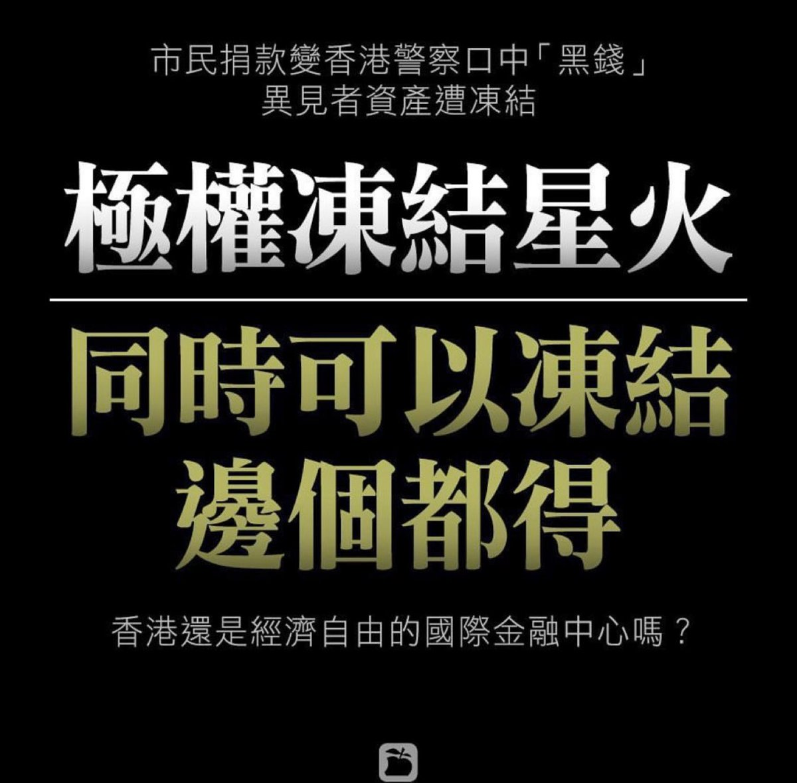
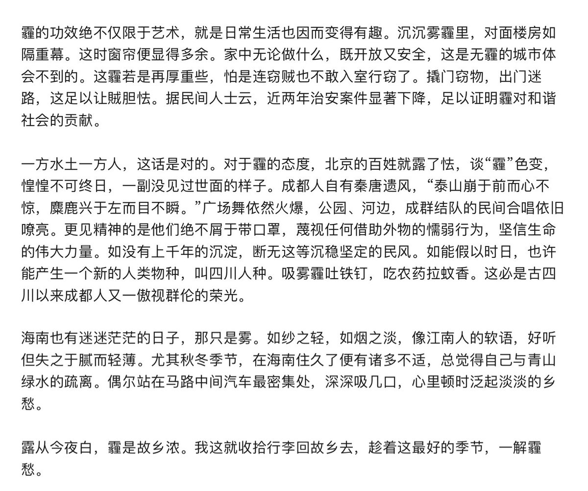

[12月20日 18:30]    纽约时报中文网   @nytchinese    #时报专栏 没人想读的专栏 by @NickKristof  http://nyti.ms/35HcXWc https://twitter.com/NickKristof/status/1207758737265565696 …  :speech_balloon:评:0 :+1:赞:0 :globe_with_meridians:转:0  

[12月20日 18:01]    BBC News 中文   @bbcchinese    隐藏在现代大都会墨西哥城地下几米深处，一个古老帝国的神庙、宫殿和神秘文物正在挖掘，以期重见天日。 https://bbc.in/2rfmDZ2   :speech_balloon:评:2 :+1:赞:7 :globe_with_meridians:转:1  

[12月20日 17:00]    纽约时报中文网   @nytchinese    #时报专栏 当我在大学演讲时，总有人会哀叹如今越来越多的记者不去报道人道主义新闻了。这其中的挑战是：若有更多记者报道这些问题，那就有更多新闻机构将会破产。
我们的新闻界仍在为此类故事摸索商业模式，ProPublica和普利策中心这样的慈善非营利组织，可能提供了部分答案。 http://nyti.ms/35HcXWc   :speech_balloon:评:0 :+1:赞:5 :globe_with_meridians:转:2  

[12月20日 16:37]    老司机   @h5lpykl7tp6jjop    有大气污染防治工作的借口，下一步你们岂不是要堵屁眼儿了？  :speech_balloon:评:0 :+1:赞:12 :globe_with_meridians:转:0  

[12月20日 16:36]    纽约时报中文网   @nytchinese    #图集【在美国，60万美元能买到什么房？】手握60万美元，你能买到辛辛那提一座建于1908年的希腊文艺复兴风格豪宅，或佛蒙特州兰德罗夫的一处梁柱结构房屋，也可以选择弗吉尼亚州里士满的1907年砖房。
点击查看图集： http://nyti.ms/2PGODhr   :speech_balloon:评:4 :+1:赞:18 :globe_with_meridians:转:9  

[12月20日 16:01]    BBC News 中文   @bbcchinese    为什么有那么多的女孩对物理数学不感兴趣呢？真的是因为她们“不擅长”数学吗？ https://bbc.in/34C02mZ   :speech_balloon:评:9 :+1:赞:31 :globe_with_meridians:转:5  

[12月20日 16:00]    纽约时报中文网   @nytchinese    审判预计何时进行？需要多长时间？尽管总统和他的盟友急切希望迅速宣布无罪释放，佩洛西的评论提出了这样一种可能性，即众议院可能会在问题未解决的情况下休圣诞假——让弹劾的子弹再飞一会儿。
1999年对克林顿两项弹劾条款（伪证罪和妨碍司法公正）的审判持续了大约5个星期。 http://nyti.ms/35CvQcK   :speech_balloon:评:2 :+1:赞:4 :globe_with_meridians:转:0  

[12月20日 15:40]    纽约时报中文网   @nytchinese    #时报专栏 @NickKristof：今年我的专栏中读的最差的一篇是关于香港，关于新疆问题的也没人读。我倒是想说这些文章是写砸了，但砸字还显得留下了点影响似的。权且称它们为废物。失策。水货。鲁蛇。
我感到自己很幸运，仍有完全的自由去报道没有市场的人道主义新闻。 http://nyti.ms/35HcXWc   :speech_balloon:评:20 :+1:赞:41 :globe_with_meridians:转:6  

[12月20日 15:01]    BBC News 中文   @bbcchinese    中国国家主席习近平周五（20日）出席澳门治权移交20周年庆祝大会暨澳门特区第五届政府就职典礼时，高调评价澳门“发自内心地拥护一国两制”，强调港澳事务“完全是中国内政，用不着任何外部势力指手划脚”。 https://bbc.in/38WSTRO   :speech_balloon:评:30 :+1:赞:48 :globe_with_meridians:转:9  

[12月20日 15:00]    纽约时报中文网   @nytchinese    杨安泽的竞选口号——“与唐纳德·特朗普正相反，是一个喜欢数学的亚裔男子”——以及他在今年早些时候的一场辩论中声明“我是亚裔，所以我认识很多医生”的说法，招致了严厉的批评，因为这些话延续了人们对亚裔美国人的刻板印象。 http://nyti.ms/2Z71vk4   :speech_balloon:评:2 :+1:赞:3 :globe_with_meridians:转:0  

[12月20日 14:55]    老司机   @h5lpykl7tp6jjop    三千年历史从此改写！从不准乱说话到不准煮饭吃！自从有了共产党，什么人间奇迹都能造出来！加油！习奥塞斯库同志！只要民间无炊烟，不怕槐树吊包子！  :speech_balloon:评:7 :+1:赞:63 :globe_with_meridians:转:26  

[12月20日 14:39]    纽约时报中文网   @nytchinese    美国众议院已通过弹劾特朗普的投票，通常下一步将移交参议院审理——这是第三位进入弹劾审判的美国总统。
因担心审判公正性问题，众议院议长南希·佩洛西考虑推迟向参议院提交弹劾指控。审判预计何时进行？谁负责做什么？都有什么样的规则？将会如何结束？这里是一份解答。 http://nyti.ms/35CvQcK   :speech_balloon:评:11 :+1:赞:24 :globe_with_meridians:转:7  

[12月20日 14:00]    BBC News 中文   @bbcchinese    中国肉价猛涨势头一时难以缓解。近日印尼也爆发非洲猪瘟，进一步影响全球供应链。 https://bbc.in/2Sh67D3   :speech_balloon:评:37 :+1:赞:113 :globe_with_meridians:转:41  

[12月20日 13:56]    财经真相   @caijingxiang    12月20日，中共央行在香港发行100亿元人民币央票。这是继今年2月、5月、6月、8月、9月、11月之后，第7次在香港发行央票。自此，中共央行在香港总共发行了19期、累计1700亿元的央票，如此频繁的行动是较为罕见的。在美国汇率操纵指责以及资本外流背景下，发行央票成了维护汇率的主要手段！  :speech_balloon:评:9 :+1:赞:177 :globe_with_meridians:转:55  

[12月20日 13:30]    纽约时报中文网   @nytchinese    在北京眼中，顺从的澳门是香港的榜样  http://nyti.ms/2PDTsrX https://twitter.com/stevenleemyers/status/1207205009487732737 …  :speech_balloon:评:29 :+1:赞:18 :globe_with_meridians:转:8  

[12月20日 13:00]    BBC News 中文   @bbcchinese    中国研发部署北斗全球定位系统被认为有能力与美国GPS匹敌，是具有重要经济和军事战略意义的一步棋。 https://bbc.in/2PGi3wr   :speech_balloon:评:39 :+1:赞:71 :globe_with_meridians:转:30  

[12月20日 13:00]    纽约时报中文网   @nytchinese    #每日一词 Workhorse，驮马，做重活的人。烤箱被选为时报科技工坊专栏的年度小工具，@bxchen写道，像智能手机一样，优秀的烤箱可成为日常生活中的“老黄牛”(everyday workhorse)。
Workhorse意为专门用来驮东西的马，其也有经久耐用的机器、埋头苦干的人的意思。更多简报内容： http://nyti.ms/2PF08Gf   :speech_balloon:评:1 :+1:赞:2 :globe_with_meridians:转:0  

[12月20日 12:58]    新闻大吐槽   @TuCaoFakeNews    sorry 我是说霍建华，不是肖建华  :speech_balloon:评:2 :+1:赞:18 :globe_with_meridians:转:0  

[12月20日 12:55]    老司机   @h5lpykl7tp6jjop    一对夫妻接受发横财同学的宴请被镇住了，在豪华大厅一个响指让夫妻以好生羡慕，有钱真好！决定要发财致富，思量后将自住临街铺面开做飡馆，十多年以后不过是小康而已，起早贪黑，一天不开门，一天没收入，夫妻猛然想起当初发财目的是想有了钱让别人侍候自己，结果没发财成了天天侍候别人，相视苦笑。  :speech_balloon:评:5 :+1:赞:20 :globe_with_meridians:转:5  

[12月20日 12:35]    新闻大吐槽   @TuCaoFakeNews    历史规律：经济越萧条，电影行业越发达！
可兲朝又特色了，今年中国影视业下滑一点也不比经济下滑慢！比如黄晓明夫妇，肖建华等一线明星，今年几乎都无戏可拍~
反常现象的原因是什么呢？原来中国影视行业的重要作用在于洗钱，随着经济整体下滑，黑色产业也收紧了，洗钱的需求也下降了，导致影视业寒冬  :speech_balloon:评:18 :+1:赞:226 :globe_with_meridians:转:92  

[12月20日 12:35]    新闻大吐槽   @TuCaoFakeNews    历史规律：经济越萧条，电影行业越发达！
可兲朝又特色了，今年中国影视业下滑一点也不比经济下滑慢！比如黄晓明夫妇，肖建华等一线明星，今年几乎都无戏可拍~
反常现象的原因是什么呢？原来中国影视行业的重要作用在于洗钱，随着经济整体下滑，黑色产业也收紧了，洗钱的需求也下降了，导致影视业寒冬  :speech_balloon:评:18 :+1:赞:226 :globe_with_meridians:转:92  

[12月20日 12:30]    纽约时报中文网   @nytchinese    杨安泽是目前仍在参选的民主党候选人中唯一的非白人，对许多政治老手来说，这本身就是非凡的。但在他引人注目的政治上升过程中，他基本上一直试图避免过多地讨论自己的背景。
长期被排除在有关少数族裔讨论之外的亚裔，仍在寻找多元化中适合自己的位置。 http://nyti.ms/2Z71vk4   :speech_balloon:评:26 :+1:赞:50 :globe_with_meridians:转:14  

[12月20日 12:20]    BBC News 中文   @bbcchinese    中国国家主席习近平在庆祝澳门治权移交20周年大会暨第五届特区政府就职典礼上发表重要讲话，称将于中央支持及各界协力下谱写澳门特色的“一国两制”。  :speech_balloon:评:38 :+1:赞:39 :globe_with_meridians:转:7  

[12月20日 12:09]    老司机   @h5lpykl7tp6jjop    简单声明：本人就是一个年己七十岁的退休老人，对未来没有打算没有企图，发推不过是打发时间，过过嘴瘾，反共是本能，不接受采访，不加入任何组织，不想社交，不回私信，有话公开说，骂我也没用，定型老顽固一个，一生不怕得罪人， 那怕孤独终老，四肢僵硬，牙齿掉光，只要指头能动，还是要反共反愚民  :speech_balloon:评:21 :+1:赞:276 :globe_with_meridians:转:19  

[12月20日 12:00]    纽约时报中文网   @nytchinese    英国女王国会演讲承诺将不日脱欧。
在主持议会开幕式时，伊丽莎白二世还传达了首相鲍里斯·约翰逊施政方针中的“人民的优先事项”，称政府将大幅增加对医疗服务和执法部门的支出。
更多简报内容： http://nyti.ms/2PF08Gf   :speech_balloon:评:0 :+1:赞:6 :globe_with_meridians:转:0  

[12月20日 11:30]    纽约时报中文网   @nytchinese    特朗普不可思议的政治崛起反映了美国政治的转变，不同的新闻媒体推动了不同的叙述。
对某些人来说，他的当选是普通人对沿海地区精英阶层的反抗。他们将权力赋予一个爱作秀的富人，让他去挑战体制，使他成为美国史上第一个没任何政府或军队经验的总统，赌他能做的比前任要好。 http://nyti.ms/36UZFFx   :speech_balloon:评:12 :+1:赞:20 :globe_with_meridians:转:6  

[12月20日 11:00]    BBC News 中文   @bbcchinese    英国新一届议会开幕，女王在致辞中勾勒了保守党政府内政外交中大力求变的多路政策走向。 https://bbc.in/35HM30h   :speech_balloon:评:4 :+1:赞:20 :globe_with_meridians:转:4  

[12月20日 11:00]    纽约时报中文网   @nytchinese    2020年民主党初选：七名民主党总统参选人周四晚间于洛杉矶再次展开辩论。几周后在爱荷华州举行的党团会议是将候选人减少到一名的重要一步。
在全国民调中，前副总统拜登仍然领先。
更多简报内容： http://nyti.ms/2PF08Gf   :speech_balloon:评:0 :+1:赞:4 :globe_with_meridians:转:0  

[12月20日 10:30]    BBC News 中文   @bbcchinese    美中前脚刚就第一阶段贸易协议达成共识，美国总统特朗普后脚就遭弹劾。面对“内忧”的特朗普，对“外患”中国的态度会否改变？ https://bbc.in/2sJ2VFm   :speech_balloon:评:5 :+1:赞:26 :globe_with_meridians:转:8  

[12月20日 10:30]    纽约时报中文网   @nytchinese    “就像我们常说的，听话的孩子有糖吃，”澳门理工学院社工系退休教授、如今是赌瘾咨询顾问的苏文欣说。“澳门就是听话的孩子。”
在澳门，超过半数人出生在中国大陆；许多人去该市的赌场赌博；政府大楼飞扬着中国国旗；学校使用大陆教科书。没人像香港抗议者常做的那样嘘中国国歌。 http://nyti.ms/2PDTsrX   :speech_balloon:评:24 :+1:赞:33 :globe_with_meridians:转:4  

[12月20日 10:00]    BBC News 中文   @bbcchinese    BBC中文的调查发现，撑警联署数字的增长存在诸多疑点，有分析质疑组织者可能使用电脑程式自我复制联署。 https://bbc.in/2EDTidD   :speech_balloon:评:109 :+1:赞:293 :globe_with_meridians:转:100  

[12月20日 09:56]    纽约时报中文网   @nytchinese    早安！今日重点新闻包括：
特朗普弹劾审判或被推迟；英国女王国会演讲承诺将不日脱欧；七名民主党总统参选人展开辩论；俄罗斯联邦安全局总部附近发生枪案；菲律宾马京达瑙大屠杀案宣判……NYT简报带你速览今日要闻。 http://nyti.ms/2PF08Gf   :speech_balloon:评:7 :+1:赞:20 :globe_with_meridians:转:2  

[12月20日 09:40]    新闻大吐槽   @TuCaoFakeNews    看来是中共正面战场无法胜利，想要搞暗杀干掉川普，他们认为海湖庄园不是传统的总统居所，所以安保可能不完善，所以派出半专业间谍刺探海湖庄园的安保漏洞，万一找到，真正的暗杀人员就会立刻乘隙而入！
找不到，女子也只能如去年案例一样草草释放~

老中医千万要做好安保，不能让土共有机可乘 https://twitter.com/shiweijueye0307/status/1207833532115980290 …  :speech_balloon:评:7 :+1:赞:114 :globe_with_meridians:转:51  

[12月20日 09:40]    新闻大吐槽   @TuCaoFakeNews    看来是中共正面战场无法胜利，想要搞暗杀干掉川普，他们认为海湖庄园不是传统的总统居所，所以安保可能不完善，所以派出半专业间谍刺探海湖庄园的安保漏洞，万一找到，真正的暗杀人员就会立刻乘隙而入！
找不到，女子也只能如去年案例一样草草释放~

老中医千万要做好安保，不能让土共有机可乘 https://twitter.com/shiweijueye0307/status/1207833532115980290 …  :speech_balloon:评:7 :+1:赞:114 :globe_with_meridians:转:51  

[12月20日 09:10]    凡賽堤/FORSETI   @FecharCCP    浮屍，墜樓，被輪姦，被自殺........一直沒有停止過！
都是我們族人，同胞，親人，朋友......我們還是束手無助！！！ CCP極權在70年間已經有不完全統計的上億華人被以各種手段，莫須有罪名殺害，今天每天都還在發生！
我們怎麼辦？隨時隨刻將在你的親人，朋友身邊發生！！！怎麼辦？  :speech_balloon:评:3 :+1:赞:12 :globe_with_meridians:转:19  

[12月20日 09:01]    BBC News 中文   @bbcchinese    1920年代，当古埃及法老图坦卡蒙的陵墓被发现时，整个世界都被它迷住了，时隔百年，这位少年国王仍然持续焕发魅力。 https://bbc.in/2PZYGND   :speech_balloon:评:9 :+1:赞:48 :globe_with_meridians:转:22  

[12月20日 08:08]    新闻大吐槽   @TuCaoFakeNews    明言说「鸡蛋和高墙之间，我永远站在鸡蛋一边！」
可在兲朝事情就复杂了，在恶法和恶党故意的放纵下，一些臭蛋披着好蛋的外壳，专以碰瓷为生，肆无忌惮，柔弱的外表，加上恶臭的内心，被党用作沙化社会的棋子~

所以不得不打个补丁：我站在鸡蛋一边，但我绝对不站在臭蛋一边！  :speech_balloon:评:26 :+1:赞:120 :globe_with_meridians:转:44  

[12月20日 08:08]    凡賽堤/FORSETI   @FecharCCP    時代革命，消滅極權，光復中華，人人有責！！！  :speech_balloon:评:0 :+1:赞:3 :globe_with_meridians:转:0  

[12月20日 07:59]    凡賽堤/FORSETI   @FecharCCP    在科技與文明的新時代，每個華人全部行駛歷史賦予華人的新的神聖使命----時代革命，消滅極權，光復中華！！！  :speech_balloon:评:3 :+1:赞:22 :globe_with_meridians:转:13  

[12月20日 07:48]    凡賽堤/FORSETI   @FecharCCP    CCP極權挾14億華人以令世界70年，聲討與消滅CCP極權的時代已經來了，讓我們一起學習香港人永不屈服的正義精神！！！ 全面傳播香港的危機真相來喚醒14億人的良知！
讓我們一起向全世界發出震撼人類歷史的全民聲討消滅CCP極權組織的聲音！！！永不屈服！！！永不停止！！  :speech_balloon:评:3 :+1:赞:26 :globe_with_meridians:转:27  

[12月20日 07:35]    凡賽堤/FORSETI   @FecharCCP    期望全世界正義之人每個人全面收集整理香港6.9以來的所有視頻，畫面加以時間，事件說明，中英文製作宣傳片，紀錄片，保存並向全世界社交媒體傳播！永不停止！！！ https://twitter.com/FecharCCP/status/1198065532991410177 …  :speech_balloon:评:1 :+1:赞:21 :globe_with_meridians:转:17  

[12月20日 07:25]    凡賽堤/FORSETI   @FecharCCP    我們不可停止，我們將無限循環傳播香港的全方位被CCP極權組織殘暴殺害的種種真相視頻和畫面，永不停止！！！！！！！！！！！！！！！！！！！！！！！！！！！！！！！！！！！！！！！！！！！！！！！！！！！！！！！！！！！！！！！！！！！！！！！！！！！！！！！！！！！  :speech_balloon:评:10 :+1:赞:154 :globe_with_meridians:转:171  

[12月20日 07:21]    凡賽堤/FORSETI   @FecharCCP    我們不可停止，我們將無限循環傳播香港的全方位被CCP極權組織殘暴殺害的種種真相視頻和畫面，永不停止！！！！！！！！！！！！！！！！！！！！！！！！！！！！！！！！！！！！！！！！！！！！！！！！！！！！！！！！！！！！！！！！！！！！！！！！！！！！！！！！！！！  :speech_balloon:评:0 :+1:赞:5 :globe_with_meridians:转:3  

[12月20日 07:18]    凡賽堤/FORSETI   @FecharCCP    我們不可停止，我們將無限循環傳播香港的全方位被CCP極權組織殘暴殺害的種種真相視頻和畫面，永不停止！！！！！！！！！！！！！！！！！！！！！！！！！！！！！！！！！！！！！！！！！！！！！！！！！！！！！！！！！！！！！！！！！！！！！！！！！！！！！！！！！！！ https://twitter.com/FecharCCP/status/1198392652863021056 …  :speech_balloon:评:0 :+1:赞:11 :globe_with_meridians:转:8  

[12月20日 06:57]    凡賽堤/FORSETI   @FecharCCP    我們不可停止，我們將無限循環傳播香港的全方位被CCP極權組織殘暴殺害的種種真相視頻和畫面，永不停止！！！！！！！！！！！！！！！！！！！！！！！！！！！！！！！！！！！！！！！！！！！！！！！！！！！！！！！！！！！！！！！！！！！！！！！！！！！！！！！！！！！ https://twitter.com/FecharCCP/status/1181647701173248001 …  :speech_balloon:评:0 :+1:赞:2 :globe_with_meridians:转:1  

[12月20日 06:55]    凡賽堤/FORSETI   @FecharCCP    我們不可停止，我們將無限循環傳播香港的全方位被CCP極權組織殘暴殺害的種種真相視頻和畫面，永不停止！！！！！！！！！！！！！！！！！！！！！！！！！！！！！！！！！！！！！！！！！！！！！！！！！！！！！！！！！！！！！！！！！！！！！！！！！！！！！！！！！！！ https://twitter.com/FecharCCP/status/1182382291068342272 …  :speech_balloon:评:0 :+1:赞:30 :globe_with_meridians:转:33  

[12月20日 06:55]    凡賽堤/FORSETI   @FecharCCP    我們不可停止，我們將無限循環傳播香港的全方位被CCP極權組織殘暴殺害的種種真相視頻和畫面，永不停止！！！！！！！！！！！！！！！！！！！！！！！！！！！！！！！！！！！！！！！！！！！！！！！！！！！！！！！！！！！！！！！！！！！！！！！！！！！！！！！！！！！ https://twitter.com/FecharCCP/status/1182392550516285440 …  :speech_balloon:评:0 :+1:赞:3 :globe_with_meridians:转:3  

[12月20日 06:43]    新闻大吐槽   @TuCaoFakeNews    叶问4迎合共党在贸易战惨败背景下仇美宣传的需要，安排叶问在洛杉矶狂扁美国警长；
片中甄的一句台词是：“见到不公义的事，我一定要站出来！” 好讽刺~
活脱脱一个挖空心思谄媚共党，却板脸装作大公无私的伪英雄！

中国人与香港人遭到的不公都是党造成的！与美国人何干？你“叶问”有没有胆量正义一把？  :speech_balloon:评:24 :+1:赞:154 :globe_with_meridians:转:33  

[12月20日 05:13]    老司机   @h5lpykl7tp6jjop      :speech_balloon:评:2 :+1:赞:4 :globe_with_meridians:转:2  

[12月20日 05:09]    老司机   @h5lpykl7tp6jjop    1560年,瑞士钟表匠布克在游览金字塔时,做出了一个惊人的推断：金字塔建造者绝不会是奴隶,而是一批具有自由身份的农民和手工业者,因为奴隶们的心灵不自由,心灵不自由是不会制造出如此精致建筑的。最近埃及通过大量的证据得出结论，金字塔真的是由当地具有自由身份农民和手工业者建造而成并非奴隶所造。  :speech_balloon:评:2 :+1:赞:41 :globe_with_meridians:转:15  

[12月20日 04:53]    老司机   @h5lpykl7tp6jjop    宁愿把钱花在建立重重叠叠的机构上，也不让人民免费医疗！  :speech_balloon:评:3 :+1:赞:18 :globe_with_meridians:转:0  

[12月20日 04:29]    老司机   @h5lpykl7tp6jjop    一切都在悄悄地发生！  :speech_balloon:评:3 :+1:赞:108 :globe_with_meridians:转:46  

[12月20日 03:01]    老司机   @h5lpykl7tp6jjop    说你黑你就黑，不黑也黑！说不黑就不黑，黑也不黑！
一国两制 ！？  :speech_balloon:评:0 :+1:赞:11 :globe_with_meridians:转:8  

[12月19日 23:30]    BBC News 中文   @bbcchinese    一批信仰马克思主义的左翼年轻人在网络和街头集结，对他们不满的社会现实发起挑战，形成一股不可小觑的政治行动力量。 https://bbc.in/2EvkBXN   :speech_balloon:评:133 :+1:赞:347 :globe_with_meridians:转:127  

[12月19日 22:59]    BBC News 中文   @bbcchinese    两岸关系如何由国共历史矛盾，转变成两种体制的对抗。在中美贸易战和特朗普效应下，这个三角关系会有甚么变化？ https://bbc.in/2sHWoed   :speech_balloon:评:14 :+1:赞:19 :globe_with_meridians:转:9  

[12月19日 22:59]    BBC News 中文   @bbcchinese    生物学家发现，寄居蟹演化出超长阴茎竟有现实原因——性交时不担心丢掉蜗居；居所越珍贵，阴茎越长。 https://bbc.in/2r7NcPH   :speech_balloon:评:16 :+1:赞:103 :globe_with_meridians:转:39  

[12月19日 22:44]    BBC News 中文   @bbcchinese    英国专家向BBC解释了他治疗失眠的方法.他说，这种方法不但对失眠有效，同时还有助于减轻焦虑。 https://bbc.in/2PAinwq   :speech_balloon:评:4 :+1:赞:37 :globe_with_meridians:转:29  

[12月19日 22:30]    BBC News 中文   @bbcchinese    务虚几十年，论证十几年，英国高铁建设终于上马开工了。一锹挖下去，考古专家进驻工地，建设总指挥丢了乌纱。 https://bbc.in/2ExuZOD   :speech_balloon:评:37 :+1:赞:113 :globe_with_meridians:转:51  

[12月19日 21:59]    BBC News 中文   @bbcchinese    欧洲各地都有不少性爱娃娃妓院开业。这到底是物化女性还是解放和创新呢？ https://bbc.in/2sEygZY   :speech_balloon:评:2 :+1:赞:26 :globe_with_meridians:转:6  

[12月19日 21:30]    BBC News 中文   @bbcchinese    BBC图片组精选2018年全球摄影记者拍摄的一组最震撼人心的新闻图片。 https://bbc.in/2EA0NCA   :speech_balloon:评:23 :+1:赞:124 :globe_with_meridians:转:65  

[12月19日 21:26]    BBC News 中文   @bbcchinese    【澳门移交20年】同是中国的“特别行政区”，澳门跟香港都有哪些分别？ https://www.youtube.com/watch?v=mbR0xbfndz8 …  :speech_balloon:评:7 :+1:赞:14 :globe_with_meridians:转:3  

[12月19日 20:59]    BBC News 中文   @bbcchinese    从地产大亨到美国总统，特朗普入主白宫已两年。但百年之后，历史会如何讲述这位不合正统的总统呢？ https://bbc.in/35DiOMa   :speech_balloon:评:42 :+1:赞:52 :globe_with_meridians:转:13  

[12月19日 20:52]    纽约时报中文网   @nytchinese    弹劾总是在混乱的时期出现，象征着国家正在经历的重大转变。事实证明，促成特朗普弹劾案的时代也是这样，这是一个难以想象成为司空见惯的时刻，那些曾经看似不可侵犯的准则在接受考验。
特朗普弹劾案体现了这个国家的分裂，激烈交战的不同阵营正试图重新定义美国。 http://nyti.ms/36UZFFx   :speech_balloon:评:20 :+1:赞:43 :globe_with_meridians:转:24  

[12月19日 20:28]    BBC News 中文   @bbcchinese    英国外相在中英联合声明签署35周年之际表示，香港正经历主权移交以来最大的动荡，敦促北京尊重“一国两制”与港人对话。
 https://bbc.in/2s0xVR6   :speech_balloon:评:27 :+1:赞:48 :globe_with_meridians:转:17  

[12月19日 19:00]    纽约时报中文网   @nytchinese    复旦大学修改章程删除“思想自由”，引发学生抗议  http://nyti.ms/2txXXvD https://twitter.com/HernandezJavier/status/1207478502867361793 …  :speech_balloon:评:7 :+1:赞:42 :globe_with_meridians:转:28  

[12月19日 18:30]    纽约时报中文网   @nytchinese    与香港相比，澳门在“一国两制”模式下更容易接受北京在国家政策事务上的终极权威。无论是被大陆拉拢还是胁迫，在大多数情况下，该城市的67万居民都能与之和平共处。
这种顺从有其历史原因，也因为澳门经济高度依赖赌博业，受中国大陆影响更大。 http://nyti.ms/2PDTsrX   :speech_balloon:评:121 :+1:赞:179 :globe_with_meridians:转:69  

[12月19日 18:09]    老司机   @h5lpykl7tp6jjop    这几天，澳洲热得就跟火炉似的。
刚好，这段时间悉尼鲜虾泛滥，各位华人，还不拿起渔网捞虾去？最近，一位悉尼的华人博主“你的摄影师JOF”，在小红书上上传了这么一段视频都是因为，最近悉尼海里的虾实在是太多了！一个小时后，两个大水桶就全装满了！  :speech_balloon:评:2 :+1:赞:13 :globe_with_meridians:转:0  

[12月19日 18:00]    纽约时报中文网   @nytchinese    《纽约时报》今日头版 https://twitter.com/TomJolly/status/1207520965556654080 …  :speech_balloon:评:6 :+1:赞:7 :globe_with_meridians:转:3  

[12月19日 17:44]    老司机   @h5lpykl7tp6jjop    金正恩在平壤大街公开处决“百花园迎宾馆”馆长
因遭发现在家中藏有300万美金钜款，最后以涉嫌贪污，在平壤大街遭处决。该馆是朝鲜接待外宾最主要场所，代表着最高规格的礼遇，曾经招待过前韩国总统金大中、卢武铉、前日本首相小泉纯一郎及前美国总统卡特等各国政要。
贪污是东西朝鲜无法医治的痼疾！  :speech_balloon:评:16 :+1:赞:130 :globe_with_meridians:转:37  

[12月19日 17:30]    纽约时报中文网   @nytchinese    此次的章程修改再度令人担心，自2012年上任以来对言论自由施行广泛镇压的习近平正在加紧行动，将大学变成党的堡垒，抑制异见的声音。
“我们想表明我们不能容忍这一点，”一名复旦大学本科生表示。该学生是周三抗议该校决定从其章程中删除“思想自由”的数十名学生之一。 http://nyti.ms/2txXXvD   :speech_balloon:评:28 :+1:赞:102 :globe_with_meridians:转:28  

[12月19日 16:27]    新闻大吐槽   @TuCaoFakeNews    三星——儒家文化——己所不欲勿施于人——离职好聚好散
华为——共党文化——斗争哲学人性泯灭——离职关你251天 https://twitter.com/zhanglucy88/status/1207519402117058567 …  :speech_balloon:评:5 :+1:赞:140 :globe_with_meridians:转:46  

[12月19日 16:27]    新闻大吐槽   @TuCaoFakeNews    三星——儒家文化——己所不欲勿施于人——离职好聚好散
华为——共党文化——斗争哲学人性泯灭——离职关你251天 https://twitter.com/zhanglucy88/status/1207519402117058567 …  :speech_balloon:评:5 :+1:赞:140 :globe_with_meridians:转:46  

[12月19日 15:03]    新闻大吐槽   @TuCaoFakeNews    同样一身警皮，
三哥不欺妇女，
反观亚洲东隅，
人伦底线告急！

港警专虐花季，
陆警顽似泼皮，
欺凌老弱病残，
无所不用其极！

盖为共产邪说，
无神论之恶疾，
怜悯之心全无，
坠入禽兽之域！ https://twitter.com/hAqxu49QLnUufFq/status/1207534948724301829 …  :speech_balloon:评:9 :+1:赞:78 :globe_with_meridians:转:26  

[12月19日 14:39]    财经真相   @caijingxiang    美国历史上四位遭到“弹劾”的总统，以及弹劾条款和原因！  :speech_balloon:评:23 :+1:赞:145 :globe_with_meridians:转:56  

[12月19日 14:26]    财经真相   @caijingxiang    为了庆祝澳门被中共统治20周年，澳门特别行政区政府与珠海市人民政府将于12月22日晚上9时，在澳门旅游塔及珠海横琴金融岛对出海面首次举行联合烟花汇演。本次汇演将有16万枚烟花、4艘大泊船、16个特效燃放平台、56艘无人船及600只无人机参与。 周末没事，可以去看看纳税人的钱如何“天女散花”！  :speech_balloon:评:33 :+1:赞:269 :globe_with_meridians:转:77  

[12月19日 11:59]    财经真相   @caijingxiang    本次降准幅度应该会超过100个基点，去年央行新年大规模降准公布日期是1月4号（新年的第一周的周五），实施日期是1月15日，今年如果央行沿用去年时间点，最迟会在1月3号（周五）公布，或者本周五（明天）宣布！预计本次降准对人民币汇率影响有限，人民币会短线走低后，将会继续重回7附近震荡！  :speech_balloon:评:3 :+1:赞:98 :globe_with_meridians:转:11  

[12月19日 11:48]    财经真相   @caijingxiang    【重要】昨天央行开展2500亿逆回购操作，其中包含1500亿14天操作，14天后到期日刚好是元旦，这说明央行已经开始安排跨年流动性。由于春节提现高峰，以及提前下发2020年一万亿专项债开始筹资，再加上到期4075亿MLF，交税费高峰，初步估算整个1月份资金缺口达到2.8万亿，为此央行大概率全面性再次降准！  :speech_balloon:评:14 :+1:赞:286 :globe_with_meridians:转:84  

[12月19日 07:20]    新闻大吐槽   @TuCaoFakeNews    火葬场迁址播扬镇，又遭强烈抵制，市民们非常有策略，在震天的锣鼓点的掩护下，攻入政府大楼！各种杂物齐射党官，吓得他们屁滚尿流逃窜~
尽管抗争如此激烈，可路过的不知情者肯定还以为是在庆祝什么活动~
抗争者深得兵法要诀，共党支部好似被套上麻袋，一顿胖揍  :speech_balloon:评:41 :+1:赞:564 :globe_with_meridians:转:260  

[12月19日 05:09]    老司机   @h5lpykl7tp6jjop    几乎所有反共的组织中共都当作小菜一碟，能让它们忌惮的只有法轮功，因为中共洗脑是靠威胁利诱，而法轮功是真让信徒入迷而信，比打土豪分田地一人一个女学生要高尚得多，所以这么多年，也没有把他们打垮，我不信法轮功，对他们尊重，但很怀疑靠中华文化和个人崇拜能救中国？  :speech_balloon:评:29 :+1:赞:129 :globe_with_meridians:转:17  

[12月19日 04:32]    老司机   @h5lpykl7tp6jjop    网文节选转发  :speech_balloon:评:0 :+1:赞:14 :globe_with_meridians:转:5  

[12月19日 04:04]    老司机   @h5lpykl7tp6jjop    日本管理大师新作:中国是典型“低智商国家”

45.9万中国人共用一所图书馆，而且里面没有好书。  :speech_balloon:评:7 :+1:赞:144 :globe_with_meridians:转:51  

[12月19日 03:47]    老司机   @h5lpykl7tp6jjop    加国华人女教授怒告大学种族歧视 性骚扰 下毒
湖首大学秘密监控了我的银行账户和生活起居，法庭上，华人女教授这样说道，但是被问到具体的细节和证据时，她又迅速改口说是性骚扰和性诱骗等，最终人权法庭驳回了她的诉讼。怀疑自己遭受到了种族歧视就要打官司，没有证据光凭怀疑？这位女教授咋当上的？  :speech_balloon:评:1 :+1:赞:9 :globe_with_meridians:转:2  

[12月19日 02:07]    老司机   @h5lpykl7tp6jjop    妙文共欣赏：《霾是故乡浓》  :speech_balloon:评:0 :+1:赞:11 :globe_with_meridians:转:0  

[12月19日 01:55]    墙国铁拳现世报😷   @Socialistfist    后续申明  :speech_balloon:评:17 :+1:赞:112 :globe_with_meridians:转:19  

[12月18日 20:34]    老司机   @h5lpykl7tp6jjop    2019年，香港人给党送终没完没了；而本以为平息的广东茂名火葬场事件又波澜再起；
共党在文楼镇没能得逞，旋即选中距离文楼镇27公里的播扬镇，不料又遭强烈抵制，本周一有近万村民上街示威，并且用燃烧弹与警方死磕~

香港负责给党送终，茂名负责火化，一条龙服务！  :speech_balloon:评:29 :+1:赞:395 :globe_with_meridians:转:156  

[12月18日 20:34]    新闻大吐槽   @TuCaoFakeNews    2019年，香港人给党送终没完没了；而本以为平息的广东茂名火葬场事件又波澜再起；
共党在文楼镇没能得逞，旋即选中距离文楼镇27公里的播扬镇，不料又遭强烈抵制，本周一有近万村民上街示威，并且用燃烧弹与警方死磕~

香港负责给党送终，茂名负责火化，一条龙服务！  :speech_balloon:评:29 :+1:赞:395 :globe_with_meridians:转:156  

[12月18日 20:34]    新闻大吐槽   @TuCaoFakeNews    2019年，香港人给党送终没完没了；而本以为平息的广东茂名火葬场事件又波澜再起；
共党在文楼镇没能得逞，旋即选中距离文楼镇27公里的播扬镇，不料又遭强烈抵制，本周一有近万村民上街示威，并且用燃烧弹与警方死磕~

香港负责给党送终，茂名负责火化，一条龙服务！  :speech_balloon:评:29 :+1:赞:395 :globe_with_meridians:转:156  

[12月18日 20:12]    新闻大吐槽   @TuCaoFakeNews    复旦师生不满共党将「独立之精神，自由之思想」等字眼从大学章程中删除，齐聚食堂，唱校歌抗议。歌词：復旦復旦復旦，日月光华同灿烂！

复旦原指：不忘“震旦”之旧，更含复兴中华之意~
新解：要想中华复兴，共党必须滚旦~  :speech_balloon:评:46 :+1:赞:732 :globe_with_meridians:转:272  

[12月18日 20:12]    新闻大吐槽   @TuCaoFakeNews    复旦师生不满共党将「独立之精神，自由之思想」等字眼从大学章程中删除，齐聚食堂，唱校歌抗议。歌词：復旦復旦復旦，日月光华同灿烂！

复旦原指：不忘“震旦”之旧，更含复兴中华之意~
新解：要想中华复兴，共党必须滚旦~  :speech_balloon:评:46 :+1:赞:732 :globe_with_meridians:转:272  

[12月18日 19:55]    财经真相   @caijingxiang    澳门向内地汇款额度提高到8万，那么从内地到澳门的额度没有提高吗？怎么感觉是在撸澳门人的羊毛节奏啊！难道就是因为澳门人老实，往死里忽悠？  :speech_balloon:评:35 :+1:赞:297 :globe_with_meridians:转:86  

[12月18日 19:54]    墙国铁拳现世报😷   @Socialistfist    根据网上来源显示抚顺生猪肉价在每公斤30元左右。由此得出花千芳母亲一个月可以购买猪肉6.7公斤左右  :speech_balloon:评:11 :+1:赞:49 :globe_with_meridians:转:8  

[12月18日 19:35]    新闻大吐槽   @TuCaoFakeNews    一鳞半爪尚且精美优雅，何况真龙乎？
亚里士多德说”人类社会是洞外世界的投影“，美有其更高的来处，当从上到下连上了，艺术的感召力无可匹敌，比如每年在世界上巡回的神韵演出，广受西方世界欢迎，因为他不仅仅是服饰美，舞蹈美，还在阐释中华文化之精神内涵，是在接已被共党斩断的中华文化根脉~  :speech_balloon:评:1 :+1:赞:13 :globe_with_meridians:转:4  

[12月18日 19:35]    新闻大吐槽   @TuCaoFakeNews    鬼子盯上花姑娘，花姑娘何罪之有？
李子柒，滇西小哥，将被共党破坏后的传统文化残片拿到世界级平台上展示，都美丽的无可挑剔~让老外服气~

不用批评他们假，艺术本来就是高于生活，其实冷血、反人性的共党文化永远也开不出半朵温情的文化之花~

希望有生命力的东西免于邪党魔爪~  :speech_balloon:评:2 :+1:赞:49 :globe_with_meridians:转:11  

[12月18日 19:19]    墙国铁拳现世报😷   @Socialistfist    目前花千芳已经意识到评论翻车已经删除该条微博
小编建议花千芳可以从此把简介改成： 我们的征途是星辰大海和妈妈的养老证  :speech_balloon:评:9 :+1:赞:248 :globe_with_meridians:转:28  

[12月18日 19:19]    财经真相   @caijingxiang    这就是说美国人给的时间点就是下个月的第一周，算时间就是两周内中共内斗出结果！ https://twitter.com/globalhimalaya/status/1207104656129658881 …  :speech_balloon:评:14 :+1:赞:251 :globe_with_meridians:转:98  

[12月18日 18:42]    墙国铁拳现世报😷   @Socialistfist    #社会主义铁拳 https://twitter.com/zhanglucy88/status/1207234309737697280 …  :speech_balloon:评:32 :+1:赞:353 :globe_with_meridians:转:95  

[12月18日 17:41]    老司机   @h5lpykl7tp6jjop    著名自干五粉紅花千芳
居然敢指責政府黑了養老金
把其母養老證收回
養老金改存款利息了
狠……黑……!

也有被鐵拳砸疼的時候!
  :speech_balloon:评:78 :+1:赞:459 :globe_with_meridians:转:179  

[12月18日 16:36]    财经真相   @caijingxiang    中国国家发改委新闻发言人孟玮17日透露，今后一段时间，特别是中国“两节”期间，将根据市场形势变化，择机增加中央冻猪肉储备投放。  :speech_balloon:评:19 :+1:赞:135 :globe_with_meridians:转:19  

[12月18日 13:15]    老司机   @h5lpykl7tp6jjop    老眼昏花又把必须打成心须了.报歉！  :speech_balloon:评:2 :+1:赞:9 :globe_with_meridians:转:0  

[12月17日 23:13]    墙国铁拳现世报😷   @Socialistfist      :speech_balloon:评:7 :+1:赞:52 :globe_with_meridians:转:6  

[12月17日 23:13]    墙国铁拳现世报😷   @Socialistfist    注意到他使用日文，这个老哥真是猜不透他  :speech_balloon:评:10 :+1:赞:86 :globe_with_meridians:转:3  

[12月17日 21:53]    墙国铁拳现世报😷   @Socialistfist    补充  :speech_balloon:评:11 :+1:赞:93 :globe_with_meridians:转:7  

[12月17日 21:36]    墙国铁拳现世报😷   @Socialistfist    习近平主席想要知道你的坐标

#战螂在推特 https://twitter.com/minzhutiequan/status/1206795300255387648 …  :speech_balloon:评:27 :+1:赞:291 :globe_with_meridians:转:24  

[12月17日 21:29]    墙国铁拳现世报😷   @Socialistfist    声明：小编在推友提醒后把推文删除了，原因请见配图。与之前其他人不同，他的措辞实属现行网络舆论管制下的无奈。  :speech_balloon:评:26 :+1:赞:316 :globe_with_meridians:转:74  

[12月17日 19:41]    财经真相   @caijingxiang    2018年专项债余额（7.39万亿）就已经超过了政府性基金收入（7.14万亿）的规模！专项债以前高益完全可以靠土地财政收入填补，现在土地财政收入也不行了，必须要找别的办法解决！  :speech_balloon:评:12 :+1:赞:129 :globe_with_meridians:转:30  

[12月17日 19:34]    财经真相   @caijingxiang    政府债券流动性不足，翻译成人话就是说，政府债券没人买，而且购买人多数为银行机构，市场机构太聪明，不要！所以必须换个名字“特别国债”，继续忽悠！  :speech_balloon:评:32 :+1:赞:524 :globe_with_meridians:转:201  

[12月17日 19:33]    新闻大吐槽   @TuCaoFakeNews    貌似是在做睫毛，其实在位新疆鸣不平；
貌似是在做蛋糕，其实蛋糕上写的是光复香港
这样下去TikTok在美国是玩不下去了!  :speech_balloon:评:46 :+1:赞:1919 :globe_with_meridians:转:728  

[12月17日 19:25]    墙国铁拳现世报😷   @Socialistfist    律师函警告  :speech_balloon:评:10 :+1:赞:104 :globe_with_meridians:转:5  

[12月17日 14:57]    新闻大吐槽   @TuCaoFakeNews    据说是一两年以前就用的包装，能坚持不换也可以点个赞  :speech_balloon:评:1 :+1:赞:40 :globe_with_meridians:转:0  

[12月17日 14:24]    新闻大吐槽   @TuCaoFakeNews    李嘉诚旗下的屈臣氏矿泉水瓶身上写着“为香港学生打气” https://twitter.com/jim97147570/status/1206746541446164480 …  :speech_balloon:评:29 :+1:赞:957 :globe_with_meridians:转:287  

[12月16日 19:25]    墙国铁拳现世报😷   @Socialistfist    评论区表情包大赏？  :speech_balloon:评:13 :+1:赞:182 :globe_with_meridians:转:10  

[12月16日 19:17]    墙国铁拳现世报😷   @Socialistfist    任职于长春一汽公司的戛戛
每当遇到生活中的烦心事，总会回到家，一个人坐在沙发上，打开音响，调大音量, 循环播放 天赋事变的rap
［hey！democracy...] 
听着听着，戛戛就睡了过去，嘴角划出一道微笑，在中国梦里的她不再被世俗纷扰
晚安中国

#社会主义铁拳  :speech_balloon:评:78 :+1:赞:693 :globe_with_meridians:转:190  

[12月16日 17:03]    财经真相   @caijingxiang    第十九届四中全会精神！ https://twitter.com/landofyelang/status/1206481839906418688 …  :speech_balloon:评:22 :+1:赞:356 :globe_with_meridians:转:167  

[12月15日 12:37]    墙国铁拳现世报😷   @Socialistfist    #铁拳砸死小粉红

某新闻传播专业大学生，打算于思政课讨论“西方媒体在报道大型事件中的双标”，为此开设了微信讨论组交换素材与思路，但因为发言触及过多敏感词，惨遭微信封号，目前正在微博伸冤。

一场成功的“谁说我国没有言论自由”行为艺术表演。  :speech_balloon:评:91 :+1:赞:1031 :globe_with_meridians:转:362  

[12月15日 12:20]    财经真相   @caijingxiang    海南要升级为中央特区，谁决定的？该不会是某些一边干着女星，一边卖官的混蛋商量的吧？  :speech_balloon:评:123 :+1:赞:687 :globe_with_meridians:转:197  

[12月15日 11:54]    财经真相   @caijingxiang    在中国如果公司经营不下去的时候，没有什么问题是卖房不能解决的！  :speech_balloon:评:17 :+1:赞:187 :globe_with_meridians:转:31  

[12月15日 11:48]    财经真相   @caijingxiang    灵隐寺：12月13日，某媒体称：“12月18日—19日，天风证券将在上海召开展望2020年度策略会，而在下周五上午，天风策略会将会'移步'灵隐寺，接待人为灵隐寺主持方丈……”对此，灵隐寺郑重声明：“券商基金年终祈福”活动与本寺无任何关系，本寺从未委托或授权任何单位或个人开展与此相关的活动。  :speech_balloon:评:7 :+1:赞:61 :globe_with_meridians:转:13  

[12月15日 02:39]    GFHG SDKM   @zyx_yny    This Muslim man was just released from a concentration in china 

"He could barely walk by himself. He doesn't recognize anyone in his family and gets frightened by every little movement of people around him"

There are nearly 3 Million Muslim in concentration camps in China   :speech_balloon:评:1468 :+1:赞:74703 :globe_with_meridians:转:61523  

[12月14日 23:24]    墙国铁拳现世报😷   @Socialistfist    “生而为国人，边早就选了”
当初NBA风波的爱国表态，提到在国家尊严前不值一提。
鼠绘汉化网因侵犯海贼王版权疑似被哔哩哔哩上海公司举报，现已经跨省批捕
NBA目前在中国照旧正常播出

#社会主义铁拳  :speech_balloon:评:48 :+1:赞:759 :globe_with_meridians:转:187  

[12月14日 22:11]    GFHG SDKM   @zyx_yny    My 2020 New Year resolution is to free both Hong Kong & China by defeating the New Evil Empire. Happy New Year! https://twitter.com/bohsiuming/status/1205845620851785735 …  :speech_balloon:评:423 :+1:赞:4893 :globe_with_meridians:转:2358  

[12月14日 19:00]    财经真相   @caijingxiang    特朗普上台前，中国依旧是资本流入国，这一时期如何逼迫中共放开管制，好让美企也能在中国分一杯羹是中美贸易纠纷的核心；无论是纳瓦罗这样的美国智库，还是特朗普竞选承诺，都是围绕的如何“进中国”来开展的，但是这个思维到今天就完全不合时宜，中国已经成为资本外流国，如何“出中国”必须要摆到桌面上  :speech_balloon:评:12 :+1:赞:198 :globe_with_meridians:转:36  

[12月14日 18:31]    财经真相   @caijingxiang    中共对外资企业实行外汇管制，是最大的贸易不公平，你连以前投资的钱都拿不回来，扯什么其他谈判就是胡扯！这点莱特希泽不知道吗？美国企业难道没有跟他沟通过吗？问题是中共权贵不可能把吃进肚子的美元吐出来，给美企撤退，考虑明白这一层，你就会明白贸易谈判从一开始就破裂了！  :speech_balloon:评:10 :+1:赞:278 :globe_with_meridians:转:68  

[12月14日 18:22]    财经真相   @caijingxiang    中美贸易谈判最核心的议题不是技术盗窃、知识产权、网络攻击、国企补贴等等，而是金融资本的全面开放，尤其是在华投资和利润如何顺利撤出，农产品购买之所以成为谈判焦点，归根结底还是“钱”，这也是为啥区区500亿美元就这么显眼的原因！如果放开美资外汇管制，那将是多少个500亿呢？  :speech_balloon:评:28 :+1:赞:421 :globe_with_meridians:转:97  

[12月14日 16:19]    财经真相   @caijingxiang    据朝中社今日报道，朝鲜国防科学院发言人发表谈话称，当地时间13日晚上10点41分至48分，朝鲜在西海卫星发射场再次进行重大试验。该发言人称，朝鲜近期取得的国防科研成果，将进一步夯实朝鲜的战略核战争遏制力。  :speech_balloon:评:16 :+1:赞:95 :globe_with_meridians:转:12  

[12月14日 10:09]    GFHG SDKM   @zyx_yny    #HKPoliceTerrorists has fired nearly 16,000 #TearGas rounds  during the six months of pro-#democracyforhk #HongKongProtests  :speech_balloon:评:12 :+1:赞:280 :globe_with_meridians:转:261  

[12月14日 03:21]    GFHG SDKM   @zyx_yny    #HongKongers & #HongKong #StandwithUyghurs 

To free #Uyghurs in #EastTurkistan, Chinese Communist Party of #China which violates #HumanRights needs to end. 

#BoycottChina  :speech_balloon:评:2 :+1:赞:119 :globe_with_meridians:转:20  

[12月14日 01:42]    GFHG SDKM   @zyx_yny    Support  :speech_balloon:评:7 :+1:赞:353 :globe_with_meridians:转:42  

[12月14日 01:01]    财经真相   @caijingxiang    第一阶段协议背后的数字博弈：15号即将生效的1600亿美元25%的关税，算下来就是400亿美元税收；将9月份1200亿美元15%的关税降7.5%，就是等于少征收90亿美元关税，两者总计是490亿美元。刚好就是中国采购500亿美元农产品！  :speech_balloon:评:79 :+1:赞:811 :globe_with_meridians:转:252  

[12月14日 00:28]    财经真相   @caijingxiang    1.关税原来说是取消3600亿的一半，现在只是1200亿的一半，没有假消息公布的好；2.利好出尽，获利了结；3.对比双方公告内容存在差异很多，引发市场担忧情绪！ https://twitter.com/QingLucky/status/1205524315807969281 …  :speech_balloon:评:12 :+1:赞:163 :globe_with_meridians:转:51  

[12月13日 22:17]    GFHG SDKM   @zyx_yny    警察の鎮圧行動の中、原因不明の転落死で亡くなった周梓樂くん。

これは周くんのお父さんからの手紙。

//君がまだ母親のお腹にいたあの頃に、私たちはすでに君に「樂樂」という名前を付けることを決めたんだ。
君が一生楽しく笑顔で過ごせますように、と願って。//

是非、全文もご一読ください。  :speech_balloon:评:18 :+1:赞:1000 :globe_with_meridians:转:770  

[12月13日 20:13]    GFHG SDKM   @zyx_yny    日本政府が来年、習近平国家主席を国賓として招くことについて、私は強く反対しています。

これはあくまで一人の香港人としての個人的な意見ですが、日本の皆さんに読んでほしいです。→  :speech_balloon:评:731 :+1:赞:22225 :globe_with_meridians:转:10329  

[12月13日 19:54]    墙国铁拳现世报😷   @Socialistfist    啧啧啧

#战螂在推特 2  :speech_balloon:评:23 :+1:赞:133 :globe_with_meridians:转:25  

[12月13日 18:50]    GFHG SDKM   @zyx_yny    #HayırlıCumalarDoğuTürkistan   :speech_balloon:评:17347 :+1:赞:180311 :globe_with_meridians:转:75639  

[12月13日 13:58]    GFHG SDKM   @zyx_yny    永不遺忘，常在心中，他們的付出，將會留給世世代代，香港多謝有你才會有未来，香港史書會有手足的勇敢，輝煌的事件。  :speech_balloon:评:52 :+1:赞:844 :globe_with_meridians:转:536  

[12月13日 11:46]    新闻大吐槽   @TuCaoFakeNews    港人很喜欢吃日式牛丼饭，但他们就是忍住不去吃吉野家！
因为吉野家解雇了为反送中发声的员工，主动替港共迫害香港人！

直到这家叫做SUKIYA的同类日料店开张，香港人排起长队准备大快朵颐。

不知道吉野家看到这大长队作何感想？
“矮马，没人吃，今天的牛肉又要臭了”  :speech_balloon:评:167 :+1:赞:2409 :globe_with_meridians:转:919  

[12月13日 11:19]    GFHG SDKM   @zyx_yny    Can't believe Commissar Lamb is rewarding @hkpoliceforce human rights abuse & brutality. https://twitter.com/Kaman13032369/status/1205325571070124037 …  :speech_balloon:评:449 :+1:赞:5143 :globe_with_meridians:转:4119  

[12月12日 21:43]    墙国铁拳现世报😷   @Socialistfist    感谢近几日投稿的推友！  :speech_balloon:评:0 :+1:赞:66 :globe_with_meridians:转:1  

[12月12日 21:42]    墙国铁拳现世报😷   @Socialistfist    红色精神流传一次一百万

#社会主义铁拳  :speech_balloon:评:41 :+1:赞:471 :globe_with_meridians:转:128  

[12月12日 20:11]    墙国铁拳现世报😷   @Socialistfist    补充  :speech_balloon:评:0 :+1:赞:54 :globe_with_meridians:转:10  

[12月12日 20:06]    墙国铁拳现世报😷   @Socialistfist    基层腐败，中央英明 -----某战螂

#社会主义铁拳  :speech_balloon:评:27 :+1:赞:340 :globe_with_meridians:转:75  

[12月12日 16:51]    GFHG SDKM   @zyx_yny    Japanese retail brand MUJI was sued by fake "MUJI" copycat in #China (right) for copyright dispute and the fake MUJI won the court case.

The genuine MUJI has to pay the fake one US$85k for their "financial loss" and apologize due to "copyright infringement"

China = Fantasy Land  :speech_balloon:评:151 :+1:赞:1463 :globe_with_meridians:转:1308  

[12月12日 16:35]    GFHG SDKM   @zyx_yny    He comes all the way from Japan, bring coffee with him to give Hong Kong people a free cup. “I come to give some warmth to you guys, I know what happened” he said 

#StandWithHongKong  :speech_balloon:评:162 :+1:赞:4046 :globe_with_meridians:转:2112  

[12月12日 13:43]    GFHG SDKM   @zyx_yny    今日、すき家の香港店がオープンしました。昨日の夜から長い行列ができました（笑）

親中派企業が経営している香港吉野家を多くの香港人がボイコットしている今、すき家は多分大人気になると思いますw

#香港 #すき家  :speech_balloon:评:449 :+1:赞:23807 :globe_with_meridians:转:7768  

[12月10日 22:10]    墙国铁拳现世报😷   @Socialistfist    “警察说要对我用喷雾剂了”

#社会主义铁拳  :speech_balloon:评:47 :+1:赞:769 :globe_with_meridians:转:180  

[12月04日 20:37]    GFHG SDKM   @zyx_yny    喂喂，香港嘅bb睇落嚟

澳洲設立committee，探討是否有必要頒佈Magnitsky. 可以開始寫信lobby袋鼠囯喔。They accept submissions now

好擔心。區選舉和HKHRDA頒佈后，大家有哋散漫有哋唔focus喎。還有人開始屌來屌去...

bb, come back! 依家有嘢做囖

利申：信還沒寫，不過澳洲list做完一半了 https://twitter.com/NSWHongkongers/status/1202151090399006720 …  :speech_balloon:评:9 :+1:赞:321 :globe_with_meridians:转:202  

[11月26日 01:01]    GFHG SDKM   @zyx_yny    Heading back to London. 

Thank you #HK for letting us share in your unforgettable victory.

香港人, 加油   :speech_balloon:评:2681 :+1:赞:21507 :globe_with_meridians:转:10205  

[11月24日 12:46]    GFHG SDKM   @zyx_yny    Very good to take some time@our from election observation to tell #JuniusHo in person that I was responsible for the revocation of his honorary doctorate from @AngliaRuskin #Sorrynotsorry  :speech_balloon:评:6943 :+1:赞:46245 :globe_with_meridians:转:27856  

[11月24日 08:10]    凡賽堤/FORSETI   @FecharCCP    呼籲請求共同挖掘所有有關香港發生的事，越全面越好，不同角度，越多越好，包括被暗地抓捕的人員，特別是CCP 派出的各種偽裝身份，包括變身變裝行兇的一點一滴都要挖掘出來，把CCP 的邪惡下三濫手段的真相毫無保留的曝光在全世界面前！世界公知公義才能真正挽救和保護香港人！希望懂視頻編輯配上中英文  :speech_balloon:评:3 :+1:赞:24 :globe_with_meridians:转:21  

[11月23日 10:46]    凡賽堤/FORSETI   @FecharCCP    CCP極權殺人恐怖組織正在用各種兇殘手段屠殺我們的同胞...................
CCP極權殺人恐怖組織是全人類的公敵！
呼籲全世界正道主義合力消滅CCP！
呼籲全世界人民看清楚CCP反人類的慘無人道的殘暴罪行！！！

消滅CCP是全世界全人類的當前最緊急任務！！！

視頻是被非法抓捕的學生李俊希"(同音)！  :speech_balloon:评:0 :+1:赞:12 :globe_with_meridians:转:8  

[11月21日 13:58]    GFHG SDKM   @zyx_yny    On #PolyU being the end game, this OL says it is 100% not the end game.  She says what we saw happened to the students at Poly, the way they were brutally treated by #HKPolice, there's no way HKers will forget.  We will keep on fighting!

#StandWithHongKong #HongKongProtests  :speech_balloon:评:104 :+1:赞:2399 :globe_with_meridians:转:1556  

[11月21日 11:50]    GFHG SDKM   @zyx_yny    We were in front of the Diet Members’ Office Building.

We will keep fighting with you, HKers
We will keep spreading what's happening in HK

You are not alone  :speech_balloon:评:370 :+1:赞:3554 :globe_with_meridians:转:2132  

[11月21日 00:57]    GFHG SDKM   @zyx_yny    Yesterday’s passage of the #HongKong Human Rights & Democracy Act was a good day in the struggle to resist totalitarian #China & its bid for domination. But it was not the last day. We have a long road ahead to protect our jobs, our workers & our security.  :speech_balloon:评:1651 :+1:赞:16302 :globe_with_meridians:转:10806  

[11月20日 21:56]    GFHG SDKM   @zyx_yny    The first day that schools resumed, #hkpolice deliberately targeted high school students to stop and search for no reason. As many #hongkongers suggest, being young becomes a crime as #China and #HKGov are totally out of reach of the whole city.  :speech_balloon:评:262 :+1:赞:5607 :globe_with_meridians:转:6214  

[11月14日 18:36]    财经真相   @caijingxiang    中共基建没有钱，很多网友简单的认为开动印钞机就行，这其实是大错特错，中共央行印的每一分钱，都必须有对应的相应的价值才行，否则就是无锚印钞，汇率崩盘！过去20年央行印钞都是以债务为基础的。比如，房奴的房贷，当房奴申请贷款时，本质是向央行抵押了自己未来30年的劳动力。 https://twitter.com/aspeltuo8/status/1194923278646816768 …  :speech_balloon:评:85 :+1:赞:906 :globe_with_meridians:转:315  

[10月19日 23:23]    老司机   @h5lpykl7tp6jjop    专开一推，记录近年中国高校教授/教师因为“错误言论”被处罚事件

截图只是一个不完整列表，将在评论里进行长期更新

#言论自由  :speech_balloon:评:14 :+1:赞:315 :globe_with_meridians:转:132  

[10月11日 03:55]    凡賽堤/FORSETI   @FecharCCP    魔鬼在人間4  :speech_balloon:评:0 :+1:赞:2 :globe_with_meridians:转:3  

[10月11日 01:09]    凡賽堤/FORSETI   @FecharCCP    幾十年前八千萬同胞被以各種各樣籍由打死，折磨死，暗殺，槍斃！我們聽不到他們的哭訴，今天感謝科技的發明，讓我們有幸能聽到香港人的哭訴！讓我們知道了真相！我們除了震驚 憤怒  我們和幾年前一樣的無助！！！我們唯一能做的就是傳播真相！祈求全世界的同情和可憐！只能眼巴巴的渴望世界的幫助  :speech_balloon:评:0 :+1:赞:34 :globe_with_meridians:转:29  

[10月10日 09:55]    凡賽堤/FORSETI   @FecharCCP    同樣的愛國，卻有不同的定義，歷史要求你選邊站！！！！！！！！！！！！！！！！！！！！！  :speech_balloon:评:0 :+1:赞:9 :globe_with_meridians:转:1  

[10月10日 09:51]    凡賽堤/FORSETI   @FecharCCP    70年來我們已經失去八千萬同胞，八千萬中都是同胞的親人，祖輩，父輩，親人，朋友！今天的700萬香港人也都是我們的親人，未來同胞的祖輩，父輩，親人，朋友！我們何其悲哀啊！！！！！！！！！！！！！！！！！！！！！！！！！！！！  :speech_balloon:评:17 :+1:赞:261 :globe_with_meridians:转:127  

[10月10日 08:25]    凡賽堤/FORSETI   @FecharCCP    香港人已經向全世界發誓每個人都愛惜生命，絕不自殺！
但是每個畫面都太恐怖了！全人類最恐怖的以國家名義，以政府名義公開殺人，實行暗殺！全人類最恐怖的殺人組織！人神共憤啊！！！！！！！！！！
天佑香港人！天佑香港人！！！！！！！！！！！！！！！！！！！！！！！！  :speech_balloon:评:41 :+1:赞:661 :globe_with_meridians:转:572  

[10月09日 00:47]    GFHG SDKM   @zyx_yny    "Son, when you grow up
You will be the savior of the broken
The beaten, and the damned?"
Please watch this powerful mv #HongKongProtester #hkprotests 
香港反送中護法戰爭(Hong Kong Defensive War 2019)：Welcome To The Black Parade  https://youtu.be/0yXTHODE24Q  via @YouTube  :speech_balloon:评:4 :+1:赞:21 :globe_with_meridians:转:8  

[10月07日 04:31]    凡賽堤/FORSETI   @FecharCCP    全面收集整理所有香港發生的黑警殘暴畫面，視頻！整理翻譯書呈聯合國及全世界各國政要！除了全面傳播香港真相，這也許是全球正義者可以為香港做的另一件偉大的事情！  :speech_balloon:评:0 :+1:赞:8 :globe_with_meridians:转:3  

[10月07日 03:44]    凡賽堤/FORSETI   @FecharCCP    這種殘暴場面太多了，這些黑警比黑社會還殘暴，即使在理智再文明也受不了！可惜香港現在可能進不去了，否則真想用自己的生命來個自殺式結束這有意義的一生，炸死十個八個黑警陪葬！因為他們已經不是警察，而是殺人的恐怖組織！ https://twitter.com/runrunblue/status/1178544680457269248 …  :speech_balloon:评:2 :+1:赞:46 :globe_with_meridians:转:30  

[10月07日 02:44]    凡賽堤/FORSETI   @FecharCCP    這是繼毛之後第一個出現統治最歹毒，最凶狠，最狡詐，最血腥，最無情，最恐怖的社會！ https://twitter.com/ylokware/status/1180804846468788224 …  :speech_balloon:评:1 :+1:赞:7 :globe_with_meridians:转:4  

[03月13日 08:10]    老司机   @h5lpykl7tp6jjop    批评是批评家天生的使命！他们只感知对错，信奉真理，指出真相不吐不快，不在意权势和群众的喜好，从批评里不可能获得任何好处，但批评家愚直不改。在中国几乎所有人都讨厌批评家，喜欢阴谋家，因为他们只说好听的！可是就因为中国的批评家太少，中国几乎看不到未来和希望！  :speech_balloon:评:106 :+1:赞:259 :globe_with_meridians:转:53  

