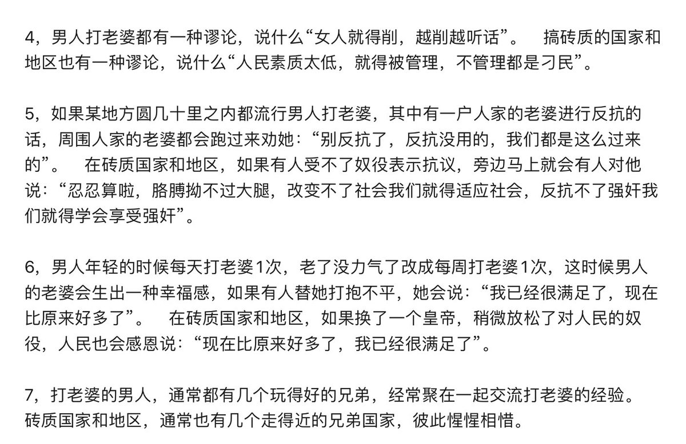
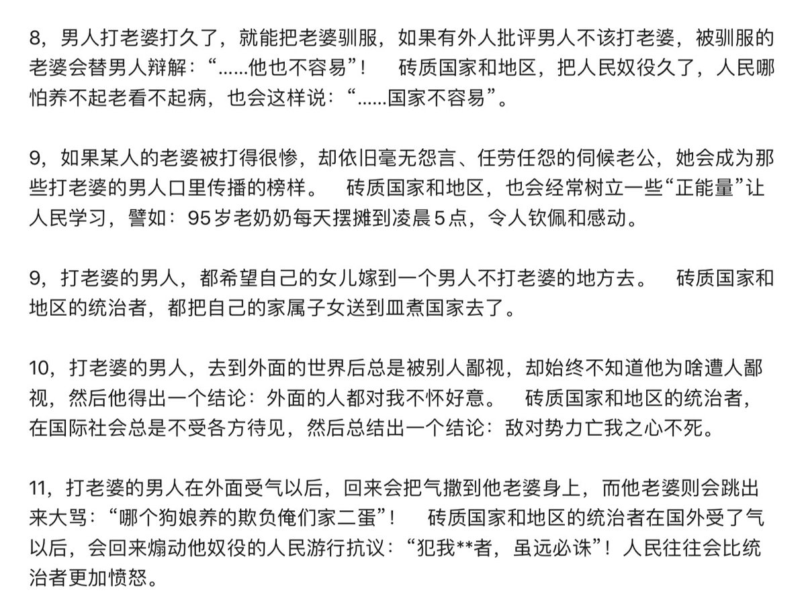
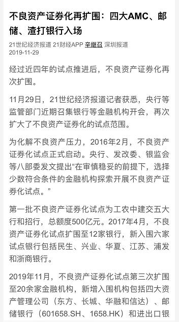

[12月03日 00:55]    墙国铁拳现世报😷   @Socialistfist    一位推友的来信
欢迎理性讨论  :speech_balloon:评:54 :+1:赞:40 :globe_with_meridians:转:0  

[12月03日 00:02]    财经真相   @caijingxiang    罗斯说如果12月15号前，中美达不成第一阶段的协议，将提高关税!消息公布日元、黄金避险资产上涨，美股跳水，恐慌指数VIX短线走高，离岸人民币小幅走低！  :speech_balloon:评:8 :+1:赞:80 :globe_with_meridians:转:32  

[12月02日 23:27]    BBC News 中文   @bbcchinese    中国电信巨头华为首席财务官孟晚舟在加拿大被扣押一周年，她在华为员工的网络社区“心声社区”发表公开信，感谢支持。  :speech_balloon:评:75 :+1:赞:51 :globe_with_meridians:转:9  

[12月02日 23:05]    财经真相   @caijingxiang    华为正式回应：“支持李洪元运用法律武器”，语气可以说霸气外露，这样的语气不是冲李洪元去的，他只是一个小棋子，而是回应故意让新闻不时蹦出来的那帮人，这些人的能力不容小觑，他们完全可以在不断删新闻的背景下，继续让虎嗅网大胆的发新闻，而且还操控整个微博热点，甚至通过外交系统“借美国人的刀” https://twitter.com/caijingxiang/status/1201075431123763200 …  :speech_balloon:评:6 :+1:赞:64 :globe_with_meridians:转:20  

[12月02日 23:05]    墙国铁拳现世报😷   @Socialistfist    补充  :speech_balloon:评:4 :+1:赞:112 :globe_with_meridians:转:30  

[12月02日 22:53]    墙国铁拳现世报😷   @Socialistfist    华为251事件在微博上引起热烈讨论，不少贸易战时脑热购买华为手机的粉红一夜间大有幡然醒悟之感。
爱国爱党情怀还能消费多久？
#社会主义铁拳  :speech_balloon:评:25 :+1:赞:309 :globe_with_meridians:转:108  

[12月02日 22:35]    财经真相   @caijingxiang    来猜猜，“枪杆子”对“钱袋子、刀把子、海外大外宣以及外交系统，这胜算有多大？ https://twitter.com/caijingxiang/status/1201507785998946306 …  :speech_balloon:评:20 :+1:赞:82 :globe_with_meridians:转:14  

[12月02日 22:25]    财经真相   @caijingxiang    习近平主席令新闻联播前被临时取消，如果这事属实，那将是北京高层的一场重大地震！  :speech_balloon:评:64 :+1:赞:373 :globe_with_meridians:转:94  

[12月02日 21:28]    财经真相   @caijingxiang    这个是算的政治账，不是经济账，试想如果俄罗斯换成美国，现在香港法案通过背景下，这样一条输气管道岂不成了制裁对象！ https://twitter.com/rfa_chinese/status/1201490172203827212 …  :speech_balloon:评:8 :+1:赞:29 :globe_with_meridians:转:9  

[12月02日 21:00]    纽约时报中文网   @nytchinese    数十亿美元的滑雪胜地以创纪录的速度纷纷涌现，坐在缆车上可以看到所有造雪景观。
许多团体举办集体培训，宣扬雪地滑行的乐趣。这是党计划中的一部分：要在冬奥会开幕前培养3亿“冬季运动爱好者”。这个数字是法国、德国和瑞士人口总和的两倍。 http://nyti.ms/2r4b1b9   :speech_balloon:评:4 :+1:赞:7 :globe_with_meridians:转:3  

[12月02日 20:31]    BBC News 中文   @bbcchinese    华春莹敦促美方停止插手香港事务，并称中方会根据形势发展，采取进一步必要行动。 https://bbc.in/2P5qzmR   :speech_balloon:评:39 :+1:赞:80 :globe_with_meridians:转:19  

[12月02日 20:24]    新闻大吐槽   @TuCaoFakeNews    这桥垂直式错位，估计得好好休假式治疗一下 https://twitter.com/h5lpykl7tp6jjop/status/1201365142304243712 …  :speech_balloon:评:5 :+1:赞:25 :globe_with_meridians:转:8  

[12月02日 20:05]    BBC News 中文   @bbcchinese    【香港示威：BBC贴身追访 解构示威者的不同角色】BBC Our World 栏目跟踪采访了其中的“哨兵”、“勇武派”和“急救员”，看走上街头的年青人如何充当着不同的角色。 https://bbc.in/33ER5Jl   :speech_balloon:评:11 :+1:赞:39 :globe_with_meridians:转:20  

[12月02日 19:38]    财经真相   @caijingxiang    网传不知真假，求证！  :speech_balloon:评:17 :+1:赞:59 :globe_with_meridians:转:13  

[12月02日 19:16]    纽约时报中文网   @nytchinese    中国实施了更严格的药品管制，大幅减少了芬太尼对美国的出口量；还修改了相关法律，打击芬太尼物质变种。
但美国官员期望看到中方在追究责任方面采取更多行动。警方探员和检察官经过苦心调查，追踪到芬太尼的源头，找出了跟美国用药过量事件有直接联系的生产商和经销商。 http://nyti.ms/380hkNt   :speech_balloon:评:12 :+1:赞:48 :globe_with_meridians:转:8  

[12月02日 19:02]    BBC News 中文   @bbcchinese    杨恒均的好友、悉尼科技大学中国研究中心副教授冯崇义对BBC中文表示，杨恒均的家人十分担心其健康状况，看守所称他患有肾脏、前列腺严重病症，也有高血压，每天让他服用9粒药丸。 https://bbc.in/2rMXLHO   :speech_balloon:评:29 :+1:赞:68 :globe_with_meridians:转:30  

[12月02日 18:40]    财经真相   @caijingxiang    要声明的是，本人水平有限，真的看不懂央行的资产负债表，不知是否有哪位高人，能够用人听得懂的话，把这里面的道理简单说明一下！  :speech_balloon:评:17 :+1:赞:72 :globe_with_meridians:转:9  

[12月02日 18:38]    财经真相   @caijingxiang    商业银行接受的贷款超过其存款时，一般有两个办法补充其缺口，一个是找其他银行借款，这个被称之为同业拆借，另一个就是找央行借，因为只有央行才能印钞，找央行借体现在央行负债表上就是“对其他存款性公司债权”，截止10月份央行对全体中国商业银行放贷总共是10.43万亿，这点钱根本对不上缺口！  :speech_balloon:评:4 :+1:赞:88 :globe_with_meridians:转:18  

[12月02日 18:33]    财经真相   @caijingxiang    我们都知道商业银行最主要的业务就是吸收存款，然后加点利息放出贷款，自己是不能印钞的，只有央行才行。根据央行公布的数据，2019年10月中国商行存款（准货币）为138.74万亿，但是放出的信贷却高达212.36万亿，这多出来的73.62万亿是哪来的？即使全体货币m2也就194.56万亿，也是不够！  :speech_balloon:评:28 :+1:赞:269 :globe_with_meridians:转:118  

[12月02日 18:29]    新闻大吐槽   @TuCaoFakeNews    “坦白从宽，牢底坐穿”
华为下套，往死里整自己的员工  :speech_balloon:评:13 :+1:赞:69 :globe_with_meridians:转:41  

[12月02日 18:16]    新闻大吐槽   @TuCaoFakeNews    「我和香港人站在一起，也和维尼站在一起！」  :speech_balloon:评:10 :+1:赞:71 :globe_with_meridians:转:23  

[12月02日 17:43]    新闻大吐槽   @TuCaoFakeNews    黑警连自由亚洲的记者也敢喷！真是胆肥了，主子都腿软了，奴才还在这里乱喷！  :speech_balloon:评:31 :+1:赞:544 :globe_with_meridians:转:260  

[12月02日 17:43]    新闻大吐槽   @TuCaoFakeNews    黑警连自由亚洲的记者也敢喷！真是胆肥了，主子都腿软了，奴才还在这里乱喷！  :speech_balloon:评:31 :+1:赞:544 :globe_with_meridians:转:260  

[12月02日 17:01]    纽约时报中文网   @nytchinese    2022年冬奥会即将到来，无论是天气还是贸易战都无法阻止中国培育出人类有史以来最大的雪上运动热潮。中国希望在冬奥会开幕前培养3亿“冬季运动爱好者”，这个计划能实现吗？
在北京附近的南山滑雪场，拥挤的人潮和兴奋的滑雪爱好者让这项运动的前景显得十分光明。 http://nyti.ms/2r4b1b9   :speech_balloon:评:21 :+1:赞:34 :globe_with_meridians:转:6  

[12月02日 17:01]    BBC News 中文   @bbcchinese    英国伦敦桥席击案 第二位受害者身分确认! 琼斯女士与之前的受害者都是剑桥毕业生!
生前两人与嫌犯都在一课程协助受刑人重返社会但悲剧还是发生... https://bbc.in/2qUU5E9   :speech_balloon:评:40 :+1:赞:51 :globe_with_meridians:转:15  

[12月02日 16:30]    纽约时报中文网   @nytchinese    香港资深股东维权人士戴维·韦布等批评人士称，香港地方法规导致市场不够健康。
比如，当大投资者质押公司的股份用作贷款抵押品时，不需要披露信息。如果突然被需要偿还贷款，投资者可能必须迅速抛售大量股份，导致股价下跌。 http://nyti.ms/2qSBubL   :speech_balloon:评:2 :+1:赞:13 :globe_with_meridians:转:3  

[12月02日 16:26]    纽约时报中文网   @nytchinese    新闻分析：对澳大利亚而言，中国威胁似乎已非常真切 by @damiencave @jamietarabay  http://nyti.ms/2OA1hP1 https://twitter.com/ccni/status/1201325903307067392 …  :speech_balloon:评:5 :+1:赞:18 :globe_with_meridians:转:5  

[12月02日 16:21]    新闻大吐槽   @TuCaoFakeNews    有广告界良心人士罢工，在中环发起集会。某公司广告总监姚冠东是集会发起人，他表示，政府不要以为民主派在区议会选举大胜，人民便会忘记五大诉求！

好样的广告人，轻财重义！值得敬佩！

你们不罢工，多创作一些文宣佳作，大家也支持！  :speech_balloon:评:4 :+1:赞:276 :globe_with_meridians:转:125  

[12月02日 16:21]    新闻大吐槽   @TuCaoFakeNews    有广告界良心人士罢工，在中环发起集会。某公司广告总监姚冠东是集会发起人，他表示，政府不要以为民主派在区议会选举大胜，人民便会忘记五大诉求！

好样的广告人，轻财重义！值得敬佩！

你们不罢工，多创作一些文宣佳作，大家也支持！  :speech_balloon:评:4 :+1:赞:276 :globe_with_meridians:转:125  

[12月02日 16:00]    纽约时报中文网   @nytchinese    #图集【菲律宾海员孤独而危险的船上生活】几十年里，菲律宾为全球货船运输业提供了大量劳动力。这些船员远离故土，漂泊海上，在辛苦劳作的同时也将菲律宾特色的饮食、歌曲、运动和文化带到了全世界。
点击查看图集： http://nyti.ms/2Y8AjRK   :speech_balloon:评:0 :+1:赞:9 :globe_with_meridians:转:0  

[12月02日 15:36]    财经真相   @caijingxiang    中国外交部：针对美方执意将所谓“香港人权与民主法案”签署成法的无理行为，中国政府决定：自即日起，暂停审批美军舰机赴港休整申请，同时对美国国家民主基金会等非政府组织实施制裁。 美国民主基金会制裁？有人会因此丢掉饭碗吗？  :speech_balloon:评:60 :+1:赞:415 :globe_with_meridians:转:90  

[12月02日 15:30]    纽约时报中文网   @nytchinese    #观点 “那个姑娘”是一位被安排来招待重要中年男客的年轻女子。
坐在这个位子上的人可能会收到：多得离谱的二手烟；桌边男男女女们的上下打量；永远喝不完的白酒续杯，以及肩膀上偶尔的一捏，或落在背上的手。 http://nyti.ms/2R862AU   :speech_balloon:评:10 :+1:赞:44 :globe_with_meridians:转:15  

[12月02日 15:01]    BBC News 中文   @bbcchinese    15岁的时候，郝丽离家出走，回去找妈妈。“那是我有生之年做出的最糟糕的决定。回家不到两个星期，我们就一起吸毒；一个月之内，我们就开始一起卖淫。” https://bbc.in/33DyOfe   :speech_balloon:评:18 :+1:赞:26 :globe_with_meridians:转:10  

[12月02日 15:00]    纽约时报中文网   @nytchinese    最近三起令人瞩目的暴跌事件暴露了港股市场中持续存在的问题：监管者对一些可疑的操作视而不见。
规定压制了那些反对者，他们可能会制止容易上当或过于踊跃的投资者。因此，香港市场的泡沫不断扩大，有时速度惊人。然后泡沫破裂，让小投资者血本无归。 http://nyti.ms/2qSBubL   :speech_balloon:评:6 :+1:赞:40 :globe_with_meridians:转:19  

[12月02日 14:30]    纽约时报中文网   @nytchinese    “我们很担心，因为他进去的时候是个身体健康的人，”杨恒均在澳大利亚的律师之一康登说。“现在他有了这个所谓的诊断结果，并被喂食一种混合药物。”
杨恒均的案件已使澳中关系复杂化，但最新的指控为缓和紧张局势再添障碍。澳大利亚政府正面临压力，要对北京做出更有力的回应。 http://nyti.ms/2R5JUap   :speech_balloon:评:16 :+1:赞:42 :globe_with_meridians:转:15  

[12月02日 14:14]    老司机   @h5lpykl7tp6jjop    睁着眼睛说瞎话，闭着眼睛也一样，反正都是瞎话！  :speech_balloon:评:3 :+1:赞:38 :globe_with_meridians:转:16  

[12月02日 14:01]    BBC News 中文   @bbcchinese    香港示威浪潮未有平息迹象，香港官员说经济转差，今届财政年度可能录得财政赤字，是十五年来首次。 https://bbc.in/34FNdsM   :speech_balloon:评:77 :+1:赞:174 :globe_with_meridians:转:48  

[12月02日 14:00]    纽约时报中文网   @nytchinese    十年来最有影响力的十部电影 http://nyti.ms/2DtnpUC   :speech_balloon:评:1 :+1:赞:19 :globe_with_meridians:转:9  

[12月02日 13:37]    财经真相   @caijingxiang    随着黄淮以南地区的快速升温，来自印度洋地区的暖湿气流活跃度增强，其输送水汽的能力要比12月、1月时要强很多，在冷暖空气激烈碰撞下，往往会带来大范围的降雪，这也是黄淮、华北地区2月份降雪比一年当中任何时候都大的原因。另外降雪也延缓了这些地区春季到来步伐，导致春季比其他季节都短！  :speech_balloon:评:2 :+1:赞:34 :globe_with_meridians:转:8  

[12月02日 13:37]    新闻大吐槽   @TuCaoFakeNews    原因是Ladygaga 在instagram上follow了一个香港抗争者@EmilyWaiYi 

五毛们吃饱没事干，天天审查明星的follower列表  :speech_balloon:评:5 :+1:赞:135 :globe_with_meridians:转:4  

[12月02日 13:30]    纽约时报中文网   @nytchinese    总体而言，新的研究发现表明，“你可以通过在早餐前锻炼来从运动中获得更多好处，而无需增加强度或时间，”巴斯大学生理学和营养学教授冈萨雷斯说。
他建议，个人可根据日程和个人喜好来安排锻炼时间，即使无法做到早起空腹锻炼，锻炼也总比不锻炼要好。 http://nyti.ms/2qP6MjP   :speech_balloon:评:0 :+1:赞:27 :globe_with_meridians:转:11  

[12月02日 13:26]    财经真相   @caijingxiang    倒春寒不仅是北美的独有天气特征，以中国为核心的东亚地区也很常见，只是时间上稍微有点晚，一般是发生在二月至三月上旬，这时中国南部地区开始步入春季，气温逐渐升温，但是在蒙古和西伯利亚地区由于被积雪覆盖，气温回升较慢，南北气温差价达到一定程度，就会引发冷空气南下，形成倒春寒！  :speech_balloon:评:4 :+1:赞:61 :globe_with_meridians:转:13  

[12月02日 13:19]    财经真相   @caijingxiang    “倒春寒”行情，是指天然气期货交易的一种累积经验，每年一月下旬至2月份，随着太阳回归北半球，光照的逐渐增强，北美大陆南部地区升温较快，而北部的加拿大地区，由于被厚厚的积雪覆盖，太阳光照辐射热量大部分被积雪反射回去，导致这些地区气温回升较慢，时间一长南北气温差价不断扩大，最终引发寒潮  :speech_balloon:评:4 :+1:赞:88 :globe_with_meridians:转:22  

[12月02日 13:04]    新闻大吐槽   @TuCaoFakeNews    五毛和环球时报盯上Ladygaga了！
据说她挺了香港抗争者！ https://twitter.com/mypetsgarden3/status/1201360929935331329 …  :speech_balloon:评:54 :+1:赞:358 :globe_with_meridians:转:109  

[12月02日 13:04]    新闻大吐槽   @TuCaoFakeNews    五毛和环球时报盯上Ladygaga了！
据说她挺了香港抗争者！ https://twitter.com/mypetsgarden3/status/1201360929935331329 …  :speech_balloon:评:54 :+1:赞:358 :globe_with_meridians:转:109  

[12月02日 13:00]    纽约时报中文网   @nytchinese    #每日一词 Shtick，喜剧演员的独特表演风格。近期，时报杂志以“Adam Sandler’s Everlasting Shtick”为题，报道了美国著名喜剧明星亚当·桑德勒。
Shtick指喜剧演员的表演特色，与中文里的梗、笑点以及英文中的punch line（指相声中的包袱、妙语）类似。
更多简报内容： http://nyti.ms/2OFBapR   :speech_balloon:评:1 :+1:赞:4 :globe_with_meridians:转:2  

[12月02日 12:59]    老司机   @h5lpykl7tp6jjop    重庆轻轨桥断了！断是断了，但不能说是断了，因为官方媒体的说法是叫“垂直错位"！不要脸也要改成停止面子工程吗？  :speech_balloon:评:127 :+1:赞:1674 :globe_with_meridians:转:877  

[12月02日 12:30]    纽约时报中文网   @nytchinese    #观点 中国的饭局可以各种各样，但绝对和美食无关。
饭局的最终目的是把用餐者灌醉。只有大家都醉了，才能建立关系，成为朋友，互捏肩膀，讲荤笑话。饭局出问题时，情况可能会很糟糕：有人可能会打起来。而女性往往是供消遣的“那个姑娘”。 http://nyti.ms/2R862AU   :speech_balloon:评:126 :+1:赞:500 :globe_with_meridians:转:199  

[12月02日 12:00]    纽约时报中文网   @nytchinese    伊朗抗议遭政府强力镇压，残酷细节浮出水面。据目击者描述和视频显示，在许多地方，安全部队向手无寸铁的抗议者开火。
这场因油价上涨点燃的抗议活动至少造成180人死亡，2000人受伤，7000人被拘，是伊朗自40年前伊斯兰革命以来最严重的动乱。
更多简报内容： http://nyti.ms/2OFBapR   :speech_balloon:评:4 :+1:赞:19 :globe_with_meridians:转:8  

[12月02日 11:40]    老司机   @h5lpykl7tp6jjop    广东雨伞运动？听不清喊的什么口号。  :speech_balloon:评:75 :+1:赞:1001 :globe_with_meridians:转:401  

[12月02日 11:30]    纽约时报中文网   @nytchinese    澳大利亚作家、民主活动人士杨恒均的律师表示，中国切断了杨与家人的所有联系，试图“击溃”他，迫使他承认自己是间谍。
杨恒均的律师表示，中国官员每天对他进行隔离审讯，铐住他的脚踝和手腕，不许亲友给他发送信息，并每天至少给他吃九片治疗高血压和肾脏并发症等疾病的药物。 http://nyti.ms/2R5JUap   :speech_balloon:评:97 :+1:赞:273 :globe_with_meridians:转:127  

[12月02日 11:23]    BBC News 中文   @bbcchinese    数千年前的石板上刻有世界上最古老的食谱——炖羊肉，精通烹饪史、食品学和楔形文字的专家学者还原出这道菜，但重点是好吃吗？ https://bbc.in/2LeKfDP   :speech_balloon:评:24 :+1:赞:101 :globe_with_meridians:转:27  

[12月02日 11:04]    新闻大吐槽   @TuCaoFakeNews    修订：
1.她是現任又成功連任的區議員
2.她是醫生  :speech_balloon:评:2 :+1:赞:96 :globe_with_meridians:转:8  

[12月02日 11:00]    纽约时报中文网   @nytchinese    伊斯兰国宣布对英国伦敦桥恐袭事件负责。周五的刺杀造成两人死亡，至少三人受伤。袭击者曾被判有恐怖主义罪，这引发了人们对其提前获释的质疑。
时报社论委员会研究员为其中一名遇难者、她在剑桥的同学撰写了悼文。
更多简报内容： http://nyti.ms/2OFBapR   :speech_balloon:评:2 :+1:赞:8 :globe_with_meridians:转:6  

[12月02日 10:48]    新闻大吐槽   @TuCaoFakeNews    昨晚，面对黑警的非法骚扰，这位新当选的民主派区议员只身挡在民众前边，为他们阻挡、劝退黑警；

她是黄埔花园西选区的区议员邝葆贤博士！  :speech_balloon:评:24 :+1:赞:1024 :globe_with_meridians:转:335  

[12月02日 10:48]    新闻大吐槽   @TuCaoFakeNews    昨晚，面对黑警的非法骚扰，这位新当选的民主派区议员只身挡在民众前边，为他们阻挡、劝退黑警；

她是黄埔花园西选区的区议员邝葆贤博士！  :speech_balloon:评:24 :+1:赞:1024 :globe_with_meridians:转:335  

[12月02日 10:30]    纽约时报中文网   @nytchinese    澳大利亚比以往任何时候都更清楚地看到，对习近平治下的共产党来说，他们在乎的不仅仅是财富和贸易了。
“在美国的进一步介入，在中国有关南海、南太平洋和台湾的行动引起的进一步抗议上，他们希望对相关决策增加影响力。”澳大利亚国立大学国际安全和情报研究教授布拉克斯兰说。 http://nyti.ms/2OA1hP1   :speech_balloon:评:9 :+1:赞:14 :globe_with_meridians:转:6  

[12月02日 10:29]    老司机   @h5lpykl7tp6jjop    一个老外说，中国没有真正的爱国者！只看见一群想捞好处的家伙和傻子！从流行清宫戏就可以看出，它们很容易习惯任何占领者，不是也把成吉思汗当成自己的英雄一样崇拜吗？从逻辑上看当初日本只是没有成功占领中国，如果日本人成功了，若干年以后它们一样跪拜天皇！它们就是一群奴才，只崇拜强权！我无语  :speech_balloon:评:10 :+1:赞:162 :globe_with_meridians:转:36  

[12月02日 10:27]    纽约时报中文网   @nytchinese    简报：香港一日三场集会游行；澳大利亚警惕中国威胁 http://nyti.ms/2OFBapR https://twitter.com/ccni/status/1201323270584320000 …  :speech_balloon:评:2 :+1:赞:8 :globe_with_meridians:转:4  

[12月02日 10:12]    老司机   @h5lpykl7tp6jjop    中共官媒每天开口闭口就是党和国家，任何有点常识的人都知道，国家大过一党，所谓党不过就是一小撮臭味相投的人的组织，中国汉字解释，从尚从黑，本义：非公开、暗地里、私下，实际就是黑社会一样的东西！所以被人叫镰刀斧头帮，很确切！靠阴谋诡计耍流氓武力抢夺国家政权的一帮土匪不能称之为国家！  :speech_balloon:评:0 :+1:赞:32 :globe_with_meridians:转:5  

[12月02日 10:02]    纽约时报中文网   @nytchinese    早安！今日重点新闻包括：
香港一日三场游行；澳大利亚警惕中国威胁；香港三支中资股闪崩引发金融监管质疑；律师称澳籍华裔作家杨恒均遭隔离审讯；伊斯兰国宣布对英国伦敦桥袭击事件负责；新奥尔良周日发生枪击事件；十年来最有影响力的十部电影……NYT简报带你速览今日要闻。 http://nyti.ms/2OFBapR   :speech_balloon:评:17 :+1:赞:41 :globe_with_meridians:转:4  

[12月02日 08:45]    墙国铁拳现世报😷   @Socialistfist    请各位推友注意上推安全 https://twitter.com/keepcnsecurity/status/1201167265804087296 …  :speech_balloon:评:3 :+1:赞:64 :globe_with_meridians:转:15  

[12月02日 07:43]    新闻大吐槽   @TuCaoFakeNews    这个厉害了 https://twitter.com/zhanglucy88/status/1201085678576009217 …  :speech_balloon:评:9 :+1:赞:102 :globe_with_meridians:转:42  

[12月02日 06:39]    新闻大吐槽   @TuCaoFakeNews    这位美籍港人是在为下一代而抗争，他希望未来的港人可以享有如美国般的自由！
他手中举得牌子上写着“爹亲、娘亲，不如川大爷亲”

党说它和你亲，你不和它亲，它就要你命~
还是和川大爷亲靠谱，大爷给你自由，免受奴役！  :speech_balloon:评:13 :+1:赞:198 :globe_with_meridians:转:80  

[12月02日 06:39]    新闻大吐槽   @TuCaoFakeNews    这位美籍港人是在为下一代而抗争，他希望未来的港人可以享有如美国般的自由！
他手中举得牌子上写着“爹亲、娘亲，不如川大爷亲”

党说它和你亲，你不和它亲，它就要你命~
还是和川大爷亲靠谱，大爷给你自由，免受奴役！  :speech_balloon:评:13 :+1:赞:198 :globe_with_meridians:转:80  

[12月02日 06:32]    BBC News 中文   @bbcchinese    加密数码币圈疑云：当众人憧憬着比特币被“一币”取代而自己一夜翻身致富的时候，他们的“女神”不见了，他们的钱也不见了。
 https://bbc.in/34JKrCY   :speech_balloon:评:6 :+1:赞:33 :globe_with_meridians:转:23  

[12月02日 06:32]    BBC News 中文   @bbcchinese    报道指，他可能是大选中最亲中的美国总统参选人。 https://bbc.in/2rKGIWQ   :speech_balloon:评:46 :+1:赞:121 :globe_with_meridians:转:48  

[12月02日 04:30]    BBC News 中文   @bbcchinese    又有枪击案，又是在新奥尔良 https://bbc.in/2L9tSsk   :speech_balloon:评:69 :+1:赞:44 :globe_with_meridians:转:7  

[12月02日 04:29]    BBC News 中文   @bbcchinese    在中国、马来西亚等亚洲其它大多数国家，休闲性大麻仍被作为毒品。东方文化对毒品的严厉的社会态度，影响着各国政府有关政策制定。 https://bbc.in/2sufrZa   :speech_balloon:评:49 :+1:赞:28 :globe_with_meridians:转:7  

[12月02日 03:59]    BBC News 中文   @bbcchinese    苏格兰首府爱丁堡30年前艾滋病毒肆虐，被称为欧洲艾滋病毒之都。但最开始谁都不明白是怎么回事。 https://bbc.in/33F2KHX   :speech_balloon:评:4 :+1:赞:22 :globe_with_meridians:转:15  

[12月02日 03:32]    BBC News 中文   @bbcchinese    美国总统特朗普不理会中国反对，签署《香港人权与民主法案》和《保护香港法案》。香港示威者为何希望美国通过人权民主法案？ https://bbc.in/2R7SR2N   :speech_balloon:评:37 :+1:赞:41 :globe_with_meridians:转:11  

[12月02日 02:31]    BBC News 中文   @bbcchinese    人跳出了火坑，背上刺青依旧：她的是对皮条客表忠心，她的是两个魔鬼在性交......被迫卖淫的创伤怎样抚平？人生如何揭开新篇章？ https://bbc.in/2R7HFDp   :speech_balloon:评:6 :+1:赞:22 :globe_with_meridians:转:12  

[12月02日 01:36]    BBC News 中文   @bbcchinese    在俄罗斯的西伯利亚的永冻层，这只幼崽的皮毛，鼻子和牙齿都保存得完好无损。科学家说，这一发现可能代表着狼与现代犬之间的进化联系。 https://bbc.in/2YaCRyz   :speech_balloon:评:8 :+1:赞:50 :globe_with_meridians:转:14  

[12月02日 00:30]    BBC News 中文   @bbcchinese    香港的移民中介称，六月示威爆发前，前来谘询的客户仍对移民举棋未定。但在六月之后，不仅谘询数量翻倍，而且客户似乎都已经下定决心离开。 https://bbc.in/2r460iH   :speech_balloon:评:70 :+1:赞:262 :globe_with_meridians:转:101  

[12月01日 23:27]    BBC News 中文   @bbcchinese    有些物种在一个地区一度绝迹，被认为绝种，但在其他地区不为人知地存活着，后来被发现。 https://bbc.in/2DB4mI2   :speech_balloon:评:0 :+1:赞:32 :globe_with_meridians:转:10  

[12月01日 22:30]    BBC News 中文   @bbcchinese    12月1日国际艾滋病日，还有人记得“河南血祸”吗？ https://bbc.in/2Y1LM5s   :speech_balloon:评:128 :+1:赞:1158 :globe_with_meridians:转:464  

[12月01日 22:16]    新闻大吐槽   @TuCaoFakeNews    本来是批准过的集会，黑警还是要跳出来刷存在感，
卖冷饮的大爷不得不停下生意，躲避催泪毒烟  :speech_balloon:评:9 :+1:赞:75 :globe_with_meridians:转:45  

[12月01日 22:08]    新闻大吐槽   @TuCaoFakeNews    认为香港抗争已经结束的人可以休矣，今天下午的大游行依旧人潮汹涌！

一名二十五岁的抗争者说：我们要告诉政府，尽管区议会选举结束了，但我们的抗争并没结束！  :speech_balloon:评:32 :+1:赞:811 :globe_with_meridians:转:311  

[12月01日 21:59]    BBC News 中文   @bbcchinese    巴基斯坦有一个小镇，镇上将近900名儿童感染艾滋病病毒。让人奇怪的是，大部分感染的儿童年龄都低于12岁，家族并无病史。 https://bbc.in/2OCYdBx   :speech_balloon:评:12 :+1:赞:33 :globe_with_meridians:转:13  

[12月01日 21:57]    新闻大吐槽   @TuCaoFakeNews    默克尔用政治正确做包装，在欧洲替中共游说，想让欧洲放弃反对华为

可默克尔穿着赤红色的袍子上台演讲时，竟然当众跌倒！
狭义的现世报是指因做错事被对手惩罚，广义的现世报还包括被自然惩罚，被自己的身体惩罚！
站在阳光下发抖的政客，背后一定有魔鬼的手在操控！  :speech_balloon:评:94 :+1:赞:541 :globe_with_meridians:转:187  

[12月01日 21:00]    纽约时报中文网   @nytchinese    #一周热门 #观点 我看着香港，想知道这是不是世界末日的感觉 http://nyti.ms/37H7jox   :speech_balloon:评:54 :+1:赞:121 :globe_with_meridians:转:40  

[12月01日 18:15]    老司机   @h5lpykl7tp6jjop    世界上大多国家民族都是越来越开放，越来越文明，只有中国特别，清不如明，明不如宋，宋不如唐⋯⋯春秋居然可以百花齐放！一个朝代比一个朝代更闭锁，人民越来越没有自由，只有和极端穆斯林国家可以称兄道弟，这是进化还是退化？闭目自豪的理由是什么？难怪世代中国人都在怀旧！  :speech_balloon:评:46 :+1:赞:787 :globe_with_meridians:转:201  

[12月01日 18:05]    老司机   @h5lpykl7tp6jjop    网传:昨天，广元市交警在朝天门附近拦路执法，拦截收缴摩的，29岁摩的司机吴某持刀捅伤三名交警！  :speech_balloon:评:35 :+1:赞:206 :globe_with_meridians:转:97  

[12月01日 17:47]    财经真相   @caijingxiang    今天微博上对华为成了热议，工作996，辞职251，讨论404；和朋友讨论一下，这朋友说感觉有人要故意整华为，而且是和美帝配合的那种！要不然像这种事情早被打压了，不会时不时的蹦出来点新闻和讨论！我……  :speech_balloon:评:70 :+1:赞:830 :globe_with_meridians:转:158  

[12月01日 14:48]    新闻大吐槽   @TuCaoFakeNews    化州的抗争者打出了“如果你不想被万世唾骂，勇敢说出：反对”的标语！

共产党的国歌真是天大的黑色幽默，不久的将来，中共国会遍地都是“不愿做奴隶的人们”，按也按不住，都得“起来”  :speech_balloon:评:18 :+1:赞:698 :globe_with_meridians:转:296  

[12月01日 13:09]    老司机   @h5lpykl7tp6jjop    高压锅不放气就只有爆炸， 继续镇压犹如加柴添火，共产党政权已经岌岌可危，今后一定还会发生这种先镇压然后见势不妙就收手的情况！  :speech_balloon:评:0 :+1:赞:47 :globe_with_meridians:转:22  

[12月01日 12:53]    老司机   @h5lpykl7tp6jjop    好文分享：“男人打老婆”与“砖质制度”的惊人相似之处
文/豆腐
2019/12/01  :speech_balloon:评:0 :+1:赞:33 :globe_with_meridians:转:22  

[12月01日 12:48]    老司机   @h5lpykl7tp6jjop    有人问铁拐李：你天天吹嘘你葫芦里卖的神药，能不能先医好你自己的脚呢？
铁拐李：再问？！我一拐杖打死你！  :speech_balloon:评:19 :+1:赞:561 :globe_with_meridians:转:180  

[12月01日 11:39]    财经真相   @caijingxiang    财联社12月1日讯，央行行长易纲12月1日在《求是》上撰文指出，评判和衡量货币政策，根本上是要看其是否有利于最广大人民群众的利益。守护好老百姓手里的钱，保持币值稳定，并以此促进经济增长，是货币政策的使命。不能让老百姓手中的票子变“毛”了，不值钱了。  :speech_balloon:评:89 :+1:赞:372 :globe_with_meridians:转:88  

[12月01日 09:33]    墙国铁拳现世报😷   @Socialistfist    没想到昨天上了墙内头条的这位可怜人，也是社会主义铁拳击的受害人；

@Socialistfist  :speech_balloon:评:67 :+1:赞:402 :globe_with_meridians:转:97  

[11月30日 21:18]    墙国铁拳现世报😷   @Socialistfist    粉蚷战螂被小编挂以后，一个嘴硬的都没有。  :speech_balloon:评:24 :+1:赞:171 :globe_with_meridians:转:6  

[11月30日 17:49]    老司机   @h5lpykl7tp6jjop    廣東人民真大膽，示威不蒙臉，不怕秋後算賬？  :speech_balloon:评:64 :+1:赞:661 :globe_with_meridians:转:264  

[11月30日 17:20]    财经真相   @caijingxiang    环球时报：中国国安抓捕两名“反中乱港”分子！  :speech_balloon:评:24 :+1:赞:184 :globe_with_meridians:转:68  

[11月30日 14:49]    老司机   @h5lpykl7tp6jjop    好文分享：
问君何所似？天地一沙雕！
文/豆腐
2019/11/29  :speech_balloon:评:0 :+1:赞:11 :globe_with_meridians:转:7  

[11月30日 14:24]    老司机   @h5lpykl7tp6jjop    ＂大多数人的利益＂是人类史上最荒谬的一句口号！
那些代表中国大多数人的利益的人却拿走了大多数人的利益！它们享受着特权，住在中南海皇宫中，居然恬不知耻在大门口写着为人民服务！拥有万亿美元存在海外，子孙后代在海外享福，开着豪车高喊爱国，而穷人没钱看病只有跳楼，九十多岁老人还拾荒为生！  :speech_balloon:评:2 :+1:赞:105 :globe_with_meridians:转:40  

[11月30日 10:33]    老司机   @h5lpykl7tp6jjop    当穷人穷的没尊严，富人就会富得没安全！
如果逻辑调一下，它仍然成立，
当富人富的沒安全，穷人就会穷得没尊严！  :speech_balloon:评:106 :+1:赞:802 :globe_with_meridians:转:540  

[11月30日 09:53]    财经真相   @caijingxiang    不良资产证券化，这次扩围竟然把四大AMC也纳入进来了，真是可笑啊，四大不良资管公司，本来就是化解不良资产，现在竟然打包直接融资为证券，问题是这些证券谁买？还有这些证券究竟是什么产品？  :speech_balloon:评:32 :+1:赞:200 :globe_with_meridians:转:58  

[11月30日 09:48]    老司机   @h5lpykl7tp6jjop    广东化州因火葬场大游行事件，看看警察打死打伤多少示威群众……真是惨不忍睹，凶残至极！谁来救救大陆民众？  :speech_balloon:评:94 :+1:赞:833 :globe_with_meridians:转:548  

[11月30日 09:42]    财经真相   @caijingxiang    工商银行手机端根据《信息技术安全-个人信息安全规范》（GB/T35273-2017）要求，要收集用户个人地理位置、相册，这是什么根据？  :speech_balloon:评:54 :+1:赞:350 :globe_with_meridians:转:157  

[11月30日 08:30]    凡賽堤/FORSETI   @FecharCCP    CCP極權恐怖組織把人民的血汗錢都用在的網絡維穩上了，圈養了人類獨一無二的，人數達千萬的流氓殭屍網絡水軍，谷歌所有集團企業已經淪為CCP極權恐怖組織重要維穩工具了，從2018年google搜索郭文貴的8百萬到現在的360萬，郭媒體從2019年初的18000的全球排名到現在的27669排名，極權不滅，養老永無望！  :speech_balloon:评:0 :+1:赞:9 :globe_with_meridians:转:8  

[11月30日 07:23]    凡賽堤/FORSETI   @FecharCCP    推翻共产党！全民抗议！全民起义！唱响国际歌！起来不愿做奴隶的人们！起来全中国受苦受难的中华儿女！ https://twitter.com/breakup1984/status/1200411445940211714 …  :speech_balloon:评:0 :+1:赞:20 :globe_with_meridians:转:11  

[11月30日 07:19]    凡賽堤/FORSETI   @FecharCCP    人類史上最殘暴的CCP極權殺人恐怖組織正在用各種兇殘手段屠殺我們的同胞...................

CCP極權殺人恐怖組織在香港發射數以萬計的疑似帶有生化武器成份的非標準催淚彈，足以影響三代人的致癌可能！

CCP極權殺人恐怖組織在自己的土地上投放劇毒催淚彈意圖謀殺我們黃色種族同胞！  :speech_balloon:评:2 :+1:赞:28 :globe_with_meridians:转:24  

[11月30日 05:58]    老司机   @h5lpykl7tp6jjop    中共催泪弹成分化验结果出炉：山埃毒，也叫氰化钾，爆表！这已经不是镇压抗议者，而是赤裸裸的谋杀，包括对抗议者的生育都会造成影响！  https://twitter.com/SolomonYue/status/1200445644613140480 …  :speech_balloon:评:12 :+1:赞:292 :globe_with_meridians:转:252  

[11月30日 05:58]    凡賽堤/FORSETI   @FecharCCP    中共催泪弹成分化验结果出炉：山埃毒，也叫氰化钾，爆表！这已经不是镇压抗议者，而是赤裸裸的谋杀，包括对抗议者的生育都会造成影响！  https://twitter.com/SolomonYue/status/1200445644613140480 …  :speech_balloon:评:12 :+1:赞:292 :globe_with_meridians:转:252  

[11月30日 01:48]    墙国铁拳现世报😷   @Socialistfist    好一句“打得好”，但如果所有香港人都和他們一樣幸災樂禍，咁香港就真正被同化了  :speech_balloon:评:4 :+1:赞:95 :globe_with_meridians:转:7  

[11月30日 01:13]    墙国铁拳现世报😷   @Socialistfist    有推友说最近铁拳不够劲
小编一如既往地欢迎大家踊跃投稿
但有时候，无铁拳胜过假铁拳  :speech_balloon:评:7 :+1:赞:155 :globe_with_meridians:转:3  

[11月30日 01:09]    墙国铁拳现世报😷   @Socialistfist    补图  :speech_balloon:评:9 :+1:赞:134 :globe_with_meridians:转:21  

[11月30日 01:08]    墙国铁拳现世报😷   @Socialistfist    “打得好”

#社会主义铁拳  :speech_balloon:评:27 :+1:赞:248 :globe_with_meridians:转:57  

[11月30日 00:40]    墙国铁拳现世报😷   @Socialistfist    吼啊！ 
小编举双手赞同，一定滋磁捧场
不过要严正说明，我们是 社会主义 的生产者，我们只是 社会主义 的搬运工 https://twitter.com/Ray27809561/status/1196838238771531776 …  :speech_balloon:评:23 :+1:赞:265 :globe_with_meridians:转:29  

[11月29日 23:30]    老司机   @h5lpykl7tp6jjop    香港警察还是挺幸运的  :speech_balloon:评:254 :+1:赞:4390 :globe_with_meridians:转:2310  

[11月29日 23:17]    老司机   @h5lpykl7tp6jjop    招行以【系統升級改造】為由，暫時停止“境外匯款”，恢復時間另行通知。

12月2日起不再接受新指令，12月30日起關閉匯款計劃服務，所有未執行的指令都會失效。  :speech_balloon:评:15 :+1:赞:164 :globe_with_meridians:转:73  

[11月29日 20:36]    老司机   @h5lpykl7tp6jjop    广东省茂名市，化州县火葬场事件，据说警察打死2人，下面是其中一位：

中共囿于香港国际金融中心地位，以及洗钱必经之地等原因，不敢在香港明目张胆的杀人，可到了大陆，真是砍瓜切菜一般，毫无顾忌！  :speech_balloon:评:128 :+1:赞:1632 :globe_with_meridians:转:1166  

[11月29日 18:12]    墙国铁拳现世报😷   @Socialistfist    评论区一览  :speech_balloon:评:21 :+1:赞:298 :globe_with_meridians:转:55  

[11月29日 18:08]    墙国铁拳现世报😷   @Socialistfist    一个中国人没有被逼到绝路，谁想和石头撞。

#社会主义铁拳  :speech_balloon:评:141 :+1:赞:943 :globe_with_meridians:转:353  

[11月29日 14:10]    财经真相   @caijingxiang    外资也不是傻子！ https://twitter.com/renfanzi/status/1199949375360786433 …  :speech_balloon:评:14 :+1:赞:173 :globe_with_meridians:转:36  

[11月29日 13:08]    财经真相   @caijingxiang    还有两个小时a股收盘，中共怼香港法案的反击不会停留在嘴炮上，周末应该会很热闹，a股散户割肉吧！即使没有政治关系，临近年底a股也是到了收割时时候！ https://twitter.com/caijingxiang/status/1200265864064335872 …  :speech_balloon:评:10 :+1:赞:178 :globe_with_meridians:转:28  

[11月29日 09:49]    老司机   @h5lpykl7tp6jjop    【比旧社会的地主恶霸还凶残百倍】霸占了农民的土地，现在又强夺农民的房子，最终让他们一无所有，除了满身的病痛和疲惫的身躯……这就是不关心政治的结果，你再怎么努力都是徒劳无益，为人作嫁，最终都竹篮打水一场空！  :speech_balloon:评:42 :+1:赞:411 :globe_with_meridians:转:221  

[11月28日 08:19]    凡賽堤/FORSETI   @FecharCCP    幾個月來據不完全統計，CCP極權發動的黑警非法濫捕香港學生孩子以萬人計算，用各種兇殘手段屠殺的幾千人！

讓我們極度關注，傳播香港真相，盡可能的向全世界媒體以各種語言傳播，讓全世界的人看清CCP極權殺人恐怖組織納粹真相，才能真正的減少這些被非法秘密抓捕的香港學生孩子被殺害！天佑香港人！  :speech_balloon:评:43 :+1:赞:198 :globe_with_meridians:转:147  

[11月28日 08:06]    凡賽堤/FORSETI   @FecharCCP    幾個月以來，香港700萬人共同見證了CCP反人類的慘無人道的殘暴罪行！！！

這是千千萬萬的像這麼小的小朋友都親眼見證了CCP反人類的慘無人道的殘暴罪行！！！

天滅CCP！！！天滅極權！！！  :speech_balloon:评:0 :+1:赞:20 :globe_with_meridians:转:8  

[11月28日 07:48]    凡賽堤/FORSETI   @FecharCCP    美國總統川普宣布他已签署
《香港人权与民主法案》

《香港人权与民主法案》已經成功列入美國的法律！
期望美國能執行《香港人权与民主法案》對香港的黑警和淋症夜蛾進行制裁！  :speech_balloon:评:5 :+1:赞:37 :globe_with_meridians:转:19  

[11月28日 00:29]    墙国铁拳现世报😷   @Socialistfist    那两个字不会写
阿钟哥请你jiayou学中文
#战螂在推特  :speech_balloon:评:47 :+1:赞:282 :globe_with_meridians:转:41  

[11月27日 23:41]    墙国铁拳现世报😷   @Socialistfist    一个美国人向俄国人解释为什么说美国是一个真正言论自由的国家。
美国人说：“我可以走到白宫前，高喊让里根下地狱！”
俄国人很不以为然：“你这算什么，我也可以走到红场上高喊，让里根下地狱”！ https://twitter.com/jiayoubiss/status/1199703307943600128 …  :speech_balloon:评:24 :+1:赞:705 :globe_with_meridians:转:116  

[11月27日 22:46]    墙国铁拳现世报😷   @Socialistfist    哪里不自由？

#社会主义铁拳  :speech_balloon:评:43 :+1:赞:681 :globe_with_meridians:转:140  

[11月26日 23:10]    墙国铁拳现世报😷   @Socialistfist    发#社会主义铁拳 太难了，业余还要打假  :speech_balloon:评:14 :+1:赞:124 :globe_with_meridians:转:6  

[11月26日 02:49]    墙国铁拳现世报😷   @Socialistfist    潘福仁退休前在2007年与网友 网论司法公正
 http://law.eastday.com/dongfangfz/node7/u1a5371.html …  :speech_balloon:评:0 :+1:赞:46 :globe_with_meridians:转:6  

[11月26日 02:47]    墙国铁拳现世报😷   @Socialistfist    江西中级人民法院法官 
判被告 前
上海中级人民法院法官
9年半有期徒刑

#社会主义铁拳  :speech_balloon:评:16 :+1:赞:268 :globe_with_meridians:转:67  

[11月26日 01:01]    GFHG SDKM   @zyx_yny    Heading back to London. 

Thank you #HK for letting us share in your unforgettable victory.

香港人, 加油   :speech_balloon:评:2673 :+1:赞:21426 :globe_with_meridians:转:10149  

[11月25日 14:20]    墙国铁拳现世报😷   @Socialistfist    搬运一个来自微博的欢乐源泉，给墙内开票开了通宵，按时间倒序，他分别表演了：

1. 目瞪口呆
2. 伤心欲绝
3. 自欺欺人
4. 微博全部被删  :speech_balloon:评:262 :+1:赞:3975 :globe_with_meridians:转:1424  

[11月24日 12:46]    GFHG SDKM   @zyx_yny    Very good to take some time@our from election observation to tell #JuniusHo in person that I was responsible for the revocation of his honorary doctorate from @AngliaRuskin #Sorrynotsorry  :speech_balloon:评:6939 :+1:赞:46187 :globe_with_meridians:转:27791  

[11月24日 08:10]    凡賽堤/FORSETI   @FecharCCP    呼籲請求共同挖掘所有有關香港發生的事，越全面越好，不同角度，越多越好，包括被暗地抓捕的人員，特別是CCP 派出的各種偽裝身份，包括變身變裝行兇的一點一滴都要挖掘出來，把CCP 的邪惡下三濫手段的真相毫無保留的曝光在全世界面前！世界公知公義才能真正挽救和保護香港人！希望懂視頻編輯配上中英文  :speech_balloon:评:2 :+1:赞:20 :globe_with_meridians:转:18  

[11月24日 08:07]    凡賽堤/FORSETI   @FecharCCP    人類史上最殘暴的CCP極權殺人恐怖組織正在用各種兇殘手段屠殺我們的同胞...................

CCP極權殺人恐怖組織超級納粹！超級殘暴！超級流氓！

人類到了全面消滅CCP極權殺人恐怖組織的時代！  :speech_balloon:评:5 :+1:赞:45 :globe_with_meridians:转:51  

[11月24日 08:04]    凡賽堤/FORSETI   @FecharCCP    人類史上最殘暴的CCP極權殺人恐怖組織正在用各種兇殘手段屠殺我們的同胞...................

CCP極權殺人恐怖組織超級納粹！  :speech_balloon:评:1 :+1:赞:41 :globe_with_meridians:转:34  

[11月24日 07:57]    凡賽堤/FORSETI   @FecharCCP    人類史上最殘暴的CCP極權殺人恐怖組織正在用各種兇殘手段屠殺我們的同胞...................

CCP極權殺人恐怖組織超級納粹！  :speech_balloon:评:6 :+1:赞:184 :globe_with_meridians:转:161  

[11月24日 07:37]    凡賽堤/FORSETI   @FecharCCP    人類史上最殘暴的CCP極權殺人恐怖組織正在用各種兇殘手段屠殺我們的同胞...................  :speech_balloon:评:1 :+1:赞:13 :globe_with_meridians:转:15  

[11月24日 07:28]    凡賽堤/FORSETI   @FecharCCP    CCP極權殺人恐怖組織正在用各種兇殘手段屠殺我們的同胞...................

視頻是CCP極權殺人恐怖組織在人流密集區投放巨量的不合格（不具國際標準）的化學毒氣催淚瓦斯彈 毒害我們的同胞！  :speech_balloon:评:0 :+1:赞:8 :globe_with_meridians:转:4  

[11月23日 11:14]    凡賽堤/FORSETI   @FecharCCP    CCP極權殺人恐怖組織是全人類的公敵！
呼籲全世界正道主義合力消滅CCP！
呼籲全世界人民看清楚CCP反人類的慘無人道的殘暴罪行！！！

消滅CCP是全世界全人類的當前最緊急任務！！！

視頻是CCP瘋狂屠殺香港學生畫面之一  :speech_balloon:评:3 :+1:赞:10 :globe_with_meridians:转:15  

[11月23日 11:08]    凡賽堤/FORSETI   @FecharCCP    凡是罔顧香港事實在推特和youtube上支持CCP和香港黑警的五毛必死全家，有朝一日必死於CCP的殺人恐怖組織之下，起底五毛祖宗十八代世代不得為人！  :speech_balloon:评:4 :+1:赞:7 :globe_with_meridians:转:2  

[11月23日 11:02]    凡賽堤/FORSETI   @FecharCCP    CCP極權殺人恐怖組織是全人類的公敵！
呼籲全世界正道主義合力消滅CCP！
呼籲全世界人民看清楚CCP反人類的慘無人道的殘暴罪行！！！

消滅CCP是全世界全人類的當前最緊急任務！！！

視頻是深夜被CCP黑警暗殺的少女！  :speech_balloon:评:1 :+1:赞:6 :globe_with_meridians:转:12  

[11月23日 10:59]    凡賽堤/FORSETI   @FecharCCP    CCP極權殺人恐怖組織是全人類的公敵！
呼籲全世界正道主義合力消滅CCP！
呼籲全世界人民看清楚CCP反人類的慘無人道的殘暴罪行！！！

消滅CCP是全世界全人類的當前最緊急任務！！！

視頻是被CCP瘋狂屠殺射中頭部身亡的香港學生  :speech_balloon:评:2 :+1:赞:4 :globe_with_meridians:转:9  

[11月23日 10:55]    凡賽堤/FORSETI   @FecharCCP    CCP極權殺人恐怖組織是全人類的公敵！
呼籲全世界正道主義合力消滅CCP！
呼籲全世界人民看清楚CCP反人類的慘無人道的殘暴罪行！！！

消滅CCP是全世界全人類的當前最緊急任務！！！

視頻是CCP瘋狂屠殺香港學生畫面之一  :speech_balloon:评:2 :+1:赞:14 :globe_with_meridians:转:13  

[11月23日 10:52]    凡賽堤/FORSETI   @FecharCCP    CCP極權殺人恐怖組織是全人類的公敵！
呼籲全世界正道主義合力消滅CCP！
呼籲全世界人民看清楚CCP反人類的慘無人道的殘暴罪行！！！

消滅CCP是全世界全人類的當前最緊急任務！！！

據報導已被發現2537宗屍體，失踪近萬人！  :speech_balloon:评:0 :+1:赞:4 :globe_with_meridians:转:0  

[11月23日 10:46]    凡賽堤/FORSETI   @FecharCCP    CCP極權殺人恐怖組織正在用各種兇殘手段屠殺我們的同胞...................
CCP極權殺人恐怖組織是全人類的公敵！
呼籲全世界正道主義合力消滅CCP！
呼籲全世界人民看清楚CCP反人類的慘無人道的殘暴罪行！！！

消滅CCP是全世界全人類的當前最緊急任務！！！

視頻是被非法抓捕的學生李俊希"(同音)！  :speech_balloon:评:0 :+1:赞:9 :globe_with_meridians:转:4  

[11月21日 13:58]    GFHG SDKM   @zyx_yny    On #PolyU being the end game, this OL says it is 100% not the end game.  She says what we saw happened to the students at Poly, the way they were brutally treated by #HKPolice, there's no way HKers will forget.  We will keep on fighting!

#StandWithHongKong #HongKongProtests  :speech_balloon:评:104 :+1:赞:2403 :globe_with_meridians:转:1560  

[11月21日 11:50]    GFHG SDKM   @zyx_yny    We were in front of the Diet Members’ Office Building.

We will keep fighting with you, HKers
We will keep spreading what's happening in HK

You are not alone  :speech_balloon:评:371 :+1:赞:3572 :globe_with_meridians:转:2143  

[11月21日 00:57]    GFHG SDKM   @zyx_yny    Yesterday’s passage of the #HongKong Human Rights & Democracy Act was a good day in the struggle to resist totalitarian #China & its bid for domination. But it was not the last day. We have a long road ahead to protect our jobs, our workers & our security.  :speech_balloon:评:1653 :+1:赞:16293 :globe_with_meridians:转:10802  

[11月20日 21:56]    GFHG SDKM   @zyx_yny    The first day that schools resumed, #hkpolice deliberately targeted high school students to stop and search for no reason. As many #hongkongers suggest, being young becomes a crime as #China and #HKGov are totally out of reach of the whole city.  :speech_balloon:评:262 :+1:赞:5606 :globe_with_meridians:转:6209  

[11月19日 15:33]    GFHG SDKM   @zyx_yny    The tyranny forced us live as middle age warrior  :speech_balloon:评:1 :+1:赞:49 :globe_with_meridians:转:19  

[11月19日 14:41]    GFHG SDKM   @zyx_yny    This scene is no longer only appearing in movies. It’s happening in our reality.

Escaping from death. 

She’s not a #stuntman, she’s just a normal citizen, normal student.

#StandWithHongKong
#Dramaislife
#Lifeisdrama
#PolyUHongKong  :speech_balloon:评:87 :+1:赞:1522 :globe_with_meridians:转:1477  

[11月18日 10:41]    GFHG SDKM   @zyx_yny    With students in Hong-Kong who are blocking the streets to bring economic pressure on China to ensure democratic freedoms in HK! #StandWithHongKong @Andychanhotin @FreedomHKG @Stand_with_HK @hk_watch @HKWORLDCITY #HongKongProtests @joshuawongcf #Freedom  :speech_balloon:评:28 :+1:赞:702 :globe_with_meridians:转:557  

[11月18日 09:32]    GFHG SDKM   @zyx_yny    Stop using #PolyU Wifi for god’s sake.
#HongKongProtests https://twitter.com/hengyanlo/status/1196156883679055872 …  :speech_balloon:评:4 :+1:赞:109 :globe_with_meridians:转:120  

[11月18日 08:54]    GFHG SDKM   @zyx_yny    08:30 students tried to leave #PolyU but #HongKong #Police continued to tear gas them, forcing them to return inside. This is in contradiction to what Poly U President JC Teng said, that cops have agreed to let students leave peacefully. 
@cityusucbc
#PoliceBrutality  :speech_balloon:评:55 :+1:赞:835 :globe_with_meridians:转:1060  

[11月18日 08:50]    GFHG SDKM   @zyx_yny    #PolyU protesters eventually retreat after driving the police back in the face of whizzing rubber bullets and gas pellets. They’re mostly inside the campus again. Police showing no mercy #HK #HongKongProtests #StandWithHongKong  :speech_balloon:评:266 :+1:赞:4912 :globe_with_meridians:转:5419  

[11月18日 08:45]    GFHG SDKM   @zyx_yny    The #HKPolice threatening to shoot press, first-aid as they were attempting to cross the road. This is on the perimeter of #PolyU and some civilians who came here to support the protesters still inside have been injured and/or arrested at the TST east fountain across this road.  :speech_balloon:评:25 :+1:赞:610 :globe_with_meridians:转:827  

[11月18日 08:38]    GFHG SDKM   @zyx_yny    Protestors are trying to escape from Hong Kong Polytechnic University, but HK Police fire tear gas to force them back IN. HK Police have given up any pretense that they try to de-escalate and disperse. Instead, it is evident that their intention is to attack, arrest, and punish. https://twitter.com/JessiePang0125/status/1196224442491396097 …  :speech_balloon:评:34 :+1:赞:990 :globe_with_meridians:转:1153  

[11月18日 08:06]    GFHG SDKM   @zyx_yny    this is the same shameful #PolyU head who refused to shake hands with students wearing a mask during graduation ceremony. Still the same shameful head who escaped the clashes and shrinked his duty for the whole of the clash that lasts for days. https://twitter.com/nytmay/status/1196202338102341633 …  :speech_balloon:评:58 :+1:赞:786 :globe_with_meridians:转:656  

[11月18日 06:02]    GFHG SDKM   @zyx_yny    Around 30 minutes ago at 05:30AM, #HKPolice have entered #PolyU campus. At least 3 protestors subdued, 1 seen with blood all over face during arrest

#PolyU #PolyUMassacre #PolyUSOS
#SOSHK #HongKong #StandwithHK
Vid via Telegram  :speech_balloon:评:47 :+1:赞:1611 :globe_with_meridians:转:2285  

[11月18日 05:16]    GFHG SDKM   @zyx_yny    

They are still fighting! 

#SOSPolyU
#HKPoliceState  :speech_balloon:评:181 :+1:赞:3589 :globe_with_meridians:转:3291  

[11月18日 02:48]    GFHG SDKM   @zyx_yny    [PolyU frontliner's last words?]

"If very unfortunately I die in Kowloon today, even though history may just remember me as a number, I hope HKers will remember all of our deeds, stay angry & rational & turn our revenge chants into reality."

#SOSHK

OP: https://lihkg.com/thread/1731186/page/1 …  :speech_balloon:评:110 :+1:赞:2126 :globe_with_meridians:转:2024  

[11月18日 01:32]    GFHG SDKM   @zyx_yny    “It is fxxking mad!” People with their cars in Tsim Sha Tsui hoping to support #PolyU students (but were stuck due to roadblocks) received tear gas treatment from #HongKong police. Lots of swearing. Video circulated online. #HongKongProtests  :speech_balloon:评:81 :+1:赞:1410 :globe_with_meridians:转:1597  

[11月17日 23:42]    GFHG SDKM   @zyx_yny    Members of Guarding Our Kids, formed by mothers and fathers, decided to stay with #PolyU students who were trapped in the campus: We won't leave our 'kids' behind. We will safeguard this place. We want everyone here can go home. #HongKongProtesters  :speech_balloon:评:632 :+1:赞:10595 :globe_with_meridians:转:9974  

[11月14日 18:36]    财经真相   @caijingxiang    中共基建没有钱，很多网友简单的认为开动印钞机就行，这其实是大错特错，中共央行印的每一分钱，都必须有对应的相应的价值才行，否则就是无锚印钞，汇率崩盘！过去20年央行印钞都是以债务为基础的。比如，房奴的房贷，当房奴申请贷款时，本质是向央行抵押了自己未来30年的劳动力。 https://twitter.com/aspeltuo8/status/1194923278646816768 …  :speech_balloon:评:75 :+1:赞:823 :globe_with_meridians:转:295  

[10月09日 00:47]    GFHG SDKM   @zyx_yny    "Son, when you grow up
You will be the savior of the broken
The beaten, and the damned?"
Please watch this powerful mv #HongKongProtester #hkprotests 
香港反送中護法戰爭(Hong Kong Defensive War 2019)：Welcome To The Black Parade  https://youtu.be/0yXTHODE24Q  via @YouTube  :speech_balloon:评:4 :+1:赞:20 :globe_with_meridians:转:8  

[03月13日 08:10]    老司机   @h5lpykl7tp6jjop    批评是批评家天生的使命！他们只感知对错，信奉真理，指出真相不吐不快，不在意权势和群众的喜好，从批评里不可能获得任何好处，但批评家愚直不改。在中国几乎所有人都讨厌批评家，喜欢阴谋家，因为他们只说好听的！可是就因为中国的批评家太少，中国几乎看不到未来和希望！  :speech_balloon:评:98 :+1:赞:232 :globe_with_meridians:转:45  

