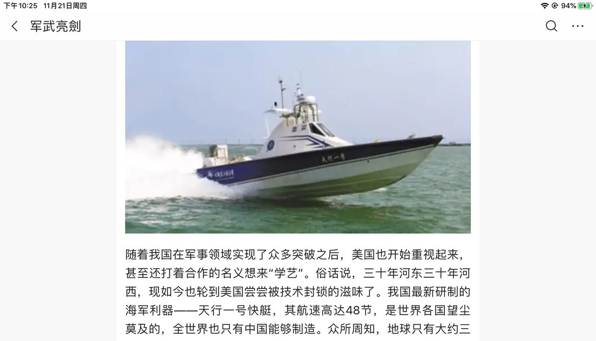

[11月23日 07:59]    BBC News 中文   @bbcchinese    美国国务卿蓬佩奥强调中国共产党的威胁，似乎要把北约的使命扩大到了亚洲。 https://bbc.in/2D5bqfY   :speech_balloon:评:23 :+1:赞:56 :globe_with_meridians:转:14  

[11月23日 07:27]    BBC News 中文   @bbcchinese    11月20日，英国女王的三儿子约克公爵安德鲁王子表示，他将在可预见的未来不再履行其任何代表英国王室的官方职务。 https://bbc.in/2qGog1o   :speech_balloon:评:7 :+1:赞:26 :globe_with_meridians:转:1  

[11月23日 07:00]    纽约时报中文网   @nytchinese    #一周热门 中国回应时报新疆报道，为镇压穆斯林辩护 http://nyti.ms/2Qw4QXO   :speech_balloon:评:11 :+1:赞:15 :globe_with_meridians:转:7  

[11月23日 06:49]    BBC News 中文   @bbcchinese    见过海王星（Neptune）吗？ https://bbc.in/37sHAQo   :speech_balloon:评:2 :+1:赞:25 :globe_with_meridians:转:12  

[11月23日 00:30]    墙国铁拳现世报😷   @Socialistfist    另外一个造假的人造铁拳是这则，同样张冠李戴。

 https://boxun.com/news/gb/china/2018/06/201806100004.shtml …  :speech_balloon:评:1 :+1:赞:32 :globe_with_meridians:转:3  

[11月23日 00:27]    墙国铁拳现世报😷   @Socialistfist    有推友询问是否能证明假图
有趣的是这张假图的配图恰好是微博用户“被威胁强拆的鹤岗小市民” 一个本推曾经在10月19日发布过的铁拳现世报内容。如果你搜索“小市民”，你会看见他每日在微博刷屏式维权也未曾导致他的微博被和谐。然而这些人造铁拳却是无迹可循。  :speech_balloon:评:1 :+1:赞:43 :globe_with_meridians:转:3  

[11月23日 00:21]    财经真相   @caijingxiang    有人说是假消息，嗯，很有可能，我也从没有否认！但是它突然爆出来的时间点很重要，更重要的是中共官媒还公开辟谣，这就已经达到了它的目的，现在是假，继续紧逼，下次你确定我不敢真干吗？ https://twitter.com/caijingxiang/status/1197908949061619716 …  :speech_balloon:评:21 :+1:赞:67 :globe_with_meridians:转:9  

[11月23日 00:05]    财经真相   @caijingxiang    接下来美国人会怎么做呢？今天美国最顶层的人会很忙，核爆炸未必能够吓住他们，但有一点是很明确的，北京的这位实权人已经成了当今世界亘古未有的最危险人物！现在川普政府唯一能做的是稳住他，全面开战？斩首行动？内部分裂？各种方法都会摆出来，内部寻找替代人是最可行性的策略，下面是一场时间赛跑  :speech_balloon:评:22 :+1:赞:112 :globe_with_meridians:转:28  

[11月22日 23:59]    BBC News 中文   @bbcchinese    【“人类纪”— 地球已进入由人类主导的新地质时代】人类对地球做了些什么？ https://bbc.in/2Oc014g   :speech_balloon:评:4 :+1:赞:8 :globe_with_meridians:转:2  

[11月22日 23:55]    财经真相   @caijingxiang    南海核爆事件是大事来临前的征兆，这是一次警告，也是一次试探，更是一次威胁！这件事的制造者自然是中共军方，而且命令很有可能来自北京最高层。它警告的人自然是即将签署《香港人权与民主法案》的特朗普，以及正在北京进行最后斡旋的基辛格，它的爆炸声是在说“把我逼急了，大不了鱼死网破！”  https://twitter.com/greattankman/status/1197773109803139072 …  :speech_balloon:评:84 :+1:赞:143 :globe_with_meridians:转:51  

[11月22日 23:11]    BBC News 中文   @bbcchinese    欧洲之星25岁了。快来看看老照片...... https://bbc.in/338pY8X   :speech_balloon:评:4 :+1:赞:24 :globe_with_meridians:转:7  

[11月22日 22:57]    财经真相   @caijingxiang    美国最近一系列经济数据都开始触底走强，这给了美联储12月暂停降息的理由，如果数据继续强劲，美联储不排除重新引导市场加息预期，甚至暂停启动的不是QE4的宽松！  :speech_balloon:评:5 :+1:赞:61 :globe_with_meridians:转:11  

[11月22日 22:07]    BBC News 中文   @bbcchinese    哪些因素对人们生活影响最大？我们去这些国家听当地人怎么说。 https://bbc.in/2ObUTNG   :speech_balloon:评:20 :+1:赞:59 :globe_with_meridians:转:27  

[11月22日 22:00]    纽约时报中文网   @nytchinese    #时报专栏 @nytdavidbrooks：全球化的民主资本主义将引发反作用力。它导致受过教育、繁荣发展的城市人和落在后面的农村民众之间的经济和文化冲突日益加剧。
它在精神上太单薄，太世界主义，决绝于传统。人们感到自己的民族文化正在被剥夺。 http://nyti.ms/2XJOSuM   :speech_balloon:评:66 :+1:赞:20 :globe_with_meridians:转:10  

[11月22日 21:35]    BBC News 中文   @bbcchinese    他找到的“病根”到底是什么？看一看，关于上瘾你原来的认识有没有误区。 https://bbc.in/2OaLh5L   :speech_balloon:评:4 :+1:赞:41 :globe_with_meridians:转:21  

[11月22日 21:01]    BBC News 中文   @bbcchinese    “智利警察的意图很明确：打伤示威者以打击示威者士气。” https://bbc.in/2QDT39T   :speech_balloon:评:47 :+1:赞:213 :globe_with_meridians:转:78  

[11月22日 21:00]    纽约时报中文网   @nytchinese    多年来，中国政府允许电子烟行业在没有监管的情况下蓬勃发展，但新规定将改变这一现状。
监管机构已经禁止在网上销售电子烟产品，中国的主要宣传机构也投以审视的目光，称其可能对健康造成不良影响。政府正在考虑禁止在公共场所吸电子烟。 http://nyti.ms/2qDhARH   :speech_balloon:评:15 :+1:赞:26 :globe_with_meridians:转:4  

[11月22日 20:01]    BBC News 中文   @bbcchinese    【“人类纪”— 地球已进入由人类主导的新地质时代】一名艺术家以他的目光见证地球的变迁。而科学家认为地球已进入由人类主导的新地质时代，称为“人类纪”。 https://bbc.in/33bTTNM   :speech_balloon:评:5 :+1:赞:12 :globe_with_meridians:转:6  

[11月22日 19:06]    墙国铁拳现世报😷   @Socialistfist    这些人造铁拳固然有很高“观赏性”，但小编不赞同用这些截图去混淆视听。  :speech_balloon:评:14 :+1:赞:272 :globe_with_meridians:转:22  

[11月22日 19:01]    BBC News 中文   @bbcchinese    图瓦卢新政府选边站了吗？ https://bbc.in/3473vKS   :speech_balloon:评:38 :+1:赞:59 :globe_with_meridians:转:11  

[11月22日 19:00]    纽约时报中文网   @nytchinese    安德鲁王子并非他这一代皇室成员在接受电视采访后受到攻击的第一人。他的哥哥查尔斯王子与第一任妻子戴安娜离婚后，为了挽回声誉，同意在1994年的一部纪录片中露面。
但当王子承认通奸时，他立即失去了他一直拼命想要重新赢得的善意。 http://nyti.ms/33atekv   :speech_balloon:评:2 :+1:赞:2 :globe_with_meridians:转:2  

[11月22日 18:59]    墙国铁拳现世报😷   @Socialistfist    近几日收到了大量推友投稿私信，都是关于图二图三内容，特发此推说明，就不一一私信回复解释了，请见谅。
图一是几个月前就发推讨论过的造假铁拳图。这些疑似假图的截图 
主要特征是“隔日”铁拳的戏剧效果和无迹可查的微博搜索信息。
投稿中有众多港台两地推友对微博不甚了解, 容易上当，请大家转发告知  :speech_balloon:评:24 :+1:赞:241 :globe_with_meridians:转:67  

[11月22日 18:21]    纽约时报中文网   @nytchinese    #时报专栏 有没有注意到，整个世界在燃烧？
我们正经历1989年以来最普遍的全球民众骚乱。民粹/威权主义政权正在失去合法性。香港等地的城市中产阶级正在奋起保护政治和社会自由。 http://nyti.ms/2XJOSuM   :speech_balloon:评:126 :+1:赞:394 :globe_with_meridians:转:139  

[11月22日 18:01]    BBC News 中文   @bbcchinese    郑文杰是嫖娼还是“被嫖娼”？网友们有不同看法。 https://bbc.in/34bf8AB   :speech_balloon:评:518 :+1:赞:334 :globe_with_meridians:转:110  

[11月22日 17:31]    墙国铁拳现世报😷   @Socialistfist    #社会主义铁拳 https://twitter.com/RogerHPNg/status/1197778808503328768 …  :speech_balloon:评:4 :+1:赞:110 :globe_with_meridians:转:12  

[11月22日 17:01]    BBC News 中文   @bbcchinese    BBC中文自10月13日开始，用电脑每15分钟纪录“守护香港大联盟”网站更新的联署数字，再交予一些专家研判数字的可靠性。所以真的有百万人参与网上联署撑警察吗？ https://bbc.in/37ulqNC   :speech_balloon:评:123 :+1:赞:119 :globe_with_meridians:转:41  

[11月22日 16:30]    纽约时报中文网   @nytchinese    另一件出问题的作品是2011年的画作，画中有12名身穿校服、戴着防毒面具的女生，刘虹表示，它取材于一张“二战”空袭演习的历史照片。
“它是反战的寓意，所以我觉得没问题，但当我和中国的艺术家朋友谈论这件事时，他们只说了一个词：香港。”刘虹说。 http://nyti.ms/2OwaLt5   :speech_balloon:评:10 :+1:赞:74 :globe_with_meridians:转:33  

[11月22日 16:00]    纽约时报中文网   @nytchinese    安德鲁王子为自己与爱泼斯坦的友谊辩护在英国引发轩然大波，成为王室在现代历史上最糟糕的丑闻之一。
除了安德鲁王子与爱泼斯坦之间的友谊，玛格丽特公主的爱情生活、查尔斯和戴安娜的婚姻失败、菲利普亲王的失言风波也是近一个世纪以来与英国王室有关的爆炸性新闻事件。 http://nyti.ms/33atekv   :speech_balloon:评:18 :+1:赞:28 :globe_with_meridians:转:15  

[11月22日 15:30]    纽约时报中文网   @nytchinese    这种技术被称为“内腌”，这样火鸡在挂起来晾干的同时也在腌制，而晾干是让火鸡皮变脆的必要步骤。
腌泡汁也有助于肉在烘烤时保持湿润。(与美式的干腌火鸡不同，即在火鸡外皮上涂抹一层更干的盐和香料，而这种中式的盐卤汁只会进入火鸡的腔内。) http://nyti.ms/346roCb   :speech_balloon:评:3 :+1:赞:8 :globe_with_meridians:转:3  

[11月22日 15:01]    BBC News 中文   @bbcchinese    古巴是世界仅存的几个社会主义国家之一，而首都哈瓦那是古巴唯一一个由法国殖民者修建的城市。它的500年历史都浓缩在城市各处的恢弘的古建筑物中。 https://bbc.in/37p9LzT   :speech_balloon:评:17 :+1:赞:39 :globe_with_meridians:转:9  

[11月22日 14:53]    财经真相   @caijingxiang    今天a股暴跌，损失最大的竟然是淘股吧，直接给封了！  :speech_balloon:评:28 :+1:赞:243 :globe_with_meridians:转:44  

[11月22日 14:30]    纽约时报中文网   @nytchinese    #观点 在边缘化和处罚这些人的过程中，中共不仅在吞噬自己：它还在向专家的意见宣战，剥夺自己对新疆当地情况的第一手知识。
就像毛泽东时代一样，中共再一次切断了与现实的联系，切断了执政所需的信息。 http://nyti.ms/37t0O8r   :speech_balloon:评:12 :+1:赞:44 :globe_with_meridians:转:15  

[11月22日 14:09]    纽约时报中文网   @nytchinese    #图集【在美国，180万美元能买到什么房？】手握180万美元，你能买到普罗维登斯一座建于1840年代的联排别墅，或布鲁克林一间共管公寓，也可以选择位于达拉斯的诺曼底城堡风格房屋。
点击查看图集： http://nyti.ms/2XzqonV   :speech_balloon:评:75 :+1:赞:36 :globe_with_meridians:转:9  

[11月22日 14:01]    BBC News 中文   @bbcchinese    “双普选”关系到香港政治中最重要的两个角色——行政长官与立法会议员的产生，同时香港与北京在这个问题上的撕裂也是中港关系的缩影。 https://bbc.in/2KFLZFS   :speech_balloon:评:98 :+1:赞:213 :globe_with_meridians:转:81  

[11月22日 13:53]    老司机   @h5lpykl7tp6jjop    深圳沙井走了40万人，整个深圳关外一片萧条！
来源：深圳房地产
现在整个深圳关外一片萧条啊，很多工厂都关门，很多菜场都关门，还有很多饭馆都关门了。今年深圳祖房市场怪现象，高档小区，房租过万的房，供不应求，城中村农民房大量空置，租不去出。深圳如果没有制造业那到时就会上演空城计。  :speech_balloon:评:6 :+1:赞:78 :globe_with_meridians:转:30  

[11月22日 13:38]    财经真相   @caijingxiang    百度就业相关搜索指数！  :speech_balloon:评:10 :+1:赞:142 :globe_with_meridians:转:50  

[11月22日 13:27]    老司机   @h5lpykl7tp6jjop    余华：中国荒诞的阶级斗争史（摘录）  :speech_balloon:评:1 :+1:赞:12 :globe_with_meridians:转:1  

[11月22日 13:02]    财经真相   @caijingxiang    不想爆粗口，但是这次真的是忍不了，你大爷的！白领加班是坐着，工厂的工人可是站着的，而且是站了一天的那种，很多人站的腿都软了，别说20分钟，就是五分钟都没有人愿意！拿白领加班比，脑残吧！ https://twitter.com/calabiet9/status/1197739487343697921 …  :speech_balloon:评:24 :+1:赞:242 :globe_with_meridians:转:33  

[11月22日 13:00]    纽约时报中文网   @nytchinese    #每日一词 In the loop，在消息圈内，知情。美国驻欧盟大使桑德兰在弹劾调查听证会上称，一些高级官员对白宫针对乌克兰的施压行动“知情”，所有人都参与其中(everyone was in the loop)。Loop是回路、循环的意思，in the loop意为在圈内、参与其中、对某事知情。更多简报内容： http://nyti.ms/2OA0EUk   :speech_balloon:评:11 :+1:赞:12 :globe_with_meridians:转:4  

[11月22日 12:41]    财经真相   @caijingxiang    还有一员工跟我讲过他以前工作的一家工厂，上班打卡机时间故意调快10分钟，而下班打卡机时间却慢了十分钟，如此以来就比正常工作时间长了20分钟，员工们对此一肚子气却不敢吭声，只求合同时间一到赶紧拿奖金走人！  :speech_balloon:评:7 :+1:赞:123 :globe_with_meridians:转:18  

[11月22日 12:33]    财经真相   @caijingxiang    中国的年轻工人没有任何话语权，劳务诈骗在中国遍地开花，但是你却根本看不到任何新闻报道，每次看新闻说“用工荒”各种专家学者乱分析；从不提劳务外派这一最核心根源，对于绝大多数普通工人来说，脏、累、苦都还可以忍受，但是绝对无法忍受承诺的奖金被中介和工厂诈骗利用劳务外派诈骗！  :speech_balloon:评:14 :+1:赞:317 :globe_with_meridians:转:70  

[11月22日 12:25]    财经真相   @caijingxiang    中介与厂方演的双簧戏可以时每天都在上演，他们就像吸血鬼一样，吸食工人们的血汗钱，但是大部分年轻工人对此除了忍让以外没有任何办法，因为换一家也一样，他们唯一希望的就是下一家中介不是那么黑，正是这种制度诈骗才导致很多年轻人不愿意进厂，越是诈骗工厂越是找不到人，然后成本提高恶性循环！  :speech_balloon:评:5 :+1:赞:101 :globe_with_meridians:转:20  

[11月22日 12:19]    财经真相   @caijingxiang    劳务外派是中国同工不同酬的制度根源，工厂借助人力中介巧妙的把工人法律赋予的各种福利全部推拖干净，而且中介还会在发工资时以各种理由进行克扣。一工人说富士康入厂前承诺干满90天会给600元奖金，但是在最后三天却与中介合伙将员工故意外调到郑州，且不给任何路费，变相逼你离职！  :speech_balloon:评:4 :+1:赞:101 :globe_with_meridians:转:24  

[11月22日 12:06]    财经真相   @caijingxiang    这里大部分工厂时薪是20元，一天八小时就是160元；所有进厂的普工都是根劳动中介签的合同，他们属于劳务外派，其工资由中介发而不是工厂，也就是说他们在法律上是中介的员工，除了接受工厂管理外，出任何事情都和工厂没有关系，更不要说工厂的各种福利！  :speech_balloon:评:6 :+1:赞:74 :globe_with_meridians:转:13  

[11月22日 12:01]    BBC News 中文   @bbcchinese    泛民主派乘着近月示威浪潮，推出比往届更多的大量候选人参加竞争，令建制派阵营在这次选举受到巨大挑战。 https://bbc.in/2Oxpe8h   :speech_balloon:评:27 :+1:赞:84 :globe_with_meridians:转:23  

[11月22日 12:00]    纽约时报中文网   @nytchinese    • 菲律宾总统杜特地下令，全面禁止在公共场合吸电子烟。他还呼吁警方和军方帮助实施这一禁令，逮捕胆敢违反禁令之人。
• 泰国与老挝边境周四发生6.1级地震，震源深度10公里。泰国清迈震感明显，曼谷高层建筑出现摇晃。当晚该地区再现两起中级地震。
更多简报内容： http://nyti.ms/2OA0EUk   :speech_balloon:评:2 :+1:赞:2 :globe_with_meridians:转:1  

[11月22日 11:57]    财经真相   @caijingxiang    自从日本纪录片将三和曝光后，深圳加强了对三和人力资源市场的管理，出了设置栅栏外门禁刷身份证才能进；富士康在外人眼里是血汗工厂，但是相比其他工厂来说依旧是很多工人的首选，因为它的加班工资制度是最健全的；这里一份蛋炒饭才6元，几乎是全深圳最便宜的！  :speech_balloon:评:18 :+1:赞:225 :globe_with_meridians:转:77  

[11月22日 11:32]    BBC News 中文   @bbcchinese    BBC中文记者深入香港理大校园，跟留守者交谈，纪录下所见所闻。 https://bbc.in/2OcRHBv   :speech_balloon:评:64 :+1:赞:128 :globe_with_meridians:转:69  

[11月22日 11:30]    纽约时报中文网   @nytchinese    中美最终将解决他们在关税问题上的分歧，甚至可能达成一项让双方都说自己赢了的协议。
但美国前财长保尔森认为，别让这种结局蒙骗了。即使这两大经济体握手言和，它们之间的关系也可能变得更糟糕。保尔森说，危险在于，两国之间的敌意已将“军事视角和思想并入到经济政策中来”。 http://nyti.ms/2QFrUn1   :speech_balloon:评:25 :+1:赞:96 :globe_with_meridians:转:38  

[11月22日 11:00]    纽约时报中文网   @nytchinese    以色列总理内塔尼亚胡被正式起诉，他被控受贿、欺诈和背信罪。尽管法律规定并未要求其下台，但鉴于他已两次组阁失败，相关刑事诉讼可能会让他难以继续掌权。
这是以色列首次对现任总理提起诉讼，可能将加剧该国的政治瘫痪。
更多简报内容： http://nyti.ms/2OA0EUk   :speech_balloon:评:2 :+1:赞:7 :globe_with_meridians:转:2  

[11月22日 10:55]    纽约时报中文网   @nytchinese    北京警告可能干预香港司法裁决 http://nyti.ms/2D1mKcL https://twitter.com/stevenleemyers/status/1197145323568685057 …  :speech_balloon:评:10 :+1:赞:9 :globe_with_meridians:转:2  

[11月22日 10:51]    老司机   @h5lpykl7tp6jjop    而且你们玩女人用公权力用公款，别人用自己的钱，谁无耻？谁不道德？你们敢开放网络让信息言论自由吗？不准别人说话，自己大方厥词，也只有在中国这个几千年愚民社会你们这么肆无忌惮！在民主自由的社会你们就是一群流氓无赖，别以为你们敲诈人民搞到大笔钱财就想冒充上等人，即使穿上名牌也是强盗！呸  :speech_balloon:评:1 :+1:赞:38 :globe_with_meridians:转:5  

[11月22日 10:50]    纽约时报中文网   @nytchinese    简报：北京谴责香港人权法案；“新疆文件”说明什么  http://nyti.ms/2OA0EUk https://twitter.com/ccni/status/1197703791904198656 …  :speech_balloon:评:12 :+1:赞:7 :globe_with_meridians:转:2  

[11月22日 10:38]    财经真相   @caijingxiang    我已经不想看这样侮辱智商的新闻！ https://twitter.com/reuterscn/status/1197705163089367041 …  :speech_balloon:评:24 :+1:赞:195 :globe_with_meridians:转:35  

[11月22日 10:30]    纽约时报中文网   @nytchinese    《牛津词典》将climate emergency（气候紧急状态）列为2019年年度词汇。
它是从同环境有关的词汇候选名单中选出的，其中还包括climate action（气候行动）、climate denial（否认气候变化）、eco-anxiety（生态焦虑）、extinction（灭绝）和flight shame（飞行羞辱）。 http://nyti.ms/2O8MCtA   :speech_balloon:评:6 :+1:赞:14 :globe_with_meridians:转:8  

[11月22日 10:24]    老司机   @h5lpykl7tp6jjop    为中共做事没有申报，被判刑。祝贺 https://twitter.com/ttingxiao/status/1197693786366726144 …  :speech_balloon:评:14 :+1:赞:242 :globe_with_meridians:转:91  

[11月22日 10:19]    老司机   @h5lpykl7tp6jjop    掌握国家专政工具满世界安装摄像头，窥探别人隐私作为迫害反对者的手段，是最无耻下流的流氓行为，人民要求公平正义，你攻击别人私生活不检点，请问你们大批当官亿万贪污情妇上百你共产党引咎辞职下台了吗？你们居然动用国家机器挑剔个人行为，那什么人才可以质疑你们呢？有完人吗？你们是完人？呸！  :speech_balloon:评:4 :+1:赞:86 :globe_with_meridians:转:18  

[11月22日 09:53]    老司机   @h5lpykl7tp6jjop    爱国级别多，开始容易后面难，小粉红自己看看能不能有个好结果？  :speech_balloon:评:1 :+1:赞:35 :globe_with_meridians:转:7  

[11月22日 09:52]    纽约时报中文网   @nytchinese    早安！今日重点新闻包括：
北京谴责香港人权法案；“新疆文件”说明什么；美国前财长谈中美关系；以色列总理内塔尼亚胡被正式起诉；盘点英国王室百年丑闻；白宫前俄罗斯问题专家称乌克兰干预2016年大选是“虚构叙事”；泰国老挝边境周四发生6.1级地震……NYT简报带你速览今日要闻。 http://nyti.ms/2OA0EUk   :speech_balloon:评:14 :+1:赞:44 :globe_with_meridians:转:14  

[11月22日 07:40]    BBC News 中文   @bbcchinese    2019年10月，国际咨询公司麦肯锡曾发表报告有这样的结论：亚洲世纪已经到来。 果真如此，更为重要的问题是，中、美会如何相处和应对？ https://bbc.in/337I0bD   :speech_balloon:评:20 :+1:赞:25 :globe_with_meridians:转:9  

[11月22日 07:19]    BBC News 中文   @bbcchinese    玻利维亚变天对此有何影响呢？ https://bbc.in/2KJTxr7   :speech_balloon:评:7 :+1:赞:30 :globe_with_meridians:转:9  

[11月22日 03:07]    老司机   @h5lpykl7tp6jjop    @穿閲視界 
【约瑟夫法则】一个名字叫约瑟夫的奥地利人强奸了自己的女儿，在法庭上约瑟夫理直气壮的说："这是我家的事，你们不得干涉我的家庭事务，我家的事不用你们插手？我拒绝法律对我的审判！"
后来人们把这个无耻的辩驳叫做"约瑟夫法则"！  :speech_balloon:评:38 :+1:赞:781 :globe_with_meridians:转:454  

[11月22日 00:17]    老司机   @h5lpykl7tp6jjop    「辭職的女警」邱汶珊，BBC專訪。  :speech_balloon:评:5 :+1:赞:125 :globe_with_meridians:转:79  

[11月21日 21:51]    BBC News 中文   @bbcchinese    在英驻港总领馆前雇员郑文杰接受BBC访问，讲述自己被深圳警方拘留时“遭受酷刑”后，中国官方媒体今天发布视频，显示郑文杰“出入会所”及认罪画面，并指不存在刑讯逼供情况。  :speech_balloon:评:570 :+1:赞:589 :globe_with_meridians:转:191  

[11月21日 21:45]    BBC News 中文   @bbcchinese    望子成龙的家长们，或许你能从中受到一些启发？ https://bbc.in/35iCdRO   :speech_balloon:评:7 :+1:赞:33 :globe_with_meridians:转:12  

[11月21日 21:40]    财经真相   @caijingxiang    美国前财政部长亨利·保尔森在21日举行的“创新经济论坛”上说，当前中国和美国“脱钩”压力有所加大，越来越多军事领域的“零和思维”被运用到了商业领域。中美“脱钩”将给双方和世界带来诸多风险。 保尔森们为中共做的最后努力！  :speech_balloon:评:8 :+1:赞:102 :globe_with_meridians:转:25  

[11月21日 21:37]    财经真相   @caijingxiang    一旦港币脱钩，金融市场各大券商和外汇交易平台都会降低港币杠杆，甚至个别平台连人民币杠杆也会降低，如果杠杆降低到1:5，一手人民币空仓就需要缴纳保证金20000美元，如此一来大部分散户都将失去做空人民币的机会，各位交易员要做好准备，川普签署法案是分分钟钟的事！ https://twitter.com/Jkylebass/status/1197493554098163712 …  :speech_balloon:评:20 :+1:赞:418 :globe_with_meridians:转:189  

[11月21日 21:01]    老司机   @h5lpykl7tp6jjop    #自由伊朗

副主席先生，感谢您与伊朗人民并肩作战。毛拉们无情地向人们开火，有报道称有251人被杀，3,700多人受伤。互联网已关闭down.请提供互联网连接。 #Internet4Iran https://twitter.com/heshmatalavi/status/1197404848645398528 …  :speech_balloon:评:2 :+1:赞:44 :globe_with_meridians:转:22  

[11月21日 21:00]    纽约时报中文网   @nytchinese    全国人大常务委员会发言人臧铁伟在裁决后发表的一份声明中表示，推翻蒙面禁令“严重削弱”香港政府“依法应有的管治权”。他还说，这项裁决不符合《基本法》的规定。
该立法机关还没有打算推翻这一裁决。不过，它强烈暗示，国家安全问题应该由北京来决定，而不是由法院来决定。 http://nyti.ms/2D1mKcL   :speech_balloon:评:73 :+1:赞:19 :globe_with_meridians:转:6  

[11月21日 20:30]    纽约时报中文网   @nytchinese    艺术家刘虹表示，地方政府最初对9件作品表达了关切，其中包括一幅1993年的自画像，作品取材于她在“文革“末期的一张照片，照片中年轻的她背着步枪；另一幅作品是1988年的《七上八下》。
“也许他们觉得这是对中国现状的评价，“刘虹说。 http://nyti.ms/2OwaLt5   :speech_balloon:评:13 :+1:赞:26 :globe_with_meridians:转:6  

[11月21日 20:09]    财经真相   @caijingxiang    不知道会有多少皮包公司要注销，目前深圳中介开一家香港公司还要很多钱，很快这项业务就没有那么吸引人了！ https://twitter.com/dw_chinese/status/1197483577765699584 …  :speech_balloon:评:2 :+1:赞:98 :globe_with_meridians:转:20  

[11月21日 19:34]    老司机   @h5lpykl7tp6jjop    造爱国谣言的又来了！
我国自主研发的天行一号航速48节！终于让美国也尝尝被技术封锁的滋味了，全球仅中国能造！
谷歌一搜！
加拿大海军1968年7月23日服役的布拉多尔号是是曾经世界上跑得最快的军舰。该艇的最高航速63节  :speech_balloon:评:6 :+1:赞:74 :globe_with_meridians:转:28  

[11月21日 18:30]    财经真相   @caijingxiang    《华尔街日报》记者魏玲玲、窦伊娃援引知情人士报道，中国首席代表已邀请美国贸易代表当面进行会谈！这两个华人记者是什么情况？  :speech_balloon:评:10 :+1:赞:71 :globe_with_meridians:转:6  

[11月21日 18:21]    财经真相   @caijingxiang    中国拟邀请美国进一步就第一阶段贸易进行磋商，消息公布后，人民币短线上涨，黄金下跌！  :speech_balloon:评:44 :+1:赞:152 :globe_with_meridians:转:17  

[11月21日 17:59]    老司机   @h5lpykl7tp6jjop    非洲猪队友抱怨出大秘密！
都说了非洲人智商太低，典型的猪队友！信不信下回1分钱都不给你！
喂！还是援助我吧，援助我10亿美元，哪怕我只得到了10万美元，我都不会往外面说！  :speech_balloon:评:0 :+1:赞:35 :globe_with_meridians:转:25  

[11月21日 17:53]    老司机   @h5lpykl7tp6jjop      :speech_balloon:评:0 :+1:赞:6 :globe_with_meridians:转:2  

[11月21日 17:51]    老司机   @h5lpykl7tp6jjop    铁证如山！ https://youtu.be/5710y4o0QKw   :speech_balloon:评:1 :+1:赞:6 :globe_with_meridians:转:5  

[11月21日 17:08]    老司机   @h5lpykl7tp6jjop    因为当年的绯闻，有人写出一本小说，因为这本小说，绑架书店老板，为了抓人方便弄了一个条例，因为一个条例弄出一场示威，为了不准示威，采取大力镇压，镇压未见成效，开始开枪杀人，因为开枪杀人，引起美国立法，因为美国立法于是江山不稳！

一个为了颜面的故事引发蝴蝶效应！从此改变铁打的江山！  :speech_balloon:评:156 :+1:赞:2497 :globe_with_meridians:转:797  

[11月21日 17:05]    老司机   @h5lpykl7tp6jjop    #香港 【 #懷疑警察殺人 】
警方抓到一個小朋友後，因發洩不滿把小妹妹丟進路軌，小妹妹大聲呼叫一聲之後就完全沒有動靜，極有可能因此而死亡
#請廣傳
#香港年青人正在被軍警大規模屠殺
#SOSHongKong
#HongKongPoliceState  :speech_balloon:评:131 :+1:赞:1023 :globe_with_meridians:转:1211  

[11月21日 16:32]    老司机   @h5lpykl7tp6jjop    好文分享：好家伙！今天的朋友圈，竟然被一张废纸刷了屏！  :speech_balloon:评:15 :+1:赞:261 :globe_with_meridians:转:100  

[11月21日 13:58]    GFHG SDKM   @zyx_yny    On #PolyU being the end game, this OL says it is 100% not the end game.  She says what we saw happened to the students at Poly, the way they were brutally treated by #HKPolice, there's no way HKers will forget.  We will keep on fighting!

#StandWithHongKong #HongKongProtests  :speech_balloon:评:103 :+1:赞:2395 :globe_with_meridians:转:1542  

[11月21日 13:16]    财经真相   @caijingxiang    香港特区政府：香港特区政府与国家商务部同意在《内地与香港关于建立更紧密经贸关系的安排》（《安排》）框架下进一步提升内地服务贸易对香港的开放水平。2004年中共为了控制在香港市场的人民币，就是通过这个紧密协议实现的，现在进一步推进开放，本质就是彻底将香港同化为内陆一个城市！  :speech_balloon:评:10 :+1:赞:153 :globe_with_meridians:转:45  

[11月21日 11:50]    GFHG SDKM   @zyx_yny    We were in front of the Diet Members’ Office Building.

We will keep fighting with you, HKers
We will keep spreading what's happening in HK

You are not alone  :speech_balloon:评:350 :+1:赞:3484 :globe_with_meridians:转:2054  

[11月21日 04:06]    老司机   @h5lpykl7tp6jjop    香港回归终于全面大陆化，东方之珠在中共手上成为火球！  :speech_balloon:评:0 :+1:赞:22 :globe_with_meridians:转:7  

[11月21日 00:57]    GFHG SDKM   @zyx_yny    Yesterday’s passage of the #HongKong Human Rights & Democracy Act was a good day in the struggle to resist totalitarian #China & its bid for domination. But it was not the last day. We have a long road ahead to protect our jobs, our workers & our security.  :speech_balloon:评:1616 :+1:赞:16062 :globe_with_meridians:转:10486  

[11月21日 00:12]    墙国铁拳现世报😷   @Socialistfist      :speech_balloon:评:5 :+1:赞:196 :globe_with_meridians:转:28  

[11月21日 00:07]    墙国铁拳现世报😷   @Socialistfist    评论区的孙笑川们开始了一贯的颠倒黑白，全过程视频在此 https://twitter.com/hkwuliff/status/1193726052184387584?s=09 …  :speech_balloon:评:10 :+1:赞:150 :globe_with_meridians:转:29  

[11月20日 23:56]    墙国铁拳现世报😷   @Socialistfist    双十一当天，因为目睹正在跟拍的香港警察往女儿所在楼发射催泪弹，哭的撕心裂肺的hk01记者（亲中媒体）之事，被传到墙内变成了“ 反华媒体记者女儿被催泪弹”，微博评论区中粉红战螂瞬间高潮。
不知该记者和其同事看到了该有如何反应
#社会主义铁拳
#社会主义特别行政区铁拳  :speech_balloon:评:93 :+1:赞:912 :globe_with_meridians:转:368  

[11月20日 22:24]    老司机   @h5lpykl7tp6jjop    CCAV代表伊朗人民喜迎油价上涨， 别不相信你的耳朵  
"伊朗民众走上街头，支持政府调控油价，以渡过经济危机。"  :speech_balloon:评:269 :+1:赞:1742 :globe_with_meridians:转:824  

[11月20日 21:56]    GFHG SDKM   @zyx_yny    The first day that schools resumed, #hkpolice deliberately targeted high school students to stop and search for no reason. As many #hongkongers suggest, being young becomes a crime as #China and #HKGov are totally out of reach of the whole city.  :speech_balloon:评:251 :+1:赞:5537 :globe_with_meridians:转:6035  

[11月20日 14:09]    老司机   @h5lpykl7tp6jjop    与内地真的不一样！他们太勇敢了！国内8964以后还敢这样吗？  :speech_balloon:评:103 :+1:赞:2155 :globe_with_meridians:转:791  

[11月20日 12:36]    老司机   @h5lpykl7tp6jjop    Tin Shui Wai #HongKong: #HongKongProtesters were delaying MTR service. A group of pro-Beijing men grabbed a high school girl into the train and beat her up. 

This is the violence that Carrie Lam, her puppet gov’t and terrorist #Police will never condemn. 

#HongKongProtest  :speech_balloon:评:332 :+1:赞:3615 :globe_with_meridians:转:4745  

[11月19日 19:20]    墙国铁拳现世报😷   @Socialistfist    腾讯铁拳，重锤出击  :speech_balloon:评:34 :+1:赞:293 :globe_with_meridians:转:70  

[11月19日 15:33]    GFHG SDKM   @zyx_yny    The tyranny forced us live as middle age warrior  :speech_balloon:评:1 :+1:赞:50 :globe_with_meridians:转:19  

[11月19日 14:41]    GFHG SDKM   @zyx_yny    This scene is no longer only appearing in movies. It’s happening in our reality.

Escaping from death. 

She’s not a #stuntman, she’s just a normal citizen, normal student.

#StandWithHongKong
#Dramaislife
#Lifeisdrama
#PolyUHongKong  :speech_balloon:评:87 :+1:赞:1542 :globe_with_meridians:转:1481  

[11月18日 23:48]    墙国铁拳现世报😷   @Socialistfist    腾讯也是扔了一个战术式社会主义核弹吗  :speech_balloon:评:82 :+1:赞:632 :globe_with_meridians:转:132  

[11月18日 21:23]    墙国铁拳现世报😷   @Socialistfist    曾经推特中文圈最后一片净土还是被污染了
如果您想要批量屏蔽某些账号，建议大家参考转推内容。
如果您只是追求“眼不见心不烦”， 可以参考下图，选择设置-高级过滤-隐藏通知
推特世界归于宁静  https://twitter.com/keepcnsecurity/status/1195607211940040705 …  :speech_balloon:评:65 :+1:赞:116 :globe_with_meridians:转:40  

[11月18日 20:34]    墙国铁拳现世报😷   @Socialistfist    这小伙还是个文案人才，手动滑稽  :speech_balloon:评:23 :+1:赞:367 :globe_with_meridians:转:42  

[11月18日 20:13]    墙国铁拳现世报😷   @Socialistfist    推特做不到的事情，腾讯却做到了

#战螂在推特
#社会主义铁拳  :speech_balloon:评:252 :+1:赞:1853 :globe_with_meridians:转:538  

[11月18日 10:41]    GFHG SDKM   @zyx_yny    With students in Hong-Kong who are blocking the streets to bring economic pressure on China to ensure democratic freedoms in HK! #StandWithHongKong @Andychanhotin @FreedomHKG @Stand_with_HK @hk_watch @HKWORLDCITY #HongKongProtests @joshuawongcf #Freedom  :speech_balloon:评:28 :+1:赞:705 :globe_with_meridians:转:557  

[11月18日 09:41]    GFHG SDKM   @zyx_yny    Trans
"About 200 #PolyU students tried to escape in the direction of Hunghom. Not sure if they made it or not. Hope all managed to escape." https://twitter.com/meilong15/status/1196240402988187648 …  :speech_balloon:评:7 :+1:赞:44 :globe_with_meridians:转:41  

[11月18日 09:32]    GFHG SDKM   @zyx_yny    Stop using #PolyU Wifi for god’s sake.
#HongKongProtests https://twitter.com/hengyanlo/status/1196156883679055872 …  :speech_balloon:评:4 :+1:赞:110 :globe_with_meridians:转:121  

[11月18日 08:54]    GFHG SDKM   @zyx_yny    08:30 students tried to leave #PolyU but #HongKong #Police continued to tear gas them, forcing them to return inside. This is in contradiction to what Poly U President JC Teng said, that cops have agreed to let students leave peacefully. 
@cityusucbc
#PoliceBrutality  :speech_balloon:评:55 :+1:赞:846 :globe_with_meridians:转:1065  

[11月18日 08:50]    GFHG SDKM   @zyx_yny    #PolyU protesters eventually retreat after driving the police back in the face of whizzing rubber bullets and gas pellets. They’re mostly inside the campus again. Police showing no mercy #HK #HongKongProtests #StandWithHongKong  :speech_balloon:评:266 :+1:赞:4920 :globe_with_meridians:转:5392  

[11月18日 08:45]    GFHG SDKM   @zyx_yny    The #HKPolice threatening to shoot press, first-aid as they were attempting to cross the road. This is on the perimeter of #PolyU and some civilians who came here to support the protesters still inside have been injured and/or arrested at the TST east fountain across this road.  :speech_balloon:评:25 :+1:赞:618 :globe_with_meridians:转:832  

[11月18日 08:38]    GFHG SDKM   @zyx_yny    Protestors are trying to escape from Hong Kong Polytechnic University, but HK Police fire tear gas to force them back IN. HK Police have given up any pretense that they try to de-escalate and disperse. Instead, it is evident that their intention is to attack, arrest, and punish. https://twitter.com/JessiePang0125/status/1196224442491396097 …  :speech_balloon:评:34 :+1:赞:997 :globe_with_meridians:转:1153  

[11月18日 08:06]    GFHG SDKM   @zyx_yny    this is the same shameful #PolyU head who refused to shake hands with students wearing a mask during graduation ceremony. Still the same shameful head who escaped the clashes and shrinked his duty for the whole of the clash that lasts for days. https://twitter.com/nytmay/status/1196202338102341633 …  :speech_balloon:评:58 :+1:赞:788 :globe_with_meridians:转:652  

[11月18日 06:02]    GFHG SDKM   @zyx_yny    Around 30 minutes ago at 05:30AM, #HKPolice have entered #PolyU campus. At least 3 protestors subdued, 1 seen with blood all over face during arrest

#PolyU #PolyUMassacre #PolyUSOS
#SOSHK #HongKong #StandwithHK
Vid via Telegram  :speech_balloon:评:47 :+1:赞:1611 :globe_with_meridians:转:2262  

[11月18日 05:16]    GFHG SDKM   @zyx_yny    

They are still fighting! 

#SOSPolyU
#HKPoliceState  :speech_balloon:评:179 :+1:赞:3578 :globe_with_meridians:转:3265  

[11月18日 02:48]    GFHG SDKM   @zyx_yny    [PolyU frontliner's last words?]

"If very unfortunately I die in Kowloon today, even though history may just remember me as a number, I hope HKers will remember all of our deeds, stay angry & rational & turn our revenge chants into reality."

#SOSHK

OP: https://lihkg.com/thread/1731186/page/1 …  :speech_balloon:评:110 :+1:赞:2134 :globe_with_meridians:转:2008  

[11月18日 01:32]    GFHG SDKM   @zyx_yny    “It is fxxking mad!” People with their cars in Tsim Sha Tsui hoping to support #PolyU students (but were stuck due to roadblocks) received tear gas treatment from #HongKong police. Lots of swearing. Video circulated online. #HongKongProtests  :speech_balloon:评:81 :+1:赞:1421 :globe_with_meridians:转:1592  

[11月18日 01:12]    GFHG SDKM   @zyx_yny    Old friend, world renowned photographer, Stephen Boitano, sharing his concerns on escalated police violence in Hk. Please  pray it is a very dangerous situation. #StandWithHongKong #HongKongProtests @FreedomHKG @Stand_with_HK @HKWORLDCITY @hk_watch @Andychanhotin @Andychanhotin  :speech_balloon:评:701 :+1:赞:9600 :globe_with_meridians:转:9744  

[11月18日 00:41]    墙国铁拳现世报😷   @Socialistfist    推荐一些启发小编开办《墙国铁拳现世报》的parody或自媒体推号：
中国民调@PollChina 
新蛤社@XinHaNewsAgency
推特小红旗@Xhnsoc__Redflag
共青团中央 (学习小组）@CPCYouthLeague
乳透社@Ruters0615 
胡锡进（流亡）@HuXijin_huaiqiu
LIFETIME 視界@LifetimeUSCN
不分先后，欢迎推荐后续补充  :speech_balloon:评:13 :+1:赞:162 :globe_with_meridians:转:27  

[11月17日 23:42]    GFHG SDKM   @zyx_yny    Members of Guarding Our Kids, formed by mothers and fathers, decided to stay with #PolyU students who were trapped in the campus: We won't leave our 'kids' behind. We will safeguard this place. We want everyone here can go home. #HongKongProtesters  :speech_balloon:评:632 :+1:赞:10621 :globe_with_meridians:转:9927  

[11月16日 18:05]    墙国铁拳现世报😷   @Socialistfist    小编要郑重警告刘女士，国家是有寻衅滋事和煽动颠覆这些国民待遇的。

#社会主义铁拳  :speech_balloon:评:96 :+1:赞:734 :globe_with_meridians:转:211  

[11月15日 08:24]    墙国铁拳现世报😷   @Socialistfist    小编认为本月最佳铁拳，滋磁不滋磁啊？  :speech_balloon:评:38 :+1:赞:777 :globe_with_meridians:转:45  

[11月15日 08:21]    墙国铁拳现世报😷   @Socialistfist    面对大陆的善意，台大教授自信的进去了---亲中学者 施正屏
#社会主义铁拳  :speech_balloon:评:187 :+1:赞:1894 :globe_with_meridians:转:828  

[11月15日 01:03]    墙国铁拳现世报😷   @Socialistfist    那必须和兄弟你平分啊，猪肉价格这么高  https://twitter.com/Dofuralanmingo/status/1194993538292826114 …  :speech_balloon:评:18 :+1:赞:228 :globe_with_meridians:转:12  

[11月14日 19:09]    墙国铁拳现世报😷   @Socialistfist    北京废青，危言耸听

#社会主义铁拳  :speech_balloon:评:64 :+1:赞:650 :globe_with_meridians:转:168  

[11月14日 18:36]    财经真相   @caijingxiang    中共基建没有钱，很多网友简单的认为开动印钞机就行，这其实是大错特错，中共央行印的每一分钱，都必须有对应的相应的价值才行，否则就是无锚印钞，汇率崩盘！过去20年央行印钞都是以债务为基础的。比如，房奴的房贷，当房奴申请贷款时，本质是向央行抵押了自己未来30年的劳动力。 https://twitter.com/aspeltuo8/status/1194923278646816768 …  :speech_balloon:评:65 :+1:赞:784 :globe_with_meridians:转:280  

[11月12日 07:22]    凡賽堤/FORSETI   @FecharCCP    11日早在西湾河开枪射伤示威者的港警关家荣身份被起底，其担任家教会主席的德望学校师生、家长及校友发起联署要求解除其在该校的职务。其两个女儿在该校就读。另有消息指，关家荣受过“大陆警察部门”特殊培训。下面这个小视频，足以解释这场血案的真相：这是流氓国家自上而下有计划的谋杀。  :speech_balloon:评:21 :+1:赞:265 :globe_with_meridians:转:178  

[11月12日 07:14]    凡賽堤/FORSETI   @FecharCCP    救救悲慘的香港 #HKSOS

香港黑警拔槍亂殺港民！已多人中槍和死亡！

天滅極權！  :speech_balloon:评:3 :+1:赞:16 :globe_with_meridians:转:13  

[11月12日 07:11]    凡賽堤/FORSETI   @FecharCCP    11.11 香港殺人魔家庭資料！
全世界通緝這殺人魔全家！  :speech_balloon:评:48 :+1:赞:15 :globe_with_meridians:转:13  

[11月12日 07:07]    凡賽堤/FORSETI   @FecharCCP    救救悲慘的香港 #HKSOS

香港黑警拔槍亂殺港民！已多人中槍和死亡！  :speech_balloon:评:3 :+1:赞:10 :globe_with_meridians:转:9  

[11月12日 06:57]    凡賽堤/FORSETI   @FecharCCP    天滅流氓政權！！！CCP極權殺人恐怖組織正在用各種兇殘手段屠殺我們的同胞...................

看看這些大陸的黑警（公安，武警，士兵裝扮成香港警察）是如何沒有人性的屠殺香港學生！！！

天滅流氓政權！！！天滅CCP！！！  :speech_balloon:评:1 :+1:赞:23 :globe_with_meridians:转:25  

[11月12日 06:42]    凡賽堤/FORSETI   @FecharCCP    天滅流氓政權！！！CCP極權殺人恐怖組織正在用各種兇殘手段殺害我們的同胞...................

看看這些大陸的黑警（公安，武警，士兵裝扮成香港警察）是如何沒有人性的屠殺香港學生！！！

那個小年輕不知道是休克還是已經死亡！

天滅流氓政權！！！天滅CCP！！！  :speech_balloon:评:35 :+1:赞:23 :globe_with_meridians:转:22  

[11月12日 06:25]    凡賽堤/FORSETI   @FecharCCP    坐水凳（英語：waterboarding）是水刑的一種，做法是將受害人固定其雙手雙腳，在頭部放上布後持續澆水。如此會讓受害人產生溺水的錯覺而心生恐懼。雖然坐水凳不在身上留下可辨識的傷痕，但受害人在過程中會因為嗆到水甚至吸入性肺炎而受傷害。另外有些人因此導致心理方面的傷害，是酷刑的一種。  :speech_balloon:评:1 :+1:赞:38 :globe_with_meridians:转:34  

[11月05日 04:28]    凡賽堤/FORSETI   @FecharCCP    急救香港  #HKSOS！！！

天滅流氓政權！！！極權殺人恐怖組織正在用各種兇殘手段殺害我們的同胞..................................................

流氓政權的極權殺人恐怖組織蓄意謀殺香港年輕人！（13）

被暴力制服的年輕人已經休克，還殘暴折斷手！

兇殘，殘暴手段令人髮指到已經超越納粹！  :speech_balloon:评:1 :+1:赞:4 :globe_with_meridians:转:13  

[11月05日 04:25]    凡賽堤/FORSETI   @FecharCCP    急救香港  #HKSOS！！！

天滅流氓政權！！！極權殺人恐怖組織正在用各種兇殘手段殺害我們的同胞..................................................

流氓政權的極權殺人恐怖組織蓄意謀殺香港年輕人！（12）
兇殘，殘暴手段令人髮指到已經超越納粹！
天滅流氓政權！！！  :speech_balloon:评:1 :+1:赞:9 :globe_with_meridians:转:10  

[11月05日 04:24]    凡賽堤/FORSETI   @FecharCCP    急救香港  #HKSOS！！！

天滅流氓政權！！！極權殺人恐怖組織正在用各種兇殘手段殺害我們的同胞..................................................

流氓政權的極權殺人恐怖組織蓄意謀殺香港年輕人！（11）
兇殘，殘暴手段令人髮指到已經超越納粹！
天滅流氓政權！！！  :speech_balloon:评:0 :+1:赞:51 :globe_with_meridians:转:47  

[11月05日 04:23]    凡賽堤/FORSETI   @FecharCCP    急救香港  #HKSOS！！！

天滅流氓政權！！！極權殺人恐怖組織正在用各種兇殘手段殺害我們的同胞..................................................

流氓政權的極權殺人恐怖組織蓄意謀殺香港年輕人！（10）
兇殘，殘暴手段令人髮指到已經超越納粹！
天滅流氓政權！！！  :speech_balloon:评:0 :+1:赞:4 :globe_with_meridians:转:6  

[11月05日 04:19]    凡賽堤/FORSETI   @FecharCCP    急救香港  #HKSOS！！！

天滅流氓政權！！！極權殺人恐怖組織正在用各種兇殘手段殺害我們的同胞..................................................

流氓政權的極權殺人恐怖組織蓄意謀殺香港年輕人！（9）
兇殘，殘暴手段令人髮指到已經超越納粹！
天滅流氓政權！！！  :speech_balloon:评:2 :+1:赞:6 :globe_with_meridians:转:8  

[11月05日 04:16]    凡賽堤/FORSETI   @FecharCCP    急救香港  #HKSOS！！！

天滅流氓政權！！！極權殺人恐怖組織正在用各種兇殘手段殺害我們的同胞..................................................

流氓政權的極權殺人恐怖組織蓄意謀殺香港年輕人！（8）
兇殘，殘暴手段令人髮指到已經超越納粹！
天滅流氓政權！！！  :speech_balloon:评:1 :+1:赞:45 :globe_with_meridians:转:57  

[11月05日 04:13]    凡賽堤/FORSETI   @FecharCCP    急救香港SOS！！！

天滅流氓政權！！！極權殺人恐怖組織正在用各種兇殘手段殺害我們的同胞..................................................

流氓政權的極權殺人恐怖組織蓄意謀殺香港年輕人！（7）
兇殘，殘暴手段令人髮指到已經超越納粹！
天滅流氓政權！！！  :speech_balloon:评:4 :+1:赞:13 :globe_with_meridians:转:22  

[11月05日 04:10]    凡賽堤/FORSETI   @FecharCCP    急救香港SOS！！！

天滅流氓政權！！！極權殺人恐怖組織正在用各種兇殘手段殺害我們的同胞..................................................

流氓政權的極權殺人恐怖組織蓄意謀殺香港年輕人！（6）
兇殘，殘暴手段令人髮指到已經超越納粹！
天滅流氓政權！！！  :speech_balloon:评:1 :+1:赞:40 :globe_with_meridians:转:42  

[11月05日 04:07]    凡賽堤/FORSETI   @FecharCCP    急救香港SOS！！！

天滅流氓政權！！！極權殺人恐怖組織正在用各種兇殘手段殺害我們的同胞..................................................

流氓政權的極權殺人恐怖組織蓄意謀殺香港年輕人！（5）
兇殘，殘暴手段令人髮指到已經超越納粹！
天滅流氓政權！！！  :speech_balloon:评:0 :+1:赞:3 :globe_with_meridians:转:1  

[11月05日 04:06]    凡賽堤/FORSETI   @FecharCCP    急救香港SOS！！！

天滅流氓政權！！！極權殺人恐怖組織正在用各種兇殘手段殺害我們的同胞..................................................

流氓政權的極權殺人恐怖組織蓄意謀殺香港年輕人！（3）
兇殘，殘暴手段令人髮指到已經超越納粹！
天滅流氓政權！！！  :speech_balloon:评:2 :+1:赞:11 :globe_with_meridians:转:16  

[11月05日 04:05]    凡賽堤/FORSETI   @FecharCCP    急救香港SOS！！！

天滅流氓政權！！！極權殺人恐怖組織正在用各種兇殘手段殺害我們的同胞..................................................

流氓政權的極權殺人恐怖組織蓄意謀殺香港不同意見的議員！（2）

兇殘，殘暴手段令人髮指到已經超越納粹！
天滅流氓政權！！！  :speech_balloon:评:0 :+1:赞:4 :globe_with_meridians:转:4  

[11月05日 04:04]    凡賽堤/FORSETI   @FecharCCP    急救香港SOS！！！

天滅流氓政權！！！極權殺人恐怖組織正在用各種兇殘手段殺害我們的同胞..................................................

流氓政權的極權殺人恐怖組織蓄意謀殺香港年輕人！（1）
兇殘，殘暴手段令人髮指到已經超越納粹！
天滅流氓政權！！！  :speech_balloon:评:1 :+1:赞:9 :globe_with_meridians:转:8  

[11月03日 08:23]    凡賽堤/FORSETI   @FecharCCP    他們不配稱警察，他們是納粹的狗！魔鬼般的瘋狗！

極權殺人恐怖組織正在用各種兇殘手段殺害我們的同胞..................................................

滅絕人性對待老人  :speech_balloon:评:5 :+1:赞:45 :globe_with_meridians:转:44  

[10月09日 00:47]    GFHG SDKM   @zyx_yny    "Son, when you grow up
You will be the savior of the broken
The beaten, and the damned?"
Please watch this powerful mv #HongKongProtester #hkprotests 
香港反送中護法戰爭(Hong Kong Defensive War 2019)：Welcome To The Black Parade  https://youtu.be/0yXTHODE24Q  via @YouTube  :speech_balloon:评:4 :+1:赞:20 :globe_with_meridians:转:8  

[10月05日 09:33]    凡賽堤/FORSETI   @FecharCCP    呼籲請求共同挖掘所有有關香港發生的事，越全面越好，不同角度，越多越好，包括被暗地抓捕的人員，特別是CCP 派出的各種偽裝身份，包括變身變裝行兇的一點一滴都要挖掘出來，把CCP 的邪惡下三濫手段的真相毫無保留的曝光在全世界面前！世界公知公義才能真正挽救和保護香港人！希望懂視頻編輯配上中英文 https://twitter.com/hjjohnson17/status/1178969916499746816 …  :speech_balloon:评:20 :+1:赞:22 :globe_with_meridians:转:14  

[03月13日 08:10]    老司机   @h5lpykl7tp6jjop    批评是批评家天生的使命！他们只感知对错，信奉真理，指出真相不吐不快，不在意权势和群众的喜好，从批评里不可能获得任何好处，但批评家愚直不改。在中国几乎所有人都讨厌批评家，喜欢阴谋家，因为他们只说好听的！可是就因为中国的批评家太少，中国几乎看不到未来和希望！  :speech_balloon:评:97 :+1:赞:221 :globe_with_meridians:转:44  

