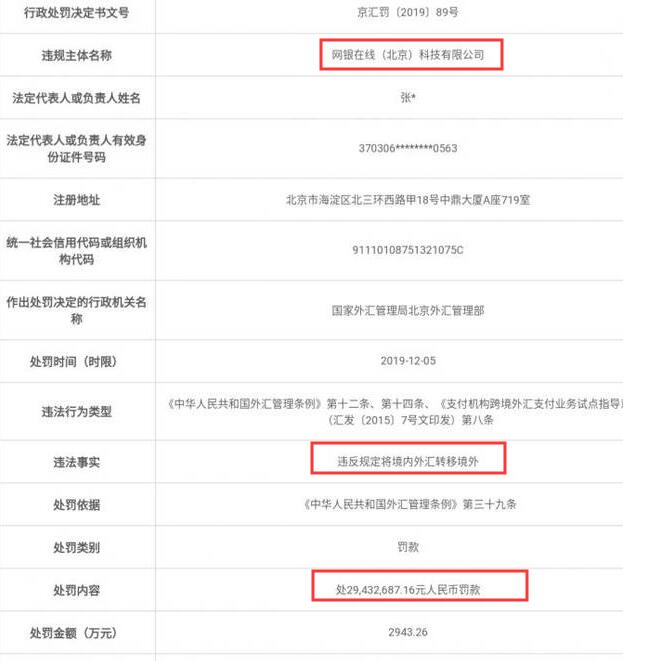
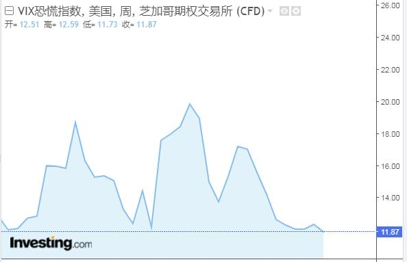

[11月28日 04:45]    老司机   @h5lpykl7tp6jjop    坍塌征照！中国地方政府债务超21万亿 经济数据引股市纷跌

中新网11月27日电据财政部网站消息，27日财政部公布2019年10月地方政府债券发行和债务余额情况。数据显示，2019年10月，全国发行地方政府债券964.6亿元。截至2019年10月末，全国地方政府债务余额213800亿元，控制在全国人大批准的限额之内。  :speech_balloon:评:1 :+1:赞:7 :globe_with_meridians:转:2  

[11月28日 04:40]    老司机   @h5lpykl7tp6jjop    香港“反送中”运动至今超过5个月，警民对立严重。在“止暴制乱”主旋律下，港警受到中国官媒和网民吹捧，曾举枪瞄准示威者的刘泽基更是爆红，不仅开通微博，10月更受邀出席中共建政70周年典礼，在阅兵转播中被拍摄的次数，甚至多过香港特首林郑月娥。历经北京阅兵的洗礼之后，刘泽基宛如获得“尚方宝剑”  :speech_balloon:评:1 :+1:赞:4 :globe_with_meridians:转:0  

[11月28日 04:38]    老司机   @h5lpykl7tp6jjop    光头警长获北京加持成自走砲。曾在反送中示威中举枪瞄准示威者、被称为“光头警长”的刘泽基25日在微博上将砲口对准港府，表示香港区议会选举有160万张废票，要求重新点票。
实际情况是，香港这次区议会选举总投票人数为294万3842人，而候选人总得票为293万1745，废票共有1万2097张，比率约为0.4%。  :speech_balloon:评:3 :+1:赞:11 :globe_with_meridians:转:2  

[11月28日 04:38]    新闻大吐槽   @TuCaoFakeNews    果然是台湾省委书记的料子，记得2010年2会，夺笔书记李鸿忠也是这么威胁记者的，当时，记者追问李关于邓玉娇案的看法，李不回答，只是反复追问女记者的工作单位，并表示要向其领导施压，然后一把夺下记者的录音笔，扬长而去！ https://twitter.com/lrblua8assskdx4/status/1199633830769913856 …  :speech_balloon:评:7 :+1:赞:15 :globe_with_meridians:转:4  

[11月28日 04:30]    老司机   @h5lpykl7tp6jjop    香港区选民主派胜利大陆网民留言精选…

抱歉，该内容暂时无法查看。

央视中联办港澳办说一国两制是成功的！说的没错，两制是成功了，一国是彻底失败的。

反中情绪上升

香港已经台湾化了，反中就是香港的主流民意，别自欺欺人了。

香港的选举结果，证明了多数人尽管不喜欢暴力，但更讨厌大陆！  :speech_balloon:评:2 :+1:赞:13 :globe_with_meridians:转:2  

[11月28日 04:20]    老司机   @h5lpykl7tp6jjop    爱国必须说谎，真相并不重要！
大陆爱国网民愤怒了！毒教材！根据网上曝光材料，香港学生的英文阅读题在描述中美两国河流时，先是赞美美国河流有多干净，与之对比的是“中国的河流”有多不堪。并在材料后的填空题中，引导学生用“干净、开心”词语描述美国河流，将“垃圾、黑脏臭”等形容词安在中国河流上。  :speech_balloon:评:0 :+1:赞:4 :globe_with_meridians:转:1  

[11月28日 04:09]    老司机   @h5lpykl7tp6jjop    两、三年前，夫妻俩斥资上亿台币，在台湾购买两户冠德远见豪宅，却没有登记在自己名下，夫妻两人解释说，因为不是用于自住，只是租给他人收取房租。台湾办案人员将调阅房屋所有权状厘清，并清查资金流向。同时，向心这次来台曾与五、六位台湾商界人士见面，检调已经掌握名单，将逐一查访。  :speech_balloon:评:0 :+1:赞:6 :globe_with_meridians:转:2  

[11月28日 01:20]    财经真相   @caijingxiang    三季度美国GDP增速二读为2.1%，高于预期和初值1.9%，二季度为2%。但商业投资仍是经济薄弱环节，企业盈利核心指标持续弱化。与年初相比，美国经济增速明显放缓，包括美联储在内的经济学家认为四季度增长率“大幅减弱”，美联储12月或保持“按兵不动”的利率政策。  :speech_balloon:评:4 :+1:赞:42 :globe_with_meridians:转:7  

[11月28日 00:29]    墙国铁拳现世报😷   @Socialistfist    那两个字不会写
阿钟哥请你jiayou学中文
#战螂在推特  :speech_balloon:评:9 :+1:赞:84 :globe_with_meridians:转:15  

[11月27日 23:41]    墙国铁拳现世报😷   @Socialistfist    一个美国人向俄国人解释为什么说美国是一个真正言论自由的国家。
美国人说：“我可以走到白宫前，高喊让里根下地狱！”
俄国人很不以为然：“你这算什么，我也可以走到红场上高喊，让里根下地狱”！ https://twitter.com/jiayoubiss/status/1199703307943600128 …  :speech_balloon:评:14 :+1:赞:275 :globe_with_meridians:转:38  

[11月27日 22:46]    墙国铁拳现世报😷   @Socialistfist    哪里不自由？

#社会主义铁拳  :speech_balloon:评:24 :+1:赞:353 :globe_with_meridians:转:88  

[11月27日 22:08]    新闻大吐槽   @TuCaoFakeNews    刘欣到香港街头取景，释放中共想息事宁人的信号;
她拍了几个别有用心镜头：被破坏的地铁站，路面，交通灯，和被遮挡的天灭中共标语，想把“乱”的责任扣在抗争者头上，展示给国际;

可她对港共造成的死亡，强奸，酷刑只字不提。
五大诉求未达成，香港能从赤色噩梦中苏醒过来吗？  :speech_balloon:评:156 :+1:赞:486 :globe_with_meridians:转:201  

[11月27日 22:08]    新闻大吐槽   @TuCaoFakeNews    刘欣到香港街头取景，释放中共想息事宁人的信号;
她拍了几个别有用心镜头：被破坏的地铁站，路面，交通灯，和被遮挡的天灭中共标语，想把“乱”的责任扣在抗争者头上，展示给国际;

可她对港共造成的死亡，强奸，酷刑只字不提。
五大诉求未达成，香港能从赤色噩梦中苏醒过来吗？  :speech_balloon:评:156 :+1:赞:486 :globe_with_meridians:转:201  

[11月27日 21:01]    BBC News 中文   @bbcchinese    一名美国年轻人在中国短视频平台抖音海外版上传一段教人夹睫毛的影片，但却突然聊到中国在新疆设立“集中营”，视频在社交媒体上广泛流传。 https://bbc.in/2XQMAKh   :speech_balloon:评:83 :+1:赞:400 :globe_with_meridians:转:128  

[11月27日 21:00]    纽约时报中文网   @nytchinese    《纽约时报》2019年度十大好书 http://nyti.ms/2qOkHXa   :speech_balloon:评:77 :+1:赞:33 :globe_with_meridians:转:14  

[11月27日 20:05]    BBC News 中文   @bbcchinese    【香港示威中的巴基斯坦裔：“我在这里出生长大，香港也是我的家”】香港自六月起经历政治动荡，南亚裔香港人在示威浪潮中一度成为关注焦点，一系列争议性事件也意外帮助香港少数族裔与主流社会之间增进了解。 https://bbc.in/33q8YeK   :speech_balloon:评:14 :+1:赞:54 :globe_with_meridians:转:14  

[11月27日 19:46]    BBC News 中文   @bbcchinese    有多少人在父母去世时由于各种各样的原因没能守在身旁。又有多少父母在离世前已经不省人事，无法跟子女作最后的道别。 https://bbc.in/2KY5t8G   :speech_balloon:评:6 :+1:赞:97 :globe_with_meridians:转:38  

[11月27日 19:01]    BBC News 中文   @bbcchinese    加拿大籍台湾艺人高以翔在浙江宁波录制一档真人秀节目时猝死，在中国大陆和台湾引发震动。 https://bbc.in/2rqZsuD   :speech_balloon:评:58 :+1:赞:137 :globe_with_meridians:转:33  

[11月27日 19:00]    纽约时报中文网   @nytchinese    #时报专栏 受中美领导人误判的影响，两个经济体出现了混乱、没有准备的脱钩，其他领域也出现了更深层的撕裂。
我们该如何处理美中日益复杂的关系？究竟哪种体系会是赢家？ http://nyti.ms/2rr5rzA   :speech_balloon:评:31 :+1:赞:26 :globe_with_meridians:转:12  

[11月27日 18:01]    BBC News 中文   @bbcchinese    这只被澳大利亚女子从火场抢救出来的小动物，最终仍伤重被安乐死  https://bbc.in/37B7L7H   :speech_balloon:评:15 :+1:赞:51 :globe_with_meridians:转:11  

[11月27日 18:00]    纽约时报中文网   @nytchinese    #观点 美味的食物、家人和朋友、放松的心境，感恩节的快乐其实来得相对容易。我们就应该在11月的第四个星期四聚在一起，彼此慰藉，好好放松。
但在一年中其他364天——那些你可能会感到孤独、工作压力大、受惑去欺骗或小家子气的日子里，培养感恩之心会让你的生活带来很大不同。 http://nyti.ms/2OpkzGA   :speech_balloon:评:6 :+1:赞:23 :globe_with_meridians:转:5  

[11月27日 17:30]    老司机   @h5lpykl7tp6jjop    澳洲悉尼入春便遭遇持续森林大火，现在又迎来了世纪大雷暴，树木倒地砸废汽车，这场长达五分钟的暴风雨留下了毁灭的痕迹，它切断了76,000户房屋的电力，关闭了道路和火车线路，掀飞房屋屋顶，刮倒了参天大树，压碎了树下汽车，电力公司Ausgrid更是收到了1500多起“生命威胁”事件投诉。
有人拍下恐怖照片  :speech_balloon:评:7 :+1:赞:45 :globe_with_meridians:转:16  

[11月27日 17:30]    纽约时报中文网   @nytchinese    区议会是地方咨询机构，没有立法权，但一边倒的结果被视为民众对持续抗议运动的支持。
几名新当选的区议会成员利用示威者的要求，将其纳入竞选纲领，似乎急于推动自己的角色超出通常的职责范围，比如社区噪音投诉和卫生问题。 http://nyti.ms/2XJRpVK   :speech_balloon:评:7 :+1:赞:20 :globe_with_meridians:转:1  

[11月27日 17:01]    BBC News 中文   @bbcchinese    香港区议会选举以民主派大胜结束。中国官方在大陆的媒体只发出简讯，告知公众选举结束，并未交代哪方获胜及失败。不过，连续两日，官方将矛头对准美国。 https://bbc.in/2QV1VYF   :speech_balloon:评:121 :+1:赞:423 :globe_with_meridians:转:150  

[11月27日 17:00]    纽约时报中文网   @nytchinese    周二，庞皮欧暗示香港在与中国达成的“一国两制”协议下保持的独立程度正在减弱，这似乎激怒了北京。
“我们对中国共产党继续信守承诺的支持依然坚定不移，”庞皮欧说。“我想你已经从过去这周的香港人身上看到了这一点。这也是他们所要求的。” http://nyti.ms/2OoUxTS   :speech_balloon:评:4 :+1:赞:14 :globe_with_meridians:转:5  

[11月27日 16:52]    新闻大吐槽   @TuCaoFakeNews    加拿大圭尔夫大学，支持香港的白人同学设置了「连侬炮」，等小粉红前来打擂！

夜晚果然有几个粉红上钩，被白人同学和他的小伙伴驳斥的晕头转向！

小粉红英文不过关，说不过人家，竟然不甘的飚起中文，命令老外「讲中文」  :speech_balloon:评:90 :+1:赞:960 :globe_with_meridians:转:426  

[11月27日 16:52]    新闻大吐槽   @TuCaoFakeNews    加拿大圭尔夫大学，支持香港的白人同学设置了「连侬炮」，等小粉红前来打擂！

夜晚果然有几个粉红上钩，被白人同学和他的小伙伴驳斥的晕头转向！

小粉红英文不过关，说不过人家，竟然不甘的飚起中文，命令老外「讲中文」  :speech_balloon:评:90 :+1:赞:960 :globe_with_meridians:转:426  

[11月27日 16:37]    纽约时报中文网   @nytchinese    《纽约时报》书评编辑选出了今年最优秀的十本小说和非虚构类图书。
特德·姜的短篇小说集《呼气》、详述全球家庭暴力问题的《无可见挫伤》以及《切尔诺贝利的午夜》均榜上有名。 http://nyti.ms/2qOkHXa   :speech_balloon:评:1 :+1:赞:45 :globe_with_meridians:转:27  

[11月27日 16:32]    财经真相   @caijingxiang    胡锡进：用抹黑中共来打击中国，此术休想得逞！蓬佩奥把中共与中国区分开来的战术开始奏效！  :speech_balloon:评:74 :+1:赞:499 :globe_with_meridians:转:145  

[11月27日 16:09]    新闻大吐槽   @TuCaoFakeNews    最难过的剧情恐怕类似电影《第六感》
悼念女儿的母亲，竟没发现自己其实也是一个鬼魂。只是由于留恋女儿才没有离开。

让人不禁联想到业已失踪多时的陈彦霖妈妈 https://twitter.com/TuCaoFakeNews/status/1199585767363792896 …  :speech_balloon:评:3 :+1:赞:35 :globe_with_meridians:转:7  

[11月27日 16:01]    BBC News 中文   @bbcchinese    在中国、马来西亚等亚洲其它大多数国家，休闲性大麻仍被作为毒品。东方文化对毒品的严厉的社会态度，影响着各国政府有关政策制定。 https://bbc.in/2QV7Hd4   :speech_balloon:评:107 :+1:赞:66 :globe_with_meridians:转:25  

[11月27日 16:00]    纽约时报中文网   @nytchinese    17岁的穆斯林高中生阿齐兹表示，她的TikTok视频试图淡化她在美国成长期间经历到的种族主义和歧视。在一则视频中，她提到了一则她说她和其他穆斯林经常听到的诽谤：她们会嫁给本·拉登。
“我认为TikTok不应禁止那些没有伤害到任何人或展现任何人受到伤害的内容，“阿齐兹说。 http://nyti.ms/2DgQ7bp   :speech_balloon:评:14 :+1:赞:44 :globe_with_meridians:转:12  

[11月27日 15:30]    纽约时报中文网   @nytchinese    #图集【无尽的干旱与洪水，印度的未来在哪里？】干旱、洪水、再一次干旱、再一次洪水......几十年来，政府短视的政策使数以百万计的印度人生活在恶劣的气候环境中。这些图片记录下了印度面临的困境。
点击查看图集： http://nyti.ms/2OK6KS2   :speech_balloon:评:6 :+1:赞:10 :globe_with_meridians:转:3  

[11月27日 15:08]    新闻大吐槽   @TuCaoFakeNews    最心酸的四格漫画——香港母亲轻敲房门，自顾自的进屋，在床边，轻轻对女儿诉说心里话：妈妈去投票了，而且投了你说的那个年轻的候选人，建制派惨败，这样你会不会安慰一点呢？

可是屋子里空荡荡的，只有床头女儿的遗像和她最爱的维尼熊玩具摆在那里
悔恨的泪水已经流干  :speech_balloon:评:55 :+1:赞:718 :globe_with_meridians:转:306  

[11月27日 15:08]    新闻大吐槽   @TuCaoFakeNews    最心酸的四格漫画——香港母亲轻敲房门，自顾自的进屋，在床边，轻轻对女儿诉说心里话：妈妈去投票了，而且投了你说的那个年轻的候选人，建制派惨败，这样你会不会安慰一点呢？

可是屋子里空荡荡的，只有床头女儿的遗像和她最爱的维尼熊玩具摆在那里
悔恨的泪水已经流干  :speech_balloon:评:55 :+1:赞:718 :globe_with_meridians:转:306  

[11月27日 15:01]    BBC News 中文   @bbcchinese    津巴布韦近日公布国家预算报告，但其中的外国援助金额却让该国和“全天候的朋友”中国意外发生一场外交争议。 https://bbc.in/2OOsY5l   :speech_balloon:评:19 :+1:赞:81 :globe_with_meridians:转:27  

[11月27日 15:00]    纽约时报中文网   @nytchinese    随着亲北京阵营的惨败情况逐渐明朗，大陆的新闻媒体没有对其进行报道。新华社发的一篇短消息只是简单地说，选票已经统计完毕，并指责社会动荡“干扰了选举进程”。
官方的中国国际广播电台政治评论员许钦铎说，不报道可能至少部分是一种保全面子的做法。 http://nyti.ms/2DgQ7bp   :speech_balloon:评:13 :+1:赞:30 :globe_with_meridians:转:14  

[11月27日 14:53]    新闻大吐槽   @TuCaoFakeNews    这个人明显不是标准香港口音  :speech_balloon:评:3 :+1:赞:176 :globe_with_meridians:转:0  

[11月27日 14:52]    新闻大吐槽   @TuCaoFakeNews    11月26日有人拍到，一个七老八十，走路艰难的白头老警察费力的走向警车！

港府真是无人可用了，黄忠虽老还可以拉断两张弓，这位老爷子恐怕弄不好得需要两个人抬担架……

这又何必呢？弄不好警车还得换成救护车  :speech_balloon:评:10 :+1:赞:58 :globe_with_meridians:转:26  

[11月27日 14:52]    新闻大吐槽   @TuCaoFakeNews    11月26日有人拍到，一个七老八十，走路艰难的白头老警察费力的走向警车！

港府真是无人可用了，黄忠虽老还可以拉断两张弓，这位老爷子恐怕弄不好得需要两个人抬担架……

这又何必呢？弄不好警车还得换成救护车  :speech_balloon:评:10 :+1:赞:58 :globe_with_meridians:转:26  

[11月27日 14:45]    新闻大吐槽   @TuCaoFakeNews    上海人在地铁上喊出了“香港人加油！解放香港！”

旁边的上海人仿佛愣住了，没有小粉红式的谩骂，也没有爱国主义的攻击，看来当真相传开时，真正的民众反应就是——惊呆！

这样的上海大叔给我来一万打  :speech_balloon:评:313 :+1:赞:3764 :globe_with_meridians:转:1290  

[11月27日 14:45]    新闻大吐槽   @TuCaoFakeNews    上海人在地铁上喊出了“香港人加油！解放香港！”

旁边的上海人仿佛愣住了，没有小粉红式的谩骂，也没有爱国主义的攻击，看来当真相传开时，真正的民众反应就是——惊呆！

这样的上海大叔给我来一万打  :speech_balloon:评:313 :+1:赞:3764 :globe_with_meridians:转:1290  

[11月27日 14:41]    纽约时报中文网   @nytchinese    #观点 “恶性病毒”、“感染”：北京形容香港抗议的措辞说明了什么 by @limlouisa http://nyti.ms/2sdmK7q   :speech_balloon:评:15 :+1:赞:17 :globe_with_meridians:转:5  

[11月27日 14:00]    纽约时报中文网   @nytchinese    “用你现在用的手机搜索一下中国正在发生什么，他们是如何设立集中营，把无辜的穆斯林扔进里面去的。”
美国一名17岁的穆斯林高中生在美妆视频中突然提到新疆问题，随后帐号遭封禁。这加剧了人们对TikTok的普遍担忧：该公司可能会依照中国政府的喜好对视频进行审查。 http://nyti.ms/2DgQ7bp   :speech_balloon:评:117 :+1:赞:479 :globe_with_meridians:转:222  

[11月27日 13:40]    新闻大吐槽   @TuCaoFakeNews    引自推友@guanzhi8   :speech_balloon:评:0 :+1:赞:3 :globe_with_meridians:转:0  

[11月27日 13:39]    新闻大吐槽   @TuCaoFakeNews    外交部发言人，对林郑月娥近期的表现很不满

如有雷同纯属巧合  :speech_balloon:评:8 :+1:赞:64 :globe_with_meridians:转:15  

[11月27日 13:39]    新闻大吐槽   @TuCaoFakeNews    外交部发言人，对林郑月娥近期的表现很不满

如有雷同纯属巧合  :speech_balloon:评:8 :+1:赞:64 :globe_with_meridians:转:15  

[11月27日 13:30]    纽约时报中文网   @nytchinese    庞皮欧没有明确为香港人权法案背书。他指出，有关该法案的决定将由特朗普做出，而且“不会太久“。”我们有适用于全世界的人权标准，香港也不例外，“庞皮欧说。
他还严厉批评了中国在新疆关押约100万穆斯林和其他少数民族的拘禁营，称其是北京“恐吓本国公民的严酷政策“的证据。 http://nyti.ms/2OoUxTS   :speech_balloon:评:42 :+1:赞:115 :globe_with_meridians:转:29  

[11月27日 13:13]    财经真相   @caijingxiang    下联：吸血拌雪花，既雪拌血又或血拌雪！求横批： https://twitter.com/qiubaibot/status/1199394907196030977 …  :speech_balloon:评:45 :+1:赞:91 :globe_with_meridians:转:19  

[11月27日 13:00]    BBC News 中文   @bbcchinese    西边不亮，东边亮。 https://bbc.in/2OpavgX   :speech_balloon:评:63 :+1:赞:90 :globe_with_meridians:转:18  

[11月27日 13:00]    纽约时报中文网   @nytchinese    #每日一词 Scapegoat，替罪羊。爱泼斯坦狱中自杀令两名狱警受到玩忽职守、伪造值班记录的刑事指控。但律师表示，他们只是联邦监狱系统更大问题的“替罪羊”。
Scapegoat一词原指犹太教信徒在赎罪日用作祭品的山羊，现已发展成为替人“背锅”的代罪羔羊。
更多简报内容： http://nyti.ms/2QUKJm4   :speech_balloon:评:1 :+1:赞:23 :globe_with_meridians:转:7  

[11月27日 12:30]    纽约时报中文网   @nytchinese    民主派的压倒性胜利似乎让中国政府措手不及，北京一度陷入沉默。大陆的新闻媒体甚至对选举结果大都未做报道。中国官员将他们的愤怒对准了一个熟悉的敌人：美国。
北京的预测失败引发了人们对中共对香港局势了解程度的怀疑。 http://nyti.ms/2DgQ7bp   :speech_balloon:评:121 :+1:赞:492 :globe_with_meridians:转:156  

[11月27日 12:01]    BBC News 中文   @bbcchinese    返台的两名学生在台北向BBC中文描述离开香港时“宛如逃难”，并认为警方进入校园是教科书中的历史出现在眼前，颠覆了他的想像。 https://bbc.in/37EouqB   :speech_balloon:评:134 :+1:赞:544 :globe_with_meridians:转:238  

[11月27日 12:00]    纽约时报中文网   @nytchinese    美国众议院司法委员会定于下周召开自己的弹劾调查听证会，白宫法律团队已受邀，届时法律专家将就特朗普是否犯下可弹劾的罪行进行辩论。
此外，前国家安全顾问博尔顿的律师表示，其当事人短期内不会出庭作证，尽管法官裁定另一名白宫助手必须服从传票。
更多简报内容： http://nyti.ms/2QUKJm4   :speech_balloon:评:1 :+1:赞:10 :globe_with_meridians:转:1  

[11月27日 11:50]    老司机   @h5lpykl7tp6jjop    美籍华裔男子当庭认罪谋减刑 承认为中国做间谍  :speech_balloon:评:2 :+1:赞:11 :globe_with_meridians:转:5  

[11月27日 11:40]    老司机   @h5lpykl7tp6jjop    在泰国曼谷取得联合国难民身份的《六四天网》（中国维权网站）义工邢鑑，周一（25日）在曼谷一间民宅内，被十多名泰国警方和中国公安人员带走，目前羁押在曼谷移民监狱。手法有如「桂民海事件的翻版」。  :speech_balloon:评:5 :+1:赞:91 :globe_with_meridians:转:49  

[11月27日 11:38]    老司机   @h5lpykl7tp6jjop    11月24日區選泛民獲得85%的席位，一組漫畫在網絡上瘋傳。描繪一位女兒在抗爭中失去生命的母親，走進女兒的房間，以泛民勝選的消息慰籍逝去的女兒。令無數人感動流淚。  :speech_balloon:评:29 :+1:赞:543 :globe_with_meridians:转:210  

[11月27日 11:30]    纽约时报中文网   @nytchinese    台北地检署正以涉嫌违反台湾《国家安全法》的罪名调查向心和龚青。“目前，这两个人被禁止离开台湾，”台北地检署发言人陈玉萍說。“他们都愿意配合我们的调查。”
如果被起诉，向心和龚青将面临最高五年的监禁。 http://nyti.ms/35AJYTk   :speech_balloon:评:1 :+1:赞:23 :globe_with_meridians:转:7  

[11月27日 11:15]    财经真相   @caijingxiang    广东省第十二届委员会第八次全体会议于11月25日至26日在广州召开。本次会议审议通过《关于支持深圳建设中国特色社会主义先行示范区的若干重大措施》 深圳要成为“样板”了！  :speech_balloon:评:71 :+1:赞:214 :globe_with_meridians:转:83  

[11月27日 11:00]    纽约时报中文网   @nytchinese    联合国报告称，此前人类控制温室气体排放的努力已经失败。报告指出，过去十年，温室气体排放量每年增长1.5%；而要避免干旱、饥荒等恶劣影响，未来十年，排放量必须以每年7.6%的速度下降。
报告还称，中美是最大的两个污染国，其碳足迹去年进一步扩大。
更多简报内容： http://nyti.ms/2QUKJm4   :speech_balloon:评:4 :+1:赞:3 :globe_with_meridians:转:5  

[11月27日 10:55]    纽约时报中文网   @nytchinese    简报：庞皮欧吁北京尊重香港人权；TikTok封“敏感帐号”  http://nyti.ms/2QUKJm4 https://twitter.com/ccni/status/1199509290266038273 …  :speech_balloon:评:2 :+1:赞:16 :globe_with_meridians:转:7  

[11月27日 10:34]    老司机   @h5lpykl7tp6jjop      :speech_balloon:评:2 :+1:赞:13 :globe_with_meridians:转:4  

[11月27日 10:32]    老司机   @h5lpykl7tp6jjop    11月26日，台湾当局调查被指为中共军方特务的中国创新投资主席兼行政总裁向心夫妇一案取得进展。两人声称不认识王立强，但台湾调查人员向他们出示了他们与王立强的合影后，二人哑口无言。投诚澳洲的特工王立强爆料，他曾经的上司、中国创新投资执行董事、主席兼行政总裁是一名中共军方高级特务。  :speech_balloon:评:1 :+1:赞:24 :globe_with_meridians:转:3  

[11月27日 10:30]    纽约时报中文网   @nytchinese    K-pop现象主要通过YouTube、Instagram、Twitter和其他社交媒体渠道传播，明星们在这些渠道中不仅会收到大量粉丝来信，还有充满仇恨的评论和网络霸凌，从外表到歌唱技巧再到私生活，每个方面都会受到攻击。 http://nyti.ms/2Oo8Isx   :speech_balloon:评:1 :+1:赞:1 :globe_with_meridians:转:1  

[11月27日 10:22]    老司机   @h5lpykl7tp6jjop    中共外汇管理条例第39条规定显示，有违反规定将境内外汇转移境外，或者以欺骗手段将境内资本转移境外等逃汇行为的，处逃汇金额30%以下的罚款；情节严重的，处逃汇金额30%以上等值以下的罚款；构成犯罪的，追究刑事责任。
于是有网民根据此规定计算，称“汇出去将近一个亿”。  :speech_balloon:评:1 :+1:赞:20 :globe_with_meridians:转:2  

[11月27日 10:19]    新闻大吐槽   @TuCaoFakeNews    广东话里“何议员”与“何已完”同音，何君尧快被这个梗玩死了；
除了这种人渣戏丑让香港人反感，听听更多蓝丝变身黄丝的原因~  :speech_balloon:评:13 :+1:赞:265 :globe_with_meridians:转:112  

[11月27日 10:19]    新闻大吐槽   @TuCaoFakeNews    广东话里“何议员”与“何已完”同音，何君尧快被这个梗玩死了；
除了这种人渣戏丑让香港人反感，听听更多蓝丝变身黄丝的原因~  :speech_balloon:评:13 :+1:赞:265 :globe_with_meridians:转:112  

[11月27日 10:19]    老司机   @h5lpykl7tp6jjop    刘强东也要跑路?向境外转移外汇被罚近3千万！
中国富豪刘强东旗下京东金融的全资子公司网银在线科技有限公司因将境内外汇转移境外，遭罚款2943万元，有网民怀疑刘强东要跑路。北京外汇管理部的京汇罚〔2019〕89号行政处罚决定书显示，网银在线因违反规定将境内外汇转移境外，遭到史上最大罚款。  :speech_balloon:评:23 :+1:赞:239 :globe_with_meridians:转:86  

[11月27日 10:06]    老司机   @h5lpykl7tp6jjop    戏精平的盛世中国，国民生产总值世界第二！  :speech_balloon:评:1 :+1:赞:27 :globe_with_meridians:转:14  

[11月27日 09:45]    纽约时报中文网   @nytchinese    早安！今日重点新闻包括：
庞皮欧吁北京尊重香港“人权标准”；TikTok封锁发布涉及新疆拘禁营内容的账号；联合国报告对温室气体排放发出严厉警告；阿里巴巴香港二次上市首日收涨6.5%；“特朗普电话门”更多细节曝光；麻疹病例在全球范围内继续上升……NYT简报带你速览今日要闻。 http://nyti.ms/2QUKJm4   :speech_balloon:评:21 :+1:赞:86 :globe_with_meridians:转:30  

[11月27日 09:31]    BBC News 中文   @bbcchinese    面对“历史性”的大选，英国选民的态度可以用两组字母概括：ABB与ABC, "任何人除了鲍里斯“与”任何人除了科尔宾“。 https://bbc.in/37C4uEZ   :speech_balloon:评:12 :+1:赞:34 :globe_with_meridians:转:15  

[11月27日 08:56]    新闻大吐槽   @TuCaoFakeNews    林政发表讲话，认为星期天区议会选举中，建制派的落败，是由于香港人认为政府止暴制乱不力~

What？？？这都能圆回来，胡锡进也得给你跪了~  :speech_balloon:评:194 :+1:赞:710 :globe_with_meridians:转:215  

[11月27日 08:32]    BBC News 中文   @bbcchinese    伊朗大肆逮捕反对油价上涨示威抗议领导人，封锁互联网以中断示威者互通信息。 https://bbc.in/34pXqcv   :speech_balloon:评:30 :+1:赞:157 :globe_with_meridians:转:57  

[11月27日 08:15]    新闻大吐槽   @TuCaoFakeNews    新哗社：香港不配拥有何君尧这块（假）宝玉~

就是啊，这么好的演员应该送中啊！  :speech_balloon:评:51 :+1:赞:253 :globe_with_meridians:转:69  

[11月27日 07:31]    BBC News 中文   @bbcchinese    她是拙劣的特工，还是偏执的游客？今年初擅闯美国总统特朗普私人住所海湖庄园的中国籍女子张玉婧，被判8个月监禁。 https://bbc.in/2OotyHS   :speech_balloon:评:50 :+1:赞:128 :globe_with_meridians:转:27  

[11月27日 07:29]    老司机   @h5lpykl7tp6jjop    排名世界七大间谍机构之首的《北京朝阳群众》秒杀西方所有间谍！拥有人员7万名，每平方公里达300人，平均每月提供线索二万个，成立于上世纪六十年代，克格勃特工乃手下败将！  :speech_balloon:评:2 :+1:赞:28 :globe_with_meridians:转:9  

[11月27日 00:38]    财经真相   @caijingxiang    人民币疯涨，貌似没有任何消息面，就是纯粹在拉，而且黄金也涨，根本不是以往的贸易利好消息！  :speech_balloon:评:43 :+1:赞:359 :globe_with_meridians:转:52  

[11月26日 23:10]    墙国铁拳现世报😷   @Socialistfist    发#社会主义铁拳 太难了，业余还要打假  :speech_balloon:评:12 :+1:赞:112 :globe_with_meridians:转:6  

[11月26日 22:37]    BBC News 中文   @bbcchinese    阿里巴巴在港交所上市，全天涨6.59%，收报187.60港元。这使阿里巴巴总市值超过4万亿港元，超越腾讯，登顶“港股一哥”。 https://www.bbc.com/zhongwen/simp/business-50556946 …  :speech_balloon:评:17 :+1:赞:71 :globe_with_meridians:转:24  

[11月26日 22:27]    BBC News 中文   @bbcchinese    被自称“叛逃中国间谍”王立强指称是中国情报人员的中国创新投资公司主席向心、龚青夫妇，在台湾机场被阻止出境，要求配合调查。台湾内政部长徐国勇表示，对向心夫妇实施限制出海出境不是“政治动作”，而是独立的司法作为。 https://bbc.in/37DLHZT   :speech_balloon:评:16 :+1:赞:117 :globe_with_meridians:转:28  

[11月26日 21:49]    老司机   @h5lpykl7tp6jjop    这一段视频更让人吃惊，中共对言论自由，对异议人士的打压简直到了丧心病狂的地步，在大陆清醒活着的人，稍有不慎就会招来警察被喝茶。@xiejunbiao  :speech_balloon:评:9 :+1:赞:78 :globe_with_meridians:转:59  

[11月26日 21:31]    BBC News 中文   @bbcchinese    许多国家曾经列大麻为“毒品”，完全禁绝，但近年越来越多国家却解禁，为何它们对大麻的态度180度改变？ https://bbc.in/2XLkpfE   :speech_balloon:评:84 :+1:赞:141 :globe_with_meridians:转:59  

[11月26日 20:18]    老司机   @h5lpykl7tp6jjop    【曾被拘捕前线美女】
【击败五次连任建制派对手】
北角城市花园新任区议员仇栩欣 (Jocelyn Chau)，23岁，前银行职员，击败曾连任五届的建制派对手许清安(自1999年连任至今)。
香港这几个月可歌可泣的故事太多。(图片来源：tuzzi推特)
#心美人也美
#天佑香港
#区议会选举
#香港变天  :speech_balloon:评:119 :+1:赞:2846 :globe_with_meridians:转:1098  

[11月26日 20:00]    BBC News 中文   @bbcchinese    【新疆“教育营”：BBC揭露维吾尔人如何被“洗脑”】一名老师说她这样教学生：“没有共产党，我就没法生存。” https://bbc.in/33erIha   :speech_balloon:评:101 :+1:赞:106 :globe_with_meridians:转:51  

[11月26日 19:01]    BBC News 中文   @bbcchinese    台湾首次有政党将大麻合法化议题端上政见成为话题。关于大麻合法化争议一直存在，大家怎么看？ https://bbc.in/2XNOY4D   :speech_balloon:评:29 :+1:赞:44 :globe_with_meridians:转:13  

[11月26日 18:15]    财经真相   @caijingxiang    央视新闻：习近平主持召开中央全面深化改革委员会第十一次会议强调：落实党的十九届四中全会重要举措，继续全面深化改革实现有机衔接融会贯通。看到落实四中全会，及知道这个所谓的全面深化改革究竟是如何“改革”  :speech_balloon:评:34 :+1:赞:150 :globe_with_meridians:转:28  

[11月26日 18:04]    老司机   @h5lpykl7tp6jjop    香港警察將學生押上火車，不知送往何處？
貨運火車，玻璃全部封住，很可疑。

大家關注！  :speech_balloon:评:23 :+1:赞:213 :globe_with_meridians:转:224  

[11月26日 18:01]    BBC News 中文   @bbcchinese    很多从未参政的年轻“素人”晋身香港区议会，有人甚至尚未大学毕业！ https://bbc.in/37A8JBb   :speech_balloon:评:171 :+1:赞:556 :globe_with_meridians:转:131  

[11月26日 17:52]    BBC News 中文   @bbcchinese    来自芬兰的构想，这个神奇的宝宝箱子正在非洲拯救许多小生命。  :speech_balloon:评:2 :+1:赞:66 :globe_with_meridians:转:21  

[11月26日 17:36]    财经真相   @caijingxiang    美国政府当前正在启动，在美国上市的中国企业，财务独立调查，该法案正在推进中，阿里巴巴回归港股，在某种意义上也是一种预防措施，尤其是港交所目前还在自家人控制的情况下。而港交所收购伦敦交易所似乎也有某种千丝万缕的连续！  :speech_balloon:评:2 :+1:赞:74 :globe_with_meridians:转:18  

[11月26日 17:29]    财经真相   @caijingxiang    阿里巴巴美股第四季度股权持有情况值得留意，在香港今天局势下，阿里继续选择上市，绝非其港股ipo招股书上主要用于驱动用户增长及提升参与度、助力企业实现数字化转型，提升运营效率、持续创新三个战略方向。  :speech_balloon:评:1 :+1:赞:50 :globe_with_meridians:转:8  

[11月26日 17:26]    财经真相   @caijingxiang    阿里巴巴-SW在香港上市首日涨6.59%，报价187.6港元，-SW"这一后缀。“-W”代表的含义是“同股不同权”，“-S”的含义则代表是第二次上市。 核心关键点：阿里巴巴在香港上市股份与纽交所上市的美国存托股将可互相转换。在美每一份美国存托股代表八股普通股，而此次港股阿里全球发行5亿普通股！  :speech_balloon:评:9 :+1:赞:110 :globe_with_meridians:转:36  

[11月26日 15:36]    财经真相   @caijingxiang    11月20日，京东旗下网银在线因违规将外汇转移境外，受到2943万元巨额罚单。跟据《中共外汇管理条例》第三十九条，有违反规定将境内外汇转移境外，或者以欺骗手段将境内资本转移境外等逃汇行为的，由外汇管理机关责令限期调回外汇，处逃汇金额30%以下的罚款；情节严重的，处逃汇金额30%以上的罚款  :speech_balloon:评:26 :+1:赞:370 :globe_with_meridians:转:189  

[11月26日 13:53]    老司机   @h5lpykl7tp6jjop    爱国贼的生意经，打得一手好算盘，党和群众都喜欢，它们却遛了！  :speech_balloon:评:1 :+1:赞:15 :globe_with_meridians:转:5  

[11月26日 10:59]    财经真相   @caijingxiang    美国两院通过法案是在11月20日(美国时间)，按照程序美国总统要在接下来10天内签证通过（10天不包含周末），按照这样推断最后截止日期将是在12月5日，香港时间12月6日凌晨！  :speech_balloon:评:34 :+1:赞:328 :globe_with_meridians:转:93  

[11月26日 10:02]    财经真相   @caijingxiang    2019年11月25日，中国工商银行、中央国债登记结算有限公司、新加坡交易所在新加坡共同向全球发布“中债－工行人民币债券指数”，并于新加坡交易所挂牌。同时，三方签署合作备忘录，共同推广该指数的应用。  :speech_balloon:评:14 :+1:赞:50 :globe_with_meridians:转:19  

[11月26日 09:50]    财经真相   @caijingxiang    11月26日上午，中方牵头人刘鹤与美国贸易代表莱特希泽、财政部长姆努钦通话。双方就解决彼此核心关切问题进行了讨论，就解决好相关问题取得共识，同意就第一阶段协议磋商的剩余事项保持沟通。商务部部长钟山、中国人民银行行长易纲、国家发改委副主任宁吉喆等参加通话。消息公布CNH条件反射式小幅上涨  :speech_balloon:评:19 :+1:赞:126 :globe_with_meridians:转:23  

[11月26日 06:33]    财经真相   @caijingxiang    恐慌型指数VIX已经跌至贸易战以来最低点，市场目前对第一阶段贸易充满乐观情绪，似乎已经达成了协议，而且随着美联储重回扩表，美股还在不断创新高，目前市场困惑的目前市场搞不清楚两个因素那个更是推动力！  :speech_balloon:评:9 :+1:赞:75 :globe_with_meridians:转:9  

[11月26日 02:49]    墙国铁拳现世报😷   @Socialistfist    潘福仁退休前在2007年与网友 网论司法公正
 http://law.eastday.com/dongfangfz/node7/u1a5371.html …  :speech_balloon:评:0 :+1:赞:44 :globe_with_meridians:转:6  

[11月26日 02:47]    墙国铁拳现世报😷   @Socialistfist    江西中级人民法院法官 
判被告 前
上海中级人民法院法官
9年半有期徒刑

#社会主义铁拳  :speech_balloon:评:16 :+1:赞:257 :globe_with_meridians:转:65  

[11月26日 01:01]    GFHG SDKM   @zyx_yny    Heading back to London. 

Thank you #HK for letting us share in your unforgettable victory.

香港人, 加油   :speech_balloon:评:2574 :+1:赞:20567 :globe_with_meridians:转:9661  

[11月25日 22:02]    财经真相   @caijingxiang    现在是信息化时代，全球金融市场连在一起，香港人权法案即将在白宫通过，香港区大选结果也已经出炉，中共最后的赌注要来了，深圳银行停贷绝不是表面现象那么简单，港人要小心，这次是玩真的！  :speech_balloon:评:10 :+1:赞:199 :globe_with_meridians:转:43  

[11月25日 21:57]    财经真相   @caijingxiang    深圳多家分行暂停发放按揭贷款，或将于明年元旦恢复！元旦恢复是说要过了年底结算期，而这个时候也是中国用钱高峰！可见银行系统资金紧张程度，而建行总行关闭深圳放贷，有两层含义，一是刚才是的年底结算，另一个就是香港，香港有动静，深圳房价必然受到波及，停止按揭是一种提前止损！  :speech_balloon:评:25 :+1:赞:403 :globe_with_meridians:转:158  

[11月25日 15:13]    财经真相   @caijingxiang    人民日报发表关于香港去议会选举通告，嗯，仅仅只是通告，而且还是没有说明投票结果的通告，全文透露着无奈！如果这次中共造假舞弊赢得多数，那么现在的通稿到处都是“民意”，以及对一小撮暴徒不得民心的强烈愤慨！  :speech_balloon:评:49 :+1:赞:449 :globe_with_meridians:转:102  

[11月25日 14:20]    墙国铁拳现世报😷   @Socialistfist    搬运一个来自微博的欢乐源泉，给墙内开票开了通宵，按时间倒序，他分别表演了：

1. 目瞪口呆
2. 伤心欲绝
3. 自欺欺人
4. 微博全部被删  :speech_balloon:评:264 :+1:赞:3926 :globe_with_meridians:转:1413  

[11月25日 13:46]    财经真相   @caijingxiang    来猜猜看，香港法案川普会不会在自动生效的最后一天签署呢？ https://twitter.com/q7syrkosumosu/status/1198813739379654658 …  :speech_balloon:评:46 :+1:赞:190 :globe_with_meridians:转:36  

[11月25日 11:16]    财经真相   @caijingxiang    香港选举结果出来了，国内官媒如丧考妣，环球时报发文说，这次区议会选举，希望建制派不要灰心；国内关注香港局势的人，突然发现昔日“一小撮暴徒”，突然变成了“一大撮”，甚至是整个香港民意！  :speech_balloon:评:102 :+1:赞:2473 :globe_with_meridians:转:573  

[11月25日 09:59]    财经真相   @caijingxiang    游戏剧情模拟下的《权利的游戏》夜王率领的僵尸大军，南下进攻君临城，与瑟曦女王的大战，没想到画面制作的这么精美，一点都不比真实版的电视剧差！链接 https://www.youtube.com/watch?v=VfwlyN-8ZlQ …  :speech_balloon:评:4 :+1:赞:57 :globe_with_meridians:转:10  

[11月24日 12:46]    GFHG SDKM   @zyx_yny    Very good to take some time@our from election observation to tell #JuniusHo in person that I was responsible for the revocation of his honorary doctorate from @AngliaRuskin #Sorrynotsorry  :speech_balloon:评:6927 :+1:赞:46196 :globe_with_meridians:转:27729  

[11月24日 08:10]    凡賽堤/FORSETI   @FecharCCP    呼籲請求共同挖掘所有有關香港發生的事，越全面越好，不同角度，越多越好，包括被暗地抓捕的人員，特別是CCP 派出的各種偽裝身份，包括變身變裝行兇的一點一滴都要挖掘出來，把CCP 的邪惡下三濫手段的真相毫無保留的曝光在全世界面前！世界公知公義才能真正挽救和保護香港人！希望懂視頻編輯配上中英文  :speech_balloon:评:1 :+1:赞:17 :globe_with_meridians:转:18  

[11月24日 08:07]    凡賽堤/FORSETI   @FecharCCP    人類史上最殘暴的CCP極權殺人恐怖組織正在用各種兇殘手段屠殺我們的同胞...................

CCP極權殺人恐怖組織超級納粹！超級殘暴！超級流氓！

人類到了全面消滅CCP極權殺人恐怖組織的時代！  :speech_balloon:评:5 :+1:赞:45 :globe_with_meridians:转:51  

[11月24日 08:04]    凡賽堤/FORSETI   @FecharCCP    人類史上最殘暴的CCP極權殺人恐怖組織正在用各種兇殘手段屠殺我們的同胞...................

CCP極權殺人恐怖組織超級納粹！  :speech_balloon:评:1 :+1:赞:41 :globe_with_meridians:转:34  

[11月24日 07:57]    凡賽堤/FORSETI   @FecharCCP    人類史上最殘暴的CCP極權殺人恐怖組織正在用各種兇殘手段屠殺我們的同胞...................

CCP極權殺人恐怖組織超級納粹！  :speech_balloon:评:6 :+1:赞:184 :globe_with_meridians:转:161  

[11月24日 07:37]    凡賽堤/FORSETI   @FecharCCP    人類史上最殘暴的CCP極權殺人恐怖組織正在用各種兇殘手段屠殺我們的同胞...................  :speech_balloon:评:1 :+1:赞:13 :globe_with_meridians:转:15  

[11月24日 07:28]    凡賽堤/FORSETI   @FecharCCP    CCP極權殺人恐怖組織正在用各種兇殘手段屠殺我們的同胞...................

視頻是CCP極權殺人恐怖組織在人流密集區投放巨量的不合格（不具國際標準）的化學毒氣催淚瓦斯彈 毒害我們的同胞！  :speech_balloon:评:0 :+1:赞:8 :globe_with_meridians:转:4  

[11月23日 21:27]    墙国铁拳现世报😷   @Socialistfist    #社会主义铁拳 https://twitter.com/big_ear_cat/status/1197861132364603401 …  :speech_balloon:评:9 :+1:赞:220 :globe_with_meridians:转:48  

[11月23日 12:26]    墙国铁拳现世报😷   @Socialistfist    辛辛苦苦咬文嚼字将近一年，揭露邪恶，为正义发声，可推特连解释都不解释，直接就给我封号了！而且close了我的申诉，只是冷冷一句，“你多次违反推特rules”，我觉得自己像是在面对另一个中宣部，连自我审查都不过关，不过我也看清一点：推特并不是按照良知/非良知，来实行奖惩的

我现在注册了新号，  :speech_balloon:评:168 :+1:赞:611 :globe_with_meridians:转:270  

[11月23日 11:14]    凡賽堤/FORSETI   @FecharCCP    CCP極權殺人恐怖組織是全人類的公敵！
呼籲全世界正道主義合力消滅CCP！
呼籲全世界人民看清楚CCP反人類的慘無人道的殘暴罪行！！！

消滅CCP是全世界全人類的當前最緊急任務！！！

視頻是CCP瘋狂屠殺香港學生畫面之一  :speech_balloon:评:3 :+1:赞:10 :globe_with_meridians:转:15  

[11月23日 11:08]    凡賽堤/FORSETI   @FecharCCP    凡是罔顧香港事實在推特和youtube上支持CCP和香港黑警的五毛必死全家，有朝一日必死於CCP的殺人恐怖組織之下，起底五毛祖宗十八代世代不得為人！  :speech_balloon:评:3 :+1:赞:6 :globe_with_meridians:转:2  

[11月23日 11:02]    凡賽堤/FORSETI   @FecharCCP    CCP極權殺人恐怖組織是全人類的公敵！
呼籲全世界正道主義合力消滅CCP！
呼籲全世界人民看清楚CCP反人類的慘無人道的殘暴罪行！！！

消滅CCP是全世界全人類的當前最緊急任務！！！

視頻是深夜被CCP黑警暗殺的少女！  :speech_balloon:评:1 :+1:赞:6 :globe_with_meridians:转:12  

[11月23日 10:59]    凡賽堤/FORSETI   @FecharCCP    CCP極權殺人恐怖組織是全人類的公敵！
呼籲全世界正道主義合力消滅CCP！
呼籲全世界人民看清楚CCP反人類的慘無人道的殘暴罪行！！！

消滅CCP是全世界全人類的當前最緊急任務！！！

視頻是被CCP瘋狂屠殺射中頭部身亡的香港學生  :speech_balloon:评:2 :+1:赞:4 :globe_with_meridians:转:9  

[11月23日 10:55]    凡賽堤/FORSETI   @FecharCCP    CCP極權殺人恐怖組織是全人類的公敵！
呼籲全世界正道主義合力消滅CCP！
呼籲全世界人民看清楚CCP反人類的慘無人道的殘暴罪行！！！

消滅CCP是全世界全人類的當前最緊急任務！！！

視頻是CCP瘋狂屠殺香港學生畫面之一  :speech_balloon:评:2 :+1:赞:15 :globe_with_meridians:转:13  

[11月23日 10:52]    凡賽堤/FORSETI   @FecharCCP    CCP極權殺人恐怖組織是全人類的公敵！
呼籲全世界正道主義合力消滅CCP！
呼籲全世界人民看清楚CCP反人類的慘無人道的殘暴罪行！！！

消滅CCP是全世界全人類的當前最緊急任務！！！

據報導已被發現2537宗屍體，失踪近萬人！  :speech_balloon:评:0 :+1:赞:4 :globe_with_meridians:转:0  

[11月23日 10:46]    凡賽堤/FORSETI   @FecharCCP    CCP極權殺人恐怖組織正在用各種兇殘手段屠殺我們的同胞...................
CCP極權殺人恐怖組織是全人類的公敵！
呼籲全世界正道主義合力消滅CCP！
呼籲全世界人民看清楚CCP反人類的慘無人道的殘暴罪行！！！

消滅CCP是全世界全人類的當前最緊急任務！！！

視頻是被非法抓捕的學生李俊希"(同音)！  :speech_balloon:评:0 :+1:赞:9 :globe_with_meridians:转:4  

[11月23日 10:43]    凡賽堤/FORSETI   @FecharCCP    CCP極權殺人恐怖組織正在用各種兇殘手段屠殺我們的同胞...................
CCP極權殺人恐怖組織是全人類的公敵！
呼籲全世界正道主義合力消滅CCP！
呼籲全世界人民看清楚CCP反人類的慘無人道的殘暴罪行！！！

消滅CCP是全世界全人類的當前最緊急任務！！！

視頻是近距離射殺香港理工大學學生的罪行  :speech_balloon:评:7 :+1:赞:46 :globe_with_meridians:转:19  

[11月23日 10:36]    凡賽堤/FORSETI   @FecharCCP    CCP極權殺人恐怖組織正在用各種兇殘手段屠殺我們的同胞...................
CCP極權殺人恐怖組織是全人類的公敵！
呼籲全世界正道主義合力消滅CCP！
呼籲全世界人民看清楚CCP反人類的慘無人道的殘暴罪行！！！

消滅CCP是全世界全人類的當前最緊急任務！！！

視頻是CCP屠殺深夜香港理工大學的罪行之一  :speech_balloon:评:0 :+1:赞:4 :globe_with_meridians:转:1  

[11月23日 10:34]    凡賽堤/FORSETI   @FecharCCP    CCP極權殺人恐怖組織正在用各種兇殘手段屠殺我們的同胞...................
CCP極權殺人恐怖組織是全人類的公敵！
呼籲全世界正道主義合力消滅CCP！
呼籲全世界人民看清楚CCP反人類的慘無人道的殘暴罪行！！！

消滅CCP是全世界全人類的當前最緊急任務！！！

視頻是CCP屠殺深夜香港理工大學的罪行之一  :speech_balloon:评:20 :+1:赞:55 :globe_with_meridians:转:51  

[11月23日 10:29]    凡賽堤/FORSETI   @FecharCCP    CCP極權殺人恐怖組織正在用各種兇殘手段屠殺我們的同胞.............
CCP極權殺人恐怖組織是全人類的公敵！
呼籲全世界正道主義合力消滅CCP！
呼籲全世界人民看清楚CCP反人類的慘無人道的殘暴罪行！！！

消滅CCP是全世界全人類的當前最緊急任務！！！

視頻是被非法濫捕的數千名香港理工大學無辜學生  :speech_balloon:评:0 :+1:赞:5 :globe_with_meridians:转:5  

[11月23日 10:27]    凡賽堤/FORSETI   @FecharCCP    CCP極權殺人恐怖組織正在用各種兇殘手段屠殺我們的同胞...................
CCP極權殺人恐怖組織是全人類的公敵！
呼籲全世界正道主義合力消滅CCP！
呼籲全世界人民看清楚CCP反人類的慘無人道的殘暴罪行！！！

消滅CCP是全世界全人類的當前最緊急任務！！！

視頻是CCP下令屠殺香港理工大學的殘暴罪行  :speech_balloon:评:6 :+1:赞:49 :globe_with_meridians:转:38  

[11月23日 10:23]    凡賽堤/FORSETI   @FecharCCP    CCP極權殺人恐怖組織正在用各種兇殘手段屠殺我們的同胞...................
CCP極權殺人恐怖組織是全人類的公敵！
呼籲全世界正道主義合力消滅CCP！
呼籲全世界人民看清楚CCP反人類的慘無人道的殘暴罪行！！！

消滅CCP是全世界全人類的當前最緊急任務！！！  :speech_balloon:评:0 :+1:赞:12 :globe_with_meridians:转:4  

[11月23日 10:15]    凡賽堤/FORSETI   @FecharCCP    CCP極權殺人恐怖組織正在用各種兇殘手段屠殺我們的同胞...................
CCP極權殺人恐怖組織是全人類的公敵！呼籲全世界正道主義合力消滅CCP！

圖為被殺害的年輕少女！  :speech_balloon:评:0 :+1:赞:5 :globe_with_meridians:转:4  

[11月23日 00:30]    墙国铁拳现世报😷   @Socialistfist    另外一个造假的人造铁拳是这则，同样张冠李戴。

 https://boxun.com/news/gb/china/2018/06/201806100004.shtml …  :speech_balloon:评:6 :+1:赞:93 :globe_with_meridians:转:6  

[11月23日 00:27]    墙国铁拳现世报😷   @Socialistfist    有推友询问是否能证明假图
有趣的是这张假图的配图恰好是微博用户“被威胁强拆的鹤岗小市民” 一个本推曾经在10月19日发布过的铁拳现世报内容。如果你搜索“小市民”，你会看见他每日在微博刷屏式维权也未曾导致他的微博被和谐。然而这些人造铁拳却是无迹可循。  :speech_balloon:评:3 :+1:赞:69 :globe_with_meridians:转:6  

[11月22日 19:06]    墙国铁拳现世报😷   @Socialistfist    这些人造铁拳固然有很高“观赏性”，但小编不赞同用这些截图去混淆视听。  :speech_balloon:评:15 :+1:赞:373 :globe_with_meridians:转:26  

[11月22日 18:59]    墙国铁拳现世报😷   @Socialistfist    近几日收到了大量推友投稿私信，都是关于图二图三内容，特发此推说明，就不一一私信回复解释了，请见谅。
图一是几个月前就发推讨论过的造假铁拳图。这些疑似假图的截图 
主要特征是“隔日”铁拳的戏剧效果和无迹可查的微博搜索信息。
投稿中有众多港台两地推友对微博不甚了解, 容易上当，请大家转发告知  :speech_balloon:评:33 :+1:赞:347 :globe_with_meridians:转:99  

[11月22日 17:31]    墙国铁拳现世报😷   @Socialistfist    #社会主义铁拳 https://twitter.com/RogerHPNg/status/1197778808503328768 …  :speech_balloon:评:5 :+1:赞:132 :globe_with_meridians:转:13  

[11月21日 13:58]    GFHG SDKM   @zyx_yny    On #PolyU being the end game, this OL says it is 100% not the end game.  She says what we saw happened to the students at Poly, the way they were brutally treated by #HKPolice, there's no way HKers will forget.  We will keep on fighting!

#StandWithHongKong #HongKongProtests  :speech_balloon:评:104 :+1:赞:2420 :globe_with_meridians:转:1559  

[11月21日 11:50]    GFHG SDKM   @zyx_yny    We were in front of the Diet Members’ Office Building.

We will keep fighting with you, HKers
We will keep spreading what's happening in HK

You are not alone  :speech_balloon:评:371 :+1:赞:3593 :globe_with_meridians:转:2142  

[11月21日 00:57]    GFHG SDKM   @zyx_yny    Yesterday’s passage of the #HongKong Human Rights & Democracy Act was a good day in the struggle to resist totalitarian #China & its bid for domination. But it was not the last day. We have a long road ahead to protect our jobs, our workers & our security.  :speech_balloon:评:1640 :+1:赞:16403 :globe_with_meridians:转:10780  

[11月21日 00:12]    墙国铁拳现世报😷   @Socialistfist      :speech_balloon:评:5 :+1:赞:210 :globe_with_meridians:转:28  

[11月21日 00:07]    墙国铁拳现世报😷   @Socialistfist    评论区的孙笑川们开始了一贯的颠倒黑白，全过程视频在此 https://twitter.com/hkwuliff/status/1193726052184387584?s=09 …  :speech_balloon:评:10 :+1:赞:161 :globe_with_meridians:转:31  

[11月20日 23:56]    墙国铁拳现世报😷   @Socialistfist    双十一当天，因为目睹正在跟拍的香港警察往女儿所在楼发射催泪弹，哭的撕心裂肺的hk01记者（亲中媒体）之事，被传到墙内变成了“ 反华媒体记者女儿被催泪弹”，微博评论区中粉红战螂瞬间高潮。
不知该记者和其同事看到了该有如何反应
#社会主义铁拳
#社会主义特别行政区铁拳  :speech_balloon:评:94 :+1:赞:938 :globe_with_meridians:转:377  

[11月20日 21:56]    GFHG SDKM   @zyx_yny    The first day that schools resumed, #hkpolice deliberately targeted high school students to stop and search for no reason. As many #hongkongers suggest, being young becomes a crime as #China and #HKGov are totally out of reach of the whole city.  :speech_balloon:评:261 :+1:赞:5646 :globe_with_meridians:转:6204  

[11月19日 19:20]    墙国铁拳现世报😷   @Socialistfist    腾讯铁拳，重锤出击  :speech_balloon:评:35 :+1:赞:304 :globe_with_meridians:转:75  

[11月19日 15:33]    GFHG SDKM   @zyx_yny    The tyranny forced us live as middle age warrior  :speech_balloon:评:1 :+1:赞:50 :globe_with_meridians:转:19  

[11月19日 14:41]    GFHG SDKM   @zyx_yny    This scene is no longer only appearing in movies. It’s happening in our reality.

Escaping from death. 

She’s not a #stuntman, she’s just a normal citizen, normal student.

#StandWithHongKong
#Dramaislife
#Lifeisdrama
#PolyUHongKong  :speech_balloon:评:87 :+1:赞:1541 :globe_with_meridians:转:1481  

[11月18日 23:48]    墙国铁拳现世报😷   @Socialistfist    腾讯也是扔了一个战术式社会主义核弹吗  :speech_balloon:评:83 :+1:赞:634 :globe_with_meridians:转:130  

[11月18日 14:12]    墙国铁拳现世报😷   @Socialistfist    三十年後又黃昏，再見刀兵校外陳。惜乎有民十三億，盡是為虎作倀人  :speech_balloon:评:7 :+1:赞:243 :globe_with_meridians:转:85  

[11月18日 10:41]    GFHG SDKM   @zyx_yny    With students in Hong-Kong who are blocking the streets to bring economic pressure on China to ensure democratic freedoms in HK! #StandWithHongKong @Andychanhotin @FreedomHKG @Stand_with_HK @hk_watch @HKWORLDCITY #HongKongProtests @joshuawongcf #Freedom  :speech_balloon:评:28 :+1:赞:714 :globe_with_meridians:转:560  

[11月18日 09:32]    GFHG SDKM   @zyx_yny    Stop using #PolyU Wifi for god’s sake.
#HongKongProtests https://twitter.com/hengyanlo/status/1196156883679055872 …  :speech_balloon:评:4 :+1:赞:110 :globe_with_meridians:转:120  

[11月18日 08:54]    GFHG SDKM   @zyx_yny    08:30 students tried to leave #PolyU but #HongKong #Police continued to tear gas them, forcing them to return inside. This is in contradiction to what Poly U President JC Teng said, that cops have agreed to let students leave peacefully. 
@cityusucbc
#PoliceBrutality  :speech_balloon:评:55 :+1:赞:843 :globe_with_meridians:转:1065  

[11月18日 08:50]    GFHG SDKM   @zyx_yny    #PolyU protesters eventually retreat after driving the police back in the face of whizzing rubber bullets and gas pellets. They’re mostly inside the campus again. Police showing no mercy #HK #HongKongProtests #StandWithHongKong  :speech_balloon:评:266 :+1:赞:4937 :globe_with_meridians:转:5424  

[11月18日 08:45]    GFHG SDKM   @zyx_yny    The #HKPolice threatening to shoot press, first-aid as they were attempting to cross the road. This is on the perimeter of #PolyU and some civilians who came here to support the protesters still inside have been injured and/or arrested at the TST east fountain across this road.  :speech_balloon:评:25 :+1:赞:613 :globe_with_meridians:转:830  

[11月18日 08:38]    GFHG SDKM   @zyx_yny    Protestors are trying to escape from Hong Kong Polytechnic University, but HK Police fire tear gas to force them back IN. HK Police have given up any pretense that they try to de-escalate and disperse. Instead, it is evident that their intention is to attack, arrest, and punish. https://twitter.com/JessiePang0125/status/1196224442491396097 …  :speech_balloon:评:34 :+1:赞:994 :globe_with_meridians:转:1152  

[11月18日 08:06]    GFHG SDKM   @zyx_yny    this is the same shameful #PolyU head who refused to shake hands with students wearing a mask during graduation ceremony. Still the same shameful head who escaped the clashes and shrinked his duty for the whole of the clash that lasts for days. https://twitter.com/nytmay/status/1196202338102341633 …  :speech_balloon:评:58 :+1:赞:788 :globe_with_meridians:转:654  

[11月18日 06:02]    GFHG SDKM   @zyx_yny    Around 30 minutes ago at 05:30AM, #HKPolice have entered #PolyU campus. At least 3 protestors subdued, 1 seen with blood all over face during arrest

#PolyU #PolyUMassacre #PolyUSOS
#SOSHK #HongKong #StandwithHK
Vid via Telegram  :speech_balloon:评:47 :+1:赞:1621 :globe_with_meridians:转:2281  

[11月18日 05:16]    GFHG SDKM   @zyx_yny    

They are still fighting! 

#SOSPolyU
#HKPoliceState  :speech_balloon:评:181 :+1:赞:3606 :globe_with_meridians:转:3286  

[11月18日 02:48]    GFHG SDKM   @zyx_yny    [PolyU frontliner's last words?]

"If very unfortunately I die in Kowloon today, even though history may just remember me as a number, I hope HKers will remember all of our deeds, stay angry & rational & turn our revenge chants into reality."

#SOSHK

OP: https://lihkg.com/thread/1731186/page/1 …  :speech_balloon:评:110 :+1:赞:2141 :globe_with_meridians:转:2021  

[11月18日 01:32]    GFHG SDKM   @zyx_yny    “It is fxxking mad!” People with their cars in Tsim Sha Tsui hoping to support #PolyU students (but were stuck due to roadblocks) received tear gas treatment from #HongKong police. Lots of swearing. Video circulated online. #HongKongProtests  :speech_balloon:评:81 :+1:赞:1420 :globe_with_meridians:转:1596  

[11月17日 23:42]    GFHG SDKM   @zyx_yny    Members of Guarding Our Kids, formed by mothers and fathers, decided to stay with #PolyU students who were trapped in the campus: We won't leave our 'kids' behind. We will safeguard this place. We want everyone here can go home. #HongKongProtesters  :speech_balloon:评:632 :+1:赞:10635 :globe_with_meridians:转:9983  

[11月14日 18:36]    财经真相   @caijingxiang    中共基建没有钱，很多网友简单的认为开动印钞机就行，这其实是大错特错，中共央行印的每一分钱，都必须有对应的相应的价值才行，否则就是无锚印钞，汇率崩盘！过去20年央行印钞都是以债务为基础的。比如，房奴的房贷，当房奴申请贷款时，本质是向央行抵押了自己未来30年的劳动力。 https://twitter.com/aspeltuo8/status/1194923278646816768 …  :speech_balloon:评:68 :+1:赞:798 :globe_with_meridians:转:282  

[10月09日 00:47]    GFHG SDKM   @zyx_yny    "Son, when you grow up
You will be the savior of the broken
The beaten, and the damned?"
Please watch this powerful mv #HongKongProtester #hkprotests 
香港反送中護法戰爭(Hong Kong Defensive War 2019)：Welcome To The Black Parade  https://youtu.be/0yXTHODE24Q  via @YouTube  :speech_balloon:评:4 :+1:赞:20 :globe_with_meridians:转:8  

[03月13日 08:10]    老司机   @h5lpykl7tp6jjop    批评是批评家天生的使命！他们只感知对错，信奉真理，指出真相不吐不快，不在意权势和群众的喜好，从批评里不可能获得任何好处，但批评家愚直不改。在中国几乎所有人都讨厌批评家，喜欢阴谋家，因为他们只说好听的！可是就因为中国的批评家太少，中国几乎看不到未来和希望！  :speech_balloon:评:97 :+1:赞:221 :globe_with_meridians:转:45  

