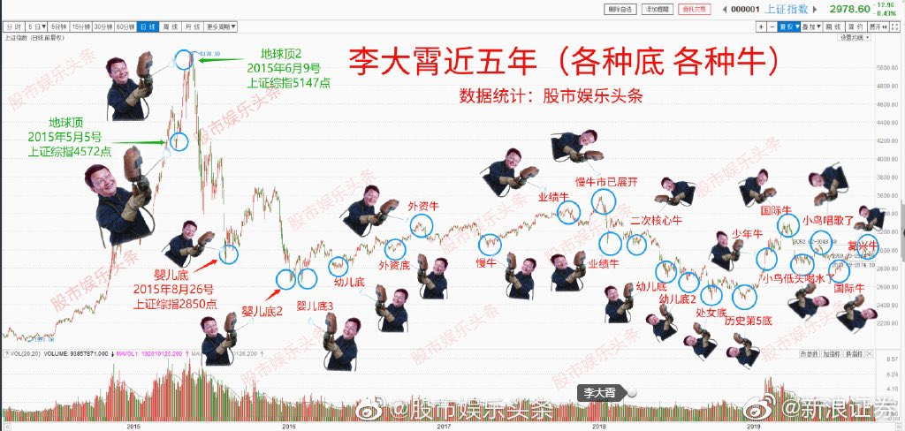

[11月18日 09:45]    新闻大吐槽   @TuCaoFakeNews    今天的香港就是明天的台湾，就是后天的美国，在之后就是红色中国统治世界了。  :speech_balloon:评:0 :+1:赞:2 :globe_with_meridians:转:1  

[11月18日 09:43]    新闻大吐槽   @TuCaoFakeNews    香港人一定要團結救孩子們，救香港人的希望同未來 https://twitter.com/tucaofakenews/status/1196121934045437952 …  :speech_balloon:评:0 :+1:赞:4 :globe_with_meridians:转:1  

[11月18日 09:42]    新闻大吐槽   @TuCaoFakeNews    做一些 T 恤， 写着 支持香港，SOS 香港！让每个人穿出去  :speech_balloon:评:0 :+1:赞:2 :globe_with_meridians:转:1  

[11月18日 09:40]    BBC News 中文   @bbcchinese    你知道吗，原来塑料袋起初是一项环保的工具！ https://www.youtube.com/watch?v=lYov-B7UC5k …  :speech_balloon:评:5 :+1:赞:4 :globe_with_meridians:转:3  

[11月18日 09:39]    新闻大吐槽   @TuCaoFakeNews    此次反赤納粹極權抗爭，令香港三代人都會仇恨中國共產黨，更加促成香港人同仇敵愾，最終成功爭取獨立！  :speech_balloon:评:1 :+1:赞:7 :globe_with_meridians:转:2  

[11月18日 09:37]    新闻大吐槽   @TuCaoFakeNews    莫斯科不相信眼淚
請行動起來 與香港市民一起 與天下的不公不義決戰  :speech_balloon:评:0 :+1:赞:6 :globe_with_meridians:转:1  

[11月18日 09:27]    新闻大吐槽   @TuCaoFakeNews    剛剛看了直播，尖沙咀有數十人被捕，全部被共匪要求聚集坐在地上，同時理大還有大量人員被困，學生退守校內，如果今天還不能突圍，將會有大量的人員被捕，這對抗爭運動將是重挫!  :speech_balloon:评:0 :+1:赞:7 :globe_with_meridians:转:1  

[11月18日 09:25]    新闻大吐槽   @TuCaoFakeNews    魔鬼一样的政府，恶魔一样的警察。他们的人性都已经泯灭了。  :speech_balloon:评:0 :+1:赞:6 :globe_with_meridians:转:2  

[11月18日 09:24]    新闻大吐槽   @TuCaoFakeNews    栽赃嫁祸无恶不作！谁是真暴徒？ https://twitter.com/tucaofakenews/status/1160947477274484736 …  :speech_balloon:评:0 :+1:赞:8 :globe_with_meridians:转:1  

[11月18日 09:23]    财经真相   @caijingxiang    因油价上涨爆发的抗议活动愈加激烈，截止刚刚过去的周末，伊朗国内抗议活动已蔓延至上百座城镇。而与此同时，当地时间17日，伊朗最高领袖哈梅内伊表示支持油价上涨，同时他还呼吁政府防止其他商品价格上涨。并将国内抗议归咎于伊朗的“外敌”，称蓄意破坏和纵火是流氓所为，不是伊朗的人民所为；  :speech_balloon:评:6 :+1:赞:43 :globe_with_meridians:转:15  

[11月18日 09:23]    新闻大吐槽   @TuCaoFakeNews    这是愤怒的 呐喊声 https://twitter.com/TuCaoFakeNews/status/1196173135667576832 …  :speech_balloon:评:0 :+1:赞:8 :globe_with_meridians:转:3  

[11月18日 09:11]    新闻大吐槽   @TuCaoFakeNews    HK police are crazy https://twitter.com/tucaofakenews/status/1195960230871351296 …  :speech_balloon:评:0 :+1:赞:7 :globe_with_meridians:转:3  

[11月18日 09:07]    新闻大吐槽   @TuCaoFakeNews    得道多助、失道寡助。  :speech_balloon:评:0 :+1:赞:2 :globe_with_meridians:转:1  

[11月18日 09:04]    新闻大吐槽   @TuCaoFakeNews    这个权是谁给的，这个时候全体香港人应尽可能的觉悟起来，以非暴力不合作的方式声援学生们，力求减少牺牲，争取更多正义力量的支持！默默的祝福你们！  :speech_balloon:评:1 :+1:赞:12 :globe_with_meridians:转:1  

[11月18日 09:04]    新闻大吐槽   @TuCaoFakeNews    这帮黑警有个屁的生杀大权

这帮人渣就是手里有枪! https://twitter.com/TuCaoFakeNews/status/1196228310499414016 …  :speech_balloon:评:0 :+1:赞:11 :globe_with_meridians:转:2  

[11月18日 09:00]    新闻大吐槽   @TuCaoFakeNews    这个要告诉 @zhiyongxu ，让 @zhiyongxu 鉴定一下，或许是暴徒把医务人员反铐双手的。 https://twitter.com/tucaofakenews/status/1196118674773463040 …  :speech_balloon:评:0 :+1:赞:6 :globe_with_meridians:转:2  

[11月18日 08:56]    新闻大吐槽   @TuCaoFakeNews     https://twitter.com/tucaofakenews/status/1196228310499414016 …  :speech_balloon:评:0 :+1:赞:6 :globe_with_meridians:转:6  

[11月18日 08:55]    新闻大吐槽   @TuCaoFakeNews    希望經過「中大」和「理大」危機之後，香港的抗議者和學生吸取教訓，我不建議使用這種固守模式，面對嚴重不對等的武力，這次理大的固守在大量共匪的車輪戰和包圍下，失敗是必然的，共匪只是通過發射催淚彈和使用水炮車及裝甲車間歇性的進攻，抗議者比他們更累，還是使用遍地開花的方式，累死這些畜生  :speech_balloon:评:2 :+1:赞:18 :globe_with_meridians:转:4  

[11月18日 08:54]    新闻大吐槽   @TuCaoFakeNews    今天着推特,特别想哭! https://twitter.com/TuCaoFakeNews/status/1196228310499414016 …  :speech_balloon:评:5 :+1:赞:30 :globe_with_meridians:转:5  

[11月18日 08:54]    新闻大吐槽   @TuCaoFakeNews    中共納粹的黨衛軍會有人性嗎？ https://twitter.com/TuCaoFakeNews/status/1196228310499414016 …  :speech_balloon:评:1 :+1:赞:8 :globe_with_meridians:转:3  

[11月18日 08:49]    新闻大吐槽   @TuCaoFakeNews     https://twitter.com/TuCaoFakeNews/status/1196228310499414016 …  :speech_balloon:评:0 :+1:赞:11 :globe_with_meridians:转:6  

[11月18日 07:20]    新闻大吐槽   @TuCaoFakeNews    速龙小队冲进理工大学之后 https://twitter.com/eyepressnews/status/1196199186133159936 …  :speech_balloon:评:3 :+1:赞:49 :globe_with_meridians:转:53  

[11月18日 04:31]    老司机   @h5lpykl7tp6jjop    日本第一任天皇就是徐福!中国拿出十大铁证，请问怎么解释遗传基因？

最先将徐福与日本联系在一起的是清代学者黄遵宪,1950年我国学者卫挺生在香港出版了《徐福入日本建国考》全面论证了徐福与神武天皇的神秘联系,综合起来,有十点符合。  :speech_balloon:评:1 :+1:赞:5 :globe_with_meridians:转:3  

[11月18日 03:59]    老司机   @h5lpykl7tp6jjop    智利民众反政府示威奇招 雷射光笔打下无人机
智利反政府示威，就有大批示威者，同步使用雷射光笔，对准照射一架政府无人机，没想到这架无人机，还真的感应失灵，失控坠地，只见夜空中，好几道绿色光束，全都对准一个点，没过多久，这台无人机，真的慢慢失控往下降，最后坠落地面，现场民众响起一阵欢呼  :speech_balloon:评:0 :+1:赞:30 :globe_with_meridians:转:5  

[11月18日 03:50]    老司机   @h5lpykl7tp6jjop    口头上狠，肚子却咕咕叫，
美国农业部的周度出口销售报告显示，截至11月7日当周，中国买家订购了760,527吨美国大豆。美国出口商还向中国付运了693,527吨大豆。
中国是本周美国大豆的最大买家，占周销售总量125.6万吨的61%。美国通常是秋季向中国出口大豆最多的国家，这段时间农民收割大豆，供应充足。  :speech_balloon:评:0 :+1:赞:9 :globe_with_meridians:转:2  

[11月18日 03:43]    老司机   @h5lpykl7tp6jjop    香港最新民调：暴力升级，当局难辞其咎  :speech_balloon:评:0 :+1:赞:5 :globe_with_meridians:转:2  

[11月18日 03:22]    老司机   @h5lpykl7tp6jjop    丧心病狂！局势明显升级 市民指控港警配备国际禁用“空尖弹”  :speech_balloon:评:0 :+1:赞:17 :globe_with_meridians:转:12  

[11月18日 02:39]    老司机   @h5lpykl7tp6jjop    11月17日星期日抗议者在香港理工大学与警察对峙，用弓箭和燃烧瓶阻止警方进入校园。警方发出严厉的警告称“理工大学一带的暴力行为已达暴乱程度“，并警告任何协助者都可能”犯暴动罪”。香港学校已停课多日，包括理工大学在内有5所大学被示威者占领。 https://www.voachinese.com/a/hong-kong-protesters-bows-arrows-hong-kong-polytechnic-university-riots-20191117/5169408.html …  :speech_balloon:评:53 :+1:赞:176 :globe_with_meridians:转:107  

[11月18日 01:50]    GFHG SDKM   @zyx_yny    #HongKongPolice LIAR #PolyU https://twitter.com/rthk_enews/status/1196095976982712320 …  :speech_balloon:评:0 :+1:赞:0 :globe_with_meridians:转:1  

[11月18日 01:47]    GFHG SDKM   @zyx_yny    #Tiananmen2019 https://twitter.com/usssnonichijyou/status/1196072466457645056 …  :speech_balloon:评:0 :+1:赞:1 :globe_with_meridians:转:2  

[11月18日 01:44]    GFHG SDKM   @zyx_yny    No #Tiananmen2019 is gonna happen again. We shall save #HongKong and #PolyU https://twitter.com/ofarry/status/1196121537859870720 …  :speech_balloon:评:0 :+1:赞:2 :globe_with_meridians:转:1  

[11月18日 01:42]    GFHG SDKM   @zyx_yny    #PolyU https://twitter.com/zyx_yny/status/1196119527563522048 …  :speech_balloon:评:0 :+1:赞:0 :globe_with_meridians:转:1  

[11月18日 01:41]    GFHG SDKM   @zyx_yny    #PolyU https://twitter.com/demosisto/status/1196103027632984065 …  :speech_balloon:评:0 :+1:赞:0 :globe_with_meridians:转:1  

[11月18日 01:37]    GFHG SDKM   @zyx_yny    Save us!!!! The police are trying to kill us with rifles. They arrested all reporters and first aiders to stop them from telling the world what's happening. Please spread this out or the pic you see will be our bodies.... #PolyU  :speech_balloon:评:0 :+1:赞:30 :globe_with_meridians:转:35  

[11月18日 01:32]    GFHG SDKM   @zyx_yny    #HongKong citizens drove their cars to #PolyU waiting to pick up protesters and help them evacuate from the campus.

...then #HongKongPolice shot tear gas at them.

While we should never get used to this kind of atrocities, it's totally unsurprising in #HongKong now.  https://twitter.com/antd/status/1196112411746422786 …  :speech_balloon:评:53 :+1:赞:1153 :globe_with_meridians:转:1317  

[11月18日 01:27]    GFHG SDKM   @zyx_yny    We must stand with them. I know it is difficult, but they have taken a stand for freedom against insurmountable odds. We must make the CCP pay. They cannot get away with another Tiananmen. And pray. https://twitter.com/yexu123/status/1196113583073103872 …  :speech_balloon:评:282 :+1:赞:2476 :globe_with_meridians:转:1691  

[11月18日 01:24]    老司机   @h5lpykl7tp6jjop    剛才，胡錫進公開呼籲應該允許香港警察用真槍實彈鎮壓。這是迄今為止中共釋放的最清晰的大屠殺信號！ https://twitter.com/HuXijin_GT/status/1196109871784984576 …  :speech_balloon:评:88 :+1:赞:606 :globe_with_meridians:转:379  

[11月18日 01:23]    BBC News 中文   @bbcchinese    11月17日，香港理工大学附近全日不断爆发冲突。晚上时分，校园附近有行人天桥起火，期间曾传出爆炸声，而警方一辆装甲车被汽油弹击中起火。  :speech_balloon:评:93 :+1:赞:265 :globe_with_meridians:转:116  

[11月18日 01:15]    GFHG SDKM   @zyx_yny    Medical volunteers arrested in 00:40

#SOSHK
#StandwithHK
#ProtectHKStudents
#HKPoliceBrutality  :speech_balloon:评:0 :+1:赞:15 :globe_with_meridians:转:9  

[11月18日 01:07]    GFHG SDKM   @zyx_yny    Following which two police accosted one motorist, pointing their rifle at him.  :speech_balloon:评:19 :+1:赞:458 :globe_with_meridians:转:445  

[11月18日 01:07]    GFHG SDKM   @zyx_yny    These people in uniform are the real rioters and terrorists.  :speech_balloon:评:0 :+1:赞:38 :globe_with_meridians:转:2  

[11月18日 01:06]    GFHG SDKM   @zyx_yny    When the protesters were chased by the police across Salisbury Rd. where all the “school bus” cars are backed up waiting to ferry protesters, all the cars started tooting their horns to distract the police.  :speech_balloon:评:34 :+1:赞:1001 :globe_with_meridians:转:829  

[11月18日 01:05]    GFHG SDKM   @zyx_yny    A HK cop’s idea of a laugh, taunting trapped PolyU protesters from a bridge, we’ve got you now, he says, and chuckles with his mates, to which a protester shouts back, try coming here and saying that without your weapons #HK #HongKongProtests #StandWithHongKong  :speech_balloon:评:151 :+1:赞:1647 :globe_with_meridians:转:1726  

[11月18日 01:05]    GFHG SDKM   @zyx_yny    [0100] This is the Kowloon Peninsula of #HongKong now.

*Red star = #PolyU*

Thousands of Hong Kongers are on the streets now, trying to alleviate the pressure on the protesters in #PolyU.

#HongKongPolice defend & block every road to #PolyU.

This is a very tense moment. #SOSHK  :speech_balloon:评:4 :+1:赞:188 :globe_with_meridians:转:219  

[11月18日 01:01]    GFHG SDKM   @zyx_yny    If justice is really existed, we #HKers need you to visit us now. Once!

#DonaldTrump
#greaterbritain
#savehongkong  :speech_balloon:评:6 :+1:赞:190 :globe_with_meridians:转:167  

[11月18日 01:00]    GFHG SDKM   @zyx_yny    A group of doctors, nurse and first-aiders got arrested after they left HK PolyU.
一群醫生護士跟急救人員在離開香港理工大學後被捕.
HK PolyU를 떠난 후 의사, 간호사 및 응급 처치 자 그룹이 체포되었습니다.
 #SOSHK #StandWithHongKong #홍콩
#홍콩시위 #SOSPolyU #光復香港時代革命  :speech_balloon:评:12 :+1:赞:433 :globe_with_meridians:转:505  

[11月18日 00:48]    GFHG SDKM   @zyx_yny    [Spread] Special Tactical Squads are holding ArmaLite AR-15 with live ammunition only!
大家搵方法share呢條片出去，速龍全部揸住AR15步槍，只有實彈。
#HKPolice #HongKongProtesters  :speech_balloon:评:29 :+1:赞:694 :globe_with_meridians:转:814  

[11月18日 00:41]    墙国铁拳现世报😷   @Socialistfist    推荐一些启发小编开办《墙国铁拳现世报》的parody或自媒体推号：
中国民调@PollChina 
新蛤社@XinHaNewsAgency
推特小红旗@Xhnsoc__Redflag
共青团中央 (学习小组）@CPCYouthLeague
乳透社@Ruters0615 
胡锡进（流亡）@HuXijin_huaiqiu
LIFETIME 視界@LifetimeUSCN
不分先后，欢迎推荐后续补充  :speech_balloon:评:8 :+1:赞:90 :globe_with_meridians:转:15  

[11月18日 00:20]    GFHG SDKM   @zyx_yny    And today I present to you the most ridiculous oxymoron: “necessary minimum force” and “live ammunition” https://twitter.com/rthk_enews/status/1196099679408144386 …  :speech_balloon:评:33 :+1:赞:964 :globe_with_meridians:转:804  

[11月18日 00:04]    GFHG SDKM   @zyx_yny    #polyu US minister from US State Dept trying to get someone with the US consulate to call l police to negotiate over the protesters.  :speech_balloon:评:41 :+1:赞:634 :globe_with_meridians:转:549  

[11月18日 00:00]    老司机   @h5lpykl7tp6jjop    自由不是谁赏赐的，自由是天赋的。人，一旦失去了自由，就意味着沦为了奴隶。因此自由绝不允许任何组织或个人的侵犯，任何个人或组织若胆敢侵犯人的自由就必须用鲜血和生命捍卫。这是上天赋予给每一个人的天赋人权，也只有敢于用生命去相搏的人，才会有真正意义上的自由。  :speech_balloon:评:22 :+1:赞:369 :globe_with_meridians:转:176  

[11月17日 23:00]    纽约时报中文网   @nytchinese    #一周热门 如果能亲手摸到月球，那会是种什么感觉？ http://nyti.ms/2rJc7ZV   :speech_balloon:评:3 :+1:赞:11 :globe_with_meridians:转:0  

[11月17日 21:00]    纽约时报中文网   @nytchinese    #一周热门 1973年，美国媒体是如何报道水门事件听证会的 http://nyti.ms/2KfOpe6   :speech_balloon:评:2 :+1:赞:19 :globe_with_meridians:转:8  

[11月17日 19:52]    GFHG SDKM   @zyx_yny    The regime and the #HongKongPolice has put nearly ALL Hongkongers in danger, regardless of what side you stand on.

#HongKongProtest
#SOSHongKong
@SolomonYue
@marcorubio  :speech_balloon:评:4 :+1:赞:229 :globe_with_meridians:转:267  

[11月17日 19:25]    财经真相   @caijingxiang    11月15日下午，山东省委常委、青岛市委书记王清宪：“谁不敢支持民营经济，就是对自己做到“亲”“清”政商关系没有信心，就是对自己的党性没有信心。”  :speech_balloon:评:24 :+1:赞:127 :globe_with_meridians:转:28  

[11月17日 19:18]    BBC News 中文   @bbcchinese    “解放军出来，是告诉大家，虽然现在不需要解放军介入香港示威，但不代表没有可能性。”有香港学者分析说。 https://trib.al/p816ndT   :speech_balloon:评:147 :+1:赞:248 :globe_with_meridians:转:84  

[11月17日 19:00]    纽约时报中文网   @nytchinese    #时报专栏 乔布斯是对的：手机和iPad杀死了个人电脑 http://nyti.ms/2CItf4f   :speech_balloon:评:31 :+1:赞:34 :globe_with_meridians:转:4  

[11月17日 18:00]    纽约时报中文网   @nytchinese    这篇报道揭示了泄露的中国政府文件如何详细说明了该国对新疆穆斯林和少数民族的镇压。欢迎阅读本文中文版： http://nyti.ms/2KIKAi3   :speech_balloon:评:46 :+1:赞:85 :globe_with_meridians:转:31  

[11月17日 17:39]    老司机   @h5lpykl7tp6jjop    香港的上一代銀髮族中，有不少人是偷渡過來的！
人世間的無奈與不幸都發生了，沒想到辛苦了一輩子，到老了，當年的魔鬼又追殺過來了，要殺他們的孩子！  :speech_balloon:评:79 :+1:赞:1150 :globe_with_meridians:转:664  

[11月17日 17:23]    老司机   @h5lpykl7tp6jjop    据前线消息，港共傀儡政权已经在前线部署了声波武器，来对付示威者。
声波武器具有很强的杀伤性，Sonic weapon就是利用声音对目标造成杀伤或干扰的武器。直到人们死伤或丧失战斗力。而且武器也有层级和使用级别，目前不清楚他们准备使用哪个级别?
这是国外对示威者使用的一次轻量级的视频!给大家预警!  :speech_balloon:评:43 :+1:赞:627 :globe_with_meridians:转:573  

[11月17日 17:19]    BBC News 中文   @bbcchinese    中国留学生说，如果你不了解中国或者香港就没有资格在这个问题上发言。但有的韩国学生不这么认为。 https://trib.al/3K0Y9sV   :speech_balloon:评:336 :+1:赞:592 :globe_with_meridians:转:229  

[11月17日 17:04]    老司机   @h5lpykl7tp6jjop    WTF popo please don’t come out again to disturb us, indiscriminate use of pepper bombs, you guys are fucking disgusting
Source from FB at Tai Po
#HKPoliceTerrorism #hkpolicestate #HKPoliceMurderers #disbandhkpolice  :speech_balloon:评:80 :+1:赞:1428 :globe_with_meridians:转:1657  

[11月17日 17:00]    纽约时报中文网   @nytchinese    #一周热门 森林火灾肆虐，澳大利亚考拉面临死亡威胁 http://nyti.ms/357ejJg   :speech_balloon:评:3 :+1:赞:5 :globe_with_meridians:转:4  

[11月17日 15:02]    BBC News 中文   @bbcchinese    【一周热点回顾】据报有中国人在内的26名富豪投资者及家属的护照被塞浦路斯政府收回。 https://bbc.in/2NQoNGY   :speech_balloon:评:20 :+1:赞:139 :globe_with_meridians:转:52  

[11月17日 15:00]    纽约时报中文网   @nytchinese    #一周热门 为什么周围的人看起来都比你有钱？ http://nyti.ms/36Tbq0b   :speech_balloon:评:3 :+1:赞:16 :globe_with_meridians:转:10  

[11月17日 13:53]    BBC News 中文   @bbcchinese    中国每年产生超过两亿吨城市垃圾，西安最大填埋场比原计划提前了25年被装满，当地开始寻求其它方式处理垃圾。 https://trib.al/ZfE6omO   :speech_balloon:评:59 :+1:赞:130 :globe_with_meridians:转:48  

[11月17日 13:26]    纽约时报中文网   @nytchinese    《纽约时报》获得了403页中国政府文件，它们显示了官员们如何秘密策划在新疆的镇压并为其正当性辩护，即使他们在公开场合淡化这一问题。
这是几十年来中国共产党内部最重大的泄密事件之一。 http://nyti.ms/2KIKAi3   :speech_balloon:评:410 :+1:赞:1447 :globe_with_meridians:转:836  

[11月17日 13:08]    纽约时报中文网   @nytchinese    这篇文章揭示了泄露的中国政府文件如何详细说明了该国对新疆穆斯林和少数民族的镇压，欢迎阅读本文中文版： http://nyti.ms/2KIKAi3 https://twitter.com/nytimes/status/1195889292893130752 …  :speech_balloon:评:44 :+1:赞:130 :globe_with_meridians:转:67  

[11月17日 13:02]    BBC News 中文   @bbcchinese    【一周热点回顾】中央出台16项“惠港”新政策，香港居民可以不受限到大湾区城市买楼。这些措施能能否缓解香港激烈的抗争运动，你怎么看？ https://bbc.in/2CIrnZk   :speech_balloon:评:87 :+1:赞:46 :globe_with_meridians:转:23  

[11月17日 13:00]    纽约时报中文网   @nytchinese    #一周热门 #摩登情爱 我的婚姻是场网球赛 http://nyti.ms/2NLE8sw   :speech_balloon:评:2 :+1:赞:5 :globe_with_meridians:转:1  

[11月17日 12:00]    纽约时报中文网   @nytchinese    #图集【在美国，55万美元能买到什么房？】手握55万美元，你能买到明尼苏达州圣保罗摄政复兴风格的公寓，或伯克郡一间净零能源住宅，也可以选择印第安纳州布卢明顿的梁柱结构房屋。
点击查看图集： http://nyti.ms/2OivGzP   :speech_balloon:评:13 :+1:赞:30 :globe_with_meridians:转:8  

[11月17日 11:02]    BBC News 中文   @bbcchinese    【一周热点回顾】围绕女性性器官存在和流传着许多误解。美国妇产科医生珍·冈特（Dr.Jen Gunter)在北美行医25年。她的新书《阴道圣经》（The Virginal Bible）为女性提供许多实用性建议，在这里我们为你总结5条。 https://bbc.in/32M3UAV   :speech_balloon:评:12 :+1:赞:65 :globe_with_meridians:转:33  

[11月17日 11:00]    纽约时报中文网   @nytchinese    #一周热门 #摩登情爱  他让我想起爸爸，我们约会了 http://nyti.ms/2CD43ft   :speech_balloon:评:3 :+1:赞:9 :globe_with_meridians:转:3  

[11月17日 10:00]    纽约时报中文网   @nytchinese    在持续整夜的航班上，大多数航空公司会马上为乘客提供饮食，然后把灯打开，但是这一次，我们要开灯6个多小时，直到纽约时间的半夜。
除此之外，航班会向我们提供辣味的晚餐，曾担任飞机上的时差顾问的认知心理学家卡罗尔教授说，这就像“把人打醒的一记耳光。” http://nyti.ms/2rOIxCt   :speech_balloon:评:3 :+1:赞:10 :globe_with_meridians:转:2  

[11月17日 09:00]    BBC News 中文   @bbcchinese    【一周热点回顾】为什么这些国家的污染比世界制造大国——中国的情况还要严重呢？ https://bbc.in/2Xn6zjt   :speech_balloon:评:58 :+1:赞:43 :globe_with_meridians:转:17  

[11月17日 09:00]    纽约时报中文网   @nytchinese    #一周热门 #时报内情 在今日中国，经济已成为一个敏感话题 http://nyti.ms/2X3UIXs   :speech_balloon:评:62 :+1:赞:77 :globe_with_meridians:转:22  

[11月17日 08:00]    纽约时报中文网   @nytchinese    环保人士估计，生活在该地区的近700只考拉中有350只已经死亡。截至周四，有22只成年考拉和一只幼年考拉获救。
它们和其他几十种动物一起在考拉医院接受治疗，包括被狗袭击或因车祸受伤的袋鼠和负鼠——这通常是受灾后寻找新家时遭遇的附带伤害。 http://nyti.ms/357ejJg   :speech_balloon:评:2 :+1:赞:4 :globe_with_meridians:转:2  

[11月17日 07:00]    纽约时报中文网   @nytchinese    #一周热门 #观点 习近平执政第二季：完美极权登 http://nyti.ms/2ObRZaz   :speech_balloon:评:48 :+1:赞:101 :globe_with_meridians:转:31  

[11月17日 05:48]    老司机   @h5lpykl7tp6jjop    習近平在巴西發出鎮壓令之後，周六香港發生兩件詭吊的事：1）中共駐港軍隊未經香港政府許可“自發”到街頭清障。這夥駐港軍人穿著“特戰八連”背心，故意傳遞特戰隊番號，恐嚇意味甚濃。2）林鄭月娥的行爲更加詭吊，周六晚乘夜色，港府用巨石封堵了香港中文大學的出口二號橋。這顯然是圍剿校園前奏。  :speech_balloon:评:130 :+1:赞:1256 :globe_with_meridians:转:846  

[11月17日 05:00]    纽约时报中文网   @nytchinese    #一周热门 世界银行缩减新疆贷款项目规模 http://nyti.ms/33OmHx3   :speech_balloon:评:9 :+1:赞:48 :globe_with_meridians:转:13  

[11月17日 04:42]    老司机   @h5lpykl7tp6jjop    两名德国男子在港被捕 原因竟是...
香港警方当地时间14日晚拘捕两名外籍男子，涉嫌非法集结和违反《禁止蒙面规例》。法新社16日的报道表示，这两名被捕的外籍男子是在香港的德国留学生。香港警方今日发给环球时报-环球网记者的声明证实被捕外籍男子是“德国籍”，屯门重案一队正在调查”。  :speech_balloon:评:0 :+1:赞:38 :globe_with_meridians:转:11  

[11月17日 02:35]    老司机   @h5lpykl7tp6jjop    鼠疫患者急救现场画面曝光 医院通知细思极恐
鼠疫疑已扩散中国4省市 多人感染有儿童死亡
官方极力封锁消息 多名北京医生披露内情
 https://yanmingshiping.blogspot.com/2019/11/4_16.html …  :speech_balloon:评:3 :+1:赞:30 :globe_with_meridians:转:27  

[11月17日 00:25]    老司机   @h5lpykl7tp6jjop    今日的悔悟似乎有点晚。看从前，台湾是公民社会，公共事务参与比例高；香港是平民社会，多数只管赚钱不问政事；大陆根本就是个奴隶社会，不闻不问任由主子宰杀！  :speech_balloon:评:4 :+1:赞:29 :globe_with_meridians:转:15  

[11月17日 00:18]    BBC News 中文   @bbcchinese    11月16日，香港政府新闻处代中国解放军驻香港部队发出新闻稿，回应有解放军驻香港部队离开军营清理路障一事。  :speech_balloon:评:149 :+1:赞:192 :globe_with_meridians:转:57  

[11月16日 23:38]    老司机   @h5lpykl7tp6jjop    【20191114】15時頃セントラル(中環)で、 #香港警察 がフラッシュモブ形式の抗議活動を行っている民衆を強制排除中、取材中の記者が押し倒され、携帯もカメラも壊された。  :speech_balloon:评:17 :+1:赞:533 :globe_with_meridians:转:607  

[11月16日 23:00]    纽约时报中文网   @nytchinese    #一周热门 香港抗议者背后的志愿者大军 http://nyti.ms/32Cy1ee   :speech_balloon:评:104 :+1:赞:84 :globe_with_meridians:转:21  

[11月16日 22:00]    纽约时报中文网   @nytchinese    边走路边看手机有多危险，以及你该如何控制自己 http://nyti.ms/2Xf8bMh   :speech_balloon:评:1 :+1:赞:2 :globe_with_meridians:转:2  

[11月16日 21:54]    老司机   @h5lpykl7tp6jjop    #香港旺角11月16日 21：25 #旺角 朗豪坊附近，大量緑衣警察包圍一個女士，突然用力推她倒地，搜完身女士獲放行
#黑警濫暴
#HongKongPoliceTerrorism
#SOSHongKong  :speech_balloon:评:7 :+1:赞:92 :globe_with_meridians:转:102  

[11月16日 21:00]    纽约时报中文网   @nytchinese    #一周热门 接触还是遏制？九位中国专家谈美国对华政策 http://nyti.ms/34WsGjt   :speech_balloon:评:60 :+1:赞:19 :globe_with_meridians:转:12  

[11月16日 20:58]    BBC News 中文   @bbcchinese    美中争当世界头号人工智能（AI）大国，竞赛结果难以预测，或需机器人来帮忙。 https://bbc.in/2Ql11EN   :speech_balloon:评:14 :+1:赞:24 :globe_with_meridians:转:8  

[11月16日 19:00]    纽约时报中文网   @nytchinese    #一周热门 图集：大学校园成香港抗议最新阵地 http://nyti.ms/2pd93nT   :speech_balloon:评:12 :+1:赞:28 :globe_with_meridians:转:14  

[11月16日 18:18]    财经真相   @caijingxiang    现在距离12月15号,还有四周时间，如果下周结束之前，双方再不公布两国具体签协议是具体时间表，基本上宣布本轮谈判再次破裂，因为目前双方元首根本没有会面的时间表，所谓伦敦峰会还只是停留在媒体猜测层面，没有得到官方确认，库德罗周五表示，第一阶段协议签订不需要双方元首会面签字，就是铺垫！  :speech_balloon:评:3 :+1:赞:85 :globe_with_meridians:转:19  

[11月16日 18:11]    财经真相   @caijingxiang    美国总统特朗普上周五在白宫对记者表示，他尚未决定取消已经加征的对华关税。
随后，特朗普上周六在马里兰州安德鲁斯联合基地表示，美中两国贸易谈判取得很好的进展。但是慢，“对我来说太慢”。特朗普对记者表示，谈判进行顺利。不过，他也强调，愿意达成协议，但是协议必须符合美方设想。  :speech_balloon:评:7 :+1:赞:99 :globe_with_meridians:转:16  

[11月16日 18:05]    墙国铁拳现世报😷   @Socialistfist    小编要郑重警告刘女士，国家是有寻衅滋事和煽动颠覆这些国民待遇的。

#社会主义铁拳  :speech_balloon:评:88 :+1:赞:683 :globe_with_meridians:转:200  

[11月16日 18:00]    BBC News 中文   @bbcchinese    姜、蒜、橙子、柚子，这和癌症有什么关系？欧洲专家警告，癌症治疗期间慎用这些产品辅助制品。 https://bbc.in/2Kr9imV   :speech_balloon:评:7 :+1:赞:49 :globe_with_meridians:转:26  

[11月16日 17:30]    BBC News 中文   @bbcchinese    "有人认为，民主根本就是短视的，因此依靠'善良的独裁者'或许会更好，他们能够代表我们所有人，以长远的眼光看待人类面临的多重危机。"你怎么看？ https://bbc.in/33S3Gts   :speech_balloon:评:378 :+1:赞:350 :globe_with_meridians:转:113  

[11月16日 17:28]    老司机   @h5lpykl7tp6jjop    【不怕恐怖圖片，要讓世界知道，多少香港人民死在習近平匪幫的鐵蹄下！】
OMG!!!又有人“被自殺”
而家真係變左個翻版8964 ...
目擊者
發現地點係喺石硤尾嘅美映樓
發現時間係11月16號嘅凌晨12點05分

死得超級恐怖
係已經爆頭  :speech_balloon:评:94 :+1:赞:183 :globe_with_meridians:转:203  

[11月16日 17:00]    BBC News 中文   @bbcchinese    持续了5个多月的香港抗议，至今仍然没有平息的迹象，对香港的政治、经济和社会造成了哪些影响？ https://bbc.in/2CLQavt   :speech_balloon:评:47 :+1:赞:70 :globe_with_meridians:转:23  

[11月16日 15:01]    BBC News 中文   @bbcchinese    【一周热点回顾】美国可能无法阻挡中国经济崛起，只有中国自己失误才能阻挡这个进程。习近平治下中国有可能走上勃列日涅夫的老路。 https://bbc.in/2NNeV0B   :speech_balloon:评:96 :+1:赞:106 :globe_with_meridians:转:38  

[11月16日 13:02]    BBC News 中文   @bbcchinese    【一周热点回顾】14世纪时，鼠疫横扫欧洲，夺走三分之一人的生命。时过境迁...... https://bbc.in/355PdKw   :speech_balloon:评:71 :+1:赞:143 :globe_with_meridians:转:63  

[11月16日 12:31]    老司机   @h5lpykl7tp6jjop    證據確鑿，黑警恐嚇市民：「小心被消失」

推爆佢！  :speech_balloon:评:52 :+1:赞:900 :globe_with_meridians:转:968  

[11月16日 10:25]    财经真相   @caijingxiang    中国人民银行：按照“因城施策”的基本原则，落实房地产长效管理机制，不将房地产作为短期刺激经济的手段。如果真心控制房价，十年前就做了，现在不是想怎样控制房价，而是已经无力放更多的货币，继续推高房价；如果还能再大涨一波，也就不会有现在的财政赤字、中小银行遭到挤兑的困境了！  :speech_balloon:评:3 :+1:赞:78 :globe_with_meridians:转:16  

[11月16日 10:19]    财经真相   @caijingxiang    中国人民银行：正确看待央行资产负债表规模变化；当前，中国仍实施常态货币政策，法定准备金率是使用的主要政策工具之一。虽然中国人民银行资产规模增长放缓甚至可能下降，但降准放松了流动性约束，增大了货币创造能力，与国外央行量化宽松结束后一度进行的“缩表”有本质区别。找不到足够的抵押物！  :speech_balloon:评:6 :+1:赞:82 :globe_with_meridians:转:21  

[11月16日 10:16]    BBC News 中文   @bbcchinese    美国众议院对总统特朗普的弹劾调查继续推进。前美国驻乌克兰大使约瓦诺维奇作证时，特朗普实时发表推文，两人展开隔空辩论。 https://bbc.in/2Xgij7q   :speech_balloon:评:15 :+1:赞:26 :globe_with_meridians:转:11  

[11月16日 10:12]    财经真相   @caijingxiang    发改委副秘书长高杲16日透露，根据全国PPP监测服务平台数据，截至11月初，各地正在推进的PPP项目近7000个，总投资约9万亿元人民币。其中城市基础设施、农林水利、社会事业、交通运输、生态环保五大领域占全部项目个数和总投资规模比重均接近90%。  :speech_balloon:评:2 :+1:赞:64 :globe_with_meridians:转:17  

[11月16日 10:05]    财经真相   @caijingxiang    这次规模应该会超过以往，国内的小心！  :speech_balloon:评:34 :+1:赞:350 :globe_with_meridians:转:170  

[11月16日 09:02]    BBC News 中文   @bbcchinese    【一周热点回顾】香港中文大学校内多处黑烟四起，示威者与防暴警察在校内二号桥对峙。有示威者向警方投掷砖头、汽油弹等物体。警方发射催泪弹、橡胶子弹，并用水炮车发射蓝色催泪剂驱散人群。校长段崇智和前校长沈祖尧先后到场调停，均遭遇催泪弹。 https://bbc.in/378XTld   :speech_balloon:评:95 :+1:赞:236 :globe_with_meridians:转:90  

[11月15日 20:31]    BBC News 中文   @bbcchinese    意大利著名水上城市威尼斯遭遇半世纪以来最大水灾。全城80%被淹，损失严重。如何保护世界遗产和古迹是人类面临的最大挑战之一。 https://bbc.in/340pMdv   :speech_balloon:评:28 :+1:赞:69 :globe_with_meridians:转:34  

[11月15日 20:30]    BBC News 中文   @bbcchinese    有网民将其比喻为即时战略游戏中的攻击手段，认为学生的技术已经“进化”，进入“帝王时代”（游戏的术语）。但示威者的一些手法也引发争议和批评。 https://www.bbc.com/zhongwen/simp/chinese-news-50429383 …  :speech_balloon:评:99 :+1:赞:103 :globe_with_meridians:转:34  

[11月15日 16:28]    财经真相   @caijingxiang    随着贸易战的深入，华强北也受到了巨大冲击，特朗普不断上调的关税尚不足以构成致命伤害，真正的要命之处是美国终结的国际邮费优惠，对于一个手机壳来说，其单价还不如国际邮费贵，一但邮费优惠终结，其价格优势也将不复存在！  :speech_balloon:评:7 :+1:赞:135 :globe_with_meridians:转:18  

[11月15日 16:17]    老司机   @h5lpykl7tp6jjop    Dead bodies in black are found in the sea or in front of buildings every few hrs in HK. And cops here said they are all with no suspicion!
 https://www.facebook.com/groups/hkpfveryugly/permalink/2580460815381809?sfns=mo …
@SolomonYue #HongKongPoliceTerrorists #HongKongProtesters #StandWithHongKong #SOSHK #savehongkong  :speech_balloon:评:106 :+1:赞:758 :globe_with_meridians:转:943  

[11月15日 16:11]    财经真相   @caijingxiang    深圳之所以成为中国的创业之都，大部分归功于华强北，年轻的大学生不需要关系、资金，只需要一个网店，然后在华强北上千家工厂店里询价、穿梭，尽可能的找到最低批发价，以及最便宜的发快递方式，你就可以实现创业了。当然这里面也充满着心酸，正是中国权贵不屑于多繁琐低回报，才给了屌丝逆袭狭缝！  :speech_balloon:评:5 :+1:赞:146 :globe_with_meridians:转:22  

[11月15日 16:00]    财经真相   @caijingxiang    在过去20年里， 华强北是中国底层屌丝最容易创业逆袭的地方，在这里只要你足够勤奋，吃苦耐劳，善于在细微之处发现商机，你就可以实现人生逆袭，完全摆脱不上班就饿死的宿命！在炎炎夏日里一个人连夜就把八吨充电宝发往全国各地的类似故事每天都在上演！  :speech_balloon:评:4 :+1:赞:82 :globe_with_meridians:转:9  

[11月15日 15:51]    财经真相   @caijingxiang    华强北与香港一河之隔，这里东亚最大的手机配件集散地，它的货物远销世界，很多东南亚、香港、印度等地的商人都在此批发货物。每天都有大量香港店主乘坐地铁来此进货，可以说香港所有3c产品，都来自华强北以及依附它的几千家小工厂！持续的抗争运动已经开始波及到这里的产业链！  :speech_balloon:评:15 :+1:赞:167 :globe_with_meridians:转:42  

[11月15日 14:14]    财经真相   @caijingxiang    李大霄近五年的各种底！“现在已经是婴儿底，你们可以打我的脸了”！  :speech_balloon:评:22 :+1:赞:127 :globe_with_meridians:转:42  

[11月15日 14:06]    财经真相   @caijingxiang    14日，俄罗斯金融媒体RBC报道，金砖国家正在建立金砖国家之间的单一支付系统，也就是创建“金砖国家”的加密货币！  :speech_balloon:评:24 :+1:赞:208 :globe_with_meridians:转:64  

[11月15日 09:56]    财经真相   @caijingxiang    高息储蓄产品不属于中共三种不赔的范围！  :speech_balloon:评:10 :+1:赞:64 :globe_with_meridians:转:24  

[11月15日 09:43]    财经真相   @caijingxiang    库德洛称美国正制定减税计划,将在特朗普的第二个总统任期实施.该消息对美股短期内构成巨大支撑，美股不断创新高！  :speech_balloon:评:6 :+1:赞:115 :globe_with_meridians:转:41  

[11月15日 09:02]    财经真相   @caijingxiang    周五亚盘刚开始，美國國家經濟顧問庫德洛最新表示，“我們正接近與中國達成一項貿易協定”。庫德洛並指出，與中國的會談一直非常有建設性。消息公布后美股再度创新高、日元、黄金短线下跌，离岸人民币转涨！又是周五固定利好，这个“传说”中的第一阶段协议已经被说了N次，最扯淡的是每次市场都计价！  :speech_balloon:评:31 :+1:赞:260 :globe_with_meridians:转:59  

[11月15日 08:24]    墙国铁拳现世报😷   @Socialistfist    小编认为本月最佳铁拳，滋磁不滋磁啊？  :speech_balloon:评:37 :+1:赞:745 :globe_with_meridians:转:45  

[11月15日 08:21]    墙国铁拳现世报😷   @Socialistfist    面对大陆的善意，台大教授自信的进去了---亲中学者 施正屏
#社会主义铁拳  :speech_balloon:评:185 :+1:赞:1813 :globe_with_meridians:转:808  

[11月15日 01:50]    新闻大吐槽   @TuCaoFakeNews    香港理工大学中央食堂已经在学生手中正常运转，完美供应所有抗争者饮食！

很多孩子从没下过厨，甚至没洗过碗，抗争让他们一夕长大！  :speech_balloon:评:589 :+1:赞:3162 :globe_with_meridians:转:1101  

[11月15日 01:03]    墙国铁拳现世报😷   @Socialistfist    那必须和兄弟你平分啊，猪肉价格这么高  https://twitter.com/Dofuralanmingo/status/1194993538292826114 …  :speech_balloon:评:17 :+1:赞:206 :globe_with_meridians:转:11  

[11月14日 19:18]    财经真相   @caijingxiang    这种财富游戏，体现在央行层面，就是无法继续扩表，有价值的印钞已经没有了，现在甚至连农村宅基地和农田都允许抵押贷款，央行如果想继续扩大印钞，除了以高利息忽悠洋韭菜进来外，还有一条办法就是以行政命令，直接掠夺还未欠债的中产阶级，当这波掠夺完后，就只剩下无锚印钞一条路了！也是炼狱之路！  :speech_balloon:评:19 :+1:赞:246 :globe_with_meridians:转:59  

[11月14日 19:10]    财经真相   @caijingxiang    现在中共统治的危机根源是，央行想继续印钞，但是却找不到足够多的“承债人”，14亿底层屁民，通过过去20年加入WTO在血汗工厂赚的那几个铜板，已经被高房价掠夺的差不多了，政府财政收支也到了难以为继的地步；能够赚钱的基建项目也建的差不多了，剩下的都是亏钱的亏钱买卖，如果继续搞，财政根本罩不住  :speech_balloon:评:6 :+1:赞:234 :globe_with_meridians:转:49  

[11月14日 19:09]    墙国铁拳现世报😷   @Socialistfist    北京废青，危言耸听

#社会主义铁拳  :speech_balloon:评:62 :+1:赞:623 :globe_with_meridians:转:164  

[11月14日 19:02]    财经真相   @caijingxiang    中共权贵对中国人统治本质就是财富掠夺，这一最本质的游戏规则始终没有改变。只是统治方法变的更加高明，掠财方式更加隐蔽。以前是挂着刺刀直接强制征收，现在则是以金融变现殖民掠夺。这也是高干二代们大部分都玩金融根源。  :speech_balloon:评:3 :+1:赞:164 :globe_with_meridians:转:38  

[11月14日 18:36]    财经真相   @caijingxiang    中共基建没有钱，很多网友简单的认为开动印钞机就行，这其实是大错特错，中共央行印的每一分钱，都必须有对应的相应的价值才行，否则就是无锚印钞，汇率崩盘！过去20年央行印钞都是以债务为基础的。比如，房奴的房贷，当房奴申请贷款时，本质是向央行抵押了自己未来30年的劳动力。 https://twitter.com/aspeltuo8/status/1194923278646816768 …  :speech_balloon:评:51 :+1:赞:724 :globe_with_meridians:转:267  

[11月14日 01:30]    墙国铁拳现世报😷   @Socialistfist    支持言论自由不受侵害 https://twitter.com/keepcnsecurity/status/1194633823964631046 …  :speech_balloon:评:8 :+1:赞:118 :globe_with_meridians:转:32  

[11月13日 18:38]    墙国铁拳现世报😷   @Socialistfist    一天二更，快夸我。
最近推友投稿质量很高，再次感谢！  :speech_balloon:评:19 :+1:赞:218 :globe_with_meridians:转:4  

[11月13日 18:38]    墙国铁拳现世报😷   @Socialistfist    祝这位推友早日康复

#战螂在推特  :speech_balloon:评:25 :+1:赞:270 :globe_with_meridians:转:53  

[11月13日 18:15]    墙国铁拳现世报😷   @Socialistfist    卧床狙击手

#社会主义铁拳  :speech_balloon:评:113 :+1:赞:720 :globe_with_meridians:转:182  

[11月13日 12:30]    纽约时报中文网   @nytchinese    继周一警察向示威者开枪、一名责骂示威者的人遭纵火之后，香港周二再度陷入混乱。
抗议者在校园内纵火、丢掷汽油弹，而防暴警察则试图用催泪瓦斯和水炮将他们击退。
这里是周二抗议活动的一些照片： http://nyti.ms/2pd93nT   :speech_balloon:评:425 :+1:赞:228 :globe_with_meridians:转:105  

[11月12日 19:22]    墙国铁拳现世报😷   @Socialistfist    从2018年9月到现在频繁微博维权，神奇的是，小编就是没看出来他举报的贪污腐败是什么内容  :speech_balloon:评:4 :+1:赞:148 :globe_with_meridians:转:11  

[11月12日 19:20]    墙国铁拳现世报😷   @Socialistfist    宝贝别哭

#社会主义铁拳  :speech_balloon:评:34 :+1:赞:357 :globe_with_meridians:转:81  

[11月12日 07:22]    凡賽堤/FORSETI   @FecharCCP    11日早在西湾河开枪射伤示威者的港警关家荣身份被起底，其担任家教会主席的德望学校师生、家长及校友发起联署要求解除其在该校的职务。其两个女儿在该校就读。另有消息指，关家荣受过“大陆警察部门”特殊培训。下面这个小视频，足以解释这场血案的真相：这是流氓国家自上而下有计划的谋杀。  :speech_balloon:评:20 :+1:赞:262 :globe_with_meridians:转:173  

[11月12日 07:14]    凡賽堤/FORSETI   @FecharCCP    救救悲慘的香港 #HKSOS

香港黑警拔槍亂殺港民！已多人中槍和死亡！

天滅極權！  :speech_balloon:评:2 :+1:赞:10 :globe_with_meridians:转:8  

[11月12日 07:11]    凡賽堤/FORSETI   @FecharCCP    11.11 香港殺人魔家庭資料！
全世界通緝這殺人魔全家！  :speech_balloon:评:49 :+1:赞:13 :globe_with_meridians:转:10  

[11月12日 07:07]    凡賽堤/FORSETI   @FecharCCP    救救悲慘的香港 #HKSOS

香港黑警拔槍亂殺港民！已多人中槍和死亡！  :speech_balloon:评:0 :+1:赞:9 :globe_with_meridians:转:6  

[11月12日 06:57]    凡賽堤/FORSETI   @FecharCCP    天滅流氓政權！！！CCP極權殺人恐怖組織正在用各種兇殘手段屠殺我們的同胞...................

看看這些大陸的黑警（公安，武警，士兵裝扮成香港警察）是如何沒有人性的屠殺香港學生！！！

天滅流氓政權！！！天滅CCP！！！  :speech_balloon:评:1 :+1:赞:20 :globe_with_meridians:转:20  

[11月12日 06:42]    凡賽堤/FORSETI   @FecharCCP    天滅流氓政權！！！CCP極權殺人恐怖組織正在用各種兇殘手段殺害我們的同胞...................

看看這些大陸的黑警（公安，武警，士兵裝扮成香港警察）是如何沒有人性的屠殺香港學生！！！

那個小年輕不知道是休克還是已經死亡！

天滅流氓政權！！！天滅CCP！！！  :speech_balloon:评:34 :+1:赞:19 :globe_with_meridians:转:16  

[11月12日 06:25]    凡賽堤/FORSETI   @FecharCCP    坐水凳（英語：waterboarding）是水刑的一種，做法是將受害人固定其雙手雙腳，在頭部放上布後持續澆水。如此會讓受害人產生溺水的錯覺而心生恐懼。雖然坐水凳不在身上留下可辨識的傷痕，但受害人在過程中會因為嗆到水甚至吸入性肺炎而受傷害。另外有些人因此導致心理方面的傷害，是酷刑的一種。  :speech_balloon:评:1 :+1:赞:37 :globe_with_meridians:转:33  

[11月11日 23:01]    墙国铁拳现世报😷   @Socialistfist    所有推文内容来自于公开的网络社交媒体。
年轻人还是需要学习一个
毕竟too young  https://twitter.com/muxiawenyuzi/status/1193888039799574528 …  :speech_balloon:评:11 :+1:赞:164 :globe_with_meridians:转:14  

[11月11日 17:21]    墙国铁拳现世报😷   @Socialistfist      :speech_balloon:评:19 :+1:赞:99 :globe_with_meridians:转:8  

[11月11日 17:19]    墙国铁拳现世报😷   @Socialistfist    在吗？我微博被封了，可以聊聊吗？

#社会主义铁拳
#战螂在推特  :speech_balloon:评:31 :+1:赞:304 :globe_with_meridians:转:60  

[11月10日 22:23]    墙国铁拳现世报😷   @Socialistfist    5. 因投稿较多且具体事件有时效性，也许会延迟发布您的投稿，希望能够理解。对于一些重复投稿的或者不符合主题的投稿，也许不会被采用。
6. 最佳投稿途径是发送私信，@ 本推会被其他通知挤掉
7. 如果您有好的内容，欢迎使用 #社会主义铁拳 和 #社會主義鐵拳，简繁双体的tag。符合内容的推文会给予转推  :speech_balloon:评:0 :+1:赞:60 :globe_with_meridians:转:7  

[11月10日 22:18]    墙国铁拳现世报😷   @Socialistfist    1. 为避免潜在视奸号盗取IP，不接受含有网站链接的投稿
2. 社会主义铁拳相关主题内容应当是，个体或集体有赞美言论后被社会主义政权铁拳的事例。自然灾害或非社会主义政权皆不算是#社会主义铁拳
3. 本推主题明确统一，不接受除了铁拳现世报以外的爆料或投稿
4. 推荐使用多张截图和文字相配合的投稿方式  :speech_balloon:评:1 :+1:赞:93 :globe_with_meridians:转:11  

[11月10日 22:14]    墙国铁拳现世报😷   @Socialistfist    感谢所有新关注的推友和所有开推以来一路的老朋友。
本推的成长离不开所有积极投稿的热心推友，再次表示特别感谢。为了明确投稿规范，特别发此推做出说明。  :speech_balloon:评:5 :+1:赞:113 :globe_with_meridians:转:13  

[11月09日 20:44]    墙国铁拳现世报😷   @Socialistfist    删了重发是因为小编是强迫症，之前推有一个重复字。  :speech_balloon:评:3 :+1:赞:148 :globe_with_meridians:转:3  

[11月09日 20:43]    墙国铁拳现世报😷   @Socialistfist    孩子，这次你让祖国爸爸失望了

#社会主义铁拳  :speech_balloon:评:90 :+1:赞:774 :globe_with_meridians:转:233  

[11月05日 04:28]    凡賽堤/FORSETI   @FecharCCP    急救香港  #HKSOS！！！

天滅流氓政權！！！極權殺人恐怖組織正在用各種兇殘手段殺害我們的同胞..................................................

流氓政權的極權殺人恐怖組織蓄意謀殺香港年輕人！（13）

被暴力制服的年輕人已經休克，還殘暴折斷手！

兇殘，殘暴手段令人髮指到已經超越納粹！  :speech_balloon:评:0 :+1:赞:3 :globe_with_meridians:转:10  

[11月05日 04:25]    凡賽堤/FORSETI   @FecharCCP    急救香港  #HKSOS！！！

天滅流氓政權！！！極權殺人恐怖組織正在用各種兇殘手段殺害我們的同胞..................................................

流氓政權的極權殺人恐怖組織蓄意謀殺香港年輕人！（12）
兇殘，殘暴手段令人髮指到已經超越納粹！
天滅流氓政權！！！  :speech_balloon:评:1 :+1:赞:8 :globe_with_meridians:转:9  

[11月05日 04:24]    凡賽堤/FORSETI   @FecharCCP    急救香港  #HKSOS！！！

天滅流氓政權！！！極權殺人恐怖組織正在用各種兇殘手段殺害我們的同胞..................................................

流氓政權的極權殺人恐怖組織蓄意謀殺香港年輕人！（11）
兇殘，殘暴手段令人髮指到已經超越納粹！
天滅流氓政權！！！  :speech_balloon:评:0 :+1:赞:49 :globe_with_meridians:转:47  

[11月05日 04:23]    凡賽堤/FORSETI   @FecharCCP    急救香港  #HKSOS！！！

天滅流氓政權！！！極權殺人恐怖組織正在用各種兇殘手段殺害我們的同胞..................................................

流氓政權的極權殺人恐怖組織蓄意謀殺香港年輕人！（10）
兇殘，殘暴手段令人髮指到已經超越納粹！
天滅流氓政權！！！  :speech_balloon:评:0 :+1:赞:3 :globe_with_meridians:转:5  

[11月05日 04:19]    凡賽堤/FORSETI   @FecharCCP    急救香港  #HKSOS！！！

天滅流氓政權！！！極權殺人恐怖組織正在用各種兇殘手段殺害我們的同胞..................................................

流氓政權的極權殺人恐怖組織蓄意謀殺香港年輕人！（9）
兇殘，殘暴手段令人髮指到已經超越納粹！
天滅流氓政權！！！  :speech_balloon:评:1 :+1:赞:5 :globe_with_meridians:转:7  

[11月05日 04:16]    凡賽堤/FORSETI   @FecharCCP    急救香港  #HKSOS！！！

天滅流氓政權！！！極權殺人恐怖組織正在用各種兇殘手段殺害我們的同胞..................................................

流氓政權的極權殺人恐怖組織蓄意謀殺香港年輕人！（8）
兇殘，殘暴手段令人髮指到已經超越納粹！
天滅流氓政權！！！  :speech_balloon:评:1 :+1:赞:44 :globe_with_meridians:转:56  

[11月05日 04:13]    凡賽堤/FORSETI   @FecharCCP    急救香港SOS！！！

天滅流氓政權！！！極權殺人恐怖組織正在用各種兇殘手段殺害我們的同胞..................................................

流氓政權的極權殺人恐怖組織蓄意謀殺香港年輕人！（7）
兇殘，殘暴手段令人髮指到已經超越納粹！
天滅流氓政權！！！  :speech_balloon:评:3 :+1:赞:13 :globe_with_meridians:转:21  

[11月05日 04:10]    凡賽堤/FORSETI   @FecharCCP    急救香港SOS！！！

天滅流氓政權！！！極權殺人恐怖組織正在用各種兇殘手段殺害我們的同胞..................................................

流氓政權的極權殺人恐怖組織蓄意謀殺香港年輕人！（6）
兇殘，殘暴手段令人髮指到已經超越納粹！
天滅流氓政權！！！  :speech_balloon:评:1 :+1:赞:38 :globe_with_meridians:转:40  

[11月05日 04:07]    凡賽堤/FORSETI   @FecharCCP    急救香港SOS！！！

天滅流氓政權！！！極權殺人恐怖組織正在用各種兇殘手段殺害我們的同胞..................................................

流氓政權的極權殺人恐怖組織蓄意謀殺香港年輕人！（5）
兇殘，殘暴手段令人髮指到已經超越納粹！
天滅流氓政權！！！  :speech_balloon:评:0 :+1:赞:2 :globe_with_meridians:转:0  

[11月05日 04:06]    凡賽堤/FORSETI   @FecharCCP    急救香港SOS！！！

天滅流氓政權！！！極權殺人恐怖組織正在用各種兇殘手段殺害我們的同胞..................................................

流氓政權的極權殺人恐怖組織蓄意謀殺香港年輕人！（3）
兇殘，殘暴手段令人髮指到已經超越納粹！
天滅流氓政權！！！  :speech_balloon:评:1 :+1:赞:10 :globe_with_meridians:转:15  

[11月05日 04:05]    凡賽堤/FORSETI   @FecharCCP    急救香港SOS！！！

天滅流氓政權！！！極權殺人恐怖組織正在用各種兇殘手段殺害我們的同胞..................................................

流氓政權的極權殺人恐怖組織蓄意謀殺香港不同意見的議員！（2）

兇殘，殘暴手段令人髮指到已經超越納粹！
天滅流氓政權！！！  :speech_balloon:评:0 :+1:赞:3 :globe_with_meridians:转:3  

[11月05日 04:04]    凡賽堤/FORSETI   @FecharCCP    急救香港SOS！！！

天滅流氓政權！！！極權殺人恐怖組織正在用各種兇殘手段殺害我們的同胞..................................................

流氓政權的極權殺人恐怖組織蓄意謀殺香港年輕人！（1）
兇殘，殘暴手段令人髮指到已經超越納粹！
天滅流氓政權！！！  :speech_balloon:评:1 :+1:赞:8 :globe_with_meridians:转:7  

[11月03日 08:23]    凡賽堤/FORSETI   @FecharCCP    他們不配稱警察，他們是納粹的狗！魔鬼般的瘋狗！

極權殺人恐怖組織正在用各種兇殘手段殺害我們的同胞..................................................

滅絕人性對待老人  :speech_balloon:评:4 :+1:赞:45 :globe_with_meridians:转:43  

[10月09日 00:47]    GFHG SDKM   @zyx_yny    "Son, when you grow up
You will be the savior of the broken
The beaten, and the damned?"
Please watch this powerful mv #HongKongProtester #hkprotests 
香港反送中護法戰爭(Hong Kong Defensive War 2019)：Welcome To The Black Parade  https://youtu.be/0yXTHODE24Q  via @YouTube  :speech_balloon:评:4 :+1:赞:20 :globe_with_meridians:转:8  

[10月05日 09:33]    凡賽堤/FORSETI   @FecharCCP    呼籲請求共同挖掘所有有關香港發生的事，越全面越好，不同角度，越多越好，包括被暗地抓捕的人員，特別是CCP 派出的各種偽裝身份，包括變身變裝行兇的一點一滴都要挖掘出來，把CCP 的邪惡下三濫手段的真相毫無保留的曝光在全世界面前！世界公知公義才能真正挽救和保護香港人！希望懂視頻編輯配上中英文 https://twitter.com/hjjohnson17/status/1178969916499746816 …  :speech_balloon:评:20 :+1:赞:21 :globe_with_meridians:转:12  

[03月13日 08:10]    老司机   @h5lpykl7tp6jjop    批评是批评家天生的使命！他们只感知对错，信奉真理，指出真相不吐不快，不在意权势和群众的喜好，从批评里不可能获得任何好处，但批评家愚直不改。在中国几乎所有人都讨厌批评家，喜欢阴谋家，因为他们只说好听的！可是就因为中国的批评家太少，中国几乎看不到未来和希望！  :speech_balloon:评:89 :+1:赞:214 :globe_with_meridians:转:43  

