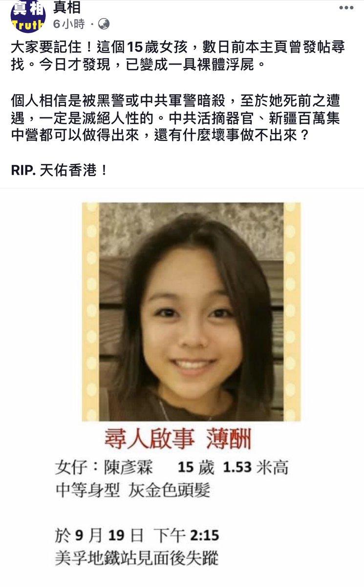
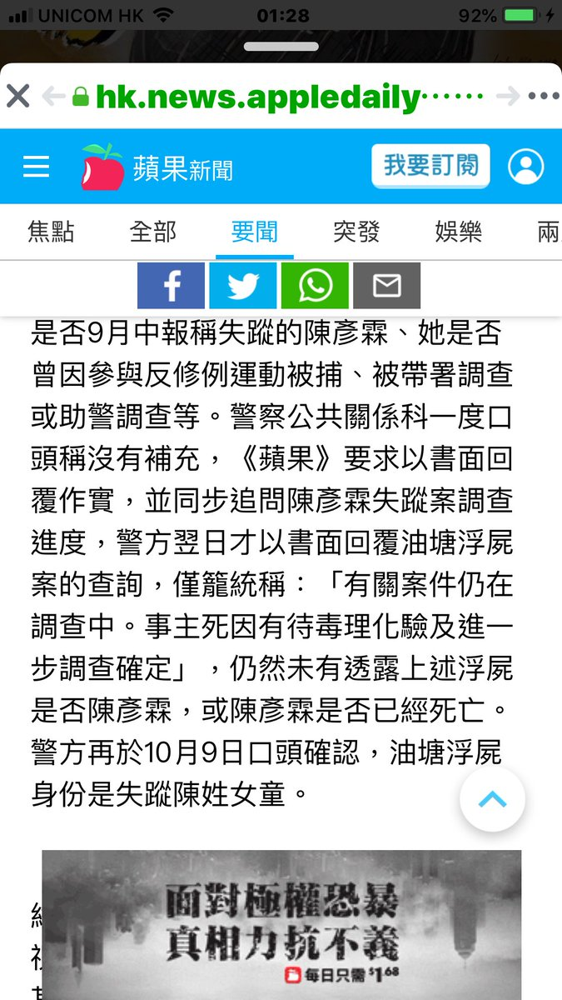
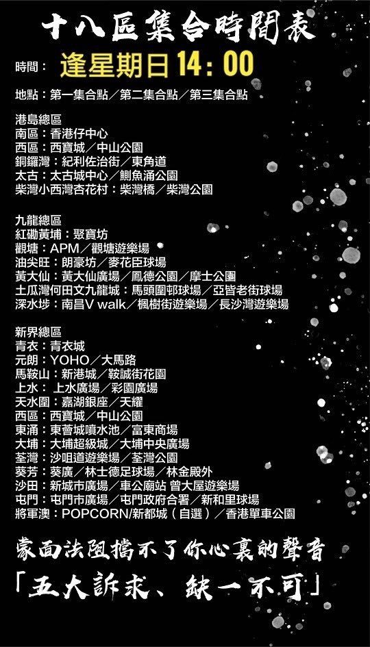

[10月11日 08:30]    新闻大吐槽   @TuCaoFakeNews    为自由而看  :speech_balloon:评:0 :+1:赞:1 :globe_with_meridians:转:1  

[10月11日 08:27]    新闻大吐槽   @TuCaoFakeNews    世界只有一个皇 别搞错了  :speech_balloon:评:2 :+1:赞:3 :globe_with_meridians:转:1  

[10月11日 08:23]    新闻大吐槽   @TuCaoFakeNews    看他的姓： Curry，咖喱，就知道吃！  :speech_balloon:评:0 :+1:赞:1 :globe_with_meridians:转:1  

[10月11日 08:17]    新闻大吐槽   @TuCaoFakeNews    有人奇怪为何昨天没有抓人？是不是因为民国国庆？好像没有什么必然联系。

反而我们看到，有15岁女生尸体在海上被发现，而且有大学女生站出来，露脸控诉警察强奸！

所以，应当是强奸、杀人、抛尸败露，中共感觉压力巨大，在调整手段，没用，天不饶恕

所以曝光真相一刻也不能停！真相才能制止恶行！  :speech_balloon:评:4 :+1:赞:42 :globe_with_meridians:转:23  

[10月11日 08:15]    BBC News 中文   @bbcchinese    ER始于2018年的英国，属于社会政治运动，传承的公民不服从（公民抗命）传统精髓却由来已久。 https://bbc.in/2M4gOVJ   :speech_balloon:评:3 :+1:赞:8 :globe_with_meridians:转:2  

[10月11日 08:09]    新闻大吐槽   @TuCaoFakeNews    哭了两天不敢看推，心疼这些孩子。但是哭能有什么用呢，唯有能做的就是散播这些恶魔贵的罪恶，等来日被审判。  :speech_balloon:评:0 :+1:赞:16 :globe_with_meridians:转:2  

[10月11日 08:08]    新闻大吐槽   @TuCaoFakeNews    当被问及中共要挟NBA道歉的问题时，库里的回答很令人失望，他认为问题很大，确实需要做点什么，但我不了解中国历史，也不知道它的历史是如何影响到当今社会的；

其实你只要知道香港人现在的抗争是正确的就行啊，你怎么就是不说呢？
看来学习成绩不好，只能去打球，结果还被教练给洗了脑
可怜的小学生 https://twitter.com/anthonyVslater/status/1182040365550850048 …  :speech_balloon:评:7 :+1:赞:17 :globe_with_meridians:转:6  

[10月11日 08:04]    新闻大吐槽   @TuCaoFakeNews    中國，醜陋出國際，完。 https://twitter.com/tucaofakenews/status/1182148650819997696 …  :speech_balloon:评:0 :+1:赞:10 :globe_with_meridians:转:2  

[10月11日 08:00]    新闻大吐槽   @TuCaoFakeNews    主要是港府以及後面的中共害怕在雙十節的時候搞出大事，從而把香港人和台灣人更加連結起來抗共。他們害怕全民反共。 https://twitter.com/tucaofakenews/status/1182244820087001088 …  :speech_balloon:评:0 :+1:赞:6 :globe_with_meridians:转:2  

[10月11日 07:52]    BBC News 中文   @bbcchinese    “其实香港在大陆人眼中，早已没有优势。”她说，“如果不是子女和家人在香港，我不会留在这边。” https://bbc.in/325HTO4   :speech_balloon:评:40 :+1:赞:52 :globe_with_meridians:转:14  

[10月11日 07:40]    新闻大吐槽   @TuCaoFakeNews    还是要看校长是否像蔡元培那样有勇气为学生挺身而出，为学生向政府讨回公道。  :speech_balloon:评:0 :+1:赞:6 :globe_with_meridians:转:1  

[10月11日 07:38]    新闻大吐槽   @TuCaoFakeNews    我地仲要忍到幾時
本週六.日所有高中院校老師、議員、律師、醫護、市民不畏強權出來聲援。  https://twitter.com/maggieho20/status/1182334963569397760 …  :speech_balloon:评:5 :+1:赞:47 :globe_with_meridians:转:32  

[10月11日 07:27]    新闻大吐槽   @TuCaoFakeNews    現在一句free hk 在直播節目已經夠了，天呀，年尾年頭各樣頒獎典禮，一人一口  :speech_balloon:评:2 :+1:赞:3 :globe_with_meridians:转:1  

[10月11日 07:25]    新闻大吐槽   @TuCaoFakeNews    不让帶口罩，就可以直接滥捕。
这种法令本身就不合法。 https://twitter.com/tucaofakenews/status/1182244820087001088 …  :speech_balloon:评:0 :+1:赞:12 :globe_with_meridians:转:2  

[10月11日 07:23]    BBC News 中文   @bbcchinese    出身古巴裔家庭的克鲁兹，家庭曾受古巴共产党压迫，因此克鲁兹一直以来反共立场鲜明。 https://bbc.in/2B6DLRP   :speech_balloon:评:14 :+1:赞:80 :globe_with_meridians:转:14  

[10月11日 07:13]    新闻大吐槽   @TuCaoFakeNews    听说上海NBA场面火爆如常，引发离岸爱国者愤怒。怒称观众为“跪族篮孩”  :speech_balloon:评:2 :+1:赞:10 :globe_with_meridians:转:2  

[10月11日 06:52]    BBC News 中文   @bbcchinese    70多年前的世界首富、大英帝国印度王公米尔·奥斯曼·阿里·汗至今仍是印度历史上最富有的人。 https://bbc.in/3157HIO   :speech_balloon:评:4 :+1:赞:18 :globe_with_meridians:转:6  

[10月11日 06:40]    凡賽堤/FORSETI   @FecharCCP    魔鬼在人間27
極權殺人恐怖組織正在用各種兇殘手段殺害我們的同胞..........

他們大部份都才8歲，10歲，12歲，16歲，17歲的香港小學生，中學生被暴打，被抓捕！上帝啊，祈求你開眼把，看看極權殺人恐怖組織在人類大地上所犯下的種種反人類的罪行吧！！！！！！！！！！！！！！！！！！！！！！！！  :speech_balloon:评:0 :+1:赞:5 :globe_with_meridians:转:5  

[10月11日 06:39]    新闻大吐槽   @TuCaoFakeNews    中国的市场已经全丢了，他们在美国与全世界也被骂惨了，这下改口，还能回家表演，不然真的喝稀粥了  :speech_balloon:评:0 :+1:赞:7 :globe_with_meridians:转:1  

[10月11日 06:30]    新闻大吐槽   @TuCaoFakeNews    有良心的那個是副校長, 姓段的校長一開始還一副林鄭腔拒絕譴責警方濫暴 :0)  :speech_balloon:评:1 :+1:赞:15 :globe_with_meridians:转:3  

[10月11日 06:16]    新闻大吐槽   @TuCaoFakeNews    撕票那位看見這場景，腸子都悔青。  :speech_balloon:评:0 :+1:赞:6 :globe_with_meridians:转:1  

[10月11日 06:06]    凡賽堤/FORSETI   @FecharCCP    極權殺人恐怖組織正在用各種兇殘手段殺害我們的同胞.......... https://twitter.com/FecharCCP/status/1182089689588736001 …  :speech_balloon:评:0 :+1:赞:3 :globe_with_meridians:转:1  

[10月11日 06:06]    凡賽堤/FORSETI   @FecharCCP    極權殺人恐怖組織正在用各種兇殘手段殺害我們的同胞.......... https://twitter.com/FecharCCP/status/1182079070210859010 …  :speech_balloon:评:0 :+1:赞:1 :globe_with_meridians:转:2  

[10月11日 06:06]    凡賽堤/FORSETI   @FecharCCP    極權殺人恐怖組織正在用各種兇殘手段殺害我們的同胞.......... https://twitter.com/FecharCCP/status/1182079157443928064 …  :speech_balloon:评:0 :+1:赞:1 :globe_with_meridians:转:2  

[10月11日 06:06]    凡賽堤/FORSETI   @FecharCCP    極權殺人恐怖組織正在用各種兇殘手段殺害我們的同胞.......... https://twitter.com/FecharCCP/status/1182079248024121344 …  :speech_balloon:评:0 :+1:赞:1 :globe_with_meridians:转:2  

[10月11日 06:06]    凡賽堤/FORSETI   @FecharCCP    極權殺人恐怖組織正在用各種兇殘手段殺害我們的同胞.......... https://twitter.com/FecharCCP/status/1182079392387911680 …  :speech_balloon:评:0 :+1:赞:1 :globe_with_meridians:转:0  

[10月11日 06:06]    凡賽堤/FORSETI   @FecharCCP    極權殺人恐怖組織正在用各種兇殘手段殺害我們的同胞.......... https://twitter.com/FecharCCP/status/1182079492958883840 …  :speech_balloon:评:0 :+1:赞:1 :globe_with_meridians:转:2  

[10月11日 06:05]    凡賽堤/FORSETI   @FecharCCP    極權殺人恐怖組織正在用各種兇殘手段殺害我們的同胞.......... https://twitter.com/FecharCCP/status/1182079697460633600 …  :speech_balloon:评:0 :+1:赞:1 :globe_with_meridians:转:0  

[10月11日 06:05]    凡賽堤/FORSETI   @FecharCCP    極權殺人恐怖組織正在用各種兇殘手段殺害我們的同胞.......... https://twitter.com/FecharCCP/status/1182079805044543488 …  :speech_balloon:评:0 :+1:赞:5 :globe_with_meridians:转:4  

[10月11日 06:05]    凡賽堤/FORSETI   @FecharCCP    極權殺人恐怖組織正在用各種兇殘手段殺害我們的同胞.......... https://twitter.com/FecharCCP/status/1182079900393582592 …  :speech_balloon:评:0 :+1:赞:1 :globe_with_meridians:转:2  

[10月11日 06:05]    凡賽堤/FORSETI   @FecharCCP    極權殺人恐怖組織正在用各種兇殘手段殺害我們的同胞.......... https://twitter.com/FecharCCP/status/1182080070007046146 …  :speech_balloon:评:0 :+1:赞:1 :globe_with_meridians:转:1  

[10月11日 06:04]    凡賽堤/FORSETI   @FecharCCP    極權殺人恐怖組織正在用各種兇殘手段殺害我們的同胞.......... https://twitter.com/FecharCCP/status/1182359771447382016 …  :speech_balloon:评:0 :+1:赞:0 :globe_with_meridians:转:0  

[10月11日 06:04]    凡賽堤/FORSETI   @FecharCCP    極權殺人恐怖組織正在用各種兇殘手段殺害我們的同胞.......... https://twitter.com/FecharCCP/status/1182367617799131142 …  :speech_balloon:评:0 :+1:赞:1 :globe_with_meridians:转:1  

[10月11日 06:01]    凡賽堤/FORSETI   @FecharCCP    魔鬼在人間26
極權殺人恐怖組織正在用各種兇殘手段殺害我們的同胞..........

他們大部份都才8歲，10歲，12歲，16歲，17歲的香港小學生，中學生被暴打，被抓捕！上帝啊，祈求你開眼把，看看極權殺人恐怖組織在人類大地上所犯下的種種反人類的罪行吧！！！！！！！！！！！！！！！！！！！！！！！！  :speech_balloon:评:0 :+1:赞:1 :globe_with_meridians:转:2  

[10月11日 06:01]    凡賽堤/FORSETI   @FecharCCP    魔鬼在人間25
極權殺人恐怖組織正在用各種兇殘手段殺害我們的同胞..........

他們大部份都才8歲，10歲，12歲，16歲，17歲的香港小學生，中學生被暴打，被抓捕！上帝啊，祈求你開眼把，看看極權殺人恐怖組織在人類大地上所犯下的種種反人類的罪行吧！！！！！！！！！！！！！！！！！！！！！！！！  :speech_balloon:评:0 :+1:赞:1 :globe_with_meridians:转:0  

[10月11日 06:00]    凡賽堤/FORSETI   @FecharCCP    魔鬼在人間24
極權殺人恐怖組織正在用各種兇殘手段殺害我們的同胞..........

他們大部份都才8歲，10歲，12歲，16歲，17歲的香港小學生，中學生被暴打，被抓捕！上帝啊，祈求你開眼把，看看極權殺人恐怖組織在人類大地上所犯下的種種反人類的罪行吧！！！！！！！！！！！！！！！！！！！！！！！！  :speech_balloon:评:0 :+1:赞:1 :globe_with_meridians:转:1  

[10月11日 06:00]    凡賽堤/FORSETI   @FecharCCP    魔鬼在人間23
極權殺人恐怖組織正在用各種兇殘手段殺害我們的同胞..........

他們大部份都才8歲，10歲，12歲，16歲，17歲的香港小學生，中學生被暴打，被抓捕！上帝啊，祈求你開眼把，看看極權殺人恐怖組織在人類大地上所犯下的種種反人類的罪行吧！！！！！！！！！！！！！！！！！！！！！！！！  :speech_balloon:评:0 :+1:赞:1 :globe_with_meridians:转:0  

[10月11日 05:59]    凡賽堤/FORSETI   @FecharCCP    魔鬼在人間22
極權殺人恐怖組織正在用各種兇殘手段殺害我們的同胞..........

他們大部份都才8歲，10歲，12歲，16歲，17歲的香港小學生，中學生被暴打，被抓捕！上帝啊，祈求你開眼把，看看極權殺人恐怖組織在人類大地上所犯下的種種反人類的罪行吧！！！！！！！！！！！！！！！！！！！！！！！！  :speech_balloon:评:0 :+1:赞:1 :globe_with_meridians:转:1  

[10月11日 05:58]    凡賽堤/FORSETI   @FecharCCP    魔鬼在人間21
極權殺人恐怖組織正在用各種兇殘手段殺害我們的同胞..........

他們大部份都才8歲，10歲，12歲，16歲，17歲的香港小學生，中學生被暴打，被抓捕！上帝啊，祈求你開眼把，看看極權殺人恐怖組織在人類大地上所犯下的種種反人類的罪行吧！！！！！！！！！！！！！！！！！！！！！！！！  :speech_balloon:评:0 :+1:赞:2 :globe_with_meridians:转:0  

[10月11日 05:58]    凡賽堤/FORSETI   @FecharCCP    魔鬼在人間20
極權殺人恐怖組織正在用各種兇殘手段殺害我們的同胞..........

他們大部份都才8歲，10歲，12歲，16歲，17歲的香港小學生，中學生被暴打，被抓捕！上帝啊，祈求你開眼把，看看極權殺人恐怖組織在人類大地上所犯下的種種反人類的罪行吧！！！！！！！！！！！！！！！！！！！！！！！！  :speech_balloon:评:0 :+1:赞:1 :globe_with_meridians:转:0  

[10月11日 05:25]    新闻大吐槽   @TuCaoFakeNews    【丹麦首相笑场】根据丹麦新法律，私人马戏团不得再饲养大象。丹麦首相弗雷德里克森在议会宣读一份向私人马戏团赎买大象的报告，报告称，政府不得已还买下一头名叫阿利的骆驼，因为它与其中一只大象十分要好，不愿放朋友离开。

五毛粉紅們會怎麼看？  :speech_balloon:评:5 :+1:赞:94 :globe_with_meridians:转:32  

[10月11日 05:15]    老司机   @h5lpykl7tp6jjop    沉船计划早已开始，它们忙着捞取最后一张钞票，废民还在拼命帮它们数钱，还在拼命爱不属于自己的赵国！  :speech_balloon:评:1 :+1:赞:35 :globe_with_meridians:转:22  

[10月11日 05:02]    老司机   @h5lpykl7tp6jjop    尽管当年三赔真廉价，至今仍然感激党的照顾，老一代三赔小姐爱国真心话  :speech_balloon:评:5 :+1:赞:39 :globe_with_meridians:转:17  

[10月11日 04:58]    老司机   @h5lpykl7tp6jjop      :speech_balloon:评:2 :+1:赞:17 :globe_with_meridians:转:8  

[10月11日 04:58]    老司机   @h5lpykl7tp6jjop      :speech_balloon:评:0 :+1:赞:1 :globe_with_meridians:转:0  

[10月11日 04:51]    老司机   @h5lpykl7tp6jjop    中国人爱国真是创意无限！还居然有X光照片作证！儍废苦心！哈哈哈  :speech_balloon:评:3 :+1:赞:7 :globe_with_meridians:转:3  

[10月11日 04:05]    老司机   @h5lpykl7tp6jjop    中国人获得诺贝尔文学奖？不过是《痛苦的中国人》！  :speech_balloon:评:0 :+1:赞:27 :globe_with_meridians:转:13  

[10月11日 02:56]    GFHG SDKM   @zyx_yny    #香港人反抗 
夜貓請接力 繼續tweet今日三件大事俾美國時區嘅人睇
1. 15歲浮屍案
2. 中大學生哭訴警暴
3. 冇血墮樓屍體
晚安 聽日見  :speech_balloon:评:0 :+1:赞:21 :globe_with_meridians:转:7  

[10月11日 02:38]    新闻大吐槽   @TuCaoFakeNews    对别人共产主义，对自己资本主义  :speech_balloon:评:0 :+1:赞:13 :globe_with_meridians:转:2  

[10月11日 02:35]    新闻大吐槽   @TuCaoFakeNews    网络上拿钱为中共说话的是五毛，不拿钱的是自干五。自干五不是被中共洗脑过度，分不清了是非，就是本身就是既得利益者……

中共在墙内删帖，封号得很厉害，所以会让墙内的网络舆论环境看上去很“和谐”，实际上只是反对的声音被压制得很厉害。  :speech_balloon:评:1 :+1:赞:40 :globe_with_meridians:转:9  

[10月11日 01:54]    墙国铁拳现世报😷   @Socialistfist    为契合推文主题小编特别推出投稿指南。
#社会主义铁拳 指某精赵在各平台（如微博贴吧）公开发布地爱党国言论和被铁拳截图，两者可为新后或并列关系。至少两张截图

#战螂在推特  是一个分享战螂在推特上的反价值观魔幻言行的品鉴系列，要求宽松符合条件即可。  :speech_balloon:评:3 :+1:赞:37 :globe_with_meridians:转:2  

[10月11日 01:44]    GFHG SDKM   @zyx_yny    Our faces every night when reading news of the day :(  :speech_balloon:评:1 :+1:赞:22 :globe_with_meridians:转:9  

[10月11日 01:41]    墙国铁拳现世报😷   @Socialistfist    这个月里，我们一起回顾了历史上的铁拳，我们还有幸请到了墙内粉红兔兔@zzyyzoe ，并把她打造成推特网红。
，还搞了让大家心服口服的民主投票，最后新系列#战螂在推特 也获得大家良好反响。  :speech_balloon:评:6 :+1:赞:59 :globe_with_meridians:转:2  

[10月11日 01:39]    墙国铁拳现世报😷   @Socialistfist    9月11日开办的墙国铁拳现世报, 今天满月了！多谢一个月来各位看官捧场，感谢大家的转发点赞评论三连。还要特别感谢给小编投稿的各位，是你们让这个推坚持活跃下去 
大家的热情，让小编受宠若惊。
（更正8000+推友）  :speech_balloon:评:14 :+1:赞:216 :globe_with_meridians:转:18  

[10月11日 01:34]    新闻大吐槽   @TuCaoFakeNews    《蘋果》亦獲悉，彥霖是游泳健將，早年曾經參加跳水隊，大約3年前一度接受定期跳水訓練。好友透露：「佢有能力喺5米高台，跳入5米深泳池，再自己游上岸。」
如花少女已逝，願沈冤待雪！RIP  :speech_balloon:评:2 :+1:赞:80 :globe_with_meridians:转:64  

[10月11日 01:31]    GFHG SDKM   @zyx_yny    WOW so authoritative  
Then if you call us Cockroaches again or you will take your own risk. 
If you really care abt how ppl think, you shouldn’t do all that dirty work!!!
好大嘅官威啊 https://twitter.com/effygrande1/status/1182346969160679424 …  :speech_balloon:评:0 :+1:赞:2 :globe_with_meridians:转:0  

[10月11日 01:27]    GFHG SDKM   @zyx_yny    The government and #HKPF have lost their credibility. We have to fact check everything ourselves to ensure the safety of #hongkongpeople  :speech_balloon:评:0 :+1:赞:9 :globe_with_meridians:转:1  

[10月11日 01:19]    GFHG SDKM   @zyx_yny    please help us, this girl only 15yrs old and she is nude when her body was found #standwithhk  :speech_balloon:评:3 :+1:赞:15 :globe_with_meridians:转:17  

[10月11日 01:13]    GFHG SDKM   @zyx_yny    This is horrifying bcz
 1. her phone and wallet were found 20 stations away from where she was last seen
2. She is a swimming athlete but was found dead drown！  :speech_balloon:评:2 :+1:赞:12 :globe_with_meridians:转:4  

[10月11日 01:11]    GFHG SDKM   @zyx_yny    We must win the war to clear all the  innocence‘s name
唯有勝利 先可以還所有人一個清白 https://twitter.com/10sakiya/status/1182338218789720064 …  :speech_balloon:评:0 :+1:赞:11 :globe_with_meridians:转:1  

[10月11日 00:51]    GFHG SDKM   @zyx_yny    1) After the speech of the student widely spreaded out, HK police has threatened her publicly on social media, saying “they will proactively contact her and appeal to her to provide concrete evidence”!!!

Who will contact the criminal and request the criminal to sue themselves!!? https://twitter.com/thetimeusedtobe/status/1182292557595721730 …  :speech_balloon:评:3 :+1:赞:14 :globe_with_meridians:转:12  

[10月11日 00:44]    GFHG SDKM   @zyx_yny    One of the dead body found in the sea on 22 Sep, confirmed she’s a protester. She is only 15yo and was found naked. Her friend claim that she’s a good swimmer. Obviously she was killed by someone! Too sad to handle this. #StandWithHongKong 
Full video link in comment.  :speech_balloon:评:102 :+1:赞:1277 :globe_with_meridians:转:1348  

[10月11日 00:33]    GFHG SDKM   @zyx_yny    America, time to wake up
#BoycottBlizzard #BoycottChina  :speech_balloon:评:0 :+1:赞:4 :globe_with_meridians:转:4  

[10月11日 00:28]    GFHG SDKM   @zyx_yny    #HKPF have to be sanctioned. They got no difference between underworld. #CCPChina is covering their crimes. And we must defend #HKprotesters from further harms https://twitter.com/solomonyue/status/1182308084930101248 …  :speech_balloon:评:0 :+1:赞:2 :globe_with_meridians:转:1  

[10月11日 00:26]    GFHG SDKM   @zyx_yny    Hey hey hey... CCP suppresses the freedom of speech. Are you sure it’s what you want to happen? Do something before it’s too late #antichinazi #FreedomOfSpeech  :speech_balloon:评:0 :+1:赞:14 :globe_with_meridians:转:7  

[10月11日 00:21]    GFHG SDKM   @zyx_yny    抖完啦 係時候回歸主線任務
唔可以俾條柒婆睇死我地立咗蒙面法就唔咁出黎
勇和一家 偏地開花 

#HKprotests #香港人日程表 #香港人反抗  :speech_balloon:评:0 :+1:赞:13 :globe_with_meridians:转:8  

[10月11日 00:07]    GFHG SDKM   @zyx_yny    Terror spreading across the streets in #HongKong - females wearing black are allegedly being assaulted/harassed on the streets at night. There are also threats to kidnap and torture these girls. #HumanRights #FreeHongKong #HongKongProtests #WhiteTerror https://twitter.com/lime1996m/status/1181932698182406150 …  :speech_balloon:评:0 :+1:赞:23 :globe_with_meridians:转:17  

[10月11日 00:04]    GFHG SDKM   @zyx_yny    The student who was crying: They shot me on my leg, hit me with the baton on my arm. What more evidences do you want?  Why can’t the vice chancellor just stop and listen to these students... with his true heart #StandWithHongKong  :speech_balloon:评:1 :+1:赞:62 :globe_with_meridians:转:10  

[10月10日 22:45]    老司机   @h5lpykl7tp6jjop    令人发指：香港中大女學生除口罩親述示威者於新屋嶺黑房內被警察性侵、性暴力、虐打！  :speech_balloon:评:59 :+1:赞:369 :globe_with_meridians:转:223  

[10月10日 22:29]    BBC News 中文   @bbcchinese    盛行千年的正念冥想如今已成为万亿美金规模的产业。然而，冥想练习对我们的身心健康真的有益吗？
 https://bbc.in/321uzKE   :speech_balloon:评:6 :+1:赞:34 :globe_with_meridians:转:33  

[10月10日 22:22]    墙国铁拳现世报😷   @Socialistfist    突然爱国，突然强拆
#社会主义铁拳 https://twitter.com/rtiomn/status/1182294052466614272 …  :speech_balloon:评:59 :+1:赞:359 :globe_with_meridians:转:87  

[10月10日 22:20]    老司机   @h5lpykl7tp6jjop    国内刷屏！无锡豆腐渣桥梁垮塌，很多车被压扁，死伤惨重！官方说大车是空车，禁止报道死亡人数！现场信号被屏蔽，先解决掉提问题的人。假如垮塌的桥下还有幸存者，他们怎样和外界联系？  :speech_balloon:评:140 :+1:赞:977 :globe_with_meridians:转:585  

[10月10日 21:59]    BBC News 中文   @bbcchinese    根据世界卫生组织（WHO）数据，韩国是世界上自杀率最高的地区之一。而在韩国首都首尔，有一支自杀救援队，队员许正旭（音）表示，救人成功时他们会感到有意义，但失败时也会沮丧。
 https://bbc.in/2MsMX8C   :speech_balloon:评:9 :+1:赞:36 :globe_with_meridians:转:13  

[10月10日 21:33]    GFHG SDKM   @zyx_yny    【Twitter】A campaign to garner international support for Hong Kong Protesters

近日推特瘋傳，不同族裔，不同國家，用廣東話撐香港。香港人不孤單。

Source：《大紀元時報》

#StandwithHonKong
#FreedomOfSpeech
#BloodyCarrie
#HongKongProstests
#hongkongpolicebrutality  :speech_balloon:评:13 :+1:赞:240 :globe_with_meridians:转:108  

[10月10日 21:30]    BBC News 中文   @bbcchinese    年轻人不愿意结婚，新生儿出生率降低，人口老龄化日益严重。最新数据显示，地球上老人比幼儿多。这是什么概念？这些娃娃长大后将面对怎样的世界？
 https://bbc.in/2MxVdEt   :speech_balloon:评:5 :+1:赞:18 :globe_with_meridians:转:5  

[10月10日 21:00]    纽约时报中文网   @nytchinese    #观点 至于中美贸易谈判的下一步以及如何处理香港问题，四中全会或许会讨论，但除非在此期间发生重大事件足以改变对问题的定性，如香港暴力抗争显著升级，形成新的共识和处理方式的可能性也很小。 http://nyti.ms/2p8XJsq   :speech_balloon:评:11 :+1:赞:6 :globe_with_meridians:转:2  

[10月10日 20:59]    BBC News 中文   @bbcchinese    你是左脑型还是右脑型？人类只是用十分之一的大脑，这些你可能都不陌生，但关键是这里有多少真相呢？
 https://bbc.in/2pawPjW   :speech_balloon:评:3 :+1:赞:16 :globe_with_meridians:转:12  

[10月10日 20:00]    BBC News 中文   @bbcchinese    【柏林牆倒下30年：走進蘇聯遺留在德國的共產主義痕跡】BBC记者带大家走进这座见证共产主义的建筑。 https://bbc.in/2p7CszD   :speech_balloon:评:9 :+1:赞:31 :globe_with_meridians:转:14  

[10月10日 19:33]    老司机   @h5lpykl7tp6jjop    少女? 没戴口罩? 阿sir说: 够三人，"非法集会"，拉!  :speech_balloon:评:2 :+1:赞:21 :globe_with_meridians:转:21  

[10月10日 19:30]    纽约时报中文网   @nytchinese    在以往经济放缓时期，中国消费者一直在消费。但如今，随着经济陷入低迷，他们宁愿把钱存在银行。
这一转变不仅将在全球产生影响，也将对中国领导层构成直接挑战。 http://nyti.ms/2p7RdlR   :speech_balloon:评:44 :+1:赞:75 :globe_with_meridians:转:34  

[10月10日 19:29]    老司机   @h5lpykl7tp6jjop    驾车肇事，这在地球任何一国皆违法。故意杀人，是公认严重罪行。
中共为了镇压港人反抗暴政，教唆黑帮当街打人、指使大陆公安越境暴力''执法"与栽赃做假、舆论上文攻武嚇，把明珠香港变成枪林弹雨的镇压反抗者的战场。
现在又出新招，收买个别司机当街开车杀人！开辟暴政杀人新手段之先河！歹毒至极！ https://twitter.com/newyorkluo/status/1182058763647426562 …  :speech_balloon:评:18 :+1:赞:150 :globe_with_meridians:转:88  

[10月10日 19:01]    BBC News 中文   @bbcchinese    中美贸易战继续！美国列出中国AI芯片公司的黑名单，包含创立于香港中大的商汤科技（SenseTime），以及CCTV公司的海康威视。大家怎么看？ https://bbc.in/33b871M   :speech_balloon:评:31 :+1:赞:114 :globe_with_meridians:转:35  

[10月10日 18:23]    纽约时报中文网   @nytchinese    #每日一词 在火箭队总经理莫雷一则支持香港抗议者的推文将NBA推上风口浪尖后，篮网队总经理、阿里巴巴联合创始人蔡崇信公开就此事发声。
据时报报道，他在声明中将抗议者的行为称为“分裂运动”，并说香港是中国的“a third-rail issue”。 http://nyti.ms/33kw2Mo   :speech_balloon:评:21 :+1:赞:25 :globe_with_meridians:转:7  

[10月10日 18:13]    纽约时报中文网   @nytchinese    #时报专栏 在过去的半个世纪里，中国实现了迅猛的经济增长，使数亿民众摆脱了贫困。但是，中共政权并不需要用放松控制来换取发展。
一个更为黑暗的事实正浮现出来：中国的经济奇迹不仅没有解放中国人民。现在，它还经常走出国门，腐蚀我们其他人。 http://nyti.ms/325LrQu   :speech_balloon:评:458 :+1:赞:1427 :globe_with_meridians:转:516  

[10月10日 18:13]    纽约时报中文网   @nytchinese    Chinese Media’s Attacks on Apple and N.B.A. Help Inflame Nationalism. See Chinese translation and bilingual version @nytchinese @HernandezJavier https://cn.nytimes.com/china/20191010/china-apple-nba-hong-kong/ …  :speech_balloon:评:4 :+1:赞:14 :globe_with_meridians:转:5  

[10月10日 18:01]    BBC News 中文   @bbcchinese    美国金门大桥是全球最热门的自杀地，过去20年，有1700人在这里自杀。而两位警官分别在这里救下轻生的人。 https://bbc.in/2IBkkVK   :speech_balloon:评:21 :+1:赞:50 :globe_with_meridians:转:13  

[10月10日 17:54]    老司机   @h5lpykl7tp6jjop    天天骂小日本，瞧不起小日本，结果人家19年拿19个诺贝尔奖！中国人牛皮吹得大，实际上比别人差得越来越远，未来更是堪忧  :speech_balloon:评:14 :+1:赞:137 :globe_with_meridians:转:41  

[10月10日 17:44]    墙国铁拳现世报😷   @Socialistfist    全推特最纯净的推 https://twitter.com/zSP8IcFxk8kpaJv/status/1182229009410641920 …  :speech_balloon:评:18 :+1:赞:234 :globe_with_meridians:转:25  

[10月10日 17:33]    GFHG SDKM   @zyx_yny    致蔥蔥子：

如需協助，請pm我
住宿/工作/防具/食飯/情緒支援
請唔好怕醜，大家都係兄弟姐妹，香港兒女！

#香港人反抗
#鬥長命  :speech_balloon:评:12 :+1:赞:280 :globe_with_meridians:转:111  

[10月10日 17:30]    纽约时报中文网   @nytchinese    #观点 中共为70年大庆所做的各项准备让外界看到，习近平依然牢牢掌控着权力。
很有可能，习会以坚持和完善社会主义制度之名（这也是全会的议程之一，而且是和治理现代化捆绑在一起的），把强化党的集中统一领导和习的统治作为推进中国治理现代化的一项内容。 http://nyti.ms/2p8XJsq   :speech_balloon:评:4 :+1:赞:5 :globe_with_meridians:转:3  

[10月10日 17:28]    墙国铁拳现世报😷   @Socialistfist    你们看看这些假爱国者，竟然为了房子威胁国家，上街游行。
#社会主义铁拳  :speech_balloon:评:71 :+1:赞:435 :globe_with_meridians:转:139  

[10月10日 17:15]    墙国铁拳现世报😷   @Socialistfist    突然来了很多香港选民，你们投完票可以去何议员那里继续投票  :speech_balloon:评:6 :+1:赞:59 :globe_with_meridians:转:6  

[10月10日 17:01]    BBC News 中文   @bbcchinese    蔡英文国庆演讲首次提到香港，表示一国两制的失灵导致香港社会处于脱序边缘。台湾将拒绝一国两制， 以民主自由走出自己的路。 https://bbc.in/2VyjyOj   :speech_balloon:评:237 :+1:赞:965 :globe_with_meridians:转:217  

[10月10日 17:00]    纽约时报中文网   @nytchinese    分析人士表示，中国媒体日益强硬的语气，是为了配合北京在国内煽动民族主义、恐吓跨国公司追随党的路线。
在中国和美国努力达成贸易协议之际，这场口水战也反映了一场更广泛的地缘政治斗争。 http://nyti.ms/2AZGMUa   :speech_balloon:评:32 :+1:赞:42 :globe_with_meridians:转:12  

[10月10日 16:30]    纽约时报中文网   @nytchinese    #观点 在习近平的领导下，中国正在积极地努力消除国内的文化和政治多样性，这种多样性是中华人民共和国以前朝代的遗产。
习近平对政治和文化同质化的不切实际的梦想，不仅与中国传统的多元化做法背道而驰。他的同化主义也激发了中共一直希望避免的不稳定。 http://nyti.ms/2Ozgsbx   :speech_balloon:评:100 :+1:赞:291 :globe_with_meridians:转:83  

[10月10日 16:00]    纽约时报中文网   @nytchinese    当中国的猪肉供应不足时，北京会动用“战略猪肉储备“。这听起来像是全国各地的秘密地窖里有堆积成山的香肠、培根和排骨。但具体情况有些出入。
如今，猪瘟让中国的猪肉价格飞涨，政府一直在动用储备增加对消费者的供应。究竟这项“战略猪肉储备“制度是什么？又是如何运作的？ http://nyti.ms/2pTr62m   :speech_balloon:评:20 :+1:赞:71 :globe_with_meridians:转:39  

[10月10日 15:31]    纽约时报中文网   @nytchinese    《人民日报》将矛头对准苹果，指责它提供 http://HKmap.live 这款允许抗议者追踪警察行动的应用，为香港的“暴徒“”护航“。苹果宣布，已将http://HKmap.live 从应用商店中删除。
随着中国试图遏制香港的示威活动，官媒越来越多地抨击外国企业，指责它们助长抗议活动。http://nyti.ms/2AZGMUa   :speech_balloon:评:52 :+1:赞:124 :globe_with_meridians:转:53  

[10月10日 15:01]    BBC News 中文   @bbcchinese    当你想买一件货品时，你能否分辨出是环境告诉你想买，还是真正自己想买？ https://bbc.in/33hKAfC   :speech_balloon:评:2 :+1:赞:48 :globe_with_meridians:转:22  

[10月10日 14:30]    纽约时报中文网   @nytchinese    #观点 邓聿文：中共要转型成为现代化的执政党，首先需要民主化，允许不同派系的公开存在并相互竞争，将目前只有集中而无民主的“民主集中制”变成民主制，允许和提倡思想自由和思想争鸣，不搞一言堂，党和党的领导人要真正做到在国家宪法和法律下活动，不能有超越法律的特权。 http://nyti.ms/2p8XJsq   :speech_balloon:评:23 :+1:赞:39 :globe_with_meridians:转:10  

[10月10日 14:01]    BBC News 中文   @bbcchinese    子瑜在2016年在韓國的電視節目中揮舞台灣的青天白日旗，也遭遇中國方面的抵制。當時周子瑜隸屬的韓國經紀公司隨後發佈她的道歉視頻，與《南方公園》的處理手法大不同。 https://bbc.in/30Yuy8N   :speech_balloon:评:22 :+1:赞:63 :globe_with_meridians:转:18  

[10月10日 14:00]    纽约时报中文网   @nytchinese    动视暴雪表示，吴伟聪违反了一项竞争规则——即禁止玩家有任何“破坏自己的声誉、冒犯部分公众或某些公众群体，或损害暴雪形象”的行为。
在台湾《炉石传说》流媒体播放的赛后采访中，吴伟聪戴上香港抗议者常戴的防护装备弹道护目镜和防毒面具，用普通话疾呼“光复香港、时代革命”。 http://nyti.ms/2q2ssYT   :speech_balloon:评:28 :+1:赞:55 :globe_with_meridians:转:19  

[10月10日 13:38]    财经真相   @caijingxiang    唐纳德·J·特朗普的大作《The way to  the top》，中文名《颠覆之路》！  :speech_balloon:评:16 :+1:赞:111 :globe_with_meridians:转:25  

[10月10日 13:30]    纽约时报中文网   @nytchinese    #观点 长期以来关于中国的一般认知是，美国对中国的接触和投资将不可避免地带来这个国家的政治自由化，这一点显然没能得到证明。
这也是萧华本人在谈论“篮球外交”的可能性时所坚持的老生常谈。 http://nyti.ms/2IAinc1   :speech_balloon:评:52 :+1:赞:56 :globe_with_meridians:转:16  

[10月10日 13:00]    纽约时报中文网   @nytchinese    #观点 四中全会究竟能改变什么？邓聿文判断，习近平应已感知到党内外对其领导能力的不满，或将有限放松集权程度，甚至轻描淡写地做一点自我批评；但会上不会出现对习近平的公开指责，他仍牢牢掌控着权力。 http://nyti.ms/2p8XJsq   :speech_balloon:评:19 :+1:赞:22 :globe_with_meridians:转:10  

[10月10日 12:54]    GFHG SDKM   @zyx_yny    Another American company falls, how many are left? 
#antitotalitarianism
#antichinazi
#FightForFreedom  :speech_balloon:评:6 :+1:赞:248 :globe_with_meridians:转:58  

[10月10日 12:30]    纽约时报中文网   @nytchinese    香港电竞职业选手吴伟聪因在现场直播时声援香港抗议活动，而遭暴雪停赛一年，奖金也被取消。玩家在社交媒体和论坛上愤怒发帖，政界人士则认为这是中国在世界范围内严厉打压言论又一令人不安的迹象。
民主党参议员怀登表示，动视暴雪已表明“它愿意为取悦中国共产党而羞辱自己”。 http://nyti.ms/2q2ssYT   :speech_balloon:评:144 :+1:赞:461 :globe_with_meridians:转:180  

[10月10日 12:03]    老司机   @h5lpykl7tp6jjop    浦志強：深圳同学发来一张墙报，说是深圳民治街道办事处的文宣。但愿，这不是真的。 ​​​
哎，一地的書啊！  :speech_balloon:评:41 :+1:赞:325 :globe_with_meridians:转:141  

[10月10日 12:00]    纽约时报中文网   @nytchinese    • 关注美国2020年大选：民主党参选人、前副总统拜登宣称，特朗普总统应该被弹劾，因其“违反了就职誓言，背叛了这个国家，做出了可以被弹劾的行为”。
• 德国一间犹太教堂遭持枪者袭击，致2死2伤。凶手试图直播作案过程，其作案手法与新西兰基督城枪击案相似。更多简报内容： http://nyti.ms/2OzDhMj   :speech_balloon:评:4 :+1:赞:9 :globe_with_meridians:转:2  

[10月10日 11:58]    GFHG SDKM   @zyx_yny    Now  http://winniethepooh.disney.com  is blocked in HK. Visitors will be redirected to 404 page.

#chinazi
#Disney
#WinnieThePooh
#XiJinping  :speech_balloon:评:76 :+1:赞:637 :globe_with_meridians:转:519  

[10月10日 11:30]    纽约时报中文网   @nytchinese    #观点 在“十一”阅兵式和群众游行过后，中共将在近日召开十九届四中全会。从这次四中全会的议题来看，习近平再次意识到治理现代化的重要性。
但时评家邓聿文认为，中共难以成为现代化的执政党，因为现代化的基础是自由民主和法治等精神内核，而中共对权力的垄断本质与之相悖。 http://nyti.ms/2p8XJsq   :speech_balloon:评:77 :+1:赞:176 :globe_with_meridians:转:39  

[10月10日 11:13]    BBC News 中文   @bbcchinese    “梅花、梅花满天下⋯⋯”这歌声在香港响起来  :speech_balloon:评:404 :+1:赞:2415 :globe_with_meridians:转:712  

[10月10日 11:00]    纽约时报中文网   @nytchinese    认识他的人都说，他是“礼貌而谦逊的绅士”，是“诚实的人”，是“朋友和兄弟”。郭全是纽约唐人街居民熟悉的流浪汉，他在上周发生的针对流浪汉的袭击事件中被打死。
在纽约，流浪群体不见得会受到鄙夷，而是可成为社区的固定成员，甚至得到四邻照顾。郭全就是这种人。更多简报内容： http://nyti.ms/2OzDhMj   :speech_balloon:评:2 :+1:赞:3 :globe_with_meridians:转:0  

[10月10日 10:30]    纽约时报中文网   @nytchinese    #观点 莫雷的推文虽很快被删，却在中国疯传，那里赞助商和球迷做出了迅猛而愤怒的回应。
但NBA向中国敏感议题屈膝的速度之快却相当惊人——如萧华曾夸耀的，这个联盟所引以为豪的，是“一种义务感、社会责任感、对重要问题直言不讳的愿望”。 http://nyti.ms/2IAinc1   :speech_balloon:评:69 :+1:赞:115 :globe_with_meridians:转:40  

[10月10日 10:00]    BBC News 中文   @bbcchinese    香港发生“97以来最大危机”。舆论不断浮现一个问题——新加坡是否会就此超过香港，取代其亚洲金融中心地位？ https://bbc.in/33s5Uzh   :speech_balloon:评:81 :+1:赞:103 :globe_with_meridians:转:22  

[10月10日 10:00]    纽约时报中文网   @nytchinese    土耳其发动叙利亚攻势，向该国东北部派遣战机和军队，以清剿一个库尔德民兵组织，后者是美国打击伊斯兰国的重要盟友。
特朗普曾对土耳其的行动表示默许，但行动展开后又称其是“一个坏主意”，并重申他反对“无意义的战争”。
更多简报内容： http://nyti.ms/2OzDhMj   :speech_balloon:评:3 :+1:赞:5 :globe_with_meridians:转:0  

[10月10日 09:48]    财经真相   @caijingxiang    离岸人民币从7.1680到7.0999，短短一个小时近700点！  :speech_balloon:评:75 :+1:赞:303 :globe_with_meridians:转:81  

[10月10日 09:32]    BBC News 中文   @bbcchinese    美国遏制中国成为AI领头羊，最终可能刺激中共降低中国科技对外国的依赖。 https://bbc.in/32exXSc   :speech_balloon:评:75 :+1:赞:65 :globe_with_meridians:转:27  

[10月10日 09:10]    财经真相   @caijingxiang    这两天市场被媒体忽悠惨了，来回割肉，不过现在加大农产品采购，说明中共还是玩的买买买的套路，不准备全面达成协议。双方第一次接触将很重要，也就是说北京时间10号21:00至11号凌晨5点，将是决定本轮会谈最后时间，各位交易员做好准备，暴风雨要来了！ https://twitter.com/LoneCapital/status/1182096813882372097 …  :speech_balloon:评:22 :+1:赞:242 :globe_with_meridians:转:104  

[10月10日 08:13]    BBC News 中文   @bbcchinese    土耳其总统埃尔多安表示，这场攻势旨在库尔德人控制的区域建立一个“安全区”，重新安置目前居住在土耳其的叙利亚难民。许多观察人士将此次中东局势的升级怪罪于特朗普，说他“出卖盟友”。 https://bbc.in/2MmTHos   :speech_balloon:评:27 :+1:赞:47 :globe_with_meridians:转:13  

[10月10日 07:58]    老司机   @h5lpykl7tp6jjop    悲催的小粉红，你的饭碗呢？  :speech_balloon:评:65 :+1:赞:406 :globe_with_meridians:转:122  

[10月10日 07:40]    BBC News 中文   @bbcchinese    被迫与人类共处的野生动物们，在短短的时间内适应了环境，完成了它们以往可能需要数百万年才能出现的演变。 https://bbc.in/2p4kSMO   :speech_balloon:评:9 :+1:赞:37 :globe_with_meridians:转:14  

[10月10日 07:13]    GFHG SDKM   @zyx_yny    Honored to stand with friends tonight defending free speech in #America, standing in solidarity with #HongKong, and speaking out against #CCP bullying and the #NBA’s embarrassing behavior. @freedomhouse @hkdc_us  https://twitter.com/hkdc_us/status/1182061586954907648 …  :speech_balloon:评:589 :+1:赞:4027 :globe_with_meridians:转:1962  

[10月10日 07:12]    老司机   @h5lpykl7tp6jjop    太恐怖了，300多个孩子被冻起来准备运输去贩卖器官！ CCP不灭，天理何在！  :speech_balloon:评:154 :+1:赞:459 :globe_with_meridians:转:312  

[10月10日 06:13]    BBC News 中文   @bbcchinese    中国有句很有名的政治口号：“文艺为政治服务”。外界可能没有料到的是，如今体育也要为政治服务了。 https://bbc.in/2Mt7AkX   :speech_balloon:评:344 :+1:赞:438 :globe_with_meridians:转:122  

[10月10日 05:09]    老司机   @h5lpykl7tp6jjop    中国人有一种特别的心理，哪怕在独裁暴政制下仍然相信自己的运气，别人冤案被打被骗是他们运气不好，你看他们在赌场里疯狂下注，不怕各种陷阱圈套十赌九输仍然相信有机会能赢，对这种执迷不悟的人群，任何理性的劝导都无用，他们就是输红眼的赌徒，绝不会戒赌，只想继续下注翻本，所以就继续投机中共！  :speech_balloon:评:4 :+1:赞:92 :globe_with_meridians:转:19  

[10月09日 23:15]    墙国铁拳现世报😷   @Socialistfist    中国突然取消了NBA投票选项 https://twitter.com/VOAChinese/status/1181942149064998912 …  :speech_balloon:评:2 :+1:赞:51 :globe_with_meridians:转:3  

[10月09日 23:14]    老司机   @h5lpykl7tp6jjop    这下暴雪要哭了，
其射击游戏「守望先锋」的预告片里，一个中国女孩角色被高手给P了，改成了一个支持反送中的香港女孩！

是时候全民抵制暴雪了，请在墙内广传此影片！  :speech_balloon:评:102 :+1:赞:3130 :globe_with_meridians:转:1515  

[10月09日 23:14]    新闻大吐槽   @TuCaoFakeNews    这下暴雪要哭了，
其射击游戏「守望先锋」的预告片里，一个中国女孩角色被高手给P了，改成了一个支持反送中的香港女孩！

是时候全民抵制暴雪了，请在墙内广传此影片！  :speech_balloon:评:102 :+1:赞:3131 :globe_with_meridians:转:1515  

[10月09日 23:08]    财经真相   @caijingxiang    香港资本外逃，从2017年年初肖建华被抓就已经开始了，这也是2017年年初那波高峰的原因，此后资本外逃就没有停止过，始终停留在最高峰，我做的YouTube视频《港币危机真正根源——被掩盖的红色恐慌指数（red vix）》 https://www.youtube.com/watch?v=7wHu4BAMzxI&t=2s …  有详细讲解，零对冲这个图各位可以对比一下！https://twitter.com/zerohedge/status/1181947916770058240 …  :speech_balloon:评:3 :+1:赞:194 :globe_with_meridians:转:67  

[10月09日 22:56]    墙国铁拳现世报😷   @Socialistfist    后后续，王老师已销号，推出推特  :speech_balloon:评:9 :+1:赞:57 :globe_with_meridians:转:4  

[10月09日 19:58]    老司机   @h5lpykl7tp6jjop    那時她是那麼的無助，我差點落淚。看到這個視頻，心裡有無限的痛與怒！勢單力薄的女孩單獨面對4條惡犬！萬幸最後喊出了姓名。
我願以最高的敬意獻於這位英勇的港女 
記住她  :speech_balloon:评:14 :+1:赞:664 :globe_with_meridians:转:451  

[10月09日 19:45]    财经真相   @caijingxiang    对火箭队的讨论在中国已经达到文革的地步！  :speech_balloon:评:53 :+1:赞:468 :globe_with_meridians:转:181  

[10月09日 19:05]    墙国铁拳现世报😷   @Socialistfist    CBA目前领先，NBA加油呀！  :speech_balloon:评:6 :+1:赞:408 :globe_with_meridians:转:3  

[10月09日 19:03]    墙国铁拳现世报😷   @Socialistfist      :speech_balloon:评:12 :+1:赞:270 :globe_with_meridians:转:32  

[10月09日 19:03]    墙国铁拳现世报😷   @Socialistfist    如果让您自由选择收看NBA或者CBA中的一种，你会选择看哪个篮球联赛？  :speech_balloon:评:283 :+1:赞:1417 :globe_with_meridians:转:282  

[10月09日 18:50]    墙国铁拳现世报😷   @Socialistfist    失业人员互相取暖  :speech_balloon:评:10 :+1:赞:164 :globe_with_meridians:转:41  

[10月09日 18:40]    墙国铁拳现世报😷   @Socialistfist    辛苦做ppt-放假看阿中哥哥-第一天上班被告知失业-回家刷李易峰做饭圈女孩
资本主义铁拳？
ps，上万nba从业者瑟瑟发抖  :speech_balloon:评:37 :+1:赞:375 :globe_with_meridians:转:93  

[10月09日 18:36]    老司机   @h5lpykl7tp6jjop    不论大官还是小民，一言不合上意，下课！
中国早已全面进入文革升级版时代！
日前，中共证监会原主席刘士余被连降四级。官方通报指他公开发表不当言论，但通报未具体说明原由。据一位近期来自中国的访问学者披露，刘士余下台的真实的原因是他在清华大学透露出习近平要搞国家牛市、慢牛，结果带来了疯牛  :speech_balloon:评:3 :+1:赞:190 :globe_with_meridians:转:63  

[10月09日 18:22]    老司机   @h5lpykl7tp6jjop    爱国挺共后遗症！这下入你们爱国的意愿了，回去吧！  :speech_balloon:评:2 :+1:赞:29 :globe_with_meridians:转:7  

[10月09日 13:42]    财经真相   @caijingxiang    胡锡进：NBA需要付出代价，但停止与它合作无需成为一种风潮。本来想搬起石头砸一下NBA给美国人看看支持香港的下场，但是搬起来后发现美国民意气势汹汹，大有跟你干到底的样子，于是中共彻底怂了，陪着笑脸朝自己脚砸去！  :speech_balloon:评:73 :+1:赞:1583 :globe_with_meridians:转:331  

[10月09日 11:46]    墙国铁拳现世报😷   @Socialistfist    8:00 上贴吧讨论，贴吧被封
9:00 豆瓣瓜组组cp，组被解散号被封
10:00 微博质问来去之间，期间言论被收集于@Socialistfist 
11:00 连vpn上pornhub
11:05 撸完骂几句女优丑
12:00 起点yy小说，穿越之我是希特勒
1:00am 睡觉，醒来又是斗志满满的一天呢  :speech_balloon:评:6 :+1:赞:113 :globe_with_meridians:转:19  

[10月09日 10:27]    财经真相   @caijingxiang    听说杀猪时，猪会怪怪的等待被杀，那是因为它没有感觉到疼，当刀子割破喉咙时，它就会拼尽一切进行反抗！  :speech_balloon:评:12 :+1:赞:154 :globe_with_meridians:转:36  

[10月09日 10:04]    财经真相   @caijingxiang    最近中共的审查制度导致的各种抵制效果明显，比如它成功的把著名财经博客“零对冲”变成了一个政治号，以前五毛总是攻击我，一个财经号天天发政治内容！恩，现在你们可以攻击零对冲了！ https://twitter.com/zerohedge/status/1181742329788600320 …  :speech_balloon:评:6 :+1:赞:186 :globe_with_meridians:转:35  

[10月09日 00:47]    GFHG SDKM   @zyx_yny    "Son, when you grow up
You will be the savior of the broken
The beaten, and the damned?"
Please watch this powerful mv #HongKongProtester #hkprotests 
香港反送中護法戰爭(Hong Kong Defensive War 2019)：Welcome To The Black Parade  https://youtu.be/0yXTHODE24Q  via @YouTube  :speech_balloon:评:2 :+1:赞:10 :globe_with_meridians:转:2  

[10月09日 00:41]    墙国铁拳现世报😷   @Socialistfist    如果说美国是世界警察，中国就是世界网警。
这一波操作美国人完全理解不了  :speech_balloon:评:5 :+1:赞:354 :globe_with_meridians:转:34  

[10月08日 23:31]    财经真相   @caijingxiang    商务部新闻发言人就美商务部将28家中国实体列入出口管制“实体清单”发表谈话，中方强烈敦促美方立即停止在涉疆问题上说三道四，停止干涉中国内政的错误行径，尽快将相关中国实体移出“实体清单”。中方也将采取一切必要措施，坚决维护中方自身利益。  :speech_balloon:评:34 :+1:赞:227 :globe_with_meridians:转:82  

[10月08日 23:07]    墙国铁拳现世报😷   @Socialistfist    16-19年不完全“辱华”品牌与机构名单  :speech_balloon:评:66 :+1:赞:565 :globe_with_meridians:转:233  

[10月08日 18:28]    财经真相   @caijingxiang    南华早报刚刚报道称，中国代表团将缩短在美国逗留时间，消息公布后离岸人民币急挫，黄金小幅上涨，a50扩大跌幅！自从贸易战爆发后，影响到金融市场计价的媒体最多的是彭博社，其次是路透社，再次就是这个被马云收购的南华早报！  :speech_balloon:评:39 :+1:赞:566 :globe_with_meridians:转:185  

[10月08日 17:28]    墙国铁拳现世报😷   @Socialistfist    续
ps谢谢投稿的推友  :speech_balloon:评:8 :+1:赞:141 :globe_with_meridians:转:16  

[10月08日 17:27]    墙国铁拳现世报😷   @Socialistfist    国庆献礼混剪视频被B站删除
当事人：“爱国爱的我难受”  :speech_balloon:评:32 :+1:赞:296 :globe_with_meridians:转:70  

[10月08日 16:24]    墙国铁拳现世报😷   @Socialistfist    理想极度肥胖，现实营养不良@Socialistfist  :speech_balloon:评:19 :+1:赞:143 :globe_with_meridians:转:39  

[10月08日 12:31]    财经真相   @caijingxiang    【重磅】天眼查数据显示，2019年9月29日百度云计算技术（北京）有限公司管理架构发生变更，百度创始人李彦宏卸任执行董事。同时，刘辉卸任总经理一职，新增崔珊珊为总经理、执行董事。另外，百度云计算技术（北京）有限公司的法定代表人也发生变更，刘辉退出，由崔珊珊接任。 下一个！  :speech_balloon:评:24 :+1:赞:502 :globe_with_meridians:转:241  

[10月08日 11:41]    财经真相   @caijingxiang    海康威视高级副总裁黄方红，强烈反对美国把公司纳入实体清单，这个决定没有事实根据，呼吁美国政府本着公平、公正、无歧视的原则，重新进行审视，将海康威视移出实体清单。
北京旷视科技有限公司8日公告称，关于今天美国商务部在没有任何事实根据情况下将旷视列入实体清单，我们对这一决定表示强烈抗议  :speech_balloon:评:47 :+1:赞:221 :globe_with_meridians:转:80  

[10月08日 11:21]    财经真相   @caijingxiang    国庆假期首个交易日，中国股市大涨，离岸人民币小涨，完全不理会香港局势的恶化，也不计价美国对28家公安局制裁，更不在乎川普所说的“全面deal与部分deal差异”，甚至9月财新中国服务业PMI降至七个月新低也完全没有任何影响，所有的利空消息都不如国庆大阅兵打鸡血的利好！  :speech_balloon:评:72 :+1:赞:180 :globe_with_meridians:转:59  

[10月08日 11:14]    财经真相   @caijingxiang    土耳其总统埃尔多安不顾川普总统警告，毅然对叙利亚境内的库尔德武装进行打击，消息公布后，土耳其里拉跳贬！  :speech_balloon:评:8 :+1:赞:95 :globe_with_meridians:转:27  

[10月07日 20:08]    财经真相   @caijingxiang    怎么做才算是努力？上学时所有人都告诉你，好好学习就是努力！进入社会后，好好工作就是努力！到了中年后发现，很多钻营取巧、溜须拍马、坑蒙拐骗的人，在讲自己美化版本的努力获取成功之道！临到快死时，努力希望自己下辈子投胎成为官二代、红二代！努力究竟是什么？一个没有人能够回答对问题！ https://twitter.com/caijingxiang/status/1181174592062124033 …  :speech_balloon:评:38 :+1:赞:379 :globe_with_meridians:转:106  

[10月07日 19:49]    财经真相   @caijingxiang    一个女生滔滔不绝的跟她男友说，你不努力就会怎样，怎样！
男孩反问道：不要告诉我要不要努力，请告诉我怎么做才是努力？
女生缓缓的说“比如好好工作”
男孩：你确定好好工作就是努力？就可以赚到钱买房和你结婚？
女生不说话了！
后来她告诉别人分手的原因，是因为男生没有上进心，不努力！  :speech_balloon:评:79 :+1:赞:778 :globe_with_meridians:转:186  

[10月07日 09:26]    财经真相   @caijingxiang    预料之中的事，人民币已经准备好雄赳赳气昂昂跨过7.2！ https://twitter.com/chinesewsj/status/1181011338803470342 …  :speech_balloon:评:25 :+1:赞:409 :globe_with_meridians:转:130  

[10月06日 02:08]    财经真相   @caijingxiang    Denuclearization Talks Between North Korea And The US Collapse  https://www.zerohedge.com/geopolitical/denuclearization-talks-between-north-korea-and-us-collapse …  :speech_balloon:评:26 :+1:赞:131 :globe_with_meridians:转:84  

[10月06日 01:36]    财经真相   @caijingxiang    猜测成为现实！贝莱德！ https://twitter.com/ShinRa_ElectPow/status/1160871960034721794 …  :speech_balloon:评:10 :+1:赞:129 :globe_with_meridians:转:38  

[10月06日 00:55]    财经真相   @caijingxiang    汇丰银行在香港拥有崇高地位，是香港三大授权发钞行之首（汇丰、渣打、中银香港），现时汇丰的港元纸币发行量占全港流通纸币的63%以上。当前香港危机达到临界点，外界对港币联系汇率崩盘不断感到担忧，如果说香港金融陷入危机的话，汇丰控股必将遭到巨大打击，贝莱德此时增持股份明显违背常理！ https://twitter.com/caijingxiang/status/1180522876488699905 …  :speech_balloon:评:27 :+1:赞:439 :globe_with_meridians:转:172  

[10月05日 09:33]    凡賽堤/FORSETI   @FecharCCP    呼籲請求共同挖掘所有有關香港發生的事，越全面越好，不同角度，越多越好，包括被暗地抓捕的人員，特別是CCP 派出的各種偽裝身份，包括變身變裝行兇的一點一滴都要挖掘出來，把CCP 的邪惡下三濫手段的真相毫無保留的曝光在全世界面前！世界公知公義才能真正挽救和保護香港人！希望懂視頻編輯配上中英文 https://twitter.com/hjjohnson17/status/1178969916499746816 …  :speech_balloon:评:1 :+1:赞:1 :globe_with_meridians:转:0  

[09月24日 00:22]    老司机   @h5lpykl7tp6jjop    最新 #翻墙链接，欢迎分享(2019.9.23更新)
1)  https://jingmei7.info (精美7)
2) https://chongtian.info (冲天)
#翻墙软件
安卓apk http://bit.ly/nthLink138 
App Store: http://bit.ly/nthLink135iOS 
Google Play: http://bit.ly/nthLink135GP 
详细 #上网办法 请参照  http://VOAChinese.com   :speech_balloon:评:5 :+1:赞:27 :globe_with_meridians:转:19  

[09月06日 19:03]    财经真相   @caijingxiang    本次降准总计是释放增量资金9000亿，但是提前下发的2020年地方债最高为1.85万亿，降准释放的资金只够新一轮刺激的一半，剩下的资金将会从现有社会存量来补充，这在一定程度收紧了金融系统的流动性；不过和以往一样，央行的降准刺激措施依然是打着“中小企业”的名义下调的!连接 https://www.youtube.com/watch?v=Usp9LIngNl0&feature=youtu.be …  :speech_balloon:评:20 :+1:赞:237 :globe_with_meridians:转:79  

[03月13日 08:10]    老司机   @h5lpykl7tp6jjop    批评是批评家天生的使命！他们只感知对错，信奉真理，指出真相不吐不快，不在意权势和群众的喜好，从批评里不可能获得任何好处，但批评家愚直不改。在中国几乎所有人都讨厌批评家，喜欢阴谋家，因为他们只说好听的！可是就因为中国的批评家太少，中国几乎看不到未来和希望！  :speech_balloon:评:76 :+1:赞:167 :globe_with_meridians:转:41  

[01月10日 13:30]    纽约时报中文网   @nytchinese    每年一月，《纽约时报》​​会选出52个年度旅游目的地。将举办冬奥会的中国崇礼、炫目奢华的香港、日本濑户内各岛皆入选。
新的一年，你计划好要去哪里旅行了吗？ http://nyti.ms/2Tz9N06   :speech_balloon:评:278 :+1:赞:371 :globe_with_meridians:转:192  

