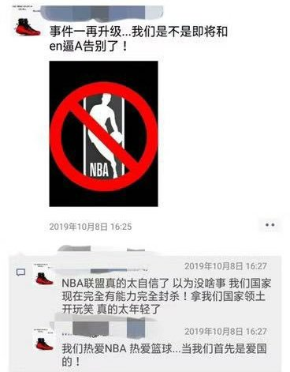

[10月12日 22:27]    BBC News 中文   @bbcchinese    中美贸易谈判关系到关税、农产品、知识产权、技术转让等等议题的同时，记者们还关心华为、香港和美国列的中国公司黑名单…… https://bbc.in/325DJpn   :speech_balloon:评:1 :+1:赞:6 :globe_with_meridians:转:0  

[10月12日 21:40]    BBC News 中文   @bbcchinese     中美第十三次贸易谈判达成阶段协议。美国总统特朗普说，“美中之间曾有过很多摩擦，但如今是场‘爱的聚会’”。 https://bbc.in/2MaofLp   :speech_balloon:评:6 :+1:赞:5 :globe_with_meridians:转:2  

[10月12日 21:00]    纽约时报中文网   @nytchinese    #新新世界  共产党按一下爱国的按钮，大家就都像僵尸一样起来共同反对外国势力，不管是日本还是NBA。”受到香港抗议启发的创作歌手杨洋说。
“他们不问为什么反对这些事情，事实上，他们很多人非常喜欢日本和NBA。” http://nyti.ms/2pZzgGv   :speech_balloon:评:86 :+1:赞:129 :globe_with_meridians:转:32  

[10月12日 20:00]    BBC News 中文   @bbcchinese    韩国K-pop天团BTS（防弹少年团）在沙特阿拉伯演出，引起人权团体批评是为该国洗白人权恶劣记录。大家怎么看？ https://bbc.in/2MyDPiF   :speech_balloon:评:10 :+1:赞:18 :globe_with_meridians:转:7  

[10月12日 19:30]    新闻大吐槽   @TuCaoFakeNews    我爸的一个同事，现内地某一本大学哲学系教授，原来学生时代在北师大的时候参加八九学运，六四后毕业直接发配到现任职大学马列研究处了，后来哲学系一老教授觉得他水平高才把他从马列研究处拉到哲学系，他好像一直在给大学生们传递反马列思想，而且基本上年年获评最受欢迎教师  :speech_balloon:评:1 :+1:赞:34 :globe_with_meridians:转:7  

[10月12日 19:27]    新闻大吐槽   @TuCaoFakeNews    很療瘉! https://twitter.com/TuCaoFakeNews/status/1182913369616990208 …  :speech_balloon:评:0 :+1:赞:24 :globe_with_meridians:转:3  

[10月12日 19:16]    新闻大吐槽   @TuCaoFakeNews    有一首歌叫在人间，大陆已经封杀了。里面的歌词“活在地狱…柏林墙”其实就是中共统治下的现状。  :speech_balloon:评:2 :+1:赞:11 :globe_with_meridians:转:4  

[10月12日 19:16]    新闻大吐槽   @TuCaoFakeNews    是不是香港人也好，為什麼沒有人幫他?  :speech_balloon:评:1 :+1:赞:8 :globe_with_meridians:转:1  

[10月12日 19:15]    新闻大吐槽   @TuCaoFakeNews    we are 拆腻子和I am拆腻子曾几何时已经成为恶臭的代言词……  :speech_balloon:评:1 :+1:赞:4 :globe_with_meridians:转:1  

[10月12日 19:14]    新闻大吐槽   @TuCaoFakeNews     https://twitter.com/tucaofakenews/status/1182939942718062594 …  :speech_balloon:评:0 :+1:赞:2 :globe_with_meridians:转:1  

[10月12日 19:13]    新闻大吐槽   @TuCaoFakeNews     https://twitter.com/tucaofakenews/status/1182939942718062594 …  :speech_balloon:评:0 :+1:赞:6 :globe_with_meridians:转:2  

[10月12日 19:13]    新闻大吐槽   @TuCaoFakeNews    一陣又server error就慘慘豬  :speech_balloon:评:1 :+1:赞:3 :globe_with_meridians:转:1  

[10月12日 19:08]    财经真相   @caijingxiang    来的太迟了！ https://twitter.com/solomonyue/status/1182931497415659521 …  :speech_balloon:评:20 :+1:赞:125 :globe_with_meridians:转:35  

[10月12日 19:06]    新闻大吐槽   @TuCaoFakeNews    停摆的港铁在运送警察
原来此前让警察扮作示威者破坏闸机，是一石二鸟之计！
一，全线停摆，造成普通市民的不方便，激起普通市民对示威者的不满
二，把港铁用作快速调兵的运送系统，机动性大大强于汽车，且不堵车，可迅速调动抓捕聚集的抗议者

港铁真的变成党铁不假了  :speech_balloon:评:8 :+1:赞:138 :globe_with_meridians:转:83  

[10月12日 19:06]    新闻大吐槽   @TuCaoFakeNews    停摆的港铁在运送警察
原来此前让警察扮作示威者破坏闸机，是一石二鸟之计！
一，全线停摆，造成普通市民的不方便，激起普通市民对示威者的不满
二，把港铁用作快速调兵的运送系统，机动性大大强于汽车，且不堵车，可迅速调动抓捕聚集的抗议者

港铁真的变成党铁不假了  :speech_balloon:评:8 :+1:赞:138 :globe_with_meridians:转:83  

[10月12日 19:06]    老司机   @h5lpykl7tp6jjop    看了这些从日本引进的词汇，还敢说这是你以为的中国话吗？  :speech_balloon:评:10 :+1:赞:98 :globe_with_meridians:转:57  

[10月12日 19:06]    新闻大吐槽   @TuCaoFakeNews    共匪和牠們的中共國人都是殘害中國人對專業戶和高手。 https://twitter.com/tucaofakenews/status/1182890412953894914 …  :speech_balloon:评:1 :+1:赞:5 :globe_with_meridians:转:4  

[10月12日 19:05]    新闻大吐槽   @TuCaoFakeNews    印度人的创意，出现在香港街头！  :speech_balloon:评:17 :+1:赞:256 :globe_with_meridians:转:62  

[10月12日 19:05]    新闻大吐槽   @TuCaoFakeNews    印度人的创意，出现在香港街头！  :speech_balloon:评:17 :+1:赞:256 :globe_with_meridians:转:62  

[10月12日 19:00]    新闻大吐槽   @TuCaoFakeNews    Big brother is watching you https://twitter.com/tucaofakenews/status/1182854131217645568 …  :speech_balloon:评:1 :+1:赞:11 :globe_with_meridians:转:3  

[10月12日 19:00]    新闻大吐槽   @TuCaoFakeNews    Chinese: In Shenzhen metro a Hongkong young man is beaten by chinese just because he wears a black Tshirt. https://twitter.com/TuCaoFakeNews/status/1182890412953894914 …  :speech_balloon:评:0 :+1:赞:5 :globe_with_meridians:转:2  

[10月12日 18:56]    新闻大吐槽   @TuCaoFakeNews    哈哈哈 https://twitter.com/tucaofakenews/status/1182939942718062594 …  :speech_balloon:评:0 :+1:赞:5 :globe_with_meridians:转:3  

[10月12日 18:54]    新闻大吐槽   @TuCaoFakeNews    太有才了 https://twitter.com/tucaofakenews/status/1182939942718062594 …  :speech_balloon:评:0 :+1:赞:3 :globe_with_meridians:转:3  

[10月12日 18:53]    新闻大吐槽   @TuCaoFakeNews    这么激动干嘛香港像是她的私有财产一样  :speech_balloon:评:0 :+1:赞:2 :globe_with_meridians:转:1  

[10月12日 18:45]    新闻大吐槽   @TuCaoFakeNews    這是好事，讓美國意識到它們滲透近在眼前
也讓未來中國民主多一只警惕的蛆蟲！
紅色罪犯在作惡後懂得裝成義正言辭來迷惑欺騙他人，試圖為它們作惡違法破壞人類的財產合理化

這也是人類出現法制的原因之一  :speech_balloon:评:1 :+1:赞:8 :globe_with_meridians:转:2  

[10月12日 18:00]    纽约时报中文网   @nytchinese    #新新世界 直到周四，中国为NBA事件降温前，中国的网络世界充满了对抗议活动的谴责。
他们的评论反映了中国自上而下的教育体系传递的信息——一个团结的中国、一个有共同目标的国家，面对外敌不会有丝毫退缩；一个分裂的中国可能会倒退，失去几十年的进步，使国家重新陷入混乱。 http://nyti.ms/2pZzgGv   :speech_balloon:评:38 :+1:赞:81 :globe_with_meridians:转:27  

[10月12日 17:59]    墙国铁拳现世报😷   @Socialistfist    详细补充  :speech_balloon:评:18 :+1:赞:161 :globe_with_meridians:转:35  

[10月12日 17:55]    墙国铁拳现世报😷   @Socialistfist    好担心墙国既是粉红又是NBA球迷的精神健康  :speech_balloon:评:14 :+1:赞:165 :globe_with_meridians:转:31  

[10月12日 17:47]    墙国铁拳现世报😷   @Socialistfist    慈禧太后为什么要杀义和团？ ---百度知道
#社会主义铁拳  :speech_balloon:评:69 :+1:赞:444 :globe_with_meridians:转:168  

[10月12日 17:09]    墙国铁拳现世报😷   @Socialistfist    网传后续，很多人都觉得这是反串，不过笑料倒是满满。  :speech_balloon:评:14 :+1:赞:85 :globe_with_meridians:转:18  

[10月12日 17:00]    BBC News 中文   @bbcchinese    【一周热点回顾】被列入的机构和公司若未得到美国政府许可，无法向美国公司购买产品。 https://bbc.in/2MvUp2T   :speech_balloon:评:26 :+1:赞:68 :globe_with_meridians:转:20  

[10月12日 16:43]    新闻大吐槽   @TuCaoFakeNews    这个视频剪辑之后，变得无比好笑！
推友太有才了，剪辑是一门学问！

引自@jingui_zhu  :speech_balloon:评:57 :+1:赞:654 :globe_with_meridians:转:239  

[10月12日 15:57]    纽约时报中文网   @nytchinese    #新新世界 NBA”挺港“风波在中国大陆引发激烈反应，并让大陆民众几乎都站在了香港示威者的对立面。
这是共产党几十年教育和宣传的成果。中国的“国耻教育“掩盖了关于天安门事件、文革、大跃进、毛泽东革命的许多历史，尽管中共的教训和宣传听起来很粗糙，但确实有效。 http://nyti.ms/2pZzgGv   :speech_balloon:评:235 :+1:赞:421 :globe_with_meridians:转:165  

[10月12日 15:30]    纽约时报中文网   @nytchinese    #每日一词 该词源于非裔美国人英语中的表达“stay woke”（保持警觉），用于表达黑人对种族不公等问题萌发的政治意识。
2010年以后，woke已成为一个不仅限于有色人种语境、使用范围更广泛的词语，并在始于2013年的“黑人的命也是命”运动中得以广泛传播。 http://nyti.ms/2B6bD1o   :speech_balloon:评:5 :+1:赞:11 :globe_with_meridians:转:0  

[10月12日 15:00]    BBC News 中文   @bbcchinese    【一周热点回顾】蔡英文国庆演讲首次提到香港，表示一国两制的失灵导致香港社会处于脱序边缘。台湾将拒绝一国两制， 以民主自由走出自己的路。 https://bbc.in/2OGWTOr   :speech_balloon:评:76 :+1:赞:182 :globe_with_meridians:转:34  

[10月12日 14:30]    纽约时报中文网   @nytchinese    特朗普表示，“原则上”已达成的初步协议涉及中国购买价值400亿美元至500亿美元的美国农产品，并就中国如何管理其汇率的指导方针达成一致。
特朗普表示，协议还包括强迫技术转让等一些知识产权相关条款，将给美国金融服务公司更多进入中国市场的机会。 http://nyti.ms/2M6Q1rW   :speech_balloon:评:11 :+1:赞:9 :globe_with_meridians:转:4  

[10月12日 14:02]    BBC News 中文   @bbcchinese    澳大利亚的土著医术也很博大精深。 // 抑郁症治疗：来自澳大利亚土著的六万年古方 https://bbc.in/2M9BtYP   :speech_balloon:评:25 :+1:赞:107 :globe_with_meridians:转:36  

[10月12日 13:51]    财经真相   @caijingxiang    10月11日，中兴通讯公告称，公司20亿元人民币中期票据和80亿元超短期融资券已获交易商协会注册通过。注册额度自通知书落款之日起2年内有效，可分期发行。目前中兴在银行间市场存续的永续中期票据60亿元，将于2020年1月面临发行人赎回选择权。这是华为发债300亿后，中兴也跟进发债100亿元！  :speech_balloon:评:9 :+1:赞:135 :globe_with_meridians:转:56  

[10月12日 13:47]    财经真相   @caijingxiang    继家乐福中国卖身苏宁之后，又一外资零售巨头退潮。

10月11日晚间，麦德龙集团、物美集团和多点Dmall联合宣布，物美就收购麦德龙中国控股权已与麦德龙集团签订最终协议。交易完成后，物美集团将在双方设立的合资公司中持有80%股份，麦德龙继续持有20%股份。此次交易总计19亿欧元（约21亿美元）  :speech_balloon:评:6 :+1:赞:130 :globe_with_meridians:转:50  

[10月12日 13:30]    纽约时报中文网   @nytchinese    报告发布几小时后，波音董事会即剥夺了公司首席执行官穆伦伯格的董事长头衔。这是该公司董事会迄今做出的最直接回应。
波音发言人约翰德罗在一份声明中表示，该公司将致力于与FAA合作，“安全是波音公司每个人的核心价值”，他说。 http://nyti.ms/2IKiEsR   :speech_balloon:评:3 :+1:赞:5 :globe_with_meridians:转:6  

[10月12日 13:22]    纽约时报中文网   @nytchinese    特朗普称，中美双方已在口头上达成“第一阶段”协议，内容涉及中国购买美国农产品，并调整汇率管理方针。
原定于10月15日上调关税的计划因此而叫停，此举给持续一年之久的贸易战带来了暂时的缓和。特朗普表示，协议需要几周时间制定，双方可能在11月签署。 http://nyti.ms/2M6Q1rW   :speech_balloon:评:31 :+1:赞:40 :globe_with_meridians:转:14  

[10月12日 13:17]    纽约时报中文网   @nytchinese    中印“亦敌亦友”，习近平与莫迪会面谈些什么 https://twitter.com/ccni/status/1182883755507236864 …  :speech_balloon:评:4 :+1:赞:2 :globe_with_meridians:转:0  

[10月12日 12:52]    财经真相   @caijingxiang    环球时报：香港暴力示威活动的背后总能看见外部势力助纣为虐的黑影幢幢。佩洛西、卢比奥等政客更是无视激进分子的暴力行径、频频施压港警。
但与之相反，特朗普并未对香港激进分子表达支持态度，甚至明确表示“香港问题应由中国自己处理”。随后，他遭到不少政客施压。  :speech_balloon:评:22 :+1:赞:79 :globe_with_meridians:转:21  

[10月12日 12:35]    老司机   @h5lpykl7tp6jjop      :speech_balloon:评:0 :+1:赞:0 :globe_with_meridians:转:0  

[10月12日 12:33]    老司机   @h5lpykl7tp6jjop    特朗普宣布中美达成首阶段贸易协议 或下月与习签署 https://youtu.be/N6RHrQoBAJc   :speech_balloon:评:3 :+1:赞:0 :globe_with_meridians:转:0  

[10月12日 12:30]    老司机   @h5lpykl7tp6jjop      :speech_balloon:评:0 :+1:赞:3 :globe_with_meridians:转:2  

[10月12日 12:28]    老司机   @h5lpykl7tp6jjop    贵州女退休教授转港示威图片 被脱光衣服拘武警基地
中国政府现在对于真相传播到了严防捂嘴不准出声的危机关头！
它们知道垮台的后果，滔天的罪恶要清算，已经惊恐到疯狂了！  :speech_balloon:评:7 :+1:赞:14 :globe_with_meridians:转:8  

[10月12日 12:08]    纽约时报中文网   @nytchinese    最新报告指出，波音没有向美国联邦航空管理局(FAA)充分解释737 Max上一个关键的新系统是如何运作的，FAA也缺乏对相关信息进行有效分析的能力。
该机型在五个月内发生了两起致命空难，造成346人死亡。该机型目前已停飞超过7个月。 http://nyti.ms/2IKiEsR   :speech_balloon:评:6 :+1:赞:27 :globe_with_meridians:转:11  

[10月12日 12:07]    老司机   @h5lpykl7tp6jjop    美国国会的议员们：看到一个个香港年轻人的死亡名单，你们仍然不认为中共就是一个恐怖组织吗？中东的恐怖组织杀几个人质后，全世界都愤怒声讨，联合进行围剿。今天的香港，这么多的青年人仅仅是因为诉求民主和自由就被肆意暗杀，美国和西方世界能够一直这样忍心看着中共肆无忌惮地进行屠杀吗？——中铭  :speech_balloon:评:22 :+1:赞:315 :globe_with_meridians:转:173  

[10月12日 12:05]    GFHG SDKM   @zyx_yny    我係新join twitter做文宣㗎，暫時得<100個followers，聽聞過左300個文宣威力會大啲，可唔可以幫手follow，我會follow番，加油，反抗！

互follow同RT手足嘅po啊，齊上齊落！

#followbackhongkong
#StandWithHongKong  :speech_balloon:评:10 :+1:赞:41 :globe_with_meridians:转:14  

[10月12日 11:59]    纽约时报中文网   @nytchinese    #每日一词 在围绕着香港事件的争议中，NBA的沉默使外界怀疑，将政治言论作为球员权利的它，是否还是“最觉醒”的联盟(the wokest professional sports league)。
Woke一词源于非裔美国人英语，意为“对种族和社会不公问题保持警觉”。 http://nyti.ms/2B6bD1o   :speech_balloon:评:30 :+1:赞:83 :globe_with_meridians:转:18  

[10月12日 11:24]    老司机   @h5lpykl7tp6jjop    爱国主义在中国仿佛是最能提升民心统一团结的行动，当然不能与利益关连，只能空喊，否则你叫各人回家把进口商品电器全砸了试试能不能成？把在国外留学工作移民的子女叫得回来？现在去日本旅游，看NBA兰球的事都弄的现丑了，所以这个花活只能玩玩，骗儍子可以骗别人可以，骗自己都不行，你真的爱国？  :speech_balloon:评:1 :+1:赞:18 :globe_with_meridians:转:4  

[10月12日 11:13]    老司机   @h5lpykl7tp6jjop    中国近10年垮了50座桥 据不完全统计，如果大桥的垮塌确实是因为超载引起的，那么是因为中国桥梁的设计承重过低，还是超载太猖獗？专家估计独墩柱承载弯曲路段在设计上有问题，大部分桥塌有设计上的隐忧，但这个体制下不好下断言。另外超载的确也是非常严重现象。好了，说了半天桥垮了，原因太复杂，扯  :speech_balloon:评:5 :+1:赞:57 :globe_with_meridians:转:19  

[10月12日 11:12]    GFHG SDKM   @zyx_yny    The land of LIES https://twitter.com/realKyleOlbert/status/1182711131745468422 …  :speech_balloon:评:0 :+1:赞:0 :globe_with_meridians:转:0  

[10月12日 10:32]    BBC News 中文   @bbcchinese    过去一周，BBC News中文的这些故事受到关注，我们带您回顾本周。  // NBA和《南方公园》争议、香港禁蒙面法和本周更多好故事 https://bbc.in/2VA6c42   :speech_balloon:评:24 :+1:赞:133 :globe_with_meridians:转:42  

[10月12日 10:30]    纽约时报中文网   @nytchinese    这次峰会差点泡汤。习近平一直没给莫迪一个明确的答复，直到几天前，他在最后一刻才证实的确要访问印度。看来，中国对印度最近在边境附近的一些军事演习感到不满。
在短暂访问中，围绕着克什米尔的领土争端，以及贸易等问题都将在两位领导人讨论之列。 http://nyti.ms/33gwDP4   :speech_balloon:评:7 :+1:赞:8 :globe_with_meridians:转:3  

[10月12日 10:06]    财经真相   @caijingxiang    对，这次谈判中共等于是付出了所有人筹码，金融市场放开保证华尔街的利益，一但落成文本签字中共就不能再反悔，等到第二阶段谈判时，华尔街对川普的压力会大大降低，这就是川普的谈判策略！ https://twitter.com/seven_banannacc/status/1182838209933242368 …  :speech_balloon:评:61 :+1:赞:320 :globe_with_meridians:转:121  

[10月12日 09:57]    纽约时报中文网   @nytchinese    习近平周五对印度进行短暂访问，并将与莫迪会晤。中印既是邻国，也是战略对手。两国都拥有核武器，两国关系也一如既往地复杂。
习近平和莫迪都是两国几十年来产生的最具影响力的领导人，两人都有着超乎寻常的个性。但彼此之间，他们别无选择，只能倾听。 http://nyti.ms/33gwDP4   :speech_balloon:评:17 :+1:赞:29 :globe_with_meridians:转:9  

[10月12日 09:43]    财经真相   @caijingxiang    班农说川普是个懂的运用杠杆的总统，微缩版的协议是为了更大的协议，第一阶段的deal，包含金融开放、汇率、买农产品这些不触及中共体制的内容。作为翘板这些在第二轮中不能再作为中共退让谈判筹码。第二阶段将直接涉及国企垄断补贴、互联网开放、强制技术转让、以及弹簧门、玻璃门等政体改革硬骨头！  :speech_balloon:评:118 :+1:赞:740 :globe_with_meridians:转:224  

[10月12日 07:54]    BBC News 中文   @bbcchinese    八集系列片《世界制造》为您讲述八件产品打造全球经济的故事。 https://bbc.in/2pgGOVe   :speech_balloon:评:3 :+1:赞:26 :globe_with_meridians:转:13  

[10月12日 07:31]    BBC News 中文   @bbcchinese    从NBA开始， BBC中文为您盘点十大最近踩上中国政治红线的跨国公司 https://bbc.in/316wJXW   :speech_balloon:评:45 :+1:赞:116 :globe_with_meridians:转:47  

[10月12日 07:10]    BBC News 中文   @bbcchinese    他坚称，冷战就从未结束过，而现在只是用不同的方法进行战斗。 https://bbc.in/319g9H5   :speech_balloon:评:4 :+1:赞:47 :globe_with_meridians:转:18  

[10月12日 06:33]    老司机   @h5lpykl7tp6jjop    这个车挂党徽的货车司机，被交警处罚时，
为表对党对领袖的忠心，竟然当着交警的面，跳起忠字舞。
但是警察可不惯着他的毛病，处罚的超级狠，
竟然以精神不正常为由，吊消了他的驾照。
这真是个悲伤的故事，爱国贼们要引以为戒…  :speech_balloon:评:24 :+1:赞:183 :globe_with_meridians:转:89  

[10月12日 06:13]    BBC News 中文   @bbcchinese    特朗普表示，最终的协议文本会在未来的五周内完成。下月，他可能将在智利与中国国家主席习近平会面。 https://bbc.in/2VB9fcq   :speech_balloon:评:42 :+1:赞:72 :globe_with_meridians:转:27  

[10月12日 04:20]    财经真相   @caijingxiang    班农说过，对川普的弹劾谘询将在感恩节前正式开始，这是中共为啥要五周时间的根本原因！ https://twitter.com/stephen_liuhuan/status/1182751627083735040 …  :speech_balloon:评:17 :+1:赞:200 :globe_with_meridians:转:66  

[10月12日 04:09]    财经真相   @caijingxiang    市场计价完毕，人民币开始回跌，股市小幅下跌黄金反弹！ https://twitter.com/caijingxiang/status/1182748170683478016 …  :speech_balloon:评:9 :+1:赞:77 :globe_with_meridians:转:22  

[10月12日 04:01]    财经真相   @caijingxiang    迷你协议内容：1.货币政策和汇率问题更加透明 2.技术转让问题得到进一步保障 3.中共同意购买400-500亿美元农产品 4.接下来五周落实协议 5.金融领域已经达成协议  本协议最核心点是五周时间，也就是有效期是五周！翻译水平有限各位自己看原文吧！  :speech_balloon:评:88 :+1:赞:371 :globe_with_meridians:转:187  

[10月12日 02:18]    老司机   @h5lpykl7tp6jjop    【关注香港】10月11日：不自由，毋宁死！革命直到最后一人！走过四个月，是政府主动突破我们的恐惧。我们十分明白有死的风险，但我们不会退缩，退缩的话这场运动就会输！抗争继续！香港人！加油  :speech_balloon:评:10 :+1:赞:242 :globe_with_meridians:转:117  

[10月12日 01:04]    GFHG SDKM   @zyx_yny    Hello NCM Yue,

Are you aware of this article of alleged CCP-approved rape and murder of HK teens, using Chinese AI and surveillance technology? https://theaiorganization.com/artificial-intelligence-with-facial-recognition-hunts-hongkong-youth-for-capture-rape-so-called-suicide/ …  :speech_balloon:评:0 :+1:赞:8 :globe_with_meridians:转:7  

[10月12日 01:04]    GFHG SDKM   @zyx_yny    The whole bridge was burnt to an ash. But I’m quite sure #HKPolice will find no suspicious circumstances in that case. :) #hkprotest #LennonWall https://twitter.com/hongkongfp/status/1181744626421518336 …  :speech_balloon:评:1 :+1:赞:2 :globe_with_meridians:转:2  

[10月12日 01:02]    GFHG SDKM   @zyx_yny    Who’s next to kowtow to #CCPChina for money？ https://twitter.com/hkdailytimes852/status/1182650881855983616 …  :speech_balloon:评:0 :+1:赞:5 :globe_with_meridians:转:2  

[10月12日 00:59]    GFHG SDKM   @zyx_yny    An auntie said to #HKPolice, even Japanese Imperial Army at the old time won’t catch so many children...... https://twitter.com/joshuawongcf/status/1182655025975365632 …  :speech_balloon:评:0 :+1:赞:2 :globe_with_meridians:转:2  

[10月12日 00:47]    GFHG SDKM   @zyx_yny    This commander isn’t the first time losing its control over the operation. You can see other popo can still hold them temper except that keep-spraying commander https://twitter.com/hkpolics/status/1182676907885654018 …  :speech_balloon:评:1 :+1:赞:12 :globe_with_meridians:转:8  

[10月12日 00:43]    GFHG SDKM   @zyx_yny    Can’t imagine they are the future of #China 
Oh no, that’s actually makes sense...
#chinazi https://twitter.com/hiroshiman18/status/1182566652438646784 …  :speech_balloon:评:2 :+1:赞:4 :globe_with_meridians:转:2  

[10月11日 23:34]    墙国铁拳现世报😷   @Socialistfist    支持NBA的推友们抓紧了，马上投票就要结束了，别说党和人民没有给你机会啊  :speech_balloon:评:1 :+1:赞:41 :globe_with_meridians:转:2  

[10月11日 23:33]    GFHG SDKM   @zyx_yny    Spontaneous mourning of the 15-year-old girl whose body was discovered in the sea on Oct 10. RIP
 https://www.facebook.com/groups/hkincident/permalink/2317418885051977/ …  :speech_balloon:评:0 :+1:赞:9 :globe_with_meridians:转:8  

[10月11日 23:30]    墙国铁拳现世报😷   @Socialistfist    又爱又怕，唉

PS 本推第一个符合两个系列的推诞生了！
#社会主义铁拳
#战螂在推特  :speech_balloon:评:59 :+1:赞:544 :globe_with_meridians:转:137  

[10月11日 23:18]    老司机   @h5lpykl7tp6jjop    11 Oct Whampoa #HKPolice “u motherfucker. *spray* Go away. *spray* Arrest the motherfucker. Arrest him arrest him arrest him.” #HongKongPolice #HKPoliceTerrorism #hkpolicebrutality #HKPoliceTerrorists #HKprotests #hongkong #hk #StandwithHonKong #StandwithHK  :speech_balloon:评:246 :+1:赞:1782 :globe_with_meridians:转:1834  

[10月11日 22:52]    财经真相   @caijingxiang    这是典型的逻辑矛盾！ https://twitter.com/zerohedge/status/1182668476277760002 …  :speech_balloon:评:5 :+1:赞:17 :globe_with_meridians:转:3  

[10月11日 22:30]    BBC News 中文   @bbcchinese    清华马克思主义学院副教授吕嘉被学生举报，成为近期第二位被调查的清华老师。大陆告密风气渐起引发“文革返潮”担忧。
 https://bbc.in/2pc5ttR   :speech_balloon:评:79 :+1:赞:221 :globe_with_meridians:转:116  

[10月11日 21:53]    BBC News 中文   @bbcchinese    习近平与莫迪同样面对着国内经济呆滞，这亚洲两大国家的领导人能否排除万难达成任何共识，备受关注。
 https://bbc.in/2OBwIZo   :speech_balloon:评:40 :+1:赞:32 :globe_with_meridians:转:8  

[10月11日 21:49]    财经真相   @caijingxiang    昨天爱尔兰和英国就脱欧问题举行磋商，会后双方都发表了乐观的言论，市场猜测爱尔兰有可能就边界问题松口，从而大大降低了英国硬脱欧的风险，受此乐观预期影响英镑今天飙升200点，同时叠加中美贸易谈判缓和信息，全球股市暴涨，黄金一度跌破1480关口，风险资产全面回归，全球股市都在买买买！  :speech_balloon:评:3 :+1:赞:118 :globe_with_meridians:转:21  

[10月11日 21:30]    纽约时报中文网   @nytchinese    #时报专栏 首先，我们应把中国封锁国外新闻网站和社交媒体平台作为贸易问题向世界贸易组织提出申诉。第二步，是增加对互联网规避技术公司的投资，帮助中国百姓翻越防火长城，阅读未经审查的新闻。第三，美国的情报界应该搜集关于习近平家族的腐败情况，查出他们如何聚敛财富。 http://nyti.ms/2M5PgzC   :speech_balloon:评:58 :+1:赞:165 :globe_with_meridians:转:51  

[10月11日 20:30]    纽约时报中文网   @nytchinese    “追星可以，“一名大学生说，“但是我们不能以丢了祖国的尊严为代价。”
“”而且我们还有CBA（中国篮球职业联赛）呢，“另一人说，“当然没那么好看。” http://nyti.ms/33gz9Vo   :speech_balloon:评:12 :+1:赞:15 :globe_with_meridians:转:3  

[10月11日 20:19]    GFHG SDKM   @zyx_yny    So sorry for all the victims... https://twitter.com/realkyleolbert/status/1182630827668185094 …  :speech_balloon:评:0 :+1:赞:3 :globe_with_meridians:转:1  

[10月11日 20:16]    GFHG SDKM   @zyx_yny    ...
nothing more to say about #HKPoliceTerrorism #FreeHK https://twitter.com/EricWan2/status/1182593369471537154 …  :speech_balloon:评:0 :+1:赞:0 :globe_with_meridians:转:0  

[10月11日 20:13]    墙国铁拳现世报😷   @Socialistfist    今天收到了很多推友投稿和 @ ，其中有一则是某精赵在17年发微博控诉未成年女儿被性侵一事。首先照例感谢各位踊跃投稿 
因为事发17年，涉及到未成年人且是性侵害，经考虑不发推防止不必要的网络暴力。
希望大家理解  :speech_balloon:评:29 :+1:赞:196 :globe_with_meridians:转:15  

[10月11日 20:11]    BBC News 中文   @bbcchinese    中国国家主席习近平今天前往印度，与总统莫迪举行非正式会晤。在见面地点金奈的一间学校内，有约2000名学生戴上习近平的面具，为正式在机场进行的欢迎仪式作采排。  :speech_balloon:评:312 :+1:赞:925 :globe_with_meridians:转:350  

[10月11日 20:00]    BBC News 中文   @bbcchinese    【什么样的“外国人”可以为中国队踢世界杯？】首次有外国脸孔的球员代表中国参战世界杯预选赛，到底“归化球员”是如何“炼成”的？ https://bbc.in/2Mu6fdS   :speech_balloon:评:12 :+1:赞:9 :globe_with_meridians:转:0  

[10月11日 19:31]    BBC News 中文   @bbcchinese    苹果本周下架香港示威者常用的地图APP:  http://HKmap.live  引发讨论，称软件对港警安全造成危险。大家怎么看？https://bbc.in/2nB16rN   :speech_balloon:评:126 :+1:赞:60 :globe_with_meridians:转:18  

[10月11日 19:30]    纽约时报中文网   @nytchinese    #图集 【“我们在战火中”：一份阿富汗战争口述史】在美国入侵阿富汗的18年间，当地人都过着怎样的生活？阿富汗人民讲述了自己的故事。
“我们在战火中，但尽管有战争和杀戮，我们仍在努力继续过生活，”一名当地人说。
点击查看图集： http://nyti.ms/2AZ4ccp   :speech_balloon:评:19 :+1:赞:12 :globe_with_meridians:转:3  

[10月11日 19:29]    BBC News 中文   @bbcchinese    中国江苏省无锡市发生一起高架桥侧翻事故，包括一名男子及一对母女在内的三人死亡。罹难女童仅有5岁。  :speech_balloon:评:76 :+1:赞:131 :globe_with_meridians:转:64  

[10月11日 19:25]    BBC News 中文   @bbcchinese    时代不同了，一切皆可以成为商品，包括国籍和护照。但前提是你需要有钱，有很多的钱。 https://bbc.in/2VyAOmB   :speech_balloon:评:9 :+1:赞:112 :globe_with_meridians:转:45  

[10月11日 19:20]    墙国铁拳现世报😷   @Socialistfist    推友们你有没有闻到一股恶臭
为两地遇难者祈福  :speech_balloon:评:36 :+1:赞:301 :globe_with_meridians:转:51  

[10月11日 19:16]    GFHG SDKM   @zyx_yny    昨日、ある香港中文大学の学生が校長先生の前で、自分が逮捕されたあと警察に性的暴行を受けたと告白しました。その学生は警察署への連行後、男性警官に胸を触られ、20人以上の男性警官の前で衣服を上げられたと訴えました。彼女が自分の経験を告発したあと、親中派から中傷電話がたくさん来ています。  :speech_balloon:评:411 :+1:赞:22204 :globe_with_meridians:转:14672  

[10月11日 19:05]    GFHG SDKM   @zyx_yny    Tysm wish you all the best my dear. https://twitter.com/helphkinfo/status/1182545224645644288 …  :speech_balloon:评:0 :+1:赞:1 :globe_with_meridians:转:2  

[10月11日 19:01]    BBC News 中文   @bbcchinese    马钊指出，美国政界对香港局势的反应比较谨慎。无论是总统本人、国务卿、还是议员，都只是在“民主”层面支持抗议者，但是并没有支持抗议示威活动中出现的暴力倾向，更没有回应“香港独立”的政治诉求。 https://bbc.in/2OzsBgC   :speech_balloon:评:80 :+1:赞:111 :globe_with_meridians:转:38  

[10月11日 18:33]    老司机   @h5lpykl7tp6jjop    再看看正在洗脑的韭菜苗，真是让和珅自叹不如！  :speech_balloon:评:0 :+1:赞:18 :globe_with_meridians:转:6  

[10月11日 18:30]    纽约时报中文网   @nytchinese    相关争论很快从微博10大热门榜单消失。当局没有取消上海的NBA季前赛。《环球时报》也不再煽动对那条推文的民粹主义愤怒情绪。
“我想这个问题会逐步降温——《环球时报》不会刻意让它保持热度，”该报总编胡锡进在回复置评邮件时称。“我也希望美国方面不要采取任何举动让它升级。” http://nyti.ms/2IGIspK   :speech_balloon:评:14 :+1:赞:91 :globe_with_meridians:转:30  

[10月11日 18:10]    老司机   @h5lpykl7tp6jjop    省部级官员退休后一年的福利收入，这还不包括退休金级别待遇以及暗收入，看看差距，私营老板自己比较！  :speech_balloon:评:4 :+1:赞:26 :globe_with_meridians:转:13  

[10月11日 18:06]    GFHG SDKM   @zyx_yny    If we burn, you burn with us!
怒火已燎原
如果我們毀滅，你們也會跟我們同歸於盡
-
Let’s join @freetoberhk2019 !
#ontungc #StandwithHonKong #freetoberhk2019 #inktober2019 #HongKongProtests #HongKongProtesters #FreeHongKong #fire  :speech_balloon:评:49 :+1:赞:1171 :globe_with_meridians:转:567  

[10月11日 18:01]    BBC News 中文   @bbcchinese    如果在美国股市交易的中国公司“被除牌”，哪些投资者要割肉？ https://bbc.in/35oupih   :speech_balloon:评:15 :+1:赞:41 :globe_with_meridians:转:15  

[10月11日 18:00]    纽约时报中文网   @nytchinese    #图集【在美国，22.5万美元能买到什么房？】手握22.5万美元，你能买到缅因州里士满的一座1870年代小屋，或是弗吉尼亚州诺福克改建仓库中的公寓，也可以选择西弗吉尼亚州费尔蒙一座建于1927年的都铎复兴式房屋。
点击查看图集： http://nyti.ms/2B2HDU1   :speech_balloon:评:10 :+1:赞:29 :globe_with_meridians:转:8  

[10月11日 17:58]    老司机   @h5lpykl7tp6jjop      :speech_balloon:评:2 :+1:赞:53 :globe_with_meridians:转:24  

[10月11日 17:54]    GFHG SDKM   @zyx_yny    Apple Daily was told the deceased 15-year-old girl on its front page this morning was cremated yesterday

This is a very sad story, first and foremost because of the tragic loss of life, but also because we will be drowning in rumours again for some time https://hk.news.appledaily.com/local/realtime/article/20191011/60142396 …  :speech_balloon:评:226 :+1:赞:1986 :globe_with_meridians:转:1490  

[10月11日 17:31]    老司机   @h5lpykl7tp6jjop    说中国人懒惰，肯定许多人不同意，但是说他们思想上懒惰就是实情了，从来总是随大流，一窝蜂，跟风成习惯，懒于思辩，总是圣人说古人曰，领袖指东就东指西就西，还特别对有独立思想看法的人恨之入骨，称为叛徒汉奸，于是不东倒就西歪，好比一艘大船航行不能保持平衡，所以几千年来一直赶不上文明的潮流  :speech_balloon:评:6 :+1:赞:109 :globe_with_meridians:转:27  

[10月11日 17:30]    纽约时报中文网   @nytchinese    篮球曾将中美两大经济体联合起来。在这种被称为“中美共同体“的紧密关系中，篮球成为最鲜明的象征；如今，它却可能推动两国的疏离。
周四，洛杉矶湖人队和布鲁克林篮网队的比赛在上海展开，这无疑是NBA历史上最有地缘政治意义的表演赛。一些中国球迷说出了他们的想法。 http://nyti.ms/33gz9Vo   :speech_balloon:评:35 :+1:赞:77 :globe_with_meridians:转:20  

[10月11日 17:07]    GFHG SDKM   @zyx_yny    関係ないなんてことはない
#StandwithHK  :speech_balloon:评:7 :+1:赞:202 :globe_with_meridians:转:112  

[10月11日 17:00]    纽约时报中文网   @nytchinese    最近几周，美国官员们举行了会议，讨论如果当前这一轮谈判不能解决政府的主要关切，还可以采取哪些措施。
特朗普的高级经济顾问们在公开场合淡化了这些讨论；讨论的焦点是加强对在美国证券交易所上市的中国公司的审查，以及限制政府运营的退休基金对中国的直接风险敞口。 http://nyti.ms/2AYIHIJ   :speech_balloon:评:4 :+1:赞:10 :globe_with_meridians:转:4  

[10月11日 16:37]    老司机   @h5lpykl7tp6jjop    目前全世界最先进的直升机是美国的S97，速度才407公里，最大起飞重量才五吨，这个怪东西且不说发动机涵道效率低，就这7吨重量怎么能达到650公里的高速，骗子连起码的常识都不具备，又是个亩产十万斤的牛皮！也不怕风大歪嘴巴！  :speech_balloon:评:1 :+1:赞:20 :globe_with_meridians:转:2  

[10月11日 16:30]    纽约时报中文网   @nytchinese    #时报专栏 别等到中国抓捕小熊维尼时再行动 by @NickKristof  http://nyti.ms/2M5PgzC https://twitter.com/ccni/status/1182562066151817216 …  :speech_balloon:评:8 :+1:赞:14 :globe_with_meridians:转:5  

[10月11日 16:16]    财经真相   @caijingxiang    关于汇率协议将会大幅推动人民币升值纯粹是“大忽悠”，现在中国和当年日本面临的情况完全不一样，日本当年是创新大国，且拥有民主政体保证财富安全，而且日元已经成为世界主流货币被纳入其他国家储备货币，这些今天中共能比吗？中共走回头路资本跑都来不及还有傻瓜去投资？ https://twitter.com/bbcchinese/status/1182566793396793344 …  :speech_balloon:评:30 :+1:赞:367 :globe_with_meridians:转:89  

[10月11日 15:59]    财经真相   @caijingxiang    人民币刚涨了不到一千点，一堆人留言问我是不是爆仓了，很抱歉让你们失望了！这种仓位想爆仓除非让中国出口企业死光！还有中美即使达成协议，无非只是取消新加关税，已经加征会继续维持，这就注定人民币不惧大幅上涨，更何况双方焦点只是达成部分协议，一个大骗局而已！  :speech_balloon:评:50 :+1:赞:256 :globe_with_meridians:转:52  

[10月11日 13:15]    GFHG SDKM   @zyx_yny    I stand with you guys. I can’t do much. And I’m sorry for the idiots here that are letting you down. But they are the minority, but there are plenty like me here in the US that want the best and freedom for you. #FreeHongKong #FreeHK  :speech_balloon:评:507 :+1:赞:2575 :globe_with_meridians:转:1104  

[10月11日 11:53]    老司机   @h5lpykl7tp6jjop    你知道中國奇跡嗎？昨天晚上一座橋垮塌了，早上起來，垮塌的橋不見了！不見了！！  :speech_balloon:评:181 :+1:赞:1273 :globe_with_meridians:转:754  

[10月11日 10:39]    财经真相   @caijingxiang    川普已经明确表态必须是个全面deal，不是部分或者缩小版的，这是中共本次最想争取的结果，中共为此抛出其他各种条件诱惑川普，就看川普如何衡量；如果达成协议，最后签字人必须是习，因此即使双方发表了公告，在习正式签字之前，依然充满各种变数，比如，回国后的刘鹤突然被抓！  :speech_balloon:评:56 :+1:赞:265 :globe_with_meridians:转:51  

[10月11日 10:32]    财经真相   @caijingxiang    贸易谈判到目前为止真假消息漫天飞，从第一天谈判情况来看，双方没有仅仅谈判几个小时就宣布破裂，这本身就是一个利好信号，这也是人民币继续上涨的根源；双方明天继续谈判，刘鹤需要把第一天勾兑情况向北京报告，北京开会后告知刘结果，因此明天才是最关键时刻，在这之前一切都是假消息！  :speech_balloon:评:22 :+1:赞:338 :globe_with_meridians:转:79  

[10月11日 08:51]    凡賽堤/FORSETI   @FecharCCP    魔鬼在人間29
極權殺人恐怖組織正在用各種兇殘手段殺害我們的同胞..........

15歲游泳健將發夢彥林被棄屍大海，離奇死亡！

上帝啊，祈求你開眼把，看看極權殺人恐怖組織在人類大地上所犯下的種種反人類的罪行吧！！！！！！！！！！！！！！！！！！！！！！！！  :speech_balloon:评:16 :+1:赞:292 :globe_with_meridians:转:191  

[10月11日 07:42]    老司机   @h5lpykl7tp6jjop    香港中文大学同学听了一位女同学泣诉被捕后曾遭性侵和酷刑心痛如绞，抱头痛哭！！谁来救救香港这些未成年孩子和花季少女？难道都眼瞎了良心被狗吃了吗？性侵女示威者的狗警岂能只是谴责？应该绳之以法！！！  :speech_balloon:评:215 :+1:赞:1286 :globe_with_meridians:转:631  

[10月11日 06:40]    凡賽堤/FORSETI   @FecharCCP    魔鬼在人間27
極權殺人恐怖組織正在用各種兇殘手段殺害我們的同胞..........

他們大部份都才8歲，10歲，12歲，16歲，17歲的香港小學生，中學生被暴打，被抓捕！上帝啊，祈求你開眼把，看看極權殺人恐怖組織在人類大地上所犯下的種種反人類的罪行吧！！！！！！！！！！！！！！！！！！！！！！！！  :speech_balloon:评:1 :+1:赞:21 :globe_with_meridians:转:18  

[10月11日 06:06]    凡賽堤/FORSETI   @FecharCCP    極權殺人恐怖組織正在用各種兇殘手段殺害我們的同胞.......... https://twitter.com/FecharCCP/status/1182089689588736001 …  :speech_balloon:评:1 :+1:赞:11 :globe_with_meridians:转:8  

[10月11日 06:06]    凡賽堤/FORSETI   @FecharCCP    極權殺人恐怖組織正在用各種兇殘手段殺害我們的同胞.......... https://twitter.com/FecharCCP/status/1182079070210859010 …  :speech_balloon:评:2 :+1:赞:8 :globe_with_meridians:转:8  

[10月11日 06:06]    凡賽堤/FORSETI   @FecharCCP    極權殺人恐怖組織正在用各種兇殘手段殺害我們的同胞.......... https://twitter.com/FecharCCP/status/1182079157443928064 …  :speech_balloon:评:0 :+1:赞:5 :globe_with_meridians:转:7  

[10月11日 06:06]    凡賽堤/FORSETI   @FecharCCP    極權殺人恐怖組織正在用各種兇殘手段殺害我們的同胞.......... https://twitter.com/FecharCCP/status/1182079248024121344 …  :speech_balloon:评:0 :+1:赞:5 :globe_with_meridians:转:6  

[10月11日 06:06]    凡賽堤/FORSETI   @FecharCCP    極權殺人恐怖組織正在用各種兇殘手段殺害我們的同胞.......... https://twitter.com/FecharCCP/status/1182079392387911680 …  :speech_balloon:评:0 :+1:赞:8 :globe_with_meridians:转:6  

[10月11日 06:06]    凡賽堤/FORSETI   @FecharCCP    極權殺人恐怖組織正在用各種兇殘手段殺害我們的同胞.......... https://twitter.com/FecharCCP/status/1182079492958883840 …  :speech_balloon:评:0 :+1:赞:2 :globe_with_meridians:转:2  

[10月11日 06:05]    凡賽堤/FORSETI   @FecharCCP    極權殺人恐怖組織正在用各種兇殘手段殺害我們的同胞.......... https://twitter.com/FecharCCP/status/1182079697460633600 …  :speech_balloon:评:0 :+1:赞:2 :globe_with_meridians:转:0  

[10月11日 06:05]    凡賽堤/FORSETI   @FecharCCP    極權殺人恐怖組織正在用各種兇殘手段殺害我們的同胞.......... https://twitter.com/FecharCCP/status/1182079805044543488 …  :speech_balloon:评:0 :+1:赞:12 :globe_with_meridians:转:5  

[10月11日 06:05]    凡賽堤/FORSETI   @FecharCCP    極權殺人恐怖組織正在用各種兇殘手段殺害我們的同胞.......... https://twitter.com/FecharCCP/status/1182079900393582592 …  :speech_balloon:评:0 :+1:赞:2 :globe_with_meridians:转:2  

[10月11日 06:05]    凡賽堤/FORSETI   @FecharCCP    極權殺人恐怖組織正在用各種兇殘手段殺害我們的同胞.......... https://twitter.com/FecharCCP/status/1182080070007046146 …  :speech_balloon:评:0 :+1:赞:1 :globe_with_meridians:转:1  

[10月11日 06:04]    凡賽堤/FORSETI   @FecharCCP    極權殺人恐怖組織正在用各種兇殘手段殺害我們的同胞.......... https://twitter.com/FecharCCP/status/1182359771447382016 …  :speech_balloon:评:0 :+1:赞:1 :globe_with_meridians:转:0  

[10月11日 06:04]    凡賽堤/FORSETI   @FecharCCP    極權殺人恐怖組織正在用各種兇殘手段殺害我們的同胞.......... https://twitter.com/FecharCCP/status/1182367617799131142 …  :speech_balloon:评:0 :+1:赞:2 :globe_with_meridians:转:1  

[10月11日 06:01]    凡賽堤/FORSETI   @FecharCCP    魔鬼在人間26
極權殺人恐怖組織正在用各種兇殘手段殺害我們的同胞..........

他們大部份都才8歲，10歲，12歲，16歲，17歲的香港小學生，中學生被暴打，被抓捕！上帝啊，祈求你開眼把，看看極權殺人恐怖組織在人類大地上所犯下的種種反人類的罪行吧！！！！！！！！！！！！！！！！！！！！！！！！  :speech_balloon:评:0 :+1:赞:2 :globe_with_meridians:转:2  

[10月11日 06:01]    凡賽堤/FORSETI   @FecharCCP    魔鬼在人間25
極權殺人恐怖組織正在用各種兇殘手段殺害我們的同胞..........

他們大部份都才8歲，10歲，12歲，16歲，17歲的香港小學生，中學生被暴打，被抓捕！上帝啊，祈求你開眼把，看看極權殺人恐怖組織在人類大地上所犯下的種種反人類的罪行吧！！！！！！！！！！！！！！！！！！！！！！！！  :speech_balloon:评:0 :+1:赞:2 :globe_with_meridians:转:0  

[10月11日 06:00]    凡賽堤/FORSETI   @FecharCCP    魔鬼在人間24
極權殺人恐怖組織正在用各種兇殘手段殺害我們的同胞..........

他們大部份都才8歲，10歲，12歲，16歲，17歲的香港小學生，中學生被暴打，被抓捕！上帝啊，祈求你開眼把，看看極權殺人恐怖組織在人類大地上所犯下的種種反人類的罪行吧！！！！！！！！！！！！！！！！！！！！！！！！  :speech_balloon:评:0 :+1:赞:2 :globe_with_meridians:转:1  

[10月11日 06:00]    凡賽堤/FORSETI   @FecharCCP    魔鬼在人間23
極權殺人恐怖組織正在用各種兇殘手段殺害我們的同胞..........

他們大部份都才8歲，10歲，12歲，16歲，17歲的香港小學生，中學生被暴打，被抓捕！上帝啊，祈求你開眼把，看看極權殺人恐怖組織在人類大地上所犯下的種種反人類的罪行吧！！！！！！！！！！！！！！！！！！！！！！！！  :speech_balloon:评:0 :+1:赞:2 :globe_with_meridians:转:0  

[10月11日 05:59]    凡賽堤/FORSETI   @FecharCCP    魔鬼在人間22
極權殺人恐怖組織正在用各種兇殘手段殺害我們的同胞..........

他們大部份都才8歲，10歲，12歲，16歲，17歲的香港小學生，中學生被暴打，被抓捕！上帝啊，祈求你開眼把，看看極權殺人恐怖組織在人類大地上所犯下的種種反人類的罪行吧！！！！！！！！！！！！！！！！！！！！！！！！  :speech_balloon:评:0 :+1:赞:2 :globe_with_meridians:转:1  

[10月11日 05:58]    凡賽堤/FORSETI   @FecharCCP    魔鬼在人間21
極權殺人恐怖組織正在用各種兇殘手段殺害我們的同胞..........

他們大部份都才8歲，10歲，12歲，16歲，17歲的香港小學生，中學生被暴打，被抓捕！上帝啊，祈求你開眼把，看看極權殺人恐怖組織在人類大地上所犯下的種種反人類的罪行吧！！！！！！！！！！！！！！！！！！！！！！！！  :speech_balloon:评:0 :+1:赞:2 :globe_with_meridians:转:0  

[10月11日 03:50]    GFHG SDKM   @zyx_yny    During my trip to #HongKong I met with pro-democracy leaders & I learned that Nonlethal Technologies, Inc provides the HK police with the tear gas used to oppress the people.

This was a disturbing revelation & I’m requesting a meeting with the company’s leadership immediately.  :speech_balloon:评:526 :+1:赞:3299 :globe_with_meridians:转:2070  

[10月11日 01:54]    墙国铁拳现世报😷   @Socialistfist    为契合推文主题小编特别推出投稿指南。
#社会主义铁拳 指某精赵在各平台（如微博贴吧）公开发布地爱党国言论和被铁拳截图，两者可为新后或并列关系。至少两张截图

#战螂在推特  是一个分享战螂在推特上的反价值观魔幻言行的品鉴系列，要求宽松符合条件即可。  :speech_balloon:评:8 :+1:赞:72 :globe_with_meridians:转:5  

[10月11日 01:41]    墙国铁拳现世报😷   @Socialistfist    这个月里，我们一起回顾了历史上的铁拳，我们还有幸请到了墙内粉红兔兔@zzyyzoe ，并把她打造成推特网红。
，还搞了让大家心服口服的民主投票，最后新系列#战螂在推特 也获得大家良好反响。  :speech_balloon:评:8 :+1:赞:110 :globe_with_meridians:转:4  

[10月11日 01:39]    墙国铁拳现世报😷   @Socialistfist    9月11日开办的墙国铁拳现世报, 今天满月了！多谢一个月来各位看官捧场，感谢大家的转发点赞评论三连。还要特别感谢给小编投稿的各位，是你们让这个推坚持活跃下去 
大家的热情，让小编受宠若惊。
（更正8000+推友）  :speech_balloon:评:22 :+1:赞:435 :globe_with_meridians:转:35  

[10月11日 01:16]    GFHG SDKM   @zyx_yny    This is the #CCP world we live in now. WAKE UP!

A Sydney #gamingstartup has been hit by a concerted #cyberattack after it offered to support a professional gamer banned from his sport for endorsing #HongKong #democracyprotests. https://www.smh.com.au/business/companies/sydney-startup-under-fire-online-for-supporting-pro-hong-kong-protest-gamer-20191009-p52z2g.html …  :speech_balloon:评:117 :+1:赞:1305 :globe_with_meridians:转:1059  

[10月10日 22:22]    墙国铁拳现世报😷   @Socialistfist    突然爱国，突然强拆
#社会主义铁拳 https://twitter.com/rtiomn/status/1182294052466614272 …  :speech_balloon:评:97 :+1:赞:596 :globe_with_meridians:转:138  

[10月10日 22:01]    老司机   @h5lpykl7tp6jjop    黃埔後代在上海淞滬抗戰公園舉青天白日旗被警察帶走  :speech_balloon:评:26 :+1:赞:176 :globe_with_meridians:转:82  

[10月10日 17:44]    墙国铁拳现世报😷   @Socialistfist    全推特最纯净的推 https://twitter.com/zSP8IcFxk8kpaJv/status/1182229009410641920 …  :speech_balloon:评:24 :+1:赞:290 :globe_with_meridians:转:25  

[10月10日 17:28]    墙国铁拳现世报😷   @Socialistfist    你们看看这些假爱国者，竟然为了房子威胁国家，上街游行。
#社会主义铁拳  :speech_balloon:评:78 :+1:赞:522 :globe_with_meridians:转:163  

[10月10日 17:15]    墙国铁拳现世报😷   @Socialistfist    突然来了很多香港选民，你们投完票可以去何议员那里继续投票  :speech_balloon:评:10 :+1:赞:100 :globe_with_meridians:转:7  

[10月10日 13:38]    财经真相   @caijingxiang    唐纳德·J·特朗普的大作《The way to  the top》，中文名《颠覆之路》！  :speech_balloon:评:15 :+1:赞:118 :globe_with_meridians:转:28  

[10月10日 11:32]    GFHG SDKM   @zyx_yny      :speech_balloon:评:3 :+1:赞:335 :globe_with_meridians:转:45  

[10月10日 09:48]    财经真相   @caijingxiang    离岸人民币从7.1680到7.0999，短短一个小时近700点！  :speech_balloon:评:74 :+1:赞:317 :globe_with_meridians:转:84  

[10月10日 09:10]    财经真相   @caijingxiang    这两天市场被媒体忽悠惨了，来回割肉，不过现在加大农产品采购，说明中共还是玩的买买买的套路，不准备全面达成协议。双方第一次接触将很重要，也就是说北京时间10号21:00至11号凌晨5点，将是决定本轮会谈最后时间，各位交易员做好准备，暴风雨要来了！ https://twitter.com/LoneCapital/status/1182096813882372097 …  :speech_balloon:评:22 :+1:赞:248 :globe_with_meridians:转:107  

[10月10日 07:44]    老司机   @h5lpykl7tp6jjop    悲慘的香港5 ，看到這一幕幕屍體，我們是悲痛？是無助？還是哭泣？是憤怒？ 面對強權，我們該如何？

（聲明！圖片來源均來自網絡媒體，如有侵權，立即刪除）  :speech_balloon:评:49 :+1:赞:408 :globe_with_meridians:转:323  

[10月09日 23:15]    墙国铁拳现世报😷   @Socialistfist    中国突然取消了NBA投票选项 https://twitter.com/VOAChinese/status/1181942149064998912 …  :speech_balloon:评:2 :+1:赞:52 :globe_with_meridians:转:3  

[10月09日 23:14]    新闻大吐槽   @TuCaoFakeNews    这下暴雪要哭了，
其射击游戏「守望先锋」的预告片里，一个中国女孩角色被高手给P了，改成了一个支持反送中的香港女孩！

是时候全民抵制暴雪了，请在墙内广传此影片！  :speech_balloon:评:115 :+1:赞:3256 :globe_with_meridians:转:1575  

[10月09日 23:08]    财经真相   @caijingxiang    香港资本外逃，从2017年年初肖建华被抓就已经开始了，这也是2017年年初那波高峰的原因，此后资本外逃就没有停止过，始终停留在最高峰，我做的YouTube视频《港币危机真正根源——被掩盖的红色恐慌指数（red vix）》 https://www.youtube.com/watch?v=7wHu4BAMzxI&t=2s …  有详细讲解，零对冲这个图各位可以对比一下！https://twitter.com/zerohedge/status/1181947916770058240 …  :speech_balloon:评:3 :+1:赞:200 :globe_with_meridians:转:68  

[10月09日 22:56]    墙国铁拳现世报😷   @Socialistfist    后后续，王老师已销号，推出推特  :speech_balloon:评:11 :+1:赞:65 :globe_with_meridians:转:4  

[10月09日 19:45]    财经真相   @caijingxiang    对火箭队的讨论在中国已经达到文革的地步！  :speech_balloon:评:55 :+1:赞:476 :globe_with_meridians:转:182  

[10月09日 19:05]    墙国铁拳现世报😷   @Socialistfist    CBA目前领先，NBA加油呀！  :speech_balloon:评:7 :+1:赞:445 :globe_with_meridians:转:4  

[10月09日 19:03]    墙国铁拳现世报😷   @Socialistfist      :speech_balloon:评:13 :+1:赞:298 :globe_with_meridians:转:34  

[10月09日 11:46]    墙国铁拳现世报😷   @Socialistfist    8:00 上贴吧讨论，贴吧被封
9:00 豆瓣瓜组组cp，组被解散号被封
10:00 微博质问来去之间，期间言论被收集于@Socialistfist 
11:00 连vpn上pornhub
11:05 撸完骂几句女优丑
12:00 起点yy小说，穿越之我是希特勒
1:00am 睡觉，醒来又是斗志满满的一天呢  :speech_balloon:评:6 :+1:赞:130 :globe_with_meridians:转:22  

[10月09日 00:47]    GFHG SDKM   @zyx_yny    "Son, when you grow up
You will be the savior of the broken
The beaten, and the damned?"
Please watch this powerful mv #HongKongProtester #hkprotests 
香港反送中護法戰爭(Hong Kong Defensive War 2019)：Welcome To The Black Parade  https://youtu.be/0yXTHODE24Q  via @YouTube  :speech_balloon:评:3 :+1:赞:16 :globe_with_meridians:转:4  

[10月05日 09:33]    凡賽堤/FORSETI   @FecharCCP    呼籲請求共同挖掘所有有關香港發生的事，越全面越好，不同角度，越多越好，包括被暗地抓捕的人員，特別是CCP 派出的各種偽裝身份，包括變身變裝行兇的一點一滴都要挖掘出來，把CCP 的邪惡下三濫手段的真相毫無保留的曝光在全世界面前！世界公知公義才能真正挽救和保護香港人！希望懂視頻編輯配上中英文 https://twitter.com/hjjohnson17/status/1178969916499746816 …  :speech_balloon:评:2 :+1:赞:4 :globe_with_meridians:转:3  

[09月06日 19:03]    财经真相   @caijingxiang    本次降准总计是释放增量资金9000亿，但是提前下发的2020年地方债最高为1.85万亿，降准释放的资金只够新一轮刺激的一半，剩下的资金将会从现有社会存量来补充，这在一定程度收紧了金融系统的流动性；不过和以往一样，央行的降准刺激措施依然是打着“中小企业”的名义下调的!连接 https://www.youtube.com/watch?v=Usp9LIngNl0&feature=youtu.be …  :speech_balloon:评:20 :+1:赞:237 :globe_with_meridians:转:79  

[03月13日 08:10]    老司机   @h5lpykl7tp6jjop    批评是批评家天生的使命！他们只感知对错，信奉真理，指出真相不吐不快，不在意权势和群众的喜好，从批评里不可能获得任何好处，但批评家愚直不改。在中国几乎所有人都讨厌批评家，喜欢阴谋家，因为他们只说好听的！可是就因为中国的批评家太少，中国几乎看不到未来和希望！  :speech_balloon:评:76 :+1:赞:171 :globe_with_meridians:转:41  

[01月10日 13:30]    纽约时报中文网   @nytchinese    每年一月，《纽约时报》​​会选出52个年度旅游目的地。将举办冬奥会的中国崇礼、炫目奢华的香港、日本濑户内各岛皆入选。
新的一年，你计划好要去哪里旅行了吗？ http://nyti.ms/2Tz9N06   :speech_balloon:评:278 :+1:赞:372 :globe_with_meridians:转:193  

