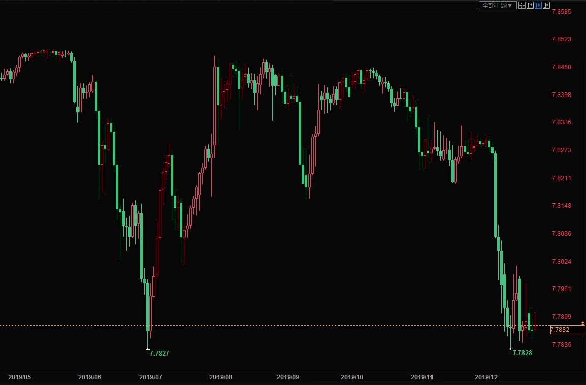

[01月02日 09:29]    新闻大吐槽   @TuCaoFakeNews    不要单独行动，要相互照顾！ https://twitter.com/TuCaoFakeNews/status/1212306676834947072 …  :speech_balloon:评:0 :+1:赞:2 :globe_with_meridians:转:1  

[01月02日 09:28]    新闻大吐槽   @TuCaoFakeNews    畜生！ https://twitter.com/TuCaoFakeNews/status/1211709426882637824 …  :speech_balloon:评:0 :+1:赞:1 :globe_with_meridians:转:1  

[01月02日 09:28]    新闻大吐槽   @TuCaoFakeNews    致敬香港！祝福香港！感恩香港！  :speech_balloon:评:0 :+1:赞:1 :globe_with_meridians:转:1  

[01月02日 09:26]    新闻大吐槽   @TuCaoFakeNews    不要嘗試和共匪講法律，否則自找苦吃。  :speech_balloon:评:0 :+1:赞:2 :globe_with_meridians:转:1  

[01月02日 09:26]    老司机   @h5lpykl7tp6jjop    恩施到南阳500多公里，载货最多5吨，平均下来一公斤3．66元，价值高的货物还可以，日用品，农付产品怎么办？  :speech_balloon:评:0 :+1:赞:1 :globe_with_meridians:转:0  

[01月02日 09:22]    新闻大吐槽   @TuCaoFakeNews    有本事把600万人都抓起来吧  :speech_balloon:评:0 :+1:赞:1 :globe_with_meridians:转:1  

[01月02日 09:19]    新闻大吐槽   @TuCaoFakeNews    港人威武香港，曾经的东方之珠，今天的华人之光照亮了世界！  :speech_balloon:评:0 :+1:赞:2 :globe_with_meridians:转:1  

[01月02日 09:16]    新闻大吐槽   @TuCaoFakeNews    香港冇警察。只有持武器罪犯 https://twitter.com/tucaofakenews/status/1212404259523715072 …  :speech_balloon:评:0 :+1:赞:3 :globe_with_meridians:转:2  

[01月02日 09:16]    新闻大吐槽   @TuCaoFakeNews    支持你！ https://twitter.com/TuCaoFakeNews/status/1211838602545483777 …  :speech_balloon:评:0 :+1:赞:3 :globe_with_meridians:转:1  

[01月02日 09:15]    新闻大吐槽   @TuCaoFakeNews    放屁。大陸打架死人冧樓 內地人也只圍觀 什麼聽到爛新聞 就來香港止暴？！ 謊話都作好一點 好嗎  :speech_balloon:评:0 :+1:赞:2 :globe_with_meridians:转:1  

[01月02日 09:15]    新闻大吐槽   @TuCaoFakeNews    赤裸裸的暴力。 https://twitter.com/TuCaoFakeNews/status/1212404259523715072 …  :speech_balloon:评:0 :+1:赞:6 :globe_with_meridians:转:1  

[01月02日 09:14]    新闻大吐槽   @TuCaoFakeNews    暴徒以真面目示人，警察却不敢露脸。谁是暴徒，不用多说了。  :speech_balloon:评:0 :+1:赞:3 :globe_with_meridians:转:2  

[01月02日 09:13]    新闻大吐槽   @TuCaoFakeNews    港人百万大游行预示着
民意不可违，民意不可欺
专治不可行，独裁不可信 https://twitter.com/tucaofakenews/status/1212415629224857601 …  :speech_balloon:评:0 :+1:赞:5 :globe_with_meridians:转:3  

[01月02日 09:13]    新闻大吐槽   @TuCaoFakeNews    香港 新一年 fight back  :speech_balloon:评:0 :+1:赞:2 :globe_with_meridians:转:1  

[01月02日 09:12]    新闻大吐槽   @TuCaoFakeNews    永远关注他们，永远为他们加油！  :speech_balloon:评:0 :+1:赞:1 :globe_with_meridians:转:1  

[01月02日 09:09]    新闻大吐槽   @TuCaoFakeNews    2020年1月1日, 重庆加州花园小区2楼住户熏腊肉, 把整栋楼都烧了 https://twitter.com/TuCaoFakeNews/status/1212540517260480512 …  :speech_balloon:评:1 :+1:赞:3 :globe_with_meridians:转:1  

[01月02日 09:09]    新闻大吐槽   @TuCaoFakeNews    看细皮嫩肉的脸和手就知道不是农民工了，就是中共派去搅混水的 https://twitter.com/TuCaoFakeNews/status/1212304509130534912 …  :speech_balloon:评:0 :+1:赞:1 :globe_with_meridians:转:1  

[01月02日 09:09]    新闻大吐槽   @TuCaoFakeNews    在做除夕年夜飯嗎？注意火燭，希望眾人吸取教訓，不良惡習要根除，不然要付出太大代價。 https://twitter.com/TuCaoFakeNews/status/1212540517260480512 …  :speech_balloon:评:0 :+1:赞:2 :globe_with_meridians:转:1  

[01月02日 09:08]    新闻大吐槽   @TuCaoFakeNews    难道没能规定什么情况下可以用辣椒水吗？他们就这样随处施暴都没办法检举吗？！  :speech_balloon:评:1 :+1:赞:1 :globe_with_meridians:转:1  

[01月02日 09:06]    新闻大吐槽   @TuCaoFakeNews    2020不能脱贫，就准备被扫黑除恶吧  :speech_balloon:评:0 :+1:赞:1 :globe_with_meridians:转:1  

[01月02日 08:48]    新闻大吐槽   @TuCaoFakeNews    香港精神！  :speech_balloon:评:0 :+1:赞:14 :globe_with_meridians:转:6  

[01月02日 08:11]    老司机   @h5lpykl7tp6jjop    这是要让物价疯涨的第一步吗！2020第一劫！
湖北恩施到南阳，4.2米兰牌货车总重量不到7吨，收费一万八千三百一十元，这是打劫吗！  :speech_balloon:评:5 :+1:赞:70 :globe_with_meridians:转:49  

[01月02日 07:03]    BBC News 中文   @bbcchinese    金正恩还说朝鲜不久会启动“一种新的战略武器”。但是他并没有完全关闭对话大门，说测试的范围取决于美国的态度。 https://bbc.in/2SK9Glp   :speech_balloon:评:15 :+1:赞:23 :globe_with_meridians:转:11  

[01月02日 04:22]    老司机   @h5lpykl7tp6jjop    不愧造假大国！
美国海关10大没收名单 ，中国占两席。
5900张来自中国伪造驾照
1万4800双、市值超过220万元的中国伪造耐吉球鞋  :speech_balloon:评:0 :+1:赞:16 :globe_with_meridians:转:7  

[01月02日 03:57]    老司机   @h5lpykl7tp6jjop    特朗普要钱又要命！中美第二阶段贸易谈判难乐观  :speech_balloon:评:0 :+1:赞:7 :globe_with_meridians:转:3  

[01月02日 03:42]    老司机   @h5lpykl7tp6jjop    重庆一小区大火:从楼底烧到楼顶 现场浓烟冲天

2020年1月1日，有网友称，重庆渝北区加州城市花园小区发生火灾。据现场视频显示，起火建筑系一栋高层建筑，有十几层都可见明火。  :speech_balloon:评:1 :+1:赞:4 :globe_with_meridians:转:1  

[01月02日 02:47]    老司机   @h5lpykl7tp6jjop    香港警察让一对老夫妻在紅燈时过馬路，并威胁说：「你不過，我就抓你」「不过马路，非法集結」。
是警察精神错乱了，还是给社会制造混乱？
視頻來源 #逆权运动  :speech_balloon:评:7 :+1:赞:67 :globe_with_meridians:转:45  

[01月02日 00:59]    BBC News 中文   @bbcchinese    她寻蛛丝马迹乔装潜入极右翼组织，通过各种试探、考验进入了“非请莫入”的网上聊天密室，所见所闻令她直呼“太可怕”。
 https://bbc.in/2QehH0d   :speech_balloon:评:7 :+1:赞:32 :globe_with_meridians:转:19  

[01月02日 00:49]    老司机   @h5lpykl7tp6jjop    103万，久违的百万级游行，发生在新年第一天！  :speech_balloon:评:39 :+1:赞:1310 :globe_with_meridians:转:586  

[01月02日 00:49]    新闻大吐槽   @TuCaoFakeNews    103万，久违的百万级游行，发生在新年第一天！  :speech_balloon:评:39 :+1:赞:1311 :globe_with_meridians:转:587  

[01月02日 00:30]    BBC News 中文   @bbcchinese    以色列女子莉亚特·莫卡（Liat Malka）渴望成家生子，却一直没碰上意中人。一个偶然的机缘，她加入了一个极不寻常的计划，帮助一位陌生男士完成了他的临终遗愿。
 https://bbc.in/36q2M8Z   :speech_balloon:评:1 :+1:赞:23 :globe_with_meridians:转:7  

[01月02日 00:02]    BBC News 中文   @bbcchinese    2020年元旦，香港如何度过新年第一天？  :speech_balloon:评:15 :+1:赞:65 :globe_with_meridians:转:28  

[01月01日 23:59]    BBC News 中文   @bbcchinese    长年不与家中亲属联系来往，和家人或家族亲戚断绝关系，这种现象比我们想象的要平常，但有时候也不失为一件好事。
 https://bbc.in/2toqCD2   :speech_balloon:评:0 :+1:赞:21 :globe_with_meridians:转:5  

[01月01日 23:30]    BBC News 中文   @bbcchinese    八九民运被镇压后，中共当局通缉过21名学生领袖。六四30周年之际，BBC中文汇总他们的现状。
 https://bbc.in/2F93ACP   :speech_balloon:评:98 :+1:赞:383 :globe_with_meridians:转:164  

[01月01日 23:20]    BBC News 中文   @bbcchinese    香港警方称有“暴徒”破坏而要求民阵中止游行，民阵反驳称警方打压和平示威，予以强烈谴责。民阵表示超过103万人参与游行，警方则称只有6万人。 https://bbc.in/2SIr4a3   :speech_balloon:评:29 :+1:赞:177 :globe_with_meridians:转:91  

[01月01日 22:59]    BBC News 中文   @bbcchinese    用柠檬汁，就可以知道自己是内向或是外向的性格！这是一个具有悠久历史的人格心理学测试，在家里很容易尝试。
 https://bbc.in/2u9zTzu   :speech_balloon:评:4 :+1:赞:42 :globe_with_meridians:转:20  

[01月01日 22:48]    财经真相   @caijingxiang    首都高速的重点词语是“按照全国统一部署”，说明本次调整是全国性的，并非只是北京一地，从今天实际情况来看，货车收费翻倍，并不是交通部此前所说的“收费水平将降低”，这种欺诈性的新闻，让很多司机来不及准备，导致最近一系列的货运亏损，可以预见的是，接下来整个货运成本都会涨价，通胀又多了一把火  :speech_balloon:评:7 :+1:赞:174 :globe_with_meridians:转:40  

[01月01日 22:44]    财经真相   @caijingxiang    首都高速：1月1日起全国统一取消高速公路省界收费站，实现电子不停车快速通行。届时，北京市将按照全国统一部署，执行新的车型分类标准及高速公路收费标准，实行精确收费。早在12月12日交通部就就行专门的新闻发布会，说货车收费标准将改为按车轴数收费，收费水平将降低！然而今天货车涨价翻倍。  :speech_balloon:评:26 :+1:赞:174 :globe_with_meridians:转:77  

[01月01日 22:35]    BBC News 中文   @bbcchinese    香港今日游行未按原计划完成，中途发生警民冲突。组织方推算，约103万人参与游行。警方称，截至下午5点15分，在出发点及已出发的共有约6万人。(Credit: Getty Images)  :speech_balloon:评:41 :+1:赞:98 :globe_with_meridians:转:50  

[01月01日 22:30]    BBC News 中文   @bbcchinese    阳光、泳池、俊男、美女、比基尼和六块肌……英国最新一季电视真人秀“恋爱岛”创下收视高峰，也对英国社会文化提出几点值得反思的问题。
 https://bbc.in/2tpqQtF   :speech_balloon:评:2 :+1:赞:11 :globe_with_meridians:转:3  

[01月01日 22:15]    财经真相   @caijingxiang    李小鹏指挥，今天高速公路全面涨价，现在知道为啥要强制安装ETC了，他们很清楚，新闻不进行任何报道，目的就是认为中国老百姓会先抗议，最后默认！  :speech_balloon:评:69 :+1:赞:514 :globe_with_meridians:转:261  

[01月01日 22:05]    财经真相   @caijingxiang    不会再有第三阶段的贸易协议了，第二次就包含了剩下的全部条款，川普太极拳打的了纯火炉青！ https://twitter.com/GlobalHimalaya/status/1212351434433294336 …  :speech_balloon:评:7 :+1:赞:250 :globe_with_meridians:转:68  

[01月01日 21:59]    BBC News 中文   @bbcchinese    美国驻苏联大使馆曾收到一个木制的美国国徽，里面没有电线和电池。结果在接下来的七年，办公室的私人对话统统传到苏联人处。
 https://bbc.in/2Qee4Y9   :speech_balloon:评:8 :+1:赞:68 :globe_with_meridians:转:31  

[01月01日 21:54]    财经真相   @caijingxiang    哦？？真的吗？ https://twitter.com/CYC1982/status/1212363602536976384 …  :speech_balloon:评:7 :+1:赞:41 :globe_with_meridians:转:1  

[01月01日 21:30]    BBC News 中文   @bbcchinese    你买咖啡的时候，有没有发觉大中小三种容量，中杯价格几乎和大杯差不多，很多人就是为了贪小便宜而多花了钱，反而还觉得自己赚了。
 https://bbc.in/2tjvFEX   :speech_balloon:评:15 :+1:赞:25 :globe_with_meridians:转:9  

[01月01日 20:59]    BBC News 中文   @bbcchinese    “我有DNA证据，我自己就是活着的犯罪现场。” 一位因强奸受孕而出生的英国女性希望将其生父绳之以法。
 https://bbc.in/2sFXffw   :speech_balloon:评:7 :+1:赞:28 :globe_with_meridians:转:12  

[01月01日 20:30]    BBC News 中文   @bbcchinese    BBC深入走访首尔江南区，从夜店顾客、员工及受害者那里获得了这座纸醉金迷的城市背后不为人知的性丑闻的证据。
 https://bbc.in/36aAEq5   :speech_balloon:评:12 :+1:赞:31 :globe_with_meridians:转:17  

[01月01日 19:18]    BBC News 中文   @bbcchinese    苗条瘦身到底有没有什么秘诀，该如何做到呢？如果能做到，文中的一些建议，相信会有成效。
 https://bbc.in/2sB4wNG   :speech_balloon:评:1 :+1:赞:10 :globe_with_meridians:转:5  

[01月01日 18:25]    财经真相   @caijingxiang    临近年底事多，一不留神央行正式降准了，本次降准是0.5个百分点，不及市场此前预期的1个百分点，释放永久性资金8000多亿元，这点流动性并不能完全弥补1月份的资金缺口，估计接下来央行还会继续进行逆回购和MLF操作，补充剩余的资金欠缺。市场“买预期卖事实”，明天股市高开低走！汇率继续围绕7震荡！  :speech_balloon:评:18 :+1:赞:161 :globe_with_meridians:转:37  

[01月01日 18:19]    BBC News 中文   @bbcchinese    蔡英文发表2020年元旦谈话，除了重提香港为例，说明台湾无法接受一国两制，因为民主与威权无法同存一个国家。 https://bbc.in/2MKMmQA   :speech_balloon:评:97 :+1:赞:728 :globe_with_meridians:转:190  

[01月01日 17:00]    纽约时报中文网   @nytchinese    1999年，新千年开始的时候，人们陷入了争吵。争议的中心是海军天文台，其时间的计算会影响政府卫星和iPhone等等。
一名天文学家说，该机构的立场是新千年始于2001年1月1日。因为天文台使用了约简儒略日来计算时间。天文学家和大地测量学家使用这个约简系统来研究地球的大小。 http://nyti.ms/2u8R8RD   :speech_balloon:评:6 :+1:赞:12 :globe_with_meridians:转:5  

[01月01日 16:00]    纽约时报中文网   @nytchinese    八种方法，在2020年对自己更好一点 http://nyti.ms/35exksC   :speech_balloon:评:1 :+1:赞:12 :globe_with_meridians:转:7  

[01月01日 15:19]    BBC News 中文   @bbcchinese    香港团体民间人权阵线（民阵）在元旦举办游行。下午三点，游行队伍从位于港岛的维多利亚公园起步，由东向西往金钟方向前进。  :speech_balloon:评:35 :+1:赞:300 :globe_with_meridians:转:91  

[01月01日 14:53]    BBC News 中文   @bbcchinese    新西兰的奥克兰则是最先进入新一个十年的大城市，数以千计民众齐聚到奥克兰天空塔附近观赏迎接2020年的烟火。
在国际时区的另一端，无人居住的贝克岛和豪兰岛，将是最后进入2020年的地方。 https://bbc.in/2FmEyR7   :speech_balloon:评:4 :+1:赞:45 :globe_with_meridians:转:24  

[01月01日 14:48]    纽约时报中文网   @nytchinese    为巩固对这个少数民族约占人口一半地区的控制，习近平发起了大规模行动。
这些劳工项目代表了该行动的一条日益扩展的战线。它们和已关押了100多万维吾尔人和哈萨克人的教化营一样，对政府的社会再造战略至关重要。 http://nyti.ms/36iShUU   :speech_balloon:评:11 :+1:赞:26 :globe_with_meridians:转:10  

[01月01日 14:30]    BBC News 中文   @bbcchinese    当2020年新年钟声敲响，世界各地在庆祝新年时，澳大利亚的森林大火已烧毁200多个房屋，致成千上万的人流离失所。　 https://bbc.in/39w6PCk   :speech_balloon:评:29 :+1:赞:50 :globe_with_meridians:转:18  

[01月01日 14:09]    老司机   @h5lpykl7tp6jjop    别致的新年献辞！  :speech_balloon:评:1 :+1:赞:26 :globe_with_meridians:转:11  

[01月01日 13:29]    BBC News 中文   @bbcchinese    一百多年前英国维多利亚时代，一位铁路巨子曾试图在伦敦造出英国版的埃菲尔铁塔让世界侧目。 https://bbc.in/37k4GIc   :speech_balloon:评:0 :+1:赞:21 :globe_with_meridians:转:3  

[01月01日 11:24]    老司机   @h5lpykl7tp6jjop    有人问我三个人被困在沙漠最先要干啥，
我说找水，她严肃的告诉我说我错了，首先应该成立黨支部。  :speech_balloon:评:13 :+1:赞:255 :globe_with_meridians:转:78  

[01月01日 11:20]    老司机   @h5lpykl7tp6jjop    中西教诲差别，
让你学会勤劳，让你学会休息，让你拼命上进，让你掌握幸福，
让你遵守规矩，让你热爱自由，让你学会服从，让你坚守自尊，
让你跟随集体，让你独立自主，让你牢记祖宗，让你放纵自我，
让你顺从权威，让你怀疑一切，让你背负祖训，让你自由发展，
让你从一而终，让你一切为爱。
欢迎继续  :speech_balloon:评:4 :+1:赞:62 :globe_with_meridians:转:13  

[01月01日 10:27]    财经真相   @caijingxiang    中国央行：创新和完善宏观调控，稳健的货币政策要灵活适度，运用多种货币政策工具，保持流动性合理充裕，保持广义货币M2和社会融资规模增速与国内生产总值名义增速相匹配，不搞“大水漫灌”，保持物价水平总体稳定。  :speech_balloon:评:9 :+1:赞:93 :globe_with_meridians:转:19  

[01月01日 05:07]    老司机   @h5lpykl7tp6jjop      :speech_balloon:评:0 :+1:赞:9 :globe_with_meridians:转:3  

[01月01日 05:07]    老司机   @h5lpykl7tp6jjop    转发好文：
医保，就是一个国家的良心。
原创： 维克多如果1993  维克多如果1994  昨天
2019年的最后一天，我想问大家一个扎心的问题：你现在的存款，够你在ICU病房待几天？
先别忙查看你用着六位数的密码保护着四位数的余额了，让我们看看数据。  :speech_balloon:评:4 :+1:赞:55 :globe_with_meridians:转:27  

[01月01日 04:54]    老司机   @h5lpykl7tp6jjop    分享一篇有关同学会的好文章：
再有同学聚会，为什么不去？必须得去！
文/豆腐
2019/12/31  :speech_balloon:评:1 :+1:赞:43 :globe_with_meridians:转:20  

[01月01日 04:21]    老司机   @h5lpykl7tp6jjop    转发久莱网文（节选）  :speech_balloon:评:0 :+1:赞:12 :globe_with_meridians:转:3  

[01月01日 03:27]    墙国铁拳现世报😷   @Socialistfist    对这一届推友，小编是很满意的
再次感谢2019年大力支持和帮助的推友们  :speech_balloon:评:6 :+1:赞:232 :globe_with_meridians:转:33  

[01月01日 03:24]    老司机   @h5lpykl7tp6jjop    中美贸易战究竟谁怕谁？
华为董事长：生存是明年第一要务 将淘汰10%主管

12月31日消息，华为公司轮值董事长徐直军今天向员工和客户发表了题为《求生存，谋发展，砥砺奋进》的2020年新年致辞。他称，2020年预计将是“艰难的一年”，公司有必要在2020年末位淘汰10%的主管，以摆脱公司内部滋生的自满情绪。  :speech_balloon:评:5 :+1:赞:37 :globe_with_meridians:转:7  

[01月01日 02:40]    老司机   @h5lpykl7tp6jjop    除习夜肺炎来袭，肖鼠年鼠疫流行，恶习必除！  :speech_balloon:评:2 :+1:赞:21 :globe_with_meridians:转:0  

[01月01日 01:53]    老司机   @h5lpykl7tp6jjop    不可否认也许这对夫妻之间还有不可启齿秘密，但是这位先生用自己不能适应奢侈的生活来要求离婚，既保全女方的尊严和夫妻二人的脸面，又表达了对夫妻感情不能持续的原因，也算是上善之举，比非要搞到两败俱伤，颜面尽失好多了，是君子之举！  :speech_balloon:评:2 :+1:赞:38 :globe_with_meridians:转:1  

[01月01日 00:18]    老司机   @h5lpykl7tp6jjop    2020 first punch from #hkpf , a woman hitted injured by Water Cannon in Monk Kok.
@Olympics see that ! #Hkers are exploed freedom rights walking into street and facong humanitarianism threatened of #HKPF !
#stopBeijing2022 !sanctions #CCP!
@SolomonYue
@benedictrogers
#soshk  :speech_balloon:评:35 :+1:赞:822 :globe_with_meridians:转:1053  

[12月31日 22:58]    墙国铁拳现世报😷   @Socialistfist    墙国铁拳现世报 恭祝各位推友
新年平安喜乐，铁拳不锤！  :speech_balloon:评:26 :+1:赞:740 :globe_with_meridians:转:122  

[12月31日 22:47]    财经真相   @caijingxiang    2月14号是情人节，这将是中美“最后的甜蜜”，这一天距离节后正式上班刚好一周，再过一周时间的准备，就到了双方开始履约的时间了。同时也是第二阶段谈判的开始，此时再过两周就是中共“两会”，川普在这个时候再度访华，明显是给北京最后的施压，中共必须在两会上启动全面结构性改革！  :speech_balloon:评:15 :+1:赞:122 :globe_with_meridians:转:27  

[12月31日 22:35]    财经真相   @caijingxiang    市场已经彻底提前“计价”第一阶段协议，即使真签字，人民币也涨动力，接下来就是看第二阶段谈判，第二阶段双方将进入深水区，而且第一阶段贸易协议也到了开始落实的时候了；按照双方此前约定，15号签字，美国正式降关税将在30天后，也就是在情人节（2月14号）那天生效！看样子是让中共过好最后一个年！ https://twitter.com/realDonaldTrump/status/1212014713808273410 …  :speech_balloon:评:30 :+1:赞:184 :globe_with_meridians:转:44  

[12月31日 21:13]    老司机   @h5lpykl7tp6jjop    今晚约一百万现场观众和十亿国际用户通过ABC跨平台直播，一同欣赏了2019悉尼跨年庆典的家庭烟花表演。蔷薇在此大家2020新年快乐  :speech_balloon:评:18 :+1:赞:311 :globe_with_meridians:转:95  

[12月31日 19:30]    纽约时报中文网   @nytchinese    《纽约时报》2019年最受欢迎的100篇文章 http://nyti.ms/2SF7Emp   :speech_balloon:评:1 :+1:赞:17 :globe_with_meridians:转:12  

[12月31日 19:25]    财经真相   @caijingxiang    话说深圳、珠海两地，由于靠近港澳，边境有很多换外汇的窗口，美元、英镑、欧元、日元、澳元、加元等等主流货币都可以换随时换!  :speech_balloon:评:12 :+1:赞:161 :globe_with_meridians:转:27  

[12月31日 19:07]    财经真相   @caijingxiang    再过几个小时就新年了，对于新年，我只想说，各位又有五万美元的额度可以换了，赶紧的！  :speech_balloon:评:85 :+1:赞:1087 :globe_with_meridians:转:148  

[12月31日 19:00]    纽约时报中文网   @nytchinese    2019年又到了末尾，随着时间的飞速流逝，人们很容易忘记照顾自己。
今年，时报“智慧生活”栏目发布了许多围绕着自我接受和自我关怀展开的小故事。以下便是能让你在2020年对自己更好一点的八个小方法。 http://nyti.ms/35exksC   :speech_balloon:评:3 :+1:赞:39 :globe_with_meridians:转:23  

[12月31日 18:30]    纽约时报中文网   @nytchinese    #时报专栏 在世界仍存在许多问题的情况下，欢呼进步似乎不得体、存在误导或产生适得其反的效果。此外，这些数字也存在争议，而且，2019年的数字是推断出来的。
但我担心，对世界现状的深度悲观让人麻痹，而不是增强人们的力量；过度悲观不仅让人感到绝望，也让人感到无助。 http://nyti.ms/2F4OnTq   :speech_balloon:评:2 :+1:赞:7 :globe_with_meridians:转:1  

[12月31日 18:00]    纽约时报中文网   @nytchinese    中国正在将新疆穆斯林少数民族改造成一支工人大军。这些项目旨在将少数民族转变为顺从、忠诚的蓝领工人，为工厂提供廉价劳动力。
在当局压力下，贫穷的农民、小商贩和工作年龄的闲散村民要参加数周或数月的培训和灌输课程，然后被分配去制衣、制鞋、扫街或其他工作。 http://nyti.ms/36iShUU   :speech_balloon:评:453 :+1:赞:421 :globe_with_meridians:转:218  

[12月31日 17:30]    纽约时报中文网   @nytchinese    #新新世界 “捕猎”女性、鼓励自杀：PUA背后，中国的性别不平等 by  http://nyti.ms/39nJAuf https://twitter.com/LiYuan6/status/1211463033035165696 …  :speech_balloon:评:8 :+1:赞:9 :globe_with_meridians:转:2  

[12月31日 17:00]    纽约时报中文网   @nytchinese    徐直军的致辞充满了用来描述未来艰难日子的隐喻。这位高管时而把公司比作严冬霜打下的梅花，时而将其比作被狂风吹打的竹子，时而又将其比作艰苦作战中的飞机。
他说，2020年公司的增长速度将不及2019年上半年那样迅速。 http://nyti.ms/2MIbveu   :speech_balloon:评:4 :+1:赞:11 :globe_with_meridians:转:6  

[12月31日 16:34]    纽约时报中文网   @nytchinese    在中国，海参数百年来不仅因为口味，还因为其营养价值和口感而备受推崇。人们相信它还有药用特性，可以治疗从关节炎到阳痿的各种疾病。
然而，即使在因它们而闻名的辽东半岛附近的广鹿岛，野生状态的海参已经成为稀有物种。几十年来，野生的该物种已被人们的需求耗尽。 http://nyti.ms/2F9XyCc   :speech_balloon:评:32 :+1:赞:100 :globe_with_meridians:转:39  

[12月31日 15:45]    纽约时报中文网   @nytchinese    关于一个十年何时开始何时结束的问题一直存在争议。在一些人看来，下一个10年开始于2020年1月1日，结束于2029年12月31日。在另一些人看来，它要从2021年1月1日才开始，到2030年12月31日结束。
对于我们中的许多人来说，这可能让人犯晕。究竟哪一个才是正确的？ http://nyti.ms/2u8R8RD   :speech_balloon:评:33 :+1:赞:38 :globe_with_meridians:转:15  

[12月31日 15:19]    纽约时报中文网   @nytchinese    对华为来说，今年是诉讼之年，是黑名单之年，是外交争端之年，是间谍指控之年，而最近，又成了来自中国互联网的众怒之年。
在年终致辞中，华为副董事长徐直军表示，该公司2019年销售额预计同比增长18％，略低于其年初预期。“2020年将是华为艰难的一年，”徐直军说。 http://nyti.ms/2MIbveu   :speech_balloon:评:31 :+1:赞:43 :globe_with_meridians:转:22  

[12月31日 14:30]    纽约时报中文网   @nytchinese    #新新世界 她的悲惨故事震惊中国公众。在两天内，她微信截图的主题标签在微博上获得了14亿阅读量，该标签后被审查删除。
许多人无法理解北大这所名校的本科生，怎会陷入这样有毒的关系中。许多人也不知道，用这类残酷手段追求女性的男人有个专用名：PUA。by @LiYuan6 http://nyti.ms/39nJAuf   :speech_balloon:评:4 :+1:赞:16 :globe_with_meridians:转:4  

[12月31日 14:01]    纽约时报中文网   @nytchinese    总统大选、涉俄调查、巴黎圣母院火灾、美国高校招生丑闻、影视剧推荐、月食和超级月亮观测指南……
这里是2019年《纽约时报》最受欢迎的100篇文章。 http://nyti.ms/2SF7Emp   :speech_balloon:评:3 :+1:赞:34 :globe_with_meridians:转:19  

[12月31日 13:57]    老司机   @h5lpykl7tp6jjop    人类社会最怕的是有权的人随心所欲！
——托马斯·杰斐逊  :speech_balloon:评:2 :+1:赞:57 :globe_with_meridians:转:29  

[12月31日 13:49]    纽约时报中文网   @nytchinese    #时报专栏 #观点 香港街头的“无限战争” by @NYTimesCohen  http://nyti.ms/39nIMFG https://twitter.com/ccni/status/1211867035027853312 …  :speech_balloon:评:3 :+1:赞:6 :globe_with_meridians:转:4  

[12月31日 13:00]    纽约时报中文网   @nytchinese    #每日一词 Assimilation，同化。在新疆镇压行动中，中国政府开展了同化运动(assimilation campaign)。父母被关进拘禁营的维族儿童被送进寄宿学校，接受融入社会的思想灌输。Assimilation的动词型态assimilate，可指食物的消化、语音的吸收和文化、民族等的同化。更多简报内容： http://nyti.ms/2SEyvyY   :speech_balloon:评:6 :+1:赞:8 :globe_with_meridians:转:4  

[12月31日 12:30]    纽约时报中文网   @nytchinese    #时报专栏 如果世界的现状使你感到沮丧，请听听我的一个想法：在人类历史的长弧中，2019年是有史以来最好的一年。
那些让你烦恼的坏事是真的。但我们在消除极端贫困和文盲、对抗疾病上取得了进步。对人类整体而言，生活的确在变好。by @NickKristof http://nyti.ms/2F4OnTq   :speech_balloon:评:10 :+1:赞:35 :globe_with_meridians:转:22  

[12月31日 12:00]    纽约时报中文网   @nytchinese    便利店元旦放假？东大阪一间7-11挑战日本严苛工作文化。
对日本的便利店来说，节日期间不营业是一件不可思议的事情。东大阪这间便利店放假的想法引发了轩然大波，也触发了对日本“工作狂”、“过劳死”等现象的反思。
更多简报内容： http://nyti.ms/2SEyvyY   :speech_balloon:评:0 :+1:赞:6 :globe_with_meridians:转:3  

[12月31日 11:30]    纽约时报中文网   @nytchinese    #时报专栏 在香港上演第二次天安门会是场可怕的赌博，或许只有发生武装叛乱或直接推动独立才会引发这样的后果。中国大陆准军事部队逐步渗入香港警察，这显然是另一种选择，但并非解决方案。北京面临的困境是，“一国两制”这个只有在创造性的含糊中才能起作用的方法已经没用了。 http://nyti.ms/39nIMFG   :speech_balloon:评:19 :+1:赞:9 :globe_with_meridians:转:4  

[12月31日 11:00]    纽约时报中文网   @nytchinese    日产前董事长卡洛斯·戈恩离开日本，知情人士称其目前已抵达黎巴嫩贝鲁特。
戈恩因财务不当行为在日本面临指控，自去年11月被捕以来，一直在日本监狱进进出出。
更多简报内容： http://nyti.ms/2SEyvyY   :speech_balloon:评:0 :+1:赞:1 :globe_with_meridians:转:2  

[12月31日 10:53]    GFHG SDKM   @zyx_yny    藍店認證: 葵涌工業街2-8號力豐工業大廈 Rhe Kitchen 

要容納咁多人仲要得2間餐廳(網民報料)，唯一選擇得呢間私房菜，同樣有大圓枱，同樣有第三張既屏風

仲捉你唔到2020年睇你捱到幾耐
歡迎轉發 #藍店  :speech_balloon:评:20 :+1:赞:203 :globe_with_meridians:转:201  

[12月31日 08:41]    GFHG SDKM   @zyx_yny    This was how Joycelyn Chau, an unarmed young woman, was brutally arrested by a gang of riot police this summer. She'd gone on to win a District Council seat & is due to formally commence duty on 1Jan

She's just been told she is to be charged with assaulting these police officers https://twitter.com/UncleRay_NDJ/status/1211621739978866689 …  :speech_balloon:评:91 :+1:赞:998 :globe_with_meridians:转:1278  

[12月31日 01:29]    财经真相   @caijingxiang    纳瓦罗在福克斯新闻记者追问该报道是否属实时表示，这个问题最好由莱特希泽和特朗普总统回答。他说：“永远不要相信匿名消息来源的报道。听特朗普总统或莱特希泽的。”纳瓦罗还表示，他不认为这一协议还会出现任何困难。此外，这份86页长的协议除了包含有关保护知识产权的内容外，还有强制技术转让！ https://twitter.com/caijingxiang/status/1211682476533223426 …  :speech_balloon:评:9 :+1:赞:142 :globe_with_meridians:转:53  

[12月31日 01:06]    GFHG SDKM   @zyx_yny    猶豫要不要加上這兩個 hashtags: #老竇教仔 #老母教仔

好吧，就當我沒寫哦。別駡

那個，courtesy matters. 跟外國政要致謝，盡量不要用thanks 或 thxx. 這也不算 rude，但過度 casual，少了一份誠意，甚至給人一種 over familiar 的感覺。好似你與對方多年深交，一起泡吧，一起泡妞，一起泡澡的那種  :speech_balloon:评:5 :+1:赞:103 :globe_with_meridians:转:48  

[12月31日 00:28]    GFHG SDKM   @zyx_yny    Just one day or two before the new year, #PoliceBrutality never stops. A pregnant lady was badly treated by #hkpolice in Tin Shui Wai and forced to kneel on the ground. She terribly threw up, but #police kept scolding at her. #policestatehk  :speech_balloon:评:982 :+1:赞:8881 :globe_with_meridians:转:11090  

[12月31日 00:16]    财经真相   @caijingxiang    《南华早报》引述消息人士的话说，华盛顿方面此前已经向中方发出了邀请，刘鹤也已接受。报道指，刘鹤将在周六率团前往华盛顿，而中方团队预计会在美国滞留数日，直至下周中旬。截至目前，美国白宫和贸易代表办公室等尚未就这一消息予以回应。 川普不是说要习来签字吗？中方刘签字，美方川普签字？  :speech_balloon:评:31 :+1:赞:158 :globe_with_meridians:转:44  

[12月30日 16:14]    财经真相   @caijingxiang    2020年中国高息美元债务明年三月份将到达高峰！  :speech_balloon:评:11 :+1:赞:238 :globe_with_meridians:转:95  

[12月30日 11:17]    财经真相   @caijingxiang    当地时间12月29日晚间，美国军方对活跃在伊拉克和叙利亚境内的一民兵组织“人民动员组织”发动空袭。美国国防部声称，此举是对该组织“近期对伊拉克北部一处美军基地进行袭击的报复”。 受此消息影响，黄金在避险情绪助推下，升破1515美元，加上美元走弱，黄金短期难以回调！  :speech_balloon:评:3 :+1:赞:104 :globe_with_meridians:转:24  

[12月30日 10:58]    财经真相   @caijingxiang    美元走弱，这对人民币汇率构成一定支撑，在中美第一阶段签字的预期下，人民币汇率会继续小幅追随欧元升值，估计又会有信仰不坚定的人，卖美元换回人民币了！ https://twitter.com/caijingxiang/status/1211480438604062721 …  :speech_balloon:评:9 :+1:赞:74 :globe_with_meridians:转:13  

[12月30日 10:53]    财经真相   @caijingxiang    欧元今天涨破阻力1.1200关口，技术上走势显示，欧元继续上升趋势很强，这就意味着美元指数在未来一段时间会继续走弱！  :speech_balloon:评:4 :+1:赞:46 :globe_with_meridians:转:8  

[12月30日 10:49]    财经真相   @caijingxiang    香港返送中一来，港币与美元隔夜利差走势，与港币与美元汇率走势图，大致一致，港币流动性被控制的很严格！  :speech_balloon:评:2 :+1:赞:29 :globe_with_meridians:转:7  

[12月30日 09:51]    财经真相   @caijingxiang    据齐鲁晚报官方APP报道，2019年起在济南行政区域内就业的全日制本科及以上学历应届高校毕业生，可申请办理“泉城人才交通卡”，并于2020年1月1日起享受免费乘坐市内公交、地铁的政策。济南公交集团和轨道交通集团将于12月30日起，启动“泉城人才交通卡”的预售和办理工作。 不是人才，而是韭菜！  :speech_balloon:评:17 :+1:赞:89 :globe_with_meridians:转:12  

[12月29日 20:59]    财经真相   @caijingxiang    中国央行公布了存量房贷利率挂钩LPR的办法，这种方式短期内不会对存量房贷产生太大影响。由市场都预期会降息，所以大部分人都选择浮动加点，但是如果猪肉引发的通胀预期在，明年LPR利率很难降低甚至还会存在上涨的可能。同时由于房贷已经还基准利率“脱钩”，接下来基准利率降息也不会减少房奴还贷成本。  :speech_balloon:评:16 :+1:赞:177 :globe_with_meridians:转:53  

[12月29日 01:29]    凡賽堤/FORSETI   @FecharCCP    ----你見過幾十個穿制服的圍毆性侵一個小女生嗎？------

極權恐怖組織的殺人犯警2019年12月份的納粹暴行（19）

我們都是歷史的見證者！

時代革命，消滅極權，CCP 不能代表中國，CCP 不能代表中國人！

----感謝此視頻的原創作者！  :speech_balloon:评:2 :+1:赞:70 :globe_with_meridians:转:66  

[12月29日 01:09]    凡賽堤/FORSETI   @FecharCCP    極權恐怖組織的殺人犯警的納粹暴行（圖1）

---黑警犯警強姦警暴警殺人警非法執法濫捕香港小青年，學生，兒童！

我們都是歷史的見證者！

時代革命，消滅極權，CCP 不能代表中國，CCP 不能代表中國人！

----感謝此視頻的原創作者！  :speech_balloon:评:0 :+1:赞:16 :globe_with_meridians:转:17  

[12月29日 00:48]    凡賽堤/FORSETI   @FecharCCP    你認同一個政府稱呼人類為蟑螂？
你認同一個政府稱呼手無寸鐵的在校學生為暴徒？
你認同一個政府僱傭黑社會團伙肆意毆打市民？
你認同一個政府動用部隊武警毆打，殘殺市民？
你認同警察部隊武警殺人後高樓拋屍？
你認同警察部隊武警輪姦少女後殺人大海拋屍？
你認同....幾個月就陸續殺死近萬名學生？  :speech_balloon:评:22 :+1:赞:366 :globe_with_meridians:转:276  

[12月29日 00:25]    凡賽堤/FORSETI   @FecharCCP    ----你見過幾十個穿制服的圍毆暴打一個正常市民嗎？------

極權恐怖組織的殺人犯警2019年12月份的納粹暴行（17）-

我們都是歷史的見證者！

時代革命，消滅極權，CCP 不能代表中國，CCP 不能代表中國人！

----感謝此視頻的原創作者！  :speech_balloon:评:1 :+1:赞:58 :globe_with_meridians:转:48  

[12月29日 00:20]    凡賽堤/FORSETI   @FecharCCP    ----你見過穿制服的這種殘暴手段？------

極權恐怖組織的殺人犯警2019年12月份的納粹暴行（18）-

我們都是歷史的見證者！

時代革命，消滅極權，CCP 不能代表中國，CCP 不能代表中國人！

----感謝此視頻的原創作者！  :speech_balloon:评:1 :+1:赞:80 :globe_with_meridians:转:90  

[12月28日 23:56]    凡賽堤/FORSETI   @FecharCCP    極權恐怖組織的殺人犯警2019年12月份的納粹暴行（17）-

----殘暴打頭------

我們都是歷史的見證者！

時代革命，消滅極權，CCP 不能代表中國，CCP 不能代表中國人！

----感謝此視頻的原創作者！  :speech_balloon:评:14 :+1:赞:172 :globe_with_meridians:转:165  

[12月28日 07:54]    凡賽堤/FORSETI   @FecharCCP    我們不可停止，我們將無限循環傳播香港的全方位被CCP極權組織殘暴殺害的種種真相視頻和畫面，永不停止！！！！！！！！！！！！！！！！！！！！！！！！！！！！！！！！！！！！！！！！！！！！！！！！！！！！！！！！！！！！！！！！！！！！！！！！！！！！！！！！！！！ https://twitter.com/FecharCCP/status/1207809972341559296 …  :speech_balloon:评:1 :+1:赞:40 :globe_with_meridians:转:29  

[12月28日 07:52]    凡賽堤/FORSETI   @FecharCCP    極權恐怖組織的殺人犯警2019年12月份的納粹暴行（16）

我們都是歷史的見證者！

時代革命，消滅極權，CCP 不能代表中國，CCP 不能代表中國人！

----感謝此視頻的原創作者！  :speech_balloon:评:1 :+1:赞:89 :globe_with_meridians:转:98  

[12月28日 07:44]    凡賽堤/FORSETI   @FecharCCP    極權恐怖組織的殺人犯警2019年12月份的納粹暴行（15）

---黑警犯警強姦警暴警殺人警非法執法濫捕香港小青年，學生，兒童！

我們都是歷史的見證者！

時代革命，消滅極權，CCP 不能代表中國，CCP 不能代表中國人！

----感謝此視頻的原創作者！  :speech_balloon:评:2 :+1:赞:31 :globe_with_meridians:转:42  

[12月28日 07:37]    凡賽堤/FORSETI   @FecharCCP    極權恐怖組織的殺人犯警2019年12月份的納粹暴行（14）

---黑警犯警強姦警暴警殺人警非法執法濫捕香港小青年，學生，兒童！

我們都是歷史的見證者！

時代革命，消滅極權，CCP 不能代表中國，CCP 不能代表中國人！

----感謝此視頻的原創作者！  :speech_balloon:评:8 :+1:赞:134 :globe_with_meridians:转:166  

[12月28日 07:09]    墙国铁拳现世报😷   @Socialistfist    最新人造铁拳
未知原因，微博用户“青游记” 已经在此类P图内“被代言” 了好几回了，小编在这里表示慰问。  :speech_balloon:评:9 :+1:赞:46 :globe_with_meridians:转:3  

[12月28日 07:08]    凡賽堤/FORSETI   @FecharCCP    極權恐怖組織的殺人犯警2019年12月份的納粹暴行（13）

---黑警犯警強姦警暴警殺人警非法執法濫捕香港小青年，學生，兒童！

我們都是歷史的見證者！

時代革命，消滅極權，光復華族，人人有責！

----感謝此視頻的原創作者！  :speech_balloon:评:0 :+1:赞:9 :globe_with_meridians:转:14  

[12月28日 06:55]    凡賽堤/FORSETI   @FecharCCP    極權恐怖組織的殺人犯警2019年12月份的納粹暴行（12）

---黑警犯警強姦警暴警殺人警非法執法濫捕香港小青年，學生，兒童！

我們都是歷史的見證者！

時代革命，消滅極權，光復華族，人人有責！

----感謝此視頻的原創作者！  :speech_balloon:评:2 :+1:赞:48 :globe_with_meridians:转:45  

[12月28日 06:50]    凡賽堤/FORSETI   @FecharCCP    極權恐怖組織的殺人犯警2019年12月份的納粹暴行（11）
---她們都是正常走在街上的學生而已！

我們都是歷史的見證者！

時代革命，消滅極權，光復華族，人人有責！

----感謝此視頻的正義原創作者！  :speech_balloon:评:3 :+1:赞:79 :globe_with_meridians:转:61  

[12月28日 06:42]    凡賽堤/FORSETI   @FecharCCP    極權恐怖組織的殺人犯警2019年12月份的納粹暴行（10）

我們都是歷史的見證者！

時代革命，消滅極權，光復華族，人人有責！

----感謝此視頻的正義原創作者！  :speech_balloon:评:0 :+1:赞:4 :globe_with_meridians:转:3  

[12月28日 06:36]    凡賽堤/FORSETI   @FecharCCP    極權恐怖組織的殺人犯警2019年12月份的納粹暴行（9）

我們都是歷史的見證者！

時代革命，消滅極權，光復華族，人人有責！

----感謝此視頻的正義原創作者！  :speech_balloon:评:2 :+1:赞:11 :globe_with_meridians:转:11  

[12月28日 06:35]    凡賽堤/FORSETI   @FecharCCP    極權恐怖組織的殺人犯警2019年12月份的納粹暴行（7）

我們都是歷史的見證者！

時代革命，消滅極權，光復華族，人人有責！

----感謝此視頻的正義原創作者！  :speech_balloon:评:0 :+1:赞:51 :globe_with_meridians:转:38  

[12月28日 06:34]    凡賽堤/FORSETI   @FecharCCP    極權恐怖組織的殺人犯警2019年12月份的納粹暴行（8）

我們都是歷史的見證者！

時代革命，消滅極權，光復華族，人人有責！

----感謝此視頻的正義原創作者！  :speech_balloon:评:5 :+1:赞:153 :globe_with_meridians:转:172  

[12月28日 06:32]    凡賽堤/FORSETI   @FecharCCP    極權恐怖組織的殺人犯警2019年12月份的納粹暴行（6）

我們都是歷史的見證者！

時代革命，消滅極權，光復華族，人人有責！

----感謝此視頻的正義原創作者！  :speech_balloon:评:0 :+1:赞:6 :globe_with_meridians:转:9  

[12月28日 06:31]    凡賽堤/FORSETI   @FecharCCP    極權恐怖組織的殺人犯警2019年12月份的納粹暴行（5）

我們都是歷史的見證者！

時代革命，消滅極權，光復華族，人人有責！

----感謝此視頻的正義原創作者！  :speech_balloon:评:37 :+1:赞:588 :globe_with_meridians:转:608  

[12月27日 17:52]    墙国铁拳现世报😷   @Socialistfist    据推友提供的截图显示，@minzhutiequan 不幸被举报生效推特铁拳，虽然小编一直没有觉得此人在推上言行违反过相关条例。  :speech_balloon:评:27 :+1:赞:214 :globe_with_meridians:转:19  

[12月27日 02:04]    墙国铁拳现世报😷   @Socialistfist    高光时刻  :speech_balloon:评:21 :+1:赞:162 :globe_with_meridians:转:17  

[12月26日 23:22]    墙国铁拳现世报😷   @Socialistfist    @minzhutiequan  :speech_balloon:评:8 :+1:赞:70 :globe_with_meridians:转:2  

[12月26日 23:18]    墙国铁拳现世报😷   @Socialistfist    寻人启事  :speech_balloon:评:86 :+1:赞:470 :globe_with_meridians:转:84  

[12月25日 19:01]    墙国铁拳现世报😷   @Socialistfist    今天是12月25日，墙国铁拳现世报编辑部全体祝各位推友圣诞快乐，心想事成，也要祝各位粉蚷战螂剩蛋快乐！  :speech_balloon:评:13 :+1:赞:260 :globe_with_meridians:转:12  

[12月25日 10:13]    GFHG SDKM   @zyx_yny    #HongKongPolice Fire #TearGas Cannisters From Rooftop of the Police Station
~12:30am, 25 Dec 2019
Tsim Sha Tsui (TST) police station, #HKProtesters 
Source: RTHK  :speech_balloon:评:19 :+1:赞:533 :globe_with_meridians:转:637  

[12月25日 02:17]    GFHG SDKM   @zyx_yny    Corrupt regime ..Hong Kong is dying Hong Kong people will not forget these hatreds.  :speech_balloon:评:6 :+1:赞:91 :globe_with_meridians:转:118  

[12月25日 00:27]    GFHG SDKM   @zyx_yny    This boy was just walking past at the Harbour City with a mask on, but was severely beaten by the mad dog @hkpoliceforce aiming at his head.

#HongKongPoliceTerrorists #hongkongpolicebrutality #HongKongProstests #HongKongPoliceState #China_is_terroris #SOSHK https://twitter.com/nanalai/status/1209448858406637569 …  :speech_balloon:评:3 :+1:赞:67 :globe_with_meridians:转:84  

[12月25日 00:18]    GFHG SDKM   @zyx_yny    Can’t help but think, looking at these pictures of Christmas Eve in #HongKong, that the birth Christians celebrate tomorrow is a rebuke and a challenge to tyrants everywhere #StandWithHongKong https://twitter.com/jeffreychngo/status/1209452932095258625 …  :speech_balloon:评:1581 :+1:赞:15749 :globe_with_meridians:转:12350  

[12月24日 23:55]    GFHG SDKM   @zyx_yny    #HKPoliceTerrorists opened fire at protestors from atop buildings, breaking guidelines and endangering civilians’ lives. People may get headshot and killed. 

#PoliceBrutality  :speech_balloon:评:185 :+1:赞:2956 :globe_with_meridians:转:3378  

[12月24日 20:01]    墙国铁拳现世报😷   @Socialistfist    感谢广大推友的对上一推的热烈反响和支持。
收到疑似有推友上微博围观评论而遭到喝茶的报告
小编请大家注意网络键政的安全，也不鼓励大家反串留言。  :speech_balloon:评:14 :+1:赞:172 :globe_with_meridians:转:18  

[12月24日 10:23]    墙国铁拳现世报😷   @Socialistfist    附行政复议书  :speech_balloon:评:2 :+1:赞:83 :globe_with_meridians:转:8  

[12月24日 10:18]    墙国铁拳现世报😷   @Socialistfist    ”海口市琼山区龙塘政府自2019年2月开始在没有任何法定证据的前提下，连续三次对香世界庄园下达强制拆除和限期拆除，其中行政复议三次，两次被法院撤销拆除令，第三次复议还在等待结果期间直接无批文强拆……要知道，没有法院批准的拆除令的强拆属于严重违法行为！”

摘自：  http://blog.sina.cn/dpool/blog/s/blog_725524e60102zq6u.html?ref=weibocard&from=109C195010&wm=9847_0002&weiboauthoruid=1918182630 …https://twitter.com/minzhutiequan/status/1209266528006234113 …  :speech_balloon:评:28 :+1:赞:186 :globe_with_meridians:转:28  

[12月23日 18:08]    墙国铁拳现世报😷   @Socialistfist    补充香世界庄园负责人朋友圈  :speech_balloon:评:11 :+1:赞:243 :globe_with_meridians:转:69  

[12月23日 18:05]    墙国铁拳现世报😷   @Socialistfist    媒体报道  :speech_balloon:评:10 :+1:赞:148 :globe_with_meridians:转:27  

[12月23日 18:04]    墙国铁拳现世报😷   @Socialistfist    补充强拆视频  :speech_balloon:评:11 :+1:赞:210 :globe_with_meridians:转:44  

[12月23日 18:03]    墙国铁拳现世报😷   @Socialistfist    美国驻广州总领事说：香世界庄园是一个很酷的地方！
海口政府官员说：并没有。

海口市十多年企业，百号员工，一天化为乌有
#社会主义铁拳  :speech_balloon:评:152 :+1:赞:1293 :globe_with_meridians:转:550  

[12月23日 16:07]    GFHG SDKM   @zyx_yny    Crime of Violence Hong Kong Police Links
香港警察16項國際罪行已經翻譯20種語言
阿拉伯語 –  https://youtu.be/3ATOcsLBuFY 
中文語言 - https://youtu.be/o-mRxwDgWWs 
荷蘭語 - https://youtu.be/fJAZXpwLvjA 
英語 - https://youtu.be/GioMow5iemo 
法語 - https://youtu.be/ANYh58MtjIc 
德語 -https://youtu.be/Im6sTcDJWhE   :speech_balloon:评:31 :+1:赞:958 :globe_with_meridians:转:992  

[12月23日 00:03]    财经真相   @caijingxiang    本轮通胀是由猪肉上涨引发的，其他商品并未同步大涨，这是典型的“机构性通胀”，目前来看对中国金融系统冲击有限，央行不会为此进行加息，甚至会继续降息。比起吃不起猪肉，明年经济继续下滑带来的失业，更让中共金融系统决策者感到棘手！ https://www.youtube.com/watch?v=Ru5vTNydrSg&lc=z22rsvu4wk31cff3cacdp430qwmpwwda5apw1lcqf0tw03c010c …  :speech_balloon:评:13 :+1:赞:183 :globe_with_meridians:转:46  

[12月21日 20:36]    墙国铁拳现世报😷   @Socialistfist    爱党鄙视链

#战螂在推特  :speech_balloon:评:46 :+1:赞:480 :globe_with_meridians:转:95  

[12月20日 22:48]    墙国铁拳现世报😷   @Socialistfist    “每当回到现实生活中，梦立刻被击得粉碎”
网络文学作家 罗霸道发帖称父母辛苦养鱼和邻居的鸭子被人河中投毒毒死，血本无归。警察和当地畜牧水产踢皮球。经历这些种种，罗霸道发文感慨，自己在现实生活中霸道不起来。

#社会主义铁拳  :speech_balloon:评:53 :+1:赞:491 :globe_with_meridians:转:143  

[12月20日 22:03]    墙国铁拳现世报😷   @Socialistfist    经验教训告诉我们，孙笑川们翻墙爱党的后果就是腾讯推特一起封号
因投稿人要求厚码
#社会主义铁拳  :speech_balloon:评:34 :+1:赞:471 :globe_with_meridians:转:99  

[12月20日 07:25]    凡賽堤/FORSETI   @FecharCCP    我們不可停止，我們將無限循環傳播香港的全方位被CCP極權組織殘暴殺害的種種真相視頻和畫面，永不停止！！！！！！！！！！！！！！！！！！！！！！！！！！！！！！！！！！！！！！！！！！！！！！！！！！！！！！！！！！！！！！！！！！！！！！！！！！！！！！！！！！！  :speech_balloon:评:33 :+1:赞:626 :globe_with_meridians:转:677  

[12月19日 01:55]    墙国铁拳现世报😷   @Socialistfist    后续申明  :speech_balloon:评:17 :+1:赞:129 :globe_with_meridians:转:20  

[12月15日 02:39]    GFHG SDKM   @zyx_yny    This Muslim man was just released from a concentration in china 

"He could barely walk by himself. He doesn't recognize anyone in his family and gets frightened by every little movement of people around him"

There are nearly 3 Million Muslim in concentration camps in China   :speech_balloon:评:1495 :+1:赞:75309 :globe_with_meridians:转:62126  

[12月14日 22:11]    GFHG SDKM   @zyx_yny    My 2020 New Year resolution is to free both Hong Kong & China by defeating the New Evil Empire. Happy New Year! https://twitter.com/bohsiuming/status/1205845620851785735 …  :speech_balloon:评:423 :+1:赞:4889 :globe_with_meridians:转:2362  

[12月13日 22:17]    GFHG SDKM   @zyx_yny    警察の鎮圧行動の中、原因不明の転落死で亡くなった周梓樂くん。

これは周くんのお父さんからの手紙。

//君がまだ母親のお腹にいたあの頃に、私たちはすでに君に「樂樂」という名前を付けることを決めたんだ。
君が一生楽しく笑顔で過ごせますように、と願って。//

是非、全文もご一読ください。  :speech_balloon:评:18 :+1:赞:1023 :globe_with_meridians:转:788  

[12月13日 20:13]    GFHG SDKM   @zyx_yny    日本政府が来年、習近平国家主席を国賓として招くことについて、私は強く反対しています。

これはあくまで一人の香港人としての個人的な意見ですが、日本の皆さんに読んでほしいです。→  :speech_balloon:评:744 :+1:赞:22487 :globe_with_meridians:转:10446  

[12月13日 13:58]    GFHG SDKM   @zyx_yny    永不遺忘，常在心中，他們的付出，將會留給世世代代，香港多謝有你才會有未来，香港史書會有手足的勇敢，輝煌的事件。  :speech_balloon:评:52 :+1:赞:836 :globe_with_meridians:转:532  

[12月13日 11:19]    GFHG SDKM   @zyx_yny    Can't believe Commissar Lamb is rewarding @hkpoliceforce human rights abuse & brutality. https://twitter.com/Kaman13032369/status/1205325571070124037 …  :speech_balloon:评:449 :+1:赞:5145 :globe_with_meridians:转:4121  

[12月12日 16:51]    GFHG SDKM   @zyx_yny    Japanese retail brand MUJI was sued by fake "MUJI" copycat in #China (right) for copyright dispute and the fake MUJI won the court case.

The genuine MUJI has to pay the fake one US$85k for their "financial loss" and apologize due to "copyright infringement"

China = Fantasy Land  :speech_balloon:评:151 :+1:赞:1458 :globe_with_meridians:转:1313  

[12月12日 16:35]    GFHG SDKM   @zyx_yny    He comes all the way from Japan, bring coffee with him to give Hong Kong people a free cup. “I come to give some warmth to you guys, I know what happened” he said 

#StandWithHongKong  :speech_balloon:评:162 :+1:赞:4036 :globe_with_meridians:转:2109  

[12月12日 13:43]    GFHG SDKM   @zyx_yny    今日、すき家の香港店がオープンしました。昨日の夜から長い行列ができました（笑）

親中派企業が経営している香港吉野家を多くの香港人がボイコットしている今、すき家は多分大人気になると思いますw

#香港 #すき家  :speech_balloon:评:453 :+1:赞:23947 :globe_with_meridians:转:7817  

[11月24日 08:10]    凡賽堤/FORSETI   @FecharCCP    呼籲請求共同挖掘所有有關香港發生的事，越全面越好，不同角度，越多越好，包括被暗地抓捕的人員，特別是CCP 派出的各種偽裝身份，包括變身變裝行兇的一點一滴都要挖掘出來，把CCP 的邪惡下三濫手段的真相毫無保留的曝光在全世界面前！世界公知公義才能真正挽救和保護香港人！希望懂視頻編輯配上中英文  :speech_balloon:评:6 :+1:赞:28 :globe_with_meridians:转:22  

[10月09日 00:47]    GFHG SDKM   @zyx_yny    "Son, when you grow up
You will be the savior of the broken
The beaten, and the damned?"
Please watch this powerful mv #HongKongProtester #hkprotests 
香港反送中護法戰爭(Hong Kong Defensive War 2019)：Welcome To The Black Parade  https://youtu.be/0yXTHODE24Q  via @YouTube  :speech_balloon:评:4 :+1:赞:20 :globe_with_meridians:转:8  

[03月13日 08:10]    老司机   @h5lpykl7tp6jjop    批评是批评家天生的使命！他们只感知对错，信奉真理，指出真相不吐不快，不在意权势和群众的喜好，从批评里不可能获得任何好处，但批评家愚直不改。在中国几乎所有人都讨厌批评家，喜欢阴谋家，因为他们只说好听的！可是就因为中国的批评家太少，中国几乎看不到未来和希望！  :speech_balloon:评:112 :+1:赞:281 :globe_with_meridians:转:58  

